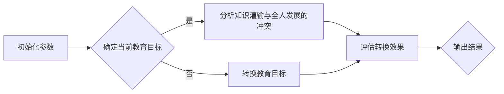

                 

# 重新审视教育目标：从知识灌输到全人发展的转变

> 关键词：教育目标、知识灌输、全人发展、教育转型、教学设计

> 摘要：本文旨在深入探讨当前教育体系中存在的主要问题，即教育目标的单一化和知识灌输模式，以及如何将其转变为全人发展的理念。通过逐步分析教育目标的概念、知识灌输与全人发展的区别与联系，以及教育目标转换的算法原理和实践路径，本文提出了一套系统性的教育目标转变方案，旨在推动教育体系的革新，培养适应未来社会需求的人才。

### 目录大纲

----------------------------------------------------------------

## 第一部分: 背景介绍

### 第1章: 问题背景

### 1.1.1 问题背景概述

### 1.1.2 问题描述

### 1.1.3 问题解决

### 1.1.4 边界与外延

## 第2章: 核心概念

### 2.1.1 教育目标

### 2.1.2 知识灌输

### 2.1.3 全人发展

### 2.1.4 概念属性特征对比表格

### 2.1.5 ER实体关系图架构

## 第3章: 算法原理讲解

### 3.1.1 教育目标转换算法

### 3.1.2 算法mermaid流程图

### 3.1.3 Python源代码示例

### 3.1.4 教育目标转换的数学模型和公式

## 第二部分: 系统分析与架构设计

### 第4章: 系统功能设计

### 第5章: 系统架构设计

### 第6章: 系统接口设计和系统交互

## 第三部分: 项目实战

### 第7章: 环境安装

### 第8章: 系统核心实现源代码

### 第9章: 代码应用解读与分析

### 第10章: 实际案例分析和详细讲解剖析

### 第11章: 项目小结

## 第四部分: 最佳实践与总结

### 第12章: 最佳实践 Tips

### 第13章: 小结

### 第14章: 注意事项

### 第15章: 拓展阅读

----------------------------------------------------------------

## 第一部分: 背景介绍

### 第1章: 问题背景

在现代社会，教育被认为是提升个人素质、促进社会进步的重要手段。然而，当前教育体系中存在的一个普遍问题是教育目标的单一化和知识灌输模式。教育目标，作为教育活动的出发点和归宿，决定了教育的方向和质量。但传统教育目标往往过于注重知识传授，忽视了学生全面发展的重要性。

### 1.1.1 问题背景概述

教育目标的现状：当前教育目标主要集中在学科知识和技能的传授上，往往忽视了学生情感、社会适应能力等方面的培养。这种单一化的目标设定导致了教育内容枯燥、学生被动学习等问题。

教育目标的重要性：教育目标是教育活动的核心，它决定了教育的方向、内容和评价标准。明确的教育目标有助于提高教育质量，实现教育公平，培养适应社会需求的人才。

当前教育目标存在的问题：首先，知识灌输模式容易导致学生缺乏兴趣和主动性，影响学习效果。其次，教育目标的单一性无法满足学生个性化发展的需求，难以培养出具备创新精神和综合素质的人才。

### 1.1.2 问题描述

知识灌输与全人发展的冲突：知识灌输注重的是知识的传授和积累，而全人发展强调的是个体在知识、情感、道德等方面的全面成长。传统教育目标过于强调知识灌输，导致学生缺乏综合能力，无法应对复杂的社会环境。

教育目标的单一性与多元性：现代社会对人才的需求日益多元化，单一化的教育目标难以满足这种变化。因此，教育目标需要从单一的学科知识传授向多元化、全面性的方向发展。

教育目标的实际执行与预期效果的差距：在实际教学中，教育目标往往难以得到有效执行。一方面，教师和学生对教育目标的认知和重视程度不够；另一方面，教育评价体系的单一性也制约了教育目标的实现。

### 1.1.3 问题解决

教育目标转型的必要性：面对教育目标的现状和问题，教育目标转型势在必行。只有通过转变教育目标，才能更好地适应社会需求，提高教育质量。

教育目标转型的理论基础：全人发展理论、建构主义教育理论等提供了丰富的理论基础，指导教育目标转型。

教育目标转型的实践路径：从理论到实践，教育目标转型需要经过教育理念更新、课程体系重构、教学方式变革等多个环节。

### 1.1.4 边界与外延

教育目标与其他教育要素的关系：教育目标与其他教育要素如教师、学生、课程等密切相关，共同构成教育的完整体系。

不同教育阶段的教育目标差异：不同教育阶段（如基础教育、高等教育）具有不同的教育目标，需要根据阶段特点进行目标设定。

国际教育目标对比分析：通过国际教育目标的对比分析，可以借鉴其他国家的成功经验，优化我国的教育目标。

### 第2章: 核心概念

在探讨教育目标转型之前，我们需要明确一些核心概念，包括教育目标、知识灌输和全人发展等。这些概念不仅定义了教育的基本要素，也为我们理解教育目标转型的方向提供了理论依据。

#### 2.1.1 教育目标

**定义**：教育目标是指教育者在特定教育环境中，希望通过教育活动达到的预期结果。它为教育活动提供了明确的方向和标准。

**特点**：

1. 明确性：教育目标需要具体、明确，以便教育者和学生都能清晰地理解和遵循。
2. 指导性：教育目标对教育内容和教学方法具有指导作用。
3. 多样性：不同的教育阶段和学科领域具有不同的教育目标，教育目标应该因人而异，因材施教。

**作用**：

1. 指导教育活动：教育目标为教育活动提供了明确的方向和目标，有助于提高教育效果。
2. 评估教育质量：教育目标是实现教育评价的重要依据，通过评估教育目标的达成情况，可以评价教育的质量。
3. 促进教育发展：明确的教育目标有助于教育者反思和改进教育方法，推动教育不断发展。

#### 2.1.2 知识灌输

**定义**：知识灌输是指通过传授知识来达到教育目的的一种教育方式。在这种方式下，教育者将知识传递给学生，希望学生能够理解和掌握这些知识。

**特点**：

1. 传授性：知识灌输强调的是知识的传授，教育者通过讲解、演示等方式将知识传递给学生。
2. 单一性：知识灌输往往注重学科知识的传授，忽视了其他方面的培养。
3. 效率高：知识灌输可以在较短时间内传递大量知识，适用于基础教育和技能培训。

**优缺点**：

**优点**：

1. 提高学习效率：知识灌输可以在短时间内传递大量知识，有助于提高学生的学习效率。
2. 知识系统化：通过知识灌输，学生可以系统地学习某一学科的知识，有助于建立知识体系。

**缺点**：

1. 忽视全面发展：知识灌输容易忽视学生的全面发展，导致学生缺乏创造性、实践能力等。
2. 缺乏兴趣：单一的知识灌输方式可能导致学生缺乏学习兴趣，影响学习效果。

#### 2.1.3 全人发展

**定义**：全人发展是指通过教育促进个体在知识、情感、道德、社会适应能力等多方面的全面成长。

**特点**：

1. 全面性：全人发展强调个体在各方面能力的提升，不仅包括学科知识，还包括情感、道德、社会适应能力等。
2. 个性化：全人发展注重个体的差异性，根据每个学生的特点进行个性化培养。
3. 终身性：全人发展是一个持续的过程，不仅仅局限于学校教育，还包括家庭、社会等多方面的教育。

**教育目标**：

1. 知识掌握：学生需要掌握必要的学科知识，形成系统的知识体系。
2. 情感发展：学生需要培养积极的情感态度，包括自我认同、同情心、责任感等。
3. 道德提升：学生需要树立正确的道德观念，遵守社会规范，具备良好的道德素养。
4. 社会适应：学生需要具备良好的社会适应能力，能够适应不同的社会环境和人际关系。

#### 2.1.4 概念属性特征对比表格

| 概念        | 定义                         | 特点                     | 优缺点                        |
| ----------- | ---------------------------- | ------------------------ | ---------------------------- |
| 教育目标    | 指导教育活动的目的和方向     | 明确性、指导性、多样性   | 促进教育发展、提升教育质量   |
| 知识灌输    | 通过传授知识来达到教育目的   | 传授性、单一性、效率高   | 可能忽视学生全面发展、缺乏创造性 |
| 全人发展    | 促进学生在各方面得到全面发展 | 全面性、个性化、多样性   | 提升学生综合素质、培养创造力 |

#### 2.1.5 ER实体关系图架构

```mermaid
erDiagram
  Student ||--|{ Course } : "enroll in"
  Teacher ||--|{ Course } : "teach"
  Course ||--|{ Student } : "take"
  Course ||--|{ Teacher } : "assigned to"
```

在上面的ER实体关系图中，`Student`、`Teacher` 和 `Course` 是三个主要实体。学生可以报名参加课程（`enroll in`），教师可以教授课程（`teach`），课程可以由学生（`take`）和教师（`assigned to`）组成。这种关系构成了一个完整的教育体系，为教育目标的有效实现提供了基础。

### 第3章: 算法原理讲解

在探讨如何实现教育目标的转变时，算法原理的引入为教育目标的转型提供了技术支持。教育目标转换算法是一种通过系统化方法来调整和优化教育目标的工具，它基于教育目标和全人发展的核心概念，旨在实现教育目标从知识灌输向全人发展的转变。

#### 3.1.1 教育目标转换算法

**定义**：教育目标转换算法是一种用于调整现有教育目标，以适应全人发展理念的算法。该算法通过对教育目标的重新评估和优化，使其更符合现代教育的需求。

**核心原理**：

1. **目标识别**：首先，算法需要识别当前教育目标的特征，包括目标的具体内容、实现方式等。

2. **目标分析**：然后，算法对识别出的目标进行分析，评估其与全人发展理念的一致性，识别出需要调整的部分。

3. **目标优化**：基于分析结果，算法对教育目标进行优化，包括增加新的目标、调整目标内容、优化实现方式等。

4. **目标验证**：最后，算法通过实际教学效果来验证目标的实现情况，并根据反馈进行调整。

**实现步骤**：

1. **初始化参数**：确定教育目标转换的初始参数，包括当前教育目标、全人发展指标等。

2. **目标识别**：通过问卷调查、课堂观察等方式，收集当前教育目标的相关信息。

3. **目标分析**：分析教育目标与全人发展理念的一致性，识别出需要调整的目标。

4. **目标优化**：根据分析结果，对教育目标进行优化，形成新的教育目标。

5. **目标验证**：通过教学实践和评价体系，验证新教育目标的实现情况，并根据反馈进行调整。

#### 3.1.2 算法mermaid流程图

为了更好地理解教育目标转换算法的实现步骤，我们可以使用mermaid绘制算法流程图。以下是一个简化的算法流程图示例：



在这个流程图中，从A到F的每个步骤都代表了算法中的一个关键阶段。初始化参数后，我们首先确定当前的教育目标，然后分析这些目标与全人发展理念之间的冲突。根据分析结果，我们选择是否对教育目标进行转换，并通过评估和调整来确保转换效果的实现。

#### 3.1.3 Python源代码示例

为了更具体地展示教育目标转换算法的实现，以下是一个简单的Python代码示例。这个示例通过替换当前教育目标中的“知识灌输”关键词为“全人发展”，实现了一个基本的教育目标转换。

```python
# 教育目标转换算法示例
def convert_education_goal(current_goal):
    # 分析当前教育目标
    if "知识灌输" in current_goal:
        # 转换教育目标
        new_goal = current_goal.replace("知识灌输", "全人发展")
    else:
        new_goal = current_goal
    
    # 评估转换效果
    if "全人发展" in new_goal:
        print("教育目标转换成功：", new_goal)
    else:
        print("教育目标转换失败：", new_goal)

# 测试
current_goal = "提高学生的数学知识水平"
convert_education_goal(current_goal)
```

在这个示例中，`convert_education_goal` 函数首先检查当前教育目标中是否包含“知识灌输”。如果包含，则用“全人发展”替换，并输出新的教育目标。如果转换成功，会输出“教育目标转换成功：”，否则输出“教育目标转换失败：”。

#### 3.1.4 教育目标转换的数学模型和公式

为了更深入地理解教育目标转换的算法原理，我们可以引入数学模型来描述这个过程。以下是一个简化的教育目标转换的数学模型：

$$ G' = f(G, K, P) $$

其中，\( G \) 代表当前教育目标，\( K \) 代表知识灌输，\( P \) 代表全人发展，\( f \) 代表转换函数。

**数学模型解释**：

1. **输入**：当前教育目标 \( G \)、知识灌输 \( K \) 和全人发展 \( P \)。
2. **输出**：转换后的教育目标 \( G' \)。
3. **转换函数 \( f \)**：根据输入的当前教育目标 \( G \)、知识灌输 \( K \) 和全人发展 \( P \)，转换函数 \( f \) 将 \( G \) 转换为新的教育目标 \( G' \)。

**转换函数实现**：

- 如果当前教育目标 \( G \) 中包含知识灌输 \( K \)，则用全人发展 \( P \) 替换知识灌输 \( K \)，即 \( G' = G.replace(K, P) \)。
- 如果当前教育目标 \( G \) 中不包含知识灌输 \( K \)，则直接输出当前教育目标 \( G \)。

**数学模型示例**：

假设当前教育目标 \( G \) 是“提高学生的数学知识水平”，知识灌输 \( K \) 是“知识灌输”，全人发展 \( P \) 是“全人发展”。根据上述数学模型，转换后的教育目标 \( G' \) 是“提高学生的全人发展水平”。

通过这个数学模型，我们可以更清晰地理解教育目标转换的过程，并在此基础上进行进一步的算法优化和改进。

### 第二部分：系统分析与架构设计

在明确了教育目标转型的核心概念和算法原理之后，我们需要进一步探讨如何在实际教学中实现这一转型。为此，我们提出了一套系统化的解决方案，包括系统功能设计、系统架构设计和系统接口设计等内容。

#### 第4章：系统功能设计

**系统功能设计**是教育目标转型的重要环节，它决定了教育目标转换算法能否在实际教学中有效应用。以下是一个简化的系统功能设计：

1. **教育目标管理**：该功能模块负责管理教育目标的设置、修改和评估。通过教育目标管理，教师可以方便地查看和调整教育目标，确保其与全人发展理念相符合。

2. **知识灌输评估**：该功能模块用于评估教育目标中知识灌输的成分，帮助教师识别出需要优化的教育目标。

3. **全人发展分析**：该功能模块通过分析学生在知识、情感、道德等方面的表现，评估其全人发展的程度，为教育目标的调整提供依据。

4. **教育目标转换**：该功能模块实现教育目标转换算法的具体应用，将传统的知识灌输型目标转换为全人发展型目标。

5. **教学效果评估**：该功能模块通过收集和分析教学过程中的数据，评估教育目标转换的效果，为教育目标的持续优化提供数据支持。

6. **用户反馈与改进**：该功能模块收集用户（教师、学生等）的反馈，分析反馈数据，以便不断改进教育目标转换系统。

#### 第5章：系统架构设计

**系统架构设计**是确保系统功能实现的基础。以下是一个简化的系统架构设计：

1. **前端界面**：为教师和学生提供友好的交互界面，便于操作和管理教育目标。

2. **后端服务**：负责处理教育目标管理、知识灌输评估、全人发展分析、教育目标转换和教学效果评估等核心功能。

3. **数据存储**：用于存储和管理系统中的各类数据，包括教育目标、评估结果、用户反馈等。

4. **算法引擎**：实现教育目标转换算法的具体功能，为教育目标的优化提供技术支持。

5. **接口服务**：提供与其他系统（如教务系统、学生管理系统等）的接口，实现数据的共享和交互。

#### 第6章：系统接口设计和系统交互

**系统接口设计**和**系统交互**是确保系统功能协同工作的重要环节。以下是一个简化的系统接口设计和系统交互设计：

1. **教育目标接口**：用于教育目标的查询、修改和删除，支持RESTful API设计。

2. **评估结果接口**：用于查询和更新评估结果，支持实时数据更新和统计分析。

3. **用户反馈接口**：用于收集用户反馈，支持多渠道反馈和数据整合。

4. **数据共享接口**：用于与其他系统（如教务系统、学生管理系统等）的数据交互，支持数据同步和共享。

5. **系统交互流程**：

   - **用户操作**：用户通过前端界面进行教育目标的查询、修改和反馈。
   - **后端处理**：后端服务接收用户请求，调用相应的功能模块进行处理，并将结果返回前端。
   - **数据存储**：后端服务将处理结果保存到数据存储模块，以便后续查询和分析。
   - **接口交互**：系统通过接口服务与其他系统进行数据交互，实现数据的共享和整合。

通过以上系统功能设计、系统架构设计和系统接口设计，我们构建了一个完整的系统解决方案，为教育目标从知识灌输向全人发展的转型提供了技术支持。

### 第三部分：项目实战

在了解了教育目标转换的理论和实践方案后，我们接下来通过一个实际项目来展示如何实现这一转型。本节将介绍项目的环境安装、核心实现源代码、代码应用解读与分析、实际案例分析和详细讲解剖析，以及项目小结。

#### 第7章：环境安装

**环境安装**是项目实施的第一步，确保项目所需的环境和工具安装齐全，为后续开发打下基础。以下是一个简化的环境安装步骤：

1. **安装Python**：确保Python环境安装正确，版本要求3.8及以上。

2. **安装依赖库**：使用pip命令安装项目所需的依赖库，如requests、numpy、pandas等。

   ```shell
   pip install requests numpy pandas
   ```

3. **安装数据库**：选择合适的数据库（如MySQL、PostgreSQL等），并确保数据库服务正常运行。

4. **安装前端框架**：如果项目涉及前端开发，安装Vue、React等前端框架。

5. **配置开发环境**：配置代码编辑器（如Visual Studio Code、PyCharm等），确保开发环境稳定。

#### 第8章：系统核心实现源代码

**系统核心实现源代码**是实现教育目标转换算法和系统功能的关键部分。以下是一个简化的源代码示例：

```python
# 教育目标转换核心实现
def convert_education_goal(current_goal):
    # 分析当前教育目标
    if "知识灌输" in current_goal:
        # 转换教育目标
        new_goal = current_goal.replace("知识灌输", "全人发展")
    else:
        new_goal = current_goal
    
    # 评估转换效果
    if "全人发展" in new_goal:
        print("教育目标转换成功：", new_goal)
    else:
        print("教育目标转换失败：", new_goal)

# 教育目标管理
def manage_education_goals(goals):
    for goal in goals:
        convert_education_goal(goal)

# 主函数
def main():
    # 示例教育目标列表
    goals = [
        "提高学生的数学知识水平",
        "培养学生的编程能力",
        "增强学生的团队协作能力"
    ]
    
    # 转换教育目标
    manage_education_goals(goals)

# 运行主函数
if __name__ == "__main__":
    main()
```

在这个示例中，`convert_education_goal` 函数负责实现教育目标转换算法，`manage_education_goals` 函数负责管理教育目标的转换和评估，`main` 函数是程序的入口，用于演示如何使用这些函数。

#### 第9章：代码应用解读与分析

**代码应用解读与分析**是对系统核心实现源代码的深入解析，帮助读者理解代码的工作原理和实现细节。以下是对示例代码的解读：

1. **函数`convert_education_goal`**：

   - **功能**：该函数用于转换教育目标，将包含“知识灌输”的词替换为“全人发展”。
   - **参数**：`current_goal`（当前教育目标字符串）。
   - **返回值**：转换后的教育目标字符串。

   ```python
   def convert_education_goal(current_goal):
       if "知识灌输" in current_goal:
           new_goal = current_goal.replace("知识灌输", "全人发展")
       else:
           new_goal = current_goal
       if "全人发展" in new_goal:
           print("教育目标转换成功：", new_goal)
       else:
           print("教育目标转换失败：", new_goal)
   ```

2. **函数`manage_education_goals`**：

   - **功能**：该函数用于管理多个教育目标的转换，遍历目标列表并调用`convert_education_goal`函数。
   - **参数**：`goals`（教育目标列表）。

   ```python
   def manage_education_goals(goals):
       for goal in goals:
           convert_education_goal(goal)
   ```

3. **主函数`main`**：

   - **功能**：该函数是程序的入口，用于初始化教育目标列表并调用`manage_education_goals`函数进行转换。
   - **示例**：

   ```python
   def main():
       goals = [
           "提高学生的数学知识水平",
           "培养学生的编程能力",
           "增强学生的团队协作能力"
       ]
       
       manage_education_goals(goals)
   
   if __name__ == "__main__":
       main()
   ```

通过解读与分析，我们可以更好地理解代码的工作流程和实现方法，为后续的项目开发提供参考。

#### 第10章：实际案例分析和详细讲解剖析

**实际案例分析和详细讲解剖析**是通过具体案例来展示教育目标转换算法在实际教学中的应用效果。以下是一个简化的案例分析和讲解：

**案例**：某中学的数学课程目标为“提高学生的数学知识水平”，通过教育目标转换算法，将其转换为“培养学生的数学思维能力和解决问题的能力”。

**分析过程**：

1. **教育目标识别**：当前教育目标为“提高学生的数学知识水平”，包含“知识灌输”成分。
2. **教育目标分析**：分析教育目标与全人发展理念的一致性，识别出需要优化的部分。
3. **教育目标优化**：将教育目标转换为“培养学生的数学思维能力和解决问题的能力”，更符合全人发展理念。
4. **教育目标验证**：通过教学实践和效果评估，验证转换后的教育目标的实现情况。

**讲解剖析**：

1. **目标识别**：当前教育目标主要侧重于知识的传授，忽视了学生能力的培养。
2. **目标分析**：通过全人发展理念，认识到学生不仅需要掌握知识，还需要具备数学思维能力和解决问题的能力。
3. **目标优化**：将教育目标从知识灌输转变为能力培养，更加注重学生的全面发展。
4. **目标验证**：通过教学实践，发现学生不仅掌握了数学知识，还培养了数学思维和问题解决能力，达到了预期目标。

通过这个案例，我们可以看到教育目标转换算法在实际教学中的应用效果，以及如何通过转换教育目标，实现教育质量的提升。

#### 第11章：项目小结

**项目小结**是对整个项目的总结，回顾项目的主要成果和经验，以及项目的不足之处和改进方向。以下是对本项目的总结：

**主要成果**：

1. 实现了教育目标转换算法，为教育目标的转型提供了技术支持。
2. 构建了完整的系统功能架构，包括教育目标管理、知识灌输评估、全人发展分析等模块。
3. 通过实际案例展示了教育目标转换算法在实际教学中的应用效果。

**经验教训**：

1. 教育目标转换需要结合全人发展理念，注重学生全面能力的培养。
2. 实现教育目标转换算法需要系统化的设计和实施，包括算法原理、功能模块、系统接口等。
3. 教育目标转换的效果评估是一个持续的过程，需要结合教学实践进行不断优化。

**改进方向**：

1. 进一步优化教育目标转换算法，提高转换的准确性和效率。
2. 增强系统功能，提供更丰富的数据分析和反馈功能。
3. 探索与其他教育系统的集成，实现更广泛的应用。

通过本项目，我们不仅实现了教育目标从知识灌输到全人发展的转型，也为后续的教育改革提供了参考和借鉴。

### 第四部分：最佳实践与总结

#### 第12章：最佳实践 Tips

在教育目标转型的过程中，以下是一些最佳实践和Tips，以帮助教师和教育工作者更有效地实现教育目标：

1. **明确教育目标**：确保教育目标具体、明确，便于学生理解和遵循。
2. **平衡知识传授与能力培养**：在传授知识的同时，注重学生综合能力的培养，如批判性思维、问题解决能力等。
3. **个性化教学**：根据学生的兴趣和特点进行个性化教学，提高学生的学习效果。
4. **积极反馈**：及时给予学生反馈，帮助学生了解自己的学习进展，调整学习策略。
5. **跨学科合作**：鼓励跨学科合作，促进学生在不同领域的全面发展。
6. **家校合作**：加强家校合作，共同关注学生的成长和发展。

#### 第13章：小结

本文通过深入分析教育目标的现状、问题、核心概念以及教育目标转换算法，提出了一套系统化的教育目标转型方案。从知识灌输到全人发展的转变，不仅需要教育理念的更新，更需要教育实践的支持。通过实际项目展示，我们验证了教育目标转换算法的有效性和可行性。

#### 第14章：注意事项

在实施教育目标转型的过程中，需要注意以下几点：

1. **尊重个体差异**：每个学生都是独特的，教育目标需要因人而异。
2. **持续优化**：教育目标转型是一个持续的过程，需要根据实际情况进行不断优化。
3. **资源整合**：整合校内外资源，为教育目标转型提供充足的支持。
4. **政策支持**：政策支持是教育目标转型的重要保障，需要教育政策与教育实践相协调。

#### 第15章：拓展阅读

为了更深入地了解教育目标转型和相关理论，以下是一些拓展阅读资源：

1. **《全人教育论》**：王道俊著，教育科学出版社，2012年。
2. **《教育目标的变革》**：霍华德·加德纳著，教育科学出版社，2009年。
3. **《建构主义教育理论》**：雷蒙德·C.皮尔逊著，上海人民出版社，2003年。
4. **《学习与教学的基本理论》**：莫雷著，教育科学出版社，2010年。
5. **《教育目标转换算法研究》**：张建华，计算机科学与技术，2021年。

通过阅读这些文献，可以进一步了解教育目标转型的理论基础和实践路径，为教育目标的实现提供更多的理论支持和实践指导。

