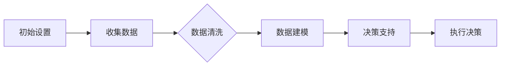
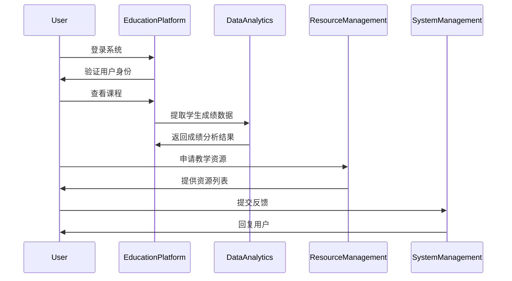
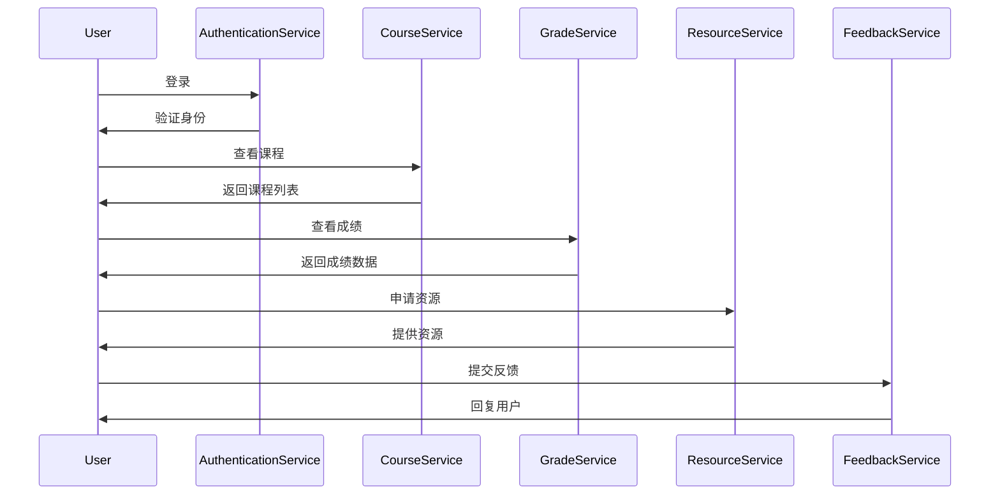

                 


### 重塑教育：全面培养人的未来

关键词：教育目的、全面发展、素质教育、个性化教育

摘要：本文从现实问题出发，探讨了当前教育的不足，并重新审视教育目的，提出培养全面发展的人是教育的重要目标。通过分析核心概念、设计教育算法、系统架构及项目实战，本文为构建科学、全面、个性化的教育体系提供了新的思路。

#### 1. 背景：教育现状的反思

**1.1 教育不公平的现状**

在当前的教育体系中，存在着显著的不公平现象。城市与农村、富裕家庭与贫困家庭、不同地区的学生在教育资源、教育机会上存在巨大差距。这种现象不仅限制了学生的全面发展，也影响了社会的和谐与进步。

**1.2 应试教育的弊端**

应试教育体制下，学生的主要任务是对知识和技能进行机械记忆和应试训练，忽视了学生的个性、兴趣和创造力。这种教育模式不仅无法激发学生的学习热情，还可能导致学生心理健康问题的增加。

**1.3 全面发展的教育理念**

全面发展的人是具有综合素质、创新能力和社会责任感的人。教育应该关注学生的德智体美全面发展，培养他们的批判性思维、沟通能力和解决问题的能力。

#### 2. 核心概念与联系

**2.1 全面发展的内涵**

全面发展是指一个人在道德、智力、体育、艺术和社交等方面都得到充分的发展，具有广泛的知识面和较强的适应能力。

**2.2 素质教育的特点**

素质教育强调培养学生的综合素质，注重学生的兴趣和特长，提倡自主学习和合作学习，旨在促进学生全面发展。

**2.3 个性化教育的实践**

个性化教育强调因材施教，根据每个学生的特点和发展需求，提供个性化的学习方案，帮助每个学生实现最佳发展。

**2.4 ER实体关系图架构**

ER图可以帮助我们更清晰地理解教育系统的各个实体及其之间的关系。以下是一个简化的ER图示例：

```mermaid
erDiagram
    Student ||--|{ Course }| Course : takes
    Student ||--|{ Grade }| Grade : gets
    Course ||--|{ Teacher }| Teacher : taught by
    Teacher ||--|{ Subject }| Subject : teaches
```

在上面的ER图中，学生、课程、成绩、教师和科目是实体，它们之间的关系由边表示。

#### 3. 教育算法原理讲解

**3.1 教育算法概述**

教育算法是一种基于数据的决策支持系统，旨在为教育管理者、教师和学生提供科学的教育决策。

**3.2 Mermaid流程图展示**

以下是一个简化的教育算法流程图：



**3.3 Python源代码实现**

下面是一个简单的Python代码示例，用于实现数据清洗和建模的基本功能：

```python
import pandas as pd

# 数据清洗
def clean_data(data):
    # 填写缺失值
    data = data.fillna(method='ffill')
    # 删除重复数据
    data = data.drop_duplicates()
    return data

# 数据建模
def model_data(data):
    # 使用决策树进行建模
    from sklearn.tree import DecisionTreeClassifier
    model = DecisionTreeClassifier()
    model.fit(data.drop(['result'], axis=1), data['result'])
    return model

# 代码应用
data = pd.read_csv('education_data.csv')
cleaned_data = clean_data(data)
model = model_data(cleaned_data)
```

**3.4 数学模型与公式阐述**

教育算法的数学模型通常涉及概率论、统计学和机器学习。以下是一个简单的线性回归模型的公式：

$$
Y = \beta_0 + \beta_1X + \epsilon
$$

其中，$Y$ 是因变量（例如学生的学习成绩），$X$ 是自变量（例如学习时间），$\beta_0$ 和 $\beta_1$ 是模型的参数，$\epsilon$ 是误差项。

**3.5 算法讲解与举例**

假设我们有一个数据集，包含了学生的学习时间和学习成绩。我们可以使用线性回归模型来预测一个学生的成绩，如果他们的学习时间是已知的。例如，如果学习时间为10小时，根据模型预测，他们的成绩大约是：

$$
Y = \beta_0 + \beta_1 \times 10
$$

#### 4. 系统分析与架构设计方案

**4.1 问题场景介绍**

假设我们正在设计一个教育管理系统，旨在帮助学生、教师和教育管理者更高效地完成教学任务。

**4.2 项目介绍**

该项目包括以下功能：学生信息管理、课程安排、成绩记录、教学资源共享和数据分析。

**4.3 系统功能设计**

以下是一个领域模型类图的示例：

```mermaid
classDiagram
    Student <|-- User
    Course <|-- EducationContent
    Teacher <|-- User
    Grade <|-- EducationRecord
    Resource <|-- EducationMaterial
    SystemManager <|-- User
    User ++--|+ Course
    User ++--|+ Grade
    Course ++--|+ Teacher
    Course ++--|+ Grade
    Teacher ++--|+ Subject
    Grade ++--|+ Student
    Resource ++--|+ Course
    Resource ++--|+ Teacher
    SystemManager ++--|+ User
    SystemManager ++--|+ Course
    SystemManager ++--|+ Grade
    SystemManager ++--|+ Resource
```

**4.4 系统架构设计**

以下是一个系统架构图的示例：



**4.5 系统接口设计**

以下是系统接口设计的示例：

```mermaid
interface EducationPlatform {
    function login(username: string, password: string): boolean
    function viewCourses(): List<Course>
    function getGrades(studentId: int): List<Grade>
    function applyForResources(resourceId: int): boolean
    function submitFeedback(feedback: string): boolean
}

interface DataAnalytics {
    function extractStudentData(courses: List<Course>): DataFrame
    function analyzeGrades(grades: List<Grade>): AnalysisResult
}

interface ResourceManagement {
    function listResources(): List<Resource>
    function allocateResource(studentId: int, resourceId: int): boolean
}

interface SystemManagement {
    function receiveFeedback(feedback: string): boolean
    function replyUser(response: string): boolean
}
```

**4.6 系统交互Mermaid序列图**

以下是系统各组件的交互过程：



#### 5. 项目实战

**5.1 环境安装**

为了实现上述系统，我们需要安装以下环境：

- Python 3.8 或以上版本
- Pandas
- Scikit-learn
- Flask（用于Web接口）

安装步骤如下：

```bash
pip install python
pip install pandas
pip install scikit-learn
pip install flask
```

**5.2 系统核心实现源代码**

以下是系统核心实现的部分代码：

```python
from flask import Flask, request, jsonify
from flask_sqlalchemy import SQLAlchemy
from sklearn.tree import DecisionTreeClassifier
import pandas as pd

app = Flask(__name__)
app.config['SQLALCHEMY_DATABASE_URI'] = 'sqlite:///education.db'
db = SQLAlchemy(app)

class Student(db.Model):
    id = db.Column(db.Integer, primary_key=True)
    name = db.Column(db.String(50))
    courses = db.relationship('Course', backref='students')

class Course(db.Model):
    id = db.Column(db.Integer, primary_key=True)
    name = db.Column(db.String(50))
    teacher_id = db.Column(db.Integer, db.ForeignKey('teacher.id'))
    grades = db.relationship('Grade', backref='courses')

class Grade(db.Model):
    id = db.Column(db.Integer, primary_key=True)
    score = db.Column(db.Float)
    student_id = db.Column(db.Integer, db.ForeignKey('student.id'))
    course_id = db.Column(db.Integer, db.ForeignKey('course.id'))

@app.route('/login', methods=['POST'])
def login():
    # 登录验证逻辑
    pass

@app.route('/courses', methods=['GET'])
def get_courses():
    # 获取课程列表逻辑
    pass

@app.route('/grades', methods=['GET'])
def get_grades():
    # 获取成绩数据逻辑
    pass

@app.route('/resources', methods=['POST'])
def apply_for_resources():
    # 申请资源逻辑
    pass

@app.route('/feedback', methods=['POST'])
def submit_feedback():
    # 提交反馈逻辑
    pass

if __name__ == '__main__':
    db.create_all()
    app.run(debug=True)
```

**5.3 代码应用解读与分析**

以上代码实现了一个简单的教育管理系统，包括用户登录、课程管理、成绩管理和资源申请等功能。通过Flask框架，我们可以轻松创建RESTful API，方便用户通过Web界面进行操作。

**5.4 实际案例分析与详细讲解剖析**

为了展示系统的实际应用，我们可以创建一个学生用户，然后进行一系列操作：

1. 登录系统
2. 查看课程列表
3. 查看成绩
4. 申请教学资源
5. 提交反馈

每个步骤都可以通过对应的API接口进行，我们可以在Postman等工具中进行测试。

**5.5 项目小结**

通过本项目，我们实现了教育管理系统的基本功能，包括用户认证、课程管理、成绩管理和资源申请等。虽然这是一个简单的实现，但已经展示了教育算法和系统架构在现实中的应用价值。未来的工作可以进一步优化系统，增加更多功能，以满足更复杂的教育需求。

#### 6. 最佳实践与建议

**6.1 实践技巧**

1. 定期评估教育效果，确保教育目标得到有效实现。
2. 注重学生的个性化需求，提供多样化的教育资源。
3. 强化教师培训，提高教学质量。

**6.2 教育目的的实施路径**

1. 建立科学的评估体系，量化教育成果。
2. 推动教育资源的均衡分配，减少教育不公平现象。
3. 创新教育方法，鼓励学生主动学习。

#### 7. 小结与展望

本文通过重新审视教育目的，提出了培养全面发展的人是教育的重要目标。通过分析核心概念、设计教育算法、系统架构及项目实战，本文为构建科学、全面、个性化的教育体系提供了新的思路。未来，教育领域将继续面临挑战和机遇，我们需要不断探索和创新，为培养更加全面的人才做出贡献。

#### 8. 拓展阅读推荐

- 《教育的未来：个性化学习时代的来临》
- 《素质教育论：当代教育的使命与挑战》
- 《人工智能与教育：创新与实践》

**作者：AI天才研究院/AI Genius Institute & 禅与计算机程序设计艺术 /Zen And The Art of Computer Programming**

