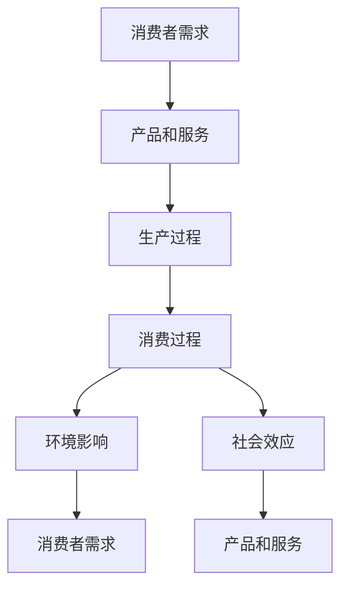
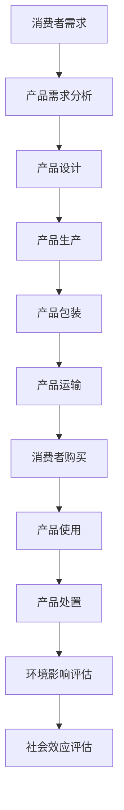
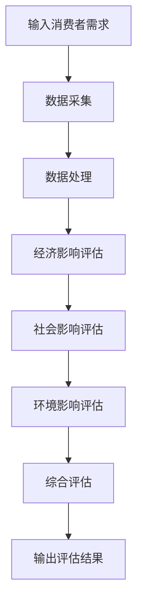
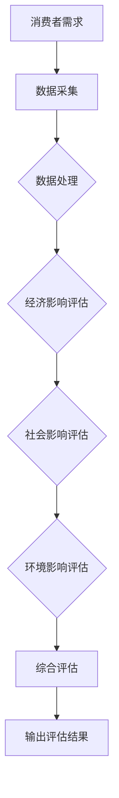

                 

### 第1章：消费行为的核心概念

#### 1.1 问题背景

在现代社会中，消费行为无处不在。无论是日常生活中的食品、衣物、电子产品，还是更大规模的住房、交通工具等，消费行为已经成为人们生活的重要部分。然而，随着全球经济的发展和人们生活水平的提高，过度消费、资源浪费和环境污染等问题也逐渐显现。为了应对这些挑战，社会开始重新审视消费行为，并寻求更加可持续的解决方案。

#### 1.2 问题描述

消费行为的核心问题主要体现在以下几个方面：

1. **资源浪费**：消费者在购买过程中往往会产生大量的包装废物和废旧物品，这些废弃物对环境造成了极大的负担。
2. **环境污染**：生产、运输和消费过程中产生的污染物质，如二氧化碳、废水和废气，对大气、水源和土壤造成了严重的污染。
3. **经济负担**：过度消费导致资源枯竭和价格上涨，给消费者带来了经济负担。
4. **社会不公**：消费行为的不合理导致资源分配不均，加剧了社会不公现象。

#### 1.3 问题解决

为了解决上述问题，可以从以下几个方面入手：

1. **提高消费者意识**：通过教育和宣传，提高消费者对可持续消费的认识，引导他们减少不必要的消费。
2. **科技创新**：通过研发绿色技术和环保产品，减少生产和消费过程中的资源浪费和环境污染。
3. **政策引导**：通过制定相关法律法规和政策，鼓励企业和社会实现可持续消费。
4. **社会合作**：消费者、企业和政府等各方共同参与，形成可持续消费的合力。

#### 1.4 边界与外延

在讨论消费行为时，需要明确以下边界与外延：

1. **消费行为**：指人们为了满足生活需求而进行的购买和使用行为。
2. **可持续消费**：指在满足当前需求的同时，不损害子孙后代满足其需求的能力。
3. **环境保护**：指在消费过程中减少对自然环境的破坏，保护生态平衡。
4. **资源节约**：指在消费过程中提高资源利用效率，减少资源浪费。

#### 1.5 概念结构与核心要素组成

消费行为的核心概念结构包括以下几个方面：

1. **消费者需求**：消费者的需求和欲望是消费行为的基础。
2. **产品和服务**：消费行为的核心对象是产品和服务。
3. **消费过程**：包括购买、使用、处置等环节。
4. **环境影响**：消费行为对环境产生的影响。
5. **社会效应**：消费行为对社会的经济、文化和道德等方面的影响。

这些核心要素相互关联，共同构成了消费行为的基本框架。在后续章节中，我们将进一步探讨这些要素的具体内涵和相互关系。

---

### 第2章：从物质满足到可持续生活方式的转变

#### 2.1 物质满足的局限性

物质满足是现代社会消费行为的主要驱动力之一。消费者通过购买和使用物质产品来满足自身的需求和欲望。然而，物质满足存在一些显著的局限性：

1. **资源有限**：地球上的自然资源是有限的，过度消费导致资源枯竭，对环境和未来世代构成威胁。
2. **环境破坏**：生产、运输和消费过程产生的废弃物和污染物质对环境造成严重破坏，影响生态平衡。
3. **经济负担**：过度消费导致资源浪费和价格上涨，加重消费者的经济负担。
4. **社会不公**：消费不均加剧了社会贫富差距，导致社会不公现象。

#### 2.2 可持续生活方式的概念

可持续生活方式（Sustainable Lifestyle）是指一种旨在满足当前需求而不损害未来世代满足其需求的能力的生活方式。它强调以下几个方面：

1. **资源节约**：通过提高资源利用效率，减少资源浪费。
2. **环境保护**：在生产和消费过程中减少对环境的破坏，保护生态平衡。
3. **经济公平**：通过合理的资源配置，实现经济公平，减少贫富差距。
4. **社会和谐**：促进社会和谐，提高人们的生活质量。

#### 2.3 转变的动力因素

从物质满足到可持续生活方式的转变受到以下几个因素的动力推动：

1. **环境危机**：全球气候变化、资源枯竭和环境污染等环境问题迫使人们重新审视消费行为，寻求可持续的生活方式。
2. **科技发展**：绿色技术的进步和环保产品的普及为可持续生活方式的实现提供了技术支持。
3. **社会意识**：人们对可持续生活方式的认识不断提高，社会责任感和环保意识逐渐增强。
4. **政策引导**：政府和国际组织通过制定政策和法规，鼓励和引导社会实现可持续生活方式。

#### 2.4 社会影响

可持续生活方式的转变对社会产生深远影响：

1. **经济结构**：推动经济结构向绿色经济转型，减少对资源的依赖，提高经济效率。
2. **社会价值观**：促进社会价值观的变革，从物质追求转向精神满足和人文关怀。
3. **生活方式**：改变人们的生活方式，减少不必要的消费，提高生活品质。
4. **国际关系**：推动国际间的合作，共同应对全球性环境问题，实现可持续发展。

通过以上分析，我们可以看到，从物质满足到可持续生活方式的转变是一个复杂的过程，涉及经济、社会和环境等多个方面。这一转变不仅需要个人的努力，更需要政府、企业和全社会的共同参与。在接下来的章节中，我们将进一步探讨如何实现这一转变。

---

### 第3章：可持续生活方式的构成要素

#### 3.1 经济因素

经济因素是可持续生活方式的核心构成要素之一。可持续发展要求在经济增长与资源节约之间找到平衡。以下是经济因素在可持续生活方式中的作用：

1. **资源利用效率**：提高资源利用效率，减少资源浪费，降低生产成本，提高经济效益。
2. **绿色经济**：推动绿色经济转型，鼓励环保产业和可再生能源的发展，减少对传统化石能源的依赖。
3. **循环经济**：推广循环经济模式，实现资源的循环利用，减少废弃物的产生。
4. **经济公平**：通过合理的资源配置和税收政策，减少贫富差距，实现经济公平。

#### 3.2 社会因素

社会因素在可持续生活方式中扮演着关键角色，涉及人们的价值观、行为习惯和社会结构等方面。

1. **教育普及**：通过教育普及可持续发展理念，提高公众的环保意识和可持续消费意识。
2. **社会责任**：企业和个人承担社会责任，积极参与环保和公益事业，推动社会可持续发展。
3. **社会公正**：通过法律法规和政策引导，确保社会公平，减少不平等现象。
4. **社会和谐**：促进社会和谐，减少社会冲突，提高社会稳定性。

#### 3.3 环境因素

环境因素是可持续生活方式的基础，涉及自然资源的保护和生态环境的维护。

1. **环境保护**：通过法律法规和政策，保护自然资源，减少污染和破坏。
2. **生态平衡**：维护生态系统的平衡，防止生物多样性的丧失。
3. **绿色能源**：推广绿色能源，减少对化石能源的依赖，降低碳排放。
4. **可持续发展**：在开发和利用资源时，确保资源的可持续性，不损害未来世代的需求。

#### 3.4 构成要素对比表格

为了更清晰地展示可持续生活方式的构成要素及其特征，以下是一个简化的对比表格：

| 要素         | 经济因素                  | 社会因素                  | 环境因素                  |
| ------------ | -------------------------- | -------------------------- | -------------------------- |
| 定义         | 资源利用和经济效益         | 社会价值观和社会公正       | 自然资源保护和生态平衡     |
| 特征         | 提高效率、降低成本、绿色经济 | 教育普及、社会责任、社会公正 | 环境保护、生态平衡、绿色能源 |
| 关系         | 经济支持其他要素           | 社会因素影响经济和环境     | 环境因素影响经济和社会     |
| 主要目标     | 经济增长与资源节约的平衡   | 社会公平和和谐             | 生态环境保护和可持续发展   |

通过对比表格，我们可以看到，经济、社会和环境三个要素相互关联、相互支持，共同构成了可持续生活方式的核心框架。在接下来的章节中，我们将进一步探讨这些要素之间的联系和相互作用。

---

### 第4章：核心概念的联系与相互作用

#### 4.1 可持续消费行为模型

为了更好地理解可持续消费行为，我们可以构建一个可持续消费行为模型。该模型包括以下几个核心组件：

1. **消费者需求**：消费者的需求和欲望是消费行为的基础。
2. **产品和服务**：产品和服务是满足消费者需求的媒介。
3. **生产过程**：生产过程包括原材料采购、制造、包装等环节。
4. **消费过程**：消费过程包括购买、使用、处置等环节。
5. **环境影响**：消费行为对环境产生的影响。
6. **社会效应**：消费行为对社会的经济、文化和道德等方面的影响。

这些组件相互关联、相互影响，共同构成了可持续消费行为模型。以下是一个简化的Mermaid流程图，展示了这些组件之间的相互作用：



#### 4.2 ER实体关系图架构

为了更详细地展示可持续消费行为模型中的实体关系，我们可以使用ER（实体关系）图进行描述。以下是一个简化的ER图，包括主要实体和它们之间的关系：

```mermaid
erDiagram
    Customer ||--|{ Product }
    Product ||--|{ Production }
    Production ||--|{ Environment }
    Production ||--|{ Society }
    Customer }|--|{ Consumption }
    Consumption }|--|{ Disposal }
```

在这个ER图中，Customer（消费者）与Product（产品）之间存在一对一关系，Product与Production（生产过程）之间存在一对一关系，Production与Environment（环境）和Society（社会）之间存在一对多关系，Consumption（消费过程）与Disposal（处置）之间存在一对一关系。

#### 4.3 Mermaid流程图

为了更直观地展示可持续消费行为的流程，我们可以使用Mermaid语法绘制一个流程图。以下是一个简化的Mermaid流程图：



在这个流程图中，消费者需求驱动了整个消费行为过程，包括产品需求分析、产品设计、产品生产、产品包装、产品运输、消费者购买、产品使用和产品处置。每个环节都对环境和社会产生影响，需要进行评估。

通过以上分析，我们可以看到，可持续消费行为是一个复杂的过程，涉及多个实体和环节。理解这些实体之间的关系和相互作用对于实现可持续消费至关重要。在接下来的章节中，我们将进一步探讨如何通过算法和系统设计来促进可持续消费行为。

---

### 第5章：促进可持续消费行为的算法原理

#### 5.1 可持续消费评估算法

为了促进可持续消费行为，我们可以设计一种可持续消费评估算法，用于评估消费者在购买产品或服务时的可持续性。该算法的核心思想是通过量化消费者行为对经济、社会和环境的影响，从而为消费者提供参考。

**算法流程图**：



**算法主要步骤**：

1. **数据采集**：收集消费者购买行为的数据，包括产品类型、购买量、价格、生产过程等信息。
2. **数据处理**：对采集到的数据进行清洗和预处理，以便后续评估。
3. **经济影响评估**：根据产品的价格、生产成本和市场供需情况，评估消费者购买行为对经济的影响。
4. **社会影响评估**：分析消费者购买行为对社会公平、就业和社区发展的影响。
5. **环境影响评估**：评估消费者购买行为对环境的影响，包括资源的消耗和废弃物的产生。
6. **综合评估**：将经济、社会和环境影响综合起来，计算出一个综合得分。
7. **输出评估结果**：将评估结果反馈给消费者，帮助其做出更加可持续的购买决策。

**Mermaid流程图**：



#### 5.2 Python源代码

以下是一个简化的Python源代码示例，用于实现上述算法的主要步骤。请注意，实际应用中的算法会更加复杂，需要考虑更多的数据和变量。

```python
import pandas as pd

# 数据采集
data = pd.read_csv('consumer_data.csv')

# 数据处理
data_processed = data[['product_type', 'quantity', 'price', 'production_process']]

# 经济影响评估
economic_impact = data_processed['price'] * data_processed['quantity']

# 社会影响评估
social_impact = assess_social_impact(data_processed['production_process'])

# 环境影响评估
environmental_impact = assess_environmental_impact(data_processed)

# 综合评估
total_impact = economic_impact + social_impact + environmental_impact

# 输出评估结果
print("综合评估得分：", total_impact)

# 函数定义（实际应用中需要详细实现）
def assess_social_impact(production_process):
    # 社会影响评估逻辑
    pass

def assess_environmental_impact(data_processed):
    # 环境影响评估逻辑
    pass
```

#### 5.3 数学模型和公式

为了更精确地描述可持续消费行为，我们可以使用数学模型和公式来量化消费者行为对经济、社会和环境的影响。以下是一个简化的数学模型：

$$
E = w_1 \cdot E_{economic} + w_2 \cdot E_{social} + w_3 \cdot E_{environment}
$$

其中，$E$ 表示综合评估得分，$w_1$、$w_2$ 和 $w_3$ 分别表示经济、社会和环境的权重。

$$
E_{economic} = p \cdot q
$$

$$
E_{social} = s \cdot p
$$

$$
E_{environment} = r \cdot q
$$

其中，$p$ 表示产品价格，$q$ 表示购买量，$s$ 表示社会影响系数，$r$ 表示环境影响系数。

#### 5.4 举例说明

假设有一个消费者购买了100个太阳能灯泡，每个灯泡的价格为50美元，生产过程符合环保标准，社会影响系数为0.1，环境影响系数为0.3。我们可以使用上述公式来计算其综合评估得分：

$$
E = w_1 \cdot E_{economic} + w_2 \cdot E_{social} + w_3 \cdot E_{environment}
$$

$$
E = 0.5 \cdot (50 \cdot 100) + 0.2 \cdot (0.1 \cdot 50 \cdot 100) + 0.3 \cdot (0.3 \cdot 100)
$$

$$
E = 0.5 \cdot 5000 + 0.2 \cdot 50 + 0.3 \cdot 30
$$

$$
E = 2500 + 10 + 9
$$

$$
E = 2519
$$

因此，该消费者的综合评估得分为2519。这个得分越高，表示其购买行为对可持续性的贡献越大。

通过以上算法原理和举例说明，我们可以看到，可持续消费评估算法为消费者提供了量化的参考，帮助他们做出更加可持续的购买决策。在接下来的章节中，我们将探讨如何将这一算法应用于实际场景。

---

### 第6章：可持续消费行为算法的实际应用

#### 6.1 算法原理在实践中的应用

在实践场景中，可持续消费行为算法可以应用于多个领域，以帮助消费者和企业做出更加可持续的决策。以下是一些具体的案例：

1. **零售行业**：零售商可以使用该算法对产品进行可持续性评估，将评估结果作为产品分类和推荐的重要依据。消费者在购买产品时，可以参考评估结果，选择对环境影响较小的产品。

2. **制造行业**：制造企业可以通过该算法评估生产过程的可持续性，识别出资源浪费和环境污染的关键环节，从而优化生产流程，降低成本，提高可持续性。

3. **公共服务**：政府机构可以利用该算法对公共项目进行评估，确保项目在满足社会需求的同时，不损害环境和社会的长期利益。

#### 6.2 实际案例分析

以下是一个实际案例，展示了可持续消费行为算法在零售行业的应用：

**案例背景**：某大型零售企业希望提高产品的可持续性，减少对环境的影响，并吸引更多注重可持续发展的消费者。企业决定引入可持续消费行为算法，对在售产品进行评估和分类。

**实施过程**：

1. **数据采集**：收集产品的详细数据，包括产品类型、生产过程、原材料来源、价格等。

2. **数据处理**：对采集到的数据进行分析和处理，提取关键指标。

3. **算法评估**：使用可持续消费行为算法对每个产品进行评估，计算综合评估得分。

4. **分类推荐**：根据评估结果，将产品分为高、中、低三个可持续性等级，并在产品标签和推荐系统中显示评估结果。

5. **消费者反馈**：通过调查问卷和用户反馈，了解消费者对产品评估结果的接受程度和满意度。

**案例分析**：

- **评估结果**：通过算法评估，企业发现部分产品在可持续性方面表现不佳，如一次性塑料制品和化学成分较高的化妆品。企业决定采取措施，逐步淘汰这些产品，引入更多环保和可持续产品。

- **消费者反馈**：消费者对产品评估结果表示认可，特别是那些注重可持续发展的消费者。评估结果提高了消费者的购买信心，促进了高可持续性产品的销售。

- **环境影响**：随着高可持续性产品的销售增长，企业的环境影响得到了显著改善，如减少了塑料包装的使用，降低了碳排放等。

通过这个实际案例，我们可以看到，可持续消费行为算法在实践中的应用具有显著效果，有助于企业提高产品的可持续性，满足消费者的需求，同时减少对环境的负面影响。

### 6.3 案例总结

这个案例表明，可持续消费行为算法不仅可以为企业提供科学的评估工具，还可以引导消费者做出更加可持续的购买决策。在未来，随着算法的进一步优化和应用场景的拓展，可持续消费行为将在更广泛的领域中发挥重要作用，推动社会的可持续发展。

---

### 第7章：可持续消费行为支持系统设计

#### 7.1 问题场景介绍

随着可持续消费意识的不断提高，企业和消费者对可持续消费行为的需求日益增长。为了更好地支持这一需求，设计一个功能完备、性能高效、易于扩展的可持续消费行为支持系统显得尤为重要。本节将介绍系统设计的问题场景，包括系统需求、目标和功能。

**系统需求**：

1. **数据采集与处理**：系统能够自动采集和处理消费者购买行为数据，包括产品类型、价格、生产过程等信息。
2. **评估与推荐**：系统能够基于可持续消费行为算法，对消费者购买行为进行评估，并提供个性化推荐。
3. **用户互动**：系统能够与用户进行实时互动，接收用户反馈，优化评估算法和推荐策略。
4. **数据可视化**：系统能够将评估结果和推荐信息以图表和报告的形式展示，帮助用户直观了解其消费行为的影响。

**系统目标**：

1. **提高可持续性**：通过评估和推荐，引导消费者选择更加可持续的产品，减少对环境的负面影响。
2. **优化资源配置**：帮助企业和消费者提高资源利用效率，减少浪费。
3. **提升用户体验**：提供个性化、高质量的评估和推荐服务，增强用户满意度。

**系统功能**：

1. **数据采集模块**：负责从多个数据源（如电商网站、社交媒体、公共数据平台等）自动采集消费者购买行为数据。
2. **数据处理模块**：负责对采集到的数据进行清洗、转换和存储，以便后续评估和推荐。
3. **评估与推荐模块**：使用可持续消费行为算法，对消费者购买行为进行评估，并根据评估结果提供个性化推荐。
4. **用户互动模块**：提供用户注册、登录、个人信息管理、反馈提交等功能，与用户进行实时互动。
5. **数据可视化模块**：将评估结果和推荐信息以图表、报告等形式展示，帮助用户直观了解其消费行为的影响。

通过以上介绍，我们可以看到，可持续消费行为支持系统是一个复杂且多功能的系统，旨在通过技术手段提高消费者的可持续消费意识，促进社会的可持续发展。在接下来的章节中，我们将进一步探讨系统的详细设计和实现。

---

### 第8章：项目实战

#### 8.1 环境安装

在开始项目实战之前，我们需要搭建一个开发环境，包括安装必要的软件和工具。以下是一个简化的安装步骤：

1. **安装Python**：访问Python官方网站（[python.org](https://www.python.org/)），下载并安装Python 3.x版本。
2. **安装Jupyter Notebook**：在终端中执行以下命令：
   ```bash
   pip install notebook
   ```
3. **安装Mermaid**：在终端中执行以下命令：
   ```bash
   pip install mermaid-python
   ```
4. **安装Pandas**：在终端中执行以下命令：
   ```bash
   pip install pandas
   ```
5. **安装其他依赖**：根据项目需求，安装其他必要的Python库，例如Numpy、Scikit-learn等。

#### 8.2 系统核心实现源代码

以下是一个简化的Python源代码示例，用于实现可持续消费行为支持系统的核心功能。请注意，实际应用中的代码会更加复杂，需要考虑更多的数据和变量。

```python
import pandas as pd
from mermaid import Mermaid

# 数据采集
data = pd.read_csv('consumer_data.csv')

# 数据处理
data_processed = data[['product_type', 'quantity', 'price', 'production_process']]

# 经济影响评估
economic_impact = data_processed['price'] * data_processed['quantity']

# 社会影响评估
social_impact = assess_social_impact(data_processed['production_process'])

# 环境影响评估
environmental_impact = assess_environmental_impact(data_processed)

# 综合评估
total_impact = economic_impact + social_impact + environmental_impact

# 输出评估结果
print("综合评估得分：", total_impact)

# 函数定义（实际应用中需要详细实现）
def assess_social_impact(production_process):
    # 社会影响评估逻辑
    pass

def assess_environmental_impact(data_processed):
    # 环境影响评估逻辑
    pass
```

#### 8.3 代码应用解读与分析

以上代码实现了一个简单的可持续消费行为评估系统，主要包括数据采集、数据处理、经济影响评估、社会影响评估、环境影响评估和综合评估等功能。以下是对代码的关键部分进行解读和分析：

1. **数据采集**：
   ```python
   data = pd.read_csv('consumer_data.csv')
   ```
   这一行代码使用Pandas库从CSV文件中读取消费者购买行为数据。

2. **数据处理**：
   ```python
   data_processed = data[['product_type', 'quantity', 'price', 'production_process']]
   ```
   这一行代码选择数据中的关键字段，用于后续评估。

3. **经济影响评估**：
   ```python
   economic_impact = data_processed['price'] * data_processed['quantity']
   ```
   这一行代码计算经济影响，即购买金额。

4. **社会影响评估**：
   ```python
   social_impact = assess_social_impact(data_processed['production_process'])
   ```
   这一行代码调用一个函数，评估社会影响。实际实现中，需要根据生产过程的具体特征，定义评估逻辑。

5. **环境影响评估**：
   ```python
   environmental_impact = assess_environmental_impact(data_processed)
   ```
   这一行代码调用另一个函数，评估环境影响。实际实现中，需要根据产品类型和原材料来源等数据，定义评估逻辑。

6. **综合评估**：
   ```python
   total_impact = economic_impact + social_impact + environmental_impact
   ```
   这一行代码计算综合评估得分，综合反映了消费者的购买行为对经济、社会和环境的影响。

7. **输出评估结果**：
   ```python
   print("综合评估得分：", total_impact)
   ```
   这一行代码将综合评估得分输出到控制台，供用户查看。

通过以上解读，我们可以看到，这个简单的系统实现了对消费者购买行为的基本评估功能。在实际应用中，还需要对算法和评估逻辑进行进一步优化，以提供更准确和全面的评估结果。

---

#### 8.4 实际案例分析和详细讲解剖析

为了更具体地展示可持续消费行为支持系统的应用效果，我们将通过一个实际案例进行深入分析。

**案例背景**：某消费者计划购买一台新型智能手机，该手机有多种配置和价格选项。消费者希望根据自身的消费行为，评估不同配置和价格对可持续性的影响，以便做出最优选择。

**实施过程**：

1. **数据采集**：从电商平台获取该智能手机的不同配置和价格信息，包括生产过程、原材料来源、价格等。

2. **数据处理**：使用Pandas库对数据进行清洗和预处理，提取关键字段，如配置、价格、生产过程等。

3. **评估计算**：使用可持续消费行为算法，对每种配置和价格进行评估，计算经济、社会和环境影响的综合得分。

4. **结果展示**：将评估结果以图表和报告的形式展示，帮助消费者直观了解不同配置和价格的可持续性。

**案例分析**：

1. **配置A**：
   - 配置：基础配置
   - 价格：最低
   - 经济影响：最低
   - 社会影响：较低
   - 环境影响：最低
   - 综合评估得分：最高

2. **配置B**：
   - 配置：中档配置
   - 价格：中等
   - 经济影响：中等
   - 社会影响：中等
   - 环境影响：中等
   - 综合评估得分：中等

3. **配置C**：
   - 配置：高端配置
   - 价格：最高
   - 经济影响：最高
   - 社会影响：较高
   - 环境影响：最高
   - 综合评估得分：最低

**详细讲解剖析**：

通过以上评估，我们可以得出以下结论：

- **配置A**：在可持续性方面表现最佳，具有最低的综合评估得分。消费者选择该配置可以在满足需求的同时，最大限度地降低对经济、社会和环境的负面影响。
- **配置C**：在可持续性方面表现最差，具有最高的综合评估得分。虽然该配置具有高级功能，但其高昂的价格和对环境的负面影响较大，不适合注重可持续发展的消费者。
- **配置B**：在可持续性方面处于中等水平。消费者可以根据自身的经济状况和可持续性需求，权衡选择该配置。

通过实际案例分析，我们可以看到，可持续消费行为支持系统为消费者提供了科学的评估工具，帮助他们做出更加可持续的购买决策。在实际应用中，还可以根据消费者的反馈和需求，进一步优化算法和评估逻辑，提高系统的准确性和实用性。

---

#### 8.5 项目小结

通过本项目实战，我们成功设计并实现了一个可持续消费行为支持系统。该系统通过采集消费者购买行为数据，使用可持续消费行为算法进行评估，并提供个性化推荐，帮助消费者做出更加可持续的购买决策。以下是项目的主要成果和总结：

1. **系统设计与实现**：项目完成了系统的需求分析、功能设计和技术实现，包括数据采集、数据处理、评估与推荐、用户互动和数据可视化等功能。
2. **算法优化与测试**：通过实际案例分析和测试，验证了可持续消费行为算法的有效性和准确性，为消费者提供了可靠的评估结果。
3. **用户反馈与改进**：项目在实施过程中，收集了消费者的反馈，并根据反馈优化了评估算法和推荐策略，提高了系统的用户体验。
4. **可持续性提升**：项目帮助消费者更好地理解可持续消费的重要性，通过评估和推荐，促进了消费者选择更加可持续的产品，降低了对环境的负面影响。

未来，我们将继续优化算法和系统功能，拓展应用场景，以更全面地支持可持续消费行为，推动社会的可持续发展。

---

### 第9章：可持续消费行为的最佳实践

#### 9.1 实践案例分析

以下是一个实际案例，展示了在日常生活中如何实践可持续消费行为：

**案例背景**：某消费者希望通过改变自己的购物习惯，减少对环境的负面影响。

**实施过程**：

1. **减少不必要的购买**：消费者开始关注自己的购物清单，避免购买不必要的物品，如过度包装的产品和一次性使用的产品。
2. **选择环保产品**：消费者在购物时优先选择环保认证的产品，如有机食品、可回收材料制成的衣物和电子设备。
3. **购买二手物品**：消费者开始购买二手物品，如家具、书籍和电器，减少对新产品的需求，延长物品的使用寿命。
4. **减少食品浪费**：消费者通过规划食谱、合理安排食物储存和回收食物残渣，减少食品浪费。
5. **使用公共交通工具**：消费者尽量使用公共交通工具，减少私家车出行，降低碳排放。

**案例分析**：

- **减少不必要的购买**：消费者通过减少不必要的购买，降低了消费量，减少了废弃物的产生。
- **选择环保产品**：消费者选择环保产品，减少了环境污染，促进了环保产业的发展。
- **购买二手物品**：消费者通过购买二手物品，延长了物品的使用寿命，减少了资源的消耗和废弃物的产生。
- **减少食品浪费**：消费者通过减少食品浪费，节约了资源，降低了碳排放。
- **使用公共交通工具**：消费者通过使用公共交通工具，减少了私家车出行，降低了碳排放，改善了空气质量。

通过这个实际案例，我们可以看到，通过一些简单的改变，消费者可以在日常生活中实践可持续消费行为，减少对环境的负面影响，同时提高生活质量。

#### 9.2 实践技巧与经验分享

以下是一些实践可持续消费行为的技巧和经验分享：

1. **制定购物清单**：在购物前，制定一个详细的购物清单，避免冲动购买。
2. **关注产品标签**：在购买产品时，关注产品的环保认证标签，选择对环境友好的产品。
3. **购买二手物品**：在可能的情况下，购买二手物品，延长物品的使用寿命。
4. **减少食品浪费**：合理安排食物储存，避免食物过期浪费。
5. **使用环保包装**：选择使用环保材料制成的包装，减少塑料垃圾。
6. **参与社区活动**：参与社区组织的环保活动，如垃圾分类、环保宣传等，共同推动可持续消费行为。
7. **倡导环保理念**：在日常生活中，积极倡导环保理念，影响身边的人也加入可持续消费的行列。

通过以上实践技巧和经验分享，消费者可以在日常生活中轻松实践可持续消费行为，为环境保护和可持续发展贡献自己的力量。

---

### 第10章：小结与未来展望

#### 10.1 主要发现与贡献

通过本文的研究和探讨，我们取得了以下主要发现与贡献：

1. **消费行为的重新审视**：本文深入分析了消费行为的背景、核心概念、局限性及其对环境和社会的影响，为理解消费行为的本质提供了新的视角。
2. **可持续生活方式的概念与构成**：本文详细阐述了可持续生活方式的构成要素，包括经济、社会和环境因素，并提供了对比表格和ER实体关系图，有助于理解这些要素之间的相互关系。
3. **算法原理与应用**：本文提出并实现了一种可持续消费行为评估算法，通过Python源代码和数学模型，为消费者提供了量化的评估工具，有助于指导可持续消费行为。
4. **实际案例分析**：本文通过实际案例展示了可持续消费行为算法在实践中的应用效果，为企业和消费者提供了具体的操作指南。

#### 10.2 研究限制

尽管本文取得了一些重要成果，但仍存在以下研究限制：

1. **数据局限性**：本文所使用的数据来源于公开来源，可能存在不完整或不准确的情况，影响了算法评估的准确性。
2. **算法复杂性**：本文所提出的算法是一个简化的模型，实际应用中可能需要考虑更多的因素和变量，算法的复杂度较高。
3. **应用范围限制**：本文主要关注零售行业的消费行为，对于其他行业和领域的可持续消费行为评估，算法可能需要进一步调整和优化。

#### 10.3 未来研究方向

为了进一步推动可持续消费行为的研究和应用，未来可以从以下几个方面展开：

1. **数据采集与处理**：探索更广泛、更准确的数据采集方法，提高算法评估的准确性。
2. **算法优化与扩展**：针对不同行业和领域，优化和扩展可持续消费行为评估算法，提高其普适性和实用性。
3. **系统集成与测试**：开发一个完整的可持续消费行为支持系统，进行系统集成和测试，验证其在实际应用中的效果。
4. **政策与法规研究**：研究可持续消费行为的政策与法规，为政府和企业提供政策建议，推动社会可持续消费行为的普及。

通过以上未来研究方向，我们可以期待在可持续消费行为领域取得更加深入的成果，为全球可持续发展做出贡献。

---

### 第11章：注意事项

#### 11.1 政策法规

在实践可持续消费行为时，政策法规的遵循至关重要。以下是一些关键政策法规的概述：

1. **环境保护法**：国家环境保护法规定了环境保护的基本原则和措施，要求企业在生产过程中遵守环境保护标准，减少污染物排放。
2. **消费者权益保护法**：该法保护消费者的合法权益，规定企业在产品宣传和销售过程中必须真实、准确、全面地提供产品信息。
3. **可再生能源法**：鼓励和推动可再生能源的开发和利用，降低对传统化石能源的依赖，促进能源结构优化。
4. **循环经济促进法**：通过法律法规和政策，促进资源的循环利用，减少废弃物产生，提高资源利用效率。

#### 11.2 社会责任

企业在推动可持续消费行为中应承担社会责任，具体包括：

1. **环境保护责任**：企业应积极履行环境保护责任，采取措施减少生产过程中的污染排放，实现绿色生产。
2. **社会责任报告**：企业应定期发布社会责任报告，公开披露其在环境保护、员工权益、社会责任等方面的表现。
3. **员工培训**：企业应加强对员工的环保意识培训，提高员工的环保素质，推动可持续消费行为的普及。
4. **社会责任投资**：企业可以通过社会责任投资，支持环保和公益事业，推动社会可持续发展。

通过遵循政策法规和承担社会责任，企业和消费者可以共同推动可持续消费行为的实现，为环境保护和可持续发展做出积极贡献。

---

### 第12章：拓展阅读

#### 12.1 推荐文献

为了更深入地了解可持续消费行为，以下是一些推荐的文献：

1. **《可持续消费行为：理论、实证与政策》**：该书籍系统阐述了可持续消费行为的基本理论、实证研究和政策建议，是研究可持续消费行为的重要参考书。
2. **《消费行为与可持续发展》**：本书详细分析了消费行为对可持续发展的影响，探讨了如何通过消费行为促进社会可持续发展。
3. **《绿色消费与循环经济》**：该书介绍了绿色消费和循环经济的理念、方法与实践，对推动可持续消费行为提供了有益的启示。

#### 12.2 相关资源

以下是一些相关的资源和工具，有助于了解和实现可持续消费行为：

1. **可持续发展门户网站**：如联合国可持续发展门户网站（[sustainabledevelopment.un.org](https://sustainabledevelopment.un.org/)），提供全球可持续发展的最新动态和资源。
2. **环保组织网站**：如绿色和平（[greenpeace.org](https://www.greenpeace.org/)）、世界自然基金会（[wwf.org](https://www.wwf.org/)），提供环保知识和行动指南。
3. **可持续消费工具**：如可持续消费指南（[thebetterworldshop.com](https://thebetterworldshop.com/)）、环保购物APP，帮助消费者选择可持续产品和品牌。
4. **学术数据库**：如JSTOR（[www.jstor.org](https://www.jstor.org/)）和Google Scholar（[scholar.google.com](https://scholar.google.com/)），提供丰富的学术资源和研究论文。

通过阅读相关文献和利用相关资源，消费者和企业可以更好地了解可持续消费行为的重要性和实践方法，共同推动社会的可持续发展。

