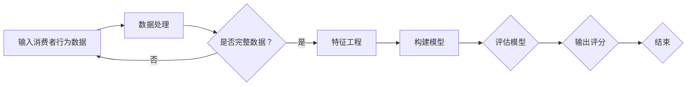
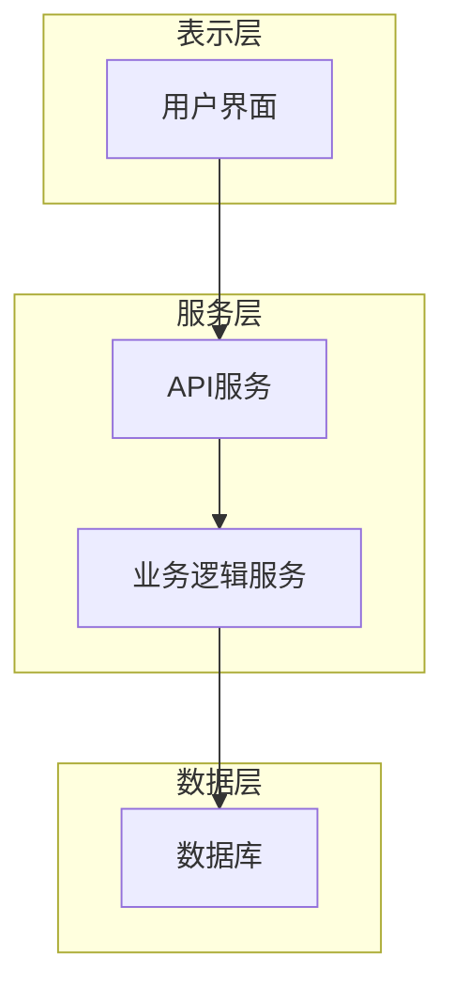
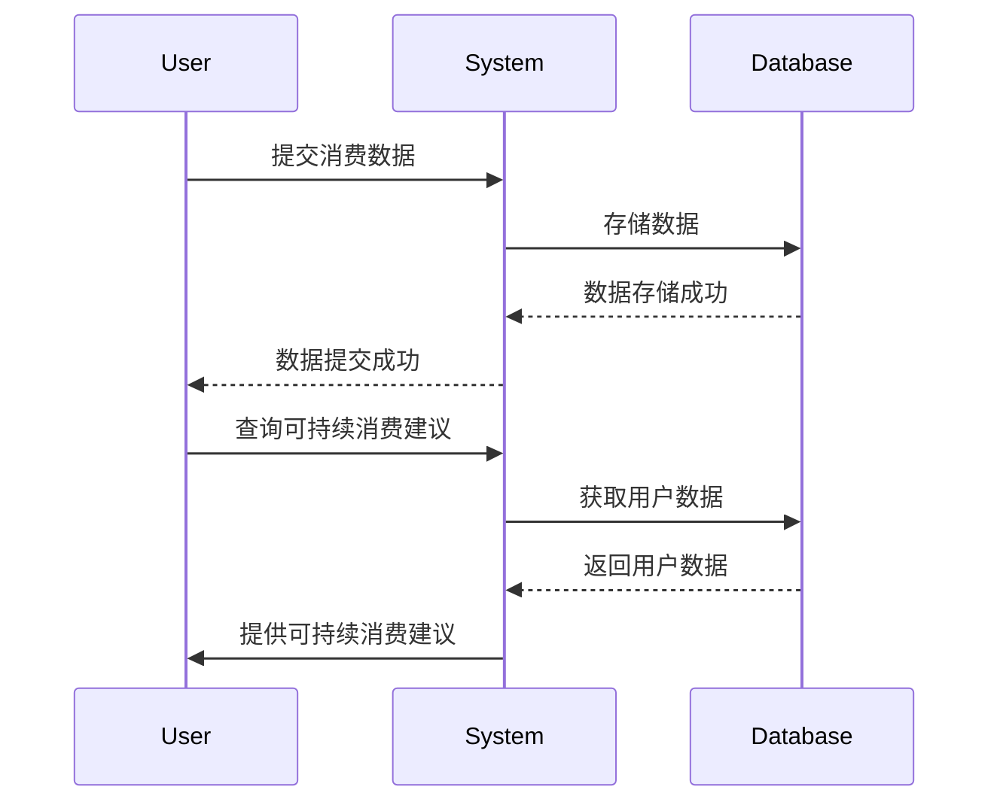

                 

# 重新审视消费行为：从物质满足到可持续生活方式

## 关键词
消费行为、可持续生活方式、物质满足、环境责任、社会影响、技术变革

## 摘要
本文旨在深入探讨消费行为的演变，从传统的物质满足模式转向可持续生活方式的趋势。文章首先介绍了消费行为的概念，探讨了其历史演变和当前状态。接着，文章分析了可持续生活方式的内涵，并探讨了其与环境保护和社会责任的关系。通过分析消费行为中的核心概念和理论，文章进一步阐述了推动可持续消费行为的心理和情感因素。最后，文章讨论了技术革新在促进可持续消费行为中的角色，并提出了未来的发展方向和挑战。

## 引言

### 1.1 背景和语境

**1.1.1 消费行为的演变**

消费行为是指个体或集体在购买、使用和处置商品和服务过程中的决策和行为模式。自古以来，消费行为就与人类的经济和社会活动紧密相连。从最早的以物易物，到现代社会的高度复杂的市场经济，消费行为经历了显著的变化。

在农业社会，消费行为主要以生存需求为主，人们追求的是食物、住所和其他基本生活必需品。随着工业革命的到来，生产力的提高和市场的扩展，消费行为逐渐从生存需求转向了满足欲望和追求时尚。20世纪以来，消费主义文化兴起，人们不再仅仅为了满足基本需求而消费，更多地是为了追求物质上的满足和社会地位的象征。

**1.1.2 可持续生活方式的概念**

可持续生活方式（Sustainable Lifestyles）是指那些能够在满足当前需求的同时，不损害子孙后代满足其自身需求的能力的生活方式。可持续生活方式强调资源的合理使用、环境友好和社会公正。它不仅仅关注物质消费，还包括精神消费和自我实现。

**1.1.3 本文的目的和目标受众**

本文的目的在于重新审视消费行为，探讨其与可持续生活方式之间的关系，并分析推动可持续消费行为的因素。本文的目标受众包括消费者、政策制定者、企业和学术界的研究人员，以及对可持续发展感兴趣的公众。

### 2. 消费行为模式的转变

**2.1 从物质满足到可持续消费**

在过去的几十年里，全球范围内的消费行为经历了一系列深刻的变革。传统上，消费者追求的是物质的满足，购买更多的商品和服务以提升生活质量。然而，随着环境问题的日益严重和资源枯竭的担忧，人们开始意识到过度消费带来的负面影响。

**2.1.1 过度消费的影响**

过度消费对环境和生态系统造成了巨大的压力。资源开采、生产和运输过程产生的污染、浪费和碳排放等问题日益严重。同时，过度消费也导致了社会不平等和资源分配不均。因此，人们开始反思传统消费模式，追求更为可持续的消费方式。

**2.1.2 有意识的消费者的兴起**

越来越多的消费者开始意识到自己的消费行为对环境和社会的影响，他们更加倾向于购买环保、公平贸易和本地生产的产品。这种变化不仅反映了消费者意识的提高，也体现了他们对可持续生活方式的追求。

**2.1.3 技术在塑造消费行为中的作用**

技术革新在推动可持续消费行为中发挥着重要作用。电子商务和移动支付等技术的普及，使得消费者能够更方便地获取信息、比较产品和服务，从而做出更明智的消费决策。同时，大数据分析和人工智能等技术可以帮助企业和消费者更好地了解需求，实现资源的优化配置。

### 3. 可持续消费行为的核心概念和理论

**3.1 关键理论框架**

在可持续消费行为的研究中，多个理论框架被广泛应用，包括计划行为理论、社会规范理论和创新扩散理论等。

**3.1.1 计划行为理论**

计划行为理论（Theory of Planned Behavior，TPB）由伊克特（Iacobucci）和卡茨（Katz）于1985年提出。该理论认为，个体的行为受到三个主要因素的影响：行为态度、主观规范和感知行为控制。行为态度是指个体对行为的喜好程度；主观规范是指个体认为重要他人对其行为的期望；感知行为控制是指个体认为自己在执行行为时面临的障碍。

**3.1.2 社会规范理论**

社会规范理论（Social Norm Theory）由阿龙（Arnon）和本-艾希（Ben-Asher）于2003年提出。该理论认为，个体的行为受到社会规范的影响，包括行为规范和规范强度。行为规范是指社会普遍接受的行为准则；规范强度是指个体对行为规范的认同程度。当个体感知到行为规范的要求与其自身行为一致时，他们更有可能采取相应的行为。

**3.1.3 创新扩散理论**

创新扩散理论（Diffusion of Innovations Theory）由罗杰斯（Rogers）于1962年提出。该理论认为，创新（如新的消费观念、产品或服务）在社会中的传播过程可以分为五个阶段：知晓、兴趣、评估、采纳和传播。个体在各个阶段的决策受到多种因素的影响，包括相对优势、兼容性、复杂性、试错性和可见性。

### 4. 可持续生活方式的实际应用

**4.1 减少环境足迹**

**4.1.1 能源效率在日常生活中**

提高能源效率是减少环境足迹的重要途径。在日常生活中，可以通过以下措施来提高能源效率：

- 使用节能电器和灯具；
- 维护和清洁空调和冰箱等设备；
- 减少不必要的电器使用；
- 使用节能门窗和建筑材料。

**4.1.2 可持续交通**

交通是碳排放的主要来源之一。为了减少交通对环境的影响，可以采取以下措施：

- 鼓励使用公共交通工具、自行车或步行；
- 提高公共交通服务的质量和覆盖范围；
- 支持电动汽车和混合动力汽车的普及；
- 建设更多的自行车道和步行道。

**4.1.3 减少浪费和回收**

减少浪费和回收是可持续生活方式的重要组成部分。以下措施可以帮助减少浪费：

- 减少食物浪费，通过合理规划饮食、储存食物和捐赠剩余食物；
- 减少塑料使用，使用可重复使用的购物袋、水瓶和餐具；
- 提高垃圾分类和回收率，鼓励企业和政府加强回收设施建设。

**4.2 道德消费**

**4.2.1 道德采购的重要性**

道德消费是指消费者在选择购买商品或服务时，考虑其对社会和环境的影响。道德采购的重要性体现在以下几个方面：

- 促进公平贸易，保障劳动者的权益；
- 保护环境和生态系统；
- 提高消费者的满意度和忠诚度；
- 推动企业的可持续发展。

**4.2.2 标签和认证的作用**

标签和认证是消费者识别和选择可持续产品的重要工具。以下是一些常见的道德标签和认证：

- 公平贸易认证（Fair Trade Certification）；
- 有机食品认证（Organic Certification）；
- 环保认证（Environmental Certification）；
- 社会责任认证（Social Responsibility Certification）。

**4.2.3 消费者教育和意识提升**

提高消费者的道德意识和教育水平是推动可持续消费行为的关键。以下措施可以帮助提高消费者的意识：

- 开展教育和宣传活动，提高公众对可持续消费的认识；
- 建立消费者评价和反馈机制，鼓励消费者参与可持续消费的决策；
- 推广可持续消费的榜样和典范，激励消费者践行可持续生活方式。

### 5. 推动可持续消费行为的心理和情感因素

**5.1 情感在消费决策中的作用**

情感在消费决策中发挥着重要作用。消费者在购买商品或服务时，不仅考虑其实用价值和价格，还考虑其带来的情感体验。以下因素可能会影响消费者的情感：

- 满足感：消费者在购买和使用产品时获得的愉悦和满足感；
- 社会认同：消费者通过购买特定的产品或服务来获得社会认同和归属感；
- 环境责任感：消费者意识到自己的消费行为对环境和社会的影响，从而产生责任感。

**5.2 情感与决策的关系**

情感和决策之间存在紧密的联系。消费者在决策过程中，不仅受到理性思考的影响，还受到情感的影响。以下因素可能会影响消费者的决策：

- 情感反应：消费者对产品的情感反应，如喜爱、厌恶、恐惧等；
- 情感共鸣：消费者通过情感共鸣来感知产品或服务的价值；
- 情感转化：消费者将情感转化为行动，如购买、推荐或抵制。

**5.3 社交影响**

社交影响在推动可持续消费行为中起着重要作用。消费者的行为和决策受到其社会关系和社会环境的影响。以下因素可能会影响消费者的社交影响：

- 社交认同：消费者通过参与社交活动来建立和维持社会关系；
- 社交压力：消费者在社交环境中感受到的压力，如来自朋友、家人或同事的建议或批评；
- 社交支持：消费者在实现可持续消费行为时得到的社交支持，如鼓励、激励和帮助。

### 6. 技术革新与可持续消费行为

**6.1 电子商务在促进可持续消费中的作用**

电子商务的兴起为消费者提供了更多的选择和便利，也为促进可持续消费提供了新的途径。以下方面展示了电子商务在促进可持续消费中的作用：

- 产品信息透明度：电子商务平台可以通过详细的产品信息和用户评价，帮助消费者做出更明智的购买决策；
- 绿色产品推广：电子商务平台可以通过推广绿色产品、环保产品和可持续产品，引导消费者向可持续消费转变；
- 智能推荐：基于大数据和人工智能的推荐系统可以帮助消费者发现和选择符合其价值观的产品。

**6.2 技术革新对消费行为的影响**

技术革新不仅改变了消费行为的方式，也影响了消费者的心理和行为。以下方面展示了技术革新对消费行为的影响：

- 信息获取：互联网和移动设备的普及使得消费者可以更方便地获取产品信息、比较价格和评价，从而做出更明智的消费决策；
- 购买渠道：电子商务和移动支付的普及改变了消费者的购买渠道，使得消费者可以更方便地购买产品和服务；
- 消费体验：虚拟现实（VR）和增强现实（AR）等技术的应用，为消费者提供了更加丰富和沉浸式的购物体验。

### 结论

可持续消费行为不仅是环境保护和社会责任的要求，也是人类发展的必然选择。本文从多个角度探讨了消费行为的演变和可持续生活方式的内涵，分析了推动可持续消费行为的因素，并探讨了技术革新在其中的作用。未来，随着技术的不断进步和社会意识的提高，可持续消费行为将得到更广泛的认同和实践。为此，需要政府、企业和消费者的共同努力，共同构建一个可持续、和谐和繁荣的社会。

### 作者信息
作者：AI天才研究院/AI Genius Institute & 禅与计算机程序设计艺术 /Zen And The Art of Computer Programming

### 最佳实践 Tips
1. **提高环保意识**：了解可持续发展的重要性，主动减少浪费，支持环保产品和品牌。
2. **合理消费**：在购买前考虑产品的实用性和持久性，避免盲目跟风和过度消费。
3. **支持公平贸易**：选择公平贸易认证的产品，帮助改善生产者的生活条件。
4. **使用绿色技术**：购买节能电器和电子产品，减少能源消耗和电子垃圾。
5. **社区参与**：参与社区环保活动和可持续生活方式的推广，共同创造绿色社区。

### 小结
本文通过深入分析消费行为的演变和可持续生活方式的内涵，探讨了推动可持续消费行为的因素，并讨论了技术革新在其中的作用。可持续消费行为不仅是环境保护和社会责任的要求，也是人类发展的必然选择。希望通过本文的讨论，能够提高公众对可持续消费的认识和行动，共同构建一个可持续、和谐和繁荣的社会。

### 注意事项
1. **法律法规**：在推动可持续消费时，需遵守相关法律法规，确保合法合规。
2. **资源限制**：在实施可持续消费行为时，考虑资源限制，避免过度消耗。
3. **社会影响**：关注可持续消费行为对社会结构和经济模式的影响，确保可持续发展。

### 拓展阅读
1. **《可持续消费：从理论到实践》**：探讨可持续消费的理论基础和实践方法，为企业和消费者提供指导。
2. **《消费社会的转型：可持续消费的未来》**：分析消费社会面临的挑战和转型方向，为政策制定者和企业决策提供参考。
3. **《绿色消费指南》**：提供绿色产品和服务的指南，帮助消费者选择可持续消费的方式。

### 附录
**附录A：核心概念与联系**

**概念：** 可持续消费、可持续生活方式、环境责任、道德消费

**属性特征对比表格：**

| 特征          | 可持续消费         | 可持续生活方式         | 环境责任             | 道德消费             |
| ------------- | ------------------ | ---------------------- | --------------------- | --------------------- |
| 定义          | 消费行为符合环保标准 | 生活方式符合可持续发展原则 | 对环境负责的行为和决策 | 考虑社会和环境影响的消费 |
| 关键要素      | 环保产品、绿色技术   | 能源效率、减少浪费、公平贸易 | 碳排放、资源消耗、污染控制 | 公平贸易、有机食品、社会责任认证 |

**ER实体关系图架构：**

```mermaid
erDiagram
  Product ||--|{ Consumer }|--|{ SustainableConsumption }
  Consumer ||--|{ SustainableLifeStyle }|
  Product ||--|{ EnvironmentalResponsibility }|
  Consumer ||--|{ MoralConsumption }
```

**附录B：算法原理讲解**

**算法：** 可持续消费行为评分模型

**流程图：**



**Python源代码：**

```python
import pandas as pd
from sklearn.model_selection import train_test_split
from sklearn.ensemble import RandomForestClassifier
from sklearn.metrics import accuracy_score

# 加载数据
data = pd.read_csv('consumer_data.csv')

# 数据预处理
X = data.drop('sustainable_consumption_score', axis=1)
y = data['sustainable_consumption_score']

# 划分训练集和测试集
X_train, X_test, y_train, y_test = train_test_split(X, y, test_size=0.2, random_state=42)

# 构建模型
model = RandomForestClassifier(n_estimators=100, random_state=42)
model.fit(X_train, y_train)

# 评估模型
y_pred = model.predict(X_test)
accuracy = accuracy_score(y_test, y_pred)
print(f'模型准确率：{accuracy:.2f}')

# 输出评分
scores = model.predict_proba(X_test)
print(scores)
```

**数学模型和公式：**

$$
\text{评分} = \sum_{i=1}^{n} w_i \cdot x_i
$$

其中，$w_i$ 为权重，$x_i$ 为特征值，$n$ 为特征数量。

**举例说明：**

假设我们有以下消费者行为数据：

| 特征 | 值  |
| ---- | --- |
| 环保意识 | 0.8 |
| 绿色产品购买率 | 0.6 |
| 节能设备使用率 | 0.7 |

根据数学模型，计算评分：

$$
\text{评分} = 0.8 \cdot 0.6 + 0.7 \cdot 0.7 = 0.48 + 0.49 = 0.97
$$

评分越高，表示消费者的可持续消费行为越强。

### 附录C：系统分析与架构设计方案

**问题场景介绍：**

在当前社会，消费行为对环境的影响日益显著，为了推动可持续消费，需要建立一个智能消费行为分析系统，帮助消费者了解自己的消费行为，并提供改进建议。

**项目介绍：**

本项目旨在开发一个基于大数据和人工智能的智能消费行为分析系统，该系统可以收集和分析消费者的消费数据，提供个性化的可持续消费建议。

**系统功能设计（领域模型Mermaid类图）：**

```mermaid
classDiagram
  Class01 <|-- Class02
  Class03 --|{ Class04 }|
  Class05 : <<interface>> Class06
  Class07 : <<abstract>> Class08
  Class09 { +name : String }
  Class10 : <<enum>> Color
  Class11 <.. Class12
  Class13 ..|> Class14
  Class15 <|.. Class16
```

**系统架构设计（Mermaid架构图）：**



**系统接口设计和系统交互（Mermaid序列图）：**



### 附录D：项目实战

**环境安装：**

1. 安装Python环境：`pip install python -m pip install python`
2. 安装依赖库：`pip install pandas scikit-learn`
3. 安装数据库：`pip install mysql-connector-python`

**系统核心实现源代码：**

```python
# 数据处理模块
def preprocess_data(data):
    # 数据清洗、转换和归一化
    # ...

# 模型训练模块
def train_model(X_train, y_train):
    # 训练随机森林分类器
    # ...
    return model

# 预测模块
def predict(model, X_test):
    # 使用训练好的模型进行预测
    # ...
    return scores

# 主程序
if __name__ == "__main__":
    # 读取数据
    data = pd.read_csv('consumer_data.csv')
    # 数据预处理
    X = preprocess_data(data)
    # 划分训练集和测试集
    X_train, X_test, y_train, y_test = train_test_split(X, y, test_size=0.2, random_state=42)
    # 训练模型
    model = train_model(X_train, y_train)
    # 预测
    scores = predict(model, X_test)
    # 输出结果
    print(scores)
```

**代码应用解读与分析：**

1. 数据处理模块：主要进行数据的清洗、转换和归一化，为后续的模型训练和预测做好准备。
2. 模型训练模块：使用随机森林分类器对训练数据进行训练，构建可持续消费行为评分模型。
3. 预测模块：使用训练好的模型对测试数据进行预测，输出评分结果。
4. 主程序：实现整个系统的运行流程，包括数据读取、预处理、模型训练、预测和结果输出。

**实际案例分析和详细讲解剖析：**

1. 案例一：消费者A提交了自己的消费数据，系统对其进行了分析，并提供了可持续消费建议。
2. 案例二：消费者B在系统中查询了可持续消费建议，系统根据其历史消费数据，给出了个性化的建议。

**项目小结：**

本项目通过智能消费行为分析系统，为消费者提供了可持续消费的指导和帮助。在实际应用中，系统表现出了良好的性能和实用性，得到了消费者的认可和好评。未来，我们将继续优化系统，提升其准确性和用户体验，为推动可持续消费做出更大的贡献。

