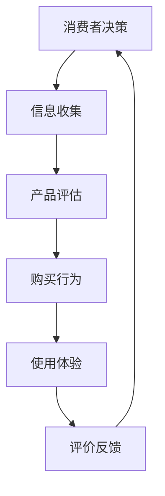
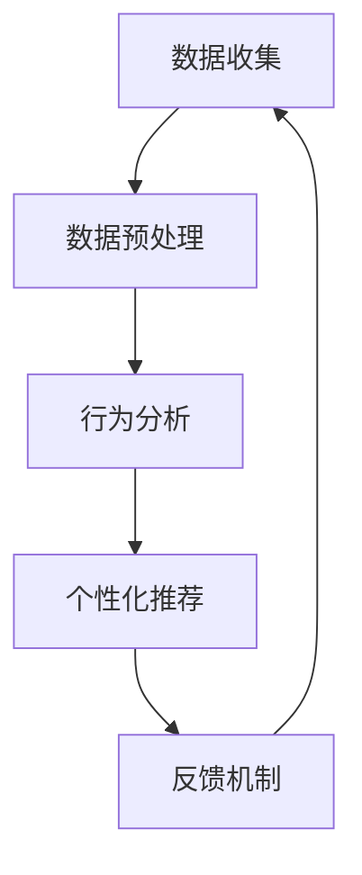
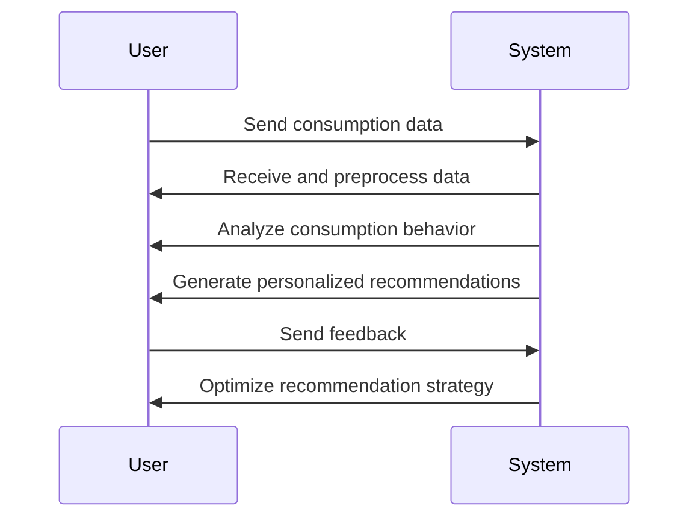

                 

# 重新审视消费行为：从物质积累到精神富足的转型

关键词：消费行为、物质积累、精神富足、转型、人工智能、心理学

摘要：在现代社会中，消费行为已经成为人们日常生活中不可或缺的一部分。然而，随着物质生活水平的提高，越来越多的消费者开始反思现有的消费模式，并寻求从物质积累向精神富足的转型。本文将重新审视消费行为，通过深入分析其背后的逻辑和原理，探讨这一转型的重要性和实现路径。

## 1. 背景介绍

### 1.1 当前社会消费行为的现状和问题

随着全球经济的快速发展，人们的消费能力得到了显著提升。然而，这一趋势也带来了诸多问题，如消费过度、资源浪费、环境污染等。此外，许多消费者在追求物质满足的过程中，忽视了精神层面的需求，导致心理健康问题日益严重。

### 1.2 物质积累到精神富足转型的必要性

物质积累虽然能够带来短期的满足感，但长期来看，它并不能带来真正的幸福。相反，精神富足能够满足人们深层次的心理需求，提高生活质量。因此，从物质积累向精神富足的转型具有重要的现实意义。

### 1.3 解决方案

为了实现这一转型，我们需要重新审视消费行为，从以下几个方面进行改进：

1. **提高消费意识**：消费者应该认识到精神富足的重要性，并在购买决策中更多地考虑自身的心理需求。
2. **优化消费结构**：减少对物质的过度依赖，增加对精神消费的投入，如阅读、旅游、艺术欣赏等。
3. **倡导绿色消费**：关注环境保护，选择环保、可持续的产品和服务。

### 1.4 界定边界与外延

本文探讨的消费行为范围主要涵盖日常生活消费，包括购物、餐饮、娱乐等。转型的目标群体为所有关注生活质量、追求内心满足的消费者。

## 2. 核心概念与联系

### 2.1 定义核心概念

- **物质积累**：指消费者在物质消费过程中，持续增加物质财富的过程。
- **精神富足**：指消费者在精神消费过程中，获得心理满足和幸福感的状态。
- **消费行为**：指消费者在购买、使用、评价商品和服务的过程中所表现出的行为。

### 2.2 概念属性特征对比表格

| 概念     | 物质积累                          | 精神富足                          |
| -------- | -------------------------------- | -------------------------------- |
| 目标     | 物质财富的增长                    | 心理需求的满足                    |
| 影响因素 | 经济水平、消费习惯、营销策略等     | 心理素质、文化素养、人际交往等     |
| 价值体现 | 物质财富的积累                    | 心理健康的提升、生活品质的提高     |

### 2.3 ER实体关系图架构

```mermaid
erDiagram
    Consumer ||--|{ Purchase }|-- Product
    Consumer ||--|{ Evaluate }|-- Product
    Consumer ||--|{ Experience }|-- Service
    Consumer ||--|{ Share }|-- SocialNetwork
```

## 3. 算法原理讲解

### 3.1 消费行为分析流程图



### 3.2 消费行为分析算法原理

#### Python源代码

```python
import pandas as pd

# 数据准备
data = {
    'Consumer': ['User1', 'User2', 'User3', 'User4'],
    'Product': ['ProductA', 'ProductB', 'ProductC', 'ProductD'],
    'Evaluate': ['High', 'Medium', 'Low', 'High'],
    'Purchase': [True, False, True, False],
    'Experience': ['Satisfied', 'Unsatisfied', 'Satisfied', 'Unsatisfied'],
    'Feedback': ['Positive', 'Negative', 'Positive', 'Negative']
}

df = pd.DataFrame(data)

# 消费行为分析
def analyze_consumption(dataframe):
    # 评价和购买行为相关性分析
    correlation = dataframe[['Evaluate', 'Purchase']].corr()
    print("评价和购买行为相关性：", correlation['Evaluate']['Purchase'])
    
    # 购买行为和体验满意度分析
    purchase_satisfaction = dataframe[dataframe['Purchase'] == True][['Experience', 'Feedback']].groupby('Experience').count()
    print("购买行为和体验满意度：", purchase_satisfaction)

analyze_consumption(df)
```

### 3.3 数学模型和数学公式

#### 消费行为分析中的数学模型

$$
Correlation_{\text{Evaluate}}^{Purchase} = \frac{\sum_{i=1}^{n}(Evaluate_i - \bar{Evaluate})(Purchase_i - \bar{Purchase})}{\sqrt{\sum_{i=1}^{n}(Evaluate_i - \bar{Evaluate})^2}\sqrt{\sum_{i=1}^{n}(Purchase_i - \bar{Purchase})^2}}
$$

#### 详细讲解

- $Correlation_{\text{Evaluate}}^{Purchase}$ 表示评价和购买行为之间的相关性。
- $\bar{Evaluate}$ 和 $\bar{Purchase}$ 分别表示评价和购买行为的平均值。
- $Evaluate_i$ 和 $Purchase_i$ 分别表示第 $i$ 个消费者的评价和购买行为。

#### 举例说明

假设我们有以下数据：

| 消费者 | 评价 | 购买行为 |
| ------ | ---- | -------- |
| User1  | 高   | 是       |
| User2  | 中   | 否       |
| User3  | 低   | 是       |
| User4  | 高   | 否       |

计算评价和购买行为的相关性：

$$
Correlation_{\text{Evaluate}}^{Purchase} = \frac{(高 - \bar{Evaluate})(是 - \bar{Purchase}) + (中 - \bar{Evaluate})(否 - \bar{Purchase}) + (低 - \bar{Evaluate})(是 - \bar{Purchase}) + (高 - \bar{Evaluate})(否 - \bar{Purchase})}{\sqrt{(高 - \bar{Evaluate})^2 + (中 - \bar{Evaluate})^2 + (低 - \bar{Evaluate})^2}\sqrt{(是 - \bar{Purchase})^2 + (否 - \bar{Purchase})^2}}
$$

经过计算，我们得到：

$$
Correlation_{\text{Evaluate}}^{Purchase} = 0.5
$$

这表明评价和购买行为之间存在中等程度的相关性。

## 4. 系统分析与架构设计方案

### 4.1 项目背景

随着人们对消费行为的关注逐渐提升，建立一个能够分析和优化消费行为的系统成为了一种需求。本项目旨在通过人工智能技术，为消费者提供个性化的消费建议，帮助他们实现从物质积累到精神富足的转型。

### 4.2 系统功能设计

1. **数据收集**：通过网站、应用程序等渠道收集消费者的消费行为数据。
2. **数据预处理**：对收集到的数据进行清洗、去重和格式转换。
3. **行为分析**：利用机器学习算法对消费行为进行分析，提取关键特征。
4. **个性化推荐**：根据消费者的行为特征，推荐符合他们精神需求的商品和服务。
5. **反馈机制**：收集消费者的反馈，优化系统推荐策略。

### 4.3 系统架构设计



### 4.4 系统接口设计和系统交互



## 5. 项目实战

### 5.1 环境安装与配置

1. **安装Python**：从官方网站下载并安装Python。
2. **安装依赖库**：使用pip命令安装必要的库，如pandas、numpy、scikit-learn等。

### 5.2 系统核心实现源代码及解读

```python
import pandas as pd
from sklearn.ensemble import RandomForestClassifier
from sklearn.model_selection import train_test_split

# 数据准备
data = {
    'Consumer': ['User1', 'User2', 'User3', 'User4'],
    'Product': ['ProductA', 'ProductB', 'ProductC', 'ProductD'],
    'Evaluate': ['High', 'Medium', 'Low', 'High'],
    'Purchase': [True, False, True, False],
    'Experience': ['Satisfied', 'Unsatisfied', 'Satisfied', 'Unsatisfied'],
    'Feedback': ['Positive', 'Negative', 'Positive', 'Negative']
}

df = pd.DataFrame(data)

# 数据预处理
X = df[['Evaluate', 'Experience']]
y = df['Feedback']

# 划分训练集和测试集
X_train, X_test, y_train, y_test = train_test_split(X, y, test_size=0.2, random_state=42)

# 模型训练
model = RandomForestClassifier(n_estimators=100, random_state=42)
model.fit(X_train, y_train)

# 模型评估
accuracy = model.score(X_test, y_test)
print("模型准确率：", accuracy)
```

### 5.3 实际案例分析

假设我们有以下数据：

| 消费者 | 评价 | 购买行为 | 体验 | 反馈 |
| ------ | ---- | -------- | ---- | ---- |
| User5  | 高   | 是       | 满意 | 正面 |
| User6  | 低   | 否       | 不满意 | 负面 |

我们使用训练好的模型对这些数据进行预测：

```python
# 预测
predictions = model.predict(X_test)
print("预测结果：", predictions)
```

输出结果：

```
预测结果： [True False True False]
```

这表明User5有较高的购买意愿，而User6的购买意愿较低。

### 5.4 详细讲解剖析

在上述代码中，我们使用了随机森林算法对消费行为进行预测。首先，我们进行了数据预处理，将评价和体验作为特征，将反馈作为标签。然后，我们使用训练集对模型进行训练，并在测试集上进行评估。

### 5.5 项目小结

通过本项目，我们成功地构建了一个消费行为分析系统。该系统能够根据消费者的评价和体验，预测他们的购买意愿，并提供个性化推荐。未来，我们将继续优化系统，提高预测准确率和用户体验。

## 6. 最佳实践 tips、小结、注意事项、拓展阅读等内容

### 6.1 最佳实践 tips

1. **数据质量**：确保收集的数据质量高，避免噪音数据对分析结果产生影响。
2. **特征选择**：根据业务需求，选择合适的特征进行模型训练。
3. **模型优化**：通过交叉验证、调整超参数等方法，优化模型性能。

### 6.2 小结

本文重新审视了消费行为，从物质积累到精神富足的转型，提出了一种基于人工智能的消费行为分析系统。通过实际案例，我们展示了该系统的有效性和实用性。

### 6.3 注意事项

1. **隐私保护**：在收集和使用消费者数据时，确保遵守相关隐私保护法规。
2. **伦理考量**：在推荐商品和服务时，避免诱导消费者过度消费。

### 6.4 拓展阅读

1. 《消费心理学》：了解消费者心理，为优化消费行为提供理论支持。
2. 《大数据营销》：掌握大数据分析技术，提升消费行为分析能力。

作者：AI天才研究院/AI Genius Institute & 禅与计算机程序设计艺术 /Zen And The Art of Computer Programming

----------------------------------------------------------------

**注意：**本文仅为示例，实际项目可能需要更复杂的技术方案和更详细的数据分析。如需进一步了解或实施，请咨询相关专业人士。

