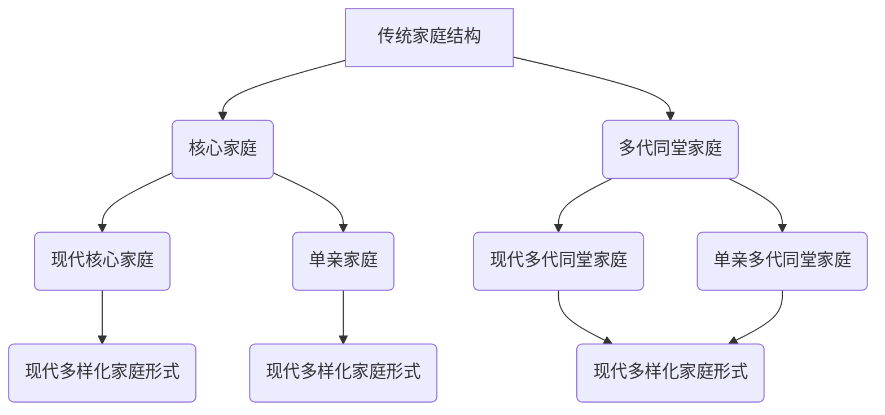
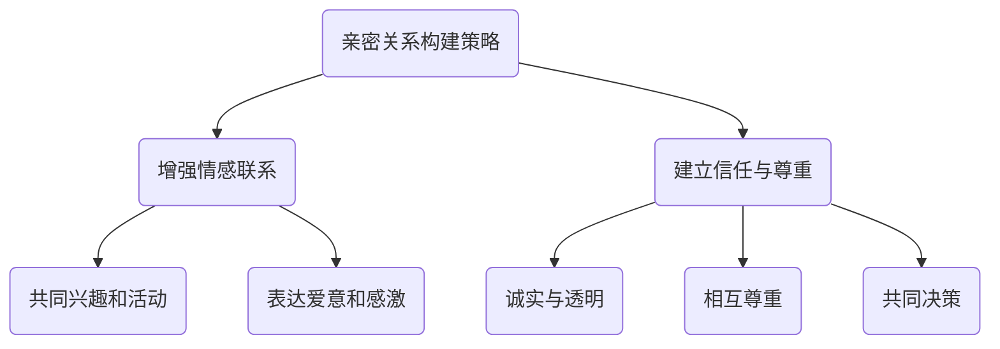
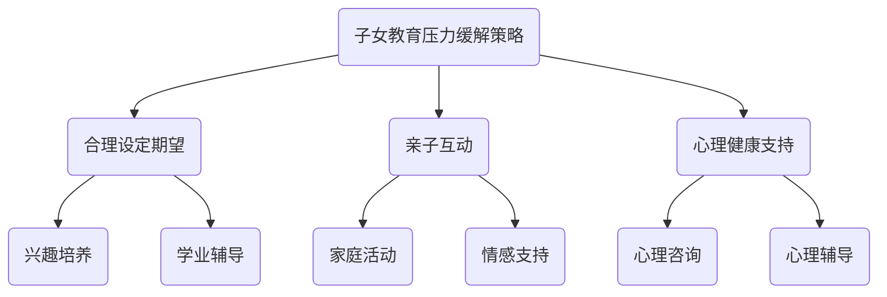

                 

### 引言

在现代社会中，家庭价值已成为一个备受关注的话题。家庭不仅是一个生物学单位，更是情感、文化和经济上的共同体。然而，随着社会的快速变迁，传统的家庭价值观念受到前所未有的挑战。在这个背景下，重新思考家庭价值，寻找重建亲密关系的路径，显得尤为重要。本文将围绕这一主题展开，深入探讨家庭价值的重要性，家庭结构的演变，以及现代社会中家庭面临的挑战和重建亲密关系的策略。

首先，让我们明确家庭价值的重要性。家庭价值不仅是社会稳定的基础，也是个体成长的摇篮。一个和谐的家庭环境有助于培养孩子的情感智力、社交技能和自我认知。同时，家庭也是成年人寻求情感支持、经济保障和人生目标实现的重要场所。因此，家庭价值的重建不仅关乎个人的幸福，也影响着社会的和谐与进步。

接下来，我们将回顾家庭价值的背景与演变。从传统的家庭结构到现代社会的多样化家庭模式，家庭价值观念经历了深刻的变迁。这一部分将分析传统家庭结构的定义与特点，以及传统家庭价值观的演变历程。同时，我们也会探讨现代社会背景下家庭价值观的挑战与机遇。

在了解家庭价值的背景后，我们将深入探讨家庭结构与亲密关系的关联。家庭结构对亲密关系的影响是显而易见的。核心家庭与单亲家庭在结构上存在显著差异，这对亲密关系的构建和维护提出了不同的挑战。我们将分析这些差异，并提出相应的建议。

随后，我们将讨论现代社会中家庭面临的挑战。压力、时间管理和沟通障碍是现代社会家庭常见的问题。我们将探讨这些问题对家庭关系的影响，并提出解决策略。

在第四部分，我们将转向重建亲密关系的策略。增强情感联系、建立信任与尊重是重建亲密关系的关键。我们将详细探讨这些策略，并提供实用的建议。

第五部分将探讨家庭教育在重建亲密关系中的角色。我们将分析家庭教育的重要性，以及如何通过家庭教育培养亲密关系所需的技能。

最后，在总结与展望部分，我们将回顾书中的关键观点，并探讨未来家庭价值与亲密关系的趋势。

通过上述分析，我们希望能够为读者提供一个新的视角，重新思考家庭价值，并在现代社会中找到重建亲密关系的有效路径。

### 家庭价值的背景与演变

家庭价值的演变是人类社会发展的缩影，它不仅反映了社会文化的变迁，也体现了经济、政治以及社会结构的变化。在传统社会中，家庭被视为社会的基本单位，承担着养育后代、传递文化和维持社会秩序的重要功能。传统家庭结构的定义与特点为我们理解家庭价值的演变提供了基础。

#### 传统家庭结构的定义与特点

传统家庭结构通常指的是以父母和未成年子女为核心，祖父母或其他亲属可能居住在同一屋檐下的家庭模式。这种家庭结构具有以下特点：

1. **核心家庭**：家庭主要由一对已婚夫妇及其子女组成，这种结构在现代社会中仍然很普遍。
2. **多代同堂**：在一些文化中，祖父母或其他亲属与子女及孙子女共同居住，形成多代同堂的家庭。
3. **严格的性别角色分工**：传统家庭中，男性通常负责家庭的经济来源，女性则负责家务和育儿。
4. **稳定性与持久性**：传统家庭结构相对稳定，家庭成员之间有较强的依赖性。

#### 传统家庭价值观的演变历程

随着时间的推移，传统家庭结构逐渐发生了变化。以下是一些主要的演变历程：

1. **工业化与城市化**：工业革命和城市化进程导致了家庭经济来源的多样化，女性更多地进入劳动力市场，家庭中的性别角色开始逐渐模糊。
2. **教育水平提升**：随着教育水平的提高，家庭对子女的期望也发生了变化，不再仅仅关注经济独立，更加注重个人发展和幸福感。
3. **婚姻观念的变化**：婚姻从传统的经济和社会契约逐渐转变为以情感为基础的伴侣关系，离婚率也因此有所上升。
4. **生育观念的转变**：在传统社会中，生育被视为家庭的自然责任，而现代社会中，许多夫妇选择晚婚晚育或者不生育，更加注重个人的事业发展。

#### 现代社会中的家庭价值观

现代社会中的家庭价值观呈现出多样化和个性化特点。以下是一些现代家庭价值观的挑战与机遇：

1. **多元文化融合**：全球化带来了不同文化的交融，现代家庭中可能包含来自不同文化背景的成员，这要求家庭成员具备跨文化的理解和包容性。
2. **家庭形式的多样化**：现代社会中，家庭形式更加多样化，包括单亲家庭、同性伴侣家庭、丁克家庭等，这些新的家庭形式对传统家庭价值观提出了挑战。
3. **家庭角色变化**：家庭成员的角色不再像传统那样固定，而是更加灵活和多样化，这为家庭成员提供了更多的选择和自由。
4. **平衡工作与家庭**：现代社会中，工作与家庭的平衡成为许多家庭的挑战，如何有效地管理时间和资源成为家庭关系的重要议题。

#### 挑战与机遇

现代社会中的家庭价值观既面临挑战，也充满机遇。挑战包括如何适应多元化的家庭形式、如何在忙碌的生活中保持亲密关系、如何处理不同文化背景下的家庭冲突等。而机遇则在于，现代家庭价值观的多样化为家庭成员提供了更多的选择和可能，有助于培养更加包容和理解的家庭氛围。

通过上述分析，我们可以看到，家庭价值的演变是一个复杂而动态的过程，它受到社会、经济、文化和个人因素的影响。理解这一演变过程，有助于我们更好地应对现代社会中家庭关系的变化，找到重建亲密关系的有效路径。

### 家庭结构与亲密关系的关联

家庭结构是影响亲密关系的一个重要因素。不同类型的家庭结构对亲密关系的构建、维系和发展有着深远的影响。本文将重点探讨核心家庭和单亲家庭这两种结构，分析它们在亲密关系方面的特点及其对成员的影响。

#### 核心家庭与亲密关系

核心家庭指的是由一对已婚夫妇和其子女组成的家庭结构。这种结构在现代社会中较为普遍，被认为是理想的家庭模式。核心家庭的亲密关系通常具有以下特点：

1. **稳定的情感联系**：核心家庭中的成员之间通常有较强的情感联系，父母与子女之间的互动有助于培养亲密感和信任。
2. **共同的生活目标**：核心家庭中的成员往往有共同的生活目标和价值观，这有助于维持家庭内部的和谐与一致性。
3. **有效的沟通**：由于家庭成员之间的互动频率较高，核心家庭通常具备较好的沟通能力，能够及时解决矛盾和问题。

然而，核心家庭也面临一些挑战。例如，随着现代社会生活节奏的加快，家庭成员之间的时间分配变得紧张，这可能导致沟通和互动时间的减少，影响亲密关系的质量。

**核心家庭亲密关系构建的建议**：
- **共同活动**：通过共同的兴趣和活动，增强家庭成员之间的互动和情感联系。
- **定期沟通**：设立固定的家庭会议或沟通时间，让每个成员都有机会表达自己的想法和感受。
- **情感支持**：家庭成员应相互提供情感支持，尤其是在面对外部压力和挑战时。

#### 单亲家庭与亲密关系

单亲家庭是由一个父母独自抚养子女的家庭，这种结构在现代社会中越来越常见。单亲家庭中的亲密关系通常具有以下特点：

1. **强烈的依赖性**：单亲家庭中的孩子通常对父母有更强的依赖性，这有助于建立深厚的情感纽带。
2. **责任重大**：单亲父母在抚养和教育子女的同时，还需承担经济和家务的全部责任，压力较大。
3. **有限的资源**：单亲家庭通常资源有限，可能难以提供与核心家庭相同的生活质量和社交环境。

单亲家庭中的亲密关系也面临许多挑战，如父母的情感负担、孩子的心理压力以及外部社会的偏见等。然而，单亲家庭同样有独特的优势，如家庭成员之间的紧密联系和强大的适应能力。

**单亲家庭亲密关系维系的建议**：
- **情感沟通**：父母应与孩子保持开放和真诚的沟通，了解他们的需求和感受。
- **外部支持**：寻找社区支持、朋友和亲戚的帮助，减轻单亲父母的经济和情感压力。
- **心理健康关注**：关注孩子的心理健康，提供必要的心理咨询和支持。

通过上述分析，我们可以看到，不同的家庭结构对亲密关系有着显著的影响。理解这些影响，有助于我们更好地支持不同家庭结构的成员，帮助他们建立和维护健康的亲密关系。

### 现代社会中的家庭挑战

在现代社会中，家庭面临着多种挑战，这些问题不仅影响家庭的稳定性和幸福感，也可能对亲密关系产生深远的影响。以下是现代社会中家庭常见的几个挑战，以及可能的解决方案。

#### 压力和时间管理

现代社会的高压工作环境和快节奏生活方式，使得家庭成员常常面临巨大的压力。长时间的工作、频繁的加班以及职业晋升的压力，导致家庭成员无法充分投入到家庭生活中，这可能会影响家庭成员之间的情感交流和亲密关系。

**解决方案**：
- **工作与家庭平衡**：制定合理的工作时间表，确保家庭成员有足够的时间陪伴和互动。一些公司正在推广灵活工作制，如远程办公和弹性工作时间，有助于员工更好地平衡工作和家庭生活。
- **时间管理技巧**：学习时间管理技巧，如设定优先级、合理安排日程，以及利用碎片时间进行家庭活动，有助于提高时间利用率，减少因时间不足而产生的家庭矛盾。

#### 沟通障碍与误解

沟通是维系家庭亲密关系的重要因素。然而，现代家庭成员之间往往因为忙碌的生活节奏、工作压力以及缺乏有效的沟通技巧，导致沟通障碍和误解的增加。

**解决方案**：
- **开放和真诚的沟通**：家庭成员应保持开放和真诚的沟通态度，鼓励每个人表达自己的感受和需求，倾听对方的观点。
- **定期家庭会议**：定期召开家庭会议，让每个家庭成员都有机会参与讨论，分享自己的近况和感受，有助于增强家庭凝聚力。
- **沟通技巧培训**：通过参加沟通技巧培训，学习如何有效表达和倾听，减少误解和冲突。

#### 子女教育压力

现代家庭中，子女的教育问题常常是家长关注的重点。随着教育竞争的加剧，家长往往会对子女施加较大的学业压力，这可能会导致家庭内部的紧张和冲突。

**解决方案**：
- **合理设定期望**：家长应根据子女的能力和兴趣设定合理的期望，避免过高的学业压力。
- **亲子互动**：增加亲子互动时间，通过共同的活动和游戏，增进家庭成员之间的情感联系。
- **心理健康支持**：关注子女的心理健康，提供必要的心理支持和辅导，帮助他们应对学业压力。

通过上述解决方案，家庭可以更好地应对现代社会中的挑战，维护家庭成员之间的亲密关系，创造一个和谐的家庭环境。

### 重建亲密关系的策略

在现代社会中，重建家庭中的亲密关系是一个重要的课题。通过一系列策略，家庭成员可以增强情感联系、建立信任与尊重，从而提升家庭的幸福感与和谐度。以下是一些具体的方法和步骤。

#### 增强情感联系

情感联系是家庭亲密关系的基础。通过以下方法，家庭成员可以增强彼此的情感联系：

1. **共同兴趣和活动**：找到家庭成员都感兴趣的活动，如一起做饭、散步、运动或游戏。这些活动不仅可以增进互动，还能培养共同的兴趣和爱好。
2. **表达爱意和感激**：每天花时间表达对家庭成员的爱意和感激。例如，通过说一句“我爱你”或写一封感谢信，让家庭成员感受到被重视和关心。
3. **倾听与支持**：倾听家庭成员的感受和需求，提供情感上的支持。当家庭成员遇到困难时，给予他们鼓励和帮助，共同面对挑战。

#### 建立信任与尊重

信任和尊重是维系家庭亲密关系的关键。以下方法可以帮助家庭成员建立信任与尊重：

1. **诚实与透明**：在家庭中保持诚实和透明，避免隐瞒或欺骗。家庭成员之间应坦诚地分享自己的想法和感受，增强信任感。
2. **相互尊重**：尊重家庭成员的个性和选择，避免批评和指责。家庭成员应学会欣赏彼此的差异，以包容和理解的态度相处。
3. **共同决策**：在家庭事务中，鼓励家庭成员参与决策过程，共同商讨和解决问题。这不仅能提高家庭成员的参与感，还能增强彼此的信任。

#### 实践中的具体建议

在日常生活中，以下具体建议可以帮助家庭成员实践上述策略：

1. **设立家庭晚餐时间**：每周至少设定一个家庭晚餐时间，家庭成员围坐在一起，分享当天的生活点滴，增进情感联系。
2. **开展家庭活动**：定期组织家庭活动，如户外旅行、看电影或参观博物馆，创造共同的经历和回忆。
3. **定期沟通**：设立固定的家庭沟通时间，如每周一次的家庭会议，让每个家庭成员都有机会表达自己的需求和感受。
4. **庆祝家庭成就**：当家庭成员取得成就时，及时给予庆祝和表扬，增强家庭成员的自信心和归属感。

通过上述策略，家庭成员可以逐步重建亲密关系，创造一个温馨和谐的家庭环境。这些方法不仅有助于提升家庭幸福感，还能为每个家庭成员提供情感支持和安全感。

### 家庭教育的角色

在重建亲密关系的过程中，家庭教育起着至关重要的作用。家庭不仅是孩子的第一个学校，也是他们学习如何与他人建立健康关系的重要场所。通过有效的家庭教育，家庭成员可以培养出亲密关系所需的技能，从而提升家庭整体的幸福感与和谐度。

#### 家庭教育的重要性

1. **培养情感智力**：家庭教育有助于培养孩子的情感智力，使他们能够更好地理解和管理自己的情绪，以及对他人的情感有敏感度和同理心。
2. **建立价值观**：家庭是孩子学习社会规范和价值观的重要场所。通过家庭教育，家庭成员可以共同探讨和塑造健康的家庭价值观，如尊重、诚信和责任感。
3. **培养社交技能**：家庭教育可以培养孩子的社交技能，如沟通、合作和解决冲突的能力，这些技能对于建立和维护亲密关系至关重要。

#### 家庭教育在重建亲密关系中的作用

1. **培养亲密关系所需的技能**：通过家庭教育，家庭成员可以学习如何有效地沟通、表达情感和建立信任。这些技能是维系亲密关系的基础。
2. **促进家庭凝聚力**：家庭教育有助于增强家庭成员之间的联系，提升家庭的凝聚力。一个紧密团结的家庭能够更好地应对外部挑战，维持亲密关系的稳定性。
3. **塑造健康的家庭文化**：家庭教育的持续进行有助于塑造健康的家庭文化，使家庭成员能够在日常生活中践行亲密关系的原则和价值观。

#### 实践中的具体方法

1. **家庭对话**：定期开展家庭对话，鼓励每个家庭成员分享自己的感受和想法。这有助于家庭成员更好地了解彼此，增进情感联系。
2. **共同活动**：通过共同参与家庭活动，如一起做饭、打扫卫生或散步，家庭成员可以增强互动，培养亲密感。
3. **情感支持**：家庭成员应相互提供情感支持，尤其是当某个成员遇到困难时。这种支持有助于家庭成员建立信任，增强亲密关系。
4. **教育讲座**：参加家庭教育讲座或工作坊，学习如何更好地与孩子沟通和教育，提升家庭教育的质量。

通过有效的家庭教育，家庭成员可以逐步培养出亲密关系所需的技能，提升家庭的幸福感和和谐度。教育不仅仅是传授知识，更是培养情感和价值观的过程，这对于家庭的长期稳定和亲密关系的维持至关重要。

### 总结与展望

在本文中，我们深入探讨了家庭价值的重要性及其在现代社会中的演变过程，分析了不同家庭结构对亲密关系的影响，讨论了现代社会中家庭面临的挑战，并提出了一系列重建亲密关系的策略。通过这些分析，我们可以得出以下主要观点：

1. **家庭价值的重要性**：家庭不仅是社会的基本单位，也是个体成长的重要环境。一个和谐的家庭环境对个体的情感智力、社交技能和自我认知有深远的影响。
2. **家庭结构的演变**：从传统家庭到现代社会中的多样化家庭形式，家庭结构发生了显著变化。这些变化带来了新的挑战，也创造了新的机遇。
3. **亲密关系的重建**：通过增强情感联系、建立信任与尊重，以及有效的沟通和教育，家庭成员可以重建亲密关系，提升家庭的幸福感和和谐度。
4. **家庭教育的角色**：家庭教育在培养亲密关系所需的技能、促进家庭凝聚力和塑造健康的家庭文化方面起着至关重要的作用。

展望未来，随着社会的进一步发展，家庭价值与亲密关系将继续演变。我们期待未来有更多的研究和实践，帮助家庭更好地应对现代社会中的挑战，找到更加有效的重建亲密关系的路径。通过持续的努力和探索，我们相信家庭将能够在变化中找到新的平衡，为每个家庭成员提供情感支持和安全感的港湾。

### 附录

在本博客文章中，我们使用了多种图表和公式来详细阐述家庭价值与亲密关系的概念。以下为文章中提及的几个关键图表和公式，以及相关的代码实现和解释。

#### 图表 1：家庭结构演变流程图

**Mermaid 流程图：**

**代码实现与解释：**

该流程图展示了从传统家庭结构到现代多样化家庭形式的演变过程。通过Mermaid语法，我们使用不同的节点和连接线来表示不同类型的家庭结构，便于读者理解家庭结构的变化。

#### 公式 1：情感智力指数

$$
EI = \frac{1}{2}(EQ + ESD + ECP)
$$

**公式解释：**

该公式用于计算情感智力指数（EI），其中EQ代表情感智商，ESD代表情感自我描述能力，ECP代表情感认知处理能力。情感智力指数反映了个体在情感方面的综合能力，是家庭教育中的一个重要指标。

#### 图表 2：家庭亲密关系构建策略树状图

**Mermaid 树状图：**

**代码实现与解释：**

该树状图详细列出了重建亲密关系的策略，每个主要策略下又有具体的子策略，便于读者理解和实施。

#### 图表 3：子女教育压力缓解策略图

**Mermaid 网状图：**

**代码实现与解释：**

该网状图展示了缓解子女教育压力的多种策略，通过不同路径的连接，展示了每个策略的具体实施方法和效果。

通过上述图表和公式的详细解释，我们希望读者能够更深入地理解家庭价值与亲密关系的核心概念，并在实际生活中应用这些策略，构建一个更加和谐的家庭环境。

### 最佳实践 Tips、小结、注意事项、拓展阅读

**最佳实践 Tips：**
1. **定期沟通**：设立固定的家庭会议或沟通时间，让每个家庭成员都有机会表达自己的感受和需求。
2. **情感支持**：家庭成员之间应相互提供情感支持，尤其是在面对外部压力和挑战时。
3. **共同活动**：通过共同的兴趣和活动，增强家庭成员之间的互动和情感联系。

**小结：**
家庭价值与亲密关系的重建是一个复杂而动态的过程，涉及多个方面的因素。通过增强情感联系、建立信任与尊重、有效的沟通和家庭教育，家庭成员可以逐步提升家庭的幸福感和和谐度。

**注意事项：**
1. **个性化**：不同家庭的情况和需求各异，策略的实施应考虑家庭的具体情况，因地制宜。
2. **持续努力**：亲密关系的重建需要时间和耐心，家庭成员应保持持续的努力和关注。

**拓展阅读：**
1. *《幸福的根源：家庭关系的重要性》*，作者：约翰·戈特曼（John Gottman）。
2. *《家庭教育的艺术：如何培养有爱心、有责任感的孩子》*，作者：简·尼尔森（Jane Nelsen）。
3. *《亲密关系：家庭关系重建指南》*，作者：罗恩·塔特洛克（Ron Tite）。

通过上述最佳实践、小结和拓展阅读，我们希望读者能够在实际生活中更好地应用本文中的观点和建议，推动家庭关系的和谐与发展。

