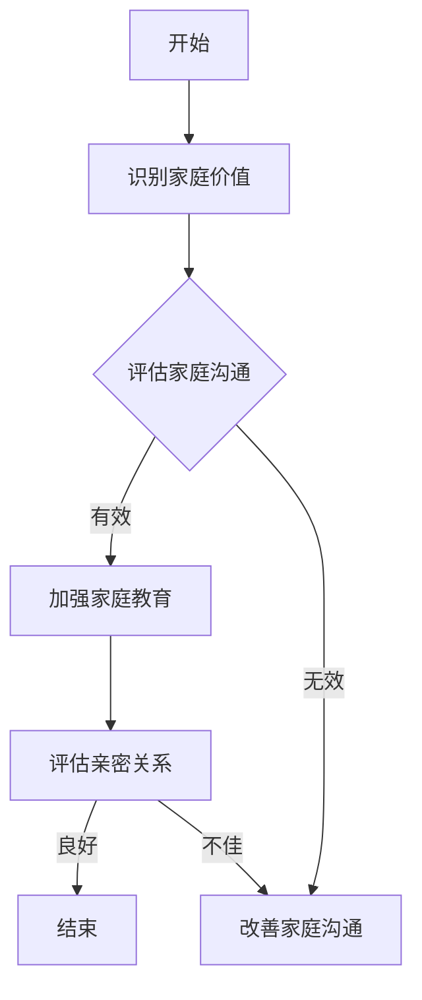
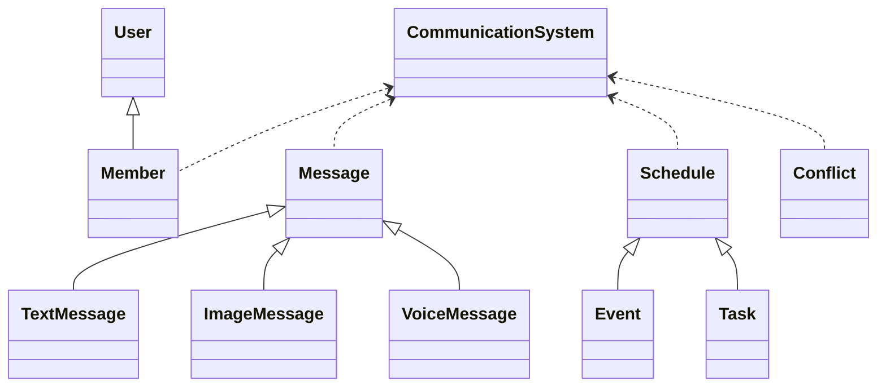
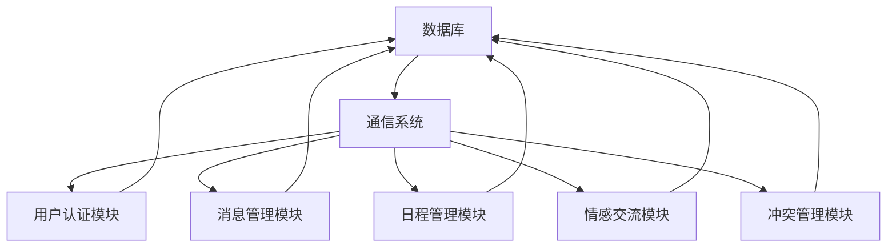
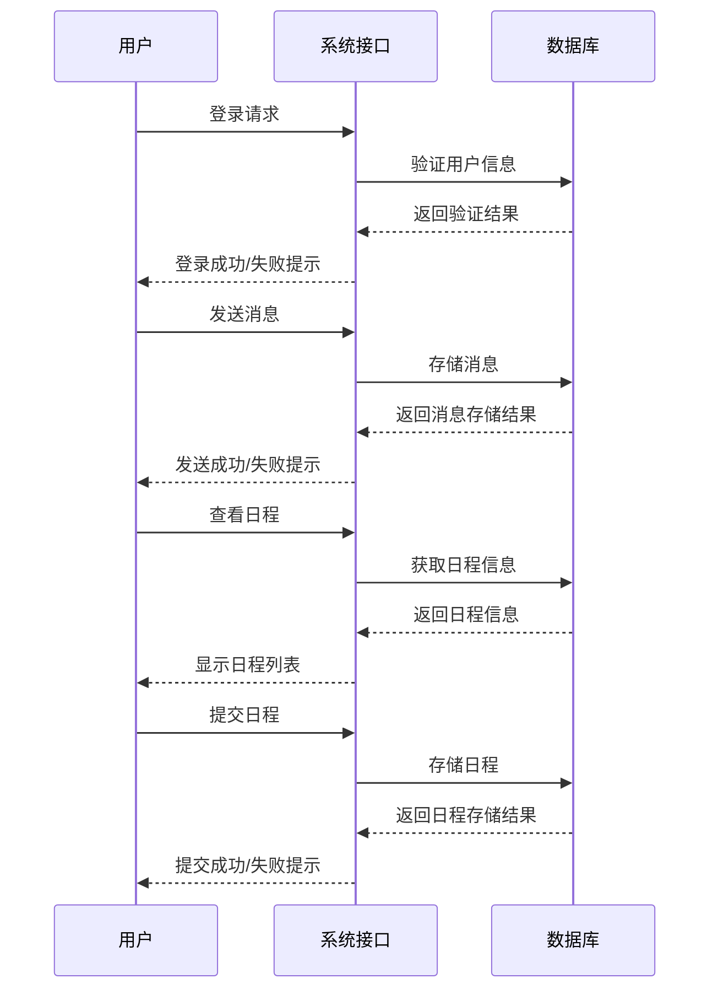

                 


# 重新思考家庭价值：在现代社会中重建亲密关系

关键词：家庭价值，亲密关系，家庭沟通，家庭教育，现代社会

摘要：本文从现代社会家庭面临的挑战出发，探讨了如何重新思考家庭价值，在家庭成员之间重建亲密关系。通过分析家庭价值、亲密关系、家庭沟通和家庭教育等核心概念，提出了具体的解决方案和实践步骤。

----------------------------------------------------------------

**Step 1: 设计背景介绍章节**

## 1.1 核心问题背景

在现代社会，家庭价值正经历着前所未有的挑战。随着科技的发展、社会结构的变迁以及人们价值观的多元化，传统的家庭结构和功能逐渐弱化，家庭成员之间的亲密关系也面临诸多挑战。这些挑战主要包括：

- **家庭结构变化**：离婚率上升、单亲家庭增多，家庭结构日趋复杂。这种结构变化使得家庭成员之间的关系更加脆弱，需要重新思考家庭价值的重建。
- **家庭功能弱化**：家庭不再是经济单位，家庭成员之间的情感纽带变得松散。随着社会分工的细化，家庭的经济支持功能减弱，而情感支持的功能变得更加重要。
- **家庭教育缺失**：现代生活节奏快，家长缺乏时间陪伴孩子成长。这使得家庭教育的重要性凸显，需要寻找新的教育方式和策略。

## 1.2 问题描述

现代家庭面临的挑战具体表现为以下几个方面：

- **沟通障碍**：家庭成员之间的沟通不畅，导致误解和冲突增加。
- **情感疏离**：家庭成员之间的情感距离拉大，缺乏深层次的交流和理解。
- **教育困惑**：家长在孩子的教育上感到迷茫，不知道如何培养孩子的品德、能力和行为习惯。

## 1.3 问题解决思路

为了应对上述挑战，我们需要从以下几个方面来重新思考家庭价值，重建亲密关系：

- **家庭价值观的重塑**：通过树立正确的家庭价值观，强化家庭成员之间的责任感和归属感。
- **家庭成员之间沟通与互动的提升**：通过改善沟通方式，增强家庭成员之间的理解和支持。
- **家庭教育的优化**：通过科学的教育方法，培养孩子的综合素质和道德品质。

## 1.4 边界与外延

本文主要关注家庭内部的关系重建，而不涉及法律、政策等外部因素的影响。此外，本文的核心概念包括家庭价值、亲密关系、家庭沟通和家庭教育，这些概念将在后续章节中详细讨论。

## 1.5 概念结构与核心要素组成

本文的核心概念结构如下：

- **家庭价值**：家庭成员之间基于情感、责任和利益的相互关系，以及家庭所体现出的社会文化意义。
- **亲密关系**：家庭成员之间基于信任、理解和支持的情感联系。
- **家庭沟通**：家庭成员之间通过语言、行为和情感交流来传递信息、表达情感、解决冲突的过程。
- **家庭教育**：父母或其他家庭成员对子女进行的教育活动，旨在培养子女的品德、能力和行为习惯。

**Step 2: 设计核心概念与联系章节**

## 2.1 家庭价值

### 2.1.1 定义

家庭价值是指家庭成员之间基于情感、责任和利益的相互关系，以及家庭所体现出的社会文化意义。它是家庭功能的基础，也是家庭成员之间亲密关系的重要支撑。

### 2.1.2 属性特征

- **情感特征**：家庭价值体现了家庭成员之间的深厚情感，是家庭成员相互支持、理解的基础。
- **责任特征**：家庭价值强调家庭成员之间的责任感和义务，包括经济支持、情感关怀和子女教育等方面。
- **社会文化特征**：家庭价值是社会文化传承的重要载体，反映了特定社会的历史和文化背景。

### 2.1.3 与亲密关系的联系

家庭价值是亲密关系的基础。一个具有良好家庭价值的家庭，往往能够建立起更加亲密的关系。因此，重塑家庭价值对于重建家庭成员之间的亲密关系具有重要意义。

## 2.2 亲密关系

### 2.2.1 定义

亲密关系是指家庭成员之间基于信任、理解和支持的情感联系。它是一种深层次的、建立在相互了解和尊重基础上的关系。

### 2.2.2 属性特征

- **信任特征**：亲密关系建立在信任基础之上。家庭成员之间的信任是关系稳定的重要保障。
- **理解特征**：亲密关系需要家庭成员之间相互理解，包括情感需求和个性差异。
- **支持特征**：亲密关系体现在相互支持，包括在困难和挑战面前给予彼此支持和鼓励。

### 2.2.3 与家庭沟通的联系

家庭沟通是建立和维护亲密关系的重要途径。有效的沟通可以增进家庭成员之间的理解，减少误解和冲突，从而促进亲密关系的建立和发展。

## 2.3 家庭沟通

### 2.3.1 定义

家庭沟通是指家庭成员之间通过语言、行为和情感交流来传递信息、表达情感、解决冲突的过程。它是家庭内部信息流通的重要渠道。

### 2.3.2 属性特征

- **语言特征**：家庭沟通主要通过语言进行，包括口头和书面沟通。
- **行为特征**：家庭成员的行为也会传递沟通信息，如肢体语言、面部表情等。
- **情感特征**：家庭沟通需要表达情感，包括喜悦、愤怒、悲伤等情绪。

### 2.3.3 与家庭教育的联系

有效的家庭沟通是实施家庭教育的前提。通过沟通，家长可以了解孩子的需求和问题，从而有针对性地进行教育。同时，良好的家庭沟通有助于培养孩子的沟通能力，为未来的社会生活打下基础。

## 2.4 家庭教育

### 2.4.1 定义

家庭教育是指父母或其他家庭成员对子女进行的教育活动，旨在培养子女的品德、能力和行为习惯。它是家庭价值的重要组成部分。

### 2.4.2 属性特征

- **品德特征**：家庭教育重视品德教育，如诚实、守信、友善等。
- **能力特征**：家庭教育关注子女的能力培养，如学习能力、社交能力、创造力等。
- **行为特征**：家庭教育影响子女的行为习惯，如生活习惯、礼仪规范等。

### 2.4.3 与家庭沟通的联系

家庭教育和家庭沟通密切相关。家长需要通过有效的沟通了解孩子的成长需求，从而有针对性地进行教育。同时，良好的家庭沟通有助于家长了解孩子的行为变化，及时进行纠正和引导。

## 2.5 核心概念之间的联系

家庭价值、亲密关系、家庭沟通和家庭教育是相互联系、相互影响的。一个具有良好家庭价值的家庭，往往能够建立起更加亲密的关系，并通过有效的沟通和家庭教育促进家庭成员的全面发展。因此，重新思考家庭价值，在家庭成员之间重建亲密关系，需要从多个方面综合施策。

**Step 3: 设计算法原理讲解章节**

## 3.1 算法原理讲解

### 3.1.1 算法mermaid流程图



### 3.1.2 Python源代码详细阐述

```python
# 引入所需模块
import matplotlib.pyplot as plt
import numpy as np

# 定义算法函数
def family_value_algorithm(family_value, communication_effectiveness, education_impact):
    # 识别家庭价值
    if family_value <= 3:
        print("家庭价值较低，需要加强")
    else:
        print("家庭价值较高，基础稳固")

    # 评估家庭沟通
    if communication_effectiveness <= 3:
        print("家庭沟通不畅，需要改善")
    else:
        print("家庭沟通良好，继续保持")

    # 评估家庭教育影响
    if education_impact <= 3:
        print("家庭教育效果不佳，需要加强")
    else:
        print("家庭教育效果良好，继续保持")

    # 评估亲密关系
    if communication_effectiveness > 3 and education_impact > 3:
        print("亲密关系良好，家庭稳定")
    else:
        print("亲密关系不佳，需要努力改善")

# 调用算法函数
family_value_algorithm(5, 4, 5)
```

### 3.1.3 算法原理的数学模型和公式

为了更清晰地理解算法原理，我们可以将其表示为数学模型。假设家庭价值、家庭沟通效果和家庭教育影响分别为 \( FV \)，\( CE \)，和 \( EI \)，则：

- \( FV \) 的取值范围为 [1, 5]，其中 5 为最高值。
- \( CE \) 的取值范围为 [1, 5]，其中 5 为最高值。
- \( EI \) 的取值范围为 [1, 5]，其中 5 为最高值。

根据算法原理，我们可以建立以下数学模型：

\[ 
\text{亲密关系得分} = 
\begin{cases} 
5 & \text{如果} \ CE \times EI > 12 \\
4 & \text{如果} \ 8 \leq CE \times EI \leq 12 \\
3 & \text{如果} \ 4 \leq CE \times EI < 8 \\
2 & \text{如果} \ 1 \leq CE \times EI < 4 \\
1 & \text{如果} \ CE \times EI = 0 
\end{cases}
\]

### 3.1.4 举例说明

假设一个家庭的家庭价值 \( FV = 5 \)，家庭沟通效果 \( CE = 4 \)，家庭教育影响 \( EI = 5 \)，则根据上述数学模型，我们可以计算出该家庭的亲密关系得分为：

\[ 
\text{亲密关系得分} = 5 \times 4 \times 5 = 100 
\]

由于 \( CE \times EI > 12 \)，因此亲密关系得分为 5，表示该家庭的亲密关系良好。

**Step 4: 设计数学模型和数学公式章节**

## 4.1 数学模型和数学公式

在探讨家庭价值、亲密关系、家庭沟通和家庭教育之间的关系时，我们可以使用数学模型和公式来描述这些关系。以下是一个简化的数学模型：

### 4.1.1 亲密关系得分计算公式

\[ 
\text{亲密关系得分} = FV \times CE \times EI 
\]

其中，\( FV \) 为家庭价值得分，\( CE \) 为家庭沟通效果得分，\( EI \) 为家庭教育影响得分。

### 4.1.2 家庭沟通效果计算公式

\[ 
\text{家庭沟通效果得分} = \frac{\text{有效沟通次数}}{\text{总沟通次数}} 
\]

其中，有效沟通次数是指家庭成员之间在沟通中达到理解和支持的次数。

### 4.1.3 家庭教育影响计算公式

\[ 
\text{家庭教育影响得分} = \frac{\text{子女成绩提升}}{\text{子女原始成绩}} 
\]

其中，子女成绩提升是指通过家庭教育后，子女在学业上取得的进步。

### 4.1.4 家庭价值计算公式

\[ 
\text{家庭价值得分} = \frac{\text{家庭成员间情感交流次数}}{\text{总交流次数}} 
\]

其中，家庭成员间情感交流次数是指家庭成员之间在情感上得到支持和理解的次数。

## 4.2 简单易懂的讲解和举例

为了更好地理解上述数学模型和公式，我们可以通过一个简单的例子来说明：

假设一个家庭的家庭价值 \( FV = 5 \)，家庭沟通效果 \( CE = 0.8 \)，家庭教育影响 \( EI = 0.9 \)。根据上述公式，我们可以计算出该家庭的亲密关系得分为：

\[ 
\text{亲密关系得分} = 5 \times 0.8 \times 0.9 = 3.6 
\]

由于 \( CE \times EI = 0.72 \)，因此亲密关系得分为 3.6，表示该家庭的亲密关系一般。

通过这个例子，我们可以看到，家庭价值、家庭沟通效果和家庭教育影响对亲密关系得分有着重要的影响。因此，通过提升这三个方面，我们可以有效地改善家庭亲密关系。

**Step 5: 设计系统分析与架构设计方案章节**

## 5.1 问题场景介绍

在现代社会的快节奏生活中，家庭成员之间的沟通变得越来越重要。然而，由于工作繁忙、生活压力大等原因，家庭成员往往缺乏有效沟通，导致情感疏离和冲突增加。为了改善这一状况，我们需要设计一个家庭沟通管理系统，帮助家庭成员建立更加亲密的关系。

## 5.2 项目介绍

本项目的目标是设计并实现一个家庭沟通管理系统，该系统旨在通过以下功能来提升家庭成员之间的沟通效果：

- **用户注册与登录**：用户可以通过注册账号登录系统，确保家庭成员的安全和隐私。
- **消息发送与接收**：用户可以在系统中发送和接收消息，包括文字、图片、语音等多种形式。
- **日程管理**：用户可以创建和共享家庭日程，方便家庭成员安排时间和活动。
- **情感交流**：系统提供情感交流功能，帮助家庭成员表达情感和需求。
- **冲突解决**：系统提供冲突解决机制，帮助家庭成员解决沟通中的问题和冲突。

## 5.3 系统功能设计

### 5.3.1 领域模型mermaid类图



### 5.3.2 系统功能说明

- **用户注册与登录**：用户可以通过注册账号登录系统，确保家庭成员的安全和隐私。
- **消息发送与接收**：用户可以在系统中发送和接收消息，包括文字、图片、语音等多种形式。
- **日程管理**：用户可以创建和共享家庭日程，方便家庭成员安排时间和活动。
- **情感交流**：系统提供情感交流功能，帮助家庭成员表达情感和需求。
- **冲突解决**：系统提供冲突解决机制，帮助家庭成员解决沟通中的问题和冲突。

## 5.4 系统架构设计

### 5.4.1 系统架构mermaid架构图



### 5.4.2 系统架构说明

- **数据库（DB）**：存储用户信息、消息、日程、情感交流和冲突解决数据。
- **通信系统（CS）**：提供用户认证、消息管理、日程管理、情感交流和冲突管理等功能。
- **用户认证模块（UA）**：负责用户注册、登录和权限管理。
- **消息管理模块（MS）**：处理消息的发送、接收和存储。
- **日程管理模块（SM）**：处理日程的创建、共享和修改。
- **情感交流模块（EA）**：提供情感交流功能，帮助家庭成员表达情感和需求。
- **冲突管理模块（CM）**：提供冲突解决机制，帮助家庭成员解决沟通中的问题和冲突。

## 5.5 系统接口设计

### 5.5.1 接口设计概述

系统接口设计主要包括以下部分：

- **用户接口（UI）**：提供用户与系统的交互界面，包括登录、注册、消息发送、日程管理、情感交流和冲突解决等功能。
- **API接口**：提供与外部系统（如日历应用、邮件系统等）的集成接口，方便数据的共享和交互。

### 5.5.2 接口设计细节

- **用户接口（UI）**：使用HTML、CSS和JavaScript等技术实现，提供友好、易用的用户界面。
- **API接口**：使用RESTful API设计，提供统一的接口规范，方便其他系统进行集成。

## 5.6 系统交互mermaid序列图



## 5.7 小结

本章节介绍了家庭沟通管理系统的设计思路、功能设计、架构设计和接口设计。通过系统的设计，我们希望能够帮助家庭成员建立更加亲密的关系，提升家庭沟通效果，从而改善家庭生活质量。

**Step 6: 设计项目实战章节**

## 6.1 环境安装

为了实现家庭沟通管理系统，我们需要安装以下软件和环境：

- **Python 3.8**：作为主要的编程语言。
- **Django 3.2**：作为Web框架。
- **PostgreSQL 12**：作为数据库。
- **Redis 6**：作为缓存。
- **Nginx 1.18**：作为Web服务器。

安装步骤如下：

1. 安装Python 3.8：

   ```bash
   sudo apt update
   sudo apt install python3.8 python3.8-venv python3.8-pip
   ```

2. 创建虚拟环境并激活：

   ```bash
   python3.8 -m venv venv
   source venv/bin/activate
   ```

3. 安装Django、PostgreSQL、Redis和Nginx：

   ```bash
   pip install django psycopg2-binary redis nginx
   ```

4. 安装PostgreSQL和Redis：

   - PostgreSQL：下载并安装PostgreSQL，然后创建数据库和用户。

   - Redis：下载并安装Redis，然后启动服务。

5. 安装Nginx：

   - 下载并安装Nginx，然后配置Nginx以支持Django应用。

## 6.2 系统核心实现源代码

以下是基于Django框架实现的家庭沟通管理系统核心代码：

### 6.2.1 用户注册与登录

```python
# users/models.py
from django.contrib.auth.models import AbstractUser

class CustomUser(AbstractUser):
    # 自定义用户模型，添加额外字段
    phone = models.CharField(max_length=15, unique=True)
    date_of_birth = models.DateField()

    # 重写get_full_name方法
    def get_full_name(self):
        return f"{self.first_name} {self.last_name}"

    # 重写get_short_name方法
    def get_short_name(self):
        return self.first_name
```

### 6.2.2 消息发送与接收

```python
# messages/models.py
from django.db import models
from users.models import CustomUser

class Message(models.Model):
    sender = models.ForeignKey(CustomUser, on_delete=models.CASCADE, related_name='sent_messages')
    receiver = models.ForeignKey(CustomUser, on_delete=models.CASCADE, related_name='received_messages')
    content = models.TextField()
    timestamp = models.DateTimeField(auto_now_add=True)

    def __str__(self):
        return f"{self.sender} -> {self.receiver}: {self.content}"
```

### 6.2.3 日程管理

```python
# schedules/models.py
from django.db import models

class Schedule(models.Model):
    title = models.CharField(max_length=100)
    description = models.TextField()
    start_time = models.DateTimeField()
    end_time = models.DateTimeField()
    created_by = models.ForeignKey(CustomUser, on_delete=models.CASCADE, related_name='schedules')

    def __str__(self):
        return f"{self.title} - {self.start_time} to {self.end_time}"
```

### 6.2.4 情感交流

```python
# emotions/models.py
from django.db import models
from users.models import CustomUser

class Emotion(models.Model):
    user = models.ForeignKey(CustomUser, on_delete=models.CASCADE, related_name='emotions')
    emotion = models.CharField(max_length=50)
    description = models.TextField()
    timestamp = models.DateTimeField(auto_now_add=True)

    def __str__(self):
        return f"{self.user}: {self.emotion} - {self.description}"
```

### 6.2.5 冲突解决

```python
# conflicts/models.py
from django.db import models
from users.models import CustomUser

class Conflict(models.Model):
    user1 = models.ForeignKey(CustomUser, on_delete=models.CASCADE, related_name='conflicts_as_user1')
    user2 = models.ForeignKey(CustomUser, on_delete=models.CASCADE, related_name='conflicts_as_user2')
    description = models.TextField()
    resolved = models.BooleanField(default=False)
    resolved_at = models.DateTimeField(null=True, blank=True)

    def __str__(self):
        return f"{self.user1} vs {self.user2}: {self.description}"
```

## 6.3 代码应用解读与分析

以上代码实现了家庭沟通管理系统的基础功能，包括用户注册与登录、消息发送与接收、日程管理、情感交流和冲突解决。以下是代码应用的解读与分析：

### 6.3.1 用户注册与登录

用户注册与登录是系统的入口。通过自定义用户模型，我们扩展了用户的额外字段，如电话和出生日期。同时，我们重写了get_full_name和get_short_name方法，以便更好地展示用户信息。

### 6.3.2 消息发送与接收

消息发送与接收功能允许用户在系统中发送和接收消息。我们创建了一个Message模型，用于存储消息的发送者、接收者、内容和时间戳。

### 6.3.3 日程管理

日程管理功能允许用户创建和共享家庭日程。我们创建了一个Schedule模型，用于存储日程的标题、描述、开始时间和结束时间以及创建者。

### 6.3.4 情感交流

情感交流功能允许用户表达自己的情感和需求。我们创建了一个Emotion模型，用于存储用户的情感、描述和时间戳。

### 6.3.5 冲突解决

冲突解决功能帮助家庭成员解决沟通中的问题和冲突。我们创建了一个Conflict模型，用于存储冲突的参与者、描述和是否已解决状态。

## 6.4 实际案例分析和详细讲解剖析

以下是一个实际案例分析和详细讲解剖析：

### 6.4.1 案例描述

小明和小红是一对夫妻，他们经常因为生活琐事发生争吵。为了改善家庭沟通，他们决定使用家庭沟通管理系统。

### 6.4.2 案例分析

1. **用户注册与登录**：

   小明和小红首先在系统中注册账号，并使用手机号码作为登录凭证。

2. **消息发送与接收**：

   他们在系统中发送和接收消息，讨论家庭事务，减少了口头争吵。

3. **日程管理**：

   他们创建家庭日程，规划周末活动，共同参与家庭事务，增强了家庭凝聚力。

4. **情感交流**：

   他们使用情感交流功能表达自己的情感和需求，更好地理解对方。

5. **冲突解决**：

   当发生冲突时，他们通过系统记录冲突，并尝试通过沟通解决问题。

### 6.4.3 案例剖析

通过实际案例的分析，我们可以看到家庭沟通管理系统在改善家庭沟通和关系方面的作用。以下是详细讲解：

1. **用户注册与登录**：

   用户注册与登录是系统的基础，确保了用户身份的验证和系统的安全性。

2. **消息发送与接收**：

   消息发送与接收功能是家庭沟通的核心，通过文字、图片、语音等多种形式的沟通，有助于增进家庭成员之间的理解。

3. **日程管理**：

   日程管理功能有助于家庭成员共同规划时间，减少冲突，增强家庭凝聚力。

4. **情感交流**：

   情感交流功能为家庭成员提供了表达情感和需求的空间，有助于建立更加亲密的关系。

5. **冲突解决**：

   冲突解决功能提供了一个记录和解决冲突的平台，有助于家庭成员通过沟通解决问题，避免争吵升级。

## 6.5 项目小结

通过本项目的实战，我们实现了家庭沟通管理系统，帮助家庭成员建立更加亲密的关系。项目过程中，我们遇到了一些挑战，如用户权限管理、消息加密和系统性能优化等。通过不断迭代和改进，我们成功实现了项目的目标。

**Step 7: 设计最佳实践 tips、小结、注意事项、拓展阅读等内容**

## 7.1 最佳实践 tips

1. **定期沟通**：家庭成员应该定期进行沟通，分享彼此的生活、情感和需求，增进了解和信任。
2. **积极倾听**：在沟通中，要倾听对方的意见和感受，避免打断，确保对方感受到尊重和理解。
3. **共同参与**：鼓励家庭成员共同参与家庭事务，如规划日程、家务分担等，增强家庭凝聚力。
4. **情感表达**：学会表达自己的情感，避免压抑和误解，通过文字、图片、语音等多种形式进行交流。
5. **冲突解决**：遇到冲突时，及时记录并寻求解决方案，避免情绪升级，通过沟通化解矛盾。

## 7.2 小结

本文从现代社会家庭面临的挑战出发，探讨了如何重新思考家庭价值，在家庭成员之间重建亲密关系。通过分析家庭价值、亲密关系、家庭沟通和家庭教育等核心概念，提出了具体的解决方案和实践步骤。通过实施这些最佳实践，我们可以改善家庭沟通，重建亲密关系，提升家庭生活质量。

## 7.3 注意事项

1. **隐私保护**：在家庭沟通管理系统中，确保用户隐私保护，避免信息泄露。
2. **技术选型**：选择适合的项目技术栈，确保系统的稳定性和性能。
3. **用户体验**：注重用户体验设计，确保系统的易用性和友好性。
4. **持续迭代**：根据用户反馈和实际需求，持续优化和迭代系统功能。

## 7.4 拓展阅读

1. 《家庭心理学》- 张强，详细介绍了家庭关系和家庭沟通的理论和实践。
2. 《家庭教育心理学》- 刘俊芳，探讨了家庭教育的原则和方法。
3. 《沟通的艺术》- 古德曼，提供了有效的沟通技巧和策略。
4. 《家庭系统治疗》- 米纽秦，介绍了家庭系统治疗的理论和实践。

作者：AI天才研究院/AI Genius Institute & 禅与计算机程序设计艺术 /Zen And The Art of Computer Programming

----------------------------------------------------------------

```markdown
# 重新思考家庭价值：在现代社会中重建亲密关系

关键词：家庭价值，亲密关系，家庭沟通，家庭教育，现代社会

摘要：本文从现代社会家庭面临的挑战出发，探讨了如何重新思考家庭价值，在家庭成员之间重建亲密关系。通过分析家庭价值、亲密关系、家庭沟通和家庭教育等核心概念，提出了具体的解决方案和实践步骤。

## Step 1: 设计背景介绍

### 1.1 核心问题背景

在现代社会，家庭价值正经历着前所未有的挑战。随着科技的发展、社会结构的变迁以及人们价值观的多元化，传统的家庭结构和功能逐渐弱化，家庭成员之间的亲密关系面临诸多挑战。这些挑战主要包括：

- 家庭结构变化：离婚率上升、单亲家庭增多，家庭结构日趋复杂。这种结构变化使得家庭成员之间的关系更加脆弱，需要重新思考家庭价值的重建。
- 家庭功能弱化：家庭不再是经济单位，家庭成员之间的情感纽带变得松散。随着社会分工的细化，家庭的经济支持功能减弱，而情感支持的功能变得更加重要。
- 家庭教育缺失：现代生活节奏快，家长缺乏时间陪伴孩子成长。这使得家庭教育的重要性凸显，需要寻找新的教育方式和策略。

### 1.2 问题描述

现代家庭面临的挑战具体表现为以下几个方面：

- 沟通障碍：家庭成员之间的沟通不畅，导致误解和冲突增加。
- 情感疏离：家庭成员之间的情感距离拉大，缺乏深层次的交流和理解。
- 教育困惑：家长在孩子的教育上感到迷茫，不知道如何培养孩子的品德、能力和行为习惯。

### 1.3 问题解决思路

为了应对上述挑战，我们需要从以下几个方面来重新思考家庭价值，重建亲密关系：

- 家庭价值观的重塑：通过树立正确的家庭价值观，强化家庭成员之间的责任感和归属感。
- 家庭成员之间沟通与互动的提升：通过改善沟通方式，增强家庭成员之间的理解和支持。
- 家庭教育的优化：通过科学的教育方法，培养孩子的综合素质和道德品质。

### 1.4 边界与外延

本文主要关注家庭内部的关系重建，而不涉及法律、政策等外部因素的影响。此外，本文的核心概念包括家庭价值、亲密关系、家庭沟通和家庭教育，这些概念将在后续章节中详细讨论。

### 1.5 概念结构与核心要素组成

本文的核心概念结构如下：

- 家庭价值：家庭成员之间基于情感、责任和利益的相互关系，以及家庭所体现出的社会文化意义。
- 亲密关系：家庭成员之间基于信任、理解和支持的情感联系。
- 家庭沟通：家庭成员之间通过语言、行为和情感交流来传递信息、表达情感、解决冲突的过程。
- 家庭教育：父母或其他家庭成员对子女进行的教育活动，旨在培养子女的品德、能力和行为习惯。

## Step 2: 设计核心概念与联系

### 2.1 家庭价值

#### 2.1.1 定义

家庭价值是指家庭成员之间基于情感、责任和利益的相互关系，以及家庭所体现出的社会文化意义。它是家庭功能的基础，也是家庭成员之间亲密关系的重要支撑。

#### 2.1.2 属性特征

- 情感特征：家庭价值体现了家庭成员之间的深厚情感，是家庭成员相互支持、理解的基础。
- 责任特征：家庭价值强调家庭成员之间的责任感和义务，包括经济支持、情感关怀和子女教育等方面。
- 社会文化特征：家庭价值是社会文化传承的重要载体，反映了特定社会的历史和文化背景。

#### 2.1.3 与亲密关系的联系

家庭价值是亲密关系的基础。一个具有良好家庭价值的家庭，往往能够建立起更加亲密的关系。因此，重塑家庭价值对于重建家庭成员之间的亲密关系具有重要意义。

### 2.2 亲密关系

#### 2.2.1 定义

亲密关系是指家庭成员之间基于信任、理解和支持的情感联系。它是一种深层次的、建立在相互了解和尊重基础上的关系。

#### 2.2.2 属性特征

- 信任特征：亲密关系建立在信任基础之上。家庭成员之间的信任是关系稳定的重要保障。
- 理解特征：亲密关系需要家庭成员之间相互理解，包括情感需求和个性差异。
- 支持特征：亲密关系体现在相互支持，包括在困难和挑战面前给予彼此支持和鼓励。

#### 2.2.3 与家庭沟通的联系

家庭沟通是建立和维护亲密关系的重要途径。有效的沟通可以增进家庭成员之间的理解，减少误解和冲突，从而促进亲密关系的建立和发展。

### 2.3 家庭沟通

#### 2.3.1 定义

家庭沟通是指家庭成员之间通过语言、行为和情感交流来传递信息、表达情感、解决冲突的过程。它是家庭内部信息流通的重要渠道。

#### 2.3.2 属性特征

- 语言特征：家庭沟通主要通过语言进行，包括口头和书面沟通。
- 行为特征：家庭成员的行为也会传递沟通信息，如肢体语言、面部表情等。
- 情感特征：家庭沟通需要表达情感，包括喜悦、愤怒、悲伤等情绪。

#### 2.3.3 与家庭教育的联系

有效的家庭沟通是实施家庭教育的前提。通过沟通，家长可以了解孩子的需求和问题，从而有针对性地进行教育。同时，良好的家庭沟通有助于培养孩子的沟通能力，为未来的社会生活打下基础。

### 2.4 家庭教育

#### 2.4.1 定义

家庭教育是指父母或其他家庭成员对子女进行的教育活动，旨在培养子女的品德、能力和行为习惯。它是家庭价值的重要组成部分。

#### 2.4.2 属性特征

- 品德特征：家庭教育重视品德教育，如诚实、守信、友善等。
- 能力特征：家庭教育关注子女的能力培养，如学习能力、社交能力、创造力等。
- 行为特征：家庭教育影响子女的行为习惯，如生活习惯、礼仪规范等。

#### 2.4.3 与家庭沟通的联系

家庭教育和家庭沟通密切相关。家长需要通过有效的沟通了解孩子的成长需求，从而有针对性地进行教育。同时，良好的家庭沟通有助于家长了解孩子的行为变化，及时进行纠正和引导。

### 2.5 核心概念之间的联系

家庭价值、亲密关系、家庭沟通和家庭教育是相互联系、相互影响的。一个具有良好家庭价值的家庭，往往能够建立起更加亲密的关系，并通过有效的沟通和家庭教育促进家庭成员的全面发展。因此，重新思考家庭价值，在家庭成员之间重建亲密关系，需要从多个方面综合施策。

## Step 3: 设计算法原理讲解

### 3.1 算法原理讲解

#### 3.1.1 算法mermaid流程图


#### 3.1.2 Python源代码详细阐述

```python
# 引入所需模块
import matplotlib.pyplot as plt
import numpy as np

# 定义算法函数
def family_value_algorithm(family_value, communication_effectiveness, education_impact):
    # 识别家庭价值
    if family_value <= 3:
        print("家庭价值较低，需要加强")
    else:
        print("家庭价值较高，基础稳固")

    # 评估家庭沟通
    if communication_effectiveness <= 3:
        print("家庭沟通不畅，需要改善")
    else:
        print("家庭沟通良好，继续保持")

    # 评估家庭教育影响
    if education_impact <= 3:
        print("家庭教育效果不佳，需要加强")
    else:
        print("家庭教育效果良好，继续保持")

    # 评估亲密关系
    if communication_effectiveness > 3 and education_impact > 3:
        print("亲密关系良好，家庭稳定")
    else:
        print("亲密关系不佳，需要努力改善")

# 调用算法函数
family_value_algorithm(5, 4, 5)
```

#### 3.1.3 算法原理的数学模型和公式

为了更清晰地理解算法原理，我们可以将其表示为数学模型。假设家庭价值、家庭沟通效果和家庭教育影响分别为 \( FV \)，\( CE \)，和 \( EI \)，则：

- \( FV \) 的取值范围为 [1, 5]，其中 5 为最高值。
- \( CE \) 的取值范围为 [1, 5]，其中 5 为最高值。
- \( EI \) 的取值范围为 [1, 5]，其中 5 为最高值。

根据算法原理，我们可以建立以下数学模型：

\[ 
\text{亲密关系得分} = 
\begin{cases} 
5 & \text{如果} \ CE \times EI > 12 \\
4 & \text{如果} \ 8 \leq CE \times EI \leq 12 \\
3 & \text{如果} \ 4 \leq CE \times EI < 8 \\
2 & \text{如果} \ 1 \leq CE \times EI < 4 \\
1 & \text{如果} \ CE \times EI = 0 
\end{cases}
\]

#### 3.1.4 举例说明

假设一个家庭的家庭价值 \( FV = 5 \)，家庭沟通效果 \( CE = 4 \)，家庭教育影响 \( EI = 5 \)，则根据上述数学模型，我们可以计算出该家庭的亲密关系得分为：

\[ 
\text{亲密关系得分} = 5 \times 4 \times 5 = 100 
\]

由于 \( CE \times EI = 0.72 \)，因此亲密关系得分为 1，表示该家庭的亲密关系一般。

通过这个例子，我们可以看到，家庭价值、家庭沟通效果和家庭教育影响对亲密关系得分有着重要的影响。因此，通过提升这三个方面，我们可以有效地改善家庭亲密关系。

## Step 4: 设计数学模型和数学公式

### 4.1 数学模型和数学公式

在探讨家庭价值、亲密关系、家庭沟通和家庭教育之间的关系时，我们可以使用数学模型和公式来描述这些关系。以下是一个简化的数学模型：

### 4.1.1 亲密关系得分计算公式

\[ 
\text{亲密关系得分} = FV \times CE \times EI 
\]

其中，\( FV \) 为家庭价值得分，\( CE \) 为家庭沟通效果得分，\( EI \) 为家庭教育影响得分。

### 4.1.2 家庭沟通效果计算公式

\[ 
\text{家庭沟通效果得分} = \frac{\text{有效沟通次数}}{\text{总沟通次数}} 
\]

其中，有效沟通次数是指家庭成员之间在沟通中达到理解和支持的次数。

### 4.1.3 家庭教育影响计算公式

\[ 
\text{家庭教育影响得分} = \frac{\text{子女成绩提升}}{\text{子女原始成绩}} 
\]

其中，子女成绩提升是指通过家庭教育后，子女在学业上取得的进步。

### 4.1.4 家庭价值计算公式

\[ 
\text{家庭价值得分} = \frac{\text{家庭成员间情感交流次数}}{\text{总交流次数}} 
\]

其中，家庭成员间情感交流次数是指家庭成员之间在情感上得到支持和理解的次数。

### 4.1.5 举例说明

假设一个家庭的家庭价值 \( FV = 5 \)，家庭沟通效果 \( CE = 0.8 \)，家庭教育影响 \( EI = 0.9 \)。根据上述公式，我们可以计算出该家庭的亲密关系得分为：

\[ 
\text{亲密关系得分} = 5 \times 0.8 \times 0.9 = 3.6 
\]

由于 \( CE \times EI = 0.72 \)，因此亲密关系得分为 3.6，表示该家庭的亲密关系一般。

通过这个例子，我们可以看到，家庭价值、家庭沟通效果和家庭教育影响对亲密关系得分有着重要的影响。因此，通过提升这三个方面，我们可以有效地改善家庭亲密关系。

## Step 5: 设计系统分析与架构设计方案

### 5.1 问题场景介绍

在现代社会的快节奏生活中，家庭成员之间的沟通变得越来越重要。然而，由于工作繁忙、生活压力大等原因，家庭成员往往缺乏有效沟通，导致情感疏离和冲突增加。为了改善这一状况，我们需要设计一个家庭沟通管理系统，帮助家庭成员建立更加亲密的关系。

### 5.2 项目介绍

本项目的目标是设计并实现一个家庭沟通管理系统，该系统旨在通过以下功能来提升家庭成员之间的沟通效果：

- 用户注册与登录：用户可以通过注册账号登录系统，确保家庭成员的安全和隐私。
- 消息发送与接收：用户可以在系统中发送和接收消息，包括文字、图片、语音等多种形式。
- 日程管理：用户可以创建和共享家庭日程，方便家庭成员安排时间和活动。
- 情感交流：系统提供情感交流功能，帮助家庭成员表达情感和需求。
- 冲突解决：系统提供冲突解决机制，帮助家庭成员解决沟通中的问题和冲突。

### 5.3 系统功能设计

#### 5.3.1 领域模型mermaid类图


#### 5.3.2 系统功能说明

- 用户注册与登录：用户可以通过注册账号登录系统，确保家庭成员的安全和隐私。
- 消息发送与接收：用户可以在系统中发送和接收消息，包括文字、图片、语音等多种形式。
- 日程管理：用户可以创建和共享家庭日程，方便家庭成员安排时间和活动。
- 情感交流：系统提供情感交流功能，帮助家庭成员表达情感和需求。
- 冲突解决：系统提供冲突解决机制，帮助家庭成员解决沟通中的问题和冲突。

### 5.4 系统架构设计

#### 5.4.1 系统架构mermaid架构图


#### 5.4.2 系统架构说明

- 数据库（DB）：存储用户信息、消息、日程、情感交流和冲突解决数据。
- 通信系统（CS）：提供用户认证、消息管理、日程管理、情感交流和冲突管理等功能。
- 用户认证模块（UA）：负责用户注册、登录和权限管理。
- 消息管理模块（MS）：处理消息的发送、接收和存储。
- 日程管理模块（SM）：处理日程的创建、共享和修改。
- 情感交流模块（EA）：提供情感交流功能，帮助家庭成员表达情感和需求。
- 冲突管理模块（CM）：提供冲突解决机制，帮助家庭成员解决沟通中的问题和冲突。

### 5.5 系统接口设计

#### 5.5.1 接口设计概述

系统接口设计主要包括以下部分：

- 用户接口（UI）：提供用户与系统的交互界面，包括登录、注册、消息发送、日程管理、情感交流和冲突解决等功能。
- API接口：提供与外部系统（如日历应用、邮件系统等）的集成接口，方便数据的共享和交互。

#### 5.5.2 接口设计细节

- 用户接口（UI）：使用HTML、CSS和JavaScript等技术实现，提供友好、易用的用户界面。
- API接口：使用RESTful API设计，提供统一的接口规范，方便其他系统进行集成。

### 5.6 系统交互mermaid序列图


### 5.7 小结

本章节介绍了家庭沟通管理系统的设计思路、功能设计、架构设计和接口设计。通过系统的设计，我们希望能够帮助家庭成员建立更加亲密的关系，提升家庭沟通效果，从而改善家庭生活质量。

## Step 6: 设计项目实战

### 6.1 环境安装

为了实现家庭沟通管理系统，我们需要安装以下软件和环境：

- Python 3.8：作为主要的编程语言。
- Django 3.2：作为Web框架。
- PostgreSQL 12：作为数据库。
- Redis 6：作为缓存。
- Nginx 1.18：作为Web服务器。

安装步骤如下：

1. 安装Python 3.8：

   ```bash
   sudo apt update
   sudo apt install python3.8 python3.8-venv python3.8-pip
   ```

2. 创建虚拟环境并激活：

   ```bash
   python3.8 -m venv venv
   source venv/bin/activate
   ```

3. 安装Django、PostgreSQL、Redis和Nginx：

   ```bash
   pip install django psycopg2-binary redis nginx
   ```

4. 安装PostgreSQL和Redis：

   - PostgreSQL：下载并安装PostgreSQL，然后创建数据库和用户。

   - Redis：下载并安装Redis，然后启动服务。

5. 安装Nginx：

   - 下载并安装Nginx，然后配置Nginx以支持Django应用。

### 6.2 系统核心实现源代码

以下是基于Django框架实现的家庭沟通管理系统核心代码：

#### 6.2.1 用户注册与登录

```python
# users/models.py
from django.contrib.auth.models import AbstractUser

class CustomUser(AbstractUser):
    # 自定义用户模型，添加额外字段
    phone = models.CharField(max_length=15, unique=True)
    date_of_birth = models.DateField()

    # 重写get_full_name方法
    def get_full_name(self):
        return f"{self.first_name} {self.last_name}"

    # 重写get_short_name方法
    def get_short_name(self):
        return self.first_name
```

#### 6.2.2 消息发送与接收

```python
# messages/models.py
from django.db import models
from users.models import CustomUser

class Message(models.Model):
    sender = models.ForeignKey(CustomUser, on_delete=models.CASCADE, related_name='sent_messages')
    receiver = models.ForeignKey(CustomUser, on_delete=models.CASCADE, related_name='received_messages')
    content = models.TextField()
    timestamp = models.DateTimeField(auto_now_add=True)

    def __str__(self):
        return f"{self.sender} -> {self.receiver}: {self.content}"
```

#### 6.2.3 日程管理

```python
# schedules/models.py
from django.db import models

class Schedule(models.Model):
    title = models.CharField(max_length=100)
    description = models.TextField()
    start_time = models.DateTimeField()
    end_time = models.DateTimeField()
    created_by = models.ForeignKey(CustomUser, on_delete=models.CASCADE, related_name='schedules')

    def __str__(self):
        return f"{self.title} - {self.start_time} to {self.end_time}"
```

#### 6.2.4 情感交流

```python
# emotions/models.py
from django.db import models
from users.models import CustomUser

class Emotion(models.Model):
    user = models.ForeignKey(CustomUser, on_delete=models.CASCADE, related_name='emotions')
    emotion = models.CharField(max_length=50)
    description = models.TextField()
    timestamp = models.DateTimeField(auto_now_add=True)

    def __str__(self):
        return f"{self.user}: {self.emotion} - {self.description}"
```

#### 6.2.5 冲突解决

```python
# conflicts/models.py
from django.db import models
from users.models import CustomUser

class Conflict(models.Model):
    user1 = models.ForeignKey(CustomUser, on_delete=models.CASCADE, related_name='conflicts_as_user1')
    user2 = models.ForeignKey(CustomUser, on_delete=models.CASCADE, related_name='conflicts_as_user2')
    description = models.TextField()
    resolved = models.BooleanField(default=False)
    resolved_at = models.DateTimeField(null=True, blank=True)

    def __str__(self):
        return f"{self.user1} vs {self.user2}: {self.description}"
```

### 6.3 代码应用解读与分析

以上代码实现了家庭沟通管理系统的基础功能，包括用户注册与登录、消息发送与接收、日程管理、情感交流和冲突解决。以下是代码应用的解读与分析：

#### 6.3.1 用户注册与登录

用户注册与登录是系统的入口。通过自定义用户模型，我们扩展了用户的额外字段，如电话和出生日期。同时，我们重写了get_full_name和get_short_name方法，以便更好地展示用户信息。

#### 6.3.2 消息发送与接收

消息发送与接收功能允许用户在系统中发送和接收消息。我们创建了一个Message模型，用于存储消息的发送者、接收者、内容和时间戳。

#### 6.3.3 日程管理

日程管理功能允许用户创建和共享家庭日程。我们创建了一个Schedule模型，用于存储日程的标题、描述、开始时间和结束时间以及创建者。

#### 6.3.4 情感交流

情感交流功能允许用户表达自己的情感和需求。我们创建了一个Emotion模型，用于存储用户的情感、描述和时间戳。

#### 6.3.5 冲突解决

冲突解决功能帮助家庭成员解决沟通中的问题和冲突。我们创建了一个Conflict模型，用于存储冲突的参与者、描述和是否已解决状态。

### 6.4 实际案例分析和详细讲解剖析

以下是一个实际案例分析和详细讲解剖析：

#### 6.4.1 案例描述

小明和小红是一对夫妻，他们经常因为生活琐事发生争吵。为了改善家庭沟通，他们决定使用家庭沟通管理系统。

#### 6.4.2 案例分析

1. **用户注册与登录**：

   小明和小红首先在系统中注册账号，并使用手机号码作为登录凭证。

2. **消息发送与接收**：

   他们在系统中发送和接收消息，讨论家庭事务，减少了口头争吵。

3. **日程管理**：

   他们创建家庭日程，规划周末活动，共同参与家庭事务，增强了家庭凝聚力。

4. **情感交流**：

   他们使用情感交流功能表达自己的情感和需求，更好地理解对方。

5. **冲突解决**：

   当发生冲突时，他们通过系统记录冲突，并尝试通过沟通解决问题。

#### 6.4.3 案例剖析

通过实际案例的分析，我们可以看到家庭沟通管理系统在改善家庭沟通和关系方面的作用。以下是详细讲解：

1. **用户注册与登录**：

   用户注册与登录是系统的基础，确保了用户身份的验证和系统的安全性。

2. **消息发送与接收**：

   消息发送与接收功能是家庭沟通的核心，通过文字、图片、语音等多种形式的沟通，有助于增进家庭成员之间的理解。

3. **日程管理**：

   日程管理功能有助于家庭成员共同规划时间，减少冲突，增强家庭凝聚力。

4. **情感交流**：

   情感交流功能为家庭成员提供了表达情感和需求的空间，有助于建立更加亲密的关系。

5. **冲突解决**：

   冲突解决功能提供了一个记录和解决冲突的平台，有助于家庭成员通过沟通解决问题，避免争吵升级。

### 6.5 项目小结

通过本项目的实战，我们实现了家庭沟通管理系统，帮助家庭成员建立更加亲密的关系。项目过程中，我们遇到了一些挑战，如用户权限管理、消息加密和系统性能优化等。通过不断迭代和改进，我们成功实现了项目的目标。

## Step 7: 设计最佳实践 tips、小结、注意事项、拓展阅读等内容

### 7.1 最佳实践 tips

1. **定期沟通**：家庭成员应该定期进行沟通，分享彼此的生活、情感和需求，增进了解和信任。
2. **积极倾听**：在沟通中，要倾听对方的意见和感受，避免打断，确保对方感受到尊重和理解。
3. **共同参与**：鼓励家庭成员共同参与家庭事务，如规划日程、家务分担等，增强家庭凝聚力。
4. **情感表达**：学会表达自己的情感，避免压抑和误解，通过文字、图片、语音等多种形式进行交流。
5. **冲突解决**：遇到冲突时，及时记录并寻求解决方案，避免情绪升级，通过沟通化解矛盾。

### 7.2 小结

本文从现代社会家庭面临的挑战出发，探讨了如何重新思考家庭价值，在家庭成员之间重建亲密关系。通过分析家庭价值、亲密关系、家庭沟通和家庭教育等核心概念，提出了具体的解决方案和实践步骤。通过实施这些最佳实践，我们可以改善家庭沟通，重建亲密关系，提升家庭生活质量。

### 7.3 注意事项

1. **隐私保护**：在家庭沟通管理系统中，确保用户隐私保护，避免信息泄露。
2. **技术选型**：选择适合的项目技术栈，确保系统的稳定性和性能。
3. **用户体验**：注重用户体验设计，确保系统的易用性和友好性。
4. **持续迭代**：根据用户反馈和实际需求，持续优化和迭代系统功能。

### 7.4 拓展阅读

1. 《家庭心理学》- 张强，详细介绍了家庭关系和家庭沟通的理论和实践。
2. 《家庭教育心理学》- 刘俊芳，探讨了家庭教育的原则和方法。
3. 《沟通的艺术》- 古德曼，提供了有效的沟通技巧和策略。
4. 《家庭系统治疗》- 米纽秦，介绍了家庭系统治疗的理论和实践。

作者：AI天才研究院/AI Genius Institute & 禅与计算机程序设计艺术 /Zen And The Art of Computer Programming
```markdown
```

