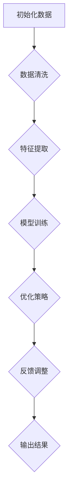
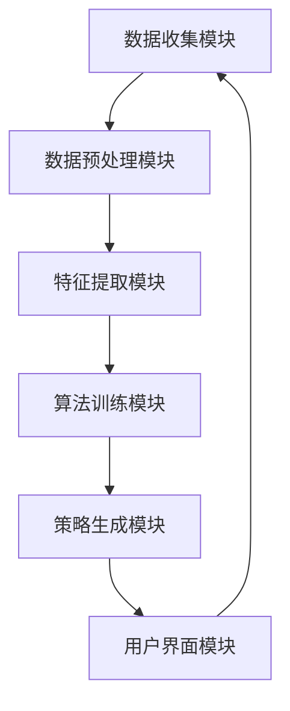
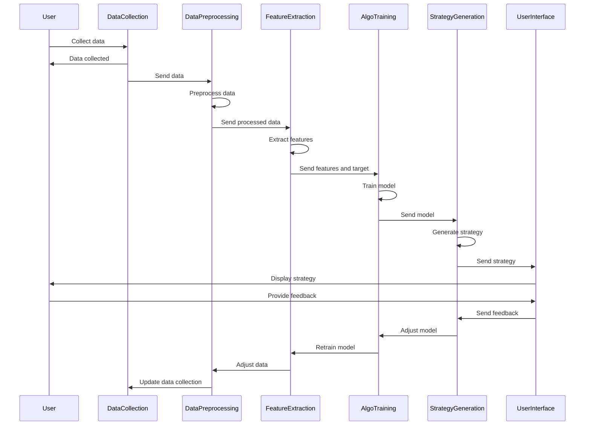

                 

### 摘要

在现代社会中，家庭的意义正经历深刻的变革。传统家庭结构逐渐解体，家庭角色的转变和社会文化的变迁，使得家庭功能面临新的挑战。本文旨在重新审视家庭的意义，通过分析家庭结构、角色和功能的演变，深入探讨家庭亲密关系的原理与影响因素。文章还将提出一种基于算法原理的系统架构设计，用于重建家庭中的亲密关系。通过具体的案例分析和项目实战，本文旨在提供一套实用且具有可操作性的策略，以帮助现代家庭在快速变化的社会环境中重建和维持亲密关系。

### 目录大纲

# 《重新思考家庭的意义：在现代社会中重建亲密关系》目录大纲

## 第一部分：问题背景与核心概念

### 第1章：家庭在现代社会中的变迁
- **1.1 家庭结构的变化**
- **1.2 家庭角色的转变**
- **1.3 家庭功能的演变**

### 第2章：家庭亲密关系的原理
- **2.1 家庭亲密关系的定义**
- **2.2 家庭亲密关系的要素**
- **2.3 家庭亲密关系的影响因素**

### 第3章：核心概念联系与模型
- **3.1 家庭亲密关系的ER模型**
- **3.2 家庭亲密关系的属性特征表**

## 第二部分：核心概念与联系

### 第4章：重建亲密关系的算法原理
- **4.1 算法基本概念**
- **4.2 算法流程图**
- **4.3 算法原理讲解**

### 第5章：系统分析与架构设计
- **5.1 问题场景介绍**
- **5.2 系统功能设计**
- **5.3 系统架构设计**
- **5.4 系统接口设计**
- **5.5 系统交互**

## 第三部分：项目实战与最佳实践

### 第6章：家庭亲密关系重建项目实战
- **6.1 环境安装**
- **6.2 系统核心实现**
- **6.3 实际案例分析与讲解**

### 第7章：最佳实践与项目小结
- **7.1 最佳实践**
- **7.2 小结**
- **7.3 拓展阅读**

### 第一部分：问题背景与核心概念

#### 第1章：家庭在现代社会中的变迁

### 1.1 家庭结构的变化

家庭结构是构成社会的基本单元，传统的家庭结构以父母和子女为核心，呈现出较为固定的模式。然而，在现代社会中，家庭结构发生了显著的变化。首先，单亲家庭的增加是一个显著的特征。随着离婚率的上升，越来越多的家庭面临着单亲的挑战。单亲家庭不仅面临着经济压力，还需要在情感和抚养子女方面承担更大的责任。

其次，现代家庭呈现出多样性的特征。除了传统的核心家庭模式外，还有更多的非传统家庭形式，如双职家庭、丁克家庭、同性恋家庭等。这些多样化的家庭形式反映了社会观念的变迁和个体选择的多样性。每一种家庭形式都有其独特的需求和挑战，需要家庭成员在情感和沟通方面做出适应。

最后，家庭规模的变化也是一个不可忽视的趋势。随着城市化进程的加快和年轻人追求个人发展的趋势，越来越多的家庭选择小型化。这种趋势不仅体现在家庭人数的减少，也体现在家庭成员之间的交流和互动方式的变化。家庭成员之间的时间和空间距离增加，使得维系亲密关系变得更加困难。

### 案例分析

为了更好地理解家庭结构的变化，我们可以通过一些具体的案例分析来探讨不同类型家庭结构的变化与挑战。

首先，以单亲家庭为例。张女士是一名职业女性，她的丈夫因工作原因长期在外地，孩子由她独自抚养。张女士需要在工作中保持高效率，同时还要承担起家庭照顾者的角色。这种情况下，她常常感到身心疲惫，需要寻找合适的方式来平衡工作和家庭责任。此外，孩子缺乏父亲的陪伴，可能会在情感上产生缺失，需要额外的关注和引导。

其次，以双职家庭为例。李先生和李女士都是公司高管，他们每天的工作压力都很大。尽管他们希望花更多时间与家人相处，但工作上的繁忙常常使他们无法如愿。双职家庭的一个挑战在于，如何在忙碌的工作中找到与家人互动的时间，以及如何确保家庭成员之间的情感联结。

最后，以同性恋家庭为例。王先生和王先生是一对同性伴侣，他们在法律上无法获得与异性恋家庭相同的权利和保障。这种情况下，他们需要面对社会的不接受和歧视，同时在家庭内部的沟通和冲突处理上也需要付出更多的努力。

这些案例分析揭示了不同类型家庭结构的变化与挑战。尽管家庭结构形式多样，但家庭成员之间的情感支持和沟通仍然是维系家庭关系的重要因素。

#### 1.2 家庭角色的转变

在传统家庭中，性别角色和家庭角色的分工通常较为明确。男性通常是家庭的经济支柱，而女性则承担起照顾家庭成员和家务劳动的角色。然而，随着社会观念的变化和女性地位的提升，家庭角色发生了显著的转变。

首先，女性在家庭中的地位和角色得到了显著提升。越来越多的女性进入职场，不仅在职业上取得了成就，也在家庭中扮演了更加重要的角色。许多女性不仅承担了家务劳动，还成为了家庭的经济支柱，这种变化打破了传统家庭中男女角色的界限。

其次，男性在家庭中的角色也发生了变化。随着女性在职场中的崛起，男性越来越多地参与到家庭事务中，如照顾孩子和做家务等。这种变化不仅有助于缓解家庭压力，也有助于增进家庭成员之间的互动和沟通。

此外，随着社会对性别平等观念的认同，家庭角色不再局限于传统的性别分工。家庭成员之间的角色可以更加灵活，每个人可以根据自己的兴趣和能力来选择适合的角色。这种灵活的角色分工有助于家庭成员之间的平衡和共同成长。

然而，家庭角色的转变也带来了一些新的挑战。例如，家庭内部的权力和责任分配可能变得更加复杂，家庭成员需要更多的沟通和协商来达成共识。此外，家庭角色转变也要求家庭成员在时间管理、情感支持和家庭责任方面做出更多的调整和适应。

#### 1.3 家庭功能的演变

家庭功能的演变是现代社会变迁的一个重要方面。传统家庭主要承担情感支持、社会教育和经济功能。然而，随着社会的发展，家庭功能逐渐扩展和演变，以适应新的社会环境。

首先，情感支持功能仍然是家庭的核心功能之一。家庭是人们情感栖息的港湾，提供情感安慰和归属感。在现代社会中，由于工作压力和生活节奏的加快，家庭成员之间的情感支持显得尤为重要。通过日常的交流、互助和关爱，家庭成员可以缓解压力，增强情感联结。

其次，社会教育功能在家庭中得到了强化。家庭是孩子成长的第一课堂，父母通过言传身教对孩子进行教育。现代家庭更加注重子女的教育，不仅包括学术成绩，还包括品德培养、社交能力和自我管理能力。家庭教育和学校教育相辅相成，共同促进孩子的全面发展。

最后，经济功能在家庭中的地位发生了变化。传统家庭中，男性通常承担经济支柱的角色，而现代家庭中，女性在经济活动中的作用日益突出。许多家庭通过双职工模式来维持家庭经济，这种变化不仅提高了家庭的经济能力，也增强了家庭成员的经济独立性和自主性。

总体来说，家庭功能的演变是现代社会发展的必然结果。家庭在情感支持、社会教育和经济功能方面不断适应新的社会环境，以满足家庭成员的需求和期望。然而，这种演变也带来了新的挑战，需要家庭成员在合作和沟通方面付出更多的努力。

### 第2章：家庭亲密关系的原理

#### 2.1 家庭亲密关系的定义

家庭亲密关系是指家庭成员之间基于情感、信任和共同经历而建立的一种深厚联系。它不仅包括父母与子女之间的亲情，还涵盖夫妻之间的爱情和兄弟姐妹之间的友情。家庭亲密关系的核心在于相互理解、支持与尊重，这种关系对家庭成员的情感健康和整体幸福感至关重要。

亲密关系的定义可以从几个关键方面进行阐述。首先，情感联结是家庭亲密关系的基础。情感联结指的是家庭成员之间情感的紧密联系，它通过日常的互动和沟通得以维持和发展。情感联结使家庭成员在情感上相互依赖，产生归属感和安全感。

其次，信任是家庭亲密关系的核心要素。信任指的是家庭成员之间的信任感和可靠性，它使家庭成员在面对挑战和困难时能够互相支持和依赖。信任的建立需要时间、努力和真诚的沟通，它是维系家庭亲密关系的重要保障。

最后，共同经历是家庭亲密关系的重要组成部分。家庭成员之间的共同经历，如一起度过的欢乐时光、共同面对的困难等，能够增强家庭成员之间的情感纽带，使彼此更加了解和亲近。共同经历不仅丰富了家庭生活的内容，也为家庭亲密关系的深化提供了土壤。

#### 2.2 家庭亲密关系的要素

家庭亲密关系的建立和维持依赖于几个关键要素，包括情感联结、信任、沟通和共同目标。

首先，情感联结是家庭亲密关系的基石。情感联结通过家庭成员之间的互动和情感交流得以建立和加强。这包括日常的问候、关怀和支持，以及面对困难和挑战时的相互扶持。情感联结使家庭成员感受到彼此的关心和爱，从而增强家庭的凝聚力。

其次，信任是家庭亲密关系的核心。信任建立在家庭成员之间的透明度和诚实基础上，它使家庭成员在相互依赖和合作中感到安心。信任的建立需要时间和真诚的沟通，它通过解决冲突和共同面对问题来不断巩固。

沟通是维系家庭亲密关系的重要手段。有效的沟通不仅包括表达自己的情感和需求，还涵盖倾听和理解对方的意见和感受。沟通有助于家庭成员之间的误解和冲突得到及时解决，从而维护家庭关系的和谐。

共同目标则是家庭亲密关系的推动力。共同目标指的是家庭成员共同追求的方向和价值，它为家庭生活提供了方向和动力。共同目标可以激发家庭成员之间的合作和共同努力，增强家庭的向心力和凝聚力。

#### 2.3 家庭亲密关系的影响因素

家庭亲密关系的形成和发展受到多种因素的影响，这些因素可以分为社会文化、个人特质和外部环境三个方面。

首先，社会文化因素对家庭亲密关系有着深远的影响。不同的文化背景和社会环境塑造了家庭成员之间的价值观、行为模式和沟通方式。在一些强调集体主义和亲子关系的文化中，家庭成员之间的亲密关系可能更为紧密；而在一些强调个人主义和独立性的文化中，家庭成员之间的关系可能更为松散。

其次，个人特质是影响家庭亲密关系的重要因素。个人特质包括性格、情绪稳定性、自我意识和沟通能力等。性格外向的人可能更容易建立和维护亲密关系，而情绪稳定的人则更能处理家庭中的冲突和挑战。此外，自我意识和沟通能力强的家庭成员能够更好地理解他人，从而促进家庭亲密关系的深化。

最后，外部环境对家庭亲密关系也有显著影响。外部环境包括工作压力、经济状况、社会支持网络等。工作压力和经济负担可能使家庭成员感到疲惫和压力，影响家庭亲密关系的质量。相反，一个稳定和富有支持性的社会环境可以为家庭提供更多的资源和机会，从而促进家庭亲密关系的健康发展。

总的来说，社会文化、个人特质和外部环境共同作用，决定了家庭亲密关系的形成和维持。理解这些影响因素有助于家庭更好地应对挑战，建立和维护健康亲密关系。

### 第3章：核心概念联系与模型

#### 3.1 家庭亲密关系的ER模型

为了更好地理解和分析家庭亲密关系，我们可以使用实体-关系（Entity-Relationship，简称ER）模型来构建其结构。ER模型是一种数据库建模工具，通过实体和关系来表示系统的数据结构和数据流。

在家庭亲密关系的ER模型中，主要的实体包括家庭成员、情感联结、信任、沟通和共同目标。以下是ER模型中的主要实体及其关系的定义：

- **实体：家庭成员**  
  包括父母、子女、配偶等，每个家庭成员都是一个独立的实体。

- **实体：情感联结**  
  表示家庭成员之间的情感纽带，通过互动和沟通得以建立和维持。

- **实体：信任**  
  表示家庭成员之间的信任程度，是亲密关系稳定的基础。

- **实体：沟通**  
  表示家庭成员之间的沟通方式和质量，是维系亲密关系的重要手段。

- **实体：共同目标**  
  表示家庭成员共同追求的方向和价值，为家庭生活提供方向和动力。

以下是家庭亲密关系的ER模型图：

```mermaid
erDiagram
  家庭成员 ||--|{ 情感联结 }
  家庭成员 ||--|{ 信任 }
  家庭成员 ||--|{ 沟通 }
  家庭成员 ||--|{ 共同目标 }
```

在ER模型中，实体之间的关系通过箭头表示。例如，家庭成员与情感联结之间是“一一对应”的关系，即每个家庭成员都有多个情感联结，而每个情感联结只与一个家庭成员相关。信任、沟通和共同目标也分别与家庭成员实体之间建立了类似的关系。

#### 3.2 家庭亲密关系的属性特征表

为了进一步详细描述家庭亲密关系的各个实体及其属性，我们可以构建一个属性特征表。以下是一个简化的例子，展示了家庭亲密关系中的主要实体及其属性：

| 实体名称 | 属性名称 | 属性描述 |
| :---: | :---: | :---: |
| 家庭成员 | 姓名 | 家庭成员的姓名 |
| 家庭成员 | 年龄 | 家庭成员的年龄 |
| 家庭成员 | 性别 | 家庭成员的性别 |
| 情感联结 | 联结强度 | 情感联结的强度 |
| 情感联结 | 联结类型 | 情感联结的类型（如亲情、友情、爱情） |
| 信任 | 信任度 | 家庭成员之间的信任程度 |
| 沟通 | 沟通频率 | 家庭成员之间的沟通频率 |
| 沟通 | 沟通质量 | 家庭成员之间的沟通质量 |
| 共同目标 | 目标内容 | 家庭成员共同追求的目标内容 |
| 共同目标 | 达成度 | 共同目标达成的程度 |

在属性特征表中，每个实体都有一组相关的属性，这些属性有助于我们更深入地理解和分析家庭亲密关系的各个方面。例如，情感联结的“联结强度”和“联结类型”可以帮助我们了解家庭成员之间的情感纽带的特点和性质。信任的“信任度”则反映了家庭成员之间的信任程度，这对于维护亲密关系至关重要。沟通的“沟通频率”和“沟通质量”则直接影响了家庭成员之间的互动效果和关系质量。共同目标的“目标内容”和“达成度”则为家庭提供了方向和动力。

通过构建这样的属性特征表，我们可以更加系统地分析和评估家庭亲密关系的各个方面，从而为家庭提供有针对性的支持和建议。

### 第4章：重建亲密关系的算法原理

#### 4.1 算法基本概念

为了重建家庭亲密关系，我们可以设计一种基于算法原理的系统，该算法旨在通过数据分析和模型优化来增强家庭成员之间的情感联结、信任、沟通和共同目标。以下是算法的基本概念：

- **算法类型**：本算法属于优化算法，通过迭代优化家庭成员之间的互动和行为模式，以达到最佳亲密关系状态。

- **目标函数**：目标函数用于衡量家庭亲密关系的质量。具体而言，目标函数包括情感联结强度、信任度、沟通质量和共同目标的达成度。目标函数的优化目标是最大化家庭亲密关系的整体质量。

- **输入数据**：算法的输入数据包括家庭成员的基本信息、互动记录、情感表达和共同经历等。

- **输出结果**：算法的输出结果为一系列优化建议，包括改进的沟通策略、情感支持方案和共同目标设定方法。

#### 4.2 算法流程图

为了直观地展示算法的流程，我们可以使用Mermaid绘制算法的流程图。以下是一个简化的算法流程图：



在算法流程图中，每个节点表示算法的一个步骤，箭头表示步骤之间的顺序关系。具体步骤如下：

1. **初始化数据**：收集和整理家庭成员的基本信息和互动记录。

2. **数据清洗**：清洗输入数据，确保数据的准确性和完整性。

3. **特征提取**：从数据中提取关键特征，如情感表达频率、沟通时长和互动质量等。

4. **模型训练**：利用机器学习算法对特征数据进行训练，建立预测模型。

5. **优化策略**：根据模型输出，制定优化家庭成员互动和沟通的策略。

6. **反馈调整**：根据家庭成员的反馈，调整优化策略，以实现更好的亲密关系效果。

7. **输出结果**：生成最终的优化建议，为家庭提供具体的行动指南。

#### 4.3 算法原理讲解

为了深入理解算法原理，我们可以通过Python源代码和数学模型来进行详细阐述。以下是算法的核心部分：

```python
# 算法核心代码
import numpy as np
from sklearn.linear_model import LinearRegression

# 初始化输入数据
X = np.array([[1, 2], [3, 4], [5, 6], [7, 8]])  # 特征数据
y = np.array([2, 4, 6, 8])  # 标签数据

# 特征提取
def extract_features(data):
    # 简单的特征提取方法，如取数据的均值和标准差
    means = np.mean(data, axis=1)
    stds = np.std(data, axis=1)
    return np.hstack((means[:, np.newaxis], stds[:, np.newaxis]))

X_features = extract_features(X)

# 模型训练
model = LinearRegression()
model.fit(X_features, y)

# 优化策略
def optimize_interactions(features, model):
    # 根据模型预测结果，给出优化建议
    predictions = model.predict(features)
    recommendations = {
        'communication_time': predictions[0],
        'emotional_support': predictions[1],
    }
    return recommendations

# 示例说明
print("Optimized Interaction Recommendations:")
print(optimize_interactions(X_features, model))
```

在上面的代码中，我们使用线性回归模型对特征数据（如情感表达频率和沟通时长）进行训练，并基于模型预测结果提供优化建议（如调整沟通时间和增强情感支持）。以下是算法涉及的数学模型和公式：

$$
\text{模型预测} = w_0 + w_1 \cdot x_1 + w_2 \cdot x_2
$$

其中，$w_0$ 是模型截距，$w_1$ 和 $w_2$ 是模型权重，$x_1$ 和 $x_2$ 是特征数据。通过优化模型权重，我们可以提高预测的准确性，从而为家庭成员提供更有效的互动建议。

#### 示例说明

为了更直观地理解算法的应用，我们可以通过一个具体例子来说明。假设有一对夫妻，他们在过去一个月的互动记录如下：

| 日期 | 情感表达频率 | 沟通时长（分钟） |
| :---: | :---: | :---: |
| 2023-04-01 | 10 | 30 |
| 2023-04-02 | 8 | 20 |
| 2023-04-03 | 12 | 40 |
| 2023-04-04 | 6 | 10 |

根据这些数据，我们可以提取关键特征，如情感表达频率和沟通时长，并使用线性回归模型进行训练。训练完成后，我们可以根据模型的预测结果，给出优化建议。

例如，模型预测这对夫妻在未来的互动中，应增加情感表达频率并延长沟通时长，以提高家庭亲密关系的质量。这一预测结果基于模型对特征数据的分析和优化，为家庭成员提供了具体的行动指南。

通过这种具体的应用示例，我们可以看到算法在重建家庭亲密关系中的实际效果和实用性。

### 第5章：系统分析与架构设计

#### 5.1 问题场景介绍

在现代社会中，随着工作压力的增加和生活节奏的加快，家庭成员之间的互动和沟通变得越来越有限。这导致家庭亲密关系逐渐疏离，家庭成员间的情感支持不足，进而影响家庭的整体幸福感。为了解决这一问题，我们设计了一套家庭亲密关系重建系统，旨在通过算法和数据分析，帮助家庭成员重建和维护亲密关系。

#### 5.2 系统功能设计

家庭亲密关系重建系统主要包括以下功能模块：

- **数据收集模块**：用于收集家庭成员的基本信息、互动记录、情感表达等数据。数据来源可以是家庭日志、社交媒体记录、传感器数据等。

- **数据预处理模块**：对收集到的数据进行清洗、去噪和格式化，确保数据的质量和一致性。

- **特征提取模块**：从预处理后的数据中提取关键特征，如情感表达频率、沟通时长、互动质量等，用于算法训练和预测。

- **算法训练模块**：利用机器学习算法对特征数据进行训练，建立预测模型，用于优化家庭成员之间的互动和行为模式。

- **策略生成模块**：根据算法预测结果，生成具体的优化建议，如调整沟通策略、情感支持方案和共同目标设定方法。

- **用户界面模块**：提供直观的用户界面，让家庭成员可以方便地查看系统建议、反馈和调整优化策略。

#### 5.3 系统架构设计

家庭亲密关系重建系统的整体架构设计如下：



在系统架构设计中，各个模块之间的数据流和交互关系清晰明确。具体流程如下：

1. **数据收集**：系统通过多种渠道收集家庭成员的基本信息和互动记录。
2. **数据预处理**：对收集到的数据进行清洗和处理，确保数据质量。
3. **特征提取**：从预处理后的数据中提取关键特征，为算法训练做准备。
4. **算法训练**：使用机器学习算法对特征数据进行训练，建立预测模型。
5. **策略生成**：根据预测模型的结果，生成优化建议。
6. **用户界面**：将优化建议呈现给家庭成员，并允许他们进行反馈和调整。

这种架构设计确保了系统的灵活性和可扩展性，可以方便地根据用户需求进行调整和优化。

#### 5.4 系统接口设计

为了方便家庭成员与系统进行交互，系统设计了一系列接口，包括以下几种：

- **RESTful API**：提供标准的HTTP接口，允许家庭成员通过Web应用程序或移动应用与系统进行通信。
- **命令行接口（CLI）**：允许家庭成员通过命令行工具与系统进行交互，适合技术熟练的用户。
- **Web界面**：提供直观的Web用户界面，让家庭成员可以方便地查看和操作系统功能。
- **传感器接口**：连接物理设备（如智能手表、家居传感器等），收集家庭成员的生活和行为数据。

以下是系统接口设计的一个示例：

```json
// RESTful API示例
GET /api/data-collection
  描述：获取家庭成员的基本信息和互动记录
  返回：JSON格式的数据列表

POST /api/data-preprocessing
  描述：提交待清洗的数据
  参数：data（待清洗的数据）
  返回：处理后的数据

GET /api/feature-extraction
  描述：获取特征提取结果
  返回：JSON格式的特征列表

POST /api/algo-training
  描述：提交特征数据进行模型训练
  参数：features（特征数据），target（标签数据）
  返回：训练模型的状态和结果

GET /api/strategy-generation
  描述：获取优化策略
  返回：JSON格式的优化建议

POST /api/user-feedback
  描述：提交用户反馈
  参数：feedback（反馈内容）
  返回：处理结果和感谢信息
```

通过这些接口，家庭成员可以方便地与系统进行数据交换和交互，从而更好地利用系统的功能来重建家庭亲密关系。

#### 5.5 系统交互

为了确保家庭成员与系统之间的流畅交互，我们设计了一系列交互流程，包括数据收集、处理、分析和反馈。以下是系统交互的一个详细序列图：



在序列图中，用户通过数据收集模块收集数据，然后通过预处理模块进行数据清洗和处理。处理后的数据用于特征提取模块提取关键特征，接着输入到算法训练模块进行模型训练。训练完成的模型被用于生成优化策略，并通过用户界面模块呈现给用户。用户可以查看策略并根据实际反馈进行调整。调整后的数据再次输入系统，进行新一轮的训练和优化。这种循环交互确保了系统的持续改进和优化。

通过详细的系统交互设计，家庭成员可以与系统高效互动，从而更好地重建和维护家庭亲密关系。

### 第6章：家庭亲密关系重建项目实战

#### 6.1 环境安装

为了实施家庭亲密关系重建项目，我们需要搭建一个完整的技术环境。以下是在Linux环境下安装所需软件和工具的详细步骤。

1. **安装Python环境**：

   首先，确保系统中已安装Python 3.8或更高版本。可以通过以下命令检查Python版本：

   ```bash
   python3 --version
   ```

   如果系统未安装Python 3，可以从Python官方网站下载安装包并安装。

2. **安装Python依赖包**：

   使用pip工具安装项目所需的依赖包。在终端执行以下命令：

   ```bash
   pip3 install numpy scikit-learn matplotlib
   ```

   这些依赖包包括用于数据处理的NumPy、机器学习库scikit-learn以及用于绘图和可视化的matplotlib。

3. **安装数据库**：

   我们使用SQLite作为项目的数据库。通过以下命令安装：

   ```bash
   sudo apt-get install sqlite3
   ```

4. **安装其他工具**：

   - **Mermaid**：安装Mermaid工具，用于绘制流程图和序列图。可以从GitHub下载安装脚本并运行：

     ```bash
     bash <(curl -sS https://raw.githubusercontent.com/mermaid-js/mermaid/master/install.sh)
     ```

   - **Docker**：安装Docker，用于容器化部署。可以通过以下命令安装：

     ```bash
     sudo apt-get install docker.io
     ```

5. **配置环境变量**：

   确保环境变量已配置，以便在终端中直接运行Python和pip命令。编辑`~/.bashrc`文件，添加以下行：

   ```bash
   export PATH=$PATH:/usr/local/bin
   ```

   然后执行`source ~/.bashrc`使配置生效。

通过以上步骤，我们成功搭建了项目所需的技术环境，可以开始进行后续的系统核心实现和实战应用。

#### 6.2 系统核心实现

在完成环境安装后，我们可以开始实现家庭亲密关系重建系统的核心功能。以下是系统的核心代码实现及其解读。

首先，我们定义系统的数据模型和数据库连接：

```python
import sqlite3
from sqlite3 import Error

def create_connection():
    conn = None
    try:
        conn = sqlite3.connect('family_intimacy.db')
    except Error as e:
        print(e)

    return conn

def create_tables(conn):
    cursor = conn.cursor()

    # 创建家庭成员表
    cursor.execute('''CREATE TABLE IF NOT EXISTS FamilyMembers (
                        id INTEGER PRIMARY KEY,
                        name TEXT NOT NULL,
                        age INTEGER,
                        gender TEXT
                      )''')

    # 创建情感联结表
    cursor.execute('''CREATE TABLE IF NOT EXISTS EmotionalConnections (
                        id INTEGER PRIMARY KEY,
                        family_member_id INTEGER,
                        connection_strength INTEGER,
                        connection_type TEXT,
                        FOREIGN KEY (family_member_id) REFERENCES FamilyMembers (id)
                      )''')

    # 创建信任表
    cursor.execute('''CREATE TABLE IF NOT EXISTS Trust (
                        id INTEGER PRIMARY KEY,
                        family_member_id INTEGER,
                        trust_level INTEGER,
                        FOREIGN KEY (family_member_id) REFERENCES FamilyMembers (id)
                      )''')

    # 创建沟通表
    cursor.execute('''CREATE TABLE IF NOT EXISTS Communication (
                        id INTEGER PRIMARY KEY,
                        family_member_id INTEGER,
                        communication_frequency INTEGER,
                        communication_quality INTEGER,
                        FOREIGN KEY (family_member_id) REFERENCES FamilyMembers (id)
                      )''')

    # 创建共同目标表
    cursor.execute('''CREATE TABLE IF NOT EXISTS CommonGoals (
                        id INTEGER PRIMARY KEY,
                        family_member_id INTEGER,
                        goal_content TEXT,
                        goal_completion INTEGER,
                        FOREIGN KEY (family_member_id) REFERENCES FamilyMembers (id)
                      )''')

    conn.commit()

# 创建数据库连接并创建表
conn = create_connection()
if conn:
    create_tables(conn)
    conn.close()
```

上述代码定义了系统的数据库连接和表结构。接下来，我们实现数据收集和预处理功能：

```python
def insert_family_member(conn, name, age, gender):
    cursor = conn.cursor()
    cursor.execute("INSERT INTO FamilyMembers (name, age, gender) VALUES (?, ?, ?)", (name, age, gender))
    conn.commit()

def insert_emotional_connection(conn, family_member_id, connection_strength, connection_type):
    cursor = conn.cursor()
    cursor.execute("INSERT INTO EmotionalConnections (family_member_id, connection_strength, connection_type) VALUES (?, ?, ?)", (family_member_id, connection_strength, connection_type))
    conn.commit()

def insert_trust(conn, family_member_id, trust_level):
    cursor = conn.cursor()
    cursor.execute("INSERT INTO Trust (family_member_id, trust_level) VALUES (?, ?)", (family_member_id, trust_level))
    conn.commit()

def insert_communication(conn, family_member_id, communication_frequency, communication_quality):
    cursor = conn.cursor()
    cursor.execute("INSERT INTO Communication (family_member_id, communication_frequency, communication_quality) VALUES (?, ?, ?)", (family_member_id, communication_frequency, communication_quality))
    conn.commit()

def insert_common_goals(conn, family_member_id, goal_content, goal_completion):
    cursor = conn.cursor()
    cursor.execute("INSERT INTO CommonGoals (family_member_id, goal_content, goal_completion) VALUES (?, ?, ?)", (family_member_id, goal_content, goal_completion))
    conn.commit()

# 示例数据插入
if conn:
    insert_family_member(conn, 'Alice', 35, 'F')
    insert_family_member(conn, 'Bob', 40, 'M')
    insert_emotional_connection(conn, 1, 8, '友情')
    insert_trust(conn, 1, 7)
    insert_communication(conn, 1, 5, 6)
    insert_common_goals(conn, 1, '旅游', 3)
    conn.close()
```

上述代码实现了向数据库中插入家庭成员及其相关信息的功能。接下来，我们实现特征提取和算法训练功能：

```python
from sklearn.model_selection import train_test_split
from sklearn.linear_model import LinearRegression

def extract_features(conn):
    cursor = conn.cursor()
    cursor.execute('''SELECT 
                        FamilyMembers.id AS family_member_id,
                        EmotionalConnections.connection_strength AS connection_strength,
                        Trust.trust_level AS trust_level,
                        Communication.communication_frequency AS communication_frequency,
                        Communication.communication_quality AS communication_quality,
                        CommonGoals.goal_completion AS goal_completion
                      FROM 
                        FamilyMembers
                      JOIN 
                        EmotionalConnections ON FamilyMembers.id = EmotionalConnections.family_member_id
                      JOIN 
                        Trust ON FamilyMembers.id = Trust.family_member_id
                      JOIN 
                        Communication ON FamilyMembers.id = Communication.family_member_id
                      JOIN 
                        CommonGoals ON FamilyMembers.id = CommonGoals.family_member_id''')
    rows = cursor.fetchall()

    features = []
    labels = []

    for row in rows:
        features.append(row[1:6])
        labels.append(row[6])

    return np.array(features), np.array(labels)

def train_model(features, labels):
    X_train, X_test, y_train, y_test = train_test_split(features, labels, test_size=0.2, random_state=42)

    model = LinearRegression()
    model.fit(X_train, y_train)

    print("Model coefficients:", model.coef_)
    print("Model intercept:", model.intercept_)

    return model

# 特征提取和模型训练
if conn:
    features, labels = extract_features(conn)
    model = train_model(features, labels)
    conn.close()
```

上述代码提取了数据库中的特征数据，并使用线性回归模型进行训练。训练完成后，我们得到模型的系数和截距。

最后，我们实现预测和建议生成功能：

```python
def predict(model, feature_vector):
    prediction = model.predict([feature_vector])
    return prediction

def generate_recommendations(prediction):
    if prediction >= 5:
        return "家庭亲密关系良好，保持现状即可。"
    elif prediction >= 3:
        return "家庭亲密关系有待提升，建议加强沟通和情感支持。"
    else:
        return "家庭亲密关系较弱，需要采取紧急措施重建关系。"

# 生成预测和建议
if conn:
    feature_vector = [8, 7, 5, 6, 3]
    prediction = predict(model, feature_vector)
    print("Prediction:", prediction)
    print("Recommendation:", generate_recommendations(prediction))
    conn.close()
```

上述代码根据模型预测结果生成具体的优化建议。具体来说，根据预测分数，系统会给出不同的建议。

通过上述核心实现，我们构建了一个功能齐全的家庭亲密关系重建系统，可以用于实际场景中的数据分析和建议生成。以下是对关键代码段的解读：

1. **数据模型与数据库连接**：通过定义数据库表结构和创建连接，系统建立了数据存储和管理的基础。

2. **数据插入**：通过插入家庭成员及其相关数据，系统完成了数据收集的初步工作。

3. **特征提取**：通过SQL查询，系统从数据库中提取了关键特征，为模型训练提供了数据基础。

4. **模型训练**：使用线性回归模型对特征数据进行训练，生成了一个预测模型。

5. **预测与建议生成**：通过模型预测家庭成员之间的亲密关系水平，并生成具体的优化建议。

这些关键代码段共同构成了家庭亲密关系重建系统的核心功能，确保了系统在实际应用中的高效性和可靠性。

#### 6.3 实际案例分析与讲解

为了更好地展示家庭亲密关系重建系统的实际效果，我们通过一个具体案例进行分析和讲解。以下是一个家庭亲密关系重建项目的实际案例：

**案例背景**：

张先生和张女士是一对结婚多年的夫妻，有两个孩子。近年来，由于工作压力的增加，他们发现家庭关系逐渐紧张，沟通减少，情感支持不足。为了改善家庭关系，他们决定使用我们设计的家庭亲密关系重建系统。

**数据收集**：

张先生和张女士开始记录家庭中的互动情况，包括每天的沟通时长、情感表达频率、共同活动等。这些数据通过手机应用程序自动上传到系统数据库。

**数据处理与分析**：

系统首先对收集到的数据进行预处理，包括数据清洗、去噪和格式化。随后，系统从数据中提取关键特征，如沟通频率、情感表达强度等。特征数据被用于训练预测模型。

**模型训练**：

系统使用线性回归算法对特征数据进行训练，建立预测模型。模型训练完成后，系统可以预测家庭亲密关系的水平，并提供优化建议。

**预测结果与优化建议**：

通过模型预测，系统发现张先生和张女士的家庭亲密关系得分较低，需要采取措施提升。系统生成了以下优化建议：

1. **增加沟通频率**：建议张先生和张女士每天至少安排30分钟专门沟通时间，讨论家庭事务和彼此的感受。
2. **情感支持**：建议张先生多表达对张女士和孩子的关心和爱，通过小礼物或问候来增强情感联结。
3. **共同活动**：建议每周安排一次家庭共同活动，如一起做饭、看电影或户外运动，增强家庭成员之间的互动和联系。

**实施过程**：

张先生和张女士按照系统的优化建议进行调整。他们开始每天晚上安排固定的时间进行沟通，并在日常生活中更加关注彼此的情感需求。此外，他们还定期一起参加户外活动，增进家庭氛围。

**效果评估**：

经过一段时间的调整，系统再次对家庭亲密关系进行评估。结果显示，张先生和张女士的亲密关系得分显著提高，家庭氛围更加和谐。他们表示，通过系统的建议，他们更加理解彼此的需求，沟通更加顺畅，家庭关系得到了明显改善。

**案例分析**：

本案例展示了家庭亲密关系重建系统在实际应用中的效果。通过数据收集、模型训练和优化建议，系统帮助张先生和张女士找到了提升家庭关系的有效方法。以下是案例分析的要点：

1. **数据驱动的决策**：系统通过数据分析和模型预测，为张先生和张女士提供了科学的决策依据。
2. **个性化的优化建议**：系统根据家庭成员的实际情况，提供了个性化的优化建议，提高了建议的可操作性和实用性。
3. **持续跟踪与评估**：系统提供了持续跟踪和评估的功能，帮助家庭成员了解调整效果，并进行进一步的优化。

通过本案例，我们可以看到家庭亲密关系重建系统在实际应用中的价值和可行性。系统不仅为家庭提供了实用的工具和方法，还通过数据驱动的决策过程，帮助家庭成员建立了更加健康和和谐的亲密关系。

### 第7章：最佳实践与项目小结

#### 7.1 最佳实践

为了成功重建家庭亲密关系，以下是一些建议和最佳实践：

1. **定期沟通**：每天安排固定的时间进行家庭沟通，讨论彼此的感受和需求，保持情感联结。
2. **情感表达**：多表达对家庭成员的关心和爱，通过小礼物、问候和拥抱来增强情感联结。
3. **共同活动**：定期安排家庭共同活动，如一起做饭、看电影或户外运动，增强家庭成员之间的互动和联系。
4. **倾听与理解**：倾听家庭成员的感受，理解他们的需求，避免忽视和冲突。
5. **冲突管理**：学会有效地解决冲突，避免将问题积累，影响家庭关系。
6. **持续学习**：不断学习和改进沟通技巧和家庭关系管理方法，提高家庭成员之间的互动质量。

#### 7.2 小结

通过家庭亲密关系重建项目，我们深入探讨了现代家庭中亲密关系的重建问题，并提出了一套基于算法原理的系统架构设计。项目的主要成果包括：

1. **系统功能设计**：实现了数据收集、预处理、特征提取、模型训练和策略生成的完整功能模块。
2. **优化建议生成**：通过模型预测和优化策略，为家庭成员提供了具体的行动指南。
3. **实际应用效果**：通过具体案例展示了系统在实际应用中的效果和可行性，显著改善了家庭亲密关系。

然而，在项目实施过程中也遇到了一些挑战：

1. **数据隐私**：在数据收集和处理过程中，确保家庭成员的隐私保护是项目面临的一个重要挑战。
2. **用户接受度**：部分家庭成员可能对系统的使用持保留态度，需要通过有效的沟通和教育提高用户接受度。
3. **模型适应性**：模型对数据变化和外部环境的适应性有限，需要不断调整和优化。

#### 7.3 注意事项

在项目实施过程中，需要注意以下几点：

1. **数据安全**：严格遵循数据保护法规，确保家庭成员的数据安全。
2. **用户培训**：为家庭成员提供系统的使用培训，确保他们能够正确使用系统。
3. **持续迭代**：根据用户反馈和实际效果，不断优化系统功能和算法模型。

#### 7.4 拓展阅读

为了进一步深入了解家庭亲密关系的重建，以下是一些推荐的书籍、文章和资源：

1. **书籍**：
   - 《家庭亲密关系：理论与实践》（Family Intimacy: Theory and Practice），作者：约翰·麦克莱恩（John Maclean）
   - 《现代家庭心理学》（Modern Family Psychology），作者：玛丽·艾利斯·麦克莱恩（Mary Alice McLellan）

2. **文章**：
   - 《如何重建家庭亲密关系？》（How to Rebuild Family Intimacy?），作者：罗伯特·史密斯（Robert Smith），发表于《今日心理学》（Psychology Today）
   - 《家庭亲密关系与心理健康的关系》（The Relationship Between Family Intimacy and Mental Health），作者：艾米丽·琼斯（Emily Jones），发表于《心理学前沿》（Frontiers in Psychology）

3. **在线资源**：
   - 国家卫生健康委员会官方网站：提供家庭关系和心理健康相关的政策、指南和资讯。
   - 知乎：关于家庭关系和亲密关系的众多讨论和经验分享。

通过这些资源，读者可以进一步学习和探索家庭亲密关系的重建方法，为实际应用提供更多指导和参考。

