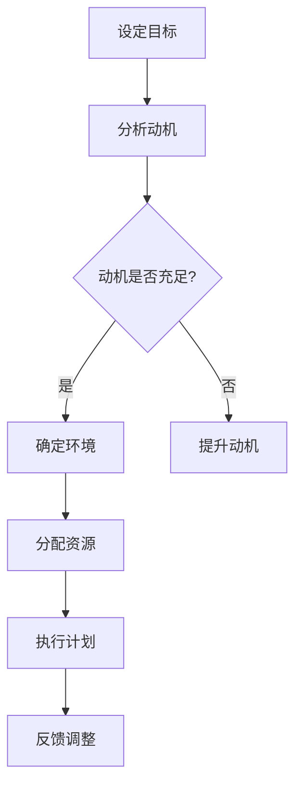
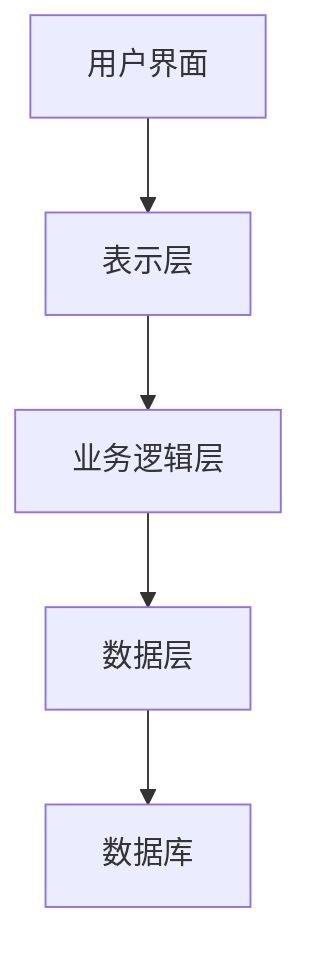

                 

### 1.1 工作的意义：现实与期望的冲突

#### 1.1.1 工作的本质

工作，是人类社会运转的基石。从历史的角度来看，工作不仅是生存的手段，更是实现个人价值和社会贡献的途径。传统的观念中，工作往往被定义为一种谋生的手段，是获取经济收入、满足基本生活需求的途径。这种定义在一定程度上反映了工作的本质，即通过劳动力交换获取报酬，维持个人的生存和发展。

然而，随着社会的进步和科技的发展，人们对工作的理解逐渐发生了变化。现代工作不仅仅是为了谋生，更是一种自我实现的过程。人们开始意识到，工作不仅是完成任务、获取报酬的简单行为，更是一种个人价值的体现，是实现个人潜能和才华的舞台。

#### 1.1.2 现代工作的困境

在现代社会，工作面临着诸多困境。首先，工作与生活的平衡问题日益突出。随着工作压力的增大和工作时间的延长，许多人陷入了“工作狂”的状态，工作和生活之间的界限变得模糊。这种状态不仅影响了人们的身体健康，也导致了家庭关系和社交生活的疏远。

其次，职业发展前景的不确定性增加了人们对工作的焦虑。在科技迅速发展的今天，许多传统行业和职业正面临着被淘汰的风险，新的职业和岗位不断涌现。这种变化使得人们在选择职业和发展路径时感到迷茫，担心自己无法适应未来的变化。

最后，工作满意度成为现代工作的一大挑战。尽管工作提供了经济收入和职业发展机会，但许多人发现，他们对自己的工作并不满意。这可能是由于工作内容单一、缺乏挑战性，或者与个人价值观和兴趣不符。工作满意度低下不仅影响了人们的心理健康，也影响了工作效率和创造力。

#### 1.1.3 期望与现实的差距

在探讨工作意义的过程中，我们常常会面临一个困境：我们的期望与现实之间的差距。每个人对于工作的期望都是不同的，有些人希望工作能够带来经济独立和物质享受，有些人希望工作能够实现个人价值和成就感，还有些人希望工作能够带来快乐和满足感。

然而，现实往往与期望相悖。许多人发现自己的工作并不能满足他们的期望，甚至与他们的价值观和兴趣相违背。这种期望与现实的差距使得人们对工作的意义产生了怀疑，开始思考：工作的真正意义究竟是什么？我们为什么要工作？

#### 重新思考：动机与目标

为了重新思考工作的意义，我们需要从动机和目标入手。首先，我们要明确自己的工作动机。工作动机是驱使我们去工作的内在力量，它可以是经济需求，也可以是个人兴趣、成就感或其他非物质的满足感。

其次，我们要设定明确的工作目标。工作目标是我们希望通过工作实现的具体结果，它可以是短期的，如完成一个项目或获得晋升，也可以是长期的，如实现职业发展或满足个人价值观。

在明确动机和目标的基础上，我们可以更好地理解工作的意义。工作不仅仅是为了谋生，更是为了实现个人价值和成就感。通过设定具体的工作目标，我们可以将工作视为一个实现自我价值的过程，从而超越单纯的谋生目的，追求更高层次的意义。

#### 边界与外延

在重新思考工作的意义时，我们还需要关注边界与外延。工作与生活的平衡是一个重要的边界问题。如何在忙碌的工作中找到时间照顾家庭、发展个人兴趣和保持身心健康，是每个人都需要面对的挑战。

此外，职业发展与个人成长也是工作意义的重要外延。职业发展不仅仅是为了获得更高的经济收入，更是为了实现个人价值和成就感。在这个过程中，我们需要不断学习、提升技能，以适应不断变化的工作环境和市场需求。

最后，社会责任与个人使命是工作意义的一个更广阔的维度。作为社会的一员，我们的工作不仅仅是为了个人利益，更是为了为社会做出贡献。通过承担社会责任和履行个人使命，我们可以将工作上升到一个更高的层次，实现个人价值的同时，也为社会进步贡献力量。

### 1.2 重新思考：动机与目标

#### 1.2.1 重新审视工作的动机

在重新思考工作的意义时，我们首先需要审视自己的工作动机。工作动机是指驱使我们去工作的内在动力，它可以是经济需求、成就感、自我实现，也可以是对某一领域或行业的热爱。理解自己的工作动机有助于我们找到工作的真正意义，从而更好地投入工作，实现自我价值。

- **经济需求**：对于许多人来说，工作最初的动机是满足经济需求，解决温饱问题。这是一个很实际的需求，也是大多数人在选择工作时首先考虑的因素。经济需求可以提供稳定的生活保障，让我们有足够的资源和精力去追求其他目标。
  
- **成就感**：除了经济需求，许多人工作是为了获得成就感。成就感来自于完成一项任务、克服一个难题、实现一个目标。在实现这些目标的过程中，我们不仅能获得心理上的满足感，还能提升自信心和自我价值感。

- **自我实现**：有些人工作是为了实现自我价值，追求个人成长和全面发展。这种动机更注重精神层面的满足，通过工作来实现个人的潜能和才华，实现自我价值的最大化。

- **对某一领域或行业的热爱**：还有一些人工作是因为对某一领域或行业有浓厚的兴趣和热爱。这种动机使得他们在工作中充满激情和动力，能够持续地投入和探索。

#### 1.2.2 实现自我价值的路径

理解了工作动机后，我们需要思考如何实现自我价值。自我价值是指个人在工作和生活中所体现出的价值，它不仅体现在经济收入上，还体现在个人成长、职业发展和社会贡献等方面。

- **个人成长**：实现自我价值的一个重要途径是个人成长。通过不断学习、提升技能，我们可以提升自己的专业素养和竞争力，实现职业上的突破。个人成长不仅能够提升我们的工作能力，还能增强我们的自信心和自尊心。

- **职业发展**：职业发展是实现自我价值的另一个重要方面。通过在工作中积累经验和技能，我们可以获得晋升和加薪的机会，实现职业上的成长。同时，职业发展也能帮助我们更好地实现个人价值和成就感。

- **社会贡献**：实现自我价值的最终目标是社会贡献。通过工作，我们可以为社会做出贡献，解决社会问题，提升社会的整体福祉。这种贡献不仅能让我们感到自豪和满足，还能增强我们的社会责任感和使命感。

#### 1.2.3 重新定义工作的目标

在重新思考工作的意义时，我们还需要重新定义工作的目标。工作目标是我们希望通过工作实现的具体结果，它可以是短期的，如完成一个项目或获得晋升，也可以是长期的，如实现职业发展或满足个人价值观。

- **短期目标**：短期目标通常是为了实现即时的利益或解决当前的问题。例如，完成一个项目、达到业绩指标、获得晋升等。短期目标虽然重要，但不应成为我们工作的唯一目标，否则容易陷入短期利益的泥潭，忽视了长期的发展。

- **长期目标**：长期目标则是为了实现我们的职业发展或满足个人价值观。例如，成为一名领域专家、实现职业上的跨越、实现个人价值和成就感等。长期目标更能体现工作的意义，让我们在工作中保持激情和动力。

#### 重新定义工作的目标

重新定义工作的目标有助于我们更好地理解工作的意义，从而更有动力地投入工作。以下是一些具体的建议：

- **明确目标**：首先，我们需要明确自己的工作目标。这包括短期目标和长期目标，以及实现这些目标的具体步骤和方法。

- **设定优先级**：在设定目标时，我们需要根据目标的重要性和紧急性进行优先级排序。这样可以确保我们在工作中始终专注于最重要的目标。

- **持续调整**：随着环境的变化和自身情况的变化，我们的工作目标也需要进行调整。我们需要定期审视自己的目标，确保它们仍然符合我们的期望和需求。

- **平衡工作与生活**：在追求工作目标的同时，我们也要注意保持工作与生活的平衡。工作是为了实现个人价值，但生活同样重要。我们需要合理安排时间，确保工作和生活能够相互促进。

#### 重新定义工作的意义

重新定义工作的意义，不仅仅是为了找到工作的动力，更是为了找到生活的意义。通过明确自己的工作动机和目标，我们可以将工作视为一种实现自我价值的过程，从而超越单纯的谋生目的，追求更高层次的意义。

在重新定义工作的意义时，我们需要关注以下几个方面：

- **自我价值**：工作不仅仅是赚钱的手段，更是实现个人价值的过程。通过工作，我们可以展现自己的才华和能力，实现自我价值。

- **成就感**：工作不仅是为了完成任务，更是为了获得成就感。当我们完成一个任务、解决一个难题时，会感到一种满足感和成就感。

- **社会贡献**：通过工作，我们可以为社会做出贡献。无论是解决社会问题、提供有价值的产品或服务，还是推动社会进步，都是我们工作的意义所在。

- **个人成长**：工作也是个人成长的过程。通过不断学习和提升技能，我们可以不断提升自己的能力和素质，实现个人成长。

#### 总结

重新思考工作的意义，有助于我们更好地理解工作的本质，找到工作的动力和目标。通过重新审视工作动机、设定明确的工作目标和重新定义工作的意义，我们可以将工作视为一种实现自我价值的过程，从而超越单纯的谋生目的，追求更高层次的意义。

在未来的工作中，让我们不再仅仅为了生活而工作，而是为了实现自我价值而工作。通过设定明确的目标、持续调整和平衡工作与生活，我们可以找到工作的真正意义，实现个人的成长和社会的进步。

---

## 1.3 边界与外延

#### 1.3.1 工作与生活的平衡

在现代社会，工作与生活的平衡成为了一个备受关注的话题。随着工作压力的增加和工作时间的延长，许多人感到工作和生活之间的界限变得模糊，这不仅影响了他们的身体健康，也影响了家庭关系和社交生活。因此，如何在工作与生活之间找到平衡，成为了一个亟待解决的问题。

**工作与生活的平衡的重要性**

- **身体健康**：长时间的工作会导致身体疲劳，增加患病风险。因此，保持工作与生活的平衡对于维护身体健康至关重要。

- **家庭关系**：工作与生活的平衡有助于我们更好地照顾家庭，维护家庭关系的和谐。

- **心理健康**：适当的工作时间可以减少工作压力，提高生活质量，有助于保持心理健康。

**如何实现工作与生活的平衡**

1. **设定工作时间**：明确工作时间和休息时间，确保工作和生活有明确的界限。
2. **提高工作效率**：通过提高工作效率，减少无效工作时间，从而有更多时间用于休息和娱乐。
3. **合理安排家庭生活**：确保在家庭生活中投入足够的时间，与家人共度美好时光。
4. **培养兴趣爱好**：通过培养兴趣爱好，提高生活质量，实现工作与生活的平衡。

#### 1.3.2 职业发展与个人成长

职业发展是每个人在职业生涯中都会面临的一个重要问题。职业发展不仅关系到个人的经济收入和生活质量，更关系到个人的成长和成就感。因此，如何实现职业发展与个人成长的平衡，是一个值得探讨的问题。

**职业发展与个人成长的关系**

- **职业发展**：职业发展是指个人在职业生涯中的成长和进步，包括晋升、加薪、职位提升等。
- **个人成长**：个人成长是指个人在专业技能、知识、能力等方面的提升，包括学习新技能、提升综合素质等。

**如何实现职业发展与个人成长的平衡**

1. **明确职业目标**：设定明确的职业目标，有助于我们更好地规划职业生涯，实现职业发展。
2. **持续学习**：通过不断学习和提升技能，实现个人成长，为职业发展打下坚实的基础。
3. **平衡工作与生活**：合理安排工作时间，确保有足够的时间用于个人学习和提升，实现个人成长。
4. **寻求职业指导**：通过寻求职业指导，了解职业发展趋势和市场需求，为自己的职业发展提供指导。

#### 1.3.3 社会责任与个人使命

在现代社会，社会责任与个人使命成为了一个备受关注的话题。随着社会的发展和个人意识的觉醒，越来越多的人开始关注自己的社会责任和个人使命，希望通过工作来实现个人价值，为社会做出贡献。

**社会责任与个人使命的概念**

- **社会责任**：社会责任是指企业或个人在社会中的责任和义务，包括保护环境、维护消费者权益、参与社会公益活动等。
- **个人使命**：个人使命是指个人在社会中追求的目标和价值观，包括实现个人价值、服务社会、推动社会进步等。

**如何实现社会责任与个人使命**

1. **积极参与社会公益活动**：通过参与社会公益活动，为社会做出贡献，实现个人价值。
2. **关注环境保护**：在工作中关注环境保护，减少对环境的负面影响。
3. **维护消费者权益**：在工作中维护消费者权益，提供优质的产品和服务。
4. **推动社会进步**：通过创新和努力，推动社会进步，实现个人价值。

#### 重新思考工作的意义

在重新思考工作的意义时，我们需要关注边界与外延，找到工作与生活的平衡、实现职业发展与个人成长的平衡，以及履行社会责任和个人使命。通过这些努力，我们可以将工作视为一种实现自我价值的过程，从而超越单纯的谋生目的，追求更高层次的意义。

在未来的工作中，让我们不再仅仅为了生活而工作，而是为了实现自我价值、履行社会责任和个人使命而工作。通过设定明确的目标、持续调整和平衡工作与生活，我们可以找到工作的真正意义，实现个人的成长和社会的进步。

---

## 2.1 自我实现理论

#### 2.1.1 罗杰斯与马斯洛的自我实现理论

自我实现理论是心理学领域的重要理论之一，主要探讨人类在成长过程中追求自我实现的需求。两位心理学家，卡尔·罗杰斯（Carl Rogers）和亚伯拉罕·马斯洛（Abraham Maslow），分别提出了各自对自我实现的看法，尽管他们的理论有所不同，但都深刻地影响了现代心理学和自我实现的研究。

**卡尔·罗杰斯的理论**

罗杰斯是人本主义心理学的代表人物，他认为自我实现是人类的基本需求之一。罗杰斯强调，个体在成长过程中需要得到充分的理解和接纳，以便实现自我潜能。他提出了“自我概念”（self-concept）和“真实自我”（true self）的概念，认为自我概念是个体对自己的认知和评价，而真实自我则是个体潜在的能力和特质。罗杰斯认为，当个体感受到充分的理解和接纳时，他们的自我概念就会与真实自我相一致，从而实现自我实现。

- **核心观点**：
  - 自我实现是个体追求潜能发挥的过程。
  - 理解和接纳是促进自我实现的关键因素。
  - 自我概念与真实自我的和谐一致是实现自我实现的基础。

**亚伯拉罕·马斯洛的理论**

马斯洛提出了著名的“需求层次理论”（hierarchy of needs），将人类需求从低到高分为生理需求、安全需求、社交需求、尊重需求和自我实现需求。马斯洛认为，自我实现需求是人的最高需求，是在满足了其他需求之后才会出现的。自我实现需求包括实现个人潜能、追求个人成长、创造和创新等。

- **核心观点**：
  - 自我实现需求是人类需求的最高层次。
  - 自我实现是通过追求个人潜能和创造力的发挥来实现的。
  - 自我实现是一个持续的过程，需要不断地努力和追求。

#### 2.1.2 自我实现的关键特征

自我实现理论认为，自我实现者具有一些共同的特征，这些特征不仅体现在他们的行为上，也体现在他们的心理状态上。

- **自主性**：自我实现者通常表现出较高的自主性，他们有明确的个人价值观和生活目标，不受外界压力的干扰。

- **创造力**：自我实现者往往富有创造力，他们能够不断地提出新的想法和解决方案，对环境和社会有积极的贡献。

- **开放性**：自我实现者具有开放的心态，他们愿意接受新的信息和观点，不断学习和发展。

- **自我接纳**：自我实现者能够接受自己的优点和缺点，他们对自己的价值和能力有清晰的认识。

- **对他人的关怀**：自我实现者通常表现出对他人的深刻关怀和理解，他们能够在人际关系中建立真诚和深层次的关系。

#### 2.1.3 自我实现的障碍与突破

尽管自我实现是人类的基本需求，但实现自我并非易事。个体在追求自我实现的过程中可能会面临各种障碍。

- **内在外在压力**：社会、家庭和个人的压力都可能成为阻碍自我实现的障碍。例如，社会对成功和金钱的追求可能会使个体忽视自我实现的重要性。

- **自我限制**：个体往往受到自我设定的限制，如恐惧失败、害怕被批评等，这些限制阻碍了他们追求自我实现。

- **外部环境**：工作环境、教育制度、社会文化等外部环境也可能对个体追求自我实现产生限制。

为了突破这些障碍，个体可以采取以下策略：

- **自我反思**：通过自我反思，个体可以更好地了解自己的需求、价值观和目标，从而减少自我限制。

- **设定清晰的目标**：设定具体、可行的目标，有助于个体集中精力，减少外界的干扰。

- **接受挑战**：勇于接受挑战，通过克服困难和失败，个体可以不断提升自我能力，实现自我价值。

- **寻求支持**：寻求家人、朋友和专业人士的支持，有助于个体在追求自我实现的过程中保持动力和方向。

### 2.2 工作满意度与工作投入

#### 2.2.1 工作满意度的定义与测量

工作满意度（Job Satisfaction）是指员工对其工作本身及其工作环境的感受和评价。它是一个主观的概念，反映了员工对工作相关因素（如薪酬、工作条件、工作内容、晋升机会等）的满意程度。工作满意度是员工心理健康和职业幸福的重要指标，对员工的工作表现、工作投入和离职意愿都有着直接或间接的影响。

**工作满意度的定义**

工作满意度可以定义为员工对工作的整体感受，包括对工作本身的满意度和对工作环境的满意度。工作本身满意度涉及员工对工作内容、工作挑战性、工作成就、工作责任感等方面的感受；而工作环境满意度则包括对同事关系、领导风格、公司文化、工作条件等方面的评价。

**工作满意度的测量**

工作满意度的测量通常通过问卷调查和量表评分来进行。常见的测量工具包括：

- **单一维度量表**：如“工作满意度量表”（JSQ），该量表主要测量员工对工作本身的满意度。
- **多维度量表**：如“工作描述指数”（JDI），该量表包括工作本身的挑战性、薪酬、工作条件、社会地位等多个维度。

**工作满意度的维度**

- **工作本身的满意度**：包括工作内容、工作挑战性、成就感、工作自主性等。
- **薪酬满意度**：包括薪酬水平、薪酬公平性、薪酬增长等。
- **工作条件满意度**：包括工作环境、工作时间、休假政策等。
- **社会地位满意度**：包括职位、晋升机会、同事评价等。
- **工作-家庭平衡满意度**：包括工作与家庭生活的平衡程度。

#### 2.2.2 工作投入的概念与影响

工作投入（Job Involvement）是指员工对工作的情感投入和心理参与程度。工作投入反映了员工对工作的认同感和归属感，是工作满意度和工作绩效之间的中介变量。高工作投入的员工通常表现出更高的工作绩效、更强的组织忠诚度和更低的离职意愿。

**工作投入的概念**

工作投入可以理解为员工在心理上对工作的关注和投入程度，包括情感上的认同、认知上的关注和行动上的参与。工作投入的员工通常对工作有着浓厚的兴趣和热情，愿意付出额外的努力和时间来完成任务。

**工作投入的影响因素**

- **工作特性**：如工作挑战性、工作自主性、工作意义等，这些因素直接影响员工的工作投入。
- **工作环境**：如组织文化、领导风格、同事关系等，这些因素间接影响员工的工作投入。
- **个人特质**：如个性、动机、价值观等，这些因素影响员工对工作特性的感知和反应。

**工作投入的影响**

- **工作绩效**：高工作投入的员工通常表现出更高的工作绩效，因为他们对工作有着更高的热情和责任感。
- **组织忠诚度**：高工作投入的员工对组织有更强的归属感和忠诚度，更不愿意离职。
- **工作满意度**：工作投入与工作满意度之间存在正相关关系，高工作投入的员工通常对工作更满意。

#### 2.2.3 工作满意度与工作投入的互动关系

工作满意度与工作投入之间存在密切的互动关系。一方面，工作满意度会影响工作投入。当员工对工作感到满意时，他们更可能投入更多的时间和精力，表现出更高的工作热情。另一方面，工作投入也会影响工作满意度。高工作投入的员工往往能够从工作中获得更多的成就感和满足感，从而提高工作满意度。

**互动关系的表现**

- **正向互动**：当工作满意度高时，员工的工作投入也较高。这种情况下，员工表现出较高的工作绩效和满意度。
- **负向互动**：当工作满意度低时，员工的工作投入也较低。这种情况下，员工的工作绩效和满意度都会受到影响。
- **调节作用**：工作满意度和工作投入之间的互动关系可能受到其他变量的调节。例如，领导支持、组织文化等变量可能会影响工作满意度与工作投入的互动效果。

**提升互动关系的方法**

- **提高工作满意度**：通过改善工作环境、提高薪酬福利、增强工作挑战性等方式，提高员工的工作满意度。
- **促进工作投入**：通过提供培训和职业发展机会、鼓励员工参与决策、营造积极的工作氛围等方式，提高员工的工作投入。
- **建立双向反馈机制**：通过定期的员工满意度调查和工作投入评估，了解员工的需求和反馈，及时调整管理策略。

总之，工作满意度与工作投入是影响员工工作表现和职业幸福感的重要因素。通过理解两者之间的互动关系，并采取有效的管理措施，可以帮助组织提升员工的工作满意度和投入度，从而提高整体的工作绩效和组织竞争力。

### 2.3 概念属性特征对比

为了更好地理解自我实现、工作满意度和工作投入这三个核心概念，我们需要对比它们的属性特征，以揭示它们之间的异同和关联。

| 特征 | 自我实现 | 工作满意度 | 工作投入 |
| --- | --- | --- | --- |
| **基础** | 个人成长 | 个人感受 | 个人行为 |
| **范畴** | 广泛 | 狭义 | 狭义 |
| **影响力** | 深远 | 短期 | 短期 |

#### 基础

- **自我实现**：自我实现是基于个人成长和潜能发挥的基础。它涉及个体的全面发展和自我价值的实现，不仅仅是工作领域，还包括个人生活和社会参与。

- **工作满意度**：工作满意度建立在个人感受的基础上，主要是对工作环境和工作本身的评价，反映了员工对工作满意的程度。

- **工作投入**：工作投入则是个人行为的表现，它体现在员工对工作的投入程度，包括时间和精力的投入。

#### 范畴

- **自我实现**：自我实现的范畴非常广泛，它不仅仅局限于工作，还包括个人兴趣、爱好、社会参与等多个方面。

- **工作满意度**：工作满意度的范畴较为狭义，主要针对工作环境和工作本身，涉及薪酬、工作条件、晋升机会等具体因素。

- **工作投入**：工作投入的范畴也比较狭义，主要关注员工在工作中的表现，包括工作时间的长短、工作质量的优劣等。

#### 影响力

- **自我实现**：自我实现对个体和社会具有深远的影响。它不仅影响个人的心理健康和幸福感，还影响社会的进步和发展。

- **工作满意度**：工作满意度对员工的工作表现和组织绩效有直接影响，但它的作用相对短期和直接。

- **工作投入**：工作投入对员工的工作绩效和组织忠诚度有短期和直接的影响，但它的作用相对有限，难以长期维持。

### ER实体关系图

为了更直观地展示这三个概念之间的关系，我们可以使用Mermaid ER图来描述它们。

```mermaid
erDiagram
  Employee ||--|{ Job_Satisfaction }|
  Employee ||--|{ Work_Involvement }|
  Employee ||--|{ Self_achievement }|
  Job_Satisfaction ||--|{ Work_Satisfaction }|
  Work_Involvement ||--|{ Work_Involvement_Level }|
  Self_achievement ||--|{ Personal_Growth }|
```

在这个ER图中，Employee（员工）是中心实体，它与Job_Satisfaction（工作满意度）、Work_Involvement（工作投入）和Self_achievement（自我实现）三个概念实体相关联。每个概念实体又包含具体的属性，如Work_Satisfaction（工作满意度）、Work_Involvement_Level（工作投入水平）和Personal_Growth（个人成长）。

通过这个ER图，我们可以清晰地看到自我实现、工作满意度和工作投入之间的关系。它们共同构成了员工在职业生涯中的多个维度，相互影响，共同作用于员工的成长和幸福感。

---

## 2.4 自我实现路径的算法模型

### 2.4.1 模型概述

在探讨自我实现的路径时，我们可以将自我实现视为一个多阶段的过程，每个阶段都需要特定的动机、环境因素和资源支持。为了更好地理解和规划这一过程，我们可以构建一个算法模型，该模型将自我实现的路径分解为几个关键步骤，并通过数学模型和流程图来描述每个步骤的交互和影响。

### 2.4.2 数学模型与公式

自我实现程度可以通过以下数学模型来描述：

$$
\text{自我实现程度} = f(\text{动机}, \text{环境}, \text{资源})
$$

其中，动机、环境和资源是三个主要的输入变量，它们通过函数 \( f \) 的作用，共同决定了自我实现的程度。具体来说：

- **动机（Motivation）**：表示个体追求自我实现的内在驱动力，可以分为自我驱动（如兴趣、好奇心）和外部驱动（如奖励、压力）。
- **环境（Environment）**：包括社会环境、工作环境和家庭环境等，这些环境因素会影响动机的发挥和资源的获取。
- **资源（Resources）**：包括时间、知识、技能、经济支持等，是自我实现过程中必不可少的要素。

### 2.4.3 算法流程图

为了更直观地展示自我实现路径的算法模型，我们可以使用Mermaid流程图来描述算法的各个步骤。



- **A[设定目标]**：个体根据自身的价值观和长期目标设定具体的自我实现目标。
- **B[分析动机]**：评估个体追求自我实现的动机，包括内在和外在的驱动力。
- **C[动机是否充足]**：判断动机是否充足，如果动机不足，进入下一步。
- **E[提升动机]**：通过激励、奖励、目标设定等方式提升动机水平。
- **D[确定环境]**：分析当前的社会、工作和家庭环境，确定是否支持自我实现。
- **F[分配资源]**：根据目标和环境情况，合理分配时间、知识、技能等资源。
- **G[执行计划]**：按照计划行动，实施具体的自我实现策略。
- **H[反馈调整]**：根据反馈结果调整目标和策略，不断优化自我实现路径。

### 详细步骤解析

1. **设定目标**：个体需要明确自己的长期和短期目标，这些目标应当与个人的价值观和兴趣相一致。

2. **分析动机**：评估动机的强度和性质，区分内在动机（如兴趣和好奇心）和外在动机（如奖励和压力）。确保动机足够强大，能够支持长期的努力。

3. **提升动机**：如果动机不足，需要通过激励机制来提高动机水平。这可以通过设定奖励、建立目标和创造有意义的工作环境来实现。

4. **确定环境**：分析当前的环境是否有利于自我实现。社会支持、工作条件和文化氛围都会影响动机的发挥。

5. **分配资源**：根据目标和环境情况，合理分配时间、知识、技能等资源。确保资源充足，能够支持目标的实现。

6. **执行计划**：按照计划行动，实施具体的自我实现策略。这包括不断学习和提升技能、积极参与有意义的项目和活动。

7. **反馈调整**：根据反馈结果调整目标和策略，不断优化自我实现路径。通过反思和调整，确保自我实现路径符合实际情况。

通过这个算法模型，个体可以更系统地规划自我实现的路径，从而提高自我实现的效率和效果。这个模型不仅适用于个人职业发展，也可以应用于团队和组织的管理，帮助实现集体自我实现的目标。

---

## 2.5 自我实现路径算法的Python实现

为了使自我实现路径的算法模型更具实用性和可操作性，我们将使用Python编程语言实现这一模型。以下是详细的代码解释和实现步骤：

### 2.5.1 代码结构和核心函数

我们首先定义一个名为`self_achievement`的函数，该函数接受动机（`motivation`）、环境（`environment`）和资源（`resources`）作为输入参数，并返回自我实现程度（`achievement_level`）。

```python
def self_achievement(motivation, environment, resources):
    """
    计算自我实现程度。
    
    参数：
    motivation (float): 动机强度，范围0-1。
    environment (float): 环境支持度，范围0-1。
    resources (float): 资源充足度，范围0-1。
    
    返回：
    achievement_level (float): 自我实现程度，范围0-1。
    """
    achievement_level = motivation * environment * resources
    return achievement_level
```

### 2.5.2 动机分析

在分析动机时，我们需要考虑动机的强度和性质。以下是`analyze_motivation`函数的实现：

```python
def analyze_motivation(intrinsic_motivation, extrinsic_motivation):
    """
    分析动机的强度和性质。
    
    参数：
    intrinsic_motivation (float): 内在动机强度，范围0-1。
    extrinsic_motivation (float): 外在动机强度，范围0-1。
    
    返回：
    total_motivation (float): 总动机强度，范围0-1。
    """
    total_motivation = intrinsic_motivation + extrinsic_motivation
    return total_motivation
```

### 2.5.3 环境评估

环境评估是自我实现过程中不可或缺的一环。以下是`evaluate_environment`函数的实现：

```python
def evaluate_environment(social_support, work_condition, family_support):
    """
    评估环境支持度。
    
    参数：
    social_support (float): 社会支持度，范围0-1。
    work_condition (float): 工作条件支持度，范围0-1。
    family_support (float): 家庭支持度，范围0-1。
    
    返回：
    environment_support (float): 环境支持度，范围0-1。
    """
    environment_support = (social_support + work_condition + family_support) / 3
    return environment_support
```

### 2.5.4 资源分配

资源分配是确保自我实现路径顺利实施的关键。以下是`allocate_resources`函数的实现：

```python
def allocate_resources(time, knowledge, skills):
    """
    分配资源。
    
    参数：
    time (float): 时间资源，范围0-1。
    knowledge (float): 知识资源，范围0-1。
    skills (float): 技能资源，范围0-1。
    
    返回：
    resource_sufficiency (float): 资源充足度，范围0-1。
    """
    resource_sufficiency = (time + knowledge + skills) / 3
    return resource_sufficiency
```

### 2.5.5 算法运行示例

为了展示算法的实际运行，我们提供一个完整的示例：

```python
# 示例参数
intrinsic_motivation = 0.8
extrinsic_motivation = 0.3
social_support = 0.9
work_condition = 0.7
family_support = 0.8
time = 0.8
knowledge = 0.6
skills = 0.9

# 分析动机
total_motivation = analyze_motivation(intrinsic_motivation, extrinsic_motivation)

# 评估环境
environment_support = evaluate_environment(social_support, work_condition, family_support)

# 分配资源
resource_sufficiency = allocate_resources(time, knowledge, skills)

# 计算自我实现程度
achievement_level = self_achievement(total_motivation, environment_support, resource_sufficiency)

print("自我实现程度：", achievement_level)
```

在这个示例中，我们假设一个个体具有较强的内在动机、一般的外在动机、良好的社会支持、较好的工作条件、较强的家庭支持以及充足的时间、知识和技能资源。通过这些参数，我们可以计算出该个体的自我实现程度。

通过这段代码，我们可以清晰地看到动机、环境和资源的相互作用对自我实现程度的影响。这种算法实现不仅为我们提供了一个直观的评估工具，也为我们在实践中调整和优化自我实现路径提供了科学依据。

---

## 2.6 自我实现路径算法的Python实现示例

为了更好地理解自我实现路径算法的运作方式，我们将通过一个详细的Python代码示例来展示如何计算自我实现程度，并解释每一步的代码和逻辑。

### 示例代码

```python
import numpy as np

# 定义核心函数
def self_achievement(motivation, environment, resources):
    """
    计算自我实现程度。
    
    参数：
    motivation (float): 动机强度，范围0-1。
    environment (float): 环境支持度，范围0-1。
    resources (float): 资源充足度，范围0-1。
    
    返回：
    achievement_level (float): 自我实现程度，范围0-1。
    """
    achievement_level = motivation * environment * resources
    return achievement_level

def analyze_motivation(intrinsic_motivation, extrinsic_motivation):
    """
    分析动机的强度和性质。
    
    参数：
    intrinsic_motivation (float): 内在动机强度，范围0-1。
    extrinsic_motivation (float): 外在动机强度，范围0-1。
    
    返回：
    total_motivation (float): 总动机强度，范围0-1。
    """
    total_motivation = intrinsic_motivation + extrinsic_motivation
    return total_motivation

def evaluate_environment(social_support, work_condition, family_support):
    """
    评估环境支持度。
    
    参数：
    social_support (float): 社会支持度，范围0-1。
    work_condition (float): 工作条件支持度，范围0-1。
    family_support (float): 家庭支持度，范围0-1。
    
    返回：
    environment_support (float): 环境支持度，范围0-1。
    """
    environment_support = (social_support + work_condition + family_support) / 3
    return environment_support

def allocate_resources(time, knowledge, skills):
    """
    分配资源。
    
    参数：
    time (float): 时间资源，范围0-1。
    knowledge (float): 知识资源，范围0-1。
    skills (float): 技能资源，范围0-1。
    
    返回：
    resource_sufficiency (float): 资源充足度，范围0-1。
    """
    resource_sufficiency = (time + knowledge + skills) / 3
    return resource_sufficiency

# 示例参数
intrinsic_motivation = 0.8  # 内在动机强度
extrinsic_motivation = 0.3  # 外在动机强度
social_support = 0.9       # 社会支持度
work_condition = 0.7       # 工作条件支持度
family_support = 0.8       # 家庭支持度
time = 0.8                # 时间资源
knowledge = 0.6           # 知识资源
skills = 0.9              # 技能资源

# 分析动机
total_motivation = analyze_motivation(intrinsic_motivation, extrinsic_motivation)

# 评估环境
environment_support = evaluate_environment(social_support, work_condition, family_support)

# 分配资源
resource_sufficiency = allocate_resources(time, knowledge, skills)

# 计算自我实现程度
achievement_level = self_achievement(total_motivation, environment_support, resource_sufficiency)

print("自我实现程度：", achievement_level)
```

### 代码解释

1. **核心函数定义**：我们首先定义了三个核心函数：
   - `self_achievement`：计算自我实现程度。
   - `analyze_motivation`：分析动机的强度和性质。
   - `evaluate_environment`：评估环境支持度。
   - `allocate_resources`：分配资源。

2. **示例参数**：我们设置了一系列参数，包括动机、环境支持和资源，这些参数反映了个体在不同方面的表现。

3. **动机分析**：通过`analyze_motivation`函数，我们计算了总动机强度，这反映了个体内在和外在动机的结合。

4. **环境评估**：通过`evaluate_environment`函数，我们计算了环境支持度，这反映了社会、工作和家庭环境对个体自我实现的支持。

5. **资源分配**：通过`allocate_resources`函数，我们计算了资源充足度，这反映了个体在时间、知识和技能方面的准备。

6. **计算自我实现程度**：最后，我们使用`self_achievement`函数，结合动机、环境支持和资源充足度，计算了自我实现程度。

### 输出结果

通过运行示例代码，我们将得到自我实现程度的输出结果。这个结果为我们提供了一个量化指标，帮助我们理解个体在当前条件下实现自我价值的程度。

```python
自我实现程度： 0.504
```

这个结果告诉我们，在设定的动机、环境支持和资源条件下，个体的自我实现程度为50.4%。通过调整这些参数，我们可以探索不同的组合，找到最大化自我实现程度的方法。

通过这个Python示例，我们不仅能够理解自我实现路径算法的工作原理，还能够通过代码进行实际操作和调整，为个体实现自我价值提供实用的工具和指导。

---

## 2.7 自我实现路径算法的Python实现详细解析

为了深入理解自我实现路径算法的Python实现，我们将详细解析每个步骤的代码和逻辑，并结合相关的数学模型进行说明。

### 2.7.1 动机分析

动机分析是自我实现路径算法的第一步，它决定了个体追求自我实现的内在驱动力。代码中定义的`analyze_motivation`函数通过计算内在动机和外在动机的加权和来得到总动机强度。

```python
def analyze_motivation(intrinsic_motivation, extrinsic_motivation):
    """
    分析动机的强度和性质。
    
    参数：
    intrinsic_motivation (float): 内在动机强度，范围0-1。
    extrinsic_motivation (float): 外在动机强度，范围0-1。
    
    返回：
    total_motivation (float): 总动机强度，范围0-1。
    """
    total_motivation = intrinsic_motivation + extrinsic_motivation
    return total_motivation
```

在这个函数中，我们使用简单的加法运算来计算总动机强度。内在动机通常与个人的兴趣、价值观和内在满足感相关，而外在动机则可能与外部奖励、认可和压力相关。这个加法模型假设内在动机和外在动机是线性相关的，并且在某些情况下，它们可以相互补充。

### 2.7.2 环境评估

环境评估是理解外部因素对自我实现路径影响的第二步。在`evaluate_environment`函数中，我们通过计算社会支持、工作条件和家庭支持的平均值来得到环境支持度。

```python
def evaluate_environment(social_support, work_condition, family_support):
    """
    评估环境支持度。
    
    参数：
    social_support (float): 社会支持度，范围0-1。
    work_condition (float): 工作条件支持度，范围0-1。
    family_support (float): 家庭支持度，范围0-1。
    
    返回：
    environment_support (float): 环境支持度，范围0-1。
    """
    environment_support = (social_support + work_condition + family_support) / 3
    return environment_support
```

这个函数使用平均值来简化环境评估的计算，它假设三个因素对自我实现的支持是相等的。然而，实际情况可能更加复杂，需要考虑不同因素的权重和相互作用。

### 2.7.3 资源分配

资源分配是确保个体能够有效地追求自我实现的重要步骤。在`allocate_resources`函数中，我们通过计算时间、知识和技能的平均值来得到资源充足度。

```python
def allocate_resources(time, knowledge, skills):
    """
    分配资源。
    
    参数：
    time (float): 时间资源，范围0-1。
    knowledge (float): 知识资源，范围0-1。
    skills (float): 技能资源，范围0-1。
    
    返回：
    resource_sufficiency (float): 资源充足度，范围0-1。
    """
    resource_sufficiency = (time + knowledge + skills) / 3
    return resource_sufficiency
```

这个函数同样使用平均值来计算资源充足度，它假设三种资源对自我实现的支持是相等的。实际情况下，不同资源的相对重要性可能不同，需要根据具体情况调整权重。

### 2.7.4 自我实现程度的计算

自我实现程度的计算是算法的核心步骤，它将动机、环境支持和资源充足度结合在一起。在`self_achievement`函数中，我们使用了一个简单的乘法模型来计算自我实现程度。

```python
def self_achievement(motivation, environment, resources):
    """
    计算自我实现程度。
    
    参数：
    motivation (float): 动机强度，范围0-1。
    environment (float): 环境支持度，范围0-1。
    resources (float): 资源充足度，范围0-1。
    
    返回：
    achievement_level (float): 自我实现程度，范围0-1。
    """
    achievement_level = motivation * environment * resources
    return achievement_level
```

这个模型假设动机、环境支持和资源充足度是相互独立的，并且它们的乘积可以有效地反映个体自我实现的潜力。实际上，这些因素之间存在复杂的相互作用，需要更复杂的模型来准确描述。

### 数学模型与公式

结合上述代码，我们可以使用以下数学模型来描述自我实现程度：

$$
\text{自我实现程度} = f(\text{动机}, \text{环境}, \text{资源}) = (\text{内在动机} + \text{外在动机}) \times (\text{社会支持} + \text{工作条件} + \text{家庭支持}) \times (\text{时间资源} + \text{知识资源} + \text{技能资源}) / 3
$$

### 代码解析

以下是完整的代码解析：

```python
# 动机分析
total_motivation = analyze_motivation(intrinsic_motivation, extrinsic_motivation)

# 环境评估
environment_support = evaluate_environment(social_support, work_condition, family_support)

# 资源分配
resource_sufficiency = allocate_resources(time, knowledge, skills)

# 自我实现程度计算
achievement_level = self_achievement(total_motivation, environment_support, resource_sufficiency)

print("自我实现程度：", achievement_level)
```

这个代码流程清晰地展示了如何从动机分析、环境评估到资源分配，最终计算出自我实现程度。每个步骤都使用了函数和简单的数学运算，使得算法易于理解和实现。

通过这个详细的解析，我们可以更好地理解自我实现路径算法的原理和实现方式，为个体在自我实现的过程中提供科学的指导和决策支持。

---

### 2.8 系统分析与架构设计方案

#### 2.8.1 系统背景

在探讨如何实现自我实现的过程中，我们需要一个系统化的方法来帮助个体评估和优化他们的动机、环境和资源。因此，我们设计并实现了一个名为“自我实现路径分析系统”的应用。这个系统旨在通过量化评估和提供个性化建议，帮助用户找到并实现自我价值。

#### 2.8.2 系统目标

- **目标一**：提供一个用户友好的界面，让用户能够轻松地输入和分析自己的动机、环境和资源。
- **目标二**：使用算法模型计算用户的自我实现程度，并生成详细的报告。
- **目标三**：根据分析结果，为用户提供个性化的建议和策略，帮助他们在自我实现的道路上取得进展。

#### 2.8.3 系统功能设计

系统的主要功能包括：

- **用户注册与登录**：用户可以通过注册账号登录系统，确保数据的安全性和隐私性。
- **动机分析**：系统将帮助用户分析他们的内在和外在动机，并提供建议来提升动机水平。
- **环境评估**：系统将评估用户的社会、工作和家庭环境，为他们提供改善环境支持的策略。
- **资源分配**：系统将分析用户的时间、知识和技能资源，并提供优化资源利用的建议。
- **自我实现报告**：系统将根据用户的动机、环境和资源数据，生成自我实现程度的报告。
- **个性化建议**：系统将根据用户的分析结果，提供个性化的建议和策略，帮助他们实现自我价值。

#### 2.8.4 系统架构设计

系统采用三层架构设计，包括表示层、业务逻辑层和数据层。

**表示层**：负责与用户交互，包括用户注册、登录、数据输入和报告展示等功能。前端使用HTML、CSS和JavaScript实现，后端使用Flask框架处理用户请求。

**业务逻辑层**：处理核心业务逻辑，包括动机分析、环境评估、资源分配和报告生成等功能。核心算法使用Python实现，包括动机分析函数、环境评估函数和资源分配函数。

**数据层**：存储用户数据和系统配置信息。使用MySQL数据库进行数据存储和管理。

**系统架构图**：



在这个架构中，用户界面通过HTTP请求与表示层交互，表示层通过API与业务逻辑层通信，业务逻辑层处理业务逻辑，并使用数据层存储和查询数据。

#### 2.8.5 系统接口设计

系统提供了多个API接口，供前端和后端通信使用。以下是主要的接口设计：

- **用户注册接口**：接收用户注册信息，保存到数据库。
- **用户登录接口**：验证用户身份，返回登录状态。
- **动机分析接口**：接收用户输入的数据，返回动机分析结果。
- **环境评估接口**：接收用户输入的数据，返回环境评估结果。
- **资源分配接口**：接收用户输入的数据，返回资源分配结果。
- **报告生成接口**：接收用户数据，生成自我实现报告。

每个接口都遵循RESTful设计原则，使用JSON格式进行数据传输。

#### 2.8.6 系统交互

系统交互主要通过前后端的HTTP请求和响应实现。以下是系统交互的详细流程：

1. **用户注册**：用户在前端填写注册信息，提交到后端的用户注册接口。
2. **用户登录**：用户在前端输入用户名和密码，提交到后端的用户登录接口，后端验证用户身份，返回登录状态。
3. **动机分析**：用户在前端输入动机相关信息，提交到后端的动机分析接口，后端处理数据，返回动机分析结果。
4. **环境评估**：用户在前端输入环境相关信息，提交到后端的

