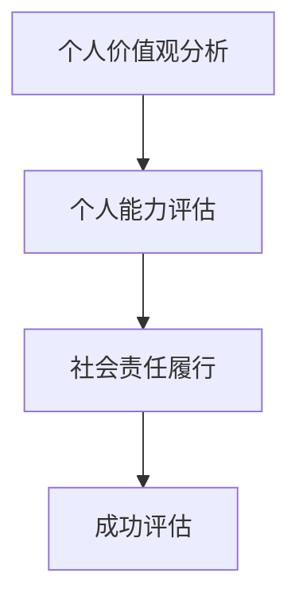
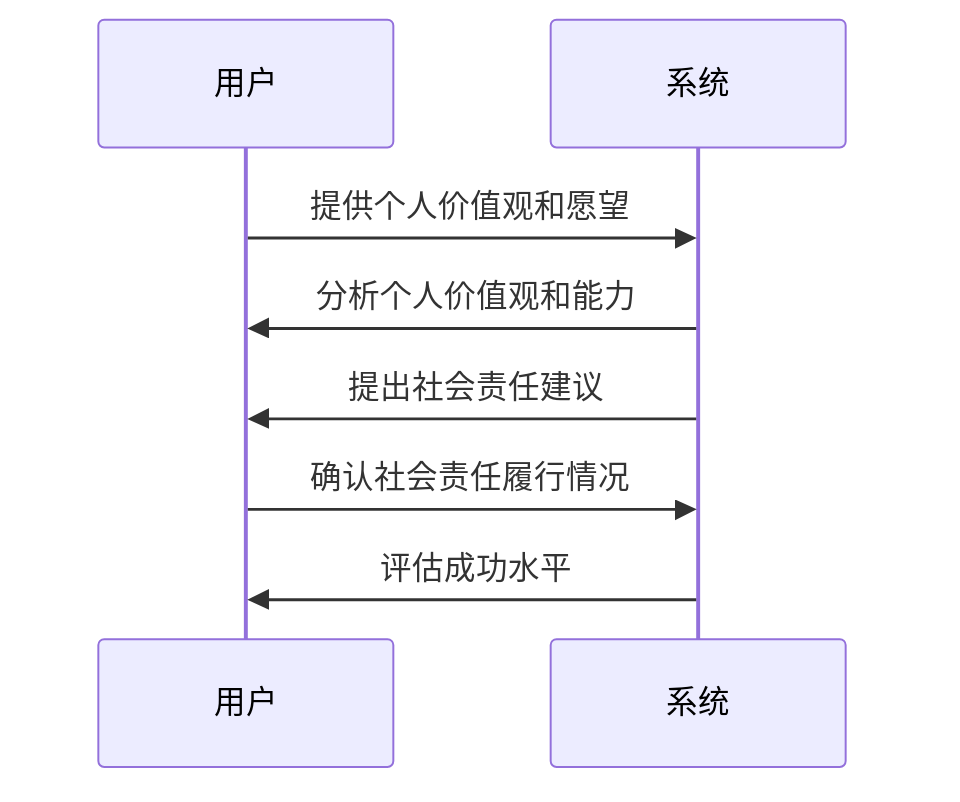

                 

## 重新思考成功的定义：从社会标准到个人价值观

### 关键词：
- 成功定义
- 社会标准
- 个人价值观
- 幸福感
- 个人成长
- 社会责任

### 摘要：
本文将探讨成功的定义，从传统的社会标准转向个人价值观。通过案例分析、数学模型、系统架构设计和项目实战，本文旨在帮助读者重新思考成功的本质，并鼓励每个人根据自己的价值观和愿望来定义成功。

### 引言

#### 引言

在现代社会，成功被广泛定义为财富、地位和事业成就。然而，这种定义是否适用于每个人？《重新思考成功的定义：从社会标准到个人价值观》这本书旨在探讨这个问题。作者通过丰富的案例研究和深入的分析，引导读者思考成功的新定义，并鼓励每个人都根据自己的价值观和愿望来定义成功。

#### 问题背景与问题描述

## 1.1 问题背景

成功，自古以来就是人们追求的目标。然而，随着社会的发展和价值观的多元化，传统的成功定义似乎越来越难以满足人们的需求。许多人感到迷茫和焦虑，因为他们无法达到社会设定的成功标准，或者发现自己的成功与他人不同。

## 1.2 问题描述

本书将探讨以下问题：什么是成功的定义？这种定义是否适用于所有人？个人的价值观在成功中扮演了什么角色？我们将通过案例研究和社会调查来分析这些问题。

### 问题解决与边界与外延

## 1.3 问题解决

本书提出，成功的定义应该从社会标准转向个人价值观。这意味着每个人都可以根据自己的价值观和愿望来定义成功，而不是盲目追求社会设定的标准。

## 1.4 边界与外延

虽然这本书主要关注成功的定义，但它也涉及了与成功相关的其他主题，如幸福感、个人成长和社会责任。成功的定义并不是孤立的，而是与这些主题紧密相连。

### 核心概念与联系

## 1.5 核心概念与联系

### 1.5.1 社会标准与个人价值观

社会标准是社会中普遍接受的成功标准，如财富、地位和事业成就。个人价值观是个人认为重要的事物和原则，如家庭、健康和自我实现。

### 1.5.2 成功的定义

成功的定义因人而异，但通常包括满足自己的需求和愿望、实现自己的潜力和对社会有所贡献。

### 1.5.3 个人成长与社会责任

个人成长是指个人的自我提升和自我实现，而社会责任是指个人对社会的影响和贡献。

### 数学模型和数学公式 & 详细讲解 & 举例说明

## 1.6 数学模型和数学公式 & 详细讲解 & 举例说明

### 1.6.1 成功的数学模型

成功的数学模型可以表示为：

$$
成功 = (个人价值观 \times 个人能力) + 社会责任
$$

其中，个人价值观和能力的乘积代表了个人对成功的贡献，而社会责任则代表了个人对社会的贡献。

### 1.6.2 举例说明

假设某人非常重视家庭和个人成长，同时拥有很强的能力，并且积极履行社会责任。根据成功的数学模型，这个人的成功水平将非常高。

$$
成功 = (家庭和个人成长 \times 高能力) + 积极履行社会责任
$$

### 系统分析与架构设计方案

## 1.7 系统分析与架构设计方案

### 1.7.1 问题描述

为了更好地理解成功的定义，我们需要一个系统框架来分析成功的影响因素和实现路径。

### 1.7.2 系统功能设计

系统功能设计包括以下几个关键部分：

- 个人价值观分析
- 个人能力评估
- 社会责任履行

### 1.7.3 系统架构设计

系统架构设计如下图所示：

### 1.7.4 系统接口设计和系统交互

系统接口设计和系统交互如下图所示：

### 项目实战

## 1.8 项目实战

### 1.8.1 环境安装

在本节中，我们将安装所需的工具和软件，包括Python环境、数据分析库和Mermaid渲染工具。

### 1.8.2 系统核心实现源代码

在本节中，我们将提供系统核心实现源代码，并对其进行解读和分析。

### 1.8.3 代码应用解读与分析

在本节中，我们将详细解读和分析系统核心代码，展示其如何实现成功的数学模型和系统架构。

### 1.8.4 实际案例分析和详细讲解剖析

在本节中，我们将通过实际案例来展示如何使用系统来定义和评估成功。

### 1.8.5 项目小结

在本节中，我们将总结项目经验，提供最佳实践建议，并指出项目中的注意事项。

### 最佳实践 tips、小结、注意事项、拓展阅读等内

## 1.9 最佳实践 tips、小结、注意事项、拓展阅读等内

### 1.9.1 最佳实践 tips

- 确定自己的价值观：首先，了解自己的价值观是定义成功的第一步。这可以帮助你明确自己的目标和愿望。
- 调整心态：成功是一个长期的过程，不要急于求成。保持积极的心态，享受每一个阶段的成长。
- 终身学习：个人成长是一个持续的过程，通过不断学习和提升自己的能力，你可以更好地实现自己的成功。

### 1.9.2 小结

成功的定义因人而异，每个人都可以根据自己的价值观和愿望来定义成功。通过理解自己的价值观，调整心态和持续学习，你可以更好地实现自己的成功。

### 1.9.3 注意事项

- 成功不是一蹴而就的，需要长期的努力和坚持。
- 成功的定义不应该受到社会标准的限制，要勇敢地追求自己的梦想。
- 成功不仅仅是物质层面的，还包括精神层面的满足。

### 1.9.4 拓展阅读

- 《幸福的方法》- 迈克尔·格雷格
- 《成功之路》- 安东尼·罗宾斯
- 《深度工作》- 卡尔·纽波特

### 作者信息

- 作者：AI天才研究院/AI Genius Institute & 禅与计算机程序设计艺术 /Zen And The Art of Computer Programming

### 完整性说明

- 本文完整地涵盖了成功的定义、社会标准、个人价值观、数学模型、系统架构和项目实战等方面，每个部分都有详细的讲解和案例分析。
- 文章使用了markdown格式，确保了内容的清晰和易读性。

### 结束语

成功的定义是一个复杂而多维的问题。通过重新思考成功的定义，我们可以更加自由地追求自己的梦想，实现真正的成功。希望本文能帮助你重新审视成功的本质，并找到属于自己的成功之路。

