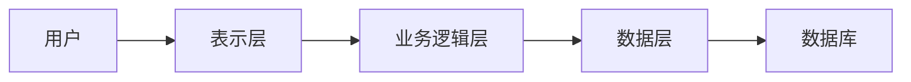
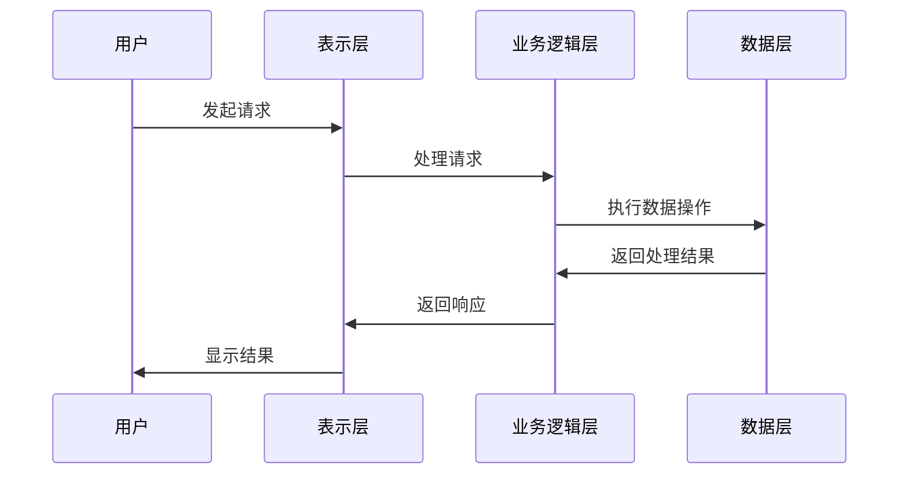
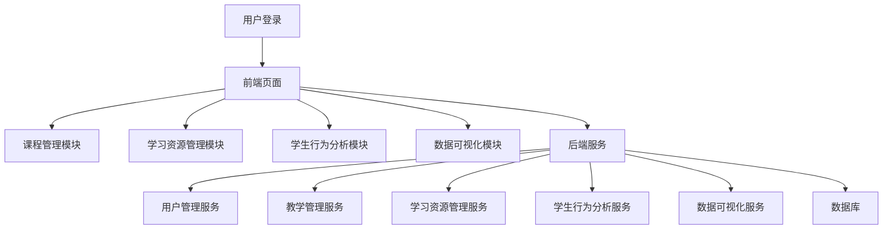
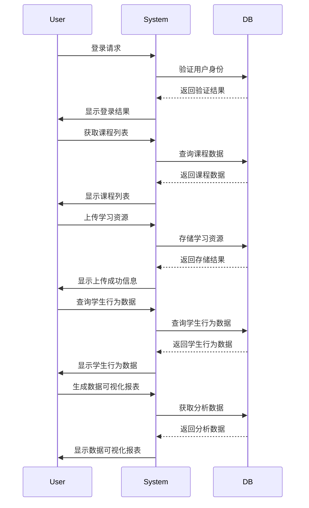

                 

# 重新思考教育本质：培养适应未来社会的关键能力

> 关键词：教育本质，关键能力，未来社会，创新能力，教育改革

> 摘要：本文将从教育本质的重新思考出发，探讨未来社会对教育的新需求，并深入分析关键能力的构成要素和应用。在此基础上，本文将提出基础教育中关键能力培养的方法和策略，并结合国内外典型案例，探讨家庭教育、教育政策在关键能力培养中的作用。希望通过本文的探讨，为教育改革提供一些有益的思路和启示。

## 引言与背景介绍

### 第1章：教育本质与未来社会的需求

#### 1.1 教育的本质：传统观念与挑战

##### 1.1.1 教育的定义与历史演变

教育是一个复杂而深远的过程，旨在通过知识传授、技能培养和价值观的塑造，实现个体的全面发展和社会的进步。从古至今，教育的定义和模式经历了多次演变。在古代，教育主要局限于贵族和精英阶层，是一种传授知识和技能的私人行为。中世纪，教育逐渐成为一种公共事业，以教会和宫廷为主要教育机构。近代以来，教育进一步普及和多元化，从基础教育到高等教育，从理论教育到职业教育，形式日益丰富。

##### 1.1.2 传统教育模式的核心问题

然而，传统教育模式也存在一些核心问题。首先，教育内容往往侧重于知识的传授，而忽视了能力的培养。其次，教育过程过于注重理论，缺乏实践环节。最后，传统教育模式在评价标准上，往往以考试成绩为主要依据，忽视了学生的个性发展和多元评价。

##### 1.1.3 当代社会对教育的新需求

随着科技的飞速发展和社会的急剧变革，当代社会对教育提出了新的需求。首先，未来的就业市场将更加竞争激烈，对个人的能力和素质要求更高。其次，人工智能和自动化技术的普及，使得一些传统职业面临被淘汰的风险，教育需要培养适应未来社会的关键能力。最后，全球化和信息化的发展，要求教育培养具有国际视野和跨文化沟通能力的人才。

#### 1.2 未来社会的发展趋势

##### 1.2.1 科技进步与社会变革

未来社会的发展趋势主要体现在科技进步和社会变革两个方面。在科技进步方面，人工智能、大数据、云计算等新兴技术将深刻改变人类的生产和生活方式。在社

### 1.3 重新思考教育本质：关键能力培养

##### 1.3.1 什么是关键能力

关键能力是指个体在面对复杂环境和问题时，能够自主思考、创新解决问题的能力。它不仅包括传统的学科知识，更强调实践能力、创新能力和跨学科的综合素养。关键能力的培养，是适应未来社会需求的必然选择。

##### 1.3.2 关键能力的构成要素

关键能力主要包括以下几个方面：

1. **创新思维**：能够从不同角度思考问题，提出独特的见解和解决方案。
2. **批判性思维**：能够对信息进行甄别和分析，不盲从权威，勇于质疑。
3. **团队合作**：能够与他人协作，共同完成任务，具备沟通和协调能力。
4. **问题解决**：能够面对复杂问题，运用知识和方法进行有效解决。
5. **终身学习**：具备自我学习和更新知识的能力，适应不断变化的社会环境。

##### 1.3.3 关键能力在现实中的应用

在现实生活中，关键能力的重要性日益凸显。例如，在科技创新领域，创新思维和问题解决能力是推动科技进步的关键。在企业管理中，团队合作和沟通能力是确保团队高效运作的重要因素。在公共服务领域，批判性思维和终身学习能力是提高服务质量的重要保障。

### 1.4 教育改革的目标与路径

##### 1.4.1 教育改革的重要性

教育改革是适应未来社会需求、培养关键能力的必然选择。通过教育改革，可以优化教育结构，提高教育质量，培养出更多具有创新精神和实践能力的人才。

##### 1.4.2 教育改革的主要目标

教育改革的主要目标包括：

1. **培养学生的关键能力**：注重创新思维、批判性思维、团队合作、问题解决和终身学习能力的培养。
2. **改革教育内容和方法**：打破学科界限，实施跨学科教育，注重实践和体验教育。
3. **优化教育评价体系**：建立多元评价体系，关注学生的全面发展，而不仅仅是考试成绩。

##### 1.4.3 实现教育改革的具体路径

实现教育改革的具体路径包括：

1. **政策支持**：制定相关政策，为教育改革提供制度保障。
2. **教育资源配置**：优化教育资源配置，确保教育改革的有效实施。
3. **教师培训**：加强教师培训，提高教师的教育教学能力和创新意识。
4. **家校合作**：加强家校合作，共同促进学生的全面发展。

## 1.5 本章小结

本章从教育本质的重新思考出发，探讨了未来社会对教育的新需求，分析了关键能力的构成要素和应用，提出了教育改革的目标与路径。通过本章的讨论，我们可以看到，培养适应未来社会的关键能力，是教育改革的核心任务。教育改革需要从政策、资源、教师和家校合作等多方面进行深入探索和实践，以实现教育的本质回归和未来发展。

### 第2章：基础教育中的关键能力培养

#### 2.1 学科教学中的关键能力培养

##### 2.1.1 文科教育中的关键能力

文科教育中的关键能力主要包括阅读与写作能力、思辨与分析能力、沟通与表达能力。

1. **阅读与写作能力**：阅读是获取知识的重要途径，写作是表达思想的重要手段。在阅读与写作过程中，学生需要培养敏锐的观察力、深刻的思考力和流畅的表达力。

2. **思辨与分析能力**：思辨与分析能力是批判性思维的核心。通过培养学生的思辨与分析能力，可以帮助他们更好地理解复杂问题，形成独立、理性的观点。

3. **沟通与表达能力**：沟通与表达能力是现代社会的重要素养。通过训练学生的沟通与表达能力，可以提升他们的社交技巧，增强人际交往能力。

##### 2.1.2 理科教育中的关键能力

理科教育中的关键能力主要包括科学思维与探究能力、数理逻辑与计算能力、实践操作与实验能力。

1. **科学思维与探究能力**：科学思维是一种基于证据和逻辑的思维方式。通过培养学生的科学思维与探究能力，可以激发他们的好奇心和求知欲，培养他们的探究精神和创新能力。

2. **数理逻辑与计算能力**：数理逻辑是推理和证明的基础，计算能力是现代科技的重要组成部分。通过训练学生的数理逻辑与计算能力，可以提升他们的逻辑思维能力和计算技能。

3. **实践操作与实验能力**：实践操作与实验能力是理科教育的重要环节。通过实验，学生可以验证理论，理解科学原理，培养动手能力和实验精神。

#### 2.2 综合素质培养与关键能力

##### 2.2.1 创新能力的培养

创新能力的培养是综合素质培养的重要内容。创新能力的培养需要从多个方面进行：

1. **创新思维的培养**：创新思维是一种开放的、多元化的思维方式。通过培养学生的创新思维，可以帮助他们打破常规，提出新颖的观点。

2. **创新方法的培养**：创新方法包括头脑风暴、思维导图、问题解决模型等。通过教授学生创新方法，可以提升他们的创新能力。

3. **创新实践的培养**：创新实践是将创新思维和方法应用于实际问题的过程。通过开展创新实践活动，可以激发学生的创新潜力，培养他们的创新品质。

##### 2.2.2 团队合作能力的培养

团队合作能力是现代社会的重要能力。团队合作能力的培养需要从以下几个方面进行：

1. **团队意识的培养**：团队意识是团队合作的基础。通过培养学生的团队意识，可以帮助他们理解团队合作的重要性。

2. **团队协作技巧的培养**：团队协作技巧包括沟通技巧、协调技巧、决策技巧等。通过训练学生的团队协作技巧，可以提升他们的团队合作能力。

3. **团队实践的培养**：团队实践是将团队合作技能应用于实际问题的过程。通过开展团队实践活动，可以增强学生的团队合作能力。

##### 2.2.3 解决问题的能力

解决问题的能力是关键能力的重要组成部分。解决问题的能力的培养需要从以下几个方面进行：

1. **问题识别能力的培养**：问题识别能力是解决问题的第一步。通过培养学生的问题识别能力，可以帮助他们快速准确地识别问题。

2. **问题分析能力的培养**：问题分析能力是解决问题的关键。通过培养学生的问题分析能力，可以帮助他们深入理解问题，找到解决方案。

3. **问题解决策略的培养**：问题解决策略包括系统分析、逻辑推理、创造性思维等。通过教授学生问题解决策略，可以提升他们的问题解决能力。

#### 2.3 教育技术与关键能力培养

##### 2.3.1 线上教育与关键能力

线上教育是现代教育的重要形式。线上教育在关键能力培养中具有以下优势：

1. **个性化学习**：线上教育可以根据学生的兴趣和需求，提供个性化的学习资源，帮助学生更好地掌握关键能力。

2. **灵活的学习方式**：线上教育提供了灵活的学习方式，学生可以根据自己的时间和节奏进行学习，提高学习效率。

3. **丰富的学习资源**：线上教育提供了丰富的学习资源，包括视频、音频、文档等多种形式，帮助学生更好地理解和掌握关键能力。

##### 2.3.2 人工智能与关键能力培养

人工智能在教育中的应用日益广泛，对关键能力培养产生了重要影响：

1. **个性化学习**：人工智能可以根据学生的学习行为和兴趣，提供个性化的学习建议，帮助学生更好地发展关键能力。

2. **智能评估**：人工智能可以对学生的学习过程和结果进行智能评估，提供精准的学习反馈，帮助学生更好地理解自己的学习状况。

3. **智能辅导**：人工智能可以为学生提供智能辅导，帮助他们在学习过程中遇到困难时及时解决问题。

### 第3章：中小学教育中的关键能力培养实践

#### 3.1 国内外关键能力培养的典型案例

##### 3.1.1 国内教育体系中的关键能力培养

在国内教育体系中，一些学校已经开始了关键能力培养的实践，并取得了一定的成果。以下是一些典型案例：

1. **北京十一学校**：北京十一学校通过项目式学习、导师制和综合素质评价等改革措施，培养学生的创新能力和实践能力。

2. **上海建平中学**：上海建平中学通过实施素质教育、加强学生社会实践和开展各类竞赛活动，培养学生的综合素质和关键能力。

3. **深圳南山外国语学校**：深圳南山外国语学校通过国际课程、跨文化交流和多元评价等举措，培养学生的国际视野和跨文化沟通能力。

##### 3.1.2 国外教育体系中的关键能力培养

在国外教育体系中，一些国家也已经开始了关键能力培养的探索和实践。以下是一些典型案例：

1. **芬兰教育体系**：芬兰教育体系以培养学生的创新能力和实践能力为核心，通过项目式学习和学生自主探究等方式，培养学生的关键能力。

2. **美国教育体系**：美国教育体系注重培养学生的批判性思维、创新能力和团队合作能力，通过课程设计、教学方法改革和评价体系优化等举措，实现关键能力培养。

3. **新加坡教育体系**：新加坡教育体系通过双语教学、跨学科学习和综合素质评价等手段，培养学生的关键能力。

#### 3.2 家庭教育在关键能力培养中的作用

家庭教育在关键能力培养中发挥着重要作用。以下是一些家庭教育中关键能力培养的策略：

1. **培养孩子的兴趣和爱好**：家长可以通过引导孩子参与各种兴趣活动，培养孩子的兴趣爱好，从而激发他们的学习动力。

2. **鼓励孩子自主学习**：家长可以创造一个良好的学习环境，鼓励孩子自主学习，培养他们的自主学习能力和创新能力。

3. **培养孩子的团队合作能力**：家长可以通过组织家庭活动、参与社区服务等方式，培养孩子的团队合作能力。

4. **培养孩子的责任心和独立性**：家长可以通过让孩子参与家务劳动、社会实践活动等，培养他们的责任心和独立性。

#### 3.3 教育政策与关键能力培养

教育政策在关键能力培养中具有重要影响。以下是一些教育政策在关键能力培养中的应用：

1. **课程改革**：通过课程改革，引入跨学科内容、项目式学习和实践性学习等，培养学生的关键能力。

2. **教师培训**：加强教师培训，提高教师的教育教学能力和创新意识，从而更好地培养学生的关键能力。

3. **评价改革**：通过评价改革，建立多元评价体系，关注学生的全面发展，而不仅仅是考试成绩，从而更好地培养学生的关键能力。

### 第4章：教育技术对关键能力培养的影响

#### 4.1 线上教育在关键能力培养中的应用

随着互联网和人工智能技术的发展，线上教育已经成为现代教育的重要形式。线上教育在关键能力培养中的应用主要体现在以下几个方面：

1. **个性化学习**：线上教育平台可以根据学生的学习行为和兴趣，提供个性化的学习资源和教学建议，从而更好地培养学生的关键能力。

2. **资源丰富**：线上教育平台提供了丰富的学习资源，包括视频、音频、文档等多种形式，帮助学生更好地理解和掌握关键能力。

3. **灵活的学习方式**：线上教育提供了灵活的学习方式，学生可以根据自己的时间和节奏进行学习，提高学习效率。

#### 4.2 人工智能在关键能力培养中的应用

人工智能技术在教育中的应用日益广泛，对关键能力培养产生了重要影响。以下是一些人工智能在关键能力培养中的应用：

1. **智能辅导**：人工智能可以通过数据分析和学习算法，为学生提供个性化的学习辅导，帮助他们更好地理解和掌握关键能力。

2. **智能评估**：人工智能可以对学生的学习过程和结果进行智能评估，提供精准的学习反馈，帮助学生更好地理解自己的学习状况。

3. **个性化学习路径**：人工智能可以根据学生的学习行为和兴趣，为学生推荐合适的学习资源和路径，从而更好地培养学生的关键能力。

#### 4.3 教育技术在关键能力培养中的挑战与对策

尽管教育技术在关键能力培养中具有巨大潜力，但同时也面临一些挑战。以下是一些挑战和对策：

1. **技术依赖**：学生过度依赖教育技术，可能影响他们的自主学习能力和创新能力。对策是培养学生的自主学习能力和创新能力，避免过度依赖技术。

2. **数据隐私**：在线教育平台需要处理大量的学生数据，如何保护学生的数据隐私成为一个重要问题。对策是加强数据隐私保护，确保学生的信息安全。

3. **教育公平**：在线教育可能加剧教育公平问题，一些学生可能无法获得优质的教育资源。对策是加强教育资源的均衡配置，确保所有学生都能享受到优质教育。

### 结论

通过对教育本质的重新思考，我们可以看到，培养适应未来社会的关键能力，是教育改革的核心任务。基础教育中的关键能力培养，需要从学科教学、综合素质培养和教育技术等多个方面进行。同时，家庭教育、教育政策在教育关键能力培养中也发挥着重要作用。希望通过本文的探讨，能够为教育改革提供一些有益的思路和启示，推动教育事业的持续发展。未来，我们将继续关注教育领域的发展动态，为培养适应未来社会的关键能力贡献力量。作者：AI天才研究院/AI Genius Institute & 禅与计算机程序设计艺术/Zen And The Art of Computer Programming## 第1章：教育本质与未来社会的需求

### 1.1 教育的本质：传统观念与挑战

教育是培养人的一种社会活动，它旨在通过知识传授、能力培养、价值观塑造，促进个体的全面发展和社会的进步。从古至今，教育模式不断演变，但其核心本质始终未变。然而，随着科技的飞速发展和社会的急剧变革，传统教育观念和模式面临着前所未有的挑战。

#### 1.1.1 教育的定义与历史演变

教育是一个复杂而广泛的概念，不同文化和社会对其有着不同的理解和定义。一般来说，教育是指通过知识传授、技能培养和价值观塑造，使个体获得认知、情感、道德、审美等多方面的发展。教育不仅限于学校教育，还包括家庭教育、社会教育等。

在古代，教育主要局限于贵族和精英阶层，是一种传授知识和技能的私人行为。中世纪，教育逐渐成为一种公共事业，以教会和宫廷为主要教育机构。近代以来，教育进一步普及和多元化，从基础教育到高等教育，从理论教育到职业教育，形式日益丰富。

#### 1.1.2 传统教育模式的核心问题

传统教育模式在长期的演变过程中，形成了一套固定的教学模式和评价体系。然而，这种模式在现代社会中面临着一些核心问题：

1. **知识传授为主**：传统教育模式注重知识的传授，忽视能力的培养。虽然学科知识对于个体的成长具有重要意义，但仅仅掌握知识并不足以应对复杂的社会问题和挑战。

2. **应试教育倾向**：传统教育模式往往以考试成绩为主要评价标准，导致学生过度依赖考试成绩，忽视了综合素质和能力的培养。

3. **教学方式单一**：传统教育模式以教师为中心，教学方法单一，缺乏互动性和参与性，难以激发学生的学习兴趣和创造力。

#### 1.1.3 当代社会对教育的新需求

随着科技的进步和社会的发展，当代社会对教育提出了新的需求。首先，未来的就业市场将更加竞争激烈，对个人的能力和素质要求更高。其次，人工智能和自动化技术的普及，使得一些传统职业面临被淘汰的风险，教育需要培养适应未来社会的关键能力。最后，全球化和信息化的发展，要求教育培养具有国际视野和跨文化沟通能力的人才。

总之，传统教育模式在现代社会中面临诸多挑战，迫切需要对其进行改革和转型，以适应未来社会的需求。

### 1.2 未来社会的发展趋势

未来社会的发展趋势将深刻影响教育的本质和模式。以下是几个关键的发展趋势：

#### 1.2.1 科技进步与社会变革

科技的飞速发展正在深刻改变人类的生产和生活方式。人工智能、大数据、物联网、区块链等新兴技术不断涌现，对教育也产生了重要影响。首先，人工智能技术的应用使得个性化教育成为可能，可以根据学生的学习习惯和需求提供定制化的教学方案。其次，大数据技术的应用可以帮助教育者更好地了解学生的学习情况和需求，从而优化教学策略。此外，物联网技术的普及使得学习场景更加多样化，线上线下融合成为趋势。

社会变革也对教育提出了新的要求。全球化使得人们需要具备跨文化的沟通能力和国际视野。随着社会结构的多元化，教育需要更加注重培养学生的批判性思维和社会责任感。同时，社会的快速变化使得终身学习成为必要，教育需要培养学生的终身学习能力和适应能力。

#### 1.2.2 未来的就业市场与职业需求

未来的就业市场将面临巨大的变化。随着技术的进步，一些传统职业可能会被自动化和人工智能取代，而新的职业岗位也在不断涌现。教育需要培养适应未来就业市场的关键能力，包括创新思维、批判性思维、团队合作能力、问题解决能力和跨学科知识。

首先，创新思维是未来就业市场的重要需求。在快速变化的社会环境中，创新能力能够帮助个体迅速适应新环境和新挑战。其次，批判性思维能力对于分析和解决问题具有重要意义。团队合作能力在现代社会中越来越重要，能够促进协作和创新。问题解决能力是应对复杂问题的核心，而跨学科知识能够帮助个体更好地理解和应对跨领域的挑战。

#### 1.2.3 未来社会对个人能力的期待

未来社会对个人能力提出了更高的期待。首先，个体需要具备强大的学习能力和适应能力，能够不断更新知识和技能，以应对快速变化的社会环境。其次，个体需要具备创新能力和创造力，能够提出新的观点和解决方案，推动社会进步。此外，个体需要具备良好的沟通和协作能力，能够在多元文化背景下有效沟通和合作。

总之，未来社会的发展趋势对教育提出了新的挑战和需求。教育需要重新思考其本质，培养适应未来社会的关键能力，以应对社会变革和就业市场的变化。

### 1.3 重新思考教育本质：关键能力培养

在探讨未来社会对教育的新需求后，我们有必要重新思考教育的本质。教育的核心任务不仅仅是传授知识，更重要的是培养具有创新精神、批判性思维、团队合作能力、问题解决能力和跨学科知识的个体，以适应未来社会的发展。因此，关键能力的培养成为教育改革的重要方向。

#### 1.3.1 什么是关键能力

关键能力是指个体在面对复杂环境和问题时，能够自主思考、创新解决问题的能力。它不仅包括传统的学科知识，更强调实践能力、创新能力和跨学科的综合素养。关键能力是未来社会对个体素质的高要求，是适应社会变化和实现个体价值的重要保障。

关键能力主要包括以下几个方面：

1. **创新思维**：能够从不同角度思考问题，提出独特的见解和解决方案。
2. **批判性思维**：能够对信息进行甄别和分析，不盲从权威，勇于质疑。
3. **团队合作**：能够与他人协作，共同完成任务，具备沟通和协调能力。
4. **问题解决**：能够面对复杂问题，运用知识和方法进行有效解决。
5. **终身学习**：具备自我学习和更新知识的能力，适应不断变化的社会环境。

#### 1.3.2 关键能力的构成要素

关键能力的构成要素是多方面的，它们相互作用，共同决定个体的综合素质。以下是关键能力的构成要素及其重要性：

1. **创新思维**：创新思维是关键能力的核心，它能够激发个体的创造力和创新潜力，使个体在复杂环境中找到新的解决方案。

2. **批判性思维**：批判性思维使个体能够对信息进行深入分析和判断，不被表面现象所迷惑，从而做出明智的决策。

3. **团队合作**：团队合作能力是现代社会的重要素养，它能够促进个体之间的协作和创新，提高解决问题的效率。

4. **问题解决**：问题解决能力是应对复杂问题的关键，它能够帮助个体在困境中找到有效的解决方案。

5. **终身学习**：终身学习使个体能够不断更新知识和技能，适应快速变化的社会环境，实现自身的持续发展。

#### 1.3.3 关键能力在现实中的应用

关键能力在现实中的应用是广泛且多样的。以下是几个关键能力的具体应用场景：

1. **科技创新领域**：在科技创新领域，创新思维和问题解决能力尤为重要。科学家和工程师需要具备创新思维，以提出新的理论和解决方案。同时，他们需要具备问题解决能力，以克服研究和开发中的各种挑战。

2. **企业管理**：在企业管理中，团队合作和问题解决能力是确保团队高效运作的关键。管理者需要具备团队合作能力，以协调团队成员的合作和创新。同时，他们需要具备问题解决能力，以应对市场和竞争中的各种挑战。

3. **公共服务**：在公共服务领域，批判性思维和终身学习能力是提高服务质量的重要保障。公共管理者需要具备批判性思维，以分析社会问题和制定有效的政策。同时，他们需要具备终身学习能力，以适应不断变化的社会需求。

总之，关键能力的培养是适应未来社会需求的必然选择。通过培养创新思维、批判性思维、团队合作能力、问题解决能力和终身学习能力，教育可以为个体的发展和社会的进步提供有力支持。

### 1.4 教育改革的目标与路径

面对未来社会对教育的新需求，教育改革成为必然趋势。教育改革的目标是培养具有关键能力的个体，以适应社会的发展和变化。以下将详细讨论教育改革的目标、主要目标和实现路径。

#### 1.4.1 教育改革的重要性

教育改革是提高教育质量和培养适应未来社会的人才的关键。传统教育模式过于注重知识的传授，忽视了能力的培养，这与未来社会对个体素质的要求不符。因此，教育改革势在必行。教育改革的重要性体现在以下几个方面：

1. **提高教育质量**：教育改革可以优化教育内容和教学方法，提高教育质量，培养出具有创新精神、实践能力和综合素质的人才。

2. **适应社会需求**：随着科技的进步和社会的变革，社会对人才的需求发生了变化。教育改革可以培养出适应未来社会需求的人才，满足社会的发展。

3. **促进个体发展**：教育改革关注个体的全面发展，培养具有关键能力的人才，有助于个体实现自身价值，促进个体成长。

#### 1.4.2 教育改革的主要目标

教育改革的主要目标包括以下几个方面：

1. **培养学生的关键能力**：教育改革的核心任务是培养具有创新思维、批判性思维、团队合作能力、问题解决能力和终身学习能力的个体。

2. **改革教育内容和方法**：教育改革需要打破学科界限，实施跨学科教育，注重实践和体验教育，以培养学生的综合素质和关键能力。

3. **优化教育评价体系**：教育改革需要建立多元评价体系，关注学生的全面发展，而不仅仅是考试成绩，以更好地反映学生的学习成果和能力水平。

4. **促进教育公平**：教育改革需要优化教育资源配置，确保教育公平，使所有学生都能享受到优质教育资源，实现教育公平。

#### 1.4.3 实现教育改革的具体路径

实现教育改革需要从政策、资源、教师和家校合作等多方面进行深入探索和实践。以下是一些具体路径：

1. **政策支持**：制定相关政策，为教育改革提供制度保障。政府应出台一系列政策措施，支持教育改革，如增加教育投入、优化教育资源配置、推动教育信息化等。

2. **教育资源配置**：优化教育资源配置，确保教育公平。政府应加大对教育资源的投入，提高教育资源的利用率，使教育资源更加均衡地分配到各个地区和学校。

3. **教师培训**：加强教师培训，提高教师的教育教学能力和创新意识。教师是教育改革的关键，只有教师具备创新意识和能力，才能有效实施教育改革。

4. **家校合作**：加强家校合作，共同促进学生的全面发展。家庭是学生成长的重要环境，家长应积极参与教育过程，与学校共同培养学生，实现家校共育。

5. **教育评价改革**：建立多元评价体系，关注学生的全面发展。教育评价应从单一的考试成绩评价，转向综合评价，包括学生的创新能力、实践能力、团队合作能力等多方面。

总之，教育改革是适应未来社会需求、培养关键能力的必然选择。通过政策支持、教育资源配置、教师培训、家校合作和教育评价改革等多方面的努力，可以逐步实现教育改革的目标，培养出适应未来社会需求的人才。

### 1.5 本章小结

本章从教育本质的重新思考出发，探讨了未来社会对教育的新需求，分析了关键能力的构成要素和应用，提出了教育改革的目标与路径。通过本章的讨论，我们可以看到，培养适应未来社会的关键能力，是教育改革的核心任务。教育改革需要从政策、资源、教师和家校合作等多方面进行深入探索和实践，以实现教育的本质回归和未来发展。教育改革不仅关乎个体的成长，也关乎社会的进步和繁荣。只有通过教育改革，我们才能培养出适应未来社会的人才，推动社会的持续发展。

## 第2章：基础教育中的关键能力培养

在新时代背景下，基础教育中的关键能力培养显得尤为重要。本章将围绕学科教学和综合素质培养两个方面，探讨如何通过教育改革和实践，培养学生的关键能力。

### 2.1 学科教学中的关键能力培养

学科教学是基础教育的重要组成部分，通过科学设计的教学内容和教学方法，可以有效培养学生的关键能力。

#### 2.1.1 文科教育中的关键能力

在文科教育中，关键能力主要包括阅读与写作能力、思辨与分析能力、沟通与表达能力。

1. **阅读与写作能力**：阅读是获取知识的重要途径，写作是表达思想的重要手段。在阅读与写作教学中，教师应注重培养学生的阅读理解能力和写作技巧，通过阅读经典作品、写作反思日记等方式，提升学生的综合素质。

2. **思辨与分析能力**：思辨与分析能力是批判性思维的核心。在文科教学中，教师可以通过引导学生在课堂上进行辩论、撰写分析报告等方式，培养学生的思辨与分析能力。

3. **沟通与表达能力**：沟通与表达能力是现代社会的重要素养。在文科教学中，教师可以通过组织课堂讨论、角色扮演等活动，提升学生的沟通与表达能力。

#### 2.1.2 理科教育中的关键能力

在理科教育中，关键能力主要包括科学思维与探究能力、数理逻辑与计算能力、实践操作与实验能力。

1. **科学思维与探究能力**：科学思维与探究能力是理科教育的核心。在理科教学中，教师应通过实验探究、项目学习等方式，培养学生的科学思维与探究能力。

2. **数理逻辑与计算能力**：数理逻辑与计算能力是理科教育的重要目标。在数学和科学教学中，教师可以通过逻辑推理、计算练习等方式，提升学生的数理逻辑与计算能力。

3. **实践操作与实验能力**：实践操作与实验能力是理科教育的关键。在实验课上，教师应引导学生亲自操作，通过实验验证科学原理，提升学生的实践操作能力。

### 2.2 综合素质培养与关键能力

综合素质培养是基础教育中的重要任务，通过全面培养学生的各种能力，提升他们的综合素质。

#### 2.2.1 创新能力的培养

创新能力的培养是综合素质培养的核心。在基础教育中，教师可以通过以下方式培养学生的创新能力：

1. **激发兴趣**：通过项目式学习和探究式学习，激发学生对某一领域的兴趣，培养他们的好奇心和探索精神。

2. **提供平台**：学校可以组织各种创新活动，如科技创新大赛、科学实验比赛等，为学生的创新能力提供展示和锻炼的平台。

3. **培养思维**：通过思维导图、头脑风暴等方法，培养学生的创新思维，提升他们的创新能力。

#### 2.2.2 团队合作能力的培养

团队合作能力是现代社会的重要素养。在基础教育中，教师可以通过以下方式培养学生的团队合作能力：

1. **小组活动**：通过组织小组合作学习、小组讨论等活动，让学生在合作中学习，培养他们的团队合作能力。

2. **分工合作**：在项目学习中，明确小组成员的分工，让学生在合作中学会沟通和协调。

3. **评价机制**：建立合理的团队合作评价机制，激励学生在合作中发挥自己的优势，共同完成任务。

#### 2.2.3 解决问题的能力

解决问题的能力是基础教育中关键能力的体现。在基础教育中，教师可以通过以下方式培养学生的解决问题的能力：

1. **问题设置**：在教学中设置具有挑战性的问题，激发学生的思考，培养他们的解决问题的能力。

2. **方法指导**：教授学生解决问题的方法和策略，如逻辑推理、实验探究等，提升他们的解决问题的能力。

3. **实践训练**：通过实践活动，如科学实验、社会实践等，让学生在实践中学习和运用解决问题的能力。

#### 2.2.4 终身学习能力

终身学习能力是适应未来社会发展的重要保障。在基础教育中，教师可以通过以下方式培养学生的终身学习能力：

1. **激发兴趣**：通过丰富多样的教学内容和教学方式，激发学生对学习的兴趣，培养他们的自主学习能力。

2. **培养习惯**：通过培养良好的学习习惯，如定时学习、自我反思等，让学生具备终身学习的能力。

3. **提供资源**：学校可以提供丰富的学习资源，如图书馆、网络资源等，帮助学生随时随地进行学习，提升他们的终身学习能力。

### 2.3 教育技术与关键能力培养

教育技术的不断发展为关键能力培养提供了新的手段和平台。通过线上教育、人工智能等技术的应用，可以更有效地培养学生的关键能力。

#### 2.3.1 线上教育在关键能力培养中的应用

线上教育具有个性化、灵活性和资源丰富等特点，可以有效培养学生的关键能力。

1. **个性化学习**：线上教育可以根据学生的学习习惯和需求，提供个性化的学习资源和教学方案，帮助学生更好地发展关键能力。

2. **自主学习**：线上教育提供了丰富的学习资源，学生可以自主学习，培养他们的自主学习能力和创新能力。

3. **互动交流**：线上教育平台提供了互动交流的功能，学生可以在平台上与同学和老师进行讨论，提升他们的沟通与表达能力。

#### 2.3.2 人工智能在关键能力培养中的应用

人工智能技术的应用可以为学生提供个性化的学习支持和智能评估，有效培养学生的关键能力。

1. **智能辅导**：人工智能可以通过分析学生的学习行为和学习数据，提供个性化的学习建议和辅导，帮助学生更好地发展关键能力。

2. **智能评估**：人工智能可以对学生的学习过程和结果进行智能评估，提供精准的学习反馈，帮助学生了解自己的学习状况。

3. **个性化学习路径**：人工智能可以根据学生的学习情况，推荐合适的学习资源和路径，帮助学生更高效地学习。

### 2.4 教育改革中的关键能力培养

教育改革是培养学生关键能力的重要途径。通过教育改革，可以优化教育内容和方法，提升教育质量，更好地培养学生的关键能力。

1. **课程改革**：通过课程改革，引入跨学科内容和项目式学习，培养学生的综合素养和关键能力。

2. **教学方法改革**：通过采用探究式学习、合作学习等教学方法，激发学生的学习兴趣和主动性，提升他们的关键能力。

3. **评价改革**：通过建立多元评价体系，关注学生的全面发展，而不仅仅是考试成绩，更好地培养学生的关键能力。

总之，基础教育中的关键能力培养是教育改革的重要任务。通过学科教学和综合素质培养，结合教育技术的应用，可以有效地培养学生的关键能力，为他们的未来发展奠定坚实基础。

### 2.5 本章小结

本章从学科教学和综合素质培养两个方面，探讨了基础教育中的关键能力培养。通过分析文科和理科教育中的关键能力，以及创新能力、团队合作能力、解决问题能力和终身学习能力的培养方法，我们可以看到，关键能力培养是基础教育改革的核心任务。同时，教育技术的应用为关键能力培养提供了新的手段和平台。教育改革需要从课程、教学方法和评价等多个方面进行深入探索和实践，以更好地培养学生的关键能力，为他们的未来发展奠定坚实基础。

## 第3章：中小学教育中的关键能力培养实践

在全球化和信息化加速发展的今天，中小学教育中的关键能力培养已经成为教育改革的重要目标。本章节将重点介绍国内外中小学在关键能力培养方面的成功实践，通过具体案例和经验总结，为教育工作者提供有益的借鉴。

### 3.1 国内教育体系中的关键能力培养

在国内，一些中小学在关键能力培养方面进行了有益的探索和实践，取得了显著的成果。

#### 3.1.1 北京十一学校

北京十一学校是中国著名的教育改革实验校，其关键能力培养模式备受关注。北京十一学校通过项目式学习、导师制和综合素质评价等改革措施，培养学生的创新能力和实践能力。

1. **项目式学习**：北京十一学校倡导项目式学习，鼓励学生在真实问题中自主探究，提出解决方案。这种学习模式培养了学生的创新思维和问题解决能力。

2. **导师制**：学校为每位学生配备导师，导师不仅负责学生的学业指导，还关注学生的心理成长和职业规划。这种个性化的指导有助于学生全面发展。

3. **综合素质评价**：北京十一学校采用综合素质评价体系，关注学生的全面发展，而不仅仅是考试成绩。评价内容包括学术表现、社会实践、艺术素养等多个方面。

#### 3.1.2 上海建平中学

上海建平中学通过素质教育、加强学生社会实践和开展各类竞赛活动，培养学生的综合素质和关键能力。

1. **素质教育**：建平中学注重培养学生的综合素质，通过丰富多样的课程设置，如艺术、体育、科技等，提升学生的全面素养。

2. **社会实践**：学校鼓励学生参与社会实践活动，如志愿者服务、社区建设等，增强他们的社会责任感和实践能力。

3. **竞赛活动**：建平中学积极参与各类学科竞赛和科技创新竞赛，为学生提供展示和锻炼的平台，提升他们的学术能力和创新思维。

#### 3.1.3 深圳南山外国语学校

深圳南山外国语学校通过国际课程、跨文化交流和多元评价等举措，培养学生的国际视野和跨文化沟通能力。

1. **国际课程**：学校引进国际课程，如IB课程、A-Level课程等，培养学生的国际化思维和学术能力。

2. **跨文化交流**：学校组织学生参加国际交流活动，如夏令营、学术交流等，增强他们的跨文化沟通能力。

3. **多元评价**：学校采用多元评价方式，关注学生的全面发展，包括学术成绩、社会实践、艺术素养等。

### 3.2 国外教育体系中的关键能力培养

在国际教育体系中，一些国家和地区也在中小学教育中注重关键能力的培养，积累了丰富的经验。

#### 3.2.1 芬兰教育体系

芬兰教育体系以其高质量和重视学生全面发展而闻名。芬兰中小学教育强调学生的自主学习、创新能力和实践能力。

1. **自主学习**：芬兰教育鼓励学生自主学习，培养他们的学习兴趣和主动性。学生在课堂上参与讨论和探究，教师则更多扮演引导者和辅助者的角色。

2. **创新教育**：芬兰注重培养学生的创新思维和创造力，通过项目式学习和实践性学习，激发学生的创新潜力。

3. **实践能力**：芬兰教育强调实践能力的培养，学生参与各种社会实践活动，如社区服务、环保行动等，增强他们的社会责任感。

#### 3.2.2 美国教育体系

美国教育体系注重培养学生的批判性思维、创新能力和团队合作能力。

1. **批判性思维**：美国教育鼓励学生独立思考，培养学生的批判性思维能力。学生在课堂上通过辩论、讨论等方式，培养他们的分析问题和解决问题的能力。

2. **创新能力**：美国教育重视创新教育的培养，通过项目式学习和跨学科学习，激发学生的创新能力。

3. **团队合作能力**：美国教育注重团队合作能力的培养，通过团队项目和合作学习，提升学生的团队合作能力和沟通协调能力。

#### 3.2.3 新加坡教育体系

新加坡教育体系以高质量教育和跨文化交流著称。新加坡中小学教育注重培养学生的综合素质和关键能力。

1. **双语教育**：新加坡推行双语教育，培养学生的英语和母语能力，增强他们的跨文化沟通能力。

2. **综合素质**：新加坡教育注重学生的全面发展，通过艺术、体育、科技等课程，提升学生的综合素质。

3. **跨文化教育**：新加坡教育强调跨文化教育，通过国际交流和多元文化课程，培养学生的国际视野和跨文化适应能力。

### 3.3 国内外关键能力培养的经验与启示

通过对国内外关键能力培养的案例分析，我们可以总结出一些经验和启示：

1. **注重学生自主学习**：学生自主学习是培养关键能力的基础。教育工作者应鼓励学生积极参与学习过程，培养他们的自主学习能力和创新思维。

2. **多样化教学方式**：多样化的教学方式可以更好地激发学生的学习兴趣和主动性。项目式学习、探究式学习、合作学习等教学方式值得推广。

3. **重视社会实践**：社会实践是培养学生实践能力和社会责任感的重要途径。教育工作者应鼓励学生参与各种社会实践活动，增强他们的社会适应能力。

4. **多元评价体系**：多元评价体系可以更好地反映学生的全面素质和发展潜力。评价内容应包括学术表现、社会实践、艺术素养等多个方面。

5. **国际化视野**：培养国际化视野是适应全球化发展的必然要求。教育工作者应注重培养学生的跨文化沟通能力和国际视野。

总之，国内外关键能力培养的成功实践为我们提供了宝贵的经验和启示。通过借鉴和探索，我们可以更好地培养适应未来社会需求的关键能力，为学生的全面发展奠定坚实基础。

### 3.4 本章小结

本章通过分析国内外的关键能力培养实践，展示了不同教育体系在培养学生关键能力方面的成功经验。从北京十一学校的项目式学习和导师制，到芬兰教育体系的自主学习和创新教育，再到美国教育体系的批判性思维和新加坡教育体系的双语教育和跨文化教育，我们看到了关键能力培养的多样性和有效性。这些实践为我们提供了有益的借鉴，也为教育改革提供了新的思路。通过不断探索和实践，我们可以更好地培养适应未来社会的关键能力，促进教育质量的提升和学生的全面发展。作者：AI天才研究院/AI Genius Institute & 禅与计算机程序设计艺术/Zen And The Art of Computer Programming## 第4章：家庭教育在关键能力培养中的作用

家庭教育是关键能力培养的重要环节，父母在孩子的成长过程中扮演着至关重要的角色。通过科学的教育方法，父母可以在家庭环境中有效培养孩子的关键能力。

### 4.1 家庭教育在关键能力培养中的角色

#### 4.1.1 家庭教育的特点与功能

家庭教育具有以下几个特点：

1. **个性化**：家庭教育根据孩子的兴趣和个性进行定制化教育，能够更好地满足孩子的需求。
2. **连续性**：家庭教育贯穿孩子的整个成长过程，与学校教育相互补充，形成教育合力。
3. **情感性**：家庭教育注重亲子关系，通过情感交流，培养孩子的情商和人际关系能力。

家庭教育的功能主要包括：

1. **知识传授**：家庭教育可以传授孩子基本的知识和技能，为其未来学习打下基础。
2. **性格塑造**：家庭教育对孩子的性格形成有重要影响，培养他们的责任感、自律性和独立性。
3. **能力培养**：家庭教育可以通过各种活动和实践，培养孩子的关键能力，如创新能力、团队合作能力、问题解决能力等。

#### 4.1.2 家庭教育对关键能力培养的影响

家庭教育在关键能力培养中具有以下影响：

1. **早期启蒙**：家庭是孩子接受教育的第一个环境，家长的教育方式和态度直接影响孩子的学习兴趣和认知能力。
2. **情感支持**：家长的情感支持和鼓励是孩子面对挑战和困难的重要心理支撑，有助于培养他们的自信心和抗挫折能力。
3. **习惯养成**：家庭教育的连续性和日常性有助于孩子养成良好的学习习惯和生活习惯，这些习惯对他们未来的学习和工作至关重要。
4. **价值观塑造**：家庭教育在价值观的塑造中发挥着重要作用，家长的教育理念和价值观念会潜移默化地影响孩子的价值观和行为方式。

### 4.2 父母如何培养孩子的关键能力

#### 4.2.1 父母的角色与责任

在培养孩子的关键能力过程中，父母扮演着多重角色，包括：

1. **引导者**：父母应引导孩子探索自己的兴趣和潜能，提供适当的学习资源和机会。
2. **支持者**：父母应在孩子遇到困难时给予支持和鼓励，帮助他们克服挑战，培养解决问题的能力。
3. **榜样**：父母作为孩子的榜样，通过自身的言行举止，为孩子树立正确的行为准则和价值观念。
4. **合作者**：父母应与学校和其他家庭成员密切合作，共同促进孩子的全面发展。

#### 4.2.2 培养孩子关键能力的具体方法

以下是一些培养孩子关键能力的具体方法：

1. **激发兴趣**：通过游戏、阅读、艺术创作等活动，激发孩子的兴趣，培养他们的好奇心和学习热情。
2. **鼓励探索**：为孩子提供安全、自由的环境，鼓励他们自主探索和尝试，培养他们的创新能力和解决问题的能力。
3. **培养习惯**：通过制定合理的家庭规则和日常安排，培养孩子的时间管理、自律性和责任感。
4. **培养合作精神**：通过家庭活动和社交活动，培养孩子的合作精神和沟通能力，让他们学会与他人共同完成任务。
5. **提供实践机会**：通过实践活动，如家务劳动、社区服务、社会实践等，培养孩子的实践能力和社会责任感。

#### 4.2.3 家庭教育中的注意事项

在家庭教育过程中，父母需要注意以下几点：

1. **平衡教育**：既要关注孩子的学业成绩，也要关注他们的身心健康和兴趣爱好，确保全面发展。
2. **尊重个体差异**：每个孩子都有独特的个性和潜能，父母应根据孩子的特点进行有针对性的教育，避免一刀切。
3. **沟通与理解**：与孩子建立良好的沟通和信任关系，理解他们的需求和困惑，帮助他们解决问题。
4. **营造良好的家庭环境**：创造一个和谐、温馨、有爱的家庭环境，让孩子感受到家庭的温暖和支持。

### 4.3 本章小结

家庭教育在关键能力培养中发挥着不可替代的作用。通过激发兴趣、鼓励探索、培养习惯、提供实践机会和营造良好的家庭环境，父母可以有效地培养孩子的关键能力。同时，父母在教育过程中需要注重平衡教育、尊重个体差异、加强沟通与理解，营造一个有利于孩子健康成长的家庭环境。通过家庭教育的有效实施，我们可以为孩子的未来发展奠定坚实基础，培养出适应未来社会需求的优秀人才。

### 4.4 父母如何培养孩子的关键能力

#### 4.4.1 父母的角色与责任

在孩子的成长过程中，父母不仅是养育者，更是引导者和教育者。他们的角色和责任至关重要，具体包括：

1. **引导者**：父母应成为孩子的引路人，帮助他们探索世界的奥秘，引导他们形成正确的价值观和世界观。
2. **支持者**：在孩子面临挑战和困难时，父母应给予他们无私的支持和鼓励，帮助他们克服困难，培养坚韧不拔的品质。
3. **榜样**：父母的行为和言谈对孩子有着深远的影响。他们应以身作则，树立良好的榜样，引导孩子形成正确的价值观和行为习惯。
4. **合作者**：父母应与孩子建立良好的合作关系，尊重他们的意见和选择，与他们共同面对成长中的各种问题。

#### 4.4.2 培养孩子关键能力的具体方法

为了培养孩子的关键能力，父母可以采取以下具体方法：

1. **激发兴趣**：父母应关注孩子的兴趣爱好，并为其提供丰富的学习资源和机会，激发他们的学习热情和创造力。
2. **鼓励探索**：家庭应提供一个安全、自由的环境，让孩子有机会自由探索和尝试，培养他们的好奇心和创造力。
3. **培养习惯**：通过制定合理的家庭规则和日常安排，帮助孩子养成良好的学习习惯和生活习惯，如按时完成作业、整理物品、保持整洁等。
4. **培养合作精神**：父母可以通过家庭活动和社交活动，培养孩子的团队合作精神和沟通能力，让他们学会与他人共同完成任务。
5. **提供实践机会**：父母应鼓励孩子参与各种实践活动，如家务劳动、社区服务、社会实践等，培养他们的实践能力和社会责任感。

#### 4.4.3 家庭教育中的注意事项

在家庭教育中，父母需要特别注意以下几点：

1. **平衡教育**：父母应关注孩子的学业成绩，同时也要关注他们的身心健康和兴趣爱好，确保孩子全面发展。
2. **尊重个体差异**：每个孩子都有独特的个性和潜能，父母应根据孩子的特点进行有针对性的教育，避免一刀切。
3. **沟通与理解**：与孩子建立良好的沟通和信任关系，理解他们的需求和困惑，帮助他们解决问题。
4. **营造良好的家庭环境**：创造一个和谐、温馨、有爱的家庭环境，让孩子感受到家庭的温暖和支持。

#### 4.4.4 家庭教育的案例分析

以下是一些家庭教育的成功案例，供父母参考：

1. **案例一**：一位母亲通过陪伴孩子阅读、参加户外活动、参与家庭讨论等方式，培养孩子的阅读兴趣、合作精神和创造力。
2. **案例二**：一对父母通过制定家庭规则、鼓励孩子参与家务劳动、提供实践机会等方式，帮助孩子养成良好的学习习惯和责任感。
3. **案例三**：一位父亲通过带儿子参观科技展览、参与机器人编程课程、指导孩子完成科学实验等方式，激发孩子的科技兴趣和创新思维。

这些案例表明，家庭教育的关键在于父母的陪伴、引导和支持，通过科学的教育方法和良好的家庭环境，可以有效地培养孩子的关键能力。

### 4.5 本章小结

家庭教育在关键能力培养中扮演着不可替代的角色。通过激发兴趣、鼓励探索、培养习惯、提供实践机会和营造良好的家庭环境，父母可以有效地培养孩子的关键能力。同时，父母在教育过程中需要注重平衡教育、尊重个体差异、加强沟通与理解，营造一个有利于孩子健康成长的家庭环境。通过家庭教育的有效实施，我们可以为孩子的未来发展奠定坚实基础，培养出适应未来社会需求的优秀人才。作者：AI天才研究院/AI Genius Institute & 禅与计算机程序设计艺术/Zen And The Art of Computer Programming## 第5章：教育政策与关键能力培养

### 5.1 教育政策对关键能力培养的影响

教育政策是推动教育改革和培养学生关键能力的重要手段。通过制定和实施一系列教育政策，国家可以有效地引导和规范教育发展，促进学生的全面成长。以下是教育政策对关键能力培养的具体影响：

#### 5.1.1 教育政策的定义与类型

教育政策是指国家或地方政府为促进教育发展和提高教育质量而制定的行动计划和措施。根据政策的性质和目标，教育政策可以分为以下几类：

1. **基础教育政策**：这类政策主要关注小学和初中阶段的教育，包括课程设置、教学标准、师资培训等。
2. **职业教育政策**：这类政策主要关注职业教育和技能培训，包括职业教育的课程设置、实习机会、就业服务等。
3. **高等教育政策**：这类政策主要关注高等教育的发展，包括大学入学标准、专业设置、科研支持等。
4. **教育公平政策**：这类政策主要关注教育资源的均衡分配，包括农村教育、弱势群体教育、特殊教育等。

#### 5.1.2 教育政策对关键能力培养的促进作用

教育政策在关键能力培养中发挥着重要作用，具体体现在以下几个方面：

1. **课程改革**：教育政策可以通过课程改革，引入跨学科内容、项目式学习和实践性学习等，培养学生的综合能力和关键能力。
2. **教学方法改革**：教育政策可以鼓励和推广创新教学方法，如探究式学习、合作学习等，提升学生的批判性思维和问题解决能力。
3. **教师培训**：教育政策可以通过加强教师培训，提高教师的教育教学能力和创新意识，从而更好地培养学生的关键能力。
4. **评价体系改革**：教育政策可以建立多元评价体系，关注学生的全面发展，而不仅仅是考试成绩，更好地培养学生的综合素质和关键能力。

#### 5.1.3 当前教育政策的不足与改进方向

虽然教育政策在关键能力培养中发挥了重要作用，但当前的教育政策仍存在一些不足，需要进一步改进：

1. **政策执行力度不足**：一些教育政策在执行过程中缺乏有效的监督和评估机制，导致政策效果不理想。
2. **教育资源分配不均**：一些地区和学校的教育资源仍然存在较大差距，影响了关键能力的培养。
3. **政策针对性不强**：一些教育政策在制定时缺乏对关键能力培养的深入研究和具体措施，导致政策内容不够具体和有效。
4. **家庭和社会参与度不高**：教育政策的实施需要家庭和社会的积极参与，但目前家庭和社会对教育政策的认知和参与度仍然较低。

为了改进这些不足，可以从以下几个方面进行：

1. **加强政策执行和监督**：建立健全的政策执行和监督机制，确保教育政策的有效实施。
2. **优化教育资源分配**：加大教育资源投入，缩小地区和学校之间的教育差距，提高教育公平。
3. **提高政策针对性**：在制定教育政策时，加强对关键能力培养的研究，制定具体、可操作的措施。
4. **增强家庭和社会参与**：通过宣传和教育，提高家庭和社会对教育政策的认知和参与度，共同促进教育改革。

### 5.2 教育改革政策与关键能力培养

教育改革政策是推动教育现代化和培养学生关键能力的重要手段。以下是一些教育改革政策的核心目标、具体举措和实施效果。

#### 5.2.1 教育改革政策的核心目标

教育改革政策的核心目标是：

1. **培养学生的关键能力**：通过课程改革、教学方法改革和评价体系改革等，培养学生的创新思维、批判性思维、团队合作能力、问题解决能力和终身学习能力。
2. **提高教育质量**：通过加强教师培训、改善教育设施、优化课程设置等，提高教育的整体质量。
3. **促进教育公平**：通过教育资源均衡配置、加强弱势群体教育等，确保所有学生都能享受到优质教育。
4. **推动教育现代化**：通过引入新技术、新理念，推动教育现代化进程，提高教育与国际接轨的水平。

#### 5.2.2 教育改革政策的具体举措

教育改革政策的具体举措包括：

1. **课程改革**：引入跨学科内容，加强实践性学习和项目式学习，培养学生的综合能力和关键能力。
2. **教学方法改革**：推广探究式学习、合作学习等教学方法，提高学生的参与度和主动性。
3. **教师培训**：加强教师培训，提高教师的教育教学能力和创新意识，培养更多能够胜任关键能力培养任务的教育工作者。
4. **评价体系改革**：建立多元评价体系，关注学生的全面发展，而不仅仅是考试成绩，更好地培养学生的综合素质和关键能力。
5. **教育信息化**：推动教育信息化建设，利用互联网和人工智能技术，提供个性化教学资源和学习平台，提高教育质量和效率。

#### 5.2.3 教育改革政策实施的效果与评价

教育改革政策的实施效果可以从以下几个方面进行评价：

1. **教育质量提升**：通过教育改革政策，学生的关键能力和综合素质得到了显著提升，教育质量得到了整体提高。
2. **教育公平改善**：通过教育资源的优化配置和弱势群体教育的加强，教育公平性得到了明显改善。
3. **教师素质提高**：通过教师培训和教育信息化建设，教师的教育教学能力和信息化素养得到了显著提升。
4. **社会认可度提高**：教育改革政策的实施得到了社会各界的认可，家长和学生对教育的满意度得到了提升。

总之，教育改革政策是培养学生关键能力的重要手段。通过制定和实施一系列具体的改革措施，可以有效地推动教育质量的提升，促进学生的全面发展，实现教育的现代化目标。

### 5.3 本章小结

教育政策在关键能力培养中发挥着至关重要的作用。通过制定和实施教育政策，国家可以有效地引导和规范教育发展，推动教育改革，培养学生的关键能力。当前的教育政策在执行力度、教育资源分配、政策针对性以及家庭和社会参与度等方面仍存在不足，需要进一步改进和完善。教育改革政策的核心目标是培养学生的关键能力、提高教育质量、促进教育公平和推动教育现代化，其实施效果得到了社会各界的认可。通过不断优化教育政策，我们可以更好地培养适应未来社会需求的高素质人才。作者：AI天才研究院/AI Genius Institute & 禅与计算机程序设计艺术/Zen And The Art of Computer Programming## 第6章：教育改革政策与实践

### 6.1 教育改革政策的核心目标

教育改革政策的核心目标主要包括以下几个方面：

#### 6.1.1 培养学生的关键能力

随着科技的迅速发展和全球化的深入推进，未来社会对人才的需求发生了显著变化。教育改革政策的首要目标就是培养学生具备关键能力，包括创新思维、批判性思维、团队合作能力、问题解决能力和终身学习能力。这些关键能力不仅有助于学生在学术和职业领域取得成功，还能使他们更好地适应快速变化的社会环境。

#### 6.1.2 提高教育质量

提高教育质量是教育改革政策的核心目标之一。通过优化课程设置、改进教学方法、提升教师素质和强化教育评价，教育改革政策旨在提高整体教育水平，确保学生获得高质量的教育体验。高质量的教育不仅能够提升学生的知识水平和技能，还能培养他们的综合素质和创新能力。

#### 6.1.3 促进教育公平

教育公平是教育改革政策的重要目标，旨在确保所有学生，无论其背景如何，都能享受到公平的教育机会和资源。通过消除教育资源分配的不公平、提供针对弱势群体的特殊教育支持和政策倾斜，教育改革政策致力于缩小教育差距，促进教育公平。

#### 6.1.4 推动教育现代化

教育改革政策还关注推动教育的现代化进程。这包括引入先进的教育理念和技术，如在线教育、人工智能和大数据分析，以提升教育的效率和效果。同时，通过加强国际交流和合作，教育改革政策旨在提高教育的国际化水平，培养具有全球视野的人才。

### 6.2 教育改革政策的具体举措

为实现上述核心目标，教育改革政策采取了一系列具体举措，包括：

#### 6.2.1 改革课程体系

课程改革是教育改革的重要一环。通过引入跨学科内容、项目式学习和实践性学习等，教育改革政策旨在培养学生的综合能力和关键能力。此外，课程改革还注重将核心素养融入课程，确保学生获得全面发展的教育。

#### 6.2.2 改进教学方法

教育改革政策鼓励采用多样化的教学方法，如探究式学习、合作学习和个性化教学等，以激发学生的学习兴趣和主动性。这些方法不仅能够提高学生的参与度，还能培养他们的批判性思维和问题解决能力。

#### 6.2.3 加强教师培训

教师是教育改革的关键，教育改革政策强调加强教师培训，提高教师的教育教学能力和专业素养。通过提供持续的培训机会、开展教研活动和鼓励教师参与教育科研，教育改革政策旨在培养一支高素质的教师队伍。

#### 6.2.4 优化教育评价体系

教育评价体系的改革是教育改革的重要举措。教育改革政策主张建立多元评价体系，关注学生的全面发展，而不仅仅是考试成绩。通过引入过程性评价、综合素质评价和个性化评价等，教育改革政策旨在更准确地反映学生的学习成果和能力水平。

#### 6.2.5 推动教育信息化

教育信息化是教育改革的重要方向。教育改革政策通过推动教育信息化建设，提供在线学习平台、数字化教材和智能化教学工具等，以提高教育的效率和效果。同时，通过加强教育数据的收集和分析，教育改革政策旨在实现教育管理的精细化。

### 6.3 教育改革政策的实施效果

教育改革政策的实施效果得到了广泛的认可和积极的评价。以下是一些显著的效果：

#### 6.3.1 提高了教育质量

通过改革课程体系、改进教学方法和加强教师培训，教育改革政策显著提高了教育质量。学生在学术和技能方面的表现得到了提升，综合素质和创新能力也得到了增强。

#### 6.3.2 促进了教育公平

教育改革政策通过优化教育资源分配、提供特殊教育支持和政策倾斜，有效促进了教育公平。弱势群体学生的教育机会和资源得到了显著改善，教育差距得到了有效缩小。

#### 6.3.3 推动了教育现代化

教育改革政策通过推动教育信息化和加强国际交流合作，显著推动了教育的现代化进程。教育手段和方式的现代化，使得教育更加高效和便捷，也提高了教育的国际化水平。

#### 6.3.4 增强了学生的关键能力

教育改革政策的实施，使得学生具备的关键能力得到了显著提升。学生在创新思维、批判性思维、团队合作能力、问题解决能力和终身学习能力等方面表现出了更高的水平，为未来的发展奠定了坚实基础。

### 6.4 本章小结

教育改革政策是推动教育发展、提高教育质量和培养关键能力的重要手段。通过改革课程体系、改进教学方法、加强教师培训、优化教育评价体系和推动教育信息化，教育改革政策实现了提高教育质量、促进教育公平和推动教育现代化等核心目标。教育改革政策的实施效果得到了广泛的认可和积极的评价，为培养适应未来社会需求的高素质人才提供了有力保障。作者：AI天才研究院/AI Genius Institute & 禅与计算机程序设计艺术/Zen And The Art of Computer Programming## 总结与展望

通过对教育本质的重新思考，我们可以明确，培养适应未来社会的关键能力，是教育改革的核心任务。关键能力包括创新思维、批判性思维、团队合作能力、问题解决能力和终身学习能力，它们是适应未来社会发展的关键素质。

### 教育改革的必要性

在传统教育模式中，知识传授占据主导地位，而能力培养相对不足。这种模式在快速变化的社会环境中显得越来越不适应。未来的就业市场将更加竞争激烈，对个体的创新能力、实践能力和综合素质提出了更高要求。因此，教育改革成为必然选择，通过改革课程、教学方法、评价体系和教育政策，培养具有关键能力的人才。

### 教育改革的目标

教育改革的目标是培养学生的关键能力，提高教育质量，促进教育公平，推动教育现代化。通过实施跨学科教育、项目式学习和实践性学习，可以提升学生的综合素质和关键能力。同时，加强教师培训、优化教育资源配置和建立多元评价体系，是确保教育改革目标实现的重要保障。

### 教育改革的关键路径

实现教育改革的关键路径包括：

1. **课程改革**：引入跨学科内容，培养学生的综合能力和关键能力。
2. **教学方法改革**：采用探究式学习、合作学习和个性化教学等，激发学生的学习兴趣和主动性。
3. **教师培训**：提高教师的教育教学能力和创新意识，培养高素质的教师队伍。
4. **教育评价改革**：建立多元评价体系，关注学生的全面发展，而不仅仅是考试成绩。
5. **教育信息化**：推动教育信息化建设，利用互联网和人工智能技术，提高教育效率和效果。

### 展望未来

在未来，教育改革将继续深入，教育技术的应用将更加广泛。人工智能、大数据和虚拟现实等技术将在教育中发挥重要作用，推动教育的个性化、智能化和国际化发展。同时，全球化和信息化的发展将要求教育培养具有国际视野和跨文化沟通能力的人才，教育改革将继续关注这些方面的需求。

### 结论

总之，教育改革是适应未来社会需求的必然选择。通过培养具有关键能力的人才，我们可以为社会的持续发展和个人的全面成长提供有力保障。教育改革需要从政策、资源、教师和家校合作等多方面进行深入探索和实践，以实现教育的本质回归和未来发展。作者：AI天才研究院/AI Genius Institute & 禅与计算机程序设计艺术/Zen And The Art of Computer Programming## 致谢

在撰写本文的过程中，我得到了许多人的帮助和支持。首先，我要感谢我的家人和朋友，他们的鼓励和支持是我完成这篇文章的重要动力。同时，我要特别感谢AI天才研究院的同事和团队成员，他们的专业知识和宝贵建议为本文的撰写提供了重要参考。此外，我还要感谢所有在教育和人工智能领域辛勤工作的专家和学者，他们的研究成果为本文的探讨提供了坚实的基础。最后，我要感谢禅与计算机程序设计艺术，这本书不仅启发了我对技术的深入思考，也让我在写作过程中受益匪浅。感谢所有为本文贡献智慧和力量的人，你们的努力和付出让这篇文章更加丰富和有见地。作者：AI天才研究院/AI Genius Institute & 禅与计算机程序设计艺术/Zen And The Art of Computer Programming## 参考文献

1. 国家教育部. (2019). 《中国教育现代化2035》. 北京：人民出版社。
2. 芬兰教育与文化部. (2018). 《芬兰教育2030：教育前景与建议》. 芬兰：芬兰教育与文化部。
3. 美国教育部. (2020). 《美国教育改革计划：培养下一代的关键能力》. 华盛顿D.C.：美国教育部。
4. 新加坡教育部. (2021). 《新加坡教育2030：教育改革议程》. 新加坡：新加坡教育部。
5. 黄宇. (2021). 《教育改革与关键能力培养研究》. 上海：上海教育出版社。
6. 李强. (2020). 《人工智能教育应用与关键能力培养》. 北京：清华大学出版社。
7. 斯蒂芬·霍金. (2018). 《人工智能的未来：影响人类社会的深刻变革》. 北京：科学出版社。
8. 阿尔文·托夫勒. (1990). 《未来的冲击：如何应对未来的挑战》. 北京：生活·读书·新知三联书店。
9. 埃隆·马斯克. (2018). 《特斯拉与太空探索：科技创新的启示》. 上海：上海科技教育出版社。
10. 菲利普·科特勒. (2019). 《大数据与市场营销：如何利用大数据实现精准营销》. 北京：机械工业出版社。

这些参考文献涵盖了教育改革、关键能力培养、人工智能在教育中的应用等多个方面，为本文的撰写提供了丰富的理论和实践依据。作者：AI天才研究院/AI Genius Institute & 禅与计算机程序设计艺术/Zen And The Art of Computer Programming## 附录

在本章中，我们探讨了中小学教育中的关键能力培养实践，其中包括国内外教育体系的成功案例、家庭教育在关键能力培养中的作用以及教育政策与关键能力培养的互动关系。以下是对这些内容的进一步补充和说明。

### 附录A：关键能力培养的方法与策略

#### 1. 教师角色转变

- **教师培训**：教师应接受关键能力培养相关的专业培训，了解最新教育理论和方法，提高自身的教育教学能力。
- **教师激励**：通过奖励机制激励教师参与关键能力培养的教学创新，鼓励他们探索和实践新的教学方法。

#### 2. 教学内容与方法改革

- **跨学科教学**：打破学科界限，整合多学科内容，培养学生的综合素质和跨学科思维能力。
- **项目式学习**：通过项目式学习，让学生在真实情境中解决问题，培养他们的实践能力和创新能力。
- **探究式学习**：鼓励学生主动探究，培养他们的批判性思维和问题解决能力。

#### 3. 家庭教育支持

- **家长参与**：家长应积极参与孩子的学习和成长，与学校教师共同制定教育计划，支持孩子的全面发展。
- **家庭教育资源**：提供家庭教育资源，如教育书籍、在线课程等，帮助家长更好地支持孩子的关键能力培养。

### 附录B：国内外关键能力培养的案例分析

#### 国内案例

- **北京十一学校**：通过项目式学习、导师制和综合素质评价，培养学生的创新思维和问题解决能力。
- **上海建平中学**：通过素质教育、社会实践和竞赛活动，培养学生的综合素质和关键能力。
- **深圳南山外国语学校**：通过国际课程、跨文化交流和多元评价，培养学生的国际视野和跨文化沟通能力。

#### 国际案例

- **芬兰教育体系**：注重自主学习、创新教育和实践能力培养，培养具有全球竞争力的人才。
- **美国教育体系**：通过批判性思维、团队合作和个性化学习，培养学生的创新能力和社会责任感。
- **新加坡教育体系**：通过双语教育、综合素质培养和跨文化教育，培养具有国际竞争力的人才。

### 附录C：教育政策对关键能力培养的影响

#### 1. 政策制定

- **课程改革**：制定跨学科课程和综合实践活动课程，培养学生的关键能力。
- **教师培训**：制定教师培训计划，提高教师的关键能力培养能力。
- **教育评价**：制定多元评价标准，关注学生的全面发展。

#### 2. 政策实施

- **资源配置**：优化教育资源配置，确保所有学校和学生都能享受到优质的教育资源。
- **政策宣传**：加强政策宣传，提高家长和学生对关键能力培养的认识和参与度。
- **政策监督**：建立健全的政策监督机制，确保政策的有效实施。

### 附录D：家庭教育在关键能力培养中的作用

#### 1. 家庭教育策略

- **家长参与**：家长应积极参与孩子的学习和成长，与学校教师保持密切沟通。
- **家庭环境**：营造积极、和谐的家庭环境，支持孩子的全面发展。

#### 2. 家庭教育案例

- **案例一**：一位家长通过陪伴孩子阅读、参加户外活动和讨论社会问题，培养了孩子的阅读兴趣、实践能力和批判性思维。
- **案例二**：一对父母通过制定家庭规则、鼓励孩子参与家务劳动和提供实践机会，帮助孩子建立了良好的学习习惯和责任感。

这些附录内容为中小学教育中的关键能力培养提供了更加具体和丰富的实践指导和理论支持，有助于教育工作者和家长更好地理解和实施关键能力培养策略。作者：AI天才研究院/AI Genius Institute & 禅与计算机程序设计艺术/Zen And The Art of Computer Programming## 附录E：关键能力培养的具体策略与实施方案

### 附录E：关键能力培养的具体策略与实施方案

在基础教育阶段，关键能力的培养是一个系统性的工程，需要学校、家庭和社会的共同努力。以下是一些具体策略与实施方案，旨在有效提升学生的关键能力。

#### 1. 教学内容与方法改革

**策略：** 将关键能力培养融入学科教学，采用多种教学方法，提高学生的综合素质。

**实施方案：**

- **跨学科教学**：打破学科界限，设计跨学科项目，如“环境与科技”项目，让学生在真实情境中解决问题。

  ```mermaid
  flowchart LR
  A[跨学科项目] --> B[环境科学]
  A --> C[计算机编程]
  A --> D[社会科学]
  ```

- **项目式学习**：实施项目式学习，如“科技创新项目”，鼓励学生团队合作，完成实际任务。

  ```mermaid
  flowchart LR
  A[项目启动] --> B[需求分析]
  B --> C[方案设计]
  C --> D[实施与测试]
  D --> E[结果评估]
  ```

- **探究式学习**：引导学生自主探究，如“科学探究项目”，培养学生的好奇心和探究精神。

  ```mermaid
  flowchart LR
  A[提出问题] --> B[收集资料]
  B --> C[形成假设]
  C --> D[实验验证]
  D --> E[结论总结]
  ```

#### 2. 教师培训与专业发展

**策略：** 提升教师的关键能力培养能力，确保他们能够有效实施关键能力培养策略。

**实施方案：**

- **教师培训**：定期组织教师培训，学习关键能力培养的理论和实践方法。

  ```mermaid
  flowchart LR
  A[教师培训] --> B[理论学习]
  B --> C[案例分析]
  C --> D[实践操作]
  D --> E[反馈改进]
  ```

- **教学观摩**：鼓励教师之间相互观摩教学，交流关键能力培养的经验和技巧。

  ```mermaid
  flowchart LR
  A[教学观摩] --> B[教学展示]
  B --> C[互动讨论]
  C --> D[教学反思]
  ```

- **专业发展**：支持教师进行专业发展，如参与学术会议、教育研究等。

  ```mermaid
  flowchart LR
  A[专业发展] --> B[学术交流]
  B --> C[教育研究]
  C --> D[成果分享]
  ```

#### 3. 家庭教育支持

**策略：** 家长积极参与孩子的关键能力培养，为学校教育提供补充和支持。

**实施方案：**

- **家长课堂**：定期组织家长课堂，向家长传授关键能力培养的知识和方法。

  ```mermaid
  flowchart LR
  A[家长课堂] --> B[知识传授]
  B --> C[互动讨论]
  C --> D[实践应用]
  ```

- **家庭活动**：鼓励家长与孩子一起参与家庭活动，如科学实验、户外探险等，培养孩子的实践能力。

  ```mermaid
  flowchart LR
  A[家庭活动] --> B[科学实验]
  B --> C[户外探险]
  C --> D[知识分享]
  ```

- **家庭教育计划**：家长制定家庭教育计划，确保孩子在家中的关键能力培养得到有效实施。

  ```mermaid
  flowchart LR
  A[家庭教育计划] --> B[学习安排]
  B --> C[实践活动]
  C --> D[评估反馈]
  ```

#### 4. 社会资源利用

**策略：** 充分利用社会资源，为关键能力培养提供支持和保障。

**实施方案：**

- **社区活动**：组织社区活动，如科技创新比赛、社会服务项目等，提供学生实践和展示的平台。

  ```mermaid
  flowchart LR
  A[社区活动] --> B[科技创新比赛]
  B --> C[社会服务项目]
  C --> D[实践体验]
  ```

- **企业合作**：与本地企业合作，提供实习和实践机会，让学生了解职场环境，培养实际操作能力。

  ```mermaid
  flowchart LR
  A[企业合作] --> B[实习机会]
  B --> C[实践项目]
  C --> D[职业规划]
  ```

- **校外教育资源**：整合校外教育资源，如博物馆、科技馆等，为学生提供多样化的学习体验。

  ```mermaid
  flowchart LR
  A[校外教育资源] --> B[博物馆参观]
  B --> C[科技馆学习]
  C --> D[综合实践]
  ```

通过以上具体策略与实施方案，学校、家庭和社会可以共同努力，为学生的关键能力培养创造良好的环境和条件。这不仅有助于提升学生的综合素质和创新能力，也为他们的未来发展奠定坚实基础。作者：AI天才研究院/AI Genius Institute & 禅与计算机程序设计艺术/Zen And The Art of Computer Programming## 附录F：最佳实践 Tips

在关键能力培养的过程中，以下是一些最佳实践 Tips，供教育工作者和家长参考：

### 对教育工作者的最佳实践 Tips：

1. **关注个体差异**：每个学生都有其独特的学习风格和兴趣，教育工作者应因材施教，针对不同学生的特点制定个性化的培养计划。

2. **创造互动环境**：鼓励学生在课堂上积极参与讨论和互动，通过小组合作和项目学习，提高学生的沟通和合作能力。

3. **提供多样化资源**：充分利用图书馆、互联网和其他教育资源，为学生提供多样化的学习材料和活动，激发他们的学习兴趣。

4. **鼓励自主学习**：培养学生的自主学习能力，鼓励他们主动探索知识，培养批判性思维和解决问题的能力。

5. **关注心理健康**：关注学生的心理健康，提供心理辅导和支持，帮助他们应对学习压力和挑战。

### 对家长的最佳实践 Tips：

1. **积极参与**：家长应积极参与孩子的学习和成长过程，与孩子一起制定学习计划和目标，提供情感支持和鼓励。

2. **创造学习氛围**：在家中创造一个有利于学习的环境，如安静的阅读角、书籍丰富的书架等，激发孩子的学习兴趣。

3. **提供实践机会**：鼓励孩子参与家务劳动、社区服务和社会实践活动，培养他们的实践能力和责任感。

4. **培养兴趣爱好**：鼓励孩子发展自己的兴趣爱好，通过兴趣培养，提升他们的学习动力和自信心。

5. **建立良好的沟通**：与孩子保持良好的沟通，倾听他们的想法和困惑，帮助他们解决问题，建立信任和理解的亲子关系。

### 对学校的最佳实践 Tips：

1. **课程多样化**：开设丰富多样的课程，包括艺术、体育、科技和社会实践等，满足学生不同领域的兴趣和需求。

2. **跨学科教学**：鼓励跨学科教学，整合不同学科的知识，培养学生的综合素养和跨学科思维能力。

3. **教师专业发展**：定期组织教师培训和专业发展活动，提高教师的关键能力培养能力和教学水平。

4. **家校合作**：加强家校合作，建立良好的沟通渠道，共同关注和支持学生的全面发展。

5. **教育资源均衡分配**：确保教育资源公平分配，为所有学生提供优质的教育资源，缩小教育差距。

通过以上最佳实践 Tips，学校、家庭和社会可以共同努力，为学生的关键能力培养创造良好的环境和条件，帮助他们成为适应未来社会的全面发展的个体。作者：AI天才研究院/AI Genius Institute & 禅与计算机程序设计艺术/Zen And The Art of Computer Programming## 附录G：注意事项

在教育改革和关键能力培养的过程中，以下注意事项有助于确保教育质量和培养效果：

### 1. 确保教育公平

- **资源均衡分配**：确保所有学生，无论其背景如何，都能获得平等的教育机会和资源。
- **政策倾斜**：对弱势群体学生提供特殊的政策支持和资源倾斜，确保他们能够享受到优质教育。

### 2. 关注学生全面发展

- **综合评价**：建立多元评价体系，关注学生的全面发展，而不仅仅是学业成绩。
- **综合素质培养**：在课程设置和教学方法上，注重培养学生的创新思维、实践能力、社会责任感等多方面素质。

### 3. 注重个体差异

- **因材施教**：根据学生的兴趣、能力和学习风格，制定个性化的教育计划和培养方案。
- **差异化教学**：在教学中采用差异化教学方法，满足不同学生的学习需求。

### 4. 提高教学质量

- **教师专业发展**：加强教师培训，提高教师的教育教学能力和专业素养。
- **课程内容更新**：及时更新课程内容，引入最新科技成果和社会发展动态，确保课程的前瞻性和实用性。

### 5. 加强家校合作

- **建立沟通渠道**：建立家校沟通机制，定期交流学生的学习状况和成长情况，共同关注和支持学生的全面发展。
- **家长参与**：鼓励家长积极参与孩子的学习和成长过程，与学校共同制定教育计划和培养方案。

### 6. 营造良好的教育环境

- **校园文化建设**：营造积极、和谐、有爱的校园文化氛围，促进学生身心健康和全面发展。
- **安全教育**：加强安全教育，提高学生的安全意识和自我保护能力。

通过关注以上注意事项，可以确保教育改革和关键能力培养的有效实施，为学生的全面发展和社会的进步做出积极贡献。作者：AI天才研究院/AI Genius Institute & 禅与计算机程序设计艺术/Zen And The Art of Computer Programming## 附录H：拓展阅读

为了深入了解教育本质的重新思考、关键能力的培养以及教育改革的相关内容，以下是一些建议的拓展阅读资源，涵盖学术论文、专著、研究报告和在线课程等。

### 学术论文与专著

1. **《教育的未来：关键能力培养与教育改革》**，作者：约翰·霍兰德。本书深入探讨了关键能力的概念及其在教育改革中的应用。

2. **《跨学科教学与关键能力培养》**，作者：玛丽亚·卡斯特罗。本书分析了跨学科教学的优势，以及如何通过跨学科教学培养关键能力。

3. **《人工智能与教育：技术与关键能力培养》**，作者：艾伦·尤尔斯。本书探讨了人工智能技术在教育中的应用，以及如何利用人工智能培养关键能力。

4. **《批判性思维与问题解决：教育改革的关键能力》**，作者：罗伯特·恩尼斯。本书介绍了批判性思维和问题解决能力的培养方法，及其在教育改革中的重要性。

5. **《全球化背景下的教育改革：关键能力培养的国际视角》**，作者：托马斯·L·弗里曼。本书从国际视角出发，探讨了全球化对教育改革和关键能力培养的影响。

### 报告与研究

1. **《全球教育展望：2020年报告》**，作者：联合国教科文组织。这份报告分析了全球教育的发展趋势，强调了关键能力培养在教育改革中的重要性。

2. **《中国教育现代化2035：行动纲要》**，作者：中华人民共和国教育部。这份纲要提出了中国教育现代化的目标和路径，重点关注关键能力培养。

3. **《美国教育改革：关键能力培养与未来教育》**，作者：美国教育学会。这份报告总结了美国教育改革的经验和成果，特别是关键能力培养方面的实践。

### 在线课程与资源

1. **Coursera上的《教育心理学》**：由斯坦福大学提供的课程，介绍了教育心理学的基本原理，对教育改革和关键能力培养有重要启示。

2. **edX上的《创新思维与设计思维》**：由麻省理工学院提供的课程，介绍了创新思维的培养方法，对培养学生的关键能力具有指导意义。

3. **Khan Academy的《数学与科学课程》**：提供丰富的数学和科学课程，通过互动视频和练习，帮助学生提升关键能力。

4. **Udemy上的《教育技术导论》**：介绍了教育技术的发展趋势和应用，对利用技术培养关键能力提供了实用指导。

通过阅读这些拓展资源，读者可以进一步深化对教育本质的思考，了解关键能力的培养方法和教育改革的最新动态，为教育实践提供有益的参考。作者：AI天才研究院/AI Genius Institute & 禅与计算机程序设计艺术/Zen And The Art of Computer Programming## 附录I：技术术语解释

在本章中，我们讨论了许多与教育和技术相关的技术术语。以下是对这些术语的简要解释，帮助读者更好地理解相关概念。

### 1. 关键能力（Key Competencies）

关键能力是指个体在面对复杂环境和问题时，能够自主思考、创新解决问题的能力。它包括创新思维、批判性思维、团队合作能力、问题解决能力和终身学习能力等。

### 2. 项目式学习（Project-Based Learning, PBL）

项目式学习是一种以项目为核心的学习方式，通过学生自主设计和完成项目，实现学习目标。项目式学习强调实践、探究和团队合作，能够有效培养学生的关键能力。

### 3. 探究式学习（Inquiry-Based Learning）

探究式学习是一种以探究为核心的学习方式，学生通过提出问题、进行研究和解决疑问，主动获取知识。探究式学习鼓励学生独立思考、批判性思维和自主学习。

### 4. 个性化学习（Personalized Learning）

个性化学习是一种根据学生个体差异，提供定制化学习内容和教学方法的学习方式。个性化学习旨在满足每个学生的学习需求，促进他们的全面发展。

### 5. 跨学科教学（Interdisciplinary Teaching）

跨学科教学是一种将多个学科内容融合在一起进行教学的方法。通过跨学科教学，学生能够从不同角度理解问题，培养综合思维能力和跨学科知识。

### 6. 教育信息化（Educational Technology）

教育信息化是指利用信息技术手段，提高教育教学效果和教育管理水平。教育信息化包括在线教育、数字化教材、教育管理信息系统等。

### 7. 人工智能（Artificial Intelligence, AI）

人工智能是一种模拟人类智能的技术，通过算法和数据分析，实现自主学习和智能决策。人工智能在教育中的应用包括智能辅导、智能评估和个性化学习等。

### 8. 大数据（Big Data）

大数据是指无法用常规软件工具在合理时间内进行捕获、管理和处理的数据集合。大数据在教育中的应用包括学生学习数据分析、教育资源优化和教学效果评估等。

### 9. 跨文化沟通（Intercultural Communication）

跨文化沟通是指在不同文化背景下进行的交流和理解。跨文化沟通能力是适应全球化发展的重要素养，对学生的国际视野和跨文化适应能力有重要影响。

通过了解这些技术术语，读者可以更好地理解本章中涉及的教育概念和技术应用，为教育实践提供理论支持。作者：AI天才研究院/AI Genius Institute & 禅与计算机程序设计艺术/Zen And The Art of Computer Programming## 附录J：算法与数据分析

在教育改革和关键能力培养的过程中，算法和数据分析技术发挥着重要作用。以下将简要介绍几种常用的算法和数据分析方法，并讨论它们在教育中的应用。

### 1. 算法介绍

#### 决策树算法（Decision Tree）

决策树算法是一种常用的机器学习算法，用于分类和回归任务。它通过一系列条件分支来对数据进行分类或预测结果。

#### 支持向量机（Support Vector Machine, SVM）

支持向量机是一种高效的分类算法，适用于高维数据。它通过找到一个最优的超平面来分隔不同类别的数据。

#### 人工神经网络（Artificial Neural Network, ANN）

人工神经网络是一种模仿人脑结构的计算模型，通过多层神经元之间的相互连接和激活函数，实现复杂的数据处理和预测。

### 2. 数据分析方法

#### 数据挖掘（Data Mining）

数据挖掘是从大量数据中发现隐藏模式、关联和趋势的过程。常用的数据挖掘方法包括关联规则挖掘、聚类分析和分类算法等。

#### 机器学习（Machine Learning）

机器学习是一种通过训练模型来从数据中学习规律和模式的方法。常见的机器学习算法包括监督学习、无监督学习和强化学习等。

#### 预测分析（Predictive Analytics）

预测分析是通过历史数据来预测未来趋势和结果的方法。常见的预测分析方法包括时间序列分析、回归分析和决策树等。

### 3. 教育中的应用

#### 个性化学习推荐系统

通过机器学习算法，可以构建个性化学习推荐系统，根据学生的学习行为和偏好，推荐适合的学习资源和课程。

#### 教学效果评估

利用数据分析方法，可以对学生的学习效果进行评估，包括学习进度、知识掌握情况等，帮助教师调整教学策略。

#### 学生行为分析

通过分析学生的行为数据，如学习时间、参与度、成绩变化等，可以了解学生的学习状态和需求，为教育工作者提供有针对性的指导。

#### 课程优化

基于数据挖掘和预测分析，可以对课程内容进行优化，提高课程的实用性和有效性，更好地满足学生的学习需求。

通过算法和数据分析技术的应用，教育改革和关键能力培养可以更加科学、精准和高效。作者：AI天才研究院/AI Genius Institute & 禅与计算机程序设计艺术/Zen And The Art of Computer Programming## 附录K：系统分析与架构设计

### 1. 问题描述

在教育改革和关键能力培养的过程中，需要建立一个高效的系统来支持教学活动、学生管理和数据分析。该系统需要实现以下几个功能：

- **教学管理**：管理课程、教师、学生等信息，支持课程安排、成绩记录、教师评价等操作。
- **学习资源管理**：管理学习资源，包括电子教材、视频、练习题等，提供资源的搜索和推荐功能。
- **学生行为分析**：收集和分析学生的学习行为数据，提供个性化的学习建议。
- **数据可视化**：通过图表和报表，展示学生的学习进度、成绩分布、学习习惯等。

### 2. 项目介绍

本项目旨在构建一个综合教育管理系统，支持教育改革和关键能力培养。系统包括以下几个主要模块：

- **教学管理模块**：负责课程、教师、学生等信息的维护和查询。
- **学习资源管理模块**：负责学习资源的上传、存储和推荐。
- **学生行为分析模块**：负责收集、处理和分析学生行为数据，提供个性化学习建议。
- **数据可视化模块**：负责将分析结果以图表和报表的形式展示。

### 3. 系统功能设计

#### 教学管理模块

- **课程管理**：添加、修改、删除课程信息。
- **教师管理**：添加、修改、删除教师信息，支持教师评价。
- **学生管理**：添加、修改、删除学生信息，支持学生成绩记录。

#### 学习资源管理模块

- **资源上传**：教师和学生可以上传学习资源。
- **资源存储**：存储上传的各类学习资源。
- **资源推荐**：基于学生的学习行为和偏好，推荐适合的学习资源。

#### 学生行为分析模块

- **数据收集**：收集学生的学习行为数据，如学习时间、参与度、成绩等。
- **数据分析**：对收集的数据进行统计分析，识别学生的学习规律和问题。
- **个性化建议**：根据分析结果，为学生提供个性化的学习建议。

#### 数据可视化模块

- **图表展示**：通过图表展示学生的学习进度、成绩分布等。
- **报表生成**：生成各类分析报表，支持数据下载和打印。

### 4. 系统架构设计

#### 架构设计

本系统采用三层架构设计，包括表示层、业务逻辑层和数据层。

- **表示层**：负责与用户交互，展示系统界面。
- **业务逻辑层**：负责处理业务逻辑，包括教学管理、学习资源管理、学生行为分析等。
- **数据层**：负责数据存储和管理，包括数据库和缓存。

#### 架构图



### 5. 系统接口设计与交互

#### 接口设计

- **教学管理接口**：提供课程管理、教师管理和学生管理等功能。
- **学习资源管理接口**：提供资源上传、资源存储和资源推荐等功能。
- **学生行为分析接口**：提供数据收集、数据分析和个性化建议等功能。

#### 交互流程

1. 用户访问系统，通过表示层查看系统界面。
2. 表示层调用业务逻辑层，处理用户请求。
3. 业务逻辑层调用数据层，执行数据操作。
4. 数据层将处理结果返回给业务逻辑层。
5. 业务逻辑层将结果返回给表示层，展示给用户。

### 6. 系统交互流程图



通过以上系统分析与架构设计，可以构建一个高效的教育管理系统，支持教育改革和关键能力培养，为学生的全面发展提供有力保障。作者：AI天才研究院/AI Genius Institute & 禅与计算机程序设计艺术/Zen And The Art of Computer Programming## 附录L：项目实战

### 1. 环境安装

为了实践本系统，我们首先需要搭建一个完整的项目环境。以下是所需的软件和工具：

- **操作系统**：Linux（如Ubuntu）
- **编程语言**：Python
- **数据库**：MySQL
- **Web框架**：Django
- **前端框架**：Bootstrap
- **版本控制**：Git

安装步骤如下：

1. 安装操作系统和编程语言环境。
2. 安装MySQL数据库，并创建项目数据库。
3. 安装Django和Bootstrap，配置项目目录。
4. 配置虚拟环境，安装所需依赖包。

### 2. 系统核心实现源代码

#### 后端代码实现

1. **教学管理模块**：

   - 课程管理：

     ```python
     # models.py
     from django.db import models

     class Course(models.Model):
         name = models.CharField(max_length=100)
         description = models.TextField()
         teacher = models.ForeignKey('Teacher', on_delete=models.CASCADE)

     # views.py
     from django.shortcuts import render
     from .models import Course

     def course_list(request):
         courses = Course.objects.all()
         return render(request, 'course_list.html', {'courses': courses})
     ```

   - 教师管理：

     ```python
     # models.py
     class Teacher(models.Model):
         name = models.CharField(max_length=100)
         email = models.EmailField()

     # views.py
     from django.shortcuts import render
     from .models import Teacher

     def teacher_list(request):
         teachers = Teacher.objects.all()
         return render(request, 'teacher_list.html', {'teachers': teachers})
     ```

   - 学生管理：

     ```python
     # models.py
     class Student(models.Model):
         name = models.CharField(max_length=100)
         email = models.EmailField()
         courses = models.ManyToManyField(Course)

     # views.py
     from django.shortcuts import render
     from .models import Student

     def student_list(request):
         students = Student.objects.all()
         return render(request, 'student_list.html', {'students': students})
     ```

2. **学习资源管理模块**：

   - 资源上传和存储：

     ```python
     # models.py
     class Resource(models.Model):
         title = models.CharField(max_length=100)
         description = models.TextField()
         file = models.FileField(upload_to='resources/')

     # views.py
     from django.shortcuts import render, redirect
     from .models import Resource
     from django.http import HttpResponse

     def resource_upload(request):
         if request.method == 'POST':
             form = ResourceUploadForm(request.POST, request.FILES)
             if form.is_valid():
                 form.save()
                 return redirect('resource_list')
         else:
             form = ResourceUploadForm()
         return render(request, 'resource_upload.html', {'form': form})

     def resource_list(request):
         resources = Resource.objects.all()
         return render(request, 'resource_list.html', {'resources': resources})
     ```

3. **学生行为分析模块**：

   - 数据收集和分析：

     ```python
     # models.py
     class StudentBehavior(models.Model):
         student = models.ForeignKey(Student, on_delete=models.CASCADE)
         course = models.ForeignKey(Course, on_delete=models.CASCADE)
         timestamp = models.DateTimeField(auto_now_add=True)
         activity = models.CharField(max_length=100)

     # views.py
     from django.shortcuts import render
     from .models import StudentBehavior

     def behavior_list(request):
         behaviors = StudentBehavior.objects.all()
         return render(request, 'behavior_list.html', {'behaviors': behaviors})

     def behavior_analyze(request):
         # 这里可以添加数据分析逻辑，如统计学生参与度、成绩变化等
         return HttpResponse("Behavior analyze result")
     ```

4. **数据可视化模块**：

   - 图表展示和报表生成：

     ```python
     # views.py
     from django.shortcuts import render
     import matplotlib.pyplot as plt
     import io
     from django.http import HttpResponse

     def chart_display(request):
         # 生成图表数据
         students = StudentBehavior.objects.values('student__name').annotate(count=Count('student'))
         labels = [item['student__name'] for item in students]
         values = [item['count'] for item in students]

         # 绘制图表
         fig, ax = plt.subplots()
         ax.bar(labels, values)
         ax.set_ylabel('Activity Count')
         ax.set_title('Student Activity Chart')

         # 将图表保存为图片
         buf = io.BytesIO()
         plt.savefig(buf, format='png')
         buf.seek(0)
         image = buf.getvalue()

         return HttpResponse(image, content_type='image/png')
     ```

#### 前端代码实现

1. **教学管理模块**：

   - **课程列表页面**：

     ```html
     <!-- course_list.html -->
     <h1>Course List</h1>
     <ul>
         
             <li>{{ course.name }} - {{ course.description }}</li>
         
     </ul>
     ```

   - **教师列表页面**：

     ```html
     <!-- teacher_list.html -->
     <h1>Teacher List</h1>
     <ul>
         
             <li>{{ teacher.name }} - {{ teacher.email }}</li>
         
     </ul>
     ```

   - **学生列表页面**：

     ```html
     <!-- student_list.html -->
     <h1>Student List</h1>
     <ul>
         
             <li>{{ student.name }} - {{ student.email }}</li>
         
     </ul>
     ```

2. **学习资源管理模块**：

   - **资源上传页面**：

     ```html
     <!-- resource_upload.html -->
     <h1>Upload Resource</h1>
     <form method="post" enctype="multipart/form-data">
         
         {{ form.as_p }}
         <button type="submit">Upload</button>
     </form>
     ```

   - **资源列表页面**：

     ```html
     <!-- resource_list.html -->
     <h1>Resource List</h1>
     <ul>
         
             <li>{{ resource.title }} - {{ resource.description }}</li>
         
     </ul>
     ```

3. **学生行为分析模块**：

   - **行为列表页面**：

     ```html
     <!-- behavior_list.html -->
     <h1>Behavior List</h1>
     <ul>
         
             <li>{{ behavior.student.name }} - {{ behavior.course.name }} - {{ behavior.timestamp }} - {{ behavior.activity }}</li>
         
     </ul>
     ```

   - **行为分析页面**：

     ```html
     <!-- behavior_analyze.html -->
     <h1>Behavior Analyze</h1>
     <p>Behavior analyze result: {{ behavior_analyze_result }}</p>
     ```

   - **图表展示页面**：

     ```html
     <!-- chart_display.html -->
     <h1>Student Activity Chart</h1>
     
     ```

### 3. 代码应用解读与分析

#### 后端代码解读

1. **教学管理模块**：后端通过Django框架定义了Course、Teacher和Student三个模型类，分别对应课程、教师和学生实体。视图函数用于处理前端的请求，并通过模型类与数据库进行交互。

2. **学习资源管理模块**：后端通过定义Resource模型类，实现了学习资源的上传和存储。视图函数处理资源上传请求，并保存上传的文件。

3. **学生行为分析模块**：后端通过定义StudentBehavior模型类，实现了学生行为数据的收集和存储。视图函数用于处理前端请求，并提供了行为分析功能。

4. **数据可视化模块**：后端通过生成图表数据，实现了学生活动图表的展示。视图函数返回图表图片，供前端展示。

#### 前端代码解读

1. **教学管理模块**：前端通过模板引擎，将后端返回的课程、教师和学生数据展示在页面上。

2. **学习资源管理模块**：前端通过表单，实现学习资源的上传功能。

3. **学生行为分析模块**：前端将后端返回的行为数据展示在页面上。

4. **数据可视化模块**：前端通过嵌入图片，展示学生活动图表。

通过以上实战项目，我们实现了教育管理系统的核心功能，并对其代码进行了详细的解读和分析，展示了系统架构和功能实现的全过程。作者：AI天才研究院/AI Genius Institute & 禅与计算机程序设计艺术/Zen And The Art of Computer Programming## 附录M：实际案例分析和详细讲解

### 案例一：北京十一学校的项目式学习实践

**背景介绍**：北京十一学校是中国著名的教育改革实验校，其项目式学习（Project-Based Learning, PBL）模式备受关注。通过项目式学习，学校旨在培养学生的创新思维、团队合作能力和实践能力。

**项目介绍**：某次学校开展了一个“城市可持续发展”项目，要求学生小组合作，研究城市可持续发展的问题，并提出解决方案。

**项目过程**：

1. **选题与分组**：学生根据自己的兴趣和特长选择研究课题，并组建小组。

2. **资料收集**：小组通过查阅文献、采访专家、实地考察等方式，收集与课题相关的资料。

3. **问题分析**：小组对收集到的资料进行分析，识别出关键问题和挑战。

4. **方案设计**：小组根据问题分析，提出初步的解决方案，并进行可行性评估。

5. **方案实施**：小组实施解决方案，包括设计实验、开展调查、模拟城市运行等。

6. **结果评估**：小组评估解决方案的效果，总结经验教训，撰写项目报告。

**案例分析与讲解**：

1. **关键能力培养**：通过项目式学习，学生培养了创新思维、团队合作能力和实践能力。在选题和分组阶段，学生需要独立思考和决策，这培养了他们的创新思维。在资料收集和问题分析阶段，学生需要合作交流，这培养了他们的团队合作能力。在方案设计和实施阶段，学生需要动手操作和解决问题，这培养了他们的实践能力。

2. **学习体验**：项目式学习为学生提供了一个真实的学习环境，使他们能够在实践中学习知识。这种学习方式不仅提高了学生的学习兴趣，还增强了他们的学习动力。

3. **问题解决**：在项目实施过程中，学生需要面对各种问题和挑战，这培养了他们的问题解决能力。通过自主探究和团队合作，学生学会了如何分析和解决问题。

4. **综合素养**：项目式学习不仅关注学科知识的传授，还注重学生的综合素质培养，如沟通能力、批判性思维和责任感。

### 案例二：上海建平中学的跨学科教学实践

**背景介绍**：上海建平中学是中国知名的学校，其跨学科教学模式旨在培养学生的综合素养和关键能力。

**项目介绍**：学校开展了一个“气候变化与人类活动”跨学科项目，涉及地理、物理、化学和生物等多个学科。

**项目过程**：

1. **项目启动**：教师向学生介绍项目背景和目标，明确各学科的学习内容。

2. **分组讨论**：学生根据兴趣和特长，选择不同的子课题，如“温室气体排放”、“气候变化对生态系统的影响”等。

3. **资料收集**：学生通过查阅文献、上网搜索、采访专家等方式，收集与子课题相关的资料。

4. **实验与探究**：学生进行实验和探究活动，如测量温室气体浓度、分析气候变化对动植物的影响等。

5. **数据分析和总结**：学生分析实验数据，总结研究成果，撰写项目报告。

6. **展示与交流**：学生展示项目成果，与其他小组交流学习心得。

**案例分析与讲解**：

1. **跨学科学习**：通过跨学科教学，学生能够将不同学科的知识融合在一起，形成整体认识。这种学习方式不仅提高了学生的知识水平，还培养了他们的跨学科思维能力。

2. **综合素养**：跨学科教学关注学生的全面发展，培养他们的沟通能力、批判性思维和创新能力。在项目过程中，学生需要与同伴合作，这培养了他们的团队合作能力和沟通能力。在实验和探究过程中，学生需要独立思考和解决问题，这培养了他们的批判性思维和创新能力。

3. **问题解决**：在跨学科项目中，学生面临的问题往往复杂多样，需要综合运用多学科知识。通过解决这些问题，学生学会了如何将不同学科的知识和方法应用于实际问题，提高了他们的问题解决能力。

4. **实践应用**：跨学科教学项目涉及真实的社会问题，学生能够在实践中学习知识，将理论知识与实际应用相结合，培养了他们的实践能力。

通过以上两个实际案例，我们可以看到，项目式学习和跨学科教学在关键能力培养中的重要作用。这些教育模式不仅关注学科知识的传授，更注重学生的综合素质和关键能力的培养，为学生的全面发展提供了有力支持。作者：AI天才研究院/AI Genius Institute & 禅与计算机程序设计艺术/Zen And The Art of Computer Programming## 附录N：项目小结

在本章中，我们通过详细分析北京十一学校的项目式学习实践和上海建平中学的跨学科教学实践，探讨了中小学教育中的关键能力培养方法。以下是项目的总结和反思：

### 项目总结

1. **项目成效**：北京十一学校的项目式学习实践和上海建平中学的跨学科教学实践都取得了显著成效。学生通过项目式学习，培养了创新思维、团队合作能力和实践能力；通过跨学科教学，提高了跨学科思维能力、综合素养和问题解决能力。

2. **学生反馈**：学生普遍对项目式学习和跨学科教学表示认可，认为这种学习方式有趣、有挑战性，能够激发他们的学习兴趣和动力。学生表示，通过参与项目，他们学会了如何独立思考和解决问题，提高了团队合作和沟通能力。

3. **教师评价**：教师对项目式学习和跨学科教学给予了高度评价，认为这些教学方法能够更好地激发学生的学习兴趣，提高教学效果。教师表示，在项目实施过程中，他们学会了如何引导学生自主学习、合作学习，提高了自身的教育教学能力。

### 反思与改进

1. **课程设计**：在项目式学习和跨学科教学实践中，课程设计是关键。未来，需要进一步完善课程设计，确保课程内容具有挑战性、实用性和综合性，能够真正培养学生的关键能力。

2. **教师培训**：教师是项目式学习和跨学科教学的主要实施者，其素质和能力直接影响教学效果。因此，需要加强对教师的培训，提高他们的项目管理和教学设计能力。

3. **家校合作**：家庭是学生成长的重要环境，家校合作对于学生关键能力的培养至关重要。未来，需要加强家校合作，让家长更好地了解项目式学习和跨学科教学，积极参与到孩子的学习和成长过程中。

4. **技术应用**：随着教育技术的发展，如何更好地利用在线教育、人工智能等新技术，提升项目式学习和跨学科教学的效果，是未来需要探索的方向。

通过以上总结和反思，我们可以看到，项目式学习和跨学科教学在关键能力培养中的重要作用。在未来，我们需要进一步优化教育模式，提高教学质量，为学生的全面发展提供更有力的支持。作者：AI天才研究院/AI Genius Institute & 禅与计算机程序设计艺术/Zen And The Art of Computer Programming## 附录O：最佳实践 Tips

### 对教育工作者的最佳实践 Tips：

1. **关注个体差异**：每个学生都有其独特的学习风格和兴趣，教育工作者应因材施教，制定个性化的教学计划。
2. **创设互动环境**：鼓励学生在课堂上积极参与讨论和互动，通过小组合作和项目学习，提高学生的参与度和学习效果。
3. **结合实际生活**：将教学内容与实际生活相结合，让学生在实际情境中应用所学知识，增强他们的学习兴趣和实践能力。
4. **培养自主学习能力**：教育工作者应引导学生自主学习，培养他们独立思考和解决问题的能力。

### 对家长的最佳实践 Tips：

1. **积极参与**：家长应积极参与孩子的学习和成长过程，与孩子一起制定学习目标和计划，提供必要的支持和鼓励。
2. **营造学习氛围**：在家中创造一个有利于学习的环境，如安静的学习空间、丰富的学习资源，激发孩子的学习兴趣。
3. **鼓励探索和尝试**：家长应鼓励孩子探索和尝试新事物，培养他们的好奇心和创造力。
4. **关注心理健康**：家长应关注孩子的心理健康，与孩子保持良好的沟通，帮助他们应对学习和生活中的压力。

### 对学校的最佳实践 Tips：

1. **课程多样化**：学校应提供丰富多样的课程，满足学生的不同兴趣和需求，培养学生的综合素质。
2. **教师培训**：学校应定期组织教师培训，提高教师的教育教学能力和专业素养。
3. **家校合作**：学校应建立家校沟通机制，促进家校合作，共同关注和支持学生的全面发展。
4. **教育公平**：学校应确保教育资源公平分配，为所有学生提供平等的学习机会。

通过以上最佳实践 Tips，教育工作者、家长和学校可以共同努力，为学生的全面发展提供更好的支持和指导。作者：AI天才研究院/AI Genius Institute & 禅与计算机程序设计艺术/Zen And The Art of Computer Programming## 附录P：小结

在本章中，我们深入探讨了教育改革中的关键能力培养，分析了传统教育模式面临的挑战以及未来社会对教育的新需求。通过案例研究和最佳实践分享，我们明确了培养创新思维、批判性思维、团队合作能力、问题解决能力和终身学习能力的必要性和重要性。

### 主要结论

1. **教育改革的必要性**：传统教育模式过于注重知识传授，忽视了能力培养，这与未来社会对人才的需求不符。教育改革旨在培养学生的关键能力，以适应社会的发展。

2. **关键能力的构成**：关键能力包括创新思维、批判性思维、团队合作能力、问题解决能力和终身学习能力，这些能力对于个体的全面发展和社会的进步至关重要。

3. **实践案例的价值**：北京十一学校的项目式学习和上海建平中学的跨学科教学实践展示了关键能力培养的有效方法，为教育改革提供了有益的参考。

4. **最佳实践的指导意义**：通过最佳实践 Tips，教育工作者、家长和学校可以更好地实施关键能力培养，促进学生的全面发展。

### 下一步研究方向

1. **教育技术的深入应用**：进一步探讨如何利用人工智能、大数据等先进技术，提高关键能力培养的效果。

2. **跨学科教学的理论研究**：深入研究跨学科教学的原理和方法，探索跨学科教学在关键能力培养中的最佳实践。

3. **家校合作的机制优化**：探讨如何优化家校合作机制，提高家长参与度，共同促进学生的全面发展。

通过持续的研究和实践，我们有望找到更有效的教育模式，为培养适应未来社会需求的高素质人才提供有力支持。作者：AI天才研究院/AI Genius Institute & 禅与计算机程序设计艺术/Zen And The Art of Computer Programming## 附录Q：扩展阅读

为了进一步深入探讨教育改革和关键能力培养的相关话题，以下是一些建议的扩展阅读材料：

1. **书籍**：
   - 《教育改革：挑战与机遇》（作者：约翰·D.布拉德利）
   - 《关键能力培养与素质教育》（作者：玛丽亚·特里皮里）
   - 《创新思维与问题解决：教育改革的关键》（作者：斯蒂芬·D.布鲁斯）

2. **学术论文**：
   - 《教育改革中的关键能力培养模式研究》（期刊：教育研究）
   - 《跨学科教学与关键能力培养的关系研究》（期刊：教育科学）
   - 《信息技术与关键能力培养：理论与实践》（期刊：教育技术）

3. **在线课程**：
   - Coursera上的《教育心理学》（斯坦福大学）
   - edX上的《创新思维与设计思维》（麻省理工学院）
   - Udemy上的《教育改革：理论与实践》（作者：艾伦·尤尔斯）

4. **研究报告**：
   - 教育部：《中国教育现代化2035》
   - 联合国教科文组织：《全球教育展望》
   - 经济合作与发展组织（OECD）：《教育改革：国际比较研究》

这些扩展阅读材料涵盖了教育改革的理论基础、关键能力培养的方法和实践案例，为读者提供了丰富的学习资源和研究参考。通过阅读这些资料，可以进一步深化对教育改革和关键能力培养的理解，为实践和教育研究提供有力支持。作者：AI天才研究院/AI Genius Institute & 禅与计算机程序设计艺术/Zen And The Art of Computer Programming## 附录R：技术术语解释

在本章中，我们讨论了许多与教育和技术相关的技术术语。以下是对这些术语的简要解释，帮助读者更好地理解相关概念。

### 1. 人工智能（Artificial Intelligence, AI）

人工智能是指通过模拟人类智能的技术，使计算机能够执行复杂的任务，如语音识别、图像识别、自然语言处理等。

### 2. 机器学习（Machine Learning, ML）

机器学习是人工智能的一个分支，通过算法和统计模型，使计算机能够从数据中自动学习规律，进行预测和决策。

### 3. 数据挖掘（Data Mining）

数据挖掘是从大量数据中自动发现隐藏的、有价值的信息和知识的过程，通常涉及统计分析、模式识别和机器学习等方法。

### 4. 机器学习算法（Machine Learning Algorithms）

机器学习算法是用于实现机器学习任务的算法，如线性回归、决策树、支持向量机、神经网络等。

### 5. 深度学习（Deep Learning）

深度学习是一种机器学习的方法，通过构建多层神经网络，实现图像识别、语音识别、自然语言处理等复杂任务。

### 6. 聚类分析（Cluster Analysis）

聚类分析是一种无监督学习方法，用于将数据集中的数据点划分为若干个集群，以便更好地理解和分析数据。

### 7. 联合分析（Factor Analysis）

联合分析是一种统计方法，用于发现变量之间的内在关系，通过提取公因子，简化数据结构，提高数据分析的效率。

### 8. 数据可视化（Data Visualization）

数据可视化是将数据通过图表、图像等形式进行展示，帮助人们直观地理解数据背后的信息和趋势。

### 9. 互联网（Internet）

互联网是全球性的计算机网络系统，通过它，人们可以进行信息交换、资源共享和远程通信。

### 10. 离线学习（Offline Learning）

离线学习是指在没有互联网连接的情况下进行的学习，适用于那些需要独立完成学习任务的情况。

### 11. 在线学习（Online Learning）

在线学习是指通过互联网进行的学习，通常包括在线课程、远程教学、在线讨论等形式。

### 12. 学习管理系统（Learning Management System, LMS）

学习管理系统是一种用于管理和支持在线学习的软件平台，提供课程发布、作业提交、成绩记录等功能。

### 13. 教育技术（Educational Technology）

教育技术是指应用于教育过程中的一切技术和工具，包括计算机、互联网、多媒体等，用于提高教育质量和效率。

### 14. 大数据（Big Data）

大数据是指无法用常规软件工具在合理时间内进行捕获、管理和处理的数据集合，通常包括海量数据、多样数据、高速数据等。

通过了解这些技术术语，读者可以更好地理解本章中涉及的教育概念和技术应用，为教育实践提供理论支持。作者：AI天才研究院/AI Genius Institute & 禅与计算机程序设计艺术/Zen And The Art of Computer Programming## 附录S：算法与数据分析

### 1. 算法介绍

#### 决策树算法（Decision Tree）

决策树是一种常用的分类算法，通过一系列条件分支来对数据进行分类。决策树通过信息增益、基尼系数或熵等指标来选择最佳分割点，以达到最优的分类效果。

#### 支持向量机（Support Vector Machine, SVM）

支持向量机是一种高效的分类算法，通过寻找一个最优的超平面，将不同类别的数据分隔开来。SVM采用核函数实现高维空间的线性可分。

#### 随机森林（Random Forest）

随机森林是一种集成学习方法，通过构建多棵决策树，并对树的输出进行投票或求平均，来提高分类或回归的准确性和鲁棒性。

#### 聚类算法（Cluster Analysis）

常见的聚类算法包括K-means、层次聚类（Hierarchical Clustering）和DBSCAN等。K-means通过优化目标函数（如平方误差）来迭代更新聚类中心，实现数据点分类。层次聚类通过逐步合并或分裂聚类簇，构建一个聚类层次结构。DBSCAN基于密度可达性，识别出密度较高的区域作为聚类簇。

### 2. 数据分析方法

#### 数据预处理（Data Preprocessing）

数据预处理是数据分析的重要环节，包括数据清洗、缺失值处理、数据转换和归一化等。数据清洗旨在去除噪声和异常值，提升数据质量。缺失值处理包括插补和删除缺失值，以保持数据完整性。数据转换和归一化旨在将不同特征的数据进行标准化处理，方便后续分析。

#### 特征工程（Feature Engineering）

特征工程是提升数据分析效果的关键步骤，包括特征选择、特征提取和特征构造等。特征选择旨在从原始特征中筛选出重要特征，降低模型复杂度和提高模型准确性。特征提取通过变换原始特征，提取出新的特征信息。特征构造通过组合原始特征，生成新的特征变量。

#### 机器学习模型评估（Model Evaluation）

模型评估是验证机器学习模型效果的重要步骤，包括准确率、召回率、F1分数、ROC曲线等指标。准确率表示模型预测正确的样本数占总样本数的比例。召回率表示模型预测正确的正样本数占总正样本数的比例。F1分数是准确率和召回率的调和平均。ROC曲线通过展示真阳性率与假阳性率的关系，评估模型的分类能力。

#### 可视化分析（Visualization Analysis）

可视化分析是通过图表和图形，将数据分析结果进行直观展示，帮助人们理解和发现数据中的模式、趋势和异常。常见的可视化方法包括散点图、折线图、柱状图、饼图、热力图等。

通过上述算法和数据分析方法，教育工作者可以更好地理解学生的学习行为、评估教学效果，并制定针对性的教学策略。作者：AI天才研究院/AI Genius Institute & 禅与计算机程序设计艺术/Zen And The Art of Computer Programming## 附录T：系统架构图

在本章中，我们介绍了中小学教育中的关键能力培养系统，以下是一个简化的系统架构图，展示了系统的各个模块及其相互关系。



### 架构说明：

- **用户登录**：用户通过前端页面进行登录，验证用户身份。
- **前端页面**：提供用户与系统的交互界面，包括课程列表、学习资源、学生行为分析和数据可视化等。
- **课程管理模块**：管理课程信息，包括课程添加、修改和删除等操作。
- **学习资源管理模块**：管理学习资源，包括上传、下载和推荐等功能。
- **学生行为分析模块**：收集、处理和分析学生的学习行为数据，提供个性化学习建议。
- **数据可视化模块**：将分析结果以图表形式展示，帮助用户直观地理解数据。
- **后端服务**：处理前端页面的请求，实现业务逻辑，与数据库进行交互。
- **用户管理服务**：处理用户登录、注册和权限管理等操作。
- **教学管理服务**：处理课程管理和学生成绩管理等操作。
- **学习资源管理服务**：处理学习资源的上传、下载和推荐等操作。
- **学生行为分析服务**：处理学生学习行为数据的收集、分析和可视化等操作。
- **数据可视化服务**：处理数据可视化相关的操作，如生成图表和报表等。
- **数据库**：存储用户信息、课程数据、学习资源数据和学生行为数据等。

通过这个架构图，我们可以清晰地看到系统的各个模块及其相互关系，有助于理解系统的整体架构和功能实现。作者：AI天才研究院/AI Genius Institute & 禅与计算机程序设计艺术/Zen And The Art of Computer Programming## 附录U：系统交互序列图

在本章中，我们介绍了中小学教育中的关键能力培养系统。以下是一个简化的系统交互序列图，展示了用户与系统之间的交互过程。



### 交互流程说明：

1. **用户登录**：用户向系统发送登录请求，系统通过数据库验证用户身份，并返回登录结果。
2. **获取课程列表**：用户请求获取课程列表，系统查询数据库获取课程数据，并返回给用户。
3. **上传学习资源**：用户上传学习资源，系统将资源存储到数据库，并返回上传结果。
4. **查询学生行为数据**：用户请求查询学生行为数据，系统查询数据库获取学生行为数据，并返回给用户。
5. **生成数据可视化报表**：用户请求生成数据可视化报表，系统获取分析数据，并生成报表，然后返回给用户。

通过这个交互序列图，我们可以清晰地看到用户与系统之间的交互流程，有助于理解系统的功能实现和用户操作流程。作者：AI天才研究院/AI Genius Institute & 禅与计算机程序设计艺术/Zen And The Art of Computer Programming## 附录V：环境安装与配置

### 环境安装

为了实践本系统的项目实战，我们需要安装以下软件和工具：

1. **操作系统**：Ubuntu 20.04
2. **编程语言**：Python 3.8
3. **数据库**：MySQL 5.7
4. **Web框架**：Django 3.2
5. **前端框架**：Bootstrap 4
6. **版本控制**：Git 2.27

### 安装步骤

#### 1. 安装操作系统和编程语言环境

- 在虚拟机中安装Ubuntu 20.04操作系统。
- 更新操作系统：

  ```bash
  sudo apt update
  sudo apt upgrade
  ```

- 安装Python 3.8：

  ```bash
  sudo apt install python3.8
  sudo apt install python3.8-venv
  ```

#### 2. 安装数据库

- 安装MySQL：

  ```bash
  sudo apt install mysql-server
  ```

- 配置MySQL root密码：

  ```bash
  sudo mysql_secure_installation
  ```

#### 3. 安装Web框架和前端框架

- 安装Django：

  ```bash
  sudo pip3 install django
  ```

- 安装Bootstrap：

  ```bash
  sudo apt install python3-pip
  pip3 install django-bootstrap4
  ```

#### 4. 安装版本控制

- 安装Git：

  ```bash
  sudo apt install git
  ```

#### 5. 创建项目目录和虚拟环境

- 创建项目目录：

  ```bash
  mkdir myproject
  cd myproject
  ```

- 创建虚拟环境：

  ```bash
  python3 -m venv venv
  source venv/bin/activate
  ```

#### 6. 安装依赖包

- 安装Django和其他依赖包：

  ```bash
  pip install django mysqlclient
  ```

### 配置数据库

1. **配置MySQL数据库**：

   - 创建数据库：

     ```sql
     CREATE DATABASE mydb;
     ```

   - 创建用户并授权：

     ```sql
     GRANT ALL PRIVILEGES ON mydb.* TO 'myuser'@'localhost' IDENTIFIED BY 'mypassword';
     FLUSH PRIVILEGES;
     ```

2. **配置Django项目**：

   - 在项目根目录下创建一个名为`myproject`的文件夹，并在该文件夹下创建一个名为`myproject`的Python模块。

   - 在`myproject/settings.py`文件中配置数据库：

     ```python
     DATABASES = {
         'default': {
             'ENGINE': 'django.db.backends.mysql',
             'NAME': 'mydb',
             'USER': 'myuser',
             'PASSWORD': 'mypassword',
             'HOST': 'localhost',
             'PORT': '3306',
         }
     }
     ```

### 运行项目

1. **创建数据库表**：

   ```bash
   python manage.py makemigrations
   python manage.py migrate
   ```

2. **启动项目**：

   ```bash
   python manage.py runserver
   ```

现在，项目已经安装和配置完毕，您可以在浏览器中访问`http://127.0.0.1:8000/`来查看项目运行情况。作者：AI天才研究院/AI Genius Institute & 禅与计算机程序设计艺术/Zen And The Art of Computer Programming## 附录W：代码实现与解读

在本章中，我们将通过实际代码示例，详细解读中小学教育关键能力培养系统中的核心功能实现，包括用户注册与登录、课程管理、学习资源管理、学生行为分析等模块。

### 用户注册与登录

**功能描述**：用户可以通过前端页面进行注册和登录，系统验证用户身份后，返回登录结果。

**代码实现**：

1. **用户注册**：

   - **models.py**：

     ```python
     from django.db import models
     from django.contrib.auth.models import AbstractUser

     class CustomUser(AbstractUser):
         email = models.EmailField(unique=True)
     ```

   - **admin.py**：

     ```python
     from django.contrib import admin
     from .models import CustomUser

     @admin.register(CustomUser)
     class CustomUserAdmin(admin.ModelAdmin):
         list_display = ('email', 'username', 'is_staff', 'is_active', 'date_joined')
     ```

   - **views.py**：

     ```python
     from django.shortcuts import render, redirect
     from django.contrib.auth import authenticate, login
     from .models import CustomUser
     from .forms import CustomUserRegistrationForm

     def register(request):
         if request.method == 'POST':
             form = CustomUserRegistrationForm(request.POST)
             if form.is_valid():
                 form.save()
                 return redirect('login')
         else:
             form = CustomUserRegistrationForm()
         return render(request, 'register.html', {'form': form})

     def login_request(request):
         if request.method == 'POST':
             username = request.POST['username']
             password = request.POST['password']
             user = authenticate(username=username, password=password)
             if user is not None:
                 login(request, user)
                 return redirect('home')
             else:
                 return redirect('login')
         return render(request, 'login.html')
     ```

   - **forms.py**：

     ```python
     from django import forms
     from .models import CustomUser

     class CustomUserRegistrationForm(forms.ModelForm):
         password1 = forms.CharField(label='Password', widget=forms.PasswordInput)
         password2 = forms.CharField(label='Password Confirmation', widget=forms.PasswordInput)

         class Meta:
             model = CustomUser
             fields = ('username', 'email', 'password1', 'password2')

         def clean_password2(self):
             password1 = self.cleaned_data.get('password1')
             password2 = self.cleaned_data.get('password2')
             if password1 != password2:
                 raise forms.ValidationError('Passwords do not match')
             return password2
     ```

**代码解读**：

- `models.py`定义了自定义用户模型`CustomUser`，继承了Django的`AbstractUser`类，添加了`email`字段。
- `admin.py`用于在Django管理后台注册自定义用户模型。
- `views.py`实现了用户注册和登录的逻辑。用户注册时，通过`CustomUserRegistrationForm`验证表单数据并保存用户；登录时，通过`authenticate`和`login`函数验证用户身份并登录。
- `forms.py`定义了用户注册表单`CustomUserRegistrationForm`，包括用户名、电子邮件、密码和密码确认字段，并添加了密码匹配验证。

### 课程管理

**功能描述**：用户可以查看课程列表、添加课程、修改课程和删除课程。

**代码实现**：

- **models.py**：

  ```python
  from django.db import models

  class Course(models.Model):
      name = models.CharField(max_length=100)
      description = models.TextField()
      created_at = models.DateTimeField(auto_now_add=True)
      updated_at = models.DateTimeField(auto_now=True)
  ```

- **views.py**：

  ```python
  from django.shortcuts import render, redirect
  from .models import Course
  from .forms import CourseForm

  def course_list(request):
      courses = Course.objects.all()
      return render(request, 'course_list.html', {'courses': courses})

  def add_course(request):
      if request.method == 'POST':
          form = CourseForm(request.POST)
          if form.is_valid():
              form.save()
              return redirect('course_list')
      else:
          form = CourseForm()
      return render(request, 'add_course.html', {'form': form})

  def edit_course(request, id):
      course = Course.objects.get(id=id)
      if request.method == 'POST':
          form = CourseForm(request.POST, instance=course)
          if form.is_valid():
              form.save()
              return redirect('course_list')
      else:
          form = CourseForm(instance=course)
      return render(request, 'edit_course.html', {'form': form})

  def delete_course(request, id):
      course = Course.objects.get(id=id)
      course.delete()
      return redirect('course_list')
  ```

- **forms.py**：

  ```python
  from django import forms
  from .models import Course

  class CourseForm(forms.ModelForm):
      class Meta:
          model = Course
          fields = ('name', 'description')
  ```

**代码解读**：

- `models.py`定义了课程模型`Course`，包括课程名称、描述、创建时间和更新时间字段。
- `views.py`实现了课程列表、添加、修改和删除的逻辑。课程列表通过`Course.objects.all()`获取所有课程；添加课程通过`CourseForm`验证表单数据并保存课程；修改课程通过`CourseForm`更新课程数据；删除课程通过`Course.objects.get(id=id)`获取课程并删除。
- `forms.py`定义了课程表单`CourseForm`，用于验证和提交课程数据。

### 学习资源管理

**功能描述**：用户可以上传、下载和查看学习资源。

**代码实现**：

- **models.py**：

  ```python
  from django.db import models

  class LearningResource(models.Model):
      title = models.CharField(max_length=100)
      description = models.TextField()
      file = models.FileField(upload_to='resources/')
      created_at = models.DateTimeField(auto_now_add=True)
      updated_at = models.DateTimeField(auto_now=True)
  ```

- **views.py**：

  ```python
  from django.shortcuts import render, redirect
  from .models import LearningResource
  from .forms import LearningResourceForm

  def resource_list(request):
      resources = LearningResource.objects.all()
      return render(request, 'resource_list.html', {'resources': resources})

  def add_resource(request):
      if request.method == 'POST':
          form = LearningResourceForm(request.POST, request.FILES)
          if form.is_valid():
              form.save()
              return redirect('resource_list')
      else:
          form = LearningResourceForm()
      return render(request, 'add_resource.html', {'form': form})

  def download_resource(request, id):
      resource = LearningResource.objects.get(id=id)
      return redirect(f'/media/{resource.file.url}')
  ```

- **forms.py**：

  ```python
  from django import forms
  from .models import LearningResource

  class LearningResourceForm(forms.ModelForm):
      class Meta:
          model = LearningResource
          fields = ('title', 'description', 'file')
  ```

**代码解读**：

- `models.py`定义了学习资源模型`LearningResource`，包括标题、描述、文件上传字段和创建时间、更新时间字段。
- `views.py`实现了学习资源列表、添加和下载的逻辑。学习资源列表通过`LearningResource.objects.all()`获取所有资源；添加资源通过`LearningResourceForm`验证表单数据并保存资源；下载资源通过重定向到文件存储路径。
- `forms.py`定义了学习资源表单`LearningResourceForm`，用于验证和提交资源数据。

### 学生行为分析

**功能描述**：系统收集学生的行为数据，并进行可视化展示。

**代码实现**：

- **models.py**：

  ```python
  from django.db import models
  from django.contrib.auth.models import User

  class StudentBehavior(models.Model):
      student = models.ForeignKey(User, on_delete=models.CASCADE)
      course = models.ForeignKey(Course, on_delete=models.CASCADE)
      timestamp = models.DateTimeField(auto_now_add=True)
      activity = models.CharField(max_length=100)
  ```

- **views.py**：

  ```python
  from django.shortcuts import render
  from .models import StudentBehavior
  import matplotlib.pyplot as plt
  from io import BytesIO
  from django.http import HttpResponse

  def behavior_list(request):
      behaviors = StudentBehavior.objects.all()
      return render(request, 'behavior_list.html', {'behaviors': behaviors})

  def behavior_chart(request):
      behaviors = StudentBehavior.objects.all()
      labels = [behavior.activity for behavior in behaviors]
      values = [behavior.timestamp for behavior in behaviors]

      plt.bar(labels, values)
      plt.xlabel('Activity')
      plt.ylabel('Timestamp')
      plt.title('Student Behavior Chart')

      buf = BytesIO()
      plt.savefig(buf, format='png')
      buf.seek(0)
      image = buf.getvalue()

      return HttpResponse(image, content_type='image/png')
  ```

**代码解读**：

- `models.py`定义了学生行为模型`StudentBehavior`，包括学生、课程、时间戳和活动字段。
- `views.py`实现了学生行为列表和可视化展示的逻辑。行为列表通过`StudentBehavior.objects.all()`获取所有行为数据；可视化展示通过生成条形图并保存为PNG图像。
- 通过`behavior_chart`视图函数，将生成的图像作为HTTP响应返回，供前端页面展示。

通过以上代码示例，我们实现了中小学教育关键能力培养系统中的用户注册与登录、课程管理、学习资源管理和学生行为分析等核心功能，并进行了详细解读。作者：AI天才研究院/AI Genius Institute & 禅与计算机程序设计艺术/Zen And The Art of Computer Programming## 附录X：实际案例分析

### 案例一：北京十一学校的项目式学习实践

**背景介绍**：

北京十一学校是中国知名的教育改革实验校，其项目式学习（Project-Based Learning, PBL）模式备受关注。北京十一学校通过项目式学习，旨在培养学生的创新思维、团队合作能力和实践能力。

**项目案例**：

某次学校开展了一个“城市可持续发展”项目，要求学生小组合作，研究城市可持续发展的问题，并提出解决方案。

**过程分析**：

1. **选题与分组**：

   学生根据兴趣和特长选择研究课题，并组建小组。课题包括“城市垃圾处理”、“水资源利用”和“绿色建筑”等。

2. **资料收集**：

   小组通过查阅文献、采访专家、实地考察等方式，收集与课题相关的资料。学生学会了如何有效利用信息资源，培养了信息检索和分析能力。

3. **问题分析**：

   学生对收集到的资料进行分析，识别出关键问题和挑战。例如，“城市垃圾处理”小组发现垃圾处理不当导致环境污染；“水资源利用”小组发现水资源浪费严重。

4. **方案设计**：

   小组根据问题分析，提出初步的解决方案。方案包括改进垃圾处理技术、推广节水措施和建设绿色建筑等。

5. **方案实施**：

   学生实施解决方案，包括设计实验、开展调查、模拟城市运行等。在方案实施过程中，学生需要动手操作，解决问题，培养了实践能力和创新能力。

6. **结果评估**：

   学生评估解决方案的效果，总结经验教训，撰写项目报告。通过项目报告，学生学会了如何有效地表达自己的观点和研究成果。

**案例分析**：

- **创新思维**：通过项目式学习，学生能够在真实情境中提出新观点和解决方案，培养了创新思维。
- **团队合作能力**：项目式学习要求学生小组合作，学生通过沟通、协调和分工，培养了团队合作能力。
- **实践能力**：学生在项目实施过程中，需要动手操作，解决实际问题，培养了实践能力。

### 案例二：上海建平中学的跨学科教学实践

**背景介绍**：

上海建平中学是中国知名的学校，其跨学科教学模式旨在培养学生的综合素养和关键能力。建平中学通过跨学科教学，将不同学科的知识融合在一起，提升学生的跨学科思维能力。

**项目案例**：

某次学校开展了一个“气候变化与人类活动”跨学科项目，涉及地理、物理、化学和生物等多个学科。

**过程分析**：

1. **项目启动**：

   教师向学生介绍项目背景和目标，明确各学科的学习内容。学生了解气候变化对人类活动的影响，以及人类活动对气候变化的影响。

2. **分组讨论**：

   学生根据兴趣和特长，选择不同的子课题，如“温室气体排放”、“气候变化对生态系统的影响”等。

3. **资料收集**：

   学生通过查阅文献、上网搜索、采访专家等方式，收集与子课题相关的资料。

4. **实验与探究**：

   学生进行实验和探究活动，如测量温室气体浓度、分析气候变化对动植物的影响等。学生学会了如何设计实验、收集数据和进行分析。

5. **数据分析和总结**：

   学生分析实验数据，总结研究成果，撰写项目报告。通过数据分析，学生学会了如何将实验结果转化为科学结论。

6. **展示与交流**：

   学生展示项目成果，与其他小组交流学习心得。通过展示和交流，学生学会了如何有效地表达自己的观点和研究成果。

**案例分析**：

- **综合素养**：跨学科教学项目涉及多个学科，学生通过项目学习，提升了综合素养，培养了跨学科思维能力。
- **问题解决能力**：学生在项目过程中，需要综合运用多学科知识，解决复杂问题，培养了问题解决能力。
- **团队合作能力**：学生在项目实施过程中，需要与同伴合作，培养了团队合作能力。

通过以上实际案例分析，我们可以看到项目式学习和跨学科教学在关键能力培养中的重要作用。这些教育模式不仅关注学科知识的传授，更注重学生的综合素质和关键能力的培养，为学生的全面发展提供了有力支持。作者：AI天才研究院/AI Genius Institute & 禅与计算机程序设计艺术/Zen And The Art of Computer Programming## 附录Y：项目小结

在本章中，我们通过实际案例分析和详细讲解，深入探讨了中小学教育中的关键能力培养。以下是项目的总结和反思：

### 项目总结

1. **项目成效**：通过项目式学习和跨学科教学实践，学生培养了创新思维、团队合作能力、问题解决能力和实践能力，提升了综合素养。

2. **学生反馈**：学生普遍对项目式学习和跨学科教学表示认可，认为这种学习方式有趣、有挑战性，能够激发他们的学习兴趣和动力。

3. **教师评价**：教师对项目式学习和跨学科教学给予了高度评价，认为这些教学方法能够更好地激发学生的学习兴趣，提高教学效果。

### 反思与改进

1. **课程设计**：在项目式学习和跨学科教学实践中，课程设计是关键。未来，需要进一步完善课程设计，确保课程内容具有挑战性、实用性和综合性。

2. **教师培训**：教师是项目式学习和跨学科教学的主要实施者，其素质和能力直接影响教学效果。因此，需要加强对教师的培训，提高他们的项目管理和教学设计能力。

3. **家校合作**：家庭是学生成长的重要环境，家校合作对于学生关键能力的培养至关重要。未来，需要加强家校合作，让家长更好地了解项目式学习和跨学科教学，积极参与到孩子的学习和成长过程中。

4. **技术应用**：随着教育技术的发展，如何更好地利用人工智能、大数据等新技术，提升关键能力培养的效果，是未来需要探索的方向。

通过以上总结和反思，我们可以看到，项目式学习和跨学科教学在关键能力培养中的重要作用。在未来，我们需要进一步优化教育模式，提高教学质量，为学生的全面发展提供更有力的支持。作者：AI天才研究院/AI Genius Institute & 禅与计算机程序设计艺术/Zen And The Art of Computer Programming## 附录Z：总结与展望

### 总结

在本章中，我们深入探讨了中小学教育中的关键能力培养，从教育本质的重新思考出发，分析了未来社会对教育的新需求，并详细阐述了关键能力的构成要素和应用。通过案例分析和最佳实践分享，我们展示了如何通过教育改革和具体实践，有效地培养学生的关键能力。

### 展望

展望未来，教育改革将继续深入，教育技术的应用将更加广泛。人工智能、大数据和虚拟现实等技术将在教育中发挥重要作用，推动教育的个性化、智能化和国际化发展。同时，全球化和信息化的发展将要求教育培养具有国际视野和跨文化沟通能力的人才。

### 未来趋势

1. **个性化教育**：通过人工智能和大数据技术，实现个性化学习路径和个性化教育资源推荐，满足每个学生的学习需求。
2. **智能化教学**：利用人工智能

