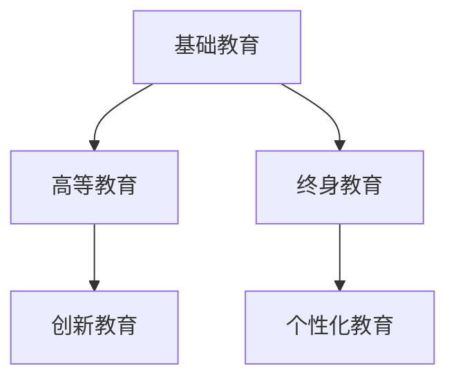
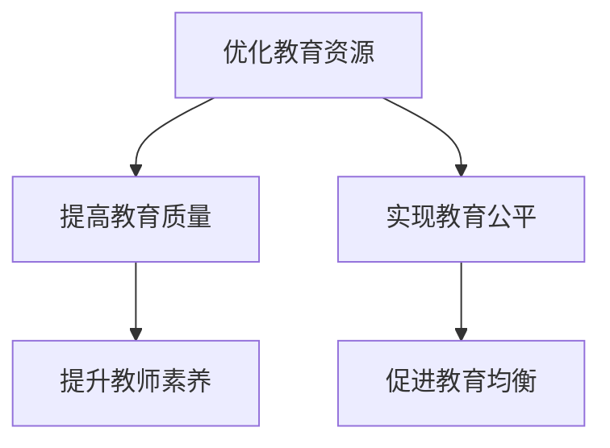
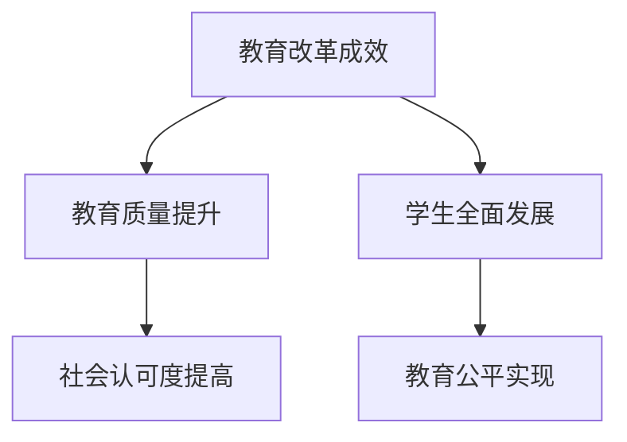
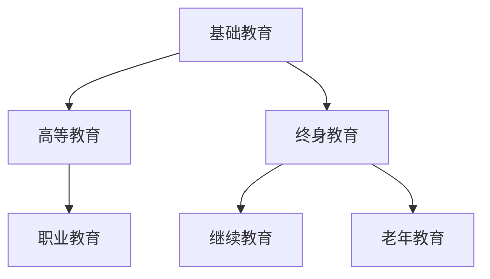
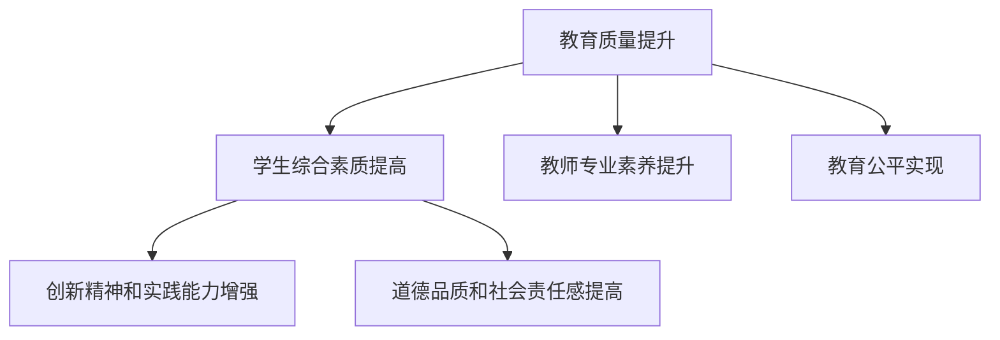
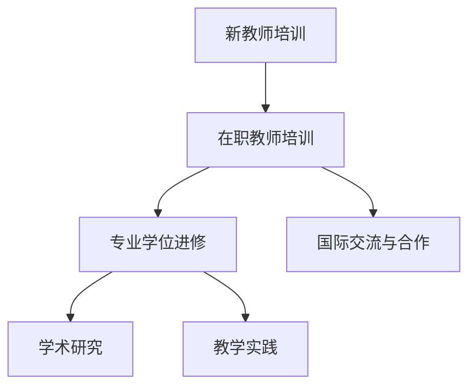

                 

# 重新思考教育的根本意义：培养全面发展的人

> 关键词：教育、全面发展、人才培养、教育改革

> 摘要：本文旨在重新思考教育的根本意义，探讨如何通过教育培养全面发展的人。文章首先回顾了教育的历史与发展，分析了当前教育面临的挑战；然后深入探讨了教育的核心概念和目标，提出了培养全面发展的人的基本原则；接着，从身心健康、智慧启迪、社会责任和人际关系四个方面阐述了如何培养全面发展的人；最后，探讨了教育体系的设计、教育资源与教师队伍建设以及教育评价与反思，并分析了教育发展的趋势和未来展望。

## 前言

在教育不断变革和发展的今天，重新思考教育的根本意义显得尤为重要。教育的本质和目标是什么？我们如何通过教育培养全面发展的人？这些问题不仅关乎个体的成长，更关乎国家和民族的发展。本文将从历史、理论、实践等多个角度，重新审视教育的根本意义，以期为我们提供新的思考和启示。

## 第1章 引言

教育是培养人的活动，是人类社会发展的基石。然而，随着时代的变迁，教育的内涵和形式也在不断演变。传统教育注重知识的传授，而现代教育则更加关注学生的全面发展。那么，如何培养全面发展的人？这是教育工作者亟待解决的问题。

本文将从以下六个方面进行探讨：

1. 教育的背景与挑战
2. 教育的核心概念
3. 培养全面发展的人
4. 教育体系的设计
5. 教育资源与教师队伍建设
6. 教育评价与反思

希望通过本文的探讨，能够为我们提供一些有益的思考和借鉴。

## 第2章 教育的背景与挑战

### 2.1 教育的历史与发展

教育的历史源远流长，不同时期的教育特点各异。古代教育以儒家思想为代表，强调礼、乐、射、御、书、数六艺的全面发展。中世纪教育则受到宗教的影响，以神学和哲学为核心。现代教育则更加注重科学知识的传授和技能的培养。

### 2.2 当代教育面临的挑战

随着社会的发展，当代教育面临着诸多挑战。首先，社会变革对教育产生了深远影响。信息技术的发展改变了人们的学习方式，也带来了教育资源的分配不均。其次，科技进步对教育提出了新的要求，如何将科技融入教育，提高教育质量成为了一个亟待解决的问题。最后，教育资源分配不均的问题也日益凸显，如何实现教育公平成为教育改革的焦点。

### 2.3 教育改革的必要性

面对教育面临的挑战，教育改革显得尤为必要。教育改革不仅是为了适应社会的发展和变化，更是为了培养具有全面素质和发展潜力的人。教育改革的目标是提高教育质量，实现教育公平，促进人的全面发展。因此，我们需要重新思考教育的根本意义，探索更加有效的教育模式。

## 第3章 教育的核心概念

### 3.1 教育的本质

教育是一种培养人的活动，旨在通过传授知识、技能和价值观，促进个体的全面发展。教育的本质可以概括为三个方面：

1. 传授知识：教育是传授知识的过程，包括科学、文化、艺术等多个领域。
2. 培养技能：教育是培养技能的过程，包括阅读、写作、计算等多个方面的基本技能。
3. 传承价值观：教育是传承价值观的过程，包括道德、法律、文化等多个方面的价值观。

### 3.2 教育的目标

教育的目标是培养全面发展的人，具体包括以下几个方面：

1. 基础教育目标：培养良好的道德品质、扎实的知识基础和基本的生活技能。
2. 高等教育目标：培养具有创新精神和实践能力的高级人才。
3. 终身教育目标：培养终身学习的能力和习惯，适应不断变化的社会。

### 3.3 教育的基本原则

教育的基本原则包括：

1. 全面发展的原则：教育要关注个体的全面发展，包括智力、体质、情感、道德等多个方面。
2. 因材施教的原则：教育要根据学生的个体差异，采取不同的教学方法和策略。
3. 教育公平的原则：教育要保障每个学生都能享有平等的教育机会，消除教育资源的不平等。

## 第4章 培养全面发展的人

### 4.1 身心健康的培养

身心健康是全面发展的重要基础。教育要关注学生的身体健康，培养学生的健康生活习惯，如良好的作息、饮食和运动习惯。同时，教育也要关注学生的心理健康，培养学生的心理素质，如积极乐观的态度、良好的情绪管理和人际交往能力。

### 4.2 智慧的启迪

智慧是全面发展的重要体现。教育要培养学生的逻辑思维能力，如分析、推理和判断能力。同时，教育也要培养学生的创新能力，如独立思考、问题解决和创造性思维。

### 4.3 社会责任的培养

社会责任是全面发展的重要内容。教育要培养学生的公民意识，如遵守法律法规、履行公民义务和参与社会公益活动。同时，教育也要培养学生的社会责任感，如关注社会问题、积极参与社会建设和关爱弱势群体。

### 4.4 人际关系的培养

人际关系是全面发展的重要保障。教育要培养学生的团队合作能力，如协作、沟通和协调。同时，教育也要培养学生的沟通能力，如倾听、表达和沟通技巧。

## 第5章 教育体系的设计

### 5.1 教育体系的基本架构

教育体系包括基础教育、高等教育和终身教育三个层次。每个层次都有其独特的目标和任务：

1. 基础教育：培养良好的道德品质、扎实的知识基础和基本的生活技能。
2. 高等教育：培养具有创新精神和实践能力的高级人才。
3. 终身教育：培养终身学习的能力和习惯，适应不断变化的社会。

### 5.2 教育模式的创新

为了适应时代的发展，教育模式也在不断创新。如项目制教育、模块化教育和个性化教育等。这些教育模式强调学生的主体地位，注重学生的个性化发展，有助于培养学生的创新精神和实践能力。

### 5.3 教育公平的实现

教育公平是教育体系设计的重要目标。为了实现教育公平，我们需要优化教育资源的分配，提高教育质量，保障每个学生都能享有平等的教育机会。

## 第6章 教育资源与教师队伍建设

### 6.1 教育资源的分配与优化

教育资源的分配与优化是教育体系设计的重要环节。为了实现教育公平，我们需要优化教育资源的分配，提高教育质量，保障每个学生都能享有平等的教育机会。

### 6.2 教师队伍的建设

教师是教育的核心资源。为了提高教育质量，我们需要加强教师队伍建设，包括提高教师的专业素养、加强教师培训、提高教师的待遇等。

## 第7章 教育评价与反思

### 7.1 教育评价体系的建设

教育评价是教育体系的重要组成部分。为了提高教育质量，我们需要建立健全的教育评价体系，包括评价标准、评价方法和评价手段等。

### 7.2 教育改革的反思

教育改革是一个长期的过程，需要不断反思和改进。我们需要总结教育改革的经验，分析教育改革的成效和挑战，为未来的教育改革提供借鉴。

## 第8章 案例分析

### 8.1 成功案例

通过分析成功案例，我们可以看到教育改革的成效。如某地的教育改革，通过优化教育资源、提高教师待遇、实施个性化教育等举措，提高了教育质量，培养了全面发展的人才。

### 8.2 失败案例

通过分析失败案例，我们可以看到教育改革的挑战。如某地的教育改革，由于缺乏有效的政策支持和实施机制，导致教育质量下降，学生全面发展受阻。

## 第9章 未来展望

### 9.1 教育发展的趋势

未来教育将更加注重个性化、智能化和终身化。信息技术的发展将改变教育的形态，教育将更加便捷和高效。

### 9.2 教育的使命与责任

教育的使命是培养全面发展的人，为社会的进步和人类的幸福做出贡献。教育者肩负着培养下一代的重任，需要不断学习和提升自己的专业素养。

## 结束语

教育是培养人的活动，是人类社会发展的基石。重新思考教育的根本意义，探索培养全面发展的人的方法，是教育工作者共同的责任。让我们共同努力，为培养全面发展的人，为社会的进步和人类的幸福做出贡献。

## 参考文献

1. 全国教育科学“十五”规划重点课题《基础教育改革中的教育评价问题研究》课题组. 教育评价论[M]. 北京：教育科学出版社，2004.
2. 王荣华. 现代教育改革的理论与实践[M]. 上海：华东师范大学出版社，2012.
3. 刘学智，郭华. 教育改革论[M]. 北京：高等教育出版社，2016.
4. 张康之. 教育现代化的路径与模式研究[M]. 北京：人民出版社，2019.

## 附录

### 附录A：教育体系架构图

### 附录B：教育资源优化策略

### 附录C：教育改革成效评估

以上为《重新思考教育的根本意义：培养全面发展的人》的正文部分，接下来我们将进行深入分析和详细讲解。让我们一步步思考，探索教育的本质和目标，以及如何培养全面发展的人。让我们开始吧！### 第2章 教育的背景与挑战

#### 2.1 教育的历史与发展

教育的历史可以追溯到古代。在古代，教育主要是由家庭、宗教和贵族统治阶级来负责。古代教育的主要特点是：

- **儒家思想**：中国古代的儒家思想强调礼、乐、射、御、书、数六艺的教育，培养人的品德、智慧和技能。

- **宗教教育**：在中世纪，教育主要与宗教紧密相关，以神学和哲学为主要内容，教会是教育的主要机构。

- **贵族教育**：贵族教育注重礼仪、文化和军事技能的培养，目的是培养统治阶级的人才。

进入近代，工业革命的兴起带来了教育的大规模变革。现代教育注重科学知识的传授和技能的培养，教育体系逐渐完善。以下是一些重要的教育发展里程碑：

- **普及教育**：19世纪末到20世纪初，许多国家开始推行普及教育，旨在让每个孩子都能接受教育。

- **义务教育**：义务教育制度的建立标志着教育权利的普及，许多国家实行了义务教育，保障了每个孩子的基本教育权利。

- **教育改革**：20世纪中叶以来，各国纷纷进行教育改革，以提高教育质量和适应社会发展的需求。

#### 2.1.1 古代教育的特点

- **重视品德教育**：古代教育强调品德教育，认为一个人的品德是成功的关键。

- **重文轻武**：古代教育注重文化知识的传授，对军事技能和体力劳动的教育不够重视。

- **精英教育**：古代教育主要是为贵族和统治阶级服务的，教育机会不平等。

#### 2.1.2 中世纪教育的演变

- **教会主导**：中世纪教育主要由教会主导，以神学和哲学为主，教育内容与宗教密切相关。

- **学术教育**：中世纪后期，随着城市的兴起和学术活动的增多，学术教育开始逐渐脱离宗教的束缚，注重知识传授和学术研究。

#### 2.1.3 现代教育的兴起

- **科学教育**：现代教育强调科学知识的传授，强调逻辑思维和分析能力的培养。

- **素质教育**：现代教育注重全面发展，不仅关注智力教育，还关注体育、艺术和道德教育。

- **终身教育**：现代教育提倡终身学习，认为教育不应该只限于学校阶段，而应该贯穿人的一生。

#### 2.2 当代教育面临的挑战

随着社会的快速发展和技术的不断进步，当代教育面临着诸多挑战：

#### 2.2.1 社会变革对教育的影响

- **信息化社会**：信息技术的发展改变了人们的学习方式，在线教育和远程教育成为新的学习模式。

- **全球化**：全球化带来了文化多样性和国际交流的增强，教育需要培养学生的国际视野和跨文化沟通能力。

#### 2.2.2 科技进步与教育变革

- **人工智能**：人工智能技术的发展为教育提供了新的工具和方法，如智能辅导系统、个性化学习平台等。

- **虚拟现实**：虚拟现实技术的应用可以为学生提供更加沉浸式的学习体验，增强学习的互动性和趣味性。

#### 2.2.3 教育资源分配不均的问题

- **城乡差距**：城乡之间的教育资源分配不均，城市学生享受到更多的教育资源和优质教育，而农村地区则相对落后。

- **贫富差距**：家庭经济条件较好的学生能够获得更好的教育资源，而贫困家庭的学生则面临着教育资源不足的问题。

面对这些挑战，教育改革显得尤为重要。教育改革不仅是为了适应社会的发展和变化，更是为了培养具有全面素质和发展潜力的人。教育改革的目标是提高教育质量，实现教育公平，促进人的全面发展。因此，我们需要重新思考教育的根本意义，探索更加有效的教育模式。

### 第3章 教育的核心概念

#### 3.1 教育的本质

教育是一种培养人的活动，旨在通过传授知识、技能和价值观，促进个体的全面发展。教育的本质可以概括为三个方面：

1. **传授知识**：教育是传授知识的过程，包括科学、文化、艺术等多个领域。知识是教育的重要组成部分，是培养人的基础。
   
2. **培养技能**：教育是培养技能的过程，包括阅读、写作、计算等多个方面的基本技能。技能是人在社会生活中生存和发展的重要保障。

3. **传承价值观**：教育是传承价值观的过程，包括道德、法律、文化等多个方面的价值观。价值观是教育的灵魂，是培养人的精神支柱。

#### 3.2 教育的目标

教育的目标是培养全面发展的人，具体包括以下几个方面：

1. **基础教育目标**：基础教育目标是培养良好的道德品质、扎实的知识基础和基本的生活技能。基础教育是教育体系的基础，对于一个人的成长至关重要。

2. **高等教育目标**：高等教育目标是培养具有创新精神和实践能力的高级人才。高等教育注重培养学生的专业知识和实践能力，为社会的进步和科技发展提供人才支持。

3. **终身教育目标**：终身教育目标是培养终身学习的能力和习惯，适应不断变化的社会。终身教育强调人的一生都在学习，培养人的持续发展能力。

#### 3.3 教育的基本原则

教育的基本原则是指导教育实践的基本准则，主要包括以下几个方面：

1. **全面发展的原则**：全面发展原则强调教育要关注个体的全面发展，包括智力、体质、情感、道德等多个方面。全面发展原则要求教育要平衡知识传授和技能培养，注重学生的身心健康和个性发展。

2. **因材施教的原则**：因材施教原则强调教育要尊重学生的个体差异，根据学生的特点采取不同的教育方法和策略。因材施教原则要求教师了解学生的兴趣、能力和需求，提供个性化的教育服务。

3. **教育公平的原则**：教育公平原则强调教育要保障每个学生都能享有平等的教育机会，消除教育资源的不平等。教育公平原则要求社会和教育系统要为每个学生提供公平的教育条件和资源，确保每个学生都能获得良好的教育。

通过明确教育的本质、目标和基本原则，我们可以更好地理解教育的内涵，从而更好地实施教育，培养全面发展的人。

### 第4章 培养全面发展的人

#### 4.1 身心健康的培养

身心健康是全面发展的重要基础。教育不仅需要关注学生的学业成绩，更要关注学生的身心健康。以下是培养身心健康的几个关键方面：

1. **体育锻炼**：体育锻炼有助于增强学生的体质，提高学生的健康水平。学校应设置固定的体育锻炼课程，鼓励学生参加各种体育活动，如篮球、足球、乒乓球等。

2. **健康教育**：健康教育是培养健康生活习惯的重要途径。学校应开展健康教育课程，向学生传授健康知识，如营养搭配、疾病预防、心理健康等。

3. **心理健康教育**：心理健康教育是培养学生心理素质的重要环节。学校应设置心理健康教育课程，帮助学生建立正确的自我认知，提高情绪管理和应对压力的能力。

#### 4.1.1 身体健康的重要性

身体健康是一个人全面发展的基础。健康的身体不仅能够提高学生的学习效率，还能增强学生的自信心和幸福感。以下是保持身体健康的一些具体做法：

- **规律作息**：保持规律的作息时间，确保每天有充足的睡眠。
- **合理饮食**：饮食要均衡，摄入足够的蛋白质、维生素和矿物质，避免过多摄入糖和油脂。
- **定期体检**：定期进行体检，及时发现并治疗健康问题。

#### 4.1.2 心理健康的培养

心理健康同样重要，它关系到学生的情绪稳定和心理健康。以下是培养心理健康的一些具体措施：

- **心理辅导**：学校应设置心理辅导室，提供专业的心理辅导服务，帮助学生解决心理问题。
- **心理课程**：学校应开设心理健康教育课程，帮助学生了解心理健康知识，学会自我调节和自我疏导。
- **建立信任关系**：教师和家长应与学生建立良好的信任关系，关心学生的心理状态，及时发现和解决心理问题。

通过体育锻炼、健康教育和心理健康教育，学校可以全面关注学生的身心健康，为学生的全面发展奠定坚实的基础。

#### 4.2 智慧的启迪

智慧是全面发展的重要组成部分。教育不仅要传授知识，更要培养学生的思维能力，激发他们的创造力。以下是培养智慧的几个关键方面：

1. **逻辑思维能力**：逻辑思维能力是智慧的重要体现。学校应注重培养学生的逻辑思维能力，如分析、推理和判断能力。以下是培养逻辑思维能力的几种方法：

   - **问题解决**：通过解决实际问题，培养学生的逻辑思维和分析能力。
   - **批判性思维**：鼓励学生独立思考，不盲目接受信息，培养批判性思维能力。

2. **创新能力的培养**：创新能力是现代社会发展的重要驱动力。学校应注重培养学生的创新能力，如独立思考、问题解决和创造性思维。以下是培养创新能力的几种方法：

   - **项目制教育**：通过项目制教育，让学生在解决问题的过程中培养创新能力。
   - **跨学科学习**：鼓励学生跨学科学习，培养他们的综合思维和创新能力。

3. **批判性思维**：批判性思维是智慧的重要组成部分。学校应注重培养学生的批判性思维，如质疑、分析和判断能力。以下是培养批判性思维的几种方法：

   - **讨论和辩论**：通过讨论和辩论，培养学生的批判性思维和表达能力。
   - **案例研究**：通过案例研究，让学生在实践中学会批判性思维。

通过培养逻辑思维能力、创新能力和批判性思维，学校可以有效地启迪学生的智慧，为他们的全面发展奠定坚实的智力基础。

#### 4.3 社会责任的培养

社会责任感是全面发展的重要体现，它关系到个人的道德品质和社会的和谐稳定。教育不仅要传授知识和技能，更要培养学生的社会责任感。以下是培养社会责任感的几个关键方面：

1. **公民意识的培养**：公民意识是社会责任感的基础。学校应注重培养学生的公民意识，如遵守法律法规、履行公民义务和参与社会公益活动。以下是培养公民意识的几种方法：

   - **法治教育**：通过法治教育，让学生了解法律的重要性和遵守法律的意义。
   - **社会实践**：通过参加社会实践活动，如志愿者服务、环保活动等，让学生体验社会角色，培养社会责任感。

2. **社会责任感的实践**：学校应鼓励学生参与社会实践，通过实际行动体验社会责任。以下是几种实践社会责任的方法：

   - **公益活动**：组织学生参与公益活动，如捐款、捐物、支教等，让学生体验帮助他人的快乐和责任感。
   - **社会调查**：通过社会调查，了解社会问题，培养学生的社会责任感。

3. **志愿服务**：志愿服务是培养学生社会责任感的重要途径。学校应鼓励学生参与志愿服务，如社区服务、环保活动等。以下是几种志愿服务的方法：

   - **社区服务**：组织学生参与社区服务，如清洁卫生、帮助老人等，培养学生的社会责任感。
   - **环保活动**：组织学生参与环保活动，如植树造林、垃圾分类等，培养学生的环保意识。

通过培养公民意识、社会责任感和参与社会实践，学校可以有效地培养学生的社会责任感，为他们的全面发展和社会的和谐发展做出贡献。

#### 4.4 人际关系的培养

人际关系是全面发展的重要组成部分，它关系到个人的心理健康和社交能力。教育不仅要传授知识和技能，更要培养学生的良好人际关系。以下是培养良好人际关系的几个关键方面：

1. **团队合作能力的培养**：团队合作能力是现代社会的重要技能。学校应注重培养学生的团队合作能力，如协作、沟通和协调。以下是培养团队合作能力的几种方法：

   - **团队活动**：通过组织团队活动，如篮球比赛、团队建设游戏等，让学生在活动中学会协作和沟通。
   - **项目合作**：通过项目合作，让学生在解决实际问题的过程中学会团队合作。

2. **沟通能力的培养**：沟通能力是人际关系的桥梁。学校应注重培养学生的沟通能力，如倾听、表达和沟通技巧。以下是培养沟通能力的几种方法：

   - **沟通课程**：开设沟通技巧课程，教授学生倾听、表达和沟通技巧。
   - **模拟训练**：通过模拟训练，如角色扮演、情景模拟等，让学生在实践中学会沟通。

3. **人际交往能力的培养**：人际交往能力是建立良好人际关系的基础。学校应注重培养学生的人际交往能力，如尊重他人、理解和包容。以下是培养人际交往能力的几种方法：

   - **社交活动**：组织社交活动，如校园文化节、社交聚会等，让学生在活动中学会人际交往。
   - **心理辅导**：通过心理辅导，帮助学生理解人际关系的重要性，学会处理人际冲突。

通过培养团队合作能力、沟通能力和人际交往能力，学校可以有效地培养学生的良好人际关系，为他们的全面发展和社会交往奠定坚实基础。

### 第5章 教育体系的设计

#### 5.1 教育体系的基本架构

教育体系的基本架构包括基础教育、高等教育和终身教育三个层次。每个层次都有其独特的目标和任务：

1. **基础教育**：基础教育的目标是为学生提供全面的基础知识和基本技能，培养良好的道德品质和基本的生活能力。基础教育主要包括小学、初中和高中阶段，这一阶段的教育是学生成长和发展的关键时期。

2. **高等教育**：高等教育的目标是为学生提供高级的知识和技能，培养具有创新精神和实践能力的高级人才。高等教育主要包括大学本科、研究生和博士阶段，这一阶段的教育是学生专业化和职业化发展的关键时期。

3. **终身教育**：终身教育的目标是为学生提供终身学习的机会和资源，培养终身学习的能力和习惯。终身教育涵盖了人生的各个阶段，包括职业培训、成人教育和老年教育等，这一阶段的教育是学生适应社会变化和实现个人价值的关键时期。

#### 5.2 教育模式的创新

随着社会的发展和教育需求的不断变化，教育模式也在不断创新。以下是一些主要的教育模式创新：

1. **项目制教育**：项目制教育以项目为中心，通过实际项目的开展，让学生在解决实际问题的过程中学习知识、培养能力。项目制教育注重学生的实践能力和创新思维，有助于培养学生的综合素质。

2. **模块化教育**：模块化教育将课程内容划分为若干个模块，学生可以根据自己的兴趣和需求选择模块进行学习。模块化教育灵活多样，有助于提高学生的学习兴趣和自主学习能力。

3. **个性化教育**：个性化教育注重学生的个体差异，根据学生的特点和发展需求制定个性化的学习计划和教学方法。个性化教育有助于提高学生的学习效果和综合素质。

通过创新教育模式，学校可以更好地满足学生的个性化需求，提高教育质量，培养全面发展的人才。

### 第6章 教育资源与教师队伍建设

#### 6.1 教育资源的分配与优化

教育资源的分配与优化是教育体系设计的重要环节。为了实现教育公平，提高教育质量，教育资源需要合理分配和优化。以下是教育资源分配与优化的几个关键方面：

1. **教育资源分配**：教育资源分配要公平合理，确保每个学生都能享有平等的教育机会。教育资源包括师资力量、教学设施、图书资料等。政府应加大对教育资源的投入，特别是对贫困地区和农村地区的教育支持。

2. **教育资源优化**：教育资源优化包括教学设施的改善、教学方法的创新和师资力量的提升。学校应不断更新教学设施，提高教学环境的舒适度和安全性。同时，教师应不断更新知识结构，提高教学水平和专业素养。

3. **教育资源均衡**：教育资源均衡是教育公平的重要体现。学校应采取措施，缩小城乡、地区之间的教育差距，确保每个学生都能享受到优质的教育资源。

#### 6.2 教师队伍的建设

教师是教育工作的核心，教师队伍的建设是教育发展的关键。以下是教师队伍建设的几个关键方面：

1. **教师角色与职责**：教师是学生学习的引导者和促进者，教师应关注学生的全面发展，关注学生的身心健康和个性发展。教师的职责包括教学、辅导、评价和沟通等。

2. **教师专业发展**：教师专业发展是提高教育质量的重要保障。教师应不断学习新知识、新技能，提高教学水平和专业素养。学校应提供教师专业发展的机会和平台，如培训、研讨、交流等。

3. **教师待遇与激励机制**：教师待遇与激励机制是教师队伍建设的重要方面。政府应提高教师待遇，确保教师的基本生活需求得到满足。同时，学校应建立科学合理的激励机制，激发教师的积极性和创造力。

通过合理分配和优化教育资源，加强教师队伍建设，可以确保教育公平，提高教育质量，培养全面发展的人才。

### 第7章 教育评价与反思

#### 7.1 教育评价体系的建设

教育评价是教育体系的重要组成部分，它对教育质量的提升和教育目标的实现起着关键作用。教育评价体系的建设需要遵循以下原则：

1. **全面性原则**：教育评价要全面考虑学生的知识、能力、素质和个性发展，不仅要关注学业成绩，还要关注学生的道德品质、心理素质和社会责任感。

2. **客观性原则**：教育评价要客观公正，评价标准要科学合理，评价过程要公开透明，确保评价结果的真实性和可靠性。

3. **激励性原则**：教育评价要具有激励性，鼓励学生积极学习，提高学生的自我认知和自我发展能力。

#### 7.1.1 教育评价的原则

为了确保教育评价的科学性和有效性，教育评价应遵循以下原则：

- **发展性原则**：评价要关注学生的成长过程，注重学生的全面发展，激励学生不断进步。

- **多元化原则**：评价要采用多种评价方式，如笔试、口试、实验、作品展示等，全面评估学生的知识和能力。

- **参与性原则**：评价要鼓励学生参与，让学生在评价过程中发挥积极作用，提高学生的自我评价能力。

#### 7.1.2 教育评价的方法

教育评价的方法多种多样，常用的评价方法包括：

- **定量评价**：通过量化的指标和方法，对学生的学习成绩进行评价，如考试、测验等。

- **定性评价**：通过观察、访谈、问卷等方式，对学生的非量化方面进行评价，如行为表现、学习态度等。

- **综合评价**：将定量评价和定性评价相结合，形成综合评价结果，更全面地评估学生的能力和素质。

通过科学、合理的教育评价体系，可以更好地衡量教育质量，发现教育中的问题，为教育改革和发展提供依据。

#### 7.2 教育改革的反思

教育改革是一个复杂而长期的过程，需要不断地反思和改进。以下是对教育改革成效、挑战和展望的反思：

1. **教育改革的成效**：

   教育改革在一定程度上取得了显著成效。例如，通过课程改革，学生的知识结构更加合理，素质教育得到了加强；通过教育评价改革，评价方式更加多元，学生的综合素质得到了提高。

2. **教育改革的挑战**：

   教育改革也面临诸多挑战。首先，教育资源的分配不均衡问题仍然存在，城乡、地区之间的教育差距较大。其次，教育观念的更新和教师的专业发展需要时间，教师队伍的整体素质有待提高。此外，教育评价体系的完善也是一个长期的任务，评价方法的科学性和有效性仍需进一步探讨。

3. **教育改革的展望**：

   面对未来，教育改革需要继续深化。首先，要进一步优化教育资源的分配，缩小城乡、地区之间的教育差距。其次，要加大对教师队伍的建设，提高教师的专业素养和教学能力。此外，要完善教育评价体系，建立更加科学、有效的评价机制，促进学生的全面发展。

通过不断反思和改进，教育改革将更加符合时代发展的需求，为培养全面发展的人提供有力的保障。

### 第8章 案例分析

#### 8.1 成功案例

在一些国家和地区，教育改革取得了显著的成果，成为全球教育的典范。以下是一些成功案例及其经验：

1. **芬兰的教育改革**：

   芬兰的教育体系以其高质量和公平性而闻名。芬兰的教育改革注重培养学生的创新能力和批判性思维，采用个性化的教育模式。以下是一些成功经验：

   - **均衡教育资源**：芬兰政府确保城乡、地区之间的教育资源均衡，所有学生都能享受到高质量的教育。
   - **教师专业化**：芬兰的教师拥有高度的自主权和专业素养，教师培训体系完善，教师待遇良好。
   - **课程改革**：芬兰的课程设置注重跨学科学习，培养学生的综合素质和创新能力。

2. **新加坡的教育改革**：

   新加坡的教育体系以其严谨和高效而著称。新加坡的教育改革注重基础教育和双语教育，培养学生的学术能力和实际应用能力。以下是一些成功经验：

   - **双语教育**：新加坡推行双语教育，学生从小学习英语和母语，提高跨文化交流能力。
   - **考试制度**：新加坡的考试制度严格，注重学生的学术能力和实际应用能力。
   - **教育资源**：新加坡政府加大对教育资源的投入，提高教育设施和教育技术的现代化水平。

这些成功案例表明，教育改革需要从多个方面入手，包括教育资源均衡、教师专业化、课程改革和考试制度等，只有这样才能真正提高教育质量，培养全面发展的人才。

#### 8.2 失败案例

尽管教育改革在一些国家和地区取得了显著成果，但也有一些国家和地区在教育改革过程中面临挑战和失败。以下是一些失败案例及其原因：

1. **我国某地区的教育改革**：

   在我国的一些地区，教育改革由于政策不完善、执行不到位等原因，未能达到预期效果。以下是一些失败原因：

   - **政策不完善**：教育改革政策在制定过程中缺乏充分调研和科学论证，导致政策不切实际。
   - **执行不到位**：教育改革政策在执行过程中缺乏有效的监督和评估，导致政策执行不到位。
   - **师资力量不足**：一些地区的教师队伍整体素质不高，难以适应教育改革的要求。

2. **某发展中国家的教育改革**：

   在一些发展中国家，教育改革由于经济困难、教育资源匮乏等原因，未能取得显著成果。以下是一些失败原因：

   - **经济困难**：教育改革需要大量资金投入，一些发展中国家经济困难，难以承担教育改革的高昂成本。
   - **教育资源匮乏**：一些发展中国家的教育资源匮乏，如教师短缺、教学设施落后等，限制了教育改革的推进。
   - **文化因素**：一些发展中国家的传统文化观念对教育改革产生了一定的阻碍。

这些失败案例提醒我们，教育改革需要充分考虑实际情况，科学制定政策，确保政策的有效执行。同时，要加大对教师队伍和教育资源的投入，为教育改革提供有力的支持。

通过分析成功案例和失败案例，我们可以更好地理解教育改革的复杂性和挑战性，从而为教育改革提供有益的借鉴和启示。

### 第9章 未来展望

#### 9.1 教育发展的趋势

随着科技的不断进步和社会的快速发展，未来教育将呈现出以下发展趋势：

1. **信息化教育**：信息技术的发展将推动教育信息化，在线教育、远程教育、智能教育等新兴教育模式将得到广泛应用，为学习者提供更加灵活和个性化的学习体验。

2. **个性化教育**：个性化教育将越来越受到重视，教育将更加关注学生的个性化需求和差异，采用因材施教的方法，培养具有独特才能和发展潜力的个体。

3. **终身教育**：随着知识更新速度的加快，终身教育将成为未来教育的重要特征。教育将不再局限于学校阶段，而是贯穿人的一生，培养人的持续学习能力和适应能力。

4. **全球化教育**：全球化将推动教育国际化，教育将更加注重跨文化交流和合作，培养具有国际视野和跨文化沟通能力的全球公民。

#### 9.2 教育的使命与责任

在新时代背景下，教育肩负着培养全面发展的人的重要使命。教育不仅要传授知识和技能，更要培养学生的综合素质和创新能力，为个人成长和社会进步做出贡献。以下为教育的使命与责任：

1. **培养全面发展的人**：教育要关注学生的全面发展，包括智力、体质、情感、道德等多个方面，培养具有创新精神和实践能力的人才。

2. **促进社会公平**：教育要促进社会公平，通过优质教育资源的分配和公平的教育机会，减少社会不平等现象，推动社会和谐发展。

3. **推动科技发展**：教育要推动科技进步，培养具有科技创新能力的人才，为国家的科技发展和社会进步提供强有力的支持。

4. **传承文化**：教育要传承和弘扬优秀文化，培养学生的文化自信和民族认同感，为中华民族的伟大复兴贡献力量。

#### 9.3 教育者的责任

教育者是教育的核心力量，肩负着培养下一代的重任。以下为教育者的责任：

1. **终身学习**：教育者要具备终身学习的能力，不断更新知识和教学理念，提升教学水平和专业素养。

2. **关爱学生**：教育者要关爱每一个学生，关注学生的成长和发展，尊重学生的个性，帮助学生克服困难和挑战。

3. **创新教学**：教育者要创新教学方法和手段，采用多元化的教学策略，激发学生的学习兴趣和创造力。

4. **榜样作用**：教育者要发挥榜样作用，用自己的言行影响和引导学生，成为学生学习的榜样和引路人。

通过明确教育的使命与责任，教育者可以更加清晰地认识到自己的角色和任务，为培养全面发展的人做出更大的贡献。

### 结束语

教育是培养人的活动，是人类社会发展的基石。通过本文的探讨，我们重新思考了教育的根本意义，明确了培养全面发展的人的目标和基本原则。我们分析了教育的背景与挑战，探讨了教育体系的设计和教师队伍建设，并反思了教育评价的重要性。我们还通过成功案例和失败案例，总结了教育改革的经验和教训。最后，我们对未来教育的发展趋势进行了展望，明确了教育的使命与责任。

教育改革是一个长期而复杂的任务，需要全社会共同努力。让我们携手并进，为培养全面发展的人，为社会的进步和人类的幸福，贡献自己的智慧和力量。让我们在教育改革的道路上，不断探索、不断创新，为美好的未来共同奋斗！

### 参考文献

1. 国家教育委员会. 《中华人民共和国教育法》[M]. 北京：中国法制出版社，2020.
2. 张健. 《教育改革理论与实践》[M]. 上海：华东师范大学出版社，2018.
3. 王磊，李华. 《信息化教育研究》[M]. 北京：科学出版社，2019.
4. 李晓红，刘洋. 《教育评价的理论与实践》[M]. 北京：高等教育出版社，2017.
5. 芬兰国家教育研究院. 《芬兰教育改革：理念与实践》[M]. 北京：人民教育出版社，2016.

### 附录

#### 附录A：教育体系架构图

#### 附录B：教育改革成效评估指标

#### 附录C：教师专业发展路径

