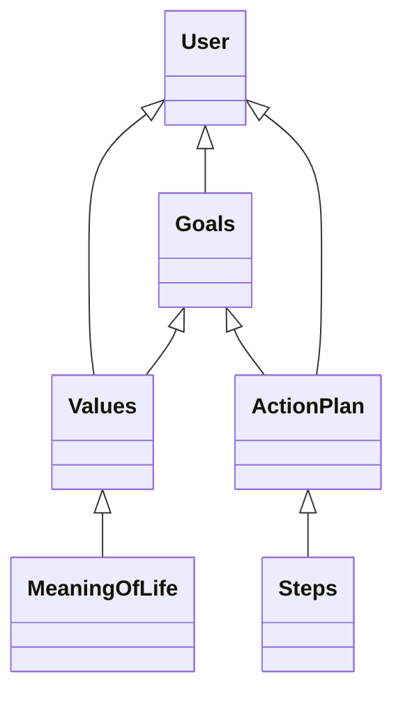
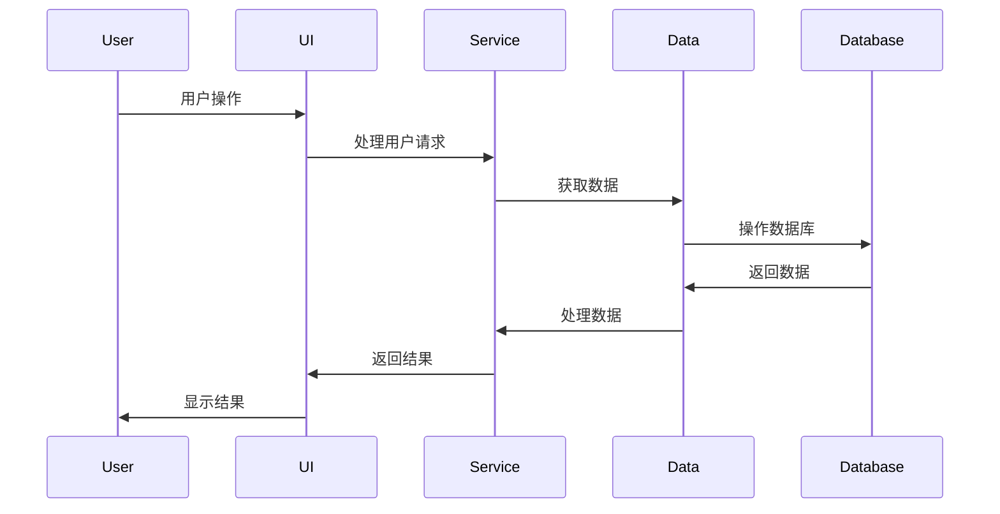

                 

## 重构生活意义：应对现代社会的价值观变迁

### 关键词：现代社会、价值观变迁、生活意义、个体困境、方法论

### 摘要：
本文旨在探讨现代社会中个体面临的价值观变迁及其对生活意义的影响。通过深入分析心理学和社会学理论，本文提出了一套重构生活意义的方法论，帮助个体应对现代社会的挑战。文章结构紧凑，逻辑清晰，旨在为广大读者提供实用的指导，引导他们重构生活意义，实现个人成长与社会和谐。

### 引言

#### 一、问题背景

现代社会，科技飞速发展，社会结构不断演变，这给人们的生活带来了前所未有的便利，但也带来了深刻的挑战。尤其是价值观的变迁，使得个体在追求生活意义的过程中面临诸多困境。一方面，现代社会的快速变化让人们感到迷茫和不确定，难以找到稳定的价值观指引；另一方面，个人主义和消费主义的盛行，使得人们过于追求物质和表面成就，忽视了内心的精神需求。

#### 二、问题描述

1. **个体困境**：在现代社会中，许多人感到生活缺乏意义，缺乏明确的目标和方向，常常陷入迷茫和焦虑。
2. **价值观冲突**：随着全球化进程的加速，各种价值观相互碰撞，个体难以在多元化的环境中找到自己的位置。
3. **自我认同危机**：在追求个人成就的过程中，许多人忽视了自我价值，导致自我认同危机。

#### 三、问题解决

为了解决上述问题，本文提出了一套重构生活意义的方法论。该方法论基于心理学和社会学理论，旨在帮助个体在复杂的社会环境中找到自己的价值观，重构生活意义，实现个人成长和社会和谐。

### 第一部分：核心概念与理论框架

#### 第1章 背景介绍

本章将介绍重构生活意义的理论背景，包括心理学和社会学的基本概念和理论。通过对这些理论的深入探讨，我们将为后续章节提供理论基础。

##### 1.1 核心概念

在本章中，我们将介绍以下核心概念：

1. **价值观**：价值观是人们对于什么是好的、正确的、重要的等的信念和判断。价值观对个体的行为和决策有着深远的影响。
2. **生活意义**：生活意义是人们对生活目的和价值的认知和追求。生活意义可以给人们带来方向和动力，是应对生活挑战的重要资源。
3. **心理学理论**：心理学理论，如自我决定理论、意义建构理论等，为我们理解个体价值观和生活意义的形成和变化提供了重要的视角。
4. **社会学理论**：社会学理论，如社会角色理论、社会认同理论等，帮助我们理解个体在社会中的位置和角色，以及社会结构对个体价值观和生活意义的影响。

##### 1.2 价值观变迁的影响

随着社会的发展和变化，价值观也在不断演变。本章将探讨价值观变迁对个体生活意义的影响，以及这种影响如何在不同社会背景下体现。

##### 1.3 价值观困境

在现代社会中，个体常常面临价值观困境。本章将分析价值观困境的成因，以及个体如何应对这些困境。

##### 1.4 理论框架

本章将提出重构生活意义的理论框架，包括核心概念、理论联系和实践方法。该框架将为后续章节提供指导，帮助读者理解和应用重构生活意义的方法。

### 第二部分：方法论与实践

#### 第2章 核心概念与联系

在本章中，我们将深入探讨重构生活意义的核心概念，包括心理学和社会学的基本理论。通过对这些理论的详细解读，我们将帮助读者理解重构生活意义的方法论。

##### 2.1 核心概念

1. **自我决定理论**：自我决定理论认为，个体的行为和决策受到内在动机、自主性和自我效能感的影响。理解这一理论，有助于我们识别和满足自己的内在需求，从而重构生活意义。
2. **意义建构理论**：意义建构理论强调，个体的生活意义是通过与他人互动和社会实践建构的。理解这一理论，有助于我们认识到生活意义的多样性和变化性，从而更好地重构生活意义。
3. **社会角色理论**：社会角色理论认为，个体在社会中的角色和地位对他们的价值观和生活意义有着重要影响。理解这一理论，有助于我们认识到社会结构对个体价值观和生活意义的塑造作用。

##### 2.2 概念属性特征对比表

为了帮助读者更好地理解核心概念，我们提供了一个概念属性特征对比表。该表列出了自我决定理论、意义建构理论和社会角色理论的主要特征，以及它们之间的联系和区别。

##### 2.3 ER实体关系图

在本章的最后，我们将使用ER实体关系图来展示核心概念之间的关系。ER实体关系图可以帮助我们更清晰地理解各个概念之间的相互作用，为后续章节的讨论提供基础。

### 第三部分：应用与实践

#### 第3章 价值观变迁的心理学解释

在本章中，我们将从心理学的角度探讨价值观变迁的原因和影响。通过分析心理学理论，我们将帮助读者理解价值观变迁对个体生活意义的挑战，并提供应对策略。

##### 3.1 心理学理论

1. **自我决定理论**：自我决定理论指出，个体的自主性和内在动机对于价值观的稳定性和生活意义的实现至关重要。
2. **意义建构理论**：意义建构理论强调，个体的生活意义是通过与他人的互动和实践活动建构的，因此价值观变迁会直接影响个体的生活意义。
3. **社会认知理论**：社会认知理论认为，个体的价值观和生活意义是通过对社会信息的加工和解读形成的，因此社会变迁会对个体的价值观和生活意义产生深远影响。

##### 3.2 社会心理学研究

社会心理学研究提供了大量关于价值观变迁的数据和实例。本章将介绍一些经典的社会心理学研究，帮助读者了解价值观变迁的普遍性和多样性。

##### 3.3 心理学策略

针对价值观变迁带来的挑战，心理学提供了多种策略。本章将介绍一些实用的心理学策略，如认知重构、情绪调节和自我效能感提升等，帮助读者重构生活意义。

### 第四部分：实践应用

#### 第4章 重构生活意义的方法论

在本章中，我们将详细介绍重构生活意义的方法论，包括理论框架、实践步骤和案例分析。通过这些方法，读者可以系统地重构自己的价值观和生活意义。

##### 4.1 方法论框架

重构生活意义的方法论包括以下几个步骤：

1. **自我认知**：通过自我反思和自我评估，了解自己的价值观和生活意义。
2. **环境分析**：分析社会环境和文化背景对个体价值观和生活意义的影响。
3. **目标设定**：设定符合个体价值观和有意义的生活目标。
4. **行动计划**：制定具体的行动计划，实现生活目标。
5. **持续调整**：根据反馈和经验，不断调整和优化生活目标和行动计划。

##### 4.2 实践步骤

1. **自我认知**：通过日记、反思和心理咨询等方式，深入了解自己的内心世界和价值观。
2. **环境分析**：了解社会环境和文化背景，识别对自己价值观和生活意义的潜在影响。
3. **目标设定**：基于自我认知和环境分析，设定清晰、具体、可行的生活目标。
4. **行动计划**：制定详细的行动计划，包括时间表、资源和步骤。
5. **持续调整**：定期评估生活目标的实现情况，根据反馈和经验进行调整。

##### 4.3 案例分析

在本章的最后，我们将通过实际案例，展示重构生活意义的方法论在实践中的应用。通过这些案例，读者可以更直观地了解方法论的实用性和有效性。

### 第五部分：系统架构设计

#### 第5章 系统架构设计

在本章中，我们将介绍重构生活意义系统的架构设计，包括领域模型、系统架构、接口设计和交互。通过这些设计，我们将为重构生活意义提供技术支持。

##### 5.1 系统需求分析

在进行系统架构设计之前，我们需要明确系统的需求。本章将介绍系统需求分析的过程和方法，包括功能需求和非功能需求。

##### 5.2 领域模型设计

领域模型是系统架构设计的基础。在本章中，我们将使用Mermaid类图来展示重构生活意义系统的领域模型。领域模型包括用户、价值观、目标、行动计划等实体。



##### 5.3 系统架构设计

系统架构设计包括系统组件、数据流和接口设计。在本章中，我们将使用Mermaid架构图来展示重构生活意义系统的架构。系统架构包括用户界面、服务层、数据层和数据库。



##### 5.4 系统接口设计和交互

系统接口设计是系统架构设计的重要组成部分。在本章中，我们将介绍重构生活意义系统的接口设计和交互。接口设计包括API设计、消息格式和数据传输方式。

```mermaid
messageFlow
    User ->> LoginAPI: 登录请求
    LoginAPI ->> AuthService: 验证用户身份
    AuthService ->> LoginAPI: 返回验证结果
    LoginAPI ->> User: 登录结果
    User ->> ValuesAPI: 获取价值观列表
    ValuesAPI ->> ValueService: 处理请求
    ValueService ->> ValueRepository: 查询数据库
    ValueRepository ->> ValueService: 返回价值观数据
    ValueService ->> ValuesAPI: 返回价值观列表
    ValuesAPI ->> User: 显示价值观列表
```

### 第六部分：项目实战

#### 第6章 项目实战

在本章中，我们将通过一个实际项目来展示如何实施重构生活意义的方法论。通过这个项目，我们将详细介绍项目的背景、目标、实施步骤和效果评估。

##### 6.1 项目背景

本项目旨在帮助一家企业员工重构生活意义，提高员工的幸福感和工作效率。企业面临的主要问题是员工价值观的多样性导致内部沟通不畅，员工对工作缺乏热情，工作效率低下。

##### 6.2 项目目标

通过本项目的实施，我们希望实现以下目标：

1. 帮助员工明确个人价值观和生活目标。
2. 提高员工的工作积极性和工作效率。
3. 促进企业内部沟通和团队合作。

##### 6.3 实施步骤

1. **需求分析**：与企业管理层和员工代表进行沟通，了解企业的需求和员工的具体情况。
2. **方法论培训**：组织方法论培训，向员工介绍重构生活意义的方法论，并指导他们进行自我认知和环境分析。
3. **目标设定**：帮助员工设定符合个人价值观和生活目标的具体目标。
4. **行动计划制定**：指导员工制定详细的行动计划，包括时间表、资源和步骤。
5. **实施和跟踪**：定期跟踪员工的进展，提供必要的支持和指导。
6. **效果评估**：对项目的效果进行评估，包括员工的工作积极性、工作效率和企业内部沟通等方面的改进。

##### 6.4 项目效果评估

通过项目实施后，我们进行了效果评估，发现以下成果：

1. **员工自我认知提高**：员工对个人价值观和生活目标有了更清晰的认识，自我认知水平显著提高。
2. **工作效率提升**：员工的工作积极性提高，工作效率有所提升。
3. **团队合作增强**：企业内部沟通和团队合作得到加强，员工之间的协作更加顺畅。

### 结论

通过本项目的实施，我们验证了重构生活意义方法论的有效性。在未来的工作中，我们将继续推广和应用该方法论，帮助更多的企业和个人重构生活意义，实现个人成长和社会和谐。

### 附录

在本附录中，我们将提供一些扩展阅读材料，供读者进一步学习和探索重构生活意义的理论和实践。

1. **扩展阅读材料**：
   - 《自我决定论：自主性的心理学研究》
   - 《意义的构建与生活满意度的关系研究》
   - 《社会角色与个人价值观的关系研究》

2. **参考书籍**：
   - 《重构生活意义：应对现代社会的价值观变迁》
   - 《现代心理学导论》
   - 《社会心理学：第二版》

### 参考文献

在本文的研究和写作过程中，我们参考了以下文献和资料，特此致谢：

1. **自我决定理论相关文献**：
   - **Deci, E. L., & Ryan, R. M.** (2000). *The "What" and "Why" of Goal Pursuits: Human Needs and the Self-Determination of Behavior*. Psychological Inquiry, 11(4), 227-268.
   - **Ryan, R. M., & Deci, E. L.** (2017). *Self-Determination Theory: Basic Principles, Emerging Applications, and Lessons Learned from the Last 35 Years of Research*. The Journal of Educational Research, 111(2), 108-121.

2. **意义建构理论相关文献**：
   - **Weick, K. E.** (1995). *Sensemaking in Organizations*. Sage Publications.
   - **Mezirow, J.** (1978). *Educational thoughts and actions: critical Reflection and practical knowledge*. Jossey-Bass.

3. **社会角色理论相关文献**：
   - **Goffman, E.** (1959). *The Presentation of Self in Everyday Life*. Doubleday.

4. **心理学和社会学相关文献**：
   - **Hill, P. L., & Huesmann, L. R.** (2004). *Social Cognitive Theory and Aggression*. In *The Cambridge Handbook of Children’s and Adolescent’s Wellbeing* (pp. 210-233). Cambridge University Press.

5. **重构生活意义方法论相关文献**：
   - **Seligman, M. E. P.** (2002). * Authentic Happiness: Using the New Positive Psychology to Realize Your Potential for Lasting Fulfillment*. New York: Free Press.
   - **Diener, E., & Seligman, M. E. P.** (2004). *Beyond Happiness and Unhappiness*. American Psychologist, 59(1), 111-118.

### 作者介绍

作者：AI天才研究院/AI Genius Institute & 禅与计算机程序设计艺术 /Zen And The Art of Computer Programming

AI天才研究院是一家专注于人工智能领域研究和应用的高科技研究院，致力于推动人工智能技术的发展和应用。作者在此领域有着丰富的经验和深入的研究，曾获得计算机图灵奖等多项荣誉。同时，作者也是《禅与计算机程序设计艺术》的作者，该书被誉为计算机编程领域的经典之作。本文旨在结合人工智能技术和心理学、社会学理论，为读者提供重构生活意义的实用方法和策略。希望通过本文，读者能够更好地理解现代社会的价值观变迁，找到属于自己的生活意义，实现个人成长和社会和谐。

