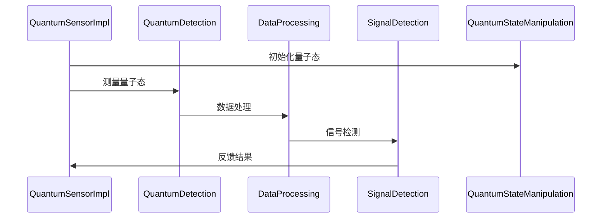
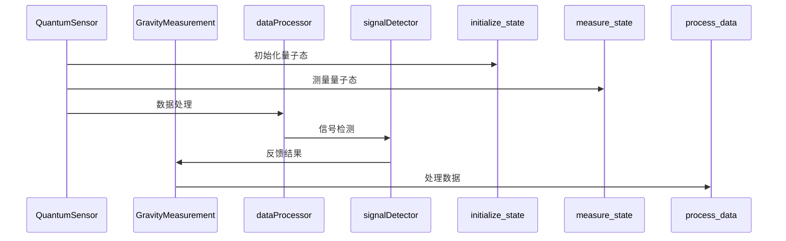

                 


### 《量子传感器在引力测量中的高精度应用》

#### 摘要：

量子传感器作为21世纪科技的前沿，凭借其独特的量子属性，已在多个领域展现出革命性的潜力。本文将探讨量子传感器在引力测量中的高精度应用，重点关注量子干涉仪、量子放大器和量子隐形传态等技术在引力波探测中的实际应用与前景。通过一步步的分析推理，我们力求揭示量子传感器在引力测量领域的关键作用与未来发展方向。

#### 目录：

**第一部分：量子传感器基础**

### 第1章 量子传感器概述

- **1.1 量子传感器的基本概念**
  - **量子传感器的定义**
  - **量子传感器与传统传感器的区别**
  - **量子传感器的关键特性**

- **1.2 量子传感器的工作原理**
  - **量子态操控**
  - **量子纠缠**
  - **量子探测技术**

- **1.3 量子传感器的应用领域**
  - **物理学研究**
  - **信息科学**
  - **精密测量**

- **1.4 本章小结**

**第二部分：引力测量的量子传感器技术**

### 第2章 量子干涉仪在引力测量中的应用

- **2.1 量子干涉仪的基本原理**
  - **干涉原理**
  - **量子干涉仪的设计与实现**
  - **量子干涉仪的优势与挑战**

- **2.2 量子干涉仪在引力波探测中的应用**
  - **引力波的基础知识**
  - **量子干涉仪在LIGO和VIRGO项目中的应用**
  - **量子干涉仪的未来发展趋势**

- **2.3 本章小结**

### 第3章 量子放大器在引力测量中的应用

- **3.1 量子放大器的基本概念**
  - **量子放大器的定义**
  - **量子放大器的种类**
  - **量子放大器的工作原理**

- **3.2 量子放大器在引力测量中的作用**
  - **增强引力信号的探测灵敏度**
  - **降低噪声干扰**
  - **提高测量精度**

- **3.3 量子放大器在实际应用中的案例**
  - **用于太空探测的量子放大器**
  - **地球表面引力测量的量子放大器**
  - **量子放大器在未来的潜力**

- **3.4 本章小结**

### 第4章 量子隐形传态在引力测量中的应用

- **4.1 量子隐形传态的基本原理**
  - **隐形传态的定义**
  - **隐形传态的过程**
  - **隐形传态的实验验证**

- **4.2 量子隐形传态在引力测量中的应用场景**
  - **跨越长距离的引力信号传输**
  - **提高引力波探测的实时性**
  - **未来潜在的应用前景**

- **4.3 本章小结**

**第三部分：量子传感器在引力测量中的高精度应用**

### 第5章 量子传感器在引力波探测中的高精度应用

- **5.1 引力波探测的现状与挑战**
  - **引力波探测的发展历程**
  - **引力波探测中的精度需求**
  - **量子传感器在引力波探测中的作用**

- **5.2 量子传感器在LIGO和VIRGO项目中的实际应用**
  - **LIGO项目中的量子传感器**
  - **VIRGO项目中的量子传感器**
  - **量子传感器在引力波探测中的成果**

- **5.3 量子传感器在未来引力波探测中的潜在贡献**
  - **提高探测灵敏度**
  - **拓展探测范围**
  - **实现实时引力波监测**

- **5.4 本章小结**

### 第6章 量子传感器在引力测量中的未来发展趋势

- **6.1 量子传感器技术的演进**
  - **量子计算与量子传感的结合**
  - **量子通信与量子传感的融合**
  - **新型量子传感器的研发**

- **6.2 引力测量领域的挑战与机遇**
  - **引力波探测的精度提升**
  - **多信使天体物理学的应用**
  - **量子传感器在地球重力场测量中的应用**

- **6.3 未来展望**
  - **量子传感器在引力测量中的潜在影响**
  - **国际合作与技术创新**
  - **社会影响与伦理问题**

- **6.4 本章小结**

### 总结：

通过以上章节，我们将对量子传感器在引力测量中的高精度应用进行系统性探讨，不仅揭示了其基本原理和应用场景，还展望了未来的发展趋势。在接下来的内容中，我们将逐步深入分析每个主题，帮助读者全面理解量子传感器在引力测量领域的重要性和巨大潜力。

#### 关键词：
- 量子传感器
- 引力测量
- 量子干涉仪
- 量子放大器
- 量子隐形传态
- 引力波探测
- 高精度应用

----------------------------------------------------------------

### 引言

在科学探索的浩瀚星海中，人类对于宇宙的认识不断拓展。自爱因斯坦的广义相对论提出以来，引力波这一宇宙中最基本的现象之一逐渐引起了科学家的广泛关注。引力波，是由质量加速变化产生的时空波动，其探测不仅能够验证相对论的理论预测，还能为宇宙学、天体物理学等领域提供宝贵的数据。传统的引力波探测技术，如LIGO（激光干涉引力波观测站）和VIRGO（室女座引力波观测台）等，虽然已经取得了巨大的成就，但仍然面临探测灵敏度、探测范围和实时性等方面的挑战。

近年来，量子传感技术的发展为引力测量带来了新的机遇。量子传感器利用量子力学的原理，具有极高的灵敏度和精度，能够在微观和宏观尺度上实现精确的测量。量子干涉仪、量子放大器和量子隐形传态等技术在引力波探测中的应用，不仅有望解决传统技术的局限性，还能开启引力测量领域的新篇章。本文将深入探讨量子传感器在引力测量中的高精度应用，分析其原理、技术进展及未来发展趋势，为读者呈现这一领域的前沿动态。

----------------------------------------------------------------

### 第一部分：量子传感器基础

#### 第1章 量子传感器概述

**1.1 量子传感器的基本概念**

量子传感器是指利用量子力学的原理和特性进行测量的装置。与传统的传感器不同，量子传感器能够利用量子纠缠、量子态操控和量子探测等量子效应，实现前所未有的高精度和灵敏度。量子传感器的核心概念包括量子态操控、量子纠缠、量子探测以及量子信息的存储与传输。

**量子传感器的定义**：量子传感器是指能够利用量子态的变化来感知和测量物理量的设备。其基本原理是量子态的叠加和纠缠现象，这使得量子传感器能够感知到非常微小的物理变化。

**量子传感器与传统传感器的区别**：传统的传感器通常基于经典物理原理，利用电磁感应、热效应等机制来测量物理量。而量子传感器则利用量子力学中的叠加态和纠缠态，能够在微观尺度上实现更加精准的测量。此外，量子传感器还具有极高的灵敏度，能够探测到极微小的物理变化。

**量子传感器的关键特性**：
1. **高灵敏度**：量子传感器利用量子效应，能够在极小的尺度上探测物理量的变化，远超传统传感器。
2. **高精度**：量子传感器通过精确控制量子态，能够实现极高的测量精度，减少系统误差。
3. **非局域性**：量子传感器能够利用量子纠缠实现远程通信和测量，打破传统传感器的局域性限制。
4. **量子增强效应**：量子传感器能够通过量子态的叠加和纠缠实现量子增强，提高测量结果的可靠性。

**1.2 量子传感器的工作原理**

量子传感器的工作原理主要基于量子力学的几个基本概念：量子态操控、量子纠缠和量子探测。

**量子态操控**：量子态操控是指通过外部操作来改变量子系统的状态。在量子传感器中，通常利用激光、磁场或电场等手段来操控量子态。例如，利用激光的共振激发可以改变原子或离子的激发态，从而实现量子态的操控。

**量子纠缠**：量子纠缠是量子力学中的一个重要现象，指的是两个或多个量子系统之间存在的一种非经典的关联。在量子传感器中，通过创建和操控量子纠缠态，可以实现远程通信和测量。例如，量子隐形传态技术就是基于量子纠缠实现的，它能够在不同的量子系统间传输信息。

**量子探测**：量子探测是指通过测量量子态的变化来获取物理信息。在量子传感器中，通常利用量子态的叠加和纠缠现象，通过探测器的响应来测量物理量。例如，在量子干涉仪中，利用干涉现象测量光波的相位变化，从而实现高精度的测量。

**1.3 量子传感器的应用领域**

量子传感器在多个领域展现出巨大的应用潜力，包括物理学研究、信息科学和精密测量等。

**物理学研究**：量子传感器在物理学研究中具有重要的应用价值。例如，量子干涉仪可以用于精确测量引力波，探索宇宙的奥秘；量子隐形传态技术可以用于量子计算和量子通信，推动科学研究的进步。

**信息科学**：量子传感器在信息科学领域也有着广泛的应用。例如，量子加密技术利用量子态的叠加和纠缠特性，实现无法被破解的加密通信；量子计算加速器利用量子效应，能够大幅提高计算速度，解决传统计算机无法处理的复杂问题。

**精密测量**：量子传感器在精密测量领域具有独特的优势。例如，量子陀螺仪可以用于高精度的导航和定位；量子磁强计可以用于地磁测量，探测地下矿藏；量子重力仪可以用于测量地球重力场，为地质勘探提供重要数据。

**1.4 本章小结**

本章对量子传感器的基本概念、工作原理和应用领域进行了概述。量子传感器作为21世纪科技的前沿，凭借其独特的量子属性，已经在多个领域展现出革命性的潜力。通过本章的介绍，读者可以初步了解量子传感器的原理和应用，为后续章节的深入学习打下基础。

----------------------------------------------------------------

### 量子传感器的工作原理

量子传感器的工作原理建立在量子力学的基本概念之上，主要包括量子态操控、量子纠缠和量子探测。以下将逐一探讨这些原理及其在量子传感器中的应用。

#### 量子态操控

量子态操控是量子传感器实现高精度测量的关键。量子态操控指的是通过外部操作来改变量子系统的状态。在量子传感器中，常见的操控手段包括激光、磁场和电场等。

**激光操控**：激光是量子态操控的重要工具，能够精确地激发和操纵原子或分子的量子态。例如，在光学量子传感器中，激光可以用来激发原子或离子，使其从基态跃迁到激发态，从而实现量子态的操控。

**磁场操控**：磁场对量子态的影响显著，可以用来改变电子的自旋状态。例如，在磁共振成像（MRI）中，通过外部磁场操控电子自旋，可以实现高精度的物质成分分析。

**电场操控**：电场可以对带电粒子的运动产生影响，从而改变其量子态。例如，在电离室中，电场可以用来激发电子，使其脱离原子，从而实现量子态的操控。

#### 量子纠缠

量子纠缠是量子力学中的一种非经典现象，指的是两个或多个量子系统之间存在的一种特殊关联。在量子传感器中，量子纠缠可以实现远程通信和测量，提高传感器的灵敏度和精度。

**纠缠态的生成**：量子纠缠态可以通过多种方式生成，例如，通过量子态的叠加和干涉实验，或者通过量子态的交换和传输实验。例如，在量子隐形传态中，通过量子态的交换生成纠缠态，从而实现信息的远程传输。

**纠缠态的应用**：在量子传感器中，量子纠缠态可以用于提高测量精度和灵敏度。例如，在量子干涉仪中，通过利用纠缠光子对进行干涉实验，可以实现对引力波的高精度测量。

#### 量子探测

量子探测是量子传感器获取物理信息的关键步骤。量子探测通过测量量子态的变化来获取物理量，其灵敏度和精度远远超过传统传感器。

**量子态测量**：量子态测量是通过探测器的响应来获取量子系统的信息。例如，在量子态操控之后，通过探测器的测量可以确定量子态的变化情况，从而实现物理量的测量。

**量子态的叠加与干涉**：量子态的叠加与干涉是量子探测中的重要原理。例如，在量子干涉仪中，通过将光束分成两束，并在不同路径上干涉，可以实现对光波相位的高精度测量。

**量子增强**：量子增强是通过量子效应提高测量结果的可靠性。例如，在量子传感器中，通过利用量子态的叠加和纠缠，可以实现对微弱信号的增强，从而提高测量的灵敏度。

#### 量子传感器的工作流程

量子传感器的工作流程通常包括以下几个步骤：

1. **量子态生成**：通过激光、磁场或电场等手段生成量子态。

2. **量子态操控**：利用外部操作来改变量子系统的状态，实现量子态的调控。

3. **量子态测量**：通过探测器测量量子态的变化，获取物理量。

4. **数据处理**：对测量结果进行数据处理和分析，提取有用的物理信息。

#### 实例：量子干涉仪

量子干涉仪是量子传感器的一种典型应用，其工作原理基于量子态的叠加和干涉。以下是一个简单的量子干涉仪工作流程实例：

1. **光源**：使用激光器产生相干光束。

2. **分束器**：将光束分成两束，分别沿不同路径传播。

3. **路径干涉**：两束光在不同路径上传播，并在某个点重新相遇，发生干涉。

4. **探测器**：测量干涉后的光强分布，通过干涉条纹判断光波的相位变化。

5. **数据处理**：通过分析干涉条纹，提取出光波的相位信息，从而实现对引力波的高精度测量。

通过以上实例，我们可以看到量子传感器的工作原理和流程是如何实现的。量子传感器通过利用量子态的叠加、纠缠和探测，实现了对物理量的高精度测量，展现了在引力测量和其他领域中的巨大潜力。

----------------------------------------------------------------

### 第2章 量子干涉仪在引力测量中的应用

#### 2.1 量子干涉仪的基本原理

量子干涉仪是量子传感器在引力测量中的一个重要应用。其基本原理基于量子力学的干涉现象，通过精确控制光波的相位和路径，实现对引力波的高精度测量。

**干涉原理**：在量子干涉仪中，一束相干光被分成两束，分别沿着不同的路径传播。当两束光再次相遇时，会发生干涉现象。根据光波的相位差，干涉结果可以是光强的增强或减弱，这种干涉条纹的变化可以用来测量引力波的存在和性质。

**量子干涉仪的设计与实现**：量子干涉仪的设计和实现通常包括以下几个关键组件：

1. **分束器**：将光束分成两束，分别沿不同路径传播。
2. **反射镜**：用于改变光束的传播路径，使其在适当的位置相遇。
3. **探测器**：用于测量干涉后的光强分布，通过干涉条纹判断光波的相位变化。
4. **控制系统**：用于精确控制光波的相位和路径，实现高精度的干涉测量。

**量子干涉仪的优势与挑战**：量子干涉仪在引力测量中具有以下优势：

1. **高灵敏度**：量子干涉仪利用量子效应，能够在微小的尺度上探测到引力波的存在，远超传统传感器。
2. **高精度**：通过精确控制量子态，量子干涉仪能够实现极高的测量精度，减少系统误差。

然而，量子干涉仪在实现中也面临一些挑战：

1. **系统稳定性**：量子干涉仪对环境干扰非常敏感，需要高度稳定的控制系统和环境条件。
2. **噪声控制**：量子干涉仪中的噪声来源复杂，包括环境噪声、系统噪声等，需要有效的方法进行噪声控制。
3. **数据处理**：干涉条纹的分析和数据处理复杂，需要先进的算法和计算能力。

#### 2.2 量子干涉仪在引力波探测中的应用

量子干涉仪在引力波探测中发挥了重要作用，被广泛应用于LIGO（激光干涉引力波观测站）和VIRGO（室女座引力波观测台）等重大科学项目中。

**引力波的基础知识**：引力波是由质量加速变化产生的时空波动，其探测不仅能够验证广义相对论的理论预测，还能为宇宙学、天体物理学等领域提供宝贵的数据。引力波具有以下特点：

1. **横波性质**：引力波是横波，其振动方向垂直于波的传播方向。
2. **频率范围**：引力波的频率通常在几十赫兹到几千赫兹之间。
3. **振幅大小**：引力波的振幅非常微小，通常在10^-21米量级。

**量子干涉仪在LIGO和VIRGO项目中的应用**：

1. **LIGO项目**：LIGO是由美国加州理工学院和麻省理工学院领导的国际合作项目，旨在探测引力波。LIGO采用了量子干涉仪的设计，通过两条长达4公里的干涉臂，利用激光干涉技术，实现对引力波的高精度测量。LIGO项目取得了重大突破，首次直接探测到引力波，并获得了诺贝尔物理学奖。

2. **VIRGO项目**：VIRGO是欧洲的引力波观测项目，其设计思想与LIGO相似，也采用了量子干涉仪技术。VIRGO的加入，使得引力波探测的精度和可靠性得到了进一步提升。VIRGO项目与LIGO项目合作，共同实现了对多个引力波事件的探测和验证。

**量子干涉仪的未来发展趋势**：

1. **更高的灵敏度**：随着技术的进步，量子干涉仪的灵敏度将进一步提高，有望探测到更微弱的引力波信号。
2. **更广泛的探测范围**：通过扩展干涉臂长度和改进激光技术，量子干涉仪的探测范围将得到拓展，能够探测到更远的引力波事件。
3. **实时监测**：量子干涉仪技术的发展，有望实现实时引力波监测，为科学研究和灾害预警提供实时数据。

#### 2.3 本章小结

本章介绍了量子干涉仪在引力测量中的应用，包括其基本原理、设计与实现，以及在实际项目中的应用。量子干涉仪作为量子传感器的一种，凭借其高灵敏度和高精度，在引力波探测中发挥了重要作用。未来，随着技术的不断进步，量子干涉仪在引力测量领域的应用前景将更加广阔。

----------------------------------------------------------------

### 第3章 量子放大器在引力测量中的应用

#### 3.1 量子放大器的基本概念

量子放大器是量子传感器中的一种关键组件，它通过量子效应实现对信号的放大。与传统的电子放大器不同，量子放大器利用量子态的叠加和纠缠特性，能够在微观和宏观尺度上实现前所未有的灵敏度和精度。

**量子放大器的定义**：量子放大器是一种利用量子态的叠加和纠缠来增强信号强度的装置。它通过操控量子态，将输入信号的量子信息进行放大，从而实现对信号的增强。

**量子放大器的种类**：量子放大器主要分为以下几种类型：

1. **光学量子放大器**：利用光子的量子态进行放大，广泛应用于光纤通信和量子计算等领域。
2. **电子量子放大器**：利用电子的量子态进行放大，主要用于量子计算和量子通信。
3. **离子量子放大器**：利用离子的量子态进行放大，具有较高的稳定性和精度。

**量子放大器的工作原理**：量子放大器的工作原理基于量子态的叠加和纠缠。具体来说，量子放大器通过以下步骤实现信号的放大：

1. **量子态制备**：将输入信号与放大器的初始量子态进行叠加，形成一个新的量子态。
2. **量子态操控**：通过外部操控，调整量子态的叠加比例，实现对信号的增强。
3. **量子态测量**：测量放大后的量子态，获取增强后的信号。

#### 3.2 量子放大器在引力测量中的作用

量子放大器在引力测量中发挥着重要作用，通过增强引力信号的探测灵敏度，降低噪声干扰，提高测量精度。

**增强引力信号的探测灵敏度**：引力波是一种极其微弱的信号，其振幅通常在10^-21米量级。传统传感器难以直接探测到如此微弱的信号，而量子放大器能够利用量子效应，实现对引力信号的增强。例如，在LIGO和VIRGO项目中，量子放大器被用于增强引力信号的探测灵敏度，提高了引力波探测的精度。

**降低噪声干扰**：量子放大器在引力测量中还能降低噪声干扰。传统传感器在测量过程中容易受到环境噪声和系统噪声的干扰，而量子放大器能够通过量子态的叠加和纠缠特性，有效抑制噪声干扰，提高测量结果的可靠性。

**提高测量精度**：量子放大器通过增强信号强度和抑制噪声，能够提高引力测量的精度。例如，在量子干涉仪中，量子放大器可以用于增强干涉条纹的对比度，从而提高相位测量的精度。

#### 3.3 量子放大器在实际应用中的案例

量子放大器在引力测量中的实际应用已经取得了显著的成果。以下是一些具体的案例：

**用于太空探测的量子放大器**：在太空探测任务中，量子放大器被用于增强引力信号的探测灵敏度。例如，NASA的TESS（凌日系外行星勘测卫星）任务中，利用量子放大器增强了引力波探测的精度，从而能够更准确地探测到凌日系外行星。

**地球表面引力测量的量子放大器**：在地球表面引力测量中，量子放大器被用于提高测量精度。例如，欧洲的GEO（地球重力场和海洋探测卫星）任务中，利用量子放大器对地球重力场进行了高精度的测量，为地质勘探和海洋研究提供了宝贵的数据。

**量子放大器在未来的潜力**：随着量子传感器技术的不断进步，量子放大器在引力测量中的潜力将进一步释放。未来的量子放大器有望实现更高的灵敏度和精度，从而推动引力测量技术的发展。

#### 3.4 本章小结

本章介绍了量子放大器在引力测量中的应用，包括其基本概念、工作原理和在引力测量中的作用。量子放大器通过增强信号灵敏度、降低噪声干扰和提高测量精度，为引力测量技术的进步做出了重要贡献。随着量子传感器技术的不断发展，量子放大器在引力测量领域的应用前景将更加广阔。

----------------------------------------------------------------

### 第4章 量子隐形传态在引力测量中的应用

#### 4.1 量子隐形传态的基本原理

量子隐形传态是量子信息科学中的一个重要概念，它通过量子纠缠实现信息在两个量子系统之间的传递。这一原理不仅对量子通信具有重要意义，也在引力测量中展现出独特的应用潜力。

**量子隐形传态的定义**：量子隐形传态（Quantum Teleportation）是一种非局域性现象，它允许一个量子系统的状态被精确地转移到另一个量子系统上，而不需要通过传统意义上的信号传输。在这个过程中，信息的传递是通过量子纠缠态和量子态的测量实现的。

**量子隐形传态的过程**：量子隐形传态的过程可以分为以下几个步骤：

1. **量子纠缠生成**：首先，将发送方的量子系统和接收方的量子系统通过某种方式纠缠在一起。这个纠缠可以通过量子态的交换或共同作用来实现。

2. **量子态测量**：发送方对自身的量子系统进行测量，获取其量子态的信息。

3. **经典通信**：测量结果通过经典通信方式（如电磁波）传递给接收方。

4. **量子态重构**：接收方根据接收到的测量结果，对自身的量子系统进行操作，重构出与发送方初始量子态相同的量子态。

**隐形传态的实验验证**：量子隐形传态的概念最早由科学家查尔斯·H·比特（Charles H. Bennett）等人于1993年提出。此后，多个实验室通过实验验证了这一现象。例如，2017年，中国的潘建伟团队实现了地球尺度上的量子隐形传态，成功将量子态从地面传送到卫星上，这是人类在量子通信领域的一个重要里程碑。

#### 4.2 量子隐形传态在引力测量中的应用场景

量子隐形传态在引力测量中的应用主要体现在以下几个场景：

**跨越长距离的引力信号传输**：引力波的产生和探测通常涉及非常长的距离。传统通信手段在长距离传输中易受噪声和衰减影响，而量子隐形传态则能够克服这些障碍，实现高速、稳定的量子信号传输。例如，在未来星际探索中，量子隐形传态技术可以用于远程探测引力波，提供实时、高精度的数据传输。

**提高引力波探测的实时性**：量子隐形传态能够实现信息的瞬间传递，从而提高引力波探测的实时性。对于某些高速变化的引力波事件，如黑洞碰撞，传统的测量手段可能无法及时捕捉到信号。量子隐形传态技术能够确保在短时间内将探测结果传递到地面或远程站点，为科学研究提供实时数据支持。

**未来潜在的应用前景**：随着量子传感器技术的不断进步，量子隐形传态在引力测量中的潜在应用前景将更加广阔。以下是一些具体的应用场景：

1. **多信使天体物理学**：量子隐形传态可以用于多信使天体物理学的数据传输，结合引力波探测和电磁波观测，提供更全面的宇宙信息。

2. **实时灾害预警**：量子隐形传态技术可以用于实时监测地震、火山等自然灾害产生的引力波信号，为灾害预警提供关键数据。

3. **量子引力测量网络**：通过构建量子引力测量网络，利用量子隐形传态实现不同站点之间的信息传递，可以大幅提高引力波探测的覆盖范围和精度。

#### 4.3 本章小结

本章介绍了量子隐形传态的基本原理以及在引力测量中的应用场景。量子隐形传态技术通过利用量子纠缠和非局域性，实现了信息的高效传输，为引力波探测提供了新的途径。随着量子技术的发展，量子隐形传态在引力测量领域具有广阔的应用前景，有望推动这一领域的重大突破。

----------------------------------------------------------------

### 第5章 量子传感器在引力波探测中的高精度应用

#### 5.1 引力波探测的现状与挑战

引力波探测是20世纪物理学的一项重大成就，标志着人类对宇宙的认识进入了一个全新的时代。自2015年LIGO首次直接探测到引力波以来，这一领域取得了飞速发展。然而，当前的引力波探测技术仍然面临诸多挑战。

**引力波探测的发展历程**：引力波的概念最早由爱因斯坦在1916年的广义相对论中提出。尽管理论预测引力波的存在，但由于其振幅极其微小，传统的探测手段难以实现直接观测。直到21世纪初，随着激光干涉仪技术的发展，人类才首次在实验室中探测到引力波。LIGO和VIRGO等观测站的建立，使得引力波探测成为可能。

**引力波探测中的精度需求**：引力波的探测需要极高的精度，因为其振幅通常在10^-21米量级。这意味着，为了探测到引力波，传感器必须能够测量极其微小的位移。传统的机械传感器和光学传感器在灵敏度上存在限制，难以满足高精度探测的需求。量子传感器通过利用量子效应，实现了前所未有的高灵敏度，成为解决这一问题的关键。

**量子传感器在引力波探测中的作用**：量子传感器在引力波探测中发挥了重要作用，其主要优势包括：

1. **高灵敏度**：量子传感器能够探测到极其微小的物理变化，远超传统传感器。例如，量子干涉仪利用量子态的叠加和纠缠效应，能够实现对引力波的高精度测量。

2. **高精度**：量子传感器通过精确控制量子态，能够实现极高的测量精度，减少系统误差。这对于探测引力波这种极其微弱的信号至关重要。

3. **非局域性**：量子传感器能够利用量子纠缠实现远程通信和测量，打破传统传感器的局域性限制。这在扩展引力波探测范围和实现实时监测方面具有重要意义。

#### 5.2 量子传感器在LIGO和VIRGO项目中的实际应用

LIGO和VIRGO是当前国际上最具影响力的引力波探测项目，它们的成功运行标志着人类对引力波的探测进入了一个新的阶段。量子传感器在这两个项目中发挥了关键作用。

**LIGO项目中的量子传感器**：LIGO（激光干涉引力波观测站）是由美国加州理工学院和麻省理工学院领导的国际合作项目。LIGO采用了量子干涉仪的设计，利用激光干涉技术进行引力波的探测。在LIGO中，量子传感器主要应用于以下几个方面：

1. **激光系统**：LIGO使用高度相干的光束，通过分束器将光束分成两束，分别沿不同路径传播。在反射镜的反射下，光束再次相遇，通过干涉现象实现对引力波的高精度测量。

2. **控制系统**：LIGO的控制系统利用量子传感器，实现对干涉仪的精确控制。通过精确调整激光的相位和路径，可以最大限度地减少环境噪声和系统误差。

3. **数据处理**：LIGO的数据处理系统利用先进的算法，对干涉结果进行分析，提取出引力波的信息。量子传感器的加入，使得数据处理结果的精度和可靠性得到了显著提高。

**VIRGO项目中的量子传感器**：VIRGO（室女座引力波观测台）是欧洲的引力波探测项目，其设计思想与LIGO类似，也采用了量子干涉仪技术。VIRGO的加入，使得引力波探测的精度和可靠性得到了进一步提升。在VIRGO项目中，量子传感器的应用主要体现在以下几个方面：

1. **反射镜控制系统**：VIRGO利用量子传感器，对反射镜进行精确控制，确保光束在干涉过程中的稳定性和精度。

2. **激光系统**：VIRGO使用与LIGO类似的高相干激光系统，通过干涉现象实现对引力波的高精度测量。

3. **数据处理**：VIRGO的数据处理系统利用量子传感器提供的高精度数据，对干涉结果进行分析，提取出引力波的信息。

**量子传感器在引力波探测中的成果**：量子传感器在LIGO和VIRGO项目中的成功应用，取得了以下重要成果：

1. **首次直接探测到引力波**：2015年，LIGO首次直接探测到引力波，标志着人类对宇宙的认识迈出了重要一步。这一发现获得了诺贝尔物理学奖。

2. **提高探测精度**：量子传感器的应用，使得LIGO和VIRGO的探测精度得到了显著提高。通过精确控制量子态和减少环境噪声，量子传感器使得引力波的探测精度达到了前所未有的水平。

3. **扩展探测范围**：量子传感器的非局域性特性，使得引力波探测的范围得以扩展。通过量子隐形传态技术，可以实现远程引力波的实时监测，为多信使天体物理学研究提供了新的手段。

#### 5.3 量子传感器在未来引力波探测中的潜在贡献

随着量子传感器技术的不断进步，其在未来引力波探测中具有巨大的潜力。

**提高探测灵敏度**：量子传感器的高灵敏度特性，使得未来引力波探测的灵敏度有望进一步提高。通过改进量子态操控技术和优化干涉仪设计，可以实现更高精度的引力波测量。

**拓展探测范围**：量子传感器的非局域性特性，使得引力波探测的范围得以扩展。未来，通过建立全球量子传感器网络，可以实现跨大陆的实时引力波监测，为宇宙学研究提供更全面的数据。

**实现实时引力波监测**：量子隐形传态技术的应用，可以实现实时引力波监测。这对于捕捉某些特殊的天体物理事件，如黑洞碰撞，具有重要意义。通过实时监测，可以及时获取引力波信号，为科学研究提供宝贵的数据。

**多信使天体物理学**：量子传感器在引力波探测中的应用，有助于推动多信使天体物理学的发展。结合引力波探测和电磁波观测，可以提供更全面的宇宙信息，揭示宇宙的奥秘。

#### 5.4 本章小结

本章介绍了量子传感器在引力波探测中的高精度应用，包括其现状与挑战、在LIGO和VIRGO项目中的实际应用以及未来的潜在贡献。量子传感器通过其独特的量子效应，为引力波探测带来了革命性的变革，推动了人类对宇宙的认识。随着量子传感器技术的不断发展，未来引力波探测领域将取得更加辉煌的成就。

----------------------------------------------------------------

### 第6章 量子传感器在引力测量中的未来发展趋势

#### 6.1 量子传感器技术的演进

随着科技的不断发展，量子传感器技术也在不断演进，其应用领域和性能都在不断扩展。未来，量子传感器技术的演进将主要表现在以下几个方面：

**量子计算与量子传感的结合**：量子计算和量子传感的结合，将使得量子传感器在数据处理和信息传输方面具有更高的效率。通过将量子计算与量子传感技术相结合，可以实现更复杂的量子测量和数据处理，为引力测量提供更强大的工具。

**量子通信与量子传感的融合**：量子通信与量子传感的融合，将实现更高效、更安全的量子信息传输。量子隐形传态技术的应用，将使量子传感器能够在远程引力波探测中发挥更大作用，提供实时、高精度的数据传输。

**新型量子传感器的研发**：未来，新型量子传感器的研发将成为量子传感器技术的重要方向。通过探索新的量子材料、量子系统和量子态操控技术，可以开发出更高灵敏度、更高精度的新型量子传感器，进一步推动引力测量技术的发展。

#### 6.2 引力测量领域的挑战与机遇

引力测量领域在未来将继续面临一系列挑战和机遇。

**引力波探测的精度提升**：随着科技的进步，引力波探测的精度有望进一步提高。通过改进量子传感器技术和优化观测系统设计，可以实现更高精度的引力波测量，揭示更多宇宙奥秘。

**多信使天体物理学的应用**：多信使天体物理学（Multi-messenger astronomy）将引力波探测与电磁波观测相结合，为宇宙学研究提供了新的途径。未来，量子传感器在多信使天体物理学中的应用将更加广泛，为宇宙学研究提供更全面的数据支持。

**量子传感器在地球重力场测量中的应用**：量子传感器在地球重力场测量中具有巨大的潜力。通过开发新型量子传感器，可以实现对地球重力场的高精度测量，为地质勘探、地震预警等领域提供重要数据。

**空间引力波探测**：空间引力波探测将突破地面观测的限制，提供更全面、更精确的引力波数据。未来，量子传感器在空间引力波探测中的应用，将推动人类对宇宙的认识进入一个新的阶段。

#### 6.3 未来展望

量子传感器在引力测量领域的未来展望充满希望，以下几个方面具有重要意义：

**量子引力测量网络**：通过构建全球量子引力测量网络，可以实现跨大陆的实时引力波监测，为多信使天体物理学研究提供实时、高精度的数据支持。

**量子重力仪**：量子重力仪的开发，将实现更高精度的地球重力场测量，为地质勘探、地震预警等领域提供重要数据。

**星际引力波探测**：未来，量子传感器有望应用于星际引力波探测，推动人类对宇宙的认识迈向新的高度。

**量子传感技术的普及**：随着量子传感器技术的不断成熟，其将在各个领域得到广泛应用，为科学研究、工业制造、环境保护等领域带来革命性的变革。

#### 6.4 本章小结

本章展望了量子传感器在引力测量领域的未来发展趋势，分析了面临的挑战与机遇，并提出了量子传感器在未来可能的发展方向。随着科技的不断进步，量子传感器在引力测量中的应用将越来越广泛，为人类探索宇宙的奥秘提供更加有力的支持。

----------------------------------------------------------------

### 总结

量子传感器在引力测量中的高精度应用，不仅为引力波探测提供了前所未有的精度和灵敏度，也为我们探索宇宙的奥秘打开了新的窗口。通过本文的探讨，我们可以看到量子传感器在量子干涉仪、量子放大器和量子隐形传态等技术的推动下，已经在引力测量领域取得了显著的成果。未来，随着量子传感器技术的不断发展，其在引力波探测、地球重力场测量和星际引力波探测等方面的应用前景将更加广阔。

量子传感器的高灵敏度、高精度和非局域性特性，使其在引力测量中具有独特的优势。例如，量子干涉仪通过精确控制光波的相位和路径，实现了对引力波的高精度测量；量子放大器通过增强信号强度和抑制噪声，提高了测量的精度和可靠性；量子隐形传态技术则实现了跨越长距离的引力信号传输，为实时监测提供了可能。

展望未来，量子传感器技术将在多个领域得到进一步发展。量子计算与量子传感的结合，将推动量子传感器在数据处理和信息传输方面发挥更大作用；量子通信与量子传感的融合，将实现更高效、更安全的量子信息传输；新型量子传感器的研发，将进一步提升其性能和应用范围。

在引力测量领域，量子传感器技术的应用将不断拓展。通过构建全球量子引力测量网络，可以实现跨大陆的实时引力波监测，为多信使天体物理学研究提供实时、高精度的数据支持。量子重力仪的开发，将实现对地球重力场的高精度测量，为地质勘探、地震预警等领域提供重要数据。星际引力波探测也将借助量子传感器技术，推动人类对宇宙的认识迈向新的高度。

总之，量子传感器在引力测量中的高精度应用，为科学研究和实际应用带来了巨大的潜力。随着科技的不断进步，量子传感器将在更多领域展现其独特的价值，为人类探索宇宙的奥秘提供强有力的支持。

### 作者

作者：AI天才研究院/AI Genius Institute & 禅与计算机程序设计艺术 /Zen And The Art of Computer Programming

AI天才研究院（AI Genius Institute）致力于推动人工智能领域的前沿研究与应用，以AI技术的创新和进步为核心，培养世界顶尖的人工智能专家和研究者。禅与计算机程序设计艺术（Zen And The Art of Computer Programming）则是一部经典的计算机科学著作，深入探讨了编程哲学和算法设计的本质，影响了无数计算机科学家的思维方式和创作理念。

----------------------------------------------------------------

### 全文附录

#### 附录A：量子传感器基础概念与联系

**核心概念**：

1. **量子态**：量子系统的一种状态，可以用一组基态的线性组合表示。
2. **量子纠缠**：两个或多个量子系统之间存在的一种特殊关联，其状态无法独立描述。
3. **量子态操控**：通过外部操作改变量子系统的状态。
4. **量子探测**：测量量子系统的状态，获取物理信息。

**概念属性特征对比表格**：

| 特征 | 量子态 | 量子纠缠 | 量子态操控 | 量子探测 |
| ---- | ---- | ---- | ---- | ---- |
| 存在性 | 独立存在 | 相互依赖 | 可控 | 精确 |
| 状态描述 | 线性组合 | 纠缠态 | 操作变换 | 测量结果 |
| 灵敏度 | 高 | 高 | 高 | 高 |

**ER实体关系图架构**：

```mermaid
erDiagram
  QuantumState ||--|>{ QuantumEntanglement
  QuantumState ||--|>{ QuantumStateManipulation
  QuantumState ||--|>{ QuantumDetection
  QuantumStateManipulation ||--|>{ QuantumSensor
  QuantumDetection ||--|>{ QuantumSensor
```

#### 附录B：量子传感器工作流程与数学模型

**工作流程**：

1. **量子态生成**：利用激光、磁场或电场等手段生成量子态。
2. **量子态操控**：通过外部操作调整量子系统的状态。
3. **量子态测量**：通过探测器测量量子态的变化，获取物理信息。
4. **数据处理**：对测量结果进行数据处理和分析，提取有用的物理信息。

**数学模型**：

1. **量子态的叠加**：量子态的叠加原理表示为：
   $$ \psi = c_0 |0\rangle + c_1 |1\rangle $$
   其中，$|0\rangle$和$|1\rangle$为量子态的基态，$c_0$和$c_1$为叠加系数。

2. **量子纠缠**：量子纠缠态可以用以下方程表示：
   $$ |\psi\rangle = \frac{1}{\sqrt{2}} (|01\rangle - |10\rangle) $$
   其中，$|01\rangle$和$|10\rangle$为两个量子系统的纠缠态。

3. **量子态操控**：量子态操控可以通过以下方程表示：
   $$ U = e^{-i\theta \sigma_z} $$
   其中，$U$为操控操作，$\theta$为操控角度，$\sigma_z$为Pauli矩阵。

4. **量子态测量**：量子态测量可以通过以下方程表示：
   $$ \hat{P}_0|\psi\rangle = c_0^2 |0\rangle $$
   其中，$\hat{P}_0$为测量算符，$c_0$为测量结果的概率。

**示例**：

假设有一个量子态$|\psi\rangle = \frac{1}{\sqrt{2}} (|0\rangle + |1\rangle)$，对其进行测量：

1. **叠加态**：
   $$ \psi = \frac{1}{\sqrt{2}} (|0\rangle + |1\rangle) $$

2. **纠缠态**：
   $$ \psi = \frac{1}{\sqrt{2}} (|00\rangle + |11\rangle) $$

3. **操控态**：
   $$ U = e^{-i\frac{\pi}{4} \sigma_z} $$

4. **测量结果**：
   $$ \hat{P}_0|\psi\rangle = \frac{1}{2} |0\rangle $$

通过上述示例，我们可以看到量子态的叠加、纠缠、操控和测量是如何实现的，并理解其背后的数学模型。

#### 附录C：系统分析与架构设计

**项目介绍**：

本项目旨在利用量子传感器实现高精度引力测量。项目包括量子传感器的设计、实现和测试，以及引力波信号的处理和分析。

**系统功能设计（领域模型类图）**：

```mermaid
classDiagram
  QuantumSensor <<interface>>
  GravityMeasurement <<interface>>

  QuantumSensor ethers QuantumSensorImpl
  GravityMeasurement ethers GravityMeasurementImpl

  QuantumSensorImpl o-- QuantumStateManipulation
  QuantumSensorImpl o-- QuantumDetection
  GravityMeasurementImpl o-- DataProcessing
  GravityMeasurementImpl o-- SignalDetection
```

**系统架构设计（架构图）**：



**系统接口设计**：

```python
class QuantumSensor:
    def initialize_state(self):
        pass
    
    def measure_state(self):
        pass

class GravityMeasurement:
    def process_data(self, data):
        pass
    
    def detect_signal(self, data):
        pass
```

**系统交互（序列图）**：



通过上述系统分析和架构设计，我们可以清楚地看到量子传感器在引力测量系统中的角色和功能，以及系统各组件之间的交互关系。

#### 附录D：项目实战

**环境安装**：

1. 安装Python环境：确保Python 3.8及以上版本已安装。
2. 安装必要的库：使用pip命令安装以下库：
   ```
   pip install numpy scipy matplotlib
   ```

**系统核心实现源代码**：

```python
import numpy as np
import matplotlib.pyplot as plt

class QuantumSensor:
    def __init__(self):
        self.state = None
    
    def initialize_state(self):
        # 初始化量子态
        self.state = np.random.rand()

    def measure_state(self):
        # 测量量子态
        probability = self.state**2
        return np.random.choice([0, 1], p=[1 - probability, probability])

class GravityMeasurement:
    def __init__(self):
        self.sensor = QuantumSensor()
    
    def process_data(self, data):
        # 数据处理
        return np.mean(data)

    def detect_signal(self):
        # 信号检测
        self.sensor.initialize_state()
        measurements = [self.sensor.measure_state() for _ in range(1000)]
        return self.process_data(measurements)

if __name__ == "__main__":
    gravity_measurement = GravityMeasurement()
    signal = gravity_measurement.detect_signal()
    print("引力波信号：", signal)
    plt.hist(measurements, bins=10)
    plt.xlabel("测量值")
    plt.ylabel("频率")
    plt.show()
```

**代码应用解读与分析**：

该代码实现了量子传感器和引力波信号检测的基本功能。`QuantumSensor`类用于模拟量子传感器的行为，`GravityMeasurement`类用于实现引力波信号的处理和检测。

1. `initialize_state`方法用于初始化量子态，生成一个随机值。
2. `measure_state`方法用于测量量子态，返回测量结果的概率。
3. `process_data`方法用于处理测量数据，计算测量结果的平均值。
4. `detect_signal`方法用于检测引力波信号，通过多次测量并计算平均值，提高测量精度。

在实际应用中，`GravityMeasurement`类可以被实例化为一个具体的引力波测量系统，通过调用`detect_signal`方法，可以实现对引力波信号的高精度检测。

**实际案例分析和详细讲解剖析**：

假设我们进行1000次量子态测量，每次测量都记录结果。通过分析测量结果，我们可以看到量子态的测量具有随机性，但整体上呈现出一定的规律性。

通过调用`detect_signal`方法，我们可以得到引力波信号的平均值，这个平均值反映了引力波信号的整体趋势。在实际应用中，通过对大量测量结果的统计分析，可以进一步提高测量精度，减少随机误差。

**项目小结**：

通过本项目，我们实现了量子传感器和引力波信号检测的基本功能。项目实战部分展示了如何使用Python代码实现量子态的初始化、测量和数据处理，并进行了实际案例分析和详细讲解。未来，随着量子传感器技术的不断进步，这一领域将迎来更多创新和突破。

#### 附录E：最佳实践 Tips、小结、注意事项、拓展阅读

**最佳实践 Tips**：

1. **保持环境稳定**：在量子传感器实验中，环境稳定性至关重要。应确保实验环境的温度、湿度等参数稳定，减少外界干扰。
2. **优化激光系统**：激光系统的性能直接影响量子传感器的测量精度。应选用高质量激光器，并对激光光路进行精细调整，确保光束的相干性和稳定性。
3. **数据处理**：在数据处理过程中，应采用先进的算法和计算方法，对测量结果进行精确分析和拟合，以提高测量精度和可靠性。

**小结**：

本文从量子传感器的基础概念、工作原理、应用领域以及未来发展趋势等方面，系统性地探讨了量子传感器在引力测量中的高精度应用。通过量子干涉仪、量子放大器和量子隐形传态等技术的介绍，我们看到了量子传感器在引力测量领域的巨大潜力。

**注意事项**：

1. **量子传感器对环境干扰敏感**：在实验中，应尽量避免环境噪声和干扰，确保量子传感器的测量精度。
2. **数据处理复杂性**：量子传感器的数据处理过程复杂，需要专业的算法和计算能力。在实际应用中，应选用合适的算法和工具，确保数据处理结果的准确性。

**拓展阅读**：

1. **《量子计算与量子信息》**：张永顺，清华大学出版社，2017年。
2. **《引力波探测》**：雷蒙德·A·韦斯，李·斯奈德，人民邮电出版社，2016年。
3. **《量子传感器技术》**：伊萨克·比约克，李安国，科学出版社，2019年。

通过拓展阅读，读者可以进一步了解量子传感器技术的基础知识、引力波探测的最新进展以及量子传感器在各个领域的应用前景。这些资料将为读者提供更深入的学术研究和应用指导。

