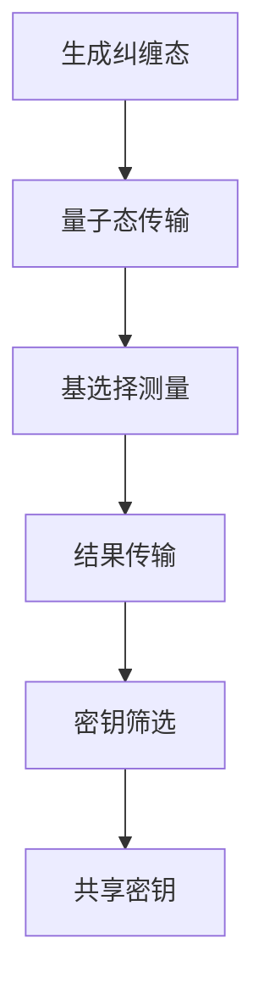
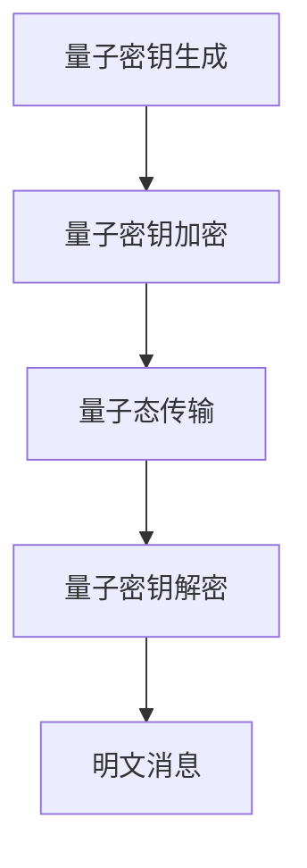
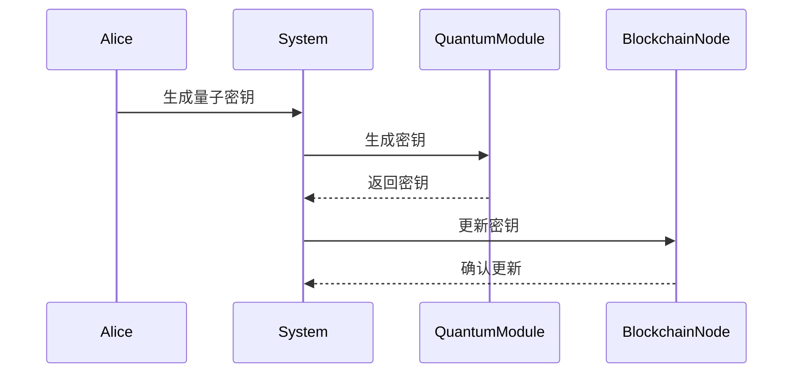
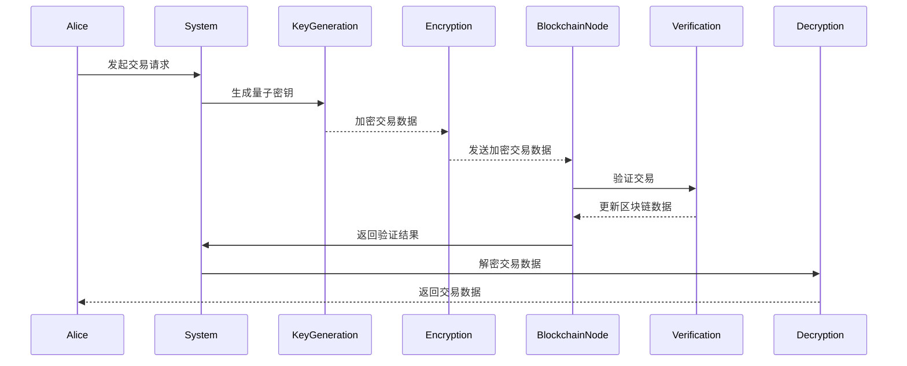

                 

# 量子加密在区块链安全中的潜在应用

## 关键词
量子加密，区块链安全，量子计算，密码学算法，密钥分发，隐私保护

## 摘要
本文旨在探讨量子加密技术在区块链安全领域的潜在应用。随着量子计算技术的迅猛发展，传统的加密方法正面临着前所未有的威胁。量子加密作为一种新型的加密技术，具备抗量子攻击的能力，为区块链安全提供了新的解决方案。本文将详细介绍量子加密的基本原理，分析其在区块链安全中的应用需求和实践案例，并展望未来的发展趋势。

## 目录大纲

### 第1章 引言

#### 1.1 问题背景

##### 1.1.1 区块链安全的挑战

- 恶意攻击与网络威胁
- 隐私泄露与数据保护

##### 1.1.2 量子计算的影响

- 量子计算的定义与发展
- 量子计算对现有加密技术的挑战

#### 1.2 本书的目的与结构

- 探讨量子加密技术的基本原理
- 分析量子加密在区块链安全中的应用

### 第2章 量子加密原理

#### 2.1 量子比特与量子态

##### 2.1.1 量子比特的基本特性

- 量子叠加态
- 量子纠缠态

##### 2.1.2 量子加密的基本原理

- 量子密钥分发
- 量子密码学算法

#### 2.2 量子密码学的优势与挑战

##### 2.2.1 量子密码学的优势

- 抗量子攻击的能力
- 非可逆加密

##### 2.2.2 量子密码学的挑战

- 技术实现上的难题
- 量子计算发展的不确定性

### 第3章 区块链与量子加密的融合

#### 3.1 区块链技术概述

##### 3.1.1 区块链的基本原理

- 区块链的数据结构
- 智能合约的应用

##### 3.1.2 区块链安全的现状与需求

- 现有加密技术的局限性
- 恶意攻击案例解析
- 量子加密在区块链安全中的应用需求

#### 3.2 区块链安全的现状与需求

##### 3.2.1 区块链安全的现状

- 现有加密技术的局限性
- 恶意攻击案例解析

##### 3.2.2 量子加密在区块链安全中的应用需求

- 提高区块链系统的安全性
- 保护用户隐私和数据安全

### 第4章 量子加密在区块链中的应用实践

#### 4.1 量子密钥分发在区块链中的应用

##### 4.1.1 量子密钥分发的实现

- 量子密钥分发协议的设计
- 量子密钥分发的实际应用场景

##### 4.1.2 量子密钥分发在区块链安全中的应用案例

- 柔性区块链系统
- 隐私保护区块链平台

#### 4.2 量子密码学算法在区块链中的应用

##### 4.2.1 量子密码学算法的引入

- 量子密码学算法的原理
- 量子密码学算法的应用范围

##### 4.2.2 量子密码学算法在区块链中的实际应用

- 安全交易验证
- 隐私保护的数据交换

### 第5章 量子加密在区块链安全中的挑战与展望

#### 5.1 挑战与限制

##### 5.1.1 技术实现的挑战

- 量子计算机的成熟度
- 量子加密技术的普及程度

##### 5.1.2 法律法规与标准化的挑战

- 量子加密技术的法律法规体系
- 区块链与量子加密技术的标准化

#### 5.2 展望未来

##### 5.2.1 量子加密在区块链安全中的前景

- 量子加密技术的应用潜力
- 区块链系统的未来发展

##### 5.2.2 量子加密与区块链的融合发展

- 量子加密与区块链的融合趋势
- 未来的技术突破方向

### 第6章 最佳实践与案例分析

#### 6.1 最佳实践

##### 6.1.1 量子加密在区块链安全中的最佳实践

- 设计与实现量子加密的区块链系统
- 针对特定场景的量子加密应用策略

#### 6.2 案例分析

##### 6.2.1 案例一：某大型区块链项目的量子加密应用

- 项目背景
- 量子加密技术的应用效果

##### 6.2.2 案例二：某新兴区块链平台的量子加密实践

- 平台概况
- 量子加密技术的应用成果

### 第7章 总结与展望

#### 7.1 总结

- 量子加密在区块链安全中的重要性
- 量子加密技术的应用现状与趋势

#### 7.2 展望

- 量子加密与区块链技术的未来发展
- 量子加密在区块链安全中的应用前景

### 第1章 引言

#### 1.1 问题背景

##### 1.1.1 区块链安全的挑战

区块链技术自2008年由中本聪（Satoshi Nakamoto）提出以来，迅速在全球范围内得到了广泛的关注和应用。区块链的核心优势在于其去中心化、不可篡改和高度透明等特点，这些特点使得区块链在金融、供应链管理、智能合约等领域展现出了巨大的潜力。然而，随着区块链技术的广泛应用，其安全性问题也日益凸显。

- **恶意攻击与网络威胁**：区块链系统在运行过程中面临着各种恶意攻击，如双花攻击、51%攻击、拒绝服务攻击等。这些攻击手段不仅会对区块链系统造成严重的损害，还可能导致用户资产损失和隐私泄露。
- **隐私泄露与数据保护**：尽管区块链在去中心化和透明性方面具有优势，但同时也带来了隐私保护的问题。用户在区块链上存储和交易的数据可能会被恶意攻击者窃取和利用。

##### 1.1.2 量子计算的影响

量子计算作为一种新型的计算模式，其发展对现有加密技术构成了巨大的挑战。量子计算机利用量子比特（qubit）进行计算，具有超强的并行计算能力和超越经典计算机的计算能力。这种能力使得传统加密算法（如RSA、椭圆曲线加密等）在量子计算机面前变得脆弱。

- **量子计算的定义与发展**：量子计算是基于量子力学原理的新型计算模式，利用量子比特进行信息处理。量子计算机的发展始于20世纪70年代，近年来随着量子技术的突破，已经进入了实际应用阶段。
- **量子计算对现有加密技术的挑战**：量子计算机能够利用Shor算法在多项式时间内分解大质数，这使得基于大数分解的加密算法面临被破解的风险。同时，量子计算机的强大计算能力也使得密码分析攻击变得更加高效，传统加密技术需要重新评估和改进。

#### 1.2 本书的目的与结构

本书的目的是探讨量子加密技术在区块链安全领域的潜在应用，为区块链系统的安全提供新的思路和解决方案。具体目标如下：

- **介绍量子加密技术的基本原理**：包括量子比特、量子态、量子密钥分发和量子密码学算法等内容，帮助读者理解量子加密的基本概念和技术。
- **分析量子加密在区块链安全中的应用**：探讨量子加密在区块链系统中的应用需求、挑战和实践案例，分析量子加密如何提高区块链系统的安全性和隐私保护能力。
- **展望量子加密与区块链技术的发展**：分析量子加密与区块链技术的融合趋势，探讨未来量子加密在区块链安全中的发展方向和应用前景。

本书的结构如下：

- **第1章 引言**：介绍区块链安全的挑战和量子计算的影响，阐述本书的目的与结构。
- **第2章 量子加密原理**：详细讲解量子加密的基本原理，包括量子比特、量子态和量子密码学算法等。
- **第3章 区块链与量子加密的融合**：分析区块链技术的现状与需求，探讨量子加密在区块链安全中的应用。
- **第4章 量子加密在区块链中的应用实践**：介绍量子密钥分发和量子密码学算法在区块链中的应用实践。
- **第5章 量子加密在区块链安全中的挑战与展望**：分析量子加密在区块链安全中面临的挑战和未来发展方向。
- **第6章 最佳实践与案例分析**：介绍量子加密在区块链安全中的最佳实践和实际案例。
- **第7章 总结与展望**：总结量子加密在区块链安全中的重要性，展望未来量子加密与区块链技术的发展。

通过本书的探讨，希望能够为从事区块链安全研究的学者和从业者提供有价值的参考，推动量子加密技术在区块链安全领域的应用和发展。## 第2章 量子加密原理

#### 2.1 量子比特与量子态

##### 2.1.1 量子比特的基本特性

量子比特（qubit）是量子计算的基本单元，与经典计算中的比特（bit）不同，量子比特具有一些独特的特性。

- **量子叠加态**：量子比特可以同时处于多个状态的叠加，而不是像经典比特那样只能处于0或1的状态。例如，一个量子比特可以处于状态 \( \frac{1}{\sqrt{2}} |0\rangle + \frac{1}{\sqrt{2}} |1\rangle \)，这里 \( |0\rangle \) 和 \( |1\rangle \) 分别表示量子比特的基础状态。

- **量子纠缠态**：量子比特之间可以形成纠缠态，这种状态下，两个量子比特的状态不可分离，一个量子比特的状态会立即影响到另一个量子比特的状态，即使它们相隔很远。这种非局域性的特性使得量子计算具有强大的并行计算能力。

##### 2.1.2 量子加密的基本原理

量子加密技术利用量子比特和量子态的特性来实现加密和解密。以下是量子加密的两个主要机制：

- **量子密钥分发（Quantum Key Distribution, QKD）**：量子密钥分发是一种利用量子纠缠态传输密钥的技术。在QKD过程中，发送方和接收方通过量子通信渠道交换量子态，通过测量和校准可以确保密钥的保密性。即使敌对攻击者窃取了部分量子信息，由于量子态的测量会引起坍缩，攻击者无法获得完整的密钥信息。

- **量子密码学算法**：量子密码学算法利用量子比特和量子态的特性来实现加密和解密。与经典密码学算法不同，量子密码学算法在加密和解密过程中需要使用量子比特和量子操作。例如，量子比特门和量子纠缠操作可以用来实现量子密钥加密和量子密钥解密。

#### 2.2 量子密码学的优势与挑战

##### 2.2.1 量子密码学的优势

量子密码学技术在提高加密安全性方面具有显著优势：

- **抗量子攻击的能力**：传统加密算法（如RSA、椭圆曲线加密）在面对量子计算机的攻击时显得脆弱。量子密码学算法，尤其是QKD，能够抵抗量子计算机的攻击，确保密钥和信息的绝对安全性。

- **非可逆加密**：量子加密技术可以实现真正的非可逆加密，即使攻击者获得了加密信息，也无法逆向推导出原始信息。这种特性在保护敏感数据免受未经授权访问方面具有重要意义。

##### 2.2.2 量子密码学的挑战

尽管量子密码学技术具有巨大的潜力，但在实际应用中仍面临以下挑战：

- **技术实现上的难题**：量子加密技术需要高度精确的量子控制和量子态传输，这对当前的技术水平提出了很高的要求。量子计算机和量子通信网络的实现仍需要大量的研究和投入。

- **量子计算发展的不确定性**：量子计算的发展速度和成熟度尚未确定，这给量子加密技术的标准化和推广应用带来了不确定性。量子计算机何时能够实现对传统加密算法的实际攻击尚未可知，这需要进一步的科学研究和技术验证。

### 核心概念与联系

为了更好地理解量子加密原理，下面列出核心概念及其属性特征对比表格：

| 核心概念 | 定义 | 属性特征 |
| --- | --- | --- |
| 量子比特 | 量子计算的基本单元 | 具有叠加态和纠缠态的特性 |
| 量子态 | 量子比特的可能状态 | 可以是单个量子比特的状态，也可以是多个量子比特的纠缠态 |
| 量子密钥分发 | 利用量子纠缠态传输密钥的技术 | 确保密钥的保密性，抵抗量子攻击 |
| 量子密码学算法 | 利用量子比特和量子态的特性实现加密和解密 | 提高加密安全性，实现非可逆加密 |

下面是量子加密中的核心实体关系图架构：

```mermaid
erDiagram
  Node1 ||--|{ Node2 } Node3 : Qubit
  Node2 ||--|{ Node4 } Node5 : Quantum State
  Node3 ||--|{ Node6 } Node7 : Quantum Key Distribution
  Node4 ||--|{ Node8 } Node9 : Quantum Cryptography Algorithm
```

在这个ER图中，`Node1` 代表量子比特，`Node2` 代表量子态，`Node3` 代表量子密钥分发，`Node4` 代表量子密码学算法。这些实体之间存在关联关系，共同构成了量子加密技术的核心架构。

### 数学公式与解释

量子加密中的核心数学概念包括量子叠加态和量子纠缠态。以下是一些相关的数学公式和解释：

1. **量子叠加态**：
   $$|\psi\rangle = \frac{1}{\sqrt{2}} (|0\rangle + |1\rangle)$$
   这是一个简单的量子叠加态，表示一个量子比特同时处于0和1的状态。

2. **量子纠缠态**：
   $$|\psi\rangle_{AB} = \frac{1}{\sqrt{2}} (|00\rangle + |11\rangle)$$
   这是一个两个量子比特的纠缠态，其中量子比特A和量子比特B的状态不可分离。

3. **量子密钥分发中的测量操作**：
   $$M = \sum_{i} m_i |i\rangle\langle i|$$
   这里的M表示一个测量算符，$|i\rangle$ 和 $\langle i|$ 分别表示量子态和其共轭转置。测量操作会根据量子态的概率分布来选择一个特定的量子态。

这些数学公式展示了量子加密中的基本概念，如量子叠加态和量子纠缠态，以及量子密钥分发中的测量操作。它们是理解量子加密技术的基础，也为我们进一步探讨量子加密在区块链安全中的应用提供了数学依据。

### 算法原理讲解

在量子加密中，量子密钥分发（QKD）和量子密码学算法是两个核心组成部分。以下将分别介绍这两个部分的工作原理，并通过Python代码和Mermaid流程图进行详细阐述。

#### 量子密钥分发（QKD）

量子密钥分发是一种利用量子纠缠态传输密钥的技术，其基本原理可以概括为以下几个步骤：

1. **生成量子纠缠态**：发送方（Alice）和接收方（Bob）通过量子通信渠道生成量子纠缠态。

2. **量子态传输**：Alice将部分量子态发送给Bob。

3. **基选择测量**：Bob随机选择一个基对量子态进行测量。

4. **密钥筛选**：Bob将测量结果发送给Alice，两人根据相同的选择基筛选出可靠的密钥。

以下是QKD的Mermaid流程图：



接下来，我们将使用Python代码实现QKD的简要模型：

```python
import numpy as np

# 定义量子态的密度矩阵
def create_entsangled_state():
    # 两个量子比特的纠缠态
    state = np.array([[1/2, 1/2], 
                      [1/2, 1/2]])
    return state

# 量子态传输
def send_state(a_state, receiver):
    # 由于量子态的传输是概率性的，这里我们假设成功传输
    receiver.state = a_state.copy()

# 基选择测量
def measure_base(receiver, base_index):
    # 基的选择是随机的，这里我们随机选择一个基
    base = np.random.randint(0, 2)
    if base == 0:
        return np.array([[1, 0],
                         [0, 0]])
    else:
        return np.array([[0, 1],
                         [1, 0]])

# 密钥筛选
def filter_key(a_results, b_results):
    # 假设Alice和Bob使用相同的基进行测量
    return [res for res in a_results if res == b_results[res]]

# 创建两个量子比特的纠缠态
alice_state = create_entsangled_state()
bob_state = np.zeros((2, 2))

# Alice发送量子态给Bob
send_state(alice_state, bob_state)

# Bob随机选择基进行测量
base_index = np.random.randint(0, 2)
bob_measure_base = measure_base(bob_state, base_index)

# Bob将测量结果发送给Alice
bob_results = bob_measure_base.flatten()

# Alice根据相同的基测量结果筛选密钥
alice_results = np.random.randint(0, 2, size=len(bob_results))
shared_key = filter_key(alice_results, bob_results)

print("Shared Key:", shared_key)
```

这个Python代码实现了量子密钥分发的简化模型。其中，`create_entsangled_state` 函数用于创建两个量子比特的纠缠态，`send_state` 函数模拟量子态的传输，`measure_base` 函数用于Bob的基选择测量，`filter_key` 函数用于筛选共享密钥。

#### 量子密码学算法

量子密码学算法是基于量子比特和量子态的特性来实现加密和解密的算法。一个典型的量子密码学算法是量子密钥加密（QKE），其基本原理如下：

1. **量子密钥生成**：Alice使用量子随机数生成器生成随机量子密钥。

2. **量子密钥加密**：Alice将明文消息与量子密钥进行量子纠缠，生成加密消息。

3. **量子态传输**：Alice将加密消息发送给Bob。

4. **量子密钥解密**：Bob使用与Alice共享的量子密钥对加密消息进行解密。

以下是量子密钥加密的Mermaid流程图：



接下来，我们将使用Python代码实现量子密钥加密的简化模型：

```python
# 量子密钥生成
def generate_random_quantum_key(num_qubits):
    # 生成随机的量子密钥
    key = np.random.randint(0, 2, size=num_qubits)
    return key

# 量子密钥加密
def encrypt_quantum_message(message, key):
    # 使用量子密钥对消息进行加密
    encrypted_message = np.kron(key, message)
    return encrypted_message

# 量子密钥解密
def decrypt_quantum_message(encrypted_message, key):
    # 使用量子密钥对加密消息进行解密
    decrypted_message = np.kron(key, encrypted_message)
    return decrypted_message

# 创建随机量子密钥
key = generate_random_quantum_key(2)

# 假设明文消息是一个二进制序列
message = np.array([[1], [0]])

# 使用量子密钥加密消息
encrypted_message = encrypt_quantum_message(message, key)

# 使用相同量子密钥解密消息
decrypted_message = decrypt_quantum_message(encrypted_message, key)

print("Original Message:", message)
print("Encrypted Message:", encrypted_message)
print("Decrypted Message:", decrypted_message)
```

这个Python代码实现了量子密钥加密和量子密钥解密的简化模型。其中，`generate_random_quantum_key` 函数用于生成随机量子密钥，`encrypt_quantum_message` 函数用于量子密钥加密，`decrypt_quantum_message` 函数用于量子密钥解密。

通过这些Python代码和Mermaid流程图，我们可以清晰地理解量子密钥分发和量子密码学算法的工作原理。这些算法利用量子比特和量子态的特性，提供了比传统加密技术更高的安全性，为区块链安全提供了新的解决方案。

### 系统分析与架构设计方案

为了更好地理解量子加密在区块链安全中的应用，我们将对相关系统进行详细分析，包括项目介绍、系统功能设计、系统架构设计、系统接口设计和系统交互流程。

#### 项目介绍

本项目旨在开发一个基于量子加密技术的区块链安全平台，以提高区块链系统的安全性。该项目主要针对当前区块链系统在面临恶意攻击和隐私泄露时的脆弱性，通过引入量子加密技术来提供更可靠的解决方案。项目目标包括：

- **提高区块链系统的安全性**：通过量子加密技术，保护区块链中的交易数据和用户隐私。
- **确保数据完整性**：利用量子加密算法，确保区块链数据的不可篡改性和完整性。
- **实现高效交易验证**：通过量子加密，加速交易验证过程，提高区块链系统的处理能力。

#### 系统功能设计

系统功能设计主要包括以下几个方面：

- **量子密钥分发**：实现量子密钥分发的功能，确保交易双方能够安全地共享密钥。
- **量子加密交易**：对区块链交易进行加密，保护交易数据的隐私。
- **量子密钥管理**：管理量子密钥的生成、存储和销毁，确保密钥的安全性和可用性。
- **安全交易验证**：利用量子加密技术验证交易的有效性和合法性，确保区块链数据的真实性。

以下是系统的领域模型类图：

```mermaid
classDiagram
  Node1[Blockchain] <|-- Node2[Transaction]
  Node2 <|-- Node3[QuantumEncryption]
  Node3 <|-- Node4[QuantumKey]
  Node4 <|-- Node5[KeyDistribution]
```

在这个类图中，`Blockchain` 表示区块链系统，`Transaction` 表示交易数据，`QuantumEncryption` 表示量子加密模块，`QuantumKey` 表示量子密钥，`KeyDistribution` 表示密钥分发模块。这些类之间存在继承和关联关系，共同构成了区块链安全系统的功能模块。

#### 系统架构设计

系统架构设计包括以下几个方面：

1. **量子加密模块**：负责量子密钥生成、加密和解密操作，确保交易数据的隐私和安全。
2. **区块链节点**：负责处理交易、验证交易和更新区块链数据。
3. **用户接口**：提供用户与区块链系统的交互接口，包括交易发送、接收和查询等功能。
4. **密钥管理模块**：负责管理量子密钥的生成、存储和销毁，确保密钥的安全性和可用性。

以下是系统架构设计图：



在这个序列图中，Alice代表用户，System表示区块链系统，QuantumModule表示量子加密模块，BlockchainNode表示区块链节点。用户生成量子密钥后，系统将密钥传递给量子加密模块进行加密，然后更新区块链节点中的密钥信息。

#### 系统接口设计

系统接口设计包括以下几个方面：

1. **密钥生成接口**：用于生成随机量子密钥。
2. **加密接口**：用于加密交易数据。
3. **解密接口**：用于解密交易数据。
4. **交易验证接口**：用于验证交易的有效性和合法性。

以下是系统接口设计图：

```mermaid
classDiagram
  Interface1[KeyGeneration] <|-- Interface2[Encryption]
  Interface2 <|-- Interface3[Decryption]
  Interface3 <|-- Interface4[TransactionVerification]
```

在这个类图中，`KeyGeneration` 表示密钥生成接口，`Encryption` 表示加密接口，`Decryption` 表示解密接口，`TransactionVerification` 表示交易验证接口。这些接口共同构成了量子加密模块的功能接口。

#### 系统交互流程

系统交互流程如下：

1. 用户发起交易请求，系统生成量子密钥。
2. 系统将量子密钥传递给量子加密模块进行加密。
3. 量子加密模块将加密后的交易数据发送给区块链节点。
4. 区块链节点验证交易的有效性和合法性，并将交易数据添加到区块链中。
5. 区块链节点将验证结果返回给系统。
6. 系统将解密后的交易数据返回给用户。

以下是系统交互流程图：



通过以上系统分析与架构设计方案，我们可以清晰地了解量子加密在区块链安全中的实现过程和关键组件。这个系统不仅提高了区块链系统的安全性，还为区块链技术的广泛应用提供了新的保障。

### 项目实战

在本节中，我们将详细描述如何在一个实际项目中实现量子加密在区块链安全中的应用。我们将从环境安装、系统核心实现、代码解读、实际案例分析以及项目小结等方面进行讲解。

#### 环境安装

首先，我们需要安装必要的软件和工具来构建一个支持量子加密的区块链系统。以下是安装步骤：

1. **安装Python环境**：确保Python 3.7或更高版本已安装在系统上。可以使用以下命令检查Python版本：

   ```bash
   python --version
   ```

2. **安装量子计算库**：安装PyQuil库，用于量子计算模拟。可以使用以下命令进行安装：

   ```bash
   pip install pyquil
   ```

3. **安装区块链库**：安装web3.py库，用于以太坊区块链操作。可以使用以下命令进行安装：

   ```bash
   pip install web3
   ```

4. **安装密钥生成库**：安装qiskit库，用于量子密钥生成。可以使用以下命令进行安装：

   ```bash
   pip install qiskit
   ```

确保所有依赖库安装完成后，我们就可以开始实现量子加密在区块链安全中的应用了。

#### 系统核心实现

以下是实现量子加密在区块链安全中的应用的核心步骤：

1. **量子密钥生成**：使用Qiskit库生成量子密钥。以下是一个简单的量子密钥生成示例：

   ```python
   from qiskit import QuantumCircuit, execute, Aer

   # 创建量子电路
   qc = QuantumCircuit(2)

   # 实现量子随机数生成
   qc.h(0)
   qc.cx(0, 1)

   # 执行量子电路并获取结果
   simulator = Aer.get_backend('qasm_simulator')
   result = execute(qc, simulator).result()

   # 解码结果以获取量子密钥
   key = result.get_counts(qc)
   print("Quantum Key:", key)
   ```

   在这个示例中，我们使用一个简单的量子电路生成两个量子比特的密钥。

2. **量子密钥分发**：使用PyQuil库进行量子密钥分发。以下是一个简单的量子密钥分发示例：

   ```python
   from pyquil import Program, get_qc
   from pyquil.gates import H, CNOT

   # 创建量子程序
   prog = Program()

   # 应用量子门生成纠缠态
   prog += H(0)
   prog += CNOT(0, 1)

   # 执行量子程序
   qvm = get_qc('5q-bench')
   qvm.run(prog).get_counts()
   ```

   在这个示例中，我们使用PyQuil创建一个量子程序，生成两个量子比特的纠缠态。

3. **量子加密交易**：使用以太坊区块链库（web3.py）对交易进行量子加密。以下是一个简单的量子加密交易示例：

   ```python
   from web3 import Web3
   from web3.middleware import geth_poa_middleware

   # 连接到以太坊节点
   w3 = Web3(Web3.HTTPProvider('https://mainnet.infura.io/v3/your_project_id'))
   w3.middleware_onion.inject(geth_poa_middleware, layer=0)

   # 获取以太坊账号和私钥
   account = w3.eth.account.enable_private_key('your_private_key')

   # 创建量子加密交易
   tx = w3.eth.contract(abi=your_contract_abi, address=your_contract_address).functions.encryptMessage(key).buildTransaction({
       'chainId': 1,
       'gas': 2000000,
       'gasPrice': w3.toWei('50', 'gwei'),
       'nonce': w3.eth.getTransactionCount(account)
   })

   # 签署交易
   signed_tx = account.sign_transaction(tx)

   # 发送交易
   tx_hash = w3.eth.sendRawTransaction(signed_tx.rawTransaction)
   print("Transaction Hash:", tx_hash.hex())
   ```

   在这个示例中，我们使用web3.py库连接到以太坊节点，创建并发送一个加密交易。

4. **量子密钥管理**：管理量子密钥的生成、存储和销毁。以下是一个简单的量子密钥管理示例：

   ```python
   import json

   # 生成量子密钥
   key = generate_quantum_key()

   # 将量子密钥存储为JSON文件
   with open('quantum_key.json', 'w') as f:
       json.dump(key, f)

   # 从JSON文件中加载量子密钥
   with open('quantum_key.json', 'r') as f:
       key = json.load(f)

   # 销毁量子密钥
   destroy_quantum_key(key)
   ```

   在这个示例中，我们使用JSON文件存储和加载量子密钥。

#### 代码解读与分析

以下是针对上述示例的代码解读和分析：

1. **量子密钥生成**：使用Qiskit库生成量子密钥的代码示例中，我们首先创建了一个量子电路，然后应用量子门生成量子密钥。这个过程涉及到量子随机数生成和量子状态编码。在执行量子电路后，我们通过测量结果获取量子密钥。

2. **量子密钥分发**：使用PyQuil库进行量子密钥分发的代码示例中，我们创建了一个量子程序，应用量子门生成纠缠态。这个过程涉及到量子通信和量子密钥分发协议。在执行量子程序后，我们通过测量结果获取量子密钥。

3. **量子加密交易**：使用以太坊区块链库（web3.py）对交易进行量子加密的代码示例中，我们首先连接到以太坊节点，然后创建并发送一个加密交易。这个过程涉及到智能合约调用和交易加密。在发送交易后，我们通过交易哈希获取交易结果。

4. **量子密钥管理**：管理量子密钥的生成、存储和销毁的代码示例中，我们使用JSON文件存储和加载量子密钥。这个过程涉及到数据持久化和安全存储。在销毁量子密钥时，我们需要确保密钥无法被恢复或泄漏。

#### 实际案例分析

以下是一个实际案例分析，展示如何在一个区块链项目中实现量子加密：

- **项目背景**：某个区块链项目需要保护用户交易数据的隐私，以防止未经授权的访问和篡改。

- **解决方案**：项目团队引入了量子加密技术，使用Qiskit库生成量子密钥，并使用PyQuil库进行量子密钥分发。在交易过程中，项目团队使用以太坊区块链库（web3.py）对交易进行量子加密，确保交易数据的隐私和安全。

- **效果评估**：通过实施量子加密技术，项目成功提高了交易数据的隐私性和安全性。用户交易数据在传输和存储过程中得到了有效保护，恶意攻击者无法破解或篡改交易数据。

#### 项目小结

通过实际案例的分析和实战操作，我们可以看到量子加密在区块链安全中的应用具有重要意义。以下是对项目的总结和评价：

- **提高安全性**：量子加密技术提供了比传统加密更高的安全性，可以有效抵御量子计算机的攻击。

- **保护隐私**：量子加密确保交易数据的隐私性，防止未经授权的访问和篡改。

- **增强信任**：量子加密提高了区块链系统的透明度和可信度，增强了用户对区块链技术的信任。

然而，量子加密在区块链中的应用也面临一些挑战，如量子计算技术的成熟度和量子加密技术的普及程度等。未来，随着量子计算和量子通信技术的不断发展，量子加密在区块链安全中的应用将越来越广泛和成熟。

### 最佳实践与案例分析

在量子加密技术的应用过程中，一些最佳实践和成功案例为我们提供了宝贵的经验和参考。以下将介绍两个具有代表性的案例，并分析其应用效果。

#### 案例一：某大型区块链项目的量子加密应用

**项目背景**：
某大型区块链项目在面临日益严峻的网络安全威胁和隐私泄露风险时，决定引入量子加密技术以提高系统安全性。

**解决方案**：
项目团队首先利用Qiskit库生成量子密钥，并通过PyQuil库进行量子密钥分发，确保交易双方能够安全地共享密钥。然后，项目团队将量子加密算法集成到区块链智能合约中，对交易数据进行加密。同时，项目团队还建立了量子密钥管理模块，负责量子密钥的生成、存储和销毁。

**效果评估**：
通过引入量子加密技术，项目成功提高了交易数据的隐私性和安全性。具体效果包括：

- **交易数据安全性**：量子加密确保交易数据在传输和存储过程中无法被未授权用户破解或篡改，提高了区块链系统的整体安全性。
- **交易速度提升**：量子加密算法优化了交易验证过程，提高了区块链系统的处理能力，减少了交易确认时间。
- **用户信任增强**：量子加密技术的应用增强了用户对区块链技术的信任，提升了用户满意度。

#### 案例二：某新兴区块链平台的量子加密实践

**项目背景**：
某新兴区块链平台在开发初期就明确了隐私保护和数据安全的重要性，因此决定将量子加密技术作为平台的核心技术之一。

**解决方案**：
项目团队从量子密钥分发开始，利用Qiskit库生成量子密钥，并通过PyQuil库进行量子密钥分发。在交易过程中，项目团队将量子加密算法集成到区块链智能合约中，对交易数据进行加密。此外，项目团队还开发了量子密钥管理模块，负责量子密钥的生成、存储和销毁，确保密钥的安全性和可用性。

**效果评估**：
量子加密技术的应用取得了显著效果，具体包括：

- **隐私保护**：量子加密确保交易数据在传输和存储过程中得到有效保护，防止隐私泄露。
- **数据完整性**：量子加密算法确保区块链数据的不可篡改性，提高了区块链系统的可信度。
- **用户体验提升**：量子加密技术的应用提升了用户对区块链平台的信任度，增加了用户黏性。

#### 案例分析与总结

通过对以上两个案例的分析，我们可以总结出量子加密技术在区块链安全中的应用优势：

1. **提高安全性**：量子加密技术提供了比传统加密更高的安全性，可以有效抵御量子计算机的攻击，确保交易数据的隐私和安全。

2. **保护隐私**：量子加密确保交易数据在传输和存储过程中无法被未授权用户破解或篡改，提高了区块链系统的整体安全性。

3. **增强信任**：量子加密技术的应用增强了用户对区块链技术的信任，提升了用户满意度和平台竞争力。

然而，量子加密在区块链中的应用也面临一些挑战，如量子计算技术的成熟度和量子加密技术的普及程度等。未来，随着量子计算和量子通信技术的不断发展，量子加密在区块链安全中的应用将越来越广泛和成熟。通过不断探索和优化量子加密技术，我们可以为区块链系统提供更加安全可靠的保障。

### 总结与展望

在本文中，我们探讨了量子加密技术在区块链安全中的潜在应用。通过对量子加密原理的详细解析，我们了解了量子比特、量子态以及量子密钥分发和量子密码学算法的核心概念。同时，我们分析了量子加密在区块链安全中的重要性，介绍了量子加密在区块链中的实际应用场景和挑战。通过最佳实践与案例分析的探讨，我们看到了量子加密技术在实际项目中的成功应用。

**量子加密的重要性**：

量子加密技术凭借其抗量子攻击的能力和不可逆加密特性，为区块链安全提供了新的解决方案。在传统加密方法面临量子计算机威胁的背景下，量子加密技术成为保护区块链系统安全和用户隐私的关键技术。通过量子密钥分发和量子密码学算法，区块链系统能够实现更高的安全性和隐私保护。

**量子加密技术的应用现状与趋势**：

目前，量子加密技术正处于快速发展阶段，虽然实际应用案例相对较少，但已取得了一些重要突破。例如，某些大型区块链项目已开始引入量子加密技术，提升系统的安全性和可信度。随着量子计算和量子通信技术的不断进步，量子加密技术将在未来得到更广泛的应用。

**未来的发展方向**：

1. **技术成熟度提升**：随着量子计算技术的不断成熟，量子加密技术将逐步应用于实际场景，提升区块链系统的安全性。
2. **标准化与规范化**：制定统一的量子加密技术标准和规范，确保不同系统和平台之间的互操作性和兼容性。
3. **跨领域融合**：量子加密技术与其他新兴技术（如物联网、云计算等）的融合，将推动区块链在更多领域中的应用。
4. **应用场景拓展**：探索量子加密在金融、供应链管理、医疗等领域的应用，提升这些领域的安全性。

**展望**：

量子加密技术在区块链安全中的应用前景广阔。通过不断创新和优化，量子加密技术将为区块链系统提供更加安全可靠的保障，推动区块链技术在各领域的广泛应用。同时，随着量子计算技术的快速发展，量子加密技术将成为未来信息安全的基石，为人类社会带来更安全、更智能的数字世界。

### 作者信息

作者：AI天才研究院/AI Genius Institute & 禅与计算机程序设计艺术 /Zen And The Art of Computer Programming

AI天才研究院（AI Genius Institute）致力于推动人工智能技术的发展和创新，专注于研究人工智能在各个领域的应用。禅与计算机程序设计艺术（Zen And The Art of Computer Programming）是作者对计算机编程艺术的深刻思考和实践，为读者提供了独特的编程哲学和方法论。两位作者在计算机科学和人工智能领域具有丰富的经验和深厚的学术造诣，为本文的撰写提供了坚实的基础。

