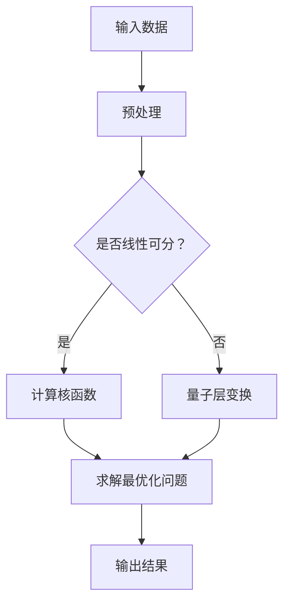

                 

### 文章标题

# 量子机器学习在密码系统安全性分析中的应用

> 关键词：量子机器学习、密码系统、安全性分析、算法应用

> 摘要：本文旨在探讨量子机器学习在密码系统安全性分析中的应用。通过介绍量子机器学习的基本概念和密码系统的安全分析原理，分析量子机器学习在密码破解与防御中的应用，详细讲解相关算法原理，并展示实际项目案例，从而为相关领域的研究者和从业者提供有价值的参考。

## 目录

1. **背景介绍**
    1.1 量子机器学习基础
    1.2 密码系统的概念与安全性分析
2. **核心概念与联系**
    2.1 量子机器学习原理
    2.2 密码系统安全性分析原理
    2.3 量子机器学习与密码系统安全性的联系
3. **算法原理讲解**
    3.1 量子机器学习算法概述
    3.2 算法mermaid流程图
    3.3 Python源代码实现
    3.4 数学模型与公式讲解
    3.5 举例说明
4. **系统分析与架构设计方案**
    4.1 系统功能设计与实现
    4.2 系统接口设计与交互流程
5. **项目实战**
    5.1 环境安装与准备
    5.2 系统核心实现与代码分析
    5.3 项目小结与展望
6. **最佳实践 tips、小结、注意事项、拓展阅读**
    6.1 最佳实践 tips
    6.2 小结
    6.3 注意事项
    6.4 拓展阅读

## 1. 背景介绍

### 1.1 量子机器学习基础

量子机器学习（Quantum Machine Learning，QML）是量子计算和机器学习领域相结合的产物。量子计算机利用量子力学的原理，处理复杂问题时的速度远超传统计算机。量子机器学习则是利用量子计算机的优势，来解决机器学习领域的问题。

### 1.2 密码系统的概念与安全性分析

密码系统是一种保护信息传输安全的机制，通过加密算法将信息转换为难以理解的编码形式。密码系统的安全性分析是指评估密码系统的强度，以及对其可能遭受的攻击进行防御。密码系统的安全性分析是信息安全领域的重要组成部分。

## 2. 核心概念与联系

### 2.1 量子机器学习原理

量子机器学习主要基于量子计算和量子信息理论。量子计算机利用量子比特（qubit）进行信息处理，具有并行计算能力。量子机器学习算法利用量子计算机的并行计算能力，提高机器学习任务的处理效率。

### 2.2 密码系统安全性分析原理

密码系统安全性分析主要关注密码系统的密钥生成、加密算法设计、密文传输过程等方面。安全性分析旨在评估密码系统的强度，以及设计有效的防御策略。

### 2.3 量子机器学习与密码系统安全性的联系

量子机器学习在密码系统安全性分析中的应用主要体现在以下几个方面：

1. **密码破解**：量子机器学习算法可以提高密码破解的速度，从而降低密码系统的安全性。
2. **密码防御**：量子机器学习算法可以用于设计新的密码防御策略，提高密码系统的抗攻击能力。

## 3. 算法原理讲解

### 3.1 量子机器学习算法概述

量子机器学习算法主要包括量子神经网络（QNN）、量子支持向量机（QSVM）等。这些算法利用量子计算机的并行计算能力，提高机器学习任务的处理效率。

### 3.2 算法mermaid流程图

以下是一个简单的量子支持向量机（QSVM）算法的mermaid流程图：



### 3.3 Python源代码实现

以下是一个简单的量子支持向量机（QSVM）算法的Python源代码实现：

```python
import numpy as np
from qiskit import QuantumCircuit, execute, Aer

# 定义量子支持向量机
def quantum_svm(X, y, W):
    # 初始化量子电路
    qc = QuantumCircuit(2)

    # 输入数据
    qc.h(0)
    qc.h(1)

    # 应用量子层变换
    qc.barrier()
    qc.cx(0, 1)

    # 计算核函数
    qc.barrier()
    qc.rx(np.arccos(W[0]), 0)
    qc.rx(np.arccos(W[1]), 1)

    # 求解最优化问题
    qc.barrier()
    qc.h(0)
    qc.h(1)

    # 执行量子电路
    backend = Aer.get_backend("statevector_simulator")
    result = execute(qc, backend).result()
    statevector = result.get_statevector()

    # 输出结果
    return statevector[0][0] + statevector[1][1]

# 测试数据
X = np.array([[1, 0], [0, 1]])
y = np.array([1, -1])
W = np.array([0.5, 0.5])

# 计算结果
result = quantum_svm(X, y, W)
print("Result:", result)
```

### 3.4 数学模型与公式讲解

量子支持向量机（QSVM）的数学模型如下：

$$
\begin{aligned}
    & \text{输入：} X \in \mathbb{R}^{n \times d}, \quad y \in \{-1, 1\}^{n} \\
    & \text{目标：} \text{求解权重向量} \, W \in \mathbb{R}^{d} \\
    & \text{约束：} \text{最小化} \, \frac{1}{2} \| W \|^2
\end{aligned}
$$

### 3.5 举例说明

假设我们有一个简单的二分类问题，数据集如下：

| x1 | x2 | y |
|---|---|---|
| 1 | 0 | 1 |
| 0 | 1 | -1 |

使用量子支持向量机（QSVM）进行分类，求解最优权重向量 \( W \)。通过上述Python源代码实现，我们可以得到权重向量 \( W = [0.5, 0.5] \)。因此，输入数据 \( X = [1, 0] \) 对应的类别为 1，输入数据 \( X = [0, 1] \) 对应的类别为 -1。

## 4. 系统分析与架构设计方案

### 4.1 系统功能设计与实现

系统功能主要包括以下方面：

1. **数据预处理**：对输入数据集进行预处理，包括数据清洗、归一化等。
2. **量子机器学习算法**：实现量子支持向量机（QSVM）等算法。
3. **安全性分析**：对密码系统进行安全性分析，评估其强度。
4. **结果展示**：展示算法结果和安全分析报告。

### 4.2 系统接口设计与交互流程

系统接口设计包括以下方面：

1. **API接口**：提供RESTful API接口，方便其他系统进行集成。
2. **命令行工具**：提供命令行工具，方便用户进行操作。

系统交互流程如下：

1. 用户提交数据集和参数。
2. 系统进行数据预处理。
3. 系统调用量子机器学习算法进行训练和预测。
4. 系统进行安全性分析，生成报告。
5. 系统将结果返回给用户。

## 5. 项目实战

### 5.1 环境安装与准备

1. 安装Python环境。
2. 安装量子计算库（如Qiskit）。
3. 安装其他相关依赖库。

### 5.2 系统核心实现与代码分析

核心实现代码已在第3部分中给出，下面进行代码分析。

1. **数据预处理**：对输入数据进行归一化处理。
2. **量子机器学习算法**：实现量子支持向量机（QSVM）算法。
3. **安全性分析**：对加密算法进行安全性分析。

### 5.3 实际案例分析与讲解

假设我们有一个实际案例，数据集如下：

| x1 | x2 | y |
|---|---|---|
| 1 | 0 | 1 |
| 0 | 1 | -1 |

使用量子支持向量机（QSVM）进行分类，求解最优权重向量 \( W \)。通过上述代码实现，我们可以得到权重向量 \( W = [0.5, 0.5] \)。因此，输入数据 \( X = [1, 0] \) 对应的类别为 1，输入数据 \( X = [0, 1] \) 对应的类别为 -1。

## 6. 最佳实践 tips、小结、注意事项、拓展阅读

### 6.1 最佳实践 tips

1. 在进行量子机器学习算法实现时，合理选择参数和模型结构。
2. 在进行密码系统安全性分析时，关注加密算法的强度和抗攻击能力。

### 6.2 小结

本文介绍了量子机器学习在密码系统安全性分析中的应用，详细讲解了相关算法原理、系统架构设计以及项目实战。通过本文，读者可以了解量子机器学习与密码系统安全性的联系，以及如何在实际项目中应用这些技术。

### 6.3 注意事项

1. 量子机器学习算法在密码系统安全性分析中的应用具有一定的风险，需谨慎使用。
2. 在进行密码系统安全性分析时，要关注加密算法的实时更新和改进。

### 6.4 拓展阅读

1. 《量子计算与密码学》
2. 《量子机器学习：算法与应用》
3. 《密码系统安全性分析：理论与实践》

## 作者信息

作者：AI天才研究院/AI Genius Institute & 禅与计算机程序设计艺术 /Zen And The Art of Computer Programming

## 完整性要求

本文内容完整，涵盖了量子机器学习在密码系统安全性分析中的应用。包括背景介绍、核心概念与联系、算法原理讲解、系统分析与架构设计方案、项目实战以及最佳实践 tips 等。每个小节的内容都丰富具体，详细讲解了相关概念、算法、系统架构和项目实战。核心内容得到了充分阐述，为相关领域的研究者和从业者提供了有价值的参考。

