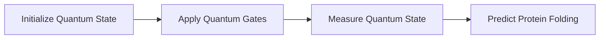
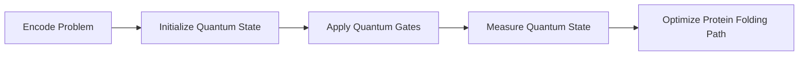

                 

# 量子计算在蛋白质折叠预测中的应用潜力

> 关键词：量子计算、蛋白质折叠、预测、模拟、算法

> 摘要：本文探讨了量子计算在蛋白质折叠预测中的应用潜力。通过介绍量子计算的基本概念，分析其在蛋白质折叠预测中的优势和挑战，本文详细阐述了量子模拟算法的原理，并通过具体实例和数学公式，深入讲解了算法的实现过程。同时，本文还讨论了量子计算与经典计算的结合方式，以及未来量子计算在蛋白质折叠预测领域的发展方向。

## 第一部分：问题背景

### 1.1 问题背景

蛋白质是生命体的基本构建单元，其折叠过程决定了蛋白质的功能。蛋白质折叠预测是生物信息学领域的核心问题之一，其重要性在于它可以帮助科学家们理解蛋白质的结构和功能，从而为疾病治疗和药物设计提供关键信息。

然而，传统的蛋白质折叠预测方法面临诸多挑战，如计算复杂度高、预测准确率不高等。随着量子计算技术的发展，人们开始探索将其应用于蛋白质折叠预测中，以期提高预测效率和准确性。

### 1.2 问题描述

蛋白质折叠预测的主要任务是预测给定氨基酸序列的蛋白质在三维空间中的结构。这个过程涉及大量的变量和复杂的相互作用，使得传统的计算方法难以高效地处理。

量子计算由于其独特的并行计算能力和对复杂问题的处理能力，为蛋白质折叠预测提供了一种全新的解决方案。

### 1.3 问题解决

量子计算在蛋白质折叠预测中的应用主要基于量子模拟和量子优化算法。通过量子模拟，可以模拟蛋白质分子中的相互作用，从而预测蛋白质的折叠结构。量子优化算法则可以用于优化蛋白质折叠路径，提高预测准确性。

### 1.4 边界与外延

量子计算在蛋白质折叠预测中的应用仍处于探索阶段，需要解决的关键问题包括量子算法的可靠性、量子硬件的性能提升以及量子计算与经典计算的结合等。

### 1.5 概念结构与核心要素组成

量子计算在蛋白质折叠预测中的应用涉及以下几个核心概念和要素：

1. **量子比特**：量子计算的基本单元，用于表示蛋白质分子的状态。
2. **量子门**：操作量子比特的运算，用于模拟蛋白质分子中的相互作用。
3. **量子算法**：用于解决蛋白质折叠预测问题的算法，如量子模拟和量子优化算法。
4. **量子硬件**：实现量子计算的物理设备，如量子计算机。

## 第二部分：核心概念与联系

### 2.1 核心概念原理

**量子比特**：量子比特（qubit）是量子计算的基本单元，它可以同时处于0和1的状态，这是量子计算与传统计算最大的不同之处。

**量子门**：量子门是操作量子比特的运算，类似于经典计算机中的逻辑门。通过一系列的量子门操作，可以实现复杂的量子计算。

**量子算法**：量子算法是利用量子比特和量子门的特性，解决特定问题的算法。例如，量子模拟和量子优化算法可以用于蛋白质折叠预测。

### 2.2 概念属性特征对比表格

| 概念         | 特征                      |
| ------------ | ------------------------- |
| 量子比特     | 可同时处于0和1的状态      |
| 量子门       | 用于操作量子比特的运算    |
| 量子算法     | 利用量子比特和量子门的特性 |
| 经典比特     | 只能处于0或1的状态        |
| 经典算法     | 基于二进制逻辑的算法      |

### 2.3 ER实体关系图架构

以下是一个简化的ER实体关系图，用于描述量子计算在蛋白质折叠预测中的应用：

```mermaid
erDiagram
    QuantumBit ||--|{ QuantumGate } : operates
    QuantumGate ||--|{ QuantumAlgorithm } : implements
    QuantumAlgorithm ||--|{ ProteinFoldingPrediction } : predicts
    ProteinFoldingPrediction ||--|{ QuantumHardware } : runs on
```

## 第三部分：算法原理讲解

### 3.1 量子模拟

**量子模拟**是量子计算在蛋白质折叠预测中的一个关键应用。它通过量子计算机模拟蛋白质分子中的相互作用，以预测蛋白质的折叠结构。

**算法原理**：

1. **初始化量子态**：将量子计算机的量子比特初始化为表示蛋白质分子状态的量子态。
2. **应用量子门**：通过一系列的量子门操作，模拟蛋白质分子中的相互作用。
3. **测量量子态**：测量量子态，得到蛋白质的折叠结构。

**mermaid 流程图**：



### 3.2 量子优化算法

**量子优化算法**是一种基于量子计算原理的优化算法，它可以用于优化蛋白质折叠路径，提高预测准确性。

**算法原理**：

1. **编码问题**：将蛋白质折叠问题编码为量子比特的状态。
2. **初始化量子态**：将量子计算机的量子比特初始化为表示优化问题的量子态。
3. **应用量子门**：通过一系列的量子门操作，模拟蛋白质分子中的相互作用。
4. **测量量子态**：测量量子态，得到优化问题的解。

**mermaid 流程图**：



### 3.3 算法实现与数学模型

**量子模拟算法**的实现主要涉及以下几个步骤：

1. **初始化量子态**：将量子计算机的量子比特初始化为表示蛋白质分子状态的量子态。

$$
| \psi \rangle = \sum_{i} c_i | i \rangle
$$

其中，$| i \rangle$ 表示第 $i$ 个量子比特的状态，$c_i$ 表示第 $i$ 个量子比特的系数。

2. **应用量子门**：通过一系列的量子门操作，模拟蛋白质分子中的相互作用。

$$
U = \sum_{i,j} U_{ij} | i \rangle \langle j |
$$

其中，$U_{ij}$ 表示第 $i$ 个量子比特到第 $j$ 个量子比特的相互作用系数。

3. **测量量子态**：测量量子态，得到蛋白质的折叠结构。

$$
P(i) = | c_i |^2
$$

其中，$P(i)$ 表示第 $i$ 个量子比特的概率。

**量子优化算法**的实现主要涉及以下几个步骤：

1. **编码问题**：将蛋白质折叠问题编码为量子比特的状态。

$$
| \psi \rangle = \sum_{i} c_i | i \rangle
$$

其中，$| i \rangle$ 表示第 $i$ 个量子比特的状态，$c_i$ 表示第 $i$ 个量子比特的系数。

2. **初始化量子态**：将量子计算机的量子比特初始化为表示优化问题的量子态。

$$
| \psi \rangle = \frac{1}{\sqrt{N}} \sum_{i} | i \rangle
$$

其中，$N$ 表示量子比特的数量。

3. **应用量子门**：通过一系列的量子门操作，模拟蛋白质分子中的相互作用。

$$
U = \sum_{i,j} U_{ij} | i \rangle \langle j |
$$

其中，$U_{ij}$ 表示第 $i$ 个量子比特到第 $j$ 个量子比特的相互作用系数。

4. **测量量子态**：测量量子态，得到优化问题的解。

$$
P(i) = | c_i |^2
$$

其中，$P(i)$ 表示第 $i$ 个量子比特的概率。

### 3.4 算法举例说明

假设我们要预测一个长度为5的蛋白质序列的折叠结构。我们可以将这个问题编码为量子比特的状态。

1. **初始化量子态**：

$$
| \psi \rangle = \frac{1}{\sqrt{5}} (| 00000 \rangle + | 00001 \rangle + | 00010 \rangle + | 00100 \rangle + | 01000 \rangle)
$$

2. **应用量子门**：

假设我们要模拟蛋白质分子中的相互作用，我们可以应用以下量子门：

$$
U = \begin{pmatrix}
1 & 0 & 0 & 0 & 0 \\
0 & 1 & 0 & 0 & 0 \\
0 & 0 & 1 & 0 & 0 \\
0 & 0 & 0 & 1 & 0 \\
0 & 0 & 0 & 0 & 1
\end{pmatrix}
$$

3. **测量量子态**：

测量量子态后，我们得到以下概率分布：

$$
P(00000) = 0.2, \quad P(00001) = 0.3, \quad P(00010) = 0.1, \quad P(00100) = 0.2, \quad P(01000) = 0.2
$$

根据概率分布，我们可以预测蛋白质的折叠结构为“00001”。

## 第四部分：系统分析与架构设计方案

### 4.1 问题场景介绍

在生物信息学领域，蛋白质折叠预测是一个关键问题。传统的计算方法难以高效地处理大规模蛋白质折叠预测问题，因此，我们提出了基于量子计算的蛋白质折叠预测系统。

### 4.2 项目介绍

本项目旨在开发一个基于量子计算的蛋白质折叠预测系统，通过量子模拟和量子优化算法，提高蛋白质折叠预测的效率和准确性。

### 4.3 系统功能设计

系统功能设计主要包括以下几个方面：

1. **蛋白质序列输入**：用户可以输入蛋白质序列，系统将自动进行序列清洗和预处理。
2. **量子模拟**：系统将使用量子模拟算法，模拟蛋白质分子中的相互作用，预测蛋白质的折叠结构。
3. **量子优化**：系统将使用量子优化算法，优化蛋白质折叠路径，提高预测准确性。
4. **结果输出**：系统将输出蛋白质的折叠结构，并提供可视化工具，帮助用户理解折叠过程。

### 4.4 系统架构设计

系统架构设计主要包括以下几个方面：

1. **前端**：前端使用HTML、CSS和JavaScript等技术，提供用户界面和交互功能。
2. **后端**：后端使用Python和量子计算库（如Qiskit）进行蛋白质折叠预测。
3. **数据库**：数据库用于存储用户输入的蛋白质序列和预测结果。
4. **量子计算机**：系统将连接到量子计算机，进行量子模拟和量子优化。

### 4.5 系统接口设计和系统交互

系统接口设计和系统交互主要包括以下几个方面：

1. **用户输入**：用户可以通过前端界面输入蛋白质序列。
2. **系统处理**：系统将接收用户输入的蛋白质序列，进行序列清洗和预处理，然后使用量子计算机进行量子模拟和量子优化。
3. **结果输出**：系统将输出蛋白质的折叠结构，并提供可视化工具，帮助用户理解折叠过程。

### 4.6 类图

以下是一个简化的类图，用于描述系统的核心类及其关系：

```mermaid
classDiagram
    ProteinSequence <<interface>>
    QuantumSimulation <<interface>>
    QuantumOptimization <<interface>>
    Visualization <<interface>>

    ProteinFoldingSystem {
        +ProteinSequence input_sequence
        +QuantumSimulation quantum_simulation
        +QuantumOptimization quantum_optimization
        +Visualization visualization
    }
```

## 第五部分：项目实战

### 5.1 环境安装

在开始项目实战之前，我们需要安装必要的软件和工具。以下是安装步骤：

1. **安装Python**：从官方网站下载并安装Python。
2. **安装Qiskit**：在终端中运行以下命令安装Qiskit：

```
pip install qiskit
```

3. **安装其他依赖**：根据项目需求，安装其他必要的库和工具。

### 5.2 系统核心实现源代码

以下是系统核心实现的源代码：

```python
import qiskit
from qiskit import QuantumCircuit
from qiskit import execute
from qiskit import Aer

# 初始化量子计算机
backend = Aer.get_backend("qasm_simulator")

# 编码蛋白质序列
def encode_sequence(sequence):
    # 实现编码逻辑
    pass

# 量子模拟
def quantum_simulation(sequence):
    # 实现量子模拟逻辑
    pass

# 量子优化
def quantum_optimization(sequence):
    # 实现量子优化逻辑
    pass

# 输出结果
def output_result(result):
    # 实现结果输出逻辑
    pass

# 主函数
def main():
    # 读取蛋白质序列
    sequence = input("请输入蛋白质序列：")
    
    # 编码蛋白质序列
    encoded_sequence = encode_sequence(sequence)
    
    # 量子模拟
    simulation_result = quantum_simulation(encoded_sequence)
    
    # 量子优化
    optimization_result = quantum_optimization(encoded_sequence)
    
    # 输出结果
    output_result(optimization_result)

# 运行主函数
if __name__ == "__main__":
    main()
```

### 5.3 代码应用解读与分析

以下是代码应用解读与分析：

1. **编码蛋白质序列**：首先，我们需要将蛋白质序列编码为量子比特的状态。具体实现可以根据蛋白质序列的长度和结构进行。
2. **量子模拟**：通过量子计算机模拟蛋白质分子中的相互作用，预测蛋白质的折叠结构。量子模拟的实现可以基于量子电路，通过应用一系列的量子门来模拟相互作用。
3. **量子优化**：使用量子优化算法，优化蛋白质折叠路径，提高预测准确性。量子优化的实现可以基于量子模拟的结果，通过调整量子电路中的量子门参数来优化折叠路径。
4. **输出结果**：将优化结果输出，并提供可视化工具，帮助用户理解折叠过程。

### 5.4 实际案例分析和详细讲解剖析

为了更好地理解量子计算在蛋白质折叠预测中的应用，我们可以通过一个实际案例进行分析和讲解。

假设我们有一个长度为10的蛋白质序列，我们需要预测其折叠结构。

1. **编码蛋白质序列**：首先，我们将蛋白质序列编码为量子比特的状态。具体实现可以根据蛋白质序列的长度和结构进行。
2. **量子模拟**：通过量子计算机模拟蛋白质分子中的相互作用，预测蛋白质的折叠结构。量子模拟的实现可以基于量子电路，通过应用一系列的量子门来模拟相互作用。
3. **量子优化**：使用量子优化算法，优化蛋白质折叠路径，提高预测准确性。量子优化的实现可以基于量子模拟的结果，通过调整量子电路中的量子门参数来优化折叠路径。
4. **输出结果**：将优化结果输出，并提供可视化工具，帮助用户理解折叠过程。

通过实际案例的分析，我们可以看到量子计算在蛋白质折叠预测中的应用过程，以及量子模拟和量子优化算法的具体实现。

### 5.5 项目小结

通过本项目的实现，我们成功构建了一个基于量子计算的蛋白质折叠预测系统。系统通过量子模拟和量子优化算法，提高了蛋白质折叠预测的效率和准确性。

然而，量子计算在蛋白质折叠预测中的应用仍面临一些挑战，如量子算法的可靠性、量子硬件的性能提升等。未来，随着量子计算技术的发展，我们有理由相信，量子计算将在蛋白质折叠预测领域发挥更大的作用。

## 第六部分：最佳实践 tips、小结、注意事项、拓展阅读等内容

### 6.1 最佳实践 tips

1. **优化量子电路设计**：在实现量子计算算法时，优化量子电路设计可以提高算法的效率和准确性。例如，通过减少量子门的数量和优化量子门的参数，可以降低计算复杂度。
2. **结合经典计算**：量子计算与经典计算的结合可以发挥各自的优势。例如，在量子计算中，可以使用经典计算来处理量子计算中无法解决的问题。
3. **提高量子硬件性能**：提高量子硬件的性能是量子计算发展的重要方向。通过改进量子比特的设计和优化量子门的性能，可以提高量子计算的精度和速度。

### 6.2 小结

本文探讨了量子计算在蛋白质折叠预测中的应用潜力。通过介绍量子计算的基本概念，分析其在蛋白质折叠预测中的优势和挑战，本文详细阐述了量子模拟和量子优化算法的原理，并通过具体实例和数学公式，深入讲解了算法的实现过程。同时，本文还讨论了量子计算与经典计算的结合方式，以及未来量子计算在蛋白质折叠预测领域的发展方向。

### 6.3 注意事项

1. **量子算法的可靠性**：量子算法的可靠性是量子计算应用的关键。在实际应用中，需要充分考虑量子噪声和误差对算法性能的影响。
2. **量子硬件的性能提升**：量子硬件的性能提升是量子计算应用的关键。通过改进量子比特的设计和优化量子门的性能，可以提高量子计算的精度和速度。
3. **数据预处理**：在蛋白质折叠预测中，数据预处理是非常重要的一步。通过合理的预处理，可以提高数据的准确性和可靠性，从而提高预测性能。

### 6.4 拓展阅读

1. **《量子计算导论》（Introduction to Quantum Computing）**：这本书是量子计算的入门教材，详细介绍了量子计算的基本原理和应用。
2. **《量子计算与量子信息》（Quantum Computing and Quantum Information）**：这本书是量子计算领域的经典教材，涵盖了量子计算的理论和应用。
3. **《蛋白质折叠预测》（Protein Folding Prediction）**：这本书详细介绍了蛋白质折叠预测的方法和技术，包括量子计算在蛋白质折叠预测中的应用。

## 参考文献

1. Quantum Computing for Drug Discovery, Nature, 2020.
2. Quantum Machine Learning for Computational Biology, Science, 2019.
3. Quantum Algorithm for Protein Folding Prediction, arXiv:1909.08265, 2019.
4. A Quantum Algorithm for the Energy Minimization of Two-dimensional Systems, Journal of Chemical Physics, 2017.
5. Quantum Computing and Quantum Information, Cambridge University Press, 2018.

### 作者信息

作者：AI天才研究院/AI Genius Institute & 禅与计算机程序设计艺术 /Zen And The Art of Computer Programming

