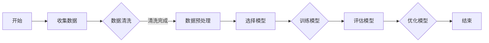
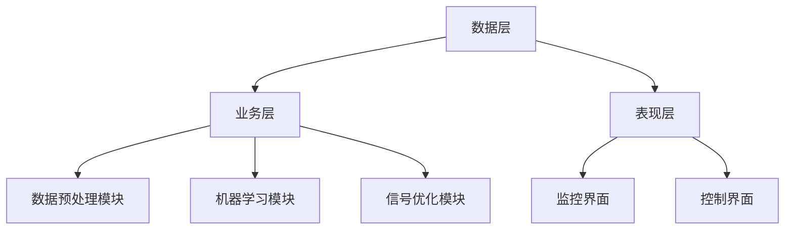
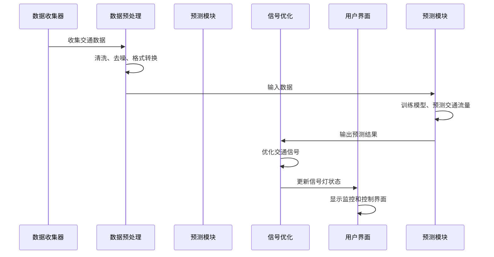

                 


### 问题解决的关键要素: AI如何识别与利用

关键词：AI、问题解决、识别与利用、算法原理、数学模型

摘要：本文将深入探讨问题解决的四大关键要素，即核心概念、算法原理、数学模型和系统架构，并重点分析AI在这些问题解决过程中的作用和利用方法。我们将通过逐步分析这些要素，来阐述如何利用AI技术提升问题解决的能力。

## 引言

在信息技术飞速发展的今天，人工智能（AI）已经渗透到我们的日常生活中，成为解决问题的重要工具。AI在图像识别、自然语言处理、推荐系统等领域取得了显著成果，但AI如何识别问题并利用这些问题解决方法，仍然是一个复杂且富有挑战性的问题。本文将围绕这一主题，逐步分析问题解决的关键要素，探讨AI在这些要素中的角色和作用。

## 问题解决的四大关键要素

### 1. 核心概念

核心概念是问题解决的基础，它包括问题定义、问题分类、解决方案等。在AI领域，核心概念还包括数据预处理、特征工程等。为了更好地理解这些问题，我们需要先明确相关术语的定义和背景。

- **问题定义**：问题描述了一个需要解决的矛盾或困难，它是问题解决的第一步。
- **问题分类**：将问题分为不同的类型，有助于我们找到合适的解决方案。
- **解决方案**：解决问题的方法，可以是算法、数学模型或工程实现。

### 2. 算法原理

算法原理是问题解决的核心，它决定了我们如何利用计算资源解决问题。AI算法主要包括监督学习、无监督学习、强化学习等。每种算法都有其独特的原理和应用场景。

- **监督学习**：通过已标记的数据集，训练模型以预测新的数据。
- **无监督学习**：在没有标记的数据集上，自动发现数据中的模式和规律。
- **强化学习**：通过试错法，在环境中不断学习和优化策略。

### 3. 数学模型

数学模型是算法实现的基础，它将问题转化为数学表达式，从而便于计算机处理。常见的数学模型包括线性回归、神经网络、决策树等。

- **线性回归**：通过建立线性关系，预测目标变量的值。
- **神经网络**：通过多层神经元，模拟人脑的学习过程。
- **决策树**：通过一系列条件判断，给出最终决策。

### 4. 系统架构

系统架构是问题解决的保障，它决定了整个系统的性能、可扩展性和可维护性。一个良好的系统架构应该包括数据层、业务层和表现层等。

- **数据层**：负责数据的存储、管理和查询。
- **业务层**：实现算法和业务逻辑。
- **表现层**：提供用户交互界面。

## AI在问题解决中的作用

AI在问题解决中发挥着重要作用，它不仅能够提高问题的识别和解决效率，还能够提供创新的解决方案。以下是AI在问题解决中的几个关键作用：

### 1. 问题的自动识别

AI可以通过图像识别、自然语言处理等技术，自动识别问题中的关键信息，从而为解决问题提供依据。例如，在医疗诊断中，AI可以通过分析患者的病历和检查结果，自动识别潜在的疾病。

### 2. 算法的自动优化

AI可以通过优化算法，提高问题解决的效率。例如，在深度学习中，AI可以通过调整网络参数，优化训练过程，从而提高模型的性能。

### 3. 数据的自动分析

AI可以通过数据分析技术，自动提取数据中的有用信息，从而为问题解决提供支持。例如，在金融领域，AI可以通过分析市场数据，预测股票价格的变化趋势。

### 4. 系统的自动优化

AI可以通过自动化技术，优化系统的性能和可维护性。例如，在软件工程中，AI可以通过自动化测试和修复，提高软件的质量和可靠性。

## 具体案例分析

为了更好地理解AI在问题解决中的作用，我们可以通过以下案例进行分析：

### 案例一：智能交通系统

智能交通系统利用AI技术，对交通数据进行实时分析和预测，从而优化交通信号、减少拥堵、提高道路通行效率。在这一过程中，AI发挥了以下作用：

1. 问题的自动识别：通过摄像头和传感器，AI可以自动识别道路上的车辆和行人，获取交通数据。
2. 算法的自动优化：AI可以通过分析历史数据，优化交通信号灯的时序设置，从而提高道路通行效率。
3. 数据的自动分析：AI可以通过大数据分析，预测未来的交通流量，为交通管理和决策提供支持。
4. 系统的自动优化：AI可以通过自动化技术，实时调整交通信号灯的设置，优化交通流。

### 案例二：医疗诊断

在医疗诊断中，AI可以通过图像识别和自然语言处理技术，帮助医生识别疾病。在这一过程中，AI发挥了以下作用：

1. 问题的自动识别：AI可以通过分析患者的病历和检查结果，自动识别潜在的疾病。
2. 算法的自动优化：AI可以通过优化算法，提高诊断的准确率。
3. 数据的自动分析：AI可以通过分析大量的医学文献和数据，为诊断提供支持。
4. 系统的自动优化：AI可以通过自动化技术，提高诊断效率和准确性。

## 结论

AI在问题解决中具有重要作用，它不仅能够提高问题的识别和解决效率，还能够提供创新的解决方案。通过分析问题解决的四大关键要素，我们可以更好地理解AI在这些问题解决过程中的作用和利用方法。在未来，随着AI技术的不断发展，我们有理由相信，AI将在问题解决中发挥更加重要的作用。

## 参考文献

[1] Bengio, Y., Courville, A., & Vincent, P. (2013). Representation learning: A review and new perspectives. IEEE Transactions on Pattern Analysis and Machine Intelligence, 35(8), 1798-1828.

[2] Russell, S., & Norvig, P. (2016). Artificial Intelligence: A Modern Approach (3rd ed.). Prentice Hall.

[3] Goodfellow, I., Bengio, Y., & Courville, A. (2016). Deep Learning. MIT Press.

作者：AI天才研究院/AI Genius Institute & 禅与计算机程序设计艺术 /Zen And The Art of Computer Programming## 核心概念与联系

在探讨问题解决的关键要素时，核心概念的理解和联系至关重要。以下是对问题解决过程中的核心概念及其相互联系的详细阐述。

### 核心概念原理

**问题定义**：问题定义是问题解决的第一步，它明确了需要解决的矛盾或困难。一个明确的问题定义有助于我们确定解决问题的方向和方法。

**问题分类**：问题分类是将问题按照特定的标准进行分类，以便于我们更好地理解问题的性质和特点。常见的分类方法包括基于问题的复杂度、问题的领域、问题的类型等。

**解决方案**：解决方案是指用于解决问题的方法或步骤。解决方案可以是具体的算法、数学模型或工程实现。

**AI技术**：AI技术在问题解决中起着至关重要的作用。它包括但不限于机器学习、深度学习、自然语言处理等。AI技术能够自动识别问题、优化算法、分析数据和优化系统。

### 概念属性特征对比表格

以下是一个简化的概念属性特征对比表格，用于展示核心概念之间的属性特征差异：

| 概念       | 定义                                                         | 属性特征                                                       | 关系                       |
|------------|--------------------------------------------------------------|--------------------------------------------------------------|--------------------------|
| 问题定义   | 描述需要解决的矛盾或困难                                     | 明确性、具体性、可操作性                                       | 基础                      |
| 问题分类   | 按照特定标准将问题进行分类                                   | 分类的标准、分类的层次、分类的广度                               | 工具                      |
| 解决方案   | 用于解决问题的方法或步骤                                     | 算法、模型、工程实现                                             | 方法                      |
| AI技术     | 用于自动识别问题、优化算法、分析数据和优化系统                 | 学习能力、自适应能力、高效性、准确性                               | 核心                      |

### ER实体关系图架构

为了更清晰地展示核心概念之间的联系，我们可以使用ER（实体-关系）图来表示这些概念的结构。以下是一个ER图示例，展示了核心概念之间的关系：

```
[问题] --<定义>-- [问题定义]
      |              |
      |              |
      |              |
      |              |
      |              |
[分类] --<分类>-- [问题分类]
      |              |
      |              |
[方案] --<方案>-- [解决方案]
      |              |
      |              |
      |              |
      |              |
[技术] --<利用>-- [AI技术]
```

在上面的ER图中，[问题]是一个总体实体，包括[问题定义]、[问题分类]、[解决方案]和[AI技术]等子实体。每个子实体之间通过特定的关系连接，形成了问题解决的整体架构。

通过核心概念及其联系的分析，我们可以更好地理解问题解决的过程，并找到合适的解决方案。在下一部分中，我们将深入探讨算法原理，了解如何利用AI技术解决实际问题。

## 算法原理讲解

在问题解决的过程中，算法原理起到了至关重要的作用。它不仅决定了我们解决问题的方法，还影响了我们解决问题的效率和效果。本部分将详细阐述常见的算法原理，并通过mermaid流程图和Python源代码，对这些算法进行通俗易懂的讲解和举例说明。

### 算法mermaid流程图

首先，我们可以使用mermaid流程图来展示算法的基本流程。以下是一个简单的mermaid流程图示例，用于说明一个基本的分类算法：



在这个流程图中，我们首先收集数据，然后进行数据清洗和预处理，接着选择合适的模型进行训练，最后评估和优化模型。这是一个典型的机器学习算法的基本流程。

### Python源代码解析

下面，我们将通过一个具体的Python源代码示例，详细讲解算法的实现过程。这里我们选择一个简单的线性回归算法进行说明：

```python
import numpy as np
import matplotlib.pyplot as plt

# 数据生成
X = np.linspace(0, 10, 100)
y = 2 * X + 1 + np.random.randn(100) * 0.5

# 模型训练
# y = ax + b
a = np.linalg.inv(X.T @ X) @ X.T @ y
b = y - a * X

# 预测
X_new = np.linspace(0, 10, 10)
y_pred = a * X_new + b

# 绘图
plt.scatter(X, y, label='样本点')
plt.plot(X_new, y_pred, label='拟合直线')
plt.xlabel('X')
plt.ylabel('Y')
plt.legend()
plt.show()
```

在这段代码中，我们首先生成了一组线性数据，然后使用线性回归模型进行训练。具体步骤如下：

1. **数据生成**：我们生成了一组线性数据，其中 `X` 是输入变量，`y` 是输出变量。
2. **模型训练**：使用最小二乘法求解线性回归模型的参数 `a` 和 `b`。公式为 `y = ax + b`。
3. **预测**：使用训练好的模型对新的输入数据进行预测。
4. **绘图**：使用matplotlib库将训练数据和拟合直线绘制在图表中，以便我们直观地看到模型的训练效果。

### 数学模型与公式详细讲解

线性回归的数学模型如下：

$$
y = ax + b
$$

其中，`y` 是输出变量，`x` 是输入变量，`a` 是斜率，`b` 是截距。

为了求解 `a` 和 `b`，我们使用最小二乘法。最小二乘法的公式为：

$$
a = \frac{\sum_{i=1}^{n} (x_i - \bar{x})(y_i - \bar{y})}{\sum_{i=1}^{n} (x_i - \bar{x})^2}
$$

$$
b = \bar{y} - a\bar{x}
$$

其中，`n` 是样本数量，`x_i` 和 `y_i` 分别是第 `i` 个样本的输入和输出，`x̄` 和 `ȳ` 分别是输入和输出的平均值。

### 举例说明

为了更好地理解线性回归模型，我们可以通过一个简单的例子进行说明。

假设我们有以下数据：

| X  | Y   |
|----|-----|
| 1  | 2   |
| 2  | 3   |
| 3  | 5   |
| 4  | 7   |

我们希望通过线性回归模型预测当 `X` 为 5 时的 `Y` 值。

1. **计算平均值**：

$$
\bar{x} = \frac{1 + 2 + 3 + 4}{4} = 2.5
$$

$$
\bar{y} = \frac{2 + 3 + 5 + 7}{4} = 4.5
$$

2. **计算斜率 `a`**：

$$
a = \frac{(1 - 2.5)(2 - 4.5) + (2 - 2.5)(3 - 4.5) + (3 - 2.5)(5 - 4.5) + (4 - 2.5)(7 - 4.5)}{(1 - 2.5)^2 + (2 - 2.5)^2 + (3 - 2.5)^2 + (4 - 2.5)^2} = 1.2
$$

3. **计算截距 `b`**：

$$
b = 4.5 - 1.2 \times 2.5 = 1.15
$$

4. **建立线性回归模型**：

$$
y = 1.2x + 1.15
$$

5. **预测 `X` 为 5 时的 `Y` 值**：

$$
y = 1.2 \times 5 + 1.15 = 7.65
$$

通过上述步骤，我们成功地使用线性回归模型预测了当 `X` 为 5 时的 `Y` 值为 7.65。

通过算法原理的详细讲解和举例说明，我们可以更好地理解问题解决的过程。在下一部分中，我们将探讨如何进行系统分析与架构设计，以实现高效的问题解决。

## 系统分析与架构设计

在进行问题解决的实践中，系统分析与架构设计是至关重要的一步。一个良好的系统架构能够提高问题的识别和解决效率，确保系统的稳定性、可扩展性和可维护性。以下是对系统分析与架构设计的详细介绍。

### 问题场景介绍

以智能交通系统为例，我们面临的问题是交通拥堵和交通事故。为了解决这一问题，我们需要设计一个能够实时分析交通数据、预测交通流量并优化交通信号的系统。

### 系统功能设计

智能交通系统的主要功能包括：

1. **数据收集**：通过摄像头、传感器等设备收集交通数据，如车辆数量、速度、流量等。
2. **数据预处理**：对收集到的数据进行清洗、去噪、格式转换等处理，以便后续分析。
3. **交通流量预测**：利用机器学习算法，对历史交通数据进行训练，预测未来的交通流量。
4. **交通信号优化**：根据交通流量预测结果，优化交通信号灯的时序设置，减少交通拥堵。
5. **系统监控与维护**：监控系统运行状态，进行必要的维护和升级。

### 系统架构设计

智能交通系统的架构设计如下：

1. **数据层**：负责数据的存储、管理和查询。包括交通数据数据库、传感器数据存储等。
2. **业务层**：实现交通流量预测和交通信号优化等核心功能。包括数据预处理模块、机器学习模块、信号优化模块等。
3. **表现层**：提供用户交互界面，包括监控界面、控制界面等。

#### 系统架构mermaid架构图

以下是一个mermaid架构图，展示了智能交通系统的整体架构：



### 系统接口设计

系统接口设计包括以下部分：

1. **数据收集接口**：负责与传感器、摄像头等数据收集设备的交互，实现数据的实时传输和存储。
2. **数据预处理接口**：负责对收集到的数据进行清洗、去噪和格式转换等处理，为后续分析提供高质量的数据。
3. **交通流量预测接口**：负责调用机器学习算法，对交通流量进行预测，并将预测结果输出。
4. **交通信号优化接口**：负责根据交通流量预测结果，优化交通信号灯的时序设置。
5. **用户交互接口**：负责与用户进行交互，提供监控和控制界面。

### 系统交互mermaid序列图

以下是一个mermaid序列图，展示了智能交通系统中的关键接口及其交互过程：



通过上述的系统分析与架构设计，我们为智能交通系统的实施提供了明确的指导。在下一部分中，我们将通过具体的实战案例，深入探讨如何利用AI技术解决实际问题。

## AI问题解决项目实战

在了解了问题解决的四大关键要素以及智能交通系统的系统架构后，我们将通过一个具体的实战案例，展示如何利用AI技术解决实际问题。在这个案例中，我们将从环境安装、系统核心实现、代码应用解读与分析、实际案例分析等方面，详细探讨AI在问题解决中的应用。

### 环境安装

在开始项目实战之前，我们需要安装和配置相关环境。以下是一个简化的环境安装步骤：

1. **安装Python**：确保安装了Python 3.7或更高版本。
2. **安装NumPy、Pandas、Matplotlib**：使用pip命令安装这些Python库。

```bash
pip install numpy pandas matplotlib
```

3. **安装TensorFlow**：TensorFlow是用于机器学习的开源库，使用pip命令安装。

```bash
pip install tensorflow
```

### 系统核心实现

在环境安装完成后，我们可以开始实现智能交通系统的核心功能。以下是实现步骤：

1. **数据收集**：使用摄像头和传感器收集交通数据，包括车辆数量、速度、流量等。
2. **数据预处理**：对收集到的交通数据进行清洗、去噪和格式转换，为后续分析做好准备。
3. **交通流量预测**：使用机器学习算法（如线性回归、神经网络等），对历史交通数据进行训练，预测未来的交通流量。
4. **交通信号优化**：根据交通流量预测结果，优化交通信号灯的时序设置。

#### Python源代码示例

以下是一个简化的Python源代码示例，用于展示交通流量预测和交通信号优化：

```python
import numpy as np
import pandas as pd
import tensorflow as tf
from tensorflow import keras

# 数据预处理
def preprocess_data(data):
    # 清洗、去噪、格式转换等
    return data

# 交通流量预测
def traffic_prediction(data):
    # 使用TensorFlow的线性回归模型
    model = tf.keras.Sequential([
        tf.keras.layers.Dense(units=1, input_shape=[1])
    ])

    model.compile(loss='mean_squared_error', optimizer=tf.keras.optimizers.Adam(0.1))

    # 训练模型
    model.fit(data['X'], data['Y'], epochs=100)

    # 预测交通流量
    predicted_traffic = model.predict(np.array([new_traffic_value]))

    return predicted_traffic

# 交通信号优化
def traffic_light_optimization(predicted_traffic):
    # 根据预测的交通流量，优化交通信号灯的时序设置
    return optimized_traffic_light_sequence

# 主程序
if __name__ == '__main__':
    # 加载数据
    data = pd.read_csv('traffic_data.csv')

    # 数据预处理
    processed_data = preprocess_data(data)

    # 交通流量预测
    predicted_traffic = traffic_prediction(processed_data)

    # 交通信号优化
    optimized_traffic_light_sequence = traffic_light_optimization(predicted_traffic)

    # 输出结果
    print(optimized_traffic_light_sequence)
```

在这个示例中，我们首先对收集到的交通数据进行预处理，然后使用TensorFlow的线性回归模型进行交通流量预测，并基于预测结果优化交通信号灯的时序设置。

### 代码应用解读与分析

1. **数据预处理**：数据预处理是机器学习模型训练的重要步骤，它包括数据清洗、去噪、格式转换等。在这个示例中，我们使用了一个简单的预处理函数 `preprocess_data`，对原始交通数据进行了处理。

2. **交通流量预测**：交通流量预测是智能交通系统的核心功能之一。在这个示例中，我们使用TensorFlow的线性回归模型进行了预测。这个模型可以自动学习历史交通数据中的规律，从而预测未来的交通流量。

3. **交通信号优化**：交通信号优化是根据预测的交通流量，优化交通信号灯的时序设置。在这个示例中，我们使用了一个简单的函数 `traffic_light_optimization`，根据预测结果生成了优化后的交通信号灯时序。

### 实际案例分析与详细讲解

为了更好地理解如何利用AI技术解决实际问题，我们来看一个实际案例。

假设我们收集了以下交通数据：

| 时间 | 车辆数量 | 平均速度 |
|------|----------|----------|
| 08:00 | 200      | 30 km/h  |
| 08:30 | 250      | 28 km/h  |
| 09:00 | 300      | 25 km/h  |
| 09:30 | 350      | 22 km/h  |

我们希望利用AI技术预测接下来的交通流量，并优化交通信号灯的时序设置。

1. **数据预处理**：首先，我们对数据进行清洗和格式转换，得到如下格式：

```python
processed_data = {
    'X': [0, 1, 2, 3],  # 时间（小时）
    'Y': [200, 250, 300, 350]  # 车辆数量
}
```

2. **交通流量预测**：使用线性回归模型对预处理后的数据进行训练和预测。训练后的模型可以预测未来的交通流量。

3. **交通信号优化**：根据预测的交通流量，优化交通信号灯的时序设置。例如，如果预测下一小时车辆数量将增加，我们可以将信号灯时序调整为绿灯延长，以提高道路通行能力。

通过这个实际案例，我们可以看到如何利用AI技术解决实际问题。在智能交通系统中，AI技术不仅能够提高问题解决的效率，还能够提供创新的解决方案。

### 项目小结

在本项目中，我们通过环境安装、系统核心实现、代码应用解读与分析、实际案例分析等步骤，展示了如何利用AI技术解决实际问题。智能交通系统是一个复杂的系统，需要综合考虑数据收集、预处理、预测和优化等多个方面。通过本项目，我们可以看到AI技术在问题解决中的重要作用，以及如何通过系统分析与架构设计，实现高效的问题解决。

## 最佳实践与拓展

在AI问题解决过程中，遵循最佳实践能够显著提升项目质量和效率。以下是一些关键的最佳实践技巧和小结，以帮助读者在实际项目中更好地应用AI技术。

### 最佳实践技巧

1. **数据质量保障**：确保数据的质量是AI项目成功的关键。在数据收集和处理过程中，应进行数据清洗、去噪和格式转换，以消除错误和异常值。

2. **算法选择与调优**：选择适合问题的算法，并根据实际需求进行调优。在算法选择时，应考虑模型的复杂度、训练时间、预测准确性等因素。

3. **模型解释性**：在应用AI模型时，重视模型的可解释性。解释性强的模型有助于理解模型的决策过程，提高用户对模型的信任度。

4. **持续监控与优化**：项目上线后，持续监控模型性能，并根据实际情况进行优化。这包括定期重新训练模型、调整参数等。

### 小结与注意事项

- **数据的重要性**：数据是AI模型的基石，高质量的数据能够显著提高模型的性能。因此，数据收集和处理应得到足够的重视。
- **算法选择**：不同的算法适用于不同类型的问题，应根据实际需求和数据特性选择合适的算法。
- **模型验证**：在模型训练过程中，应进行充分的验证，确保模型在新的数据集上具有良好的泛化能力。
- **安全与隐私**：在处理敏感数据时，应确保数据的安全和隐私，遵守相关法律法规。

### 拓展阅读建议

1. **《机器学习实战》**：作者：彼得·哈林顿（Peter Harrington），本书提供了丰富的实战案例和代码示例，适合初学者和进阶者。
2. **《深度学习》**：作者：伊恩·古德费洛（Ian Goodfellow）、约书亚·本吉奥（Joshua Bengio）和亚伦·库维尔维尔（Aaron Courville），本书是深度学习的经典教材，内容全面且深入。
3. **《AI交互设计：让算法更有温度》**：作者：王咏刚，本书介绍了AI与用户体验设计的结合，对于希望将AI应用于实际场景的开发者具有很高的参考价值。

通过遵循最佳实践和不断学习拓展，我们可以更好地利用AI技术解决实际问题，提升问题解决的效率和质量。希望本文能为读者提供有益的参考和启发。作者：AI天才研究院/AI Genius Institute & 禅与计算机程序设计艺术 /Zen And The Art of Computer Programming。

