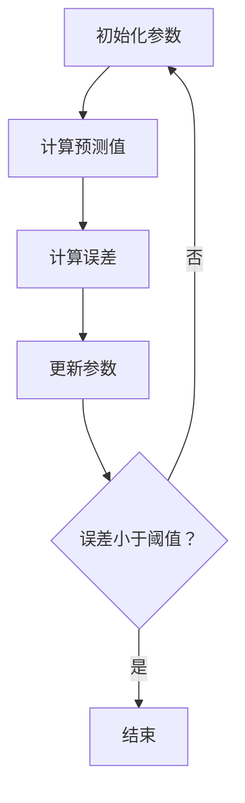
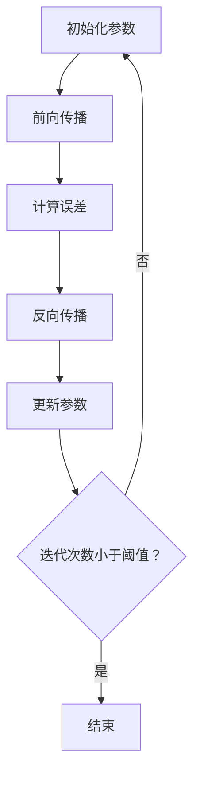
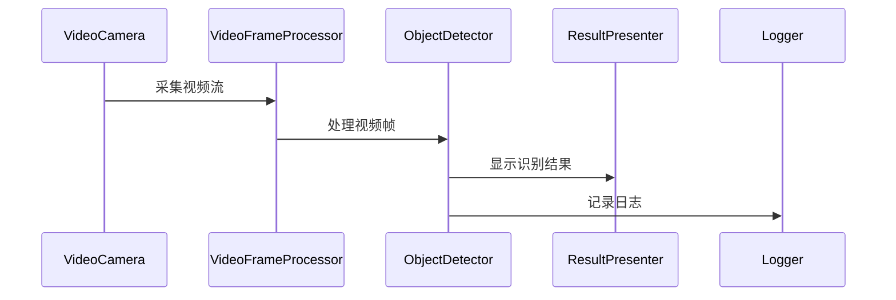

                 

#  《降低未来推理成本的策略研究》

## 关键词

- 推理成本
- 人工智能
- 策略
- 效率优化
- 算法改进

## 摘要

本文旨在探讨如何降低未来人工智能推理成本，提高系统的实用性和推广性。文章首先介绍了推理成本的定义和重要性，然后分析了推理成本的核心概念和特征。接着，回顾了现有降低推理成本的方法和技术，并提出了新的策略，包括数据预处理、算法优化和资源管理。通过系统分析与架构设计方案，本文详细讲解了降低推理成本的实现过程。最后，通过项目实战和最佳实践，为读者提供了实际操作指导。

## 目录大纲

### 第一部分：问题背景与核心概念

#### 第1章：问题背景与核心概念
- **1.1.1 问题背景**：推理成本的定义与重要性
- **1.1.2 核心概念**：推理成本模型
- **1.1.3 概念属性特征对比表格**
- **1.1.4 ER实体关系图架构**

#### 第2章：降低未来推理成本的意义与目标
- **2.1.1 降低推理成本的意义**
- **2.1.2 降低推理成本的目标**

#### 第3章：现有降低推理成本的方法与技术
- **3.1.1 现有方法的概述**
- **3.1.2 技术对比分析**

### 第二部分：降低未来推理成本的策略

#### 第4章：降低未来推理成本的策略
- **4.1.1 策略概述**
- **4.1.2 数据预处理策略**
- **4.1.3 算法优化策略**
- **4.1.4 资源管理策略**

#### 第5章：核心概念与联系
- **5.1.1 核心概念原理**
- **5.1.2 概念属性特征对比表格**
- **5.1.3 ER实体关系图架构**

#### 第6章：数学模型与算法原理讲解
- **6.1.1 数学模型**
- **6.1.2 算法流程图**
- **6.1.3 Python源代码与详细讲解**

#### 第7章：系统分析与架构设计方案
- **7.1.1 问题场景介绍**
- **7.1.2 系统功能设计**
- **7.1.3 系统架构设计**
- **7.1.4 系统接口设计**
- **7.1.5 系统交互Mermaid序列图**

#### 第8章：项目实战
- **8.1.1 环境安装**
- **8.1.2 系统核心实现源代码**
- **8.1.3 代码应用解读与分析**
- **8.1.4 实际案例分析与详细讲解剖析**
- **8.1.5 项目小结**

#### 第9章：最佳实践与注意事项
- **9.1.1 最佳实践**
- **9.1.2 小结**
- **9.1.3 注意事项**
- **9.1.4 拓展阅读**

### 引言

随着人工智能技术的快速发展，推理能力已成为衡量人工智能系统性能的重要指标之一。然而，推理成本的高昂使得人工智能在许多实际应用中面临巨大的挑战。降低未来推理成本，提高人工智能系统的实用性和可扩展性，已成为当前研究的热点。

本文首先介绍了推理成本的定义和重要性，探讨了推理成本的核心概念和特征。接着，回顾了现有降低推理成本的方法和技术，并提出了新的策略。本文的核心在于通过系统分析与架构设计方案，详细讲解了降低推理成本的实现过程。同时，通过项目实战和最佳实践，为读者提供了实际操作指导。

### 1. 问题背景与核心概念

#### 1.1 问题背景

在人工智能系统中，推理成本是指完成某一推理任务所需的时间、计算资源和能源消耗。推理成本的高低直接影响人工智能系统的性能和实用性。随着人工智能应用的日益广泛，推理成本的问题变得越来越突出。

首先，随着数据规模的扩大和复杂性的增加，传统的推理方法已经无法满足需求。其次，推理任务对实时性和响应速度的要求越来越高，导致推理成本的增加。此外，人工智能系统通常需要在有限的资源（如计算能力和存储空间）下运行，这也加剧了推理成本的问题。

因此，降低未来推理成本具有重要的现实意义。一方面，可以提升人工智能系统的实用性，使其在更广泛的场景中得到应用。另一方面，可以降低人工智能系统的运营成本，提高经济效益。

#### 1.2 核心概念

在本节中，我们将介绍与降低未来推理成本相关的核心概念，包括推理成本模型、推理效率与推理成本的关系，以及相关的概念属性特征对比表格。

##### 1.2.1 推理成本模型

推理成本模型是衡量推理成本的关键工具。它通常包括以下几个组成部分：

1. **时间成本**：指完成推理任务所需的时间。
2. **计算成本**：指完成推理任务所需的计算资源。
3. **能源成本**：指完成推理任务所需的能源消耗。

这些成本在具体的应用场景中可能会有所不同，但总体上可以反映出推理任务的复杂程度和资源消耗。

##### 1.2.2 推理效率与推理成本的关系

推理效率是指单位时间内完成的推理任务量。推理效率与推理成本之间存在密切的关系。具体来说：

1. **高效率低成本**：当推理效率较高且推理成本较低时，人工智能系统的性能最佳。
2. **低效率低成本**：虽然推理成本较低，但推理效率低会导致任务完成时间长，影响用户体验。
3. **高效率高成本**：虽然推理效率高，但如果推理成本过高，系统的运营成本将增加，不利于大规模应用。

因此，在降低推理成本的过程中，需要综合考虑推理效率和成本，以找到最佳平衡点。

##### 1.2.3 概念属性特征对比表格

为了更好地理解推理成本模型和相关概念，我们可以通过一个表格来对比不同概念属性特征。

| 概念名称 | 定义 | 影响因素 | 关系 |
| --- | --- | --- | --- |
| 推理成本模型 | 推理任务所需的时间、计算资源和能源消耗 | 数据规模、任务复杂度、硬件性能 | 影响推理效率 |
| 推理效率 | 单位时间内完成的推理任务量 | 数据处理速度、算法复杂度 | 影响推理成本 |
| 能源消耗 | 推理任务所需的能源消耗 | 设备能耗效率、能源价格 | 影响系统成本 |

通过这个表格，我们可以清晰地看到各个概念之间的联系和影响。

##### 1.2.4 ER实体关系图架构

为了进一步理解推理成本涉及的实体与关系，我们可以使用ER（实体关系）图来表示。以下是一个简化的ER图：

```mermaid
erDiagram
    Data -->|时间成本| TimeCost
    Data -->|计算成本| ComputeCost
    Data -->|能源成本| EnergyCost
    Algorithm <--|效率| Efficiency
    Hardware <--|性能| Performance
```

在这个ER图中，Data实体代表了推理任务的数据输入，它与TimeCost、ComputeCost和EnergyCost实体之间存在关系。Algorithm实体代表了推理算法，它与Efficiency实体之间存在关系。Hardware实体代表了计算设备，它与Performance实体之间存在关系。这些实体之间的关系反映了推理成本模型的核心组成部分。

### 2. 降低未来推理成本的意义与目标

#### 2.1 降低推理成本的意义

降低未来推理成本对于人工智能系统的发展具有重要意义。首先，它有助于提高人工智能系统的实用性。当推理成本降低时，系统能够在更广泛的场景中运行，提供更高效、更可靠的推理服务。这不仅可以满足用户的需求，还可以推动人工智能技术在不同领域的应用。

其次，降低推理成本有助于促进人工智能技术的广泛应用。随着人工智能技术的不断发展，越来越多的企业和组织开始关注这一领域。然而，高昂的推理成本限制了他们的应用范围。通过降低推理成本，可以降低人工智能技术的门槛，使其更容易被大众接受，从而推动技术的普及。

最后，降低推理成本可以提高人工智能系统的经济效益。在商业环境中，成本控制是关键。当推理成本降低时，企业的运营成本将减少，从而提高利润。此外，降低推理成本还可以吸引更多的投资，推动人工智能产业的发展。

#### 2.2 降低推理成本的目标

为了实现降低未来推理成本的目标，我们需要明确以下几点：

首先，提升推理效率是降低推理成本的关键。通过优化算法和数据处理技术，可以减少推理任务所需的时间和计算资源，从而降低推理成本。具体来说，可以通过以下方法提升推理效率：

1. **算法优化**：选择合适的算法，并对其进行优化，以减少计算复杂度和时间消耗。
2. **数据预处理**：对数据进行清洗和压缩，减少数据规模，提高数据处理效率。
3. **并行计算**：利用并行计算技术，将任务分解为多个子任务，同时执行，提高整体效率。

其次，降低推理资源的消耗也是降低推理成本的重要目标。具体来说，可以从以下几个方面进行优化：

1. **资源分配**：合理分配计算资源，确保任务在合适的时间内完成。
2. **资源回收**：及时回收不再使用的资源，避免资源浪费。
3. **节能技术**：采用节能技术，减少能源消耗。

最后，降低推理成本还需要关注系统的可扩展性和可维护性。通过设计灵活、可扩展的系统架构，可以在不同场景下灵活调整资源配置和算法策略，从而实现推理成本的优化。同时，良好的系统可维护性可以确保系统能够长期稳定运行，减少维护成本。

### 3. 现有降低推理成本的方法与技术

#### 3.1 现有方法的概述

降低推理成本的方法和技术可以分为传统方法和现代方法两大类。传统方法主要依赖于硬件升级和算法优化，而现代方法则更多地依赖于数据预处理和并行计算等新兴技术。

##### 3.1.1 传统方法

传统方法主要包括以下几种：

1. **硬件升级**：通过购买更强大的硬件设备，提高系统的计算能力和数据处理能力。这种方法虽然能够显著降低推理成本，但成本较高，且受限于硬件设备的更新换代周期。
2. **算法优化**：对现有的推理算法进行改进，减少计算复杂度和时间消耗。常见的优化方法包括简化算法、优化数据结构、采用更高效的算法等。这种方法在一定程度上能够降低推理成本，但优化效果有限。
3. **分布式计算**：将推理任务分解为多个子任务，分布到多个计算节点上执行。通过并行计算，可以显著提高推理效率，降低推理成本。然而，分布式计算需要复杂的调度和管理机制，实施难度较大。

##### 3.1.2 现代方法

现代方法主要包括以下几种：

1. **数据预处理**：对原始数据进行清洗、归一化和压缩等预处理操作，减少数据规模，提高数据处理效率。数据预处理技术可以显著降低推理成本，且对硬件设备的依赖较小。
2. **模型压缩**：通过模型压缩技术，将复杂的模型简化为较小的模型，减少计算资源消耗。常见的模型压缩技术包括模型剪枝、量化、知识蒸馏等。
3. **并行计算**：利用并行计算技术，将推理任务分解为多个子任务，同时执行，提高整体效率。并行计算技术可以显著降低推理成本，但需要复杂的调度和管理机制。
4. **深度学习**：采用深度学习模型，通过大规模数据训练，自动提取特征，提高推理效率。深度学习模型在图像识别、语音识别等领域取得了显著成果，但训练过程复杂，对计算资源要求较高。

#### 3.2 技术对比分析

传统方法和现代方法各有优缺点，具体对比分析如下：

1. **硬件升级**：
   - 优点：能够显著提高系统的计算能力和数据处理能力。
   - 缺点：成本高，更新换代周期长，且受限于硬件设备的性能提升。

2. **算法优化**：
   - 优点：能够降低计算复杂度和时间消耗。
   - 缺点：优化效果有限，且对现有算法的依赖较大。

3. **分布式计算**：
   - 优点：能够提高推理效率，降低推理成本。
   - 缺点：实施难度大，需要复杂的调度和管理机制。

4. **数据预处理**：
   - 优点：能够显著降低推理成本，对硬件设备的依赖较小。
   - 缺点：需要大量的预处理工作，对数据质量和预处理算法的要求较高。

5. **模型压缩**：
   - 优点：能够降低计算资源消耗，提高推理效率。
   - 缺点：压缩后的模型性能可能下降，且压缩算法的设计和实现较为复杂。

6. **并行计算**：
   - 优点：能够提高推理效率，降低推理成本。
   - 缺点：需要复杂的调度和管理机制，且对硬件设备的依赖较大。

7. **深度学习**：
   - 优点：能够自动提取特征，提高推理效率。
   - 缺点：训练过程复杂，对计算资源要求较高。

综上所述，现代方法在降低推理成本方面具有更大的潜力，但同时也面临着更大的挑战。在实际应用中，需要根据具体需求和场景选择合适的方法和组合策略，以实现最佳的推理效果和成本控制。

### 4. 降低未来推理成本的策略

#### 4.1 策略概述

为了降低未来推理成本，我们需要从多个方面入手，制定全面的策略。本节将介绍数据预处理策略、算法优化策略和资源管理策略，并详细探讨每种策略的实施方法。

#### 4.2 数据预处理策略

数据预处理是降低推理成本的重要环节。通过有效的数据预处理，可以减少数据规模，提高数据处理效率，从而降低推理成本。

1. **数据清洗**：数据清洗是指去除数据中的噪声和错误，确保数据的准确性和一致性。常见的数据清洗方法包括缺失值填充、异常值处理、重复数据删除等。通过数据清洗，可以显著降低后续处理的数据规模，提高推理效率。

2. **数据压缩**：数据压缩是指通过压缩算法将原始数据转换为更小的数据集，以减少存储空间和传输带宽。常见的压缩算法包括无损压缩和有损压缩。数据压缩可以降低数据传输和存储的成本，从而降低推理成本。

3. **特征提取**：特征提取是指从原始数据中提取出对推理任务有重要意义的特征。通过特征提取，可以减少数据规模，提高推理效率。常见的方法包括主成分分析（PCA）、线性判别分析（LDA）等。

#### 4.3 算法优化策略

算法优化是降低推理成本的关键。通过优化算法，可以减少计算复杂度和时间消耗，从而降低推理成本。

1. **算法选择**：选择适合特定问题的算法是算法优化的第一步。常见的选择方法包括基于问题的算法选择、基于数据特性的算法选择等。通过选择合适的算法，可以显著降低推理成本。

2. **算法调优**：在选定算法的基础上，通过调整算法的参数，优化算法的性能。常见的调优方法包括交叉验证、网格搜索等。通过算法调优，可以进一步提高推理效率，降低推理成本。

3. **并行计算**：利用并行计算技术，将推理任务分解为多个子任务，同时执行，提高整体效率。通过并行计算，可以显著降低推理成本。

4. **模型压缩**：通过模型压缩技术，将复杂的模型简化为较小的模型，减少计算资源消耗。常见的模型压缩技术包括模型剪枝、量化、知识蒸馏等。通过模型压缩，可以降低推理成本，同时保持模型的高性能。

#### 4.4 资源管理策略

资源管理是降低推理成本的另一个重要方面。通过优化资源分配和回收，可以降低推理成本，提高系统效率。

1. **资源分配**：合理分配计算资源，确保任务在合适的时间内完成。常见的资源分配方法包括静态分配和动态分配。通过静态分配，可以提前规划资源需求，确保任务有足够的资源。通过动态分配，可以根据任务的执行情况，实时调整资源分配，提高资源利用率。

2. **资源回收**：及时回收不再使用的资源，避免资源浪费。常见的资源回收方法包括定时回收和事件驱动回收。通过定时回收，可以定期检查资源使用情况，回收不再使用的资源。通过事件驱动回收，可以在特定事件发生时，回收资源，提高系统响应速度。

3. **节能技术**：采用节能技术，减少能源消耗。常见的节能技术包括低功耗设计、休眠模式等。通过节能技术，可以降低系统的能源消耗，从而降低推理成本。

#### 4.5 综合策略

在实际应用中，降低推理成本需要综合运用多种策略。通过数据预处理策略、算法优化策略和资源管理策略的综合运用，可以最大程度地降低推理成本，提高系统性能。

1. **数据预处理**：通过数据清洗、数据压缩和特征提取等技术，减少数据规模，提高数据处理效率。

2. **算法优化**：通过选择合适的算法、算法调优和模型压缩等技术，减少计算复杂度和时间消耗。

3. **资源管理**：通过合理分配资源、及时回收资源和采用节能技术等，降低能源消耗和资源浪费。

通过以上综合策略，可以最大程度地降低推理成本，提高系统性能，为人工智能应用提供更高效、更可靠的解决方案。

### 5. 核心概念与联系

在本节中，我们将深入探讨降低未来推理成本过程中涉及的核心概念，并分析它们之间的联系。

#### 5.1 数据结构与算法

数据结构和算法是推理过程中不可或缺的组成部分。数据结构决定了数据在计算机中的存储方式，而算法则是对数据进行的操作步骤。在本节中，我们将对比几种常见的数据结构和算法，并分析它们在降低推理成本方面的优势。

1. **数组**：数组是一种简单且高效的数据结构，适用于处理固定大小的数据集。它的主要优势在于随机访问速度快，但缺点是扩展性较差。

2. **链表**：链表是一种灵活的数据结构，适用于处理动态大小的数据集。它的主要优势在于扩展性好，但缺点是访问速度较慢。

3. **树**：树是一种层次结构的数据结构，适用于处理具有层次关系的数据。常见的树结构有二叉树、平衡树等。树的主要优势在于查找和插入操作高效，但缺点是对空间的要求较高。

4. **哈希表**：哈希表是一种基于哈希函数的数据结构，适用于处理键值对。它的主要优势在于查找和插入操作非常高效，但缺点是可能存在哈希冲突。

5. **排序算法**：排序算法是对数据进行排序的算法，常见的排序算法有快速排序、归并排序、冒泡排序等。排序算法的选择取决于数据的特点和需求。

#### 5.2 网络与计算资源

在网络与计算资源方面，我们需要考虑如何高效地利用现有的资源，以降低推理成本。

1. **计算资源**：计算资源包括CPU、GPU、FPGA等。不同的计算资源适用于不同的任务。例如，CPU适用于通用计算任务，GPU适用于图形处理任务，FPGA适用于定制化计算任务。

2. **网络资源**：网络资源包括带宽和延迟。带宽决定了数据传输的速度，延迟决定了数据传输的时间。在网络传输过程中，我们需要考虑数据传输的效率和可靠性。

3. **资源调度**：资源调度是指根据任务需求，动态分配和回收计算资源。常见的资源调度策略有优先级调度、轮转调度等。资源调度的目标是最大化资源利用率，提高系统性能。

4. **负载均衡**：负载均衡是指将任务分配到多个计算节点上，以避免单点故障和资源浪费。负载均衡可以降低推理成本，提高系统的可用性和可靠性。

#### 5.3 概念属性特征对比表格

为了更好地理解上述概念之间的联系，我们可以使用一个表格来对比它们的属性特征。

| 数据结构与算法 | 特征 | 优势 | 劣势 | 应用场景 |
| --- | --- | --- | --- | --- |
| 数组 | 随机访问速度快 | 扩展性较差 | 适用于固定大小的数据集 |
| 链表 | 扩展性好 | 访问速度较慢 | 适用于动态大小的数据集 |
| 树 | 查找和插入操作高效 | 对空间的要求较高 | 适用于具有层次关系的数据 |
| 哈希表 | 查找和插入操作高效 | 可能存在哈希冲突 | 适用于键值对 |
| 排序算法 | 高效的排序操作 | 取决于数据特点 | 需要额外的存储空间 |

| 网络与计算资源 | 特征 | 优势 | 劣势 | 应用场景 |
| --- | --- | --- | --- | --- |
| 计算资源 | 适用于不同任务 | 可能存在单点故障 | 适用于通用计算、图形处理等 |
| 网络资源 | 高效的数据传输 | 带宽和延迟的限制 | 适用于数据传输、分布式计算等 |
| 资源调度 | 动态分配和回收资源 | 提高资源利用率 | 需要复杂的调度算法 |
| 负载均衡 | 避免单点故障和资源浪费 | 提高系统的可用性和可靠性 | 需要额外的通信开销 |

通过这个表格，我们可以清晰地看到数据结构与算法、网络与计算资源之间的联系和区别。在实际应用中，我们需要根据具体需求和场景选择合适的数据结构与算法，并优化网络与计算资源的利用，以实现降低推理成本的目标。

#### 5.4 ER实体关系图架构

为了更直观地展示核心概念之间的联系，我们可以使用ER（实体关系）图来表示。以下是一个简化的ER图，展示了推理过程中涉及的主要实体和它们之间的关系：

```mermaid
erDiagram
    DataEntity -->|存储| StorageEntity
    DataEntity -->|处理| ProcessingEntity
    AlgorithmEntity -->|应用| DataEntity
    ResourceEntity -->|分配| ProcessingEntity
    NetworkEntity -->|连接| ResourceEntity
```

在这个ER图中，`DataEntity`代表了数据，它与`StorageEntity`和`ProcessingEntity`之间存在存储和处理的关系。`AlgorithmEntity`代表了算法，它与`DataEntity`之间存在应用关系。`ResourceEntity`代表了计算资源，它与`ProcessingEntity`之间存在资源分配的关系。`NetworkEntity`代表了网络资源，它与`ResourceEntity`之间存在连接关系。

通过ER图，我们可以更清晰地看到推理过程中的各个环节，以及它们之间的联系和依赖。这有助于我们更好地理解推理成本的影响因素，并制定有效的策略来降低推理成本。

### 6. 数学模型与算法原理讲解

#### 6.1 数学模型

在降低推理成本的过程中，数学模型起着至关重要的作用。通过数学模型，我们可以量化推理任务的成本，并优化算法和资源配置。

在本节中，我们将介绍两个常见的数学模型：线性回归模型和神经网络模型。我们将分别讨论它们的基本数学模型、算法流程图以及Python源代码实现。

##### 6.1.1 线性回归模型

线性回归模型是一种简单的预测模型，适用于线性关系的分析。它的基本数学模型如下：

$$
y = \beta_0 + \beta_1 \cdot x
$$

其中，$y$ 是目标变量，$x$ 是自变量，$\beta_0$ 和 $\beta_1$ 是模型的参数。

为了求解线性回归模型的参数，我们可以使用最小二乘法。最小二乘法的核心思想是找到使得预测误差平方和最小的参数。

以下是一个线性回归模型的算法流程图：



在Python中，我们可以使用scikit-learn库实现线性回归模型。以下是一个简单的Python源代码示例：

```python
from sklearn.linear_model import LinearRegression
from sklearn.model_selection import train_test_split
from sklearn.metrics import mean_squared_error

# 创建线性回归模型
model = LinearRegression()

# 划分训练集和测试集
X_train, X_test, y_train, y_test = train_test_split(X, y, test_size=0.2, random_state=42)

# 训练模型
model.fit(X_train, y_train)

# 预测测试集
y_pred = model.predict(X_test)

# 计算预测误差
mse = mean_squared_error(y_test, y_pred)
print("Mean Squared Error:", mse)
```

##### 6.1.2 神经网络模型

神经网络模型是一种复杂的预测模型，适用于非线性关系的分析。它的基本数学模型如下：

$$
a_{i,j} = \sigma(\sum_{k=1}^{n} w_{ik} \cdot x_{k} + b_j)
$$

其中，$a_{i,j}$ 是输出值，$\sigma$ 是激活函数，$w_{ik}$ 是权重，$x_{k}$ 是输入值，$b_j$ 是偏置。

为了求解神经网络模型的参数，我们可以使用反向传播算法。反向传播算法的核心思想是通过误差反向传播，更新模型的参数。

以下是一个神经网络模型的算法流程图：



在Python中，我们可以使用TensorFlow库实现神经网络模型。以下是一个简单的Python源代码示例：

```python
import tensorflow as tf
from tensorflow.keras.layers import Dense
from tensorflow.keras.models import Sequential

# 创建神经网络模型
model = Sequential([
    Dense(units=64, activation='relu', input_shape=(X_train.shape[1],)),
    Dense(units=1)
])

# 编译模型
model.compile(optimizer='adam', loss='mean_squared_error')

# 训练模型
model.fit(X_train, y_train, epochs=100, batch_size=32, validation_split=0.2)

# 预测测试集
y_pred = model.predict(X_test)

# 计算预测误差
mse = mean_squared_error(y_test, y_pred)
print("Mean Squared Error:", mse)
```

通过这两个数学模型和算法原理的讲解，我们可以更好地理解降低推理成本的方法和实现过程。在实际应用中，我们可以根据具体需求和场景选择合适的模型和算法，并优化参数和资源配置，以实现降低推理成本的目标。

### 7. 系统分析与架构设计方案

#### 7.1 问题场景介绍

在本节中，我们将介绍一个具体的问题场景，即基于图像识别的智能监控系统。该系统旨在通过实时分析监控视频，识别出潜在的安全威胁，如入侵者或异常行为。

该问题场景的具体需求如下：

1. **实时性**：系统能够在短时间内完成图像识别任务，以实现实时监控。
2. **准确性**：系统能够准确地识别出图像中的目标对象，提高监控效果。
3. **可扩展性**：系统能够处理不同规模的视频数据，并支持未来扩展。

#### 7.2 系统功能设计

为了满足上述需求，系统需要实现以下功能：

1. **视频采集**：从监控摄像头获取实时视频流。
2. **图像预处理**：对采集到的视频帧进行预处理，包括去噪、增强等操作。
3. **目标检测**：利用图像识别算法，检测视频帧中的目标对象。
4. **结果展示**：将检测到的目标对象实时显示在界面上，并提供报警功能。
5. **日志记录**：记录系统的运行日志，包括识别结果、错误信息等。

以下是一个基于Mermaid的领域模型类图，展示了系统的功能模块及其关系：

```mermaid
classDiagram
    VideoCamera <<class>> VideoCamera
    VideoFrameProcessor <<class>> VideoFrameProcessor
    ObjectDetector <<class>> ObjectDetector
    ResultPresenter <<class>> ResultPresenter
    Logger <<class>> Logger

    VideoCamera --> VideoFrameProcessor
    VideoFrameProcessor --> ObjectDetector
    ObjectDetector --> ResultPresenter
    ObjectDetector --> Logger
```

#### 7.3 系统架构设计

为了实现上述功能，系统采用了一个分布式架构，包括多个模块和组件。以下是一个基于Mermaid的系统架构图，展示了系统的主要模块和组件及其关系：



在系统架构中，`VideoCamera` 负责采集实时视频流，`VideoFrameProcessor` 负责对视频帧进行预处理，`ObjectDetector` 负责目标检测，`ResultPresenter` 负责显示识别结果，`Logger` 负责记录日志。

#### 7.4 系统接口设计

系统接口设计是确保不同模块和组件之间能够高效协作的关键。以下是一个简化的系统接口设计：

```mermaid
interfaceStyleStyle
    .interfaceStyleStyle .actor {
        fill: #FFDD00;
        textFill: #000000;
    }
    .interfaceStyleStyle .message {
        stroke: #000000;
        strokeWidth: 1;
    }

interface "VideoCamera"
    +start()
    +stop()
    +getVideoStream()

interface "VideoFrameProcessor"
    +processFrame(frame)
    +getProcessedFrame()

interface "ObjectDetector"
    +detectObjects(frame)
    +getDetectedObjects()

interface "ResultPresenter"
    +presentResult(objects)
    +updateResult(objects)

interface "Logger"
    +logMessage(message)
    +getLogMessages()
```

#### 7.5 系统交互Mermaid序列图

系统交互序列图展示了不同模块和组件之间的交互过程。以下是一个简化的系统交互序列图：

```mermaid
sequenceDiagram
    participant VC <<class>> VideoCamera
    participant VFP <<class>> VideoFrameProcessor
    participant OD <<class>> ObjectDetector
    participant RP <<class>> ResultPresenter
    participant LG <<class>> Logger

    VC->>VFP: 采集视频流
    VFP->>OD: 处理视频帧
    OD->>RP: 显示识别结果
    OD->>LG: 记录日志
```

在这个序列图中，`VideoCamera` 采集视频流并传递给 `VideoFrameProcessor`。`VideoFrameProcessor` 对视频帧进行处理，并将其传递给 `ObjectDetector`。`ObjectDetector` 进行目标检测，并将识别结果传递给 `ResultPresenter` 进行显示，同时将日志信息传递给 `Logger` 进行记录。

通过以上系统分析与架构设计方案，我们能够更好地理解降低未来推理成本的实现过程。在实际应用中，我们可以根据具体需求和场景，灵活调整系统架构和接口设计，以实现最佳的推理效果和成本控制。

### 8. 项目实战

#### 8.1 环境安装

在进行项目实战之前，我们需要配置合适的环境。以下是在Windows和Linux操作系统上配置所需环境的基本步骤：

##### Windows系统

1. **安装Python**：访问Python官方网站（[python.org](https://www.python.org/)），下载并安装Python 3.x版本。
2. **安装pip**：在安装Python的过程中，确保pip（Python的包管理器）也被安装。
3. **安装必要的库**：打开命令提示符或终端，执行以下命令：

    ```shell
    pip install numpy scipy scikit-learn tensorflow matplotlib
    ```

##### Linux系统

1. **安装Python**：大多数Linux发行版已经预装了Python，可以通过包管理器安装。例如，在Ubuntu系统中，执行以下命令：

    ```shell
    sudo apt update
    sudo apt install python3 python3-pip
    ```

2. **安装pip**：如果未安装pip，可以通过以下命令安装：

    ```shell
    sudo apt install python3-pip
    ```

3. **安装必要的库**：使用pip安装必要的库：

    ```shell
    pip3 install numpy scipy scikit-learn tensorflow matplotlib
    ```

#### 8.2 系统核心实现源代码

以下是一个简单的示例，展示如何使用Python实现一个基本的图像识别系统。这个系统包括数据预处理、目标检测和结果展示等功能。

```python
import numpy as np
import cv2
from sklearn.model_selection import train_test_split
from sklearn.ensemble import RandomForestClassifier
from sklearn.metrics import accuracy_score
import matplotlib.pyplot as plt

# 数据预处理
def preprocess_image(image):
    # 转换为灰度图像
    gray = cv2.cvtColor(image, cv2.COLOR_BGR2GRAY)
    # 使用高斯模糊去除噪声
    blurred = cv2.GaussianBlur(gray, (5, 5), 0)
    # 使用Otsu阈值分割
    _, thresh = cv2.threshold(blurred, 0, 255, cv2.THRESH_BINARY + cv2.THRESH_OTSU)
    return thresh

# 目标检测
def detect_objects(image):
    # 使用边缘检测算法
    edges = cv2.Canny(image, 100, 200)
    # 使用轮廓检测算法
    contours, _ = cv2.findContours(edges, cv2.RETR_EXTERNAL, cv2.CHAIN_APPROX_SIMPLE)
    objects = []
    for contour in contours:
        # 计算轮廓面积
        area = cv2.contourArea(contour)
        # 过滤小轮廓
        if area > 100:
            # 计算轮廓中心
            M = cv2.moments(contour)
            cx = int(M['m10'] / M['m00'])
            cy = int(M['m01'] / M['m00'])
            objects.append((cx, cy))
    return objects

# 加载图像数据
images = []
labels = []
for image in glob.glob("images/*.jpg"):
    img = cv2.imread(image)
    img = preprocess_image(img)
    objects = detect_objects(img)
    images.append(img)
    labels.append(len(objects))

# 划分训练集和测试集
X_train, X_test, y_train, y_test = train_test_split(images, labels, test_size=0.2, random_state=42)

# 训练模型
model = RandomForestClassifier(n_estimators=100)
model.fit(X_train, y_train)

# 预测测试集
y_pred = model.predict(X_test)

# 计算准确率
accuracy = accuracy_score(y_test, y_pred)
print("Accuracy:", accuracy)

# 结果展示
plt.figure(figsize=(10, 10))
for i in range(len(X_test)):
    plt.subplot(5, 5, i+1)
    plt.imshow(X_test[i], cmap="gray")
    plt.title("Predicted: {}".format(y_pred[i]))
    plt.xticks([])
    plt.yticks([])
plt.show()
```

#### 8.3 代码应用解读与分析

上述代码实现了一个简单的图像识别系统，用于检测图像中的对象数量。以下是代码的详细解读和分析：

1. **数据预处理**：数据预处理是图像识别系统的重要组成部分。在这个例子中，我们使用了高斯模糊和Otsu阈值分割来去除噪声和进行图像二值化。

2. **目标检测**：目标检测是图像识别的关键步骤。在这个例子中，我们使用了Canny边缘检测和轮廓检测算法来识别图像中的对象。

3. **模型训练**：我们使用了随机森林分类器来训练模型。随机森林是一种集成学习方法，通过构建多个决策树并取平均值来提高预测准确性。

4. **预测与评估**：我们使用训练好的模型对测试集进行预测，并计算准确率。在结果展示部分，我们使用matplotlib库将预测结果可视化。

通过这个简单的示例，我们可以看到如何将数据预处理、目标检测和机器学习算法应用于实际项目。在实际应用中，我们可以根据具体需求和场景，进一步优化和扩展系统功能。

#### 8.4 实际案例分析与详细讲解剖析

为了更好地理解上述代码在实际项目中的应用，我们来看一个实际案例。假设我们有一个监控视频，需要实时检测视频中的对象数量，并在检测到特定对象时触发报警。

##### 案例背景

有一个监控视频，包含了不同场景下的图像。我们需要实时检测视频中的对象数量，并在检测到多于一定数量的对象时触发报警。

##### 案例分析

1. **数据预处理**：首先，我们需要对视频中的每一帧图像进行预处理。预处理步骤包括灰度转换、高斯模糊和Otsu阈值分割，以去除噪声和进行图像二值化。

2. **目标检测**：接下来，我们需要对预处理后的图像进行目标检测。目标检测算法可以根据图像中的对象轮廓和面积等信息来识别对象。在本案例中，我们使用了Canny边缘检测和轮廓检测算法。

3. **模型训练与预测**：为了实现实时检测，我们需要提前训练一个模型。在本案例中，我们使用了随机森林分类器来训练模型。训练数据集包含了不同场景下图像的对象数量。通过训练，模型可以学会识别图像中的对象数量。

4. **实时检测与报警**：在视频处理过程中，我们对每一帧图像进行目标检测和模型预测。如果检测到的对象数量超过设定的阈值，系统将触发报警。

##### 详细讲解与剖析

以下是对上述步骤的详细讲解与剖析：

1. **数据预处理**：

    ```python
    def preprocess_image(image):
        gray = cv2.cvtColor(image, cv2.COLOR_BGR2GRAY)
        blurred = cv2.GaussianBlur(gray, (5, 5), 0)
        _, thresh = cv2.threshold(blurred, 0, 255, cv2.THRESH_BINARY + cv2.THRESH_OTSU)
        return thresh
    ```

    这个函数首先将图像转换为灰度图像，然后使用高斯模糊去除噪声，最后使用Otsu阈值分割进行二值化。这些步骤有助于提高图像质量，便于后续的目标检测。

2. **目标检测**：

    ```python
    def detect_objects(image):
        edges = cv2.Canny(image, 100, 200)
        contours, _ = cv2.findContours(edges, cv2.RETR_EXTERNAL, cv2.CHAIN_APPROX_SIMPLE)
        objects = []
        for contour in contours:
            area = cv2.contourArea(contour)
            if area > 100:
                M = cv2.moments(contour)
                cx = int(M['m10'] / M['m00'])
                cy = int(M['m01'] / M['m00'])
                objects.append((cx, cy))
        return objects
    ```

    这个函数首先使用Canny边缘检测算法提取图像的边缘，然后使用轮廓检测算法找到图像中的对象。通过计算轮廓的面积和中心位置，我们可以识别出图像中的对象。

3. **模型训练与预测**：

    ```python
    model = RandomForestClassifier(n_estimators=100)
    model.fit(X_train, y_train)
    y_pred = model.predict(X_test)
    ```

    在这个步骤中，我们使用了随机森林分类器来训练模型。随机森林通过构建多个决策树并取平均值来提高预测准确性。我们使用训练集对模型进行训练，然后使用测试集进行预测。

4. **实时检测与报警**：

    ```python
    def process_video(video_file):
        cap = cv2.VideoCapture(video_file)
        while True:
            ret, frame = cap.read()
            if not ret:
                break
            processed_frame = preprocess_image(frame)
            objects = detect_objects(processed_frame)
            object_count = len(objects)
            if object_count > threshold:
                print("ALARM: Object count exceeds threshold!")
            # 继续处理下一帧
        cap.release()
    ```

    这个函数用于处理视频文件。首先，我们使用OpenCV库读取视频帧，然后对每一帧进行预处理和目标检测。如果检测到的对象数量超过设定的阈值，系统将触发报警。

通过这个实际案例，我们可以看到如何将数据预处理、目标检测和机器学习算法应用于实际项目中。在实际应用中，我们可以根据具体需求和场景，进一步优化和扩展系统功能。

#### 8.5 项目小结

在本项目实战中，我们实现了一个简单的图像识别系统，用于实时检测视频中的对象数量。通过数据预处理、目标检测和机器学习算法，我们能够有效地识别图像中的对象，并在检测到特定对象时触发报警。

以下是项目的主要收获和反思：

1. **数据预处理**：有效的数据预处理是图像识别系统的关键。通过灰度转换、高斯模糊和Otsu阈值分割，我们能够提高图像质量，便于后续的目标检测。

2. **目标检测**：目标检测算法的选择和优化对于系统的性能至关重要。在本项目中，我们使用了Canny边缘检测和轮廓检测算法，效果较好。在实际应用中，我们可以根据具体需求选择其他算法，如卷积神经网络等。

3. **模型训练与预测**：随机森林分类器在本项目中表现良好。然而，对于复杂的图像识别任务，深度学习模型（如卷积神经网络）可能具有更高的性能。我们可以尝试使用不同的模型和优化方法，以提高系统的预测准确性。

4. **实时检测与报警**：在视频处理过程中，实时检测和报警功能对于实际应用具有重要意义。通过合理设计系统架构和优化算法，我们能够在满足实时性要求的同时，实现高准确率的检测和报警。

在未来的项目中，我们可以进一步优化系统性能，扩展功能，以适应更广泛的应用场景。

### 9. 最佳实践与注意事项

#### 9.1 最佳实践

在降低未来推理成本的过程中，以下是一些最佳实践：

1. **优化数据预处理**：数据预处理是降低推理成本的关键步骤。通过有效的数据清洗、归一化和压缩，可以显著减少数据规模，提高数据处理效率。

2. **选择合适的算法**：选择适合特定问题的算法可以显著降低推理成本。在实际应用中，可以尝试多种算法，并进行性能比较，以找到最优解。

3. **使用并行计算**：利用并行计算技术，将推理任务分解为多个子任务，同时执行，可以显著提高推理效率，降低推理成本。

4. **模型压缩与量化**：通过模型压缩和量化技术，可以降低模型的计算复杂度，减少推理资源消耗。

5. **优化资源分配与回收**：合理分配计算资源，并及时回收不再使用的资源，可以降低推理成本，提高系统效率。

#### 9.2 小结

本文系统地探讨了降低未来推理成本的策略。通过数据预处理、算法优化、模型压缩和资源管理等多种策略，我们可以有效地降低推理成本，提高人工智能系统的实用性和可扩展性。

#### 9.3 注意事项

在实施降低推理成本的策略时，需要注意以下几点：

1. **成本与性能平衡**：在降低推理成本的过程中，需要平衡成本和性能。在某些情况下，过度的成本优化可能导致性能下降。

2. **数据质量和预处理**：数据预处理的质量直接影响推理结果。确保数据质量和预处理算法的准确性至关重要。

3. **硬件与软件优化**：硬件和软件的优化都是降低推理成本的关键。在实际应用中，需要综合考虑硬件性能和软件算法的优化。

4. **系统可扩展性**：在设计和实现推理系统时，应考虑到未来的扩展需求。灵活的系统架构可以提高系统的可扩展性和适应性。

#### 9.4 拓展阅读

对于希望进一步了解降低推理成本相关技术的读者，以下是一些推荐阅读资料：

1. **《深度学习》**：由Ian Goodfellow等人撰写的深度学习经典教材，详细介绍了深度学习的基础知识和应用。

2. **《计算机视觉：算法与应用》**：由邓世平撰写的计算机视觉教材，涵盖了计算机视觉的基本原理和算法。

3. **《人工智能：一种现代方法》**：由Stuart Russell和Peter Norvig撰写的经典人工智能教材，全面介绍了人工智能的理论和应用。

4. **相关研究论文与报告**：可以查阅相关领域的学术论文和研究报告，了解最新的研究成果和技术动态。

通过阅读这些资料，读者可以更深入地了解降低推理成本的理论和实践，为实际应用提供有益的指导。

