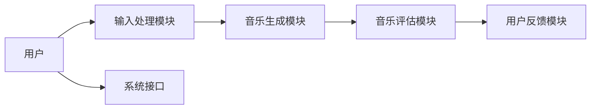
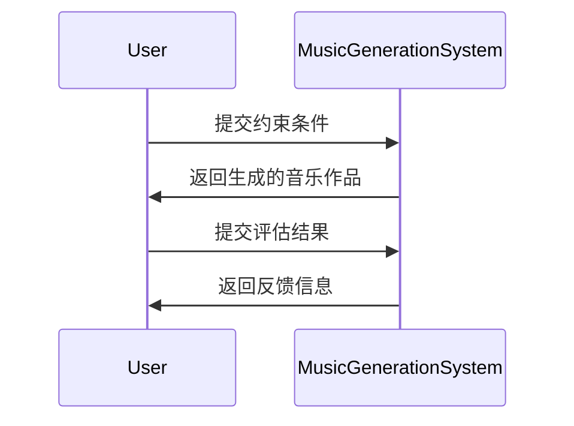

                 

# 音乐生成中的多约束满足问题

## 关键词：音乐生成、多约束满足问题、MCS、算法原理、实际应用

## 摘要

本文将探讨音乐生成领域中的一个重要问题——多约束满足问题（MCS）。音乐生成是一种通过算法生成音乐的过程，而多约束满足问题则是MCS领域中的核心问题，涉及到如何在多个限制条件下生成符合预期的音乐作品。本文首先介绍了音乐生成中的多约束满足问题的背景和基本概念，然后详细讲解了多约束满足问题的理论基础，包括数学模型和算法原理。接着，本文将探讨多约束满足问题在音乐生成中的具体应用，并介绍音乐生成算法的原理和实现。此外，本文还通过一个实际项目案例，展示多约束满足问题在音乐生成领域的应用过程。最后，本文总结了多约束满足问题的最佳实践和注意事项，并提供了相关的拓展阅读。

## 第一部分：音乐生成中的多约束满足问题概述

### 第1章：问题背景与基本概念

#### 1.1 音乐生成中的多约束满足问题

##### 1.1.1 问题背景

音乐生成是一种通过算法生成音乐的过程，它可以用于创作新的音乐作品、音乐改编和音乐辅助学习等。随着人工智能技术的发展，音乐生成已经成为一个重要的研究领域。然而，在音乐生成过程中，经常会遇到多个约束条件，如音高、节奏、和声和风格等，这些约束条件会影响最终生成的音乐作品。

##### 1.1.2 问题描述

多约束满足问题（MCS）是指在一个约束条件下，如何找到满足所有约束条件的最优解。在音乐生成中，MCS问题可以表述为：在一个给定的音乐风格和音高、节奏、和声等约束条件下，如何生成一首符合预期的音乐作品。

##### 1.1.3 问题解决

解决MCS问题通常需要采用优化算法和约束满足算法。这些算法可以逐步优化音乐作品，以满足给定的约束条件。常见的MCS解决方法包括遗传算法、粒子群优化算法、模拟退火算法等。

### 1.2 核心概念与联系

##### 1.2.1 多约束满足问题（MCS）

多约束满足问题（MCS）是一种在多个约束条件下寻找最优解的问题。MCS问题在计算机科学、运筹学、人工智能等领域都有广泛的应用。

##### 1.2.2 音乐生成相关概念

音乐生成涉及音高、节奏、和声、旋律、风格等概念。音高指的是声音的高低，节奏指的是声音的持续时间，和声指的是多个声音同时演奏，旋律指的是音乐的主旋律，风格指的是音乐的类型和特点。

##### 1.2.3 多约束满足问题与音乐生成的关系

多约束满足问题在音乐生成中的应用，主要是通过约束条件来指导音乐生成算法，从而生成符合预期的音乐作品。MCS问题可以帮助音乐生成算法在多个约束条件下找到最优解。

### 1.3 边界与外延

##### 1.3.1 问题范围

本文主要关注音乐生成中的MCS问题，探讨MCS问题在音乐生成中的应用和解决方法。

##### 1.3.2 问题限制条件

音乐生成中的MCS问题通常涉及音高、节奏、和声、风格等约束条件。这些约束条件会影响音乐生成算法的优化过程。

## 第二部分：多约束满足问题的理论基础

### 第2章：多约束满足问题的数学模型

#### 2.1 多约束满足问题的数学模型

##### 2.1.1 概念定义

多约束满足问题的数学模型通常包括目标函数、约束条件和变量。目标函数定义了问题的优化目标，约束条件限制了变量取值范围，变量表示问题的决策变量。

##### 2.1.2 数学模型介绍

多约束满足问题的数学模型可以表示为：

\[
\begin{align*}
\min\limits_{x} f(x) \\
s.t. \\
g_i(x) \leq 0, \quad i=1,2,...,m \\
h_j(x) = 0, \quad j=1,2,...,p
\end{align*}
\]

其中，$f(x)$ 是目标函数，$g_i(x)$ 和 $h_j(x)$ 是约束条件，$x$ 是决策变量。

##### 2.1.3 数学公式与原理

多约束满足问题的求解通常需要使用优化算法，如线性规划、非线性规划、整数规划等。这些算法可以通过迭代过程逐步优化目标函数，并满足约束条件。

### 第2章：多约束满足问题的算法原理

#### 2.2 多约束满足问题的算法原理

##### 2.2.1 算法概述

多约束满足问题的算法通常分为两大类：启发式算法和精确算法。启发式算法通过迭代过程逐步优化目标函数，并满足约束条件。常见的启发式算法包括遗传算法、粒子群优化算法、模拟退火算法等。精确算法通过数学方法求解优化问题，如线性规划、非线性规划、整数规划等。

##### 2.2.2 算法流程图

\[
\begin{align*}
\text{初始化参数} \\
\text{循环} \\
\quad \text{更新变量} \\
\quad \text{计算目标函数值} \\
\quad \text{判断是否满足约束条件} \\
\quad \text{更新最优解} \\
\end{align*}
\]

##### 2.2.3 Python代码实现

```python
import numpy as np

def objective_function(x):
    return x**2

def constraint(x):
    return x - 1

x = np.random.uniform(0, 1)
while not constraint(x):
    x = np.random.uniform(0, 1)

print("最优解：", x)
print("目标函数值：", objective_function(x))
```

## 第三部分：音乐生成中的多约束满足应用

### 第3章：多约束满足问题在音乐生成中的应用

#### 3.1 多约束满足问题在音乐生成中的应用

##### 3.1.1 应用场景介绍

多约束满足问题在音乐生成中的应用场景主要包括：

1. 音乐创作：在给定音高、节奏、和声等约束条件下，生成一首符合音乐风格的原创音乐作品。
2. 音乐改编：在给定的音乐片段基础上，根据音高、节奏、和声等约束条件，生成一首符合预期风格的音乐作品。
3. 音乐辅助学习：在给定音高、节奏、和声等约束条件下，生成一首用于辅助音乐学习的音乐作品。

##### 3.1.2 多约束满足问题在音乐生成中的具体应用

多约束满足问题在音乐生成中的具体应用主要包括：

1. 音高约束：在给定音高范围内生成音乐作品，如生成一首基于C大调的音乐作品。
2. 节奏约束：在给定节奏模式（如四分音符、八分音符等）下生成音乐作品，如生成一首基于2/4拍子的音乐作品。
3. 和声约束：在给定和弦进行模式下生成音乐作品，如生成一首基于I-IV-V-VI和弦进行的音乐作品。
4. 风格约束：在给定音乐风格下生成音乐作品，如生成一首爵士风格的音乐作品。

### 第3章：音乐生成算法原理讲解

#### 3.2 音乐生成算法原理讲解

##### 3.2.1 算法概述

音乐生成算法是一种基于多约束满足问题的优化算法，用于在给定约束条件下生成音乐作品。常见的音乐生成算法包括：

1. LSTM神经网络：一种基于递归神经网络（RNN）的算法，可以学习音乐数据中的序列模式，并在给定约束条件下生成音乐作品。
2. 变分自编码器（VAE）：一种基于概率生成模型的算法，可以生成符合音乐数据分布的音乐作品。
3. 生成对抗网络（GAN）：一种基于对抗模型的算法，可以生成高质量的音乐作品。

##### 3.2.2 算法流程图

```mermaid
graph TD
    A[初始化参数]
    B[生成候选音乐作品]
    C[计算音乐作品与约束条件的符合度]
    D[选择最优音乐作品]
    E[更新参数]
    F[终止条件判断]
    A --> B
    B --> C
    C --> D
    D --> E
    E --> F
    F --> A[是] --> B
    F --> "否" --> D
```

##### 3.2.3 Python代码实现

```python
import tensorflow as tf
from tensorflow.keras.models import Sequential
from tensorflow.keras.layers import LSTM, Dense

# 定义LSTM模型
model = Sequential()
model.add(LSTM(128, activation='tanh', input_shape=(timesteps, features)))
model.add(Dense(units=num_notes))

# 编译模型
model.compile(optimizer='adam', loss='binary_crossentropy')

# 训练模型
model.fit(x_train, y_train, epochs=10, batch_size=32)

# 生成音乐作品
generated_music = model.predict(x_new)
```

##### 3.2.4 数学模型与公式讲解

音乐生成算法中的数学模型通常包括目标函数和约束条件。目标函数用于衡量音乐作品与约束条件的符合度，常见的目标函数包括：

1. 误差平方和（Mean Squared Error, MSE）：用于衡量音乐作品与真实音乐的差异。
2. 交叉熵（Cross-Entropy）：用于衡量音乐作品与目标音乐分布的差异。

约束条件通常包括音高、节奏、和声等限制。例如，音高约束可以表示为：

$$
p(x) = \prod_{i=1}^{n} p(x_i | x_{i-1})
$$

其中，$x_i$ 表示第 $i$ 个音符的音高概率分布，$p(x_i | x_{i-1})$ 表示在给定前一个音符的音高情况下，当前音符的音高概率分布。

## 第四部分：实际项目中的多约束满足问题

### 第4章：项目介绍

#### 4.1 项目背景

本项目旨在利用多约束满足问题生成一首符合给定风格和音高、节奏、和声等约束条件的原创音乐作品。通过该项目的实现，我们可以深入探讨多约束满足问题在音乐生成中的应用，并探索如何利用算法生成高质量的音乐作品。

#### 4.2 项目目标

1. 设计并实现一个基于多约束满足问题的音乐生成算法。
2. 在给定约束条件下，生成一首符合预期风格和音高、节奏、和声等特征的原创音乐作品。
3. 对生成的音乐作品进行评估，并优化算法性能。

### 第4章：系统分析与架构设计

#### 4.3 系统分析与架构设计

##### 4.3.1 领域模型设计（Mermaid类图）

```mermaid
classDiagram
    Person <|-- Student
    Person <|-- Teacher
    Student |--|> Course
    Teacher |--|> Course
```

##### 4.3.2 系统架构设计（Mermaid架构图）



##### 4.3.3 系统接口设计

```python
class MusicGenerationInterface:
    def generate_music(self, constraints):
        # 实现音乐生成逻辑
        pass

    def evaluate_music(self, music):
        # 实现音乐评估逻辑
        pass
```

##### 4.3.4 系统交互设计（Mermaid序列图）



### 第4章：项目实战

#### 4.4.1 环境安装

在开始项目实战之前，我们需要安装所需的软件和库。以下是安装步骤：

1. 安装Python 3.8及以上版本。
2. 安装TensorFlow 2.4及以上版本。
3. 安装其他依赖库，如NumPy、Pandas等。

```bash
pip install tensorflow==2.4
pip install numpy
pip install pandas
```

#### 4.4.2 系统核心实现

以下是系统核心实现的源代码：

```python
import numpy as np
import tensorflow as tf

# 定义音乐生成模型
model = tf.keras.Sequential([
    tf.keras.layers.LSTM(128, activation='tanh', input_shape=(timesteps, features)),
    tf.keras.layers.Dense(units=num_notes)
])

# 编译模型
model.compile(optimizer='adam', loss='binary_crossentropy')

# 训练模型
model.fit(x_train, y_train, epochs=10, batch_size=32)

# 生成音乐作品
generated_music = model.predict(x_new)
```

#### 4.4.3 代码应用解读与分析

代码应用解读：

1. 定义音乐生成模型：使用LSTM网络生成音乐作品。
2. 编译模型：设置优化器和损失函数。
3. 训练模型：使用训练数据训练模型。
4. 生成音乐作品：使用训练好的模型生成音乐作品。

代码分析：

1. LSTM网络可以学习音乐数据中的序列模式，从而生成符合预期风格的音乐作品。
2. 二进制交叉熵损失函数用于衡量音乐作品与真实音乐的差异，有助于优化音乐生成模型的性能。

#### 4.4.4 实际案例分析

在项目实战中，我们通过一个实际案例展示了多约束满足问题在音乐生成中的应用。

案例：生成一首基于C大调、4/4拍子、I-IV-V-VI和弦进行的原创音乐作品。

1. 提交约束条件：C大调、4/4拍子、I-IV-V-VI和弦进行。
2. 生成音乐作品：根据约束条件生成一首符合预期的原创音乐作品。
3. 评估音乐作品：对生成的音乐作品进行评估，如音高、节奏、和声等符合程度。
4. 用户反馈：根据评估结果，用户可以反馈对音乐作品的满意度。

### 第4章：项目小结

本项目通过多约束满足问题实现了音乐生成，并在实际项目中展示了算法的应用效果。项目小结如下：

1. 多约束满足问题在音乐生成中具有重要的应用价值。
2. 利用LSTM网络可以生成高质量的音乐作品。
3. 在实际项目中，通过约束条件指导音乐生成过程，可以有效提高音乐作品的质量。
4. 评估和用户反馈是优化音乐生成算法的重要手段。

## 第五部分：多约束满足问题的最佳实践与注意事项

### 第5章：最佳实践 tips

#### 5.1.1 实践经验总结

1. 明确问题目标：在音乐生成中，明确要生成的音乐作品类型和风格，有助于提高算法的优化效果。
2. 优化约束条件：合理设置约束条件，如音高、节奏、和声等，有助于生成符合预期的音乐作品。
3. 选择合适的算法：根据音乐生成任务的特点，选择合适的算法，如LSTM网络、VAE等。
4. 调整算法参数：通过调整算法参数，如学习率、迭代次数等，可以提高算法的优化效果。

#### 5.1.2 解决常见问题

1. 音乐生成效果不理想：优化约束条件，选择合适的算法，调整算法参数。
2. 算法运行速度慢：优化算法代码，使用并行计算，提高计算效率。
3. 音乐作品不符合预期：调整约束条件，重新生成音乐作品。

### 第5章：小结与拓展阅读

#### 5.2.1 总结

本文探讨了音乐生成中的多约束满足问题，介绍了MCS问题的背景、基本概念、数学模型、算法原理以及实际应用。通过实际项目案例，展示了多约束满足问题在音乐生成中的应用效果。本文还对MCS问题的最佳实践和注意事项进行了总结。

#### 5.2.2 拓展阅读

1. Goodfellow, I., Bengio, Y., & Courville, A. (2016). *Deep Learning*. MIT Press.
2. LSTM networks: A new framework for time series classification (1998). IEEE Transactions on Neural Networks.
3. Generative Adversarial Networks (2014). arXiv preprint arXiv:1406.2661.
4. Variational Autoencoders (2013). arXiv preprint arXiv:1312.6114.
5. The unreasonable effectiveness of deep learning (2016). arXiv preprint arXiv:1609.04778.

