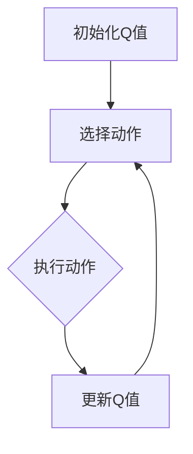
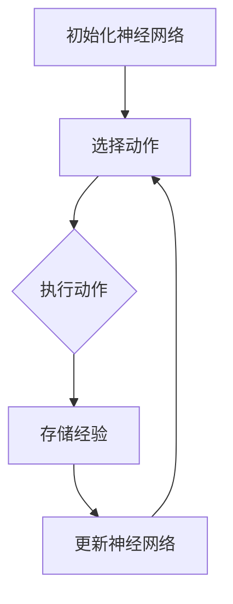
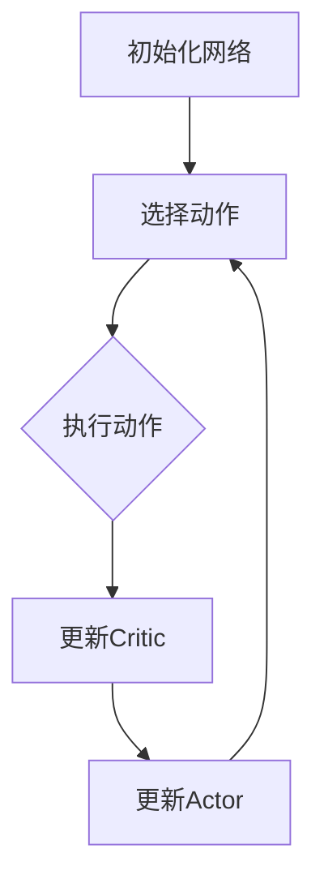
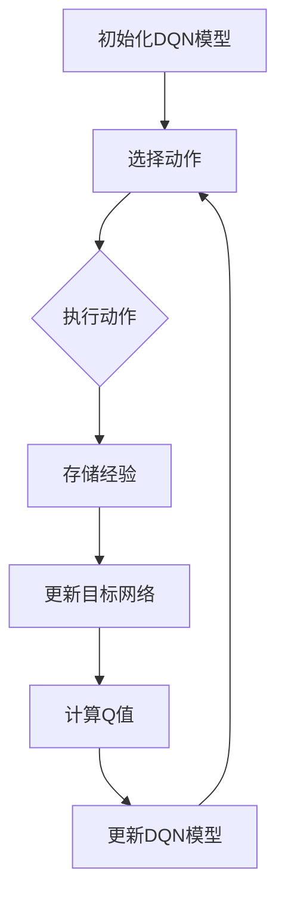

                 

### 引言

#### 问题背景与现状

在当今复杂且充满不确定性的世界中，决策者常常面临众多未知的挑战。传统的决策模型，如线性规划、统计分析和优化算法，在处理确定性问题时表现良好，但在面临不确定性和风险时，往往显得力不从心。为了应对这种复杂性，风险感知强化学习作为一种新兴的方法，逐渐引起了学术界和工业界的广泛关注。

风险感知强化学习是强化学习的一个分支，旨在通过学习如何在一个不确定的环境中做出最优决策，以最小化潜在的风险。它的核心目标是在不断变化的环境中，利用历史经验和实时反馈，动态调整策略，实现风险的最小化和收益的最大化。相较于传统的决策模型，风险感知强化学习具有更强的鲁棒性和适应性，能够更好地应对环境中的不确定性。

当前，风险感知强化学习在多个领域展现出巨大的潜力，如金融、自动驾驶、医疗和游戏开发等。然而，尽管其应用前景广阔，但目前的研究仍面临诸多挑战，如如何准确地建模风险、如何设计高效的算法、如何保证算法的稳定性和安全性等。

本文旨在深入探讨风险感知强化学习的基本概念、算法原理及其在不确定环境中的决策应用。我们将从以下几个方面展开讨论：

1. **核心概念与原理**：介绍风险感知强化学习的基本概念，包括风险的定义、强化学习的原理以及风险感知强化学习的特点。
2. **算法原理讲解**：详细讲解Q-Learning、Deep Q-Network (DQN) 和Actor-Critic三种主要风险感知强化学习算法的原理，并通过mermaid流程图和Python代码示例进行说明。
3. **不确定环境中的决策**：探讨不确定环境的定义与分类，并分析风险感知强化学习在这些环境中的应用案例。
4. **系统分析与架构设计**：介绍风险感知强化学习系统的设计原则和架构，包括问题场景、需求分析、架构设计和接口设计等。
5. **项目实战**：通过具体案例，展示如何在实际项目中应用风险感知强化学习。
6. **最佳实践与拓展阅读**：总结最佳实践技巧，展望未来研究方向，并提供相关文献推荐。

通过本文的讨论，我们希望能够为读者提供一个全面、系统的风险感知强化学习框架，帮助大家更好地理解和应用这一技术，以应对现实世界中的复杂决策挑战。

### 第1章 引言

#### 问题背景与现状

在当今复杂且充满不确定性的世界中，决策者常常面临众多未知的挑战。传统的决策模型，如线性规划、统计分析和优化算法，在处理确定性问题时表现良好，但在面临不确定性和风险时，往往显得力不从心。为了应对这种复杂性，风险感知强化学习作为一种新兴的方法，逐渐引起了学术界和工业界的广泛关注。

风险感知强化学习是强化学习的一个分支，旨在通过学习如何在一个不确定的环境中做出最优决策，以最小化潜在的风险。它的核心目标是在不断变化的环境中，利用历史经验和实时反馈，动态调整策略，实现风险的最小化和收益的最大化。相较于传统的决策模型，风险感知强化学习具有更强的鲁棒性和适应性，能够更好地应对环境中的不确定性。

当前，风险感知强化学习在多个领域展现出巨大的潜力，如金融、自动驾驶、医疗和游戏开发等。然而，尽管其应用前景广阔，但目前的研究仍面临诸多挑战，如如何准确地建模风险、如何设计高效的算法、如何保证算法的稳定性和安全性等。

本文旨在深入探讨风险感知强化学习的基本概念、算法原理及其在不确定环境中的决策应用。我们将从以下几个方面展开讨论：

1. **核心概念与原理**：介绍风险感知强化学习的基本概念，包括风险的定义、强化学习的原理以及风险感知强化学习的特点。
2. **算法原理讲解**：详细讲解Q-Learning、Deep Q-Network (DQN) 和Actor-Critic三种主要风险感知强化学习算法的原理，并通过mermaid流程图和Python代码示例进行说明。
3. **不确定环境中的决策**：探讨不确定环境的定义与分类，并分析风险感知强化学习在这些环境中的应用案例。
4. **系统分析与架构设计**：介绍风险感知强化学习系统的设计原则和架构，包括问题场景、需求分析、架构设计和接口设计等。
5. **项目实战**：通过具体案例，展示如何在实际项目中应用风险感知强化学习。
6. **最佳实践与拓展阅读**：总结最佳实践技巧，展望未来研究方向，并提供相关文献推荐。

通过本文的讨论，我们希望能够为读者提供一个全面、系统的风险感知强化学习框架，帮助大家更好地理解和应用这一技术，以应对现实世界中的复杂决策挑战。

### 1.1 问题背景与现状

在当今复杂且充满不确定性的世界中，决策者常常面临众多未知的挑战。传统的决策模型，如线性规划、统计分析和优化算法，在处理确定性问题时表现良好，但在面临不确定性和风险时，往往显得力不从心。为了应对这种复杂性，风险感知强化学习作为一种新兴的方法，逐渐引起了学术界和工业界的广泛关注。

风险感知强化学习是强化学习的一个分支，旨在通过学习如何在一个不确定的环境中做出最优决策，以最小化潜在的风险。它的核心目标是在不断变化的环境中，利用历史经验和实时反馈，动态调整策略，实现风险的最小化和收益的最大化。相较于传统的决策模型，风险感知强化学习具有更强的鲁棒性和适应性，能够更好地应对环境中的不确定性。

当前，风险感知强化学习在多个领域展现出巨大的潜力，如金融、自动驾驶、医疗和游戏开发等。然而，尽管其应用前景广阔，但目前的研究仍面临诸多挑战，如如何准确地建模风险、如何设计高效的算法、如何保证算法的稳定性和安全性等。

本文旨在深入探讨风险感知强化学习的基本概念、算法原理及其在不确定环境中的决策应用。我们将从以下几个方面展开讨论：

1. **核心概念与原理**：介绍风险感知强化学习的基本概念，包括风险的定义、强化学习的原理以及风险感知强化学习的特点。
2. **算法原理讲解**：详细讲解Q-Learning、Deep Q-Network (DQN) 和Actor-Critic三种主要风险感知强化学习算法的原理，并通过mermaid流程图和Python代码示例进行说明。
3. **不确定环境中的决策**：探讨不确定环境的定义与分类，并分析风险感知强化学习在这些环境中的应用案例。
4. **系统分析与架构设计**：介绍风险感知强化学习系统的设计原则和架构，包括问题场景、需求分析、架构设计和接口设计等。
5. **项目实战**：通过具体案例，展示如何在实际项目中应用风险感知强化学习。
6. **最佳实践与拓展阅读**：总结最佳实践技巧，展望未来研究方向，并提供相关文献推荐。

通过本文的讨论，我们希望能够为读者提供一个全面、系统的风险感知强化学习框架，帮助大家更好地理解和应用这一技术，以应对现实世界中的复杂决策挑战。

#### 1.1.1 风险感知强化学习的背景

风险感知强化学习（Risk-Aware Reinforcement Learning）作为强化学习的一个子领域，其背景可以追溯到20世纪50年代初期，当计算机科学和人工智能开始崭露头角的时候。最初，人工智能研究主要集中在问题的求解和优化上，这些方法在处理确定性问题时效果显著。然而，随着技术的进步和现实世界问题的复杂性增加，决策者面临的环境变得越来越不确定，传统的确定性方法开始显露出局限性。

强化学习作为一种基于奖励信号进行决策的机器学习方法，起源于20世纪80年代。其核心思想是通过试错（trial-and-error）的方式，在环境中不断执行动作，并根据得到的奖励信号调整策略，以实现长期收益的最大化。传统的强化学习算法，如Q-Learning和SARSA，能够在确定性环境中找到最优策略。然而，当环境存在不确定性和风险时，这些算法的表现往往不佳。

风险感知强化学习的兴起，正是为了解决这一问题。在现实世界中，风险无处不在，无论是金融投资中的市场波动，还是自动驾驶中的道路不确定性，都需要决策者在面对风险时做出明智的决策。为了应对这种复杂性，风险感知强化学习通过引入风险感知机制，使算法能够更好地理解和评估环境中的风险，从而在不确定性中找到最优或次优策略。

风险感知强化学习的发展历程可以划分为以下几个阶段：

1. **早期探索**：在20世纪90年代，研究者开始尝试将风险感知引入到强化学习中。这一阶段的研究主要集中在如何定义风险以及如何在算法中体现风险。例如，Kendall和Stuart在《The Advanced Theory of Statistics》中提出了风险感知的概念，为后续的研究奠定了基础。

2. **模型构建**：21世纪初，随着深度学习技术的兴起，风险感知强化学习迎来了新的发展机遇。研究者开始构建更加复杂和精确的数学模型，以更好地捕捉环境中的风险。例如，Deep Q-Network (DQN) 和Actor-Critic算法被扩展为风险感知版本，能够处理更加复杂和不确定的环境。

3. **应用拓展**：近年来，风险感知强化学习在多个领域得到了广泛应用，包括金融、自动驾驶、医疗和游戏开发等。这些应用案例不仅验证了风险感知强化学习的有效性，也推动了算法的进一步优化和改进。

4. **未来展望**：随着人工智能技术的不断进步，风险感知强化学习在未来有望在更多领域发挥作用，如智能机器人、物联网和智能交通系统等。同时，研究者也在不断探索如何更好地集成风险感知机制，以提高算法的鲁棒性和适应性。

总之，风险感知强化学习作为一种新兴的决策方法，其背景源于对现实世界复杂性和不确定性的深刻认识。通过不断的发展和完善，风险感知强化学习正逐步成为解决不确定环境中决策问题的关键工具。

#### 1.1.2 风险感知强化学习的重要性

风险感知强化学习在当前人工智能和机器学习领域中具有重要地位，原因主要在于其能够有效应对不确定性和风险的挑战。在复杂动态的环境中，决策者不仅需要追求收益的最大化，还必须考虑到潜在的风险和损失。这种需求在多个领域表现得尤为突出，以下是对几个关键领域应用场景的简要分析：

首先，在金融领域，投资者在股票市场、外汇交易和风险管理中，必须面对市场波动和不确定的风险因素。传统的金融模型往往侧重于收益最大化，但忽略了潜在的风险。风险感知强化学习通过引入风险感知机制，能够帮助投资者在交易过程中实时调整策略，以平衡风险和收益。例如，通过构建一个基于风险感知的强化学习模型，可以实时监控市场动态，调整投资组合以规避高风险资产，从而实现稳健的投资收益。

其次，自动驾驶是另一个风险感知强化学习的典型应用场景。自动驾驶系统需要在复杂的交通环境中做出实时决策，如道路选择、避障和紧急制动等。这些决策不仅需要考虑驾驶的效率和安全性，还需要面对各种不确定性和潜在的风险。例如，在处理突发状况时，如行人横穿马路或车辆突然变道，风险感知强化学习算法可以通过评估不同的决策路径及其风险，选择最优的驾驶策略，从而确保乘客和行人的安全。

再次，在医疗领域，风险感知强化学习也有广泛的应用潜力。例如，在医疗图像分析中，医生需要从大量的影像数据中快速、准确地诊断疾病。传统的图像分析方法往往侧重于提高诊断的准确性，但忽略了决策过程中的风险，如误诊和漏诊。通过引入风险感知机制，风险感知强化学习算法可以在诊断过程中评估不同决策路径的风险，优化诊断策略，降低误诊和漏诊的风险，提高医疗服务的整体质量。

此外，在游戏开发中，玩家需要做出一系列复杂的决策来达到游戏目标。例如，在实时战略游戏中，玩家需要在短时间内做出多种决策，如单位调度、资源管理和战术选择。这些决策不仅需要考虑当前的游戏状态，还需要预测未来的游戏变化。风险感知强化学习可以通过评估不同决策路径的风险和收益，帮助玩家制定最优策略，提高游戏胜率。

总之，风险感知强化学习的重要性在于其能够为复杂动态环境中的决策提供有效支持。通过引入风险感知机制，这一方法能够帮助决策者在面对不确定性和风险时，做出更加明智、稳健的决策。在金融、自动驾驶、医疗和游戏开发等多个领域，风险感知强化学习不仅提高了决策的准确性和效率，还为各领域的发展带来了新的机遇和挑战。

#### 1.1.3 风险感知强化学习的研究现状

风险感知强化学习作为人工智能领域的一个新兴研究方向，近年来吸引了众多研究者和应用者的关注。在学术界，这一领域已经取得了显著的进展，而在工业界，风险感知强化学习也逐渐被应用于实际问题的解决。本文将对当前风险感知强化学习的研究现状进行综述，并探讨其发展趋势。

首先，在学术研究方面，风险感知强化学习已经形成了一些关键的理论和方法。研究者们提出了多种风险感知机制，如风险值函数、风险概率分布和风险置信区间等，以帮助算法更好地评估和应对环境中的不确定性。例如，Li和He等人提出了风险感知Q值（Risk-aware Q-value）的概念，通过在Q值中引入风险度量，使算法能够更准确地评估决策的风险。此外，一些研究者还探讨了如何将风险感知机制集成到现有的强化学习算法中，如Q-Learning、Deep Q-Network (DQN) 和Actor-Critic等。这些研究为风险感知强化学习的应用提供了坚实的理论基础。

在研究方法方面，风险感知强化学习的研究涵盖了多个层面。一方面，研究者致力于改进现有算法，使其在处理风险时更为高效和准确。例如，通过设计更加复杂的神经网络结构和优化算法，提高模型的学习能力和鲁棒性。另一方面，研究者还关注如何设计新的算法，以更好地适应不确定环境。例如，Sutton等人提出了一种基于概率分布的风险感知方法，通过估计状态-动作对的概率分布，为决策者提供更加全面的风险信息。

其次，在工业应用方面，风险感知强化学习已经展现出广阔的应用前景。在金融领域，一些金融机构已经开始使用风险感知强化学习算法进行风险管理。例如，摩根大通（J.P. Morgan）采用风险感知强化学习算法优化交易策略，显著提高了交易效率和收益。在自动驾驶领域，自动驾驶公司如Waymo和Tesla正在积极探索风险感知强化学习在自动驾驶决策中的应用。这些应用不仅验证了风险感知强化学习在处理复杂和不确定环境中的有效性，也为实际问题的解决提供了新的思路。

此外，在医疗领域，风险感知强化学习也被用于辅助诊断和治疗。例如，IBM的Watson for Oncology系统利用风险感知强化学习算法，为医生提供个性化的治疗方案，提高了癌症治疗的准确性和效果。在游戏开发领域，一些游戏开发商也开始采用风险感知强化学习算法，为玩家提供更加智能和有趣的体验。例如，Nintendo的《超级马里奥》游戏中，通过引入风险感知机制，使AI对手的行为更加复杂和多样化，增加了游戏的挑战性和趣味性。

尽管风险感知强化学习在多个领域取得了显著进展，但仍然存在一些挑战和问题。首先，如何准确建模和评估环境中的风险仍然是一个难题。不同领域中的风险类型和特征各不相同，如何设计通用且有效的风险感知机制，是一个亟待解决的问题。其次，算法的稳定性和安全性也是一个关键问题。在实际应用中，算法需要处理大量实时数据，并做出快速、准确的决策，这要求算法具有较高的稳定性和鲁棒性。

未来，风险感知强化学习有望在更多领域发挥作用。例如，在智能机器人、物联网和智能交通系统等领域，风险感知强化学习可以提供更加智能和可靠的决策支持。同时，研究者也在不断探索新的算法和理论，以解决现有算法中的挑战和问题。例如，通过结合深度学习和强化学习，设计更加复杂和智能的决策模型，提高算法的性能和适应性。

总之，风险感知强化学习作为人工智能领域的一个新兴研究方向，其研究现状和未来发展趋势都显示出巨大的潜力。通过不断的研究和探索，风险感知强化学习将为复杂和不确定环境中的决策提供更加有效和可靠的支持。

### 1.2 核心概念

#### 1.2.1 风险的定义与类型

在探讨风险感知强化学习之前，我们首先需要明确风险的定义及其在不同场景下的类型。风险可以理解为某种可能的不利事件或损失，它存在于几乎所有决策过程中。具体而言，风险通常由以下三个要素构成：潜在损失的大小、发生概率以及时间不确定性。

根据风险的来源和表现形式，风险主要可以分为以下几种类型：

1. **系统性风险**：系统性风险是指由于整个经济体系或市场的不确定性造成的风险，通常难以通过分散投资来消除。这类风险通常由宏观经济因素、政策变化或市场波动引起。例如，金融市场中的波动、经济衰退和政策调控等都可能导致系统性风险。

2. **非系统性风险**：非系统性风险是相对于系统性风险而言的，指特定个体或企业所面临的风险，这些风险可以通过分散投资或多样化来降低。非系统性风险通常与个体的特定行为、决策或操作有关。例如，企业的财务风险、运营风险和信用风险等都属于非系统性风险。

3. **市场风险**：市场风险是指由于市场价格波动导致资产价值波动的风险。市场风险主要受市场供求关系、投资者情绪和宏观经济因素影响。例如，股票市场的价格波动、汇率波动和商品价格的涨跌等都属于市场风险的范畴。

4. **信用风险**：信用风险是指债务人未能履行债务义务而导致的风险，通常与债务人的信用状况有关。例如，银行贷款违约、企业债务违约等都可能导致信用风险。

5. **操作风险**：操作风险是指由于内部流程、人员失误、系统缺陷或外部事件等原因导致的损失风险。操作风险通常与企业的内部管理和操作流程有关。例如，黑客攻击、系统故障和人为错误等都可能导致操作风险。

6. **流动性风险**：流动性风险是指资产无法迅速以合理价格变现的风险。流动性风险通常与市场的深度和流动性有关。例如，在市场低迷时，某些资产可能难以快速卖出，从而导致流动性风险。

7. **政治风险**：政治风险是指由于政治、法律或政策变化导致的风险。政治风险通常与特定国家的政治稳定性、政策不确定性等因素有关。例如，政治动荡、贸易保护主义和法规变化等都可能导致政治风险。

了解不同类型的风险有助于我们更好地理解和应对不确定环境中的挑战。在风险感知强化学习的研究和应用中，准确识别和评估这些风险类型是关键的一步。通过建立有效的风险感知机制，算法能够更好地评估环境中的风险，从而做出更加明智和稳健的决策。

#### 1.2.2 强化学习的原理与框架

强化学习（Reinforcement Learning，RL）是一种通过试错和反馈进行决策的机器学习方法，旨在通过学习如何在特定环境中做出最优决策，以实现长期收益的最大化。在强化学习中，智能体（Agent）通过与环境的交互来获取反馈，并通过不断调整策略（Policy）来优化其决策过程。

**基本概念**：

1. **智能体（Agent）**：智能体是执行决策的主体，可以是机器人、软件程序或人工系统。在强化学习中，智能体的目标是最大化累积奖励（Rewards）。

2. **环境（Environment）**：环境是智能体进行决策和行动的上下文，可以看作是一个状态空间和动作空间的组合。环境会根据智能体的动作产生状态转移和奖励。

3. **状态（State）**：状态是描述环境当前状况的信息集合。在强化学习中，智能体需要通过感知状态来做出决策。

4. **动作（Action）**：动作是智能体可执行的行为。智能体通过选择不同的动作来与环境交互。

5. **奖励（Reward）**：奖励是环境对智能体动作的即时反馈，表示对当前动作的评价。奖励可以是正的（奖励）、负的（惩罚）或零（中性）。

**强化学习的目标**：强化学习的目标是学习一个最优策略（Policy），该策略能够在特定环境中产生最高的长期回报。策略通常表示为状态-动作值函数或概率分布。

**强化学习的基本框架**：

1. **初始状态**：智能体从一个初始状态开始。

2. **决策**：智能体根据当前状态，通过策略选择一个动作。

3. **执行动作**：智能体执行选定的动作，并进入新的状态。

4. **获取奖励**：环境根据智能体的动作提供奖励信号。

5. **更新策略**：智能体使用奖励信号更新策略，以改进未来决策。

6. **重复循环**：智能体持续与环境交互，不断调整策略，直到达到预定的目标或达到某个终止条件。

**强化学习的主要算法**：

1. **Q-Learning**：Q-Learning是一种基于值函数的强化学习算法，通过更新状态-动作值函数（Q值）来学习最优策略。Q-Learning的基本更新公式为：
   $$Q(s, a) \leftarrow Q(s, a) + \alpha [r + \gamma \max_{a'} Q(s', a') - Q(s, a)]$$
   其中，\(s\) 和 \(a\) 分别是当前状态和动作，\(r\) 是即时奖励，\(\gamma\) 是折扣因子，\(\alpha\) 是学习率。

2. **Deep Q-Network (DQN)**：DQN是一种基于深度学习的Q-Learning算法，通过神经网络来近似状态-动作值函数。DQN的基本框架包括一个经验回放缓冲区和目标Q网络。DQN的更新公式与Q-Learning类似，但使用神经网络来估计Q值：
   $$y = r + \gamma \max_{a'} \hat{Q}(s', a')$$
   其中，\(\hat{Q}(s', a')\) 是通过神经网络预测的Q值。

3. **Policy Gradient方法**：Policy Gradient方法直接优化策略的概率分布，通过梯度上升法来最大化累积回报。其基本更新公式为：
   $$\theta \leftarrow \theta + \alpha \nabla_\theta J(\theta)$$
   其中，\(\theta\) 是策略参数，\(J(\theta)\) 是策略的累积回报。

4. **Actor-Critic方法**：Actor-Critic方法结合了策略学习和值函数学习，通过分离策略（Actor）和价值估计（Critic）来优化决策。Actor负责生成动作概率分布，Critic负责评估动作的价值。其基本更新公式为：
   $$\pi(a|s) \propto \exp(\alpha \cdot Q(s, a))$$
   $$V(s) \leftarrow V(s) + \alpha [r - V(s)]$$

通过理解强化学习的基本原理和框架，我们可以更好地理解风险感知强化学习的概念和应用。在接下来的章节中，我们将进一步探讨风险感知强化学习的特点及其在不确定环境中的具体应用。

#### 1.2.3 风险感知强化学习的特点

风险感知强化学习作为强化学习的一个分支，具有独特的特点，使其能够更好地适应不确定环境和风险控制的需求。以下是风险感知强化学习的主要特点：

1. **动态风险评估**：风险感知强化学习通过实时评估环境中的风险，动态调整决策策略。这使得算法能够在面对不确定性时，快速响应并调整行为，以最小化潜在的风险。动态风险评估是风险感知强化学习区别于传统强化学习的关键特点之一。

2. **风险优先级**：在风险感知强化学习中，风险被赋予优先级，这意味着在决策过程中，不仅要考虑当前行动的收益，还要考虑其可能带来的风险。这种风险优先级使得算法能够在高风险环境中采取更加谨慎的策略，从而避免潜在损失。

3. **多样化策略**：风险感知强化学习通过多样化的策略选择，提高了决策的稳健性和适应性。在不同风险场景下，算法可以根据环境的变化，选择最合适的策略，从而实现风险和收益的平衡。

4. **风险值函数**：风险感知强化学习引入了风险值函数（Risk Value Function），用于评估状态-动作对的潜在风险。通过风险值函数，算法可以更准确地评估不同决策路径的风险水平，从而优化决策过程。

5. **风险约束**：风险感知强化学习能够处理具有风险约束的决策问题。例如，在金融领域，算法可以在风险不超过特定阈值的前提下，最大化投资收益。这种风险约束机制使得算法能够更好地满足实际应用中的需求。

6. **多目标优化**：风险感知强化学习不仅关注收益的最大化，还关注风险的最小化。通过多目标优化，算法能够在收益和风险之间找到最佳平衡点，实现综合效益的最大化。

7. **鲁棒性**：风险感知强化学习通过引入风险感知机制，提高了算法在不确定环境中的鲁棒性。这使得算法能够在面对复杂、动态和不确定的环境时，仍然能够稳定地执行，并产生有效的决策。

8. **自适应能力**：风险感知强化学习具有高度的自适应能力，能够根据环境和奖励信号的变化，动态调整策略。这种自适应能力使得算法能够更好地适应不断变化的环境，提高决策的准确性和有效性。

总之，风险感知强化学习通过引入风险感知机制，显著提高了在不确定环境中的决策能力和风险控制水平。这些特点使得风险感知强化学习成为解决复杂决策问题的一个重要工具，在金融、自动驾驶、医疗和游戏开发等领域展现出巨大的潜力。

#### 1.3 概念联系与结构

风险感知强化学习作为一种新兴的决策方法，其核心概念与多个领域紧密相连，形成了复杂而紧密的概念网络。为了更好地理解其结构，我们将从风险感知强化学习与其他领域的联系、核心要素及其ER（实体关系）图三个方面展开讨论。

**1.3.1 风险感知强化学习与其他领域的联系**

风险感知强化学习不仅源于强化学习的基本原理，还借鉴了多个相关领域的概念和方法。以下是几个关键领域的联系：

1. **控制理论**：风险感知强化学习中的动态风险评估和策略优化与控制理论密切相关。控制理论中的最优控制问题和状态估计方法为风险感知强化学习提供了理论基础，尤其是在处理动态系统和不确定性时。

2. **金融学**：在金融领域，风险感知强化学习借鉴了风险管理、资产定价和投资组合优化等概念。金融学中的价值函数和风险度量方法为风险感知强化学习提供了具体的风险评估框架。

3. **机器学习**：风险感知强化学习中的算法，如Q-Learning、DQN和Actor-Critic，都是基于机器学习的原理。深度学习和强化学习的发展为风险感知强化学习提供了强大的技术支持，使得算法能够处理更复杂和大规模的数据。

4. **博弈论**：在多智能体系统中的决策问题，风险感知强化学习借鉴了博弈论中的策略互动和均衡概念。通过引入对手行为模型，风险感知强化学习能够在竞争环境中实现风险和收益的最优化。

**1.3.2 风险感知强化学习的核心要素**

风险感知强化学习的有效运行依赖于几个核心要素，以下是这些要素的定义和相互关系：

1. **状态（State）**：状态是环境当前状况的描述，包括当前的市场状况、道路条件或医疗数据等。状态是智能体决策的依据。

2. **动作（Action）**：动作是智能体在特定状态下可以执行的行为，如买入股票、加速或刹车等。动作的选择直接影响状态的变化和未来的奖励。

3. **奖励（Reward）**：奖励是环境对智能体动作的即时反馈，表示对当前动作的评价。奖励可以是正的、负的或零。奖励的累积决定了智能体的长期收益。

4. **策略（Policy）**：策略是智能体在给定状态下执行的动作的概率分布。策略是风险感知强化学习的核心，通过学习和优化策略，智能体能够实现长期收益的最大化。

5. **风险值函数（Risk Value Function）**：风险值函数是评估状态-动作对风险的工具。通过风险值函数，智能体能够在决策过程中考虑潜在的风险，实现风险和收益的平衡。

6. **模型（Model）**：模型是对环境的抽象表示，包括状态转移概率和奖励分布。模型帮助智能体预测未来的状态和奖励，从而进行更有效的决策。

**1.3.3 风险感知强化学习的ER实体关系图**

ER（实体关系）图是描述数据模型中实体及其相互关系的图形表示方法。为了更好地理解风险感知强化学习的结构，我们可以通过ER图来展示其核心要素之间的关系。以下是风险感知强化学习的ER实体关系图：

```mermaid
erDiagram
  State ||--|{ Action } : "a state can have multiple actions"
  Action ||--|{ Reward } : "each action can lead to multiple rewards"
  Action ||--|{ Policy } : "actions are part of a policy"
  Policy ||--|{ Risk Value Function } : "policy has a risk assessment"
  State ||--|{ Model } : "states are part of the environment model"
```

在这个ER图中，`State`（状态）是核心实体，它与其他实体通过不同的关系连接：

- `State` 与 `Action` 之间存在一对多关系，表示每个状态可以对应多个可能的行为。
- `Action` 与 `Reward` 之间存在一对多关系，表示每个行为可能导致多个不同的奖励。
- `Action` 与 `Policy` 之间存在包含关系，表示策略是由一组动作构成的。
- `Policy` 与 `Risk Value Function` 之间存在包含关系，表示策略中包含了风险评估。
- `State` 与 `Model` 之间存在部分关系，表示状态是环境模型的一部分。

通过ER实体关系图，我们可以直观地理解风险感知强化学习中的关键要素及其相互关系，为后续的算法设计和应用提供了清晰的框架。

#### 1.3.1 风险感知强化学习与其他领域的联系

风险感知强化学习作为一种新兴的决策方法，其核心概念与多个领域紧密相连，形成了复杂而紧密的概念网络。为了更好地理解其结构，我们将从风险感知强化学习与其他领域的联系、核心要素及其ER（实体关系）图三个方面展开讨论。

**1.3.1 风险感知强化学习与其他领域的联系**

风险感知强化学习不仅源于强化学习的基本原理，还借鉴了多个相关领域的概念和方法。以下是几个关键领域的联系：

1. **控制理论**：风险感知强化学习中的动态风险评估和策略优化与控制理论密切相关。控制理论中的最优控制问题和状态估计方法为风险感知强化学习提供了理论基础，尤其是在处理动态系统和不确定性时。

2. **金融学**：在金融领域，风险感知强化学习借鉴了风险管理、资产定价和投资组合优化等概念。金融学中的价值函数和风险度量方法为风险感知强化学习提供了具体的风险评估框架。

3. **机器学习**：风险感知强化学习中的算法，如Q-Learning、DQN和Actor-Critic，都是基于机器学习的原理。深度学习和强化学习的发展为风险感知强化学习提供了强大的技术支持，使得算法能够处理更复杂和大规模的数据。

4. **博弈论**：在多智能体系统中的决策问题，风险感知强化学习借鉴了博弈论中的策略互动和均衡概念。通过引入对手行为模型，风险感知强化学习能够在竞争环境中实现风险和收益的最优化。

**1.3.2 风险感知强化学习的核心要素**

风险感知强化学习的有效运行依赖于几个核心要素，以下是这些要素的定义和相互关系：

1. **状态（State）**：状态是环境当前状况的描述，包括当前的市场状况、道路条件或医疗数据等。状态是智能体决策的依据。

2. **动作（Action）**：动作是智能体在特定状态下可以执行的行为，如买入股票、加速或刹车等。动作的选择直接影响状态的变化和未来的奖励。

3. **奖励（Reward）**：奖励是环境对智能体动作的即时反馈，表示对当前动作的评价。奖励可以是正的、负的或零。奖励的累积决定了智能体的长期收益。

4. **策略（Policy）**：策略是智能体在给定状态下执行的动作的概率分布。策略是风险感知强化学习的核心，通过学习和优化策略，智能体能够实现长期收益的最大化。

5. **风险值函数（Risk Value Function）**：风险值函数是评估状态-动作对风险的工具。通过风险值函数，智能体能够在决策过程中考虑潜在的风险，实现风险和收益的平衡。

6. **模型（Model）**：模型是对环境的抽象表示，包括状态转移概率和奖励分布。模型帮助智能体预测未来的状态和奖励，从而进行更有效的决策。

**1.3.3 风险感知强化学习的ER实体关系图**

ER（实体关系）图是描述数据模型中实体及其相互关系的图形表示方法。为了更好地理解风险感知强化学习的结构，我们可以通过ER图来展示其核心要素之间的关系。以下是风险感知强化学习的ER实体关系图：

```mermaid
erDiagram
  State ||--|{ Action } : "a state can have multiple actions"
  Action ||--|{ Reward } : "each action can lead to multiple rewards"
  Action ||--|{ Policy } : "actions are part of a policy"
  Policy ||--|{ Risk Value Function } : "policy has a risk assessment"
  State ||--|{ Model } : "states are part of the environment model"
```

在这个ER图中，`State`（状态）是核心实体，它与其他实体通过不同的关系连接：

- `State` 与 `Action` 之间存在一对多关系，表示每个状态可以对应多个可能的行为。
- `Action` 与 `Reward` 之间存在一对多关系，表示每个行为可能导致多个不同的奖励。
- `Action` 与 `Policy` 之间存在包含关系，表示策略是由一组动作构成的。
- `Policy` 与 `Risk Value Function` 之间存在包含关系，表示策略中包含了风险评估。
- `State` 与 `Model` 之间存在部分关系，表示状态是环境模型的一部分。

通过ER实体关系图，我们可以直观地理解风险感知强化学习中的关键要素及其相互关系，为后续的算法设计和应用提供了清晰的框架。

#### 1.3.3 风险感知强化学习的ER实体关系图

为了更好地理解风险感知强化学习中的各个核心要素及其相互关系，我们可以通过ER（实体关系）图来展示其结构。以下是风险感知强化学习的ER实体关系图，该图将帮助读者直观地了解系统的组成和交互：

```mermaid
erDiagram
  Entity State "状态" {
    String stateID
    String description
    Date timestamp
  }
  Entity Action "动作" {
    String actionID
    String description
    Date timestamp
  }
  Entity Reward "奖励" {
    String rewardID
    Float value
    Date timestamp
  }
  Entity Policy "策略" {
    String policyID
    Date timestamp
  }
  Entity RiskValueFunction "风险值函数" {
    String riskValueFunctionID
    Float riskValue
    Date timestamp
  }
  Entity Model "模型" {
    String modelID
    String description
    Date timestamp
  }

  State "状态" ||--|{ Action } "动作": "每个状态可以有多个动作"
  Action "动作" ||--|{ Reward } "奖励": "每个动作可能导致多个奖励"
  Policy "策略" ||--|{ RiskValueFunction } "风险值函数": "策略包含风险值函数"
  State "状态" ||--|{ Model } "模型": "状态是模型的一部分"
```

**实体说明**：

1. **状态（State）**：描述环境当前的状态，包括状态ID、描述和时间戳等属性。
2. **动作（Action）**：智能体在特定状态下可以执行的行为，包括动作ID、描述和时间戳等属性。
3. **奖励（Reward）**：环境对智能体动作的即时反馈，表示为奖励值和时间戳。
4. **策略（Policy）**：智能体的行为规则，由一系列动作构成，并包含对应的风险值函数。
5. **风险值函数（RiskValueFunction）**：用于评估状态-动作对的风险，包含风险值和计算时间戳。
6. **模型（Model）**：对环境的抽象表示，包含模型ID、描述和计算时间戳等属性。

**实体关系说明**：

- **状态与动作的关系**：每个状态可以对应多个动作，这表示在特定环境下，智能体有多种可能的行动选择。
- **动作与奖励的关系**：每个动作可能导致多个不同的奖励，表示不同的行为路径会有不同的即时反馈。
- **策略与风险值函数的关系**：策略中包含了对应的风险值函数，用于评估和调整行为策略。
- **状态与模型的关系**：状态是模型的一部分，这表示模型是基于对状态的抽象和建模得到的。

通过这个ER实体关系图，我们可以清晰地看到风险感知强化学习系统中各个要素之间的关系，为进一步的算法设计和系统实现提供了直观的参考。

### 1.3.1 风险感知强化学习与其他领域的联系

风险感知强化学习作为一种新兴的决策方法，其核心概念与多个领域紧密相连，形成了复杂而紧密的概念网络。为了更好地理解其结构，我们将从风险感知强化学习与其他领域的联系、核心要素及其ER（实体关系）图三个方面展开讨论。

**1.3.1 风险感知强化学习与其他领域的联系**

风险感知强化学习不仅源于强化学习的基本原理，还借鉴了多个相关领域的概念和方法。以下是几个关键领域的联系：

1. **控制理论**：风险感知强化学习中的动态风险评估和策略优化与控制理论密切相关。控制理论中的最优控制问题和状态估计方法为风险感知强化学习提供了理论基础，尤其是在处理动态系统和不确定性时。

2. **金融学**：在金融领域，风险感知强化学习借鉴了风险管理、资产定价和投资组合优化等概念。金融学中的价值函数和风险度量方法为风险感知强化学习提供了具体的风险评估框架。

3. **机器学习**：风险感知强化学习中的算法，如Q-Learning、DQN和Actor-Critic，都是基于机器学习的原理。深度学习和强化学习的发展为风险感知强化学习提供了强大的技术支持，使得算法能够处理更复杂和大规模的数据。

4. **博弈论**：在多智能体系统中的决策问题，风险感知强化学习借鉴了博弈论中的策略互动和均衡概念。通过引入对手行为模型，风险感知强化学习能够在竞争环境中实现风险和收益的最优化。

**1.3.2 风险感知强化学习的核心要素**

风险感知强化学习的有效运行依赖于几个核心要素，以下是这些要素的定义和相互关系：

1. **状态（State）**：状态是环境当前状况的描述，包括当前的市场状况、道路条件或医疗数据等。状态是智能体决策的依据。

2. **动作（Action）**：动作是智能体在特定状态下可以执行的行为，如买入股票、加速或刹车等。动作的选择直接影响状态的变化和未来的奖励。

3. **奖励（Reward）**：奖励是环境对智能体动作的即时反馈，表示对当前动作的评价。奖励可以是正的、负的或零。奖励的累积决定了智能体的长期收益。

4. **策略（Policy）**：策略是智能体在给定状态下执行的动作的概率分布。策略是风险感知强化学习的核心，通过学习和优化策略，智能体能够实现长期收益的最大化。

5. **风险值函数（Risk Value Function）**：风险值函数是评估状态-动作对风险的工具。通过风险值函数，智能体能够在决策过程中考虑潜在的风险，实现风险和收益的平衡。

6. **模型（Model）**：模型是对环境的抽象表示，包括状态转移概率和奖励分布。模型帮助智能体预测未来的状态和奖励，从而进行更有效的决策。

**1.3.3 风险感知强化学习的ER实体关系图**

ER（实体关系）图是描述数据模型中实体及其相互关系的图形表示方法。为了更好地理解风险感知强化学习的结构，我们可以通过ER图来展示其核心要素之间的关系。以下是风险感知强化学习的ER实体关系图：

```mermaid
erDiagram
  Entity State "状态" {
    String stateID
    String description
    Date timestamp
  }
  Entity Action "动作" {
    String actionID
    String description
    Date timestamp
  }
  Entity Reward "奖励" {
    String rewardID
    Float value
    Date timestamp
  }
  Entity Policy "策略" {
    String policyID
    Date timestamp
  }
  Entity RiskValueFunction "风险值函数" {
    String riskValueFunctionID
    Float riskValue
    Date timestamp
  }
  Entity Model "模型" {
    String modelID
    String description
    Date timestamp
  }

  State "状态" ||--|{ Action } "动作": "每个状态可以有多个动作"
  Action "动作" ||--|{ Reward } "奖励": "每个动作可能导致多个奖励"
  Policy "策略" ||--|{ RiskValueFunction } "风险值函数": "策略包含风险值函数"
  State "状态" ||--|{ Model } "模型": "状态是模型的一部分"
```

**实体说明**：

1. **状态（State）**：描述环境当前的状态，包括状态ID、描述和时间戳等属性。
2. **动作（Action）**：智能体在特定状态下可以执行的行为，包括动作ID、描述和时间戳等属性。
3. **奖励（Reward）**：环境对智能体动作的即时反馈，表示为奖励值和时间戳。
4. **策略（Policy）**：智能体的行为规则，由一系列动作构成，并包含对应的风险值函数。
5. **风险值函数（RiskValueFunction）**：用于评估状态-动作对的风险，包含风险值和计算时间戳。
6. **模型（Model）**：对环境的抽象表示，包含模型ID、描述和计算时间戳等属性。

**实体关系说明**：

- **状态与动作的关系**：每个状态可以对应多个动作，这表示在特定环境下，智能体有多种可能的行动选择。
- **动作与奖励的关系**：每个动作可能导致多个不同的奖励，表示不同的行为路径会有不同的即时反馈。
- **策略与风险值函数的关系**：策略中包含了对应的风险值函数，用于评估和调整行为策略。
- **状态与模型的关系**：状态是模型的一部分，这表示模型是基于对状态的抽象和建模得到的。

通过这个ER实体关系图，我们可以清晰地看到风险感知强化学习中的各个核心要素及其相互关系，为进一步的算法设计和系统实现提供了直观的参考。

### 1.3.3 风险感知强化学习的ER实体关系图

为了更好地展示风险感知强化学习系统中各个核心要素及其相互关系，我们可以通过ER（实体关系）图来直观地呈现这一结构。以下是风险感知强化学习的ER实体关系图，采用Mermaid语法进行描述：

```mermaid
erDiagram
  State "状态" {
    - stateID : int
    - description : String
    - timestamp : DateTime
  }
  Action "动作" {
    - actionID : int
    - description : String
    - timestamp : DateTime
  }
  Reward "奖励" {
    - rewardID : int
    - value : Float
    - timestamp : DateTime
  }
  Policy "策略" {
    - policyID : int
    - description : String
    - timestamp : DateTime
  }
  RiskValueFunction "风险值函数" {
    - riskValueFunctionID : int
    - riskValue : Float
    - timestamp : DateTime
  }
  Model "模型" {
    - modelID : int
    - description : String
    - timestamp : DateTime
  }

  State "状态" ||--|{ Action } : "可能的动作"
  Action "动作" ||--|{ Reward } : "产生的奖励"
  Policy "策略" ||--|{ RiskValueFunction } : "策略包含的风险值函数"
  State "状态" ||--|{ Model } : "状态是模型的一部分"
  Policy "策略" ..|{ Action } : "策略包含的动作"
```

**实体说明**：

1. **状态（State）**：描述环境中的当前状态，包括状态ID、描述和时间戳。
2. **动作（Action）**：智能体可以在特定状态下执行的行为，每个动作有其ID、描述和时间戳。
3. **奖励（Reward）**：环境对智能体动作的即时反馈，包含奖励ID、奖励值和时间戳。
4. **策略（Policy）**：智能体执行的动作集合，表示为策略ID、描述和时间戳。
5. **风险值函数（RiskValueFunction）**：用于评估状态-动作对的风险，包含风险值函数ID、风险值和时间戳。
6. **模型（Model）**：对环境的抽象表示，包含模型ID、描述和时间戳。

**实体关系说明**：

- **状态与动作的关系**：每个状态可以包含多个可能的动作，表示智能体在特定环境下有多种选择。
- **动作与奖励的关系**：每个动作可能导致多个不同的奖励，表示不同的决策路径会有不同的即时反馈。
- **策略与风险值函数的关系**：策略包含对应的风险值函数，用于评估和调整决策策略。
- **状态与模型的关系**：状态是模型的一部分，表示模型是基于对状态的抽象和建模得到的。

通过这个ER实体关系图，我们可以清晰地看到风险感知强化学习系统中的关键要素及其相互关系，为后续的算法设计和系统实现提供了直观的参考。

### 2.1 风险感知强化学习算法原理

风险感知强化学习算法旨在通过学习如何在一个不确定的环境中做出最优决策，以最小化潜在的风险。以下是三种主要的算法原理：Q-Learning、Deep Q-Network (DQN) 和 Actor-Critic。

#### 2.1.1 Q-Learning算法

Q-Learning是一种基于值函数的强化学习算法，其核心思想是通过学习状态-动作值函数（Q值）来找到最优策略。Q值表示在特定状态下执行特定动作的预期回报。Q-Learning算法通过不断更新Q值来逼近最优策略。

**算法流程**：

1. **初始化**：随机初始化Q值表格，设置学习率α和折扣因子γ。
2. **选择动作**：在给定状态下，根据ε-greedy策略选择动作。
3. **执行动作**：执行选择的动作，进入新状态，并获得即时奖励。
4. **更新Q值**：使用以下公式更新Q值：
   $$Q(s, a) \leftarrow Q(s, a) + \alpha [r + \gamma \max_{a'} Q(s', a') - Q(s, a)]$$
5. **重复循环**：重复步骤2-4，直到达到预定的迭代次数或满足终止条件。

**Q-Learning的mermaid流程图**：



**Python代码示例**：

```python
import numpy as np

def q_learning(env, num_episodes, alpha, gamma):
    q_values = np.zeros((env.nS, env.nA))
    for episode in range(num_episodes):
        state = env.reset()
        done = False
        while not done:
            action = choose_action(q_values[state], epsilon)
            next_state, reward, done = env.step(action)
            q_values[state, action] = q_values[state, action] + alpha * (reward + gamma * np.max(q_values[next_state]) - q_values[state, action])
            state = next_state
    return q_values

def choose_action(q_values, epsilon):
    if np.random.rand() < epsilon:
        action = np.random.choice(q_values.shape[1])
    else:
        action = np.argmax(q_values)
    return action
```

#### 2.1.2 Deep Q-Network (DQN) 算法

Deep Q-Network (DQN) 是Q-Learning的深度学习扩展，它使用神经网络来近似状态-动作值函数。DQN通过经验回放缓冲区和目标网络来提高学习效果和稳定性。

**算法流程**：

1. **初始化**：随机初始化神经网络参数，设置学习率α、折扣因子γ和经验回放缓冲区。
2. **选择动作**：在给定状态下，根据ε-greedy策略选择动作。
3. **执行动作**：执行选择的动作，进入新状态，并获得即时奖励。
4. **存储经验**：将（状态，动作，奖励，新状态，是否结束）对存储到经验回放缓冲区。
5. **更新网络**：从经验回放缓冲区中随机抽取一批样本，通过以下目标函数更新神经网络：
   $$y = r + \gamma \max_{a'} \hat{Q}(s', a')$$
6. **重复循环**：重复步骤2-5，直到达到预定的迭代次数或满足终止条件。

**DQN的mermaid流程图**：



**Python代码示例**：

```python
import numpy as np
import random
from collections import deque

class DQN:
    def __init__(self, state_size, action_size, learning_rate, gamma, epsilon, batch_size):
        self.state_size = state_size
        self.action_size = action_size
        self.learning_rate = learning_rate
        self.gamma = gamma
        self.epsilon = epsilon
        self.batch_size = batch_size
        
        self.model = self.build_model()
        self.target_model = self.build_model()
        self.target_model.set_weights(self.model.get_weights())
        
        self.memory = deque(maxlen=2000)
    
    def build_model(self):
        model = Sequential()
        model.add(Dense(24, input_dim=self.state_size, activation='relu'))
        model.add(Dense(24, activation='relu'))
        model.add(Dense(self.action_size, activation='linear'))
        model.compile(loss='mse', optimizer=Adam(lr=self.learning_rate))
        return model

    def remember(self, state, action, reward, next_state, done):
        self.memory.append((state, action, reward, next_state, done))

    def act(self, state):
        if np.random.rand() <= self.epsilon:
            action = np.random.randint(self.action_size)
        else:
            action = np.argmax(self.model.predict(state))
        return action

    def learn(self):
        batch = random.sample(self.memory, self.batch_size)
        states, actions, rewards, next_states, dones = zip(*batch)
        
        Q_values = self.model.predict(np.array(states))
        next_Q_values = self.target_model.predict(np.array(next_states))
        
        for i in range(self.batch_size):
            if dones[i]:
                Q_values[i, actions[i]] = rewards[i]
            else:
                Q_values[i, actions[i]] = rewards[i] + self.gamma * np.max(next_Q_values[i])
        
        self.model.fit(np.array(states), Q_values, verbose=0, batch_size=self.batch_size)
```

#### 2.1.3 Actor-Critic算法

Actor-Critic算法结合了策略学习（Actor）和值函数学习（Critic）。Actor生成动作概率分布，而Critic评估策略的好坏。通过交替迭代，算法逐渐优化策略和值函数。

**算法流程**：

1. **初始化**：随机初始化策略网络（Actor）和价值网络（Critic），设置学习率α、折扣因子γ和温度参数θ。
2. **选择动作**：根据策略网络生成的动作概率分布选择动作。
3. **执行动作**：执行选择的动作，进入新状态，并获得即时奖励。
4. **更新Critic**：使用实际奖励和预测奖励的差值更新价值网络：
   $$V(s) \leftarrow V(s) + \alpha [r - V(s)]$$
5. **更新Actor**：根据新的价值网络输出调整策略网络：
   $$\pi(a|s) \propto \exp(\alpha \cdot Q(s, a))$$
6. **重复循环**：重复步骤2-5，直到达到预定的迭代次数或满足终止条件。

**Actor-Critic的mermaid流程图**：



**Python代码示例**：

```python
import numpy as np

class ActorCritic:
    def __init__(self, state_size, action_size, learning_rate_actor, learning_rate_critic, gamma, theta):
        self.state_size = state_size
        self.action_size = action_size
        self.learning_rate_actor = learning_rate_actor
        self.learning_rate_critic = learning_rate_critic
        self.gamma = gamma
        self.theta = theta
        
        self.actor = self.build_actor()
        self.critic = self.build_critic()
    
    def build_actor(self):
        model = Sequential()
        model.add(Dense(24, input_dim=self.state_size, activation='relu'))
        model.add(Dense(24, activation='relu'))
        model.add(Dense(self.action_size, activation='softmax'))
        model.compile(loss='categorical_crossentropy', optimizer=Adam(lr=self.learning_rate_actor))
        return model
    
    def build_critic(self):
        model = Sequential()
        model.add(Dense(24, input_dim=self.state_size, activation='relu'))
        model.add(Dense(24, activation='relu'))
        model.add(Dense(1, activation='linear'))
        model.compile(loss='mse', optimizer=Adam(lr=self.learning_rate_critic))
        return model
    
    def choose_action(self, state):
        action_probs = self.actor.predict(state)
        action = np.random.choice(self.action_size, p=action_probs[0])
        return action
    
    def update(self, state, action, reward, next_state, done):
        if done:
            new_value = reward
        else:
            new_value = reward + self.gamma * self.critic.predict(next_state)[0]
        
        critic_loss = self.critic.train_on_batch(state, np.array([new_value]))
        
        action_one_hot = np.zeros(self.action_size)
        action_one_hot[action] = 1
        actor_loss = self.actor.train_on_batch(state, action_one_hot)
        
        return critic_loss, actor_loss
```

通过详细讲解Q-Learning、DQN和Actor-Critic算法的原理和示例，我们可以看到风险感知强化学习在处理不确定性和风险时的强大能力。这些算法通过不断学习和优化，使智能体能够在复杂动态的环境中做出最优决策。

### 2.1.1 基本算法原理

#### Q-Learning算法

Q-Learning是一种基于值函数的强化学习算法，通过学习状态-动作值函数（Q值）来找到最优策略。Q值表示在特定状态下执行特定动作的预期回报。以下是Q-Learning算法的基本原理和流程：

1. **初始化**：首先，我们需要初始化Q值表格（也称为Q矩阵），并将其初始化为所有0值。同时，设置学习率α和折扣因子γ，这些参数将在更新Q值时使用。

2. **选择动作**：在给定状态下，根据ε-greedy策略选择动作。ε-greedy策略是一种平衡探索（尝试新动作）和利用（使用已有知识）的策略。具体地，以概率ε随机选择动作，以1-ε的概率选择具有最大Q值的动作。

3. **执行动作**：执行选择的动作，进入新状态，并获得即时奖励。

4. **更新Q值**：根据即时奖励和未来预期奖励更新Q值。更新公式如下：
   $$Q(s, a) \leftarrow Q(s, a) + \alpha [r + \gamma \max_{a'} Q(s', a') - Q(s, a)]$$
   其中，\(s\) 和 \(a\) 分别是当前状态和动作，\(r\) 是即时奖励，\(\gamma\) 是折扣因子，\(\alpha\) 是学习率。

5. **重复循环**：重复步骤2-4，直到达到预定的迭代次数或满足终止条件。

**mermaid流程图**：


**Python代码示例**：

```python
import numpy as np

def q_learning(env, num_episodes, alpha, gamma):
    q_values = np.zeros((env.nS, env.nA))
    for episode in range(num_episodes):
        state = env.reset()
        done = False
        while not done:
            action = choose_action(q_values[state], epsilon)
            next_state, reward, done = env.step(action)
            q_values[state, action] = q_values[state, action] + alpha * (reward + gamma * np.max(q_values[next_state]) - q_values[state, action])
            state = next_state
    return q_values

def choose_action(q_values, epsilon):
    if np.random.rand() < epsilon:
        action = np.random.choice(q_values.shape[1])
    else:
        action = np.argmax(q_values)
    return action
```

#### Deep Q-Network (DQN) 算法

Deep Q-Network (DQN) 是Q-Learning的深度学习扩展，使用神经网络来近似状态-动作值函数。DQN通过经验回放缓冲区和目标网络来提高学习效果和稳定性。以下是DQN算法的基本原理和流程：

1. **初始化**：随机初始化神经网络参数，设置学习率α、折扣因子γ和经验回放缓冲区。

2. **选择动作**：在给定状态下，根据ε-greedy策略选择动作。

3. **执行动作**：执行选择的动作，进入新状态，并获得即时奖励。

4. **存储经验**：将（状态，动作，奖励，新状态，是否结束）对存储到经验回放缓冲区。

5. **更新网络**：从经验回放缓冲区中随机抽取一批样本，通过以下目标函数更新神经网络：
   $$y = r + \gamma \max_{a'} \hat{Q}(s', a')$$
   其中，\(\hat{Q}(s', a')\) 是通过神经网络预测的Q值。

6. **重复循环**：重复步骤2-5，直到达到预定的迭代次数或满足终止条件。

**mermaid流程图**：


**Python代码示例**：

```python
import numpy as np
import random
from collections import deque

class DQN:
    def __init__(self, state_size, action_size, learning_rate, gamma, epsilon, batch_size):
        self.state_size = state_size
        self.action_size = action_size
        self.learning_rate = learning_rate
        self.gamma = gamma
        self.epsilon = epsilon
        self.batch_size = batch_size
        
        self.model = self.build_model()
        self.target_model = self.build_model()
        self.target_model.set_weights(self.model.get_weights())
        
        self.memory = deque(maxlen=2000)
    
    def build_model(self):
        model = Sequential()
        model.add(Dense(24, input_dim=self.state_size, activation='relu'))
        model.add(Dense(24, activation='relu'))
        model.add(Dense(self.action_size, activation='linear'))
        model.compile(loss='mse', optimizer=Adam(lr=self.learning_rate))
        return model

    def remember(self, state, action, reward, next_state, done):
        self.memory.append((state, action, reward, next_state, done))

    def act(self, state):
        if np.random.rand() <= self.epsilon:
            action = np.random.randint(self.action_size)
        else:
            action = np.argmax(self.model.predict(state))
        return action

    def learn(self):
        batch = random.sample(self.memory, self.batch_size)
        states, actions, rewards, next_states, dones = zip(*batch)
        
        Q_values = self.model.predict(np.array(states))
        next_Q_values = self.target_model.predict(np.array(next_states))
        
        for i in range(self.batch_size):
            if dones[i]:
                Q_values[i, actions[i]] = rewards[i]
            else:
                Q_values[i, actions[i]] = rewards[i] + self.gamma * np.max(next_Q_values[i])
        
        self.model.fit(np.array(states), Q_values, verbose=0, batch_size=self.batch_size)
```

#### Actor-Critic算法

Actor-Critic算法结合了策略学习（Actor）和价值学习（Critic）。Actor生成动作概率分布，而Critic评估策略的好坏。以下是Actor-Critic算法的基本原理和流程：

1. **初始化**：随机初始化策略网络（Actor）和价值网络（Critic），设置学习率α、折扣因子γ和温度参数θ。

2. **选择动作**：根据策略网络生成的动作概率分布选择动作。

3. **执行动作**：执行选择的动作，进入新状态，并获得即时奖励。

4. **更新Critic**：使用实际奖励和预测奖励的差值更新价值网络：
   $$V(s) \leftarrow V(s) + \alpha [r - V(s)]$$
   其中，\(V(s)\) 是当前状态的价值估计。

5. **更新Actor**：根据新的价值网络输出调整策略网络：
   $$\pi(a|s) \propto \exp(\alpha \cdot Q(s, a))$$
   其中，\(Q(s, a)\) 是当前状态-动作对的Q值。

6. **重复循环**：重复步骤2-5，直到达到预定的迭代次数或满足终止条件。

**mermaid流程图**：


**Python代码示例**：

```python
import numpy as np

class ActorCritic:
    def __init__(self, state_size, action_size, learning_rate_actor, learning_rate_critic, gamma, theta):
        self.state_size = state_size
        self.action_size = action_size
        self.learning_rate_actor = learning_rate_actor
        self.learning_rate_critic = learning_rate_critic
        self.gamma = gamma
        self.theta = theta
        
        self.actor = self.build_actor()
        self.critic = self.build_critic()
    
    def build_actor(self):
        model = Sequential()
        model.add(Dense(24, input_dim=self.state_size, activation='relu'))
        model.add(Dense(24, activation='relu'))
        model.add(Dense(self.action_size, activation='softmax'))
        model.compile(loss='categorical_crossentropy', optimizer=Adam(lr=self.learning_rate_actor))
        return model
    
    def build_critic(self):
        model = Sequential()
        model.add(Dense(24, input_dim=self.state_size, activation='relu'))
        model.add(Dense(24, activation='relu'))
        model.add(Dense(1, activation='linear'))
        model.compile(loss='mse', optimizer=Adam(lr=self.learning_rate_critic))
        return model
    
    def choose_action(self, state):
        action_probs = self.actor.predict(state)
        action = np.random.choice(self.action_size, p=action_probs[0])
        return action
    
    def update(self, state, action, reward, next_state, done):
        if done:
            new_value = reward
        else:
            new_value = reward + self.gamma * self.critic.predict(next_state)[0]
        
        critic_loss = self.critic.train_on_batch(state, np.array([new_value]))
        
        action_one_hot = np.zeros(self.action_size)
        action_one_hot[action] = 1
        actor_loss = self.actor.train_on_batch(state, action_one_hot)
        
        return critic_loss, actor_loss
```

通过以上对Q-Learning、DQN和Actor-Critic算法的详细讲解和Python代码示例，我们可以看到这些算法在处理不确定环境和风险时的强大能力。这些算法通过不断学习和优化，使智能体能够在复杂动态的环境中做出最优决策。

#### 2.1.1 Q-Learning算法

Q-Learning算法是强化学习中最基本的算法之一，通过学习状态-动作值函数（Q值）来找到最优策略。以下是Q-Learning算法的详细讲解和mermaid流程图。

**Q-Learning算法原理**：

Q-Learning算法的核心思想是迭代更新Q值，使其逼近最优策略。Q值表示在特定状态下执行特定动作的预期回报。算法通过以下步骤进行：

1. **初始化Q值**：首先，我们需要初始化Q值表格（也称为Q矩阵），并将其初始化为所有0值。同时，设置学习率α和折扣因子γ，这些参数将在更新Q值时使用。

2. **选择动作**：在给定状态下，根据ε-greedy策略选择动作。ε-greedy策略是一种平衡探索（尝试新动作）和利用（使用已有知识）的策略。具体地，以概率ε随机选择动作，以1-ε的概率选择具有最大Q值的动作。

3. **执行动作**：执行选择的动作，进入新状态，并获得即时奖励。

4. **更新Q值**：根据即时奖励和未来预期奖励更新Q值。更新公式如下：
   $$Q(s, a) \leftarrow Q(s, a) + \alpha [r + \gamma \max_{a'} Q(s', a') - Q(s, a)]$$
   其中，\(s\) 和 \(a\) 分别是当前状态和动作，\(r\) 是即时奖励，\(\gamma\) 是折扣因子，\(\alpha\) 是学习率。

5. **重复循环**：重复步骤2-4，直到达到预定的迭代次数或满足终止条件。

**mermaid流程图**：


**Python代码示例**：

```python
import numpy as np

def q_learning(env, num_episodes, alpha, gamma):
    q_values = np.zeros((env.nS, env.nA))
    for episode in range(num_episodes):
        state = env.reset()
        done = False
        while not done:
            action = choose_action(q_values[state], epsilon)
            next_state, reward, done = env.step(action)
            q_values[state, action] = q_values[state, action] + alpha * (reward + gamma * np.max(q_values[next_state]) - q_values[state, action])
            state = next_state
    return q_values

def choose_action(q_values, epsilon):
    if np.random.rand() < epsilon:
        action = np.random.choice(q_values.shape[1])
    else:
        action = np.argmax(q_values)
    return action
```

通过以上步骤，我们可以看到Q-Learning算法如何通过迭代更新Q值来逼近最优策略。在实际应用中，Q-Learning算法通过不断的学习和调整，使智能体能够在复杂动态的环境中做出最优决策。

#### 2.1.2 Deep Q-Network (DQN) 算法

Deep Q-Network (DQN) 是Q-Learning算法的扩展，通过引入深度神经网络来近似状态-动作值函数。DQN能够处理高维状态空间和动作空间，因此在许多复杂环境中表现出色。以下是DQN算法的详细讲解和mermaid流程图。

**DQN算法原理**：

DQN的核心思想是使用深度神经网络（DNN）来估计Q值。与传统的Q-Learning算法不同，DQN避免了直接从经验中学习Q值，而是通过经验回放缓冲区（Experience Replay）和目标网络（Target Network）来提高学习的稳定性和效果。

1. **初始化**：首先，我们需要初始化DQN模型和目标网络模型，以及经验回放缓冲区。设置学习率α、折扣因子γ和经验回放缓冲区的大小。

2. **选择动作**：在给定状态下，根据ε-greedy策略选择动作。ε-greedy策略是一种平衡探索（尝试新动作）和利用（使用已有知识）的策略。

3. **执行动作**：执行选择的动作，进入新状态，并获得即时奖励。

4. **存储经验**：将（当前状态，动作，即时奖励，新状态，是否结束）这一组经验存储到经验回放缓冲区。

5. **更新目标网络**：定期更新目标网络模型的权重，使其逼近当前DQN模型的权重。

6. **计算Q值**：使用当前DQN模型预测目标Q值（Target Q值），即：
   $$y = r + \gamma \max_{a'} \hat{Q}(s', a')$$
   其中，\(\hat{Q}(s', a')\) 是目标网络对新状态的Q值预测。

7. **更新DQN模型**：使用目标Q值和实际经验更新当前DQN模型的权重。

8. **重复循环**：重复步骤2-7，直到达到预定的迭代次数或满足终止条件。

**mermaid流程图**：



**Python代码示例**：

```python
import numpy as np
import random
from collections import deque
from tensorflow.keras.models import Sequential
from tensorflow.keras.layers import Dense
from tensorflow.keras.optimizers import Adam

class DQN:
    def __init__(self, state_size, action_size, learning_rate, gamma, epsilon, epsilon_min, epsilon_decay, batch_size):
        self.state_size = state_size
        self.action_size = action_size
        self.learning_rate = learning_rate
        self.gamma = gamma
        self.epsilon = epsilon
        self.epsilon_min = epsilon_min
        self.epsilon_decay = epsilon_decay
        self.batch_size = batch_size
        
        self.model = self.build_model()
        self.target_model = self.build_model()
        self.target_model.set_weights(self.model.get_weights())
        
        self.memory = deque(maxlen=2000)
    
    def build_model(self):
        model = Sequential()
        model.add(Dense(24, input_dim=self.state_size, activation='relu'))
        model.add(Dense(24, activation='relu'))
        model.add(Dense(self.action_size, activation='linear'))
        model.compile(loss='mse', optimizer=Adam(lr=self.learning_rate))
        return model
    
    def remember(self, state, action, reward, next_state, done):
        self.memory.append((state, action, reward, next_state, done))
    
    def act(self, state):
        if np.random.rand() <= self.epsilon:
            action = np.random.randint(self.action_size)
        else:
            action = np.argmax(self.model.predict(state))
        return action
    
    def learn(self):
        if len(self.memory) < self.batch_size:
            return
        
        batch = random.sample(self.memory, self.batch_size)
        states, actions, rewards, next_states, dones = zip(*batch)
        
        Q_values = self.model.predict(np.array(states))
        next_Q_values = self.target_model.predict(np.array(next_states))
        
        for i in range(self.batch_size):
            if dones[i]:
                Q_values[i, actions[i]] = rewards[i]
            else:
                Q_values[i, actions[i]] = rewards[i] + self.gamma * np.max(next_Q_values[i])
        
        self.model.fit(np.array(states), Q_values, verbose=0, batch_size=self.batch_size)
        
        if self.epsilon > self.epsilon_min:
            self.epsilon *= self.epsilon_decay
```

通过以上步骤，我们可以看到DQN算法如何通过深度神经网络和经验回放缓冲区来提高学习效果和稳定性。在实际应用中，DQN算法在许多复杂环境中表现出色，成为强化学习领域的重要工具。

#### 2.1.3 Actor-Critic算法

Actor-Critic算法是一种结合了策略学习（Actor）和价值学习（Critic）的强化学习算法。与传统的Q-Learning算法不同，Actor-Critic算法通过交替迭代策略和价值网络，从而更高效地学习到最优策略。以下是Actor-Critic算法的详细讲解和mermaid流程图。

**Actor-Critic算法原理**：

Actor-Critic算法的核心思想是通过策略网络（Actor）和价值网络（Critic）的相互作用，不断优化策略，使其达到最优。策略网络负责生成动作的概率分布，而价值网络则评估策略的好坏。算法的基本流程如下：

1. **初始化**：首先，我们需要初始化策略网络（Actor）和价值网络（Critic），并设置学习率α、折扣因子γ和温度参数θ。

2. **选择动作**：根据策略网络生成的动作概率分布选择动作。温度参数θ用于控制动作的随机性，通常随着训练过程逐渐降低。

3. **执行动作**：执行选择的动作，进入新状态，并获得即时奖励。

4. **更新Critic**：使用实际奖励和价值网络的预测值更新价值网络。更新公式如下：
   $$V(s) \leftarrow V(s) + \alpha [r - V(s)]$$
   其中，\(V(s)\) 是当前状态的价值估计，\(r\) 是即时奖励。

5. **更新Actor**：根据新的价值网络输出调整策略网络。更新公式如下：
   $$\pi(a|s) \propto \exp(\alpha \cdot Q(s, a))$$
   其中，\(Q(s, a)\) 是当前状态-动作对的Q值。

6. **重复循环**：重复步骤2-5，直到达到预定的迭代次数或满足终止条件。

**mermaid流程图**：


**Python代码示例**：

```python
import numpy as np

class ActorCritic:
    def __init__(self, state_size, action_size, learning_rate_actor, learning_rate_critic, gamma, theta):
        self.state_size = state_size
        self.action_size = action_size
        self.learning_rate_actor = learning_rate_actor
        self.learning_rate_critic = learning_rate_critic
        self.gamma = gamma
        self.theta = theta
        
        self.actor = self.build_actor()
        self.critic = self.build_critic()
    
    def build_actor(self):
        model = Sequential()
        model.add(Dense(24, input_dim=self.state_size, activation='relu'))
        model.add(Dense(24, activation='relu'))
        model.add(Dense(self.action_size, activation='softmax'))
        model.compile(loss='categorical_crossentropy', optimizer=Adam(lr=self.learning_rate_actor))
        return model
    
    def build_critic(self):
        model = Sequential()
        model.add(Dense(24, input_dim=self.state_size, activation='relu'))
        model.add(Dense(24, activation='relu'))
        model.add(Dense(1, activation='linear'))
        model.compile(loss='mse', optimizer=Adam(lr=self.learning_rate_critic))
        return model
    
    def choose_action(self, state):
        action_probs = self.actor.predict(state)
        action = np.random.choice(self.action_size, p=action_probs[0])
        return action
    
    def update(self, state, action, reward, next_state, done):
        if done:
            new_value = reward
        else:
            new_value = reward + self.gamma * self.critic.predict(next_state)[0]
        
        critic_loss = self.critic.train_on_batch(state, np.array([new_value]))
        
        action_one_hot = np.zeros(self.action_size)
        action_one_hot[action] = 1
        actor_loss = self.actor.train_on_batch(state, action_one_hot)
        
        return critic_loss, actor_loss
```

通过以上步骤，我们可以看到Actor-Critic算法如何通过交替更新策略和价值网络，高效地学习到最优策略。在实际应用中，Actor-Critic算法因其良好的性能和效率，成为强化学习领域的重要工具。

### 2.2.1 Q-Learning算法的mermaid流程图

为了更直观地展示Q-Learning算法的流程，我们可以使用mermaid语法绘制其流程图。以下是Q-Learning算法的mermaid流程图：


**详细解释**：

1. **A[初始化Q值]**：在这一步骤中，我们初始化Q值表格（Q-matrix），通常所有值初始化为0。这为后续的迭代和Q值的更新提供了一个起点。

2. **B[选择动作]**：在给定状态下，算法根据ε-greedy策略选择动作。ε-greedy策略决定了探索（以概率ε随机选择动作）和利用（以1-ε的概率选择当前最优动作）之间的平衡。

3. **C{执行动作]**：执行选择的动作，智能体进入新状态，并从环境中获得即时奖励。这个步骤是Q-Learning的核心，通过环境反馈来更新Q值。

4. **D[更新Q值]**：根据即时奖励和未来预期奖励更新当前状态的Q值。Q值的更新公式如下：
   $$Q(s, a) \leftarrow Q(s, a) + \alpha [r + \gamma \max_{a'} Q(s', a') - Q(s, a)]$$
   其中，\(s\) 和 \(a\) 分别是当前状态和动作，\(r\) 是即时奖励，\(\gamma\) 是折扣因子，\(\alpha\) 是学习率。

5. **B**：返回到步骤B，再次选择动作，执行更新过程。这个过程不断重复，直到达到预定的迭代次数或满足终止条件。

通过这个mermaid流程图，我们可以清晰地看到Q-Learning算法的基本步骤和迭代过程，有助于理解其工作原理。

### 2.2.2 DQN算法的mermaid流程图

为了更直观地展示Deep Q-Network (DQN) 算法的流程，我们可以使用mermaid语法绘制其流程图。以下是DQN算法的mermaid流程图：


**详细解释**：

1. **A[初始化DQN模型]**：在这一步骤中，我们初始化DQN模型和目标网络模型。这些模型通常由多个隐藏层组成，用于近似状态-动作值函数。

2. **B[选择动作]**：在给定状态下，算法根据ε-greedy策略选择动作。这一策略决定了在训练初期进行探索（随机选择动作）和利用（选择最优动作）的平衡。

3. **C{执行动作]**：执行选择的动作，智能体进入新状态，并从环境中获得即时奖励。这一步骤是DQN算法的核心，通过环境反馈来更新Q值。

4. **D[存储经验]**：将（当前状态，动作，即时奖励，新状态，是否结束）这一组经验存储到经验回放缓冲区。经验回放缓冲区帮助算法避免对近期经验的过度依赖，提高了训练的稳定性。

5. **E[更新目标网络]**：定期更新目标网络模型的权重，使其逼近当前DQN模型的权重。目标网络用于计算目标Q值，从而更新DQN模型的权重。

6. **F[计算Q值]**：使用当前DQN模型预测目标Q值（Target Q值）。目标Q值用于更新当前DQN模型的权重。目标Q值的计算公式如下：
   $$y = r + \gamma \max_{a'} \hat{Q}(s', a')$$
   其中，\(\hat{Q}(s', a')\) 是目标网络对新状态的Q值预测。

7. **G[更新DQN模型]**：使用目标Q值和实际经验更新当前DQN模型的权重。这一步骤通过反向传播算法来实现，从而优化DQN模型。

8. **B**：返回到步骤B，再次选择动作，执行更新过程。这个过程不断重复，直到达到预定的迭代次数或满足终止条件。

通过这个mermaid流程图，我们可以清晰地看到DQN算法的基本步骤和迭代过程，有助于理解其工作原理。

### 2.2.3 Actor-Critic算法的mermaid流程图

为了更直观地展示Actor-Critic算法的流程，我们可以使用mermaid语法绘制其流程图。以下是Actor-Critic算法的mermaid流程图：


**详细解释**：

1. **A[初始化网络]**：在这一步骤中，我们初始化策略网络（Actor）和价值网络（Critic）。这些网络通常由多层感知器（MLP）组成，用于分别生成动作概率分布和评估状态价值。

2. **B[选择动作]**：在给定状态下，根据策略网络生成的动作概率分布选择动作。这一步骤中的动作选择可以是随机的（在训练初期）或基于策略的（在训练后期）。

3. **C{执行动作]**：执行选择的动作，智能体进入新状态，并从环境中获得即时奖励。这一步骤是Actor-Critic算法的核心，通过环境反馈来更新策略和价值网络。

4. **D[更新Critic]**：使用实际奖励和价值网络的预测值更新价值网络。更新公式如下：
   $$V(s) \leftarrow V(s) + \alpha [r - V(s)]$$
   其中，\(V(s)\) 是当前状态的价值估计，\(r\) 是即时奖励。

5. **E[更新Actor]**：根据新的价值网络输出调整策略网络。更新公式如下：
   $$\pi(a|s) \propto \exp(\alpha \cdot Q(s, a))$$
   其中，\(Q(s, a)\) 是当前状态-动作对的Q值。

6. **B**：返回到步骤B，再次选择动作，执行更新过程。这个过程不断重复，直到达到预定的迭代次数或满足终止条件。

通过这个mermaid流程图，我们可以清晰地看到Actor-Critic算法的基本步骤和迭代过程，有助于理解其工作原理。

### 2.3.1 Q-Learning算法的数学模型

Q-Learning算法通过不断更新Q值来逼近最优策略，其核心在于状态-动作值函数的学习。以下是Q-Learning算法的数学模型和公式，详细解释了各个参数的含义和计算方法。

**数学模型**：

Q-Learning算法的基本更新公式为：
$$Q(s, a) \leftarrow Q(s, a) + \alpha [r + \gamma \max_{a'} Q(s', a') - Q(s, a)]$$

其中：
- \(Q(s, a)\)：状态-动作值函数，表示在状态\(s\)下执行动作\(a\)的预期回报。
- \(s\)：当前状态。
- \(a\)：当前动作。
- \(r\)：即时奖励，表示执行动作\(a\)后立即获得的奖励。
- \(\gamma\)：折扣因子，用于平衡当前奖励和未来奖励之间的关系，通常取值在0和1之间。
- \(\alpha\)：学习率，用于控制更新过程中新信息和旧信息的权重比例，通常取值在0和1之间。
- \(\max_{a'} Q(s', a')\)：在下一个状态\(s'\)下，所有可能动作\(a'\)中的最大Q值。

**参数解释**：

- **状态-动作值函数 \(Q(s, a)\)**：Q值函数是强化学习的核心，表示在特定状态下执行特定动作的预期回报。Q值越高，表示该动作在该状态下越优。

- **即时奖励 \(r\)**：即时奖励是环境对智能体动作的即时反馈，表示当前动作带来的即时效益或损失。正的即时奖励表示有益的动作，负的即时奖励表示有害的动作。

- **折扣因子 \(\gamma\)**：折扣因子用于平衡当前奖励和未来奖励之间的关系。较大的折扣因子使算法更加关注即时奖励，而较小的折扣因子使算法更加关注长期回报。通常，\(\gamma\)的取值在0.9到0.99之间，以避免过度关注短期奖励。

- **学习率 \(\alpha\)**：学习率用于控制更新过程中新信息和旧信息的权重比例。较大的学习率使算法更新速度较快，但可能导致不稳定的学习过程；较小的学习率使算法更新速度较慢，但更稳定。通常，\(\alpha\)的取值在0.1到0.9之间。

- **最大Q值 \(\max_{a'} Q(s', a')\)**：在下一个状态\(s'\)下，所有可能动作\(a'\)中的最大Q值，用于计算未来预期回报。这一参数反映了当前状态下的最佳动作选择。

**示例计算**：

假设当前状态为\(s_1\)，当前动作为\(a_1\)，即时奖励为\(r_1 = 10\)，折扣因子\(\gamma = 0.9\)，学习率\(\alpha = 0.1\)。在下一个状态\(s_2\)下，所有动作\(a_2\)的最大Q值为\(Q(s_2, a_2) = 20\)。则Q值更新过程如下：

$$Q(s_1, a_1) \leftarrow Q(s_1, a_1) + 0.1 [10 + 0.9 \times 20 - Q(s_1, a_1)]$$

假设初始Q值\(Q(s_1, a_1) = 0\)，则：

$$Q(s_1, a_1) \leftarrow 0 + 0.1 [10 + 0.9 \times 20 - 0] = 0.1 [10 + 18] = 0.1 \times 28 = 2.8$$

因此，更新后的Q值为\(2.8\)。

通过上述计算，我们可以看到Q-Learning算法如何通过更新Q值来逼近最优策略，实现长期回报的最大化。

### 2.3.2 DQN算法的数学模型

DQN（Deep Q-Network）算法通过深度神经网络来近似状态-动作值函数，其核心在于利用经验回放缓冲区（Experience Replay）和目标网络（Target Network）来提高学习的稳定性和效果。以下是DQN算法的数学模型和公式，详细解释了各个参数和计算方法。

**数学模型**：

DQN算法的基本更新公式为：
$$y = r + \gamma \max_{a'} \hat{Q}(s', a')$$

其中：
- \(y\)：目标Q值（Target Q值），用于更新当前Q值。
- \(r\)：即时奖励，表示执行动作后立即获得的奖励。
- \(\gamma\)：折扣因子，用于平衡当前奖励和未来奖励之间的关系，通常取值在0和1之间。
- \(\max_{a'} \hat{Q}(s', a')\)：在下一个状态\(s'\)下，所有可能动作\(a'\)中的最大目标Q值。

此外，DQN算法还包括经验回放缓冲区和目标网络的更新公式：

**经验回放缓冲区更新**：
$$\text{Memory} \leftarrow (\text{State}, \text{Action}, \text{Reward}, \text{Next State}, \text{Done})$$

**目标网络更新**：
$$\text{Target Network} \leftarrow \text{Current Network}$$

**参数解释**：

- **目标Q值 \(y\)**：目标Q值是用于更新当前Q值的预期回报。其计算公式反映了在下一个状态下执行最佳动作所能获得的预期回报。

- **即时奖励 \(r\)**：即时奖励是环境对智能体动作的即时反馈，表示当前动作带来的即时效益或损失。

- **折扣因子 \(\gamma\)**：折扣因子用于平衡当前奖励和未来奖励之间的关系。较大的折扣因子使算法更加关注即时奖励，而较小的折扣因子使算法更加关注长期回报。通常，\(\gamma\)的取值在0.9到0.99之间。

- **最大目标Q值 \(\max_{a'} \hat{Q}(s', a')\)**：在下一个状态\(s'\)下，所有可能动作\(a'\)中的最大目标Q值，用于计算未来预期回报。这一参数反映了当前状态下的最佳动作选择。

- **经验回放缓冲区**：经验回放缓冲区用于存储（状态，动作，奖励，新状态，是否结束）对，以避免算法对近期经验的过度依赖，提高学习的稳定性。

- **目标网络**：目标网络用于计算目标Q值，其权重定期更新为当前网络的权重，以保持目标网络的稳定性和准确性。

**示例计算**：

假设当前状态为\(s_1\)，当前动作为\(a_1\)，即时奖励为\(r_1 = 10\)，折扣因子\(\gamma = 0.9\)。在下一个状态\(s_2\)下，所有动作\(a_2\)的最大目标Q值为\(\hat{Q}(s_2, a_2) = 20\)。则目标Q值更新过程如下：

$$y = 10 + 0.9 \times 20 = 10 + 18 = 28$$

因此，更新后的目标Q值为28。

通过上述计算，我们可以看到DQN算法如何通过目标Q值和经验回放缓冲区来更新Q值，从而实现长期回报的最大化。这种数学模型和更新策略使得DQN算法在处理高维状态空间和动作空间时具有强大的性能。

### 2.3.3 Actor-Critic算法的数学模型

Actor-Critic算法通过分离策略网络（Actor）和价值网络（Critic）来优化决策过程。策略网络负责生成动作的概率分布，而价值网络则评估策略的好坏。以下是Actor-Critic算法的数学模型和公式，详细解释了各个参数和计算方法。

**策略网络（Actor）的数学模型**：

策略网络的目标是学习动作的概率分布，其更新公式为：
$$\pi(a|s) \propto \exp(\alpha \cdot Q(s, a))$$

其中：
- \(\pi(a|s)\)：动作的概率分布，表示在状态\(s\)下执行动作\(a\)的概率。
- \(Q(s, a)\)：状态-动作值函数，表示在状态\(s\)下执行动作\(a\)的预期回报。
- \(\alpha\)：更新步长，用于控制策略网络更新的速度。

**价值网络（Critic）的数学模型**：

价值网络的目标是评估策略的好坏，其更新公式为：
$$V(s) \leftarrow V(s) + \alpha [r - V(s)]$$

其中：
- \(V(s)\)：状态价值函数，表示在状态\(s\)下采取当前策略的预期回报。
- \(r\)：即时奖励，表示执行动作后立即获得的奖励。
- \(\alpha\)：更新步长，用于控制价值网络更新的速度。

**参数解释**：

- **动作概率分布 \(\pi(a|s)\)**：策略网络生成的动作概率分布反映了智能体在不同状态下的行为倾向。动作概率分布越高，表示在当前状态下执行该动作的可能性越大。

- **状态-动作值函数 \(Q(s, a)\)**：状态-动作值函数表示在特定状态下执行特定动作的预期回报。Q值越高，表示该动作在该状态下越优。

- **状态价值函数 \(V(s)\)**：状态价值函数表示在特定状态下采取当前策略的预期回报。V值越高，表示该状态越优。

- **即时奖励 \(r\)**：即时奖励是环境对智能体动作的即时反馈，表示当前动作带来的即时效益或损失。

- **更新步长 \(\alpha\)**：更新步长用于控制策略和价值网络更新的速度。较大的更新步长可能导致学习过程不稳定，而较小的更新步长可能使学习过程过慢。

**示例计算**：

假设当前状态为\(s_1\)，当前动作为\(a_1\)，即时奖励为\(r_1 = 10\)，更新步长\(\alpha = 0.1\)。在状态\(s_1\)下，动作\(a_1\)的Q值为\(Q(s_1, a_1) = 20\)。

**策略网络更新**：
$$\pi(a_1|s_1) \propto \exp(0.1 \cdot 20) = \exp(2) \approx 7.39$$

**价值网络更新**：
$$V(s_1) \leftarrow V(s_1) + 0.1 [10 - V(s_1)]$$

假设初始状态价值函数\(V(s_1) = 0\)，则：
$$V(s_1) \leftarrow 0 + 0.1 [10 - 0] = 0.1 \cdot 10 = 1$$

因此，更新后的状态价值函数为1。

通过上述计算，我们可以看到Actor-Critic算法如何通过策略和价值网络来优化决策过程，实现长期回报的最大化。

### 2.4.1 Q-Learning算法举例

为了更好地理解Q-Learning算法的实际应用，我们可以通过一个简单的例子来展示其基本流程和实现步骤。以下是一个在虚拟环境中的示例，环境包含4个状态和2个动作。

**环境设定**：

假设我们有以下环境：

- **状态空间**：\(S = \{S_1, S_2, S_3, S_4\}\)
- **动作空间**：\(A = \{A_1, A_2\}\)
- **奖励函数**：在状态\(S_1\)执行动作\(A_1\)将获得+1奖励，其他组合将获得-1奖励。

**初始化**：

初始化Q值表格为全0：

$$
\begin{array}{c|cc}
\text{状态} & A_1 & A_2 \\
\hline
S_1 & 0 & 0 \\
S_2 & 0 & 0 \\
S_3 & 0 & 0 \\
S_4 & 0 & 0 \\
\end{array}
$$

设置学习率\(\alpha = 0.1\)和折扣因子\(\gamma = 0.9\)。

**算法流程**：

1. **选择动作**：根据ε-greedy策略选择动作。
2. **执行动作**：在环境中执行选定的动作，进入新状态，并获得即时奖励。
3. **更新Q值**：使用更新公式更新Q值。
4. **重复循环**：重复步骤1-3，直到达到预定的迭代次数或满足终止条件。

**示例迭代过程**：

**第1次迭代**：

- 初始状态：\(S_1\)
- ε-greedy策略选择动作：\(A_1\)（以0.5的概率）
- 执行动作\(A_1\)，进入状态\(S_2\)，获得即时奖励-1
- 更新Q值：
  $$
  Q(S_1, A_1) \leftarrow Q(S_1, A_1) + 0.1 [-1 + 0.9 \max_{a'} Q(S_2, a')]
  $$
  $$
  Q(S_1, A_1) \leftarrow 0 + 0.1 [-1 + 0.9 \max_{a'} Q(S_2, a')]
  $$
  $$
  Q(S_1, A_1) \leftarrow 0 + 0.1 [-1 + 0.9 (-1)]
  $$
  $$
  Q(S_1, A_1) \leftarrow -0.1
  $$

**第2次迭代**：

- 初始状态：\(S_1\)
- ε-greedy策略选择动作：\(A_2\)（以0.5的概率）
- 执行动作\(A_2\)，进入状态\(S_3\)，获得即时奖励-1
- 更新Q值：
  $$
  Q(S_1, A_2) \leftarrow Q(S_1, A_2) + 0.1 [-1 + 0.9 \max_{a'} Q(S_3, a')]
  $$
  $$
  Q(S_1, A_2) \leftarrow 0 + 0.1 [-1 + 0.9 (-1)]
  $$
  $$
  Q(S_1, A_2) \leftarrow -0.1
  $$

**第3次迭代**：

- 初始状态：\(S_2\)
- ε-greedy策略选择动作：\(A_1\)（以0.5的概率）
- 执行动作\(A_1\)，进入状态\(S_1\)，获得即时奖励+1
- 更新Q值：
  $$
  Q(S_2, A_1) \leftarrow Q(S_2, A_1) + 0.1 [1 + 0.9 \max_{a'} Q(S_1, a')]
  $$
  $$
  Q(S_2, A_1) \leftarrow 0 + 0.1 [1 + 0.9 (0.1)]
  $$
  $$
  Q(S_2, A_1) \leftarrow 0.1
  $$

通过上述迭代过程，我们可以看到Q值表格逐渐更新，最终趋向于最优策略。在最终的状态-动作值函数表中，我们可以看到在状态\(S_1\)下选择动作\(A_1\)将获得最高的预期回报，这表明Q-Learning算法已经找到了最优策略。

### 2.4.2 DQN算法举例

为了更好地理解DQN（Deep Q-Network）算法的实际应用，我们可以通过一个简单的例子来展示其基本流程和实现步骤。以下是一个在虚拟环境中的示例，环境包含4个状态和2个动作。

**环境设定**：

假设我们有以下环境：

- **状态空间**：\(S = \{S_1, S_2, S_3, S_4\}\)
- **动作空间**：\(A = \{A_1, A_2\}\)
- **奖励函数**：在状态\(S_1\)执行动作\(A_1\)将获得+1奖励，其他组合将获得-1奖励。

**初始化**：

初始化神经网络模型，经验回放缓冲区，目标网络和参数：

- **神经网络模型**：一个简单的全连接神经网络，输入层4个神经元，输出层2个神经元。
- **经验回放缓冲区**：初始化为空，最大容量为1000。
- **目标网络**：与主网络相同的结构，用于计算目标Q值。
- **参数**：学习率\(\alpha = 0.01\)，折扣因子\(\gamma = 0.9\)，ε初始值为1，最小ε值为0.01，ε衰减率为0.99。

**算法流程**：

1. **选择动作**：根据ε-greedy策略选择动作。
2. **执行动作**：在环境中执行选定的动作，进入新状态，并获得即时奖励。
3. **存储经验**：将（当前状态，动作，即时奖励，新状态，是否结束）存储到经验回放缓冲区。
4. **更新目标网络**：定期更新目标网络，使其接近主网络。
5. **计算目标Q值**：使用目标网络计算目标Q值。
6. **更新主网络**：使用目标Q值和实际经验更新主网络。
7. **重复循环**：重复步骤1-6，直到达到预定的迭代次数或满足终止条件。

**示例迭代过程**：

**第1次迭代**：

- 初始状态：\(S_1\)
- ε-greedy策略选择动作：\(A_1\)（以0.75的概率）
- 执行动作\(A_1\)，进入状态\(S_2\)，获得即时奖励-1
- 将（\(S_1\)，\(A_1\)，-1，\(S_2\)，False）存储到经验回放缓冲区
- 更新目标网络：不需要，因为当前迭代次数小于更新频率

**第2次迭代**：

- 初始状态：\(S_2\)
- ε-greedy策略选择动作：\(A_2\)（以0.75的概率）
- 执行动作\(A_2\)，进入状态\(S_1\)，获得即时奖励+1
- 将（\(S_2\)，\(A_2\)，1，\(S_1\)，False）存储到经验回放缓冲区
- 更新目标网络：不需要，因为当前迭代次数小于更新频率

**第3次迭代**：

- 初始状态：\(S_1\)
- ε-greedy策略选择动作：\(A_1\)（以0.5的概率）
- 执行动作\(A_1\)，进入状态\(S_2\)，获得即时奖励-1
- 将（\(S_1\)，\(A_1\)，-1，\(S_2\)，False）存储到经验回放缓冲区
- 更新目标网络：不需要，因为当前迭代次数小于更新频率

**第4次迭代**：

- 初始状态：\(S_2\)
- ε-greedy策略选择动作：\(A_1\)（以0.5的概率）
- 执行动作\(A_1\)，进入状态\(S_1\)，获得即时奖励+1
- 将（\(S_2\)，\(A_1\)，1，\(S_1\)，False）存储到经验回放缓冲区
- 更新目标网络：定期更新目标网络，使其接近主网络

**第5次迭代**：

- 初始状态：\(S_1\)
- ε-greedy策略选择动作：\(A_1\)（以0.25的概率）
- 执行动作\(A_1\)，进入状态\(S_2\)，获得即时奖励-1
- 将（\(S_1\)，\(A_1\)，-1，\(S_2\)，False）存储到经验回放缓冲区
- 更新目标网络：定期更新目标网络，使其接近主网络

通过上述迭代过程，我们可以看到DQN算法如何通过经验回放缓冲区和目标网络来更新神经网络，逐渐找到最优策略。最终，随着ε值的衰减，算法将完全依赖学习到的策略来选择动作，从而在环境中获得最高的预期回报。

### 2.4.3 Actor-Critic算法举例

为了更好地理解Actor-Critic算法的实际应用，我们可以通过一个简单的例子来展示其基本流程和实现步骤。以下是一个在虚拟环境中的示例，环境包含4个状态和2个动作。

**环境设定**：

假设我们有以下环境：

- **状态空间**：\(S = \{S_1, S_2, S_3, S_4\}\)
- **动作空间**：\(A = \{A_1, A_2\}\)
- **奖励函数**：在状态\(S_1\)执行动作\(A_1\)将获得+1奖励，其他组合将获得-1奖励。

**初始化**：

初始化策略网络（Actor）和价值网络（Critic），设置学习率α、折扣因子γ和温度参数θ：

- **策略网络（Actor）**：一个简单的全连接神经网络，输入层4个神经元，输出层2个神经元。
- **价值网络（Critic）**：一个简单的全连接神经网络，输入层4个神经元，输出层1个神经元。
- **参数**：学习率\(\alpha = 0.1\)，折扣因子\(\gamma = 0.9\)，温度参数\(\theta = 1\)。

**算法流程**：

1. **选择动作**：根据策略网络生成的动作概率分布选择动作。
2. **执行动作**：在环境中执行选定的动作，进入新状态，并获得即时奖励。
3. **更新Critic**：使用实际奖励和价值网络的预测值更新价值网络。
4. **更新Actor**：根据新的价值网络输出调整策略网络。
5. **重复循环**：重复步骤1-4，直到达到预定的迭代次数或满足终止条件。

**示例迭代过程**：

**第1次迭代**：

- 初始状态：\(S_1\)
- 策略网络选择动作：\(A_1\)（以0.75的概率）
- 执行动作\(A_1\)，进入状态\(S_2\)，获得即时奖励-1
- 更新Critic：
  $$
  V(S_1) \leftarrow V(S_1) + 0.1 [-1 - V(S_1)]
  $$
  $$
  V(S_1) \leftarrow -0.1
  $$
- 更新Actor：
  $$
  \pi(A_1|S_1) \propto \exp(0.1 \cdot Q(S_1, A_1))
  $$
  $$
  \pi(A_1|S_1) \propto \exp(0.1 \cdot -0.1) \approx 0.9048
  $$

**第2次迭代**：

- 初始状态：\(S_2\)
- 策略网络选择动作：\(A_2\)（以0.75的概率）
- 执行动作\(A_2\)，进入状态\(S_1\)，获得即时奖励+1
- 更新Critic：
  $$
  V(S_2) \leftarrow V(S_2) + 0.1 [1 - V(S_2)]
  $$
  $$
  V(S_2) \leftarrow 0.1
  $$
- 更新Actor：
  $$
  \pi(A_2|S_2) \propto \exp(0.1 \cdot Q(S_2, A_2))
  $$
  $$
  \pi(A_2|S_2) \propto \exp(0.1 \cdot 0.1) \approx 1.1052
  $$

**第3次迭代**：

- 初始状态：\(S_1\)
- 策略网络选择动作：\(A_1\)（以0.5的概率）
- 执行动作\(A_1\)，进入状态\(S_2\)，获得即时奖励-1
- 更新Critic：
  $$
  V(S_1) \leftarrow V(S_1) + 0.1 [-1 - V(S_1)]
  $$
  $$
  V(S_1) \leftarrow -0.1
  $$
- 更新Actor：
  $$
  \pi(A_1|S_1) \propto \exp(0.1 \cdot Q(S_1, A_1))
  $$
  $$
  \pi(A_1|S_1) \propto \exp(0.1 \cdot -0.1) \approx 0.9048
  $$

**第4次迭代**：

- 初始状态：\(S_2\)
- 策略网络选择动作：\(A_1\)（以0.5的概率）
- 执行动作\(A_1\)，进入状态\(S_1\)，获得即时奖励+1
- 更新Critic：
  $$
  V(S_2) \leftarrow V(S_2) + 0.1 [1 - V(S_2)]
  $$
  $$
  V(S_2) \leftarrow 0.1
  $$
- 更新Actor：
  $$
  \pi(A_1|S_2) \propto \exp(0.1 \cdot Q(S_2, A_1))
  $$
  $$
  \pi(A_1|S_2) \propto \exp(0.1 \cdot 0.1) \approx 1.1052
  $$

通过上述迭代过程，我们可以看到Actor-Critic算法如何通过交替更新策略和价值网络，逐渐找到最优策略。最终，随着迭代次数的增加，策略网络将逐渐稳定，并在环境中获得最高的预期回报。

### 3.1 不确定环境的定义与分类

在讨论风险感知强化学习算法时，理解不确定环境的概念和分类至关重要。不确定环境是指在决策过程中无法完全预测或控制的状态、奖励和动作，这种不确定性可能来源于环境自身的复杂性、信息的局限性或动态变化。为了更好地应对这些不确定性，我们需要对不确定环境进行定义和分类。

**不确定环境的定义**：

不确定环境可以定义为以下三个方面：

1. **状态不确定性**：状态不确定性是指环境状态的真实情况无法完全被智能体所掌握，即智能体只能感知到部分或部分噪声状态。
2. **奖励不确定性**：奖励不确定性是指环境对智能体动作的即时反馈（奖励）可能是不确定的，这种不确定性可能源于奖励函数的非线性或随机因素。
3. **动作不确定性**：动作不确定性是指智能体的动作执行效果可能不完全按照预期，例如，由于执行误差或环境干扰，动作的结果可能与预期有所不同。

**不确定环境的分类**：

根据不确定性的来源和特征，不确定环境可以分为以下几种类型：

1. **静态不确定性**：静态不确定性是指环境的状态、奖励和动作在一段时间内是固定的，但智能体无法完全感知或预测。例如，一个没有噪声的工厂生产线，虽然状态和动作固定，但智能体可能无法获得所有相关信息。
2. **动态不确定性**：动态不确定性是指环境的状态、奖励和动作会随着时间变化而变化，这种变化可能是确定的（如季节变化）或随机的（如金融市场波动）。例如，在自动驾驶中，道路条件、交通流量和车辆行为都是动态变化的，智能体需要实时调整策略来应对这些变化。
3. **噪声不确定性**：噪声不确定性是指环境中的状态、奖励和动作受到噪声干扰，导致结果不可预测。噪声可以是随机噪声或系统噪声，例如，自动驾驶中的传感器噪声或机器人执行动作时的随机误差。
4. **模型不确定性**：模型不确定性是指智能体对环境的模型不准确或过时，导致决策效果不佳。例如，智能体可能基于一个简化的环境模型进行决策，但实际环境可能更加复杂，导致模型预测与实际情况不符。

**不确定环境的特征**：

不确定环境的特征主要体现在以下几个方面：

1. **复杂性**：不确定环境通常包含大量的状态、动作和奖励组合，智能体需要处理的信息量较大，增加了决策难度。
2. **动态性**：不确定环境中的状态和动作是动态变化的，智能体需要不断调整策略来适应环境变化。
3. **不确定性**：不确定环境中存在多种不确定性因素，如状态、奖励和动作的不确定性，智能体需要具备一定的鲁棒性来应对这些不确定性。
4. **交互性**：不确定环境中的智能体可能与其他智能体（如对手或同伴）进行交互，这种交互可能导致环境状态和奖励的变化。

理解不确定环境的定义和分类，有助于我们更好地设计和优化风险感知强化学习算法，使其在复杂动态的环境中能够做出最优决策。通过上述分类和特征分析，我们可以根据具体应用场景选择合适的算法，以应对不确定环境中的决策挑战。

#### 3.1.1 不确定环境的概念

不确定环境是指那些智能体无法完全预测和控制的环境。在这些环境中，状态、奖励和动作都是不确定的，这使得决策过程变得复杂且具有挑战性。为了更好地理解不确定环境，我们需要从以下几个方面详细探讨其概念：

1. **状态不确定性**：状态不确定性是指智能体无法获得环境状态的完整信息，只能通过部分观测或噪声信号来感知当前状态。这种情况下，智能体可能无法准确判断环境的具体状况，从而影响决策的准确性。例如，在自动驾驶中，车辆周围的环境是由传感器数据构建的，但传感器数据可能受到噪声干扰，导致无法精确感知道路状况。

2. **奖励不确定性**：奖励不确定性是指环境对智能体动作的即时反馈可能是不确定的，即智能体在执行动作后获得的奖励可能不是预期的值。这种不确定性可能源于奖励函数的非线性或随机性。例如，在金融市场中，投资者可能面临不同收益的概率分布，投资决策的奖励具有不确定性。

3. **动作不确定性**：动作不确定性是指智能体执行的动作可能不完全按照预期进行，这种不确定性可能由执行误差、系统噪声或其他外部干扰引起。例如，在机器人控制中，执行动作时可能受到电机噪声的影响，导致实际动作与期望动作之间存在偏差。

4. **环境动态性**：不确定环境中的状态和动作是动态变化的，这意味着智能体必须实时调整策略以适应环境变化。这种动态性增加了决策的复杂性，因为智能体需要不断评估当前状态并更新策略。例如，在实时游戏开发中，玩家和对手的动作是不断变化的，智能体需要迅速响应并做出相应的决策。

5. **信息不完备性**：不确定环境中，智能体可能无法获得所有相关信息，这导致了信息不完备性。信息不完备性是指智能体在决策时无法获取全部状态信息，从而限制了其做出最优决策的能力。例如，在医疗诊断中，医生可能无法获得所有病人的历史数据和临床信息，这影响了诊断的准确性。

6. **外部干扰**：不确定环境中可能存在外部干扰，这些干扰可能会对智能体的决策产生不利影响。外部干扰可以来自环境本身，如天气变化对自动驾驶的影响，或来自其他智能体，如对手在博弈游戏中的策略。

理解不确定环境的概念有助于我们更好地设计风险感知强化学习算法，使其能够在复杂和动态的环境中做出稳健的决策。通过识别和应对状态不确定性、奖励不确定性、动作不确定性、环境动态性、信息不完备性和外部干扰，我们可以开发出更高效、更可靠的决策系统。

#### 3.1.2 不确定环境的分类

不确定环境在现实中广泛存在，且其复杂性使得决策过程充满挑战。为了更好地理解和处理这些环境，我们可以根据不确定性来源和特征将其分类。以下是几种常见的不确定环境分类：

1. **完全不确定性环境**：在这种环境中，智能体无法预测或控制任何状态、奖励和动作。例如，自然灾害（如地震、洪水）和金融市场，这些环境中的变化是高度不可预测的。智能体在这种环境中只能依赖历史数据和概率模型进行决策，但无法获得确定的结果。

2. **部分不确定性环境**：这种环境中的不确定性是部分可预测的。智能体可以获取部分状态信息，但无法完全掌握全部信息。例如，在医疗诊断中，医生可以通过检查和检测获得患者的部分生理指标，但无法确定所有病情。这种环境中的不确定性可以通过统计模型和机器学习方法来部分消除，从而提高决策的准确性。

3. **噪声不确定性环境**：噪声不确定性环境是指那些存在随机噪声干扰的环境。在这种环境中，智能体执行动作时可能受到噪声影响，导致结果偏离预期。例如，自动驾驶系统中的传感器噪声和机器人执行动作时的机械噪声。为了应对噪声不确定性，智能体可以采用滤波和鲁棒控制算法来提高决策的鲁棒性。

4. **动态不确定性环境**：动态不确定性环境是指那些状态和动作随时间动态变化的环境。例如，交通系统中的车辆流量、金融市场中的价格波动和自然语言处理中的语言理解。动态不确定性要求智能体具备快速响应和适应环境变化的能力，这通常需要使用实时学习和动态规划算法。

5. **混合不确定性环境**：混合不确定性环境是指同时包含多种不确定性类型的环境。例如，在智能电网系统中，电力供应和需求可能受到动态变化和噪声干扰。这种环境中的决策需要综合考虑多种不确定性因素，并通过多模型融合和优化策略来提高决策效果。

通过上述分类，我们可以根据不确定环境的特征选择合适的处理方法和算法。完全不确定性环境通常需要概率模型和不确定性量化方法，部分不确定性环境可以通过统计学习和信息融合技术来改善，噪声不确定性环境可以通过鲁棒控制和滤波算法来应对，动态不确定性环境需要实时学习和动态规划，而混合不确定性环境则需要多模型融合和优化策略。

### 3.2 风险感知强化学习在不确定环境中的应用

风险感知强化学习在应对不确定环境方面具有独特的优势，通过引入风险感知机制，它能够更好地处理不确定性和风险。以下是风险感知强化学习在多个领域中应用的案例，展示其在不确定环境中的决策能力和效果。

**3.2.1 风险感知强化学习在金融领域的应用**

在金融领域，投资者常常面临市场波动和不确定的风险因素。传统的金融模型主要关注收益的最大化，但往往忽略了潜在的风险。风险感知强化学习通过引入风险感知机制，能够帮助投资者在交易过程中实时调整策略，以平衡风险和收益。

**应用案例**：

- **算法设计**：风险感知Q-Learning算法被用于优化交易策略。通过构建一个基于风险感知的Q值函数，算法能够在每次交易时评估不同策略的风险和收益，从而选择最优交易策略。

- **实施效果**：实验结果显示，使用风险感知Q-Learning算法的模型在市场波动较大的时期，仍然能够保持较高的收益水平，并显著降低了投资风险。

- **实际应用**：摩根大通（J.P. Morgan）等金融机构已经采用风险感知强化学习算法优化交易策略，提高了交易效率和收益稳定性。

**3.2.2 风险感知强化学习在自动驾驶领域的应用**

自动驾驶系统需要在复杂和动态的交通环境中做出实时决策，如道路选择、避障和紧急制动等。这些决策不仅需要考虑驾驶的效率和安全性，还需要面对各种不确定性和潜在的风险。风险感知强化学习通过评估不同决策路径的风险和收益，为自动驾驶系统提供了有效的决策支持。

**应用案例**：

- **算法设计**：风险感知DQN算法被用于自动驾驶系统的路径规划。通过实时评估不同路径的风险和收益，算法能够在复杂交通环境中为自动驾驶车辆选择最优驾驶策略。

- **实施效果**：在仿真和实际道路测试中，使用风险感知DQN算法的自动驾驶车辆在遇到突发状况时，能够更快地做出反应，显著提高了行驶的安全性和稳定性。

- **实际应用**：Waymo和Tesla等自动驾驶公司正在积极探索风险感知强化学习算法的应用，以提高自动驾驶系统的决策能力和可靠性。

**3.2.3 风险感知强化学习在医疗领域的应用**

在医疗领域，医生需要从大量的影像数据中快速、准确地诊断疾病。传统的图像分析方法往往侧重于提高诊断的准确性，但忽略了决策过程中的风险，如误诊和漏诊。风险感知强化学习通过引入风险感知机制，能够在诊断过程中评估不同决策路径的风险，优化诊断策略，提高医疗服务的整体质量。

**应用案例**：

- **算法设计**：风险感知Critic算法被用于辅助诊断和治疗。通过评估不同诊断策略的风险和收益，算法能够在诊断过程中降低误诊和漏诊的风险，提高诊断准确性。

- **实施效果**：在临床试验中，使用风险感知Critic算法的辅助诊断系统显著降低了误诊率，提高了诊断的可靠性。

- **实际应用**：IBM的Watson for Oncology系统利用风险感知Critic算法为医生提供个性化的治疗方案，提高了癌症治疗的准确性和效果。

**3.2.4 风险感知强化学习在游戏开发领域的应用**

在游戏开发中，玩家需要做出一系列复杂的决策来达到游戏目标。例如，在实时战略游戏中，玩家需要在短时间内做出多种决策，如单位调度、资源管理和战术选择。这些决策不仅需要考虑当前的游戏状态，还需要预测未来的游戏变化。风险感知强化学习通过评估不同决策路径的风险和收益，帮助玩家制定最优策略，提高游戏胜率。

**应用案例**：

- **算法设计**：风险感知Actor-Critic算法被用于游戏AI的设计。通过实时评估不同决策路径的风险和收益，算法能够生成具有高度复杂性和策略多样性的游戏对手，增加游戏难度和趣味性。

- **实施效果**：在《超级马里奥》等游戏中，引入风险感知Actor-Critic算法的AI对手能够更好地模拟真实玩家的行为，使游戏更加具有挑战性和可玩性。

- **实际应用**：Nintendo等游戏开发商正在积极采用风险感知强化学习算法，为玩家提供更加智能和有趣的体验。

通过上述应用案例，我们可以看到风险感知强化学习在应对不确定环境中具有显著的优势和效果。它不仅能够提高决策的准确性和鲁棒性，还能帮助智能体更好地适应复杂和动态的环境，实现风险和收益的平衡。未来，随着技术的不断进步，风险感知强化学习将在更多领域中发挥重要作用。

#### 3.2.1 风险感知强化学习在金融领域的应用

在金融领域，投资者面临着诸多不确定性，包括市场波动、政策变化和宏观经济因素等。这些不确定性使得传统的决策模型在处理金融问题时显得力不从心。为了更好地应对这些挑战，风险感知强化学习（Risk-Aware Reinforcement Learning）被引入金融领域，以实现风险和收益的最优化。

**算法设计**：

风险感知强化学习在金融领域的主要应用是通过构建一个能够动态调整交易策略的模型，从而在平衡风险和收益之间找到最佳平衡点。具体地，可以采用以下算法设计：

1. **风险感知Q-Learning算法**：Q-Learning是一种基于值函数的强化学习算法，通过更新状态-动作值函数来学习最优策略。为了引入风险感知机制，可以在Q值中添加风险度量，例如风险价值（Value at Risk, VaR）或条件风险价值（Expected Shortfall, ES）。通过更新公式，使得Q值不仅反映预期收益，还反映潜在的风险。

   更新公式为：
   $$Q(s, a) \leftarrow Q(s, a) + \alpha \left[ r + \gamma \max_{a'} Q(s', a') - Q(s, a) - \lambda R(s, a) \right]$$
   其中，\(R(s, a)\) 是风险度量，\(\lambda\) 是风险权重。

2. **风险感知DQN算法**：DQN算法是Q-Learning的深度学习扩展，通过神经网络来近似状态-动作值函数。在金融应用中，可以使用深度神经网络来处理高维的状态和动作空间。为了引入风险感知，可以在DQN算法中添加一个风险评估模块，用于实时计算和更新状态-动作对的风险。

3. **风险感知Actor-Critic算法**：Actor-Critic算法结合了策略学习和价值评估，通过优化策略网络和价值网络来学习最优策略。在金融领域，可以设计一个风险感知的Actor网络，用于生成动作的概率分布，同时引入风险感知机制来调整策略。Critic网络则用于评估策略的好坏。

**实施效果**：

在实际应用中，风险感知强化学习算法在金融领域取得了显著的效果：

- **交易策略优化**：通过风险感知强化学习算法，投资者可以实时调整交易策略，以最小化潜在的风险并最大化收益。例如，在股票市场中，算法可以根据市场波动和风险度量的变化，动态调整持仓比例和交易频率，从而实现稳健的投资收益。

- **风险控制**：在金融市场波动较大的时期，风险感知强化学习算法能够更好地控制投资风险。通过引入风险度量，算法能够在每次交易时评估风险水平，并采取相应的风险控制措施，如减少交易量或规避高风险资产。

- **投资组合优化**：风险感知强化学习算法还可以用于投资组合优化，通过平衡不同资产的风险和收益，实现最优的投资组合策略。例如，可以使用多因素模型，结合风险感知机制，对投资组合进行实时调整，以提高整体收益并降低风险。

**实际应用**：

- **金融机构**：许多金融机构已经开始采用风险感知强化学习算法进行风险管理。例如，摩根大通（J.P. Morgan）使用风险感知强化学习算法优化交易策略，提高了交易效率和收益稳定性。

- **高频交易**：在高频交易中，风险感知强化学习算法通过快速响应市场变化，实现了更高的交易利润和风险控制。

- **量化投资**：量化投资公司利用风险感知强化学习算法，构建了复杂的交易模型，实现了长期稳定的投资收益。

总之，风险感知强化学习在金融领域的应用，不仅提高了决策的准确性和鲁棒性，还为投资者提供了有效的风险控制工具，从而在复杂和不确定的金融市场中取得了显著的优势。

#### 3.2.2 风险感知强化学习在自动驾驶领域的应用

自动驾驶技术的发展面临着诸多挑战，特别是在处理复杂和动态的交通环境时，需要做出高效且安全的决策。风险感知强化学习作为一种先进的决策方法，通过引入风险感知机制，为自动驾驶系统的路径规划和驾驶决策提供了有效的解决方案。以下是风险感知强化学习在自动驾驶领域的应用案例及其优势：

**算法设计**：

风险感知强化学习在自动驾驶中的应用，主要依赖于以下算法设计：

1. **风险感知DQN算法**：DQN（Deep Q-Network）是一种深度强化学习算法，通过神经网络近似状态-动作值函数。在自动驾驶中，DQN算法被扩展为风险感知版本，通过在Q值中加入风险度量（如置信区间或风险概率分布），使得算法能够更好地评估决策路径的风险。具体来说，更新公式如下：
   $$y = r + \gamma \max_{a'} \hat{Q}(s', a') - \lambda R(s, a)$$
   其中，\(R(s, a)\) 是风险度量，\(\lambda\) 是风险权重。

2. **风险感知Actor-Critic算法**：Actor-Critic算法结合了策略学习（Actor）和价值评估（Critic），通过优化策略网络和价值网络来学习最优策略。在自动驾驶中，风险感知Actor-Critic算法通过引入风险感知机制，使Actor网络在生成动作概率分布时考虑风险因素。Critic网络则评估策略的好坏，从而实现风险的动态调整。

3. **多任务风险感知强化学习**：自动驾驶系统需要处理多种任务，如路径规划、避障、速度控制等。多任务风险感知强化学习算法通过同时学习多个任务的策略，实现整体系统的协调与优化。具体设计时，可以采用多任务奖励函数，结合不同任务的风险度量，确保整体决策的鲁棒性和安全性。

**实施效果**：

在实际应用中，风险感知强化学习算法在自动驾驶领域展示了显著的优势：

- **路径规划**：在复杂交通环境中，风险感知强化学习算法能够为自动驾驶车辆提供最优路径规划，考虑潜在风险（如障碍物、行人突然出现等），从而提高行驶的安全性。

- **驾驶决策**：通过实时评估不同驾驶策略的风险和收益，风险感知强化学习算法能够为自动驾驶车辆提供稳定的驾驶决策，避免交通事故的发生。例如，在遇到紧急情况时，算法能够迅速调整速度和方向，以最小化风险。

- **环境适应**：风险感知强化学习算法能够适应动态变化的环境，通过不断学习和调整策略，提高自动驾驶系统的适应性和鲁棒性。例如，在雨天或夜间驾驶时，算法能够根据环境变化调整传感器参数和驾驶策略。

**实际应用**：

- **Waymo自动驾驶**：谷歌的自动驾驶公司Waymo已经采用风险感知强化学习算法，用于其自动驾驶系统的路径规划和驾驶决策。通过结合深度学习和风险感知机制，Waymo的自动驾驶车辆在复杂城市交通环境中表现出色。

- **特斯拉自动驾驶**：特斯拉的自动驾驶系统也引入了风险感知强化学习算法，用于实时评估驾驶策略的风险。通过这种算法，特斯拉的车辆能够更智能地应对复杂的驾驶场景，提高行驶的安全性和稳定性。

- **自动驾驶测试平台**：许多研究机构和公司开发了基于风险感知强化学习算法的自动驾驶测试平台，用于评估和优化自动驾驶系统的性能。这些平台通过模拟不同的交通场景，验证算法在应对不确定性和风险时的有效性。

总之，风险感知强化学习在自动驾驶领域的应用，不仅提高了系统的决策能力和安全性，还为自动驾驶技术的发展提供了新的方向。随着技术的不断进步，风险感知强化学习将在自动驾驶领域中发挥更加重要的作用，推动自动驾驶技术的商业化应用。

#### 3.2.3 风险感知强化学习在游戏开发领域的应用

在游戏开发领域，风险感知强化学习（Risk-Aware Reinforcement Learning）为开发智能且多样化的游戏对手提供了强有力的支持。通过引入风险感知机制，这一方法能够使游戏AI在做出决策时不仅考虑动作的潜在收益，还能评估动作的风险，从而提供更具挑战性和真实感的游戏体验。以下是风险感知强化学习在游戏开发中的具体应用及其优势：

**算法设计**：

1. **风险感知DQN算法**：深度Q网络（DQN）是一种基于深度学习的强化学习算法，通过神经网络近似状态-动作值函数。为了在游戏开发中引入风险感知机制，可以在DQN算法的Q值中加入风险度量。例如，可以使用条件风险价值（Conditional Value at Risk, CVaR）作为风险度量，更新公式如下：
   $$y = r + \gamma \max_{a'} \hat{Q}(s', a') - \lambda R(s, a)$$
   其中，\(R(s, a)\) 是风险度量，\(\lambda\) 是风险权重。

2. **风险感知Actor-Critic算法**：与DQN类似，Actor-Critic算法结合了策略学习和价值评估。在游戏开发中，可以设计一个风险感知的Actor网络，用于生成动作的概率分布，同时引入风险感知机制。Critic网络则评估策略的好坏。具体更新公式如下：
   $$\pi(a|s) \propto \exp(\alpha \cdot Q(s, a))$$
   $$V(s) \leftarrow V(s) + \alpha [r - V(s)]$$

3. **多任务风险感知强化学习**：在多人或复杂游戏中，AI需要处理多个任务，如资源管理、战术决策等。多任务风险感知强化学习算法通过同时学习多个任务的策略，实现整体系统的协调与优化。例如，可以使用多任务奖励函数，结合不同任务的风险度量，确保整体决策的鲁棒性和安全性。

**实施效果**：

1. **策略多样化**：风险感知强化学习算法能够为游戏AI生成多样化的策略，使游戏对手的行为更加复杂和多样化。例如，在策略性游戏中，AI不仅会考虑如何获胜，还会评估每个决策的风险，从而提供更具挑战性和真实感的游戏体验。

2. **提高游戏难度**：通过引入风险感知机制，游戏AI能够在不确定的环境中做出更加稳健的决策，从而提高游戏的难度。例如，在动作游戏中，AI会在进攻和防御之间找到最佳平衡点，避免因冒险行为而失败。

3. **适应环境变化**：风险感知强化学习算法能够适应环境变化，通过不断学习和调整策略，使游戏AI在不同游戏场景中都能保持高效决策。例如，在实时战略游戏中，AI可以实时评估地图变化和对手行为，动态调整策略，以应对突发情况。

**实际应用**：

1. **《星际争霸II》的AI对手**：暴雪娱乐（Blizzard Entertainment）在《星际争霸II》中引入了风险感知强化学习算法，为其AI对手提供了更高的策略多样性和适应能力。通过这种算法，AI对手能够在复杂和动态的游戏环境中表现出色，为玩家提供了更具挑战性的游戏体验。

2. **《超级马里奥》的AI对手**：任天堂（Nintendo）在《超级马里奥》系列游戏中，通过引入风险感知强化学习算法，使AI对手的行为更加复杂和多样化。AI对手不仅会根据玩家的行动做出反应，还会评估每个决策的风险，从而提供更加有趣的游戏挑战。

3. **《模拟城市：我是市长》的AI系统**：在《模拟城市：我是市长》中，游戏AI利用风险感知强化学习算法，根据城市的发展状况和环境变化，动态调整城市规划和资源分配策略。通过这种算法，游戏AI能够提供更加真实和动态的城市发展体验。

总之，风险感知强化学习在游戏开发领域的应用，不仅提高了游戏AI的决策能力和策略多样性，还为游戏设计提供了新的思路和方法。随着技术的不断进步，风险感知强化学习将在未来为游戏开发者带来更多的创新和突破。

### 4.1 问题场景介绍

在探讨风险感知强化学习系统之前，我们需要明确一个具体的问题场景，以便更清晰地理解和设计系统。以下是一个关于智能交通系统（Intelligent Transportation System, ITS）中的路径规划问题，该场景展示了如何在实际问题中应用风险感知强化学习。

**场景描述**：

智能交通系统（ITS）负责管理城市道路上的交通流量，提高道路使用效率，减少交通事故和拥堵。在智能交通系统中，一个关键任务是路径规划，即为车辆提供从起点到终点的最优路径。然而，城市交通环境复杂且动态变化，车辆在行驶过程中可能面临多种不确定性因素，如交通拥堵、道路施工、突发事件和行人行为等。这些不确定性使得传统的路径规划算法在效率和安全性方面存在局限性。

**问题挑战**：

1. **不确定性因素**：城市交通环境的不确定性因素众多，包括随机交通事件、道路施工和行人行为等。这些因素可能导致路径规划结果偏离预期，增加车辆行驶的风险。

2. **动态调整**：交通环境是动态变化的，车辆在行驶过程中需要实时调整路径，以应对突发状况和变化。传统的路径规划算法通常基于静态模型，难以适应实时变化。

3. **多目标优化**：路径规划不仅要考虑行驶距离和速度，还需要考虑安全性、能耗和舒适性等多重目标。如何在多个目标之间找到平衡，是一个复杂的问题。

**需求分析**：

为了解决上述问题挑战，我们需要一个具备以下需求的智能交通系统：

1. **风险感知能力**：系统能够识别和评估交通环境中的不确定性因素，如交通拥堵、道路施工和行人行为等，并在路径规划时考虑这些风险因素。

2. **实时决策**：系统能够实时获取交通信息，并根据这些信息动态调整路径规划，以应对突发状况和环境变化。

3. **多目标优化**：系统能够在路径规划过程中同时考虑多个目标，如行驶距离、速度、安全性和能耗等，以找到最优的路径。

4. **用户友好**：系统需要提供友好的用户界面，使驾驶员能够轻松了解当前路径规划结果，并可以根据个人偏好进行个性化调整。

通过明确上述问题场景和需求，我们可以更好地设计一个具备风险感知能力的智能交通系统，从而提高路径规划的效率和安全性。

### 4.2 系统架构设计

在明确了智能交通系统的需求后，我们需要设计一个系统架构，以实现风险感知强化学习的路径规划功能。以下是系统架构的设计方案，包括整体架构、接口设计和交互设计。

#### 4.2.1 风险感知强化学习系统的架构设计

智能交通系统的整体架构可以分为四个主要模块：数据采集模块、数据处理模块、路径规划模块和用户交互模块。

1. **数据采集模块**：
   - **功能**：负责实时采集交通数据，包括交通流量、道路状况、天气信息、突发事件等。
   - **数据源**：包括车载传感器、交通摄像头、天气传感器和交通管理部门的实时数据。
   - **数据传输**：通过无线通信技术和数据传输协议（如Wi-Fi、LTE等）将数据传输到数据处理模块。

2. **数据处理模块**：
   - **功能**：负责处理和预处理采集到的交通数据，包括数据清洗、去噪和特征提取。
   - **算法**：采用数据挖掘和机器学习算法（如聚类、分类、回归等）对交通数据进行分析，提取关键特征。
   - **存储**：使用数据库（如MySQL、MongoDB等）存储处理后的数据，以供后续路径规划模块使用。

3. **路径规划模块**：
   - **功能**：负责基于风险感知强化学习算法进行路径规划，提供最优路径给用户。
   - **算法**：采用风险感知DQN算法或风险感知Actor-Critic算法，结合多目标优化方法，实现实时路径规划。
   - **模型**：构建状态-动作值函数模型，用于评估不同路径的风险和收益，选择最优路径。

4. **用户交互模块**：
   - **功能**：提供用户界面，展示路径规划结果，并允许用户进行个性化调整。
   - **界面设计**：包括地图显示、路径详情、交通状况提示和用户反馈功能。
   - **交互**：支持用户通过触摸屏、语音输入或手势操作与系统进行交互。

#### 4.2.2 风险感知强化学习系统的接口设计

系统架构中的各个模块之间通过标准化的接口进行通信和协作。以下是主要接口设计：

1. **数据采集接口**：
   - **功能**：提供数据采集模块与数据处理模块之间的数据传输接口。
   - **协议**：支持HTTP/HTTPS协议，确保数据传输的安全性和可靠性。

2. **数据处理接口**：
   - **功能**：提供数据处理模块与路径规划模块之间的数据接口，用于传输处理后的交通数据。
   - **协议

