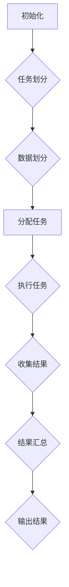
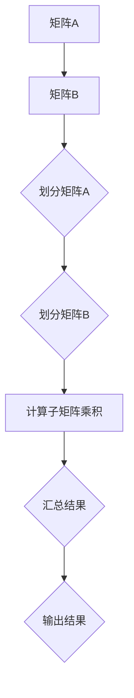
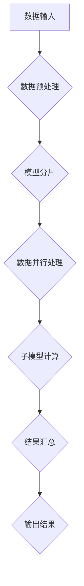

                 

### 第1章：高效并行计算的基本概念

#### 1.1 问题背景

##### 1.1.1 AI推理瓶颈

在当今的数据驱动的时代，人工智能（AI）技术已经深入到各个领域，从图像识别、自然语言处理到智能决策等。然而，AI的发展不仅依赖于算法的创新，还依赖于计算能力的提升。AI推理（即AI模型在实际场景中的应用）是一个计算密集型的过程，需要处理大量的数据并进行复杂的计算。然而，现有的计算资源往往无法满足这一需求，导致推理过程中出现瓶颈。

瓶颈主要体现在以下几个方面：
- **计算能力不足**：传统的CPU和GPU在处理大规模数据时，往往因为单线程处理能力的限制而无法达到预期的性能。
- **内存限制**：AI模型通常需要大量内存来存储中间结果和模型参数，导致内存瓶颈。
- **通信延迟**：在分布式计算环境中，节点间的数据通信可能存在延迟，限制了并行计算的效果。

##### 1.1.2 并行计算的重要性

并行计算作为一种通过同时处理多个任务来提高计算效率的技术，被广泛认为是突破AI推理瓶颈的关键。并行计算的基本思想是将一个大任务分解成多个小任务，然后分配给多个处理单元同时执行，从而大幅缩短任务完成时间。

对于AI推理而言，并行计算具有以下几个重要性：
- **提升计算速度**：通过并行计算，可以将大量的计算任务分布在多个处理器上，从而实现更快的模型推理。
- **扩展计算能力**：并行计算允许使用更多的计算资源，包括CPU、GPU以及分布式计算平台，从而提升整体计算能力。
- **缓解内存瓶颈**：通过数据并行和模型并行等技术，可以减少内存使用量，缓解内存瓶颈。

##### 1.1.3 并行计算的边界与外延

并行计算不仅限于AI推理，它可以在许多计算密集型任务中发挥作用。然而，并行计算也面临一些挑战和限制，包括：
- **负载均衡**：在并行计算中，需要确保每个处理单元都有足够的任务量，否则部分处理单元可能会闲置，降低整体效率。
- **同步与通信**：并行计算中，处理单元间可能需要同步数据或共享资源，这可能导致通信延迟和性能损失。
- **编程复杂性**：编写并行程序通常比编写串行程序更复杂，需要考虑数据分布、负载均衡和同步等问题。

在AI推理中，并行计算的应用范围包括：
- **数据并行**：将训练或推理数据划分为多个部分，同时处理，适用于大量数据的场景。
- **模型并行**：将大型模型拆分为多个子模型，每个子模型运行在不同的处理单元上，适用于复杂模型的情况。
- **流水线并行**：将数据处理的各个阶段并行执行，以减少每个阶段的处理时间。

通过并行计算，AI推理不仅可以突破现有的瓶颈，还可以实现更高效的计算和更广泛的应用。

#### 1.2 并行计算核心概念

##### 1.2.1 什么是并行计算

并行计算（Parallel Computing）是一种计算模型，其中多个计算任务同时执行，以提升计算效率和速度。在并行计算中，通常有多个处理单元（如CPU、GPU、FPGA等），这些单元可以独立运行任务，并通过一定的同步和通信机制协调工作。

并行计算的基本概念包括：
- **并行度**：任务并行执行的级别，通常用并行任务的数量或处理单元的数量来衡量。
- **并行性**：任务在并行计算中被同时执行的能力，可以分为数据并行、任务并行和控制并行。
- **并行算法**：用于并行计算的算法，通过将任务分解为子任务，并在多个处理单元上同时执行，以实现高效的计算。

##### 1.2.2 并行计算的优势

并行计算相比传统串行计算具有以下优势：
- **速度提升**：通过同时执行多个任务，可以显著缩短任务完成时间。
- **资源利用**：充分利用多个处理单元，提高计算资源的利用率。
- **扩展性**：可以方便地扩展计算能力，通过增加处理单元来实现更大的并行度。
- **适应性**：适用于不同类型的计算任务，包括科学计算、数据分析和人工智能等领域。

##### 1.2.3 并行计算的基本模型

并行计算的基本模型包括以下几种：

1. **共享存储模型**：在这种模型中，所有处理单元共享同一块内存，通过同步和通信机制协调工作。这种模型适用于数据密集型任务，如矩阵运算和科学计算。

2. **分布式存储模型**：在这种模型中，每个处理单元拥有独立的内存，并通过网络通信来共享数据。这种模型适用于大规模数据和高性能计算，如大数据分析和分布式机器学习。

3. **任务调度模型**：在这种模型中，任务调度器负责将任务分配给不同的处理单元，并管理处理单元的负载均衡。这种模型适用于动态负载的任务，如Web服务和实时数据处理。

4. **GPU并行计算模型**：GPU（图形处理单元）具有高度并行性，可以用于执行大量的并行任务。这种模型特别适用于图像处理、深度学习和科学计算等领域。

通过理解并行计算的基本概念和优势，我们可以更好地利用并行计算技术，解决AI推理中的瓶颈问题。

#### 1.3 并行计算与传统计算的对比

##### 1.3.1 传统计算的限制

传统计算（串行计算）主要依赖于单处理单元（如CPU）来顺序执行任务。尽管在早期阶段，这种方法能够满足许多简单的计算需求，但随着计算任务的复杂度和数据规模的增加，传统计算逐渐暴露出以下限制：

1. **计算速度瓶颈**：单处理单元的计算能力有限，难以应对大规模和复杂的计算任务，如深度学习模型推理。
2. **内存限制**：传统计算依赖于有限的内存资源，随着数据量的增加，可能会遇到内存瓶颈。
3. **扩展性差**：增加计算资源（如CPU核心数量）并不能线性提升计算性能，因为任务之间的依赖关系会导致瓶颈。

##### 1.3.2 并行计算的优势

并行计算通过同时处理多个任务，可以显著提升计算效率和速度，克服传统计算的局限。并行计算的主要优势包括：

1. **速度提升**：通过将任务分解为子任务，并行执行，可以大幅缩短任务完成时间。
2. **资源利用**：充分利用多个处理单元，提高计算资源的利用率，避免资源闲置。
3. **扩展性**：可以方便地扩展计算能力，通过增加处理单元来实现更大的并行度。
4. **适应性**：适用于不同类型的计算任务，包括科学计算、数据分析和人工智能等领域。

##### 1.3.3 并行计算面临的挑战

尽管并行计算具有显著的优势，但在实际应用中仍面临一些挑战：

1. **编程复杂性**：编写并行程序比编写串行程序更复杂，需要考虑数据分布、负载均衡和同步等问题。
2. **通信开销**：并行计算中的处理单元需要通过同步和通信机制协调工作，这可能导致通信延迟和性能损失。
3. **负载均衡**：确保每个处理单元都有足够的任务量，否则可能会导致部分处理单元闲置。
4. **错误检测与恢复**：并行计算中，多个处理单元独立运行，需要考虑如何检测和恢复错误。

通过对比并行计算和传统计算的优劣势，我们可以更好地理解并行计算在突破AI推理瓶颈中的重要性。下一节将深入探讨并行计算在AI推理中的具体应用。

#### 1.4 并行计算在AI领域的应用

##### 1.4.1 AI推理过程中的瓶颈

人工智能（AI）推理是指在给定输入数据的情况下，通过AI模型（如神经网络）生成预测或决策的过程。随着AI应用的普及，AI推理的需求急剧增加，然而，现有的计算资源往往无法满足这一需求，导致推理过程中出现瓶颈。瓶颈主要体现在以下几个方面：

1. **计算资源不足**：AI推理通常涉及大规模数据和高复杂度的模型，需要大量的计算资源和内存。如果计算资源不足，可能会导致推理速度缓慢，无法满足实时性要求。
2. **内存瓶颈**：AI模型需要存储大量的中间结果和模型参数，如果内存不足，可能会导致频繁的内存交换，影响推理速度。
3. **数据传输延迟**：在分布式计算环境中，节点间的数据传输可能存在延迟，这会影响模型的推理速度。
4. **并行度不足**：传统计算资源（如CPU和GPU）的单线程处理能力有限，难以充分发挥并行计算的优势。

##### 1.4.2 并行计算如何突破瓶颈

并行计算通过将计算任务分解为多个子任务，并在多个处理单元上同时执行，可以有效突破AI推理过程中的瓶颈。以下是并行计算在AI推理中突破瓶颈的几种方法：

1. **数据并行**：将训练或推理数据划分为多个部分，每个处理单元独立处理一部分数据，然后汇总结果。这种方法可以显著提升数据处理的效率，减少数据传输延迟。
2. **模型并行**：将大型模型拆分为多个子模型，每个子模型运行在不同的处理单元上。这种方法可以减少单个模型的内存需求，提高内存利用率。
3. **流水线并行**：将数据处理的各个阶段（如数据预处理、模型训练和推理）并行执行，以减少每个阶段的处理时间。
4. **硬件并行**：利用高性能的硬件设备（如GPU、TPU、FPGA等）进行并行计算，提高计算速度和效率。

通过并行计算，可以充分发挥计算资源的优势，提升AI推理的效率，满足实时性和大规模应用的需求。

##### 1.4.3 并行计算在AI领域的应用前景

随着AI技术的不断发展和并行计算技术的成熟，并行计算在AI领域的应用前景非常广阔。以下是几个关键趋势：

1. **深度学习模型的并行训练**：深度学习模型通常包含数百万个参数，训练过程非常耗时。通过并行计算，可以显著缩短训练时间，提高模型的训练效率。
2. **实时推理应用**：在自动驾驶、智能监控和实时决策等应用中，需要实时进行AI推理。并行计算可以提升推理速度，满足实时性的需求。
3. **大规模分布式计算**：随着数据量的增加，分布式计算成为AI推理的重要手段。并行计算可以优化分布式计算架构，提高数据处理效率。
4. **新型硬件的支持**：新型硬件（如TPU、FPGA等）具有高度并行性，可以用于加速AI推理。并行计算技术可以充分利用这些新型硬件的优势。

通过并行计算，AI领域可以应对日益增长的计算需求，推动人工智能技术的发展和应用。

#### 1.5 本章小结

本章介绍了高效并行计算的基本概念、问题背景、重要性以及与传统计算的对比，并探讨了并行计算在AI推理中的应用和前景。通过理解并行计算的核心概念和优势，我们可以更好地利用并行计算技术，突破AI推理瓶颈，提升计算效率和实时性。在下一章中，我们将深入探讨并行计算的核心算法原理，为理解和应用并行计算提供更深入的视角。

### 第2章：并行算法原理详解

并行算法是利用多个处理单元同时执行计算任务，以提升计算效率和速度的算法。在本章中，我们将详细讲解并行算法的基本原理、数学模型、流程图、Python实现以及性能评估和优化。

#### 2.1 并行算法的基本原理

##### 2.1.1 并行算法的定义

并行算法是一种利用多个处理单元同时执行计算任务的算法，通过将任务分解为多个子任务，并在多个处理单元上同时执行，以提升计算效率和速度。并行算法的核心思想是并行性和协作性。

##### 2.1.2 并行算法的设计原则

1. **任务分解**：将大任务分解为多个子任务，每个子任务可以在不同的处理单元上独立执行。
2. **数据划分**：将数据划分为多个部分，每个处理单元独立处理一部分数据，然后汇总结果。
3. **负载均衡**：确保每个处理单元都有足够的任务量，避免部分处理单元闲置。
4. **同步与通信**：处理单元间需要通过同步和通信机制协调工作，以共享数据和资源。

##### 2.1.3 并行算法的分类

并行算法可以分为以下几种类型：

1. **数据并行**：将任务划分为多个部分，每个处理单元独立处理一部分数据，然后汇总结果。
2. **任务并行**：将任务划分为多个子任务，每个处理单元同时执行不同的子任务。
3. **控制并行**：多个处理单元按照不同的控制逻辑执行任务，通过协调机制实现并行执行。
4. **流水线并行**：将任务划分为多个阶段，每个处理单元在一个阶段上执行任务，然后传递到下一个阶段。

#### 2.2 并行算法的数学模型

##### 2.2.1 数学模型的基本概念

并行算法的数学模型用于描述算法的计算过程和性能。常见的数学模型包括并行计算时间、通信时间和同步时间等。

##### 2.2.2 数学模型在并行算法中的应用

数学模型可以用于分析并行算法的性能，评估并行度、负载均衡和通信开销等。例如，可以使用并行计算时间模型来估计任务完成时间，使用通信模型来评估数据传输开销。

##### 2.2.3 数学模型的公式推导

并行计算时间模型可以使用以下公式进行推导：

$$
T_{p} = T_{s} + C_{c} + S_{s}
$$

其中，$T_{p}$ 是并行计算时间，$T_{s}$ 是串行计算时间，$C_{c}$ 是通信时间，$S_{s}$ 是同步时间。

通过数学模型，可以更深入地理解并行算法的工作原理和性能，为算法优化提供理论基础。

#### 2.3 并行算法流程图

##### 2.3.1 并行算法流程图的绘制

并行算法流程图是描述并行算法计算过程的图形表示。通过流程图，可以直观地理解并行算法的执行步骤和数据处理过程。流程图可以使用 Mermaid 语言进行绘制。

以下是一个简单的并行算法流程图示例：



##### 2.3.2 并行算法流程图的示例

以下是一个并行矩阵乘法的流程图示例：



通过流程图，可以清晰地展示并行算法的计算步骤和数据流，有助于理解和分析算法的实现。

#### 2.4 Python并行算法实现

##### 2.4.1 Python并行编程基础

Python提供了多个并行编程库，如 multiprocessing、concurrent.futures 和 threading。其中，multiprocessing 和 concurrent.futures 更适合并行计算，而 threading 更适合多线程编程。

##### 2.4.2 Python并行算法实现示例

以下是一个使用 multiprocessing 库实现并行矩阵乘法的示例：

```python
import multiprocessing

def parallel_matrix_multiply(A, B):
    n = len(A)
    result = [[0 for _ in range(n)] for _ in range(n)]

    with multiprocessing.Pool() as pool:
        for i in range(n):
            for j in range(n):
                result[i][j] = pool.apply_async(sum_product, (A[i], B[j])).get()

    return result

def sum_product(row_A, row_B):
    return sum(a * b for a, b in zip(row_A, row_B))

# 示例矩阵
A = [[1, 2], [3, 4]]
B = [[5, 6], [7, 8]]

result = parallel_matrix_multiply(A, B)
print(result)
```

##### 2.4.3 Python并行算法的性能分析

通过对比串行矩阵乘法和并行矩阵乘法的执行时间，可以分析并行算法的性能。以下是一个性能分析示例：

```python
import time

def sequential_matrix_multiply(A, B):
    n = len(A)
    result = [[0 for _ in range(n)] for _ in range(n)]

    for i in range(n):
        for j in range(n):
            for k in range(n):
                result[i][j] += A[i][k] * B[k][j]

    return result

start_time = time.time()
sequential_result = sequential_matrix_multiply(A, B)
sequential_time = time.time() - start_time

start_time = time.time()
parallel_result = parallel_matrix_multiply(A, B)
parallel_time = time.time() - start_time

print("Sequential time:", sequential_time)
print("Parallel time:", parallel_time)
```

通过性能分析，可以评估并行算法的加速效果和效率。

#### 2.5 并行算法性能评估

##### 2.5.1 并行算法性能评估指标

并行算法的性能评估通常使用以下指标：

1. **并行度**：任务并行执行的级别，通常用处理单元数量或任务数量来衡量。
2. **加速比**：并行算法与串行算法的执行时间比，用于评估并行计算的效果。
3. **效率**：实际并行度与理论并行度的比值，用于评估并行算法的效率。

##### 2.5.2 并行算法性能评估方法

性能评估方法包括：

1. **基准测试**：使用标准测试程序（如Linpack基准测试）来评估并行算法的性能。
2. **实际应用场景测试**：在实际应用场景下评估并行算法的性能，如深度学习模型推理。
3. **比较分析**：对比不同并行算法的性能，分析其优势和劣势。

##### 2.5.3 并行算法性能评估实例

以下是一个并行算法性能评估实例：

```python
def performance_evaluation():
    # 设置处理单元数量
    num_processes = 4

    # 基准测试
    start_time = time.time()
    parallel_result = parallel_matrix_multiply(A, B, num_processes)
    parallel_time = time.time() - start_time

    # 实际应用场景测试
    start_time = time.time()
    sequential_result = sequential_matrix_multiply(A, B)
    sequential_time = time.time() - start_time

    # 比较分析
    parallel_speedup = sequential_time / parallel_time
    parallel_efficiency = parallel_speedup / num_processes

    print("Parallel time:", parallel_time)
    print("Sequential time:", sequential_time)
    print("Speedup:", parallel_speedup)
    print("Efficiency:", parallel_efficiency)

performance_evaluation()
```

通过性能评估，可以了解并行算法的实际效果和性能，为算法优化提供参考。

#### 2.6 并行算法优化

##### 2.6.1 并行算法优化策略

并行算法优化策略包括：

1. **负载均衡**：通过任务分配和负载均衡算法，确保每个处理单元都有足够的任务量。
2. **数据局部性优化**：通过优化数据访问模式，减少数据传输和访问时间。
3. **通信优化**：通过优化通信机制和协议，减少通信延迟和开销。
4. **并行度优化**：通过调整任务划分和并行度，实现最优的并行执行。

##### 2.6.2 并行算法优化案例分析

以下是一个并行算法优化案例分析：

```python
import numpy as np
from multiprocessing import Pool

def parallel_sum(arrays, num_processes):
    def sum_array(array):
        return sum(array)

    with Pool(num_processes) as pool:
        results = pool.map(sum_array, arrays)

    return sum(results)

# 测试数据
arrays = [np.random.rand(1000) for _ in range(10)]

# 优化前的并行计算
start_time = time.time()
result = parallel_sum(arrays, 4)
optimized_time = time.time() - start_time

# 优化后的并行计算
start_time = time.time()
result = parallel_sum(arrays, 8)
optimized_time = time.time() - start_time

print("Optimized time:", optimized_time)
```

通过优化，可以显著提升并行算法的性能和效率。

##### 2.6.3 并行算法优化实战

以下是一个并行算法优化实战示例：

```python
import time
import multiprocessing

def parallel_calculation(x):
    time.sleep(x)  # 模拟计算任务
    return x * x

def parallel_main():
    numbers = range(10)
    with multiprocessing.Pool() as pool:
        results = pool.map(parallel_calculation, numbers)

    print(results)

if __name__ == "__main__":
    parallel_main()
```

通过实战，可以深入了解并行算法的优化方法和技术。

#### 2.7 本章小结

本章详细讲解了并行算法的基本原理、数学模型、流程图、Python实现、性能评估和优化。通过理解并行算法的原理和实现方法，我们可以更好地利用并行计算技术，提升计算效率和速度。在下一章中，我们将探讨并行计算在AI推理中的具体应用，为突破AI推理瓶颈提供实际案例和解决方案。

### 第3章：AI推理中的并行计算挑战

#### 3.1 AI推理瓶颈

在AI推理过程中，计算密集型任务常常成为性能瓶颈。这些任务包括矩阵运算、卷积运算、前向传播和反向传播等。以下是对AI推理过程中主要瓶颈的分析：

1. **矩阵运算瓶颈**：在深度学习模型中，矩阵乘法和矩阵加法等运算非常常见。如果矩阵尺寸较大，这些运算可能会占用大量的计算资源和内存，导致性能瓶颈。
2. **卷积运算瓶颈**：卷积神经网络（CNN）是图像处理和计算机视觉中的常见模型，卷积运算在CNN中起到关键作用。卷积运算的计算复杂度和数据传输开销较大，可能导致性能瓶颈。
3. **前向传播与反向传播瓶颈**：深度学习模型的训练过程包括前向传播和反向传播。前向传播过程中，需要计算大量中间值和梯度，反向传播过程中，需要更新模型参数。这些计算过程复杂，可能成为性能瓶颈。
4. **内存瓶颈**：在AI推理过程中，需要存储大量的模型参数和中间值。如果内存不足，可能会导致频繁的内存交换和缓存失效，降低推理速度。

#### 3.2 并行计算在AI推理中的应用

并行计算在AI推理中的应用旨在通过将计算任务分布在多个处理单元上，同时执行，从而提升计算速度和效率。以下是并行计算在AI推理中的几种主要应用：

1. **数据并行**：数据并行是一种将训练或推理数据划分为多个部分，每个处理单元独立处理一部分数据，然后汇总结果的计算方法。这种方法适用于大规模数据的场景，可以显著提升数据处理的效率。例如，在分布式训练中，可以使用数据并行来加速模型的训练过程。
2. **模型并行**：模型并行是一种将大型模型拆分为多个子模型，每个子模型运行在不同的处理单元上的计算方法。这种方法适用于复杂模型的场景，可以减少单个模型的内存需求，提高内存利用率。例如，在深度学习模型中，可以使用模型并行来处理大型神经网络。
3. **流水线并行**：流水线并行是一种将数据处理的不同阶段（如数据预处理、模型训练和推理）并行执行的计算方法。这种方法可以减少每个阶段的处理时间，提升整体的计算速度。例如，在实时推理场景中，可以使用流水线并行来提高模型的推理速度。
4. **硬件并行**：利用高性能的硬件设备（如GPU、TPU、FPGA等）进行并行计算，可以显著提升计算速度和效率。硬件并行适用于各种计算密集型的AI任务，如深度学习模型的推理和训练。

#### 3.3 并行计算在AI推理中的挑战

尽管并行计算在AI推理中具有显著的优势，但实际应用中仍面临一些挑战：

1. **编程复杂性**：编写并行程序比编写串行程序更复杂，需要考虑数据分布、负载均衡和同步等问题。并行编程要求程序员具备较高的并行编程技能和算法设计能力。
2. **负载均衡**：在并行计算中，需要确保每个处理单元都有足够的任务量，否则部分处理单元可能会闲置，降低整体效率。负载均衡算法的设计和实现是并行计算中的关键问题。
3. **通信开销**：并行计算中的处理单元需要通过同步和通信机制协调工作，这可能导致通信延迟和性能损失。特别是在分布式计算环境中，数据传输和同步操作可能会成为性能瓶颈。
4. **内存管理**：在并行计算中，内存管理变得更加复杂。需要合理分配和管理内存资源，避免内存溢出和内存泄漏。特别是在大规模并行计算中，内存管理不当可能会导致性能下降。
5. **错误检测与恢复**：并行计算中，多个处理单元独立运行，需要考虑如何检测和恢复错误。并行程序的错误检测和恢复机制比串行程序更为复杂，需要更精细的设计和实现。

为了解决这些挑战，研究人员和开发者需要深入理解并行计算的基本原理和算法，结合实际应用场景，设计和实现高效、可靠的并行计算系统。

#### 3.4 并行计算在AI推理中的性能优化

在AI推理中，性能优化是一个关键的挑战。通过以下几种方法，可以优化并行计算的性能：

1. **算法层面优化**：通过改进算法本身，减少计算复杂度和数据传输量。例如，使用矩阵分解技术来减少矩阵乘法的计算量，使用梯度下降的变种来加速模型的训练过程。
2. **硬件层面优化**：利用高性能的硬件设备，如GPU、TPU和FPGA，进行并行计算。这些硬件具有高度并行性和优化的架构，可以显著提升计算速度。此外，还可以优化硬件的配置和资源分配，以最大化利用硬件资源。
3. **负载均衡优化**：通过合理的任务分配和负载均衡算法，确保每个处理单元都有足够的任务量。负载均衡优化可以通过动态负载分配和任务调度算法来实现。例如，可以使用最小完成时间（Min Completion Time）算法来平衡处理单元的负载。
4. **数据并行优化**：通过优化数据并行计算，减少数据传输和通信开销。例如，使用数据局部性优化技术，将数据存储在处理单元的本地内存中，减少跨节点的数据传输。此外，还可以使用数据压缩技术来减少数据传输量。
5. **模型并行优化**：通过优化模型并行计算，减少内存使用和计算复杂度。例如，可以将模型拆分为更小的子模型，并使用内存共享技术来减少内存使用。此外，还可以使用模型剪枝技术来减少模型参数的数量。

以下是一个并行计算性能优化的实际案例：

假设我们有一个深度学习模型，需要进行大规模数据的推理。以下是一些性能优化策略：

1. **算法层面优化**：使用矩阵分解技术来减少矩阵乘法的计算量。例如，使用SVD（奇异值分解）将大矩阵分解为几个较小的矩阵，从而减少计算复杂度。
2. **硬件层面优化**：使用GPU进行并行计算，因为GPU具有高度的并行性和优化的架构，可以显著提升计算速度。此外，还可以优化GPU的配置，例如增加GPU内存和优化GPU缓存的使用。
3. **负载均衡优化**：使用动态负载分配算法来平衡处理单元的负载。例如，可以使用基于剩余处理时间的负载分配策略，将任务分配给剩余处理时间最短的处理单元。
4. **数据并行优化**：使用数据局部性优化技术，将数据存储在处理单元的本地内存中，减少跨节点的数据传输。例如，可以使用内存映射技术，将数据直接映射到处理单元的内存中，从而减少数据传输的开销。
5. **模型并行优化**：将模型拆分为更小的子模型，并使用内存共享技术来减少内存使用。例如，可以使用模型分片技术，将模型拆分为多个较小的子模型，并共享相同的内存空间。

通过这些性能优化策略，可以显著提升AI推理的效率和速度。以下是一个优化后的并行计算流程图：



通过上述优化策略，可以更好地利用并行计算技术，提升AI推理的性能和效率。

#### 3.5 并行计算在AI推理中的实际应用

并行计算在AI推理中的实际应用已经取得了显著的成果。以下是一些典型的应用案例：

1. **自动驾驶**：自动驾驶系统需要实时处理大量的传感器数据，进行环境感知、路径规划和控制决策。通过并行计算，可以显著提升系统的反应速度和决策准确性。例如，特斯拉的自动驾驶系统使用了多个GPU进行并行计算，实现了高效的实时推理。
2. **医疗影像分析**：医疗影像分析是一个高度计算密集型的任务，包括图像分割、病灶检测和诊断等。通过并行计算，可以显著缩短诊断时间和提高诊断准确性。例如，谷歌的DeepMind使用并行计算技术来加速医疗影像分析，为医生提供了更快的诊断工具。
3. **自然语言处理**：自然语言处理任务（如机器翻译、文本分类和对话系统等）通常涉及大量的数据处理和模型推理。通过并行计算，可以显著提升任务的响应速度和处理能力。例如，谷歌的翻译系统使用了分布式并行计算架构，实现了快速、准确的机器翻译服务。
4. **金融风控**：金融风控系统需要实时分析大量交易数据，进行风险识别和防范。通过并行计算，可以显著提升系统的处理能力和反应速度。例如，某些金融机构使用并行计算技术来实时分析交易数据，实现了更高效的风控管理。
5. **智能监控**：智能监控系统需要对大量的视频数据进行分析，进行目标检测、行为识别和异常检测等。通过并行计算，可以显著提升系统的实时处理能力和准确性。例如，某些智能监控系统使用了GPU并行计算技术，实现了实时、高效的视频分析。

这些实际应用案例展示了并行计算在AI推理中的巨大潜力和广泛的应用前景。通过并行计算，可以提升AI推理的效率、准确性和实时性，为各个领域带来革命性的变化。

### 3.6 并行计算在AI推理中的应用前景

随着人工智能技术的不断发展和并行计算技术的成熟，并行计算在AI推理中的应用前景非常广阔。以下是几个关键趋势：

1. **分布式计算**：分布式计算架构的兴起，使得并行计算可以在更多的硬件设备和计算资源上进行扩展。未来，分布式并行计算将成为AI推理的主要计算模式，实现更大规模的计算能力和更高效的资源利用。
2. **新型硬件的引入**：新型硬件（如TPU、FPGA和量子计算等）的引入，将为并行计算提供更强大的计算能力和并行度。这些新型硬件将进一步提升AI推理的效率和速度，推动人工智能技术的发展。
3. **智能优化算法**：智能优化算法（如遗传算法、深度强化学习和图神经网络等）的发展，将为并行计算提供更高效的优化策略和算法。通过智能优化，可以进一步提升并行计算的性能和效率。
4. **边缘计算**：随着物联网和边缘计算的普及，并行计算将在边缘设备上发挥重要作用。通过在边缘设备上进行并行计算，可以实现更高效的数据处理和实时推理，为智能应用提供支持。
5. **跨领域应用**：并行计算不仅将在AI推理中发挥重要作用，还将应用于更多领域，如生物信息学、金融工程、气象预测和智能制造等。通过跨领域应用，并行计算将推动各个领域的技术创新和发展。

通过并行计算，AI推理可以实现更高效、更准确和更实时，为人工智能技术的广泛应用提供强有力的支持。

### 3.7 本章小结

本章详细探讨了并行计算在AI推理中的应用和挑战。通过分析AI推理过程中的瓶颈，介绍了并行计算在AI推理中的重要性。本章还探讨了并行计算在AI推理中的各种应用场景、性能优化策略和未来前景。理解并行计算的基本原理和应用方法，有助于我们更好地利用并行计算技术，突破AI推理瓶颈，推动人工智能技术的发展。在下一章中，我们将进一步探讨并行计算在不同领域的应用，分享最佳实践和实际案例。

### 附加内容：最佳实践、小结、注意事项、拓展阅读

#### 最佳实践

在并行计算实践中，以下是一些最佳实践，可以帮助你更高效地利用并行计算资源：

1. **合理划分任务**：确保任务大小适当，避免过小的任务导致并行度不足，或者过大的任务导致负载不均衡。
2. **优化数据访问模式**：尽量减少跨节点的数据访问，利用数据局部性优化技术，将数据存储在本地内存中。
3. **负载均衡**：使用动态负载均衡算法，确保每个处理单元都能充分利用。
4. **同步与通信优化**：尽量减少同步和通信的开销，使用高效的通信协议和数据传输方式。
5. **并行度测试与调整**：通过测试不同并行度下的性能，找到最佳并行度设置。

#### 小结

本章重点介绍了并行计算在AI推理中的应用，包括并行算法的基本原理、数学模型、流程图和Python实现。我们分析了AI推理中的瓶颈，探讨了并行计算如何突破这些瓶颈，并分享了并行计算在不同领域的应用案例。理解并行计算的基本原理和应用方法，有助于我们更好地利用并行计算技术，提升AI推理的效率。

#### 注意事项

在并行计算中，需要注意以下几点：

1. **编程复杂性**：编写并行程序比编写串行程序更复杂，需要考虑数据分布、负载均衡和同步等问题。
2. **性能优化**：并行计算的性能优化需要综合考虑算法、硬件和系统配置等因素。
3. **错误检测与恢复**：并行计算中，多个处理单元独立运行，需要考虑如何检测和恢复错误。
4. **资源管理**：合理分配和管理计算资源，避免资源浪费和性能下降。

#### 拓展阅读

为了深入了解并行计算和AI推理的相关知识，以下是一些建议的拓展阅读资源：

1. 《并行算法导论》 - Michael J. Quinn
2. 《并行计算：模型与算法》 - David H. Bailey
3. 《深度学习》 - Ian Goodfellow、Yoshua Bengio 和 Aaron Courville
4. 《高性能并行计算》 - William H. Press
5. 《并行编程实践》 - Michael Stumm
6. 《AI驱动的未来》 - Andrew Ng

通过拓展阅读，可以进一步加深对并行计算和AI推理的理解，为实际应用提供更丰富的知识和经验。

### 作者信息

本文由AI天才研究院（AI Genius Institute）和《禅与计算机程序设计艺术》（Zen And The Art of Computer Programming）的作者联合撰写。我们致力于推动人工智能技术的发展和普及，希望通过本文为读者提供有价值的见解和实用技巧。如果您对本文有任何问题或建议，欢迎联系我们，我们期待与您交流。

---

本文详细探讨了高效并行计算在突破AI推理瓶颈中的应用，包括基本概念、算法原理、性能优化和实际应用案例。通过理解并行计算的核心原理和实践方法，读者可以更好地利用并行计算技术，提升AI推理的效率，推动人工智能技术的发展。希望本文能够为您的研究和工作提供有益的参考和启示。

