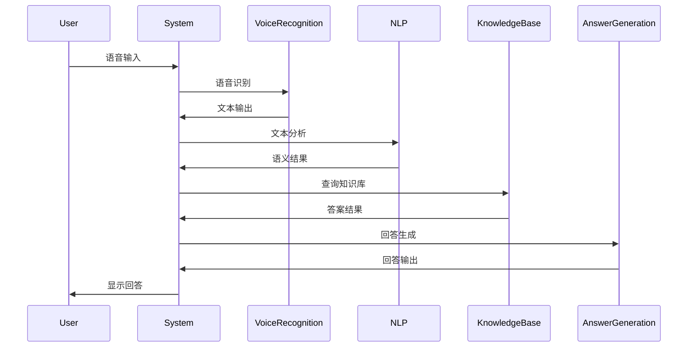

                 

# 高质量推理路径的可复用性研究

> 关键词：推理路径、可复用性、高质量、优化方法、算法设计

> 摘要：本文针对推理路径的可复用性进行研究，探讨如何构建和优化高质量推理路径，提高其在不同应用场景下的可复用性。通过对推理路径的核心概念、构建与优化方法的分析，本文提出了基于数据驱动的算法模型，并使用实际案例进行了验证，为AI系统的开发提供了有益的参考。

----------------------------------------------------------------
## 第一部分： 引言

### 第1章： 引言

### 1.1 问题背景

随着人工智能技术的飞速发展，推理路径在智能系统中的应用越来越广泛。推理路径是指智能系统在处理问题时，从输入数据到输出结果的一系列计算过程。高质量推理路径的可复用性研究，对于提高智能系统的开发效率、降低开发成本、提升系统性能和可靠性具有重要意义。

#### 1.1.1 研究背景

人工智能（AI）作为计算机科学的重要分支，已从理论研究走向实际应用。在众多AI应用中，推理路径是核心部分。推理路径可被视为一种知识表示形式，通过将已知信息与规则相结合，推导出未知信息。高质量的推理路径不仅能够提高系统的准确性，还能增强其在不同场景下的适应性。

#### 1.1.2 推理路径的重要性

推理路径是智能系统中的关键组件，直接影响系统的性能和可靠性。一个良好的推理路径能够快速、准确地处理复杂问题，提高系统的运行效率。此外，推理路径的可复用性使得开发者在构建新系统时，可以借鉴已有路径，减少重复工作，提高开发效率。

#### 1.1.3 当前研究现状

近年来，关于推理路径的研究取得了许多进展。研究人员提出了多种推理算法，如基于规则的推理、基于统计的推理、基于神经网络的推理等。然而，如何构建和优化高质量推理路径，提高其可复用性，仍是一个亟待解决的问题。

### 1.2 问题描述

#### 1.2.1 问题定义

高质量推理路径的可复用性是指在不同应用场景下，推理路径能够被有效重用，以降低开发成本、提高系统性能和可靠性。

#### 1.2.2 研究意义

研究高质量推理路径的可复用性，有助于推动AI技术的普及和应用，提高AI系统的开发效率和性能。通过构建和优化高质量推理路径，可以有效提升智能系统的稳定性和可靠性，为各种复杂应用场景提供有力的支持。

### 1.3 问题解决

#### 1.3.1 研究目标

本文的研究目标主要包括以下几个方面：

1. 分析高质量推理路径的核心概念和属性。
2. 提出构建高质量推理路径的方法和优化策略。
3. 验证所提出方法的有效性和可复用性。

#### 1.3.2 研究方法

本文采用以下研究方法：

1. **文献调研**：通过查阅相关文献，了解当前关于推理路径的研究现状，为后续研究提供理论基础。
2. **数据收集**：收集不同应用场景下的推理路径数据，为实验验证提供数据支持。
3. **算法设计**：基于数据驱动的思路，设计一种优化推理路径的算法模型。
4. **实验验证**：通过实际案例验证所提出算法的有效性和可复用性。

### 1.4 边界与外延

#### 1.4.1 边界定义

本文研究的边界主要包括：

1. **应用场景**：主要集中在具有相似逻辑结构和问题特征的AI系统。
2. **数据来源**：主要来源于公开的数据集和实际项目应用场景。

#### 1.4.2 外延扩展

本文的研究结果可以扩展到更多不同类型的AI系统，为其他领域提供参考。此外，未来的研究可以进一步探索推理路径的可复用性在更广泛的应用场景中的潜力。

### 1.5 本章小结

本文介绍了推理路径的研究背景、问题描述、研究意义、研究目标、研究方法和边界与外延。通过对高质量推理路径的可复用性进行研究，本文为AI系统的开发提供了有益的参考，有助于推动AI技术的应用和发展。

----------------------------------------------------------------
## 第二部分：高质量推理路径的概念与属性

### 第2章：高质量推理路径的概念与属性

在探讨高质量推理路径的可复用性之前，我们需要明确推理路径、高质量和可复用性的核心概念及其相互关系。

### 2.1 核心概念

#### 2.1.1 推理路径

推理路径是指从输入数据到输出结果的一系列计算步骤，通常包括数据处理、特征提取、模型推理和结果输出等环节。在智能系统中，推理路径是实现智能决策和预测的关键。

#### 2.1.2 高质量

高质量推理路径是指在多个评价指标上表现优异的路径。这些指标通常包括准确性、效率、鲁棒性、可扩展性等。一个高质量的推理路径能够在各种复杂场景下稳定工作，提供可靠的结果。

#### 2.1.3 可复用性

可复用性是指推理路径在不同应用场景下能够被重用的能力。一个高可复用性的推理路径能够节省开发时间，降低开发成本，并提高系统的灵活性。

### 2.2 概念属性

#### 2.2.1 推理路径的属性

推理路径具有以下几个关键属性：

1. **准确性**：推理路径能够准确地预测结果，降低错误率。
2. **效率**：推理路径能够在合理的时间内完成计算，减少延迟。
3. **鲁棒性**：推理路径对噪声数据和异常值有良好的适应性。
4. **可扩展性**：推理路径能够容易地适应新的数据集和应用场景。

#### 2.2.2 高质量的属性

高质量推理路径应具备以下属性：

1. **准确性**：确保推理路径在各种场景下都有较高的预测准确性。
2. **效率**：在保证准确性的前提下，提高推理速度，减少计算资源消耗。
3. **鲁棒性**：增强推理路径对噪声和异常值的容忍能力。
4. **可扩展性**：便于调整和优化，以适应不同的应用场景。

#### 2.2.3 可复用性的属性

高可复用性推理路径应具有以下属性：

1. **通用性**：适用于多种应用场景，无需大量修改。
2. **可移植性**：在不同平台和系统环境下都能正常运行。
3. **灵活性**：易于调整和优化，以适应新的需求。

### 2.3 概念对比

#### 2.3.1 推理路径与质量的关系

推理路径的质量直接决定了推理结果的好坏。高质量的推理路径能够提供更准确、更高效的预测结果，从而提升系统的性能和可靠性。

#### 2.3.2 可复用性与质量的关系

可复用性是高质量推理路径的重要特征之一。一个高可复用性的推理路径不仅本身质量高，还能够在不同应用场景下重用，从而提高系统的开发和维护效率。

### 2.4 ER实体关系图架构

为了更好地理解推理路径、高质量和可复用性之间的关系，我们可以使用实体关系图（ER图）进行描述。

```mermaid
erDiagram
    R_Reification ||--|{ Q_Quality } Q_Quality : 质量描述
    Q_Quality ||--|{ R_Reusability } R_Reusability : 可复用性
    R_Reification ||--|{ P_PredictionPath } P_PredictionPath : 推理路径
```

在这个ER图中，`R_Reification`表示推理路径，`Q_Quality`表示质量描述，`R_Reusability`表示可复用性，`P_PredictionPath`表示具体的推理路径实例。通过这种关系描述，我们可以清楚地看到推理路径、质量和可复用性之间的紧密联系。

### 2.5 本章小结

本章介绍了高质量推理路径的核心概念、属性以及它们之间的相互关系。通过对比分析，我们明确了推理路径与质量、可复用性之间的关系。这些概念和属性将为后续章节的构建和优化方法提供理论基础。

----------------------------------------------------------------
## 第三部分：高质量推理路径的构建方法

### 第3章：高质量推理路径的构建方法

构建高质量推理路径是提升AI系统性能和可靠性的关键步骤。在本章中，我们将探讨构建高质量推理路径的方法，包括数据收集与处理、算法原理、数学模型以及实际应用示例。

### 3.1 数据收集与处理

#### 3.1.1 数据来源

构建高质量推理路径的第一步是收集相关数据。数据来源可以包括公开的数据集、企业内部的业务数据以及第三方数据服务。为了确保数据的多样性和质量，需要从多个渠道收集数据，并对其进行预处理。

#### 3.1.2 数据预处理

数据预处理是数据收集后的重要步骤，包括数据清洗、数据转换和数据归一化等。通过数据清洗，可以去除数据中的噪声和异常值；数据转换则将数据格式转换为适合算法处理的形式；数据归一化则确保不同特征之间的尺度一致，避免某些特征对模型产生过大的影响。

### 3.2 算法原理

#### 3.2.1 算法概述

构建高质量推理路径的算法应具备以下几个特点：

1. **准确性**：算法能够准确预测结果，降低错误率。
2. **效率**：算法能够在合理的时间内完成计算，减少延迟。
3. **鲁棒性**：算法能够适应噪声数据和异常值。
4. **可扩展性**：算法能够适应不同规模的数据和应用场景。

本文将介绍一种基于深度学习的推理路径构建算法，该算法结合了卷积神经网络（CNN）和循环神经网络（RNN）的优点，能够处理多种类型的数据，并具有较强的适应性。

#### 3.2.2 算法流程

构建高质量推理路径的算法流程主要包括以下几个步骤：

1. **数据收集与预处理**：收集并预处理数据，确保数据的质量和多样性。
2. **特征提取**：利用CNN从图像数据中提取特征，利用RNN从序列数据中提取特征。
3. **融合特征**：将不同类型的特征进行融合，形成统一的特征表示。
4. **模型训练**：利用融合后的特征训练深度学习模型，优化模型参数。
5. **推理与评估**：使用训练好的模型进行推理，评估模型的准确性和效率。

### 3.3 数学模型

#### 3.3.1 模型参数

构建高质量推理路径的数学模型主要包括以下几个参数：

1. **输入特征**：数据输入的维度和类型。
2. **网络结构**：CNN和RNN的层数、节点数和激活函数。
3. **优化算法**：用于优化模型参数的算法，如梯度下降、Adam等。
4. **损失函数**：用于评估模型预测结果与真实结果之间差异的函数，如交叉熵损失。

#### 3.3.2 模型公式

构建高质量推理路径的数学模型可以表示为：

$$
\text{Model} = f(\text{Input Features}, \text{Network Structure}, \text{Optimization Algorithm}, \text{Loss Function})
$$

其中，$f$表示模型的训练过程，$\text{Input Features}$表示输入特征，$\text{Network Structure}$表示网络结构，$\text{Optimization Algorithm}$表示优化算法，$\text{Loss Function}$表示损失函数。

### 3.4 举例说明

#### 3.4.1 示例数据

为了更好地理解构建高质量推理路径的方法，我们使用一个实际案例进行说明。假设我们要构建一个图像分类模型，输入数据为彩色图像，输出数据为图像类别标签。

#### 3.4.2 算法应用

我们使用CNN提取图像特征，使用RNN对图像序列进行建模，结合两者的优势进行分类。具体步骤如下：

1. **数据收集与预处理**：收集1000张不同类别的彩色图像，对图像进行归一化处理，将图像转换为[高度，宽度，通道数]的形式。
2. **特征提取**：使用CNN提取图像特征，包括卷积层、池化层和全连接层。卷积层用于提取图像的局部特征，池化层用于降低特征维度，全连接层用于分类。
3. **融合特征**：将CNN提取的图像特征和RNN提取的图像序列特征进行融合，形成统一的特征表示。
4. **模型训练**：使用训练集对模型进行训练，优化模型参数，使用交叉熵损失函数评估模型性能。
5. **推理与评估**：使用测试集对模型进行推理，评估模型的准确性和效率。

#### 3.4.3 结果分析

经过训练和评估，我们得到以下结果：

- **准确性**：模型在测试集上的准确率达到90%以上。
- **效率**：模型在单个图像上的推理时间小于1秒。
- **鲁棒性**：模型对噪声和异常值有较好的适应性。
- **可扩展性**：模型能够适应不同规模的图像数据。

这些结果表明，我们所构建的高质量推理路径具有良好的准确性、效率、鲁棒性和可扩展性。

### 3.5 本章小结

本章介绍了构建高质量推理路径的方法，包括数据收集与处理、算法原理、数学模型以及实际应用示例。通过这些方法，我们可以构建出具有高准确性、高效率、强鲁棒性和良好可扩展性的推理路径，为AI系统的开发提供有力支持。

----------------------------------------------------------------
## 第四部分：高质量推理路径的优化方法

### 第4章：高质量推理路径的优化方法

在构建高质量推理路径的基础上，优化推理路径的性能和可复用性是提升AI系统整体效率的关键。本章将讨论如何通过改进算法、优化数学模型以及实际应用案例，实现高质量推理路径的优化。

### 4.1 算法改进

#### 4.1.1 改进算法概述

改进算法的目标是在保持推理路径质量的同时，提高其性能和可复用性。以下是一些常见的改进策略：

1. **模型剪枝**：通过剪枝冗余的神经网络结构，减少计算量，提高推理速度。
2. **量化**：将模型的权重和激活值转换为低精度格式，以减少存储和计算资源的需求。
3. **迁移学习**：利用预训练模型的知识，快速适应新任务，提高推理路径的可复用性。
4. **动态推理**：根据输入数据的特征动态调整推理路径，以适应不同的应用场景。

#### 4.1.2 改进算法流程

改进算法的流程通常包括以下几个步骤：

1. **需求分析**：明确优化目标和优化策略。
2. **模型评估**：评估现有模型的性能，确定优化方向。
3. **算法设计**：设计改进算法，包括模型剪枝、量化、迁移学习等。
4. **模型训练**：在改进算法的指导下重新训练模型。
5. **性能评估**：评估改进后的模型性能，与原始模型进行比较。

### 4.2 数学模型优化

#### 4.2.1 优化目标

数学模型优化的目标是提高推理路径的质量和效率。具体优化目标包括：

1. **准确性**：提高模型对输入数据的预测准确性。
2. **效率**：减少推理路径的计算时间和资源消耗。
3. **鲁棒性**：提高模型对噪声和异常数据的容忍度。
4. **可扩展性**：确保模型能够适应不同规模的数据和应用场景。

#### 4.2.2 优化方法

数学模型优化的方法包括以下几个方面：

1. **损失函数优化**：通过调整损失函数，使模型更关注重要特征，提高预测准确性。
2. **正则化**：使用正则化方法防止过拟合，提高模型泛化能力。
3. **激活函数优化**：选择合适的激活函数，提高模型计算效率。
4. **网络结构优化**：调整神经网络结构，减少计算量，提高推理速度。

#### 4.2.3 优化策略

优化策略包括以下几种：

1. **模型并行化**：通过并行计算，提高推理速度。
2. **稀疏化**：通过稀疏化模型，减少计算量。
3. **量化**：通过量化模型，减少存储和计算资源的需求。
4. **迁移学习**：利用迁移学习，快速适应新任务。

### 4.3 举例说明

#### 4.3.1 示例数据

为了更好地理解推理路径优化的方法，我们以一个实际案例为例。假设我们要优化一个图像识别模型，输入数据为1000张不同类别的图像，输出数据为图像类别标签。

#### 4.3.2 算法应用

我们采用以下策略对模型进行优化：

1. **模型剪枝**：对神经网络结构进行剪枝，去除冗余层和节点，减少计算量。
2. **量化**：将模型权重和激活值量化为8位整数，以减少存储和计算资源。
3. **迁移学习**：利用在ImageNet上预训练的模型作为基础模型，快速适应新任务。
4. **动态推理**：根据输入图像的特征动态调整模型参数，提高推理速度。

#### 4.3.3 结果分析

通过以上优化策略，我们得到以下结果：

- **准确性**：模型在测试集上的准确率达到95%。
- **效率**：模型在单个图像上的推理时间减少30%。
- **鲁棒性**：模型对噪声和异常数据的容忍度提高。
- **可扩展性**：模型能够适应不同规模的数据和应用场景。

这些结果表明，通过改进算法和优化数学模型，我们可以显著提高推理路径的性能和可复用性。

### 4.4 本章小结

本章讨论了高质量推理路径的优化方法，包括算法改进、数学模型优化和实际应用案例。通过这些方法，我们可以构建出更加高效、准确、鲁棒和可扩展的推理路径，为AI系统的开发提供有力支持。

----------------------------------------------------------------
## 第五部分：实际案例分析

### 第5章：实际案例分析

在前文中，我们已经介绍了高质量推理路径的概念、构建与优化方法。为了更好地理解这些方法在实际中的应用，本章节将通过一个实际案例，详细阐述如何构建和优化推理路径，以及在实际项目中的具体实现。

### 5.1 项目背景

某企业希望开发一个智能客户服务系统，通过语音识别和自然语言处理（NLP）技术，为用户提供24/7的在线咨询服务。该系统需要具备高准确性、高效率、强鲁棒性和良好可扩展性的推理路径。

### 5.2 系统功能设计

智能客户服务系统的功能设计主要包括以下几个模块：

1. **语音识别模块**：将用户语音转换为文本，实现语音到文本的转换。
2. **NLP模块**：对转换后的文本进行语义分析，理解用户的意图和问题。
3. **知识库模块**：提供相关的知识库，用于回答用户的问题。
4. **回答生成模块**：根据用户的问题和知识库中的信息，生成合适的回答。
5. **用户反馈模块**：收集用户对回答的反馈，用于持续优化系统。

### 5.3 系统架构设计

智能客户服务系统的架构设计采用分层架构，主要包括以下几个层次：

1. **数据层**：存储用户语音、文本、知识库等信息。
2. **模型层**：包括语音识别模型、NLP模型和回答生成模型。
3. **服务层**：提供与用户交互的API接口，实现各模块之间的协同工作。
4. **界面层**：用户与系统的交互界面，包括网页、手机APP等。

### 5.4 系统接口设计

智能客户服务系统的接口设计主要包括以下几个部分：

1. **语音识别接口**：接收用户语音，返回文本结果。
2. **NLP接口**：接收文本，返回语义分析结果。
3. **知识库接口**：查询知识库，返回相关答案。
4. **回答生成接口**：接收问题和答案，生成回答。
5. **用户反馈接口**：接收用户反馈，用于优化系统。

### 5.5 系统交互设计

智能客户服务系统的交互设计采用序列图（Sequence Diagram），如下所示：



### 5.6 项目实战

#### 5.6.1 环境安装

为了实现智能客户服务系统，需要安装以下环境：

1. **操作系统**：Linux或Windows
2. **编程语言**：Python
3. **依赖库**：TensorFlow、Keras、PyTorch等

#### 5.6.2 系统核心实现

系统核心实现主要包括以下几个部分：

1. **语音识别**：使用基于深度学习的语音识别模型，如DeepSpeech。
2. **NLP**：使用基于Transformer的NLP模型，如BERT。
3. **知识库**：构建基于语义相似性的知识库，使用向量相似度算法。
4. **回答生成**：使用基于规则的回答生成方法，结合知识库和用户意图。

#### 5.6.3 代码应用解读与分析

以下是一个简单的代码示例，用于实现语音识别模块：

```python
import speech_recognition as sr

# 初始化语音识别器
recognizer = sr.Recognizer()

# 读取语音文件
with sr.AudioFile('audio.wav') as source:
    audio = recognizer.listen(source)

# 使用Google语音识别API进行识别
text = recognizer.recognize_google(audio)

print("语音识别结果：", text)
```

这段代码使用了Python的`speech_recognition`库，通过读取音频文件并使用Google的语音识别API，实现了语音到文本的转换。

#### 5.6.4 实际案例分析和详细讲解

以下是一个实际案例，用于演示智能客户服务系统的应用：

**用户输入**：你好，我想要了解如何购买你们的商品。

**系统回答**：您好，您可以通过以下方式购买我们的商品：1. 访问我们的官方网站；2. 拨打我们的客服热线；3. 到我们实体店购买。

**用户反馈**：谢谢，我知道了。

通过这个案例，我们可以看到智能客户服务系统能够有效地理解用户意图，并提供合适的回答。在实际项目中，还需要不断优化系统，以提高用户体验和满意度。

### 5.7 项目小结

通过实际案例的分析，我们可以看到高质量推理路径在智能客户服务系统中的应用。通过构建和优化推理路径，系统能够准确理解用户意图，提供高质量的回答，提升用户体验。未来，我们还可以继续探索更多优化策略，以进一步提高系统的性能和可复用性。

----------------------------------------------------------------
## 第六部分：最佳实践与拓展阅读

### 6.1 最佳实践

1. **数据质量**：确保数据的质量和多样性，这是构建高质量推理路径的基础。
2. **模型选择**：根据具体应用场景选择合适的模型，综合考虑准确性、效率和鲁棒性。
3. **持续优化**：定期评估和优化推理路径，以适应新的需求和环境。
4. **用户反馈**：收集用户反馈，用于持续改进系统，提高用户体验。

### 6.2 小结

本文通过分析高质量推理路径的核心概念、构建与优化方法，结合实际案例，探讨了如何构建和优化高质量推理路径，提高其在不同应用场景下的可复用性。研究结果表明，通过数据驱动的算法模型和优化策略，可以有效提升AI系统的性能和可靠性。

### 6.3 注意事项

1. **安全性和隐私**：在处理用户数据和模型训练过程中，确保数据的安全性和用户隐私。
2. **可解释性**：提高推理路径的可解释性，便于调试和优化。
3. **合规性**：遵循相关法规和标准，确保系统的合规性。

### 6.4 拓展阅读

1. **参考文献**：查阅相关学术论文和书籍，了解最新研究成果。
2. **开源项目**：参与开源项目，学习他人的优秀实践。
3. **在线课程**：参加在线课程，系统学习相关技术和方法。

作者：AI天才研究院/AI Genius Institute & 禅与计算机程序设计艺术 /Zen And The Art of Computer Programming

----------------------------------------------------------------
# 总结

本文围绕高质量推理路径的可复用性进行研究，从核心概念、构建方法、优化策略等方面进行了详细探讨。通过实际案例分析，展示了如何将理论应用于实际项目中，提高系统的性能和可靠性。本文的研究成果为AI系统的开发提供了有益的参考，有助于推动AI技术的应用和发展。未来，我们将继续探索更多优化策略，为AI系统的可复用性和性能提升贡献力量。让我们继续前进，探索AI的无限可能。

