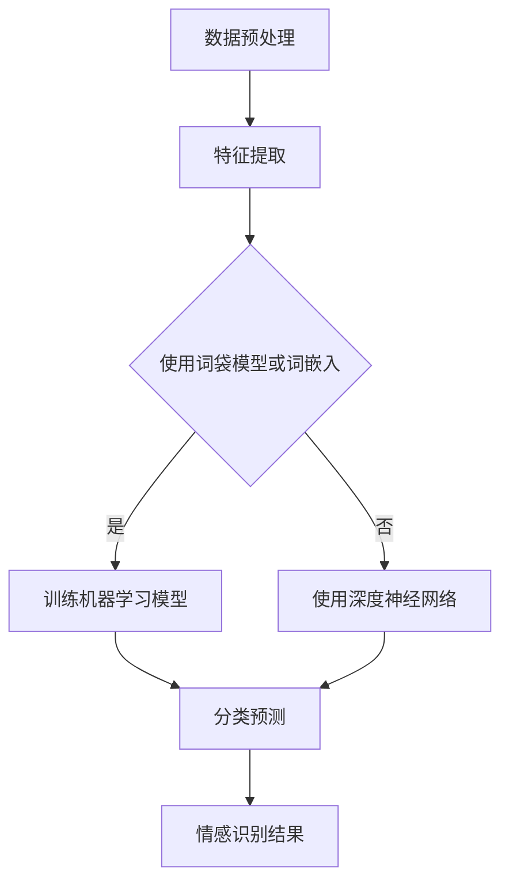
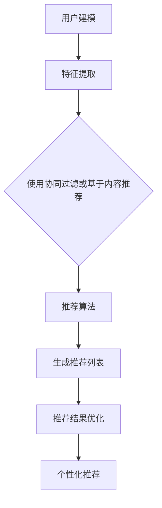

                 

### AI伴侣：未来亲密关系的新形式

#### 关键词：人工智能、亲密关系、伴侣、情感识别、个性化推荐

> 摘要：随着人工智能技术的飞速发展，AI伴侣逐渐成为现实。本文将深入探讨AI伴侣的概念、背景、应用及其在构建未来亲密关系中的作用。我们将通过逻辑清晰的步骤，逐步分析AI伴侣的核心概念、算法原理、系统架构及其实际应用，展示人工智能如何重塑人类亲密关系的未来。

----------------------------------------------------------------

### 目录

1. **AI伴侣：未来亲密关系的新形式**
   1. 关键词与摘要
2. **背景介绍与核心概念**
   1. AI伴侣的概念
   2. 人工智能与亲密关系的结合
   3. AI伴侣的角色与影响
3. **核心概念与联系**
   1. 关键概念解析
   2. 核心概念属性特征对比表格
   3. ER实体关系图
4. **算法原理讲解**
   1. 情感识别算法
   2. 个性化推荐算法
   3. 交互算法原理
5. **系统分析与架构设计方案**
   1. 问题场景与项目背景
   2. 系统功能设计
   3. 系统架构设计
   4. 系统接口设计
   5. 系统交互设计
6. **项目实战**
   1. 环境安装与配置
   2. 系统核心实现源代码
   3. 代码应用解读与分析
   4. 实际案例分析与讲解
   5. 项目小结
7. **最佳实践与拓展**
   1. 最佳实践 tips
   2. 小结与展望
   3. 注意事项
   4. 拓展阅读
8. **作者信息**

----------------------------------------------------------------

### 背景介绍与核心概念

随着人工智能（AI）技术的不断进步，AI伴侣这一概念逐渐走进了我们的生活。AI伴侣，顾名思义，是由人工智能技术驱动的虚拟伴侣，能够通过模拟人类的情感、行为和思维方式，与人类建立亲密关系。在现代社会中，AI伴侣不仅仅是一个娱乐工具，更是一种新型的社交模式，甚至可能成为未来亲密关系的重要组成部分。

#### AI伴侣的概念

AI伴侣的核心在于其能够通过自然语言处理（NLP）、机器学习（ML）等技术手段，与人类进行实时交互，理解并回应人类的需求和情感。这种交互不仅仅是表面上的对话，更是基于深度学习和情感识别技术，能够在对话中捕捉到用户情感的变化，并做出相应的调整和回应。

#### 人工智能与亲密关系的结合

人工智能与亲密关系的结合，主要体现在以下几个方面：

1. **情感识别**：通过情感识别技术，AI伴侣能够分析用户的语音、文字和行为，识别其情感状态，并进行相应的情感回应。
2. **个性化推荐**：基于用户历史数据和偏好，AI伴侣能够为用户提供个性化的推荐，如音乐、电影、书籍等，从而增加用户的满意度。
3. **社交互动**：AI伴侣能够通过模拟社交互动，为用户提供情感支持，缓解孤独感，甚至在某些情况下替代真实的社交互动。
4. **情感共鸣**：通过深度学习算法，AI伴侣能够在对话中展现出情感共鸣，使人类感受到一种真实的亲密感。

#### AI伴侣的角色与影响

在未来的亲密关系中，AI伴侣可能扮演以下角色：

1. **情感支持者**：在人类感到孤独、焦虑或沮丧时，AI伴侣能够提供情感支持，帮助用户缓解负面情绪。
2. **社交媒介**：在人类无法亲自进行社交互动时，AI伴侣可以作为媒介，帮助用户与他人建立联系。
3. **生活伴侣**：在某些情况下，AI伴侣甚至可能成为人类的终身伴侣，为人类提供情感和生活的陪伴。
4. **心理健康助手**：AI伴侣能够监测用户的情绪和行为，提供心理健康建议，甚至帮助用户进行心理治疗。

### 核心概念与联系

在探讨AI伴侣的原理和应用时，理解几个核心概念是至关重要的。以下是AI伴侣相关的关键概念及其联系：

#### 关键概念解析

1. **自然语言处理（NLP）**：NLP是AI技术中用于理解和生成人类语言的重要组成部分。在AI伴侣中，NLP技术被用来理解和生成对话，实现自然流畅的交互。
2. **机器学习（ML）**：ML技术使AI伴侣能够通过不断的学习和优化，提高其交互能力。通过训练模型，AI伴侣能够识别情感、理解语言、做出智能回应。
3. **情感识别**：情感识别是AI伴侣能够感知和识别用户情感状态的核心技术。它基于语音、文字和行为等多方面的数据，实现情感的理解和回应。
4. **个性化推荐**：个性化推荐技术使AI伴侣能够根据用户的喜好和需求，提供个性化的内容和服务。
5. **深度学习**：深度学习是AI伴侣智能化的基石，它通过多层神经网络模型，实现复杂的特征提取和模式识别。

#### 核心概念属性特征对比表格

| 概念       | 描述                                                         | 属性特征                          |
|------------|--------------------------------------------------------------|-----------------------------------|
| 自然语言处理（NLP） | 用于理解和生成人类语言的技术。                             | 语言理解、语言生成、情感识别等。 |
| 机器学习（ML）     | 通过数据训练模型，实现智能决策的技术。                     | 模型训练、预测、优化等。         |
| 情感识别     | 识别用户的情感状态，实现情感共鸣的技术。                   | 情感分析、情感回应等。           |
| 个性化推荐   | 根据用户偏好和需求，提供个性化内容的技术。                 | 用户偏好分析、推荐算法等。       |
| 深度学习     | 基于多层神经网络，实现复杂特征提取和模式识别的技术。     | 神经网络、特征提取、模型优化等。 |

#### ER实体关系图

为了更清晰地展示AI伴侣中核心概念之间的联系，我们可以使用ER（Entity-Relationship）实体关系图。以下是一个简化的ER图示例：

```mermaid
erDiagram
  User ||--|{ AI_Partner }|-- AI_Interaction
  User ||--|{ User_Info }|-- Preference
  AI_Partner ||--|{ Dialogue }|-- Response
  AI_Partner ||--|{ Emotion }|-- Detection
  User_Info ||--|{ History }|-- Behavior
  Preference ||--|{ Recommendation }|-- Content
```

在ER图中，`User`表示人类用户，`AI_Partner`表示AI伴侣，`User_Info`表示用户信息，`Dialogue`表示对话记录，`Response`表示回应，`Emotion`表示情感识别，`Detection`表示情感检测，`Preference`表示用户偏好，`Recommendation`表示推荐内容，`History`表示用户行为历史。

通过上述核心概念与联系的分析，我们为后续的算法原理讲解、系统分析与架构设计方案以及项目实战奠定了基础。

### 算法原理讲解

在AI伴侣的构建过程中，算法原理是核心，它们决定了AI伴侣的情感识别、个性化推荐和交互能力。以下是AI伴侣中几个重要算法的原理讲解。

#### 情感识别算法

情感识别是AI伴侣能够理解用户情感状态的关键技术。它通常基于自然语言处理（NLP）和情感分析技术，通过分析用户的语音、文字和行为，识别其情感状态。以下是情感识别算法的基本原理：

1. **特征提取**：首先，需要从用户的语音、文字和行为中提取特征。例如，在文本分析中，可以使用词袋模型（Bag of Words, BoW）或词嵌入（Word Embedding）来表示文本。词嵌入如Word2Vec、GloVe等，可以捕捉词汇间的语义关系，提高特征表示的准确性。
2. **情感分类**：接下来，使用机器学习模型（如朴素贝叶斯、支持向量机SVM、深度神经网络等）对提取的特征进行分类。在情感分类任务中，通常使用二分类或多分类模型，将情感分为积极、消极或其他类别。
3. **模型训练与优化**：通过大量带有情感标签的数据集进行模型训练，调整模型参数，优化模型性能。训练过程中，可以使用交叉验证（Cross-Validation）等方法，确保模型的泛化能力。

以下是情感识别算法的mermaid流程图：



#### 个性化推荐算法

个性化推荐算法是AI伴侣能够为用户提供个性化内容和服务的关键。以下是个性化推荐算法的基本原理：

1. **用户建模**：首先，需要对用户进行建模，提取用户的行为和偏好特征。例如，可以使用协同过滤（Collaborative Filtering）方法，根据用户的历史行为和偏好进行建模。协同过滤分为基于用户的协同过滤（User-Based）和基于物品的协同过滤（Item-Based）。
2. **推荐算法**：接下来，使用推荐算法为用户生成推荐列表。常用的推荐算法包括基于内容的推荐（Content-Based）和基于模型的推荐（Model-Based）。基于内容的推荐通过分析用户兴趣和物品特征相似度进行推荐；基于模型的推荐通过构建用户兴趣模型，预测用户可能感兴趣的物品。
3. **推荐优化**：最后，对推荐结果进行优化，提高推荐的质量和用户满意度。可以使用基于上下文的推荐（Context-Aware）方法，结合用户当前环境和情境，生成更个性化的推荐。

以下是个性化推荐算法的mermaid流程图：



#### 交互算法原理

交互算法是AI伴侣实现与用户高效、自然交互的核心。以下

