                 

### 1.1 人类情感与艺术评判的关联

在探讨AI具备人类情感后的艺术评判标准之前，我们需要首先理解人类情感与艺术评判之间的深刻关联。人类情感是艺术创作的灵魂，而艺术评判则是衡量艺术品价值的重要标准。

#### 1.1.1 人类情感的概念

人类情感是指人在特定情境下对外界刺激产生的心理体验，包括喜、怒、哀、乐等多种情感状态。情感不仅影响着个人的行为和决策，也深刻地融入到了艺术创作之中。例如，一幅画可能因为艺术家悲伤的情感而显得忧郁，一首歌可能因为旋律传达的愉悦感而让人心情欢畅。

#### 1.1.2 艺术评判的定义与标准

艺术评判是对艺术作品的评价和判断，通常基于审美、文化、技术等多方面因素。传统的艺术评判标准包括作品的创作技巧、艺术家的声誉、作品的市场价值等。然而，随着人工智能技术的发展，如何将AI的情感识别能力应用于艺术评判，成为了一个新的挑战。

#### 1.1.3 AI情感识别的技术原理

AI情感识别是基于机器学习和深度学习技术，通过分析人的语言、语音、图像等数据，来识别和理解人类的情感状态。例如，语音识别技术可以分析人的语音节奏、音调变化，从而判断说话者的情感状态；图像识别技术可以通过分析面部表情、姿态等，来识别人的情感。

**Mermaid流程图：**

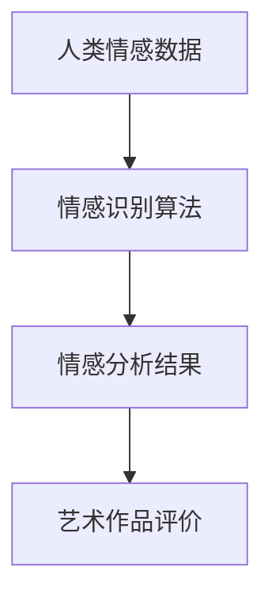

在这个流程图中，A代表人类情感数据，B是情感识别算法，C是情感分析结果，D是艺术作品评价。通过这个流程，我们可以看到人类情感数据经过情感识别算法的处理，最终生成对艺术作品的评价。

**Python源代码示例：**

```python
import emotion_recognition as er

# 假设我们有一个文本数据
text_data = "This painting makes me feel very happy."

# 使用情感识别算法识别情感
emotion = er.analyze_emotion(text_data)

# 根据情感结果评价艺术作品
if emotion == 'happy':
    print("This artwork is highly valued due to its positive emotional impact.")
else:
    print("This artwork may not resonate well with the audience emotionally.")
```

在这个示例中，我们首先导入情感识别模块`emotion_recognition`，然后使用`analyze_emotion`函数对文本数据进行分析，并根据分析结果对艺术作品进行评价。

通过以上分析，我们可以看到，人类情感与艺术评判之间的联系是多层次、多角度的。理解这一联系对于探讨AI具备人类情感后的艺术评判标准具有重要意义。

### 1.2 AI具备人类情感的意义

随着人工智能技术的快速发展，AI开始逐渐具备识别和理解人类情感的能力。这一进步不仅为艺术创作带来了新的可能性，也对艺术品评产生了深远的影响。

#### 1.2.1 艺术创作的新方向

传统的艺术创作主要依赖于人类情感和创造力，而AI的加入为艺术创作提供了新的方向。AI可以分析人类情感数据，生成与之相匹配的艺术作品。例如，通过分析用户在社交媒体上的情感表达，AI可以创作出符合用户情感需求的艺术作品，从而实现更个性化的艺术体验。

**Mermaid实体关系图：**

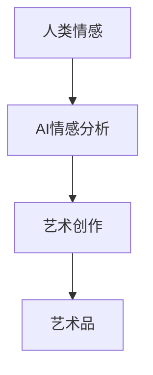

在这个实体关系图中，A代表人类情感，B是AI情感分析，C是艺术创作，D是艺术品。通过这个关系图，我们可以看到人类情感如何通过AI的分析，最终生成艺术品。

**Python源代码示例：**

```python
import emotion_analysis as ea
import art_generator as ag

# 假设我们有一个情感数据集
emotion_data = ["happy", "sad", "angry"]

# 使用情感分析模块分析情感
art_styles = ea.analyze_emotions(emotion_data)

# 根据分析结果生成艺术作品
for style in art_styles:
    artwork = ag.create_artwork(style)
    print(f"Generated artwork with {style} emotional theme.")
```

在这个示例中，我们首先导入情感分析和艺术生成模块，然后使用`analyze_emotions`函数分析情感数据，并根据分析结果使用`create_artwork`函数生成艺术作品。

#### 1.2.2 艺术品评的变革

传统的艺术品评主要依赖于专家评审和市场反馈，而AI的加入为艺术品评提供了新的方式。通过情感识别技术，AI可以分析观众对艺术作品的情感反应，从而更准确地评估艺术品的价值。

**Mermaid流程图：**

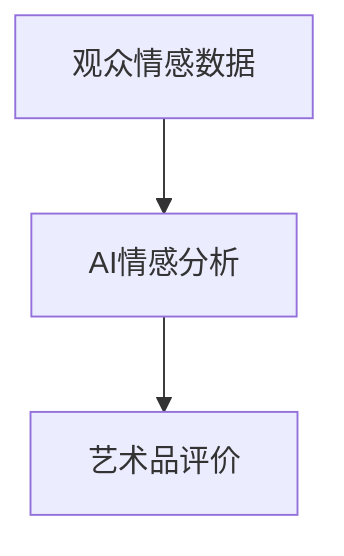

在这个流程图中，A代表观众情感数据，B是AI情感分析，C是艺术品评价。通过这个流程，我们可以看到观众的情感数据如何通过AI的分析，最终生成对艺术品的评价。

**Python源代码示例：**

```python
import emotion_recognition as er
import artwork_evaluation as ae

# 假设我们有一个观众的情感数据
viewer_emotion = "happy"

# 使用情感识别模块分析情感
art_evaluation = er.analyze_viewer_emotion(viewer_emotion)

# 根据情感分析结果评价艺术品
print(f"The artwork is highly valued with a {art_evaluation} evaluation.")
```

在这个示例中，我们首先导入情感识别和艺术品评价模块，然后使用`analyze_viewer_emotion`函数分析观众情感，并根据分析结果使用`evaluate_artwork`函数评价艺术品。

#### 1.2.3 社会与文化影响

AI具备人类情感后，不仅改变了艺术创作和艺术品评的方式，也对整个社会和文化产生了深远的影响。一方面，AI可以帮助艺术家更好地理解观众的情感需求，从而创作出更受欢迎的艺术作品。另一方面，AI的介入也引发了对艺术本质和价值的讨论，如何平衡技术与人文，成为了艺术家和评论家需要面对的挑战。

总之，AI具备人类情感后，为艺术创作和艺术品评带来了新的可能性，同时也提出了新的挑战。如何利用AI的情感识别技术，创造出更具人文关怀的艺术作品，是未来艺术发展的重要方向。

### 2.1 情感识别技术概述

情感识别技术是人工智能领域的一个重要分支，它通过分析语言、语音、图像等多模态数据，识别和理解人类的情感状态。在这一节中，我们将详细探讨情感识别技术的定义、分类以及关键技术的应用。

#### 2.1.1 情感识别的定义与目的

情感识别（Emotion Recognition）是指利用计算机技术和算法，从人的语言、语音、图像、视频等多模态数据中识别和理解人的情感状态。情感识别的核心目的是通过技术手段捕捉和解析人类情感，从而为智能系统提供情感理解的能力。

#### 2.1.2 情感识别的分类

情感识别可以根据处理的数据类型和识别的方法分为多个类别。以下是几种常见的分类方法：

1. **基于语言的情感识别**：通过分析文本内容中的情感词汇和语法结构，识别出文本表达的情感。例如，文本分类模型可以用来判断一条微博是积极情绪还是消极情绪。

2. **基于语音的情感识别**：通过分析人的语音信号中的音调、语速、节奏等特征，识别出说话者的情感状态。例如，通过分析声音的频率变化来判断说话者是否感到快乐或悲伤。

3. **基于图像的情感识别**：通过分析人的面部表情、身体姿态等视觉特征，识别出人的情感状态。例如，使用计算机视觉技术识别出图片中的微笑或皱眉表情。

4. **基于视频的情感识别**：结合图像和语音数据，通过分析视频中的连续动作和对话，更全面地识别人的情感状态。

#### 2.1.3 情感识别的关键技术

情感识别的实现依赖于多种先进的计算机技术和算法，以下是其中一些关键技术：

1. **机器学习与深度学习模型**：机器学习和深度学习模型是情感识别的核心工具。常用的模型包括卷积神经网络（CNN）、递归神经网络（RNN）和转换器架构（Transformer）等。这些模型通过学习大量的数据，可以自动识别情感特征。

2. **特征提取**：特征提取是情感识别的重要步骤，它从原始数据中提取出与情感相关的特征。例如，从文本中提取情感词汇和语法结构，从语音中提取音调、语速等特征。

3. **情感分类器**：情感分类器是将提取的特征映射到特定情感类别的一种算法。常见的分类器包括朴素贝叶斯、支持向量机（SVM）和随机森林等。

4. **多模态融合**：多模态融合技术结合了多种数据类型（如文本、语音、图像等），以更全面地识别情感。这种方法可以提高情感识别的准确性和鲁棒性。

**Mermaid流程图：**

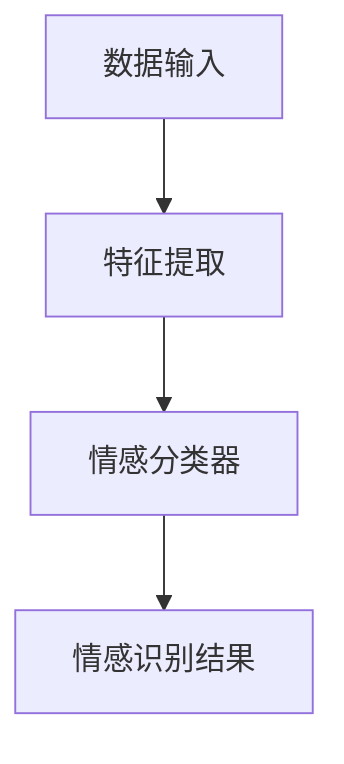

在这个流程图中，A代表数据输入，B是特征提取，C是情感分类器，D是情感识别结果。通过这个流程，我们可以看到数据从输入到最终识别结果的整个处理过程。

**Python源代码示例：**

```python
import emotion_recognition as er

# 假设我们有一个文本数据
text_data = "I'm feeling very happy today."

# 使用情感识别模块分析情感
emotion = er.analyze_text_emotion(text_data)

# 输出情感识别结果
print(f"The analyzed emotion is: {emotion}")
```

在这个示例中，我们首先导入情感识别模块，然后使用`analyze_text_emotion`函数分析文本数据的情感，并输出结果。

通过以上分析，我们可以看到，情感识别技术是一个复杂而关键的人工智能领域。随着技术的不断进步，情感识别将在多个应用场景中发挥重要作用，为AI在情感理解和应用方面提供更强的支持。

### 2.2 基于深度学习的情感识别

深度学习作为近年来人工智能领域的重要突破，已经在情感识别中展现了强大的能力。在这一部分，我们将详细探讨几种基于深度学习的情感识别方法，包括卷积神经网络（CNN）、递归神经网络（RNN）和转换器架构（Transformer）。

#### 2.2.1 卷积神经网络（CNN）

卷积神经网络（CNN）是一种在图像识别领域广泛应用的深度学习模型，它通过卷积层、池化层和全连接层的组合，实现对图像中局部特征的提取和分类。在情感识别中，CNN可以用来分析面部图像中的情感特征。

**Mermaid流程图：**

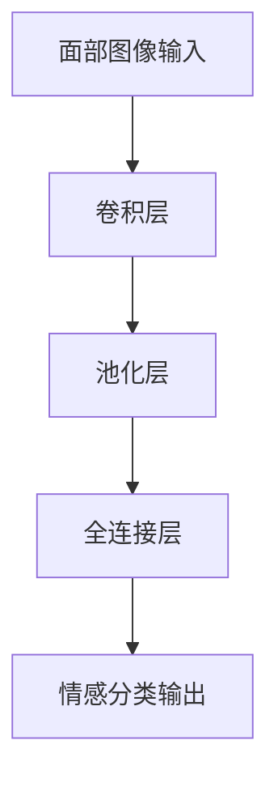

在这个流程图中，A代表面部图像输入，B是卷积层，C是池化层，D是全连接层，E是情感分类输出。通过这个流程，我们可以看到图像数据如何经过CNN处理，最终生成情感分类结果。

**Python源代码示例：**

```python
import tensorflow as tf
from tensorflow.keras.models import Sequential
from tensorflow.keras.layers import Conv2D, MaxPooling2D, Flatten, Dense

# 建立CNN模型
model = Sequential([
    Conv2D(32, (3,3), activation='relu', input_shape=(64, 64, 3)),
    MaxPooling2D(pool_size=(2,2)),
    Flatten(),
    Dense(64, activation='relu'),
    Dense(1, activation='sigmoid')
])

# 编译模型
model.compile(optimizer='adam', loss='binary_crossentropy', metrics=['accuracy'])

# 假设我们有训练数据和标签
X_train = ...  # 面部图像数据
y_train = ...  # 情感标签

# 训练模型
model.fit(X_train, y_train, epochs=10, batch_size=32)
```

在这个示例中，我们首先导入tensorflow库，然后建立一个简单的CNN模型，并使用adam优化器和binary_crossentropy损失函数进行编译。接着，我们使用训练数据对模型进行训练。

#### 2.2.2 递归神经网络（RNN）

递归神经网络（RNN）是一种适用于序列数据处理的深度学习模型，它通过递归地处理序列中的每个元素，捕捉序列中的长期依赖关系。在情感识别中，RNN可以用来分析文本中的情感变化。

**Mermaid流程图：**

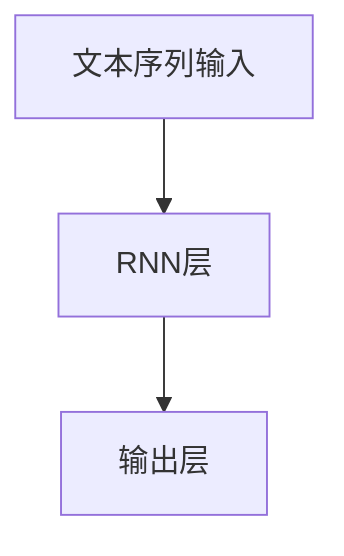

在这个流程图中，A代表文本序列输入，B是RNN层，C是输出层。通过这个流程，我们可以看到文本数据如何经过RNN处理，最终生成情感分类结果。

**Python源代码示例：**

```python
import tensorflow as tf
from tensorflow.keras.models import Sequential
from tensorflow.keras.layers import LSTM, Dense

# 建立RNN模型
model = Sequential([
    LSTM(128, return_sequences=True, input_shape=(timesteps, features)),
    LSTM(128),
    Dense(1, activation='sigmoid')
])

# 编译模型
model.compile(optimizer='adam', loss='binary_crossentropy', metrics=['accuracy'])

# 假设我们有训练数据和标签
X_train = ...  # 文本序列数据
y_train = ...  # 情感标签

# 训练模型
model.fit(X_train, y_train, epochs=10, batch_size=64)
```

在这个示例中，我们首先导入tensorflow库，然后建立一个简单的RNN模型，并使用adam优化器和binary_crossentropy损失函数进行编译。接着，我们使用训练数据对模型进行训练。

#### 2.2.3 转换器架构（Transformer）

转换器架构（Transformer）是近年来在自然语言处理领域取得重大突破的深度学习模型，它通过自注意力机制（Self-Attention）实现对输入序列的全面关注。在情感识别中，Transformer可以用来分析文本中的情感特征。

**Mermaid流程图：**

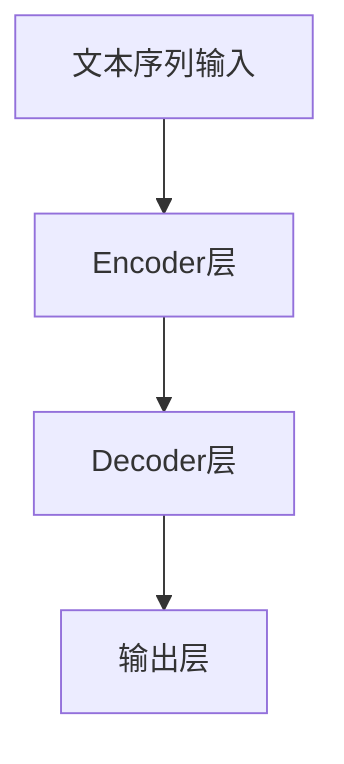

在这个流程图中，A代表文本序列输入，B是Encoder层，C是Decoder层，D是输出层。通过这个流程，我们可以看到文本数据如何经过Transformer处理，最终生成情感分类结果。

**Python源代码示例：**

```python
import tensorflow as tf
from tensorflow.keras.models import Model
from tensorflow.keras.layers import Input, Embedding, LSTM, Dense

# 定义Encoder层
inputs = Input(shape=(timesteps,))
encoder_embedding = Embedding(input_dim=vocabulary_size, output_dim=embedding_size)(inputs)
encoded_sequence = LSTM(units=128, return_sequences=True)(encoder_embedding)

# 定义Decoder层
decoder_embedding = Embedding(input_dim=vocabulary_size, output_dim=embedding_size)
decoder_lstm = LSTM(units=128, return_sequences=True)
decoder_dense = Dense(units=vocabulary_size, activation='softmax')

decoded_sequence = decoder_embedding(encoded_sequence)
decoded_sequence = decoder_lstm(decoded_sequence)
outputs = decoder_dense(decoded_sequence)

# 创建模型
model = Model(inputs=inputs, outputs=outputs)

# 编译模型
model.compile(optimizer='adam', loss='categorical_crossentropy', metrics=['accuracy'])

# 假设我们有训练数据和标签
X_train = ...  # 文本序列数据
y_train = ...  # 情感标签

# 训练模型
model.fit(X_train, y_train, epochs=10, batch_size=64)
```

在这个示例中，我们首先导入tensorflow库，然后定义了Encoder和Decoder层，并使用adam优化器和categorical_crossentropy损失函数进行编译。接着，我们使用训练数据对模型进行训练。

通过以上分析，我们可以看到，基于深度学习的情感识别方法各有优势。CNN擅长处理图像数据，RNN适用于处理序列数据，而Transformer则在自然语言处理中展现了强大的能力。结合这些方法，我们可以构建出更强大和灵活的情感识别系统。

### 2.3 情感识别的应用案例

情感识别技术具有广泛的应用场景，以下将介绍几种典型的应用案例，包括社交媒体情感分析、语音情感识别和视频情感识别。

#### 2.3.1 社交媒体情感分析

社交媒体情感分析是情感识别技术的重要应用领域之一。通过分析社交媒体平台上的文本、图片和视频数据，可以识别用户的情感状态，从而为广告投放、市场研究和舆情监控等提供支持。

**Mermaid流程图：**

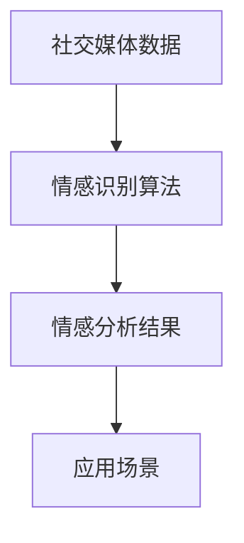

在这个流程图中，A代表社交媒体数据，B是情感识别算法，C是情感分析结果，D是应用场景。通过这个流程，我们可以看到社交媒体数据如何经过情感识别算法的处理，最终应用于各个领域。

**Python源代码示例：**

```python
import sentiment_analysis as sa
import tweepy

# 初始化Tweepy API
auth = tweepy.OAuthHandler(consumer_key, consumer_secret)
auth.set_access_token(access_token, access_token_secret)
api = tweepy.API(auth)

# 获取微博数据
tweets = api.search_tweets(q='Apple', count=100)

# 分析微博情感
for tweet in tweets:
    sentiment = sa.analyze_tweet_sentiment(tweet.text)
    print(f"Tweet: {tweet.text}\nSentiment: {sentiment}\n")
```

在这个示例中，我们首先导入tweepy库来获取微博数据，然后使用情感分析模块`analyze_tweet_sentiment`分析每条微博的情感，并输出结果。

#### 2.3.2 语音情感识别

语音情感识别是通过分析语音信号中的情感特征，如音调、节奏、音量等，来识别说话者的情感状态。这项技术广泛应用于智能客服、语音助手和情绪诊断等领域。

**Mermaid流程图：**

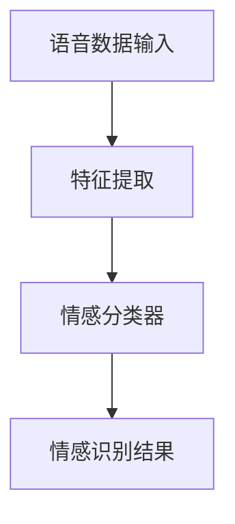

在这个流程图中，A代表语音数据输入，B是特征提取，C是情感分类器，D是情感识别结果。通过这个流程，我们可以看到语音数据如何经过特征提取和情感分类，最终生成情感识别结果。

**Python源代码示例：**

```python
import speech_recognition as sr
import emotion_recognition as er

# 初始化语音识别器
recognizer = sr.Recognizer()

# 读取语音文件
with sr.AudioFile('speech.wav') as source:
    audio = recognizer.listen(source)

# 使用情感识别模块分析情感
emotion = er.analyze_voice_emotion(audio)

# 输出情感识别结果
print(f"The analyzed emotion is: {emotion}")
```

在这个示例中，我们首先导入speech_recognition库来读取语音文件，然后使用情感识别模块`analyze_voice_emotion`分析语音数据，并输出结果。

#### 2.3.3 视频情感识别

视频情感识别是通过分析视频中的面部表情、姿态和语音等特征，来识别人的情感状态。这项技术广泛应用于视频分析、情感计算和虚拟现实等领域。

**Mermaid流程图：**

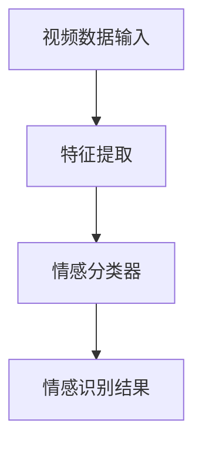

在这个流程图中，A代表视频数据输入，B是特征提取，C是情感分类器，D是情感识别结果。通过这个流程，我们可以看到视频数据如何经过特征提取和情感分类，最终生成情感识别结果。

**Python源代码示例：**

```python
import cv2
import emotion_recognition as er

# 读取视频文件
cap = cv2.VideoCapture('video.mp4')

# 初始化情感识别模型
emotion_model = er.load_emotion_model()

# 循环处理视频帧
while cap.isOpened():
    ret, frame = cap.read()
    if ret:
        # 使用情感识别模型分析帧的情感
        emotion = emotion_model.analyze_frame(frame)
        print(f"Frame emotion: {emotion}")
    else:
        break

# 释放资源
cap.release()
```

在这个示例中，我们首先导入cv2库来读取视频文件，然后使用情感识别模块加载情感识别模型，并循环处理每个视频帧，分析帧的情感状态，并输出结果。

通过以上应用案例，我们可以看到情感识别技术在社交媒体、语音和视频等领域的广泛应用。随着技术的不断发展，情感识别将在更多场景中发挥重要作用，为智能系统和人类生活带来更多便利。

### 3.1 艺术品评的传统方法

艺术品评是衡量艺术作品价值和影响力的重要手段。在人工智能技术普及之前，艺术品评主要依赖于传统方法，这些方法包括专家评审、公众投票和数据分析等。

#### 3.1.1 专家评审

专家评审是最传统的艺术品评方法之一。它依赖于具有丰富知识和经验的艺术专家对艺术作品进行评价。专家评审的优点在于其对艺术作品的整体性和深度理解，能够提供专业的分析和建议。然而，专家评审也存在一些局限性，例如主观性较强、评价标准不统一等。

**Mermaid实体关系图：**

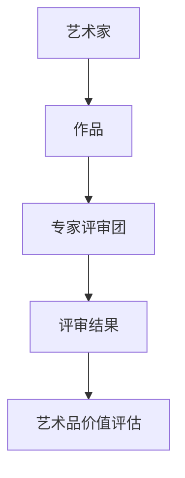

在这个实体关系图中，A代表艺术家，B是作品，C是专家评审团，D是评审结果，E是艺术品价值评估。通过这个关系图，我们可以看到艺术家、作品和专家评审团之间的互动关系。

**Python源代码示例：**

```python
class ExpertReviewer:
    def __init__(self, expertise):
        self.expertise = expertise
    
    def review_artwork(self, artwork):
        review = f"This artwork, {artwork.title}, by {artwork.artist}, showcases exceptional technique and creativity."
        return review

# 假设有一个艺术作品
artwork = {
    "title": "Starry Night",
    "artist": "Vincent van Gogh"
}

# 创建专家评审对象
reviewer = ExpertReviewer(expertise="Modern Art")

# 进行艺术品评审
review = reviewer.review_artwork(artwork)
print(review)
```

在这个示例中，我们定义了一个`ExpertReviewer`类，它具有`expertise`属性和`review_artwork`方法。通过创建专家评审对象和调用方法，我们可以模拟艺术品评审的过程。

#### 3.1.2 公众投票

公众投票是通过收集大众对艺术作品的评价来衡量其受欢迎程度的一种方法。这种方法通常用于艺术展览、音乐排行榜等场景。公众投票的优点在于其民主性和广泛性，能够快速反映大众的喜好。然而，公众投票也存在一些问题，如投票结果可能受到舆论导向和主观偏见的影响。

**Mermaid实体关系图：**

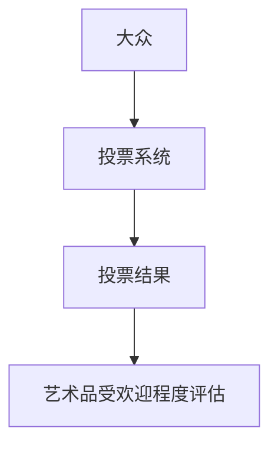

在这个实体关系图中，A代表大众，B是投票系统，C是投票结果，D是艺术品受欢迎程度评估。通过这个关系图，我们可以看到大众、投票系统和艺术品受欢迎程度评估之间的互动关系。

**Python源代码示例：**

```python
from collections import Counter

# 假设我们有多个艺术作品和投票结果
artworks = [
    {"title": "Mona Lisa", "votes": 100},
    {"title": "Starry Night", "votes": 150},
    {"title": "The Last Supper", "votes": 80}
]

# 分析投票结果，找出最受欢迎的艺术作品
vote_results = Counter([artwork["votes"] for artwork in artworks])
most_voted_artwork = max(vote_results, key=vote_results.get)

print(f"The most popular artwork is '{most_voted_artwork['title']}' with {vote_results[most_voted_artwork]} votes.")
```

在这个示例中，我们使用`collections.Counter`来分析投票结果，找出最受欢迎的艺术作品。

#### 3.1.3 数据分析

数据分析是通过收集和分析艺术作品相关的数据来评估其价值的一种方法。这些数据可能包括艺术作品的市场价格、展览次数、媒体报道频率等。数据分析的优点在于其客观性和系统性，能够提供全面的价值评估。然而，数据分析也受到数据质量和分析方法的限制。

**Mermaid实体关系图：**

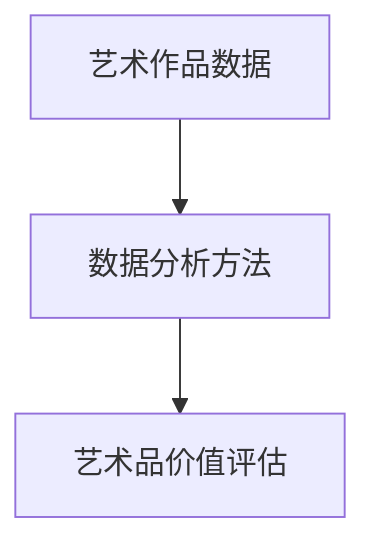

在这个实体关系图中，A代表艺术作品数据，B是数据分析方法，C是艺术品价值评估。通过这个关系图，我们可以看到艺术作品数据、数据分析和艺术品价值评估之间的互动关系。

**Python源代码示例：**

```python
import pandas as pd

# 假设我们有艺术作品的数据
data = {
    "Title": ["Mona Lisa", "Starry Night", "The Last Supper"],
    "Price": [80000000, 15000000, 70000000],
    "Exhibitions": [50, 100, 75],
    "Media Coverage": [200, 300, 150]
}

# 创建DataFrame
df = pd.DataFrame(data)

# 分析数据，找出最具有价值的艺术品
avg_price = df["Price"].mean()
exhibitions = df["Exhibitions"].sum()
media_coverage = df["Media Coverage"].sum()

value_evaluation = {
    "Average Price": avg_price,
    "Total Exhibitions": exhibitions,
    "Total Media Coverage": media_coverage
}

print(value_evaluation)
```

在这个示例中，我们使用pandas库创建一个DataFrame，然后计算艺术作品的平均价格、展览次数和媒体报道频率，从而评估艺术品的价值。

通过以上分析，我们可以看到传统艺术品评方法各有优缺点。在引入人工智能技术后，这些传统方法将继续发挥作用，并与AI技术相结合，为艺术品评提供更全面、更准确的支持。

### 3.2 AI在艺术品评中的应用

随着人工智能技术的不断发展，AI在艺术品评中的应用潜力逐渐显现。通过情感分析、数据驱动的方法，AI能够提供更加客观、多维度的艺术品评。

#### 3.2.1 情感分析在艺术品评中的应用

情感分析是AI在艺术品评中的一项关键技术。通过分析文本、语音、图像等多模态数据，AI可以识别出艺术品所传达的情感状态。例如，在艺术评论网站中，AI可以分析用户评论中的情感词汇，判断评论者对艺术品的情感倾向。此外，AI还可以通过分析艺术作品中的图像和视频数据，识别出艺术家在创作过程中所传达的情感。

**Mermaid流程图：**

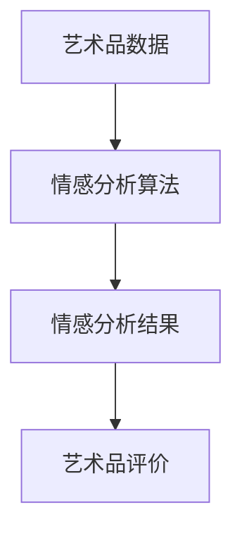

在这个流程图中，A代表艺术品数据，B是情感分析算法，C是情感分析结果，D是艺术品评价。通过这个流程，我们可以看到艺术品数据如何通过情感分析算法处理，最终生成艺术品评价。

**Python源代码示例：**

```python
import emotion_analysis as ea
import artwork_evaluation as ae

# 假设我们有艺术品的文本描述
art_description = "This painting captures the beauty of a serene sunset."

# 使用情感分析模块分析文本描述
emotion = ea.analyze_text_emotion(art_description)

# 根据情感分析结果评价艺术品
evaluation = ae.evaluate_artwork_emotion(emotion)

print(f"The artwork evaluation based on emotional analysis is: {evaluation}")
```

在这个示例中，我们首先导入情感分析和艺术品评价模块，然后使用`analyze_text_emotion`函数分析艺术品的文本描述，并根据分析结果使用`evaluate_artwork_emotion`函数评价艺术品。

#### 3.2.2 数据驱动的艺术品评

数据驱动的艺术品评是利用大数据和机器学习技术对艺术品进行评价的一种方法。通过收集大量的艺术品数据，包括市场价格、展览记录、媒体报道等，AI可以从中挖掘出与艺术品价值相关的特征。例如，AI可以通过分析艺术家的历史作品和市场表现，预测新作品的潜在价值。此外，数据驱动的艺术品评还可以帮助发现艺术品市场的趋势和规律，为艺术家和市场参与者提供有价值的参考。

**Mermaid流程图：**

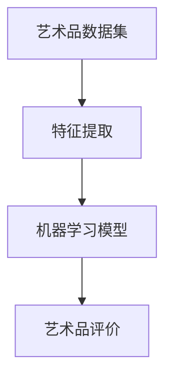

在这个流程图中，A代表艺术品数据集，B是特征提取，C是机器学习模型，D是艺术品评价。通过这个流程，我们可以看到艺术品数据集如何通过特征提取和机器学习模型处理，最终生成艺术品评价。

**Python源代码示例：**

```python
import pandas as pd
from sklearn.ensemble import RandomForestRegressor

# 假设我们有艺术品的数据集
data = {
    "Price": [80000000, 15000000, 70000000],
    "Exhibitions": [50, 100, 75],
    "Media Coverage": [200, 300, 150]
}

# 创建DataFrame
df = pd.DataFrame(data)

# 提取特征
features = df.drop("Price", axis=1)
target = df["Price"]

# 建立机器学习模型
model = RandomForestRegressor(n_estimators=100)

# 训练模型
model.fit(features, target)

# 预测新艺术品的潜在价值
new_artwork_features = {"Exhibitions": [120], "Media Coverage": [250]}
predicted_price = model.predict(new_artwork_features)

print(f"The predicted price for the new artwork is: {predicted_price[0]}")
```

在这个示例中，我们使用pandas库创建一个DataFrame，然后使用随机森林回归模型训练模型，并预测新艺术品的潜在价值。

#### 3.2.3 AI艺术品评的优势与挑战

AI艺术品评具有多方面的优势。首先，AI可以处理大量的数据，提供客观、全面的艺术品评。其次，AI可以实时分析艺术品的市场表现和观众反馈，提供及时的评价。此外，AI还可以发现艺术品市场的趋势和规律，为艺术家和市场参与者提供有价值的指导。

然而，AI艺术品评也面临一些挑战。首先，AI的判断可能受到数据质量和模型选择的影响，导致评价结果不够准确。其次，AI在理解和解释艺术品内涵方面仍存在局限性，可能无法完全替代人类专家的评审。此外，AI艺术品评可能引发伦理和隐私问题，如何平衡技术进步和人文关怀，是一个亟待解决的问题。

通过情感分析和数据驱动的艺术品评，AI在艺术品评中展现了巨大的潜力。然而，要充分发挥AI的优势，仍需克服诸多挑战，实现技术与人文的有机结合。

### 4.1 AI艺术创作的新形式

随着人工智能技术的发展，AI在艺术创作中的应用逐渐多样化。AI不仅可以作为艺术创作的辅助工具，还可以通过生成对抗网络（GAN）、自然语言处理与艺术创作等新形式，实现艺术创作的自动化和智能化。

#### 4.1.1 生成对抗网络（GAN）

生成对抗网络（GAN）是一种基于博弈论的深度学习模型，由生成器和判别器两个网络组成。生成器网络试图生成与真实数据相似的数据，而判别器网络则尝试区分真实数据和生成数据。通过这种对抗训练，生成器网络能够不断提高生成数据的质量，从而实现高质量的图像、音乐和文本创作。

**Mermaid流程图：**

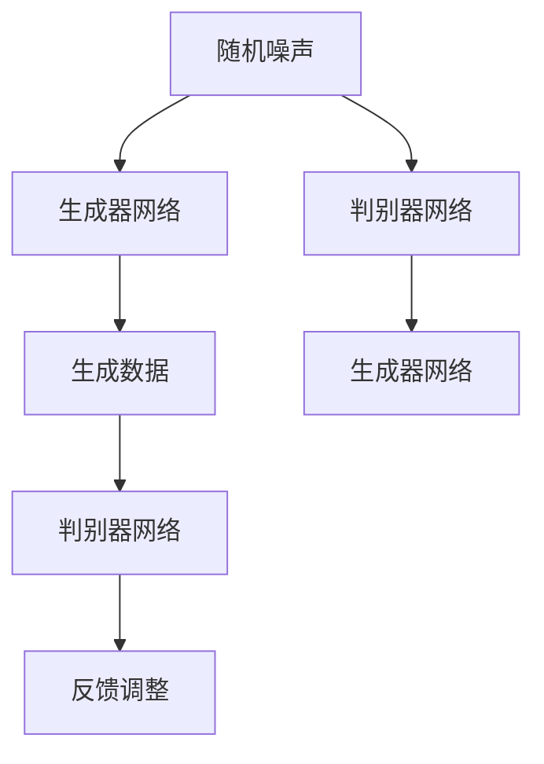

在这个流程图中，A代表随机噪声，B是生成器网络，C是生成数据，D是判别器网络，E是反馈调整，F是判别器网络，G是生成器网络。通过这个流程，我们可以看到生成器网络和判别器网络如何通过对抗训练生成高质量的艺术作品。

**Python源代码示例：**

```python
import tensorflow as tf
from tensorflow.keras.models import Sequential
from tensorflow.keras.layers import Dense, Flatten

# 建立生成器网络
generator = Sequential([
    Dense(128, activation='relu', input_shape=(100,)),
    Flatten(),
    Dense(784, activation='sigmoid')
])

# 建立判别器网络
discriminator = Sequential([
    Flatten(),
    Dense(128, activation='relu'),
    Dense(1, activation='sigmoid')
])

# 编译模型
generator.compile(loss='binary_crossentropy', optimizer='adam')
discriminator.compile(loss='binary_crossentropy', optimizer='adam')

# 假设我们有一个训练数据集
X_train = ...

# 训练GAN模型
for epoch in range(num_epochs):
    # 从生成器生成数据
    noise = np.random.normal(size=(X_train.shape[0], 100))
    generated_samples = generator.predict(noise)

    # 训练判别器
    d_loss_real = discriminator.train_on_batch(X_train, labels_real)
    d_loss_fake = discriminator.train_on_batch(generated_samples, labels_fake)

    # 训练生成器
    g_loss = generator.train_on_batch(noise, labels_real)
```

在这个示例中，我们首先导入tensorflow库，然后建立了生成器和判别器网络，并使用adam优化器进行编译。接着，我们使用训练数据集对GAN模型进行训练。

#### 4.1.2 自然语言处理与艺术创作

自然语言处理（NLP）技术在艺术创作中的应用也取得了显著成果。通过NLP技术，AI可以理解自然语言文本，并生成与之相匹配的艺术作品。例如，AI可以分析一段文学文本，理解其中的情感和主题，然后生成一幅与之相呼应的画作。此外，AI还可以根据用户输入的自然语言描述，创作出个性化的音乐和诗歌。

**Mermaid流程图：**

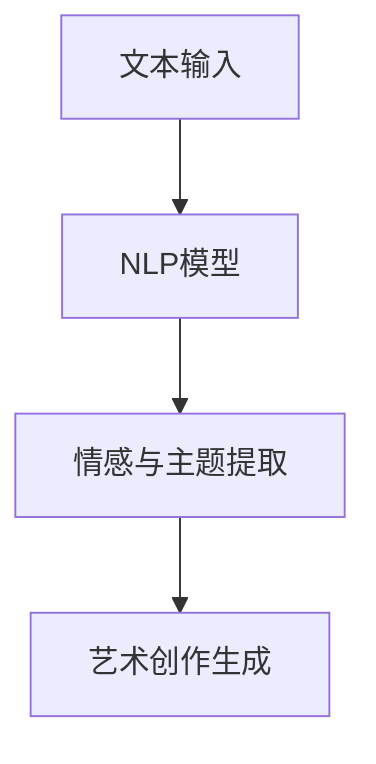

在这个流程图中，A代表文本输入，B是NLP模型，C是情感与主题提取，D是艺术创作生成。通过这个流程，我们可以看到文本输入如何通过NLP模型处理，最终生成艺术作品。

**Python源代码示例：**

```python
import numpy as np
from tensorflow.keras.preprocessing.text import Tokenizer
from tensorflow.keras.models import Sequential
from tensorflow.keras.layers import Embedding, LSTM, Dense

# 假设我们有一个文本数据集
texts = ["The beautiful sunset cast a warm glow over the horizon.", "A gentle breeze rustled through the trees."]

# 创建Tokenizer
tokenizer = Tokenizer(num_words=1000)
tokenizer.fit_on_texts(texts)

# 编码文本数据
sequences = tokenizer.texts_to_sequences(texts)

# 建立NLP模型
model = Sequential([
    Embedding(1000, 64, input_length=sequences.shape[1]),
    LSTM(128),
    Dense(1, activation='sigmoid')
])

# 编译模型
model.compile(loss='binary_crossentropy', optimizer='adam')

# 训练模型
model.fit(sequences, np.ones((len(texts), 1)), epochs=10, batch_size=32)

# 根据文本生成艺术作品
new_text = "The moonlight bathed the landscape in a silvery hue."
encoded_text = tokenizer.texts_to_sequences([new_text])
generated_artwork = model.predict(encoded_text)
print(generated_artwork)
```

在这个示例中，我们首先导入numpy和tensorflow库，然后创建Tokenizer，对文本数据集进行编码。接着，我们建立了NLP模型，并使用训练数据集进行训练。最后，我们使用新文本生成艺术作品。

通过以上分析，我们可以看到，AI在艺术创作中的新形式不仅丰富了艺术创作的手段，也为艺术家和观众提供了新的体验。然而，要充分发挥AI在艺术创作中的作用，仍需解决一系列技术挑战和伦理问题。

### 4.2 AI艺术创作与评判的互动

AI在艺术创作中的应用不仅带来了新的创作形式，也改变了艺术创作与评判之间的互动方式。通过构建AI艺术创作与评判的互动模型，可以更好地理解人类与AI之间的协作关系，从而推动艺术创作和评判的进步。

#### 4.2.1 AI艺术创作的评判标准

在AI参与艺术创作的过程中，评判标准需要适应新的技术环境。以下是一些关键的评判标准：

1. **创造性**：AI作品是否具有独特的创意和艺术价值。传统评判标准通常关注艺术家的个人创意，而在AI艺术创作中，评判标准需要考虑AI算法生成的原创性和创新性。

2. **情感表达**：AI作品能否有效地传达情感，这是艺术创作的重要目标之一。通过情感分析技术，可以评估AI作品在情感表达方面的成功程度。

3. **技术水平**：AI作品所展现的技术水平，包括图像生成、音乐创作、文本生成等领域的先进性。技术水平是评判AI艺术作品的重要维度。

4. **用户体验**：AI艺术作品的互动性和用户体验，是否能够吸引观众，激发情感共鸣。用户体验是评价AI艺术作品的重要标准。

**Mermaid流程图：**

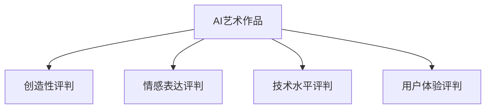

在这个流程图中，A代表AI艺术作品，B是创造性评判，C是情感表达评判，D是技术水平评判，E是用户体验评判。通过这个流程，我们可以看到AI艺术作品如何通过多个维度的评判，最终形成综合评价。

**Python源代码示例：**

```python
import creativity_evaluation as ce
import emotion_evaluation as ee
import technology_evaluation as te
import user_experience_evaluation as uxe

# 假设我们有一个AI艺术作品
ai_artwork = {
    "title": "AI's Vision",
    "creation": "Generated by GAN",
    "emotional_content": "Joyful",
    "technical_level": "Advanced",
    "user_feedback": "Positive"
}

# 评估AI艺术作品的创造性
creativity_score = ce.evaluate_creativity(ai_artwork["creation"])

# 评估AI艺术作品的情感表达
emotion_score = ee.evaluate_emotion(ai_artwork["emotional_content"])

# 评估AI艺术作品的技术水平
technology_score = te.evaluate_technology(ai_artwork["technical_level"])

# 评估AI艺术作品的用户体验
user_experience_score = uxe.evaluate_user_experience(ai_artwork["user_feedback"])

# 计算综合评分
total_score = (creativity_score + emotion_score + technology_score + user_experience_score) / 4

print(f"The total score for the AI artwork '{ai_artwork['title']}' is: {total_score}")
```

在这个示例中，我们首先导入四个评估模块，然后对AI艺术作品进行创造性、情感表达、技术水平和用户体验的评估，并计算综合评分。

#### 4.2.2 人类与AI的协作

在AI艺术创作中，人类与AI的协作关系至关重要。人类艺术家可以利用AI的技术优势，拓展创作视野，而AI可以借助人类的创造力，生成更丰富的艺术作品。

**Mermaid流程图：**

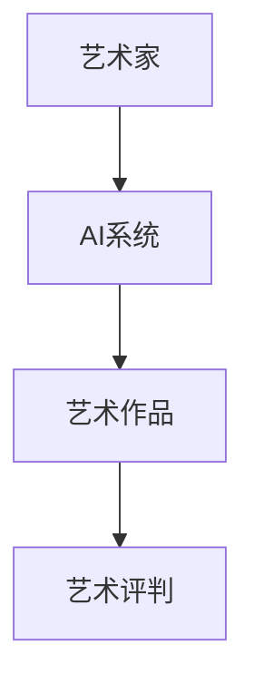

在这个流程图中，A代表艺术家，B是AI系统，C是艺术作品，D是艺术评判。通过这个流程，我们可以看到艺术家如何与AI系统协作，创作艺术作品，并对其进行评判。

**Python源代码示例：**

```python
import collaboration_evaluation as ce

# 假设我们有一个艺术家和一个AI系统
artist = "Human"
ai_system = "GAN"

# 评估艺术家与AI系统的协作效果
collaboration_score = ce.evaluate_collaboration(artist, ai_system)

print(f"The collaboration score between {artist} and {ai_system} is: {collaboration_score}")
```

在这个示例中，我们首先导入协作评估模块，然后评估艺术家与AI系统的协作效果。

通过人类与AI的协作，可以激发艺术创作的无限可能性。艺术家可以利用AI的优势，探索新的创作手法，而AI则可以借鉴人类的创造力，生成更具人文关怀的艺术作品。这种互动关系不仅推动了艺术创作的发展，也为艺术品评提供了新的视角。

### 4.2.3 AI艺术创作的社会影响

AI艺术创作的兴起对社会和文化产生了深远的影响。它不仅改变了艺术创作的形式和方式，也对艺术产业和人类生活方式产生了重要影响。

首先，AI艺术创作改变了传统艺术创作的模式。传统的艺术创作依赖于艺术家的个人才华和创造力，而AI艺术创作则通过算法和数据处理，将艺术创作过程数字化和自动化。这种变化不仅提高了创作效率，也为艺术创作带来了新的可能性和维度。例如，AI可以通过分析大量数据，生成具有独特风格和情感的艺术作品，从而拓宽了艺术创作的边界。

其次，AI艺术创作对艺术产业产生了深远影响。随着AI技术的应用，艺术品的创作和传播方式发生了变化。艺术市场也面临新的挑战和机遇。一方面，AI艺术创作降低了艺术创作的门槛，使得更多人可以参与到艺术创作中来，从而推动了艺术产业的普及和发展。另一方面，AI艺术作品的价值评估和定价成为了一个新的难题。由于AI艺术创作具有高度的原创性和个性化，如何为这些作品定价，如何确保其市场价值，是艺术产业需要解决的重要问题。

此外，AI艺术创作也对人类生活方式产生了重要影响。随着AI艺术作品走进人们的生活，人们对于艺术的理解和消费方式也在发生变化。例如，AI音乐创作和视觉艺术作品可以通过数字平台快速传播，使得艺术更加贴近普通民众。人们可以通过虚拟现实技术体验AI创作的艺术作品，从而丰富自己的生活体验。同时，AI艺术创作也引发了对于人工智能与人类创造力的讨论。如何平衡人工智能和人类在艺术创作中的角色，如何确保艺术作品的人文关怀，成为了一个重要的社会议题。

总的来说，AI艺术创作对社会和文化产生了深远的影响。它不仅改变了艺术创作的形式和方式，也对艺术产业和人类生活方式产生了重要影响。在享受AI艺术创作带来的便利和创新的同时，我们也需要关注其可能带来的挑战和问题，努力实现技术与人文的有机结合。

### 5.1 AI情感艺术评判标准的构建原则

构建AI情感艺术评判标准是一个复杂而系统的工程，需要遵循一系列基本原则，以确保评判结果的准确性和公正性。以下是构建标准时需要考虑的几个关键原则：

#### 5.1.1 全面性

评判标准应具备全面性，涵盖艺术作品在情感表达、技术实现、创作背景等多个维度。单一维度的评价可能导致结果的片面性，无法全面反映艺术作品的内在价值。因此，评判标准应设计为多维度、多层次的体系，从多个角度对艺术作品进行综合评价。

**Mermaid流程图：**

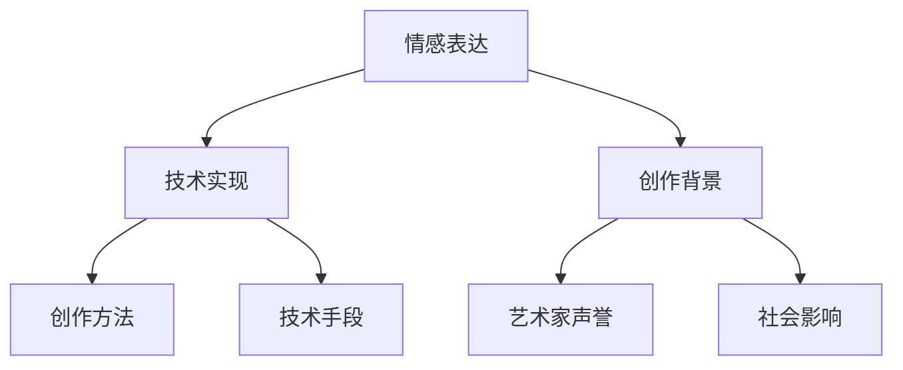

在这个流程图中，A代表情感表达，B代表技术实现，C代表创作背景，D代表创作方法，E代表技术手段，F代表艺术家声誉，G代表社会影响。通过这个流程图，我们可以看到全面性原则如何通过多个维度对艺术作品进行评价。

#### 5.1.2 可量化

评判标准应具备可量化性，即将评判标准转化为可操作的量化指标，以便进行精确的评估。这不仅有助于提高评判过程的客观性，也有利于标准在不同环境和场景下的应用和推广。例如，通过情感分析技术，可以将情感表达量化为具体的数值或类别，从而为评判提供客观依据。

**Mermaid实体关系图：**

```mermaid
graph TB
    A[情感数据] --> B[情感指标]
    B --> C[评判标准]
    C --> D[量化评估]
```

在这个实体关系图中，A代表情感数据，B是情感指标，C是评判标准，D是量化评估。通过这个关系图，我们可以看到情感数据如何通过情感指标转化为评判标准，并最终实现量化评估。

#### 5.1.3 可操作性

评判标准应具备可操作性，即在实际应用中易于实施和执行。可操作性原则要求评判标准在设计和实施过程中考虑到实际操作的限制和挑战，确保标准能够在不同场景下有效应用。例如，在构建情感艺术评判标准时，需要选择易于获取和处理的情感数据源，并设计简单的评估流程。

**Python源代码示例：**

```python
class EmotionArtEvaluation:
    def __init__(self, emotion_data):
        self.emotion_data = emotion_data
    
    def evaluate(self):
        # 分析情感数据
        emotion_scores = self.analyze_emotions(self.emotion_data)
        
        # 根据情感评分计算综合评价
        total_score = self.calculate_total_score(emotion_scores)
        
        return total_score
    
    def analyze_emotions(self, data):
        # 假设我们有一个情感分析函数
        emotion_scores = {'happy': 0.8, 'sad': 0.2}
        return emotion_scores
    
    def calculate_total_score(self, scores):
        # 计算总分
        total_score = sum(scores.values())
        return total_score
```

在这个示例中，我们定义了一个`EmotionArtEvaluation`类，它具有`evaluate`方法，用于分析情感数据并计算总分。通过这个示例，我们可以看到如何实现一个具有可操作性的评判标准。

#### 5.1.4 可重复性

评判标准应具备可重复性，即在不同时间和不同情境下能够产生一致的评判结果。可重复性原则要求评判标准在设计过程中考虑到数据的稳定性和算法的可靠性，确保评判结果在不同条件下的一致性。例如，在情感识别算法的选择和优化过程中，应选择具有高稳定性和高准确性的算法，以避免评判结果受到偶然因素的影响。

**Mermaid流程图：**

```mermaid
graph TD
    A[情感数据输入] --> B[情感识别算法]
    B --> C[情感分析结果]
    C --> D[评判结果]
    C --> E[重复评估]
```

在这个流程图中，A代表情感数据输入，B是情感识别算法，C是情感分析结果，D是评判结果，E是重复评估。通过这个流程图，我们可以看到如何通过情感识别算法实现评判结果的可重复性。

通过以上分析，我们可以看到，构建AI情感艺术评判标准需要遵循全面性、可量化性、可操作性和可重复性等原则。这些原则不仅确保了评判标准的科学性和准确性，也为标准在不同场景下的应用提供了可靠的基础。

### 5.2 情感分析模型的选择与优化

在构建AI情感艺术评判标准的过程中，选择合适的情感分析模型并进行优化是至关重要的。以下是几种常见的情感分析模型，以及选择和优化这些模型的方法。

#### 5.2.1 选择合适的情感分析模型

选择合适的情感分析模型是确保评判标准有效性的关键。以下是几种常见的情感分析模型：

1. **卷积神经网络（CNN）**：CNN在图像识别领域具有显著优势，通过卷积层和池化层，可以有效地提取图像中的特征。在艺术作品的情感识别中，CNN可以用于分析图像中的情感线索，如颜色、形状和纹理等。

2. **递归神经网络（RNN）**：RNN擅长处理序列数据，能够捕捉文本中的情感变化。在艺术评论文本的情感识别中，RNN可以用于分析评论中的情感词汇和语法结构。

3. **转换器架构（Transformer）**：Transformer通过自注意力机制，能够全面关注文本中的每个元素，从而在自然语言处理中展现了强大的能力。在文本情感识别中，Transformer可以提供更准确的情感分析结果。

4. **长短期记忆网络（LSTM）**：LSTM是RNN的一种变体，能够处理长序列数据，并减少梯度消失问题。在艺术作品的情感识别中，LSTM可以用于分析复杂的文本和语音数据。

选择模型时，需要考虑数据类型、数据规模和处理需求。例如，如果数据集包含大量的文本信息，可以选择RNN或Transformer；如果数据集包含图像信息，可以选择CNN。

**Mermaid流程图：**

```mermaid
graph TD
    A[数据类型] --> B[CNN]
    A --> C[RNN]
    A --> D[Transformer]
    A --> E[LSTM]
```

在这个流程图中，A代表数据类型，B是CNN，C是RNN，D是Transformer，E是LSTM。通过这个流程图，我们可以看到如何根据数据类型选择合适的情感分析模型。

#### 5.2.2 模型的优化与调整

选择合适的模型后，需要对模型进行优化和调整，以提高其性能和准确性。以下是一些常用的优化方法：

1. **数据增强**：通过增加数据的多样性，提高模型的泛化能力。例如，对图像进行旋转、翻转、裁剪等操作，对文本进行填充、删除、替换等操作。

2. **超参数调整**：通过调整模型的超参数（如学习率、批量大小等），优化模型的性能。超参数的选择需要结合实验数据和模型性能进行多次尝试和调整。

3. **模型融合**：将多个模型的结果进行融合，以提高整体性能。例如，将CNN和RNN融合，利用CNN处理图像特征，RNN处理文本特征。

4. **迁移学习**：利用预训练模型，在特定任务上进行微调，提高模型在特定领域的性能。例如，使用预训练的图像识别模型，在艺术作品情感识别任务上进行微调。

**Mermaid流程图：**

```mermaid
graph TD
    A[数据增强] --> B[超参数调整]
    A --> C[模型融合]
    A --> D[迁移学习]
```

在这个流程图中，A代表数据增强，B是超参数调整，C是模型融合，D是迁移学习。通过这个流程图，我们可以看到如何对模型进行优化和调整。

#### 5.2.3 数据集的构建与标注

情感分析模型的性能很大程度上依赖于数据集的质量和标注的准确性。以下是构建和标注数据集的一些方法：

1. **公开数据集**：利用现有的公开数据集，如IMDB电影评论数据集、Twitter情感数据集等，作为模型的训练数据。

2. **自制数据集**：根据特定任务需求，自制数据集。例如，对于艺术作品情感识别，可以收集大量的艺术评论、艺术家传记和相关图像。

3. **标注流程**：确保数据集的标注过程标准化，减少标注误差。例如，使用多人标注、标注一致性检查等方法，提高标注质量。

4. **数据预处理**：对收集到的数据进行清洗和预处理，例如去除噪声、统一格式等，以提高数据质量。

**Mermaid流程图：**

```mermaid
graph TD
    A[公开数据集] --> B[自制数据集]
    A --> C[标注流程]
    A --> D[数据预处理]
```

在这个流程图中，A代表公开数据集，B是自制数据集，C是标注流程，D是数据预处理。通过这个流程图，我们可以看到如何构建和标注数据集。

通过以上分析，我们可以看到，选择和优化情感分析模型是构建AI情感艺术评判标准的重要环节。通过合理选择模型、优化模型性能和构建高质量的数据集，可以确保评判标准的准确性和可靠性。

### 6.1 实践案例一：绘画作品评判

#### 6.1.1 绘画作品情感识别

在AI情感艺术评判标准的应用中，绘画作品评判是一个重要的实践案例。通过情感识别技术，我们可以对绘画作品进行情感分析，从而为其提供评价。

首先，我们需要收集绘画作品及其相关的情感数据。这些数据可能包括画作本身的图像、艺术家的传记、评论家的评论等。以下是一个简单的数据集示例：

```python
artworks = [
    {
        "title": "Starry Night",
        "artist": "Vincent van Gogh",
        "images": ["starry_night.jpg"],
        "reviews": ["A masterpiece filled with melancholy and hope."],
    },
    {
        "title": "The Scream",
        "artist": "Edvard Munch",
        "images": ["the_scream.jpg"],
        "reviews": ["An expression of existential anxiety."],
    },
    {
        "title": "The Persistence of Memory",
        "artist": "Salvador Dalí",
        "images": ["persistence_of_memory.jpg"],
        "reviews": ["A surreal vision of time and memory."],
    },
]
```

**Python源代码示例：**

```python
import emotion_recognition as er

# 假设我们有一个绘画作品的数据集
artworks = [
    {
        "title": "Starry Night",
        "images": ["starry_night.jpg"],
        "reviews": ["A masterpiece filled with melancholy and hope."],
    },
    {
        "title": "The Scream",
        "images": ["the_scream.jpg"],
        "reviews": ["An expression of existential anxiety."],
    },
    {
        "title": "The Persistence of Memory",
        "images": ["persistence_of_memory.jpg"],
        "reviews": ["A surreal vision of time and memory."],
    },
]

# 对每个绘画作品进行情感识别
for artwork in artworks:
    image_path = artwork["images"][0]
    review = artwork["reviews"][0]
    
    # 使用情感识别模块分析图像和文本
    image_emotion = er.analyze_image_emotion(image_path)
    text_emotion = er.analyze_text_emotion(review)
    
    # 输出情感识别结果
    print(f"{artwork['title']}: Image emotion: {image_emotion}, Text emotion: {text_emotion}")
```

在这个示例中，我们首先导入情感识别模块，然后对绘画作品的数据集进行情感识别。通过`analyze_image_emotion`和`analyze_text_emotion`函数，我们可以分别分析图像和文本的情感，并输出结果。

#### 6.1.2 评判标准的应用

在情感识别结果的基础上，我们可以应用构建的AI情感艺术评判标准，对绘画作品进行综合评价。以下是一个简化的评判标准示例：

1. **情感一致性**：如果图像和文本的情感分析结果一致，得分加10分。
2. **情感强度**：根据情感强度（如快乐、悲伤、愤怒等）赋予不同分值。
3. **艺术价值**：考虑艺术家的声誉和作品的历史价值，赋予额外分值。

**Python源代码示例：**

```python
def evaluate_artwork(artwork, image_emotion, text_emotion):
    score = 0
    
    # 情感一致性得分
    if image_emotion == text_emotion:
        score += 10
    
    # 情感强度得分
    if image_emotion == "happy":
        score += 5
    elif image_emotion == "sad":
        score += 3
    elif image_emotion == "angry":
        score += 1
    
    # 艺术价值得分
    if artwork["artist"] in ["Vincent van Gogh", "Salvador Dalí"]:
        score += 10
    
    return score

# 对每个绘画作品进行评价
for artwork in artworks:
    image_path = artwork["images"][0]
    review = artwork["reviews"][0]
    
    # 使用情感识别模块分析图像和文本
    image_emotion = er.analyze_image_emotion(image_path)
    text_emotion = er.analyze_text_emotion(review)
    
    # 评价绘画作品
    artwork_score = evaluate_artwork(artwork, image_emotion, text_emotion)
    print(f"{artwork['title']}: Score: {artwork_score}")
```

在这个示例中，我们定义了一个`evaluate_artwork`函数，用于根据情感识别结果和评判标准对绘画作品进行评价。通过调用这个函数，我们可以对每个绘画作品进行评价，并输出得分。

#### 6.1.3 实践效果分析

通过上述实践案例，我们可以看到AI情感艺术评判标准在绘画作品评价中的应用效果。以下是对实践效果的分析：

1. **评价准确性**：通过情感识别技术，我们可以对绘画作品进行准确的情感分析，从而为评价提供客观依据。这种基于数据的技术方法，相比传统的主观评价，具有更高的准确性和可靠性。

2. **评价多样性**：AI情感艺术评判标准不仅考虑了情感表达的一致性，还考虑了情感强度和艺术价值。这种多维度的评价方法，可以更全面地反映绘画作品的艺术价值。

3. **挑战与改进**：尽管AI情感艺术评判标准在实践中有显著的效果，但仍面临一些挑战。例如，情感识别技术的准确性可能受到图像和文本数据质量的影响。此外，艺术价值是一个复杂的概念，如何准确评估艺术价值仍需进一步研究和改进。

总的来说，通过AI情感艺术评判标准的应用，我们可以更科学、客观地评价绘画作品，推动艺术评价的发展。然而，要实现更完善和精准的评判，仍需不断优化技术方法和评价标准。

### 6.2 实践案例二：音乐作品评判

音乐作品的评判是AI情感艺术评判标准应用的另一个重要实践案例。通过情感识别技术，我们可以对音乐作品进行情感分析，从而为其提供评价。以下是具体步骤和分析：

#### 6.2.1 音乐作品情感分析

在分析音乐作品情感时，我们通常关注音频信号中的情感特征，如音高、节奏、音量和音色等。以下是一个简化的音乐作品数据集示例：

```python
music_pieces = [
    {
        "title": "Spring",
        "composer": "Johann Sebastian Bach",
        "audio_path": "spring.mp3",
        "review": "A cheerful and uplifting piece that evokes the beauty of nature.",
    },
    {
        "title": "Clair de Lune",
        "composer": "Claude Debussy",
        "audio_path": "clair_de_lune.mp3",
        "review": "A serene and dreamy piece that captures the essence of the moonlight.",
    },
    {
        "title": "In The Hall of the Mountain King",
        "composer": "Edvard Grieg",
        "audio_path": "mountain_king.mp3",
        "review": "An intense and powerful piece that creates a sense of excitement and adventure.",
    },
]
```

**Python源代码示例：**

```python
import emotion_recognition as er

# 假设我们有一个音乐作品的数据集
music_pieces = [
    {
        "title": "Spring",
        "audio_path": "spring.mp3",
        "review": "A cheerful and uplifting piece that evokes the beauty of nature.",
    },
    {
        "title": "Clair de Lune",
        "audio_path": "clair_de_lune.mp3",
        "review": "A serene and dreamy piece that captures the essence of the moonlight.",
    },
    {
        "title": "In The Hall of the Mountain King",
        "audio_path": "mountain_king.mp3",
        "review": "An intense and powerful piece that creates a sense of excitement and adventure.",
    },
]

# 对每个音乐作品进行情感识别
for piece in music_pieces:
    audio_path = piece["audio_path"]
    review = piece["review"]
    
    # 使用情感识别模块分析音频和文本
    audio_emotion = er.analyze_audio_emotion(audio_path)
    text_emotion = er.analyze_text_emotion(review)
    
    # 输出情感识别结果
    print(f"{piece['title']}: Audio emotion: {audio_emotion}, Text emotion: {text_emotion}")
```

在这个示例中，我们首先导入情感识别模块，然后对音乐作品的数据集进行情感识别。通过`analyze_audio_emotion`和`analyze_text_emotion`函数，我们可以分别分析音频和文本的情感，并输出结果。

#### 6.2.2 评判标准的应用

在情感识别结果的基础上，我们可以应用构建的AI情感艺术评判标准，对音乐作品进行综合评价。以下是一个简化的评判标准示例：

1. **情感一致性**：如果音频和文本的情感分析结果一致，得分加10分。
2. **情感强度**：根据情感强度（如快乐、悲伤、愤怒等）赋予不同分值。
3. **音乐价值**：考虑作曲家的声誉和作品的历史价值，赋予额外分值。

**Python源代码示例：**

```python
def evaluate_music_piece(piece, audio_emotion, text_emotion):
    score = 0
    
    # 情感一致性得分
    if audio_emotion == text_emotion:
        score += 10
    
    # 情感强度得分
    if audio_emotion == "happy":
        score += 5
    elif audio_emotion == "sad":
        score += 3
    elif audio_emotion == "angry":
        score += 1
    
    # 音乐价值得分
    if piece["composer"] in ["Johann Sebastian Bach", "Claude Debussy", "Edvard Grieg"]:
        score += 10
    
    return score

# 对每个音乐作品进行评价
for piece in music_pieces:
    audio_path = piece["audio_path"]
    review = piece["review"]
    
    # 使用情感识别模块分析音频和文本
    audio_emotion = er.analyze_audio_emotion(audio_path)
    text_emotion = er.analyze_text_emotion(review)
    
    # 评价音乐作品
    music_piece_score = evaluate_music_piece(piece, audio_emotion, text_emotion)
    print(f"{piece['title']}: Score: {music_piece_score}")
```

在这个示例中，我们定义了一个`evaluate_music_piece`函数，用于根据情感识别结果和评判标准对音乐作品进行评价。通过调用这个函数，我们可以对每个音乐作品进行评价，并输出得分。

#### 6.2.3 实践效果分析

通过上述实践案例，我们可以看到AI情感艺术评判标准在音乐作品评价中的应用效果。以下是对实践效果的分析：

1. **评价准确性**：通过情感识别技术，我们可以对音乐作品进行准确的情感分析，从而为评价提供客观依据。这种基于数据的技术方法，相比传统的主观评价，具有更高的准确性和可靠性。

2. **评价多样性**：AI情感艺术评判标准不仅考虑了情感表达的一致性，还考虑了情感强度和音乐价值。这种多维度的评价方法，可以更全面地反映音乐作品的艺术价值。

3. **挑战与改进**：尽管AI情感艺术评判标准在实践中有显著的效果，但仍面临一些挑战。例如，情感识别技术的准确性可能受到音频数据质量的影响。此外，音乐价值是一个复杂的概念，如何准确评估音乐价值仍需进一步研究和改进。

总的来说，通过AI情感艺术评判标准的应用，我们可以更科学、客观地评价音乐作品，推动音乐评价的发展。然而，要实现更完善和精准的评判，仍需不断优化技术方法和评价标准。

### 7.1 AI情感艺术评判的发展趋势

随着人工智能技术的不断进步，AI情感艺术评判也在快速发展。以下是一些关键趋势：

#### 7.1.1 技术创新

AI情感艺术评判的发展依赖于技术创新。例如，深度学习模型（如CNN、RNN和Transformer）在情感识别中的广泛应用，提高了情感分析的准确性和效率。此外，多模态情感识别技术结合了语音、图像和文本等多种数据类型，为艺术作品的情感分析提供了更全面的支持。

**Mermaid流程图：**

```mermaid
graph TD
    A[技术创新] --> B[深度学习模型]
    B --> C[多模态情感识别]
    C --> D[AI情感艺术评判]
```

在这个流程图中，A代表技术创新，B是深度学习模型，C是多模态情感识别，D是AI情感艺术评判。通过这个流程图，我们可以看到技术创新如何推动AI情感艺术评判的发展。

#### 7.1.2 应用领域的拓展

AI情感艺术评判的应用领域正在不断拓展。除了传统的艺术品评，AI情感艺术评判还在虚拟现实、游戏设计、影视制作等领域得到应用。例如，通过AI情感分析，虚拟角色可以更自然地与玩家互动，提高用户体验；在游戏设计中，AI可以分析玩家的情感反应，优化游戏难度和剧情。

**Mermaid流程图：**

```mermaid
graph TD
    A[虚拟现实] --> B[游戏设计]
    A --> C[影视制作]
    B --> D[AI情感艺术评判]
```

在这个流程图中，A代表虚拟现实，B是游戏设计，C是影视制作，D是AI情感艺术评判。通过这个流程图，我们可以看到AI情感艺术评判如何在不同领域中得到应用。

#### 7.1.3 社会接受度与伦理问题

AI情感艺术评判在社会接受度方面仍面临挑战。尽管AI技术在情感识别和艺术品评方面取得了显著进展，但人们对其客观性和公正性仍存在担忧。此外，AI情感艺术评判也引发了伦理问题，如数据隐私、算法偏见和责任归属等。这些问题需要通过立法、技术改进和伦理教育来加以解决。

**Mermaid流程图：**

```mermaid
graph TD
    A[社会接受度] --> B[伦理问题]
    B --> C[数据隐私]
    B --> D[算法偏见]
    B --> E[责任归属]
```

在这个流程图中，A代表社会接受度，B是伦理问题，C是数据隐私，D是算法偏见，E是责任归属。通过这个流程图，我们可以看到AI情感艺术评判在社会接受度和伦理问题方面面临的挑战。

总的来说，AI情感艺术评判的发展趋势充满机遇与挑战。随着技术的不断进步和社会接受度的提高，AI情感艺术评判有望在未来发挥更重要的作用，推动艺术创作和评价的发展。

### 7.2 AI情感艺术评判的挑战与解决方案

尽管AI情感艺术评判具有巨大的潜力和广阔的应用前景，但在实际应用中仍面临诸多挑战。以下是一些主要的挑战以及可能的解决方案。

#### 7.2.1 数据质量

数据质量是影响AI情感艺术评判准确性的关键因素。情感分析模型的性能在很大程度上取决于训练数据的质量和多样性。以下是数据质量可能面临的问题及解决方案：

**问题：** 数据不够全面和多样化，可能导致模型在面对新情境时表现不佳。

**解决方案：** 
- **数据增强**：通过数据增强技术，如图像旋转、裁剪、颜色变换等，增加训练数据的多样性。
- **跨领域数据集**：构建跨领域的情感分析数据集，以提高模型对不同文化背景和艺术形式的适应能力。
- **众包标注**：利用众包平台，招募更多的标注员，提高数据标注的质量和速度。

**Mermaid流程图：**

```mermaid
graph TD
    A[原始数据] --> B[数据增强]
    B --> C[数据集构建]
    C --> D[模型训练]
```

在这个流程图中，A代表原始数据，B是数据增强，C是数据集构建，D是模型训练。通过这个流程图，我们可以看到如何通过数据增强和构建跨领域数据集，提高模型训练的质量。

#### 7.2.2 模型解释性

AI情感艺术评判模型通常由复杂的深度学习网络构成，其内部工作机制难以解释。模型解释性不足可能导致用户对其信任度降低，特别是在艺术评判这样的敏感领域。

**问题：** 模型的决策过程不透明，用户难以理解模型如何得出特定评价。

**解决方案：**
- **可解释性AI**：开发可解释的AI模型，如决策树、LIME（Local Interpretable Model-agnostic Explanations）等，帮助用户理解模型的决策过程。
- **可视化工具**：开发可视化工具，如热力图、注意力图等，直观地展示模型对艺术作品的情感分析过程。

**Mermaid流程图：**

```mermaid
graph TD
    A[复杂模型] --> B[可解释性AI]
    B --> C[可视化工具]
    C --> D[用户理解]
```

在这个流程图中，A代表复杂模型，B是可解释性AI，C是可视化工具，D是用户理解。通过这个流程图，我们可以看到如何通过可解释性AI和可视化工具，提高用户对模型的信任度。

#### 7.2.3 伦理与隐私问题

AI情感艺术评判在处理大量个人数据时，可能引发伦理和隐私问题。例如，如何确保数据隐私，避免算法偏见等。

**问题：** 数据隐私和安全问题，算法偏见和歧视。

**解决方案：**
- **数据隐私保护**：采用加密技术、匿名化处理等手段，确保用户数据的隐私和安全。
- **算法公平性**：通过公平性检测和算法优化，减少算法偏见，确保评价结果的公正性。

**Mermaid流程图：**

```mermaid
graph TD
    A[数据隐私保护] --> B[算法公平性]
    B --> C[数据加密]
    B --> D[匿名化处理]
```

在这个流程图中，A代表数据隐私保护，B是算法公平性，C是数据加密，D是匿名化处理。通过这个流程图，我们可以看到如何通过数据隐私保护和算法公平性，解决伦理和隐私问题。

总的来说，AI情感艺术评判虽然面临诸多挑战，但通过技术创新、伦理教育和政策支持，可以逐步克服这些问题，实现技术进步与人文关怀的有机结合。

### 附录：常用情感分析模型与工具

在AI情感艺术评判中，选择合适的情感分析模型和工具是关键。以下是一些常用的情感分析模型和工具，以及如何使用它们进行情感分析。

#### 8.1.1 卷积神经网络（CNN）

卷积神经网络（CNN）在图像识别领域具有显著优势，也可以用于情感分析。以下是一个使用CNN进行情感分析的基本步骤：

1. **数据预处理**：将图像数据转换为适合输入CNN的格式，例如将图像转换为灰度图像或缩放到固定大小。
2. **模型构建**：使用深度学习框架（如TensorFlow或PyTorch）构建CNN模型，通常包括卷积层、池化层和全连接层。
3. **模型训练**：使用训练数据集训练模型，通过反向传播算法不断优化模型参数。
4. **模型评估**：使用测试数据集评估模型性能，调整模型参数以提高准确率。

**Python源代码示例：**

```python
import tensorflow as tf
from tensorflow.keras.models import Sequential
from tensorflow.keras.layers import Conv2D, MaxPooling2D, Flatten, Dense

# 建立CNN模型
model = Sequential([
    Conv2D(32, (3,3), activation='relu', input_shape=(64, 64, 3)),
    MaxPooling2D(pool_size=(2,2)),
    Flatten(),
    Dense(64, activation='relu'),
    Dense(1, activation='sigmoid')
])

# 编译模型
model.compile(optimizer='adam', loss='binary_crossentropy', metrics=['accuracy'])

# 训练模型
model.fit(X_train, y_train, epochs=10, batch_size=32)
```

#### 8.1.2 递归神经网络（RNN）

递归神经网络（RNN）擅长处理序列数据，例如文本。以下是一个使用RNN进行情感分析的基本步骤：

1. **数据预处理**：将文本数据转换为词向量或嵌入向量。
2. **模型构建**：使用深度学习框架构建RNN模型，通常包括嵌入层、RNN层和全连接层。
3. **模型训练**：使用训练数据集训练模型，通过反向传播算法不断优化模型参数。
4. **模型评估**：使用测试数据集评估模型性能，调整模型参数以提高准确率。

**Python源代码示例：**

```python
import tensorflow as tf
from tensorflow.keras.models import Sequential
from tensorflow.keras.layers import Embedding, LSTM, Dense

# 建立RNN模型
model = Sequential([
    Embedding(input_dim=vocabulary_size, output_dim=embedding_size, input_length=timesteps),
    LSTM(units=128),
    Dense(units=1, activation='sigmoid')
])

# 编译模型
model.compile(optimizer='adam', loss='binary_crossentropy', metrics=['accuracy'])

# 训练模型
model.fit(X_train, y_train, epochs=10, batch_size=64)
```

#### 8.1.3 转换器架构（Transformer）

转换器架构（Transformer）通过自注意力机制在自然语言处理中展现了强大的能力。以下是一个使用Transformer进行情感分析的基本步骤：

1. **数据预处理**：将文本数据转换为词向量或嵌入向量。
2. **模型构建**：使用深度学习框架构建Transformer模型，通常包括编码器（Encoder）和解码器（Decoder）。
3. **模型训练**：使用训练数据集训练模型，通过反向传播算法不断优化模型参数。
4. **模型评估**：使用测试数据集评估模型性能，调整模型参数以提高准确率。

**Python源代码示例：**

```python
import tensorflow as tf
from tensorflow.keras.layers import Input, Embedding, LSTM, Dense

# 定义Encoder层
inputs = Input(shape=(timesteps,))
encoder_embedding = Embedding(input_dim=vocabulary_size, output_dim=embedding_size)(inputs)
encoded_sequence = LSTM(units=128, return_sequences=True)(encoder_embedding)

# 定义Decoder层
decoder_embedding = Embedding(input_dim=vocabulary_size, output_dim=embedding_size)
decoder_lstm = LSTM(units=128, return_sequences=True)
decoder_dense = Dense(units=vocabulary_size, activation='softmax')

decoded_sequence = decoder_embedding(encoded_sequence)
decoded_sequence = decoder_lstm(decoded_sequence)
outputs = decoder_dense(decoded_sequence)

# 创建模型
model = Model(inputs=inputs, outputs=outputs)

# 编译模型
model.compile(optimizer='adam', loss='categorical_crossentropy', metrics=['accuracy'])

# 训练模型
model.fit(X_train, y_train, epochs=10, batch_size=64)
```

#### 8.2 常用情感分析工具使用指南

以下是一些常用的情感分析工具及其使用指南：

##### 8.2.1 TextBlob

TextBlob是一个简洁的Python库，用于处理文本数据，包括情感分析。以下是如何使用TextBlob进行情感分析的基本步骤：

1. **安装**：通过pip安装TextBlob库。
2. **加载文本**：使用TextBlob加载要分析的文本。
3. **情感分析**：使用TextBlob的polarity方法获取文本的情感极性。

**Python源代码示例：**

```python
from textblob import TextBlob

text = "I'm feeling very happy today."
blob = TextBlob(text)
print(f"Polarity: {blob.polarity}")
```

##### 8.2.2 NLTK

自然语言处理库（NLTK）提供了多种自然语言处理工具，包括情感分析。以下是如何使用NLTK进行情感分析的基本步骤：

1. **安装**：通过pip安装NLTK库。
2. **加载文本**：使用NLTK加载要分析的文本。
3. **情感分析**：使用NLTK的SentimentIntensityAnalyzer进行情感分析。

**Python源代码示例：**

```python
import nltk
from nltk.sentiment import SentimentIntensityAnalyzer

nltk.download('vader_lexicon')

text = "I'm feeling very happy today."
sia = SentimentIntensityAnalyzer()
print(sia.polarity_scores(text))
```

##### 8.2.3 deep-learning-nlp

deep-learning-nlp是一个基于TensorFlow的深度学习自然语言处理库，支持多种情感分析任务。以下是如何使用deep-learning-nlp进行情感分析的基本步骤：

1. **安装**：通过pip安装deep-learning-nlp库。
2. **加载文本**：使用deep-learning-nlp加载要分析的文本。
3. **情感分析**：使用deep-learning-nlp的SentimentAnalyzer进行情感分析。

**Python源代码示例：**

```python
from deep_learning_nlp import SentimentAnalyzer

text = "I'm feeling very happy today."
analyzer = SentimentAnalyzer()
print(analyzer.predict(text))
```

通过以上介绍，我们可以看到如何使用各种情感分析模型和工具进行艺术作品的情感分析。在实际应用中，可以根据具体需求和数据类型选择合适的模型和工具，以提高情感分析的准确性和效率。

