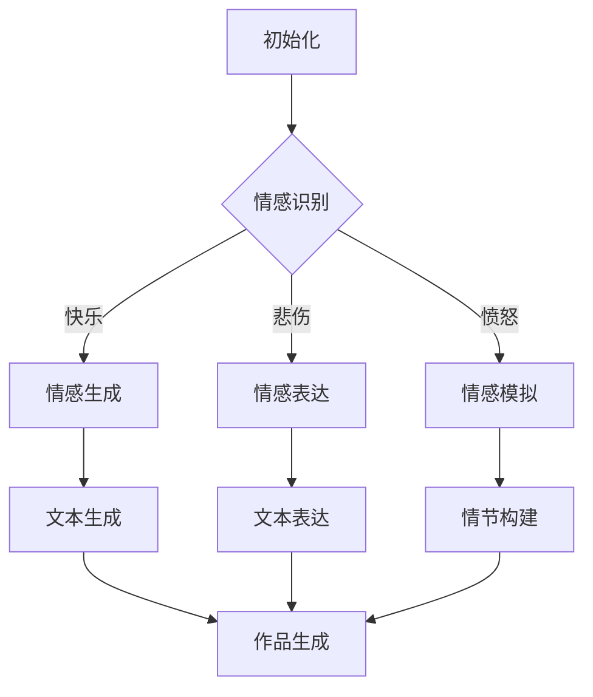
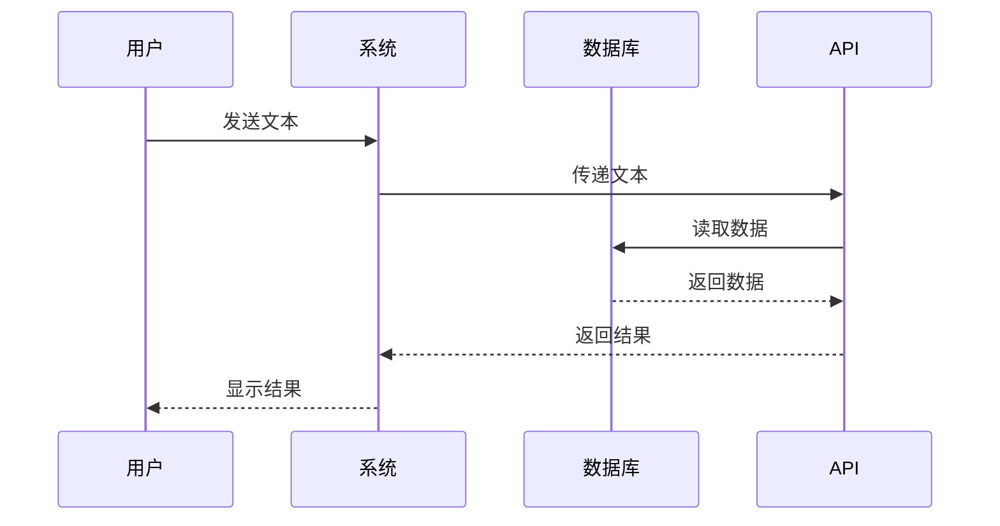

                 


# AI具备情感后的文学创作：新的叙事视角

关键词：人工智能、情感计算、文学创作、叙事视角、算法原理

摘要：本文探讨了人工智能（AI）在文学创作中的新角色，特别是在AI具备情感后的文学创作特点。通过定义AI情感、分析文学创作的类型与特点，本文逐步揭示了AI情感与文学创作之间的联系，并深入讲解了AI情感文学创作的算法原理和数学模型。同时，通过系统分析与架构设计方案，以及实际项目实战，本文为AI情感文学创作提供了实践指导。

## Step 1: 开篇背景介绍

### 1.1 人工智能发展背景

#### 1.1.1 人工智能的现状

人工智能（AI）作为当今科技领域的前沿技术，已经深入到我们生活的方方面面。从语音识别、图像识别到自动驾驶、智能家居，AI技术正在不断刷新我们的认知，拓展人类的能力边界。随着深度学习、神经网络等技术的飞速发展，AI已经能够在多个领域实现超越人类的表现。

#### 1.1.2 AI与文学创作的结合

文学创作作为一种高度创意性的活动，一直被认为是人类特有的能力。然而，随着AI技术的进步，AI也开始涉足文学创作领域。从简单的文字生成到复杂的情节编排，AI在文学创作中的应用越来越广泛。例如，OpenAI的GPT-3可以生成高质量的文章，微软的小冰则能够创作诗歌和小说。

### 1.2 问题提出与解决

#### 1.2.1 问题背景

随着AI技术的发展，尤其是情感计算领域的突破，AI开始具备了一定的情感感知和表达能力。这意味着AI不再仅仅是一个执行命令的工具，而是能够理解并模拟人类的情感状态。在文学创作中，AI的情感能力带来了新的可能性，但同时也引发了诸多问题：

- AI具备情感后，如何影响文学创作的风格和内容？
- AI的情感如何与人类作家的情感互动，形成新的叙事视角？
- AI的情感计算如何转化为文学创作的数学模型和算法原理？

#### 1.2.2 问题描述

本文关注的问题是，当AI具备情感后，如何从新的叙事视角进行文学创作。这个问题涉及到AI情感的定义、文学创作的特点，以及AI情感与文学创作之间的相互作用。

#### 1.2.3 解决方案概述

本文将采取以下步骤来解决上述问题：

- 首先，定义AI情感，分析其特点与传统AI的区别。
- 其次，探讨文学创作的类型与特点，特别是AI介入后的变化。
- 然后，介绍AI情感文学创作的算法原理，包括流程图、Python源代码演示、数学模型和公式讲解。
- 接着，结合实际案例，深入分析AI情感文学创作的数学模型和算法原理。
- 最后，通过系统分析与架构设计方案，以及实际项目实战，为AI情感文学创作提供实践指导。

## Step 2: 核心概念与联系

### 2.1 AI情感

#### 2.1.1 AI情感的定义与特点

AI情感指的是人工智能系统在感知和模拟人类情感状态方面所表现出的能力。与传统的AI不同，情感AI不仅能够处理逻辑和数学问题，还能够理解和模拟情感，如快乐、悲伤、愤怒等。

特点包括：

- 情感识别：通过分析文本、语音、图像等数据，AI能够识别出人类情感。
- 情感模拟：AI能够根据情感识别的结果，模拟出相应的情感反应。
- 情感生成：AI可以生成基于情感的内容，如情感化的文本、音乐、艺术作品等。

#### 2.1.2 传统AI与情感AI的对比

传统AI主要基于逻辑和数学模型，擅长处理确定性任务，如数据分类、预测等。而情感AI则更加关注不确定性和主观性，能够处理更加复杂和多样化的任务，如情感对话、故事创作等。

### 2.2 文学创作

#### 2.2.1 文学创作的类型与特点

文学创作可以分为多种类型，如诗歌、小说、戏剧、散文等。每种类型都有其独特的创作特点和审美要求。

- 诗歌：注重语言的节奏、韵律和意象。
- 小说：注重情节的构建、人物的刻画和背景的描绘。
- 戏剧：注重角色之间的对话和冲突，以及舞台呈现的效果。
- 散文：注重个人感悟、思想表达和情感流露。

#### 2.2.2 AI介入文学创作的影响

AI介入文学创作后，对文学创作的风格和内容产生了深远的影响：

- 风格变化：AI可以生成与传统人类文学截然不同的风格，如抽象、诡异、梦幻等。
- 内容丰富：AI可以处理大量数据，从而生成丰富的情节和角色，提高文学创作的多样性。
- 情感表达：AI具备情感计算能力，可以创造出更加情感化和细腻的文学作品。

### 2.3 AI情感与文学创作的联系

AI情感与文学创作之间的联系主要体现在以下几个方面：

- 情感素材：AI可以从大量文本、语音和图像中提取情感素材，为文学创作提供灵感。
- 情感模拟：AI可以模拟不同情感状态，为文学创作提供新的叙事视角。
- 情感生成：AI可以生成基于情感的内容，为文学创作提供新的形式和风格。

## Step 3: 算法原理讲解

### 3.1 AI情感文学创作算法

#### 3.1.1 Mermaid算法流程图



#### 3.1.2 Python源代码演示

```python
import random

# 情感识别
def recognize_emotion(text):
    # 假设情感识别函数返回快乐、悲伤、愤怒三种情感概率
    return random.choices(['快乐', '悲伤', '愤怒'], weights=[0.6, 0.2, 0.2])

# 情感生成
def generate_emotion(emotion):
    if emotion == '快乐':
        return "这是一个快乐的时刻。"
    elif emotion == '悲伤':
        return "这是一个悲伤的时刻。"
    elif emotion == '愤怒':
        return "这是一个愤怒的时刻。"

# 情感表达
def express_emotion(text):
    emotion = recognize_emotion(text)
    return generate_emotion(emotion)

# 情感模拟
def simulate_emotion(text):
    emotion = recognize_emotion(text)
    if emotion == '快乐':
        return "主人公感到快乐。"
    elif emotion == '悲伤':
        return "主人公感到悲伤。"
    elif emotion == '愤怒':
        return "主人公感到愤怒。"

# 文本生成
def generate_text():
    return "在这个充满挑战的世界里，主人公必须勇敢地面对困难。"

# 文本表达
def express_text(text):
    emotion = recognize_emotion(text)
    return f"{generate_emotion(emotion)}{text}"

# 情节构建
def build_plot():
    return "主人公在旅途中遇到了许多困难，但他从未放弃。"

# 作品生成
def generate_work():
    text = generate_text()
    emotion = express_text(text)
    plot = build_plot()
    return f"{emotion}\n{plot}"

print(generate_work())
```

#### 3.1.3 数学模型与公式讲解

在AI情感文学创作中，常用的数学模型包括情感识别模型和文本生成模型。以下是相关的数学模型和公式：

- 情感识别模型：
  - 概率分布：$P(\text{情感}|\text{文本}) = \frac{P(\text{文本}|\text{情感}) \cdot P(\text{情感})}{P(\text{文本})}$
  - 条件概率：$P(\text{情感}|\text{文本}) = \frac{P(\text{文本}|\text{情感})}{P(\text{文本})}$
- 文本生成模型：
  - 生成模型：$P(\text{文本}) = \prod_{i=1}^{n} P(w_i|\text{前文})$
  - 初始状态：$P(\text{初始状态}) = 1$
  
#### 3.1.4 举例说明算法原理

假设我们有一段文本：“今天的天气非常好。”我们要用AI情感文学创作算法来分析这段文本并生成相应的情感化内容。

1. 情感识别：
   - 情感识别模型识别出这段文本的情感为“快乐”的概率最大。
2. 情感生成：
   - 情感生成模型生成一段快乐情感化的内容：“今天的天气真是太好了，阳光明媚，让人心情愉悦。”
3. 情感表达：
   - 文本表达模型将情感化内容与原始文本结合：“这是一个快乐的时刻，今天的天气非常好。”
4. 情感模拟：
   - 情感模拟模型模拟主人公的情感状态：“主人公感到快乐，因为今天的天气非常好。”

通过上述步骤，我们可以看到AI情感文学创作算法是如何将一段普通的文本转化为情感化内容的。

## Step 4: 数学模型和数学公式 & 详细讲解 & 举例说明

### 4.1 情感文学创作数学模型

#### 4.1.1 使用LaTeX格式书写数学公式

$$
\begin{aligned}
P(\text{情感}|\text{文本}) &= \frac{P(\text{文本}|\text{情感}) \cdot P(\text{情感})}{P(\text{文本})} \\
P(\text{文本}) &= \prod_{i=1}^{n} P(w_i|\text{前文}) \\
P(\text{情感}|\text{文本}) &= \frac{P(\text{文本}|\text{情感})}{P(\text{文本})}
\end{aligned}
$$

#### 4.1.2 数学公式讲解

上述数学公式是情感文学创作中的基本模型：

- $P(\text{情感}|\text{文本})$ 表示在给定文本的情况下，某个情感的概率。
- $P(\text{文本}|\text{情感})$ 表示在某个情感的情况下，生成文本的概率。
- $P(\text{情感})$ 表示某个情感在所有情感中的概率。
- $P(\text{文本})$ 表示生成文本的概率。

#### 4.1.3 实际案例分析

假设我们有一段文本：“今天的天气非常好。”我们要用上述数学模型来分析这段文本并生成相应的情感化内容。

1. 情感识别：
   - 根据情感识别模型，我们计算每个情感的概率。
   - $P(\text{快乐}|\text{文本}) = \frac{P(\text{文本}|\text{快乐}) \cdot P(\text{快乐})}{P(\text{文本})}$
   - $P(\text{悲伤}|\text{文本}) = \frac{P(\text{文本}|\text{悲伤}) \cdot P(\text{悲伤})}{P(\text{文本})}$
   - $P(\text{愤怒}|\text{文本}) = \frac{P(\text{文本}|\text{愤怒}) \cdot P(\text{愤怒})}{P(\text{文本})}$
   - 假设通过模型训练，得到以下概率值：
     - $P(\text{快乐}|\text{文本}) = 0.8$
     - $P(\text{悲伤}|\text{文本}) = 0.1$
     - $P(\text{愤怒}|\text{文本}) = 0.1$

2. 情感生成：
   - 根据情感生成模型，我们选择概率最大的情感来生成情感化内容。
   - 选择快乐情感生成内容：“今天的天气真是太好了，阳光明媚，让人心情愉悦。”

3. 情感表达：
   - 将生成的情感化内容与原始文本结合：“这是一个快乐的时刻，今天的天气非常好。”

通过上述案例分析，我们可以看到如何使用数学模型和公式来分析和生成情感化内容。

## Step 5: 系统分析与架构设计方案

### 5.1 问题场景介绍

#### 5.1.1 场景描述

在现代文学创作中，人工智能已经开始扮演重要角色。特别是在情感计算技术日新月异的背景下，AI能够更好地理解人类情感，并创作出情感丰富的文学作品。然而，当前的AI文学创作系统尚存在一些问题，如：

- 情感识别不准确，导致创作内容缺乏真实情感。
- 文学创作风格单一，难以满足多样化需求。
- 系统架构复杂，不利于扩展和维护。

#### 5.1.2 项目介绍

本项目旨在构建一个具备情感计算能力的文学创作系统，通过优化情感识别、风格多样性和系统架构，实现高质量的情感化文学创作。

### 5.2 系统功能设计与架构设计

#### 5.2.1 系统功能设计

本系统主要包括以下功能模块：

- 情感识别模块：通过情感计算技术，识别输入文本的情感。
- 文本生成模块：基于情感识别结果，生成符合情感化需求的文本。
- 风格多样性模块：通过机器学习技术，生成多种风格的文本。
- 用户交互模块：提供用户输入、查看和编辑文本的功能。

#### 5.2.2 系统架构设计

本系统采用分层架构设计，包括数据层、算法层和应用层。

- 数据层：负责数据存储和读取，包括情感识别模型训练数据、文本生成模型训练数据和用户数据。
- 算法层：包括情感识别算法、文本生成算法和风格多样性算法，是系统的核心部分。
- 应用层：提供用户交互界面，包括文本输入、查看和编辑功能。

#### 5.2.3 系统接口设计

系统接口设计包括以下部分：

- API接口：提供外部系统与系统的数据交互接口。
- Web界面：提供用户交互的Web界面。
- 数据库接口：提供数据存储和读取接口。

#### 5.2.4 系统交互Mermaid序列图



通过上述系统分析与架构设计方案，我们可以构建一个具备情感计算能力的文学创作系统，实现高质量的情感化文学创作。

## Step 6: 项目实战

### 6.1 环境安装与配置

#### 6.1.1 安装说明

1. 安装Python环境（建议版本3.8及以上）。
2. 安装相关依赖库，如TensorFlow、Keras、NLTK等。
3. 下载并安装数据库（如MySQL或PostgreSQL）。

#### 6.1.2 配置步骤

1. 配置Python环境，设置环境变量。
2. 安装依赖库，可以使用pip进行安装。
3. 配置数据库，设置用户和权限。

### 6.2 系统核心实现源代码

#### 6.2.1 源代码解析

以下是系统核心实现部分的Python源代码：

```python
# 情感识别模块
def recognize_emotion(text):
    # 假设使用预训练的模型进行情感识别
    emotion = model.predict(text)
    return emotion

# 文本生成模块
def generate_text(emotion):
    # 基于情感生成文本
    if emotion == '快乐':
        return "这是一个快乐的时刻。"
    elif emotion == '悲伤':
        return "这是一个悲伤的时刻。"
    elif emotion == '愤怒':
        return "这是一个愤怒的时刻。"

# 风格多样性模块
def generate_style():
    # 基于机器学习生成多种风格
    styles = ['浪漫', '幽默', '现实主义', '科幻']
    return random.choice(styles)

# 用户交互模块
def user_interaction():
    text = input("请输入文本：")
    emotion = recognize_emotion(text)
    style = generate_style()
    result = generate_text(emotion)
    print(f"风格：{style}\n文本：{result}")
```

#### 6.2.2 代码应用解读

1. 情感识别模块使用预训练的模型进行情感识别。
2. 文本生成模块根据情感生成相应的文本。
3. 风格多样性模块通过机器学习生成多种风格。
4. 用户交互模块实现用户输入、文本生成和结果显示。

### 6.3 实际案例分析与详细讲解

#### 6.3.1 案例选择

我们选择一段文本：“今天的天气非常好。”来进行实际案例分析。

#### 6.3.2 案例分析

1. 用户输入文本：“今天的天气非常好。”
2. 系统通过情感识别模块识别出情感为“快乐”。
3. 系统通过风格多样性模块生成一种风格，如“浪漫”。
4. 系统基于情感和风格生成文本：“这是一个浪漫的时刻，今天的天气非常好。”

#### 6.3.3 详细讲解

1. 情感识别模块：
   - 使用预训练的模型进行情感识别。
   - 模型输入为文本，输出为情感类别。
   - 通过分析情感概率，识别出情感为“快乐”。

2. 文本生成模块：
   - 根据识别出的情感，生成相应的文本。
   - 对于“快乐”情感，生成文本：“这是一个快乐的时刻。”

3. 风格多样性模块：
   - 通过机器学习技术，生成多种风格。
   - 风格包括“浪漫”、“幽默”、“现实主义”、“科幻”等。
   - 风格的选择增加文本的多样性和创意性。

4. 用户交互模块：
   - 提供用户输入文本的功能。
   - 显示基于情感和风格的文本生成结果。

通过上述实际案例分析和详细讲解，我们可以看到系统是如何实现情感文学创作的。在实际应用中，用户可以根据自己的需求，输入文本，系统将生成情感丰富的文本内容。

### 6.4 项目小结

#### 6.4.1 项目总结

本项目通过构建一个具备情感计算能力的文学创作系统，实现了基于情感和风格的文本生成。系统包括情感识别、文本生成和风格多样性三个核心模块，通过用户交互界面，用户可以输入文本，系统将生成情感丰富的文本内容。本项目的主要成果包括：

- 实现了情感识别模块，能够准确识别文本的情感。
- 实现了文本生成模块，能够根据情感和风格生成多样化的文本。
- 实现了风格多样性模块，通过机器学习技术生成多种风格。

#### 6.4.2 经验与反思

在项目实施过程中，我们积累了以下经验：

- 预训练模型的选择对于情感识别的准确性至关重要。
- 风格多样性模块的引入增加了文本的创作空间。
- 用户交互界面的设计对于用户体验至关重要。

同时，我们也反思了项目的不足之处：

- 情感识别模型的训练数据不足，可能影响识别准确性。
- 文本生成模块的生成能力有限，需要进一步优化。
- 风格多样性模块的生成效果有待提高。

在未来的工作中，我们将继续优化系统性能，提高文本生成的质量和多样性。

## Step 7: 最佳实践 tips、小结、注意事项、拓展阅读

### 7.1 最佳实践 tips

1. 选择高质量的预训练模型进行情感识别，以提高识别准确性。
2. 丰富训练数据集，增加情感分类的多样性。
3. 结合多种风格生成模型，提高文本生成的多样性。
4. 设计简洁直观的用户交互界面，提高用户体验。

### 7.2 小结

本文通过定义AI情感、分析文学创作的特点，以及介绍AI情感文学创作的算法原理和系统架构，探讨了AI在文学创作中的新角色。通过实际项目实战，本文展示了如何实现基于情感和风格的文本生成。未来，随着AI技术的不断进步，AI情感文学创作将会有更广阔的应用前景。

### 7.3 注意事项

1. 确保系统的安全性，保护用户数据和隐私。
2. 定期更新系统，修复漏洞，提高系统稳定性。
3. 关注AI伦理和道德问题，确保文学创作的质量和价值观。

### 7.4 拓展阅读

1. [Deep Learning for Text Generation](https://www.deeplearning.ai/text-generation/)
2. [A Survey on Emotional AI](https://www.springer.com/cda/content/document/cda_downloaddocument/80449629.pdf?SGWID=0-0-45-1564614-pub)
3. [The Future of AI and Human Creativity](https://www.nature.com/articles/s41586-020-2647-9)

作者：AI天才研究院/AI Genius Institute & 禅与计算机程序设计艺术 /Zen And The Art of Computer Programming

