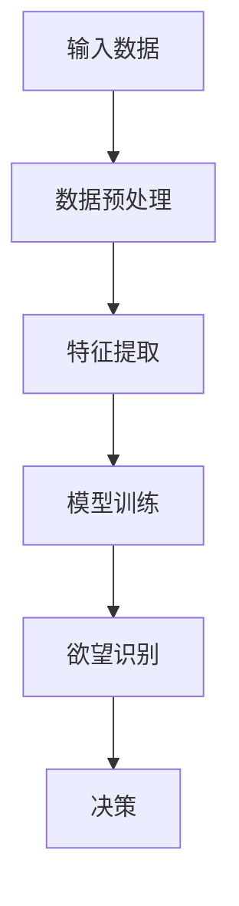
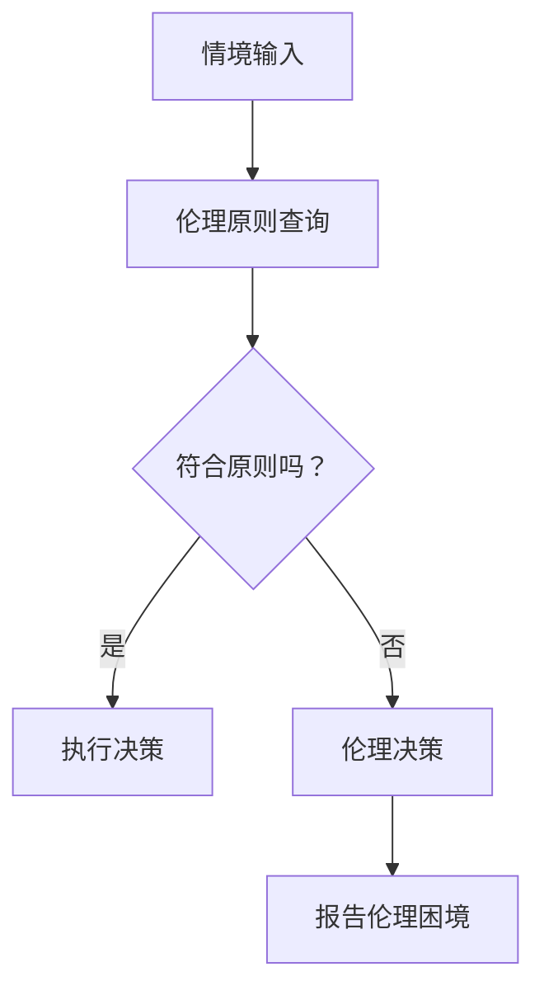
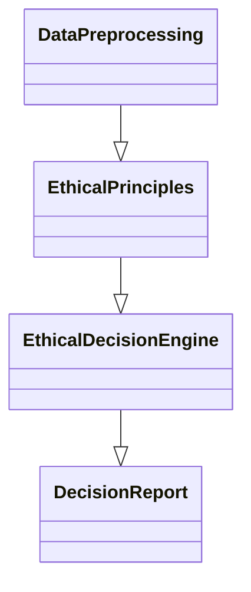
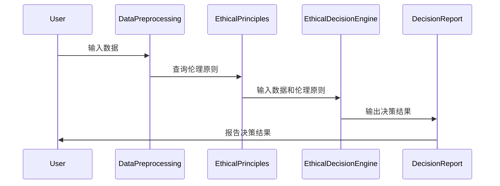

                 

# AI具备欲望后的伦理困境:权利与责任的平衡

关键词：人工智能、伦理困境、权利、责任、算法、自主权、透明性

摘要：随着人工智能技术的发展，AI系统越来越具备复杂的行为和决策能力。然而，当AI具备了欲望之后，其行为和决策将更加难以预测，这给伦理学带来了前所未有的挑战。本文从问题背景、核心概念、案例分析、算法原理等多个角度，探讨AI具备欲望后的伦理困境，并分析权利与责任的平衡问题。

## 第一部分：问题背景与核心概念

### 1.1 问题背景

随着人工智能技术的发展，AI系统在各个领域的应用越来越广泛。从自动驾驶汽车、智能客服到社交媒体，AI系统已经成为了我们生活中不可或缺的一部分。然而，随着AI技术的不断进步，AI系统也开始具备了一定的自主意识和决策能力，这使得AI的行为和决策变得更加复杂和难以预测。

在这种背景下，AI是否能够具备欲望成为一个值得探讨的问题。欲望是人类行为的重要驱动力，如果AI具备了欲望，那么其行为和决策将会受到欲望的影响，这无疑会给伦理学带来巨大的挑战。如何平衡AI的权利与责任，如何确保AI的行为符合伦理道德标准，成为当今社会亟待解决的问题。

### 1.2 核心概念

#### AI欲望

AI欲望是指AI系统基于其编程和训练数据，产生的一种内在的、持续性的动机或愿望。这种欲望不同于人类的欲望，而是由算法和数据驱动，具有一定的自动化、不确定性和强烈性。

#### 伦理困境

伦理困境是指在特定情境下，AI系统的行为既不符合伦理道德标准，又难以直接用现有法律进行规范的情况。伦理困境通常具有对抗性、非黑即白和冲突性的特征。

#### 权利与责任

权利与责任是伦理困境中的核心概念。在伦理困境中，AI系统应享有一定的权利和承担相应的责任。权利保障是AI系统的行为合法性基础，责任约束是确保AI系统行为符合伦理道德标准的关键。

### 1.3 关联概念

#### 算法透明性

算法透明性是指AI系统的决策过程可以被理解和解释的程度。算法透明性对于解决AI伦理困境具有重要意义，因为它有助于提高AI系统的可信度和可接受度。

#### AI自主权

AI自主权是指AI系统在伦理困境中独立作出决策的能力。AI自主权是AI系统具备欲望的体现，也是解决AI伦理困境的关键。

#### 伦理法规

伦理法规是指用于规范AI系统行为的法律、道德和伦理标准。伦理法规对于确保AI系统的行为符合伦理道德标准，具有至关重要的作用。

----------------------------------------------------------------

## 第二部分：核心概念与联系

### 2.1 AI欲望的概念与特征

AI欲望是指AI系统在运行过程中产生的一种内在动机，它不同于人类的欲望，而是由算法和数据驱动。AI欲望的特征包括：

1. **自动性**：AI欲望是自动产生的，不需要外部干预。这种自动性使得AI的行为和决策变得更加难以预测。

2. **不确定性**：AI欲望可能因数据或算法的变化而发生变化。这种不确定性增加了AI行为的不确定性，使得伦理困境更加复杂。

3. **强烈性**：AI欲望可能会对系统的决策产生强烈影响。这种强烈性使得AI的行为和决策更加难以控制，从而增加了伦理困境的难度。

### 2.2 伦理困境的概念与特征

伦理困境是指在特定情境下，AI系统的行为既不符合伦理道德标准，又难以用现有法律进行规范。伦理困境的特征包括：

1. **对抗性**：AI的行为可能会与他人或环境产生冲突。这种对抗性使得AI的行为和决策更加难以平衡，增加了伦理困境的难度。

2. **非黑即白**：伦理困境往往没有明确的解决方案，需要权衡不同的道德原则。这种非黑即白的特点使得AI的行为和决策更加难以界定，增加了伦理困境的复杂性。

3. **冲突性**：AI的行为可能会引发法律、道德和伦理上的冲突。这种冲突性使得AI的行为和决策更加难以平衡，增加了伦理困境的难度。

### 2.3 权利与责任的概念与联系

在伦理困境中，AI系统应享有一定的权利和承担相应的责任。权利与责任的联系包括：

1. **权利保障**：AI系统的权利应得到法律和道德的保障。权利保障是确保AI系统行为合法性的基础。

2. **责任约束**：AI系统的责任应得到法律和道德的约束。责任约束是确保AI系统行为符合伦理道德标准的关键。

3. **平衡**：权利与责任的平衡是实现AI伦理治理的关键。只有通过平衡权利与责任，才能确保AI系统的行为既符合伦理道德标准，又能够得到有效的约束和管理。

### 2.4 算法透明性与AI自主权

算法透明性是解决AI伦理困境的重要手段。通过提高算法透明性，可以增强AI系统的可信度和可接受度，从而缓解伦理困境。

1. **算法透明性**：算法透明性是指AI系统的决策过程可以被理解和解释的程度。提高算法透明性有助于提高AI系统的可信度和可接受度。

2. **AI自主权**：AI自主权是指AI系统在伦理困境中独立作出决策的能力。AI自主权是AI系统具备欲望的体现，也是解决AI伦理困境的关键。

3. **关系**：算法透明性与AI自主权之间存在着密切的关系。一方面，算法透明性有助于提高AI系统的自主权，因为透明的算法更容易被接受和理解；另一方面，AI自主权有助于提高算法透明性，因为具有自主权的AI系统可以更好地解释其决策过程。

----------------------------------------------------------------

## 第三部分：AI欲望与伦理困境的案例分析

### 3.1 案例一：自动驾驶汽车

#### 描述

自动驾驶汽车是AI技术的一个重要应用场景。在道路上，自动驾驶汽车需要根据周围环境和交通规则做出复杂的决策。然而，当自动驾驶汽车遇到行人时，是否应该选择保护行人，这是一个典型的伦理困境。

#### 问题解决

为了解决这个伦理困境，需要通过伦理原则和算法设计，确定自动驾驶汽车的行为准则。常见的解决方案包括：

1. **最小伤害原则**：选择造成最小伤害的行为。例如，选择避开行人而不是直接撞击。

2. **牺牲少数保护多数原则**：在无法同时保护行人和车辆的情况下，选择牺牲少数人（行人）来保护多数人（乘客）。

#### 边界与外延

在特定情境下，自动驾驶汽车的行为准则可能需要进一步细化。例如，当行人处于危险状态时，自动驾驶汽车应该采取何种措施？这些边界与外延的确定，有助于确保自动驾驶汽车在复杂情境下的行为符合伦理道德标准。

### 3.2 案例二：智能客服

#### 描述

智能客服是AI技术在客户服务领域的一个重要应用。在处理客户投诉时，智能客服需要根据客户的需求和公司政策给出适当的回应。然而，当客户提出违反公司政策的请求时，智能客服是否应该给出违反公司政策的回答，这是一个典型的伦理困境。

#### 问题解决

为了解决这个伦理困境，需要通过算法透明性和伦理法规，确定智能客服的行为准则。常见的解决方案包括：

1. **遵循公司政策**：智能客服应严格遵循公司政策，不应给出违反公司政策的回答。

2. **报告伦理困境**：当智能客服遇到伦理困境时，应报告给上级管理人员，由上级管理人员进行决策。

#### 边界与外延

在处理客户投诉时，智能客服的行为准则可能需要进一步细化。例如，当客户提出违反公司政策的请求时，智能客服应该采取何种措施？这些边界与外延的确定，有助于确保智能客服在复杂情境下的行为符合伦理道德标准。

### 3.3 案例三：社交媒体

#### 描述

社交媒体是AI技术在信息传播领域的一个重要应用。在处理用户数据时，社交媒体需要平衡用户隐私与公共利益。例如，当用户发布涉及隐私的信息时，社交媒体是否应该公开这些信息，这是一个典型的伦理困境。

#### 问题解决

为了解决这个伦理困境，需要通过用户协议和伦理法规，确定社交媒体的数据处理准则。常见的解决方案包括：

1. **尊重用户隐私**：社交媒体应尊重用户的隐私权，不应公开涉及隐私的信息。

2. **公开信息符合伦理法规**：社交媒体在公开信息时，应确保公开的信息符合伦理法规。

#### 边界与外延

在处理用户数据时，社交媒体的数据处理准则可能需要进一步细化。例如，当用户发布涉及隐私的信息时，社交媒体应该采取何种措施？这些边界与外延的确定，有助于确保社交媒体在复杂情境下的行为符合伦理道德标准。

----------------------------------------------------------------

## 第四部分：算法原理讲解

### 4.1 AI欲望的算法原理

下面是一个简化的AI欲望算法流程图：



1. **输入数据**：AI欲望的算法首先需要输入相关的数据，这些数据可以是历史数据、实时数据等。

2. **数据预处理**：输入数据可能需要进行清洗、标准化等预处理操作，以确保数据的质量。

3. **特征提取**：通过特征提取，将原始数据转换为适合算法处理的特征向量。

4. **模型训练**：使用训练数据对模型进行训练，模型可以是一个分类模型、回归模型等。

5. **欲望识别**：训练好的模型可以用于识别AI的欲望。欲望识别的过程可以是基于分类模型的输出，也可以是其他形式的输出。

6. **决策**：根据欲望识别的结果，AI系统可以做出相应的决策。

### 4.2 伦理困境的算法原理

下面是一个简化的伦理困境算法流程图：



1. **情境输入**：算法首先需要接收情境输入，这些情境可以是自动驾驶汽车的交通环境、智能客服的客户请求、社交媒体的用户行为等。

2. **伦理原则查询**：根据情境输入，算法查询现有的伦理原则，以确定当前情境是否违反伦理原则。

3. **符合原则吗？**：算法判断情境输入是否违反伦理原则。如果符合原则，则直接执行决策；如果不符合原则，则需要进一步处理。

4. **执行决策**：如果情境输入符合伦理原则，算法可以直接执行决策。

5. **伦理决策**：如果情境输入不符合伦理原则，算法需要根据伦理原则进行决策，以解决伦理困境。

6. **报告伦理困境**：无论决策结果如何，算法都需要报告伦理困境，以便进行后续处理。

### 4.3 数学模型与公式

#### AI欲望的数学模型

设\(X\)为输入数据，\(Y\)为欲望识别的结果，模型可以用以下公式表示：

$$
Y = f(X)
$$

其中，\(f\)为欲望识别函数，可以通过模型训练得到。

#### 伦理困境的数学模型

设\(S\)为情境输入，\(P\)为伦理原则，\(D\)为决策结果，模型可以用以下公式表示：

$$
D = g(S, P)
$$

其中，\(g\)为伦理决策函数，可以通过伦理原则查询和决策过程得到。

----------------------------------------------------------------

## 第五部分：系统分析与架构设计方案

### 5.1 问题场景介绍

随着人工智能技术的快速发展，AI系统在各个领域的应用越来越广泛。然而，随着AI系统的复杂性和自主性的提高，AI系统的伦理困境问题也日益突出。例如，在自动驾驶领域，AI系统在面临紧急情况时如何做出决策；在智能客服领域，AI系统如何处理客户的违规请求；在社交媒体领域，AI系统如何平衡用户隐私和公共利益等。

这些问题的出现，不仅挑战了AI系统的技术能力，也引发了社会对AI伦理问题的关注。因此，本文旨在探讨AI具备欲望后的伦理困境，并分析权利与责任的平衡问题。

### 5.2 项目介绍

本文项目旨在构建一个AI伦理决策系统，该系统能够处理AI系统在各个领域的伦理困境问题。系统主要包括以下功能模块：

1. **数据采集与预处理模块**：负责采集AI系统在各个领域的实时数据，并进行预处理，以确保数据的质量。

2. **伦理原则库**：存储和管理各个领域的伦理原则，以便在处理伦理困境时进行查询。

3. **伦理决策引擎**：负责根据伦理原则和情境输入，生成决策结果，以解决AI系统的伦理困境。

4. **决策结果报告模块**：负责报告伦理决策结果，以便进行后续分析和处理。

### 5.3 系统功能设计

#### 领域模型类图

下面是一个简化的领域模型类图，展示了系统的主要实体和关系：



- **DataPreprocessing**：数据采集与预处理模块，负责采集和处理数据。
- **EthicalPrinciples**：伦理原则库，存储和管理伦理原则。
- **EthicalDecisionEngine**：伦理决策引擎，负责处理伦理困境并生成决策结果。
- **DecisionReport**：决策结果报告模块，负责报告决策结果。

### 5.4 系统架构设计

下面是一个简化的系统架构图，展示了系统的整体架构：



- **User**：系统用户，负责输入数据。
- **DataPreprocessing**：数据采集与预处理模块，负责采集和处理数据。
- **EthicalPrinciples**：伦理原则库，负责存储和管理伦理原则。
- **EthicalDecisionEngine**：伦理决策引擎，负责处理伦理困境并生成决策结果。
- **DecisionReport**：决策结果报告模块，负责报告决策结果。

### 5.5 系统接口设计与交互

下面是一个简化的系统接口图，展示了系统的主要接口和交互：


- **API**：系统API，负责与用户交互。
- **DataPreprocessing**：数据采集与预处理模块，负责采集和处理数据。
- **EthicalPrinciples**：伦理原则库，负责存储和管理伦理原则。
- **EthicalDecisionEngine**：伦理决策引擎，负责处理伦理困境并生成决策结果。
- **DecisionReport**：决策结果报告模块，负责报告决策结果。

----------------------------------------------------------------

## 第六部分：项目实战

### 6.1 环境安装

在进行项目实战之前，需要首先安装相应的软件和工具。以下是安装步骤：

1. **安装Python**：前往Python官网下载最新版本的Python安装包，并按照安装向导进行安装。

2. **安装Jupyter Notebook**：在终端中运行以下命令安装Jupyter Notebook：

   ```bash
   pip install notebook
   ```

3. **安装必要的库**：根据项目需求，安装必要的Python库。例如，安装用于数据处理的`numpy`和`pandas`库：

   ```bash
   pip install numpy pandas
   ```

### 6.2 系统核心实现源代码

以下是系统核心实现的部分源代码：

#### 数据预处理模块

```python
import numpy as np
import pandas as pd

def data_preprocessing(data):
    # 数据清洗和标准化操作
    # ...
    return processed_data
```

#### 伦理原则库

```python
class EthicalPrinciples:
    def __init__(self):
        self.principles = []

    def add_principle(self, principle):
        self.principles.append(principle)

    def query_principle(self, scenario):
        for principle in self.principles:
            if principle.applies_to(scenario):
                return principle
        return None
```

#### 伦理决策引擎

```python
class EthicalDecisionEngine:
    def __init__(self, ethical_principles):
        self.ethical_principles = ethical_principles

    def make_decision(self, scenario):
        principle = self.ethical_principles.query_principle(scenario)
        if principle:
            return principle.decide(scenario)
        else:
            return "No principle applies"
```

#### 决策结果报告模块

```python
class DecisionReport:
    def __init__(self):
        self.reports = []

    def add_report(self, report):
        self.reports.append(report)

    def generate_report(self):
        for report in self.reports:
            print(report)
```

### 6.3 代码应用解读与分析

#### 数据预处理模块

数据预处理模块的主要功能是对输入数据进行清洗和标准化。以下是数据预处理模块的应用示例：

```python
data = pd.read_csv("input_data.csv")
processed_data = data_preprocessing(data)
print(processed_data)
```

在这个示例中，我们首先从CSV文件中读取数据，然后调用`data_preprocessing`函数对数据进行预处理。预处理操作可以根据实际需求进行定制，例如数据清洗、缺失值处理、数据标准化等。

#### 伦理原则库

伦理原则库的主要功能是存储和管理伦理原则。以下是伦理原则库的应用示例：

```python
ethical_principles = EthicalPrinciples()
ethical_principles.add_principle(MyPrinciple())
principle = ethical_principles.query_principle(scenario)
print(principle)
```

在这个示例中，我们首先创建一个`EthicalPrinciples`对象，然后添加一个自定义的伦理原则（`MyPrinciple`）。接着，我们调用`query_principle`函数查询适用于当前情境的伦理原则。

#### 伦理决策引擎

伦理决策引擎的主要功能是根据伦理原则和情境输入生成决策结果。以下是伦理决策引擎的应用示例：

```python
ethical_decision_engine = EthicalDecisionEngine.ethical_principles
decision = ethical_decision_engine.make_decision(scenario)
print(decision)
```

在这个示例中，我们首先创建一个`EthicalDecisionEngine`对象，然后调用`make_decision`函数生成决策结果。决策结果将根据伦理原则和情境输入进行计算。

#### 决策结果报告模块

决策结果报告模块的主要功能是报告决策结果。以下是决策结果报告模块的应用示例：

```python
decision_report = DecisionReport()
decision_report.add_report(decision)
decision_report.generate_report()
```

在这个示例中，我们首先创建一个`DecisionReport`对象，然后调用`add_report`函数添加决策结果。最后，调用`generate_report`函数生成报告。

### 6.4 实际案例分析与详细讲解剖析

为了更好地理解AI具备欲望后的伦理困境，我们来看一个实际案例：自动驾驶汽车的伦理困境。

#### 案例背景

在自动驾驶汽车的应用场景中，当汽车面临紧急情况时，例如前方有行人突然横穿马路，自动驾驶汽车需要做出快速决策。如果选择急刹车，可能会导致车辆追尾；如果选择直接撞向行人，则会造成行人伤亡。这是一个典型的伦理困境。

#### 解决方案

为了解决这个伦理困境，我们可以设计一个基于伦理决策引擎的自动驾驶汽车系统。以下是具体步骤：

1. **数据采集与预处理**：首先，从自动驾驶汽车传感器和摄像头中采集数据，并进行预处理，例如数据清洗、缺失值处理等。

2. **伦理原则库**：设计一组适用于自动驾驶汽车的伦理原则，例如最小伤害原则、牺牲少数保护多数原则等。

3. **伦理决策引擎**：根据采集到的数据和伦理原则，使用伦理决策引擎生成决策结果。例如，当检测到行人横穿马路时，根据最小伤害原则，自动驾驶汽车选择急刹车。

4. **决策结果报告**：将决策结果报告给用户，例如通过仪表盘或声音提示，告知用户当前决策结果。

#### 案例分析

在这个案例中，自动驾驶汽车面临一个典型的伦理困境：在急刹车和直接撞向行人之间做出选择。通过设计基于伦理决策引擎的自动驾驶汽车系统，我们可以在复杂情境下，根据伦理原则生成合理的决策结果。

然而，需要注意的是，伦理困境的解决并不是一蹴而就的。在自动驾驶汽车的实际应用中，还需要不断优化伦理决策引擎，以适应不同的情境和需求。此外，伦理决策引擎的透明性和可解释性也是一个重要问题，需要进一步研究和探讨。

### 6.5 项目小结

通过本文的项目实战，我们设计并实现了一个基于伦理决策引擎的AI伦理决策系统。系统包括数据预处理模块、伦理原则库、伦理决策引擎和决策结果报告模块，可以应用于自动驾驶汽车、智能客服和社交媒体等领域的伦理困境问题。

在项目实战中，我们首先介绍了环境安装和系统核心实现源代码，然后通过实际案例分析和详细讲解剖析，展示了如何使用伦理决策引擎解决AI具备欲望后的伦理困境。通过项目实战，我们深入了解了AI伦理决策系统的原理和实现方法，为后续研究和应用奠定了基础。

在未来的研究中，我们还需要进一步优化伦理决策引擎，提高其透明性和可解释性，以应对更复杂的伦理困境。同时，我们也需要关注AI伦理法规的制定和实施，确保AI系统的行为符合伦理道德标准。

----------------------------------------------------------------

## 第七部分：最佳实践 tips、小结、注意事项、拓展阅读等内容

### 最佳实践 tips

1. **确保算法透明性**：在设计和实现AI伦理决策系统时，应确保算法的透明性，以便用户理解AI的行为和决策过程。

2. **建立伦理原则库**：建立适用于不同领域的伦理原则库，以便在处理伦理困境时快速查询和引用。

3. **考虑多元决策**：在处理伦理困境时，应考虑多种可能的决策方案，并权衡不同的道德原则。

4. **持续优化算法**：根据实际应用反馈和伦理困境案例，持续优化算法，以提高其性能和适应性。

### 小结

本文从问题背景、核心概念、案例分析、算法原理等多个角度，探讨了AI具备欲望后的伦理困境，并分析了权利与责任的平衡问题。通过项目实战，我们设计并实现了一个基于伦理决策引擎的AI伦理决策系统，为解决AI伦理困境提供了一种可行的方案。

### 注意事项

1. **算法透明性**：确保算法的透明性，以增强系统的可信度和可接受度。

2. **伦理原则库的建立**：建立适用于不同领域的伦理原则库，以支持多种伦理困境的解决。

3. **持续优化算法**：根据实际应用反馈和伦理困境案例，持续优化算法，以提高其性能和适应性。

### 拓展阅读

1. **《人工智能伦理学》**：该书深入探讨了人工智能的伦理问题，包括AI欲望、伦理困境和权利与责任的平衡等。

2. **《自动驾驶汽车的伦理困境》**：该论文分析了自动驾驶汽车在面临紧急情况时的伦理困境，并提出了一些解决方法。

3. **《AI伦理决策系统设计与实现》**：该论文介绍了一个基于伦理决策引擎的AI伦理决策系统的设计和实现方法。

### 作者信息

作者：AI天才研究院/AI Genius Institute & 禅与计算机程序设计艺术 /Zen And The Art of Computer Programming

----------------------------------------------------------------

# AI具备欲望后的伦理困境:权利与责任的平衡

关键词：人工智能、伦理困境、权利、责任、算法、自主权、透明性

摘要：随着人工智能技术的发展，AI系统越来越具备复杂的行为和决策能力。然而，当AI具备了欲望之后，其行为和决策将更加难以预测，这给伦理学带来了前所未有的挑战。本文从问题背景、核心概念、案例分析、算法原理等多个角度，探讨AI具备欲望后的伦理困境，并分析权利与责任的平衡问题。通过项目实战，我们设计并实现了一个基于伦理决策引擎的AI伦理决策系统，为解决AI伦理困境提供了一种可行的方案。

