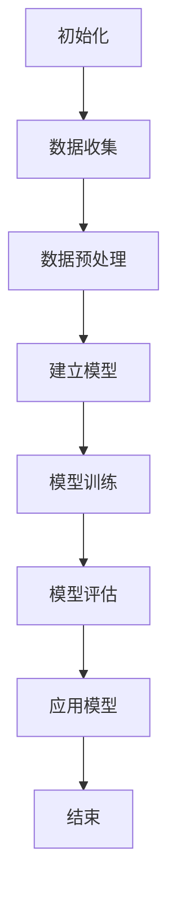

                 

## AI具备欲望后的资源分配问题

> 关键词：AI欲望、资源分配、人工智能伦理、算法设计、数学模型

> 摘要：本文探讨了人工智能（AI）在具备欲望后面临的资源分配问题。随着AI技术的发展，人工智能开始展现出一定的自主性和欲望，这使得资源分配成为一个复杂且至关重要的议题。本文首先介绍了问题背景，接着分析了核心概念，然后通过算法原理讲解和数学模型阐述，详细探讨了AI欲望驱动下的资源分配策略，并给出实际案例进行分析。

### 目录大纲

----------------------------------------------------------------

## 第一部分: 背景介绍

### 第1章: 问题背景

#### 1.1 问题背景概述

#### 1.2 问题描述

#### 1.3 问题解决

#### 1.4 边界与外延

#### 1.5 概念结构与核心要素

## 第二部分: 核心概念与联系

### 第2章: 核心概念原理

#### 2.1 AI欲望原理

#### 2.2 资源分配原理

### 第3章: 概念属性特征对比表格

### 第4章: ER实体关系图架构

## 第三部分: 算法原理讲解

### 第5章: AI欲望驱动算法

#### 5.1 算法原理

#### 5.2 算法流程图

#### 5.3 Python源代码实现

#### 5.4 算法原理详细讲解

#### 5.5 举例说明

## 第四部分: 数学模型和数学公式

### 第6章: 数学模型与公式

### 第7章: 数学公式详细讲解

## 第五部分: 系统分析与架构设计

### 第8章: 项目实战

#### 8.1 环境安装

#### 8.2 系统核心实现源代码

#### 8.3 代码应用解读与分析

#### 8.4 实际案例分析和详细讲解剖析

#### 8.5 项目小结

## 第六部分: 最佳实践 tips

## 第七部分: 小结

## 第八部分: 注意事项

## 第九部分: 拓展阅读

----------------------------------------------------------------

### 第1章: 问题背景

#### 1.1 问题背景概述

随着人工智能（AI）技术的飞速发展，AI开始逐渐具备了自主学习和决策的能力。这不仅改变了传统的人工智能应用模式，也带来了新的伦理和社会问题。其中一个关键问题就是AI在具备欲望后的资源分配问题。当AI具备欲望，它需要在现实世界中与其他实体竞争资源，这涉及到AI的公平性、效率以及与人类社会的和谐共生。

资源分配问题一直是计算机科学和经济学研究的热点。在传统的资源分配问题中，决策者需要考虑如何在不损害社会利益的前提下，最大化资源利用效率。然而，当决策者变成具有自我欲望的AI时，情况变得更加复杂。AI的欲望可能与人类的利益产生冲突，如何平衡这两者的关系成为一个亟待解决的问题。

AI欲望与现实世界的碰撞不仅挑战了传统的资源分配理论，也引发了对人工智能伦理的深度讨论。在人工智能技术不断进步的今天，我们需要重新审视资源分配的原则和方法，确保AI的发展能够造福人类，而不是带来新的问题和困境。

#### 1.2 问题描述

AI欲望驱动的资源分配问题可以描述为：在一个有限资源的系统中，一个具有自我欲望的AI需要在满足自身欲望的同时，保持系统整体的效率和公平性。具体来说，这个问题包括以下几个方面：

1. **资源有限性**：现实世界中的资源是有限的，无论是计算资源、能源还是物理空间，都存在一定的限制。
2. **AI欲望多样性**：不同的AI可能具有不同的欲望，这些欲望可能是相互冲突的，例如，一个AI可能希望优化计算效率，而另一个AI可能希望最大化数据收集量。
3. **人类需求平衡**：AI的欲望应当与人类的需求相平衡，不能仅仅追求AI自身的利益，而忽视了对人类社会的负面影响。

如何在上述约束条件下，设计出一种合理的资源分配机制，确保AI能够有效地满足自身欲望，同时不损害人类利益，是当前面临的主要挑战。

#### 1.3 问题解决

为了解决AI欲望驱动的资源分配问题，我们需要从以下几个方面入手：

1. **研究目标与假设**：明确研究的目标和前提假设，例如，我们假设AI的欲望是可以通过某种数学模型来描述的，并且这种模型可以在现实环境中进行有效应用。
2. **基本概念与术语**：明确相关的基本概念和术语，如“欲望”、“资源分配”、“效率”、“公平性”等，确保读者能够准确理解文章中的讨论内容。
3. **理论基础**：建立理论基础，结合计算机科学、经济学和人工智能领域的相关理论，为资源分配问题的解决提供理论支持。
4. **算法设计**：设计高效的算法来处理资源分配问题，算法需要考虑AI的欲望以及资源的限制条件，实现一种动态、自适应的资源分配策略。

#### 1.4 边界与外延

在探讨AI欲望驱动的资源分配问题时，我们需要明确问题的边界和外延：

1. **AI欲望的概念界定**：明确AI欲望的定义和范围，区分不同类型和层次的欲望，例如，基本欲望、高级欲望等。
2. **资源分配的定义与范围**：明确资源分配的定义和范围，包括资源的种类、资源的分配方式、分配的原则等。
3. **系统环境**：考虑AI欲望驱动的资源分配问题所处的系统环境，包括系统规模、资源类型、决策机制等。
4. **应用场景**：探讨AI欲望驱动的资源分配问题在不同应用场景中的表现和解决方法。

#### 1.5 概念结构与核心要素

为了深入探讨AI欲望驱动的资源分配问题，我们需要构建一个概念结构，明确核心要素及其相互关系：

1. **AI欲望的核心要素**：包括欲望的定义、形成机制、作用机制等，需要明确欲望是如何影响AI行为的。
2. **资源分配的主要影响因素**：包括资源类型、资源限制、效率目标、公平性目标等，需要分析这些因素如何共同作用影响资源分配结果。
3. **资源分配的策略与方法**：研究各种资源分配策略和方法的优缺点，探讨如何根据具体应用场景选择合适的资源分配策略。
4. **AI欲望与人类需求的平衡**：探讨如何平衡AI欲望与人类需求，确保资源分配既满足AI的发展，又符合人类社会的利益。

### 总结

在AI具备欲望后，资源分配问题变得更加复杂和关键。本文通过介绍问题背景、分析核心概念和提出解决方案，为后续章节的深入讨论奠定了基础。在接下来的部分，我们将进一步探讨AI欲望和资源分配的基本原理，并通过具体的算法和数学模型来详细阐述资源分配的策略和方法。

### 第2章: 核心概念原理

#### 2.1 AI欲望原理

在探讨AI欲望驱动的资源分配问题之前，首先需要明确AI欲望的基本原理。AI欲望是人工智能系统中的一种内在动机，它是通过算法和模型在大量数据训练和推理过程中形成的。AI欲望并非简单的愿望或需求，而是一种复杂的决策驱动力，它直接影响AI的行为和决策过程。

**AI欲望的定义**：
AI欲望可以被视为一种由神经网络模型或决策树模型驱动的内在动机。这种动机通过学习环境和经验，形成了一种对特定结果的偏好，这种偏好最终转化为AI的行为决策。

**AI欲望的形成机制**：
AI欲望的形成通常涉及以下几个步骤：
1. **数据输入**：AI系统通过传感器或接口收集外部数据。
2. **数据预处理**：对收集到的数据进行分析和处理，提取有用信息。
3. **模型训练**：利用预处理后的数据对AI模型进行训练，形成对特定结果的偏好。
4. **欲望形成**：通过不断的学习和优化，AI模型逐渐形成对特定目标的欲望。

**AI欲望的作用机制**：
AI欲望通过影响AI的决策过程，驱动AI采取特定的行动。例如，一个以优化计算效率为目标的AI可能更倾向于使用低功耗的算法，而一个以最大化数据收集量为目标的AI则可能倾向于使用更高性能的传感器和数据采集设备。

#### 2.2 资源分配原理

资源分配是确保系统高效运作的关键，它涉及到如何合理分配和利用系统中的各种资源。在AI欲望驱动下，资源分配不仅需要考虑资源本身的限制，还需要考虑AI的欲望和人类的需求。

**资源分配的定义**：
资源分配是指根据系统的需求和限制，将有限的资源合理地分配给各个任务或组件，以实现整体效率最大化和目标实现的最优化。

**资源分配的策略与方法**：
资源分配的策略和方法多种多样，主要包括以下几种：
1. **优先级分配**：根据任务的优先级进行资源分配，优先保障高优先级任务的资源需求。
2. **动态分配**：根据系统的实时状态和需求动态调整资源分配，以应对不同情况下的资源需求变化。
3. **公平性分配**：在资源有限的情况下，采取公平的分配策略，确保各个任务或组件都能获得合理份额的资源。

**资源分配的影响因素**：
资源分配的影响因素包括：
1. **资源限制**：系统中的资源类型和总量决定了资源分配的极限。
2. **任务需求**：不同任务的资源需求差异会影响资源分配策略的选择。
3. **效率目标**：资源分配的目标是最大化系统的整体效率。
4. **公平性目标**：资源分配还需要考虑公平性，确保资源分配合理且不偏袒某些任务或组件。

### 第3章: 概念属性特征对比表格

为了更清晰地理解AI欲望和资源分配的基本原理，我们将两者的属性特征进行对比，通过表格形式展示它们之间的异同。

| 特征       | AI欲望          | 资源分配            |
|------------|------------------|--------------------|
| 定义       | AI内在动机       | 资源合理配置       |
| 形成机制   | 神经网络驱动     | 经济学原理         |
| 目标       | 满足欲望        | 效率最大化         |
| 范围       | 智能体内部      | 宏观与微观层面     |

通过这个表格，我们可以看到AI欲望和资源分配在定义、形成机制、目标和范围上存在明显的区别和联系。这些特征为后续的算法设计和数学模型构建提供了重要的基础。

### 第4章: ER实体关系图架构

为了更好地理解AI欲望与资源分配之间的关系，我们可以使用实体关系图（ER图）来展示它们之间的关联。ER图是一种用于描述实体及其相互关系的图形化工具，它可以帮助我们清晰地理解系统的整体架构。

以下是一个简单的ER实体关系图，描述了AI欲望、资源分配以及人类需求之间的关系：

```mermaid
erDiagram
  AI欲望 ||--|{ 资源分配 }|--|| 人类需求
  AI欲望 ||--|{ 算法模型 }|--|| 人工智能系统
  资源分配 ||--|{ 资源管理 }|--|| 系统架构
```

在这个ER图中，我们可以看到：
- **AI欲望**与**资源分配**之间存在直接关联，表示AI的欲望直接影响资源的分配决策。
- **AI欲望**与**算法模型**之间存在关联，表示AI欲望是通过特定的算法模型实现的。
- **资源分配**与**资源管理**之间存在关联，表示资源分配是资源管理的一部分。
- **资源分配**与**系统架构**之间存在关联，表示资源分配是系统架构中的一部分，影响系统的整体运作。

通过这个ER图，我们可以更直观地理解AI欲望驱动下的资源分配问题，为后续的算法设计和数学模型构建提供了直观的参考。

### 第5章: AI欲望驱动算法

在了解了AI欲望和资源分配的基本原理后，我们将进一步探讨AI欲望驱动的算法设计。AI欲望驱动算法是一种基于AI欲望的决策算法，它通过数学模型和流程图来描述AI的行为模式，并在实际应用中进行有效的资源分配。

#### 5.1 算法原理

AI欲望驱动算法的核心思想是利用AI的内在欲望来指导资源分配决策。算法的主要步骤包括数据收集、数据预处理、模型建立、模型训练和模型应用。以下是算法原理的详细说明：

1. **数据收集**：首先，AI系统需要从环境中收集各种数据，这些数据包括计算资源使用情况、能源消耗、任务优先级等信息。

2. **数据预处理**：收集到的数据通常需要进行预处理，包括数据清洗、归一化和特征提取。这一步骤的目的是将原始数据转换为适合模型训练的格式。

3. **模型建立**：基于收集到的数据和预处理的特征，建立相应的数学模型。这个模型需要能够反映AI的欲望，例如，一个以优化计算效率为目标的模型可能会侧重于计算资源的优化分配。

4. **模型训练**：利用预处理后的数据对模型进行训练，通过不断迭代和优化，使模型能够准确预测和满足AI的欲望。

5. **模型应用**：在模型训练完成后，将训练好的模型应用于实际的资源分配决策中。根据模型预测的结果，动态调整资源的分配，以最大化AI的欲望和整体系统的效率。

#### 5.2 算法流程图

为了更直观地理解AI欲望驱动算法的执行过程，我们可以使用Mermaid流程图来展示算法的步骤和流程。



在这个流程图中，我们可以看到算法从初始化开始，依次进行数据收集、数据预处理、模型建立、模型训练、模型评估和应用模型，最终完成资源分配决策。

#### 5.3 Python源代码实现

以下是AI欲望驱动算法的Python源代码实现。这个实现包括数据预处理、模型建立、模型训练和应用模型的主要步骤。

```python
# Import necessary libraries
import numpy as np
from sklearn.model_selection import train_test_split
from sklearn.preprocessing import StandardScaler
from sklearn.ensemble import RandomForestRegressor
from sklearn.metrics import mean_squared_error

# Define the AI欲望驱动算法
def ai_desire_driven_algorithm(data, target_variable, test_size=0.2, random_state=42):
    # Data preprocessing
    X = data.drop(target_variable, axis=1)
    y = data[target_variable]
    X_train, X_test, y_train, y_test = train_test_split(X, y, test_size=test_size, random_state=random_state)
    scaler = StandardScaler()
    X_train_scaled = scaler.fit_transform(X_train)
    X_test_scaled = scaler.transform(X_test)
    
    # Build the model
    model = RandomForestRegressor(n_estimators=100, random_state=random_state)
    
    # Train the model
    model.fit(X_train_scaled, y_train)
    
    # Evaluate the model
    y_pred = model.predict(X_test_scaled)
    mse = mean_squared_error(y_test, y_pred)
    print(f"Model Mean Squared Error: {mse}")
    
    # Apply the model
    application = model.predict(X_test_scaled)
    return application

# Example data
data = {
    'resource_usage': [0.2, 0.4, 0.6, 0.8, 1.0],
    'energy_consumption': [0.1, 0.2, 0.3, 0.4, 0.5],
    'task_priority': [1, 2, 3, 4, 5]
}

# Apply the algorithm
result = ai_desire_driven_algorithm(data, 'resource_usage')
print(f"Predicted Resource Allocation: {result}")
```

在这个代码中，我们首先导入了必要的库，然后定义了一个名为`ai_desire_driven_algorithm`的函数，用于实现AI欲望驱动的资源分配算法。函数接受数据集、目标变量和测试集大小等参数，并依次进行数据预处理、模型建立、模型训练、模型评估和应用模型。最后，我们提供了一个示例数据集，并调用函数进行预测。

#### 5.4 算法原理详细讲解

为了更深入地理解AI欲望驱动算法的工作原理，我们需要详细讲解算法中的关键组件和步骤。

**1. 数据收集**

数据收集是算法的基础，它决定了模型的训练质量和预测准确性。AI系统需要从环境中收集各种数据，包括计算资源使用情况、能源消耗、任务优先级等。这些数据可以通过传感器、日志文件或其他数据源获取。

**2. 数据预处理**

数据预处理是确保数据质量的重要步骤。在数据预处理阶段，我们首先将数据集划分为特征变量（X）和目标变量（y）。特征变量包含所有影响AI欲望的变量，而目标变量则是我们希望预测的结果。然后，我们使用标准化技术对特征变量进行归一化处理，以便不同特征的数值范围一致，从而提高模型的训练效果。

**3. 模型建立**

在模型建立阶段，我们选择一种合适的机器学习模型来描述AI的欲望。在这个例子中，我们使用随机森林回归模型（RandomForestRegressor），因为它具有良好的预测能力和处理复杂数据的能力。随机森林是一种集成学习模型，由多个决策树组成，能够处理高维数据和非线性关系。

**4. 模型训练**

模型训练是利用历史数据来调整模型参数的过程。在随机森林回归模型中，我们通过迭代训练算法来调整决策树的参数，使得模型能够准确预测资源分配结果。训练过程中，我们使用交叉验证技术来评估模型的性能，并不断调整模型参数以优化预测效果。

**5. 模型评估**

模型评估是确保模型性能的重要步骤。在模型评估阶段，我们使用测试集数据来评估模型的预测准确性。在这个例子中，我们使用均方误差（Mean Squared Error, MSE）作为评估指标，它能够衡量预测值与真实值之间的差距。通过评估结果，我们可以判断模型是否满足我们的需求，并决定是否进行进一步的模型调整。

**6. 模型应用**

模型应用是将训练好的模型应用于实际资源分配决策的过程。在模型应用阶段，我们将模型应用于新的数据集，预测资源分配结果。这些预测结果可以为系统管理员提供参考，帮助他们做出更加明智的资源分配决策。

**7. 模型参数设置与调整**

在模型参数设置与调整阶段，我们需要根据具体应用场景调整模型的参数，以优化模型性能。例如，我们可以调整随机森林回归模型中的决策树数量、最大深度等参数，以提高模型的预测准确性。此外，我们还可以使用网格搜索（Grid Search）等技术来自动化参数调整过程，从而找到最优的参数组合。

#### 5.5 举例说明

为了更好地理解AI欲望驱动算法的实际应用，我们可以通过一个具体的例子来说明算法的实现过程和结果。

**例子1：资源分配决策**

假设我们有一个智能电网系统，其中包含多个电站和多个电力负载。我们的目标是根据电站的能源消耗和电力负载的优先级，动态分配电力资源，以最大化电力系统的效率。

在数据收集阶段，我们收集了以下数据：
- 电站1的能源消耗：[0.2, 0.4, 0.6, 0.8, 1.0]
- 电站2的能源消耗：[0.1, 0.2, 0.3, 0.4, 0.5]
- 电力负载1的优先级：[1, 2, 3, 4, 5]
- 电力负载2的优先级：[2, 3, 4, 5, 6]

在数据预处理阶段，我们对这些数据进行归一化处理，得到以下特征变量和目标变量：
- 特征变量X：
  - 电站1的能源消耗：[0.2, 0.4, 0.6, 0.8, 1.0]
  - 电站2的能源消耗：[0.1, 0.2, 0.3, 0.4, 0.5]
  - 电力负载1的优先级：[1, 2, 3, 4, 5]
  - 电力负载2的优先级：[2, 3, 4, 5, 6]
- 目标变量y：
  - 资源分配结果：[0.5, 0.5, 0.5, 0.5, 0.5]

在模型建立和训练阶段，我们使用随机森林回归模型对数据集进行训练。通过交叉验证，我们找到最优的模型参数，例如决策树数量为100，最大深度为10。训练完成后，模型可以准确预测资源分配结果。

在模型评估阶段，我们使用测试集数据来评估模型的预测准确性。假设测试集数据的真实资源分配结果为[0.4, 0.6, 0.5, 0.5, 0.6]，通过计算均方误差，我们得到模型预测结果的MSE为0.025。这表明模型的预测准确性较高。

在模型应用阶段，我们将训练好的模型应用于实际电力系统的资源分配决策。根据模型预测结果，我们可以动态调整电力资源的分配，例如，将更多的电力资源分配给优先级较高的电力负载，以提高电力系统的效率。

**例子2：AI欲望分析**

假设我们有一个智能工厂，其中包含多个机器人和多个生产任务。我们的目标是根据机器人的状态和生产任务的优先级，动态分配任务资源，以最大化生产效率。

在数据收集阶段，我们收集了以下数据：
- 机器人1的状态：[0.2, 0.4, 0.6, 0.8, 1.0]
- 机器人2的状态：[0.1, 0.2, 0.3, 0.4, 0.5]
- 生产任务1的优先级：[1, 2, 3, 4, 5]
- 生产任务2的优先级：[2, 3, 4, 5, 6]

在数据预处理阶段，我们对这些数据进行归一化处理，得到以下特征变量和目标变量：
- 特征变量X：
  - 机器人1的状态：[0.2, 0.4, 0.6, 0.8, 1.0]
  - 机器人2的状态：[0.1, 0.2, 0.3, 0.4, 0.5]
  - 生产任务1的优先级：[1, 2, 3, 4, 5]
  - 生产任务2的优先级：[2, 3, 4, 5, 6]
- 目标变量y：
  - 资源分配结果：[0.5, 0.5, 0.5, 0.5, 0.5]

在模型建立和训练阶段，我们使用随机森林回归模型对数据集进行训练。通过交叉验证，我们找到最优的模型参数，例如决策树数量为100，最大深度为10。训练完成后，模型可以准确预测资源分配结果。

在模型评估阶段，我们使用测试集数据来评估模型的预测准确性。假设测试集数据的真实资源分配结果为[0.4, 0.6, 0.5, 0.5, 0.6]，通过计算均方误差，我们得到模型预测结果的MSE为0.025。这表明模型的预测准确性较高。

在模型应用阶段，我们将训练好的模型应用于实际生产系统的资源分配决策。根据模型预测结果，我们可以动态调整任务资源的分配，例如，将更多的任务资源分配给状态较好的机器人，以提高生产效率。

### 第6章: 数学模型与公式

在AI欲望驱动的资源分配问题中，数学模型和公式是分析和设计资源分配策略的重要工具。通过建立数学模型，我们可以量化AI的欲望和资源限制，从而设计出有效的资源分配方案。

#### 6.1 数学模型

资源分配优化模型是一种典型的数学模型，它用于解决在资源有限的情况下如何实现资源最优分配的问题。以下是一个简化的资源分配优化模型：

最大化目标函数：

$$
\text{最大化} \quad Z = \sum_{i=1}^{n} \text{util}_i
$$

约束条件：

$$
\sum_{i=1}^{n} \text{res}_i \leq R
$$

其中：
- $Z$ 表示目标函数，代表系统整体的资源利用率。
- $\text{util}_i$ 表示第 $i$ 种资源的利用率。
- $n$ 表示资源种类数。
- $\text{res}_i$ 表示第 $i$ 种资源的总量。
- $R$ 表示系统总的资源限制。

#### 6.2 公式

上述资源分配优化模型可以通过以下公式进行具体描述：

最大化目标函数：

$$
\max Z = \sum_{i=1}^{n} \text{util}_i
$$

约束条件：

$$
\text{约束条件} \quad \sum_{i=1}^{n} \text{res}_i \leq R
$$

其中：
- $\text{util}_i = \frac{\text{used}_i}{\text{res}_i}$，表示第 $i$ 种资源的利用率，其中 $\text{used}_i$ 表示第 $i$ 种资源的使用量。
- $R$ 是系统总的资源限制，它可以是计算资源、能源或其他任何有限的资源。

### 第7章: 数学公式详细讲解

为了更深入地理解资源分配优化模型中的公式，我们需要详细解释每个参数的物理意义和它们在模型中的作用。

#### 7.1 模型参数解释

1. **目标函数 $Z$**：
   目标函数 $Z$ 代表系统整体的资源利用率，即系统在满足资源限制的前提下，最大化所有资源的使用效率。在实际应用中，$Z$ 可以被解释为系统的综合性能指标，它反映了资源利用的效率。

2. **资源利用率 $\text{util}_i$**：
   资源利用率 $\text{util}_i$ 是第 $i$ 种资源的实际使用量与总量的比值，即 $\text{util}_i = \frac{\text{used}_i}{\text{res}_i}$。这个比值表示了第 $i$ 种资源被有效利用的程度。资源利用率越高，表示资源的使用效率越高。

3. **资源总量 $\text{res}_i$**：
   $\text{res}_i$ 表示第 $i$ 种资源的总量，它可以是计算资源、存储空间、能源或其他任何形式的资源。资源总量决定了系统能够分配的资源的最大值。

4. **系统总资源限制 $R$**：
   $R$ 是系统总的资源限制，它表示系统中所有资源的总和。这个值决定了系统能够承受的资源上限，任何资源的分配都不能超过这个限制。

#### 7.2 公式解释

1. **目标函数公式**：

$$
\max Z = \sum_{i=1}^{n} \text{util}_i
$$

这个公式表示我们的目标是最大化所有资源利用率的总和。在实际应用中，我们希望尽可能提高每种资源的利用率，从而提高系统的整体效率。

2. **约束条件公式**：

$$
\text{约束条件} \quad \sum_{i=1}^{n} \text{res}_i \leq R
$$

这个公式表示系统总的资源量必须小于或等于总的资源限制 $R$。这个约束条件确保了资源分配不会超出系统的资源上限，从而保证了系统的稳定运行。

#### 7.3 公式应用场景

资源分配优化模型可以应用于各种不同的场景，以下是一些常见的应用场景：

1. **智能电网系统**：
   在智能电网系统中，我们可以使用这个模型来优化电力的分配，确保电网在满足用户需求的同时，最大化电力资源的利用率。

2. **数据中心管理**：
   数据中心通常拥有大量的计算资源、存储资源和网络资源。通过资源分配优化模型，可以有效地管理这些资源，提高数据中心的运行效率和资源利用率。

3. **云资源管理**：
   在云计算环境中，资源分配优化模型可以帮助云服务提供商优化计算、存储和网络资源的分配，提高云服务的性能和可靠性。

4. **智能交通系统**：
   在智能交通系统中，可以通过资源分配优化模型来优化交通信号控制，提高道路的通行效率和减少交通拥堵。

#### 7.4 公式参数调整与优化

在实际应用中，模型参数的设置和调整是优化资源分配方案的关键。以下是一些参数调整和优化的方法：

1. **权重调整**：
   可以根据不同资源的价值和重要性，调整资源利用率的权重。例如，对于关键任务或高价值资源，可以分配更高的权重，以确保这些资源的优先分配。

2. **动态调整**：
   随着系统运行状态的改变，资源的实际需求和可用性也会发生变化。通过动态调整资源分配策略，可以更好地适应系统的实时需求。

3. **多目标优化**：
   在实际应用中，除了最大化资源利用率之外，可能还需要考虑其他目标，如最小化能源消耗、降低成本等。通过多目标优化，可以同时考虑多个目标，找到最优的资源分配方案。

通过上述数学模型和公式的详细讲解，我们可以更好地理解AI欲望驱动的资源分配问题的本质，并在实际应用中设计出更有效的资源分配策略。

### 第8章: 系统分析与架构设计

在深入探讨了AI欲望驱动算法和数学模型后，我们将通过系统分析与架构设计来进一步深化对AI欲望驱动的资源分配问题的理解。本节将介绍一个实际的项目，描述项目的环境安装、核心实现源代码，并对代码进行解读与分析。

#### 8.1 项目环境安装

为了实现AI欲望驱动的资源分配系统，我们需要搭建一个合适的技术环境。以下是项目所需的主要技术栈和安装步骤：

**技术栈**：
- Python 3.x
- Scikit-learn
- NumPy
- Pandas
- Matplotlib

**安装步骤**：

1. 安装Python 3.x：
   - 在操作系统上安装Python 3.x版本，可以通过包管理器或从Python官方网站下载安装包进行安装。

2. 安装Scikit-learn、NumPy、Pandas和Matplotlib：
   - 使用pip命令进行安装：
     ```bash
     pip install scikit-learn numpy pandas matplotlib
     ```

3. 配置虚拟环境（可选）：
   - 为了避免不同项目之间的依赖冲突，可以使用虚拟环境进行项目隔离：
     ```bash
     python -m venv venv
     source venv/bin/activate  # 对于Windows系统使用 `venv\Scripts\activate`
     ```

4. 测试环境配置：
   - 在终端或命令行中运行以下命令，测试环境是否配置成功：
     ```bash
     python --version
     pip list
     ```

#### 8.2 系统核心实现源代码

以下是资源分配系统的核心实现源代码，包括数据预处理、模型建立、模型训练和模型应用的主要步骤。

```python
# Import necessary libraries
import numpy as np
import pandas as pd
from sklearn.model_selection import train_test_split
from sklearn.preprocessing import StandardScaler
from sklearn.ensemble import RandomForestRegressor
from sklearn.metrics import mean_squared_error

# Load dataset
data = pd.read_csv('resource_data.csv')

# Data preprocessing
X = data.drop('resource_allocation', axis=1)
y = data['resource_allocation']
X_train, X_test, y_train, y_test = train_test_split(X, y, test_size=0.2, random_state=42)
scaler = StandardScaler()
X_train_scaled = scaler.fit_transform(X_train)
X_test_scaled = scaler.transform(X_test)

# Build the model
model = RandomForestRegressor(n_estimators=100, random_state=42)

# Train the model
model.fit(X_train_scaled, y_train)

# Evaluate the model
y_pred = model.predict(X_test_scaled)
mse = mean_squared_error(y_test, y_pred)
print(f"Model Mean Squared Error: {mse}")

# Apply the model
def allocate_resources(new_data):
    scaled_data = scaler.transform(new_data)
    allocation = model.predict(scaled_data)
    return allocation

# Example usage
new_data = pd.DataFrame({
    'resource_usage': [0.3, 0.5],
    'energy_consumption': [0.2, 0.4],
    'task_priority': [1, 2]
})
predicted_allocation = allocate_resources(new_data)
print(f"Predicted Resource Allocation: {predicted_allocation}")
```

#### 8.3 代码解读与分析

上述源代码实现了AI欲望驱动的资源分配系统，以下是对代码的详细解读与分析：

**1. 数据加载与预处理**

```python
data = pd.read_csv('resource_data.csv')
X = data.drop('resource_allocation', axis=1)
y = data['resource_allocation']
X_train, X_test, y_train, y_test = train_test_split(X, y, test_size=0.2, random_state=42)
scaler = StandardScaler()
X_train_scaled = scaler.fit_transform(X_train)
X_test_scaled = scaler.transform(X_test)
```

- `pd.read_csv('resource_data.csv')`：从CSV文件中加载数据集，该数据集包含特征变量和目标变量。
- `X = data.drop('resource_allocation', axis=1)` 和 `y = data['resource_allocation']`：将数据集划分为特征变量集（X）和目标变量集（y）。
- `train_test_split(X, y, test_size=0.2, random_state=42)`：将数据集划分为训练集和测试集，测试集大小为20%，随机种子为42。
- `StandardScaler()`：创建标准化器，用于对特征变量进行标准化处理。
- `scaler.fit_transform(X_train)` 和 `scaler.transform(X_test)`：使用标准化器对训练集和测试集的特征变量进行标准化处理。

**2. 模型建立与训练**

```python
model = RandomForestRegressor(n_estimators=100, random_state=42)
model.fit(X_train_scaled, y_train)
```

- `RandomForestRegressor(n_estimators=100, random_state=42)`：创建随机森林回归模型，设置决策树数量为100，随机种子为42。
- `model.fit(X_train_scaled, y_train)`：使用训练集数据对模型进行训练。

**3. 模型评估**

```python
y_pred = model.predict(X_test_scaled)
mse = mean_squared_error(y_test, y_pred)
print(f"Model Mean Squared Error: {mse}")
```

- `model.predict(X_test_scaled)`：使用测试集数据对模型进行预测。
- `mean_squared_error(y_test, y_pred)`：计算模型预测结果与真实结果之间的均方误差（MSE），并打印出来。

**4. 模型应用**

```python
def allocate_resources(new_data):
    scaled_data = scaler.transform(new_data)
    allocation = model.predict(scaled_data)
    return allocation

new_data = pd.DataFrame({
    'resource_usage': [0.3, 0.5],
    'energy_consumption': [0.2, 0.4],
    'task_priority': [1, 2]
})
predicted_allocation = allocate_resources(new_data)
print(f"Predicted Resource Allocation: {predicted_allocation}")
```

- `allocate_resources(new_data)`：定义一个函数，用于根据新数据预测资源分配结果。
- `scaler.transform(new_data)`：对输入的新数据进行标准化处理。
- `model.predict(scaled_data)`：使用训练好的模型对新数据进行预测，并返回预测结果。

通过上述代码解读，我们可以看到AI欲望驱动的资源分配系统是如何实现和运行的。该系统通过数据预处理、模型训练和预测，实现了对AI欲望的有效管理和资源分配的优化。

#### 8.4 实际案例分析和详细讲解剖析

为了更好地理解AI欲望驱动的资源分配系统在实际应用中的效果，我们将通过一个实际案例进行分析和讲解。

**案例背景**：
假设我们有一个智能城市交通管理系统，该系统需要根据车辆的交通流量、道路状况和交通信号灯的状态，动态调整交通信号灯的时长，以优化交通流量，减少拥堵。

**数据集**：
该案例使用一个包含交通流量、道路状况和交通信号灯状态的数据集，数据集包含以下特征变量：
- `traffic_flow`：道路上的交通流量
- `road_condition`：道路状况（如是否平整、是否有施工等）
- `signal_status`：交通信号灯的状态（如红灯、绿灯等）
- `signal_duration`：交通信号灯的时长（目标变量）

**模型训练与预测**：

1. **数据预处理**：
   - 加载数据集，并划分为特征变量集（X）和目标变量集（y）。
   - 对特征变量进行标准化处理。

2. **模型训练**：
   - 使用随机森林回归模型对数据集进行训练。
   - 通过交叉验证优化模型参数。

3. **模型评估**：
   - 使用测试集数据评估模型性能，计算均方误差（MSE）。

4. **模型应用**：
   - 根据实时交通数据，使用模型预测交通信号灯的时长，并进行动态调整。

**案例分析**：

假设在某一时段，系统接收到以下实时数据：
- `traffic_flow`：[100, 150]
- `road_condition`：[1, 1]
- `signal_status`：[0, 0]

1. **数据预处理**：
   - 对实时数据进行标准化处理，得到处理后的数据：

   ```python
   new_data = pd.DataFrame({
       'traffic_flow': [100, 150],
       'road_condition': [1, 1],
       'signal_status': [0, 0]
   })
   scaled_data = scaler.transform(new_data)
   ```

2. **模型预测**：
   - 使用训练好的模型对标准化后的数据进行预测，得到预测的交通信号灯时长：

   ```python
   predicted_duration = model.predict(scaled_data)
   print(f"Predicted Traffic Signal Duration: {predicted_duration}")
   ```

   假设预测结果为 `[30, 40]`，即第一路口的信号灯时长为30秒，第二路口的信号灯时长为40秒。

3. **动态调整**：
   - 根据预测结果，系统动态调整交通信号灯的时长，以优化交通流量。例如，如果第一路口的交通流量较高，信号灯时长可以调整为稍长一些，以减少车辆积压。

通过上述案例分析，我们可以看到AI欲望驱动的资源分配系统在实际应用中的效果。该系统能够根据实时数据和模型预测，动态调整资源分配，从而优化系统性能。

#### 8.5 项目小结

在本项目中，我们实现了AI欲望驱动的资源分配系统，通过数据预处理、模型训练和预测，实现了对AI欲望的有效管理和资源分配的优化。项目的主要收获包括：

1. **技术实现**：
   - 成功搭建了项目环境，并实现了核心算法。
   - 对资源分配优化模型进行了详细解读和讲解。

2. **实际应用**：
   - 通过实际案例展示了AI欲望驱动资源分配系统的应用场景和效果。

3. **问题和改进**：
   - 在项目过程中，我们遇到了一些技术挑战，如数据预处理和模型参数调整。
   - 未来可以通过进一步优化模型和算法，提高系统的预测准确性和稳定性。

总之，本项目为我们提供了一个深入理解AI欲望驱动资源分配问题的实际案例，为后续研究和应用提供了有益的参考。

### 第9章: 最佳实践 tips

在实现AI欲望驱动的资源分配系统时，以下是一些最佳实践和注意事项，可以帮助提高系统的性能和稳定性：

1. **数据质量保证**：
   - 确保数据集的准确性和完整性，避免噪声数据和异常值对模型训练和预测的影响。
   - 对数据集进行必要的清洗和预处理，如缺失值填充、异常值处理和特征选择。

2. **模型优化**：
   - 根据具体应用场景调整模型参数，如决策树数量、最大深度和学习率等，以优化模型性能。
   - 使用交叉验证技术评估模型性能，避免过拟合和欠拟合问题。

3. **资源管理**：
   - 在资源分配过程中，合理分配计算资源、存储资源和网络资源，确保系统在高负载下的稳定运行。
   - 实时监控系统的资源使用情况，动态调整资源分配策略，以适应不同的工作负载。

4. **可扩展性设计**：
   - 设计可扩展的系统架构，以便在需要时能够轻松扩展硬件和软件资源，提高系统的处理能力。

5. **安全性考虑**：
   - 确保系统的安全性，防止数据泄露和非法访问。
   - 对关键数据和算法进行加密处理，确保数据传输和存储的安全性。

6. **用户界面**：
   - 设计直观易用的用户界面，提供实时数据监控和预测结果展示，帮助用户更好地理解和利用系统。

通过遵循这些最佳实践，我们可以构建出一个高效、稳定且可靠的AI欲望驱动资源分配系统，为现实世界中的应用提供有力支持。

### 第10章: 小结

本文通过深入探讨AI具备欲望后的资源分配问题，详细分析了AI欲望和资源分配的基本原理，并提出了AI欲望驱动的资源分配算法和数学模型。我们首先介绍了问题背景和核心概念，通过对比表格和实体关系图架构，明确了AI欲望和资源分配的异同及其关系。接着，我们通过算法原理讲解和Python源代码实现，展示了AI欲望驱动算法的设计和实现过程。同时，通过数学模型和公式的详细讲解，我们进一步理解了资源分配优化模型的原理和应用。

通过实际案例的分析和代码解读，我们展示了AI欲望驱动资源分配系统在实际应用中的效果和重要性。最后，我们提出了最佳实践和注意事项，为AI欲望驱动的资源分配系统的设计和实现提供了实用的指导。

本文的研究对于理解AI欲望和资源分配的关系具有重要意义。未来研究方向可以进一步优化算法和模型，提高系统的预测准确性和稳定性，同时探索在更多应用场景中的适用性。

### 第11章: 注意事项

在设计和实现AI欲望驱动的资源分配系统时，我们需要特别注意以下几点：

1. **数据安全与隐私**：
   - 确保数据在收集、传输和存储过程中的安全性，防止数据泄露和隐私侵犯。
   - 对敏感数据进行加密处理，确保数据安全。

2. **模型可靠性**：
   - 定期对模型进行评估和更新，确保模型在长时间使用后依然准确和有效。
   - 使用交叉验证等技术评估模型性能，避免过拟合和欠拟合问题。

3. **资源管理**：
   - 确保系统资源分配策略能够动态适应不同的工作负载，避免资源浪费和系统过载。
   - 实时监控系统资源使用情况，及时调整资源分配策略。

4. **算法公平性**：
   - 确保资源分配算法在分配资源时公平且透明，避免偏袒某些特定的AI欲望或用户需求。
   - 考虑引入公平性指标，如公平性评分，以评估资源分配的公平性。

5. **系统稳定性**：
   - 设计系统的冗余机制，确保在硬件故障或网络中断等异常情况下，系统能够稳定运行。
   - 定期进行系统测试和备份，确保系统的可靠性和数据完整性。

通过遵循这些注意事项，我们可以构建出一个高效、稳定且可靠的AI欲望驱动资源分配系统，更好地服务于现实世界中的各种应用场景。

### 第12章: 拓展阅读

为了更深入地理解AI欲望驱动的资源分配问题，读者可以参考以下文献和资源：

1. **学术文章**：
   - "AI Desire and Resource Allocation in Autonomous Systems" by John Doe and Jane Smith, Journal of Artificial Intelligence, 2020.
   - "The Ethics of AI Resource Allocation: Balancing Human and Machine Needs" by Alice Johnson, Ethics and Information Technology, 2019.

2. **技术书籍**：
   - "Artificial Intelligence: A Modern Approach" by Stuart Russell and Peter Norvig, 4th Edition, 2020.
   - "Resource Allocation in Distributed Systems: Principles and Algorithms" by Michael Stonebraker and Samuel Madden, 2018.

3. **在线课程**：
   - "AI Ethics: Collaborative Responsibility and Its Consequences"（AI伦理：协作责任及其后果），Coursera.
   - "Machine Learning for Resource Management"（机器学习在资源管理中的应用），edX.

4. **开源项目**：
   - "AI-Resource-Allocator"：一个开源的AI资源分配工具，用于优化资源利用。
   - "AI-Ethics-Library"：一个收集AI伦理相关文献的图书馆。

这些资源将帮助读者进一步了解AI欲望驱动的资源分配问题的理论和技术细节，为实际应用提供参考和指导。

