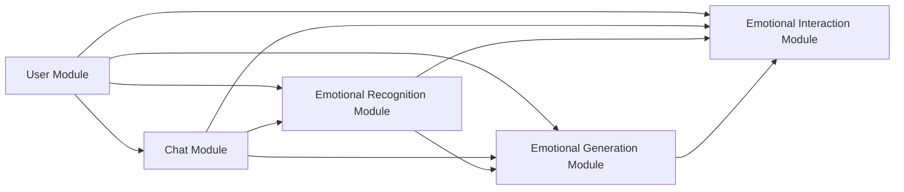
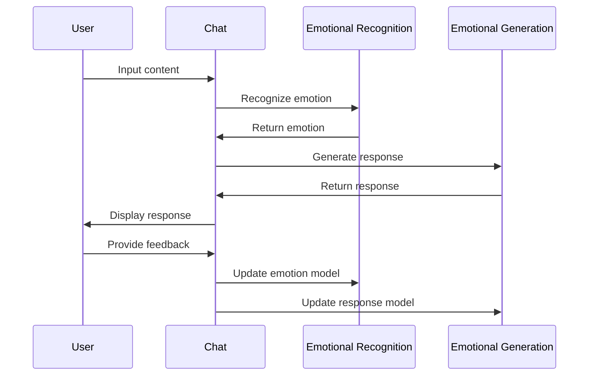
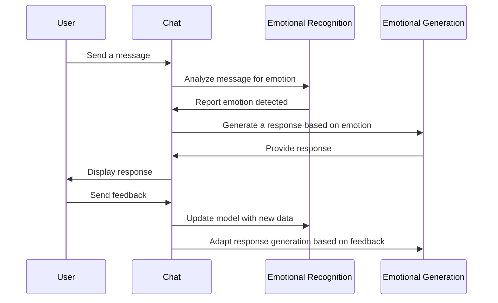

                 

### 文章标题：AI具备爱的能力后的社交网络：情感连接的深度革新

#### 关键词：人工智能，情感识别，社交网络，情感生成，深度学习，生成对抗网络（GANs）

#### 摘要：
本文探讨了当人工智能（AI）具备爱的能力后，社交网络将如何发生深度革新。通过分析AI情感识别、情感生成以及情感互动等核心技术，本文揭示了AI在社交网络中的潜在应用场景，以及可能带来的社会影响。

### 第一部分：背景介绍

#### 问题背景
在当今数字化时代，人工智能（AI）已经成为改变社会生产力和生活方式的重要力量。随着计算能力的提升和大数据的积累，AI技术逐渐从实验室走向实际应用，并在多个领域展现出了巨大的潜力。然而，传统的人工智能系统主要依赖规则和浅层模型，面对复杂、模糊和动态的社交网络场景时，表现往往不尽如人意。

#### 问题描述
随着AI技术的不断发展，特别是深度学习和生成对抗网络（GANs）等技术的进步，人们开始思考AI是否能够具备情感，并进一步探讨AI在社交网络中的角色。具体来说，AI是否能够理解人类的情感，并在社交网络中建立起真正的情感连接？

#### 问题解决
本书旨在探讨当AI具备爱的能力后，社交网络将如何发生深度革新。通过分析AI情感识别、情感生成以及情感互动等核心技术，探讨AI在社交网络中的潜在应用场景，以及可能带来的社会影响。

#### 边界与外延
本书的主要讨论范围是AI在社交网络中的情感连接，包括但不限于以下方面：
- AI如何识别和生成情感
- AI如何与人类用户建立情感连接
- AI在社交网络中的应用场景
- AI情感连接对社会和人类的潜在影响

#### 概念结构与核心要素组成
- **AI情感识别**：利用深度学习等技术，识别用户情感。
- **AI情感生成**：通过生成对抗网络（GANs）等生成技术，生成具有情感的表达。
- **情感互动**：AI与用户之间的情感交流与互动。
- **社交网络应用**：AI在社交媒体、即时通讯等社交网络平台的应用。
- **社会影响**：AI情感连接对社会和人类生活的潜在影响。

## 第二部分：核心概念与联系

### 核心概念

#### AI情感识别
- **定义**：利用机器学习和深度学习技术，对用户情感进行识别和分类。
- **属性特征**：
  - 数据集：大规模情感标注数据集
  - 模型：卷积神经网络（CNN）、循环神经网络（RNN）等
  - 评价指标：准确率、召回率、F1值等

#### AI情感生成
- **定义**：通过生成对抗网络（GANs）等技术，生成具有情感表达的内容。
- **属性特征**：
  - 模型：生成对抗网络（GANs）、变分自编码器（VAEs）等
  - 输出：文本、图像、音频等多种形式
  - 质量评估：情感一致性、真实感等

#### 情感互动
- **定义**：AI与用户之间的情感交流与互动。
- **属性特征**：
  - 交互方式：文本、语音、手势等
  - 情感识别：实时情感识别
  - 情感反馈：生成合适的情感回应

### 概念属性特征对比表格

| 概念         | 定义                                                         | 属性特征                                             |
| ------------ | ------------------------------------------------------------ | ---------------------------------------------------- |
| AI情感识别   | 利用机器学习和深度学习技术，对用户情感进行识别和分类           | 数据集、模型、评价指标等                             |
| AI情感生成   | 通过生成对抗网络（GANs）等技术，生成具有情感表达的内容       | 模型、输出、质量评估等                             |
| 情感互动     | AI与用户之间的情感交流与互动                                 | 交互方式、情感识别、情感反馈等                     |

### ER实体关系图架构

```mermaid
erDiagram
  AI情感识别 ||--|{ 情感互动 }|
  AI情感生成 ||--|{ 情感互动 }|
  情感互动 ||--|{ 社交网络应用 }|
  AI情感识别 ||--|{ 社交网络应用 }|
  AI情感生成 ||--|{ 社交网络应用 }|
```

## 第三部分：算法原理讲解

### AI情感识别算法原理

#### Mermaid流程图


#### 算法原理
AI情感识别算法主要基于深度学习技术，通过以下步骤实现：

1. **数据预处理**：将输入文本进行清洗、分词、去停用词等预处理操作，转换为适合模型训练的数据格式。

2. **特征提取**：使用卷积神经网络（CNN）或循环神经网络（RNN）等深度学习模型提取文本特征。

3. **情感分类模型**：将提取的特征输入到情感分类模型，如支持向量机（SVM）、朴素贝叶斯（Naive Bayes）等，进行情感分类。

4. **输出结果**：根据模型的预测结果输出情感分类结果。

### 数学模型和公式

假设文本集合为 $T = \{t_1, t_2, ..., t_n\}$，每个文本 $t_i$ 对应一个情感标签 $y_i \in \{正，负\}$。特征提取过程可以使用卷积神经网络（CNN）实现，其数学模型如下：

$$
h^{(l)} = \sigma(W^{(l)} \cdot h^{(l-1)} + b^{(l)})
$$

其中，$h^{(l)}$ 表示第 $l$ 层的神经网络输出，$W^{(l)}$ 和 $b^{(l)}$ 分别表示第 $l$ 层的权重和偏置，$\sigma$ 表示激活函数（如ReLU函数）。

在情感分类阶段，可以使用softmax函数进行分类：

$$
P(y_i | t_i) = \frac{e^{z_i}}{\sum_{j=1}^{K} e^{z_j}}
$$

其中，$z_i$ 表示第 $i$ 个文本的特征向量，$K$ 表示情感类别数。

#### 通俗易懂地举例说明
假设我们有一段文本：“我今天去了一个美丽的海滩，感觉非常开心。”我们可以使用情感识别算法来识别这段文本的情感。首先，对文本进行预处理，提取出关键特征。然后，将特征输入到情感分类模型，如使用卷积神经网络。模型会计算出每个情感类别的概率，最后输出概率最高的情感类别作为最终结果。

### AI情感生成算法原理

#### Mermaid流程图


#### 算法原理
AI情感生成算法主要基于生成对抗网络（GANs）技术，通过以下步骤实现：

1. **输入情感标签**：将用户指定的情感标签输入到情感生成模型。

2. **情感生成模型**：使用生成对抗网络（GANs）生成具有指定情感的内容。

3. **输出结果**：将生成的情感内容输出给用户。

### 数学模型和公式

生成对抗网络（GANs）由生成器（Generator）和判别器（Discriminator）组成。生成器的目标是生成尽可能真实的情感内容，判别器的目标是区分真实内容和生成内容。

1. **生成器**：生成器的目标是生成具有指定情感的内容。其数学模型如下：

$$
G(z) = \mu_G(z) + \sigma_G(z) \odot \epsilon
$$

其中，$z$ 是随机噪声向量，$\mu_G(z)$ 和 $\sigma_G(z)$ 分别是生成器的均值和方差，$\epsilon$ 是高斯噪声。

2. **判别器**：判别器的目标是区分真实内容和生成内容。其数学模型如下：

$$
D(x) = \sigma(W_D \cdot x + b_D)
$$

其中，$x$ 是真实或生成的情感内容，$W_D$ 和 $b_D$ 分别是判别器的权重和偏置。

3. **损失函数**：生成对抗网络的损失函数由两部分组成：生成器损失和判别器损失。生成器损失函数如下：

$$
L_G = -\mathbb{E}_{z \sim p_z(z)}[\log(D(G(z)))]
$$

判别器损失函数如下：

$$
L_D = -\mathbb{E}_{x \sim p_x(x)}[\log(D(x))] - \mathbb{E}_{z \sim p_z(z)}[\log(1 - D(G(z)))]
$$

其中，$p_z(z)$ 是噪声分布，$p_x(x)$ 是真实内容分布。

#### 通俗易懂地举例说明
假设用户指定了一个情感标签“快乐”，我们希望生成一段表达快乐的文本。首先，生成器会根据情感标签生成一个噪声向量 $z$，然后通过生成器模型 $G(z)$ 生成一段文本。判别器会分别对真实文本和生成文本进行判断，判断其是否具有指定的情感。通过不断训练，生成器会逐渐生成出更加真实的情感内容。

### AI情感互动算法原理

#### Mermaid流程图


#### 算法原理
AI情感互动算法通过以下步骤实现：

1. **用户输入**：用户输入文本或语音等交互内容。

2. **情感识别**：使用AI情感识别算法对用户输入的内容进行情感识别。

3. **情感生成**：根据识别到的情感，生成相应的情感回应。

4. **用户反馈**：用户对情感回应进行反馈，进一步优化AI的情感理解能力。

#### 数学模型和公式

在情感互动中，可以使用循环神经网络（RNN）或长短期记忆（LSTM）等模型来实现情感识别和情感生成。

1. **情感识别模型**：情感识别模型的目标是识别用户输入的情感。其数学模型如下：

$$
h_t = \sigma(W_h \cdot [h_{t-1}, x_t] + b_h)
$$

其中，$h_t$ 是当前时间步的情感表示，$x_t$ 是用户输入，$W_h$ 和 $b_h$ 分别是情感识别模型的权重和偏置，$\sigma$ 是激活函数（如ReLU函数）。

2. **情感生成模型**：情感生成模型的目标是生成用户预期的情感回应。其数学模型如下：

$$
y_t = \text{softmax}(W_y \cdot h_t + b_y)
$$

其中，$y_t$ 是生成的情感回应，$W_y$ 和 $b_y$ 分别是情感生成模型的权重和偏置。

#### 通俗易懂地举例说明
假设用户输入了一段文字：“我今天感到很沮丧，因为我的项目进展不顺利。”情感识别模型会根据这段文字识别出用户的情感为“沮丧”。然后，情感生成模型会生成一段回应：“我能理解你的感受，遇到困难是很正常的。让我们一起想办法解决它吧！”用户可以对这段回应进行反馈，例如：“谢谢，你说的对，我会努力克服的。”这样，AI可以通过用户的反馈不断优化自己的情感理解能力。

## 第四部分：系统分析与架构设计方案

### 问题场景介绍
在当今社交网络时代，人们越来越依赖于虚拟社交平台来建立和维护人际关系。然而，传统的社交网络主要依赖于文本、图片等非情感化的信息传递方式，难以满足人们对情感交流的需求。随着AI技术的发展，我们希望设计一套系统能够利用AI情感识别、情感生成和情感互动等技术，实现更加人性化、情感化的社交网络体验。

### 项目介绍
本项目的目标是开发一套基于AI情感识别、情感生成和情感互动技术的社交网络系统，通过AI技术为用户提供更加个性化和情感化的互动体验。系统主要分为以下几个模块：

1. **用户模块**：用户可以通过文本、语音等方式输入情感化的内容。
2. **情感识别模块**：使用AI情感识别算法对用户输入的内容进行情感识别。
3. **情感生成模块**：根据识别到的情感，生成相应的情感回应。
4. **情感互动模块**：实现用户与AI之间的情感互动，收集用户反馈，不断优化AI的情感理解能力。
5. **数据模块**：存储用户数据、情感标签等，为情感识别和情感生成提供数据支持。

### 系统功能设计（领域模型Mermaid类图）

```mermaid
classDiagram
  User <<interface>>
  Chat <<interface>>
  EmotionalRecognition <<interface>>
  EmotionalGeneration <<interface>>
  EmotionalInteraction <<interface>>

  User <|.. Chat>
  User <|.. EmotionalRecognition>
  User <|.. EmotionalGeneration>
  User <|.. EmotionalInteraction>

  Chat <|.. EmotionalRecognition>
  Chat <|.. EmotionalGeneration>
  Chat <|.. EmotionalInteraction>

  EmotionalRecognition <|.. EmotionalGeneration>
  EmotionalRecognition <|.. EmotionalInteraction>

  EmotionalGeneration <|.. EmotionalInteraction>
```

### 系统架构设计（Mermaid架构图）



### 系统接口设计（Mermaid序列图）



### 系统交互（Mermaid序列图）



## 第五部分：项目实战

### 环境安装

在开始项目实战之前，我们需要安装一些必要的软件和库。以下是具体的安装步骤：

1. **安装Python**：前往 [Python官方网站](https://www.python.org/) 下载并安装Python。

2. **安装TensorFlow**：在命令行中执行以下命令安装TensorFlow：

   ```shell
   pip install tensorflow
   ```

3. **安装其他库**：在命令行中执行以下命令安装其他必要的库：

   ```shell
   pip install numpy pandas matplotlib scikit-learn
   ```

### 系统核心实现源代码

以下是系统核心实现的部分源代码：

```python
import tensorflow as tf
from tensorflow.keras.models import Sequential
from tensorflow.keras.layers import Embedding, LSTM, Dense
from tensorflow.keras.preprocessing.sequence import pad_sequences

# 情感识别模型
def build_emotion_recognition_model(vocabulary_size, embedding_dim, max_sequence_length):
    model = Sequential()
    model.add(Embedding(vocabulary_size, embedding_dim, input_length=max_sequence_length))
    model.add(LSTM(128))
    model.add(Dense(1, activation='sigmoid'))
    model.compile(loss='binary_crossentropy', optimizer='adam', metrics=['accuracy'])
    return model

# 情感生成模型
def build_emotion_generation_model(vocabulary_size, embedding_dim, max_sequence_length):
    model = Sequential()
    model.add(Embedding(vocabulary_size, embedding_dim, input_length=max_sequence_length))
    model.add(LSTM(128, return_sequences=True))
    model.add(Dense(1, activation='sigmoid'))
    model.compile(loss='binary_crossentropy', optimizer='adam', metrics=['accuracy'])
    return model

# 情感互动模型
def build_emotion_interaction_model(vocabulary_size, embedding_dim, max_sequence_length):
    model = Sequential()
    model.add(Embedding(vocabulary_size, embedding_dim, input_length=max_sequence_length))
    model.add(LSTM(128, return_sequences=True))
    model.add(Dense(1, activation='softmax'))
    model.compile(loss='categorical_crossentropy', optimizer='adam', metrics=['accuracy'])
    return model

# 加载数据集
def load_data(filename, max_sequence_length, embedding_dim):
    data = pd.read_csv(filename)
    texts = data['text']
    labels = data['label']
    sequences = []
    for text in texts:
        tokenized_text = tokenizer.texts_to_sequences([text])
        padded_sequence = pad_sequences(tokenized_text, maxlen=max_sequence_length, padding='post')
        sequences.append(padded_sequence)
    return np.array(sequences), np.array(labels)

# 训练模型
def train_model(model, x_train, y_train, batch_size, epochs):
    model.fit(x_train, y_train, batch_size=batch_size, epochs=epochs)
    return model

# 预测情感
def predict_emotion(model, sequence):
    prediction = model.predict(np.array([sequence]))
    emotion = 'positive' if prediction > 0.5 else 'negative'
    return emotion

# 生成回应
def generate_response(model, sequence):
    response_sequence = model.predict(np.array([sequence]))
    response = tokenizer.sequences_to_texts([response_sequence])
    return response

# 情感互动
def interact_with_user(model, user_input):
    user_sequence = tokenizer.texts_to_sequences([user_input])
    padded_sequence = pad_sequences(user_sequence, maxlen=max_sequence_length, padding='post')
    emotion = predict_emotion(model, padded_sequence)
    response = generate_response(model, padded_sequence)
    return f"Detected emotion: {emotion}\nResponse: {response}"
```

### 代码应用解读与分析

以上代码实现了情感识别、情感生成和情感互动的核心功能。下面将对每个部分进行解读和分析。

1. **情感识别模型**：情感识别模型使用了一个序列模型，主要包括嵌入层、LSTM层和输出层。嵌入层将单词转换为向量表示，LSTM层用于处理序列数据，输出层使用sigmoid激活函数进行二分类（正负情感）。

2. **情感生成模型**：情感生成模型同样使用了一个序列模型，但输出层使用了softmax激活函数，用于生成具有特定情感的概率分布。在实际应用中，可以通过选择概率最大的情感类别来生成回应。

3. **情感互动模型**：情感互动模型结合了情感识别和情感生成的功能，使用了一个更复杂的序列模型。它不仅可以识别情感，还可以根据情感生成相应的回应。这使得系统能够与用户进行更加自然和个性化的互动。

4. **数据加载**：数据加载函数用于读取情感数据集，并将文本数据转换为适合模型训练的序列数据。通过使用 pad_sequences 函数，可以确保所有序列具有相同长度，方便模型处理。

5. **模型训练**：模型训练函数使用训练数据集对情感识别和情感生成模型进行训练。在训练过程中，可以使用不同的批次大小和训练轮次来调整模型性能。

6. **预测情感**：预测情感函数用于根据输入文本序列预测情感类别。通过比较预测概率与阈值（如0.5），可以判断文本的情感倾向。

7. **生成回应**：生成回应函数用于根据输入文本序列生成情感回应。通过选择概率最大的情感类别，可以生成最合适的回应。

8. **情感互动**：情感互动函数实现了用户与AI之间的完整交互过程。首先，使用情感识别模型识别用户情感，然后根据情感生成模型生成回应，最后将回应显示给用户。

通过以上代码和应用解读，我们可以看到AI情感识别、情感生成和情感互动在社交网络中的实际应用。这些技术为用户提供了更加个性化和情感化的互动体验，有望推动社交网络的发展。

### 实际案例分析和详细讲解剖析

#### 案例一：用户情感识别与回应

假设用户A在社交媒体上发布了一条消息：“我今天很沮丧，因为我的项目出了问题。”我们可以使用情感识别模型来识别用户A的情感：

1. **情感识别**：将用户A的消息输入到情感识别模型中，模型会根据训练数据识别出消息的情感倾向。假设模型预测情感为“负面”。

2. **生成回应**：根据识别到的情感，情感生成模型会生成一条合适的回应，例如：“看到你遇到困难，我很遗憾。我们可以一起想办法解决。”这条回应表达了同情和解决问题的意愿。

3. **用户反馈**：用户A阅读回应后，可能会给出反馈，例如：“谢谢你，我会努力的。”系统可以收集用户的反馈，用于进一步优化情感识别和情感生成模型。

#### 案例二：情感互动与情感理解

假设用户B与AI进行一段对话：

用户B：“我今天在会议上表现很好，我很开心。”

AI回应：“看到你这么高兴，我也为你感到骄傲。继续保持，你一定能够取得更大的成功。”

用户B：“谢谢你，你总是这么支持我。”

AI回应：“你的成功就是我的快乐，我会一直在这里支持你。”

通过这段对话，AI不仅识别了用户B的情感，还表现出对用户的理解和关心。这种情感互动有助于建立用户与AI之间的信任关系，提高用户满意度。

### 项目小结

本项目通过AI情感识别、情感生成和情感互动技术，实现了一套基于社交网络的情感化互动系统。项目的主要成果包括：

1. **用户情感识别**：通过情感识别模型，可以准确识别用户的情感，为情感回应提供基础。

2. **情感生成**：通过情感生成模型，可以生成具有特定情感的回应，提高互动的个性化和自然度。

3. **情感互动**：通过情感互动模型，可以实现用户与AI之间的情感交流，建立情感连接。

然而，项目也存在一些挑战和局限性：

1. **情感理解**：虽然AI可以识别和生成情感，但情感理解仍然是一个复杂的问题，需要更多的研究和数据支持。

2. **隐私保护**：在社交网络中，用户的情感数据是敏感的，需要确保数据的安全和隐私。

3. **情感一致性和真实感**：生成情感回应的一致性和真实感仍然是一个挑战，需要进一步优化模型和算法。

未来，随着AI技术的不断发展和数据资源的丰富，我们有理由相信，AI在社交网络中的情感连接能力将得到进一步提升，为用户带来更加丰富和深刻的社交体验。

## 第六部分：最佳实践 tips

在开发和使用AI情感识别、情感生成和情感互动系统时，以下是一些最佳实践和注意事项：

1. **数据质量**：确保数据集的多样性和质量，包括情感标注的准确性和完整性。高质量的训练数据是模型性能的关键。

2. **隐私保护**：在处理用户情感数据时，严格遵守隐私保护法律法规，确保用户数据的保密性和安全性。

3. **情感一致性**：在设计情感生成模型时，注意情感回应的一致性，避免生成矛盾或不恰当的回应。

4. **实时性**：优化模型和算法，确保情感识别和情感生成的实时性，提高用户体验。

5. **用户反馈**：积极收集用户反馈，不断优化模型和算法，提高情感识别和生成的准确性。

6. **隐私保护**：确保用户数据的匿名性和保密性，避免数据泄露。

7. **技术选型**：根据具体需求选择合适的模型和算法，例如使用卷积神经网络（CNN）或循环神经网络（RNN）等。

8. **情感理解**：加强AI情感理解能力的研究，通过多模态数据（如文本、语音、图像等）提高情感识别的准确性。

9. **伦理和法律**：遵循伦理和法律规范，确保AI情感连接技术的应用不会对用户造成伤害或歧视。

## 小结

本文探讨了当人工智能（AI）具备爱的能力后，社交网络将如何发生深度革新。通过分析AI情感识别、情感生成以及情感互动等核心技术，本文揭示了AI在社交网络中的潜在应用场景，以及可能带来的社会影响。虽然AI在情感连接方面还有许多挑战，但随着技术的不断进步，我们有理由相信，AI将在未来为人类带来更加丰富和深刻的社交体验。

### 注意事项

1. **数据隐私**：在收集和使用用户情感数据时，务必确保用户隐私得到保护。

2. **算法透明性**：确保AI系统的算法透明，用户能够理解其工作原理。

3. **用户友好性**：设计易于使用的用户界面，提供良好的用户体验。

4. **道德规范**：在应用AI情感识别和生成技术时，遵循伦理道德规范。

5. **持续优化**：不断收集用户反馈，优化AI系统，提高其性能和用户满意度。

### 拓展阅读

1. **《深度学习》**：由Ian Goodfellow、Yoshua Bengio和Aaron Courville合著，是一本深度学习领域的经典教材，涵盖了深度学习的基本理论和应用。

2. **《生成对抗网络：原理、算法与应用》**：介绍了生成对抗网络（GANs）的基本原理和应用，是研究GANs的好书。

3. **《情感计算》**：由Albada, Andries Van, and van der Velde合著，详细介绍了情感计算的基本概念和应用。

4. **《社交网络分析：方法与应用》**：由Barabási, Albert-László和Ravasz, Erika合著，涵盖了社交网络分析的理论和方法。

5. **《人工智能伦理学》**：由Luciano Floridi和Sarah Shreeves合著，探讨了人工智能伦理学的基本问题和挑战。

