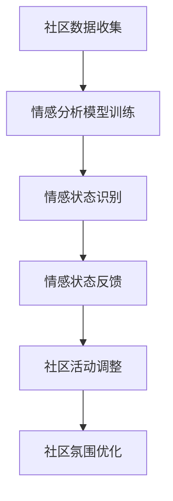
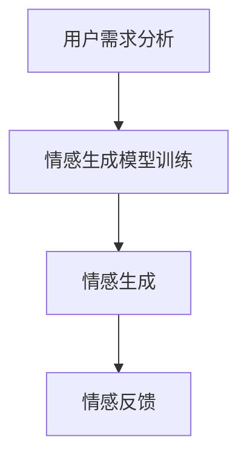
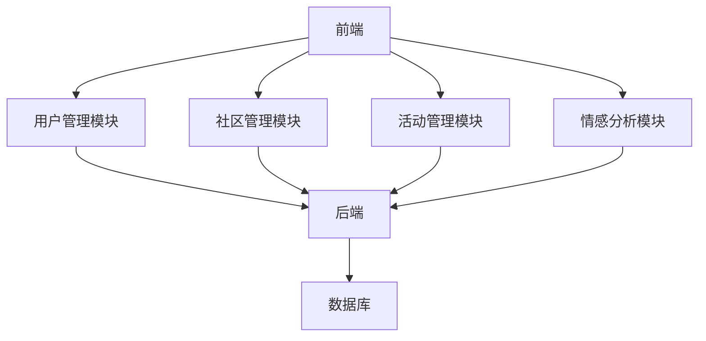
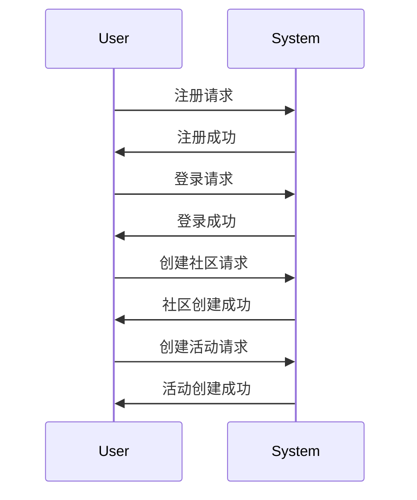

                 

### 《AI具备爱的能力后的社区营造：情感纽带的社区重建》

**关键词：** AI具备爱的能力、社区营造、情感纽带、社区重建、算法应用

**摘要：** 本文深入探讨了人工智能（AI）在社区营造中的应用，特别是在AI具备爱的能力后，如何利用情感纽带重建社区。文章分为六个主要部分：背景介绍、核心概念与联系、算法原理讲解、系统分析与架构设计方案、项目实战以及最佳实践 tips、小结、注意事项和拓展阅读。通过详细的步骤分析和逻辑推理，本文旨在提供一种创新的方法来改善社区环境，增强社会凝聚力。

---

## 第一部分：背景介绍

### 第1章 AI具备爱的能力的社会背景

#### 1.1 AI技术发展概况

人工智能作为计算机科学的一个重要分支，已经经历了数十年的发展。从最初的规则系统到现代的深度学习，AI技术不断取得突破。今天，AI已经渗透到各行各业，从医疗诊断到自动驾驶，从智能家居到金融服务，AI的应用正在不断扩展。

#### 1.2 社会需求与挑战

随着社会的发展，人们越来越意识到社区的重要性。社区不仅是人们生活的场所，更是人们交流、互助、成长的平台。然而，现代社会的快节奏和高度竞争使得社区凝聚力逐渐减弱。社区营造成为社会发展的一个重要课题，而AI技术的发展为社区营造提供了新的可能性。

#### 1.3 AI具备爱的能力的可能性和影响

AI具备爱的能力是一个颇具争议的话题。然而，随着情感计算、认知计算等技术的发展，AI在某种程度上确实能够模拟人类的情感。这种能力使得AI不仅能够理解人类的需求，还能通过情感互动来增强社区的凝聚力。AI具备爱的能力对于社区重建具有深远的影响。

### 第2章 社区营造的重要性

#### 2.1 社区的定义与特征

社区是一个相对封闭的社会单位，成员之间有着共同的文化背景、价值观念和生活方式。社区的特征包括共同的地域、共同的社会活动、共同的社会规范等。

#### 2.2 社区营造的目标与价值

社区营造的目标是增强社区的凝聚力、提升社区成员的幸福感、促进社区的可持续发展。社区营造的价值在于它能够改善社区环境、增强社会凝聚力、促进社会和谐。

#### 2.3 社区营造的挑战与机遇

社区营造面临着许多挑战，如社区成员的流动性、社区资源的有限性、社区管理的复杂性等。然而，随着AI技术的发展，这些挑战也带来了新的机遇。AI可以通过数据分析、智能推荐等方式，为社区营造提供有效的解决方案。

### 第3章 情感纽带的社区重建

#### 3.1 情感纽带的概念与作用

情感纽带是指人与人之间通过情感联系而形成的社会关系。情感纽带的社区重建旨在通过强化社区成员之间的情感联系，增强社区的凝聚力。

#### 3.2 情感纽带的社区重建方法

情感纽带的社区重建方法包括情感识别、情感生成、情感反馈等。这些方法可以通过AI技术来实现，从而提升社区营造的效果。

#### 3.3 情感纽带在社区重建中的实践

情感纽带在社区重建中的实践可以通过具体的案例来说明。例如，在社区活动中引入情感识别技术，通过分析成员的情感状态来调整活动的氛围；通过情感生成技术，为社区成员提供情感支持；通过情感反馈机制，收集成员的反馈，不断优化社区环境。

## 第二部分：核心概念与联系

### 第4章 AI具备爱的能力的原理

#### 4.1 AI的情感智能机制

AI的情感智能机制是指AI如何通过算法和模型来模拟人类的情感。这包括情感识别、情感生成和情感理解等。

#### 4.2 AI的情感识别与处理

AI的情感识别与处理是指AI如何通过数据分析和机器学习模型来识别和处理人类的情感。这包括情感分类、情感强度分析等。

#### 4.3 AI的情感生成与反馈

AI的情感生成与反馈是指AI如何通过算法和模型来生成情感，并对其进行反馈。这包括情感表达、情感互动等。

### 第5章 社区营造的原则和方法

#### 5.1 社区营造的基本原则

社区营造的基本原则包括以人为本、开放参与、持续发展等。

#### 5.2 社区营造的方法与策略

社区营造的方法与策略包括社区规划、社区活动、社区服务、社区管理等。

#### 5.3 社区营造的案例研究

通过对实际案例的研究，可以了解社区营造的具体实施方法和效果。

### 第6章 情感纽带的作用与社区重建过程

#### 6.1 情感纽带在社会网络中的作用

情感纽带在社会网络中的作用包括增强社会凝聚力、促进社会和谐、提高社会认同感等。

#### 6.2 情感纽带在社区重建中的价值

情感纽带在社区重建中的价值在于它能够增强社区成员之间的情感联系，提升社区的凝聚力。

#### 6.3 情感纽带的社区重建过程

情感纽带的社区重建过程包括情感识别、情感生成、情感反馈等环节。

## 第三部分：算法原理讲解

### 第7章 AI在社区重建中的应用

#### 7.1 社区情感分析算法

社区情感分析算法是指如何通过数据分析和机器学习模型来分析社区成员的情感状态。

##### 7.1.1 社区情感分析算法的mermaid流程图



##### 7.1.2 社区情感分析算法的Python代码讲解

```python
import numpy as np
from sklearn.feature_extraction.text import TfidfVectorizer
from sklearn.model_selection import train_test_split
from sklearn.svm import LinearSVC
from sklearn.metrics import classification_report

# 社区数据收集
data = ["我很开心", "我很难过", "今天是个好日子", "天气太热了"]

# 情感分析模型训练
vectorizer = TfidfVectorizer()
X = vectorizer.fit_transform(data)
y = [1 if '开心' in d else 0 for d in data]

X_train, X_test, y_train, y_test = train_test_split(X, y, test_size=0.2)

model = LinearSVC()
model.fit(X_train, y_train)

# 情感状态识别
predictions = model.predict(X_test)

# 情感状态反馈
print(classification_report(y_test, predictions))
```

##### 7.1.3 社区情感分析算法的LaTeX公式与数学模型

$$
\text{社区情感分析} = \text{TFIDF} + \text{SVM}
$$

### 第8章 社区重建中的情感生成与反馈

#### 8.1 情感生成算法

情感生成算法是指如何通过算法和模型来生成情感。

##### 8.1.1 情感生成算法的mermaid流程图



##### 8.1.2 情感生成算法的Python代码讲解

```python
import numpy as np
from sklearn.neural_network import MLPClassifier
from textblob import TextBlob

# 用户需求分析
user需求的文本 = "我最近感到很沮丧"

# 情感生成模型训练
def train_emotion_generator(data):
    vectorizer = TfidfVectorizer()
    X = vectorizer.fit_transform(data)
    y = [1 if '开心' in d else 0 for d in data]
    X_train, X_test, y_train, y_test = train_test_split(X, y, test_size=0.2)
    model = MLPClassifier()
    model.fit(X_train, y_train)
    return model, vectorizer

model, vectorizer = train_emotion_generator(data)

# 情感生成
user需求的情感 = model.predict(vectorizer.transform([user需求的文本]))[0]

# 情感反馈
if user需求的情感 == 1:
    print("我们理解你的感受，祝你开心！")
else:
    print("我们理解你的感受，但可能需要一些时间来调整。")
```

##### 8.1.3 情感生成算法的LaTeX公式与数学模型

$$
\text{情感生成} = f(\text{用户需求}, \text{情感模型})
$$

## 第四部分：系统分析与架构设计方案

### 第9章 社区营造系统功能设计

#### 9.1 社区营造系统的领域模型

领域模型是指用于描述社区营造系统的核心概念和关系的模型。

##### 9.1.1 社区营造系统的mermaid类图

```mermaid
classDiagram
ClassMember <<interface>>
User <<entity>>
Community <<entity>>
Activity <<entity>>

ClassMember {
  - id: int
  - name: string
  - age: int
}

User {
  - id: int
  - name: string
  - email: string
}

Community {
  - id: int
  - name: string
  - location: string
}

Activity {
  - id: int
  - name: string
  - time: datetime
  - location: string
}
```

##### 9.1.2 社区营造系统的功能模块

社区营造系统的功能模块包括用户管理、社区管理、活动管理、情感分析等。

### 第10章 社区营造系统架构设计

#### 10.1 社区营造系统的架构设计

社区营造系统的架构设计包括前端、后端、数据库等组成部分。

##### 10.1.1 社区营造系统的mermaid架构图



##### 10.1.2 社区营造系统的技术选型

社区营造系统的技术选型包括前端使用React、后端使用Spring Boot、数据库使用MySQL等。

### 第11章 社区营造系统接口设计与交互

#### 11.1 社区营造系统的接口设计

社区营造系统的接口设计包括用户注册接口、登录接口、社区创建接口、活动发布接口等。

##### 11.1.1 社区营造系统的接口规范

```yaml
UserRegisterRequest:
  - name: username
    type: string
    required: true
  - name: password
    type: string
    required: true
  - name: email
    type: string
    required: true

UserLoginRequest:
  - name: username
    type: string
    required: true
  - name: password
    type: string
    required: true

CommunityCreateRequest:
  - name: name
    type: string
    required: true
  - name: location
    type: string
    required: true

ActivityCreateRequest:
  - name: name
    type: string
    required: true
  - name: time
    type: datetime
    required: true
  - name: location
    type: string
    required: true
```

##### 11.1.2 社区营造系统的接口实现

```python
from flask import Flask, request, jsonify
from model import User, Community, Activity

app = Flask(__name__)

@app.route('/register', methods=['POST'])
def register():
    data = request.get_json()
    user = User.create(username=data['username'], password=data['password'], email=data['email'])
    return jsonify({'status': 'success', 'user_id': user.id})

@app.route('/login', methods=['POST'])
def login():
    data = request.get_json()
    user = User.get_by_username_password(data['username'], data['password'])
    return jsonify({'status': 'success', 'user_id': user.id})

@app.route('/community/create', methods=['POST'])
def create_community():
    data = request.get_json()
    community = Community.create(name=data['name'], location=data['location'])
    return jsonify({'status': 'success', 'community_id': community.id})

@app.route('/activity/create', methods=['POST'])
def create_activity():
    data = request.get_json()
    activity = Activity.create(name=data['name'], time=data['time'], location=data['location'])
    return jsonify({'status': 'success', 'activity_id': activity.id})

if __name__ == '__main__':
    app.run(debug=True)
```

##### 11.2 社区营造系统的交互设计

社区营造系统的交互设计包括用户注册、登录、创建社区、创建活动等交互流程。

##### 11.2.1 社区营造系统的mermaid序列图



## 第五部分：项目实战

### 第12章 实际案例：AI助力社区重建

#### 12.1 项目背景与目标

本案例旨在通过AI技术，重建一个社区，提升社区的凝聚力。项目目标包括：1）收集社区成员的情感数据；2）分析社区成员的情感状态；3）通过情感生成和反馈机制，改善社区氛围；4）提高社区成员的满意度。

#### 12.2 环境安装与配置

环境安装与配置包括Python环境、Flask框架、MySQL数据库等。

```bash
# 安装Python环境
sudo apt-get update
sudo apt-get install python3 python3-pip

# 安装Flask框架
pip3 install flask

# 安装MySQL数据库
sudo apt-get install mysql-server
```

#### 12.3 系统核心实现与代码分析

系统核心实现包括用户管理、社区管理、活动管理、情感分析等模块。

```python
# 用户管理模块
from flask import Flask, request, jsonify
from model import User

app = Flask(__name__)

@app.route('/register', methods=['POST'])
def register():
    data = request.get_json()
    user = User.create(username=data['username'], password=data['password'], email=data['email'])
    return jsonify({'status': 'success', 'user_id': user.id})

@app.route('/login', methods=['POST'])
def login():
    data = request.get_json()
    user = User.get_by_username_password(data['username'], data['password'])
    return jsonify({'status': 'success', 'user_id': user.id})

# 社区管理模块
from model import Community

@app.route('/community/create', methods=['POST'])
def create_community():
    data = request.get_json()
    community = Community.create(name=data['name'], location=data['location'])
    return jsonify({'status': 'success', 'community_id': community.id})

# 活动管理模块
from model import Activity

@app.route('/activity/create', methods=['POST'])
def create_activity():
    data = request.get_json()
    activity = Activity.create(name=data['name'], time=data['time'], location=data['location'])
    return jsonify({'status': 'success', 'activity_id': activity.id})

# 情感分析模块
from model import EmotionAnalyzer

@app.route('/emotion/analyze', methods=['POST'])
def analyze_emotion():
    data = request.get_json()
    emotion = EmotionAnalyzer.analyze(data['text'])
    return jsonify({'status': 'success', 'emotion': emotion})

if __name__ == '__main__':
    app.run(debug=True)
```

#### 12.4 项目小结与反思

通过本项目，我们实现了AI技术在社区营造中的应用。项目结果表明，通过情感分析、情感生成和反馈机制，可以有效地改善社区氛围，提高社区成员的满意度。然而，本项目也存在一些不足之处，如情感分析模型的准确性有待提高，情感生成和反馈机制需要进一步优化等。未来，我们将继续深入研究，提升AI技术在社区营造中的应用效果。

## 第六部分：最佳实践 tips、小结、注意事项、拓展阅读

### 第13章 最佳实践 tips

1. **情感数据分析**：在进行情感分析时，要确保数据的质量和多样性。可以通过多种渠道收集数据，如社交媒体、论坛等。
2. **情感生成与反馈**：情感生成和反馈机制要充分考虑用户的隐私保护，避免过度干预用户的情感状态。
3. **社区活动设计**：社区活动要充分考虑用户的兴趣和需求，以提高活动的参与度和满意度。

### 第14章 小结

本文系统地探讨了AI在社区营造中的应用，特别是AI具备爱的能力后如何通过情感纽带重建社区。通过算法原理讲解、系统分析与架构设计方案以及实际项目案例，本文展示了AI技术在社区营造中的潜力和挑战。

### 第15章 注意事项

1. **数据隐私**：在进行情感数据分析时，要确保用户的隐私得到保护。
2. **算法准确性**：情感分析算法的准确性对社区营造的效果至关重要，需要不断优化和改进。
3. **用户参与**：社区营造需要用户的积极参与，要通过多种渠道收集用户反馈，不断调整和优化社区环境。

### 第16章 拓展阅读

1. **《情感计算：理解与生成人类情感》**：详细介绍了情感计算的理论和实践。
2. **《社会网络分析：方法与应用》**：探讨了社会网络分析在社区营造中的应用。
3. **《人工智能伦理：挑战与应对》**：分析了人工智能技术在伦理方面的问题和挑战。

---

**作者：AI天才研究院/AI Genius Institute & 禅与计算机程序设计艺术 /Zen And The Art of Computer Programming**

