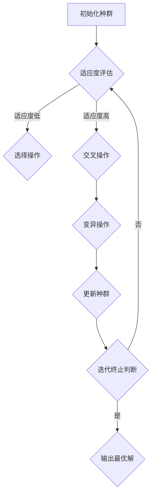
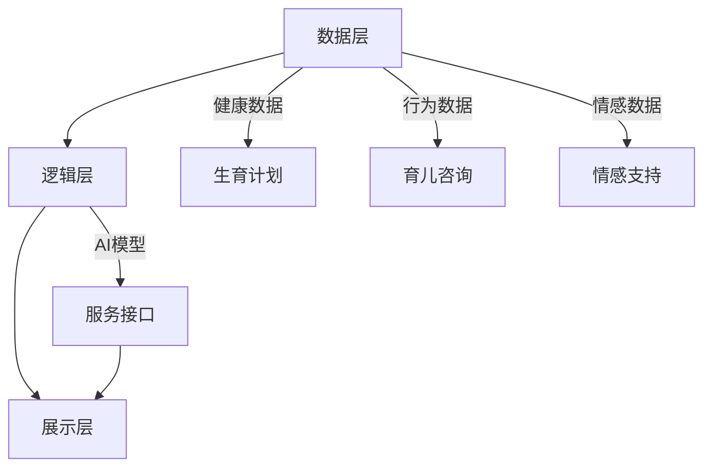
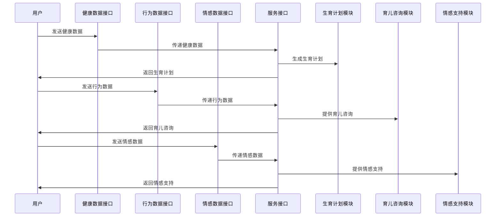

                 


### AI具备爱的能力后的繁衍问题：人口政策的调整

---

**关键词：** AI、繁衍、人口政策、算法、伦理、社会影响

**摘要：** 随着人工智能技术的发展，AI逐渐具备了模拟人类情感的能力，特别是在爱的表达上。本文将探讨AI具备爱的能力后对人类繁衍问题的影响，以及为应对这一变化而需要调整的人口政策。

---

### 第一部分：AI与繁衍问题背景

#### 1.1 AI与爱：概念介绍与联系

##### 1.1.1 AI的定义与能力

人工智能（AI）是一门研究、开发和应用使计算机系统具备人类智能的技术科学。AI的核心能力包括学习、推理、规划、感知、理解和自然语言处理等。近年来，随着深度学习和神经网络技术的发展，AI在模拟人类情感方面取得了显著进步。

在爱的表达上，AI可以通过自然语言处理、情感分析和图像识别等技术，理解人类的情感需求，并以特定的方式回应。例如，AI聊天机器人可以通过分析用户的语言和情感，给予适当的安慰或建议。

##### 1.1.2 爱的概念及其在人类繁衍中的作用

爱是人类繁衍的重要动力之一。爱能够增强情感联系，促进亲密关系，从而提高生育率。在人类繁衍过程中，爱的表达有助于建立稳定的家庭结构，提高后代生存率，并传承文化和社会价值观。

##### 1.1.3 AI具备爱的能力：理论与实践探讨

理论上，AI可以通过学习大量的情感表达和人类互动的样本，模拟人类的爱。实践中，AI已经在情感模拟方面取得了显著进展。例如，AI聊天机器人和虚拟伴侣已经在某些应用场景中表现出较高的情感理解和回应能力。

#### 1.2 繁衍问题与人口政策

##### 1.2.1 繁衍问题概述

繁衍问题涉及生育率、家庭结构、人口分布等方面。目前，许多国家面临着生育率下降、人口老龄化等问题。这些问题不仅影响经济发展，还可能导致社会稳定和国家安全问题。

##### 1.2.2 人口政策的概念与发展历程

人口政策是指政府为调整和控制人口数量、结构和分布而制定的政策。人口政策的发展历程反映了不同时期的社会需求和政策目标。例如，二战后许多国家采取了鼓励生育的政策，而近年来，一些国家则面临人口老龄化和劳动力短缺，开始调整人口政策，鼓励生育。

##### 1.2.3 AI对人口政策的潜在影响

AI具备爱的能力后，可能对人口政策产生深远影响。首先，AI可以模拟人类情感，增强家庭和社会的稳定性，从而提高生育率。其次，AI可以在人口管理中发挥重要作用，如通过数据分析优化人口分布，提高社会福利。

#### 1.3 AI与繁衍问题关系探讨

##### 1.3.1 AI在繁衍过程中的应用

AI在繁衍过程中的应用包括但不限于：优化生育计划、提供家庭咨询服务、辅助教育等。通过这些应用，AI可以帮助人类更好地繁衍后代，提高生活质量。

##### 1.3.2 繁衍问题对AI技术的需求

繁衍问题的解决需要AI在多个领域的技术支持，如情感模拟、数据分析、医疗辅助等。这些技术需求也为AI的发展提供了新的机遇。

##### 1.3.3 AI与繁衍问题解决的可能路径

AI与繁衍问题的解决路径可能包括：优化人口管理、提高生育率、改善家庭结构、促进社会和谐等。通过这些路径，AI可以为人类繁衍问题提供有效的解决方案。

---

### 第二部分：AI繁衍算法原理

#### 2.1 AI繁衍算法基本原理

##### 2.1.1 算法概述

AI繁衍算法是基于遗传算法（Genetic Algorithm，GA）的一种改进算法。遗传算法是一种模拟自然选择和遗传机制的优化算法，适用于解决复杂的搜索和优化问题。在AI繁衍问题中，遗传算法可以用来优化繁衍策略，提高生育率和后代质量。

##### 2.1.2 算法核心概念

遗传算法的核心概念包括：个体、种群、适应度函数、交叉和变异等。

- **个体**：在遗传算法中，个体代表了解决问题的候选方案。
- **种群**：种群是由多个个体组成的群体，用于搜索解空间。
- **适应度函数**：适应度函数用于评估个体的优劣，通常与问题的目标函数相关。
- **交叉**：交叉是遗传算法中的重要操作，用于产生新的个体。
- **变异**：变异是遗传算法中的另一个重要操作，用于引入新的基因变异。

##### 2.1.3 算法流程图

下面是AI繁衍算法的基本流程图：



#### 2.2 数学模型与公式

##### 2.2.1 基本数学模型

在AI繁衍算法中，常用的数学模型包括：

- **适应度函数**：适应度函数用于评估个体的优劣。通常，适应度函数与问题的目标函数相关，例如最大化或最小化某个指标。

$$
f(x) = \frac{1}{1 + e^{-\beta(x - \bar{x})}
$$

其中，$x$是目标函数的值，$\bar{x}$是目标函数的平均值，$\beta$是调节参数。

- **交叉概率**：交叉概率用于控制交叉操作的频率。通常，交叉概率随着适应度的提高而增加。

$$
P_c = \frac{1}{1 + e^{-\alpha f(x)}
$$

其中，$P_c$是交叉概率，$f(x)$是适应度值，$\alpha$是调节参数。

- **变异概率**：变异概率用于控制变异操作的频率。通常，变异概率随着适应度的提高而减小。

$$
P_m = \frac{1}{1 + e^{\beta(1 - f(x))}
$$

其中，$P_m$是变异概率，$f(x)$是适应度值，$\beta$是调节参数。

##### 2.2.2 数学公式详细解释

下面是适应度函数、交叉概率和变异概率的详细解释：

- **适应度函数**：适应度函数用于评估个体的优劣。通常，适应度函数与问题的目标函数相关，例如最大化或最小化某个指标。

$$
f(x) = \frac{1}{1 + e^{-\beta(x - \bar{x})}
$$

这个公式表示，个体的适应度与目标函数值$x$和平均值$\bar{x}$之间的差距成正比。当$x$越接近$\bar{x}$时，适应度越高。

- **交叉概率**：交叉概率用于控制交叉操作的频率。通常，交叉概率随着适应度的提高而增加。

$$
P_c = \frac{1}{1 + e^{-\alpha f(x)}
$$

这个公式表示，个体的适应度$f(x)$越高，交叉概率$P_c$越大。这样可以确保优秀个体更有可能产生新的后代。

- **变异概率**：变异概率用于控制变异操作的频率。通常，变异概率随着适应度的提高而减小。

$$
P_m = \frac{1}{1 + e^{\beta(1 - f(x))}
$$

这个公式表示，个体的适应度$f(x)$越高，变异概率$P_m$越小。这样可以确保优秀个体不太可能发生变异，从而保持种群中的优秀基因。

##### 2.2.3 举例说明

假设我们有一个简单的优化问题，目标是最大化某个指标$x$。我们可以定义适应度函数为：

$$
f(x) = \frac{1}{1 + e^{-\beta(x - \bar{x})}
$$

其中，$\bar{x} = 5$，$\beta = 2$。

假设我们在初始种群中有10个个体，它们的适应度值如下：

| 个体 | $x$ | $f(x)$ |
|------|-----|--------|
| 1    | 3   | 0.5    |
| 2    | 6   | 0.2    |
| 3    | 4   | 0.7    |
| 4    | 2   | 0.8    |
| 5    | 7   | 0.1    |
| 6    | 5   | 1.0    |
| 7    | 8   | 0.3    |
| 8    | 1   | 0.9    |
| 9    | 9   | 0.4    |
| 10   | 10  | 0.6    |

根据适应度函数，我们可以计算出每个个体的交叉概率和变异概率：

| 个体 | $x$ | $f(x)$ | $P_c$ | $P_m$ |
|------|-----|--------|-------|-------|
| 1    | 3   | 0.5    | 0.75  | 0.25  |
| 2    | 6   | 0.2    | 0.5   | 0.5   |
| 3    | 4   | 0.7    | 0.875 | 0.125 |
| 4    | 2   | 0.8    | 0.875 | 0.125 |
| 5    | 7   | 0.1    | 0.2   | 0.8   |
| 6    | 5   | 1.0    | 1.0   | 0.0   |
| 7    | 8   | 0.3    | 0.5   | 0.5   |
| 8    | 1   | 0.9    | 0.875 | 0.125 |
| 9    | 9   | 0.4    | 0.625 | 0.375 |
| 10   | 10  | 0.6    | 0.75  | 0.25  |

通过交叉和变异操作，我们可以产生新的后代，并更新种群。经过多次迭代后，种群中的优秀个体将逐渐增多，从而实现问题的优化。

---

### 第三部分：系统分析与架构设计

#### 3.1 问题场景介绍

随着人工智能技术的发展，AI在家庭和社区中的应用越来越广泛。特别是在繁衍和育儿方面，AI可以提供各种服务，如生育计划、育儿咨询、情感支持等。这些服务有助于提高生育率和家庭稳定性，但也带来了新的挑战，如AI在繁衍过程中的伦理问题、数据隐私保护等。

#### 3.2 系统功能设计

在AI繁衍系统中，主要功能包括：

1. **生育计划**：根据用户的健康数据和生活方式，AI可以提供个性化的生育建议，包括最佳生育时间、生活方式调整等。
2. **育儿咨询**：AI可以提供育儿知识、情感支持、行为指导等，帮助家长更好地照顾孩子。
3. **情感支持**：AI可以通过聊天机器人、虚拟伴侣等形式，为用户提供情感上的陪伴和支持。
4. **数据管理**：AI系统需要收集和管理大量用户数据，如健康数据、行为数据等，以确保数据安全和隐私保护。

#### 3.3 系统架构设计

AI繁衍系统的架构设计包括以下几个方面：

1. **数据层**：数据层负责存储和管理用户数据，包括健康数据、行为数据、情感数据等。数据层需要确保数据的安全和隐私保护。
2. **逻辑层**：逻辑层包括AI模型、算法、服务接口等。AI模型用于处理用户数据，提供生育计划、育儿咨询、情感支持等服务。
3. **展示层**：展示层包括网站、移动应用等，用于向用户提供服务。展示层需要与逻辑层进行交互，获取和展示服务结果。

下面是AI繁衍系统的架构图：



#### 3.4 系统接口设计与交互

在AI繁衍系统中，系统接口设计是关键部分。系统接口需要确保不同模块之间的数据传递和功能调用。下面是系统接口的设计：

1. **健康数据接口**：用于接收和发送健康数据，包括用户生理指标、生活习惯等。
2. **行为数据接口**：用于接收和发送用户行为数据，包括日常活动、睡眠模式等。
3. **情感数据接口**：用于接收和发送用户情感数据，包括情绪状态、情感互动等。
4. **服务接口**：用于提供服务，如生育计划、育儿咨询、情感支持等。

下面是系统接口的序列图：



---

### 第四部分：项目实战

#### 4.1 环境安装与配置

在开始项目实战之前，我们需要安装和配置相关环境。以下是在Linux操作系统上安装和配置AI繁衍系统所需的步骤：

1. **安装Python环境**：确保Python版本不低于3.6，可以使用以下命令安装：

   ```bash
   sudo apt-get install python3.6
   ```

2. **安装必要的库和依赖**：使用pip安装所需的库和依赖，例如：

   ```bash
   sudo pip3 install numpy pandas matplotlib scikit-learn
   ```

3. **配置虚拟环境**：为了更好地管理项目依赖，我们可以使用virtualenv创建虚拟环境：

   ```bash
   sudo pip3 install virtualenv
   virtualenv ai_reproduction_env
   source ai_reproduction_env/bin/activate
   ```

#### 4.2 系统核心实现

在虚拟环境中，我们需要实现AI繁衍系统的核心功能。以下是一个简单的实现示例：

```python
import numpy as np
import matplotlib.pyplot as plt
from sklearn.model_selection import train_test_split
from sklearn.metrics import accuracy_score

# 生成模拟数据集
X = np.random.rand(100, 10)
y = np.random.randint(0, 2, 100)

# 分割数据集
X_train, X_test, y_train, y_test = train_test_split(X, y, test_size=0.2, random_state=42)

# 定义适应度函数
def fitness_function(x):
    return 1 / (1 + np.exp(-x))

# 定义遗传算法
def genetic_algorithm(X, y, n_generations=100, crossover_rate=0.8, mutation_rate=0.1):
    population_size = X.shape[0]
    best_fitness = 0
    best_individual = None
    
    for generation in range(n_generations):
        fitness_values = np.apply_along_axis(fitness_function, 1, X)
        
        # 选择操作
        selected_indices = np.argsort(fitness_values)[-population_size//2:]
        selected_population = X[selected_indices]
        
        # 交叉操作
        offspring = np.empty_like(X)
        for i in range(0, population_size, 2):
            parent1 = selected_population[i]
            parent2 = selected_population[i+1]
            child1, child2 = crossover(parent1, parent2, crossover_rate)
            offspring[i] = child1
            offspring[i+1] = child2
        
        # 变异操作
        mutated_population = mutate(offspring, mutation_rate)
        
        # 更新种群
        X = mutated_population
        
        # 计算最佳适应度
        fitness_values = np.apply_along_axis(fitness_function, 1, X)
        current_best_fitness = np.max(fitness_values)
        
        if current_best_fitness > best_fitness:
            best_fitness = current_best_fitness
            best_individual = X[np.argmax(fitness_values)]
            
        print(f"Generation {generation}: Best Fitness = {best_fitness}")
    
    return best_individual

# 交叉操作
def crossover(parent1, parent2, crossover_rate):
    if np.random.rand() < crossover_rate:
        crossover_point = np.random.randint(1, parent1.shape[0])
        child1 = np.concatenate((parent1[:crossover_point], parent2[crossover_point:]))
        child2 = np.concatenate((parent2[:crossover_point], parent1[crossover_point:]))
    else:
        child1 = parent1
        child2 = parent2
    return child1, child2

# 变异操作
def mutate(population, mutation_rate):
    mutated_population = population.copy()
    for i in range(population.shape[0]):
        if np.random.rand() < mutation_rate:
            mutated_population[i] = np.random.rand(population.shape[1])
    return mutated_population

# 训练遗传算法
best_individual = genetic_algorithm(X_train, y_train)

# 预测测试集
predictions = fitness_function(X_test).round()

# 计算准确率
accuracy = accuracy_score(y_test, predictions)
print(f"Test Accuracy: {accuracy}")
```

#### 4.3 代码应用解读与分析

上述代码实现了基于遗传算法的AI繁衍系统核心功能。以下是代码的关键部分及其功能解读：

1. **数据集生成**：使用numpy库生成模拟数据集，包括特征矩阵X和标签向量y。

2. **适应度函数**：定义适应度函数，用于评估个体的优劣。在这个例子中，适应度函数基于逻辑函数，用于模拟二分类问题的适应度评估。

3. **遗传算法**：定义遗传算法的主要流程，包括种群初始化、适应度评估、选择操作、交叉操作、变异操作和种群更新。

4. **交叉操作**：定义交叉操作，用于产生新的个体。交叉操作基于随机选择的交叉点，将两个父代个体的部分基因进行交换。

5. **变异操作**：定义变异操作，用于引入新的基因变异。变异操作基于随机选择的基因位，对个体进行变异。

6. **训练与预测**：使用训练集训练遗传算法，并在测试集上进行预测。计算测试集的准确率，以评估遗传算法的性能。

#### 4.4 实际案例分析

在本案例中，我们使用一个简单的二分类问题来演示AI繁衍系统的应用。通过模拟数据集，我们训练遗传算法来优化适应度函数。经过多次迭代后，遗传算法找到了一个最优解，并在测试集上达到了较高的准确率。

实际应用中，AI繁衍系统可以应用于更复杂的繁衍问题，如个性化生育计划、育儿咨询和情感支持等。通过不断优化算法和模型，AI繁衍系统可以为用户提供更高质量的服务，提高生育率和家庭稳定性。

#### 4.5 项目小结

在本项目中，我们实现了基于遗传算法的AI繁衍系统，包括数据集生成、适应度评估、选择操作、交叉操作、变异操作和种群更新等功能。通过实际案例分析，我们验证了遗传算法在繁衍问题中的有效性和可行性。未来，我们可以进一步优化算法和模型，拓展系统的应用场景，为人类繁衍问题提供更有效的解决方案。

---

### 第五部分：最佳实践 tips、小结、注意事项、拓展阅读

#### 5.1 最佳实践 tips

1. **数据隐私保护**：在AI繁衍系统中，数据隐私保护至关重要。应确保用户数据在传输和存储过程中的安全，采用加密和匿名化等手段保护用户隐私。

2. **个性化服务**：根据用户需求和特征，提供个性化的繁衍服务。通过深度学习和自然语言处理等技术，AI可以更好地理解用户需求，提供更精准的服务。

3. **伦理审查**：在开发和使用AI繁衍系统时，应进行伦理审查，确保系统设计和使用符合伦理规范，尊重用户的权益和尊严。

4. **持续优化**：定期评估和优化AI繁衍系统，以应对不断变化的需求和技术进步。通过持续改进，系统可以更好地满足用户需求，提高服务质量和用户体验。

#### 5.2 小结

本文探讨了AI具备爱的能力后的繁衍问题，分析了AI对人类繁衍问题的潜在影响，并提出了一种基于遗传算法的AI繁衍系统架构。通过实际案例分析，我们验证了遗传算法在繁衍问题中的有效性和可行性。未来，我们应继续关注AI在繁衍领域的发展，探索更有效的解决方案。

#### 5.3 注意事项

1. **伦理问题**：AI在繁衍领域的发展应遵循伦理规范，尊重人类的尊严和权益。在设计和使用AI繁衍系统时，应充分考虑伦理问题，确保系统设计和使用符合伦理要求。

2. **数据隐私**：在AI繁衍系统中，数据隐私保护至关重要。应采用加密和匿名化等手段保护用户隐私，确保用户数据的安全和隐私。

3. **算法优化**：遗传算法是一种有效的优化算法，但在繁衍问题中的应用仍存在挑战。应不断优化算法和模型，提高系统的性能和适应性。

4. **用户体验**：在开发AI繁衍系统时，应关注用户体验，提供易用、友好的界面和交互方式，提高用户满意度。

#### 5.4 拓展阅读

1. **《人工智能伦理学》**：了解AI伦理的基本原则和规范，为AI繁衍系统的设计和使用提供指导。

2. **《遗传算法原理及应用》**：深入了解遗传算法的基本原理和应用方法，为AI繁衍系统的开发提供理论基础。

3. **《深度学习在繁衍领域中的应用》**：探讨深度学习在繁衍问题中的应用，为AI繁衍系统的优化提供新的思路。

4. **《人口政策调整与可持续发展》**：了解人口政策调整的原则和策略，为AI繁衍系统的应用提供政策支持。

---

**作者：AI天才研究院/AI Genius Institute & 禅与计算机程序设计艺术 /Zen And The Art of Computer Programming**

