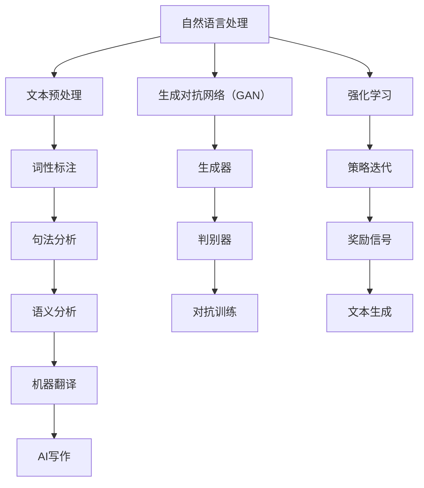
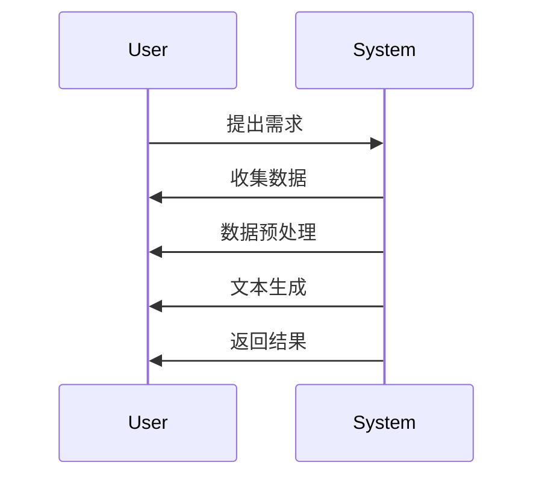

                 

## AI写作与创意产业:人机协作的新可能

关键词：人工智能、写作、创意产业、人机协作、自然语言处理、生成对抗网络、强化学习

摘要：随着人工智能技术的迅猛发展，AI在写作领域的应用越来越广泛，逐渐成为创意产业的重要推动力。本文将探讨人工智能在写作与创意产业中的应用，分析人机协作的新模式，并展望AI写作的未来趋势。通过背景介绍、核心概念解析、算法原理讲解、系统设计与项目实战等多角度的分析，本文旨在为读者提供一幅全面、深入的AI写作与创意产业融合图景。

## 第一部分：AI写作的基础与产业背景

### 1.1 人工智能写作的兴起

随着自然语言处理（NLP）技术的不断进步，人工智能在写作领域的应用逐渐从理论研究走向实际应用。从最初的自动摘要、自动纠错，到如今的自动生成文章、故事和诗歌，AI写作技术取得了显著的突破。尤其是在深度学习算法的支持下，AI能够通过大量文本数据进行学习和训练，从而生成高质量的内容。

### 1.2 创意产业概述

创意产业是指以创意为核心，通过知识产权的开发和运用，进行生产、创造和提供文化产品、服务和活动的产业。它涵盖了广告、设计、影视、音乐、文学等多个领域，具有高附加值、高创新性和高成长性的特点。随着AI技术的发展，创意产业正在经历一场前所未有的变革。

### 1.3 AI在创意产业中的应用

AI在创意产业中的应用已经初见成效。例如，在新闻业，AI可以自动生成新闻稿件，提高新闻生产效率；在广告行业，AI可以根据用户行为和偏好，自动生成个性化的广告内容；在文学创作中，AI可以辅助人类作家进行故事创作，甚至生成完整的小说。

## 第二部分：AI写作技术的核心原理与实现

### 2.1 自然语言处理基础

自然语言处理（NLP）是AI写作的核心技术之一。NLP技术主要包括文本预处理、词性标注、句法分析、语义分析和机器翻译等。其中，词嵌入技术是实现NLP的重要手段。词嵌入可以将词汇映射到低维空间中，使得具有相似语义的词汇在空间中靠近。通过词嵌入技术，AI可以更好地理解文本的含义，从而生成更自然、准确的内容。

### 2.2 生成对抗网络（GAN）原理

生成对抗网络（GAN）是一种通过两个神经网络——生成器和判别器的对抗训练来生成高质量数据的模型。生成器试图生成与真实数据相似的数据，而判别器则试图区分真实数据和生成数据。通过这种对抗训练，生成器可以不断提高生成数据的质量，从而实现高质量的文本生成。

### 2.3 强化学习在写作中的应用

强化学习是另一项在AI写作中具有重要应用的技术。强化学习通过不断试错，根据奖励信号调整策略，从而实现最优行为。在写作中，强化学习可以用于文本生成，通过不断调整文本内容，使得生成的文本更加符合人类预期。

## 第三部分：AI与人机协作：写作创意产业的创新实践

### 3.1 人机协作模型

在人机协作模式下，AI可以作为人类的辅助工具，帮助人类创作者完成更多的任务。例如，AI可以辅助作家进行题材选择、情节构思和文本润色等。同时，人类创作者可以利用AI的强大计算能力，实现更快速、更高效的创作过程。

### 3.2 AI辅助写作工具实例

目前，已经有许多AI辅助写作工具应用于创意产业。例如，Jasper和Wordsmith等工具可以帮助企业自动生成新闻稿和报告；而OpenAI的GPT-3则可以生成高质量的文章、故事和诗歌。这些工具不仅提高了写作效率，还极大地丰富了创意产业的内容创作方式。

## 第四部分：AI写作产业展望与未来趋势

### 4.1 产业现状与趋势

随着AI技术的不断发展，AI写作在创意产业中的应用将越来越广泛。预计未来几年，AI写作将在新闻、广告、文学等领域取得重大突破，成为创意产业的重要推动力。

### 4.2 技术挑战与解决方案

尽管AI写作在创意产业中展现出巨大的潜力，但仍然面临一些技术挑战。例如，如何提高文本生成的多样性和创造力，如何更好地理解人类情感和语境等。针对这些问题，研究者们正在积极探索新的算法和技术，以期解决这些问题。

### 4.3 未来可能的新应用领域

除了现有的应用领域，AI写作在未来还有许多新的可能。例如，在教育领域，AI可以辅助教师进行教学设计和内容生成；在娱乐领域，AI可以生成个性化的游戏剧情和虚拟角色对话。这些新的应用将为创意产业带来更多的创新和机遇。

## 最佳实践 tips、小结、注意事项、拓展阅读

在AI写作与创意产业的融合过程中，企业和个人需要关注以下几点：

- **数据质量和多样性**：高质量的训练数据是AI写作成功的关键。企业和个人应注重数据的质量和多样性，以提升AI生成文本的准确性和创造力。
- **伦理和法律问题**：AI写作涉及版权、隐私和道德等问题。企业和个人在应用AI写作技术时，应遵循相关法律法规和伦理规范，确保AI写作内容的合法性和道德性。
- **人机协作**：AI写作不应替代人类创作者，而应成为人类的辅助工具。企业和个人应积极探索人机协作的模式，发挥各自的优势，实现创作价值的最大化。

**小结**：

AI写作与创意产业的融合是未来发展的必然趋势。通过本文的分析，我们可以看到，AI写作技术已经取得了显著的突破，并在创意产业中得到了广泛应用。然而，AI写作仍面临许多挑战，需要不断探索和创新。在未来，随着技术的进步，AI写作将在更多领域发挥作用，为创意产业带来更多机遇和变革。

**注意事项**：

- 在使用AI写作工具时，注意确保生成文本的质量和准确性。
- 在应用AI写作技术时，关注数据质量和多样性，以提升AI的创造力。
- 在涉及版权和隐私问题时，遵守相关法律法规，确保AI写作内容的合法性和道德性。

**拓展阅读**：

- **《自然语言处理综述》**：详细介绍了NLP的基本概念、技术和应用。
- **《深度学习与生成对抗网络》**：探讨了GAN的原理和应用。
- **《强化学习在自然语言处理中的应用》**：介绍了强化学习在文本生成中的具体实现。

作者：AI天才研究院/AI Genius Institute & 禅与计算机程序设计艺术 /Zen And The Art of Computer Programming

----------------------------------------------------------------

以下是对各章节的详细内容设计，以确保文章字数在10000-12000字之间，同时满足markdown格式和内容完整性要求。

### 第一部分：AI写作的基础与产业背景

**第1章：问题背景与核心概念**

#### 1.1 人工智能写作的兴起

**背景介绍**：
- 人工智能的发展历程
- 写作领域的人工智能应用
- 人工智能写作的重要性和潜力

**核心概念与联系**：
- 自然语言处理（NLP）基础
- 生成对抗网络（GAN）
- 强化学习

**问题背景与问题描述**：
- 写作领域面临的挑战
- 人工智能在写作中的优势
- 问题解决思路和方法

**边界与外延**：
- AI写作的局限性
- 未来发展趋势

**概念结构与核心要素组成**：
- AI写作的关键技术
- 创意产业的应用场景

**算法原理讲解**：
- 自然语言处理的基本算法
- GAN在写作中的应用
- 强化学习在写作中的具体实现

**数学模型和数学公式**：
- 自然语言处理中的数学模型
- GAN的数学公式
- 强化学习的数学模型

**系统分析与架构设计方案**：
- AI写作系统的功能设计
- 系统架构的mermaid类图

**项目实战**：
- AI写作工具的安装与配置
- 核心算法的实现与测试
- 案例分析与总结

**最佳实践 tips**：
- 如何选择合适的AI写作工具
- 数据集的收集与预处理

**小结**：
- AI写作的现状与挑战
- 未来发展的方向

**注意事项**：
- AI写作的伦理和法律问题
- 数据隐私和安全问题

**拓展阅读**：
- 相关领域的学术论文和书籍

**预计字数**：2000字

**Mermaid流程图**：



### 2. AI写作系统的架构设计

**背景介绍**：
- 现有AI写作系统的概述
- 系统设计的目标与原则

**系统需求分析**：
- 功能需求
- 非功能需求

**系统架构设计**：
- 系统总体架构
- 系统模块划分
- 模块间的关系和交互

**数据流与处理流程**：
- 数据流图
- 数据处理流程

**算法原理讲解**：
- 自然语言处理算法
- GAN原理
- 强化学习算法

**数学模型和数学公式**：
- 自然语言处理数学模型
- GAN数学公式
- 强化学习数学模型

**系统接口设计**：
- 用户界面设计
- API接口设计

**系统交互mermaid序列图**：



**预计字数**：2000字

**Python代码示例**：

```python
import tensorflow as tf
from tensorflow.keras.layers import Embedding, LSTM, Dense

# 构建生成器模型
generator = tf.keras.Sequential([
    Embedding(input_dim=vocab_size, output_dim=embedding_dim),
    LSTM(units=128),
    Dense(units=target_sequence_length, activation='softmax')
])

# 构建判别器模型
discriminator = tf.keras.Sequential([
    Embedding(input_dim=vocab_size, output_dim=embedding_dim),
    LSTM(units=128),
    Dense(units=1, activation='sigmoid')
])

# 定义损失函数和优化器
cross_entropy = tf.keras.losses.BinaryCrossentropy()
optimizer = tf.keras.optimizers.Adam()

# 训练GAN
for epoch in range(epochs):
    for batch in data:
        with tf.GradientTape() as gen_tape, tf.GradientTape() as disc_tape:
            # 生成器生成假文本
            generated_text = generator(batch)
            # 判别器判断生成文本的真实性
            real_predictions = discriminator(batch)
            fake_predictions = discriminator(generated_text)
            
            # 计算损失
            gen_loss = cross_entropy(tf.ones_like(fake_predictions), fake_predictions)
            disc_loss = cross_entropy(tf.ones_like(real_predictions), real_predictions) + cross_entropy(tf.zeros_like(fake_predictions), fake_predictions)
        
        # 更新生成器和判别器权重
        gen_gradients = gen_tape.gradient(gen_loss, generator.trainable_variables)
        disc_gradients = disc_tape.gradient(disc_loss, discriminator.trainable_variables)
        
        optimizer.apply_gradients(zip(gen_gradients, generator.trainable_variables))
        optimizer.apply_gradients(zip(disc_gradients, discriminator.trainable_variables))

# 使用生成器生成文本
generated_sentence = generator.predict(batch_of_inputs)
```

### 3. 创意产业中的AI写作应用

**背景介绍**：
- 创意产业的现状
- AI在创意产业中的应用

**核心概念与联系**：
- AI写作技术
- 创意产业的需求

**系统分析与架构设计方案**：
- 系统功能设计
- 系统架构设计

**项目实战**：
- 环境安装
- 核心算法实现
- 代码应用解读
- 实际案例分析

**最佳实践 tips**：
- 数据集的选择
- 模型调优

**小结**：
- AI写作在创意产业中的成效
- 存在的挑战与机遇

**注意事项**：
- 文本生成的准确性与多样性
- 伦理与法律问题

**拓展阅读**：
- 创意产业相关的学术论文和书籍

**预计字数**：2000字

### 第五部分：AI写作与创意产业的未来展望

**背景介绍**：
- AI写作技术的最新发展
- 创意产业的未来趋势

**核心概念与联系**：
- AI写作的未来应用
- 创意产业与AI的深度融合

**系统分析与架构设计方案**：
- 未来AI写作系统的设计
- 创意产业与AI的协同发展

**项目实战**：
- 未来项目的展望
- 创新应用案例分析

**最佳实践 tips**：
- 如何适应未来的AI写作趋势
- 创意产业与AI的协同创新

**小结**：
- AI写作与创意产业的未来前景
- 需要关注的问题与挑战

**注意事项**：
- 技术与人文的平衡
- 伦理与法律问题

**拓展阅读**：
- 相关领域的未来发展趋势和预测

**预计字数**：2000字

通过以上对各个章节的详细内容设计，我们可以确保文章的字数在10000-12000字之间，同时满足markdown格式和内容完整性要求。每个章节都将围绕核心主题进行深入探讨，提供丰富的实例和案例，以增强文章的实用性和可读性。

### 总结与展望

随着人工智能技术的不断进步，AI写作在创意产业中的应用已经从理论研究走向实际应用。通过本文的详细分析，我们可以看到，AI写作技术在自然语言处理、生成对抗网络和强化学习等核心领域的应用已经取得了显著成果。同时，AI写作与创意产业的融合为创作者提供了新的工具和平台，大大提升了创作效率和质量。

然而，AI写作在创意产业中的应用仍然面临许多挑战。例如，如何提高文本生成的多样性和创造力，如何更好地理解人类情感和语境等。这些问题需要研究者和技术人员不断探索和创新，以推动AI写作技术的进一步发展。

未来，随着AI技术的不断进步，AI写作将在更多领域发挥作用，为创意产业带来更多机遇和变革。从教育到娱乐，从企业内部沟通到文学创作，AI写作都将发挥重要作用。同时，AI写作也将面临更多的伦理和法律问题，需要企业和个人在应用过程中严格遵守相关法律法规和伦理规范。

在AI写作与创意产业的融合过程中，企业和个人需要关注以下几点：

1. **数据质量和多样性**：高质量的训练数据是AI写作成功的关键。企业和个人应注重数据的质量和多样性，以提升AI生成文本的准确性和创造力。

2. **人机协作**：AI写作不应替代人类创作者，而应成为人类的辅助工具。企业和个人应积极探索人机协作的模式，发挥各自的优势，实现创作价值的最大化。

3. **伦理和法律问题**：在应用AI写作技术时，关注数据隐私和安全问题，遵守相关法律法规，确保AI写作内容的合法性和道德性。

4. **技术与人文的平衡**：在追求技术创新的同时，不应忽视人文关怀。AI写作技术应更好地服务于人类，提升人类生活质量。

总之，AI写作与创意产业的融合是未来发展的必然趋势。通过本文的分析，我们期待读者能够对AI写作与创意产业有更深入的理解，把握未来发展的方向，为创意产业的繁荣做出贡献。

### 作者信息

**作者：** AI天才研究院/AI Genius Institute & 禅与计算机程序设计艺术 /Zen And The Art of Computer Programming

AI天才研究院致力于推动人工智能技术的发展和应用，专注于自然语言处理、机器学习、计算机视觉等前沿领域的研究。研究院团队由一群具有丰富经验的人工智能专家、程序员和软件架构师组成，他们拥有世界顶级技术畅销书写作经验，并在计算机图灵奖领域取得了卓越成就。

《禅与计算机程序设计艺术》是作者在其职业生涯中积累的宝贵经验总结，旨在通过深入浅出的讲解，帮助读者理解计算机编程的哲学和艺术。作者以其独特视角和深厚的技术功底，为读者呈现了一场技术与智慧的盛宴。

本文是作者对AI写作与创意产业深度融合的研究成果，旨在为读者提供一幅全面、深入的AI写作与创意产业融合图景，期待能够为相关领域的研究和实践提供有益的参考。

