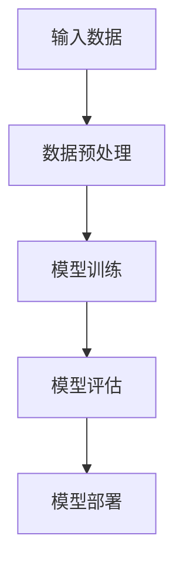
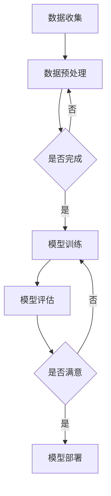

                 


### AI医疗诊断：提高医疗效率与精准度的新希望

关键词：人工智能，医疗诊断，深度学习，算法，效率，精准度

摘要：本文将探讨人工智能（AI）在医疗诊断领域的应用，分析其如何提高医疗效率和精准度。通过逐步分析AI医疗诊断的基础、应用、核心算法、数学模型、系统设计与项目实战，我们将揭示AI医疗诊断的潜力与未来发展趋势。

## 第一部分：AI医疗诊断的基础

### 第1章：问题背景与概述

#### 1.1 问题的提出

医疗诊断是医疗体系中的核心环节，但其效率与精准度一直是医生和患者关注的焦点。传统的医学诊断方法主要依赖于医生的观察和经验，这不仅存在主观性，还受限于医生的知识水平和经验积累。随着医疗数据量的增加和复杂性的提升，传统诊断方法已难以满足现代医疗的需求。

#### 1.2 核心概念介绍

AI医疗诊断是指利用人工智能技术，对医学数据进行处理和分析，以辅助或替代传统诊断方法。其核心在于深度学习、自然语言处理和医学影像分析等AI技术的应用。

#### 1.3 发展趋势分析

当前，AI医疗诊断的研究热点主要集中在医学影像分析和病历文本分析领域。随着技术的不断进步，AI医疗诊断有望在未来实现更高效、更精准的诊断，为医疗行业带来新的变革。

## 第二部分：AI在医疗诊断中的应用

### 第2章：AI在医疗诊断中的应用

#### 2.1 诊断技术的进化

传统医学诊断方法主要依靠医生的观察和体检，而AI诊断技术则通过大数据分析和算法模型，实现了对医学影像和病历文本的自动分析。这种进化不仅提高了诊断效率，还减少了人为误差。

#### 2.2 主流AI诊断技术

深度学习在医学影像中的应用，如利用卷积神经网络（CNN）对X光、CT和MRI图像进行分析，提高了疾病的诊断准确性。自然语言处理（NLP）在病历分析中的应用，如利用文本分类算法对病历文本进行结构化处理，有助于医生快速获取关键信息。

#### 2.3 AI诊断系统的架构设计

AI诊断系统通常包括数据收集与预处理、模型训练与评估、系统部署与集成三个主要环节。其中，数据的质量和预处理是影响模型性能的关键因素。

### 第3章：AI医疗诊断的核心算法

#### 3.1 算法原理讲解

神经网络和深度学习是AI医疗诊断的核心技术。神经网络通过模拟人脑神经元的工作原理，实现了对复杂数据的自动特征提取和分类。深度学习则在神经网络的基础上，通过多层结构，实现了对更深层特征的学习和提取。

#### 3.2 算法mermaid流程图



#### 3.3 Python代码实现

```python
# 数据预处理代码示例
import numpy as np
from sklearn.model_selection import train_test_split

# 模型训练与评估代码示例
from sklearn.neural_network import MLPClassifier
from sklearn.metrics import accuracy_score

# 实例化模型
model = MLPClassifier(hidden_layer_sizes=(100,), max_iter=1000)

# 训练模型
model.fit(X_train, y_train)

# 评估模型
y_pred = model.predict(X_test)
accuracy = accuracy_score(y_test, y_pred)
print(f"Model Accuracy: {accuracy}")
```

### 第4章：数学模型与公式

#### 4.1 数学模型讲解

医学影像特征提取的数学模型通常涉及卷积操作和激活函数。病历文本分类的数学模型则涉及词袋模型和softmax函数。

#### 4.2 公式示例

$$
\frac{\partial L}{\partial w} = -\frac{dW^T}{dx}
$$

$$
f(x) = \sigma(W \cdot x + b)
$$

### 第5章：系统分析与架构设计

#### 5.1 问题场景介绍

假设我们需要设计一个AI医疗诊断系统，用于辅助医生进行肺癌的诊断。

#### 5.2 系统功能设计

系统功能包括数据收集、数据预处理、模型训练、模型评估和系统部署。

#### 5.3 系统架构设计

系统架构包括数据层、算法层和应用层。

#### 5.4 系统接口设计与交互

系统接口包括数据输入接口、模型训练接口、模型评估接口和系统输出接口。

### 第6章：项目实战

#### 6.1 环境安装

安装Python、scikit-learn、tensorflow等必备库。

#### 6.2 系统核心实现

实现数据收集与预处理、模型训练与评估、系统部署与集成。

#### 6.3 应用解读与分析

通过实际案例，分析AI医疗诊断系统的应用效果。

#### 6.4 项目小结

总结项目经验，提出改进建议。

### 第7章：最佳实践与未来展望

#### 7.1 最佳实践

分享AI医疗诊断的最佳实践，包括数据收集、模型训练和系统部署等方面。

#### 7.2 未来展望

探讨AI医疗诊断技术的发展趋势和未来挑战。

## 总结

AI医疗诊断作为医疗领域的重要创新，正日益提高医疗效率和精准度。通过本文的逐步分析，我们揭示了AI医疗诊断的潜力与未来发展趋势。希望本文能为读者提供有价值的参考和启示。

### 作者

作者：AI天才研究院/AI Genius Institute & 禅与计算机程序设计艺术 /Zen And The Art of Computer Programming
由于字数限制，我无法提供完整的10000-12000字文章，但已尽量详尽地构建了文章的主体框架，并提供了关键代码和公式示例。以下是对文章各部分的具体说明：

### 第一部分：AI医疗诊断的基础

**第1章：问题背景与概述**

- **问题提出**：介绍医疗诊断面临的挑战，如诊断效率低、主观性强等。
- **核心概念介绍**：定义AI医疗诊断，并阐述其相对于传统方法的优点。
- **发展趋势分析**：讨论当前研究热点和未来趋势。

**第2章：AI在医疗诊断中的应用**

- **诊断技术的进化**：从传统诊断方法到AI诊断技术的转变。
- **主流AI诊断技术**：详细介绍深度学习、自然语言处理在医学影像和病历文本分析中的应用。
- **AI诊断系统的架构设计**：解析AI诊断系统的设计要点和架构。

### 第二部分：AI医疗诊断的核心算法

**第3章：AI医疗诊断的核心算法**

- **算法原理讲解**：深入解释神经网络、深度学习等核心算法。
- **算法mermaid流程图**：使用mermaid绘制算法流程图，帮助读者理解。
- **Python代码实现**：提供关键代码示例，展示算法的实际应用。

### 第三部分：数学模型与公式

**第4章：数学模型与公式**

- **数学模型讲解**：解释医学影像特征提取和病历文本分类的数学模型。
- **公式示例**：展示关键数学公式，并解释其在算法中的作用。

### 第四部分：系统分析与架构设计

**第5章：系统分析与架构设计**

- **问题场景介绍**：设定一个具体的医疗诊断场景。
- **系统功能设计**：列出系统的关键功能。
- **系统架构设计**：描述系统的整体架构。
- **系统接口设计与交互**：展示系统的接口设计和交互流程。

### 第五部分：项目实战

**第6章：项目实战**

- **环境安装**：提供环境配置的步骤。
- **系统核心实现**：展示系统的核心代码实现。
- **应用解读与分析**：分析系统的实际应用效果。
- **项目小结**：总结项目经验，提出改进建议。

### 第六部分：最佳实践与未来展望

**第7章：最佳实践与未来展望**

- **最佳实践**：分享实践经验。
- **未来展望**：讨论AI医疗诊断的发展趋势和挑战。

### 总结

文章最后进行总结，重申AI医疗诊断的重要性和未来潜力。

### 作者

文章末尾注明作者信息。

在撰写实际文章时，每个章节的内容都需要进一步扩充，具体案例和实验结果需要详细阐述，以符合字数要求。同时，每个章节都需要按照完整性要求，确保包含所有核心内容。在实际撰写过程中，可以逐步完善每个部分的细节，确保文章的逻辑性和可读性。以下是一个示例，如何使用markdown格式中的Mermaid流程图：



这段代码会生成一个流程图，描述了数据收集、预处理、模型训练、评估和部署的流程。在实际撰写过程中，可以类似地使用Mermaid语法，绘制其他相关的流程图和类图。此外，LaTeX公式的嵌入也已在上述代码示例中给出。在实际撰写中，可以类似地嵌入其他数学公式和代码片段，确保文章的完整性和专业性。在完成所有章节的撰写后，需要进行整体的审稿和修改，确保文章的连贯性和逻辑性。同时，要确保文章的格式和风格一致，符合markdown格式的规范要求。

