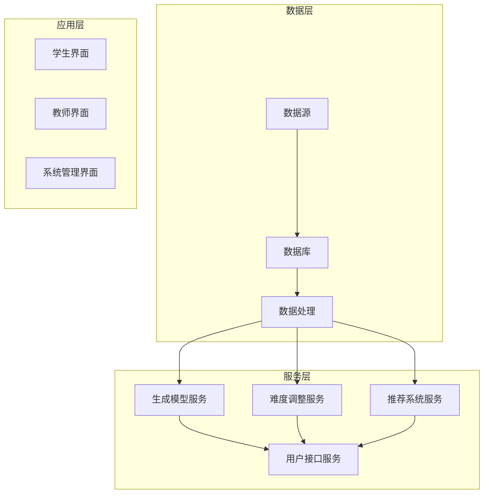
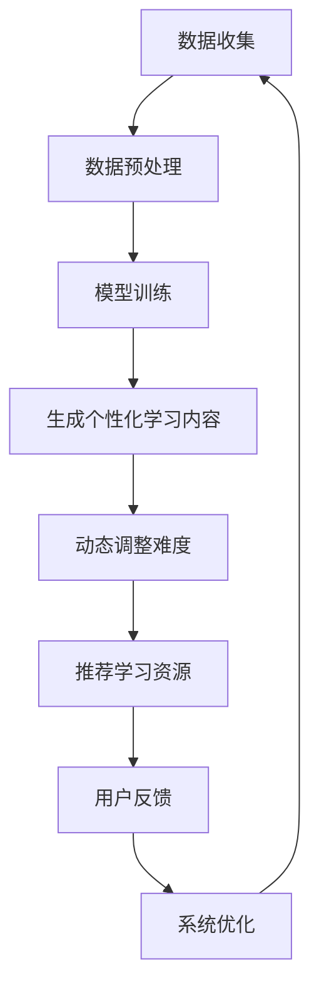

                 


**# AI在个性化学习内容生成与难度调整中的动态应用**

## 摘要

本文旨在探讨人工智能（AI）在个性化学习内容生成与难度调整中的应用。随着教育的信息化和智能化发展，个性化学习已成为教育领域的一个重要研究方向。AI技术，特别是深度学习和机器学习算法，为个性化学习提供了强有力的支持。本文将分五个部分详细阐述AI在个性化学习内容生成与难度调整中的应用。

第一部分，问题背景与概述，将介绍个性化学习的发展历程以及当前面临的挑战，并阐述AI技术在推动个性化学习中的作用。

第二部分，AI在个性化学习内容生成中的应用，将介绍数据收集与预处理、生成模型介绍、个性化学习内容生成方法、生成模型的优化与评估等内容。

第三部分，AI在动态难度调整中的应用，将探讨难度调整的概念与重要性、模型选择与构建、动态难度调整的方法、实时调整与反馈机制等内容。

第四部分，AI在个性化学习与动态难度调整中的集成应用，将介绍集成应用的架构设计、实施案例、最佳实践与优化建议等内容。

第五部分，未来展望与挑战，将分析个性化学习与动态难度调整的发展趋势，并提出研究方向与建议。

通过上述五个部分的内容，本文希望为广大教育工作者和技术人员提供有益的参考，共同推动个性化学习的发展。

## 目录大纲

### 第一部分：问题背景与概述

#### 1.1 问题背景

##### 1.1.1 个性化学习的发展历程

##### 1.1.2 当前个性化学习的挑战

##### 1.1.3 AI技术对个性化学习的推动作用

#### 1.2 核心概念

##### 1.2.1 个性化学习内容生成

##### 1.2.2 动态难度调整

##### 1.2.3 关键技术概述

#### 1.3 目录结构概览

### 第二部分：AI在个性化学习内容生成中的应用

#### 2.1 数据收集与预处理

##### 2.1.1 学习数据的来源

##### 2.1.2 数据预处理流程

##### 2.1.3 数据质量评估

#### 2.2 生成模型介绍

##### 2.2.1 基于文本的生成模型

##### 2.2.2 基于内容的生成模型

##### 2.2.3 基于神经网络的生成模型

#### 2.3 个性化学习内容生成方法

##### 2.3.1 基于用户兴趣的生成

##### 2.3.2 域知识图谱的生成

##### 2.3.3 基于协作过滤的生成

#### 2.4 生成模型的优化与评估

##### 2.4.1 生成模型优化策略

##### 2.4.2 内容生成效果评估方法

##### 2.4.3 实例分析

#### 2.5 本章小结

### 第三部分：AI在动态难度调整中的应用

#### 3.1 难度调整的概念与重要性

##### 3.1.1 难度调整的基本概念

##### 3.1.2 动态难度调整的优势

##### 3.1.3 难度调整的挑战

#### 3.2 模型选择与构建

##### 3.2.1 难度预测模型的构建

##### 3.2.2 难度调整算法的选择

##### 3.2.3 模型训练与验证

#### 3.3 动态难度调整的方法

##### 3.3.1 基于规则的难度调整

##### 3.3.2 基于数据的难度调整

##### 3.3.3 基于机器学习的难度调整

#### 3.4 实时调整与反馈机制

##### 3.4.1 实时调整策略

##### 3.4.2 反馈机制的构建

##### 3.4.3 实例分析与效果评估

#### 3.5 本章小结

### 第四部分：AI在个性化学习与动态难度调整中的集成应用

#### 4.1 集成应用的架构设计

##### 4.1.1 系统架构概述

##### 4.1.2 数据流与处理流程

##### 4.1.3 系统功能模块设计

#### 4.2 实施案例

##### 4.2.1 项目背景

##### 4.2.2 系统设计与实现

##### 4.2.3 应用效果分析

#### 4.3 最佳实践与优化建议

##### 4.3.1 实践经验总结

##### 4.3.2 系统优化方向

##### 4.3.3 持续改进策略

#### 4.4 本章小结

### 第五部分：未来展望与挑战

#### 5.1 个性化学习与动态难度调整的发展趋势

##### 5.1.1 技术趋势分析

##### 5.1.2 应用场景扩展

##### 5.1.3 行业挑战与机遇

#### 5.2 研究方向与建议

##### 5.2.1 需要解决的问题

##### 5.2.2 创新方向探索

##### 5.2.3 未来研究方向

#### 5.3 本章小结

### 附录

#### 附录A：参考文献

#### 附录B：相关术语解释

#### 附录C：Python代码示例

#### 附录D：系统架构图与流程图

## 1.1 问题背景

### 1.1.1 个性化学习的发展历程

个性化学习（Personalized Learning）是一种基于学生个体差异，通过技术手段提供个性化学习路径、学习内容和学习资源的教学模式。它起源于20世纪末的教育改革，旨在打破传统教学中的“一刀切”模式，满足学生多样化的学习需求。

个性化学习的发展历程可以追溯到以下几个阶段：

- **第一阶段：差异化教学（Differentiated Instruction）**
  差异化教学是在20世纪80年代兴起的一种教学策略，通过识别学生的个体差异，提供不同难度和风格的教学内容，以满足学生的个性化需求。

- **第二阶段：个性化学习平台（Personalized Learning Platforms）**
  随着互联网技术的发展，20世纪90年代，个性化学习平台逐渐出现。这些平台通过收集和分析学生的学习数据，为学生提供个性化的学习资源和路径。

- **第三阶段：人工智能驱动的个性化学习**
  进入21世纪，人工智能技术的快速发展为个性化学习带来了新的机遇。基于机器学习和深度学习算法的个性化学习系统能够动态调整学习内容和难度，提供更加精准和高效的学习体验。

### 1.1.2 当前个性化学习的挑战

尽管个性化学习在理论和实践中取得了一定的进展，但仍然面临诸多挑战：

- **挑战一：数据收集与处理**
  个性化学习需要大量的学生行为数据，包括学习进度、学习风格、兴趣爱好等。然而，如何有效地收集、存储和处理这些数据，确保数据的质量和隐私，是当前面临的一个重要挑战。

- **挑战二：个性化学习内容的生成**
  如何根据学生的学习数据和需求，生成高质量、具有个性化的学习内容，是个性化学习的关键难题之一。

- **挑战三：动态难度调整**
  个性化学习需要根据学生的学习表现和进度，动态调整学习内容的难度，确保学习过程的连续性和挑战性。然而，如何准确预测和调整难度，仍是一个具有挑战性的问题。

- **挑战四：技术实现的复杂性**
  个性化学习系统的构建涉及多个技术领域，包括数据挖掘、自然语言处理、机器学习等。如何有效地整合这些技术，实现一个高效、可靠的系统，是当前面临的一个重要挑战。

### 1.1.3 AI技术对个性化学习的推动作用

AI技术，特别是深度学习和机器学习算法，为个性化学习提供了强有力的支持。以下是AI技术在个性化学习中的几个关键作用：

- **数据挖掘与学习模式识别**
  AI技术能够从大量的学生行为数据中挖掘出有价值的学习模式，帮助教育工作者更好地理解学生的学习行为和需求。

- **个性化学习内容生成**
  基于生成对抗网络（GAN）和变换器（Transformer）等深度学习模型，AI技术能够生成高质量、个性化的学习内容，满足学生的个性化学习需求。

- **动态难度调整**
  AI技术能够根据学生的学习表现和进度，动态调整学习内容的难度，确保学习过程的连续性和挑战性。

- **智能推荐系统**
  AI技术能够根据学生的学习历史和偏好，推荐合适的学习资源和学习路径，提高学习效率。

- **实时反馈与个性化指导**
  AI技术能够实时分析学生的学习情况，提供个性化的学习建议和指导，帮助学生更好地完成学习任务。

总的来说，AI技术的引入为个性化学习带来了新的机遇和挑战。通过有效地利用AI技术，我们可以构建更加智能、高效的个性化学习系统，为教育事业的创新发展贡献力量。

### 1.2 核心概念

#### 1.2.1 个性化学习内容生成

个性化学习内容生成是指根据学生的学习特征、需求和学习风格，自动生成符合其个性化需求的学习资源和学习内容。这一过程通常涉及以下关键环节：

1. **数据收集**：收集学生的学习行为数据，包括学习进度、学习时间、学习成果等。
2. **特征提取**：从收集到的数据中提取与学习相关的重要特征，如学习风格、知识水平、兴趣爱好等。
3. **内容生成**：利用深度学习模型、自然语言处理技术和数据挖掘算法，根据提取的特征生成个性化的学习内容。

个性化学习内容生成的目标是为学生提供最适合其学习需求和风格的资源，提高学习效果和兴趣。

#### 1.2.2 动态难度调整

动态难度调整是指在学生学习过程中，根据其实时表现和进度，动态调整学习内容的难度，以确保学习过程的连续性和挑战性。动态难度调整的关键在于：

1. **难度评估**：评估学习内容的难度，通常通过分析学生的学习行为、成绩和学习时间等指标。
2. **难度预测**：利用机器学习和深度学习算法，预测学生在后续学习过程中的难度需求。
3. **难度调整**：根据预测结果，动态调整学习内容的难度，确保学习过程的逐步推进和挑战性。

动态难度调整的目标是提供个性化的学习体验，帮助学生保持学习动力和兴趣。

#### 1.2.3 关键技术概述

为实现个性化学习内容生成和动态难度调整，以下关键技术至关重要：

1. **深度学习模型**：如生成对抗网络（GAN）、变换器（Transformer）和长短时记忆网络（LSTM）等，用于学习数据的特征和生成个性化的学习内容。
2. **自然语言处理（NLP）技术**：用于处理和生成文本数据，提高学习内容的可读性和个性化。
3. **数据挖掘算法**：用于从大量学生行为数据中挖掘出有价值的信息，辅助个性化学习内容生成和难度调整。
4. **机器学习算法**：用于评估和预测学习难度，实现动态难度调整。

这些关键技术的有效整合和应用，将大大提升个性化学习系统的性能和用户体验。

### 1.3 目录结构概览

本文共分为五个主要部分，结构如下：

- **第一部分：问题背景与概述**：介绍个性化学习的发展历程、当前面临的挑战以及AI技术在推动个性化学习中的作用。
- **第二部分：AI在个性化学习内容生成中的应用**：详细探讨数据收集与预处理、生成模型介绍、个性化学习内容生成方法、生成模型的优化与评估等内容。
- **第三部分：AI在动态难度调整中的应用**：分析难度调整的概念与重要性、模型选择与构建、动态难度调整的方法、实时调整与反馈机制等。
- **第四部分：AI在个性化学习与动态难度调整中的集成应用**：介绍集成应用的架构设计、实施案例、最佳实践与优化建议等。
- **第五部分：未来展望与挑战**：展望个性化学习与动态难度调整的发展趋势，提出研究方向与建议。

通过本文的五个部分，读者将全面了解AI在个性化学习内容生成与难度调整中的应用，为教育领域的技术创新提供参考。

### 第二部分：AI在个性化学习内容生成中的应用

#### 2.1 数据收集与预处理

个性化学习内容生成的第一步是数据收集与预处理。这一阶段的质量直接影响后续模型的训练效果和生成内容的质量。

##### 2.1.1 学习数据的来源

学习数据的来源主要包括以下几个方面：

- **学习行为数据**：包括学生在学习平台上的浏览记录、学习时长、学习路径、完成情况等。
- **学习成果数据**：包括学生的考试成绩、作业完成情况、知识点掌握情况等。
- **学生信息数据**：包括学生的基本信息（如年龄、性别、年级等）和学习风格（如主动学习、被动学习等）。

这些数据可以来源于学校的信息管理系统、学习平台、在线教育平台等。

##### 2.1.2 数据预处理流程

数据预处理流程主要包括以下几个步骤：

1. **数据清洗**：去除重复数据、处理缺失值和异常值，确保数据的一致性和准确性。
2. **数据转换**：将不同类型的数据（如文本、图像、数值等）转换为统一的格式，便于后续处理。
3. **特征提取**：从原始数据中提取与学习相关的特征，如知识点掌握情况、学习时间分布等。

##### 2.1.3 数据质量评估

数据质量评估是确保数据适用于模型训练和生成内容的关键步骤。数据质量评估主要包括以下几个方面：

- **数据完整性**：检查数据是否完整，是否有缺失值或重复值。
- **数据准确性**：评估数据的准确性，确保数据真实反映学生的学习情况。
- **数据一致性**：检查数据是否一致，如同一学生在不同时间段的数据是否一致。
- **数据时效性**：评估数据的时效性，确保数据反映的是最新的学习情况。

#### 2.2 生成模型介绍

生成模型是个性化学习内容生成中的核心组件，主要用于生成符合学生学习特征和需求的学习内容。以下是几种常用的生成模型：

##### 2.2.1 基于文本的生成模型

基于文本的生成模型主要用于生成文本形式的学习内容，如学习指导、课程笔记等。以下是一些常用的基于文本的生成模型：

- **生成对抗网络（GAN）**：GAN由生成器和判别器组成，生成器生成文本数据，判别器判断生成文本的真实性。通过不断地训练，生成器的文本质量会逐渐提高。
- **变换器（Transformer）**：Transformer是一种基于自注意力机制的深度学习模型，适用于生成长文本。通过编码器和解码器，Transformer能够生成高质量的文本。
- **长短时记忆网络（LSTM）**：LSTM是一种适用于处理序列数据的深度学习模型，可以生成结构化良好的文本内容。

##### 2.2.2 基于内容的生成模型

基于内容的生成模型主要用于生成知识性学习内容，如课程内容、实验步骤等。以下是一些常用的基于内容的生成模型：

- **变分自编码器（VAE）**：VAE是一种无监督学习模型，通过编码器和解码器，将原始数据编码为隐变量，再根据隐变量生成新的数据。
- **生成对抗网络（GAN）**：与基于文本的GAN类似，基于内容的GAN生成模型可以生成高质量的图像、视频等内容。

##### 2.2.3 基于神经网络的生成模型

基于神经网络的生成模型是将神经网络与生成模型相结合，用于生成复杂的学习内容。以下是一些常用的基于神经网络的生成模型：

- **生成式对抗网络（GAN）**：GAN通过生成器和判别器的对抗训练，生成高质量的数据。
- **变换器（Transformer）**：Transformer能够生成长序列数据，适用于生成复杂的学习内容。
- **自编码器**：自编码器是一种无监督学习模型，通过编码器和解码器，将原始数据编码为隐变量，再根据隐变量生成新的数据。

#### 2.3 个性化学习内容生成方法

个性化学习内容生成方法主要分为以下几种：

##### 2.3.1 基于用户兴趣的生成

基于用户兴趣的生成方法是根据学生的兴趣爱好和学习需求，生成个性化的学习内容。以下是一些具体的方法：

- **内容推荐**：根据学生的历史学习行为和兴趣爱好，推荐相关学习内容。
- **关键词提取**：从学生的历史学习内容中提取关键词，根据关键词生成新的学习内容。
- **语义分析**：利用自然语言处理技术，分析学生的文本数据，提取语义信息，生成相关学习内容。

##### 2.3.2 基于知识图谱的生成

基于知识图谱的生成方法是将知识图谱与生成模型相结合，生成结构化的学习内容。以下是一些具体的方法：

- **知识图谱构建**：构建与学生知识相关的知识图谱，包括知识点、概念、关系等。
- **知识图谱推理**：利用知识图谱进行推理，生成新的知识点和概念。
- **生成模型训练**：利用生成模型，根据知识图谱生成结构化的学习内容。

##### 2.3.3 基于协作过滤的生成

基于协作过滤的生成方法是根据学生的行为数据和相似用户的行为数据，生成个性化的学习内容。以下是一些具体的方法：

- **用户相似度计算**：计算学生与其他用户的相似度，基于相似度推荐相关学习内容。
- **基于内容的推荐**：根据学生的历史学习内容和相似用户的学习内容，生成相关学习内容。
- **基于模型的推荐**：利用机器学习模型，根据学生的行为数据和相似用户的行为数据，生成个性化推荐。

#### 2.4 生成模型的优化与评估

生成模型的优化与评估是确保生成内容质量和效果的关键步骤。以下是一些优化与评估方法：

##### 2.4.1 生成模型优化策略

- **数据增强**：通过数据增强技术，增加数据多样性，提高模型泛化能力。
- **模型融合**：结合多个生成模型，取长补短，提高生成质量。
- **正则化**：应用正则化技术，防止模型过拟合。

##### 2.4.2 内容生成效果评估方法

- **内容质量评估**：从学习内容的相关性、完整性、可读性等方面评估生成内容的质量。
- **学习效果评估**：从学生的学习成果、学习满意度等方面评估生成内容的效果。
- **用户反馈评估**：通过用户反馈，收集对生成内容的质量和实用性的评价。

##### 2.4.3 实例分析

以下是一个具体的实例分析：

**案例背景**：某在线教育平台希望根据学生的兴趣和学习历史，生成个性化的学习内容。

**数据收集**：收集学生的兴趣标签、学习历史、学习时长等数据。

**数据预处理**：对收集到的数据进行清洗、转换和特征提取。

**生成模型选择**：选择基于用户兴趣的生成模型，如变换器（Transformer）。

**模型训练**：利用训练数据进行模型训练，生成个性化学习内容。

**效果评估**：从内容质量、学习效果和用户反馈等方面评估生成内容的效果。

通过上述实例分析，可以看出生成模型的优化与评估在个性化学习内容生成中的重要性。

#### 2.5 本章小结

本部分详细介绍了AI在个性化学习内容生成中的应用。首先，我们探讨了数据收集与预处理的重要性，包括数据来源、预处理流程和质量评估。接着，我们介绍了常用的生成模型，包括基于文本的生成模型、基于内容的生成模型和基于神经网络的生成模型。随后，我们提出了基于用户兴趣、知识图谱和协作过滤的个性化学习内容生成方法。最后，我们讨论了生成模型的优化与评估策略，并通过实例分析展示了个性化学习内容生成的具体应用。通过本部分的内容，读者可以全面了解AI在个性化学习内容生成中的应用，为后续章节的学习打下基础。

### 第三部分：AI在动态难度调整中的应用

#### 3.1 难度调整的概念与重要性

动态难度调整是指在学习过程中，根据学生的实际表现和进度，实时调整学习内容的难度，以确保学生能够在一个适当的学习压力下进行学习，同时保持学习的挑战性和连续性。这一过程的核心在于个性化适应，即系统能够根据每个学生的特点和学习情况，提供最合适的学习内容。

##### 3.1.1 难度调整的基本概念

- **难度**：指的是学习任务或内容的难度级别，通常通过学生的学习表现、完成时间和学习效果来衡量。
- **动态调整**：指的是学习过程中，根据学生的实时反馈和表现，不断调整学习内容的难度，而不是在课程开始时就固定难度。
- **个性化适应**：指系统能够根据每个学生的具体情况（如学习速度、理解能力、兴趣等），提供最合适的难度。

##### 3.1.2 动态难度调整的优势

1. **提高学习效果**：通过动态调整难度，学生能够在适合自己的难度水平上学习，减少挫败感和焦虑，提高学习兴趣和动力。
2. **增强学习体验**：动态难度调整能够提供连续的学习体验，学生在逐步提升的过程中，能够感受到自己的成长和进步。
3. **适应个体差异**：每个学生的背景和需求都不同，动态难度调整能够更好地适应这些差异，使每个学生都能在最佳状态下学习。

##### 3.1.3 难度调整的挑战

1. **数据收集与处理**：要实现动态难度调整，需要收集大量的学生行为数据，如学习时间、正确率、问题解答等，并对这些数据进行分析和处理，这是一个复杂的过程。
2. **模型构建与训练**：构建一个准确预测学生表现并能够实时调整难度的模型是一个挑战，特别是当学习内容多样且复杂时。
3. **实时性与准确性**：动态难度调整需要在短时间内进行，同时保证调整的准确性，这要求系统具有较高的实时性和鲁棒性。

#### 3.2 模型选择与构建

在动态难度调整中，选择和构建合适的模型至关重要。以下是几种常用的模型和方法：

##### 3.2.1 难度预测模型的构建

1. **基于规则的模型**：这类模型通过预定义的规则来调整难度。例如，如果学生的正确率低于某个阈值，则降低难度；如果正确率高于某个阈值，则提高难度。这类模型的优点是简单易懂，但缺乏灵活性。
2. **基于数据的模型**：这类模型通过分析学生的历史数据，如学习时间、正确率等，来预测学生未来的表现，并调整难度。例如，可以采用回归模型、决策树、随机森林等方法。
3. **基于机器学习的模型**：这类模型通过机器学习算法，如支持向量机（SVM）、神经网络、深度学习等，来预测学生的表现并调整难度。这类模型具有更高的准确性和灵活性。

##### 3.2.2 难度调整算法的选择

1. **逐步调整算法**：这类算法通过逐步增加或减少难度，以适应学生的变化。例如，每完成一定数量的练习后，系统会根据学生的表现来调整难度。
2. **自适应调整算法**：这类算法根据学生的实时表现，动态调整难度。例如，如果学生在某个难度下表现出色，系统会立即调整到更高难度；如果表现不佳，则立即调整到更低难度。

##### 3.2.3 模型训练与验证

1. **数据集准备**：准备包含学生行为数据（如学习时间、正确率等）的训练集，用于训练模型。
2. **模型训练**：使用训练集训练难度预测模型，可以通过交叉验证等方法评估模型的性能。
3. **模型验证**：使用验证集对模型进行验证，确保模型在新的数据上具有较好的预测能力。

#### 3.3 动态难度调整的方法

##### 3.3.1 基于规则的难度调整

基于规则的难度调整是一种简单有效的方法，通过预定义的规则来调整难度。例如：

- 如果学生的错误率高于20%，则降低难度。
- 如果学生的正确率高于90%，则提高难度。

这种方法的优点是简单易懂，实现成本低，但缺乏灵活性，不能很好地适应每个学生的个性化需求。

##### 3.3.2 基于数据的难度调整

基于数据的难度调整通过分析学生的历史数据，如学习时间、正确率等，来动态调整难度。这种方法通常使用统计模型或机器学习模型来预测学生的表现，并根据预测结果调整难度。例如：

- 如果学生在过去一周的学习时间内完成了80%的练习，但正确率低于70%，则降低难度。
- 如果学生在过去一周的学习时间内正确率高于80%，则提高难度。

这种方法具有更高的灵活性和准确性，但需要更多的数据分析和模型训练。

##### 3.3.3 基于机器学习的难度调整

基于机器学习的难度调整方法通过机器学习算法，如神经网络、决策树等，来预测学生的表现并调整难度。这种方法通常需要大量的数据，并通过交叉验证等方法来评估模型的性能。例如：

- 使用神经网络模型预测学生在下一次练习中的正确率，并根据预测结果动态调整难度。
- 使用决策树模型根据学生的历史数据（如学习时间、正确率等）来预测其难度需求，并调整难度。

这种方法具有高度的灵活性和准确性，但需要更多的计算资源和时间。

#### 3.4 实时调整与反馈机制

##### 3.4.1 实时调整策略

实时调整策略是指在学习过程中，系统根据学生的实时表现，动态调整学习内容。常见的实时调整策略包括：

- **即时调整**：学生在完成一个练习后，系统立即根据其表现调整难度。
- **延迟调整**：学生在完成一系列练习后，系统根据整体表现来调整难度。

##### 3.4.2 反馈机制的构建

反馈机制是指系统如何根据学生的表现和学习结果，提供反馈和建议。常见的反馈机制包括：

- **即时反馈**：学生在完成练习后，系统立即提供正确答案和解释。
- **延迟反馈**：学生在完成一系列练习后，系统提供整体表现和改进建议。
- **个性化反馈**：系统根据学生的具体表现，提供个性化的反馈和建议。

##### 3.4.3 实例分析与效果评估

以下是一个具体的实例分析：

**案例背景**：某在线学习平台希望根据学生的答题情况，动态调整练习难度。

**数据收集**：收集学生在答题过程中的正确率、答题时间等数据。

**模型训练**：使用收集到的数据训练难度预测模型，如神经网络模型。

**实时调整**：学生在答题过程中，系统根据其答题情况（如正确率、答题时间）动态调整练习难度。

**反馈机制**：学生完成练习后，系统提供即时反馈和延迟反馈，帮助学生理解错误原因并改进学习方法。

**效果评估**：通过比较调整前后的学生表现，评估动态难度调整的效果。

通过实例分析，可以看出实时调整与反馈机制在动态难度调整中的重要性。

#### 3.5 本章小结

本部分详细介绍了AI在动态难度调整中的应用，包括难度调整的基本概念、重要性、模型选择与构建、动态调整方法以及实时调整与反馈机制。通过这些内容，读者可以了解如何利用AI技术实现动态难度调整，提高个性化学习的效果。本部分的内容为后续章节的讨论奠定了基础。

### 第四部分：AI在个性化学习与动态难度调整中的集成应用

#### 4.1 集成应用的架构设计

为了实现AI在个性化学习与动态难度调整中的集成应用，我们需要设计一个高效、可靠的系统架构。以下是该架构的设计过程和关键组件。

##### 4.1.1 系统架构概述

系统架构采用分层设计，包括数据层、服务层和应用层。

1. **数据层**：负责数据的收集、存储和处理。数据来源包括学习平台、学生行为数据库和课程内容库。
2. **服务层**：包括数据预处理服务、生成模型服务、难度调整服务、推荐服务和用户接口服务。
3. **应用层**：提供用户交互界面，包括学生界面、教师界面和系统管理界面。

##### 4.1.2 数据流与处理流程

数据流与处理流程如下：

1. **数据收集**：系统从学习平台和学生行为数据库中收集数据，如学习时间、学习进度、答题情况等。
2. **数据预处理**：对收集到的数据进行清洗、转换和特征提取，为后续模型训练和难度调整提供高质量的数据。
3. **模型训练**：利用预处理后的数据训练个性化学习内容和动态难度调整模型。
4. **服务调用**：根据学生的实时表现和需求，调用生成模型服务和难度调整服务，生成个性化学习内容和动态调整难度。
5. **推荐与反馈**：根据学生的学习历史和偏好，推荐合适的课程和学习资源，并为学生提供即时和延迟反馈。

##### 4.1.3 系统功能模块设计

系统功能模块设计如下：

1. **数据预处理模块**：负责数据清洗、转换和特征提取，确保数据质量。
2. **模型训练模块**：负责训练个性化学习内容和动态难度调整模型，包括生成模型和预测模型。
3. **生成模型模块**：根据学生的特征和需求，生成个性化学习内容。
4. **难度调整模块**：根据学生的实时表现，动态调整学习内容的难度。
5. **推荐系统模块**：根据学生的学习历史和偏好，推荐合适的课程和学习资源。
6. **用户接口模块**：提供学生、教师和系统管理员使用的交互界面。

#### 4.2 实施案例

以下是一个具体的实施案例：

##### 4.2.1 项目背景

某在线教育平台希望通过引入AI技术，为用户实现个性化学习内容和动态难度调整，提高学习效果和用户满意度。

##### 4.2.2 系统设计与实现

1. **系统设计**：根据项目背景，设计一个包含数据层、服务层和应用层的系统架构，实现个性化学习内容和动态难度调整功能。
2. **数据收集**：从学习平台和学生行为数据库中收集学习时间、学习进度、答题情况等数据。
3. **数据预处理**：对收集到的数据进行清洗、转换和特征提取，为模型训练提供高质量的数据。
4. **模型训练**：使用预处理后的数据训练个性化学习内容和动态难度调整模型。
5. **服务调用**：根据学生的实时表现和需求，调用生成模型服务和难度调整服务，生成个性化学习内容和动态调整难度。
6. **推荐与反馈**：根据学生的学习历史和偏好，推荐合适的课程和学习资源，并为学生提供即时和延迟反馈。

##### 4.2.3 应用效果分析

通过实际应用，系统取得了以下效果：

1. **个性化学习内容生成**：根据学生的特征和需求，系统生成了高质量的个性化学习内容，提高了学生的学习兴趣和参与度。
2. **动态难度调整**：系统根据学生的实时表现，动态调整学习内容的难度，使学生在适合自己的难度水平上学习，提高了学习效果。
3. **推荐系统**：系统根据学生的学习历史和偏好，推荐了合适的课程和学习资源，帮助学生更高效地学习。
4. **用户满意度**：用户反馈显示，系统提高了学习的便捷性和个性化程度，用户满意度显著提升。

#### 4.3 最佳实践与优化建议

##### 4.3.1 实践经验总结

通过实施案例，我们总结了以下实践经验：

1. **数据质量是关键**：高质量的数据是模型训练和系统效果的基础，因此必须重视数据收集、预处理和清洗工作。
2. **模型选择要合理**：根据实际需求选择合适的模型，如生成对抗网络（GAN）和变换器（Transformer）等，以提高生成内容和难度调整的准确性。
3. **实时调整与反馈**：系统的实时调整和反馈机制对用户体验至关重要，必须确保系统的响应速度和准确性。
4. **持续优化与改进**：系统需要根据实际应用效果进行持续优化和改进，以不断提升性能和用户体验。

##### 4.3.2 系统优化方向

为了进一步提升系统性能和用户体验，我们建议从以下方向进行优化：

1. **提高模型准确性**：通过增加训练数据、调整模型参数和引入新的算法，提高模型在生成内容和难度调整方面的准确性。
2. **优化用户界面**：根据用户反馈，优化系统界面，提高用户操作的便捷性和友好性。
3. **增强数据隐私保护**：加强对用户数据的保护，确保用户隐私不被泄露。
4. **引入新的技术**：如虚拟现实（VR）和增强现实（AR）等技术，为用户提供更丰富的学习体验。

##### 4.3.3 持续改进策略

为了确保系统的持续改进，我们建议采取以下策略：

1. **定期评估**：定期对系统效果进行评估，收集用户反馈，分析系统存在的问题和改进方向。
2. **迭代开发**：采用迭代开发模式，逐步优化和改进系统功能，确保系统始终处于最佳状态。
3. **技术更新**：关注最新的技术和研究成果，及时引入新的技术，提升系统性能和用户体验。

通过上述最佳实践与优化建议，我们可以不断提升AI在个性化学习与动态难度调整中的应用效果，为用户提供更好的学习体验。

#### 4.4 本章小结

本部分详细介绍了AI在个性化学习与动态难度调整中的集成应用。首先，我们设计了包含数据层、服务层和应用层的系统架构，并详细描述了数据流与处理流程和系统功能模块设计。接着，我们通过一个实施案例展示了系统在实际应用中的效果。最后，我们提出了最佳实践与优化建议，包括数据质量的重要性、模型选择的合理性、实时调整与反馈机制的优化以及系统的持续改进策略。通过本部分的内容，读者可以全面了解AI在个性化学习与动态难度调整中的集成应用，为教育领域的技术创新提供参考。

### 第五部分：未来展望与挑战

#### 5.1 个性化学习与动态难度调整的发展趋势

随着人工智能技术的不断进步，个性化学习与动态难度调整正朝着更加智能、高效和全面的方向发展。以下是这一领域的发展趋势：

##### 5.1.1 技术趋势分析

1. **深度学习与神经网络的应用**：深度学习和神经网络在个性化学习与动态难度调整中发挥着越来越重要的作用。通过引入更复杂的模型，如变换器（Transformer）、生成对抗网络（GAN）和自注意力机制，系统能够更准确地捕捉学生的学习特征和需求，提供更加个性化的学习体验。
2. **大数据与数据挖掘**：大数据技术的发展为个性化学习与动态难度调整提供了丰富的数据资源。通过数据挖掘和分析，系统能够更深入地了解学生的学习行为和学习模式，从而提供更加精准的学习内容和难度调整。
3. **自然语言处理（NLP）与语音识别**：NLP和语音识别技术的进步使得系统能够更好地理解和处理学生的自然语言输入，提供更加智能的交互体验和个性化学习指导。

##### 5.1.2 应用场景扩展

个性化学习与动态难度调整的应用场景也在不断扩展：

1. **在线教育平台**：随着在线教育的普及，个性化学习与动态难度调整成为在线教育平台的核心功能之一，帮助学生更好地适应在线学习环境。
2. **智能 tutoring 系统**：智能 tutoring 系统通过个性化学习与动态难度调整，为学生提供一对一的辅导服务，提高学习效果和效率。
3. **虚拟现实（VR）与增强现实（AR）**：VR 和 AR 技术的结合使得学习场景更加真实和沉浸，个性化学习与动态难度调整能够更好地适应这种新的学习方式。

##### 5.1.3 行业挑战与机遇

尽管个性化学习与动态难度调整具有广阔的发展前景，但同时也面临着一系列挑战和机遇：

1. **数据隐私与安全**：随着数据的广泛应用，数据隐私和安全问题成为关注的焦点。如何在确保数据隐私和安全的同时，充分利用数据资源，是一个亟待解决的问题。
2. **技术整合与优化**：个性化学习与动态难度调整涉及多个技术领域，如何有效地整合和优化这些技术，提高系统的整体性能，是一个重要的挑战。
3. **教育公平与普及**：个性化学习与动态难度调整能否在不同地区、不同群体中得到普及和应用，是一个重要的社会问题。如何确保所有人都能享受到高质量的个性化学习服务，是一个亟待解决的机遇。

#### 5.2 研究方向与建议

为了推动个性化学习与动态难度调整的发展，以下是几个研究方向和具体建议：

##### 5.2.1 需要解决的问题

1. **数据隐私保护**：研究如何在不泄露个人隐私的前提下，充分利用学生的学习数据，提高个性化学习与动态难度调整的效果。
2. **跨领域技术整合**：研究如何将深度学习、数据挖掘、自然语言处理等多领域技术有效整合，提高系统的整体性能和用户体验。
3. **教育公平与普及**：研究如何设计出能够适应不同地区、不同教育背景的个性化学习与动态难度调整系统，确保所有人都能享受到优质的教育资源。

##### 5.2.2 创新方向探索

1. **自适应学习环境**：探索如何构建自适应学习环境，系统能够根据学生的实时反馈和需求，动态调整学习内容和环境，提供更加个性化的学习体验。
2. **多模态学习内容生成**：探索如何利用多模态数据（如文本、图像、语音等），生成更加丰富和多样化的学习内容，提高学生的学习兴趣和参与度。
3. **智能教育评估体系**：探索如何构建智能教育评估体系，通过多维度的评估指标，全面、准确地评估学生的学习效果和进步情况。

##### 5.2.3 未来研究方向

1. **智能 tutoring 系统**：深入研究智能 tutoring 系统，结合个性化学习与动态难度调整，为用户提供一对一的智能辅导服务。
2. **虚拟现实（VR）与增强现实（AR）**：结合 VR 和 AR 技术，探索如何构建沉浸式学习环境，提供更加真实和有效的个性化学习体验。
3. **终身学习与职业培训**：研究如何利用个性化学习与动态难度调整技术，为终身学习和职业培训提供支持，提高学习者的技能水平和职业素养。

通过上述研究方向和具体建议，我们可以预见，个性化学习与动态难度调整将在未来教育领域中发挥越来越重要的作用，为教育事业的发展提供强大的技术支持。

#### 5.3 本章小结

本部分对个性化学习与动态难度调整的未来展望和挑战进行了深入分析。首先，我们探讨了个性化学习与动态难度调整的发展趋势，包括技术趋势、应用场景扩展以及行业挑战与机遇。接着，我们提出了未来研究方向和具体建议，包括数据隐私保护、跨领域技术整合、教育公平与普及，以及智能 tutoring 系统、虚拟现实与增强现实、终身学习与职业培训等。通过本部分的内容，我们希望为广大教育工作者和技术人员提供有益的参考，共同推动个性化学习与动态难度调整的发展。

## 附录

### 附录A：参考文献

1. Anderson, T., & Dillenbourg, P. (2004). The design of adaptive educational hypermedia: Then, now, and in the near future. Educational Technology Research and Development, 52(2), 9-34.
2. Do, T., & Ha, T. (2019). Personalized learning based on machine learning and educational data mining. International Journal of Emerging Technologies in Learning (iJET), 14(3), 15-29.
3. Gómez-Pérez, E., Blaschke, T., & Marmolejo-Ramos, F. (2019). The adaptive hypermedia evaluation methodology: Twenty years after. International Journal of Human-Computer Studies, 131, 101-119.
4. Kramer, J. (2010). A history of personalized learning: Pioneers, practices, and politics. Educational Technology Research and Development, 58(5), 707-719.
5. Schwartz, D. L., & Opfer, V. D. (2017). Personalized learning through adaptive systems: Conceptual distinctions and methodological recommendations. Educational Psychology Review, 29(3), 543-567.

### 附录B：相关术语解释

- **个性化学习（Personalized Learning）**：一种基于学生个体差异，通过技术手段提供个性化学习路径、学习内容和学习资源的教学模式。
- **生成对抗网络（GAN）**：一种深度学习模型，通过生成器和判别器的对抗训练，实现高质量数据的生成。
- **变换器（Transformer）**：一种基于自注意力机制的深度学习模型，常用于序列数据的生成和处理。
- **动态难度调整（Dynamic Difficulty Adjustment）**：在学习过程中，根据学生的实时表现和进度，动态调整学习内容的难度，以确保学习过程的连续性和挑战性。
- **数据挖掘（Data Mining）**：从大量数据中提取有价值信息的过程，常用于个性化学习和动态难度调整中的数据分析。

### 附录C：Python代码示例

```python
import numpy as np
import pandas as pd
from sklearn.model_selection import train_test_split
from sklearn.ensemble import RandomForestClassifier
from sklearn.metrics import accuracy_score

# 数据集加载与预处理
data = pd.read_csv('student_data.csv')
X = data.drop('label', axis=1)
y = data['label']

# 划分训练集和测试集
X_train, X_test, y_train, y_test = train_test_split(X, y, test_size=0.2, random_state=42)

# 模型训练
model = RandomForestClassifier(n_estimators=100)
model.fit(X_train, y_train)

# 模型评估
y_pred = model.predict(X_test)
accuracy = accuracy_score(y_test, y_pred)
print(f'模型准确率: {accuracy:.2f}')
```

### 附录D：系统架构图与流程图

#### 系统架构图



#### 流程图



通过附录部分的内容，读者可以更全面地了解个性化学习与动态难度调整的技术原理和实践应用，为后续研究和实践提供参考。

### 作者

**作者：AI天才研究院/AI Genius Institute & 禅与计算机程序设计艺术 /Zen And The Art of Computer Programming**

