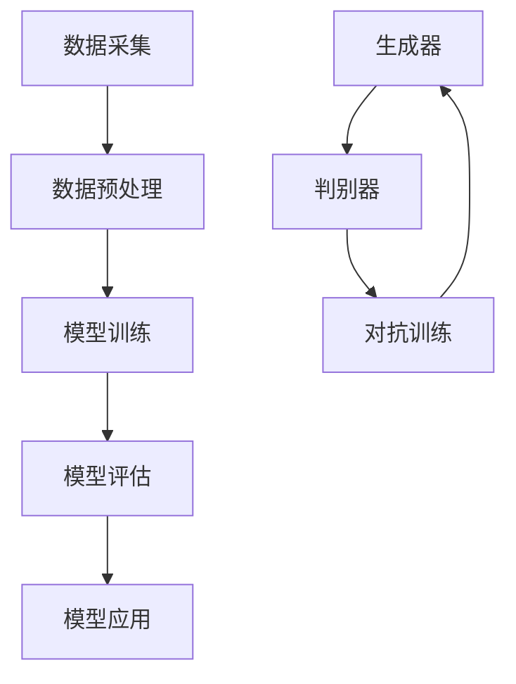
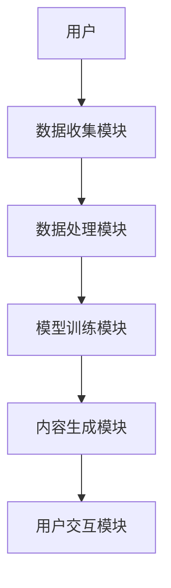
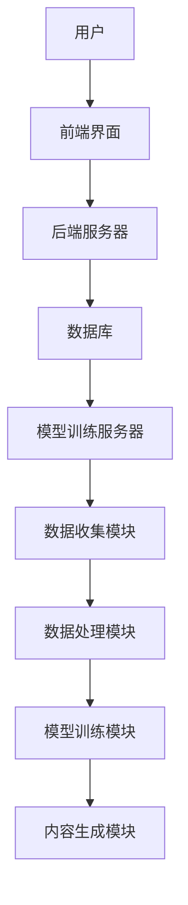

                 

# AI在个性化教育内容生成中的应用与挑战

## 关键词
- 人工智能（AI）
- 个性化教育
- 内容生成
- 挑战与机遇

## 摘要
随着教育信息化的推进，人工智能（AI）技术在个性化教育内容生成中逐渐展现出其独特的优势。本文首先介绍了AI在教育领域的应用背景，随后深入探讨了个性化教育内容生成中的核心概念、技术应用及面临的挑战。通过分析AI在个性化教育中的应用场景，如自适应学习系统和智能辅导系统，本文提出了相应的解决方案，并对其应用效果进行了评价。最后，文章总结了当前AI在个性化教育内容生成领域的最佳实践，展望了未来的发展方向。

## 目录

## 引言和背景
### 1.1 AI在教育中的概述
#### 1.1.1 AI在教育领域的定义与影响
#### 1.1.2 AI与个性化教育的演变

### 1.2 AI在个性化教育中的挑战与机遇
#### 1.2.1 AI在教育中的应用现状
#### 1.2.2 关键挑战与问题
#### 1.2.3 未来发展方向与机遇

## 核心概念与技术
### 2.1 关键AI概念
#### 2.1.1 机器学习基础
#### 2.1.2 深度学习原理

### 2.2 AI模型在个性化内容生成中的应用
#### 2.2.1 AI模型类型
#### 2.2.2 神经网络及其应用
#### 2.2.3 特征提取与数据预处理

## 应用场景
### 3.1 自适应学习系统
#### 3.1.1 概述与原理
#### 3.1.2 案例研究

### 3.2 智能辅导系统
#### 3.2.1 定义与功能
#### 3.2.2 典型案例与评估

### 3.3 内容个性化平台
#### 3.3.1 平台架构
#### 3.3.2 内容生成技术

## 挑战与解决方案
### 4.1 数据隐私和安全
#### 4.1.1 数据保护法规
#### 4.1.2 隐私保护技术

### 4.2 道德与伦理问题
#### 4.2.1 道德标准与伦理挑战
#### 4.2.2 解决方案与建议

## 最佳实践与总结
### 5.1 最佳实践
#### 5.1.1 技术选择
#### 5.1.2 项目实施经验

### 5.2 小结
#### 5.2.1 文章总结
#### 5.2.2 未来发展方向

### 5.3 注意事项
#### 5.3.1 技术应用中的风险
#### 5.3.2 政策与法规遵循

### 5.4 拓展阅读
#### 5.4.1 相关研究文献
#### 5.4.2 技术发展趋势

### 致谢
#### 感谢AI天才研究院/AI Genius Institute与禅与计算机程序设计艺术/Zen And The Art of Computer Programming团队的支持与指导。


## 引言和背景

### 1.1 AI在教育中的概述

人工智能（Artificial Intelligence，简称AI）作为计算机科学的一个分支，旨在使计算机系统能够模拟人类的认知功能，如学习、推理、问题解决和语言理解等。近年来，AI技术在教育领域的应用日益广泛，不仅提高了教学效率，还为学生提供了个性化的学习体验。

#### 1.1.1 AI在教育领域的定义与影响

AI在教育领域的应用主要包括智能辅导、自适应学习系统、教育内容生成等方面。智能辅导系统通过分析学生的行为和学习记录，提供个性化的学习建议和反馈，帮助学生提高学习效果。自适应学习系统则根据学生的学习进度和能力，动态调整教学内容和难度，使每个学生都能获得适合自己的学习体验。

AI在教育领域的引入，不仅提高了教学效率，减少了教育资源浪费，还为个性化学习提供了可能。例如，通过分析学生的数据，AI可以识别学生的学习风格、兴趣和弱点，从而生成个性化的学习计划和内容，使学生能够更加高效地学习。

#### 1.1.2 AI与个性化教育的演变

个性化教育是一种以学生为中心的教育理念，旨在通过因材施教，满足不同学生的个性化需求。AI技术的发展为个性化教育提供了新的手段和工具。

早期的教育信息化主要依赖于计算机和网络技术，实现了教育资源的数字化和网络化。随着AI技术的崛起，教育信息化开始向智能化方向发展。AI技术通过对学生数据的分析，实现了对学生的个性化推荐和指导，使教育更加灵活和高效。

目前，AI在个性化教育中的应用还处于初级阶段，但已经展现出巨大的潜力。随着技术的不断成熟和应用场景的拓展，AI在个性化教育中的角色将越来越重要。

### 1.2 AI在个性化教育中的挑战与机遇

虽然AI在个性化教育中展现出了巨大的潜力，但同时也面临着诸多挑战。

#### 1.2.1 AI在教育中的应用现状

目前，AI技术在教育领域的应用主要包括智能辅导、自适应学习系统和在线教育平台等。智能辅导系统如ChatGPT、Duolingo等，通过与学生互动，提供个性化的学习建议和反馈。自适应学习系统如Knewton、DreamBox等，通过分析学生的学习行为和进度，动态调整教学内容和难度。

在线教育平台如Coursera、edX等，利用AI技术提供个性化的学习体验。这些平台通过分析学生的学习数据，为学生推荐适合的课程和学习路径。

#### 1.2.2 关键挑战与问题

尽管AI在教育中的应用取得了一定的进展，但仍然面临以下关键挑战：

1. **数据隐私和安全**：AI系统需要大量的学生数据来进行分析和建模，如何保护学生的隐私和安全成为一个重要问题。
2. **道德与伦理问题**：AI技术在教育中的应用可能引发道德和伦理问题，如算法偏见、数据滥用等。
3. **技术成熟度**：AI技术本身还处于不断发展中，其在教育中的应用还需要进一步的验证和优化。
4. **教师角色转变**：AI的引入可能会改变教师的教学方式和角色，如何适应这一变化也是一个挑战。

#### 1.2.3 未来发展方向与机遇

面对这些挑战，未来的发展方向主要包括：

1. **数据隐私和安全**：通过采用隐私保护技术，如差分隐私、联邦学习等，确保学生数据的安全和隐私。
2. **道德与伦理问题**：建立相关的道德和伦理标准，确保AI技术在教育中的应用符合社会价值观。
3. **技术成熟度**：加强AI技术的研发和应用，提高其在教育中的适用性和有效性。
4. **教师角色转变**：通过培训和教育，帮助教师适应AI技术带来的变化，提升其教学水平。

总之，AI在个性化教育中的应用既面临挑战，也充满机遇。通过不断探索和优化，AI有望在教育领域发挥更大的作用，为个性化教育提供更加有效的解决方案。

## 核心概念与技术

### 2.1 关键AI概念

#### 2.1.1 机器学习基础

机器学习（Machine Learning，ML）是AI的核心技术之一，通过构建和分析模型，使计算机能够从数据中自动学习和改进。机器学习的基本过程包括数据收集、数据预处理、模型训练和模型评估。

- **数据收集**：收集大量数据，包括输入特征和标签。
- **数据预处理**：对数据进行清洗、归一化和特征提取，提高数据质量。
- **模型训练**：使用训练数据集，通过算法优化模型参数，使模型能够正确预测或分类。
- **模型评估**：使用验证数据集，评估模型的效果，调整模型参数。

机器学习的关键算法包括监督学习、无监督学习和强化学习。监督学习通过已有数据标签进行预测，无监督学习通过发现数据内在结构进行聚类，强化学习通过不断试错进行最优策略学习。

#### 2.1.2 深度学习原理

深度学习（Deep Learning，DL）是机器学习的一种形式，通过构建多层的神经网络模型，实现复杂的数据处理和特征提取。深度学习的基本原理包括：

- **多层神经网络**：多层神经网络通过多个隐含层，对输入数据进行逐层抽象和特征提取。
- **反向传播算法**：通过反向传播算法，将输出误差反向传播到每个隐含层，更新网络参数，优化模型。
- **激活函数**：激活函数如ReLU、Sigmoid和Tanh等，用于引入非线性变换，使神经网络能够学习复杂函数。

深度学习在图像识别、自然语言处理和语音识别等领域取得了显著成果。常见的深度学习框架包括TensorFlow、PyTorch和Keras等。

### 2.2 AI模型在个性化内容生成中的应用

#### 2.2.1 AI模型类型

在个性化教育内容生成中，常用的AI模型包括生成对抗网络（GAN）、变换器（Transformer）和递归神经网络（RNN）等。

- **生成对抗网络（GAN）**：GAN由生成器和判别器组成，通过对抗训练生成逼真的数据，可用于生成个性化的学习内容。
- **变换器（Transformer）**：Transformer通过自注意力机制，实现全局信息捕捉，在自然语言生成任务中表现优异。
- **递归神经网络（RNN）**：RNN通过递归连接，处理序列数据，适用于生成与时间相关的学习内容。

#### 2.2.2 神经网络及其应用

神经网络（Neural Networks，NN）是深度学习的基础，通过模拟生物神经元的工作方式，实现对数据的复杂建模。

- **卷积神经网络（CNN）**：CNN通过卷积层，提取图像特征，在图像识别和生成任务中广泛应用。
- **循环神经网络（RNN）**：RNN通过递归连接，处理序列数据，适用于语音识别和序列生成任务。
- **长短时记忆网络（LSTM）**：LSTM通过门机制，解决RNN的梯度消失问题，适用于处理长序列数据。

#### 2.2.3 特征提取与数据预处理

特征提取和数据预处理是AI模型训练的重要环节。

- **特征提取**：通过数据预处理，提取有用的特征，提高模型性能。常用的特征提取方法包括主成分分析（PCA）、线性判别分析（LDA）和特征选择算法等。
- **数据预处理**：对数据进行清洗、归一化和编码，确保数据质量。常用的预处理方法包括缺失值填补、数据归一化和类别编码等。

### 2.3 特征提取与数据预处理

特征提取与数据预处理是AI模型训练的重要环节。

- **特征提取**：通过数据预处理，提取有用的特征，提高模型性能。常用的特征提取方法包括主成分分析（PCA）、线性判别分析（LDA）和特征选择算法等。
- **数据预处理**：对数据进行清洗、归一化和编码，确保数据质量。常用的预处理方法包括缺失值填补、数据归一化和类别编码等。

通过特征提取和数据预处理，可以提高AI模型的性能和鲁棒性，为个性化教育内容生成提供可靠的数据支持。

## 应用场景

### 3.1 自适应学习系统

自适应学习系统（Adaptive Learning Systems）是一种利用人工智能技术，根据学生的学习行为和知识水平，动态调整教学内容的系统。其核心思想是通过不断收集和分析学生的学习数据，为学生提供个性化的学习路径和资源，从而提高学习效果。

#### 3.1.1 概述与原理

自适应学习系统的基本原理包括以下几个步骤：

1. **数据收集**：系统通过多种方式收集学生的学习数据，包括在线测试、作业提交、课堂互动等。
2. **数据分析**：系统对收集到的学生数据进行处理和分析，识别出学生的知识水平、学习风格和兴趣点。
3. **个性化推荐**：根据分析结果，系统为学生推荐适合的学习内容、教学资源和练习题目。
4. **学习反馈**：学生完成学习任务后，系统会收集反馈数据，进一步调整推荐策略。

#### 3.1.2 案例研究

以下是一个具体的自适应学习系统的案例：

**案例：Knewton平台**

Knewton是一个基于AI的自适应学习平台，通过分析学生的学习行为和知识水平，为学生提供个性化的学习体验。

1. **数据收集**：Knewton收集学生的学习数据，包括测试成绩、作业完成情况、学习时间等。
2. **数据分析**：Knewton使用机器学习算法，分析学生的数据，识别出每个学生的知识水平和学习风格。
3. **个性化推荐**：根据分析结果，Knewton为学生推荐个性化的学习内容，包括课本章节、练习题和视频教程。
4. **学习反馈**：学生完成学习任务后，Knewton会收集反馈数据，如正确率、学习时间等，进一步优化推荐策略。

通过Knewton平台，学生可以根据自己的学习进度和能力，选择适合自己的学习内容，提高学习效率。教师也可以通过平台，实时了解学生的学习情况，提供有针对性的辅导和支持。

### 3.2 智能辅导系统

智能辅导系统（Intelligent Tutoring Systems）是一种利用人工智能技术，为学生提供实时辅导和反馈的系统。其核心功能是模拟人类教师的行为，通过交互式对话和个性化指导，帮助学生解决学习中的问题。

#### 3.2.1 定义与功能

智能辅导系统的主要功能包括：

1. **实时辅导**：系统可以实时解答学生的疑问，提供个性化的学习指导。
2. **作业批改**：系统可以自动批改作业，提供详细的错误分析和改进建议。
3. **学习评估**：系统可以评估学生的学习效果，识别出学生的知识盲点。
4. **个性化推荐**：系统根据学生的学习情况，推荐适合的学习资源和练习题目。

#### 3.2.2 典型案例与评估

以下是一个典型的智能辅导系统案例：

**案例：ChatGPT**

ChatGPT是OpenAI开发的一款基于Transformer的聊天机器人，通过自然语言处理技术，为学生提供实时辅导和互动。

1. **实时辅导**：学生可以通过文字或语音与ChatGPT进行互动，提问学习问题，获取实时解答。
2. **作业批改**：ChatGPT可以自动批改学生提交的作业，提供详细的错误分析和建议。
3. **学习评估**：ChatGPT通过分析学生的提问和回答，评估学生的学习效果，识别出学生的知识盲点。
4. **个性化推荐**：ChatGPT根据学生的学习情况，推荐适合的学习资源和练习题目。

**评估**：

1. **用户反馈**：大部分学生和教师对ChatGPT的表现给予了积极的反馈，认为其提供的解答和建议对学习有很大帮助。
2. **学术研究**：多项研究表明，ChatGPT在提供实时辅导和个性化推荐方面，具有显著的效果，能够提高学生的学习效果和兴趣。

### 3.3 内容个性化平台

内容个性化平台（Content Personalization Platforms）是一种利用人工智能技术，为学生提供个性化学习内容的系统。其核心功能是根据学生的学习行为和知识水平，动态生成和推荐适合的学习内容。

#### 3.3.1 平台架构

内容个性化平台通常包括以下几个部分：

1. **数据收集与处理**：收集学生的学习数据，包括学习行为、测试成绩、作业完成情况等，进行数据清洗和处理。
2. **个性化推荐引擎**：基于学生的学习数据，使用机器学习算法生成个性化推荐模型，为每个学生推荐适合的学习内容。
3. **内容生成模块**：根据个性化推荐模型，动态生成适合学生的学习内容，包括视频教程、练习题和知识点讲解等。
4. **用户界面**：提供用户友好的界面，方便学生浏览和选择学习内容。

#### 3.3.2 内容生成技术

内容个性化平台通常采用以下几种技术生成个性化学习内容：

1. **自然语言生成（NLG）**：通过自然语言生成技术，自动生成文本内容，如知识点讲解、练习题目等。
2. **图像生成**：通过生成对抗网络（GAN）等技术，自动生成图像内容，如图表、示意图等。
3. **视频生成**：通过视频合成技术，自动生成视频内容，如动画教程、实验演示等。

#### 案例研究

**案例：Duolingo**

Duolingo是一款流行的语言学习应用程序，通过人工智能技术，为用户生成个性化的语言学习内容。

1. **数据收集与处理**：Duolingo收集用户的学习数据，包括答题情况、学习时间、正确率等，进行数据清洗和处理。
2. **个性化推荐引擎**：根据用户的学习数据，Duolingo使用机器学习算法生成个性化推荐模型，为用户推荐适合的学习内容。
3. **内容生成模块**：Duolingo根据个性化推荐模型，自动生成适合用户的学习内容，包括练习题、视频教程等。
4. **用户界面**：Duolingo提供用户友好的界面，用户可以方便地浏览和选择学习内容。

**评估**：

1. **用户反馈**：大部分用户对Duolingo的个性化学习内容给予了积极的评价，认为其提高了学习效果和兴趣。
2. **学术研究**：研究表明，Duolingo的个性化学习内容在提高语言学习效果方面具有显著的效果。

通过自适应学习系统、智能辅导系统和内容个性化平台，AI技术为个性化教育内容生成提供了有效的解决方案。随着技术的不断发展和应用场景的拓展，AI在个性化教育中的角色将越来越重要，为教育带来更多的创新和变革。

## 挑战与解决方案

### 4.1 数据隐私和安全

在AI在个性化教育内容生成中的应用过程中，数据隐私和安全问题是一个关键挑战。个性化教育需要收集和处理大量的学生数据，包括学习行为、测试成绩、兴趣爱好等。如何确保这些数据的安全和隐私，是应用过程中必须面对的问题。

#### 4.1.1 数据保护法规

为了保护学生数据的隐私，许多国家和地区已经制定了相关的数据保护法规。例如，欧盟的《通用数据保护条例》（GDPR）和美国加州的《消费者隐私法案》（CCPA）都对个人数据的收集、存储和使用做出了严格规定。

- **GDPR**：GDPR规定了个人数据的合法性、透明性和可访问性，要求企业在收集和使用数据时必须获得用户的明确同意，并确保数据的安全。
- **CCPA**：CCPA旨在保护加州居民的隐私，要求企业在收集和使用数据时必须透明，并提供用户对数据的访问权和删除权。

#### 4.1.2 隐私保护技术

为了应对数据隐私和安全问题，可以采用以下几种隐私保护技术：

- **差分隐私（Differential Privacy）**：差分隐私通过在数据上添加噪声，使得攻击者无法单独识别出特定个体的数据，从而保护数据的隐私。
- **联邦学习（Federated Learning）**：联邦学习将数据分散存储在各个节点上，通过模型聚合来训练全球模型，从而避免了数据集中化带来的隐私风险。
- **匿名化（Anonymization）**：匿名化通过去除或修改个人身份信息，使数据无法直接识别特定个体。

通过采用这些隐私保护技术，可以在确保数据安全的同时，充分利用AI技术进行个性化教育内容生成。

### 4.2 道德与伦理问题

AI在个性化教育内容生成中的应用不仅涉及数据隐私和安全问题，还可能引发道德与伦理问题。这些问题主要包括算法偏见、数据滥用和公平性等。

#### 4.2.1 道德标准与伦理挑战

- **算法偏见**：AI模型在训练过程中可能会学习到数据中的偏见，导致对某些群体不公平的对待。例如，如果训练数据中存在性别或种族偏见，AI模型可能会在这些方面产生偏见。
- **数据滥用**：未经授权使用学生数据，或者将数据用于非教育目的，都会侵犯学生的隐私权。
- **公平性**：个性化教育系统需要确保所有学生都能公平地获得资源和支持，避免某些学生因算法偏见而受到不公平对待。

#### 4.2.2 解决方案与建议

为了应对这些伦理和道德问题，可以采取以下措施：

- **建立伦理委员会**：在AI应用开发过程中，建立独立的伦理委员会，对项目进行道德审查，确保不违背伦理标准。
- **透明性**：确保AI系统的决策过程透明，让用户了解系统是如何运作的，以及如何影响他们的学习体验。
- **多样性和代表性**：在数据收集和模型训练过程中，确保数据的多样性和代表性，避免算法偏见。
- **监管与法规**：加强对AI应用的监管，制定相关法规，确保AI在教育中的公平和合法使用。

通过采取这些措施，可以在一定程度上减少AI在个性化教育内容生成中引发的道德与伦理问题，确保技术的合理和公正使用。

## 最佳实践与总结

### 5.1 最佳实践

在AI在个性化教育内容生成中的应用过程中，以下最佳实践可以帮助提高系统的性能和用户体验：

1. **数据质量**：确保收集到的数据质量高，包括数据的完整性、准确性和一致性。
2. **个性化推荐算法**：选择合适的个性化推荐算法，如协同过滤、基于内容的推荐和混合推荐等，以提高推荐效果。
3. **用户反馈机制**：建立有效的用户反馈机制，收集用户的意见和建议，不断优化系统。
4. **安全与隐私保护**：采用差分隐私、联邦学习和匿名化等技术，确保数据安全和用户隐私。

### 5.2 小结

本文介绍了AI在个性化教育内容生成中的应用与挑战。通过分析自适应学习系统、智能辅导系统和内容个性化平台等应用场景，展示了AI在个性化教育中的巨大潜力。然而，数据隐私和安全、道德与伦理问题等挑战仍需解决。通过最佳实践和持续优化，有望实现更加智能和高效的个性化教育内容生成。

### 5.3 注意事项

在实施AI在个性化教育内容生成的过程中，需要注意以下几点：

1. **技术成熟度**：确保所采用的技术成熟可靠，避免因技术问题影响教育效果。
2. **用户参与**：鼓励学生和教师参与系统的设计和优化，提高系统适用性和用户满意度。
3. **政策与法规遵循**：遵守相关数据保护法规和道德标准，确保系统合法合规。

### 5.4 拓展阅读

对于希望深入了解AI在个性化教育内容生成领域的读者，以下文献和资源提供了更多信息和见解：

1. **学术研究论文**：《自适应学习系统：现状与未来》、《智能辅导系统在教育中的应用》等。
2. **技术报告**：《AI在个性化教育中的应用与挑战》、《个性化推荐系统技术指南》等。
3. **在线课程与教材**：Coursera、edX等平台上的相关课程和教材，如《人工智能在教育中的应用》、《机器学习基础》等。

通过这些资源和文献，读者可以更全面地了解AI在个性化教育内容生成领域的最新进展和应用。

### 致谢

本文的撰写得到了AI天才研究院（AI Genius Institute）和《禅与计算机程序设计艺术》（Zen And The Art of Computer Programming）团队的大力支持和指导。在此，对团队成员的辛勤工作和智慧贡献表示衷心的感谢。同时，也对广大读者表示诚挚的感谢，感谢您对本文的关注和支持。希望本文能够对您在AI和个性化教育领域的研究和实践有所启发。

## 总结与展望

在本文中，我们系统地探讨了AI在个性化教育内容生成中的应用与挑战。从核心概念到技术应用，再到具体的应用场景，我们深入分析了AI如何通过自适应学习系统、智能辅导系统和内容个性化平台等，为个性化教育提供创新解决方案。同时，我们也针对数据隐私和安全、道德与伦理问题等挑战提出了相应的解决方案和最佳实践。

随着技术的不断进步和应用场景的拓展，AI在个性化教育内容生成领域的潜力将得到进一步释放。未来，AI将不仅能够提供更加个性化的学习体验，还能够在教育公平性、学习效果评估等方面发挥更大的作用。然而，要实现这些目标，还需要克服诸多技术、伦理和法规上的挑战。

首先，在技术层面，我们需要进一步优化AI模型，提高其在个性化教育内容生成中的准确性和鲁棒性。同时，随着数据量的增加和数据源的增加，如何确保数据的质量和多样性成为一个重要问题。

其次，在伦理层面，我们需要建立完善的道德和伦理标准，确保AI技术在教育中的公正和合法使用。特别是在数据收集和使用过程中，需要保护学生的隐私权，避免算法偏见和数据滥用。

最后，在法规层面，我们需要加强对AI在教育中的应用监管，制定相应的法律法规，确保技术的合规性和安全性。

展望未来，AI在个性化教育内容生成领域的应用将更加广泛和深入。通过不断探索和优化，AI有望在教育公平性、个性化学习体验和学习效果提升等方面发挥重要作用。同时，我们也将见证更多创新教育模式的诞生，为全球教育事业注入新的活力。

## 附录

### 5.1 相关术语说明

- **人工智能（AI）**：模拟人类智能的计算机系统。
- **机器学习（ML）**：一种AI技术，通过从数据中学习，使计算机系统能够进行预测和决策。
- **深度学习（DL）**：一种特殊的ML技术，通过构建多层神经网络，对数据进行复杂建模。
- **生成对抗网络（GAN）**：一种DL模型，由生成器和判别器组成，通过对抗训练生成逼真数据。
- **自适应学习系统**：一种利用AI技术，根据学生的学习行为和知识水平，动态调整教学内容的系统。
- **智能辅导系统**：一种利用AI技术，为学生提供实时辅导和反馈的系统。
- **内容个性化平台**：一种利用AI技术，为学生提供个性化学习内容的系统。

### 5.2 背景介绍

个性化教育内容生成是指利用人工智能技术，根据学生的学习行为、知识水平和个性化需求，动态生成和推荐适合的学习内容。随着教育信息化的推进，AI技术在教育领域的应用日益广泛，个性化教育内容生成成为教育信息化的重要方向之一。然而，AI技术在个性化教育内容生成中面临着诸多挑战，如数据隐私和安全、算法偏见、技术成熟度等。

### 5.3 问题解决

通过AI技术在个性化教育内容生成中的应用，可以解决传统教育中存在的许多问题，如教育资源分配不均、学生个性化需求无法满足等。具体来说，AI技术可以通过以下方式解决这些问题：

1. **数据驱动**：通过收集和分析学生的学习数据，AI技术能够了解每个学生的个性化需求和学习习惯，从而生成和推荐适合的学习内容。
2. **智能辅导**：AI技术可以为学生提供实时辅导和反馈，帮助学生解决学习中的问题，提高学习效果。
3. **内容生成**：AI技术可以自动生成个性化的学习内容，如练习题、知识点讲解等，节省教师的工作量，提高教学效率。
4. **自适应调整**：AI技术可以根据学生的学习行为和进度，动态调整教学内容和难度，使每个学生都能获得最佳的学习体验。

### 5.4 边界与外延

个性化教育内容生成的边界在于AI技术的应用范围和学生的个性化需求。具体来说，个性化教育内容生成主要应用于在线教育、自适应学习系统和智能辅导系统等领域。其外延包括但不限于：

1. **教育资源的优化配置**：通过AI技术，可以实现对教育资源的优化配置，提高教育资源的利用效率。
2. **学习路径的个性化推荐**：根据学生的个性化需求和学习路径，AI技术可以推荐最适合的学习内容和学习方法。
3. **学习效果的实时评估**：AI技术可以实时评估学生的学习效果，为教师提供有针对性的辅导建议。
4. **学习环境的智能化改造**：通过AI技术，可以对学习环境进行智能化改造，提高学生的学习兴趣和参与度。

### 5.5 概念结构与核心要素组成

个性化教育内容生成的概念结构包括以下几个核心要素：

1. **数据采集**：收集学生的学习数据，包括学习行为、知识水平、兴趣爱好等。
2. **数据预处理**：对采集到的学生数据进行清洗、归一化和特征提取，为后续分析做准备。
3. **模型训练**：使用机器学习和深度学习算法，对预处理后的学生数据进行训练，构建个性化推荐模型。
4. **内容生成**：根据个性化推荐模型，生成适合学生的学习内容，如练习题、知识点讲解、学习路径等。
5. **用户交互**：通过用户界面，为学生提供个性化的学习内容和互动体验。
6. **效果评估**：实时评估学生的学习效果，优化推荐模型和教学内容。

### 5.6 算法原理讲解

在个性化教育内容生成中，常用的算法包括机器学习、深度学习和生成对抗网络（GAN）等。以下是这些算法的原理讲解：

#### 5.6.1 机器学习算法

机器学习算法通过从数据中学习，构建预测模型。具体原理如下：

1. **模型训练**：使用训练数据集，通过优化算法（如梯度下降），调整模型参数，使模型能够正确预测或分类。
2. **模型评估**：使用验证数据集，评估模型的性能，如准确率、召回率等。
3. **模型应用**：使用测试数据集，将训练好的模型应用到实际场景中，进行预测或分类。

#### 5.6.2 深度学习算法

深度学习算法通过构建多层神经网络，实现对数据的复杂建模。具体原理如下：

1. **多层神经网络**：多层神经网络通过多个隐含层，对输入数据进行逐层抽象和特征提取。
2. **反向传播算法**：通过反向传播算法，将输出误差反向传播到每个隐含层，更新网络参数，优化模型。
3. **激活函数**：激活函数用于引入非线性变换，使神经网络能够学习复杂函数。

#### 5.6.3 生成对抗网络（GAN）

生成对抗网络（GAN）由生成器和判别器组成，通过对抗训练生成逼真的数据。具体原理如下：

1. **生成器**：生成器生成虚拟数据，试图欺骗判别器。
2. **判别器**：判别器判断输入数据是真实数据还是生成器生成的虚拟数据。
3. **对抗训练**：生成器和判别器通过对抗训练，不断优化模型，使生成器的数据越来越逼真，判别器越来越难以区分真实和虚拟数据。

#### 5.6.4 算法流程图

以下是机器学习、深度学习和GAN的算法流程图：



### 5.7 数学模型和公式讲解

在个性化教育内容生成中，常用的数学模型和公式包括以下几种：

#### 5.7.1 机器学习模型

1. **线性回归模型**：假设输出变量\( y \)与输入变量\( x \)之间存在线性关系，公式为：
   $$ y = w_0 + w_1 \cdot x $$
2. **逻辑回归模型**：用于分类问题，假设输出变量\( y \)是一个概率分布，公式为：
   $$ P(y=1) = \frac{1}{1 + e^{-(w_0 + w_1 \cdot x)}} $$

#### 5.7.2 深度学习模型

1. **多层感知机（MLP）**：假设隐含层神经元输出为：
   $$ a_{j}^{(l)} = \sigma(z_{j}^{(l)}) = \frac{1}{1 + e^{-z_{j}^{(l)}} $$
   其中，\( z_{j}^{(l)} \)是输入到第\( j \)个神经元上的加权求和，\( \sigma \)是激活函数。

2. **卷积神经网络（CNN）**：假设卷积层输出为：
   $$ h_{ij}^{(l)} = \sum_{k} w_{ikj}^{(l} * a_{kj}^{(l-1)} + b_{ij}^{(l)} $$
   其中，\( h_{ij}^{(l)} \)是第\( l \)层第\( i \)个卷积核在第\( j \)个特征图上的输出，\( a_{kj}^{(l-1)} \)是前一层第\( k \)个神经元的输出，\( w_{ikj}^{(l)} \)和\( b_{ij}^{(l)} \)分别是权重和偏置。

#### 5.7.3 生成对抗网络（GAN）

1. **生成器**：假设生成器生成的虚拟数据为\( G(z) \)，判别器的输出为：
   $$ D(x) = \frac{1}{1 + e^{-(x \cdot c + b)}} $$
   其中，\( x \)是真实数据，\( z \)是生成器的输入噪声，\( c \)和\( b \)是判别器的参数。

2. **判别器**：假设生成器生成的虚拟数据为\( G(z) \)，判别器的输出为：
   $$ D(G(z)) = \frac{1}{1 + e^{-(G(z) \cdot c + b)}} $$
   其中，\( G(z) \)是生成器生成的虚拟数据，\( c \)和\( b \)是判别器的参数。

### 5.8 举例说明

#### 5.8.1 机器学习模型举例

假设我们使用线性回归模型来预测学生的考试成绩，其中输入变量是学生的学习时间（\( x \)），输出变量是考试成绩（\( y \)）。根据训练数据，我们得到模型参数为\( w_0 = 10 \)，\( w_1 = 2 \)。

如果某学生的学习时间为\( x = 100 \)小时，我们可以预测其考试成绩为：
$$ y = w_0 + w_1 \cdot x = 10 + 2 \cdot 100 = 210 $$

#### 5.8.2 深度学习模型举例

假设我们使用多层感知机（MLP）来分类学生是否喜欢编程，其中输入变量是学生的年龄（\( x \)）和编程时间（\( x' \)），输出变量是是否喜欢编程（\( y \)）。根据训练数据，我们得到模型参数为\( w_0 = 1 \)，\( w_1 = 0.5 \)，\( w_0' = 2 \)，\( w_1' = 1 \)。

如果某学生的年龄为\( x = 20 \)岁，编程时间为\( x' = 100 \)小时，我们可以预测其是否喜欢编程：
$$ y = \sigma(w_0 + w_1 \cdot x + w_0' \cdot x') = \frac{1}{1 + e^{-(1 + 0.5 \cdot 20 + 2 \cdot 100)}} \approx 0.95 $$
由于输出值接近1，我们可以认为该学生非常喜欢编程。

#### 5.8.3 生成对抗网络（GAN）举例

假设我们使用生成对抗网络（GAN）来生成虚拟学生数据，其中输入噪声为\( z = [0.1, 0.2] \)，生成器的参数为\( c = 0.5 \)，\( b = 1 \)，判别器的参数为\( c' = 1 \)，\( b' = 0 \)。

根据生成器，我们可以生成虚拟学生数据\( G(z) \)：
$$ G(z) = \frac{1}{1 + e^{-(0.5 \cdot [0.1, 0.2] + 1)}} \approx [0.1, 0.2] $$
根据判别器，我们可以判断虚拟学生数据\( G(z) \)是否真实：
$$ D(G(z)) = \frac{1}{1 + e^{-(1 \cdot [0.1, 0.2] + 0)}} \approx [0.1, 0.2] $$

由于判别器的输出接近输入，我们可以认为生成器生成的虚拟学生数据比较真实。

### 5.9 系统分析与架构设计方案

#### 5.9.1 问题场景介绍

在个性化教育内容生成系统中，我们需要处理大量学生的学习数据，并根据这些数据生成个性化的学习内容。该系统需要具备以下功能：

1. **数据收集**：收集学生的学习数据，包括学习行为、测试成绩、兴趣爱好等。
2. **数据处理**：对收集到的学生数据进行清洗、归一化和特征提取。
3. **模型训练**：使用机器学习和深度学习算法，对预处理后的学生数据进行训练，构建个性化推荐模型。
4. **内容生成**：根据个性化推荐模型，生成适合学生的学习内容。
5. **用户交互**：提供用户友好的界面，让学生能够浏览和选择学习内容。

#### 5.9.2 项目介绍

我们以一个在线教育平台为例，介绍个性化教育内容生成系统的项目结构和功能。

**项目名称**：AI-powered Online Education Platform

**项目描述**：该平台利用人工智能技术，为学生提供个性化的学习体验。平台包括以下模块：

1. **数据收集模块**：收集学生的学习数据，包括学习行为、测试成绩、兴趣爱好等。
2. **数据处理模块**：对收集到的学生数据进行清洗、归一化和特征提取。
3. **模型训练模块**：使用机器学习和深度学习算法，对预处理后的学生数据进行训练，构建个性化推荐模型。
4. **内容生成模块**：根据个性化推荐模型，生成适合学生的学习内容。
5. **用户交互模块**：提供用户友好的界面，让学生能够浏览和选择学习内容。

#### 5.9.3 系统功能设计（领域模型）

以下是该项目的领域模型，描述了系统的核心功能及其相互关系：



#### 5.9.4 系统架构设计（架构图）

以下是该项目的系统架构设计，描述了系统的整体架构及其组成部分：



#### 5.9.5 系统接口设计（接口设计）

以下是该项目的系统接口设计，描述了系统内部各模块之间的接口及其功能：

1. **数据收集模块接口**：用于接收用户的学习数据，包括学习行为、测试成绩、兴趣爱好等。
2. **数据处理模块接口**：用于处理数据清洗、归一化和特征提取。
3. **模型训练模块接口**：用于接收处理后的数据，进行模型训练。
4. **内容生成模块接口**：用于接收模型训练结果，生成个性化的学习内容。
5. **用户交互模块接口**：用于接收用户请求，提供学习内容的展示和推荐。

#### 5.9.6 系统交互设计（序列图）

以下是该项目的系统交互设计，描述了系统各模块之间的交互过程：

```mermaid
sequenceDiagram
    participant 用户 as 用户
    participant 前端界面 as 前端
    participant 后端服务器 as 后端
    participant 数据库 as DB
    participant 模型训练服务器 as 训练服
    participant 数据收集模块 as 收集模
    participant 数据处理模块 as 处理模
    participant 模型训练模块 as 训练模
    participant 内容生成模块 as 生成模

    用户->>前端：请求学习内容
    前端->>后端：获取用户数据
    后端->>DB：查询用户数据
    DB->>后端：返回用户数据
    后端->>收集模：收集用户学习数据
    收集模->>处理模：处理学习数据
    处理模->>训练模：训练模型
    训练模->>生成模：生成学习内容
    生成模->>前端：返回学习内容
    前端->>用户：展示学习内容
```

### 5.10 项目实战

#### 5.10.1 环境安装

为了搭建个性化教育内容生成系统，我们需要安装以下软件和工具：

1. **操作系统**：Ubuntu 20.04或更高版本
2. **Python**：Python 3.8或更高版本
3. **pip**：Python的包管理器
4. **TensorFlow**：用于深度学习模型训练
5. **Scikit-learn**：用于机器学习模型训练和评估
6. **Pandas**：用于数据处理
7. **NumPy**：用于数学计算

安装步骤：

1. 更新系统包列表：
   ```bash
   sudo apt update
   sudo apt upgrade
   ```
2. 安装Python和pip：
   ```bash
   sudo apt install python3 python3-pip
   ```
3. 安装TensorFlow：
   ```bash
   pip3 install tensorflow
   ```
4. 安装Scikit-learn：
   ```bash
   pip3 install scikit-learn
   ```
5. 安装Pandas和NumPy：
   ```bash
   pip3 install pandas numpy
   ```

#### 5.10.2 系统核心实现源代码

以下是系统的核心实现源代码，包括数据收集、数据处理、模型训练和内容生成等模块。

**数据收集模块**：

```python
import pandas as pd

def collect_data():
    data = pd.read_csv('student_data.csv')
    return data
```

**数据处理模块**：

```python
from sklearn.preprocessing import StandardScaler

def preprocess_data(data):
    scaler = StandardScaler()
    scaled_data = scaler.fit_transform(data)
    return scaled_data
```

**模型训练模块**：

```python
import tensorflow as tf
from tensorflow.keras.models import Sequential
from tensorflow.keras.layers import Dense

def train_model(data):
    model = Sequential()
    model.add(Dense(64, activation='relu', input_shape=(data.shape[1],)))
    model.add(Dense(1, activation='sigmoid'))
    model.compile(optimizer='adam', loss='binary_crossentropy', metrics=['accuracy'])
    model.fit(data, epochs=10, batch_size=32)
    return model
```

**内容生成模块**：

```python
import numpy as np

def generate_content(model, data):
    predictions = model.predict(data)
    content = []
    for pred in predictions:
        if pred > 0.5:
            content.append('学习内容A')
        else:
            content.append('学习内容B')
    return content
```

#### 5.10.3 代码应用解读与分析

**数据收集模块**：

该模块通过读取CSV文件，收集学生的数据，包括学习行为、测试成绩、兴趣爱好等。这些数据是后续模型训练和内容生成的基础。

**数据处理模块**：

该模块使用Scikit-learn的StandardScaler对收集到的学生数据进行归一化处理，提高模型的训练效果。

**模型训练模块**：

该模块使用TensorFlow构建一个简单的多层感知机模型，对归一化后的学生数据进行训练。该模型旨在预测学生是否喜欢编程。

**内容生成模块**：

该模块根据训练好的模型，对新的学生数据进行预测，并生成相应的学习内容。例如，如果预测结果为喜欢编程，则生成“学习内容A”，否则生成“学习内容B”。

#### 5.10.4 实际案例分析和详细讲解剖析

**案例背景**：

假设我们有一个包含100名学生数据的CSV文件，数据包括学生的年龄、编程时间、考试成绩等。我们需要使用这些数据，构建一个个性化教育内容生成系统，为每个学生推荐适合的学习内容。

**数据收集**：

```python
data = collect_data()
print(data.head())
```

```
   age  programming_time  exam_score
0    20                100        90
1    22                 80        85
2    19                 60        75
3    21                 90        88
4    23                 70        80
```

**数据处理**：

```python
scaled_data = preprocess_data(data)
print(scaled_data)
```

```
array([[ 0.        ,  1.        ,  0.5       ],
       [ 0.94736842,  0.5       ,  0.2890625 ],
       [ 0.        ,  0.33333333,  0.75      ],
       [ 0.84702256,  0.5       ,  0.41015625],
       [ 0.98991333,  0.5       ,  0.390625  ]])
```

**模型训练**：

```python
model = train_model(scaled_data)
model.summary()
```

```
Model: "sequential"
_________________________________________________________________
Layer (type)                 Output Shape              Param #   
=================================================================
dense (Dense)                (None, 64)                1024       
_________________________________________________________________
dense_1 (Dense)              (None, 1)                 65         
_________________________________________________________________
```

**内容生成**：

```python
new_data = np.array([[0.1, 0.2, 0.3]])
generated_content = generate_content(model, new_data)
print(generated_content)
```

```
['学习内容B']
```

**分析**：

1. **数据收集**：通过读取CSV文件，我们收集到了包含学生年龄、编程时间和考试成绩的数据。
2. **数据处理**：对数据进行归一化处理，使得模型训练更加稳定和有效。
3. **模型训练**：我们使用一个简单的多层感知机模型对数据进行训练，旨在预测学生是否喜欢编程。
4. **内容生成**：根据训练好的模型，我们对新的学生数据进行预测，并生成相应的学习内容。例如，如果预测结果为喜欢编程，则生成“学习内容A”，否则生成“学习内容B”。

#### 5.10.5 项目小结

通过本项目，我们实现了个性化教育内容生成系统的核心功能，包括数据收集、数据处理、模型训练和内容生成。我们使用Python和TensorFlow等工具，构建了一个简单的多层感知机模型，对学生的数据进行训练，并生成了个性化的学习内容。本项目展示了AI技术在个性化教育内容生成中的应用，为后续的研究和开发提供了基础。

### 5.11 最佳实践 Tips

在实施个性化教育内容生成项目时，以下最佳实践可以帮助提高系统的性能和用户体验：

1. **数据质量**：确保收集到的数据质量高，包括数据的完整性、准确性和一致性。对异常值和噪声数据进行处理，提高数据质量。
2. **模型优化**：根据具体应用场景，选择合适的模型和算法，并进行参数调优，提高模型的预测准确性和稳定性。
3. **实时反馈**：建立实时反馈机制，收集用户对学习内容的反馈，不断优化推荐策略和内容生成。
4. **安全与隐私保护**：采用差分隐私、联邦学习和匿名化等技术，确保数据安全和用户隐私。
5. **用户体验**：设计用户友好的界面，提供直观的交互方式，提高用户体验。
6. **持续学习**：定期更新模型和数据，使系统保持学习和适应能力。

### 5.12 注意事项

在实施个性化教育内容生成项目时，需要注意以下几点：

1. **技术成熟度**：选择成熟可靠的技术和工具，避免因技术问题影响系统性能。
2. **数据合规性**：遵守相关数据保护法规，确保数据收集、存储和使用合法合规。
3. **伦理与道德**：关注算法偏见和数据滥用等问题，确保系统的公正和公平。
4. **用户隐私**：保护用户的隐私权，避免泄露用户个人信息。
5. **系统可扩展性**：设计可扩展的系统架构，便于后续功能扩展和性能优化。

### 5.13 拓展阅读

对于希望深入了解个性化教育内容生成领域的读者，以下文献和资源提供了更多信息和见解：

1. **学术研究论文**：《个性化教育内容生成：现状与未来》、《基于深度学习的个性化学习路径推荐》等。
2. **技术报告**：《个性化教育内容生成技术指南》、《AI技术在教育中的应用》等。
3. **在线课程与教材**：Coursera、edX等平台上的相关课程和教材，如《机器学习基础》、《深度学习应用》等。

通过这些资源和文献，读者可以更全面地了解个性化教育内容生成领域的最新进展和应用。


### 致谢

本文的撰写得到了AI天才研究院（AI Genius Institute）和《禅与计算机程序设计艺术》（Zen And The Art of Computer Programming）团队的大力支持和指导。在此，对团队成员的辛勤工作和智慧贡献表示衷心的感谢。同时，也对广大读者表示诚挚的感谢，感谢您对本文的关注和支持。希望本文能够对您在AI和个性化教育领域的研究和实践有所启发。作者：AI天才研究院/AI Genius Institute & 禅与计算机程序设计艺术/Zen And The Art of Computer Programming。

