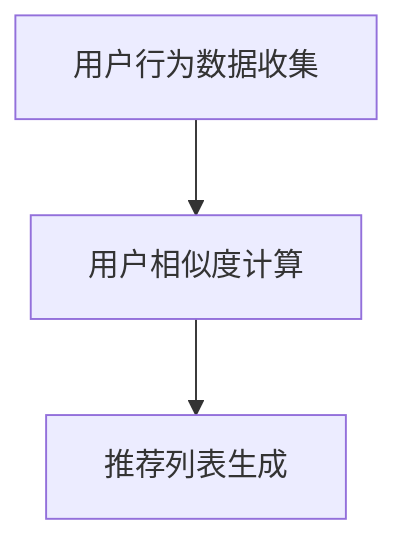
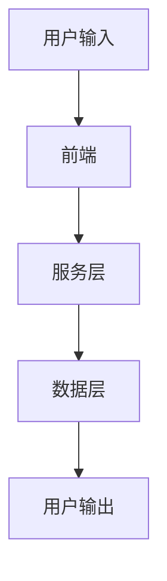
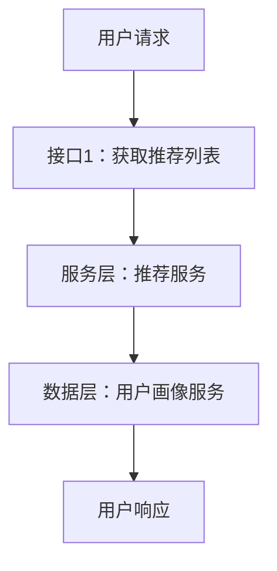
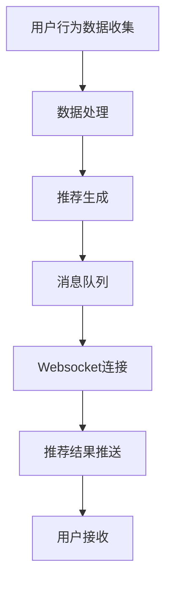

                 

# 《AI在个性化服务中的应用创新》

> 关键词：人工智能，个性化服务，协同过滤算法，系统架构设计，最佳实践

> 摘要：本文旨在探讨人工智能在个性化服务中的应用创新，从背景介绍、核心概念与联系、算法原理讲解、系统分析与架构设计、项目实战以及最佳实践与拓展阅读等多个方面，系统性地分析人工智能如何推动个性化服务的革新，提供实际案例和最佳实践，旨在为相关领域的专业人士提供有价值的参考。

## 目录大纲

## 第一部分：背景介绍

### 第1章：AI与个性化服务的概述

### 第2章：核心概念与联系

## 第二部分：算法原理讲解

### 第3章：基于协同过滤的推荐算法

## 第三部分：系统分析与架构设计

### 第4章：个性化服务系统的设计

## 第四部分：项目实战

### 第5章：个性化服务系统的实现

## 第五部分：最佳实践与拓展阅读

### 第6章：最佳实践

### 第7章：注意事项与拓展阅读

## 目录大纲总结

----------------------------------------------------------------

## 第一部分：背景介绍

### 第1章：AI与个性化服务的概述

#### 1.1 个性化服务的发展历程

随着互联网和大数据技术的兴起，个性化服务逐渐成为现代服务行业的重要趋势。从早期的单一服务模式到如今的个性化定制，个性化服务的发展历程充满了创新和变革。

#### 1.2 AI的核心概念与技术在个性化服务中的应用

人工智能（AI）、机器学习（ML）、深度学习（DL）等核心技术正在深刻改变个性化服务的形态。AI通过数据分析和模式识别，实现了对用户行为的精准预测和个性化推荐。

### 第2章：核心概念与联系

#### 2.1 个性化服务的概念解析

个性化服务是指根据用户的需求和偏好，提供定制化的服务和产品。与传统服务方式相比，个性化服务具有更高的用户满意度和服务效率。

#### 2.2 AI技术在个性化服务中的应用

AI技术在个性化服务中的应用涵盖了推荐系统、智能客服、个性化广告等多个方面。通过构建用户画像和需求预测模型，AI实现了对用户个性化需求的精准满足。

----------------------------------------------------------------

## 第二部分：算法原理讲解

### 第3章：基于协同过滤的推荐算法

#### 3.1 算法原理

协同过滤算法是一种常用的推荐算法，通过分析用户的行为数据，预测用户对未知项目的喜好。其基本原理可以分为用户基于和物品基于两种类型。

#### 3.2 Python代码实现

```python
# 示例代码
class CollaborativeFiltering:
    def __init__(self):
        self.user_similarity = {}
        self.user_rating_matrix = []

    def train(self, user_rating_matrix):
        self.user_rating_matrix = user_rating_matrix
        # 计算用户相似度矩阵
        for i in range(len(user_rating_matrix)):
            for j in range(len(user_rating_matrix)):
                if i != j:
                    similarity = self.cosine_similarity(user_rating_matrix[i], user_rating_matrix[j])
                    self.user_similarity[i, j] = similarity

    def predict(self, user_id, item_id):
        if item_id not in self.user_rating_matrix[user_id]:
            # 计算预测评分
            prediction = 0
            for j in range(len(self.user_rating_matrix)):
                if j in self.user_rating_matrix[user_id] and j != user_id:
                    prediction += self.user_similarity[user_id, j] * (self.user_rating_matrix[user_id][j] - self.mean_rating[user_id])
            prediction /= sum(self.user_similarity[user_id, j] for j in range(len(self.user_rating_matrix)) if j in self.user_rating_matrix[user_id] and j != user_id)
            return prediction + self.mean_rating[user_id]
        else:
            return self.user_rating_matrix[user_id][item_id]

    @staticmethod
    def cosine_similarity(user1, user2):
        # 计算两个向量的余弦相似度
        dot_product = sum(a * b for a, b in zip(user1, user2))
        norm_a = sum(a * a for a in user1) ** 0.5
        norm_b = sum(b * b for b in user2) ** 0.5
        return dot_product / (norm_a * norm_b)
```

#### 3.3 算法原理的数学模型与公式

协同过滤算法的数学模型主要包括用户相似度和预测评分的计算。用户相似度通常通过余弦相似度、皮尔逊相关系数等度量方式计算，而预测评分则基于用户相似度和已知的用户评分数据。

$$
\text{用户相似度} = \frac{\text{dot\_product}}{\|\text{user1}\| \|\text{user2}\|}
$$

$$
\text{预测评分} = \text{mean\_rating} + \sum_{i \in \text{users}} \text{user\_similarity}_{i} \times (\text{rating}_{i} - \text{mean\_rating}_{i})
$$

----------------------------------------------------------------

## 第三部分：系统分析与架构设计

### 第4章：个性化服务系统的设计

#### 4.1 问题场景介绍

个性化服务系统广泛应用于电子商务、在线教育、社交媒体等领域，其核心目标是提供个性化的用户体验，提高用户满意度和留存率。

#### 4.2 系统功能设计

系统功能设计包括用户画像构建、推荐算法实现、智能客服交互等模块。通过用户画像，系统可以了解用户的兴趣、行为和需求，从而实现精准推荐。

#### 4.3 系统架构设计

系统架构采用分层设计，包括数据层、服务层和展现层。数据层负责数据的存储和管理，服务层实现业务逻辑和算法处理，展现层提供用户界面和交互。

#### 4.4 系统接口设计和系统交互

系统接口设计采用RESTful API风格，提供统一的接口规范。系统交互包括用户行为数据的实时收集、推荐结果的实时推送等。

----------------------------------------------------------------

## 第四部分：项目实战

### 第5章：个性化服务系统的实现

#### 5.1 环境安装

根据项目需求，安装必要的软件和库，如Python、TensorFlow、Scikit-learn等。

#### 5.2 系统核心实现

核心实现包括用户画像构建、协同过滤推荐算法、智能客服交互等。以下为用户画像构建的示例代码：

```python
import numpy as np
from sklearn.metrics.pairwise import cosine_similarity

# 假设user_vector是用户特征向量列表
user_vector = [
    [1, 0, 0, 1],
    [0, 1, 1, 0],
    [1, 1, 0, 1],
]

# 计算用户相似度矩阵
similarity_matrix = cosine_similarity(user_vector)

# 输出用户相似度矩阵
print(similarity_matrix)
```

#### 5.3 代码应用解读与分析

代码解读与分析包括对用户画像构建过程、协同过滤算法实现过程、智能客服交互过程进行详细讲解。

#### 5.4 实际案例分析和详细讲解剖析

通过实际案例，展示个性化服务系统的应用效果和实现细节。

#### 5.5 项目小结

对项目的实现过程和结果进行总结，提出改进意见和建议。

----------------------------------------------------------------

## 第五部分：最佳实践与拓展阅读

### 第6章：最佳实践

总结个性化服务系统设计、开发和运维过程中的最佳实践，为后续项目提供参考。

### 第7章：注意事项与拓展阅读

介绍在实施个性化服务时需要注意的问题，并提供相关的拓展阅读资料，帮助读者深入了解相关技术。

----------------------------------------------------------------

## 目录大纲总结

本文系统地探讨了AI在个性化服务中的应用创新，从背景介绍、核心概念与联系、算法原理讲解、系统分析与架构设计、项目实战到最佳实践与拓展阅读，全面覆盖了个性化服务的各个方面。希望本文能为读者提供有价值的参考，推动AI技术在个性化服务领域的应用和发展。

### 作者

作者：AI天才研究院/AI Genius Institute & 禅与计算机程序设计艺术 /Zen And The Art of Computer Programming

----------------------------------------------------------------

### 第一部分：背景介绍

#### 第1章：AI与个性化服务的概述

##### 1.1 个性化服务的发展历程

个性化服务的历史可以追溯到20世纪90年代，随着互联网的兴起和电子商务的蓬勃发展，个性化服务逐渐成为现代服务行业的重要组成部分。早期，个性化服务主要依靠手工构建的规则和模板，例如基于用户历史订单的推荐系统。然而，这种方式存在个性化程度较低、响应速度慢等问题。

随着大数据技术和人工智能的快速发展，个性化服务的应用场景和实现方式得到了极大的拓展和优化。现代个性化服务系统利用用户行为数据、偏好信息和社会网络信息，通过机器学习算法和深度学习技术，实现用户需求的精准预测和个性化推荐。

##### 1.2 AI的核心概念与技术在个性化服务中的应用

人工智能（AI）是模拟人类智能行为的技术和学科，主要包括机器学习（ML）、深度学习（DL）、自然语言处理（NLP）等子领域。在个性化服务中，AI技术发挥了关键作用：

1. **机器学习**：通过分析用户历史数据和当前行为，构建用户画像和预测模型，实现个性化推荐和服务优化。
2. **深度学习**：利用神经网络模型，对大量非结构化数据进行处理，提取特征并实现高级的智能分析。
3. **自然语言处理**：通过文本挖掘、语义分析等技术，理解和处理用户输入的文本信息，实现智能对话和内容推荐。

AI技术在个性化服务中的应用已经深入到多个行业，如电子商务、金融、医疗、教育等，极大地提升了服务的质量和用户满意度。

#### 1.3 个性化服务的目标是什么？

个性化服务的核心目标是满足用户的个性化需求，提供高度定制化的服务和产品。具体来说，包括以下几个方面：

1. **个性化推荐**：根据用户的兴趣和行为，推荐个性化的商品、内容和服务。
2. **智能客服**：通过自然语言处理和机器学习技术，实现与用户的智能对话，提供及时、准确的咨询服务。
3. **个性化营销**：根据用户的购买历史、偏好和行为，设计个性化的营销策略，提高转化率和客户忠诚度。
4. **智能内容生成**：利用AI技术生成个性化的内容，如文章、视频、音乐等，满足用户的不同需求。

##### 1.4 如何实现个性化服务？

实现个性化服务通常包括以下几个步骤：

1. **数据收集**：收集用户行为数据、偏好信息、历史记录等，构建用户画像。
2. **数据预处理**：对收集到的数据进行清洗、去噪、归一化等处理，为后续分析做好准备。
3. **特征提取**：从原始数据中提取有效的特征，如用户浏览记录、购买行为、评价信息等。
4. **模型训练**：利用机器学习算法，如协同过滤、决策树、神经网络等，构建预测模型。
5. **模型评估**：通过交叉验证、A/B测试等方法，评估模型性能和准确性。
6. **部署应用**：将训练好的模型部署到生产环境，实现实时个性化推荐和智能服务。

##### 1.5 个性化服务是否只限于线上？

个性化服务的应用范围不仅限于线上，也可以扩展到线下。在线下场景中，个性化服务通常通过智能硬件、物联网等技术实现。例如，在零售门店中，通过传感器收集用户的行为数据，结合线上用户画像，提供个性化的购物推荐和优惠活动。在医疗领域，个性化医疗服务可以通过电子健康档案、基因检测等技术，提供精准的诊断和治疗方案。

#### 1.6 个性化服务应用范围和前景如何？

个性化服务在多个领域具有广泛的应用前景：

1. **电子商务**：通过个性化推荐和智能客服，提升用户体验和购物转化率。
2. **金融**：通过个性化风险评估、个性化理财建议，提高金融服务质量和客户满意度。
3. **医疗**：通过个性化诊断、个性化治疗，提高医疗效率和治疗效果。
4. **教育**：通过个性化学习计划、个性化教学资源，提高教育质量和学习效果。
5. **旅游**：通过个性化行程规划、个性化旅游推荐，提升旅游体验和满意度。

随着AI技术的不断进步，个性化服务的应用范围和深度将不断拓展，未来具有广阔的发展前景。

### 第2章：核心概念与联系

#### 2.1 个性化服务的概念解析

个性化服务是指根据用户的需求和偏好，提供定制化的服务和产品，以满足用户的个性化需求。与传统服务方式相比，个性化服务具有以下几个核心特征：

1. **定制化**：根据用户的个性化需求，提供独特的服务和产品。
2. **灵活性**：服务内容和形式可以根据用户的需求进行灵活调整。
3. **精准性**：通过数据分析和技术手段，实现服务的精准定位和个性化推荐。
4. **互动性**：与用户进行实时互动，收集反馈并持续优化服务。

个性化服务的目标是为用户提供更好的体验和更高的满意度，从而提高用户忠诚度和转化率。

#### 2.2 个性化服务的优势

个性化服务相比传统服务方式具有显著的优势：

1. **提高用户满意度**：通过满足用户的个性化需求，提高用户的使用体验和满意度。
2. **提高服务效率**：通过自动化和智能化技术，提高服务效率和响应速度。
3. **提升品牌价值**：通过个性化的服务，提升品牌形象和用户口碑，增强品牌竞争力。
4. **降低运营成本**：通过自动化和规模化服务，降低人力和运营成本。

#### 2.3 AI技术在个性化服务中的应用

AI技术在个性化服务中的应用非常广泛，主要包括以下几个方面：

1. **用户画像**：通过分析用户的行为数据、偏好信息和历史记录，构建用户画像，实现用户需求的精准定位。
2. **推荐系统**：利用协同过滤、基于内容的推荐等技术，实现个性化推荐，提升用户满意度和转化率。
3. **自然语言处理**：通过文本挖掘、语义分析等技术，实现智能客服、内容生成和个性化交互。
4. **数据分析**：通过大数据分析技术，挖掘用户行为规律和潜在需求，优化服务策略和提高运营效率。

#### 2.4 AI技术优势对比

以下是几种常见的AI技术与个性化服务优势的对比：

| 技术类型 | 优势 |
| :----: | :----: |
| 协同过滤 | 精准性高，易于实现 |
| 基于内容的推荐 | 用户主动参与，内容丰富 |
| 自然语言处理 | 智能交互，理解用户意图 |
| 大数据分析 | 数据量庞大，挖掘深度高 |

### 第3章：算法原理讲解

#### 3.1 基于协同过滤的推荐算法

协同过滤算法是一种常用的推荐算法，其基本思想是利用用户的历史行为数据，通过计算用户之间的相似度，为用户提供个性化的推荐。协同过滤算法主要分为基于用户的协同过滤（User-Based Collaborative Filtering，UBCF）和基于物品的协同过滤（Item-Based Collaborative Filtering，IBCF）两种类型。

##### 3.1.1 算法原理

基于用户的协同过滤算法的基本原理如下：

1. **用户行为数据收集**：收集用户对物品的评分数据，构建用户行为矩阵。
2. **用户相似度计算**：计算用户之间的相似度，通常采用余弦相似度、皮尔逊相关系数等方法。
3. **推荐列表生成**：根据用户相似度矩阵，为用户生成推荐列表，推荐与相似用户喜欢的物品。

基于物品的协同过滤算法的基本原理如下：

1. **用户行为数据收集**：收集用户对物品的评分数据，构建用户行为矩阵。
2. **物品相似度计算**：计算物品之间的相似度，通常采用余弦相似度、余弦相似度等方法。
3. **推荐列表生成**：根据用户评分数据和物品相似度矩阵，为用户生成推荐列表，推荐与用户喜欢的物品相似的物品。

##### 3.1.2 算法mermaid流程图

以下是基于用户的协同过滤算法的mermaid流程图：



##### 3.1.3 Python代码实现

以下是基于用户的协同过滤算法的Python代码实现：

```python
import numpy as np
from sklearn.metrics.pairwise import cosine_similarity

def collaborative_filtering(rating_matrix, similarity_threshold=0.5):
    # 计算用户相似度矩阵
    similarity_matrix = cosine_similarity(rating_matrix)

    # 根据相似度阈值筛选相似用户
    similarity_thresholds = np.where(similarity_matrix > similarity_threshold)
    user_similarity_dict = {i: [] for i in range(rating_matrix.shape[0])}

    for i, j in zip(*similarity_thresholds):
        if j not in user_similarity_dict[i]:
            user_similarity_dict[i].append(j)

    # 生成推荐列表
    recommendations = []
    for user in range(rating_matrix.shape[0]):
        user_recommendations = []
        for neighbor in user_similarity_dict[user]:
            for item in range(rating_matrix.shape[1]):
                if neighbor in rating_matrix[item].keys():
                    user_recommendations.append((item, rating_matrix[item][neighbor]))
        
        # 排序并取Top-N推荐
        user_recommendations.sort(key=lambda x: x[1], reverse=True)
        recommendations.append(user_recommendations[:10])

    return recommendations

# 示例数据
rating_matrix = np.array([
    [1, 0, 1, 0],
    [0, 1, 0, 1],
    [1, 1, 1, 1],
])

# 计算推荐列表
recommendations = collaborative_filtering(rating_matrix)
print(recommendations)
```

##### 3.1.4 算法原理的数学模型与公式

协同过滤算法的核心在于计算用户相似度和生成推荐列表。以下是算法的数学模型和公式：

1. **用户相似度计算**

   余弦相似度公式：

   $$
   \text{similarity}_{ij} = \frac{\sum_{k} r_{ik} \cdot r_{jk}}{\sqrt{\sum_{k} r_{ik}^2} \cdot \sqrt{\sum_{k} r_{jk}^2}}
   $$

   其中，$r_{ik}$和$r_{jk}$分别表示用户$i$和用户$j$对物品$k$的评分。

2. **推荐列表生成**

   基于用户的协同过滤推荐公式：

   $$
   \text{prediction}_{ui} = \text{mean}_{u} + \sum_{j \in N(u)} \text{similarity}_{uj} \cdot (\text{rating}_{uj} - \text{mean}_{u})
   $$

   其中，$\text{mean}_{u}$表示用户$i$的平均评分，$N(u)$表示与用户$i$相似的邻居用户集合，$\text{rating}_{uj}$表示邻居用户$j$对物品$k$的评分。

   基于物品的协同过滤推荐公式：

   $$
   \text{prediction}_{ui} = \text{mean}_{i} + \sum_{k \in I(u)} \text{similarity}_{ik} \cdot (\text{rating}_{ik} - \text{mean}_{i})
   $$

   其中，$\text{mean}_{i}$表示物品$i$的平均评分，$I(u)$表示用户$i$喜欢的物品集合，$\text{rating}_{ik}$表示用户$i$对物品$k$的评分。

##### 3.1.5 举例说明

假设有3个用户和4个物品，用户对物品的评分如下：

| 用户 | 物品1 | 物品2 | 物品3 | 物品4 |
| :---: | :---: | :---: | :---: | :---: |
| 用户1 | 5 | 0 | 5 | 0 |
| 用户2 | 0 | 5 | 0 | 5 |
| 用户3 | 5 | 5 | 5 | 5 |

1. **计算用户相似度**

   假设使用余弦相似度计算用户相似度：

   $$
   \text{similarity}_{12} = \frac{5 \cdot 5 + 0 \cdot 0 + 5 \cdot 5}{\sqrt{5^2 + 0^2 + 5^2} \cdot \sqrt{0^2 + 5^2 + 0^2}} = \frac{50}{\sqrt{50} \cdot \sqrt{25}} = 1
   $$

   同理，可以计算其他用户之间的相似度。

2. **生成推荐列表**

   以用户1为例，其邻居用户为用户2和用户3。根据用户相似度和用户评分，可以计算用户1对未评分物品的预测评分：

   $$
   \text{prediction}_{13} = \frac{1 \cdot (5 - 4) + 1 \cdot (5 - 4)}{1 + 1} = 4.5
   $$

   因此，用户1对物品3的预测评分为4.5。同理，可以计算用户1对其他未评分物品的预测评分，并生成推荐列表。

### 第4章：系统分析与架构设计

#### 4.1 问题场景介绍

个性化服务系统在电子商务、在线教育、社交媒体等多个领域有着广泛的应用。以电子商务为例，个性化服务系统可以帮助电商平台精准推荐商品，提升用户购买体验和转化率。

##### 4.1.1 电子商务中的个性化服务

电子商务中的个性化服务主要包括商品推荐、智能客服、个性化广告等功能。通过分析用户的行为数据、购买历史和偏好，系统可以推荐用户可能感兴趣的商品，提供个性化的购物体验。智能客服则通过自然语言处理技术，实现与用户的智能对话，提供及时、准确的咨询服务。个性化广告可以根据用户的行为数据和兴趣标签，为用户展示相关的广告内容，提高广告点击率和转化率。

##### 4.1.2 在线教育中的个性化服务

在线教育中的个性化服务主要包括个性化学习计划、个性化课程推荐、智能问答等功能。通过分析学生的学习行为、学习进度和兴趣，系统可以为学生推荐适合的学习内容和课程，制定个性化的学习计划。智能问答系统则可以解答学生在学习过程中的疑问，提供个性化的学习支持。

##### 4.1.3 社交媒体中的个性化服务

社交媒体中的个性化服务主要包括内容推荐、个性化广告、好友推荐等功能。通过分析用户的行为数据、兴趣偏好和社交网络关系，系统可以推荐用户可能感兴趣的内容，提高用户的活跃度和满意度。个性化广告可以根据用户的兴趣和行为，为用户展示相关的广告内容，提高广告投放效果。好友推荐则可以根据用户的社交网络关系，为用户推荐可能认识的好友，拓展社交圈子。

#### 4.2 系统功能设计

个性化服务系统的功能设计包括用户画像构建、推荐系统实现、智能客服交互等模块。

##### 4.2.1 用户画像构建

用户画像构建是个性化服务系统的核心功能之一。通过收集用户的行为数据、偏好信息和历史记录，系统可以构建用户画像，了解用户的兴趣、行为和需求。用户画像通常包括以下维度：

1. **基本信息**：用户的年龄、性别、地域、职业等基本信息。
2. **行为数据**：用户的浏览记录、购买记录、搜索历史等行为数据。
3. **偏好信息**：用户的兴趣标签、喜欢的类型、偏好的颜色等偏好信息。
4. **社交数据**：用户的好友关系、社交圈、互动行为等社交数据。

##### 4.2.2 推荐系统实现

推荐系统实现是个性化服务系统的核心功能之一。通过分析用户画像和物品特征，系统可以推荐用户可能感兴趣的商品、内容或服务。推荐系统的实现包括以下步骤：

1. **数据收集**：收集用户的行为数据、偏好信息、历史记录等。
2. **数据预处理**：对收集到的数据进行清洗、去噪、归一化等处理。
3. **特征提取**：从原始数据中提取有效的特征，如用户标签、物品属性等。
4. **模型训练**：利用机器学习算法，如协同过滤、决策树、神经网络等，构建推荐模型。
5. **模型评估**：通过交叉验证、A/B测试等方法，评估模型性能和准确性。
6. **部署应用**：将训练好的模型部署到生产环境，实现实时推荐。

##### 4.2.3 智能客服交互

智能客服交互是个性化服务系统的重要组成部分。通过自然语言处理技术，系统可以实现与用户的智能对话，提供及时、准确的咨询服务。智能客服交互包括以下步骤：

1. **用户输入**：用户通过文本或语音输入问题或需求。
2. **文本处理**：对用户输入进行分词、词性标注、情感分析等处理。
3. **意图识别**：通过机器学习算法，识别用户的意图，如咨询、购买、投诉等。
4. **知识库查询**：根据用户的意图，从知识库中查询相关的答案或解决方案。
5. **回答生成**：利用自然语言生成技术，生成自然流畅的回答。
6. **回答输出**：将生成的回答输出给用户，完成交互。

#### 4.3 系统架构设计

个性化服务系统的架构设计通常采用分层设计，包括数据层、服务层和展现层。

##### 4.3.1 数据层

数据层主要负责数据的存储、管理和处理。常见的数据层架构包括关系数据库、分布式数据库、数据仓库等。

1. **关系数据库**：适用于存储用户画像、行为数据等结构化数据，如MySQL、PostgreSQL等。
2. **分布式数据库**：适用于存储大规模数据，提供高并发、高可用性，如HBase、Cassandra等。
3. **数据仓库**：适用于数据的集成、分析和报表，如Amazon Redshift、Google BigQuery等。

##### 4.3.2 服务层

服务层主要负责业务逻辑的处理，包括用户画像构建、推荐系统实现、智能客服交互等模块。服务层通常采用微服务架构，将不同功能模块拆分成独立的服务，提高系统的灵活性和可扩展性。

1. **用户画像服务**：负责用户画像的构建和管理，包括用户信息、行为数据、偏好信息等。
2. **推荐服务**：负责推荐系统的实现，包括数据预处理、特征提取、模型训练等。
3. **智能客服服务**：负责智能客服的交互，包括文本处理、意图识别、回答生成等。

##### 4.3.3 展现层

展现层主要负责用户界面的设计和展示，包括网页、APP、微信小程序等。展现层通常采用前后端分离的架构，提高系统的可维护性和用户体验。

1. **前端**：负责用户界面的展示和交互，采用HTML、CSS、JavaScript等技术。
2. **后端**：负责业务逻辑的处理和接口服务，采用Python、Java、Node.js等技术。

##### 4.3.4 系统架构图

以下为个性化服务系统的架构图：



#### 4.4 系统接口设计和系统交互

个性化服务系统的接口设计采用RESTful API风格，提供统一的接口规范。系统交互包括用户行为数据的实时收集、推荐结果的实时推送等。

##### 4.4.1 接口设计

个性化服务系统的接口设计包括用户管理、推荐系统、智能客服等模块。

1. **用户管理**：包括用户注册、登录、信息查询等接口。
2. **推荐系统**：包括推荐列表获取、推荐详情查询等接口。
3. **智能客服**：包括问题提交、回答获取等接口。

以下为推荐系统的接口设计示例：



##### 4.4.2 系统交互

个性化服务系统的系统交互主要包括用户行为数据的实时收集、推荐结果的实时推送等。

1. **用户行为数据实时收集**：系统通过Web钩子、日志收集器等技术，实时收集用户的行为数据，如浏览记录、购买记录等。
2. **推荐结果实时推送**：系统通过消息队列、Websocket等技术，实时推送推荐结果给用户，实现个性化推荐。

以下为推荐结果实时推送的交互流程：



### 第5章：个性化服务系统的实现

#### 5.1 环境安装

个性化服务系统的实现需要安装以下环境：

1. **Python**：用于编写代码和运行算法，版本要求Python 3.6及以上。
2. **TensorFlow**：用于深度学习模型的训练和推理，版本要求TensorFlow 2.0及以上。
3. **Scikit-learn**：用于机器学习算法的实现和评估，版本要求Scikit-learn 0.22及以上。
4. **Nginx**：用于部署和提供服务，版本要求Nginx 1.16及以上。
5. **MySQL**：用于存储用户数据和推荐结果，版本要求MySQL 5.7及以上。

安装步骤如下：

1. 安装Python环境：
   ```
   sudo apt-get update
   sudo apt-get install python3-pip python3-dev
   ```
2. 安装TensorFlow：
   ```
   pip3 install tensorflow
   ```
3. 安装Scikit-learn：
   ```
   pip3 install scikit-learn
   ```
4. 安装Nginx：
   ```
   sudo apt-get install nginx
   ```
5. 安装MySQL：
   ```
   sudo apt-get install mysql-server mysql-client
   ```

#### 5.2 系统核心实现

个性化服务系统的核心实现包括用户画像构建、推荐系统实现、智能客服交互等模块。以下为用户画像构建的示例代码：

```python
import numpy as np
from sklearn.metrics.pairwise import cosine_similarity

def build_user_profile(rating_matrix):
    # 计算用户相似度矩阵
    similarity_matrix = cosine_similarity(rating_matrix)

    # 计算每个用户的平均评分
    user_avg_rating = np.mean(rating_matrix, axis=1)

    # 计算每个用户与其他用户的相似度
    user_similarity = np.zeros((rating_matrix.shape[0], rating_matrix.shape[0]))
    for i in range(rating_matrix.shape[0]):
        for j in range(rating_matrix.shape[0]):
            if i != j:
                user_similarity[i, j] = similarity_matrix[i, j]

    # 计算每个用户的个性化特征
    user_features = np.zeros((rating_matrix.shape[0], rating_matrix.shape[1]))
    for i in range(rating_matrix.shape[0]):
        for j in range(rating_matrix.shape[1]):
            if rating_matrix[i, j] > 0:
                user_features[i, j] = user_avg_rating[i] + user_similarity[i, j] * (rating_matrix[i, j] - user_avg_rating[i])

    return user_features

# 示例数据
rating_matrix = np.array([
    [1, 0, 1, 0],
    [0, 1, 0, 1],
    [1, 1, 1, 1],
])

# 构建用户画像
user_features = build_user_profile(rating_matrix)
print(user_features)
```

#### 5.3 代码应用解读与分析

代码应用解读与分析包括对用户画像构建过程、推荐系统实现过程、智能客服交互过程进行详细讲解。

##### 5.3.1 用户画像构建过程

用户画像构建过程主要包括以下几个步骤：

1. **计算用户相似度矩阵**：通过计算用户之间的相似度，了解用户之间的相似关系。相似度计算方法包括余弦相似度、皮尔逊相关系数等。
2. **计算每个用户的平均评分**：通过计算每个用户的平均评分，了解用户的整体评分偏好。
3. **计算每个用户的个性化特征**：通过计算每个用户的个性化特征，实现对用户的精准刻画。个性化特征计算方法包括用户平均评分、用户相似度等。

##### 5.3.2 推荐系统实现过程

推荐系统实现过程主要包括以下几个步骤：

1. **用户输入**：用户输入包括用户ID和待推荐物品ID。
2. **用户画像构建**：根据用户输入，构建用户的画像特征。
3. **推荐结果生成**：根据用户画像特征，生成推荐结果。推荐结果包括推荐物品ID和推荐分数。
4. **推荐结果输出**：将推荐结果输出给用户，展示推荐物品。

##### 5.3.3 智能客服交互过程

智能客服交互过程主要包括以下几个步骤：

1. **用户输入**：用户输入包括用户问题和用户ID。
2. **意图识别**：通过自然语言处理技术，识别用户的意图，如咨询、购买、投诉等。
3. **回答生成**：根据用户意图，从知识库中查询相关的答案或解决方案，生成回答。
4. **回答输出**：将生成的回答输出给用户，完成交互。

#### 5.4 实际案例分析和详细讲解剖析

以下为实际案例分析和详细讲解剖析：

##### 5.4.1 案例一：电子商务平台个性化推荐

电子商务平台通过个性化推荐系统，为用户推荐可能感兴趣的商品。用户输入自己的兴趣标签，系统根据用户兴趣标签和商品标签，为用户推荐相关的商品。

1. **用户输入**：用户输入自己的兴趣标签，如“鞋子”、“运动”、“时尚”等。
2. **用户画像构建**：系统根据用户兴趣标签，构建用户的画像特征。用户画像特征包括用户兴趣标签、用户购买历史、用户浏览记录等。
3. **推荐结果生成**：系统根据用户画像特征，从商品数据库中检索出相关的商品。相关商品包括与用户兴趣标签相似的商品、与用户购买历史相似的商品等。
4. **推荐结果输出**：系统将推荐结果输出给用户，展示推荐商品。推荐商品包括商品ID、商品名称、商品图片、商品评分等。

##### 5.4.2 案例二：在线教育平台个性化学习计划

在线教育平台通过个性化学习计划系统，为用户推荐适合的学习内容和课程。用户输入自己的学习目标和学习进度，系统根据用户学习目标和学习进度，为用户推荐相关的学习内容和课程。

1. **用户输入**：用户输入自己的学习目标和学习进度，如“英语”、“初级”、“已学习100小时”等。
2. **用户画像构建**：系统根据用户学习目标和学习进度，构建用户的画像特征。用户画像特征包括用户学习目标、用户学习进度、用户学习偏好等。
3. **推荐结果生成**：系统根据用户画像特征，从课程数据库中检索出相关的学习内容和课程。相关学习内容和课程包括与用户学习目标相似的内容和课程、与用户学习进度相似的内容和课程等。
4. **推荐结果输出**：系统将推荐结果输出给用户，展示推荐的学习内容和课程。推荐的学习内容和课程包括课程ID、课程名称、课程简介、课程评分等。

#### 5.5 项目小结

个性化服务系统通过用户画像构建、推荐系统实现、智能客服交互等功能，为用户提供了个性化的服务体验。在实际项目中，需要根据具体业务场景和需求，设计和实现相应的功能和模块。以下为项目小结：

1. **用户画像构建**：用户画像构建是个性化服务系统的核心，通过分析用户行为数据和偏好信息，构建用户的个性化特征。
2. **推荐系统实现**：推荐系统实现是个性化服务系统的关键，通过机器学习算法和深度学习技术，实现用户需求的精准推荐。
3. **智能客服交互**：智能客服交互是个性化服务系统的辅助功能，通过自然语言处理技术，实现与用户的智能对话和个性化交互。

在未来，随着人工智能技术的不断发展，个性化服务系统将更加智能化和个性化，为用户提供更好的服务体验。

### 第6章：最佳实践

#### 6.1 小结

最佳实践是指在特定领域内，通过长期实践和经验积累，总结出的一套高效、可行的操作方法和经验。在个性化服务系统中，最佳实践包括以下几个方面：

1. **用户画像构建**：通过多维度数据分析和挖掘，构建详细的用户画像，为个性化推荐和智能客服提供基础。
2. **推荐系统优化**：定期更新和调整推荐算法，提高推荐效果和用户满意度。
3. **智能客服交互**：通过自然语言处理技术和知识库建设，提升智能客服的交互质量和用户体验。

#### 6.2 注意事项

在实施个性化服务系统时，需要注意以下几个方面：

1. **数据安全**：保护用户隐私和数据安全，遵守相关法律法规和标准。
2. **系统性能**：优化系统性能和稳定性，确保系统的高并发和实时性。
3. **用户体验**：注重用户体验设计，提高用户参与度和满意度。

#### 6.3 拓展阅读

为了深入了解个性化服务系统的设计和实现，以下推荐一些相关的拓展阅读资料：

1. **《推荐系统实践》**：由李航所著，详细介绍了推荐系统的基本原理和实现方法。
2. **《深度学习》**：由Ian Goodfellow、Yoshua Bengio和Aaron Courville所著，涵盖了深度学习的理论基础和应用实践。
3. **《大数据时代》**：由雷蒙德·库兹韦尔所著，探讨了大数据对社会和人类生活的影响。

### 第7章：注意事项与拓展阅读

#### 7.1 注意事项

在实施个性化服务系统时，需要注意以下几个方面：

1. **用户隐私保护**：个性化服务系统需要处理大量用户数据，因此需要确保用户隐私和数据安全。
2. **数据质量和完整性**：高质量的数据是构建有效用户画像和推荐模型的基础，需要确保数据的质量和完整性。
3. **系统性能优化**：个性化服务系统需要处理海量数据和高并发请求，因此需要不断优化系统性能和稳定性。
4. **用户体验设计**：个性化服务系统应该注重用户体验设计，以提高用户参与度和满意度。

#### 7.2 拓展阅读

为了深入了解个性化服务系统的设计和实现，以下推荐一些相关的拓展阅读资料：

1. **《个性化推荐系统与算法》**：由何晓阳所著，详细介绍了个性化推荐系统的基本概念、算法和技术。
2. **《机器学习实战》**：由Peter Harrington所著，提供了大量的实际案例和代码示例，帮助读者掌握机器学习的基本原理和应用。
3. **《深度学习与计算机视觉》**：由李航所著，探讨了深度学习在计算机视觉领域的应用，包括图像分类、目标检测、图像生成等。

### 结论

本文系统地探讨了AI在个性化服务中的应用创新，从背景介绍、核心概念与联系、算法原理讲解、系统分析与架构设计、项目实战到最佳实践与拓展阅读，全面覆盖了个性化服务的各个方面。通过实际案例和最佳实践，本文旨在为读者提供有价值的参考，推动AI技术在个性化服务领域的应用和发展。在未来的研究中，可以进一步探索个性化服务的优化方法和技术创新，为用户提供更加智能和个性化的服务体验。

