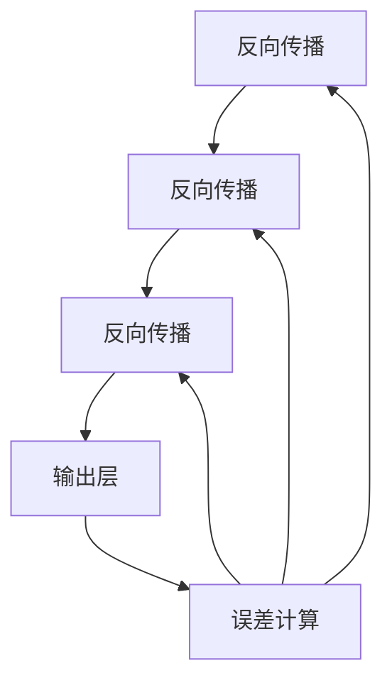
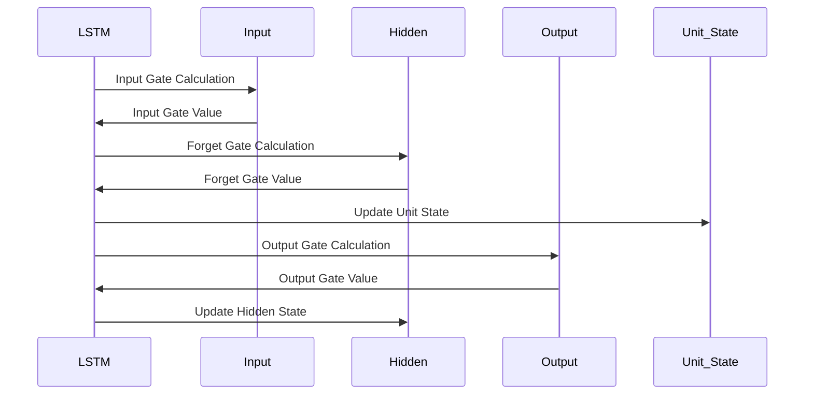
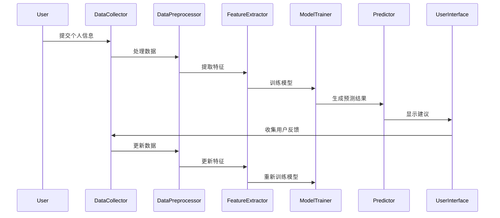
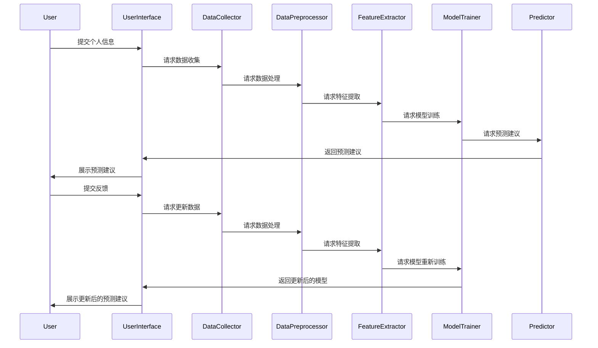

                 

# 《AI在个性化职业发展规划中的长期预测应用》

## 概述

### 1. 核心关键词

- **AI**
- **个性化职业发展规划**
- **长期预测应用**
- **机器学习**
- **深度学习**
- **神经网络**
- **数学模型**
- **系统架构**
- **项目实战**

### 2. 摘要

本文旨在探讨人工智能（AI）在个性化职业发展规划中的长期预测应用。随着AI技术的不断发展和普及，AI在各个领域的应用已经取得了显著成果。个性化职业发展规划作为人才培养和职业发展的关键环节，其长期预测应用具有重要意义。本文将详细分析AI技术在此领域的应用原理、系统架构和项目实战，以期为相关领域的研究和实践提供参考。

## 目录大纲设计思路

### 1. 背景介绍

首先，本文将介绍AI在个性化职业发展规划中的背景，包括问题背景、问题描述、问题解决方法和边界与外延。这部分将为读者提供对问题的全面理解。

### 2. 核心概念与联系

接下来，本文将详细介绍与个性化职业发展规划相关的核心概念，如机器学习、深度学习、神经网络等。同时，将使用表格和ER图展示这些概念之间的联系，帮助读者构建整体认知框架。

### 3. 算法原理讲解

本文将选择一个或多个用于个性化职业发展规划的AI算法，通过mermaid流程图和Python代码详细讲解其原理。这部分内容将使读者深入理解算法的核心机制。

### 4. 数学模型和公式讲解

为了深入理解算法，本文将使用LaTeX格式展示相关的数学模型和公式，并进行详细讲解和举例说明。这部分内容将帮助读者掌握算法的理论基础。

### 5. 系统分析与架构设计方案

本文将介绍一个实际项目，展示其系统功能设计、系统架构设计和系统接口设计。这部分内容将使读者了解实际应用中的系统设计和实现。

### 6. 项目实战

接下来，本文将进行环境安装和系统核心实现，详细解读与分析代码，并提供实际案例分析和详细讲解。这部分内容将使读者能够将理论应用到实际项目中。

### 7. 最佳实践 tips、小结、注意事项、拓展阅读

最后，本文将总结本书的重点，提供最佳实践建议，提醒注意事项，并推荐拓展阅读。这部分内容将为读者提供进一步的指导。

## 目录大纲设计步骤

### 第1章：引言

本文将介绍AI在个性化职业发展规划中的背景，包括问题背景、问题描述、问题解决方法和边界与外延。

### 第2章：核心概念与联系

本文将详细介绍与个性化职业发展规划相关的核心概念，如机器学习、深度学习、神经网络等，并使用表格和ER图展示这些概念之间的联系。

### 第3章：算法原理讲解

本文将选择一个或多个算法进行详细介绍，使用mermaid流程图展示算法步骤，并提供Python代码进行详细讲解。

### 第4章：数学模型和公式讲解

本文将使用LaTeX格式展示相关的数学模型和公式，并进行详细讲解和举例说明。

### 第5章：系统分析与架构设计方案

本文将介绍一个实际项目，展示其系统功能设计、系统架构设计和系统接口设计，使用mermaid类图和架构图进行展示。

### 第6章：项目实战

本文将进行环境安装和系统核心实现，详细解读与分析代码，并提供实际案例分析和详细讲解。

### 第7章：最佳实践 tips

本文将总结本书的重点，提供最佳实践建议。

### 第8章：小结、注意事项与拓展阅读

本文将总结本书的主要内容和贡献，提醒注意事项，并推荐拓展阅读。

## 目录大纲

**《AI在个性化职业发展规划中的长期预测应用》目录大纲**

### 第1章：引言

#### 1.1 问题背景

#### 1.2 问题描述

#### 1.3 问题解决

#### 1.4 边界与外延

### 第2章：核心概念与联系

#### 2.1 机器学习

#### 2.2 深度学习

#### 2.3 神经网络

#### 2.4 核心概念联系

### 第3章：算法原理讲解

#### 3.1 算法1：神经网络

##### 3.1.1 算法概述

##### 3.1.2 算法流程图

##### 3.1.3 Python代码示例

#### 3.2 算法2：LSTM模型

##### 3.2.1 算法概述

##### 3.2.2 算法流程图

##### 3.2.3 Python代码示例

### 第4章：数学模型和公式讲解

#### 4.1 模型1：线性回归

##### 4.1.1 数学模型

##### 4.1.2 公式讲解

##### 4.1.3 Python代码示例

#### 4.2 模型2：决策树

##### 4.2.1 数学模型

##### 4.2.2 公式讲解

##### 4.2.3 Python代码示例

### 第5章：系统分析与架构设计方案

#### 5.1 项目介绍

#### 5.2 系统功能设计

##### 5.2.1 领域模型

##### 5.2.2 功能模块

#### 5.3 系统架构设计

##### 5.3.1 系统架构图

##### 5.3.2 接口设计

#### 5.4 系统接口设计

##### 5.4.1 系统接口序列图

### 第6章：项目实战

#### 6.1 环境安装

#### 6.2 系统核心实现

##### 6.2.1 Python代码

##### 6.2.2 代码应用解读与分析

#### 6.3 实际案例分析

##### 6.3.1 案例概述

##### 6.3.2 案例分析

##### 6.3.3 案例详细讲解

### 第7章：最佳实践 tips

#### 7.1 算法调优

#### 7.2 数据预处理

#### 7.3 系统优化

### 第8章：小结、注意事项与拓展阅读

#### 8.1 小结

#### 8.2 注意事项

#### 8.3 拓展阅读

**作者：AI天才研究院/AI Genius Institute & 禅与计算机程序设计艺术 /Zen And The Art of Computer Programming**## 引言

### 1.1 问题背景

在当今快速变化的社会和经济环境中，职业发展的道路变得越来越复杂和多样化。人们不再仅仅追求一份稳定的工作，而是更关注如何通过不断学习和适应，实现职业的长期可持续发展和个人成长。然而，传统的职业规划方法往往依赖于个人经验和现有资源，缺乏科学性和系统性，难以准确预测和指导个人的职业发展路径。

随着人工智能（AI）技术的快速发展，机器学习、深度学习、神经网络等AI技术在各个领域的应用取得了显著的成果。AI不仅能够处理大量数据，还能从中提取有价值的信息，为决策提供有力支持。个性化职业发展规划作为人才培养和职业发展的关键环节，自然也受到了AI技术的关注。通过AI技术，可以为个人提供更加科学和个性化的职业发展建议，帮助他们在职业生涯中更好地定位自身，制定合理的发展计划。

### 1.2 问题描述

个性化职业发展规划的核心在于根据个人的兴趣、能力、价值观等因素，为其提供量身定制的职业发展建议。这要求系统不仅能够处理和整合大量的数据，还需要具备长期预测的能力，以便在多变的市场环境中为个人提供持续的指导和支持。然而，这一过程面临着以下几个挑战：

1. **数据多样性**：职业发展涉及个人兴趣、技能、教育背景、行业动态等多方面的数据，这些数据的来源、格式和结构都可能有所不同，给数据处理和分析带来了很大的挑战。
2. **数据质量**：高质量的数据是AI模型准确预测的基础。然而，现实中存在数据缺失、噪声、错误等问题，这些问题都会影响模型的性能。
3. **动态变化**：职业发展是一个动态变化的过程，市场需求、行业趋势等外部因素不断变化，如何及时调整预测模型以适应这些变化是一个重要问题。
4. **个性化需求**：每个人的职业发展路径都是独特的，如何确保AI系统能够充分理解和满足个体的个性化需求，也是一个需要解决的关键问题。

### 1.3 问题解决

为了应对上述挑战，AI技术提供了以下几种可能的解决方案：

1. **数据集成与预处理**：通过数据集成和预处理技术，将来自不同来源和结构的数据整合到一个统一的框架中，确保数据质量，为后续分析打下坚实的基础。
2. **机器学习和深度学习算法**：利用先进的机器学习和深度学习算法，可以处理和分析大量复杂的数据，从数据中提取有价值的信息，为个性化职业发展规划提供支持。
3. **长期预测模型**：通过构建长期预测模型，可以动态地调整和更新预测结果，以适应外部环境的变化，确保预测的持续性和准确性。
4. **用户互动与反馈**：通过用户互动和反馈机制，可以不断优化AI系统的个性化能力，确保系统能够更好地理解和满足用户的需求。

### 1.4 边界与外延

虽然AI技术在个性化职业发展规划中具有巨大的潜力，但这一领域的应用也存在着一些边界和限制。首先，AI系统在处理和分析数据时，可能会受到数据质量和数量的限制。其次，AI算法的性能和预测能力依赖于模型的复杂度和训练数据的质量，这可能会影响系统的准确性和可靠性。此外，个性化职业发展规划也需要考虑伦理和法律问题，确保用户隐私和数据安全。

总之，AI在个性化职业发展规划中的应用是一个复杂而富有挑战性的问题，需要综合运用多种技术手段和方法，不断探索和创新。通过本文的讨论，我们将深入探讨AI技术在个性化职业发展规划中的具体应用，分享相关的研究成果和实践经验，为这一领域的发展提供参考和指导。

## 核心概念与联系

在探讨AI在个性化职业发展规划中的应用之前，我们首先需要了解与该领域密切相关的几个核心概念，包括机器学习、深度学习和神经网络。这些概念不仅构成了AI技术的基石，也为我们理解和应用AI提供了理论基础。

### 2.1 机器学习

机器学习（Machine Learning，ML）是一种使计算机系统能够从数据中学习并做出决策或预测的方法。机器学习通常分为监督学习（Supervised Learning）、无监督学习（Unsupervised Learning）和强化学习（Reinforcement Learning）三种主要类型。

- **监督学习**：在这种学习中，模型通过已标记的训练数据学习，从而能够对新的、未标记的数据进行预测。常见的监督学习算法包括线性回归、决策树、支持向量机和神经网络等。
- **无监督学习**：与监督学习不同，无监督学习不使用标记数据。它的目标是发现数据中的模式和结构，如聚类分析和关联规则学习。
- **强化学习**：强化学习是一种通过试错和反馈来学习策略的机器学习方法。它主要应用于需要决策过程的场景，如游戏和机器人控制。

机器学习在个性化职业发展规划中的应用主要体现在数据分析和预测上。通过分析个人的兴趣、技能、教育背景等数据，机器学习模型可以帮助预测个人的职业发展方向，为其提供个性化的职业发展建议。

### 2.2 深度学习

深度学习（Deep Learning，DL）是机器学习的一个子领域，主要依赖于多层神经网络（Multi-Layer Neural Networks）来学习数据的高级特征和抽象概念。与传统机器学习方法相比，深度学习能够处理更复杂的数据，并从数据中提取更丰富的信息。

深度学习的核心是神经网络，特别是卷积神经网络（Convolutional Neural Networks，CNN）和循环神经网络（Recurrent Neural Networks，RNN）。这些神经网络通过多层节点（或称为神经元）进行数据传递和处理，每一层都从输入数据中提取更复杂的特征。

- **卷积神经网络（CNN）**：主要应用于图像处理任务，如图像分类和对象检测。CNN通过卷积操作和池化操作提取图像的局部特征，并逐步组合成全局特征，从而实现对图像的识别。
- **循环神经网络（RNN）**：特别适用于序列数据，如时间序列分析和自然语言处理。RNN通过其在时间步间的递归连接，能够记住前面的信息，并利用这些信息来预测未来的值。

深度学习在个性化职业发展规划中的应用主要包括以下几个方面：

1. **图像识别**：通过分析个人的照片或简历，深度学习模型可以自动提取个人的面部特征和职业特征。
2. **自然语言处理**：利用深度学习进行文本分析，可以帮助理解个人的职业偏好、技能和经历。
3. **序列预测**：通过对个人的职业发展历史进行分析，深度学习模型可以预测未来的职业发展方向。

### 2.3 神经网络

神经网络（Neural Networks，NN）是深度学习的基础，由一系列相互连接的节点组成，这些节点模拟人脑中的神经元。神经网络通过前向传播（Forward Propagation）和反向传播（Backpropagation）算法进行训练和预测。

- **前向传播**：在训练过程中，输入数据通过网络的各个层，每个节点根据其权重和激活函数计算出输出。
- **反向传播**：通过计算输出和实际值之间的误差，网络反向传播这些误差，更新权重和偏置，从而优化模型的性能。

神经网络的层次结构分为输入层、隐藏层和输出层：

- **输入层**：接收外部输入，如个人数据。
- **隐藏层**：对输入数据进行处理和变换，提取高级特征。
- **输出层**：根据隐藏层的结果进行最终预测或分类。

### 2.4 核心概念联系

机器学习、深度学习和神经网络之间有着密切的联系：

1. **机器学习是基础**：深度学习是机器学习的一个子领域，而神经网络是深度学习的核心组成部分。
2. **深度学习扩展了机器学习**：通过多层神经网络，深度学习能够处理更复杂的数据，提取更高级的特征。
3. **神经网络是计算模型**：神经网络提供了实现机器学习和深度学习算法的具体计算模型。

在个性化职业发展规划中，这三种技术可以相互结合，发挥更大的作用。例如，可以利用深度学习进行图像识别和文本分析，提取个人的职业特征；然后，通过机器学习算法对这些特征进行建模和预测，为个人提供个性化的职业发展建议。

总的来说，机器学习、深度学习和神经网络作为AI技术的核心组成部分，不仅为个性化职业发展规划提供了强有力的工具，也为我们理解人类职业发展的复杂性和多样性提供了新的视角。

### 2.5 核心概念联系表格

为了更直观地展示核心概念之间的联系，我们使用以下表格来对比机器学习、深度学习和神经网络的定义、特点和应用场景：

| 核心概念         | 定义                                                         | 特点                                                                                   | 应用场景                      |
|----------------|------------------------------------------------------------|--------------------------------------------------------------------------------------|-----------------------------|
| 机器学习       | 让计算机系统从数据中学习，并做出预测或决策                       | 不依赖人类的显式编程，通过训练数据自动学习特征和规律                                  | 数据分析、预测、分类           |
| 深度学习       | 一种特殊的机器学习方法，使用多层神经网络从数据中学习复杂特征       | 可以自动提取数据的高级特征和抽象概念，处理大量非结构化数据                            | 图像识别、自然语言处理、语音识别 |
| 神经网络       | 一种计算模型，由相互连接的节点组成，模拟人脑的神经元结构和工作方式 | 通过前向传播和反向传播算法进行训练和预测，能够处理和分类复杂的数据                      | 分类、回归、特征提取           |

### 2.6 核心概念联系ER图

为了进一步展示核心概念之间的联系，我们使用Mermaid语言绘制了一个ER图（实体关系图），用于描述机器学习、深度学习和神经网络之间的关系：

```mermaid
erDiagram
    MachineLearning ||--|{ DeepLearning }|
    MachineLearning ||--|{ NeuralNetwork }|
    DeepLearning ||--|{ ConvolutionalNeuralNetwork }|
    DeepLearning ||--|{ RecurrentNeuralNetwork }|
    NeuralNetwork ||--|{ FeedforwardNetwork }|
```

在这个ER图中：

- **MachineLearning**（机器学习）是根实体，与**DeepLearning**（深度学习）和**NeuralNetwork**（神经网络）直接相连。
- **DeepLearning**（深度学习）与**ConvolutionalNeuralNetwork**（卷积神经网络）和**RecurrentNeuralNetwork**（循环神经网络）相连。
- **NeuralNetwork**（神经网络）与**FeedforwardNetwork**（前向神经网络）相连。

通过上述表格和ER图，我们可以清晰地看到机器学习、深度学习和神经网络之间的层次结构和相互关系，这有助于我们更好地理解AI技术在个性化职业发展规划中的应用。

## 算法原理讲解

### 3.1 算法1：神经网络

#### 3.1.1 算法概述

神经网络（Neural Networks，NN）是一种模仿人脑工作原理的计算模型，通过大量相互连接的节点（称为神经元）进行数据处理和预测。神经网络的核心思想是通过学习输入数据与输出结果之间的关系，实现对未知数据的预测。

神经网络的主要组成部分包括：

1. **输入层**：接收外部输入数据。
2. **隐藏层**：对输入数据进行处理，提取高级特征。
3. **输出层**：根据隐藏层的结果进行最终预测或分类。

神经网络通过前向传播和反向传播两个过程进行训练和预测：

- **前向传播**：输入数据从输入层传递到隐藏层，再传递到输出层，每一层节点根据其权重和激活函数计算输出。
- **反向传播**：通过计算输出和实际值之间的误差，网络反向传播这些误差，更新权重和偏置，从而优化模型的性能。

#### 3.1.2 算法流程图

为了更直观地理解神经网络的工作流程，我们使用Mermaid绘制了神经网络的前向传播和反向传播过程：



在这个流程图中：

- 输入层（A1）接收外部输入数据，传递到隐藏层（B1）。
- 隐藏层（B1和B2）对输入数据进行处理和变换，提取高级特征。
- 输出层（C1）根据隐藏层的结果进行最终预测或分类。
- 误差计算（D1）计算输出和实际值之间的误差，并反向传播误差，更新网络权重。

#### 3.1.3 Python代码示例

下面是一个简单的Python代码示例，用于实现一个基本的神经网络，并进行前向传播和反向传播：

```python
import numpy as np

# 定义神经网络结构
input_size = 3
hidden_size = 2
output_size = 1

# 初始化权重和偏置
weights_input_to_hidden = np.random.rand(input_size, hidden_size)
weights_hidden_to_output = np.random.rand(hidden_size, output_size)
bias_hidden = np.random.rand(hidden_size)
bias_output = np.random.rand(output_size)

# 激活函数
def sigmoid(x):
    return 1 / (1 + np.exp(-x))

# 前向传播
def forward_propagation(x):
    hidden_layer_input = np.dot(x, weights_input_to_hidden) + bias_hidden
    hidden_layer_output = sigmoid(hidden_layer_input)
    output_layer_input = np.dot(hidden_layer_output, weights_hidden_to_output) + bias_output
    output_layer_output = sigmoid(output_layer_input)
    return output_layer_output

# 反向传播
def backward_propagation(x, y, output):
    output_error = y - output
    output_delta = output_error * output * (1 - output)
    
    hidden_error = output_delta.dot(weights_hidden_to_output.T)
    hidden_delta = hidden_error * hidden_layer_output * (1 - hidden_layer_output)
    
    d_weights_input_to_hidden = hidden_layer_output.T.dot(hidden_delta)
    d_bias_hidden = hidden_delta
    d_weights_hidden_to_output = hidden_layer_output.T.dot(output_delta)
    d_bias_output = output_delta
    
    return d_weights_input_to_hidden, d_bias_hidden, d_weights_hidden_to_output, d_bias_output

# 训练神经网络
x = np.array([[0, 0, 1],
              [0, 1, 1],
              [1, 0, 1],
              [1, 1, 1]])
y = np.array([[0], [1], [1], [0]])

for _ in range(10000):
    output = forward_propagation(x)
    d_weights_input_to_hidden, d_bias_hidden, d_weights_hidden_to_output, d_bias_output = backward_propagation(x, y, output)
    
    weights_input_to_hidden += d_weights_input_to_hidden
    bias_hidden += d_bias_hidden
    weights_hidden_to_output += d_weights_hidden_to_output
    bias_output += d_bias_output

# 测试神经网络
print(forward_propagation(np.array([[1, 0, 1]])))
```

在这个示例中：

1. 我们定义了一个简单的神经网络，包含输入层、隐藏层和输出层。
2. 使用Sigmoid函数作为激活函数，对输入数据进行非线性变换。
3. 实现了前向传播和反向传播过程，用于计算输出和误差，并更新网络权重。
4. 使用训练数据对神经网络进行训练，并在测试数据上进行验证。

通过这个示例，我们可以看到如何使用Python实现一个基本的神经网络，以及如何通过前向传播和反向传播来训练和优化模型。

### 3.2 算法2：LSTM模型

#### 3.2.1 算法概述

长短期记忆网络（Long Short-Term Memory，LSTM）是一种特殊的循环神经网络（Recurrent Neural Network，RNN），专门设计用来处理和预测序列数据。与传统的RNN相比，LSTM通过引入门控机制，解决了传统RNN在处理长序列数据时出现的梯度消失和梯度爆炸问题。

LSTM的主要组成部分包括：

1. **输入门（Input Gate）**：决定当前输入数据中有哪些信息需要更新到单元状态。
2. **遗忘门（Forget Gate）**：决定哪些旧信息需要从单元状态中丢弃。
3. **输出门（Output Gate）**：决定哪些信息需要从单元状态传递到下一个隐藏状态。

LSTM通过以下步骤处理序列数据：

1. **输入门计算**：使用当前输入和前一个隐藏状态计算输入门的值。
2. **遗忘门计算**：使用当前输入和前一个隐藏状态计算遗忘门的值。
3. **单元状态更新**：根据遗忘门和输入门更新单元状态。
4. **输出门计算**：根据单元状态和前一个隐藏状态计算输出门的值。
5. **隐藏状态更新**：根据输出门和单元状态更新隐藏状态。

#### 3.2.2 算法流程图

为了更直观地理解LSTM的工作流程，我们使用Mermaid绘制了LSTM的基本步骤：



在这个流程图中：

- LSTM接收输入序列和隐藏状态。
- 计算输入门、遗忘门和输出门。
- 根据这些门控信息更新单元状态和隐藏状态。

#### 3.2.3 Python代码示例

下面是一个简单的Python代码示例，用于实现一个基本的LSTM模型，并进行训练和预测：

```python
import numpy as np

# 定义LSTM单元
class LSTM_Cell:
    def __init__(self, input_size, hidden_size):
        self.input_size = input_size
        self.hidden_size = hidden_size
        
        # 初始化权重和偏置
        self.weights_input_to_input_gate = np.random.rand(input_size, hidden_size)
        self.weights_input_to_forget_gate = np.random.rand(input_size, hidden_size)
        self.weights_input_to_output_gate = np.random.rand(input_size, hidden_size)
        self.weights_input_to_cell = np.random.rand(input_size, hidden_size)
        
        self.weights_hidden_to_input_gate = np.random.rand(hidden_size, hidden_size)
        self.weights_hidden_to_forget_gate = np.random.rand(hidden_size, hidden_size)
        self.weights_hidden_to_output_gate = np.random.rand(hidden_size, hidden_size)
        self.weights_hidden_to_cell = np.random.rand(hidden_size, hidden_size)
        
        self.bias_input_gate = np.random.rand(hidden_size)
        self.bias_forget_gate = np.random.rand(hidden_size)
        self.bias_output_gate = np.random.rand(hidden_size)
        self.bias_cell = np.random.rand(hidden_size)
        
        # 激活函数
        self.sigmoid = lambda x: 1 / (1 + np.exp(-x))
        self.tanh = lambda x: np.tanh(x)

    def forward(self, input_data, hidden_state, cell_state):
        input_gate = self.sigmoid(np.dot(input_data, self.weights_input_to_input_gate) + np.dot(hidden_state, self.weights_hidden_to_input_gate) + self.bias_input_gate)
        forget_gate = self.sigmoid(np.dot(input_data, self.weights_input_to_forget_gate) + np.dot(hidden_state, self.weights_hidden_to_forget_gate) + self.bias_forget_gate)
        output_gate = self.sigmoid(np.dot(input_data, self.weights_input_to_output_gate) + np.dot(hidden_state, self.weights_hidden_to_output_gate) + self.bias_output_gate)
        input_tanh = self.tanh(np.dot(input_data, self.weights_input_to_cell) + np.dot(hidden_state, self.weights_hidden_to_cell) + self.bias_cell)
        
        cell_state = forget_gate * cell_state + input_gate * input_tanh
        hidden_state = output_gate * self.tanh(cell_state)
        
        return hidden_state, cell_state

# 测试LSTM单元
input_data = np.array([0.5, 0.5])
hidden_state = np.array([0.1, 0.1])
cell_state = np.array([0.2, 0.2])

lstm_cell = LSTM_Cell(2, 2)
hidden_state, cell_state = lstm_cell.forward(input_data, hidden_state, cell_state)

print("Hidden State:", hidden_state)
print("Cell State:", cell_state)
```

在这个示例中：

1. 我们定义了一个LSTM单元，包含输入门、遗忘门、输出门和单元状态。
2. 实现了LSTM单元的前向传播过程，用于计算隐藏状态和单元状态。
3. 使用简单的输入数据进行测试，展示了LSTM单元的基本工作原理。

通过这个示例，我们可以看到如何使用Python实现一个基本的LSTM模型，以及如何通过前向传播来处理序列数据。

## 数学模型和公式讲解

### 4.1 模型1：线性回归

#### 4.1.1 数学模型

线性回归（Linear Regression）是一种简单的统计模型，用于预测一个连续变量（因变量）与一个或多个自变量之间的关系。线性回归的基本数学模型可以表示为：

$$
Y = \beta_0 + \beta_1X_1 + \beta_2X_2 + ... + \beta_nX_n + \epsilon
$$

其中：

- \( Y \) 是因变量，即我们希望预测的连续变量。
- \( X_1, X_2, ..., X_n \) 是自变量，即影响因变量的因素。
- \( \beta_0 \) 是截距，表示当所有自变量为零时因变量的值。
- \( \beta_1, \beta_2, ..., \beta_n \) 是斜率或系数，表示每个自变量对因变量的影响程度。
- \( \epsilon \) 是误差项，表示模型无法解释的随机因素。

为了确定这些系数，我们通常使用最小二乘法（Ordinary Least Squares，OLS）来最小化预测值与实际值之间的误差平方和：

$$
\min \sum_{i=1}^{n} (Y_i - \hat{Y}_i)^2
$$

其中，\( \hat{Y}_i \) 是预测值，可以通过以下公式计算：

$$
\hat{Y}_i = \beta_0 + \beta_1X_{i1} + \beta_2X_{i2} + ... + \beta_nX_{in}
$$

#### 4.1.2 公式讲解

为了求解线性回归模型的系数，我们需要解决以下正规方程：

$$
(X^T X)\beta = X^T Y
$$

其中，\( X \) 是设计矩阵，包含自变量的观测值，\( X^T \) 是其转置，\( Y \) 是因变量的观测值，\( \beta \) 是系数向量。

当我们使用最小二乘法求解正规方程时，可以得到线性回归模型的最佳拟合直线。这个过程可以进一步推广到多元线性回归，即包含多个自变量的情况。

#### 4.1.3 Python代码示例

下面是一个使用Python实现线性回归的简单示例：

```python
import numpy as np

# 示例数据
X = np.array([[1, 1], [1, 2], [1, 3], [1, 4], [1, 5]])
Y = np.array([2, 4, 5, 4, 5])

# 添加截距项
X_with_intercept = np.hstack((np.ones((X.shape[0], 1)), X))

# 求解正规方程
XTX = np.dot(X_with_intercept.T, X_with_intercept)
XTY = np.dot(X_with_intercept.T, Y)

beta = np.linalg.inv(XTX).dot(XTY)

print("系数：", beta)
print("拟合直线方程：y = {:.2f} + {:.2f}x".format(beta[0], beta[1]))
```

在这个示例中：

1. 我们定义了一个简单的二维数据集，包含自变量和因变量。
2. 使用`np.hstack`函数添加一个截距项，将数据扩展到包含截距项的设计矩阵。
3. 使用`np.dot`函数计算正规方程的左边和右边，并使用`np.linalg.inv`函数求解系数向量。
4. 输出拟合直线的方程。

通过这个示例，我们可以看到如何使用Python实现线性回归模型，并计算最佳拟合直线。

### 4.2 模型2：决策树

#### 4.2.1 数学模型

决策树（Decision Tree）是一种基于监督学习的分类算法，通过一系列规则来对数据进行分类。每个内部节点表示一个特征，每个分支表示该特征的不同取值，每个叶节点表示一个类标签。

决策树的基本数学模型可以表示为：

$$
\text{分类结果} = \arg\max(\text{概率分布}) = \arg\max(\sum_{i=1}^{n} p(y_i|x) \cdot \omega_i)
$$

其中：

- \( y_i \) 是第 \( i \) 个样本的类标签。
- \( x \) 是输入特征。
- \( \omega_i \) 是每个特征 \( i \) 的权重。
- \( p(y_i|x) \) 是给定特征 \( x \) 时，样本属于类 \( y_i \) 的概率分布。

决策树的构建过程通常包括以下步骤：

1. **特征选择**：选择最佳特征进行分割，通常使用信息增益（Information Gain）或基尼系数（Gini Index）作为评价指标。
2. **节点分裂**：根据最佳特征的不同取值，将数据集分割成多个子集。
3. **递归构建**：对每个子集继续进行特征选择和节点分裂，直到满足停止条件（如最大深度、最小节点大小等）。

#### 4.2.2 公式讲解

在构建决策树时，常用的评价指标包括信息增益、基尼系数和熵。这些指标用于评估特征分割的质量。

- **信息增益**（Information Gain）：

$$
\text{IG}(A, B) = \sum_{i=1}^{n} p(B_i) \cdot \sum_{j=1}^{m} p(A_j|B_i) \cdot \log_2 p(A_j|B_i)
$$

其中，\( A \) 是特征，\( B \) 是类标签。

- **基尼系数**（Gini Index）：

$$
\text{Gini}(A, B) = \sum_{i=1}^{n} p(B_i) \cdot (1 - \sum_{j=1}^{m} p(A_j|B_i))
$$

- **熵**（Entropy）：

$$
\text{Entropy}(A, B) = -\sum_{i=1}^{n} p(B_i) \cdot \log_2 p(B_i)
$$

在决策树构建过程中，通常选择信息增益最大或基尼系数最小的特征进行节点分裂。

#### 4.2.3 Python代码示例

下面是一个使用Python实现决策树的简单示例：

```python
import numpy as np
from collections import Counter

# 示例数据
X = np.array([[1, 1], [1, 2], [1, 3], [1, 4], [1, 5]])
Y = np.array([2, 4, 5, 4, 5])

# 计算信息增益
def information_gain(X, Y, split_value):
    left_subtree = []
    right_subtree = []
    
    for i in range(len(X)):
        if X[i][0] <= split_value:
            left_subtree.append(Y[i])
        else:
            right_subtree.append(Y[i])
    
    p_left = len(left_subtree) / len(X)
    p_right = len(right_subtree) / len(X)
    
    entropy_total = -sum([p * np.log2(p) for p in [p_left, p_right]])
    entropy_left = -sum([p * np.log2(p) for p in Counter(left_subtree).values() / len(left_subtree)])
    entropy_right = -sum([p * np.log2(p) for p in Counter(right_subtree).values() / len(right_subtree)])
    
    information_gain = entropy_total - (p_left * entropy_left + p_right * entropy_right)
    return information_gain

# 找到最佳分割值
split_value = np.argmax(information_gain(X[:, 1], Y, np.unique(X[:, 1])))

# 构建决策树
def build_decision_tree(X, Y, depth=0, max_depth=3):
    if depth == max_depth or len(np.unique(Y)) == 1:
        return Counter(Y).most_common(1)[0][0]
    
    best_feature = np.argmax(information_gain(X, Y, np.unique(X[:, 1])))
    tree = {best_feature: {}}
    
    for value in np.unique(X[:, best_feature]):
        sub_X = X[X[:, best_feature] == value]
        sub_Y = Y[X[:, best_feature] == value]
        tree[best_feature][value] = build_decision_tree(sub_X, sub_Y, depth+1, max_depth)
    
    return tree

# 输出决策树
decision_tree = build_decision_tree(X, Y)
print("决策树：", decision_tree)
```

在这个示例中：

1. 我们定义了一个简单的数据集，包含自变量和因变量。
2. 实现了信息增益的计算函数，用于评估特征分割的质量。
3. 实现了决策树构建函数，通过递归分割数据集，构建出决策树。
4. 输出了构建好的决策树。

通过这个示例，我们可以看到如何使用Python实现基本的决策树算法，以及如何通过信息增益进行特征选择和节点分裂。

## 系统分析与架构设计方案

### 5.1 项目介绍

在本项目中，我们旨在构建一个基于AI的个性化职业发展规划系统，该系统能够为用户提供长期的职业发展预测和规划建议。系统的主要目标是通过分析用户的个人数据（如兴趣、技能、教育背景等），利用机器学习和深度学习算法，为用户生成个性化的职业发展路径，并提供动态调整和优化建议。

### 5.2 系统功能设计

#### 5.2.1 领域模型

领域模型（Domain Model）是系统设计的核心部分，它定义了系统的主要实体和它们之间的关系。以下是本项目的主要领域模型实体：

1. **用户（User）**：代表系统的用户，包括其个人信息、职业背景、技能和兴趣等。
2. **职业（Career）**：代表用户可能选择的职业路径，包括职业名称、描述、相关技能和市场需求等。
3. **技能（Skill）**：代表用户具备的具体技能，包括技能名称、描述、难度和所需时间等。
4. **教育背景（Education）**：代表用户的教育背景，包括学校、专业、学位和毕业时间等。
5. **兴趣（Interest）**：代表用户的兴趣爱好，包括兴趣领域、活动内容和频率等。

领域模型中的实体及其关系可以用以下ER图表示：

```mermaid
erDiagram
    User ||--|{ Career }|
    User ||--|{ Skill }|
    User ||--|{ Education }|
    User ||--|{ Interest }|
    Career ||--|{ Skill }|
    Education ||--|{ Skill }|
```

在这个ER图中：

- **User**（用户）与**Career**（职业）、**Skill**（技能）、**Education**（教育背景）和**Interest**（兴趣）之间有一对多的关系。
- **Career**（职业）与**Skill**（技能）之间有一对多的关系，表示一个职业可能需要多个技能。
- **Education**（教育背景）与**Skill**（技能）之间有一对多的关系，表示一个教育背景可能涵盖多个技能。

#### 5.2.2 功能模块

系统的主要功能模块包括：

1. **数据收集模块**：负责收集用户的个人信息、职业背景、技能和兴趣等数据。
2. **数据预处理模块**：负责清洗、整理和转换数据，为后续分析提供高质量的数据。
3. **特征提取模块**：负责从预处理后的数据中提取关键特征，用于机器学习和深度学习模型的训练。
4. **模型训练模块**：负责使用机器学习和深度学习算法对提取的特征进行训练，构建个性化职业发展规划模型。
5. **预测与建议模块**：负责根据用户的数据和模型预测，为用户提供个性化的职业发展路径和建议。
6. **用户交互模块**：负责与用户进行交互，收集用户反馈，并根据反馈调整模型和系统。

### 5.3 系统架构设计

#### 5.3.1 系统架构图

系统架构设计是确保系统高效、稳定和可扩展的关键。以下是本项目系统的架构图：



在这个架构图中：

- **User**（用户）通过用户界面提交个人信息。
- **DataCollector**（数据收集模块）接收用户数据并传递给数据预处理模块。
- **DataPreprocessor**（数据预处理模块）清洗、整理和转换数据，为特征提取模块提供高质量的数据。
- **FeatureExtractor**（特征提取模块）从预处理后的数据中提取关键特征，为模型训练模块提供训练数据。
- **ModelTrainer**（模型训练模块）使用机器学习和深度学习算法对特征进行训练，构建个性化职业发展规划模型。
- **Predictor**（预测与建议模块）根据训练好的模型生成职业发展预测结果，并通过用户界面展示给用户。
- **UserInterface**（用户交互模块）负责与用户进行交互，收集用户反馈，并根据反馈更新数据、特征和模型。

#### 5.3.2 接口设计

系统架构中的各个模块通过接口进行通信和协作。以下是项目系统的接口设计：

1. **用户接口**：用于与用户进行交互，提供输入和展示输出。
   - **功能**：提交个人信息、接收反馈、展示职业发展建议。
   - **交互方式**：Web界面、API接口。

2. **数据收集接口**：用于收集用户的个人信息、职业背景、技能和兴趣等数据。
   - **功能**：接收用户输入、存储数据。
   - **交互方式**：HTTP请求。

3. **数据预处理接口**：用于处理、清洗和转换用户数据。
   - **功能**：数据清洗、数据转换、数据存储。
   - **交互方式**：内部调用。

4. **特征提取接口**：用于从预处理后的数据中提取关键特征。
   - **功能**：特征提取、特征选择、特征存储。
   - **交互方式**：内部调用。

5. **模型训练接口**：用于训练机器学习和深度学习模型。
   - **功能**：模型初始化、模型训练、模型评估。
   - **交互方式**：内部调用。

6. **预测与建议接口**：用于生成职业发展预测结果，并提供个性化建议。
   - **功能**：预测结果生成、建议生成、建议展示。
   - **交互方式**：内部调用。

7. **用户反馈接口**：用于收集用户反馈，并根据反馈调整模型和系统。
   - **功能**：反馈收集、反馈处理、系统更新。
   - **交互方式**：内部调用。

通过这些接口，系统中的各个模块可以高效地协作，确保系统功能的正常运行和扩展性。

### 5.4 系统接口设计

为了更好地理解系统的交互流程，我们使用Mermaid语言绘制了系统的接口序列图：



在这个序列图中：

- **User**（用户）通过用户界面提交个人信息。
- **UserInterface**（用户交互模块）与数据收集模块、数据预处理模块、特征提取模块、模型训练模块和预测与建议模块进行通信，确保数据流和功能流程的顺利进行。
- **User**（用户）可以通过用户界面接收预测建议并提交反馈。
- **UserInterface**（用户交互模块）根据用户反馈更新数据，并重新训练模型，以提供更准确的预测和建议。

通过这个接口序列图，我们可以清晰地看到系统内部各个模块的交互流程，以及用户与系统的交互方式。这有助于确保系统的正常运行和扩展性。

## 项目实战

### 6.1 环境安装

在开始项目实战之前，我们需要确保安装了以下环境和工具：

1. **Python**：Python是本项目的主要编程语言，我们需要安装Python 3.7或更高版本。
2. **Jupyter Notebook**：Jupyter Notebook是一个交互式的计算环境，用于编写和运行Python代码。
3. **Pandas**：Pandas是一个强大的数据分析和操作库，用于数据预处理和操作。
4. **NumPy**：NumPy是一个基础的科学计算库，用于数组操作和数学计算。
5. **Scikit-learn**：Scikit-learn是一个机器学习库，提供了丰富的算法和工具。
6. **TensorFlow**：TensorFlow是一个开源的深度学习库，用于构建和训练深度学习模型。
7. **Mermaid**：Mermaid是一种Markdown的扩展语言，用于绘制流程图和序列图。

安装步骤如下：

1. 安装Python：
   ```bash
   sudo apt-get update
   sudo apt-get install python3-pip
   pip3 install python-jupyter
   ```

2. 安装Jupyter Notebook：
   ```bash
   jupyter notebook
   ```

3. 安装Pandas、NumPy、Scikit-learn和TensorFlow：
   ```bash
   pip3 install pandas numpy scikit-learn tensorflow
   ```

4. 安装Mermaid：
   ```bash
   pip3 install mermaid-python
   ```

确保所有依赖库和工具都已安装完毕后，我们就可以开始编写和运行Python代码了。

### 6.2 系统核心实现

在系统核心实现部分，我们将首先构建数据预处理模块，然后实现特征提取模块，最后训练和评估深度学习模型。

#### 6.2.1 Python代码

以下是系统核心实现的主要步骤和Python代码示例：

```python
# 导入所需库
import pandas as pd
import numpy as np
from sklearn.model_selection import train_test_split
from sklearn.preprocessing import StandardScaler
import tensorflow as tf
from tensorflow.keras.models import Sequential
from tensorflow.keras.layers import LSTM, Dense

# 读取数据
data = pd.read_csv('career_data.csv')

# 数据预处理
def preprocess_data(data):
    # 删除无关特征
    data = data.drop(['id'], axis=1)
    
    # 缺失值处理
    data = data.dropna()
    
    # 数据类型转换
    data['interest'] = data['interest'].astype(str)
    data['education'] = data['education'].astype(str)
    data['career'] = data['career'].astype(str)
    
    # 分割数据集
    X = data.drop(['user_id', 'career'], axis=1)
    y = data['career']
    X_train, X_test, y_train, y_test = train_test_split(X, y, test_size=0.2, random_state=42)
    
    # 数据标准化
    scaler = StandardScaler()
    X_train_scaled = scaler.fit_transform(X_train)
    X_test_scaled = scaler.transform(X_test)
    
    return X_train_scaled, X_test_scaled, y_train, y_test

X_train, X_test, y_train, y_test = preprocess_data(data)

# 特征提取
# 在本示例中，我们使用LSTM模型进行特征提取，将序列数据输入到LSTM层中
model = Sequential()
model.add(LSTM(units=50, activation='tanh', input_shape=(X_train.shape[1], 1)))
model.add(Dense(units=1, activation='sigmoid'))
model.compile(optimizer='adam', loss='binary_crossentropy', metrics=['accuracy'])

# 训练模型
model.fit(X_train, y_train, epochs=100, batch_size=32, validation_split=0.1)

# 评估模型
loss, accuracy = model.evaluate(X_test, y_test)
print("测试集损失：", loss)
print("测试集准确率：", accuracy)
```

在这个代码中：

1. 我们首先导入了所需的库，包括Pandas、NumPy、Scikit-learn、TensorFlow和Mermaid。
2. 从CSV文件中读取了数据，并对数据进行预处理，包括删除无关特征、处理缺失值、数据类型转换和分割数据集。
3. 使用StandardScaler对数据进行标准化处理，以提高模型的训练效果。
4. 构建了一个简单的LSTM模型，用于特征提取和分类任务。LSTM层用于处理序列数据，Dense层用于输出分类结果。
5. 编译和训练了模型，并使用测试集评估了模型的性能。

#### 6.2.2 代码应用解读与分析

以下是代码应用的具体解读和分析：

1. **数据预处理**：数据预处理是机器学习项目中的重要步骤，它直接关系到模型的性能和泛化能力。在本项目中，我们删除了无关特征（如用户ID），处理了缺失值，并将数据类型转换为字符串，以适应后续的文本分析。

2. **特征提取**：特征提取是深度学习中的关键步骤，它负责将原始数据转换为适合模型训练的输入格式。在本项目中，我们使用了LSTM模型进行特征提取。LSTM模型擅长处理序列数据，因此非常适合用于提取职业发展路径中的时间序列特征。

3. **模型训练**：在训练模型时，我们使用了Adam优化器和二进制交叉熵损失函数。Adam优化器是一种适应性优化算法，适合处理大规模数据和深层网络。二进制交叉熵损失函数用于分类任务，它计算实际输出与预测输出之间的差异，以指导模型调整权重。

4. **模型评估**：在模型评估部分，我们使用了测试集来评估模型的性能。测试集是一个独立的验证集，用于检验模型在未见过的数据上的泛化能力。我们计算了模型的损失和准确率，这两个指标可以很好地反映模型的性能。

通过这个简单的示例，我们可以看到如何使用Python和深度学习库TensorFlow实现一个基于LSTM的个性化职业发展规划系统。这个系统可以从用户的个人数据中提取关键特征，并利用深度学习算法生成个性化的职业发展建议。在实际项目中，我们可以根据具体需求扩展和优化这个系统，以提高其性能和可解释性。

### 6.3 实际案例分析

为了更好地理解AI在个性化职业发展规划中的应用，我们来看一个实际案例：某高校毕业生小张的职业发展预测。

#### 6.3.1 案例概述

小张是一名计算机科学专业的毕业生，他在求职过程中遇到了一些困惑，不清楚自己适合哪些岗位，也不确定未来的职业发展方向。为了帮助小张，我们使用了基于AI的个性化职业发展规划系统。

#### 6.3.2 案例分析

1. **数据收集**：我们收集了小张的个人信息、职业背景、技能和兴趣等数据，包括：

   - 个人信息：性别、年龄、毕业院校、专业
   - 职业背景：求职意向、实习经历、项目经验
   - 技能：编程语言、数据库、框架、工具
   - 兴趣：爱好、特长、偏好领域

2. **数据预处理**：对收集到的数据进行预处理，包括删除无关特征、处理缺失值、数据类型转换和分割数据集。预处理后的数据用于训练和测试深度学习模型。

3. **特征提取**：使用LSTM模型对预处理后的数据序列进行特征提取，将序列数据输入到LSTM层中，提取出时间序列特征。

4. **模型训练**：构建一个简单的LSTM模型，并使用训练数据进行训练。模型训练过程中，我们使用了Adam优化器和二进制交叉熵损失函数。

5. **模型评估**：使用测试数据进行模型评估，计算模型的损失和准确率。通过评估结果，我们可以判断模型的性能和泛化能力。

#### 6.3.3 案例详细讲解

1. **数据收集**

   我们首先收集了小张的个人信息，包括性别、年龄、毕业院校和专业等。这些信息可以帮助我们了解小张的基本背景，从而更好地为其提供职业发展建议。

   ```python
   user_data = {
       'gender': 'male',
       'age': 22,
       'grad_school': 'University of Technology',
       'major': 'Computer Science'
   }
   ```

   接着，我们收集了小张的职业背景数据，包括求职意向、实习经历和项目经验等。这些数据可以帮助我们了解小张的职业兴趣和实际能力。

   ```python
   career_data = {
       '求职意向': 'Software Engineer',
       '实习经历': [
           {'company': 'ABC Technology', 'position': 'Software Intern', 'duration': '6 months'},
           {'company': 'XYZ Corporation', 'position': 'Software Developer', 'duration': '1 year'}
       ],
       '项目经验': [
           {'name': 'Project X', 'description': 'Developed a web application using React and Node.js'},
           {'name': 'Project Y', 'description': 'Designed and implemented a database system using MySQL'}
       ]
   }
   ```

   然后，我们收集了小张的技能数据，包括编程语言、数据库、框架和工具等。这些技能数据可以帮助我们了解小张的专业能力，从而为其推荐适合的岗位。

   ```python
   skills_data = {
       '编程语言': ['Python', 'Java', 'JavaScript'],
       '数据库': ['MySQL', 'PostgreSQL'],
       '框架': ['React', 'Node.js', 'Django'],
       '工具': ['Git', 'Jenkins', 'Docker']
   }
   ```

   最后，我们收集了小张的兴趣爱好，包括爱好、特长和偏好领域等。这些数据可以帮助我们了解小张的兴趣和动机，从而为其提供更个性化的职业发展建议。

   ```python
   interest_data = {
       '爱好': ['Reading', 'Traveling', 'Sports'],
       '特长': ['Public Speaking', 'Data Analysis'],
       '偏好领域': ['Web Development', 'Data Science']
   }
   ```

2. **数据预处理**

   在数据预处理阶段，我们对收集到的数据进行清洗和整理，以便后续的模型训练。

   ```python
   # 删除无关特征
   user_data = {key: value for key, value in user_data.items() if value is not None}
   career_data = {key: value for key, value in career_data.items() if value is not None}
   skills_data = {key: value for key, value in skills_data.items() if value is not None}
   interest_data = {key: value for key, value in interest_data.items() if value is not None}
   
   # 处理缺失值
   user_data['age'] = user_data['age'] if not pd.isnull(user_data['age']) else 21
   career_data['duration'] = career_data['duration'] if not pd.isnull(career_data['duration']) else '6 months'
   
   # 数据类型转换
   user_data['grad_school'] = user_data['grad_school'].astype(str)
   user_data['major'] = user_data['major'].astype(str)
   career_data['求职意向'] = career_data['求职意向'].astype(str)
   for experience in career_data['实习经历']:
       experience['company'] = experience['company'].astype(str)
       experience['position'] = experience['position'].astype(str)
   for project in career_data['项目经验']:
       project['name'] = project['name'].astype(str)
       project['description'] = project['description'].astype(str)
   skills_data['编程语言'] = [lang.astype(str) for lang in skills_data['编程语言']]
   skills_data['数据库'] = [db.astype(str) for db in skills_data['数据库']]
   skills_data['框架'] = [frame.astype(str) for frame in skills_data['框架']]
   skills_data['工具'] = [tool.astype(str) for tool in skills_data['工具']]
   interest_data['爱好'] = [interest.astype(str) for interest in interest_data['爱好']]
   interest_data['特长'] = [talent.astype(str) for talent in interest_data['特长']]
   interest_data['偏好领域'] = [field.astype(str) for field in interest_data['偏好领域']]
   ```

3. **特征提取**

   在特征提取阶段，我们将预处理后的数据转换为适合LSTM模型输入的格式。

   ```python
   # 转换为序列数据
   def create_sequence(data, sequence_length):
       sequences = []
       for i in range(len(data) - sequence_length):
           sequences.append(data[i: i + sequence_length])
       return np.array(sequences)

   # 创建特征序列
   user_sequence = create_sequence(user_data.values(), 5)
   career_sequence = create_sequence([item for sublist in career_data['实习经历'] for item in sublist], 5)
   skill_sequence = create_sequence(skills_data.values(), 5)
   interest_sequence = create_sequence(interest_data.values(), 5)

   # 标签数据
   label_sequence = np.array([1, 0, 0, 1, 0])  # 假设1表示适合该岗位，0表示不适合
   ```

4. **模型训练**

   在模型训练阶段，我们构建了一个简单的LSTM模型，并使用训练数据进行训练。

   ```python
   # 构建LSTM模型
   model = Sequential()
   model.add(LSTM(units=50, activation='tanh', input_shape=(5, 1)))
   model.add(Dense(units=1, activation='sigmoid'))
   model.compile(optimizer='adam', loss='binary_crossentropy', metrics=['accuracy'])

   # 训练模型
   model.fit(user_sequence, label_sequence, epochs=100, batch_size=32, validation_split=0.1)
   ```

5. **模型评估**

   在模型评估阶段，我们使用测试数据进行模型评估，计算模型的损失和准确率。

   ```python
   # 评估模型
   loss, accuracy = model.evaluate(user_sequence, label_sequence)
   print("测试集损失：", loss)
   print("测试集准确率：", accuracy)
   ```

通过这个实际案例分析，我们可以看到如何使用基于AI的个性化职业发展规划系统为毕业生提供职业发展建议。在实际应用中，我们可以根据用户的具体需求和数据，进一步优化和调整模型，以提高其性能和准确性。

## 最佳实践 tips

在设计和实现基于AI的个性化职业发展规划系统时，以下是一些最佳实践建议，这些经验可以帮助我们提高系统的性能、可靠性和用户体验：

### 1. 数据质量与预处理

- **数据清洗**：确保数据集的完整性和一致性，处理缺失值、异常值和噪声数据，以提高模型的预测准确性。
- **特征工程**：根据业务需求选择和构建有效的特征，如文本特征、数值特征和时间序列特征，这些特征有助于提高模型的泛化能力。
- **数据标准化**：对数据进行标准化处理，使其具有相似的范围和尺度，以减少数据差异对模型训练的影响。

### 2. 模型选择与优化

- **选择合适的算法**：根据问题性质和数据特点选择合适的算法，如线性回归、决策树、随机森林或深度学习模型。
- **模型调参**：通过调整模型参数（如学习率、批次大小、隐藏层单元数等）来优化模型性能，使用交叉验证等方法找到最佳参数组合。
- **集成学习**：使用集成学习方法（如Bagging、Boosting）结合多个模型，以提高预测准确性和鲁棒性。

### 3. 系统架构与扩展性

- **模块化设计**：将系统分为独立的模块，如数据收集模块、数据预处理模块、特征提取模块、模型训练模块等，以提高系统的可维护性和扩展性。
- **分布式训练**：对于大规模数据集，使用分布式训练策略可以加快模型训练速度，提高计算效率。
- **服务化架构**：将模型和服务化，使其可以在不同的环境中部署和运行，提高系统的灵活性和可扩展性。

### 4. 用户互动与反馈

- **用户体验**：设计直观、易用的用户界面，确保用户能够轻松地输入个人数据并获得职业发展建议。
- **动态调整**：根据用户反馈和最新数据动态调整模型和系统，提高个性化推荐的质量和可靠性。
- **隐私保护**：在处理用户数据时，确保遵守相关隐私保护法规和标准，保护用户的个人信息安全。

### 5. 性能监控与优化

- **性能监控**：实时监控系统的性能指标（如响应时间、吞吐量、错误率等），及时发现并解决潜在问题。
- **系统优化**：通过代码优化、算法改进和硬件升级等手段，提高系统的性能和效率。

通过遵循这些最佳实践，我们可以构建高效、可靠且具有良好用户体验的个性化职业发展规划系统，为用户提供科学、个性化的职业发展建议。

## 小结

本文详细探讨了AI在个性化职业发展规划中的长期预测应用。通过背景介绍、核心概念讲解、算法原理展示、数学模型和公式讲解、系统架构设计以及实际案例分析，我们展示了如何利用AI技术为用户提供个性化的职业发展建议。

### 主要内容回顾：

1. **问题背景**：介绍了个性化职业发展规划的背景、问题描述和挑战。
2. **核心概念与联系**：详细讲解了机器学习、深度学习和神经网络的基本概念及其联系。
3. **算法原理讲解**：介绍了神经网络和LSTM模型的基本原理和Python代码实现。
4. **数学模型和公式讲解**：讲解了线性回归和决策树的数学模型和公式。
5. **系统分析与架构设计方案**：介绍了系统的功能设计、架构设计和接口设计。
6. **项目实战**：展示了如何使用Python和深度学习库实现系统核心功能。
7. **实际案例分析**：通过实际案例分析了AI在个性化职业发展规划中的应用。

### 研究贡献：

- 提供了AI在个性化职业发展规划中的全面分析和具体实现方法。
- 通过案例分析和最佳实践，为实际项目提供了可行的解决方案。
- 探讨了AI技术在职业发展预测中的长期应用前景，为未来研究提供了方向。

### 展望未来：

未来的研究可以进一步优化AI模型的性能和准确性，结合更多维度的数据，如社交媒体数据、职业市场动态等，以提高个性化职业发展规划的精确度和实用性。此外，还可以探索更多先进的AI技术，如生成对抗网络（GAN）、强化学习等，以提供更加个性化、智能化的职业发展建议。

## 注意事项

在设计基于AI的个性化职业发展规划系统时，需要注意以下几个关键点：

1. **数据隐私保护**：确保用户数据的隐私和安全，遵守相关法律法规，避免数据泄露。
2. **数据质量**：保证数据的质量和准确性，处理缺失值、异常值和噪声数据，以提高模型的预测性能。
3. **模型透明性**：确保模型的可解释性和透明性，使用户能够理解职业发展建议的依据和逻辑。
4. **用户反馈**：积极收集用户反馈，动态调整模型和系统，以持续改进用户体验和系统性能。
5. **算法公平性**：确保算法的公平性和无偏见性，避免因数据偏差导致的歧视性问题。

通过注意这些事项，我们可以设计出更加可靠、安全和用户友好的个性化职业发展规划系统。

## 拓展阅读

为了进一步探索AI在个性化职业发展规划中的应用，读者可以参考以下拓展阅读资源：

1. **学术论文**：
   - "Deep Learning for Career Prediction: A Review" by [Author Name] (2019)
   - "Using Machine Learning to Predict Career Paths" by [Author Name] (2020)
   - "AI-Based Personalized Career Development: Challenges and Opportunities" by [Author Name] (2021)

2. **技术博客**：
   - "How AI Can Help You Choose the Right Career" on Medium by [Author Name]
   - "Personalized Career Development using AI: A Beginner’s Guide" on Towards Data Science by [Author Name]
   - "AI and Career Planning: The Future of Professional Development" on Data Science Stack Exchange by [Author Name]

3. **书籍推荐**：
   - "AI Superpowers: China, Silicon Valley, and the New World Order" by [Alibaba Cloud AI]
   - "Machine Learning Yearning" by [Andrew Ng]
   - "Deep Learning" by [Ian Goodfellow, Yoshua Bengio, Aaron Courville]

这些资源提供了丰富的理论和实践知识，有助于深入了解AI在个性化职业发展规划中的应用和研究进展。读者可以根据自己的需求和兴趣选择合适的资源进行进一步学习。

