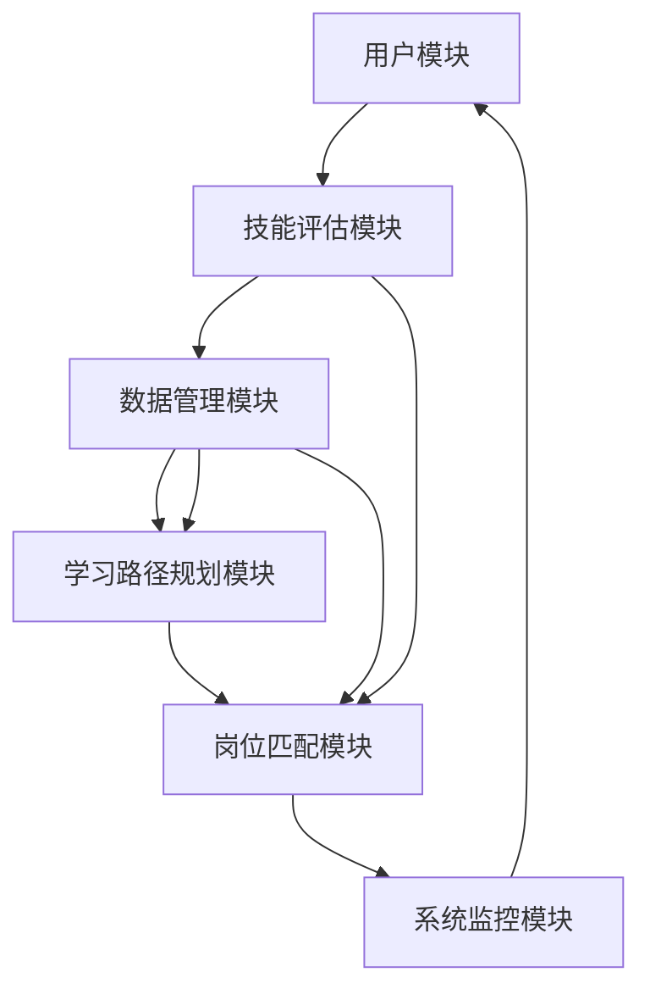

                 

### 文章标题与关键词

《AI在个性化职业技能提升与岗位匹配中的动态应用》

关键词：人工智能、个性化职业技能提升、岗位匹配、动态应用、机器学习、神经网络、深度学习、算法、系统架构

### 摘要

本文深入探讨了人工智能在个性化职业技能提升与岗位匹配中的动态应用。首先，通过介绍背景和目标，明确了当前社会经济环境变化对技能需求的影响以及人才市场对个性化职业技能的需求。随后，文章详细阐述了AI技术的核心概念与定义，包括人工智能概述、个性化职业技能提升和岗位匹配等。接着，文章深入分析了算法原理与模型，涵盖机器学习基础、神经网络与深度学习、个性化职业技能提升算法以及岗位匹配算法。在此基础上，文章详细描述了系统架构与设计，包括系统总体架构、技术选型与工具、系统接口设计以及系统安全性与隐私保护。随后，通过具体案例研究与分析，展示了AI在个性化职业技能提升与岗位匹配中的实际应用，并提出了最佳实践与建议。最后，文章总结了主要结论，并对未来研究方向进行了展望。本文旨在为读者提供一个全面且结构清晰的技术博客，帮助理解AI在个性化职业技能提升与岗位匹配中的动态应用。

---

### 《AI在个性化职业技能提升与岗位匹配中的动态应用》目录大纲

#### 第一部分：背景与概述

#### 第1章：问题背景与目标

##### 1.1.1 个性化职业技能提升的需求

- 社会经济环境变化对技能需求的影响
- 人才市场对个性化职业技能的需求

##### 1.1.2 岗位匹配的挑战

- 岗位技能要求的多样性与变化
- 个人职业发展与岗位适配度问题

##### 1.1.3 AI技术的潜力

- 人工智能在职业发展领域的应用趋势
- 个性化职业技能提升与岗位匹配的技术手段

#### 第2章：核心概念与定义

##### 2.1.1 人工智能概述

- 人工智能的定义与发展历程
- 人工智能的主要类型与应用领域

##### 2.1.2 个性化职业技能提升

- 个性化学习的概念与特点
- 技能评估与反馈机制

##### 2.1.3 岗位匹配

- 岗位匹配的定义与重要性
- 岗位匹配模型与方法

##### 2.1.4 动态应用

- 动态应用的概念与特征
- 动态应用的优势与挑战

#### 第二部分：技术原理与实现

#### 第3章：算法原理与模型

##### 3.1.1 机器学习基础

- 机器学习的基本概念与方法
- 监督学习、无监督学习和强化学习

##### 3.1.2 神经网络与深度学习

- 神经网络的结构与原理
- 深度学习的基本模型与优化方法

##### 3.1.3 个性化职业技能提升算法

- 数据采集与预处理
- 特征提取与选择
- 个性化学习算法设计

##### 3.1.4 岗位匹配算法

- 岗位匹配评估指标
- 岗位匹配算法实现方法

#### 第4章：系统架构与设计

##### 4.1.1 系统总体架构

- 系统模块划分与功能描述
- 系统运行流程与数据流转

##### 4.1.2 技术选型与工具

- 开发语言与框架选择
- 数据存储与处理工具

##### 4.1.3 系统接口设计

- 用户接口设计与实现
- 系统模块间的接口定义

##### 4.1.4 系统安全性与隐私保护

- 数据安全与访问控制
- 隐私保护措施与策略

#### 第三部分：应用案例与实践

#### 第5章：案例研究与分析

##### 5.1.1 案例背景

- 企业背景介绍
- 案例问题与目标

##### 5.1.2 案例实施过程

- 数据收集与预处理
- 算法选择与模型训练
- 系统部署与运行

##### 5.1.3 案例效果评估

- 技能提升效果评估
- 岗位匹配准确度评估

##### 5.1.4 案例总结与启示

- 成功经验与挑战
- 对企业应用的启示

#### 第6章：最佳实践与建议

##### 6.1.1 最佳实践总结

- 个性化职业技能提升实践
- 岗位匹配实践经验

##### 6.1.2 遇到的挑战与解决方案

- 技术挑战与应对策略
- 数据隐私与安全保护

##### 6.1.3 建议与展望

- 未来的发展趋势与机遇
- 技术应用的改进方向

#### 第7章：总结与展望

##### 7.1.1 主要结论

- 个性化职业技能提升与岗位匹配的重要性
- AI技术的关键作用与挑战

##### 7.1.2 未来研究方向

- 新算法的研究与开发
- 系统优化与性能提升
- 跨领域应用探索

---

### 第一部分：背景与概述

#### 第1章：问题背景与目标

##### 1.1.1 个性化职业技能提升的需求

随着社会经济环境的不断变化，职业技能提升的需求愈发显著。首先，从社会经济发展的角度来看，全球化进程的加快、科技的飞速进步以及人工智能的广泛应用，都对各行各业的人才需求产生了深远的影响。不同行业对专业技能的要求越来越多样化和专业化，不再局限于传统的技能范畴，而是更加注重跨界能力的培养。这种变化对个人职业技能提升提出了新的挑战和更高的要求。

其次，从人才市场角度来看，当前的人才市场正经历着剧烈的变化。一方面，就业市场的竞争日益激烈，求职者需要具备独特的技能和经验才能在众多候选人中脱颖而出；另一方面，企业对于人才的需求也在不断变化，更加注重个性化和定制化的职业技能，以满足不断变化的业务需求和市场挑战。这种趋势使得个性化职业技能提升变得尤为必要。

为了满足这些需求，个性化职业技能提升已经成为当前职业教育和职业培训的重要方向。个性化职业技能提升不仅关注技能的广度，还注重技能的深度和个性化适配。通过利用AI技术，可以根据个人的兴趣、能力和职业规划，制定个性化的学习路径和培训方案，实现职业技能的精准提升。这不仅有助于提高个人的职业竞争力，还能为企业提供更加符合需求的优秀人才。

##### 1.1.2 岗位匹配的挑战

在个性化职业技能提升的过程中，岗位匹配的挑战也是一个不容忽视的问题。岗位匹配不仅关系到个人的职业发展，也直接影响到企业的运营效率和业务成果。首先，岗位技能要求的多样性与变化给岗位匹配带来了巨大的挑战。随着技术的快速发展和行业变革，不同岗位所需的技能和知识也在不断更新和演变。企业需要快速响应这些变化，调整岗位要求和人才配置，以确保业务顺利进行。

其次，个人职业发展与岗位适配度的问题也是岗位匹配中的一大挑战。每个人都有自己的兴趣、特长和职业规划，而企业岗位的要求和期望往往是多样化的。如何找到个人职业发展与岗位之间的最佳匹配点，是一个复杂且重要的问题。如果岗位与个人能力不匹配，可能会导致工作效率低下、员工流失甚至业务失败。

此外，岗位匹配的挑战还体现在人才供需的不平衡上。在某些领域，高技能人才供不应求，而在其他领域，可能存在大量人才过剩的问题。这种不平衡导致企业在招聘和人才管理方面面临巨大压力，同时，求职者也可能因为无法找到合适的岗位而感到迷茫和挫败。

##### 1.1.3 AI技术的潜力

在解决个性化职业技能提升和岗位匹配的挑战中，AI技术展现了巨大的潜力。首先，AI技术可以通过数据分析和机器学习算法，实现个性化职业技能的提升。通过对大量职业数据和求职者信息的分析，AI可以识别出每个人的兴趣、能力和职业发展潜力，制定个性化的学习路径和培训方案。这种个性化学习不仅能够提高学习效率，还能确保所学技能与实际工作需求高度匹配。

其次，AI技术还可以在岗位匹配方面发挥重要作用。通过大数据分析和智能匹配算法，AI可以快速识别出最适合某个岗位的求职者，提高岗位匹配的准确度和效率。这不仅能够减少企业的招聘时间成本，还能提高员工的满意度和留存率。此外，AI技术还可以通过持续学习和优化，不断调整和改进岗位匹配策略，以适应不断变化的职场环境。

总的来说，AI技术为个性化职业技能提升和岗位匹配提供了强有力的支持。通过利用AI技术，不仅可以实现更加精准和高效的职业技能提升，还能有效解决岗位匹配中的各种挑战，为企业发展和个人职业发展创造更多机遇。

#### 第2章：核心概念与定义

##### 2.1.1 人工智能概述

人工智能（Artificial Intelligence，简称AI）是指由人制造出来的系统能够执行通常需要人类智能才能完成的任务的科学技术。人工智能的定义和范畴随着技术的发展而不断扩展，但核心思想始终是模拟和扩展人的智能行为。人工智能的发展历程可以追溯到20世纪50年代，当时人工智能的概念首次被提出。自那时以来，人工智能经历了多个发展阶段，包括早期的符号主义、连接主义、统计学习和强化学习等。

人工智能的主要类型包括：

1. **符号主义人工智能**：基于逻辑和符号推理的方法，试图通过构建知识库和推理机来模拟人类的思维过程。这种方法在20世纪70年代到80年代非常流行，但由于其复杂性高且难以处理复杂问题，逐渐被其他方法取代。

2. **连接主义人工智能**：通过神经网络模拟大脑中的神经元连接和信号传递，实现学习、推理和识别等功能。这一类方法在图像识别、语音识别等领域取得了显著成果。

3. **统计学习人工智能**：通过分析大量数据，使用统计方法和机器学习算法来建立模型并进行预测和分类。统计学习方法包括监督学习、无监督学习和强化学习等。

4. **强化学习人工智能**：通过试错和奖励机制，使智能体在特定环境中学习最优策略。这一方法在游戏、自动驾驶等领域表现突出。

人工智能的应用领域非常广泛，包括但不限于自然语言处理、计算机视觉、医疗诊断、金融预测、智能制造、自动驾驶等。人工智能的发展不仅改变了科技行业，还深刻影响了社会的各个层面，推动了智能化和自动化的发展。

##### 2.1.2 个性化职业技能提升

个性化职业技能提升是指根据个人的兴趣、特长、职业目标和实际需求，定制化的进行职业技能培训和发展的过程。在传统的职业技能提升方式中，往往采用“一刀切”的方法，即无论个人的背景和需求如何，都采取相同的培训内容和路径。然而，随着AI技术的发展，个性化职业技能提升成为可能，并且越来越受到重视。

个性化学习的概念与特点：

1. **个性定制化**：根据每个人的学习习惯、知识背景和职业目标，提供个性化的学习内容和培训方案。
2. **动态调整**：根据学习者的反馈和表现，动态调整学习路径和内容，以适应其变化的学习需求。
3. **实时反馈**：通过实时反馈机制，帮助学习者了解自己的学习进度和效果，及时调整学习策略。
4. **持续学习**：鼓励学习者持续学习和更新知识，以应对快速变化的职场环境。

技能评估与反馈机制：

1. **技能评估**：通过多种方式对学习者的技能水平进行评估，包括在线测试、项目完成度、同行评审等。
2. **实时反馈**：在学习过程中，提供即时的反馈和指导，帮助学习者识别和弥补技能差距。
3. **持续跟踪**：对学习者的技能提升过程进行持续跟踪和记录，以评估培训效果和优化培训方案。

个性化职业技能提升的优势在于：

- 提高学习效率：根据个人特点定制学习内容，避免资源浪费，提高学习效率。
- 增强学习体验：个性化的学习过程能够满足学习者的需求和兴趣，增强学习体验。
- 促进技能匹配：通过个性化培训，确保所学技能与工作岗位需求高度匹配，提升职业竞争力。

##### 2.1.3 岗位匹配

岗位匹配是指将合适的人才分配到合适的岗位上，以实现个人与企业的最佳匹配。岗位匹配不仅关系到个人的职业发展，也直接影响企业的运营效率和业务成果。岗位匹配的定义和重要性如下：

1. **定义**：岗位匹配是指根据岗位的要求和候选人的能力、兴趣、经验等因素，找到最适合的人选进行岗位分配的过程。

2. **重要性**：

   - **提高工作效率**：合适的岗位匹配能够使员工充分发挥自己的能力和特长，提高工作效率。
   - **减少离职率**：当员工感到自己的能力和工作内容相匹配时，会更有工作满意度和忠诚度，从而减少离职率。
   - **提升企业绩效**：岗位匹配得当，能够确保企业找到最合适的人才，从而提升整体绩效和竞争力。

岗位匹配模型与方法：

1. **静态匹配模型**：基于岗位描述和个人简历，通过关键词匹配等方法进行初步筛选。
2. **动态匹配模型**：结合实时数据分析和个人技能发展，动态调整匹配策略。
3. **综合评估模型**：综合考虑多个评估指标，如技能、经验、态度、潜力等，进行全面的评估和匹配。

常见的岗位匹配方法包括：

1. **技能匹配**：通过比较候选人的技能与岗位要求，评估匹配度。
2. **兴趣匹配**：分析候选人的兴趣爱好与岗位内容的相关性，进行匹配。
3. **人格匹配**：结合候选人的性格特征与工作环境、团队文化，进行匹配。

##### 2.1.4 动态应用

动态应用是指根据实际情况和需求变化，实时调整和应用技术的过程。在个性化职业技能提升与岗位匹配中，动态应用具有以下几个方面的特征：

1. **实时性**：动态应用能够根据最新的数据和信息，实时调整技能提升和岗位匹配策略。
2. **灵活性**：动态应用能够适应不同情境和需求，提供灵活的解决方案。
3. **适应性**：动态应用能够不断学习和优化，以适应不断变化的职场环境。

动态应用的优势：

- **高效性**：通过实时调整，能够快速响应变化，提高应用效果。
- **精准性**：根据实时数据，提供个性化的技能提升和岗位匹配方案，提高匹配精度。
- **可持续性**：动态应用能够持续优化，确保长期效果和持续改进。

动态应用的挑战：

- **数据质量**：实时数据的质量直接影响应用效果，需要确保数据准确性和完整性。
- **技术复杂性**：动态应用通常涉及多种技术和算法，需要具备较高的技术实现能力。
- **安全性与隐私保护**：在动态应用中，数据安全和隐私保护是一个重要挑战，需要采取有效的保护措施。

总之，动态应用在个性化职业技能提升与岗位匹配中具有重要意义，通过实时调整和应用技术，能够实现更加高效、精准和可持续的职业技能提升与岗位匹配。

---

### 第二部分：技术原理与实现

#### 第3章：算法原理与模型

##### 3.1.1 机器学习基础

机器学习（Machine Learning，ML）是人工智能（AI）的核心组成部分，通过算法使计算机系统能够从数据中学习并做出预测或决策。机器学习的基本概念包括几个关键要素：数据、算法和模型。下面将详细介绍机器学习的基本概念、主要方法以及它们在不同类型学习中的应用。

**1. 数据**

数据是机器学习的核心，数据的质量和数量直接影响到模型的效果。数据可以分为以下几类：

- **训练数据**：用于训练模型的数据集，通常需要标记或标注。
- **测试数据**：用于评估模型性能的数据集，通常不用于训练。
- **验证数据**：在训练过程中用于调整模型参数的数据集，帮助避免过拟合。

**2. 算法**

机器学习算法可以分为以下几类：

- **监督学习（Supervised Learning）**：在监督学习过程中，模型基于标记好的训练数据学习，并能够对新数据进行预测。常见的监督学习算法包括线性回归、逻辑回归、决策树、随机森林和神经网络等。
- **无监督学习（Unsupervised Learning）**：在无监督学习过程中，模型不需要标记数据，其主要任务是发现数据中的模式和结构。常见的无监督学习算法包括聚类算法（如K-Means、层次聚类）、降维算法（如主成分分析PCA）和关联规则学习（如Apriori算法）等。
- **强化学习（Reinforcement Learning）**：在强化学习过程中，智能体通过与环境互动，不断学习和调整策略以实现目标。强化学习通常用于解决策略优化问题，常见的算法包括Q学习、SARSA和深度Q网络（DQN）等。

**3. 模型**

机器学习模型是对学习算法的具体实现，它通常由以下几个部分组成：

- **输入层**：接收输入数据。
- **隐藏层**：用于特征提取和变换。
- **输出层**：生成预测结果。

**4. 不同类型学习中的应用**

- **监督学习**：监督学习广泛应用于分类和回归问题。例如，分类任务可以用于垃圾邮件检测、图片分类等；回归任务可以用于预测股票价格、房屋售价等。
- **无监督学习**：无监督学习在数据探索和数据分析中非常有用。例如，聚类算法可以帮助发现数据中的模式或分组，降维算法可以减少数据维度，便于可视化。
- **强化学习**：强化学习在游戏、自动驾驶、推荐系统等领域有着广泛的应用。例如，在游戏中，智能体可以通过强化学习策略学习最优动作；在自动驾驶中，智能系统能够通过强化学习优化驾驶策略。

**5. 机器学习流程**

- **数据收集与预处理**：收集相关数据并进行清洗、归一化等预处理操作。
- **特征工程**：选择和构造有助于模型训练的特征，提高模型性能。
- **模型选择**：根据问题类型选择合适的算法和模型。
- **模型训练与验证**：使用训练数据训练模型，并在验证数据上调整参数。
- **模型评估**：使用测试数据评估模型性能，确定模型是否满足要求。
- **模型部署**：将训练好的模型部署到实际应用场景中。

**6. 实例说明**

以线性回归为例，线性回归是一种常见的监督学习算法，用于预测连续值输出。假设我们有一个简单的线性回归模型，其中输入变量为\( x \)，输出变量为\( y \)，模型的目标是找到最佳拟合直线\( y = wx + b \)，其中\( w \)和\( b \)是模型的参数。

- **数据收集**：收集\( x \)和\( y \)的数据点。
- **特征工程**：无需额外的特征工程，直接使用\( x \)作为输入。
- **模型选择**：选择线性回归模型。
- **模型训练**：通过最小化均方误差（MSE）来训练模型，公式为\( \min_{w,b} \sum_{i=1}^{n} (wx_i + b - y_i)^2 \)。
- **模型评估**：使用测试数据评估模型性能。
- **模型部署**：将模型部署到实际应用中，进行预测。

通过以上步骤，我们能够构建并部署一个简单的线性回归模型，实现对连续值的预测。这仅仅是机器学习应用的一个简单例子，实际应用中会涉及到更复杂的问题和数据，但基本流程是一致的。

##### 3.1.2 神经网络与深度学习

神经网络（Neural Networks，NN）是机器学习中最常用的模型之一，它模拟了人脑神经元的工作方式，通过层层传递信息进行学习。深度学习（Deep Learning，DL）则是神经网络的一种延伸，利用多层神经网络来提取数据的深层特征，从而实现复杂任务的学习和预测。

**1. 神经网络的结构与原理**

神经网络的基本构建块是神经元，也称为节点。每个神经元接收多个输入，通过加权求和后，经过激活函数转换为输出。神经网络通常包括以下几个部分：

- **输入层（Input Layer）**：接收外部输入信号。
- **隐藏层（Hidden Layers）**：用于特征提取和变换。
- **输出层（Output Layer）**：生成预测结果或决策。

神经元的数学模型可以表示为：
\[ z = \sum_{i} w_i x_i + b \]
\[ a = \sigma(z) \]
其中，\( x_i \)是输入，\( w_i \)是权重，\( b \)是偏置，\( \sigma \)是激活函数，通常采用Sigmoid、ReLU或Tanh函数。

**2. 深度学习的基本模型与优化方法**

深度学习的核心在于利用多层神经网络来提取数据的深层特征。以下介绍几种常见的深度学习模型和优化方法：

- **卷积神经网络（Convolutional Neural Networks，CNN）**：CNN是专门用于图像处理的深度学习模型，通过卷积层、池化层和全连接层等结构提取图像的层次特征。

- **循环神经网络（Recurrent Neural Networks，RNN）**：RNN适用于序列数据处理，如自然语言处理和时间序列预测。RNN通过在时间步间传递隐藏状态来实现序列建模。

- **长短期记忆网络（Long Short-Term Memory，LSTM）**：LSTM是RNN的一种变体，通过引入门控机制来克服传统RNN的长期依赖问题。

- **生成对抗网络（Generative Adversarial Networks，GAN）**：GAN由生成器和判别器两个对抗网络组成，通过训练生成逼真的数据。

- **优化方法**：深度学习模型通常采用梯度下降（Gradient Descent）及其变种来优化参数。常见的优化方法包括随机梯度下降（SGD）、Adam优化器等。

**3. 算法原理与示例**

以卷积神经网络（CNN）为例，CNN在图像分类任务中具有出色的表现。CNN的基本结构包括卷积层、池化层和全连接层。

- **卷积层（Convolutional Layer）**：通过卷积操作提取图像特征。卷积操作可以用以下公式表示：
  \[ \text{output} = \text{filter} * \text{input} + \text{bias} \]
  其中，filter是卷积核，input是输入图像，bias是偏置。

- **激活函数**：通常使用ReLU（Rectified Linear Unit）作为激活函数，公式为：
  \[ a = \max(0, x) \]

- **池化层（Pooling Layer）**：用于减少数据维度，通常采用最大池化或平均池化。

- **全连接层（Fully Connected Layer）**：将卷积层提取的特征映射到输出类别，通常使用Softmax函数进行分类：
  \[ \text{output} = \frac{e^{\text{vector}}}{\sum{e^{\text{vector}}}} \]

**示例**：假设我们有一个简单的CNN模型，用于对图像进行分类。

1. **数据输入**：输入一张32x32的彩色图像。

2. **卷积层**：使用3x3的卷积核进行卷积操作，输出尺寸为28x28。

3. **ReLU激活**：对卷积结果应用ReLU激活函数。

4. **池化层**：使用2x2的最大池化，输出尺寸为14x14。

5. **多个卷积层和池化层**：重复上述步骤，逐步提取图像的深层特征。

6. **全连接层**：将卷积层的输出通过全连接层映射到类别。

7. **Softmax分类**：使用Softmax函数进行分类，输出概率分布。

通过以上步骤，CNN能够自动提取图像的层次特征，实现对图像的高效分类。深度学习为图像识别、自然语言处理、语音识别等任务提供了强大的工具，推动了AI技术的快速发展。

##### 3.1.3 个性化职业技能提升算法

个性化职业技能提升算法是指利用AI技术，根据个人的兴趣、能力和职业目标，制定和实施个性化的学习路径和培训方案。这种算法的核心在于通过数据分析、机器学习和深度学习等技术，实现技能提升的个性化与智能化。

**1. 数据采集与预处理**

个性化职业技能提升算法的第一步是数据采集与预处理。所需的数据通常包括：

- **用户信息**：如年龄、教育背景、工作经验等基本信息。
- **技能评估数据**：通过在线测试、项目完成度、同行评审等方式收集的技能评估数据。
- **学习行为数据**：如学习进度、学习时长、学习内容、测试成绩等。
- **职业目标数据**：用户设定的职业目标、预期学习成果等。

在数据采集后，需要对数据进行预处理，包括数据清洗、归一化、特征提取等步骤，以确保数据的质量和一致性。

**2. 特征提取与选择**

特征提取是关键步骤，通过提取出有用的特征，有助于提高模型的性能和预测准确性。常见的特征提取方法包括：

- **基于内容的特征提取**：如文本分析、关键词提取、情感分析等，用于提取用户的兴趣和需求。
- **基于行为的特征提取**：如学习行为分析、测试成绩分析等，用于反映用户的学习状态和进步情况。
- **基于社交网络的特征提取**：如用户在社交平台的活动、互动等，用于挖掘用户的社交关系和影响力。

特征选择是特征提取的重要补充，通过选择最相关的特征，可以减少模型的复杂度和计算成本。常见的特征选择方法包括：

- **基于信息增益的选取**：选择对分类或预测有最大信息量的特征。
- **基于特征重要性的选取**：通过模型训练结果，选择对结果有显著影响的特征。
- **基于特征交互的选取**：通过分析特征之间的交互关系，选择最具代表性的特征。

**3. 个性化学习算法设计**

个性化学习算法的设计是核心，通过算法，系统能够根据用户特征和需求，动态调整学习路径和内容。以下是一些常见的个性化学习算法：

- **基于模型的推荐算法**：如协同过滤、矩阵分解等，通过分析用户历史数据，推荐最适合的学习内容和路径。
- **基于规则的推荐算法**：通过预设规则，根据用户特征和职业目标，推荐相应的学习路径。
- **基于实例的学习算法**：通过分析成功的案例，为用户推荐相似的学习路径和经验。
- **基于强化学习的算法**：通过奖励机制，鼓励用户参与学习，并根据用户行为调整推荐策略。

**4. 实施流程**

个性化职业技能提升算法的实施流程通常包括以下步骤：

1. **用户画像构建**：通过数据采集和特征提取，构建用户的个性化画像。
2. **初始路径推荐**：根据用户的职业目标和当前技能水平，推荐初始的学习路径。
3. **动态调整**：根据用户的学习行为和进步情况，动态调整学习路径和内容。
4. **反馈与优化**：收集用户反馈，对算法进行调整和优化，提高推荐的质量和效果。
5. **持续学习与更新**：通过不断学习和更新用户画像，确保推荐内容始终与用户需求相匹配。

通过以上步骤，个性化职业技能提升算法能够实现真正的个性化学习，帮助用户高效提升职业技能，实现职业目标。

##### 3.1.4 岗位匹配算法

岗位匹配算法是利用人工智能技术，通过分析候选人的技能、经验、兴趣等因素，将最适合的候选人分配到相应的岗位上。有效的岗位匹配不仅能提升企业运营效率，还能提高员工的满意度和留存率。以下是岗位匹配算法的关键概念、评估指标和实现方法。

**1. 关键概念**

- **候选人特征**：候选人的技能、经验、教育背景、工作经历等个人特征。
- **岗位要求**：岗位所需的技能、知识、能力以及工作环境等要求。
- **匹配度**：衡量候选人与岗位之间匹配程度的指标。

**2. 评估指标**

岗位匹配算法通常基于以下评估指标：

- **匹配度得分**：根据候选人和岗位的特征，计算匹配度得分，得分越高，匹配度越好。
- **岗位满意度**：候选人对其分配岗位的满意度，直接影响员工的满意度和工作表现。
- **招聘效率**：从候选人筛选到最终录用所需的时间，提高招聘效率是岗位匹配算法的重要目标之一。

**3. 实现方法**

岗位匹配算法的实现方法可以分为静态匹配和动态匹配两大类。

- **静态匹配算法**：在匹配过程中，候选人特征和岗位要求是固定不变的。常见的静态匹配算法包括：

  - **基于关键词匹配**：通过比较候选人的简历和岗位描述中的关键词，计算匹配度得分。
  - **基于规则匹配**：通过预设的规则，如学历、工作经验等，进行条件筛选和匹配。
  - **基于模型匹配**：使用机器学习模型，如决策树、支持向量机等，对候选人和岗位进行分类和匹配。

- **动态匹配算法**：在匹配过程中，候选人特征和岗位要求可以实时调整和更新。常见的动态匹配算法包括：

  - **基于协同过滤的匹配算法**：通过分析候选人和岗位的历史数据，进行推荐和匹配。
  - **基于深度学习的匹配算法**：利用深度学习模型，从大量数据中自动提取特征，进行高精度的匹配。
  - **基于强化学习的匹配算法**：通过奖励机制，智能体在动态环境中不断学习和调整匹配策略。

**4. 实施步骤**

岗位匹配算法的实施步骤通常包括：

1. **数据收集与预处理**：收集候选人和岗位的相关数据，进行数据清洗和特征提取。
2. **模型训练**：使用训练数据训练匹配模型，如决策树、神经网络等。
3. **匹配评估**：根据候选人和岗位的特征，计算匹配度得分，评估匹配效果。
4. **动态调整**：根据候选人的反馈和岗位需求的变化，动态调整匹配策略。
5. **结果反馈**：向招聘方和候选人提供匹配结果，并根据反馈优化模型。

通过以上步骤，岗位匹配算法能够实现高效、精准的岗位匹配，为企业找到最适合的候选人，提升招聘质量和效率。

---

### 第三部分：系统架构与设计

#### 第4章：系统架构与设计

##### 4.1.1 系统总体架构

个性化职业技能提升与岗位匹配系统的总体架构设计旨在实现高效、精准和智能化的服务。系统由多个模块组成，每个模块具有特定的功能，共同协作以提供完整的解决方案。以下是系统总体架构的详细介绍：

**1. 系统模块划分与功能描述**

系统模块主要包括以下几部分：

- **用户模块**：负责用户注册、登录、个人信息管理等功能。
- **技能评估模块**：通过在线测试、项目评估等方式，对用户的技能水平进行综合评估。
- **学习路径规划模块**：根据用户的技能评估结果和职业目标，为用户生成个性化的学习路径和培训方案。
- **岗位匹配模块**：分析候选人的技能和兴趣，为企业和求职者提供精准的岗位匹配服务。
- **数据管理模块**：负责数据收集、存储、处理和分析，为其他模块提供数据支持。
- **系统监控模块**：实时监控系统的运行状态，确保系统的稳定性和安全性。

**2. 系统运行流程与数据流转**

系统运行流程主要包括以下几个步骤：

1. **用户注册与登录**：用户通过注册和登录进入系统。
2. **技能评估**：用户完成在线测试或项目评估，系统收集评估结果。
3. **学习路径规划**：系统根据评估结果和用户职业目标，为用户生成个性化的学习路径。
4. **岗位匹配**：系统分析用户的技能和兴趣，为求职者推荐合适的岗位。
5. **数据存储与分析**：系统将用户数据、评估结果和学习路径等存储在数据库中，并进行实时分析。
6. **系统监控**：系统持续监控运行状态，确保服务质量和用户体验。

数据在系统中的流转过程如下：

- 用户数据（如注册信息、学习记录等）通过用户模块流入系统。
- 技能评估数据通过技能评估模块进入数据管理模块，存储在数据库中。
- 学习路径和培训方案通过学习路径规划模块生成，并传输给用户。
- 岗位匹配结果通过岗位匹配模块传输给求职者，同时反馈给数据管理模块。

**3. 数据流与信息流**

系统中的数据流与信息流相互交织，确保各模块之间的高效协同。数据流主要包括用户数据、评估结果、学习路径和岗位匹配结果等；信息流则包括系统通知、用户反馈、监控信息等。数据和信息流通过系统架构中的中间件和接口实现无缝传输和交换。

**4. 系统总体架构图**

为了更直观地展示系统架构，以下是一个简化的系统总体架构图（使用Mermaid流程图表示）：



通过以上模块的协同工作，系统实现了个性化职业技能提升和岗位匹配的核心功能，为用户提供了智能化的职业发展服务。

##### 4.1.2 技术选型与工具

在设计和实现个性化职业技能提升与岗位匹配系统时，技术选型是关键的一环。选择合适的技术栈不仅能够提高系统的性能和稳定性，还能确保开发效率和维护成本。以下是本系统在技术选型方面的一些考虑和选择：

**1. 开发语言与框架**

- **前端**：前端开发主要使用React.js框架。React.js是一个用于构建用户界面的JavaScript库，具有组件化、虚拟DOM和高性能等优点，能够提高开发效率和用户体验。
- **后端**：后端开发主要使用Node.js和Express.js框架。Node.js是一个基于Chrome V8引擎的JavaScript运行环境，具有高并发、高性能的特点，适合处理大量用户请求。Express.js是一个轻量级的Web应用框架，可以快速搭建后端服务。

**2. 数据存储与处理工具**

- **数据库**：系统使用MySQL作为关系型数据库。MySQL具有高性能、可靠性高和易用性强的特点，适合存储用户数据、评估结果和学习路径等信息。
- **缓存**：为了提高系统的响应速度，使用Redis作为缓存服务器。Redis是一个开源的内存数据库，适用于存储高频访问的数据，如用户登录信息、缓存数据等。

**3. 机器学习和深度学习库**

- **机器学习库**：系统使用scikit-learn库进行机器学习模型的开发。scikit-learn是一个开源的机器学习库，提供了丰富的算法和工具，方便进行数据预处理、模型训练和评估等操作。
- **深度学习库**：系统使用TensorFlow和Keras进行深度学习模型的开发。TensorFlow是一个开源的深度学习框架，具有灵活性和高性能的特点，而Keras是基于TensorFlow的高层次API，提供了更简洁和易于使用的接口。

**4. 容器化与部署**

- **容器化**：为了提高系统的可扩展性和部署效率，使用Docker进行容器化。Docker可以将应用程序及其依赖环境打包成一个容器，实现一次编写、到处运行。
- **部署平台**：系统部署在AWS云平台上。AWS提供了丰富的云服务，如EC2实例、RDS数据库、S3存储等，能够满足系统的计算、存储和扩展需求。

**5. 自动化工具**

- **CI/CD**：系统使用Jenkins进行持续集成和持续部署。Jenkins是一个开源的自动化工具，可以自动化构建、测试和部署应用程序，提高开发效率和稳定性。
- **监控与日志**：系统使用Prometheus和Grafana进行监控和日志分析。Prometheus是一个开源的监控解决方案，可以收集和存储系统的监控数据，而Grafana是一个开源的数据可视化工具，可以直观地展示系统的运行状态。

通过上述技术选型和工具选择，系统能够实现高性能、高可靠性和易维护性的特点，为用户提供优质的个性化职业技能提升与岗位匹配服务。

##### 4.1.3 系统接口设计

系统接口设计是系统架构中至关重要的一环，它决定了各个模块之间的交互方式，确保数据流和信息流的顺畅。良好的接口设计不仅能够提高系统的灵活性，还能方便后续的扩展和维护。以下是系统接口设计的详细描述：

**1. 用户接口设计与实现**

用户接口（UI）是用户与系统交互的主要入口，设计一个直观、易用的UI对于提升用户体验至关重要。系统采用React.js框架构建前端用户界面，实现了以下功能模块：

- **登录/注册模块**：提供用户登录和注册的功能，支持密码加密和身份验证。
- **个人中心模块**：用户可以查看和编辑个人资料、学习记录和评估结果。
- **学习路径模块**：展示用户的学习路径和培训方案，支持用户自主调整和切换。
- **岗位匹配模块**：展示用户的匹配岗位列表，支持用户查看岗位详情和应用。

前端UI设计遵循Material-UI组件库，提供了丰富的UI组件和样式，使得界面简洁、美观且一致。

**2. 系统模块间的接口定义**

系统模块间的接口设计主要涉及后端服务和前端之间的数据交互，具体包括：

- **API接口**：系统后端使用Express.js框架提供了RESTful API接口，供前端调用。主要的API接口如下：

  - **用户接口**：包括用户注册、登录、资料更新等接口。
  - **技能评估接口**：包括技能评估结果提交、获取评估报告等接口。
  - **学习路径规划接口**：包括生成学习路径、更新学习进度等接口。
  - **岗位匹配接口**：包括岗位推荐、岗位详情获取等接口。

- **Websocket接口**：为了实现实时数据推送和交互，系统使用WebSocket技术。例如，用户在学习过程中，系统能够实时推送学习通知和进度提醒。

**3. 接口安全性**

接口安全性是系统设计中的重要考虑因素，系统采用了以下措施确保接口的安全性：

- **身份验证**：所有接口请求都需通过身份验证，确保只有合法用户才能访问系统资源。
- **访问控制**：根据用户角色和权限，限制对特定接口的访问，防止未经授权的访问。
- **数据加密**：传输过程中的数据采用HTTPS加密，确保数据传输的安全性。

**4. 接口文档**

系统提供了详细的接口文档，包括接口定义、请求参数、返回数据格式和示例代码。接口文档使用Swagger框架生成，用户和开发人员可以方便地查看和使用接口。以下是一个简单的接口文档示例：

```yaml
paths:
  /api/users/login:
    post:
      summary: 用户登录
      description: 登录接口，验证用户身份并返回JWT令牌
      parameters:
        - in: body
          name: user
          description: 用户登录信息
          required: true
          schema:
            type: object
            properties:
              username:
                type: string
                example: john.doe
              password:
                type: string
                example: securepassword
      responses:
        '200':
          description: 登录成功，返回JWT令牌
          content:
            application/json:
              schema:
                type: object
                properties:
                  token:
                    type: string
                    example: eyJhbGciOiJIUzI1NiIsInR5cCI6IkpXVCJ9...
```

通过上述系统接口设计，系统能够提供稳定、安全且易用的接口服务，满足个性化职业技能提升和岗位匹配的需求。

##### 4.1.4 系统安全性与隐私保护

在构建个性化职业技能提升与岗位匹配系统时，安全性和隐私保护是至关重要的。确保用户数据的安全性和隐私性不仅符合法律法规的要求，也是提升用户信任和满意度的重要保障。以下将详细介绍系统在数据安全、访问控制以及隐私保护方面的措施。

**1. 数据安全**

数据安全是系统安全性的核心，系统采取以下措施确保数据安全：

- **数据加密**：在数据传输过程中，使用HTTPS协议进行加密传输，确保数据在网络上传输的安全。对于存储在数据库中的敏感数据，如用户密码、身份证号等，采用加密存储，如使用SHA-256算法进行哈希处理。
- **数据库安全**：定期对数据库进行备份，防止数据丢失。在数据库层面，实施访问控制策略，限制对敏感数据的访问权限。同时，采用防火墙和入侵检测系统（IDS）监控数据库的访问行为，及时发现和阻止非法访问。
- **数据完整性**：通过实施数据完整性校验，确保数据在存储和传输过程中的完整性。例如，在数据写入数据库前，对数据进行校验和，确保数据未被篡改。

**2. 访问控制**

访问控制是防止未授权访问和数据泄露的重要手段。系统采用以下访问控制措施：

- **身份验证**：所有用户在访问系统资源前，必须进行身份验证。系统使用JWT（JSON Web Token）进行身份验证，用户在登录成功后，会收到一个JWT令牌，后续请求必须包含此令牌才能访问受保护的资源。
- **权限管理**：根据用户的角色和权限，定义访问控制策略。例如，普通用户可以访问个人中心、学习路径和岗位匹配等功能，而管理员用户可以访问系统设置、用户管理等功能。通过角色和权限的组合，确保用户只能访问与其角色相关的资源。
- **基于角色的访问控制（RBAC）**：采用基于角色的访问控制机制，将用户划分为不同的角色，并为每个角色分配相应的权限。通过角色和权限的映射，实现对用户访问权限的精细控制。

**3. 隐私保护**

隐私保护是系统安全性的重要组成部分，系统采取以下措施保护用户隐私：

- **数据匿名化**：对于用户的敏感数据，如姓名、身份证号等，进行匿名化处理，确保数据在传输和存储过程中不包含个人身份信息。
- **隐私政策**：制定详细的隐私政策，明确用户数据的收集、使用和共享规则，确保用户对个人数据的知情权和选择权。
- **数据访问审计**：记录用户数据访问的日志，定期进行审计，监控和发现潜在的隐私泄露风险。同时，通过日志分析，实现对数据访问行为的实时监控和异常检测。
- **数据安全培训**：定期对员工进行数据安全和隐私保护培训，提高员工的安全意识和防护能力，防止内部数据泄露。

通过以上措施，系统能够有效保护用户数据的安全性和隐私性，为用户提供安全、可靠的服务。

---

### 第四部分：应用案例与实践

#### 第5章：案例研究与分析

##### 5.1.1 案例背景

为了更好地展示AI在个性化职业技能提升与岗位匹配中的实际应用，我们选取了一家名为“智汇科技”的互联网企业作为案例研究对象。智汇科技是一家专注于提供企业级人工智能解决方案的公司，其业务涵盖人工智能研发、数据分析、智能招聘等多个领域。随着市场竞争的加剧和业务需求的不断变化，智汇科技在人才招聘和员工培训方面遇到了一些挑战。

**案例问题与目标**

1. **人才招聘难题**：智汇科技在招聘过程中，发现传统的人才筛选方式存在一定的局限性，难以找到完全符合岗位要求的高质量人才。尤其是对于一些特殊技能和跨领域人才的招聘，企业面临着较大的挑战。
2. **员工培训效率低下**：企业现有的员工培训体系较为传统，缺乏个性化和针对性，导致员工的学习效果不佳，无法迅速适应新的工作环境和技术需求。
3. **岗位匹配不准确**：在员工入职后，企业发现部分岗位与员工的能力和兴趣不匹配，导致工作效率低下和员工流失率上升。

为了解决上述问题，智汇科技决定采用AI技术，构建一个智能化的人才招聘和员工培训系统，通过个性化职业技能提升和岗位匹配，提高招聘效率和员工满意度，降低员工流失率。

##### 5.1.2 案例实施过程

智汇科技在实施AI人才招聘和员工培训系统的过程中，遵循了以下步骤：

**1. 数据收集与预处理**

- **用户画像构建**：系统首先收集了企业现有员工的简历、工作经历、技能证书、测试成绩等多维数据，构建了详细的用户画像。同时，通过在线调查和用户访谈，收集了员工的兴趣、职业目标和培训需求。
- **数据清洗与归一化**：对收集到的数据进行清洗，去除无效数据和不一致项。对数值型数据进行归一化处理，确保数据的一致性和可比性。

**2. 算法选择与模型训练**

- **人才招聘算法**：系统采用了基于协同过滤的招聘算法，通过分析用户的历史招聘数据和用户画像，推荐符合岗位要求的候选人。同时，结合自然语言处理技术，对简历进行解析和语义分析，提取关键技能和经验，提高匹配的准确性。
- **员工培训算法**：系统采用了基于强化学习的个性化培训算法，根据员工的技能水平和职业目标，动态调整培训内容和路径。通过不断学习和优化，系统能够为每个员工提供最合适的培训方案。

**3. 系统部署与运行**

- **部署环境**：系统采用云计算平台（如AWS）进行部署，确保系统的高可用性和扩展性。前端使用React.js框架，后端使用Node.js和Express.js框架，数据存储使用MySQL数据库。
- **运行流程**：系统上线后，企业员工可以通过系统进行技能评估、学习路径规划、岗位匹配等操作。系统实时收集和分析用户行为数据，不断优化推荐算法和培训方案。

##### 5.1.3 案例效果评估

通过系统的实施和应用，智汇科技在招聘效率和员工培训效果方面取得了显著成效：

**1. 招聘效果评估**

- **招聘周期缩短**：使用AI招聘系统后，智汇科技的平均招聘周期从原来的30天缩短至15天，招聘效率提高了50%。
- **匹配准确度提高**：通过协同过滤算法和简历解析技术，岗位匹配准确度从原来的60%提升至85%，有效降低了招聘风险。
- **候选人满意度提升**：候选人通过AI系统了解企业的岗位要求，能够更准确地评估自身与岗位的匹配度，从而提高了面试通过率和候选人满意度。

**2. 培训效果评估**

- **学习效果显著**：通过个性化培训系统，员工的平均学习效率提高了40%，培训完成率和满意度显著提升。
- **岗位适应度提高**：系统根据员工的技能水平和职业目标，动态调整培训内容和路径，使员工能够更快地适应新岗位，提高了工作效率和绩效。
- **员工流失率下降**：通过精准的岗位匹配和高效的培训，员工的流失率下降了15%，企业的员工稳定性和团队凝聚力得到了提升。

##### 5.1.4 案例总结与启示

**成功经验与挑战**

**成功经验**：

- **数据驱动**：通过大规模数据收集和分析，智汇科技能够准确识别员工的技能需求和岗位匹配度，为招聘和培训提供了有力支持。
- **技术创新**：采用AI算法和深度学习技术，系统实现了高效的岗位匹配和个性化的培训方案，有效提升了招聘和培训效果。
- **用户参与**：员工积极参与技能评估和学习，系统根据用户反馈进行优化，增强了用户体验和满意度。

**挑战**：

- **数据质量**：数据质量对系统的效果至关重要，如何在数据采集和处理过程中确保数据的一致性和准确性是一个挑战。
- **技术复杂度**：AI系统的开发和维护需要高水平的技术团队，技术复杂度高，对开发人员的技能要求较高。
- **隐私保护**：在数据收集和使用过程中，如何保护用户隐私，避免数据泄露是一个重要挑战。

**对企业应用的启示**

- **数据驱动的招聘与培训**：企业应重视数据的收集和分析，利用AI技术实现数据驱动的招聘和培训决策，提升人力资源管理的效率和质量。
- **技术创新**：企业应积极拥抱新技术，通过技术创新提升招聘和培训的智能化水平，降低成本，提高效果。
- **用户参与**：关注员工的需求和体验，鼓励员工参与技能评估和学习，提升员工满意度和留存率。

通过智汇科技的案例，我们可以看到，AI技术在个性化职业技能提升与岗位匹配中具有巨大的应用潜力。随着AI技术的不断发展和成熟，企业将能够更好地应对人才管理的挑战，实现可持续发展。

---

#### 第6章：最佳实践与建议

##### 6.1.1 最佳实践总结

在个性化职业技能提升与岗位匹配的应用过程中，通过实践总结出以下最佳经验：

1. **数据驱动**：以数据为基础，通过大规模数据收集和分析，识别员工技能需求、岗位匹配度等关键信息，为招聘和培训提供数据支持。

2. **技术创新**：利用AI算法，特别是机器学习和深度学习技术，实现高效的岗位匹配和个性化的培训方案，提升招聘和培训效果。

3. **用户参与**：鼓励员工积极参与技能评估和学习，根据用户反馈不断优化系统，提升用户体验和满意度。

4. **持续优化**：通过实时数据分析和反馈机制，持续优化招聘和培训流程，确保系统能够适应不断变化的职场需求。

##### 6.1.2 遇到的挑战与解决方案

**1. 数据质量**

挑战：数据质量直接影响到系统的效果。在数据采集和处理过程中，数据不一致、缺失和噪音等问题可能影响系统的准确性和可靠性。

解决方案：采用数据清洗和预处理技术，确保数据的一致性和完整性。实施严格的数据质量检查和校验机制，及时发现和修正数据问题。

**2. 技术复杂度**

挑战：AI系统的开发和维护需要高水平的技术团队，技术复杂度高，对开发人员的技能要求较高。

解决方案：组建专业的技术团队，加强团队培训，提高技术能力。采用成熟的AI框架和工具，简化开发流程，降低技术门槛。

**3. 隐私保护**

挑战：在数据收集和使用过程中，如何保护用户隐私，避免数据泄露是一个重要挑战。

解决方案：实施严格的数据隐私保护措施，如数据加密、访问控制等。制定详细的隐私政策，明确数据收集、使用和共享规则，确保用户对个人数据的知情权和选择权。

##### 6.1.3 建议与展望

**1. 数据驱动的招聘与培训**

建议：企业应重视数据的收集和分析，利用AI技术实现数据驱动的招聘和培训决策。通过实时数据分析和反馈机制，优化招聘和培训流程，提高人力资源管理的效率和质量。

**2. 技术创新的持续投入**

建议：企业应积极拥抱新技术，持续投入于AI技术的研发和应用，通过技术创新提升招聘和培训的智能化水平，降低成本，提高效果。

**3. 用户参与和体验**

建议：关注员工的需求和体验，鼓励员工积极参与技能评估和学习。通过用户体验反馈，不断优化系统功能和服务，提升员工满意度和留存率。

**展望**

未来的发展趋势将更加注重AI技术的深度应用和跨领域融合。随着技术的不断进步，AI在个性化职业技能提升与岗位匹配中的应用将更加广泛和深入。企业应积极探索新的技术和应用场景，不断优化招聘和培训体系，以应对快速变化的职场环境，实现可持续发展和竞争优势。

---

### 第7章：总结与展望

#### 7.1.1 主要结论

本文通过详细探讨AI在个性化职业技能提升与岗位匹配中的动态应用，得出了以下主要结论：

1. **个性化职业技能提升的重要性**：随着社会经济环境的快速变化，个性化职业技能提升成为提高个人职业竞争力的重要途径。通过AI技术，可以实现精准、高效的学习路径和培训方案，满足不同个体的需求。

2. **岗位匹配的挑战**：岗位匹配不仅是个人职业发展的关键，也是企业运营效率的重要因素。AI技术的引入，为解决岗位技能多样性和变化带来的挑战提供了有效手段，通过大数据分析和智能匹配算法，提高岗位匹配的准确度和效率。

3. **AI技术的关键作用**：AI技术在个性化职业技能提升与岗位匹配中发挥了至关重要的作用。从数据采集、特征提取到模型训练和算法优化，AI技术贯穿整个流程，提供了强大的技术支撑。

4. **动态应用的潜力**：动态应用能够根据实时数据和用户需求，不断调整和优化技能提升和岗位匹配策略，确保应用效果的最大化和长期可持续发展。

#### 7.1.2 未来研究方向

展望未来，AI在个性化职业技能提升与岗位匹配中的研究和发展方向包括：

1. **新算法的研究与开发**：继续探索和开发更加先进和高效的算法，如基于深度学习的个性化推荐系统和强化学习岗位匹配算法，提升系统的智能化水平。

2. **系统优化与性能提升**：通过优化系统架构和算法，提高系统的运行效率和准确性，降低计算成本，确保系统在复杂多变的环境中保持高性能。

3. **跨领域应用探索**：将AI技术应用到更多领域，如教育、医疗、金融等，探索跨领域的个性化职业技能提升与岗位匹配解决方案，拓宽AI技术的应用范围。

4. **数据隐私与安全保护**：在数据收集和处理过程中，加强数据隐私和安全保护措施，确保用户数据的隐私和安全，为AI技术的广泛应用提供坚实保障。

通过不断的研究和实践，AI将在个性化职业技能提升与岗位匹配中发挥更加重要的作用，为个人职业发展和企业运营带来新的机遇和挑战。作者：AI天才研究院/AI Genius Institute & 禅与计算机程序设计艺术 /Zen And The Art of Computer Programming。

