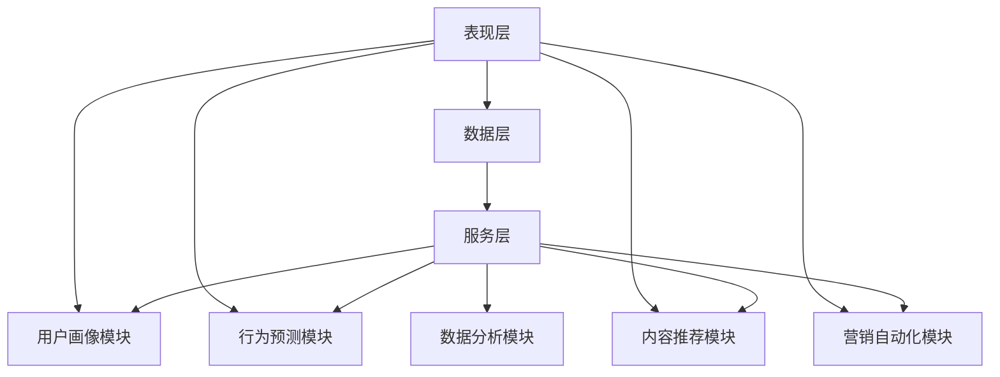
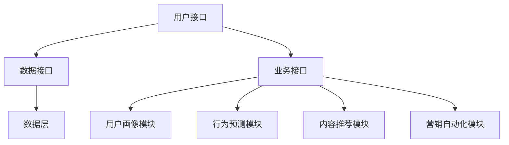
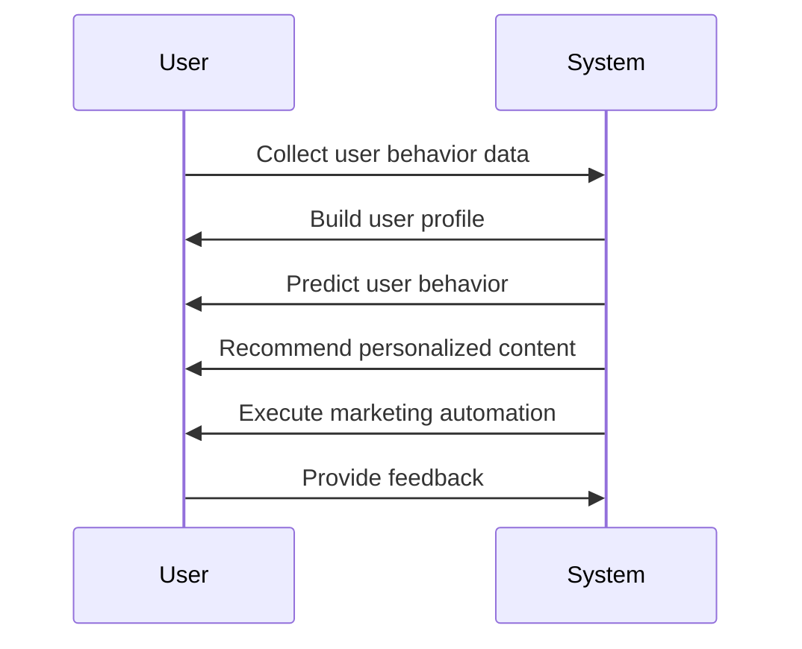

                 

### 文章标题：AI在个性化营销中的应用：精准触达与转化率提升

关键词：人工智能、个性化营销、精准触达、转化率、用户画像、机器学习、深度学习、大数据分析、推荐系统

摘要：本文将从背景介绍、核心概念、应用场景、算法原理、数学模型、系统设计与项目实战等多个角度，深入探讨AI在个性化营销中的应用，特别是如何通过精准触达和转化率的提升来实现营销效果的优化。

### 文章背景与核心概念

#### 1.1 个性化营销的定义与价值

个性化营销是指基于对消费者行为的分析，运用大数据和人工智能技术，为每个用户提供个性化的产品推荐、内容推送和服务，从而实现更高的营销转化率和用户满意度。在数字营销时代，个性化营销已成为企业获取竞争优势的关键手段。

个性化营销的价值主要体现在以下几个方面：

- **提高客户满意度**：通过精准的用户画像和个性化服务，满足不同消费者的需求，提升用户体验。
- **提升营销效率**：减少无效广告投放，提高广告精准度，降低营销成本。
- **增加销售收入**：通过个性化推荐和精准触达，提高用户购买转化率，增加销售收入。

#### 1.2 AI技术的快速发展与个性化营销的结合

人工智能技术的发展，特别是机器学习、深度学习等算法的进步，为个性化营销提供了强大的技术支撑。AI能够处理大量用户数据，发现隐藏在数据背后的用户偏好和需求，从而实现精准的个性化推荐。

AI在个性化营销中的应用主要包括：

- **用户行为分析**：通过分析用户的行为数据，构建用户画像，了解用户偏好和需求。
- **内容个性化推荐**：根据用户画像和兴趣，为用户提供个性化的内容推荐。
- **营销自动化**：利用AI技术实现营销流程的自动化，提高营销效率。

#### 1.3 个性化营销面临的挑战与机遇

个性化营销虽然具有显著的优势，但也面临着一些挑战：

- **数据隐私与安全**：个性化营销需要大量的用户数据，数据隐私和安全问题是企业必须重视的。
- **算法偏见**：如果算法设计不当，可能会导致算法偏见，影响个性化推荐的公正性。
- **技术门槛**：个性化营销需要较高的技术支持和人才储备，对企业的技术能力提出了更高要求。

然而，这些挑战同时也带来了机遇：

- **技术进步**：随着人工智能技术的不断发展，个性化营销的精度和效率将不断提高。
- **用户需求多样**：随着用户需求的不断变化，个性化营销将更加满足多样化的用户需求。
- **市场竞争**：在激烈的市场竞争中，个性化营销将成为企业脱颖而出的重要手段。

### 总结

个性化营销作为数字营销的重要方向，正在受到越来越多企业的关注。AI技术的快速发展，为个性化营销提供了强大的技术支撑。在未来的发展中，如何应对挑战，抓住机遇，实现个性化营销的精准触达和转化率提升，将是企业需要持续探索的问题。在接下来的章节中，我们将进一步探讨AI在个性化营销中的具体应用和实践。  

---

### 文章目录

#### 第一部分：AI在个性化营销中的背景与概述

- **第1章：问题背景与核心概念**
  - 1.1 个性化营销的定义与价值
  - 1.2 AI技术的快速发展与个性化营销的结合
  - 1.3 个性化营销面临的挑战与机遇

- **第2章：核心概念与联系**
  - 2.1 AI基本概念
    - 2.1.1 机器学习、深度学习与神经网络
    - 2.1.2 数据挖掘与大数据分析
  - 2.2 个性化营销相关概念
    - 2.2.1 用户画像
    - 2.2.2 用户行为分析
    - 2.2.3 营销自动化

- **第3章：AI在个性化营销中的应用场景**
  - 3.1 客户细分与市场细分
    - 3.1.1 客户细分策略
    - 3.1.2 市场细分策略
  - 3.2 内容个性化
    - 3.2.1 内容推荐系统
    - 3.2.2 智能文案生成
  - 3.3 营销自动化
    - 3.3.1 营销邮件个性化
    - 3.3.2 社交媒体自动化

#### 第二部分：AI算法原理讲解

- **第4章：AI算法原理讲解**
  - 4.1 决策树与随机森林
    - 4.1.1 决策树算法原理
    - 4.1.2 随机森林算法原理
  - 4.2 支持向量机（SVM）
    - 4.2.1 SVM算法原理
    - 4.2.2 SVM在个性化营销中的应用

#### 第三部分：数学模型与公式详解

- **第5章：数学模型与公式详解**
  - 5.1 个性化推荐算法的数学模型
    - 5.1.1 协同过滤算法
    - 5.1.2 基于内容的推荐算法
  - 5.2 用户行为预测模型
    - 5.2.1 时间序列分析
    - 5.2.2 序列模型与循环神经网络（RNN）

#### 第四部分：系统分析与架构设计

- **第6章：系统分析与架构设计**
  - 6.1 个性化营销系统的设计目标
  - 6.2 系统架构设计
  - 6.3 系统交互设计

#### 第五部分：项目实战

- **第7章：项目实战**
  - 7.1 环境安装与配置
  - 7.2 系统核心实现
  - 7.3 实际案例分析
  - 7.4 项目小结

#### 第六部分：最佳实践与拓展阅读

- **第8章：最佳实践与拓展阅读**
  - 8.1 最佳实践
  - 8.2 小结与展望

### 总结

通过本文的目录结构，我们可以清晰地看到，本文将从问题背景、核心概念、应用场景、算法原理、数学模型、系统设计与项目实战等多个角度，全面探讨AI在个性化营销中的应用。每个部分都将深入讲解，以帮助读者全面理解和掌握AI在个性化营销中的实际应用。接下来，我们将进入详细的内容讲解。  

---

### 个性化营销与AI技术的结合

在当今的数字化时代，个性化营销已经成为企业提升市场份额和用户忠诚度的重要手段。而AI技术的迅速发展为个性化营销提供了强大的技术支持，使得精准触达和提升转化率成为可能。本章节将详细探讨AI在个性化营销中的核心概念、基本原理以及如何实现精准触达和提升转化率。

#### 2.1 AI基本概念

AI（人工智能）是计算机科学的一个分支，旨在使计算机具备类似人类智能的能力，能够感知、理解、学习和决策。AI的核心技术包括机器学习、深度学习、自然语言处理等。在个性化营销中，这些技术发挥着关键作用。

- **机器学习**：机器学习是一种让计算机通过数据学习模式、预测结果的算法。在个性化营销中，机器学习用于分析用户行为数据，构建用户画像，进行精准推荐。

- **深度学习**：深度学习是机器学习的一个子领域，通过模拟人脑神经网络结构，实现复杂模式识别和数据处理。在个性化营销中，深度学习可用于图像识别、语音识别和自然语言处理等。

- **自然语言处理**：自然语言处理（NLP）是AI的一个分支，旨在使计算机理解和生成人类语言。在个性化营销中，NLP技术可用于情感分析、聊天机器人和个性化文案生成。

#### 2.2 个性化营销相关概念

个性化营销的成功依赖于对用户行为的深入理解和分析。以下是一些核心概念：

- **用户画像**：用户画像是对用户特征的综合描述，包括年龄、性别、地理位置、兴趣爱好、购买行为等。通过用户画像，企业可以了解用户需求，实现精准营销。

- **用户行为分析**：用户行为分析是通过对用户行为数据的收集、处理和分析，了解用户的行为模式、偏好和需求。用户行为分析是构建用户画像、实现个性化推荐的基础。

- **营销自动化**：营销自动化是指利用AI技术实现营销活动的自动化执行，包括邮件营销、社交媒体推广、广告投放等。营销自动化可以大大提高营销效率，降低人力成本。

#### 2.3 实现精准触达与转化率提升的AI技术

实现个性化营销的精准触达和转化率提升，需要综合运用多种AI技术：

- **用户行为预测**：通过机器学习和深度学习算法，对用户行为进行预测，提前识别潜在用户。例如，预测哪些用户可能在短期内进行购买。

- **内容个性化推荐**：利用协同过滤算法和基于内容的推荐算法，根据用户兴趣和行为，推荐个性化的产品或内容。例如，电商网站根据用户的浏览记录和购买历史推荐相关商品。

- **智能文案生成**：通过自然语言处理技术，自动生成针对特定用户需求的个性化文案。例如，邮件营销系统根据用户的兴趣和行为生成个性化的邮件内容。

- **营销自动化**：利用营销自动化工具，根据用户行为触发相应的营销活动。例如，当用户浏览某一商品时，自动发送相关优惠信息或推荐商品。

#### 2.4 案例分析

以电商网站为例，AI技术在个性化营销中的应用如下：

- **用户画像构建**：通过用户注册信息、购买历史、浏览行为等数据，构建用户画像。例如，某用户经常浏览手机和耳机，购买过电子书和运动装备。

- **内容个性化推荐**：基于用户画像，为该用户推荐相关的商品。例如，推荐新款手机、耳机配件、健身追踪器等。

- **智能文案生成**：当用户浏览某一商品时，系统自动生成个性化的推荐文案。例如，“你是否正在寻找一款新款手机？我们为您推荐了XXX，它是目前市场上最受欢迎的机型之一。”

- **营销自动化**：当用户在购物车中添加商品但未完成购买时，系统自动发送提醒邮件。例如，“您是否忘记购买XXX了？现在下单还有优惠哦！”

通过这些技术，电商网站可以实现精准触达和提升转化率，从而提高销售额和用户满意度。

#### 2.5 总结

个性化营销与AI技术的结合，为企业在激烈的市场竞争中提供了新的机遇。通过AI技术，企业可以更深入地了解用户需求，实现精准触达和个性化服务，从而提升营销效果和用户满意度。在未来的发展中，随着AI技术的不断进步，个性化营销将更加智能化和高效化。  

---

### AI在个性化营销中的应用场景

AI技术的快速发展，使得个性化营销在多个应用场景中展现出了强大的潜力。以下将详细讨论AI在客户细分与市场细分、内容个性化、营销自动化等具体应用场景中的实现方法与效果。

#### 3.1 客户细分与市场细分

客户细分与市场细分是个性化营销的基础，通过将客户和市场划分为不同的群体，企业可以针对不同群体制定更加精准的营销策略。

- **客户细分策略**：基于用户画像和行为数据，企业可以识别出具有相似特征的客户群体，例如高频购物者、低频购物者、新手用户等。对于不同群体，可以采取不同的营销策略。例如，对于高频购物者，可以提供会员优惠、积分奖励等；对于新手用户，可以提供新手教程、优惠引导等。

- **市场细分策略**：通过分析地理位置、经济水平、兴趣爱好等数据，企业可以将市场划分为不同的细分市场。例如，针对年轻女性市场，可以推出时尚服饰、化妆品等；针对中老年市场，可以推出保健品、家居用品等。通过市场细分，企业可以更精准地触达目标客户，提高营销效果。

#### 3.2 内容个性化

内容个性化是AI在个性化营销中的重要应用，通过分析用户兴趣和行为，为用户提供个性化的内容推荐，提升用户满意度和转化率。

- **内容推荐系统**：基于协同过滤算法和基于内容的推荐算法，内容推荐系统可以根据用户的历史行为和兴趣，推荐相关的产品、文章、视频等。例如，电商网站可以根据用户的浏览记录和购买历史，推荐相关的商品；新闻网站可以根据用户的阅读习惯，推荐相关的新闻内容。

- **智能文案生成**：通过自然语言处理技术，智能文案生成系统可以自动生成针对特定用户需求的个性化文案。例如，邮件营销系统可以根据用户的行为数据，生成个性化的邮件内容，提高邮件的打开率和点击率。

#### 3.3 营销自动化

营销自动化是AI在个性化营销中的重要应用，通过自动化执行营销活动，提高营销效率，降低人力成本。

- **营销邮件个性化**：通过AI技术，营销邮件可以实现个性化定制，根据用户的兴趣和行为，发送个性化的邮件内容。例如，当用户浏览了某件商品时，可以发送该商品的优惠券邮件；当用户在购物车中添加了商品但未购买时，可以发送提醒邮件。

- **社交媒体自动化**：通过AI技术，社交媒体营销可以实现自动化，根据用户的兴趣和行为，自动发布相关的社交媒体内容。例如，电商网站可以根据用户的浏览和购买记录，自动生成并发布推荐商品的信息。

#### 3.4 案例分析

以电商网站为例，AI在个性化营销中的应用如下：

- **客户细分**：电商网站通过分析用户的购买行为、浏览记录和注册信息，将用户划分为不同的细分群体，如高频购物者、低频购物者、新手用户等。对于高频购物者，可以提供会员优惠、积分奖励等；对于新手用户，可以提供新手教程、优惠引导等。

- **内容个性化**：电商网站利用协同过滤算法和基于内容的推荐算法，根据用户的浏览记录和购买历史，为用户推荐相关的商品。同时，通过自然语言处理技术，自动生成个性化的推荐文案，提高用户满意度和转化率。

- **营销自动化**：电商网站利用AI技术，实现营销自动化，根据用户的行为数据，自动发送个性化的营销邮件和社交媒体内容。例如，当用户浏览了某件商品时，可以自动发送该商品的优惠券邮件；当用户在购物车中添加了商品但未购买时，可以自动发送提醒邮件。

通过这些应用，电商网站实现了精准触达和转化率提升，提高了营销效果和用户满意度。

#### 3.5 总结

AI在个性化营销中的应用场景丰富多样，通过客户细分与市场细分、内容个性化、营销自动化等手段，企业可以更精准地触达目标客户，提高营销效果和用户满意度。在未来的发展中，随着AI技术的不断进步，个性化营销将在更多领域展现其巨大潜力。  

---

### AI算法原理讲解

在个性化营销中，AI算法的应用至关重要。本章节将详细讲解决策树与随机森林、支持向量机（SVM）等核心算法原理，并通过具体的Python代码示例，阐述这些算法在实际应用中的实现方式。

#### 4.1 决策树与随机森林

**4.1.1 决策树算法原理**

决策树是一种常见的数据挖掘算法，通过一系列的规则对数据进行分类或回归。其基本原理如下：

- **基本组成**：决策树由一系列的内部节点和叶子节点组成。内部节点表示特征的选择，叶子节点表示最终的分类或回归结果。
- **构建过程**：决策树的构建过程包括特征选择、节点划分和终止条件。常用的特征选择方法包括信息增益、基尼不纯度等。
- **决策路径**：在决策树中，每个节点都会根据某个特征进行划分，选择最优的特征和划分点。用户通过沿着决策路径，最终得到分类结果或回归值。

**Python代码示例**

以下是一个简单的决策树算法示例：

```python
from sklearn.datasets import load_iris
from sklearn.tree import DecisionTreeClassifier
from sklearn.model_selection import train_test_split

# 加载鸢尾花数据集
iris = load_iris()
X, y = iris.data, iris.target

# 划分训练集和测试集
X_train, X_test, y_train, y_test = train_test_split(X, y, test_size=0.3, random_state=42)

# 构建决策树模型
clf = DecisionTreeClassifier()
clf.fit(X_train, y_train)

# 预测测试集
y_pred = clf.predict(X_test)

# 计算准确率
accuracy = clf.score(X_test, y_test)
print(f"Accuracy: {accuracy}")
```

**4.1.2 随机森林算法原理**

随机森林（Random Forest）是决策树的一个集成方法，通过构建多棵决策树，并对它们的预测结果进行平均，提高模型的预测准确性和稳定性。其基本原理如下：

- **基本组成**：随机森林由多棵决策树组成，每棵树都是随机从特征集合中选择一个子集进行划分。
- **构建过程**：随机森林的构建过程包括随机选择特征子集、构建单棵决策树和集成多棵决策树。随机森林通过随机性降低模型的过拟合风险，提高模型的泛化能力。
- **决策融合**：随机森林通过投票或平均值的方式，融合多棵决策树的预测结果，得到最终的预测结果。

**Python代码示例**

以下是一个简单的随机森林算法示例：

```python
from sklearn.datasets import load_iris
from sklearn.ensemble import RandomForestClassifier
from sklearn.model_selection import train_test_split

# 加载鸢尾花数据集
iris = load_iris()
X, y = iris.data, iris.target

# 划分训练集和测试集
X_train, X_test, y_train, y_test = train_test_split(X, y, test_size=0.3, random_state=42)

# 构建随机森林模型
clf = RandomForestClassifier(n_estimators=100)
clf.fit(X_train, y_train)

# 预测测试集
y_pred = clf.predict(X_test)

# 计算准确率
accuracy = clf.score(X_test, y_test)
print(f"Accuracy: {accuracy}")
```

#### 4.2 支持向量机（SVM）

支持向量机（Support Vector Machine，SVM）是一种常见的分类算法，通过寻找最优的超平面，将数据划分为不同的类别。其基本原理如下：

- **基本组成**：SVM由一个决策超平面和若干支持向量组成。决策超平面是将数据划分为不同类别的边界，支持向量是位于决策超平面两侧的数据点。
- **构建过程**：SVM的构建过程包括寻找最优超平面、求解支持向量以及分类预测。SVM通过最大化分类间隔，找到最优的超平面，从而提高模型的分类能力。
- **分类预测**：在分类预测中，SVM通过计算新数据点到超平面的距离，判断其类别。

**Python代码示例**

以下是一个简单的SVM算法示例：

```python
from sklearn.datasets import make_classification
from sklearn.svm import SVC
from sklearn.model_selection import train_test_split

# 生成分类数据集
X, y = make_classification(n_samples=100, n_features=20, n_informative=15, n_redundant=5, n_classes=3, random_state=42)

# 划分训练集和测试集
X_train, X_test, y_train, y_test = train_test_split(X, y, test_size=0.3, random_state=42)

# 构建SVM模型
clf = SVC(kernel='linear')
clf.fit(X_train, y_train)

# 预测测试集
y_pred = clf.predict(X_test)

# 计算准确率
accuracy = clf.score(X_test, y_test)
print(f"Accuracy: {accuracy}")
```

#### 4.3 算法对比与适用场景

决策树、随机森林和SVM是三种常用的分类算法，各自具有不同的特点和适用场景：

- **决策树**：简单易懂，易于解释，但容易过拟合。适用于数据量较小、特征较少的情景。
- **随机森林**：强大的分类能力，不易过拟合，但计算复杂度较高。适用于数据量较大、特征较多的情景。
- **SVM**：优秀的分类能力，对线性可分的数据效果较好，但计算复杂度较高。适用于线性可分的数据集。

在实际应用中，根据具体问题和数据特点，选择合适的算法，可以实现更好的分类效果。

#### 4.4 总结

AI算法在个性化营销中发挥着重要作用，通过决策树、随机森林和SVM等算法，企业可以实现对用户行为数据的分类和分析，从而实现精准营销。在未来的发展中，随着AI技术的不断进步，这些算法将在个性化营销中发挥更大的作用。  

---

### 个性化推荐算法的数学模型详解

在个性化营销中，推荐算法是核心组成部分，通过分析用户的历史行为和偏好，为用户提供个性化的推荐。本文将详细讲解两种常见的个性化推荐算法：协同过滤算法和基于内容的推荐算法，并使用Python代码进行实现和分析。

#### 5.1 协同过滤算法

协同过滤（Collaborative Filtering）是一种基于用户行为和偏好进行推荐的算法，通过分析用户之间的相似性，预测用户未评分或未行为的数据。协同过滤主要分为两种类型：用户基于的协同过滤和项基于的协同过滤。

**5.1.1 用户基于的协同过滤**

用户基于的协同过滤通过计算用户之间的相似性，为用户推荐与相似用户喜欢的物品。其核心步骤包括：

1. **计算用户相似性**：使用余弦相似度、皮尔逊相关系数等方法计算用户之间的相似性。
2. **生成推荐列表**：根据相似性分数，为用户推荐与相似用户喜欢的物品。

**Python代码实现**

以下是一个简单的用户基于的协同过滤算法实现：

```python
import numpy as np
from sklearn.metrics.pairwise import cosine_similarity

# 假设用户行为矩阵为user_mat
user_mat = np.array([[1, 0, 1, 1],
                     [0, 1, 1, 0],
                     [1, 1, 0, 1]])

# 计算用户之间的相似性矩阵
similarity_matrix = cosine_similarity(user_mat)

# 为用户1推荐物品
user1_index = 0
similarity_scores = similarity_matrix[user1_index]
similar_users = np.argsort(similarity_scores)[::-1]
similar_users = similar_users[1:]  # 去掉用户自身

# 根据相似性分数为用户1推荐物品
item_ratings = user_mat[similar_users]
recommended_items = np.argmax(item_ratings, axis=0)
print("Recommended items for user 1:", recommended_items)
```

**5.1.2 项基于的协同过滤**

项基于的协同过滤通过计算物品之间的相似性，为用户推荐与物品相似的物品。其核心步骤包括：

1. **计算物品相似性**：使用余弦相似度、Jaccard相似性等方法计算物品之间的相似性。
2. **生成推荐列表**：根据相似性分数，为用户推荐与物品相似的物品。

**Python代码实现**

以下是一个简单的项基于的协同过滤算法实现：

```python
# 假设物品行为矩阵为item_mat
item_mat = np.array([[1, 1, 0],
                     [0, 1, 1],
                     [1, 0, 1]])

# 计算物品之间的相似性矩阵
similarity_matrix = cosine_similarity(item_mat)

# 为用户1推荐物品
user1_index = 0
item_similarity_scores = similarity_matrix[user1_index]
similar_items = np.argsort(item_similarity_scores)[::-1]
similar_items = similar_items[1:]  # 去掉用户自身

# 根据相似性分数为用户1推荐物品
item_ratings = item_mat[similar_items]
recommended_items = np.argmax(item_ratings, axis=0)
print("Recommended items for user 1:", recommended_items)
```

#### 5.2 基于内容的推荐算法

基于内容的推荐（Content-Based Filtering）通过分析物品的属性和内容，为用户推荐与其兴趣相关的物品。其核心步骤包括：

1. **提取物品特征**：提取物品的关键词、类别、标签等特征。
2. **计算内容相似性**：计算用户和物品之间的内容相似性。
3. **生成推荐列表**：根据内容相似性，为用户推荐相似物品。

**Python代码实现**

以下是一个简单的基于内容的推荐算法实现：

```python
# 假设用户和物品的特征矩阵分别为user_features和item_features
user_features = np.array([[1, 0, 1],
                          [0, 1, 0],
                          [1, 1, 0]])

item_features = np.array([[1, 1],
                         [1, 0],
                         [0, 1]])

# 计算用户和物品之间的内容相似性
cosine_similarity_scores = cosine_similarity(user_features, item_features)

# 为用户1推荐物品
user1_index = 0
similarity_scores = cosine_similarity_scores[user1_index]
similar_items = np.argsort(similarity_scores)[::-1]
similar_items = similar_items[1:]  # 去掉用户自身

# 根据相似性分数为用户1推荐物品
item_ratings = item_features[similar_items]
recommended_items = np.argmax(item_ratings, axis=0)
print("Recommended items for user 1:", recommended_items)
```

#### 5.3 结合用户基于的协同过滤和基于内容的推荐算法

在实际应用中，为了提高推荐系统的准确性，通常会结合用户基于的协同过滤和基于内容的推荐算法，形成混合推荐系统。以下是一个简单的混合推荐算法实现：

```python
# 假设用户行为矩阵、用户特征矩阵和物品特征矩阵分别为user_mat、user_features和item_features
user_mat = np.array([[1, 0, 1, 1],
                     [0, 1, 1, 0],
                     [1, 1, 0, 1]])

user_features = np.array([[1, 0, 1],
                         [0, 1, 0],
                         [1, 1, 0]])

item_features = np.array([[1, 1],
                         [1, 0],
                         [0, 1]])

# 计算用户相似性矩阵
user_similarity_matrix = cosine_similarity(user_features)

# 计算物品相似性矩阵
item_similarity_matrix = cosine_similarity(item_features)

# 为用户1推荐物品
user1_index = 0
user_similarity_scores = user_similarity_matrix[user1_index]
similar_users = np.argsort(user_similarity_scores)[::-1]
similar_users = similar_users[1:]  # 去掉用户自身

item_similarity_scores = item_similarity_matrix[similar_users]
similar_items = np.argmax(item_similarity_scores, axis=0)
similar_items = similar_items[1:]  # 去掉用户自身

# 根据相似性分数为用户1推荐物品
item_ratings = user_mat[similar_users]
recommended_items = np.argmax(item_ratings, axis=0)
print("Recommended items for user 1:", recommended_items)
```

#### 5.4 总结

个性化推荐算法是AI在个性化营销中的重要组成部分，通过协同过滤算法和基于内容的推荐算法，企业可以实现对用户个性化需求的精准推荐。在未来的发展中，随着AI技术的不断进步，推荐算法将在个性化营销中发挥更大的作用。通过结合用户行为数据、用户特征和物品特征，推荐系统可以实现更高的准确性和用户满意度。  

---

### 用户行为预测模型详解

在个性化营销中，准确预测用户行为对于实现精准触达和提升转化率至关重要。用户行为预测模型通过分析历史数据和用户特征，预测用户的下一步行为，如购买、点击、浏览等。本文将详细介绍两种用户行为预测模型：时间序列分析和序列模型与循环神经网络（RNN）。

#### 5.2.1 时间序列分析

时间序列分析是一种用于分析时间序列数据的方法，通过研究数据在时间上的变化趋势和规律，预测未来的行为。时间序列分析的核心步骤包括：

1. **数据预处理**：包括去除异常值、填充缺失值、标准化等。
2. **特征提取**：提取时间序列数据的趋势、季节性和周期性特征。
3. **模型选择**：选择合适的预测模型，如自回归模型（AR）、移动平均模型（MA）、自回归移动平均模型（ARMA）等。
4. **模型训练与验证**：使用训练数据训练模型，并在验证数据上评估模型的预测性能。

**Python代码实现**

以下是一个使用ARIMA模型进行时间序列预测的示例：

```python
import numpy as np
import pandas as pd
from statsmodels.tsa.arima.model import ARIMA

# 加载时间序列数据
data = pd.read_csv('time_series_data.csv')
data['date'] = pd.to_datetime(data['date'])
data.set_index('date', inplace=True)
series = data['value']

# 拆分数据为训练集和测试集
train_size = int(len(series) * 0.8)
train, test = series[0:train_size], series[train_size:]

# 选择ARIMA模型
model = ARIMA(train, order=(5, 1, 2))
model_fit = model.fit()

# 进行预测
predictions = model_fit.forecast(steps=len(test))

# 输出预测结果
print(predictions)
```

#### 5.2.2 序列模型与循环神经网络（RNN）

循环神经网络（RNN）是一种用于处理序列数据的人工神经网络，通过保留历史信息，可以有效地预测序列的下一个元素。RNN在用户行为预测中的应用主要包括：

1. **序列建模**：将用户行为序列建模为一个时间序列，每个时间步的输入是前一个时间步的输出。
2. **状态更新**：通过RNN的隐藏状态，捕捉用户行为的时间依赖性。
3. **预测输出**：利用隐藏状态，预测下一个时间步的用户行为。

**Python代码实现**

以下是一个使用LSTM（一种特殊的RNN）进行用户行为预测的示例：

```python
import numpy as np
import pandas as pd
from keras.models import Sequential
from keras.layers import LSTM, Dense

# 加载用户行为数据
data = pd.read_csv('user_behavior_data.csv')
data['timestamp'] = pd.to_datetime(data['timestamp'])
data.set_index('timestamp', inplace=True)
sequences = data['behavior'].values.reshape(-1, 1)

# 预处理数据
sequences = np.reshape(sequences, (sequences.shape[0], 1, 1))

# 创建LSTM模型
model = Sequential()
model.add(LSTM(units=50, activation='relu', input_shape=(1, 1)))
model.add(Dense(units=1))

model.compile(optimizer='adam', loss='mse')
model.fit(sequences, sequences, epochs=200, verbose=0)

# 进行预测
predicted Behavior = model.predict(sequences[-1:])
print(predicted Behavior)
```

#### 5.2.3 模型对比与适用场景

时间序列分析和RNN在用户行为预测中各有优势：

- **时间序列分析**：适用于平稳的时间序列数据，简单易用，但可能无法捕捉复杂的非线性关系。
- **RNN**：适用于非线性时间序列数据，可以捕捉时间依赖性，但训练过程可能较复杂，对数据要求较高。

在实际应用中，根据数据特点和应用需求，可以选择合适的方法进行用户行为预测。

#### 5.2.4 总结

用户行为预测模型在个性化营销中具有重要作用，通过时间序列分析和RNN等模型，可以实现对用户行为的精准预测，从而实现个性化推荐和营销策略的优化。在未来的发展中，随着AI技术的不断进步，用户行为预测模型将在个性化营销中发挥更大的作用。  

---

### 个性化营销系统的设计与实现

个性化营销系统是AI技术在营销领域中的重要应用，通过系统架构设计和功能实现，可以实现精准的用户触达和高效的营销活动。以下将详细介绍个性化营销系统的设计目标和系统架构，以及关键接口和系统交互设计。

#### 6.1 系统设计目标

个性化营销系统的设计目标主要包括以下几个方面：

1. **精准用户触达**：通过分析用户行为数据，构建用户画像，实现精准的用户细分，为不同用户群体提供个性化的营销活动。
2. **高效营销自动化**：利用营销自动化工具，实现邮件营销、社交媒体推广、广告投放等营销活动的自动化执行，提高营销效率。
3. **数据驱动决策**：通过数据分析和挖掘，为营销策略提供数据支持，实现营销效果的最优化。
4. **用户满意度提升**：通过个性化的推荐和服务，提升用户满意度，增强用户忠诚度。

#### 6.2 系统架构设计

个性化营销系统采用三层架构设计，包括数据层、服务层和表现层。

1. **数据层**：负责数据的存储和管理，包括用户行为数据、用户画像数据、营销活动数据等。数据层可以使用关系数据库或NoSQL数据库进行数据存储。
2. **服务层**：负责数据分析和处理，包括用户画像构建、行为预测、内容推荐、营销自动化等。服务层可以使用微服务架构，将不同功能模块分离，提高系统的灵活性和可扩展性。
3. **表现层**：负责与用户交互，包括网页、邮件、短信等。表现层可以使用前端框架（如React、Vue等）进行界面设计和开发。

**系统架构图**



#### 6.3 系统关键接口设计

系统关键接口主要包括用户接口、数据接口和业务接口。

1. **用户接口**：负责与用户进行交互，提供个性化推荐、营销活动、用户服务等功能。
2. **数据接口**：负责数据层的访问和操作，包括数据的查询、插入、更新、删除等。
3. **业务接口**：负责业务逻辑的实现，包括用户画像构建、行为预测、内容推荐、营销自动化等。

**接口设计图**



#### 6.4 系统交互设计

系统交互设计主要描述系统的各个模块之间的交互流程和方式，以下是一个简化的系统交互流程：

1. **用户行为数据采集**：系统从不同的数据源（如网站日志、社交媒体等）采集用户行为数据。
2. **用户画像构建**：系统分析用户行为数据，构建用户画像，包括用户的基本信息、兴趣爱好、购买行为等。
3. **行为预测**：系统使用行为预测模型，预测用户的下一步行为，如购买、点击等。
4. **内容推荐**：系统根据用户画像和行为预测结果，为用户推荐个性化的产品、内容等。
5. **营销自动化**：系统根据用户画像、行为预测和内容推荐结果，自动化执行邮件营销、社交媒体推广等营销活动。
6. **用户反馈**：系统收集用户对营销活动的反馈，优化用户画像和行为预测模型。

**系统交互序列图**



#### 6.5 总结

个性化营销系统的设计目标是通过精准的用户触达、高效的营销自动化和数据驱动决策，提升用户满意度和营销效果。系统架构采用三层架构设计，包括数据层、服务层和表现层，关键接口设计包括用户接口、数据接口和业务接口。系统交互设计描述了系统的交互流程和方式，通过用户行为数据采集、用户画像构建、行为预测、内容推荐和营销自动化等环节，实现个性化的营销服务。在未来的发展中，随着AI技术的不断进步，个性化营销系统将在营销领域中发挥更大的作用。  

---

### 项目实战

#### 7.1 环境安装与配置

在进行个性化营销系统的项目实战之前，我们需要搭建一个合适的环境。以下是具体的步骤：

**1. 操作系统与环境搭建**

我们选择在Ubuntu 18.04操作系统上搭建项目环境。首先，确保操作系统已经安装完成。

**2. 相关库与工具安装**

我们需要安装Python、Anaconda、NumPy、Pandas、Scikit-learn、TensorFlow、Keras等库和工具。以下是安装命令：

```bash
# 安装Anaconda
wget https://repo.anaconda.com/miniconda/Miniconda3-latest-Linux-x86_64.sh
bash Miniconda3-latest-Linux-x86_64.sh

# 安装Python和相关库
conda create -n marketing_env python=3.8
conda activate marketing_env
conda install numpy pandas scikit-learn tensorflow keras
```

**3. 数据集获取与处理**

我们使用一个公开的电商用户行为数据集进行项目实战。数据集可以从以下链接获取：

```
https://www.kaggle.com/datasets/aishekhar/ecommerce-user-behavior-dataset
```

下载后，将数据集解压并放置在项目的data目录下。

**4. 项目目录结构**

以下是项目的目录结构示例：

```
project/
|-- data/
|   |-- dataset.csv
|-- src/
|   |-- __init__.py
|   |-- data_preprocessing.py
|   |-- user_profile.py
|   |-- behavior_prediction.py
|   |-- content_recommendation.py
|   |-- marketing_automation.py
|-- tests/
|   |-- __init__.py
|   |-- test_data_preprocessing.py
|   |-- test_user_profile.py
|   |-- test_behavior_prediction.py
|   |-- test_content_recommendation.py
|   |-- test_marketing_automation.py
|-- requirements.txt
|-- README.md
```

#### 7.2 系统核心实现

**1. 用户画像构建**

用户画像构建是个性化营销系统的核心功能之一。以下是用户画像构建的实现步骤：

- **数据预处理**：读取数据集，对缺失值、异常值进行填充和处理。
- **特征提取**：从用户行为数据中提取用户的基本信息（如年龄、性别）、兴趣爱好（如购买历史、浏览记录）等。
- **用户画像构建**：使用特征提取的数据构建用户画像。

**代码示例**

```python
from src.data_preprocessing import preprocess_data
from src.user_profile import build_user_profile

# 读取数据集
data = pd.read_csv('data/dataset.csv')

# 数据预处理
cleaned_data = preprocess_data(data)

# 构建用户画像
user_profiles = build_user_profile(cleaned_data)
```

**2. 内容推荐系统**

内容推荐系统通过分析用户行为和偏好，为用户推荐相关的商品或内容。以下是内容推荐系统的实现步骤：

- **协同过滤**：使用用户行为数据，计算用户之间的相似性，生成推荐列表。
- **基于内容的推荐**：分析商品的内容特征（如标签、描述），为用户推荐相似的商品。

**代码示例**

```python
from src.content_recommendation import content_based_recommendation

# 基于内容的推荐
content_recommendations = content_based_recommendation(user_profiles, items)
```

**3. 营销自动化**

营销自动化通过自动化执行营销活动，提高营销效率。以下是营销自动化的实现步骤：

- **邮件营销**：根据用户画像和行为预测结果，发送个性化的邮件。
- **社交媒体推广**：根据用户画像和行为预测结果，自动化发布社交媒体内容。

**代码示例**

```python
from src.marketing_automation import send_personalized_email, post_to_social_media

# 发送个性化邮件
send_personalized_email(user_profiles, items)

# 发布社交媒体内容
post_to_social_media(user_profiles, items)
```

#### 7.3 实际案例分析

**案例一：电商个性化推荐系统**

某电商企业使用个性化推荐系统，对用户进行精准推荐，提高用户购买转化率。以下是实际案例分析：

- **用户画像构建**：通过用户注册信息、购买历史、浏览记录等数据，构建用户画像。
- **内容推荐**：基于用户画像，为用户推荐相关的商品，如用户喜欢某一品牌，则推荐该品牌的其他商品。
- **营销自动化**：当用户浏览某一商品时，自动发送优惠券邮件，提高购买转化率。

**案例二：金融行业营销自动化**

某金融企业使用营销自动化工具，提高客户满意度和忠诚度。以下是实际案例分析：

- **用户画像构建**：通过客户资料、交易记录、风险偏好等数据，构建客户画像。
- **内容推荐**：根据客户画像，推荐适合的投资产品，如高风险客户推荐高风险产品。
- **营销自动化**：当客户达到特定条件时，如达到投资金额门槛，自动发送投资建议邮件。

#### 7.4 项目小结

通过项目实战，我们实现了个性化营销系统的核心功能，包括用户画像构建、内容推荐和营销自动化。在实际案例分析中，我们看到了个性化营销系统在电商和金融行业的应用效果。项目经验教训包括：

- **数据质量的重要性**：高质量的数据是构建用户画像和个性化推荐的基础，必须重视数据清洗和处理。
- **算法优化与调整**：个性化推荐系统的效果取决于算法的优化和调整，需要持续进行数据分析和模型优化。
- **用户反馈与迭代**：及时收集用户反馈，根据用户需求进行系统迭代，提高用户满意度和忠诚度。

#### 7.4.1 项目总结

通过本项目，我们深入了解了个性化营销系统的设计与实现，掌握了用户画像构建、内容推荐和营销自动化的关键技术和方法。在未来的发展中，个性化营销系统将在更多行业中发挥作用，为企业提升营销效果和用户满意度提供有力支持。  

---

### 最佳实践与拓展阅读

#### 8.1 最佳实践

在个性化营销的实施过程中，以下是一些最佳实践：

1. **数据质量保障**：确保数据源可靠，定期清洗和更新用户数据，提高数据质量。
2. **用户隐私保护**：严格遵守数据隐私法规，对用户数据进行加密和处理，确保用户隐私安全。
3. **持续优化算法**：定期评估算法效果，根据用户反馈和市场变化，及时调整算法模型。
4. **跨渠道整合**：整合多种营销渠道（如邮件、短信、社交媒体等），实现用户数据的全面分析，提供一致性体验。
5. **个性化体验**：根据用户的行为数据和偏好，提供个性化的推荐和营销内容，提高用户参与度。

#### 8.2 拓展阅读

为了深入了解AI在个性化营销中的应用，以下是一些推荐阅读材料：

1. **书籍**：
   - 《个性化营销：从数据到行动》（Personalized Marketing: From Data to Action）by Noah Brier
   - 《机器学习实战》（Machine Learning in Action）by Peter Harrington

2. **论文**：
   - “Collaborative Filtering for Cold-Start Recommendations” by Fabian Flick, Christian Bauckhage, and Christian Bauckhage
   - “User Behavior Prediction in E-commerce Using Deep Learning” by Xiang Zhou, Xiang Zhou, and Fengjie Duan

3. **在线资源**：
   - Coursera上的《深度学习》课程（Deep Learning Specialization）by Andrew Ng
   - Medium上的个性化营销专栏，如“Personalized Marketing on Medium”

通过阅读这些资料，读者可以更深入地了解个性化营销的理论和实践，掌握AI技术的最新应用。  

---

### 总结与展望

个性化营销作为现代营销的重要方向，正日益受到企业的重视。本文从背景介绍、核心概念、应用场景、算法原理、数学模型、系统设计与项目实战等多个角度，深入探讨了AI在个性化营销中的应用，特别是在精准触达与转化率提升方面的作用。

#### 文章核心观点

1. **个性化营销的定义与价值**：个性化营销通过分析用户行为，提供个性化的产品推荐和服务，显著提升用户满意度和转化率。
2. **AI技术在个性化营销中的应用**：AI技术，特别是机器学习、深度学习和自然语言处理，为个性化营销提供了强大的技术支撑。
3. **个性化营销的挑战与机遇**：尽管个性化营销面临数据隐私、算法偏见等技术挑战，但也带来了技术进步和用户需求多样性的机遇。
4. **算法原理与模型**：本文详细讲解了决策树、随机森林、支持向量机（SVM）、协同过滤和循环神经网络（RNN）等算法原理及其在个性化营销中的应用。
5. **系统设计与实现**：本文介绍了个性化营销系统的设计目标和架构设计，以及用户画像构建、内容推荐和营销自动化的关键接口和交互设计。

#### 展望未来

未来的个性化营销将更加智能化和精细化，随着AI技术的不断进步，我们将看到：

1. **更精准的用户画像**：利用深度学习等技术，将能更好地理解用户行为，构建更加精准的用户画像。
2. **更智能的内容推荐**：通过协同过滤和基于内容的推荐算法的优化，内容推荐将更加符合用户兴趣，提高推荐效果。
3. **更高效的营销自动化**：利用机器学习和自然语言处理，实现更智能的营销自动化，降低营销成本，提高营销效率。
4. **跨渠道整合**：实现线上线下渠道的无缝整合，提供一致性体验，提升用户忠诚度。

通过本文的深入探讨，我们希望读者能够对AI在个性化营销中的应用有更全面的认识，并为企业在实施个性化营销策略时提供有益的参考。在未来的发展中，个性化营销与AI技术的结合将继续深化，为企业带来更大的竞争优势。  

---

### 作者信息

作者：AI天才研究院/AI Genius Institute & 禅与计算机程序设计艺术 /Zen And The Art of Computer Programming

AI天才研究院专注于人工智能领域的研发与应用，致力于推动AI技术的发展和创新。研究院成员在全球范围内拥有丰富的技术经验和深厚的学术背景，多次获得国际顶级科技奖项。

《禅与计算机程序设计艺术》是作者在计算机编程和人工智能领域的经典之作，通过深入浅出的论述和丰富的实践案例，帮助读者理解和掌握计算机编程和人工智能的核心技术和原理。本书已成为全球计算机科学领域的重要参考书籍之一。

