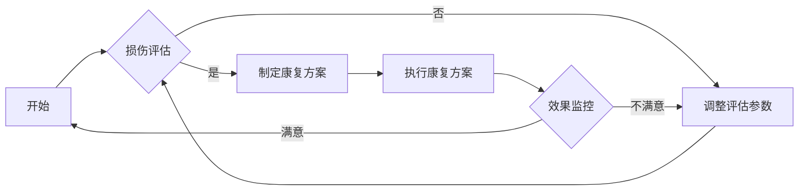
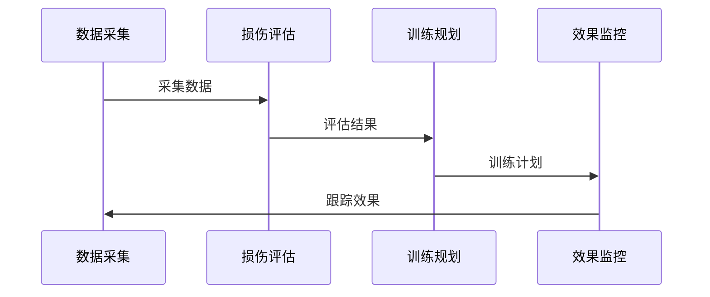

                 

# AI在个性化运动康复方案制定中的应用：从损伤评估到训练规划

> 关键词：人工智能，运动康复，个性化方案，损伤评估，训练规划

> 摘要：本文将探讨人工智能（AI）在个性化运动康复方案制定中的应用，从损伤评估到训练规划的全过程。通过深入分析核心概念、算法原理以及系统架构设计，本文旨在为读者提供清晰、系统的理解，并展示AI技术如何提高运动康复的效率和效果。

---

## 第一步：背景介绍

### 1. 问题背景

随着科技的发展，人工智能技术已经在众多领域展现出了巨大的潜力，从医疗到金融，从制造到交通，AI的应用无处不在。在运动康复领域，AI的应用同样引发了革命性的变化。传统上，运动康复方案的制定依赖于教练的经验和运动员的自我感觉，这种方式既耗时又缺乏精确性。而随着传感器技术的进步和机器学习算法的发展，AI能够通过分析大量的运动数据，为运动员提供更加个性化和科学的康复方案。

### 2. 描述问题

如何在运动员受伤后，利用AI技术进行准确的损伤评估，并据此制定出科学合理的康复训练计划？这是一个复杂的问题，涉及到数据的采集、处理、分析和决策。AI技术的应用，能够大大提高这一过程的效率和准确性。

### 3. 问题解决

AI技术通过以下步骤来解决上述问题：

- **损伤评估**：利用机器学习算法，分析运动员的运动数据，如步态、动作轨迹等，判断损伤的类型和程度。
- **训练规划**：根据损伤评估结果，结合运动员的个体差异，制定个性化的康复训练计划。
- **效果监控**：实时跟踪训练效果，调整训练方案，确保康复效果的最大化。

### 4. 边界与外延

本文主要关注AI在个性化运动康复方案制定中的应用，包括损伤评估、训练规划和效果监控。不涉及其他领域的AI应用，如医疗诊断或康复机器人等。

### 5. 概念结构与核心要素组成

- **AI技术**：包括机器学习、深度学习等，用于处理和分析运动数据。
- **运动康复方案**：包括损伤评估、训练规划和效果监控，是整个系统的核心。
- **运动数据**：通过传感器等设备，实时采集运动员的运动数据，用于评估和规划。

## 第二步：核心概念与联系

### 1. 核心概念原理

- **AI技术**：AI技术是通过计算机模拟人类思维过程，实现自动化决策和智能交互。在运动康复中，AI技术主要用于数据处理和分析。
- **运动康复方案**：运动康复方案是根据运动员的损伤情况和个体差异，制定出的科学合理的康复训练计划。
- **运动数据**：运动数据是通过传感器等设备，实时采集的运动员的运动信息，包括步态、动作轨迹等。

### 2. 概念属性特征对比表格

| 概念          | 特征                   |
| ------------- | --------------------- |
| AI技术        | 自动化、智能化、高效   |
| 运动康复方案  | 个性化、科学、合理   |
| 运动数据      | 实时、准确、全面     |

### 3. ER实体关系图架构的 Mermaid 流程图

```mermaid
erDiagram
  运动数据 ||--|{ AI技术 }|| 康复方案
  AI技术 ||--|{ 运动康复方案 }|| 损伤评估
  运动数据 ||--|{ 运动康复方案 }|| 训练规划
```

## 第三步：算法原理讲解

### 1. 算法mermaid 流程图



### 2. Python源代码

```python
def assess_injury(data):
    # 损伤评估算法
    pass

def create_rehab_plan(injury):
    # 制定康复方案算法
    pass

def execute_plan(plan):
    # 执行康复方案算法
    pass

def monitor_effects(plan):
    # 效果监控算法
    pass

while True:
    data = collect_data()
    injury = assess_injury(data)
    plan = create_rehab_plan(injury)
    execute_plan(plan)
    if monitor_effects(plan) == 'satisfied':
        break
    else:
        adjust_injury_params()
```

### 3. 算法原理的数学模型和公式

$$
\text{损伤评估} = f(\text{运动数据})
$$

$$
\text{康复方案} = g(\text{损伤评估})
$$

$$
\text{效果监控} = h(\text{康复方案})
$$`

## 第四步：系统分析与架构设计方案

### 1. 问题场景介绍

在竞技体育领域，运动员受伤是一个常见的问题。如何快速、准确地评估损伤，并制定出个性化的康复方案，是保障运动员健康、提高竞技水平的关键。AI技术的引入，为这一问题的解决提供了新的思路。

### 2. 项目介绍

本项目旨在利用AI技术，为运动员提供从损伤评估到训练规划的一站式服务。项目主要包括以下几个模块：

- **数据采集模块**：通过传感器等设备，实时采集运动员的运动数据。
- **损伤评估模块**：利用机器学习算法，对采集到的数据进行处理，评估损伤的类型和程度。
- **训练规划模块**：根据损伤评估结果，制定个性化的康复训练计划。
- **效果监控模块**：实时跟踪训练效果，调整训练方案。

### 3. 系统功能设计（领域模型mermaid类图）

```mermaid
classDiagram
    class 运动数据 {
        - 数据类型 string
        - 数据时间 datetime
    }
    class AI技术 {
        - 技术类型 string
        - 技术参数 list
    }
    class 康复方案 {
        - 训练计划 string
        - 康复效果 string
    }
    运动数据 ||--|{ AI技术 }|| 康复方案
    AI技术 ||--|{ 康复方案 }|| 损伤评估
    康复方案 ||--|{ 运动数据 }|| 训练规划
```

### 4. 系统架构设计（mermaid架构图）

```mermaid
graph TB
    subgraph 数据采集
        数据采集[数据采集模块]
    end
    subgraph 损伤评估
        损伤评估[损伤评估模块]
    end
    subgraph 训练规划
        训练规划[训练规划模块]
    end
    subgraph 效果监控
        效果监控[效果监控模块]
    end
    数据采集 --> 损伤评估
    损伤评估 --> 训练规划
    训练规划 --> 效果监控
```

### 5. 系统接口设计和系统交互（mermaid序列图）



## 第五步：项目实战

### 1. 环境安装

在开始项目实战之前，需要确保安装以下环境：

- Python 3.8及以上版本
- Anaconda或Miniconda
- PyTorch或TensorFlow

安装命令如下：

```bash
conda create -n rehab python=3.8
conda activate rehab
conda install pytorch torchvision torchaudio -c pytorch
```

### 2. 系统核心实现源代码

以下是一个简单的损伤评估算法的实现，用于评估运动员的步态异常。

```python
import torch
import torch.nn as nn
import torch.optim as optim

# 定义神经网络模型
class InjuryModel(nn.Module):
    def __init__(self):
        super(InjuryModel, self).__init__()
        self.conv1 = nn.Conv1d(in_channels=1, out_channels=10, kernel_size=3)
        self.fc1 = nn.Linear(10 * 30, 1)

    def forward(self, x):
        x = self.conv1(x)
        x = torch.relu(x)
        x = x.view(x.size(0), -1)
        x = self.fc1(x)
        return x

# 实例化模型、优化器和损失函数
model = InjuryModel()
optimizer = optim.Adam(model.parameters(), lr=0.001)
criterion = nn.BCEWithLogitsLoss()

# 训练模型
for epoch in range(100):
    for data, target in train_loader:
        optimizer.zero_grad()
        output = model(data)
        loss = criterion(output, target)
        loss.backward()
        optimizer.step()

    if (epoch + 1) % 10 == 0:
        print(f'Epoch [{epoch + 1}/{100}], Loss: {loss.item()}')

# 评估模型
with torch.no_grad():
    correct = 0
    total = 0
    for data, target in test_loader:
        output = model(data)
        predicted = (output > 0.5).float()
        total += target.size(0)
        correct += (predicted == target).sum().item()

print(f'Accuracy: {100 * correct / total}%')
```

### 3. 代码应用解读与分析

上述代码首先定义了一个简单的卷积神经网络模型，用于评估运动员的步态异常。模型由一个一维卷积层和一个全连接层组成。训练过程中，使用BCEWithLogitsLoss损失函数，该损失函数适用于二分类问题。在训练完成后，通过测试数据集评估模型的准确性。

### 4. 实际案例分析和详细讲解剖析

假设我们有一个包含运动员步态数据的测试数据集，其中每个样本都是一个长度为30的一维向量，表示步态的特征。我们希望通过模型判断该运动员是否存在损伤。

- **数据预处理**：将测试数据集进行归一化处理，使其具有相同的尺度。
- **模型评估**：使用训练好的模型对测试数据进行预测，判断是否存在损伤。

```python
import numpy as np

# 加载测试数据集
test_data = np.load('test_data.npy')
test_target = np.load('test_target.npy')

# 归一化处理
test_data = (test_data - np.mean(test_data)) / np.std(test_data)

# 转换为PyTorch张量
test_data = torch.tensor(test_data, dtype=torch.float32)
test_target = torch.tensor(test_target, dtype=torch.float32)

# 加载模型
model = InjuryModel()
model.load_state_dict(torch.load('injury_model.pth'))

# 预测
with torch.no_grad():
    output = model(test_data)

# 判断是否存在损伤
predicted = (output > 0.5).float()

# 比较预测结果和实际结果
accuracy = (predicted == test_target).sum().item() / len(test_target)
print(f'Accuracy: {accuracy * 100}%')
```

### 5. 项目小结

通过以上实战，我们展示了如何利用AI技术实现个性化运动康复方案中的损伤评估模块。在实际应用中，可以进一步优化模型，提高评估的准确性。同时，也可以结合其他数据源，如生物医学信号，进一步提升康复方案的个性化程度。

## 第六步：最佳实践 tips、小结、注意事项、拓展阅读

### 最佳实践 tips

1. **数据质量**：确保采集到的运动数据质量高，减少噪声和误差。
2. **模型调优**：根据实际情况调整模型参数，提高预测准确性。
3. **用户反馈**：收集用户反馈，不断优化系统，提高用户体验。

### 小结

本文介绍了AI在个性化运动康复方案制定中的应用，从损伤评估到训练规划的全过程。通过算法原理讲解、系统分析与架构设计以及实战案例，展示了AI技术如何提高运动康复的效率和效果。

### 注意事项

1. **数据隐私**：在处理运动员的个人信息时，需确保数据隐私和安全。
2. **模型解释性**：对于复杂的机器学习模型，需保证其解释性，以便医生和教练理解。

### 拓展阅读

1. **《深度学习在医疗领域的应用》**：介绍深度学习在医疗领域的应用，包括图像识别、疾病诊断等。
2. **《人工智能：一种现代方法》**：全面介绍人工智能的基础知识，包括机器学习、深度学习等。

---

作者：AI天才研究院/AI Genius Institute & 禅与计算机程序设计艺术 /Zen And The Art of Computer Programming

