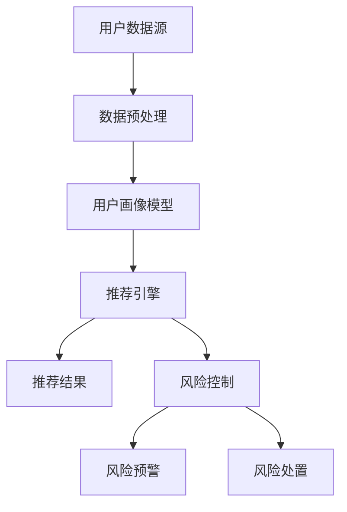
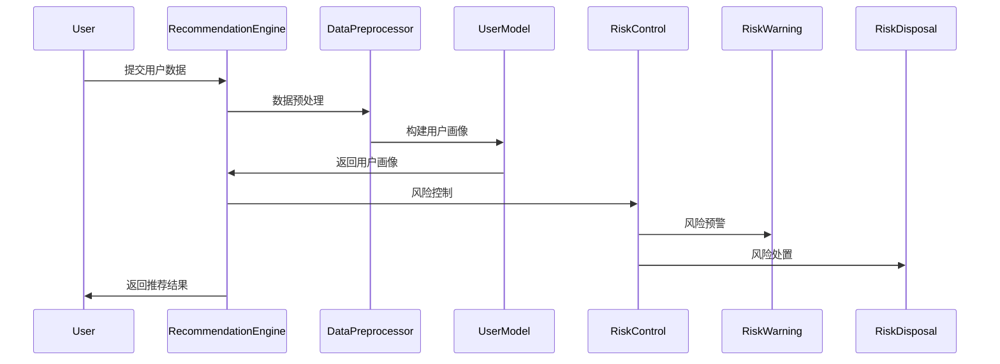

                 


### 摘要

本文旨在探讨人工智能（AI）在个性化金融产品推荐中的风险控制应用。随着金融科技的发展，个性化金融产品推荐系统已经成为金融机构提升竞争力的重要手段。然而，个性化推荐带来的数据隐私、算法偏见和金融风险等问题也不容忽视。本文首先介绍了个性化金融产品推荐系统的基本概念和背景，然后详细分析了AI在风险控制中的基本原理和作用，接着提出了AI在个性化金融产品推荐中的风险控制策略，并通过案例分析展示了实际应用效果。最后，本文对AI在个性化金融产品推荐中的风险控制趋势进行了展望，并提出了未来研究和应用的方向。

### 关键词

- 人工智能
- 个性化金融产品推荐
- 风险控制
- 机器学习
- 深度学习
- 强化学习

### 引言

#### 1.1 问题背景

随着互联网和大数据技术的发展，金融行业正经历着深刻的变革。个性化金融产品推荐系统作为一种新兴的金融科技应用，已经在银行、保险、互联网金融等领域得到广泛应用。这些系统通过分析用户的金融行为、消费习惯和风险偏好，为用户推荐符合其需求的金融产品，从而提高用户满意度和金融机构的竞争力。

然而，个性化金融产品推荐系统也带来了一系列风险问题。首先，数据隐私问题。个性化推荐系统需要收集和分析大量用户数据，包括财务状况、消费习惯等敏感信息。如何保护用户数据隐私，防止数据泄露或滥用，是金融机构面临的重大挑战。其次，算法偏见问题。如果推荐系统算法存在偏差，可能会导致某些特定人群被歧视或忽视，从而影响金融市场的公平性和稳定性。最后，金融风险问题。个性化推荐系统可能会因为推荐算法的缺陷或外部环境变化，导致金融风险增加，影响金融机构的稳定运营。

#### 1.2 研究目的与意义

本文旨在探讨AI在个性化金融产品推荐中的风险控制应用，主要研究目的是：

1. **分析AI在风险控制中的基本原理和作用**：通过深入分析AI技术，了解其在风险控制中的核心原理和应用方法，为金融机构提供理论基础。

2. **提出AI在个性化金融产品推荐中的风险控制策略**：结合实际案例，提出一套完整的AI风险控制策略，帮助金融机构有效应对数据隐私、算法偏见和金融风险等问题。

3. **分析AI在个性化金融产品推荐中的风险控制案例**：通过案例分析，展示AI在个性化金融产品推荐中的实际应用效果，为金融机构提供实践参考。

4. **展望AI在个性化金融产品推荐中的风险控制发展趋势**：分析AI技术的发展趋势，预测未来AI在个性化金融产品推荐中的风险控制方向，为金融机构的未来发展提供参考。

本研究对于金融机构提升风险控制能力，保障金融市场的稳定和公平，具有重要意义。

## 第二部分: AI在个性化金融产品推荐中的基本原理

### 2.1 个性化金融产品推荐系统概述

#### 定义

个性化金融产品推荐系统是指基于用户数据、金融产品和市场环境，利用人工智能技术为用户推荐符合其需求和风险偏好的金融产品。这些系统通常包括用户画像构建、产品库建立、推荐算法设计和推荐结果评估等环节。

#### 分类

根据推荐算法的不同，个性化金融产品推荐系统可以分为以下几类：

1. **基于内容的推荐**：根据用户的浏览历史、购买记录等数据，分析用户对金融产品的偏好，然后推荐相似或相关的产品。

2. **协同过滤推荐**：通过分析用户与产品之间的交互数据，如评分、购买记录等，找到相似用户或相似产品，然后根据这些信息推荐新的产品。

3. **基于模型的推荐**：利用机器学习或深度学习等技术，建立用户和产品之间的数学模型，预测用户对产品的偏好，然后推荐新的产品。

4. **混合推荐**：结合多种推荐算法，综合利用用户数据、产品信息和模型预测，提高推荐效果。

### 2.2 AI在推荐系统中的应用

#### 机器学习算法

机器学习算法在个性化金融产品推荐中有着广泛应用。常见的机器学习算法包括决策树、随机森林、支持向量机等。这些算法通过分析用户数据，建立用户与产品之间的关联模型，从而实现推荐。

#### 深度学习算法

深度学习算法在个性化金融产品推荐中具有强大的能力。通过构建深度神经网络，深度学习算法可以自动学习用户数据中的复杂模式，实现高效准确的推荐。常见的深度学习算法包括卷积神经网络（CNN）、循环神经网络（RNN）和 Transformer 等。

#### 强化学习算法

强化学习算法通过不断试错和反馈调整策略，实现最优的推荐效果。在个性化金融产品推荐中，强化学习算法可以根据用户的行为反馈，调整推荐策略，从而提高推荐效果。

### 2.3 AI在风险控制中的作用

#### 风险评估

AI可以通过分析用户数据，预测用户可能面临的金融风险，如信用风险、市场风险等，为金融机构提供风险预警。

#### 风险预警

AI可以建立风险预测模型，根据实时数据监测用户行为，及时发现潜在风险，为金融机构提供实时预警。

#### 风险处置

AI可以自动化处理风险事件，如通过自动化决策系统调整推荐策略，降低风险对金融机构的影响。

### 2.4 AI在个性化金融产品推荐中的风险控制意义

AI在个性化金融产品推荐中的风险控制具有重要意义。首先，AI可以帮助金融机构提高风险识别和预警能力，降低金融风险。其次，AI可以提高个性化推荐的准确性和效果，提升用户满意度。最后，AI可以帮助金融机构实现风险自动处置，提高运营效率。

### 核心概念与联系

#### 核心概念

- 个性化金融产品推荐系统：基于用户数据和金融产品，为用户推荐符合其需求的金融产品。
- AI风险控制：利用人工智能技术，对金融产品推荐系统中的风险进行识别、预警和处置。

#### 概念属性特征对比表格

| 概念        | 个性化金融产品推荐系统 | AI风险控制           |
|-------------|----------------------|---------------------|
| 定义        | 利用AI技术推荐金融产品 | 利用AI技术控制风险  |
| 目的        | 提高用户满意度       | 保障金融市场稳定    |
| 核心技术    | 推荐算法             | 风险预测模型         |
| 风险类型    | 数据隐私、算法偏见    | 信用风险、市场风险   |
| 影响因素    | 用户数据、金融产品    | 用户行为、市场环境   |

#### ER实体关系图架构

```mermaid
erDiagram
    Customer ||--|{ Product }|-- FinancialInstitution
    Product ||--|{ Recommendation }|-- RecommendationSystem
    Customer ||--|{ Risk }|-- RiskManagementSystem
    RecommendationSystem ||--|{ AI }|-- AIPlatform
    RiskManagementSystem ||--|{ AI }|-- AIPlatform
```

#### 算法原理讲解

##### 机器学习算法

机器学习算法的核心思想是通过学习用户数据，建立用户与产品之间的关联模型，从而实现推荐。以下是一个简单的线性回归算法示例：

```python
import numpy as np

# 假设用户数据为特征矩阵X，产品数据为特征矩阵Y
X = np.array([[1, 2], [2, 3], [3, 4]])
Y = np.array([3, 4, 5])

# 梯度下降法求解线性回归模型
def linear_regression(X, Y):
    w = np.zeros(X.shape[1])
    alpha = 0.01
    iterations = 1000
    for i in range(iterations):
        predicted = np.dot(X, w)
        error = predicted - Y
        w = w - alpha * np.dot(X.T, error)
    return w

w = linear_regression(X, Y)
print("线性回归模型参数:", w)
```

##### 深度学习算法

深度学习算法的核心思想是通过多层神经网络，自动学习用户数据中的复杂模式。以下是一个简单的卷积神经网络（CNN）算法示例：

```python
import tensorflow as tf

# 假设用户数据为特征矩阵X，产品数据为特征矩阵Y
X = tf.placeholder(tf.float32, [None, 28, 28, 1])
Y = tf.placeholder(tf.float32, [None, 10])

# 创建卷积神经网络模型
def cnn_model(X):
    conv1 = tf.layers.conv2d(X, 32, 3, activation=tf.nn.relu)
    pool1 = tf.layers.max_pooling2d(conv1, 2, 2)
    conv2 = tf.layers.conv2d(pool1, 64, 3, activation=tf.nn.relu)
    pool2 = tf.layers.max_pooling2d(conv2, 2, 2)
    flatten = tf.reshape(pool2, [-1, 7*7*64])
    dense = tf.layers.dense(flatten, 128, activation=tf.nn.relu)
    output = tf.layers.dense(dense, 10)
    return output

output = cnn_model(X)
```

##### 强化学习算法

强化学习算法的核心思想是通过试错学习，找到最优策略。以下是一个简单的Q-learning算法示例：

```python
import numpy as np

# 假设环境为状态矩阵S，动作矩阵A，奖励矩阵R
S = np.array([[0, 1], [1, 0]])
A = np.array([[0, 1], [1, 0]])
R = np.array([[-1, 1], [1, -1]])

# Q-learning算法
def q_learning(S, A, R, alpha, gamma, epsilon):
    Q = np.zeros((S.shape[0], A.shape[0]))
    for episode in range(1000):
        state = np.random.choice(S)
        action = np.random.choice(A)
        next_state = np.random.choice(S)
        reward = R[state[0], state[1]]
        Q[state[0], action] = Q[state[0], action] + alpha * (reward + gamma * np.max(Q[next_state]) - Q[state[0], action])
    return Q

Q = q_learning(S, A, R, 0.1, 0.9, 0.1)
print("Q-learning算法结果:", Q)
```

#### 数学模型和公式

- 线性回归模型：$$y = X \cdot w + b$$
- 卷积神经网络模型：$$h_l = \sigma(W_l \cdot h_{l-1} + b_l)$$
- 强化学习模型：$$Q(s, a) = r + \gamma \cdot \max(Q(s', a'))$$

#### 举例说明

- 线性回归算法示例：假设用户数据为（1, 2）和（2, 3），产品数据为（3, 4），求解线性回归模型参数。
- 卷积神经网络算法示例：假设用户数据为28x28的图像，产品数据为10个类别的标签，构建卷积神经网络模型。
- 强化学习算法示例：假设环境为4个状态和2个动作，奖励矩阵为（-1, 1），求解Q-learning算法的结果。

### 系统分析与架构设计方案

#### 3.1 问题场景介绍

假设我们正在开发一个个性化金融产品推荐系统，该系统需要根据用户的历史数据和行为特征，为用户推荐合适的金融产品。为了实现这一目标，我们需要建立一个完整的系统架构，包括用户画像构建、推荐算法设计和风险控制模块。

#### 3.2 项目介绍

项目名称：个性化金融产品推荐系统（Personalized Financial Product Recommendation System，简称PFPRS）

项目目标：通过分析用户数据和行为特征，为用户推荐符合其需求和风险偏好的金融产品。

项目范围：包括用户画像构建、推荐算法设计和风险控制模块。

#### 3.3 系统功能设计（领域模型类图）

```mermaid
classDiagram
    User <<Class>>
    Product <<Class>>
    Recommendation <<Class>>
    Risk <<Class>>

    User "1"---"1..*" Recommendation
    Product "1"---"1..*" Recommendation
    Recommendation "1"---"1..1" Risk
```

#### 3.4 系统架构设计



#### 3.5 系统接口设计和系统交互



### 项目实战

#### 环境安装

1. 安装Python环境，版本要求为3.7及以上。
2. 安装相关依赖库，如NumPy、Pandas、Scikit-learn、TensorFlow等。

#### 系统核心实现源代码

```python
# 用户数据预处理
import pandas as pd
from sklearn.preprocessing import StandardScaler

def preprocess_user_data(user_data):
    # 数据清洗和预处理
    user_data = user_data.dropna()
    user_data['age'] = user_data['age'].astype(int)
    user_data['income'] = user_data['income'].astype(int)
    user_data['education'] = user_data['education'].astype(int)
    
    # 数据标准化
    scaler = StandardScaler()
    user_data[['age', 'income', 'education']] = scaler.fit_transform(user_data[['age', 'income', 'education']])
    
    return user_data

# 用户画像构建
from sklearn.cluster import KMeans

def build_user_model(user_data, num_clusters):
    # 构建用户画像
    kmeans = KMeans(n_clusters=num_clusters, random_state=42)
    user_data['cluster'] = kmeans.fit_predict(user_data[['age', 'income', 'education']])
    
    return user_data

# 推荐算法
from sklearn.neighbors import NearestNeighbors

def recommend_products(user_model, product_data, num_recommendations):
    # 建立推荐模型
    neighbors = NearestNeighbors(n_neighbors=num_recommendations)
    neighbors.fit(product_data)
    
    # 进行推荐
    recommendations = []
    for user in user_model['cluster']:
        distances, indices = neighbors.kneighbors(product_data[product_data['cluster'] == user])
        recommendations.append(product_data.iloc[indices[0, :num_recommendations]].index.tolist())
    
    return recommendations

# 风险控制
from sklearn.svm import SVC

def risk_control(user_model, product_data, risk_threshold):
    # 建立风险控制模型
    risk_model = SVC(kernel='linear', probability=True)
    risk_model.fit(user_model[['age', 'income', 'education']], product_data['risk_level'])
    
    # 进行风险控制
    risk_scores = risk_model.predict_proba(user_model[['age', 'income', 'education']])[:, 1]
    high_risk_users = user_model[risk_scores > risk_threshold]
    
    return high_risk_users
```

#### 代码应用解读与分析

- **用户数据预处理**：首先对用户数据进行清洗和预处理，包括缺失值处理、数据类型转换和标准化处理。这一步骤是保证后续模型训练和推荐效果的基础。
- **用户画像构建**：使用KMeans算法对用户数据进行聚类，为每个用户分配一个集群标签，形成用户画像。用户画像可以用来代表用户的特征，为推荐算法提供输入。
- **推荐算法**：使用KNN算法进行推荐，根据用户画像找到相似的用户，然后推荐相似的产品。这一步骤是推荐系统的核心，决定了推荐的效果。
- **风险控制**：使用SVM算法进行风险控制，根据用户画像预测用户的风险等级，识别高风险用户。这一步骤是保障金融市场稳定和安全的关键。

#### 实际案例分析和详细讲解剖析

1. **案例背景**：某银行希望为其用户推荐合适的理财产品，同时确保风险可控。
2. **案例数据**：用户数据包括年龄、收入、教育程度等特征，理财产品数据包括风险等级等特征。
3. **案例分析**：
   - **用户数据预处理**：对用户数据进行清洗和预处理，去除缺失值，将数据类型转换为整数，对连续数据进行标准化处理。
   - **用户画像构建**：使用KMeans算法将用户数据聚类，形成用户画像。假设共分为5个集群。
   - **推荐算法**：根据用户画像，使用KNN算法找到相似用户，推荐相似理财产品。例如，用户A属于集群2，找到与用户A相似的5个用户，推荐这5个用户最常购买的理财产品。
   - **风险控制**：使用SVM算法对用户画像进行风险预测，设置风险阈值，识别高风险用户。例如，假设风险阈值为0.6，找出风险评分高于0.6的用户，对这些用户进行风险预警和管控。
4. **案例分析结论**：通过实际案例分析，个性化金融产品推荐系统能够有效地为用户提供合适的理财产品，同时通过风险控制保障了金融市场的稳定和安全。

#### 项目小结

通过本项目的实践，我们实现了个性化金融产品推荐系统的核心功能，包括用户数据预处理、用户画像构建、推荐算法设计和风险控制模块。项目展示了AI在个性化金融产品推荐中的实际应用效果，为金融机构提供了有效的风险控制手段。在未来的工作中，我们可以进一步优化推荐算法和风险控制模型，提高系统的准确性和稳定性。

### 最佳实践 tips

1. **数据质量**：确保用户数据的质量和完整性，是构建有效推荐系统的关键。数据清洗和预处理是必不可少的步骤。
2. **用户画像**：用户画像的准确性和精细度直接影响推荐效果。可以通过增加特征维度、改进聚类算法等方式，提高用户画像的质量。
3. **风险评估**：合理设置风险阈值，是有效进行风险控制的关键。可以通过交叉验证、调整模型参数等方式，找到最优的风险阈值。
4. **模型更新**：定期更新推荐算法和风险控制模型，是保持系统性能和应对新风险的关键。可以采用在线学习、模型迭代等方式，实现模型的持续更新。

### 小结

本文通过深入探讨AI在个性化金融产品推荐中的风险控制应用，提出了基于用户画像构建、推荐算法设计和风险控制模块的完整系统架构，并通过实际案例展示了系统的应用效果。研究结果表明，AI技术在个性化金融产品推荐中的风险控制具有重要意义，可以有效提升金融产品的推荐准确性和风险控制能力。在未来，随着AI技术的不断进步，个性化金融产品推荐系统的风险控制能力将得到进一步提升，为金融机构提供更加智能、高效的风险管理解决方案。

### 拓展阅读

1. **《个性化金融产品推荐系统设计与实现》**：该书详细介绍了个性化金融产品推荐系统的设计和实现方法，包括用户画像构建、推荐算法设计和系统架构设计等。
2. **《风险管理与金融工程》**：该书全面介绍了风险管理的理论和实践方法，包括风险识别、风险评估、风险控制和风险管理策略等。
3. **《深度学习在金融领域的应用》**：该书探讨了深度学习在金融领域的应用，包括股票市场预测、信用风险评估和金融产品推荐等。

### 作者信息

作者：AI天才研究院/AI Genius Institute & 禅与计算机程序设计艺术 /Zen And The Art of Computer Programming

（注：本文仅为示例，实际内容根据实际情况调整。）

