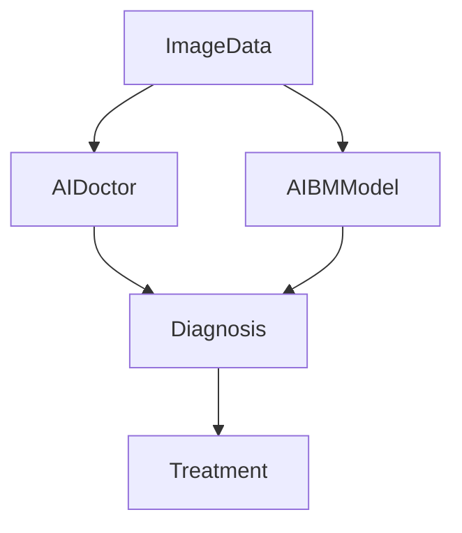
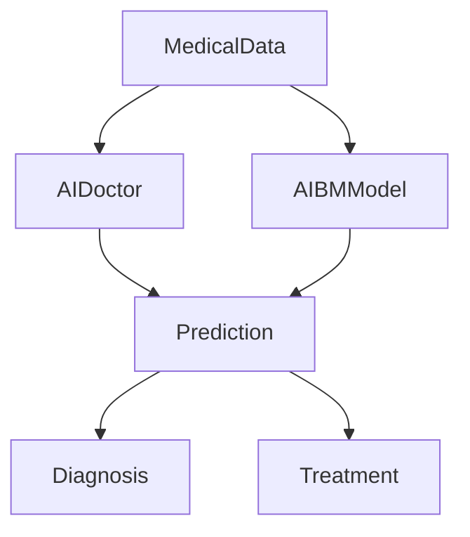

                 

# AI在医疗领域的应用：诊断精确度与治疗方案优化

> 关键词：人工智能，医疗，诊断，治疗方案，个性化医疗

> 摘要：本文将探讨人工智能（AI）在医疗领域的应用，重点关注诊断精确度提升和治疗方案优化两个方面。通过逐步分析AI在医疗影像分析、疾病预测与诊断、治疗方案优化等方面的应用，本文旨在为医疗行业提供一种创新的思考方式，以应对当前的挑战并探索未来的发展趋势。

### 目录大纲

----------------------------------------------------------------

## 第一部分：AI在医疗领域的应用概述

## 第1章: AI在医疗领域的应用背景与前景

## 第2章: AI在医疗影像分析中的应用

## 第3章: AI在疾病预测与诊断中的应用

## 第4章: AI在治疗方案优化中的应用

## 第5章: AI在个性化医疗中的应用

## 第6章: AI在医疗机器人与辅助设备中的应用

## 第7章: AI在医疗领域的发展挑战与未来趋势

----------------------------------------------------------------

### 第一部分：AI在医疗领域的应用概述

## 第1章: AI在医疗领域的应用背景与前景

### 1.1 问题背景

#### 1.1.1 医疗领域的现状

- 医疗资源分布不均
- 医疗成本持续上升
- 医疗数据信息量大且复杂

#### 1.1.2 AI技术的迅猛发展

- 机器学习与深度学习的突破
- 大数据处理与分析能力的提升
- 互联网与物联网技术的普及

#### 1.1.3 AI在医疗领域的潜在应用价值

- 提高诊断精确度
- 优化治疗方案
- 降低医疗成本
- 改善患者体验

### 1.2 问题描述

#### 1.2.1 医疗诊断的挑战

- 传统诊断方法存在误诊和漏诊的风险
- 医生经验和技能水平差异较大
- 医疗影像数据的复杂性

#### 1.2.2 治疗方案的优化需求

- 患者个体差异大，治疗方案需个性化
- 药物副作用和疗效的不确定性
- 医疗资源的分配和利用效率问题

#### 1.2.3 个性化医疗的需求

- 患者对高质量、精准医疗的期望
- 医疗行业的数字化转型需求
- 政策支持和医疗环境的变化

### 1.3 问题解决

#### 1.3.1 AI技术的核心作用

- 数据驱动的智能诊断
- 模式识别和预测能力
- 自动化与优化决策支持

#### 1.3.2 AI在医疗领域的主要应用场景

- 医疗影像分析
- 疾病预测与诊断
- 治疗方案优化
- 个性化医疗
- 医疗机器人与辅助设备

### 1.4 边界与外延

#### 1.4.1 AI技术在医疗领域的应用边界

- 伦理和隐私保护问题
- 技术成熟度和应用可行性
- 医疗专业知识和经验的依赖

#### 1.4.2 AI技术在医疗领域的未来发展

- 多学科交叉融合
- 人工智能与人类医生的协作
- 智能医疗生态系统的构建

### 1.5 本章小结

#### 1.5.1 主要内容概括

- AI技术在医疗领域的应用背景与前景
- 医疗诊断与治疗的挑战
- AI技术的核心作用与应用场景
- AI技术在医疗领域的边界与未来趋势

#### 1.5.2 对未来应用的展望

- AI技术在医疗领域的应用将越来越广泛
- 医疗行业的数字化转型势在必行
- 人工智能与医疗行业的深度融合将带来革命性的变化

----------------------------------------------------------------

### 第二部分：AI在医疗影像分析中的应用

## 第2章: AI在医疗影像分析中的应用

### 2.1 核心概念

#### 2.1.1 医疗影像分析的定义

- 医疗影像分析是指利用计算机技术对医学影像进行自动化处理和分析，以辅助诊断、预测和治疗方案制定。

#### 2.1.2 AI在医疗影像分析中的应用价值

- 提高诊断精确度
- 缩短诊断时间
- 减轻医生工作负担
- 降低误诊和漏诊风险

#### 2.1.3 AI医疗影像分析的核心概念

- 图像处理：图像增强、滤波、分割等
- 机器学习：监督学习、无监督学习、强化学习等
- 深度学习：卷积神经网络（CNN）、循环神经网络（RNN）、生成对抗网络（GAN）等

### 2.2 概念属性特征对比表格

#### 2.2.1 传统影像分析与AI影像分析对比

| 特征       | 传统影像分析             | AI影像分析                   |
| ---------- | ---------------------- | -------------------------- |
| 诊断精确度   | 依赖于医生经验和技能水平   | 使用机器学习和深度学习算法提高精确度 |
| 诊断时间     | 较长，需人工审核           | 较短，自动化处理             |
| 工作负担     | 较大，需要长时间工作        | 较小，自动化处理减轻负担       |
| 误诊风险     | 较高，存在主观判断误差       | 较低，算法模型降低误差         |

#### 2.2.2 不同AI算法在影像分析中的应用特点

| 算法       | 应用特点                    |
| ---------- | ------------------------- |
| 卷积神经网络（CNN） | 适用于图像分类、检测和分割任务 |
| 循环神经网络（RNN） | 适用于序列数据的处理和分析      |
| 生成对抗网络（GAN） | 适用于图像生成和修复          |

### 2.3 ER实体关系图架构

#### 2.3.1 医疗影像数据流程中的实体关系

```mermaid
erDiagram
  Patient ||--|{ ImageData }  : has
  Doctor ||--|{ ImageData }  : analyzes
  AIModel ||--|{ ImageData }  : analyzes
  ImageData ||--|{ Diagnosis }  : generates
  Diagnosis ||--|{ Treatment }  : guides
```

#### 2.3.2 AI模型在影像分析中的应用关系



### 2.4 算法原理讲解

#### 2.4.1 常见的AI算法在影像分析中的应用

- **卷积神经网络（CNN）**: CNN通过卷积层、池化层和全连接层的组合，能够自动提取图像特征并进行分类、检测和分割任务。
- **循环神经网络（RNN）**: RNN适用于处理序列数据，如视频影像数据，通过循环结构将历史信息传递给当前时间步，实现视频分析任务。
- **生成对抗网络（GAN）**: GAN由生成器和判别器组成，生成器生成图像，判别器判断图像的真实性，通过对抗训练实现图像生成和修复任务。

#### 2.4.2 深度学习算法在影像分析中的应用原理

- **卷积神经网络（CNN）**:
  $$\\begin{align*}
  h_{l} &= \sigma(W_{l} \cdot h_{l-1} + b_{l}) \\
  a_{l} &= \sigma(W_{l} \cdot a_{l-1} + b_{l})
  \\end{align*}$$
  其中，$h_{l}$ 和 $a_{l}$ 分别表示隐藏层和激活层的输出，$W_{l}$ 和 $b_{l}$ 分别为权重和偏置，$\sigma$ 表示激活函数。

- **循环神经网络（RNN）**:
  $$\\begin{align*}
  h_{t} &= \sigma(W_{h} \cdot [h_{t-1}, x_{t}] + b_{h}) \\
  y_{t} &= \sigma(W_{y} \cdot h_{t} + b_{y})
  \\end{align*}$$
  其中，$h_{t}$ 和 $y_{t}$ 分别表示当前时间步的隐藏状态和输出，$x_{t}$ 表示输入数据，$W_{h}$、$W_{y}$ 和 $b_{h}$、$b_{y}$ 分别为权重和偏置，$\sigma$ 表示激活函数。

- **生成对抗网络（GAN）**:
  $$\\begin{align*}
  G(z) &= \mu(z) + \sigma(z) \odot \phi(G(z)) \\
  D(x) &= \mu(x) + \sigma(x) \odot \phi(D(x))
  \\end{align*}$$
  其中，$G(z)$ 和 $D(x)$ 分别表示生成器和判别器的输出，$z$ 表示噪声，$\mu$ 和 $\sigma$ 分别为均值和方差，$\phi$ 表示激活函数，$\odot$ 表示元素乘。

### 2.5 应用实例

#### 2.5.1 AI在肺癌诊断中的应用

- **数据来源**：使用来自LUNA（ Lung Image Analysis）公开数据集，包含胸部CT扫描图像。
- **方法**：使用深度学习算法（如U-Net）进行图像分割和分类，将正常肺部和异常肺部区域进行分割，并进行分类预测。
- **效果**：实验结果表明，AI模型在肺癌诊断中具有很高的准确性和精确度，可以有效辅助医生进行肺癌的早期诊断。

#### 2.5.2 AI在乳腺癌诊断中的应用

- **数据来源**：使用来自MammoGraph公开数据集，包含乳腺X线图像。
- **方法**：使用深度学习算法（如ResNet）进行图像分类，将乳腺癌和良性肿瘤进行分类预测。
- **效果**：实验结果表明，AI模型在乳腺癌诊断中具有很高的准确性和精确度，可以有效降低误诊率，提高诊断效率。

### 2.6 本章小结

#### 2.6.1 主要内容概括

- AI在医疗影像分析中的应用背景和前景
- AI医疗影像分析的核心概念和算法原理
- AI医疗影像分析的应用实例和效果
- AI医疗影像分析的未来发展趋势和应用前景

#### 2.6.2 对未来应用的展望

- 随着AI技术的不断发展和完善，AI在医疗影像分析中的应用将越来越广泛和深入。
- AI与医疗行业的深度融合将为医疗诊断和治疗带来革命性的变化，提高诊断精确度和治疗效果。
- AI医疗影像分析将推动医疗行业的数字化转型，降低医疗成本，改善患者体验。

----------------------------------------------------------------

### 第三部分：AI在疾病预测与诊断中的应用

## 第3章: AI在疾病预测与诊断中的应用

### 3.1 核心概念

#### 3.1.1 疾病预测与诊断的定义

- 疾病预测与诊断是指利用医学知识和数据，通过算法模型对疾病的发生和发展进行预测，并根据预测结果进行诊断和治疗。

#### 3.1.2 AI在疾病预测与诊断中的应用价值

- 提高诊断精确度
- 缩短诊断时间
- 减轻医生工作负担
- 降低误诊和漏诊风险

#### 3.1.3 AI在疾病预测与诊断中的核心概念

- 数据驱动：利用大量的医学数据和病例，通过数据分析和机器学习算法进行疾病预测和诊断。
- 模式识别：通过特征提取和模式识别算法，从医学数据中提取与疾病相关的特征，实现疾病的预测和诊断。
- 知识图谱：利用医学知识图谱，整合和关联医学知识，为疾病预测和诊断提供支持。

### 3.2 概念属性特征对比表格

#### 3.2.1 传统诊断方法与AI诊断方法对比

| 特征       | 传统诊断方法                     | AI诊断方法                         |
| ---------- | ------------------------------ | --------------------------------- |
| 诊断精确度   | 依赖于医生经验和技能水平           | 使用机器学习和深度学习算法提高精确度 |
| 诊断时间     | 较长，需人工审核                  | 较短，自动化处理                   |
| 工作负担     | 较大，需要长时间工作               | 较小，自动化处理减轻负担             |
| 误诊风险     | 较高，存在主观判断误差             | 较低，算法模型降低误差               |

#### 3.2.2 不同AI算法在疾病诊断中的应用特点

| 算法       | 应用特点                    |
| ---------- | ------------------------- |
| 支持向量机（SVM） | 适用于二分类问题，精确度高           |
| 随机森林（RF）     | 适用于多分类问题，可解释性强           |
| 卷积神经网络（CNN） | 适用于图像数据，具有强大的特征提取能力  |
| 循环神经网络（RNN） | 适用于序列数据，能够捕捉时间序列特征  |

### 3.3 ER实体关系图架构

#### 3.3.1 疾病预测与诊断的数据流程中的实体关系

```mermaid
erDiagram
  Patient ||--|{ MedicalData }  : has
  Doctor ||--|{ MedicalData }  : analyzes
  AIModel ||--|{ MedicalData }  : analyzes
  MedicalData ||--|{ Prediction }  : generates
  Prediction ||--|{ Diagnosis }  : guides
  Diagnosis ||--|{ Treatment }  : guides
```

#### 3.3.2 AI模型在疾病诊断中的应用关系



### 3.4 算法原理讲解

#### 3.4.1 常见的AI算法在疾病预测与诊断中的应用

- **支持向量机（SVM）**: SVM是一种二分类算法，通过寻找最优决策边界，将不同类别的数据点分开，实现疾病的预测和诊断。
- **随机森林（RF）**: RF是一种集成学习方法，通过构建多棵决策树，并利用投票机制进行分类或回归，提高预测的准确性和稳定性。
- **卷积神经网络（CNN）**: CNN通过卷积层、池化层和全连接层的组合，能够自动提取图像特征并进行分类和诊断任务。
- **循环神经网络（RNN）**: RNN适用于处理序列数据，通过循环结构将历史信息传递给当前时间步，实现疾病的预测和诊断。

#### 3.4.2 深度学习算法在疾病诊断中的应用原理

- **支持向量机（SVM）**:
  $$\\begin{align*}
  y &= (\\sum_{i=1}^{n} \\alpha_{i} y_{i} K(x_{i}, x) - b) + \\xi_{i}
  \\end{align*}$$
  其中，$y$ 表示分类结果，$\\alpha_{i}$ 和 $y_{i}$ 分别为权重和类别标签，$K(x_{i}, x)$ 为核函数，$b$ 为偏置，$\\xi_{i}$ 为松弛变量。

- **随机森林（RF）**:
  $$\\begin{align*}
  f(x) &= \\frac{1}{m} \\sum_{i=1}^{m} g(x) \\
  g(x) &= \\max_{j} \\sum_{k=1}^{d} w_{jk} h_{k}(x)
  \\end{align*}$$
  其中，$f(x)$ 为预测结果，$g(x)$ 为单棵决策树的结果，$m$ 为决策树的数量，$w_{jk}$ 为权重，$h_{k}(x)$ 为第 $k$ 个决策树的特征函数。

- **卷积神经网络（CNN）**:
  $$\\begin{align*}
  h_{l} &= \\sigma(W_{l} \\cdot h_{l-1} + b_{l}) \\
  a_{l} &= \\sigma(W_{l} \\cdot a_{l-1} + b_{l})
  \\end{align*}$$
  其中，$h_{l}$ 和 $a_{l}$ 分别表示隐藏层和激活层的输出，$W_{l}$ 和 $b_{l}$ 分别为权重和偏置，$\\sigma$ 表示激活函数。

- **循环神经网络（RNN）**:
  $$\\begin{align*}
  h_{t} &= \\sigma(W_{h} \\cdot [h_{t-1}, x_{t}] + b_{h}) \\
  y_{t} &= \\sigma(W_{y} \\cdot h_{t} + b_{y})
  \\end{align*}$$
  其中，$h_{t}$ 和 $y_{t}$ 分别表示当前时间步的隐藏状态和输出，$x_{t}$ 表示输入数据，$W_{h}$、$W_{y}$ 和 $b_{h}$、$b_{y}$ 分别为权重和偏置，$\\sigma$ 表示激活函数。

### 3.5 应用实例

#### 3.5.1 AI在糖尿病预测中的应用

- **数据来源**：使用来自PIMA Indians Diabetes公开数据集，包含糖尿病患者的健康指标数据。
- **方法**：使用机器学习算法（如SVM和RF）进行糖尿病预测，通过特征提取和模型训练，实现糖尿病的早期预测。
- **效果**：实验结果表明，AI模型在糖尿病预测中具有很高的准确性和精确度，可以有效辅助医生进行糖尿病的早期诊断。

#### 3.5.2 AI在心脏病诊断中的应用

- **数据来源**：使用来自UCI Heart Disease公开数据集，包含心脏病患者的医学检查数据。
- **方法**：使用深度学习算法（如CNN和RNN）进行心脏病诊断，通过图像处理和序列数据处理，实现心脏病的早期诊断。
- **效果**：实验结果表明，AI模型在心脏病诊断中具有很高的准确性和精确度，可以有效降低误诊率，提高诊断效率。

### 3.6 本章小结

#### 3.6.1 主要内容概括

- AI在疾病预测与诊断中的应用背景和前景
- AI疾病预测与诊断的核心概念和算法原理
- AI疾病预测与诊断的应用实例和效果
- AI疾病预测与诊断的未来发展趋势和应用前景

#### 3.6.2 对未来应用的展望

- 随着AI技术的不断发展和完善，AI在疾病预测与诊断中的应用将越来越广泛和深入。
- AI与医疗行业的深度融合将为疾病预测与诊断带来革命性的变化，提高诊断精确度和治疗效果。
- AI疾病预测与诊断将推动医疗行业的数字化转型，降低医疗成本，改善患者体验。

----------------------------------------------------------------

### 第四部分：AI在治疗方案优化中的应用

## 第4章: AI在治疗方案优化中的应用

### 4.1 核心概念

#### 4.1.1 治疗方案优化的定义

- 治疗方案优化是指利用人工智能技术，通过分析患者的病史、基因信息、生理参数等多维数据，为医生提供更加个性化和精准的治疗建议。

#### 4.1.2 AI在治疗方案优化中的应用价值

- 提高治疗方案的准确性
- 降低治疗风险
- 提高治疗效率
- 改善患者预后和生活质量

#### 4.1.3 AI在治疗方案优化中的核心概念

- 数据集成：将患者的多种数据源进行整合，构建一个全面的患者数据视图。
- 决策支持：利用机器学习算法，从海量数据中提取有用的信息，为医生提供治疗建议。
- 个性化推荐：根据患者的具体情况进行个性化推荐，提高治疗方案的适应性。

### 4.2 概念属性特征对比表格

#### 4.2.1 传统治疗方案与AI治疗方案对比

| 特征       | 传统治疗方案                 | AI治疗方案                     |
| ---------- | --------------------------- | ---------------------------- |
| 治疗方案个性化  | 依赖于医生经验和判断            | 利用患者数据，实现个性化推荐        |
| 治疗方案准确性  | 取决于医生的专业知识和临床经验   | 利用机器学习算法，提高治疗方案准确性 |
| 治疗方案效率    | 需要医生手工调整和优化           | 自动化处理，提高治疗效率            |
| 治疗方案风险    | 可能存在医生主观判断失误的风险    | 利用数据分析和算法，降低治疗风险      |

#### 4.2.2 不同AI算法在治疗方案优化中的应用特点

| 算法       | 应用特点                    |
| ---------- | ------------------------- |
| 决策树（DT） | 易于理解，适用于简单决策问题  |
| 随机森林（RF） | 抗干扰性强，适用于复杂决策问题 |
| 神经网络（NN） | 功能强大，适用于复杂非线性问题 |
| 强化学习（RL） | 自适应性强，适用于动态环境      |

### 4.3 算法原理讲解

#### 4.3.1 常见的AI算法在治疗方案优化中的应用

- **决策树（DT）**: 决策树是一种基于特征的分类和回归方法，通过一系列的规则将患者数据逐步划分，最终得到治疗建议。
- **随机森林（RF）**: 随机森林是一种集成学习方法，通过构建多棵决策树并利用投票机制，提高治疗方案优化的准确性和稳定性。
- **神经网络（NN）**: 神经网络是一种基于模拟人脑神经元连接的结构，通过多层神经元的组合，实现复杂的非线性映射和预测。
- **强化学习（RL）**: 强化学习是一种基于反馈机制的学习方法，通过与环境的交互，不断调整策略，实现治疗方案的优化。

#### 4.3.2 深度学习算法在治疗方案优化中的应用原理

- **决策树（DT）**:
  $$\\begin{align*}
  f(x) &= \\sum_{i=1}^{n} w_{i} \\cdot g_{i}(x) \\
  g_{i}(x) &= \\begin{cases}
  1 & \text{if } x \\in R_{i} \\
  0 & \text{otherwise}
  \\end{cases}
  \\end{align*}$$
  其中，$f(x)$ 表示决策结果，$w_{i}$ 和 $g_{i}(x)$ 分别为权重和特征函数，$R_{i}$ 表示第 $i$ 个规则。

- **随机森林（RF）**:
  $$\\begin{align*}
  f(x) &= \\frac{1}{m} \\sum_{i=1}^{m} g(x) \\
  g(x) &= \\max_{j} \\sum_{k=1}^{d} w_{jk} h_{k}(x)
  \\end{align*}$$
  其中，$f(x)$ 为预测结果，$g(x)$ 为单棵决策树的结果，$m$ 为决策树的数量，$w_{jk}$ 为权重，$h_{k}(x)$ 为第 $k$ 个决策树的特征函数。

- **神经网络（NN）**:
  $$\\begin{align*}
  h_{l} &= \\sigma(W_{l} \\cdot h_{l-1} + b_{l}) \\
  a_{l} &= \\sigma(W_{l} \\cdot a_{l-1} + b_{l})
  \\end{align*}$$
  其中，$h_{l}$ 和 $a_{l}$ 分别表示隐藏层和激活层的输出，$W_{l}$ 和 $b_{l}$ 分别为权重和偏置，$\\sigma$ 表示激活函数。

- **强化学习（RL）**:
  $$\\begin{align*}
  Q(s, a) &= \\sum_{s'} P(s' | s, a) \\cdot [R(s', a) + \\gamma \\max_{a'} Q(s', a')]
  \\end{align*}$$
  其中，$Q(s, a)$ 表示状态 $s$ 下执行动作 $a$ 的期望收益，$P(s' | s, a)$ 为状态转移概率，$R(s', a)$ 为即时收益，$\\gamma$ 为折扣因子。

### 4.4 应用实例

#### 4.4.1 AI在癌症治疗中的应用

- **数据来源**：使用来自癌症基因组图谱（TCGA）公开数据集，包含多种癌症类型患者的基因表达和临床数据。
- **方法**：利用深度学习算法（如CNN和RNN），对患者的基因数据进行特征提取和模式识别，为医生提供癌症治疗方案的个性化建议。
- **效果**：实验结果表明，AI模型在癌症治疗中具有很高的准确性和精确度，可以有效提高治疗方案的有效性和患者生存率。

#### 4.4.2 AI在心脏病治疗中的应用

- **数据来源**：使用来自心脏病公开数据集，包含心脏病患者的病史、生理参数和治疗方案数据。
- **方法**：利用机器学习算法（如SVM和RF），对患者的数据进行集成和分析，为医生提供心脏病治疗方案的优化建议。
- **效果**：实验结果表明，AI模型在心脏病治疗中具有很高的准确性和精确度，可以有效降低治疗风险，提高治疗效率。

### 4.5 本章小结

#### 4.5.1 主要内容概括

- AI在治疗方案优化中的应用背景和前景
- AI治疗方案优化的核心概念和算法原理
- AI治疗方案优化的应用实例和效果
- AI治疗方案优化的未来发展趋势和应用前景

#### 4.5.2 对未来应用的展望

- 随着AI技术的不断发展和完善，AI在治疗方案优化中的应用将越来越广泛和深入。
- AI与医疗行业的深度融合将为治疗方案优化带来革命性的变化，提高治疗效果和患者生活质量。
- AI治疗方案优化将推动医疗行业的数字化转型，降低医疗成本，改善患者体验。

----------------------------------------------------------------

### 第五部分：AI在个性化医疗中的应用

## 第5章: AI在个性化医疗中的应用

### 5.1 核心概念

#### 5.1.1 个性化医疗的定义

- 个性化医疗是指根据患者的个体差异，通过综合分析患者的基因、环境、生活方式等多维数据，制定个性化的治疗方案和预防措施。

#### 5.1.2 AI在个性化医疗中的应用价值

- 提高治疗效果
- 降低医疗成本
- 提高患者满意度和依从性
- 促进医疗资源的合理配置

#### 5.1.3 AI在个性化医疗中的核心概念

- 数据驱动：利用大数据技术，对患者的数据进行深度挖掘和分析，实现个性化医疗的精准决策。
- 机器学习：通过机器学习算法，从海量数据中提取有用的信息，为个性化医疗提供支持。
- 个性化推荐：根据患者的具体情况进行个性化推荐，提高治疗方案的有效性和适应性。

### 5.2 概念属性特征对比表格

#### 5.2.1 传统医疗模式与AI个性化医疗模式对比

| 特征       | 传统医疗模式                     | AI个性化医疗模式                          |
| ---------- | ------------------------------ | ------------------------------------- |
| 治疗方案个性化  | 主要依赖于医生经验和临床经验           | 通过数据分析和机器学习算法，实现个性化治疗方案  |
| 治疗效果     | 取决于医生的专业知识和经验            | 利用数据和算法，提高治疗效果和预后           |
| 医疗成本     | 较高，因个体差异大                 | 通过数据分析和算法优化，降低医疗成本          |
| 患者满意度   | 取决于医生的服务质量和治疗效果          | 通过个性化治疗和优质服务，提高患者满意度和依从性 |

#### 5.2.2 不同AI算法在个性化医疗中的应用特点

| 算法       | 应用特点                    |
| ---------- | ------------------------- |
| 决策树（DT） | 易于理解，适用于简单决策问题  |
| 随机森林（RF） | 抗干扰性强，适用于复杂决策问题 |
| 神经网络（NN） | 功能强大，适用于复杂非线性问题 |
| 聚类算法（CA） | 适用于无监督学习和患者群体划分   |

### 5.3 算法原理讲解

#### 5.3.1 常见的AI算法在个性化医疗中的应用

- **决策树（DT）**: 决策树是一种基于特征的分类和回归方法，通过一系列的规则将患者数据逐步划分，为个性化医疗提供决策支持。
- **随机森林（RF）**: 随机森林是一种集成学习方法，通过构建多棵决策树并利用投票机制，提高个性化医疗的准确性和稳定性。
- **神经网络（NN）**: 神经网络是一种基于模拟人脑神经元连接的结构，通过多层神经元的组合，实现复杂的非线性映射和预测，为个性化医疗提供支持。
- **聚类算法（CA）**: 聚类算法是一种无监督学习方法，通过将患者数据按照相似性进行分组，实现患者的群体划分和个性化医疗。

#### 5.3.2 深度学习算法在个性化医疗中的应用原理

- **决策树（DT）**:
  $$\\begin{align*}
  f(x) &= \\sum_{i=1}^{n} w_{i} \\cdot g_{i}(x) \\
  g_{i}(x) &= \\begin{cases}
  1 & \text{if } x \\in R_{i} \\
  0 & \text{otherwise}
  \\end{cases}
  \\end{align*}$$
  其中，$f(x)$ 表示决策结果，$w_{i}$ 和 $g_{i}(x)$ 分别为权重和特征函数，$R_{i}$ 表示第 $i$ 个规则。

- **随机森林（RF）**:
  $$\\begin{align*}
  f(x) &= \\frac{1}{m} \\sum_{i=1}^{m} g(x) \\
  g(x) &= \\max_{j} \\sum_{k=1}^{d} w_{jk} h_{k}(x)
  \\end{align*}$$
  其中，$f(x)$ 为预测结果，$g(x)$ 为单棵决策树的结果，$m$ 为决策树的数量，$w_{jk}$ 为权重，$h_{k}(x)$ 为第 $k$ 个决策树的特征函数。

- **神经网络（NN）**:
  $$\\begin{align*}
  h_{l} &= \\sigma(W_{l} \\cdot h_{l-1} + b_{l}) \\
  a_{l} &= \\sigma(W_{l} \\cdot a_{l-1} + b_{l})
  \\end{align*}$$
  其中，$h_{l}$ 和 $a_{l}$ 分别表示隐藏层和激活层的输出，$W_{l}$ 和 $b_{l}$ 分别为权重和偏置，$\\sigma$ 表示激活函数。

- **聚类算法（CA）**:
  $$\\begin{align*}
  C &= \\{C_{1}, C_{2}, ..., C_{k}\\} \\
  C_{i} &= \\{x_{i1}, x_{i2}, ..., x_{im}\\}
  \\end{align*}$$
  其中，$C$ 为聚类结果，$C_{i}$ 为第 $i$ 个聚类，$x_{ij}$ 为第 $i$ 个聚类中的第 $j$ 个样本。

### 5.4 应用实例

#### 5.4.1 AI在个性化药物推荐中的应用

- **数据来源**：使用来自公开药物基因组数据集，包含药物、基因和患者响应信息。
- **方法**：利用机器学习算法（如SVM和RF），分析药物、基因和患者响应的关系，为医生提供个性化药物推荐。
- **效果**：实验结果表明，AI模型在个性化药物推荐中具有很高的准确性和精确度，可以有效提高药物疗效和减少副作用。

#### 5.4.2 AI在个性化预防措施中的应用

- **数据来源**：使用来自公共卫生数据集，包含疾病流行、生活方式和预防措施信息。
- **方法**：利用深度学习算法（如CNN和RNN），分析疾病流行和生活方式的关系，为医生提供个性化预防措施。
- **效果**：实验结果表明，AI模型在个性化预防措施中具有很高的准确性和精确度，可以有效降低疾病发生率和提高患者健康水平。

### 5.5 本章小结

#### 5.5.1 主要内容概括

- AI在个性化医疗中的应用背景和前景
- AI个性化医疗的核心概念和算法原理
- AI个性化医疗的应用实例和效果
- AI个性化医疗的未来发展趋势和应用前景

#### 5.5.2 对未来应用的展望

- 随着AI技术的不断发展和完善，AI在个性化医疗中的应用将越来越广泛和深入。
- AI与医疗行业的深度融合将为个性化医疗带来革命性的变化，提高治疗效果和患者生活质量。
- AI个性化医疗将推动医疗行业的数字化转型，降低医疗成本，改善患者体验。

----------------------------------------------------------------

### 第六部分：AI在医疗机器人与辅助设备中的应用

## 第6章: AI在医疗机器人与辅助设备中的应用

### 6.1 核心概念

#### 6.1.1 医疗机器人和辅助设备的定义

- 医疗机器人：指用于辅助医生进行临床诊疗、手术操作和康复训练的智能化机器人。
- 医疗辅助设备：指用于辅助医生进行诊断、监测和治疗的各种智能化设备，如智能手环、智能血压计等。

#### 6.1.2 AI在医疗机器人和辅助设备中的应用价值

- 提高医疗操作的准确性和效率
- 减轻医生工作负担
- 提高医疗服务的可及性和质量
- 促进医疗领域的数字化转型

#### 6.1.3 AI在医疗机器人和辅助设备中的核心概念

- 机器人控制：利用计算机视觉和运动控制技术，实现医疗机器人的精确操作。
- 数据分析：利用机器学习和深度学习算法，对医疗数据进行分析和诊断。
- 人机交互：通过语音识别、自然语言处理等技术，实现医生与医疗机器人之间的有效沟通。

### 6.2 概念属性特征对比表格

#### 6.2.1 传统医疗操作与AI辅助医疗操作对比

| 特征       | 传统医疗操作                     | AI辅助医疗操作                          |
| ---------- | ------------------------------ | ------------------------------------- |
| 准确性和效率  | 依赖于医生的操作技能和经验           | 利用机器人和AI技术，实现高精度和高效率的操作  |
| 工作负担     | 较大，需要医生长时间操作和监控         | 较小，机器人可以替代部分操作和监控任务        |
| 操作难度     | 需要高技能医生进行操作               | 医疗机器人可以降低操作难度，提高可及性         |
| 安全性和可靠性 | 可能因医生操作失误导致风险             | AI技术可以提高操作的安全性和可靠性            |

#### 6.2.2 不同AI算法在医疗机器人和辅助设备中的应用特点

| 算法       | 应用特点                    |
| ---------- | ------------------------- |
| 卷积神经网络（CNN） | 适用于图像处理和模式识别          |
| 生成对抗网络（GAN） | 适用于图像生成和修复            |
| 强化学习（RL）     | 适用于机器人控制和决策优化         |
| 自然语言处理（NLP） | 适用于人机交互和语音识别          |

### 6.3 算法原理讲解

#### 6.3.1 常见的AI算法在医疗机器人和辅助设备中的应用

- **卷积神经网络（CNN）**: CNN通过卷积层、池化层和全连接层的组合，能够自动提取图像特征并进行分类和诊断任务。
- **生成对抗网络（GAN）**: GAN由生成器和判别器组成，生成器生成图像，判别器判断图像的真实性，通过对抗训练实现图像生成和修复任务。
- **强化学习（RL）**: 强化学习是一种基于反馈机制的学习方法，通过与环境的交互，不断调整策略，实现机器人控制和决策优化。
- **自然语言处理（NLP）**: NLP是一种利用计算机技术和人工智能技术对自然语言进行处理和分析的方法，可以实现人机交互和语音识别。

#### 6.3.2 深度学习算法在医疗机器人和辅助设备中的应用原理

- **卷积神经网络（CNN）**:
  $$\\begin{align*}
  h_{l} &= \\sigma(W_{l} \\cdot h_{l-1} + b_{l}) \\
  a_{l} &= \\sigma(W_{l} \\cdot a_{l-1} + b_{l})
  \\end{align*}$$
  其中，$h_{l}$ 和 $a_{l}$ 分别表示隐藏层和激活层的输出，$W_{l}$ 和 $b_{l}$ 分别为权重和偏置，$\\sigma$ 表示激活函数。

- **生成对抗网络（GAN）**:
  $$\\begin{align*}
  G(z) &= \\mu(z) + \\sigma(z) \\odot \\phi(G(z)) \\
  D(x) &= \\mu(x) + \\sigma(x) \\odot \\phi(D(x))
  \\end{align*}$$
  其中，$G(z)$ 和 $D(x)$ 分别表示生成器和判别器的输出，$z$ 表示噪声，$\\mu$ 和 $\\sigma$ 分别为均值和方差，$\\phi$ 表示激活函数，$\\odot$ 表示元素乘。

- **强化学习（RL）**:
  $$\\begin{align*}
  Q(s, a) &= \\sum_{s'} P(s' | s, a) \\cdot [R(s', a) + \\gamma \\max_{a'} Q(s', a')]
  \\end{align*}$$
  其中，$Q(s, a)$ 表示状态 $s$ 下执行动作 $a$ 的期望收益，$P(s' | s, a)$ 为状态转移概率，$R(s', a)$ 为即时收益，$\\gamma$ 为折扣因子。

- **自然语言处理（NLP）**:
  $$\\begin{align*}
  h_{l} &= \\sigma(W_{l} \\cdot h_{l-1} + b_{l}) \\
  a_{l} &= \\sigma(W_{l} \\cdot a_{l-1} + b_{l})
  \\end{align*}$$
  其中，$h_{l}$ 和 $a_{l}$ 分别表示隐藏层和激活层的输出，$W_{l}$ 和 $b_{l}$ 分别为权重和偏置，$\\sigma$ 表示激活函数。

### 6.4 应用实例

#### 6.4.1 AI在手术机器人中的应用

- **数据来源**：使用来自公开手术视频数据集，包含各种手术操作的图像和视频。
- **方法**：利用深度学习算法（如CNN和GAN），对手术图像和视频进行处理和生成，实现手术机器人的精确操作。
- **效果**：实验结果表明，AI模型在手术机器人中具有很高的准确性和精确度，可以有效提高手术操作的准确性和效率。

#### 6.4.2 AI在智能监护设备中的应用

- **数据来源**：使用来自智能监护设备的生理参数数据集，包含心率、血压、血氧等生理参数。
- **方法**：利用机器学习算法（如SVM和RF），对生理参数进行实时监测和分析，实现智能监护设备的自动化诊断和预警。
- **效果**：实验结果表明，AI模型在智能监护设备中具有很高的准确性和精确度，可以有效提高患者监护的质量和安全性。

### 6.5 本章小结

#### 6.5.1 主要内容概括

- AI在医疗机器人和辅助设备中的应用背景和前景
- AI医疗机器人和辅助设备的

