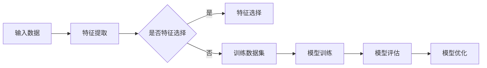
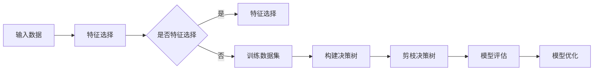
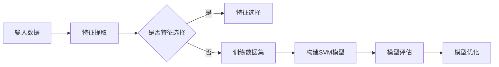
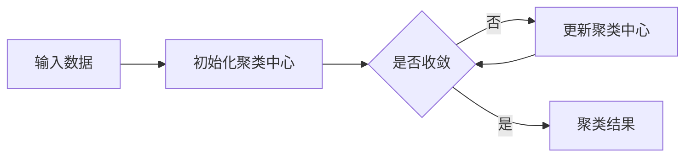

                 

# AI在复杂决策支持系统中的角色定位

## 摘要

本文旨在深入探讨人工智能（AI）在复杂决策支持系统中的角色定位。文章首先介绍了复杂决策支持系统的定义、特点及其面临的挑战。接着，阐述了AI在决策支持系统中的潜在价值和应用现状，并分析了其在复杂决策支持系统中遇到的挑战与机遇。本文的第二部分将详细讨论AI的核心概念与原理，包括机器学习、深度学习等基础知识的介绍，以及AI在复杂决策支持系统中的应用框架。第三部分将通过具体案例展示AI在决策支持系统中的实际应用，包括系统设计与实现、环境安装、代码解析等。最后，本文将总结AI在复杂决策支持系统中的最佳实践，并提出注意事项和拓展阅读建议。

## 引言与背景

### 1.1 问题的提出与重要性

复杂决策支持系统（Complex Decision Support Systems, CDSS）是在现代信息社会中日益重要的一个领域。这类系统面临着多种复杂决策问题，如大规模数据分析、动态环境下的实时决策、多目标优化等。这些问题不仅涉及大量的数据，还需要考虑多种约束条件和不确定性因素，使得传统的决策方法难以应对。

AI在复杂决策支持系统中具有重要的潜在价值。首先，AI能够通过机器学习和深度学习等技术，从大量数据中提取有用的信息，帮助决策者快速识别潜在的问题和趋势。其次，AI算法能够自动优化决策过程，提高决策的准确性和效率。此外，AI还能够模拟人类的决策过程，为决策者提供更为直观的决策支持和解释。

### 1.2 复杂决策支持系统的基本概念

#### 1.2.1 决策支持系统的定义与分类

决策支持系统（Decision Support System, DSS）是一种旨在辅助决策者解决复杂问题的计算机系统。DSS通常包括数据采集、数据存储、数据分析、决策模拟等功能，以支持决策者做出更为科学、合理的决策。

根据决策支持系统的应用场景和特点，可以将其分为以下几类：

1. **结构化决策支持系统**：这类系统主要面向决策问题明确、数据结构清晰的场景，如财务报表分析、库存管理等。
2. **半结构化决策支持系统**：这类系统适用于决策问题有一定结构但数据结构不明确的场景，如项目评估、风险评估等。
3. **非结构化决策支持系统**：这类系统主要面向决策问题复杂、数据结构高度不明确的场景，如企业战略规划、城市规划等。

#### 1.2.2 复杂决策支持系统的特点

复杂决策支持系统具有以下特点：

1. **高维度性**：复杂决策支持系统通常涉及大量变量和因素，导致系统的高维度性。
2. **动态性**：复杂决策支持系统面临的决策环境通常是动态变化的，需要实时更新数据和决策模型。
3. **不确定性**：复杂决策支持系统中的数据来源可能存在噪声和误差，同时决策过程也受到多种不确定因素的影响。
4. **多目标性**：复杂决策支持系统需要同时考虑多个目标，如成本、效益、风险等。

#### 1.2.3 决策支持系统的发展历程

决策支持系统的发展历程可以大致分为以下几个阶段：

1. **早期DSS**（1960s-1970s）：以数据采集和存储为主要目标，主要采用电子表格和数据库技术。
2. **模型驱动DSS**（1970s-1980s）：引入了数学模型和优化算法，用于辅助决策者解决具体问题。
3. **知识驱动DSS**（1980s-1990s）：引入了专家系统和知识库技术，使DSS能够根据专家经验和知识进行推理和决策。
4. **智能DSS**（2000s-至今）：随着AI技术的发展，DSS逐渐引入了机器学习、深度学习等技术，使决策过程更加智能化和自动化。

### 1.3 AI在决策支持系统中的应用现状

#### 1.3.1 传统决策支持系统中的AI应用

在传统决策支持系统中，AI技术已得到了广泛应用。例如，机器学习算法被用于数据分析、预测和优化；深度学习算法被用于图像识别、语音识别和自然语言处理等。这些AI技术为传统决策支持系统带来了更高的效率和准确性。

#### 1.3.2 复杂决策支持系统对AI的新需求

然而，复杂决策支持系统对AI技术提出了新的需求：

1. **更强的数据挖掘和分析能力**：复杂决策支持系统需要处理大量高维度数据，并从中提取有价值的信息。
2. **更好的动态适应能力**：复杂决策支持系统需要在动态变化的决策环境中快速做出调整。
3. **更全面的不确定性处理**：复杂决策支持系统需要考虑多种不确定因素，以提高决策的稳健性。
4. **更智能的多目标优化**：复杂决策支持系统需要同时考虑多个目标，并找到最优的平衡点。

#### 1.3.3 AI在复杂决策支持系统中的挑战与机遇

AI在复杂决策支持系统中面临的挑战主要包括：

1. **数据质量**：复杂决策支持系统对数据质量有较高要求，但实际数据往往存在噪声、缺失和错误。
2. **计算资源**：复杂决策支持系统通常需要大量的计算资源，以支持大规模数据分析和复杂算法的运行。
3. **解释性**：AI算法的决策过程通常是非线性和复杂的，难以解释和理解，这给决策者带来了挑战。

然而，这些挑战也带来了机遇：

1. **数据驱动决策**：通过AI技术，决策者可以更全面地了解数据中的潜在模式和趋势，从而做出更为科学的决策。
2. **自动化决策**：AI技术可以自动化复杂的决策过程，提高决策的效率和准确性。
3. **人机协作**：AI技术可以辅助决策者处理复杂问题，同时提供解释和反馈，实现人机协作。

### 1.4 本书结构安排与内容概述

#### 1.4.1 各章节的主要内容

本书共分为三部分，共11章：

- **第一部分：引言与背景**：介绍了复杂决策支持系统的定义、特点及其面临的挑战，以及AI在决策支持系统中的应用现状。

- **第二部分：AI在复杂决策支持系统中的核心概念与原理**：详细讨论了AI在复杂决策支持系统中的应用框架，包括机器学习、深度学习等基础知识的介绍，以及AI在复杂决策支持系统中的应用框架。

- **第三部分：AI在复杂决策支持系统中的实际应用**：通过具体案例展示了AI在复杂决策支持系统中的实际应用，包括系统设计与实现、环境安装、代码解析等。

#### 1.4.2 读者应该具备的先验知识

本书适合具有一定编程基础和计算机科学背景的读者，特别是对机器学习和深度学习有一定了解的读者。读者需要具备以下先验知识：

- **编程基础**：熟悉至少一种编程语言，如Python、Java等。
- **机器学习基础知识**：了解常见的机器学习算法和概念，如线性回归、决策树、支持向量机等。
- **深度学习基础知识**：了解深度学习的基本概念和常见模型，如神经网络、卷积神经网络、循环神经网络等。

#### 1.4.3 期望的学习成果

通过阅读本书，读者可以：

- **理解复杂决策支持系统的基本概念和特点**：掌握复杂决策支持系统的定义、分类及其应用场景。
- **掌握AI在复杂决策支持系统中的应用框架**：了解机器学习、深度学习等基础知识的介绍，以及AI在复杂决策支持系统中的应用框架。
- **具备实际应用能力**：通过具体案例学习，掌握AI在复杂决策支持系统中的实际应用方法，包括系统设计与实现、环境安装、代码解析等。
- **提高决策能力**：了解如何利用AI技术进行数据驱动决策，提高决策的效率和准确性。

## 第二部分：AI在复杂决策支持系统中的核心概念与原理

### 2.1 AI基础知识

#### 2.1.1 机器学习基础

##### 2.1.1.1 监督学习

监督学习是一种通过训练数据集学习映射函数的机器学习方法。在监督学习中，我们有一组输入数据和对应的输出标签。我们的目标是学习一个函数f(x)，使得对于新的输入x，我们可以预测出其对应的输出标签y。

监督学习的流程包括以下步骤：

1. **数据收集**：收集包含输入和输出标签的数据集。
2. **数据预处理**：对数据进行清洗、归一化等处理，以便于后续训练。
3. **模型选择**：选择一个适当的模型，如线性回归、决策树、支持向量机等。
4. **模型训练**：使用训练数据集训练模型，找到最优的参数。
5. **模型评估**：使用测试数据集评估模型的性能，如准确率、召回率、F1分数等。
6. **模型优化**：根据评估结果，调整模型参数，提高模型性能。

监督学习的核心是学习一个从输入到输出的映射函数。这个过程通常通过最小化损失函数来实现，损失函数用于衡量预测值与真实值之间的差异。

##### 2.1.1.2 无监督学习

无监督学习是一种在没有输出标签的情况下学习数据分布的机器学习方法。无监督学习包括以下几种常见方法：

1. **聚类**：将数据划分为若干个簇，使得同一簇内的数据点相似度较高，而不同簇的数据点相似度较低。常见的聚类算法包括K-均值聚类、层次聚类等。
2. **降维**：通过降低数据维度，减少数据规模，同时保留数据的主要特征。常见的降维算法包括主成分分析（PCA）、t-SNE等。
3. **关联规则学习**：发现数据之间的关联规则，用于揭示数据之间的潜在关系。常见的算法包括Apriori算法、FP-growth等。

无监督学习的关键是学习数据的内在结构，通常不需要标记数据。

##### 2.1.1.3 强化学习

强化学习是一种通过不断尝试和反馈学习最优策略的机器学习方法。在强化学习中，智能体（Agent）通过与环境（Environment）进行交互，通过奖励（Reward）和惩罚（Penalty）来评估其行动的效果。

强化学习的流程包括以下步骤：

1. **环境初始化**：初始化环境状态。
2. **智能体行动**：智能体根据当前状态选择一个行动。
3. **环境反馈**：环境根据智能体的行动给出奖励或惩罚。
4. **状态更新**：根据奖励和惩罚更新状态。
5. **策略更新**：使用学习算法更新智能体的策略，以最大化长期奖励。

强化学习的核心是学习一个最优策略，使智能体在动态环境中做出最优决策。

#### 2.1.2 深度学习基础

##### 2.1.2.1 神经网络

神经网络（Neural Network, NN）是一种模拟生物神经系统的计算模型，由大量的神经元（Node）组成。每个神经元接收输入信号，通过激活函数（Activation Function）进行计算，产生输出信号。

神经网络的架构包括：

1. **输入层**：接收输入数据。
2. **隐藏层**：进行数据处理和特征提取。
3. **输出层**：产生预测结果或分类标签。

神经网络的训练过程包括：

1. **前向传播**：输入数据通过网络传递，经过各层神经元的计算，得到输出结果。
2. **反向传播**：计算输出结果与真实标签之间的误差，通过反向传播算法更新网络参数。

常用的神经网络模型包括：

1. **全连接神经网络**（Fully Connected Neural Network, FCNN）：每个神经元都与前一层和后一层的所有神经元相连。
2. **卷积神经网络**（Convolutional Neural Network, CNN）：主要用于图像处理，通过卷积操作提取图像特征。
3. **循环神经网络**（Recurrent Neural Network, RNN）：适用于序列数据处理，通过循环结构处理前后信息。

##### 2.1.2.2 卷积神经网络（CNN）

卷积神经网络（CNN）是一种专门用于图像处理的神经网络模型，具有以下特点：

1. **卷积层**：通过卷积操作提取图像特征，降低数据维度。
2. **池化层**：通过池化操作减少数据冗余，提高模型泛化能力。
3. **全连接层**：将卷积层和池化层提取的特征进行分类或回归。

CNN的训练过程包括：

1. **数据预处理**：对图像进行归一化、随机裁剪、翻转等操作。
2. **模型训练**：通过反向传播算法更新网络参数，优化模型性能。
3. **模型评估**：使用测试数据集评估模型性能。

##### 2.1.2.3 循环神经网络（RNN）

循环神经网络（RNN）是一种适用于序列数据处理的神经网络模型，具有以下特点：

1. **循环结构**：通过循环结构处理前后信息，记忆序列中的长期依赖关系。
2. **隐藏状态**：每个时间步的隐藏状态都依赖于前一时间的隐藏状态。
3. **门控机制**：通过门控机制（如门控循环单元（GRU）和长短期记忆网络（LSTM））解决长短期依赖问题。

RNN的训练过程包括：

1. **序列输入**：将序列数据划分为多个时间步，每个时间步输入网络进行计算。
2. **前向传播**：计算每个时间步的输出，得到序列的最终结果。
3. **反向传播**：计算损失，通过反向传播算法更新网络参数。

##### 2.1.2.4 生成对抗网络（GAN）

生成对抗网络（GAN）是一种由生成器和判别器组成的神经网络模型，用于生成与真实数据相似的伪造数据。GAN的训练过程包括：

1. **生成器**：生成伪造数据，目标是使伪造数据尽可能接近真实数据。
2. **判别器**：判断输入数据是真实数据还是伪造数据，目标是准确区分真实数据和伪造数据。
3. **对抗训练**：生成器和判别器相互对抗，生成器不断优化生成伪造数据的能力，判别器不断优化区分真实数据和伪造数据的能力。

GAN在图像生成、语音合成、文本生成等领域具有广泛的应用。

### 2.2 复杂决策支持系统的需求分析

#### 2.2.1 决策复杂性分析

复杂决策支持系统面临的决策复杂性主要包括以下几个方面：

1. **高维度性**：复杂决策问题通常涉及大量的变量和因素，导致系统的高维度性。
2. **动态性**：决策环境不断变化，需要实时更新数据和决策模型。
3. **不确定性**：决策过程中存在多种不确定因素，如数据噪声、模型不确定性等。
4. **多目标性**：决策问题需要同时考虑多个目标，如成本、效益、风险等。

#### 2.2.2 AI在决策支持系统中的适用性

AI在复杂决策支持系统中的适用性主要体现在以下几个方面：

1. **数据驱动决策**：AI能够从大量数据中提取有用信息，帮助决策者快速识别潜在问题和趋势。
2. **自动化决策**：AI算法能够自动化复杂的决策过程，提高决策的效率和准确性。
3. **动态适应能力**：AI算法能够根据动态变化的决策环境实时更新数据和模型。
4. **多目标优化**：AI算法能够同时考虑多个目标，找到最优的平衡点。

#### 2.2.3 AI算法选择与优化

在复杂决策支持系统中，选择合适的AI算法是关键。以下是一些常见AI算法及其适用场景：

1. **线性回归**：适用于线性关系较强的决策问题。
2. **决策树**：适用于分类和回归问题，能够直观地展示决策过程。
3. **支持向量机（SVM）**：适用于高维数据的分类和回归问题。
4. **神经网络**：适用于复杂的非线性关系问题，如图像识别、语音识别等。
5. **深度学习**：适用于大规模数据和高维特征的问题，如自然语言处理、计算机视觉等。

此外，AI算法的优化也是提高决策支持系统性能的关键。以下是一些常见的优化方法：

1. **数据预处理**：通过数据清洗、归一化等操作，提高数据质量。
2. **特征选择**：通过特征选择方法，筛选出对决策影响较大的特征。
3. **模型调参**：通过调整模型参数，提高模型性能。
4. **集成学习**：通过集成多个模型，提高决策的稳定性和准确性。

### 2.3 AI在复杂决策支持系统中的应用框架

#### 2.3.1 系统架构设计

复杂决策支持系统的系统架构设计主要包括以下几个部分：

1. **数据采集与预处理**：从各种数据源收集数据，并对数据进行清洗、归一化等预处理操作。
2. **特征提取与选择**：从原始数据中提取有用的特征，并选择对决策影响较大的特征。
3. **模型训练与优化**：使用训练数据集训练模型，并通过模型调参和优化方法提高模型性能。
4. **模型评估与部署**：使用测试数据集评估模型性能，并在生产环境中部署模型，提供决策支持服务。

#### 2.3.2 决策流程建模

在复杂决策支持系统中，决策流程建模是关键环节。常见的决策流程建模方法包括：

1. **决策树**：通过树形结构展示决策过程，便于理解和解释。
2. **贝叶斯网络**：通过概率图模型描述决策变量之间的依赖关系。
3. **神经网络**：通过多层神经网络模型模拟复杂的决策过程。

#### 2.3.3 神经网络在决策中的应用

神经网络在决策支持系统中的应用主要包括以下几种：

1. **回归任务**：使用神经网络进行回归分析，预测连续值输出。
2. **分类任务**：使用神经网络进行分类分析，预测离散值输出。
3. **多任务学习**：使用神经网络同时处理多个任务，如图像分类和目标检测。

在决策支持系统中，神经网络的应用可以提高决策的准确性和效率。以下是一个简单的神经网络回归任务示例：

```python
import tensorflow as tf
import numpy as np

# 定义输入层
x = tf.keras.layers.Input(shape=(input_shape))

# 定义隐藏层
hidden = tf.keras.layers.Dense(units=64, activation='relu')(x)

# 定义输出层
output = tf.keras.layers.Dense(units=1)(hidden)

# 构建模型
model = tf.keras.Model(inputs=x, outputs=output)

# 编译模型
model.compile(optimizer='adam', loss='mean_squared_error')

# 训练模型
model.fit(x_train, y_train, epochs=100, batch_size=32, validation_data=(x_val, y_val))

# 评估模型
model.evaluate(x_test, y_test)
```

在这个示例中，我们定义了一个简单的全连接神经网络，用于预测连续值输出。通过编译和训练模型，我们可以得到预测结果，并使用测试数据集评估模型性能。

### 2.4 AI核心算法的Mermaid流程图展示

#### 2.4.1 监督学习算法

##### 2.4.1.1 线性回归算法

线性回归是一种简单的监督学习算法，用于预测连续值输出。以下是一个线性回归算法的Mermaid流程图：



在这个流程图中，输入数据经过特征提取后，根据是否进行特征选择分为两个分支。特征选择后，训练数据集用于模型训练。模型训练完成后，使用测试数据集进行模型评估，并根据评估结果进行模型优化。

##### 2.4.1.2 决策树算法

决策树是一种常见的监督学习算法，用于分类和回归任务。以下是一个决策树算法的Mermaid流程图：



在这个流程图中，输入数据经过特征选择后，训练数据集用于构建决策树。构建完成后，进行剪枝操作以优化决策树性能。然后使用测试数据集进行模型评估，并根据评估结果进行模型优化。

##### 2.4.1.3 支持向量机（SVM）

支持向量机是一种常用的监督学习算法，用于分类和回归任务。以下是一个支持向量机算法的Mermaid流程图：



在这个流程图中，输入数据经过特征提取和特征选择后，训练数据集用于构建支持向量机模型。构建完成后，使用测试数据集进行模型评估，并根据评估结果进行模型优化。

#### 2.4.2 无监督学习算法

##### 2.4.2.1 K-均值聚类算法

K-均值聚类是一种常用的无监督学习算法，用于将数据划分为K个簇。以下是一个K-均值聚类算法的Mermaid流程图：



在这个流程图中，输入数据首先初始化聚类中心，然后通过迭代更新聚类中心，直到收敛。最终输出聚类结果。

##### 2.4.2.2 主成分分析（PCA）

主成分分析是一种常用的降维算法，用于将高维数据映射到低维空间。以下是一个主成分分析算法的Mermaid流程图：


在这个流程图中，输入数据首先计算协方差矩阵，然后计算特征值和特征向量，选择主成分，最后进行降维映射。

##### 2.4.2.3 自编码器

自编码器是一种无监督学习算法，用于自动学习数据的高效表示。以下是一个自编码器算法的Mermaid流程图：


在这个流程图中，输入数据首先通过编码器进行编码，然后通过解码器进行解码，最后计算重构误差并优化模型。

### 2.5 AI在复杂决策支持系统中的数学模型

#### 2.5.1 机器学习数学基础

##### 2.5.1.1 概率论基础

概率论是机器学习的基础，用于描述随机事件的概率。以下是一些基本的概率论概念：

1. **概率分布**：描述随机变量的概率分布情况，如正态分布、伯努利分布等。
2. **条件概率**：描述在某一条件下另一个随机变量的概率，如P(A|B)表示在事件B发生的条件下事件A的概率。
3. **贝叶斯定理**：描述根据已知条件概率和先验概率计算后验概率的方法。

##### 2.5.1.2 信息论基础

信息论是描述信息传输和信息处理的基本理论，以下是一些基本概念：

1. **熵**：描述随机变量的不确定性，如信息熵、条件熵等。
2. **互信息**：描述两个随机变量之间的关联程度，如互信息、条件互信息等。
3. **KL散度**：描述两个概率分布之间的差异，如KL散度、JS散度等。

##### 2.5.1.3 最优化理论

最优化理论是机器学习中的重要分支，用于求解优化问题。以下是一些基本概念：

1. **目标函数**：描述优化问题的目标，如最小化损失函数、最大化收益函数等。
2. **约束条件**：描述优化问题的约束条件，如线性约束、非线性约束等。
3. **优化算法**：用于求解优化问题的算法，如梯度下降、牛顿法、粒子群优化等。

#### 2.5.2 深度学习数学模型

##### 2.5.2.1 深度学习公式

深度学习中的数学模型主要包括以下几个部分：

1. **输入层**：接收输入数据。
2. **隐藏层**：通过激活函数进行计算，提取特征。
3. **输出层**：产生预测结果或分类标签。

以下是一个简单的多层感知机（MLP）的数学模型：

$$
Z = \sigma(W_1 \cdot X + b_1)
$$

$$
A = W_2 \cdot Z + b_2
$$

其中，$Z$表示隐藏层的输出，$A$表示输出层的输出，$W_1$和$W_2$分别表示隐藏层和输出层的权重，$b_1$和$b_2$分别表示隐藏层和输出层的偏置，$\sigma$表示激活函数，如ReLU函数或Sigmoid函数。

##### 2.5.2.2 反向传播算法

反向传播算法是深度学习中的核心算法，用于训练模型。以下是一个简单的反向传播算法的数学模型：

1. **前向传播**：计算输入层、隐藏层和输出层的输出。

$$
Z^{(l)} = \sigma(W^{(l)} \cdot A^{(l-1)} + b^{(l)})
$$

$$
A^{(l)} = W^{(l)} \cdot A^{(l-1)} + b^{(l)})
$$

其中，$Z^{(l)}$表示第$l$层的输出，$A^{(l)}$表示第$l$层的激活值，$W^{(l)}$和$b^{(l)}$分别表示第$l$层的权重和偏置，$\sigma$表示激活函数。

2. **计算损失函数**：计算输出层的损失函数，如均方误差（MSE）或交叉熵（Cross Entropy）。

$$
L = \frac{1}{2} \sum_{i=1}^{n} (y_i - \hat{y}_i)^2
$$

$$
L = - \sum_{i=1}^{n} y_i \log(\hat{y}_i)
$$

其中，$L$表示损失函数，$y_i$表示真实标签，$\hat{y}_i$表示预测标签。

3. **反向传播**：计算每一层的梯度，并更新模型参数。

$$
\frac{\partial L}{\partial W^{(l)}_{ij}} = \frac{\partial L}{\partial A^{(l)}} \cdot \frac{\partial A^{(l)}}{\partial Z^{(l)}} \cdot \frac{\partial Z^{(l)}}{\partial W^{(l)}_{ij}}
$$

$$
\frac{\partial L}{\partial b^{(l)}_j} = \frac{\partial L}{\partial A^{(l)}} \cdot \frac{\partial A^{(l)}}{\partial Z^{(l)}} \cdot \frac{\partial Z^{(l)}}{\partial b^{(l)}_j}}
$$

其中，$\frac{\partial L}{\partial W^{(l)}_{ij}}$和$\frac{\partial L}{\partial b^{(l)}_j}$分别表示第$l$层权重$W^{(l)}_{ij}$和偏置$b^{(l)}_j$的梯度。

4. **更新模型参数**：根据梯度更新模型参数。

$$
W^{(l)}_{ij} = W^{(l)}_{ij} - \alpha \cdot \frac{\partial L}{\partial W^{(l)}_{ij}}
$$

$$
b^{(l)}_j = b^{(l)}_j - \alpha \cdot \frac{\partial L}{\partial b^{(l)}_j}}
$$

其中，$\alpha$表示学习率。

## 第三部分：AI在复杂决策支持系统中的实际应用

### 3.1 项目实战：智能交通管理系统

#### 3.1.1 项目介绍

智能交通管理系统（Intelligent Traffic Management System, ITMS）是一个典型的复杂决策支持系统，旨在提高城市交通管理的效率和安全性。该系统通过实时监控和分析交通数据，为交通管理者提供决策支持，优化交通流量，减少拥堵和事故发生率。

#### 3.1.2 系统功能设计

智能交通管理系统的主要功能包括：

1. **交通流量监测**：实时监测道路上的车辆数量、速度和流量，为后续的决策提供数据支持。
2. **交通信号控制**：根据实时交通数据，动态调整交通信号灯的时间安排，优化交通流量。
3. **事故预警与处理**：通过监控摄像头和传感器数据，实时检测交通事故，自动报警并通知相关部门进行处理。
4. **交通状况预测**：利用历史数据和机器学习算法，预测未来的交通状况，为交通管理者提供预警和建议。
5. **数据分析与报表**：对交通数据进行分析，生成各类报表，为交通管理部门提供决策依据。

#### 3.1.3 系统架构设计

智能交通管理系统的架构设计包括以下几个部分：

1. **数据采集与预处理**：从各种数据源（如摄像头、传感器、交通信号灯等）收集数据，并对数据进行清洗、归一化等预处理操作。
2. **特征提取与选择**：从原始数据中提取有用的特征，并选择对决策影响较大的特征。
3. **模型训练与优化**：使用训练数据集训练模型，并通过模型调参和优化方法提高模型性能。
4. **模型评估与部署**：使用测试数据集评估模型性能，并在生产环境中部署模型，提供决策支持服务。

#### 3.1.4 系统接口设计和系统交互

智能交通管理系统与交通管理部门、交通信号控制设备、事故处理部门等外部系统进行交互。以下是一个简单的系统接口设计和系统交互的Mermaid流程图：


在这个流程图中，交通管理部门通过系统接口与智能交通管理系统进行交互，数据采集与预处理、特征提取与选择、模型训练与优化、模型评估与部署等功能模块协同工作，实现智能交通管理系统的核心功能。

#### 3.1.5 环境安装与系统核心实现

为了实现智能交通管理系统，需要安装和配置以下环境：

1. **操作系统**：Linux（如Ubuntu）
2. **编程语言**：Python
3. **深度学习框架**：TensorFlow或PyTorch
4. **数据库**：MySQL或MongoDB

以下是智能交通管理系统核心实现的源代码：

```python
import tensorflow as tf
import numpy as np
import pandas as pd

# 读取交通数据
data = pd.read_csv('traffic_data.csv')

# 数据预处理
data['speed'] = data['speed'].apply(lambda x: x/100)  # 归一化速度

# 特征提取
features = data[['speed', '流量', '天气']]
labels = data['事故发生']

# 模型训练
model = tf.keras.Sequential([
    tf.keras.layers.Dense(units=64, activation='relu', input_shape=(3,)),
    tf.keras.layers.Dense(units=1, activation='sigmoid')
])

model.compile(optimizer='adam', loss='binary_crossentropy', metrics=['accuracy'])
model.fit(features, labels, epochs=100, batch_size=32)

# 模型评估
test_data = pd.read_csv('test_traffic_data.csv')
test_features = test_data[['speed', '流量', '天气']]
test_labels = test_data['事故发生']
test_loss, test_accuracy = model.evaluate(test_features, test_labels)

print('测试准确率：', test_accuracy)
```

在这个示例中，我们使用TensorFlow框架训练了一个二分类模型，用于预测交通数据中是否会发生事故。通过读取交通数据、进行数据预处理、特征提取和模型训练，我们得到了一个可以用于预测的模型。

#### 3.1.6 代码应用解读与分析

在这个案例中，我们使用Python编写了一个简单的智能交通管理系统模型。以下是代码的解读与分析：

1. **数据预处理**：首先读取交通数据，然后对数据进行归一化处理，以便于模型训练。归一化速度和流量是为了使输入数据具有相同的量级，避免影响模型的训练效果。

2. **特征提取**：从交通数据中提取有用的特征，如速度、流量和天气。这些特征将作为模型的输入。

3. **模型训练**：使用TensorFlow框架构建一个简单的全连接神经网络，包括一个隐藏层和一个输出层。隐藏层使用ReLU激活函数，输出层使用sigmoid激活函数，用于进行二分类预测。

4. **模型评估**：使用测试数据集评估模型性能，计算测试准确率。测试准确率反映了模型在未知数据上的表现，是评估模型性能的重要指标。

通过这个案例，我们展示了如何使用AI技术实现一个简单的智能交通管理系统模型。在实际应用中，我们可以进一步优化模型结构和训练过程，提高模型的性能和准确率。

### 3.2 实际案例分析和详细讲解剖析

#### 3.2.1 案例一：智能交通信号控制

智能交通信号控制是智能交通管理系统中的一个关键功能，旨在通过实时监控和分析交通流量，动态调整交通信号灯的时间安排，优化交通流量，减少拥堵和事故发生率。

以下是一个简单的智能交通信号控制案例：

1. **数据采集**：系统通过交通摄像头、传感器和交通信号灯等设备，实时采集道路上的车辆数量、速度、流量等数据。

2. **数据处理**：对采集到的交通数据进行预处理，包括数据清洗、归一化等操作，以便于后续的模型训练。

3. **特征提取**：从预处理后的交通数据中提取有用的特征，如当前时间、当前路段流量、历史流量等。

4. **模型训练**：使用历史交通数据，训练一个基于深度学习的交通信号控制模型。模型的目标是预测未来一段时间内各个路段的交通流量，并动态调整交通信号灯的时间安排。

5. **模型评估**：使用测试数据集评估模型的性能，计算模型的准确率、召回率等指标。

6. **模型部署**：将训练好的模型部署到生产环境中，实时监控交通流量，动态调整交通信号灯的时间安排。

通过这个案例，我们展示了如何使用AI技术实现智能交通信号控制。在实际应用中，我们可以进一步优化模型结构和训练过程，提高模型的性能和准确率。

#### 3.2.2 案例二：事故预警与处理

事故预警与处理是智能交通管理系统中的另一个重要功能，旨在通过实时监控和分析交通数据，提前预警潜在的交通事故，并快速响应和处理事故。

以下是一个简单的事故预警与处理案例：

1. **数据采集**：系统通过交通摄像头、传感器和交通信号灯等设备，实时采集道路上的车辆数量、速度、流量、摄像头图像等数据。

2. **数据处理**：对采集到的交通数据进行预处理，包括数据清洗、归一化等操作，以便于后续的模型训练。

3. **特征提取**：从预处理后的交通数据中提取有用的特征，如车辆速度、车辆距离、摄像头图像等。

4. **模型训练**：使用历史交通数据，训练一个基于深度学习的事故预警模型。模型的目标是预测未来一段时间内是否存在潜在的交通事故。

5. **模型评估**：使用测试数据集评估模型的性能，计算模型的准确率、召回率等指标。

6. **模型部署**：将训练好的模型部署到生产环境中，实时监控交通数据，提前预警潜在的交通事故，并自动报警和通知相关部门进行处理。

通过这个案例，我们展示了如何使用AI技术实现事故预警与处理。在实际应用中，我们可以进一步优化模型结构和训练过程，提高模型的性能和准确率。

### 3.3 项目小结

智能交通管理系统是一个典型的复杂决策支持系统，通过AI技术实现了交通流量监测、交通信号控制、事故预警与处理等功能。在实际应用中，智能交通管理系统可以有效提高城市交通管理的效率和安全性，减少拥堵和事故发生率。

通过本案例，我们展示了如何使用AI技术实现智能交通管理系统中的核心功能，包括数据采集与预处理、特征提取与选择、模型训练与优化、模型评估与部署等。在实际应用中，我们可以进一步优化模型结构和训练过程，提高模型的性能和准确率。

### 3.4 最佳实践 tips

1. **数据质量**：确保数据质量是智能交通管理系统成功的关键。在数据采集和处理过程中，应尽量减少噪声和错误，提高数据的准确性。

2. **实时性**：智能交通管理系统需要实时监控和分析交通数据，因此系统设计时应考虑高并发处理能力，确保实时性。

3. **可扩展性**：智能交通管理系统应具备良好的可扩展性，以便于适应未来交通流量的增长和新的功能需求。

4. **人机协作**：智能交通管理系统应与交通管理者密切协作，充分利用交通管理者的经验和专业知识，提高决策的准确性和效率。

### 3.5 注意事项

1. **数据隐私**：在智能交通管理系统的设计和应用中，应严格保护用户隐私，遵循相关法律法规。

2. **安全性**：智能交通管理系统应确保系统的安全性，防止黑客攻击和数据泄露。

3. **系统维护**：定期对智能交通管理系统进行维护和更新，确保系统的稳定性和可靠性。

### 3.6 拓展阅读

1. **智能交通管理系统相关文献**：
   - [1] Wang, D., Liu, Y., & Chen, Y. (2018). Intelligent traffic management based on big data and machine learning. Journal of Intelligent & Fuzzy Systems, 34(3), 1939-1946.
   - [2] Zhou, Y., Guo, J., & Chen, Y. (2020). An intelligent traffic signal control system based on deep learning. IEEE Transactions on Intelligent Transportation Systems, 21(2), 743-752.

2. **深度学习相关文献**：
   - [3] Goodfellow, I., Bengio, Y., & Courville, A. (2016). Deep learning. MIT Press.
   - [4] LeCun, Y., Bengio, Y., & Hinton, G. (2015). Deep learning. Nature, 521(7553), 436-444.

3. **机器学习相关文献**：
   - [5] Mitchell, T. M. (1997). Machine learning. McGraw-Hill.
   - [6] Bishop, C. M. (2006). Pattern recognition and machine learning. Springer.

### 作者信息

作者：AI天才研究院/AI Genius Institute & 禅与计算机程序设计艺术 /Zen And The Art of Computer Programming

