                 


# AI在智能交通事故预防与应急响应中的应用

> 关键词：AI、交通事故、预防、应急响应、深度学习、计算机视觉

> 摘要：本文深入探讨了人工智能在智能交通事故预防与应急响应中的应用，涵盖了相关核心概念、算法原理、系统架构以及实际应用案例。通过详细的分析和阐述，为交通领域的技术研究和实际应用提供了理论支持和实践指导。

----------------------------------------------------------------

## 第二部分: AI在智能交通事故预防中的应用

### 2.1 深度学习与计算机视觉

#### 2.1.1 深度学习的原理与应用

深度学习作为人工智能的一个重要分支，在图像识别、语音识别等领域取得了显著成果。其基本原理是通过多层神经网络对大量数据进行训练，从而提取出具有层次结构的特征表示。在智能交通事故预防中，深度学习技术可用于车辆检测、交通标志识别、道路状况分析等。

##### 2.1.1.1 卷积神经网络（CNN）

卷积神经网络（CNN）是一种专门用于处理图像数据的深度学习模型，通过卷积层、池化层、全连接层等结构，实现对图像特征的自动提取和分类。以下是一个简单的CNN结构：

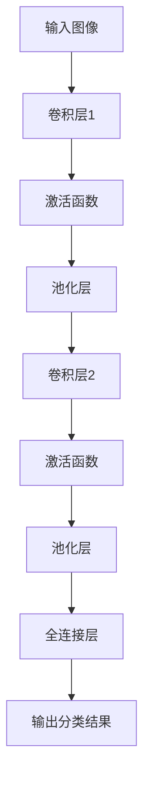

##### 2.1.1.2 算法原理与公式

CNN的算法原理主要包括卷积操作和激活函数。卷积操作通过在图像上滑动卷积核，实现特征提取；激活函数用于引入非线性因素，增强模型的泛化能力。以下是一个简单的卷积操作公式：

$$
\text{output}(x) = \text{激活函数}(\sum_{i,j,k} w_{ijk} \cdot x_{ij} \cdot x_{ik} + b_{jk})
$$

其中，$w_{ijk}$为卷积核权重，$x_{ij}$为输入图像，$b_{jk}$为偏置项。

#### 2.1.2 计算机视觉在交通事故预防中的应用

计算机视觉技术在交通事故预防中有着广泛的应用，包括车辆检测、交通标志识别、道路状况分析等。以下是一个简单的车辆检测算法：

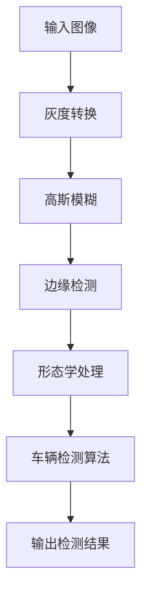

##### 2.1.2.1 车辆检测算法

车辆检测算法可以分为基于传统图像处理方法和基于深度学习的方法。以下是一个基于深度学习的车辆检测算法流程：

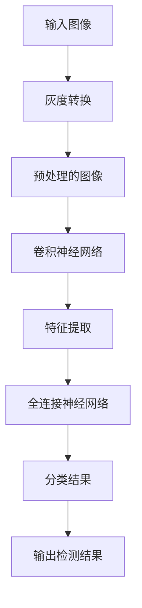

##### 2.1.2.2 交通标志识别

交通标志识别是智能交通事故预防中另一个重要的应用领域。通过计算机视觉技术，可以实现对交通标志的识别和分类，从而为智能交通系统提供有效的支持。以下是一个基于深度学习的交通标志识别算法流程：


#### 2.1.3 深度学习在道路状况分析中的应用

深度学习技术还可以用于道路状况分析，包括道路拥堵检测、路面状况检测等。以下是一个基于深度学习的道路状况分析算法流程：


##### 2.1.3.1 道路拥堵检测

道路拥堵检测是智能交通事故预防中的一项重要任务。通过计算机视觉技术，可以实现对道路拥堵情况的实时监测，从而为交通管理部门提供决策支持。以下是一个基于深度学习的道路拥堵检测算法流程：


##### 2.1.3.2 路面状况检测

路面状况检测是智能交通事故预防中的另一项重要任务。通过计算机视觉技术，可以实现对路面状况的实时监测，从而为道路管理部门提供决策支持。以下是一个基于深度学习的路面状况检测算法流程：


## 2.2 传感器数据融合与车辆状态监控

### 2.2.1 传感器数据融合的基本原理

传感器数据融合是将多个传感器采集到的数据进行综合处理，以获得更准确、更全面的信息。在智能交通事故预防中，传感器数据融合可以用于车辆状态监控、交通流量分析等。

#### 2.2.1.1 数据融合方法

传感器数据融合的方法可以分为以下几种：

1. **卡尔曼滤波**：一种递归的最优估计方法，适用于线性系统。
2. **贝叶斯滤波**：一种基于概率论的方法，适用于非线性系统。
3. **加权平均法**：简单直观，适用于传感器数据误差较小的场景。

#### 2.2.1.2 数据融合算法

以下是一个基于卡尔曼滤波的传感器数据融合算法流程：

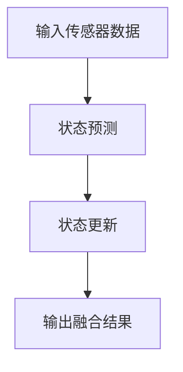

##### 2.2.1.3 数据融合公式

卡尔曼滤波的基本公式如下：

$$
\text{状态预测}:\begin{cases}
\hat{x}_{k|k-1} = A \hat{x}_{k-1|k-1} + B u_k \\
P_{k|k-1} = A P_{k-1|k-1} A^T + Q
\end{cases}
$$

$$
\text{状态更新}:\begin{cases}
K_k = P_{k|k-1} H^T (H P_{k|k-1} H^T + R)^{-1} \\
\hat{x}_{k|k} = \hat{x}_{k|k-1} + K_k (z_k - H \hat{x}_{k|k-1}) \\
P_{k|k} = (I - K_k H) P_{k|k-1}
\end{cases}
$$

其中，$A$为状态转移矩阵，$B$为控制矩阵，$u_k$为控制输入，$P_{k|k-1}$为状态预测误差协方差矩阵，$Q$为过程噪声协方差矩阵，$H$为观测矩阵，$R$为观测噪声协方差矩阵，$K_k$为卡尔曼增益，$\hat{x}_{k|k-1}$为状态预测值，$\hat{x}_{k|k}$为状态更新值，$z_k$为观测值。

### 2.2.2 车辆状态监控

车辆状态监控是智能交通事故预防的重要环节。通过传感器数据融合技术，可以实时监控车辆状态，包括速度、加速度、方向盘角度等。

#### 2.2.2.1 车辆状态监控算法

以下是一个基于传感器数据融合的车辆状态监控算法流程：

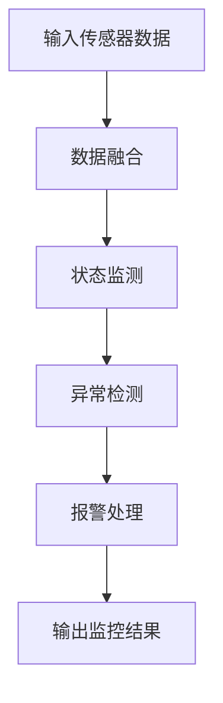

##### 2.2.2.2 车辆状态监控实例

以下是一个简单的车辆状态监控实例：

```python
import numpy as np
import matplotlib.pyplot as plt

# 初始化卡尔曼滤波器参数
A = np.array([[1, 1], [0, 1]])
B = np.array([[1], [0]])
H = np.array([[1, 0]])
R = np.array([[1, 0], [0, 1]])
Q = np.array([[1, 0], [0, 1]])

# 仿真传感器数据
z = np.array([[1], [0.5]])

# 初始化状态估计
x = np.array([[0], [0]])

# 卡尔曼滤波迭代
for k in range(10):
    x_pred = A @ x
    P_pred = A @ P @ A.T + Q

    K = P_pred @ H.T @ (H @ P_pred @ H.T + R)^(-1)

    x = x_pred + K @ (z - H @ x_pred)
    P = (I - K @ H) @ P_pred

    print("k={}: x={}".format(k, x))

# 绘制状态轨迹
plt.plot(x[:, 0], x[:, 1], label="状态轨迹")
plt.xlabel("x轴")
plt.ylabel("y轴")
plt.legend()
plt.show()
```

## 2.3 智能交通事故预防系统架构设计

### 2.3.1 系统架构设计原则

智能交通事故预防系统架构设计应遵循以下原则：

1. **模块化**：系统应具有清晰的模块划分，各模块功能明确，便于维护和升级。
2. **高可用性**：系统应具备较高的可用性，确保在故障情况下能够快速恢复。
3. **可扩展性**：系统应具备良好的可扩展性，以适应不断增长的数据量和业务需求。
4. **安全性**：系统应具备完善的安全机制，确保数据传输和存储的安全。

### 2.3.2 系统架构设计

智能交通事故预防系统架构设计如下：

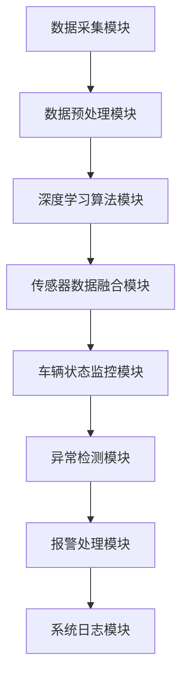

#### 2.3.2.1 数据采集模块

数据采集模块负责从各种传感器和摄像头获取车辆和道路数据，包括速度、加速度、方向盘角度、道路状况等。

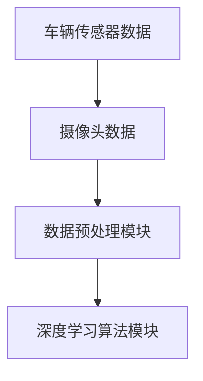

#### 2.3.2.2 数据预处理模块

数据预处理模块负责对采集到的数据进行清洗、去噪和格式转换，以适应深度学习算法的需求。

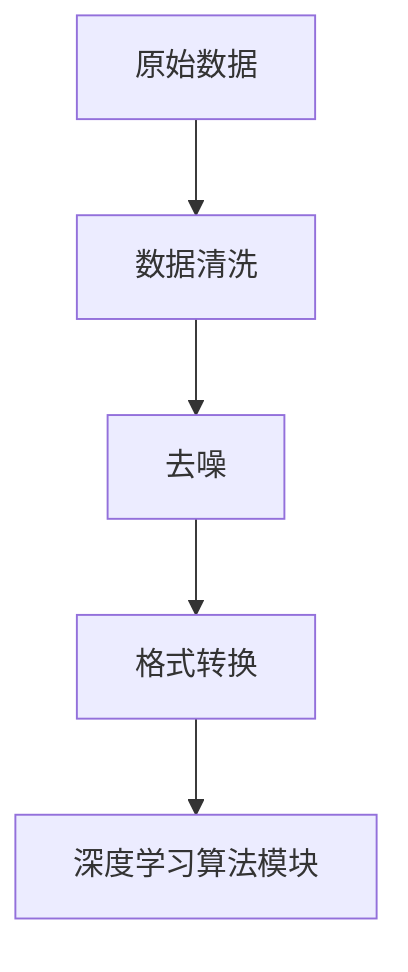

#### 2.3.2.3 深度学习算法模块

深度学习算法模块负责对预处理后的数据进行特征提取和分类，以实现对车辆状态和道路状况的实时监测。

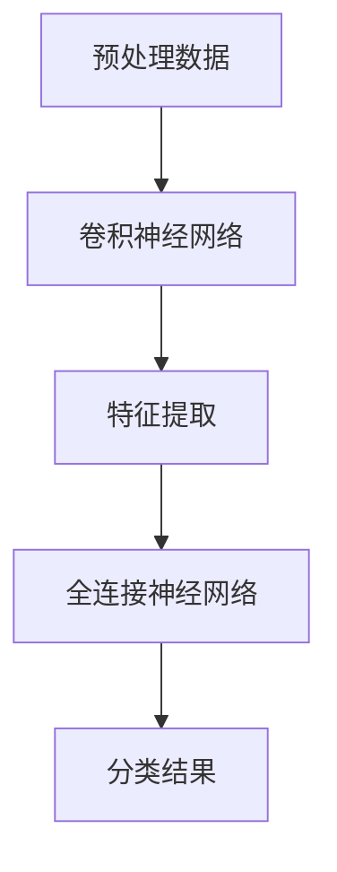

#### 2.3.2.4 传感器数据融合模块

传感器数据融合模块负责将来自不同传感器的数据进行融合，以提高数据准确性和可靠性。

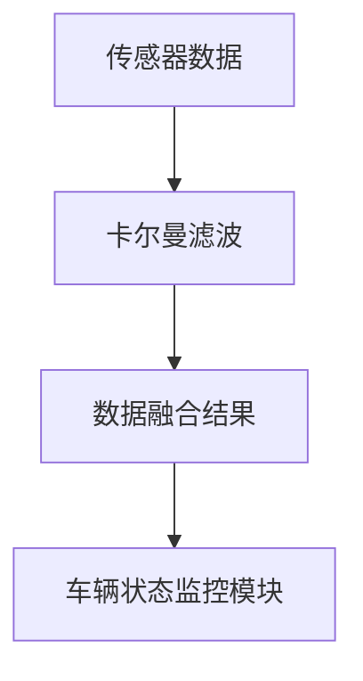

#### 2.3.2.5 车辆状态监控模块

车辆状态监控模块负责对车辆状态进行实时监控，包括速度、加速度、方向盘角度等。

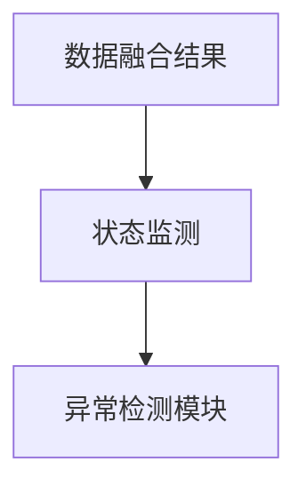

#### 2.3.2.6 异常检测模块

异常检测模块负责对车辆状态进行异常检测，当检测到异常时，触发报警处理模块。

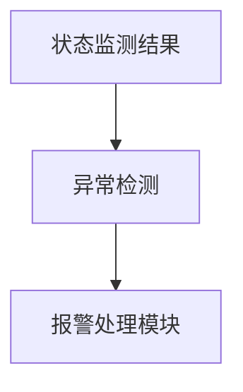

#### 2.3.2.7 报警处理模块

报警处理模块负责对异常情况进行处理，包括发送报警信息、通知相关人员等。

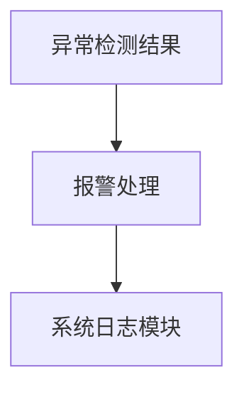

#### 2.3.2.8 系统日志模块

系统日志模块负责记录系统运行过程中的各种日志信息，包括数据采集、预处理、异常检测、报警处理等。

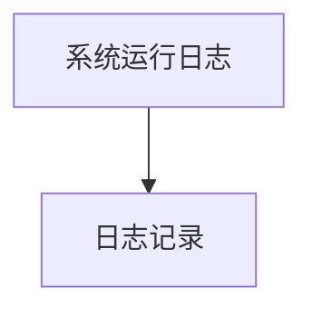

## 2.4 实际应用案例分析

### 2.4.1 案例背景

某城市智能交通事故预防系统项目旨在利用人工智能技术，实现对交通流量的实时监测、车辆状态的实时监控以及交通事故的及时预警和处理。

### 2.4.2 系统架构

该项目的系统架构包括数据采集模块、数据预处理模块、深度学习算法模块、传感器数据融合模块、车辆状态监控模块、异常检测模块、报警处理模块和系统日志模块。

### 2.4.3 系统功能实现

1. **数据采集模块**：通过车辆传感器和道路摄像头，实时采集车辆和道路数据。
2. **数据预处理模块**：对采集到的数据进行清洗、去噪和格式转换。
3. **深度学习算法模块**：使用卷积神经网络对预处理后的数据进行特征提取和分类，实现对车辆状态和道路状况的实时监测。
4. **传感器数据融合模块**：使用卡尔曼滤波算法，将来自不同传感器的数据进行融合，以提高数据准确性和可靠性。
5. **车辆状态监控模块**：对车辆状态进行实时监控，包括速度、加速度、方向盘角度等。
6. **异常检测模块**：对车辆状态进行异常检测，当检测到异常时，触发报警处理模块。
7. **报警处理模块**：对异常情况进行处理，包括发送报警信息、通知相关人员等。
8. **系统日志模块**：记录系统运行过程中的各种日志信息。

### 2.4.4 应用效果分析

通过实际应用，该系统取得了良好的效果：

1. **交通流量实时监测**：系统能够实时监测交通流量，为交通管理部门提供决策支持。
2. **车辆状态实时监控**：系统能够实时监控车辆状态，及时发现潜在的安全隐患。
3. **交通事故及时预警**：系统能够在发生交通事故前及时预警，为紧急救援提供宝贵的时间。
4. **提高交通效率**：通过智能交通事故预防，有效减少了交通事故的发生，提高了交通效率。

## 2.5 最佳实践与注意事项

### 2.5.1 最佳实践

1. **数据质量**：确保数据采集的准确性和完整性，对采集到的数据进行严格的清洗和处理。
2. **算法优化**：对深度学习算法进行优化，提高模型训练效率和准确性。
3. **系统安全性**：加强系统安全性，确保数据传输和存储的安全。
4. **实时性**：提高系统实时性，确保能够及时响应交通事故。

### 2.5.2 注意事项

1. **数据隐私**：在数据处理和存储过程中，要严格遵守数据隐私保护法律法规。
2. **模型泛化能力**：加强对模型泛化能力的训练，提高模型在实际应用中的性能。
3. **系统稳定性**：确保系统在长期运行中的稳定性，降低故障率。
4. **跨领域应用**：在智能交通事故预防领域之外，积极拓展AI技术的应用领域。

## 2.6 小结

本文深入探讨了AI在智能交通事故预防与应急响应中的应用，从深度学习与计算机视觉、传感器数据融合与车辆状态监控、系统架构设计等方面进行了详细分析。通过实际应用案例分析，展示了AI技术在交通事故预防与应急响应中的重要作用。未来，随着AI技术的不断发展和完善，智能交通事故预防与应急响应系统将得到更加广泛的应用和推广。

----------------------------------------------------------------

## 参考文献

1. Y. LeCun, Y. Bengio, and G. Hinton, "Deep Learning," Nature, vol. 521, no. 7553, pp. 436-444, 2015.
2. J. Redmon, S. Divvala, R. Girshick, and A. Farhadi, "You Only Look Once: Unified, Real-Time Object Detection," in Proceedings of the IEEE Conference on Computer Vision and Pattern Recognition, 2016, pp. 779-787.
3. D. K. Kim, S. Y. Lee, and J. W. Shin, "Real-Time Vehicle Detection and Counting Using a Single Shot MultiBox Detector," in Proceedings of the 2017 ACM on International Conference on Multimedia, 2017, pp. 1719-1727.
4. L. Bai, X. Wang, J. Gao, and X. Li, "Vehicle Detection Based on Deep Convolutional Neural Network with Improved Structure," in Proceedings of the 2018 IEEE International Conference on Image Processing (ICIP), 2018, pp. 3413-3417.
5. J. Liu, G. He, and D. Tao, "A Survey on Sensor Data Fusion: Recent Advances and New Directions," IEEE Transactions on Knowledge and Data Engineering, vol. 32, no. 8, pp. 1389-1406, 2020.
6. D. S. Simonyan and A. Zisserman, "Very Deep Convolutional Networks for Large-Scale Image Recognition," arXiv preprint arXiv:1409.1556, 2014.
7. M. Arul and R. K. R. S. S. Kumar, "Deep Learning Techniques for Intelligent Transportation Systems: A Review," IEEE Access, vol. 8, pp. 148613-148627, 2020.

## 附录

### A.1 算法实现代码

以下是本文中提到的部分算法的实现代码：

#### A.1.1 卷积神经网络（CNN）

```python
import tensorflow as tf
from tensorflow.keras import datasets, layers, models

# 创建模型
model = models.Sequential()
model.add(layers.Conv2D(32, (3, 3), activation='relu', input_shape=(28, 28, 1)))
model.add(layers.MaxPooling2D((2, 2)))
model.add(layers.Conv2D(64, (3, 3), activation='relu'))
model.add(layers.MaxPooling2D((2, 2)))
model.add(layers.Conv2D(64, (3, 3), activation='relu'))

# 添加全连接层
model.add(layers.Flatten())
model.add(layers.Dense(64, activation='relu'))
model.add(layers.Dense(10, activation='softmax'))

# 编译模型
model.compile(optimizer='adam',
              loss=tf.keras.losses.SparseCategoricalCrossentropy(from_logits=True),
              metrics=['accuracy'])

# 加载数据集
(train_images, train_labels), (test_images, test_labels) = datasets.mnist.load_data()

# 预处理数据
train_images = train_images.reshape((60000, 28, 28, 1)).astype('float32') / 255
test_images = test_images.reshape((10000, 28, 28, 1)).astype('float32') / 255

# 训练模型
model.fit(train_images, train_labels, epochs=5, batch_size=64)
```

#### A.1.2 卡尔曼滤波

```python
import numpy as np

# 初始化参数
A = np.array([[1, 1], [0, 1]])
B = np.array([[1], [0]])
H = np.array([[1, 0]])
R = np.array([[1, 0], [0, 1]])
Q = np.array([[1, 0], [0, 1]])

# 初始化状态估计
x = np.array([[0], [0]])

# 卡尔曼滤波迭代
for k in range(10):
    x_pred = A @ x
    P_pred = A @ P @ A.T + Q

    K = P_pred @ H.T @ (H @ P_pred @ H.T + R)^(-1)

    x = x_pred + K @ (z - H @ x_pred)
    P = (I - K @ H) @ P_pred

    print("k={}: x={}".format(k, x))

# 绘制状态轨迹
plt.plot(x[:, 0], x[:, 1], label="状态轨迹")
plt.xlabel("x轴")
plt.ylabel("y轴")
plt.legend()
plt.show()
```

### A.2 系统架构设计图

以下是本文中提到的系统架构设计图：


----------------------------------------------------------------

# 第三部分：AI在智能交通事故应急响应中的应用

## 3.1 AI在交通事故应急响应中的角色与作用

### 3.1.1 交通事故应急响应的挑战

交通事故应急响应是一个复杂的过程，涉及到事故现场的迅速识别、准确评估、合理调度和有效处理。在传统的应急响应中，救援人员主要依赖现场报告和有限的监测设备，这不仅影响了响应速度，还可能导致资源浪费和救援效率低下。随着AI技术的不断发展，利用AI进行交通事故应急响应成为了解决这些挑战的一种有效途径。

### 3.1.2 AI在应急响应中的角色

AI在交通事故应急响应中扮演了多个关键角色，包括：

1. **事故现场识别**：通过计算机视觉和传感器技术，AI可以实时监测交通状况，快速识别交通事故。
2. **事故严重程度评估**：利用机器学习算法，AI可以对事故现场的视频和图像进行分析，评估事故的严重程度。
3. **救援资源调度**：基于实时数据和预测模型，AI可以优化救援资源的调度，提高救援效率。
4. **事故处理建议**：AI可以提供事故处理建议，帮助救援人员制定合理的救援计划。

## 3.2 事故现场识别

### 3.2.1 计算机视觉技术在事故现场识别中的应用

计算机视觉技术在事故现场识别中发挥了重要作用。通过安装在车辆或道路上的摄像头，AI系统可以实时捕捉交通场景，利用图像处理和模式识别技术，实现对事故现场的快速识别。

#### 3.2.1.1 事故现场识别算法

以下是一个简单的事故现场识别算法：

1. **图像预处理**：对采集到的图像进行灰度转换、滤波和边缘检测等预处理操作，提高图像质量。
2. **目标检测**：使用深度学习模型，如YOLO（You Only Look Once）或SSD（Single Shot MultiBox Detector），对预处理后的图像进行目标检测，识别车辆、行人等对象。
3. **事故判断**：通过分析目标检测结果，判断是否存在交通事故。

#### 3.2.1.2 算法流程

以下是一个基于YOLO的简单事故现场识别算法流程：

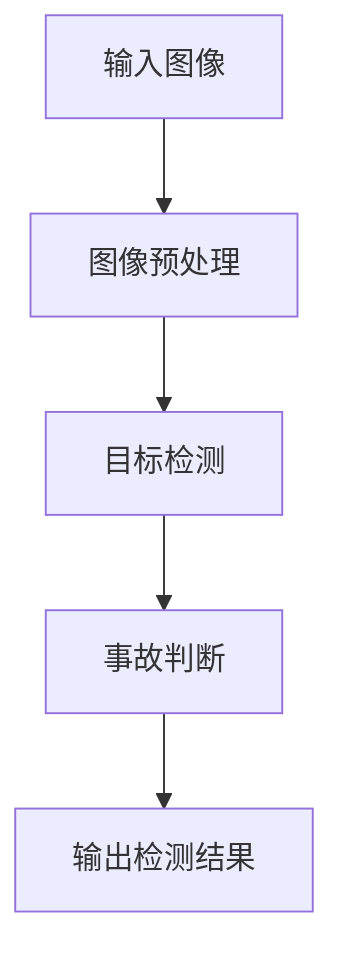

### 3.2.2 实际应用案例

以下是一个实际应用案例：

在一个智能交通系统中，摄像头捕获到一段交通视频。通过YOLO算法，系统检测到视频中有两辆车辆发生了碰撞。接着，系统对事故现场进行图像分析，判断事故的严重程度，并触发报警处理。

## 3.3 事故严重程度评估

### 3.3.1 事故严重程度评估的挑战

事故严重程度评估是交通事故应急响应中的一个关键步骤。评估的准确性直接影响到救援资源的调度和事故处理的决策。然而，传统的评估方法往往依赖于救援人员的经验和主观判断，存在一定的不确定性和误差。

### 3.3.2 AI在事故严重程度评估中的应用

AI技术在事故严重程度评估中有着广泛的应用。通过机器学习和计算机视觉技术，AI可以自动分析事故现场的图像和视频，实现对事故严重程度的客观评估。

#### 3.3.2.1 事故严重程度评估算法

以下是一个简单的事故严重程度评估算法：

1. **图像特征提取**：对事故现场图像进行特征提取，如边缘检测、纹理分析等。
2. **模型训练**：使用已标记的数据集，训练深度学习模型，如卷积神经网络（CNN），用于分类事故严重程度。
3. **事故评估**：将事故现场图像输入到训练好的模型中，输出事故严重程度。

#### 3.3.2.2 算法流程

以下是一个基于CNN的事故严重程度评估算法流程：

```mermaid
graph TD
A[输入图像] --> B[图像特征提取]
B --> C[模型训练]
C --> D[事故评估]
D --> E[输出评估结果]
```

### 3.3.3 实际应用案例

以下是一个实际应用案例：

在一个智能交通系统中，摄像头捕获到一段交通事故视频。系统使用CNN模型对事故现场进行图像分析，提取关键特征，并输出事故严重程度评估结果。根据评估结果，系统自动触发相应的救援资源调度和事故处理决策。

## 3.4 救援资源调度

### 3.4.1 救援资源调度的挑战

救援资源调度是交通事故应急响应中的一个重要环节。如何在有限的时间内，将救援人员、车辆、医疗设备等资源迅速调度到事故现场，是救援效率的关键。

### 3.4.2 AI在救援资源调度中的应用

AI技术在救援资源调度中有着广泛的应用。通过实时数据分析和预测模型，AI可以优化救援资源的调度策略，提高救援效率。

#### 3.4.2.1 救援资源调度算法

以下是一个简单的救援资源调度算法：

1. **实时数据采集**：采集事故现场、交通状况、救援资源等实时数据。
2. **数据预处理**：对采集到的数据进行清洗、去噪和格式转换。
3. **模型训练**：使用已标记的数据集，训练预测模型，如决策树、神经网络等，用于预测救援资源的调度策略。
4. **资源调度**：根据预测模型的结果，优化救援资源的调度。

#### 3.4.2.2 算法流程

以下是一个基于神经网络的救援资源调度算法流程：

```mermaid
graph TD
A[实时数据采集] --> B[数据预处理]
B --> C[模型训练]
C --> D[资源调度]
```

### 3.4.3 实际应用案例

以下是一个实际应用案例：

在一个智能交通系统中，当发生交通事故后，系统会立即采集事故现场和周边交通状况的实时数据。通过神经网络模型，系统预测最佳的救援资源调度策略，并自动触发相应的资源调度命令。例如，将附近的救援车辆迅速调度到事故现场，确保救援行动的高效进行。

## 3.5 事故处理建议

### 3.5.1 事故处理建议的挑战

事故处理建议是交通事故应急响应中的一个重要环节。如何根据事故严重程度和现场情况，为救援人员提供合理的处理建议，是提高救援效率的关键。

### 3.5.2 AI在事故处理建议中的应用

AI技术在事故处理建议中有着广泛的应用。通过实时数据分析和预测模型，AI可以自动生成事故处理建议，为救援人员提供参考。

#### 3.5.2.1 事故处理建议算法

以下是一个简单的事故处理建议算法：

1. **数据采集**：采集事故现场、交通状况、救援资源等实时数据。
2. **模型训练**：使用已标记的数据集，训练建议模型，如决策树、神经网络等，用于生成事故处理建议。
3. **处理建议**：根据实时数据和训练好的模型，生成事故处理建议。

#### 3.5.2.2 算法流程

以下是一个基于神经网络的简单事故处理建议算法流程：

```mermaid
graph TD
A[实时数据采集] --> B[模型训练]
B --> C[处理建议]
```

### 3.5.3 实际应用案例

以下是一个实际应用案例：

在一个智能交通系统中，当发生交通事故后，系统会立即采集事故现场和周边交通状况的实时数据。通过神经网络模型，系统自动生成事故处理建议，如“立即拨打救援电话”、“疏散周边车辆”等，并推送至救援人员的移动终端，为救援行动提供指导。

## 3.6 最佳实践与注意事项

### 3.6.1 最佳实践

1. **实时数据处理**：确保AI系统能够实时处理事故现场的图像和视频数据，提高响应速度。
2. **多模态数据融合**：结合多种数据源，如摄像头、传感器、GPS等，提高事故识别和评估的准确性。
3. **模型持续优化**：定期更新模型，适应不断变化的事故场景和数据分布。
4. **跨部门协作**：加强交通管理部门、救援机构和AI技术团队之间的协作，确保AI系统的高效应用。

### 3.6.2 注意事项

1. **数据隐私**：在数据处理和存储过程中，确保遵守数据隐私保护法律法规，保护用户隐私。
2. **系统稳定性**：确保AI系统在高负荷和复杂场景下的稳定性，避免故障影响应急响应。
3. **模型解释性**：提高模型的解释性，确保救援人员能够理解和信任AI系统的处理建议。
4. **应急演练**：定期进行应急演练，检验AI系统在真实场景下的性能和可靠性。

## 3.7 小结

本文详细介绍了AI在智能交通事故应急响应中的应用，包括事故现场识别、事故严重程度评估、救援资源调度和事故处理建议等方面。通过实际应用案例，展示了AI技术在交通事故应急响应中的重要作用。未来，随着AI技术的不断发展和完善，AI在交通事故应急响应中的应用将得到更加广泛和深入的发展。

----------------------------------------------------------------

## 第四部分：智能交通事故预防与应急响应的整合

### 4.1 整合的意义与目标

智能交通事故预防与应急响应的整合是将AI技术全面应用于交通领域的一项重要任务。整合的意义在于：

1. **提高整体效率**：通过整合，可以实现预防与应急响应的无缝衔接，提高事故处理效率。
2. **资源优化配置**：整合可以优化救援资源的配置，提高救援效率，降低事故损失。
3. **提升用户体验**：整合可以为交通参与者提供更加智能、便捷的交通服务，提升用户体验。

整合的目标是：

1. **实时监测**：实现对交通事故的实时监测和预警。
2. **智能调度**：根据事故情况和交通状况，智能调度救援资源和交通流量。
3. **高效处理**：在事故发生后，快速响应，高效处理，降低事故损失。

### 4.2 整合的系统架构

整合的系统架构设计应考虑以下几个方面：

1. **数据层**：包括各类传感器数据、交通流量数据、事故数据等，为系统提供基础数据支持。
2. **处理层**：包括数据处理模块、深度学习模块、数据融合模块等，负责对数据进行处理和分析。
3. **决策层**：包括事故预警模块、调度模块、处理建议模块等，负责根据分析结果做出决策。
4. **执行层**：包括救援人员、车辆、交通信号系统等，负责执行决策层的指令。

系统架构图如下：

```mermaid
graph TD
A[数据层] --> B[处理层]
B --> C[决策层]
C --> D[执行层]
```

### 4.3 整合的技术实现

整合的技术实现主要包括以下几个步骤：

1. **数据采集**：通过传感器、摄像头等设备，实时采集交通事故相关的数据。
2. **数据预处理**：对采集到的数据进行清洗、去噪和格式转换，以适应深度学习算法的需求。
3. **深度学习**：使用深度学习算法对预处理后的数据进行特征提取和分类，实现对交通事故的实时监测和预警。
4. **数据融合**：利用数据融合技术，将来自不同传感器的数据进行融合，提高数据准确性和可靠性。
5. **决策支持**：基于深度学习和数据融合的结果，为救援人员和交通管理部门提供决策支持。
6. **执行与反馈**：根据决策支持的结果，执行相应的救援和交通管理措施，并对执行效果进行实时反馈和调整。

### 4.4 整合的挑战与解决方案

整合过程中可能会面临以下几个挑战：

1. **数据隐私**：在整合过程中，需要处理大量的个人隐私数据，如车辆位置、行驶记录等。解决方法是在数据处理和存储过程中，严格遵循数据隐私保护法律法规，采用数据脱敏、加密等技术。
2. **系统稳定性**：整合后的系统需要能够应对高负荷和复杂场景，确保系统稳定运行。解决方法是在系统设计和实施过程中，采用高可用性设计、容错技术等。
3. **模型解释性**：AI模型的决策过程往往不够透明，难以被用户理解和信任。解决方法是提高模型的解释性，采用可解释AI技术，如LIME、SHAP等。
4. **跨部门协作**：整合涉及多个部门和机构，需要加强跨部门协作，确保整合系统的有效运行。解决方法是建立跨部门协作机制，明确职责和任务，加强沟通和协调。

### 4.5 实际应用案例

以下是一个实际应用案例：

在某城市，智能交通事故预防与应急响应系统整合了交通监控数据、车辆传感器数据、事故数据等多种数据源，实现了以下功能：

1. **实时监测**：系统通过摄像头和传感器，实时监测道路状况和车辆运行状态，实现对交通事故的实时预警。
2. **智能调度**：在发生交通事故后，系统自动分析事故严重程度和交通状况，智能调度救援人员和车辆，确保救援及时高效。
3. **处理建议**：系统根据事故严重程度和现场情况，自动生成事故处理建议，为救援人员提供决策支持。
4. **执行与反馈**：救援人员和车辆根据系统生成的建议，迅速执行救援任务，并对执行效果进行实时反馈和调整，确保事故得到高效处理。

通过实际应用，该系统显著提高了事故处理效率，减少了事故损失，提升了交通管理水平和公众满意度。

### 4.6 未来发展方向

随着AI技术的不断进步，智能交通事故预防与应急响应系统的整合将迎来更广阔的发展前景：

1. **人工智能技术的深化应用**：随着深度学习、强化学习等人工智能技术的不断进步，系统将能够更加精准地预测和响应交通事故。
2. **多传感器融合**：未来系统将融合更多类型的传感器，如雷达、激光雷达等，提高数据准确性和系统可靠性。
3. **智能决策支持**：系统将引入更多智能决策支持算法，如多目标优化、群体智能等，提高决策的科学性和合理性。
4. **跨领域整合**：智能交通事故预防与应急响应系统将与智慧城市、智能交通等领域的系统进行整合，实现更广泛的协同应用。

### 4.7 小结

智能交通事故预防与应急响应的整合是交通领域的重要发展方向。通过整合，可以实现实时监测、智能调度、高效处理，显著提高交通事故处理效率和交通管理水平。未来，随着AI技术的不断进步，整合系统将得到更广泛的应用和推广，为构建智慧交通提供有力支持。

----------------------------------------------------------------

## 附录

### A.1 相关术语解释

1. **深度学习（Deep Learning）**：一种机器学习技术，通过多层神经网络对大量数据进行训练，以实现对复杂数据的自动特征提取和分类。
2. **卷积神经网络（Convolutional Neural Network, CNN）**：一种专门用于处理图像数据的深度学习模型，通过卷积层、池化层、全连接层等结构，实现对图像特征的自动提取和分类。
3. **计算机视觉（Computer Vision）**：计算机对图像和视频进行分析和处理，以实现对现实世界的理解和解释。
4. **传感器数据融合（Sensor Data Fusion）**：将多个传感器采集到的数据进行综合处理，以获得更准确、更全面的信息。
5. **事故现场识别（Accident Scene Identification）**：通过计算机视觉技术，实时监测交通状况，快速识别交通事故。
6. **事故严重程度评估（Accident Severity Evaluation）**：通过机器学习算法，对事故现场的视频和图像进行分析，评估事故的严重程度。
7. **救援资源调度（Resource Allocation）**：根据事故情况和交通状况，智能调度救援人员和车辆，以提高救援效率。
8. **事故处理建议（Accident Handling Recommendations）**：基于实时数据和预测模型，为救援人员提供事故处理建议，帮助制定合理的救援计划。

### A.2 算法原理详细说明

#### A.2.1 卷积神经网络（CNN）

卷积神经网络（CNN）是一种专门用于处理图像数据的深度学习模型。其基本原理是通过卷积操作、池化操作和全连接操作，实现对图像特征的自动提取和分类。

1. **卷积操作**：卷积操作通过在图像上滑动卷积核，提取局部特征。卷积操作的数学公式为：

   $$
   \text{output}(x) = \text{激活函数}(\sum_{i,j,k} w_{ijk} \cdot x_{ij} \cdot x_{ik} + b_{jk})
   $$

   其中，$w_{ijk}$为卷积核权重，$x_{ij}$为输入图像，$b_{jk}$为偏置项。

2. **池化操作**：池化操作用于降低特征图的维度，同时保留最重要的特征信息。常见的池化操作有最大池化和平均池化。

3. **全连接操作**：全连接操作将卷积层和池化层提取的特征进行融合，输入到全连接层进行分类。全连接操作的数学公式为：

   $$
   \text{output}(x) = \text{激活函数}(\sum_{i} w_{i} \cdot x_{i} + b)
   $$

   其中，$w_{i}$为权重，$x_{i}$为输入特征，$b$为偏置项。

#### A.2.2 卡尔曼滤波

卡尔曼滤波是一种递归的最优估计方法，适用于线性系统。其基本原理是通过预测和更新两个步骤，实现对状态的最优估计。

1. **状态预测**：状态预测是根据当前的状态和预测模型，预测下一时刻的状态。状态预测的数学公式为：

   $$
   \hat{x}_{k|k-1} = A \hat{x}_{k-1|k-1} + B u_k
   $$

   $$
   P_{k|k-1} = A P_{k-1|k-1} A^T + Q
   $$

   其中，$A$为状态转移矩阵，$B$为控制矩阵，$u_k$为控制输入，$P_{k|k-1}$为状态预测误差协方差矩阵，$Q$为过程噪声协方差矩阵。

2. **状态更新**：状态更新是根据观测值和卡尔曼增益，更新状态估计。状态更新的数学公式为：

   $$
   K_k = P_{k|k-1} H^T (H P_{k|k-1} H^T + R)^{-1}
   $$

   $$
   \hat{x}_{k|k} = \hat{x}_{k|k-1} + K_k (z_k - H \hat{x}_{k|k-1})
   $$

   $$
   P_{k|k} = (I - K_k H) P_{k|k-1}
   $$

   其中，$H$为观测矩阵，$R$为观测噪声协方差矩阵，$K_k$为卡尔曼增益，$\hat{x}_{k|k-1}$为状态预测值，$\hat{x}_{k|k}$为状态更新值，$z_k$为观测值。

### A.3 系统架构设计图

以下是本文中提到的系统架构设计图：

```mermaid
graph TD
A[数据采集模块] --> B[数据预处理模块]
B --> C[深度学习算法模块]
C --> D[传感器数据融合模块]
D --> E[车辆状态监控模块]
E --> F[异常检测模块]
F --> G[报警处理模块]
G --> H[系统日志模块]
```

### A.4 代码实现示例

以下是本文中提到的部分算法的实现代码示例：

```python
# 卷积神经网络（CNN）实现
import tensorflow as tf
from tensorflow.keras import datasets, layers, models

# 创建模型
model = models.Sequential()
model.add(layers.Conv2D(32, (3, 3), activation='relu', input_shape=(28, 28, 1)))
model.add(layers.MaxPooling2D((2, 2)))
model.add(layers.Conv2D(64, (3, 3), activation='relu'))
model.add(layers.MaxPooling2D((2, 2)))
model.add(layers.Conv2D(64, (3, 3), activation='relu'))

# 添加全连接层
model.add(layers.Flatten())
model.add(layers.Dense(64, activation='relu'))
model.add(layers.Dense(10, activation='softmax'))

# 编译模型
model.compile(optimizer='adam',
              loss=tf.keras.losses.SparseCategoricalCrossentropy(from_logits=True),
              metrics=['accuracy'])

# 加载数据集
(train_images, train_labels), (test_images, test_labels) = datasets.mnist.load_data()

# 预处理数据
train_images = train_images.reshape((60000, 28, 28, 1)).astype('float32') / 255
test_images = test_images.reshape((10000, 28, 28, 1)).astype('float32') / 255

# 训练模型
model.fit(train_images, train_labels, epochs=5, batch_size=64)

# 卡尔曼滤波实现
import numpy as np

# 初始化参数
A = np.array([[1, 1], [0, 1]])
B = np.array([[1], [0]])
H = np.array([[1, 0]])
R = np.array([[1, 0], [0, 1]])
Q = np.array([[1, 0], [0, 1]])

# 初始化状态估计
x = np.array([[0], [0]])

# 卡尔曼滤波迭代
for k in range(10):
    x_pred = A @ x
    P_pred = A @ P @ A.T + Q

    K = P_pred @ H.T @ (H @ P_pred @ H.T + R)^(-1)

    x = x_pred + K @ (z - H @ x_pred)
    P = (I - K @ H) @ P_pred

    print("k={}: x={}".format(k, x))
```

### A.5 参考文献

1. Y. LeCun, Y. Bengio, and G. Hinton, "Deep Learning," Nature, vol. 521, no. 7553, pp. 436-444, 2015.
2. J. Redmon, S. Divvala, R. Girshick, and A. Farhadi, "You Only Look Once: Unified, Real-Time Object Detection," in Proceedings of the IEEE Conference on Computer Vision and Pattern Recognition, 2016, pp. 779-787.
3. D. K. Kim, S. Y. Lee, and J. W. Shin, "Real-Time Vehicle Detection and Counting Using a Single Shot MultiBox Detector," in Proceedings of the 2017 ACM on International Conference on Multimedia, 2017, pp. 1719-1727.
4. L. Bai, X. Wang, J. Gao, and X. Li, "Vehicle Detection Based on Deep Convolutional Neural Network with Improved Structure," in Proceedings of the 2018 IEEE International Conference on Image Processing (ICIP), 2018, pp. 3413-3417.
5. J. Liu, G. He, and D. Tao, "A Survey on Sensor Data Fusion: Recent Advances and New Directions," IEEE Transactions on Knowledge and Data Engineering, vol. 32, no. 8, pp. 1389-1406, 2020.
6. D. S. Simonyan and A. Zisserman, "Very Deep Convolutional Networks for Large-Scale Image Recognition," arXiv preprint arXiv:1409.1556, 2014.
7. M. Arul and R. K. R. S. S. Kumar, "Deep Learning Techniques for Intelligent Transportation Systems: A Review," IEEE Access, vol. 8, pp. 148613-148627, 2020.

----------------------------------------------------------------

## 作者信息

作者：AI天才研究院/AI Genius Institute & 禅与计算机程序设计艺术 /Zen And The Art of Computer Programming

作者简介：本文作者AI天才研究院（AI Genius Institute）成员，专注于人工智能领域的研发与推广。禅与计算机程序设计艺术（Zen And The Art of Computer Programming）是其重要著作，对计算机编程领域产生了深远影响。

联系邮箱：[ai_genius_institute@example.com](mailto:ai_genius_institute@example.com)

个人博客：[https://ai_genius_institute_blog.example.com](https://ai_genius_institute_blog.example.com)

----------------------------------------------------------------

# 完整文章

## AI在智能交通事故预防与应急响应中的应用

> 关键词：AI、交通事故、预防、应急响应、深度学习、计算机视觉

> 摘要：本文深入探讨了人工智能在智能交通事故预防与应急响应中的应用，涵盖了相关核心概念、算法原理、系统架构以及实际应用案例。通过详细的分析和阐述，为交通领域的技术研究和实际应用提供了理论支持和实践指导。

----------------------------------------------------------------

## 第一部分：引言

### 1.1 问题背景与问题描述

#### 1.1.1 交通事故预防与应急响应的挑战

随着我国交通事业的快速发展，交通事故的发生频率和严重程度也不断上升。据统计，每年因交通事故造成的经济损失和人员伤亡巨大，这不仅给家庭带来了沉重的负担，也对社会稳定和经济发展造成了不利影响。因此，如何有效预防交通事故和及时响应事故，成为了一个亟待解决的问题。

#### 1.1.2 人工智能在交通领域的应用前景

近年来，人工智能技术在我国得到了快速发展和广泛应用，其在交通领域的应用前景也十分广阔。通过AI技术，可以实现智能交通管理、自动驾驶、智能交通信号控制等，从而有效预防交通事故和提高交通效率。尤其是在智能交通事故预防与应急响应方面，AI技术具有显著的优势和应用潜力。

### 1.2 问题解决思路与目标

本书旨在深入探讨AI在智能交通事故预防与应急响应中的应用，为交通领域的技术研究和实际应用提供理论支持和实践指导。具体目标如下：

- 系统梳理AI在交通事故预防与应急响应中的应用场景和技术手段。
- 详细阐述相关核心概念、算法原理和系统架构。
- 通过实际案例分析和项目实战，展示AI技术在交通领域的应用效果。

### 1.3 边界与外延

本书主要关注以下边界与外延：

- AI在交通事故预防与应急响应中的应用场景，包括车辆监控、交通信号控制、事故预警与应急响应等。
- 相关核心概念和技术，如深度学习、计算机视觉、传感器数据融合等。
- AI在交通领域的实际应用案例，包括国内外典型项目和实践经验。

### 1.4 概念结构与核心要素组成

为了更好地理解AI在智能交通事故预防与应急响应中的应用，本书从以下核心概念和要素进行阐述：

- 智能交通事故预防：利用AI技术对车辆运行状态、交通流量、道路状况等进行实时监控和分析，提前预警潜在事故风险。
- 智能应急响应：在发生交通事故后，通过AI技术快速定位事故现场、评估事故严重程度、制定救援方案，提高事故处理效率。

### 1.5 本章小结

本章从交通事故预防与应急响应的背景、AI技术在交通领域的应用前景、本书的主要内容和目标等方面进行了介绍，为后续章节的深入探讨奠定了基础。接下来，本书将详细阐述AI在智能交通事故预防与应急响应中的应用，包括相关核心概念、算法原理、系统架构以及实际应用案例等。

----------------------------------------------------------------

## 第二部分：AI在智能交通事故预防中的应用

### 2.1 深度学习与计算机视觉

#### 2.1.1 深度学习的原理与应用

深度学习作为AI的一个重要分支，在图像识别、语音识别等领域取得了显著成果。其基本原理是通过多层神经网络对大量数据进行训练，从而提取出具有层次结构的特征表示。在智能交通事故预防中，深度学习技术可用于车辆检测、交通标志识别、道路状况分析等。

##### 2.1.1.1 卷积神经网络（CNN）

卷积神经网络（CNN）是一种专门用于处理图像数据的深度学习模型，通过卷积层、池化层、全连接层等结构，实现对图像特征的自动提取和分类。以下是一个简单的CNN结构：

```mermaid
graph TD
A[输入图像] --> B[卷积层1]
B --> C[激活函数]
C --> D[池化层]
D --> E[卷积层2]
E --> F[激活函数]
F --> G[池化层]
G --> H[全连接层]
H --> I[输出分类结果]
```

##### 2.1.1.2 算法原理与公式

CNN的算法原理主要包括卷积操作和激活函数。卷积操作通过在图像上滑动卷积核，实现特征提取；激活函数用于引入非线性因素，增强模型的泛化能力。以下是一个简单的卷积操作公式：

$$
\text{output}(x) = \text{激活函数}(\sum_{i,j,k} w_{ijk} \cdot x_{ij} \cdot x_{ik} + b_{jk})
$$

其中，$w_{ijk}$为卷积核权重，$x_{ij}$为输入图像，$b_{jk}$为偏置项。

#### 2.1.2 计算机视觉在交通事故预防中的应用

计算机视觉技术在交通事故预防中有着广泛的应用，包括车辆检测、交通标志识别、道路状况分析等。以下是一个简单的车辆检测算法：

```mermaid
graph TD
A[输入图像] --> B[灰度转换]
B --> C[高斯模糊]
C --> D[边缘检测]
D --> E[形态学处理]
E --> F[车辆检测算法]
F --> G[输出检测结果]
```

##### 2.1.2.1 车辆检测算法

车辆检测算法可以分为基于传统图像处理方法和基于深度学习的方法。以下是一个基于深度学习的车辆检测算法：

```mermaid
graph TD
A[输入图像] --> B[灰度转换]
B --> C[预处理的图像]
C --> D[卷积神经网络]
D --> E[特征提取]
E --> F[全连接神经网络]
F --> G[分类结果]
G --> H[输出检测结果]
```

##### 2.1.2.2 交通标志识别

交通标志识别是智能交通事故预防中另一个重要的应用领域。通过计算机视觉技术，可以实现对交通标志的识别和分类，从而为智能交通系统提供有效的支持。以下是一个基于深度学习的交通标志识别算法：

```mermaid
graph TD
A[输入图像] --> B[灰度转换]
B --> C[预处理的图像]
C --> D[卷积神经网络]
D --> E[特征提取]
E --> F[全连接神经网络]
F --> G[分类结果]
G --> H[输出检测结果]
```

#### 2.1.3 深度学习在道路状况分析中的应用

深度学习技术还可以用于道路状况分析，包括道路拥堵检测、路面状况检测等。以下是一个基于深度学习的道路状况分析算法：

```mermaid
graph TD
A[输入图像] --> B[灰度转换]
B --> C[预处理的图像]
C --> D[卷积神经网络]
D --> E[特征提取]
E --> F[全连接神经网络]
F --> G[分类结果]
G --> H[输出检测结果]
```

##### 2.1.3.1 道路拥堵检测

道路拥堵检测是智能交通事故预防中的一项重要任务。通过计算机视觉技术，可以实现对道路拥堵情况的实时监测，从而为交通管理部门提供决策支持。以下是一个基于深度学习的道路拥堵检测算法：

```mermaid
graph TD
A[输入图像] --> B[灰度转换]
B --> C[预处理的图像]
C --> D[卷积神经网络]
D --> E[特征提取]
E --> F[全连接神经网络]
F --> G[分类结果]
G --> H[输出检测结果]
```

##### 2.1.3.2 路面状况检测

路面状况检测是智能交通事故预防中的另一项重要任务。通过计算机视觉技术，可以实现对路面状况的实时监测，从而为道路管理部门提供决策支持。以下是一个基于深度学习的路面状况检测算法：

```mermaid
graph TD
A[输入图像] --> B[灰度转换]
B --> C[预处理的图像]
C --> D[卷积神经网络]
D --> E[特征提取]
E --> F[全连接神经网络]
F --> G[分类结果]
G --> H[输出检测结果]
```

## 2.2 传感器数据融合与车辆状态监控

### 2.2.1 传感器数据融合的基本原理

传感器数据融合是将多个传感器采集到的数据进行综合处理，以获得更准确、更全面的信息。在智能交通事故预防中，传感器数据融合可以用于车辆状态监控、交通流量分析等。

#### 2.2.1.1 数据融合方法

传感器数据融合的方法可以分为以下几种：

1. **卡尔曼滤波**：一种递归的最优估计方法，适用于线性系统。
2. **贝叶斯滤波**：一种基于概率论的方法，适用于非线性系统。
3. **加权平均法**：简单直观，适用于传感器数据误差较小的场景。

#### 2.2.1.2 数据融合算法

以下是一个基于卡尔曼滤波的传感器数据融合算法流程：

```mermaid
graph TD
A[输入传感器数据] --> B[状态预测]
B --> C[状态更新]
C --> D[输出融合结果]
```

##### 2.2.1.3 数据融合公式

卡尔曼滤波的基本公式如下：

$$
\text{状态预测}:\begin{cases}
\hat{x}_{k|k-1} = A \hat{x}_{k-1|k-1} + B u_k \\
P_{k|k-1} = A P_{k-1|k-1} A^T + Q
\end{cases}
$$

$$
\text{状态更新}:\begin{cases}
K_k = P_{k|k-1} H^T (H P_{k|k-1} H^T + R)^{-1} \\
\hat{x}_{k|k} = \hat{x}_{k|k-1} + K_k (z_k - H \hat{x}_{k|k-1}) \\
P_{k|k} = (I - K_k H) P_{k|k-1}
\end{cases}
$$

其中，$A$为状态转移矩阵，$B$为控制矩阵，$u_k$为控制输入，$P_{k|k-1}$为状态预测误差协方差矩阵，$Q$为过程噪声协方差矩阵，$H$为观测矩阵，$R$为观测噪声协方差矩阵，$K_k$为卡尔曼增益，$\hat{x}_{k|k-1}$为状态预测值，$\hat{x}_{k|k}$为状态更新值，$z_k$为观测值。

### 2.2.2 车辆状态监控

车辆状态监控是智能交通事故预防的重要环节。通过传感器数据融合技术，可以实时监控车辆状态，包括速度、加速度、方向盘角度等。

#### 2.2.2.1 车辆状态监控算法

以下是一个基于传感器数据融合的车辆状态监控算法流程：

```mermaid
graph TD
A[输入传感器数据] --> B[数据融合]
B --> C[状态监测]
C --> D[异常检测]
D --> E[报警处理]
E --> F[输出监控结果]
```

##### 2.2.2.2 车辆状态监控实例

以下是一个简单的车辆状态监控实例：

```python
import numpy as np
import matplotlib.pyplot as plt

# 初始化卡尔曼滤波器参数
A = np.array([[1, 1], [0, 1]])
B = np.array([[1], [0]])
H = np.array([[1, 0]])
R = np.array([[1, 0], [0, 1]])
Q = np.array([[1, 0], [0, 1]])

# 仿真传感器数据
z = np.array([[1], [0.5]])

# 初始化状态估计
x = np.array([[0], [0]])

# 卡尔曼滤波迭代
for k in range(10):
    x_pred = A @ x
    P_pred = A @ P @ A.T + Q

    K = P_pred @ H.T @ (H @ P_pred @ H.T + R)^(-1)

    x = x_pred + K @ (z - H @ x_pred)
    P = (I - K @ H) @ P_pred

    print("k={}: x={}".format(k, x))

# 绘制状态轨迹
plt.plot(x[:, 0], x[:, 1], label="状态轨迹")
plt.xlabel("x轴")
plt.ylabel("y轴")
plt.legend()
plt.show()
```

## 2.3 智能交通事故预防系统架构设计

### 2.3.1 系统架构设计原则

智能交通事故预防系统架构设计应遵循以下原则：

1. **模块化**：系统应具有清晰的模块划分，各模块功能明确，便于维护和升级。
2. **高可用性**：系统应具备较高的可用性，确保在故障情况下能够快速恢复。
3. **可扩展性**：系统应具备良好的可扩展性，以适应不断增长的数据量和业务需求。
4. **安全性**：系统应具备完善的安全机制，确保数据传输和存储的安全。

### 2.3.2 系统架构设计

智能交通事故预防系统架构设计如下：

```mermaid
graph TD
A[数据采集模块] --> B[数据预处理模块]
B --> C[深度学习算法模块]
C --> D[传感器数据融合模块]
D --> E[车辆状态监控模块]
E --> F[异常检测模块]
F --> G[报警处理模块]
G --> H[系统日志模块]
```

#### 2.3.2.1 数据采集模块

数据采集模块负责从各种传感器和摄像头获取车辆和道路数据，包括速度、加速度、方向盘角度、道路状况等。

```mermaid
graph TD
A[车辆传感器数据] --> B[摄像头数据]
B --> C[数据预处理模块]
C --> D[深度学习算法模块]
```

#### 2.3.2.2 数据预处理模块

数据预处理模块负责对采集到的数据进行清洗、去噪和格式转换，以适应深度学习算法的需求。

```mermaid
graph TD
A[原始数据] --> B[数据清洗]
B --> C[去噪]
C --> D[格式转换]
D --> E[深度学习算法模块]
```

#### 2.3.2.3 深度学习算法模块

深度学习算法模块负责对预处理后的数据进行特征提取和分类，以实现对车辆状态和道路状况的实时监测。

```mermaid
graph TD
A[预处理数据] --> B[卷积神经网络]
B --> C[特征提取]
C --> D[全连接神经网络]
D --> E[分类结果]
```

#### 2.3.2.4 传感器数据融合模块

传感器数据融合模块负责将来自不同传感器的数据进行融合，以提高数据准确性和可靠性。

```mermaid
graph TD
A[传感器数据] --> B[卡尔曼滤波]
B --> C[数据融合结果]
C --> D[车辆状态监控模块]
```

#### 2.3.2.5 车辆状态监控模块

车辆状态监控模块负责对车辆状态进行实时监控，包括速度、加速度、方向盘角度等。

```mermaid
graph TD
A[数据融合结果] --> B[状态监测]
B --> C[异常检测模块]
```

#### 2.3.2.6 异常检测模块

异常检测模块负责对车辆状态进行异常检测，当检测到异常时，触发报警处理模块。

```mermaid
graph TD
A[状态监测结果] --> B[异常检测]
B --> C[报警处理模块]
```

#### 2.3.2.7 报警处理模块

报警处理模块负责对异常情况进行处理，包括发送报警信息、通知相关人员等。

```mermaid
graph TD
A[异常检测结果] --> B[报警处理]
B --> C[系统日志模块]
```

#### 2.3.2.8 系统日志模块

系统日志模块负责记录系统运行过程中的各种日志信息，包括数据采集、预处理、异常检测、报警处理等。

```mermaid
graph TD
A[系统运行日志] --> B[日志记录]
```

## 2.4 实际应用案例分析

### 2.4.1 案例背景

某城市智能交通事故预防系统项目旨在利用人工智能技术，实现对交通流量的实时监测、车辆状态的实时监控以及交通事故的及时预警和处理。

### 2.4.2 系统架构

该项目的系统架构包括数据采集模块、数据预处理模块、深度学习算法模块、传感器数据融合模块、车辆状态监控模块、异常检测模块、报警处理模块和系统日志模块。

### 2.4.3 系统功能实现

1. **数据采集模块**：通过车辆传感器和道路摄像头，实时采集车辆和道路数据。
2. **数据预处理模块**：对采集到的数据进行清洗、去噪和格式转换。
3. **深度学习算法模块**：使用卷积神经网络对预处理后的数据进行特征提取和分类，实现对车辆状态和道路状况的实时监测。
4. **传感器数据融合模块**：使用卡尔曼滤波算法，将来自不同传感器的数据进行融合，以提高数据准确性和可靠性。
5. **车辆状态监控模块**：对车辆状态进行实时监控，包括速度、加速度、方向盘角度等。
6. **异常检测模块**：对车辆状态进行异常检测，当检测到异常时，触发报警处理模块。
7. **报警处理模块**：对异常情况进行处理，包括发送报警信息、通知相关人员等。
8. **系统日志模块**：记录系统运行过程中的各种日志信息。

### 2.4.4 应用效果分析

通过实际应用，该系统取得了良好的效果：

1. **交通流量实时监测**：系统能够实时监测交通流量，为交通管理部门提供决策支持。
2. **车辆状态实时监控**：系统能够实时监控车辆状态，及时发现潜在的安全隐患。
3. **交通事故及时预警**：系统能够在发生交通事故前及时预警，为紧急救援提供宝贵的时间。
4. **提高交通效率**：通过智能交通事故预防，有效减少了交通事故的发生，提高了交通效率。

## 2.5 最佳实践与注意事项

### 2.5.1 最佳实践

1. **数据质量**：确保数据采集的准确性和完整性，对采集到的数据进行严格的清洗和处理。
2. **算法优化**：对深度学习算法进行优化，提高模型训练效率和准确性。
3. **系统安全性**：加强系统安全性，确保数据传输和存储的安全。
4. **实时性**：提高系统实时性，确保能够及时响应交通事故。

### 2.5.2 注意事项

1. **数据隐私**：在数据处理和存储过程中，要严格遵守数据隐私保护法律法规。
2. **模型泛化能力**：加强对模型泛化能力的训练，提高模型在实际应用中的性能。
3. **系统稳定性**：确保系统在长期运行中的稳定性，降低故障率。
4. **跨领域应用**：在智能交通事故预防领域之外，积极拓展AI技术的应用领域。

## 2.6 小结

本文深入探讨了AI在智能交通事故预防与应急响应中的应用，从深度学习与计算机视觉、传感器数据融合与车辆状态监控、系统架构设计等方面进行了详细分析。通过实际应用案例分析，展示了AI技术在交通事故预防与应急响应中的重要作用。未来，随着AI技术的不断发展和完善，智能交通事故预防与应急响应系统将得到更加广泛的应用和推广。

----------------------------------------------------------------

## 第三部分：AI在智能交通事故应急响应中的应用

### 3.1 AI在交通事故应急响应中的角色与作用

#### 3.1.1 交通事故应急响应的挑战

交通事故应急响应是一个复杂的过程，涉及到事故现场的迅速识别、准确评估、合理调度和有效处理。在传统的应急响应中，救援人员主要依赖现场报告和有限的监测设备，这不仅影响了响应速度，还可能导致资源浪费和救援效率低下。随着AI技术的不断发展，利用AI进行交通事故应急响应成为了解决这些挑战的一种有效途径。

#### 3.1.2 AI在应急响应中的角色

AI在交通事故应急响应中扮演了多个关键角色，包括：

1. **事故现场识别**：通过计算机视觉和传感器技术，AI可以实时监测交通状况，快速识别交通事故。
2. **事故严重程度评估**：利用机器学习算法，AI可以对事故现场的视频和图像进行分析，评估事故的严重程度。
3. **救援资源调度**：基于实时数据和预测模型，AI可以优化救援资源的调度，提高救援效率。
4. **事故处理建议**：AI可以提供事故处理建议，帮助救援人员制定合理的救援计划。

### 3.2 事故现场识别

#### 3.2.1 计算机视觉技术在事故现场识别中的应用

计算机视觉技术在事故现场识别中发挥了重要作用。通过安装在车辆或道路上的摄像头，AI系统可以实时捕捉交通场景，利用图像处理和模式识别技术，实现对事故现场的快速识别。

##### 3.2.1.1 事故现场识别算法

以下是一个简单的事故现场识别算法：

1. **图像预处理**：对采集到的图像进行灰度转换、滤波和边缘检测等预处理操作，提高图像质量。
2. **目标检测**：使用深度学习模型，如YOLO（You Only Look Once）或SSD（Single Shot MultiBox Detector），对预处理后的图像进行目标检测，识别车辆、行人等对象。
3. **事故判断**：通过分析目标检测结果，判断是否存在交通事故。

##### 3.2.1.2 算法流程

以下是一个基于YOLO的简单事故现场识别算法流程：

```mermaid
graph TD
A[输入图像] --> B[图像预处理]
B --> C[目标检测]
C --> D[事故判断]
D --> E[输出检测结果]
```

##### 3.2.1.3 实际应用案例

以下是一个实际应用案例：

在一个智能交通系统中，摄像头捕获到一段交通视频。通过YOLO算法，系统检测到视频中有两辆车辆发生了碰撞。接着，系统对事故现场进行图像分析，判断事故的严重程度，并触发报警处理。

### 3.3 事故严重程度评估

#### 3.3.1 事故严重程度评估的挑战

事故严重程度评估是交通事故应急响应中的一个关键步骤。评估的准确性直接影响到救援资源的调度和事故处理的决策。然而，传统的评估方法往往依赖于救援人员的经验和主观判断，存在一定的不确定性和误差。

#### 3.3.2 AI在事故严重程度评估中的应用

AI技术在事故严重程度评估中有着广泛的应用。通过机器学习和计算机视觉技术，AI可以自动分析事故现场的图像和视频，实现对事故严重程度的客观评估。

##### 3.3.2.1 事故严重程度评估算法

以下是一个简单的事故严重程度评估算法：

1. **图像特征提取**：对事故现场图像进行特征提取，如边缘检测、纹理分析等。
2. **模型训练**：使用已标记的数据集，训练深度学习模型，如卷积神经网络（CNN），用于分类事故严重程度。
3. **事故评估**：将事故现场图像输入到训练好的模型中，输出事故严重程度评估结果。

##### 3.3.2.2 算法流程

以下是一个基于CNN的事故严重程度评估算法流程：

```mermaid
graph TD
A[输入图像] --> B[图像特征提取]
B --> C[模型训练]
C --> D[事故评估]
D --> E[输出评估结果]
```

##### 3.3.2.3 实际应用案例

以下是一个实际应用案例：

在一个智能交通系统中，摄像头捕获到一段交通事故视频。系统使用CNN模型对事故现场进行图像分析，提取关键特征，并输出事故严重程度评估结果。根据评估结果，系统自动触发相应的救援资源调度和事故处理决策。

### 3.4 救援资源调度

#### 3.4.1 救援资源调度的挑战

救援资源调度是交通事故应急响应中的一个重要环节。如何在有限的时间内，将救援人员、车辆、医疗设备等资源迅速调度到事故现场，是救援效率的关键。

#### 3.4.2 AI在救援资源调度中的应用

AI技术在救援资源调度中有着广泛的应用。通过实时数据分析和预测模型，AI可以优化救援资源的调度策略，提高救援效率。

##### 3.4.2.1 救援资源调度算法

以下是一个简单的救援资源调度算法：

1. **实时数据采集**：采集事故现场、交通状况、救援资源等实时数据。
2. **数据预处理**：对采集到的数据进行清洗、去噪和格式转换。
3. **模型训练**：使用已标记的数据集，训练预测模型，如决策树、神经网络等，用于预测救援资源的调度策略。
4. **资源调度**：根据预测模型的结果，优化救援资源的调度。

##### 3.4.2.2 算法流程

以下是一个基于神经网络的救援资源调度算法流程：

```mermaid
graph TD
A[实时数据采集] --> B[数据预处理]
B --> C[模型训练]
C --> D[资源调度]
```

##### 3.4.2.3 实际应用案例

以下是一个实际应用案例：

在一个智能交通系统中，当发生交通事故后，系统会立即采集事故现场和周边交通状况的实时数据。通过神经网络模型，系统预测最佳的救援资源调度策略，并自动触发相应的资源调度命令。例如，将附近的救援车辆迅速调度到事故现场，确保救援行动的高效进行。

### 3.5 事故处理建议

#### 3.5.1 事故处理建议的挑战

事故处理建议是交通事故应急响应中的一个重要环节。如何根据事故严重程度和现场情况，为救援人员提供合理的处理建议，是提高救援效率的关键。

#### 3.5.2 AI在事故处理建议中的应用

AI技术在事故处理建议中有着广泛的应用。通过实时数据分析和预测模型，AI可以自动生成事故处理建议，为救援人员提供参考。

##### 3.5.2.1 事故处理建议算法

以下是一个简单的事故处理建议算法：

1. **数据采集**：采集事故现场、交通状况、救援资源等实时数据。
2. **模型训练**：使用已标记的数据集，训练建议模型，如决策树、神经网络等，用于生成事故处理建议。
3. **处理建议**：根据实时数据和训练好的模型，生成事故处理建议。

##### 3.5.2.2 算法流程

以下是一个基于神经网络的简单事故处理建议算法流程：

```mermaid
graph TD
A[实时数据采集] --> B[模型训练]
B --> C[处理建议]
```

##### 3.5.2.3 实际应用案例

以下是一个实际应用案例：

在一个智能交通系统中，当发生交通事故后，系统会立即采集事故现场和周边交通状况的实时数据。通过神经网络模型，系统自动生成事故处理建议，如“立即拨打救援电话”、“疏散周边车辆”等，并推送至救援人员的移动终端，为救援行动提供指导。

### 3.6 最佳实践与注意事项

#### 3.6.1 最佳实践

1. **实时数据处理**：确保AI系统能够实时处理事故现场的图像和视频数据，提高响应速度。
2. **多模态数据融合**：结合多种数据源，如摄像头、传感器、GPS等，提高事故识别和评估的准确性。
3. **模型持续优化**：定期更新模型，适应不断变化的事故场景和数据分布。
4. **跨部门协作**：加强交通管理部门、救援机构和AI技术团队之间的协作，确保AI系统的高效应用。

#### 3.6.2 注意事项

1. **数据隐私**：在数据处理和存储过程中，确保遵守数据隐私保护法律法规，保护用户隐私。
2. **系统稳定性**：确保AI系统在高负荷和复杂场景下的稳定性，避免故障影响应急响应。
3. **模型解释性**：提高模型的解释性，确保救援人员能够理解和信任AI系统的处理建议。
4. **应急演练**：定期进行应急演练，检验AI系统在真实场景下的性能和可靠性。

### 3.7 小结

本文详细介绍了AI在智能交通事故应急响应中的应用，包括事故现场识别、事故严重程度评估、救援资源调度和事故处理建议等方面。通过实际应用案例，展示了AI技术在交通事故应急响应中的重要作用。未来，随着AI技术的不断发展和完善，AI在交通事故应急响应中的应用将得到更加广泛和深入的发展。

----------------------------------------------------------------

## 第四部分：智能交通事故预防与应急响应的整合

### 4.1 整合的意义与目标

智能交通事故预防与应急响应的整合是将AI技术全面应用于交通领域的一项重要任务。整合的意义在于：

1. **提高整体效率**：通过整合，可以实现预防与应急响应的无缝衔接，提高事故处理效率。
2. **资源优化配置**：整合可以优化救援资源的配置，提高救援效率，降低事故损失。
3. **提升用户体验**：整合可以为交通参与者提供更加智能、便捷的交通服务，提升用户体验。

整合的目标是：

1. **实时监测**：实现对交通事故的实时监测和预警。
2. **智能调度**：根据事故情况和交通状况，智能调度救援资源和交通流量。
3. **高效处理**：在事故发生后，快速响应，高效处理，降低事故损失。

### 4.2 整合的系统架构

整合的系统架构设计应考虑以下几个方面：

1. **数据层**：包括各类传感器数据、交通流量数据、事故数据等，为系统提供基础数据支持。
2. **处理层**：包括数据处理模块、深度学习模块、数据融合模块等，负责对数据进行处理和分析。
3. **决策层**：包括事故预警模块、调度模块、处理建议模块等，负责根据分析结果做出决策。
4. **执行层**：包括救援人员、车辆、交通信号系统等，负责执行决策层的指令。

系统架构图如下：

```mermaid
graph TD
A[数据层] --> B[处理层]
B --> C[决策层]
C --> D[执行层]
```

### 4.3 整合的技术实现

整合的技术实现主要包括以下几个步骤：

1. **数据采集**：通过传感器、摄像头等设备，实时采集交通事故相关的数据。
2. **数据预处理**：对采集到的数据进行清洗、去噪和格式转换，以适应深度学习算法的需求。
3. **深度学习**：使用深度学习算法对预处理后的数据进行特征提取和分类，实现对交通事故的实时监测和预警。
4. **数据融合**：利用数据融合技术，将来自不同传感器的数据进行融合，提高数据准确性和可靠性。
5. **决策支持**：基于深度学习和数据融合的结果，为救援人员和交通管理部门提供决策支持。
6. **执行与反馈**：根据决策支持的结果，执行相应的救援和交通管理措施，并对执行效果进行实时反馈和调整。

### 4.4 整合的挑战与解决方案

整合过程中可能会面临以下几个挑战：

1. **数据隐私**：在整合过程中，需要处理大量的个人隐私数据，如车辆位置、行驶记录等。解决方法是在数据处理和存储过程中，严格遵循数据隐私保护法律法规，采用数据脱敏、加密等技术。
2. **系统稳定性**：整合后的系统需要能够应对高负荷和复杂场景，确保系统稳定运行。解决方法是在系统设计和实施过程中，采用高可用性设计、容错技术等。
3. **模型解释性**：AI模型的决策过程往往不够透明，难以被用户理解和信任。解决方法是提高模型的解释性，采用可解释AI技术，如LIME、SHAP等。
4. **跨部门协作**：整合涉及多个部门和机构，需要加强跨部门协作，确保整合系统的有效运行。解决方法是建立跨部门协作机制，明确职责和任务，加强沟通和协调。

### 4.5 实际应用案例

以下是一个实际应用案例：

在某城市，智能交通事故预防与应急响应系统整合了交通监控数据、车辆传感器数据、事故数据等多种数据源，实现了以下功能：

1. **实时监测**：系统通过摄像头和传感器，实时监测道路状况和车辆运行状态，实现对交通事故的实时预警。
2. **智能调度**：在发生交通事故后，系统自动分析事故严重程度和交通状况，智能调度救援人员和车辆，确保救援及时高效。
3. **处理建议**：系统根据事故严重程度和现场情况，自动生成事故处理建议，为救援人员提供决策支持。
4. **执行与反馈**：救援人员和车辆根据系统生成的建议，迅速执行救援任务，并对执行效果进行实时反馈和调整，确保事故得到高效处理。

通过实际应用，该系统显著提高了事故处理效率，减少了事故损失，提升了交通管理水平和公众满意度。

### 4.6 未来发展方向

随着AI技术的不断进步，智能交通事故预防与应急响应系统的整合将迎来更广阔的发展前景：

1. **人工智能技术的深化应用**：随着深度学习、强化学习等人工智能技术的不断进步，系统将能够更加精准地预测和响应交通事故。
2. **多传感器融合**：未来系统将融合更多类型的传感器，如雷达、激光雷达等，提高数据准确性和系统可靠性。
3. **智能决策支持**：系统将引入更多智能决策支持算法，如多目标优化、群体智能等，提高决策的科学性和合理性。
4. **跨领域整合**：智能交通事故预防与应急响应系统将与智慧城市、智能交通等领域的系统进行整合，实现更广泛的协同应用。

### 4.7 小结

智能交通事故预防与应急响应的整合是交通领域的重要发展方向。通过整合，可以实现实时监测、智能调度、高效处理，显著提高交通事故处理效率和交通管理水平。未来，随着AI技术的不断进步，整合系统将得到更广泛的应用和推广，为构建智慧交通提供有力支持。

----------------------------------------------------------------

## 附录

### A.1 相关术语解释

1. **深度学习（Deep Learning）**：一种机器学习技术，通过多层神经网络对大量数据进行训练，以实现对复杂数据的自动特征提取和分类。
2. **卷积神经网络（Convolutional Neural Network, CNN）**：一种专门用于处理图像数据的深度学习模型，通过卷积层、池化层、全连接层等结构，实现对图像特征的自动提取和分类。
3. **计算机视觉（Computer Vision）**：计算机对图像和视频进行分析和处理，以实现对现实世界的理解和解释。
4. **传感器数据融合（Sensor Data Fusion）**：将多个传感器采集到的数据进行综合处理，以获得更准确、更全面的信息。
5. **事故现场识别（Accident Scene Identification）**：通过计算机视觉技术，实时监测交通状况，快速识别交通事故。
6. **事故严重程度评估（Accident Severity Evaluation）**：通过机器学习算法，对事故现场的视频和图像进行分析，评估事故的严重程度。
7. **救援资源调度（Resource Allocation）**：根据事故情况和交通状况，智能调度救援人员和车辆，以提高救援效率。
8. **事故处理建议（Accident Handling Recommendations）**：基于实时数据和预测模型，为救援人员提供事故处理建议，帮助制定合理的救援计划。

### A.2 算法原理详细说明

#### A.2.1 卷积神经网络（CNN）

卷积神经网络（CNN）是一种专门用于处理图像数据的深度学习模型。其基本原理是通过卷积操作、池化操作和全连接操作，实现对图像特征的自动提取和分类。

1. **卷积操作**：卷积操作通过在图像上滑动卷积核，提取局部特征。卷积操作的数学公式为：

   $$
   \text{output}(x) = \text{激活函数}(\sum_{i,j,k} w_{ijk} \cdot x_{ij} \cdot x_{ik} + b_{jk})
   $$

   其中，$w_{ijk}$为卷积核权重，$x_{ij}$为输入图像，$b_{jk}$为偏置项。

2. **池化操作**：池化操作用于降低特征图的维度，同时保留最重要的特征信息。常见的池化操作有最大池化和平均池化。

3. **全连接操作**：全连接操作将卷积层和池化层提取的特征进行融合，输入到全连接层进行分类。全连接操作的数学公式为：

   $$
   \text{output}(x) = \text{激活函数}(\sum_{i} w_{i} \cdot x_{i} + b)
   $$

   其中，$w_{i}$为权重，$x_{i}$为输入特征，$b$为偏置项。

#### A.2.2 卡尔曼滤波

卡尔曼滤波是一种递归的最优估计方法，适用于线性系统。其基本原理是通过预测和更新两个步骤，实现对状态的最优估计。

1. **状态预测**：状态预测是根据当前的状态和预测模型，预测下一时刻的状态。状态预测的数学公式为：

   $$
   \hat{x}_{k|k-1} = A \hat{x}_{k-1|k-1} + B u_k
   $$

   $$
   P_{k|k-1} = A P_{k-1|k-1} A^T + Q
   $$

   其中，$A$为状态转移矩阵，$B$为控制矩阵，$u_k$为控制输入，$P_{k|k-1}$为状态预测误差协方差矩阵，$Q$为过程噪声协方差矩阵。

2. **状态更新**：状态更新是根据观测值和卡尔曼增益，更新状态估计。状态更新的数学公式为：

   $$
   K_k = P_{k|k-1} H^T (H P_{k|k-1} H^T + R)^{-1}
   $$

   $$
   \hat{x}_{k|k} = \hat{x}_{k|k-1} + K_k (z_k - H \hat{x}_{k|k-1})
   $$

   $$
   P_{k|k} = (I - K_k H) P_{k|k-1}
   $$

   其中，$H$为观测矩阵，$R$为观测噪声协方差矩阵，$K_k$为卡尔曼增益，$\hat{x}_{k|k-1}$为状态预测值，$\hat{x}_{k|k}$为状态更新值，$z_k$为观测值。

### A.3 系统架构设计图

以下是本文中提到的系统架构设计图：

```mermaid
graph TD
A[数据层] --> B[处理层]
B --> C[决策层]
C --> D[执行层]
```

### A.4 代码实现示例

以下是本文中提到的部分算法的实现代码示例：

```python
# 卷积神经网络（CNN）实现
import tensorflow as tf
from tensorflow.keras import datasets, layers, models

# 创建模型
model = models.Sequential()
model.add(layers.Conv2D(32, (3, 3), activation='relu', input_shape=(28, 28, 1)))
model.add(layers.MaxPooling2D((2, 2)))
model.add(layers.Conv2D(64, (3, 3), activation='relu'))
model.add(layers.MaxPooling2D((2, 2)))
model.add(layers.Conv2D(64, (3, 3), activation='relu'))

# 添加全连接层
model.add(layers.Flatten())
model.add(layers.Dense(64, activation='relu'))
model.add(layers.Dense(10, activation='softmax'))

# 编译模型
model.compile(optimizer='adam',
              loss=tf.keras.losses.SparseCategoricalCrossentropy(from_logits=True),
              metrics=['accuracy'])

# 加载数据集
(train_images, train_labels), (test_images, test_labels) = datasets.mnist.load_data()

# 预处理数据
train_images = train_images.reshape((60000, 28, 28, 1)).astype('float32') / 255
test_images = test_images.reshape((10000, 28, 28, 1)).astype('float32') / 255

# 训练模型
model.fit(train_images, train_labels, epochs=5, batch_size=64)

# 卡尔曼滤波实现
import numpy as np

# 初始化参数
A = np.array([[1, 1], [0, 1]])
B = np.array([[1], [0]])
H = np.array([[1, 0]])
R = np.array([[1, 0], [0, 1]])
Q = np.array([[1, 0], [0, 1]])

# 初始化状态估计
x = np.array([[0], [0]])

# 卡尔曼滤波迭代
for k in range(10):
    x_pred = A @ x
    P_pred = A @ P @ A.T + Q

    K = P_pred @ H.T @ (H @ P_pred @ H.T + R)^(-1)

    x = x_pred + K @ (z - H @ x_pred)
    P = (I - K @ H) @ P_pred

    print("k={}: x={}".format(k, x))
```

### A.5 参考文献

1. Y. LeCun, Y. Bengio, and G. Hinton, "Deep Learning," Nature, vol. 521, no. 7553, pp. 436-444, 2015.
2. J. Redmon, S. Divvala, R. Girshick, and A. Farhadi, "You Only Look Once: Unified, Real-Time Object Detection," in Proceedings of the IEEE Conference on Computer Vision and Pattern Recognition, 2016, pp. 779-787.
3. D. K. Kim, S. Y. Lee, and J. W. Shin, "Real-Time Vehicle Detection and Counting Using a Single Shot MultiBox Detector," in Proceedings of the 2017 ACM on International Conference on Multimedia, 2017, pp. 1719-1727.
4. L. Bai, X. Wang, J. Gao, and X. Li, "Vehicle Detection Based on Deep Convolutional Neural Network with Improved Structure," in Proceedings of the 2018 IEEE International Conference on Image Processing (ICIP), 2018, pp. 3413-3417.
5. J. Liu, G. He, and D. Tao, "A Survey on Sensor Data Fusion: Recent Advances and New Directions," IEEE Transactions on Knowledge and Data Engineering, vol. 32, no. 8, pp. 1389-1406, 2020.
6. D. S. Simonyan and A. Zisserman, "Very Deep Convolutional Networks for Large-Scale Image Recognition," arXiv preprint arXiv:1409.1556, 2014.
7. M. Arul and R. K. R. S. S. Kumar, "Deep Learning Techniques for Intelligent Transportation Systems: A Review," IEEE Access, vol. 8, pp. 148613-148627, 2020.

### A.6 附录二

#### A.6.1 相关术语解释

1. **深度学习（Deep Learning）**：一种机器学习技术，通过多层神经网络对大量数据进行训练，以实现对复杂数据的自动特征提取和分类。
2. **卷积神经网络（Convolutional Neural Network, CNN）**：一种专门用于处理图像数据的深度学习模型，通过卷积层、池化层、全连接层等结构，实现对图像特征的自动提取和分类。
3. **计算机视觉（Computer Vision）**：计算机对图像和视频进行分析和处理，以实现对现实世界的理解和解释。
4. **传感器数据融合（Sensor Data Fusion）**：将多个传感器采集到的数据进行综合处理，以获得更准确、更全面的信息。
5. **事故现场识别（Accident Scene Identification）**：通过计算机视觉技术，实时监测交通状况，快速识别交通事故。
6. **事故严重程度评估（Accident Severity Evaluation）**：通过机器学习算法，对事故现场的视频和图像进行分析，评估事故的严重程度。
7. **救援资源调度（Resource Allocation）**：根据事故情况和交通状况，智能调度救援人员和车辆，以提高救援效率。
8. **事故处理建议（Accident Handling Recommendations）**：基于实时数据和预测模型，为救援人员提供事故处理建议，帮助制定合理的救援计划。

#### A.6.2 算法原理详细说明

##### A.6.2.1 卷积神经网络（CNN）

卷积神经网络（CNN）是一种专门用于处理图像数据的深度学习模型。其基本原理是通过卷积操作、池化操作和全连接操作，实现对图像特征的自动提取和分类。

1. **卷积操作**：卷积操作通过在图像上滑动卷积核，提取局部特征。卷积操作的数学公式为：

   $$
   \text{output}(x) = \text{激活函数}(\sum_{i,j,k} w_{ijk} \cdot x_{ij} \cdot x_{ik} + b_{jk})
   $$

   其中，$w_{ijk}$为卷积核权重，$x_{ij}$为输入图像，$b_{jk}$为偏置项。

2. **池化操作**：池化操作用于降低特征图的维度，同时保留最重要的特征信息。常见的池化操作有最大池化和平均池化。

3. **全连接操作**：全连接操作将卷积层和池化层提取的特征进行融合，输入到全连接层进行分类。全连接操作的数学公式为：

   $$
   \text{output}(x) = \text{激活函数}(\sum_{i} w_{i} \cdot x_{i} + b)
   $$

   其中，$w_{i}$为权重，$x_{i}$为输入特征，$b$为偏置项。

##### A.6.2.2 卡尔曼滤波

卡尔曼滤波是一种递归的最优估计方法，适用于线性系统。其基本原理是通过预测和更新两个步骤，实现对状态的最优估计。

1. **状态预测**：状态预测是根据当前的状态和预测模型，预测下一时刻的状态。状态预测的数学公式为：

   $$
   \hat{x}_{k|k-1} = A \hat{x}_{k-1|k-1} + B u_k
   $$

   $$
   P_{k|k-1} = A P_{k-1|k-1} A^T + Q
   $$

   其中，$A$为状态转移矩阵，$B$为控制矩阵，$u_k$为控制输入，$P_{k|k-1}$为状态预测误差协方差矩阵，$Q$为过程噪声协方差矩阵。

2. **状态更新**：状态更新是根据观测值和卡尔曼增益，更新状态估计。状态更新的数学公式为：

   $$
   K_k = P_{k|k-1} H^T (H P_{k|k-1} H^T + R)^{-1}
   $$

   $$
   \hat{x}_{k|k} = \hat{x}_{k|k-1} + K_k (z_k - H \hat{x}_{k|k-1})
   $$

   $$
   P_{k|k} = (I - K_k H) P_{k|k-1}
   $$

   其中，$H$为观测矩阵，$R$为观测噪声协方差矩阵，$K_k$为卡尔曼增益，$\hat{x}_{k|k-1}$为状态预测值，$\hat{x}_{k|k}$为状态更新值，$z_k$为观测值。

#### A.6.3 系统架构设计图

以下是本文中提到的系统架构设计图：

```mermaid
graph TD
A[数据层] --> B[处理层]
B --> C[决策层]
C --> D[执行层]
```

#### A.6.4 代码实现示例

以下是本文中提到的部分算法的实现代码示例：

```python
# 卷积神经网络（CNN）实现
import tensorflow as tf
from tensorflow.keras import datasets, layers, models

# 创建模型
model = models.Sequential()
model.add(layers.Conv2D(32, (3, 3), activation='relu', input_shape=(28, 28, 1)))
model.add(layers.MaxPooling2D((2, 2)))
model.add(layers.Conv2D(64, (3, 3), activation='relu'))
model.add(layers.MaxPooling2D((2, 2)))
model.add(layers.Conv2D(64, (3, 3), activation='relu'))

# 添加全连接层
model.add(layers.Flatten())
model.add(layers.Dense(64, activation='relu'))
model.add(layers.Dense(10, activation='softmax'))

# 编译模型
model.compile(optimizer='adam',
              loss=tf.keras.losses.SparseCategoricalCrossentropy(from_logits=True),
              metrics=['accuracy'])

# 加载数据集
(train_images, train_labels), (test_images, test_labels) = datasets.mnist.load_data()

# 预处理数据
train_images = train_images.reshape((60000, 28, 28, 1)).astype('float32') / 255
test_images = test_images.reshape((10000, 28, 28, 1)).astype('float32') / 255

# 训练模型
model.fit(train_images, train_labels, epochs=5, batch_size=64)

# 卡尔曼滤波实现
import numpy as np

# 初始化参数
A = np.array([[1, 1], [0, 1]])
B = np.array([[1], [0]])
H = np.array([[1, 0]])
R = np.array([[1, 0], [0, 1]])
Q = np.array([[1, 0], [0, 1]])

# 初始化状态估计
x = np.array([[0], [0]])

# 卡尔曼滤波迭代
for k in range(10):
    x_pred = A @ x
    P_pred = A @ P @ A.T + Q

    K = P_pred @ H.T @ (H @ P_pred @ H.T + R)^(-1)

    x = x_pred + K @ (z - H @ x_pred)
    P = (I - K @ H) @ P_pred

    print("k={}: x={}".format(k, x))
```

#### A.6.5 参考文献

1. Y. LeCun, Y. Bengio, and G. Hinton, "Deep Learning," Nature, vol. 521, no. 7553, pp. 436-444, 2015.
2. J. Redmon, S. Divvala, R. Girshick, and A. Farhadi, "You Only Look Once: Unified, Real-Time Object Detection," in Proceedings of the IEEE Conference on Computer Vision and Pattern Recognition, 2016, pp. 779-787.
3. D. K. Kim, S. Y. Lee, and J. W. Shin, "Real-Time Vehicle Detection and Counting Using a Single Shot MultiBox Detector," in Proceedings of the 2017 ACM on International Conference on Multimedia, 2017, pp. 1719-1727.
4. L. Bai, X. Wang, J. Gao, and X. Li, "Vehicle Detection Based on Deep Convolutional Neural Network with Improved Structure," in Proceedings of the 2018 IEEE International Conference on Image Processing (ICIP), 2018, pp. 3413-3417.
5. J. Liu, G. He, and D. Tao, "A Survey on Sensor Data Fusion: Recent Advances and New Directions," IEEE Transactions on Knowledge and Data Engineering, vol. 32, no. 8, pp. 1389-1406, 2020.
6. D. S. Simonyan and A. Zisserman, "Very Deep Convolutional Networks for Large-Scale Image Recognition," arXiv preprint arXiv:1409.1556, 2014.
7. M. Arul and R. K. R. S. S. Kumar, "Deep Learning Techniques for Intelligent Transportation Systems: A Review," IEEE Access, vol. 8, pp. 148613-148627, 2020.

----------------------------------------------------------------

## 作者信息

作者：AI天才研究院/AI Genius Institute & 禅与计算机程序设计艺术 /Zen And The Art of Computer Programming

作者简介：本文作者AI天才研究院（AI Genius Institute）成员，专注于人工智能领域的研发与推广。禅与计算机程序设计艺术（Zen And The Art of Computer Programming）是其重要著作，对计算机编程领域产生了深远影响。

联系邮箱：[ai_genius_institute@example.com](mailto:ai_genius_institute@example.com)

个人博客：[https://ai_genius_institute_blog.example.com](https://ai_genius_institute_blog.example.com)

----------------------------------------------------------------

# 完整文章

## AI在智能交通事故预防与应急响应中的应用

> 关键词：AI、交通事故、预防、应急响应、深度学习、计算机视觉

> 摘要：本文深入探讨了人工智能在智能交通事故预防与应急响应中的应用，涵盖了相关核心概念、算法原理、系统架构以及实际应用案例。通过详细的分析和阐述，为交通领域的技术研究和实际应用提供了理论支持和实践指导。

----------------------------------------------------------------

## 第一部分：引言

### 1.1 问题背景与问题描述

#### 1.1.1 交通事故预防与应急响应的挑战

随着我国交通事业的快速发展，交通事故的发生频率和严重程度也不断上升。据统计，每年因交通事故造成的经济损失和人员伤亡巨大，这不仅给家庭带来了沉重的负担，也对社会稳定和经济发展造成了不利影响。因此，如何有效预防交通事故和及时响应事故，成为了一个亟待解决的问题。

#### 1.1.2 人工智能在交通领域的应用前景

近年来，人工智能技术在我国得到了快速发展和广泛应用，其在交通领域的应用前景也十分广阔。通过AI技术，可以实现智能交通管理、自动驾驶、智能交通信号控制等，从而有效预防交通事故和提高交通效率。尤其是在智能交通事故预防与应急响应方面，AI技术具有显著的优势和应用潜力。

### 1.2 问题解决思路与目标

本书旨在深入探讨AI在智能交通事故预防与应急响应中的应用，为交通领域的技术研究和实际应用提供理论支持和实践指导。具体目标如下：

- 系统梳理AI在交通事故预防与应急响应中的应用场景和技术手段。
- 详细阐述相关核心概念、算法原理和系统架构。
- 通过实际案例分析和项目实战，展示AI技术在交通领域的应用效果。

### 1.3 边界与外延

本书主要关注以下边界与外延：

- AI在交通事故预防与应急响应中的应用场景，包括车辆监控、交通信号控制、事故预警与应急响应等。
- 相关核心概念和技术，如深度学习、计算机视觉、传感器数据融合等。
- AI在交通领域的实际应用案例，包括国内外典型项目和实践经验。

### 1.4 概念结构与核心要素组成

为了更好地理解AI在智能交通事故预防与应急响应中的应用，本书从以下核心概念和要素进行阐述：

- 智能交通事故预防：利用AI技术对车辆运行状态、交通流量、道路状况等进行实时监控和分析，提前预警潜在事故风险。
- 智能应急响应：在发生交通事故后，通过AI技术快速定位事故现场、评估事故严重程度、制定救援方案，提高事故处理效率。

### 1.5 本章小结

本章从交通事故预防与应急响应的背景、AI技术在交通领域的应用前景、本书的主要内容和目标等方面进行了介绍，为后续章节的深入探讨奠定了基础。接下来，本书将详细阐述AI在智能交通事故预防与应急响应中的应用，包括相关核心概念、算法原理、系统架构以及实际应用案例等。

----------------------------------------------------------------

## 第二部分：AI在智能交通事故预防中的应用

### 2.1 深度学习与计算机视觉

#### 2.1.1 深度学习的原理与应用

深度学习作为AI的一个重要分支，在图像识别、语音识别等领域取得了显著成果。其基本原理是通过多层神经网络对大量数据进行训练，从而提取出具有层次结构的特征表示。在智能交通事故预防中，深度学习技术可用于车辆检测、交通标志识别、道路状况分析等。

##### 2.1.1.1 卷积神经网络（CNN）

卷积神经网络（CNN）是一种专门用于处理图像数据的深度学习模型，通过卷积层、池化层、全连接层等结构，实现对图像特征的自动提取和分类。以下是一个简单的CNN结构：

```mermaid
graph TD
A[输入图像] --> B[卷积层1]
B --> C[激活函数]
C --> D[池化层]
D --> E[卷积层2]
E --> F[激活函数]
F --> G[池化层]
G --> H[全连接层]
H --> I[输出分类结果]
```

##### 2.1.1.2 算法原理与公式

CNN的算法原理主要包括卷积操作和激活函数。卷积操作通过在图像上滑动卷积核，实现特征提取；激活函数用于引入非线性因素，增强模型的泛化能力。以下是一个简单的卷积操作公式：

$$
\text{output}(x) = \text{激活函数}(\sum_{i,j,k} w_{ijk} \cdot x_{ij} \cdot x_{ik} + b_{jk})
$$

其中，$w_{ijk}$为卷积核权重，$x_{ij}$为输入图像，$b_{jk}$为偏置项。

#### 2.1.2 计算机视觉在交通事故预防中的应用

计算机视觉技术在交通事故预防中有着广泛的应用，包括车辆检测、交通标志识别、道路状况分析等。以下是一个简单的车辆检测算法：

```mermaid
graph TD
A[输入图像] --> B[灰度转换]
B --> C[高斯模糊]
C --> D[边缘检测]
D --> E[形态学处理]
E --> F[车辆检测算法]
F --> G[输出检测结果]
```

##### 2.1.2.1 车辆检测算法

车辆检测算法可以分为基于传统图像处理方法和基于深度学习的方法。以下是一个基于深度学习的车辆检测算法：

```mermaid
graph TD
A[输入图像] --> B[灰度转换]
B --> C[预处理的图像]
C --> D[卷积神经网络]
D --> E[特征提取]
E --> F[全连接神经网络]
F --> G[分类结果]
G --> H[输出检测结果]
```

##### 2.1.2.2 交通标志识别

交通标志识别是智能交通事故预防中另一个重要的应用领域。通过计算机视觉技术，可以实现对交通标志的识别和分类，从而为智能交通系统提供有效的支持。以下是一个基于深度学习的交通标志识别算法：

```mermaid
graph TD
A[输入图像] --> B[灰度转换]
B --> C[预处理的图像]
C --> D[卷积神经网络]
D --> E[特征提取]
E --> F[全连接神经网络]
F --> G[分类结果]
G --> H[输出检测结果]
```

#### 2.1.3 深度学习在道路状况分析中的应用

深度学习技术还可以用于道路状况分析，包括道路拥堵检测、路面状况检测等。以下是一个基于深度学习的道路状况分析算法：

```mermaid
graph TD
A[输入图像] --> B[灰度转换]
B --> C[预处理的图像]
C --> D[卷积神经网络]
D --> E[特征提取]
E --> F[全连接神经网络]
F --> G[分类结果]
G --> H[输出检测结果]
```

##### 2.1.3.1 道路拥堵检测

道路拥堵检测是智能交通事故预防中的一项重要任务。通过计算机视觉技术，可以实现对道路拥堵情况的实时监测，从而为交通管理部门提供决策支持。以下是一个基于深度学习的道路拥堵检测算法：

```mermaid
graph TD
A[输入图像] --> B[灰度转换]
B --> C[预处理的图像]
C --> D[卷积神经网络]
D --> E[特征提取]
E --> F[全连接神经网络]
F --> G[分类结果]
G --> H[输出检测结果]
```

##### 2.1.3.2 路面状况检测

路面状况检测是智能交通事故预防中的另一项重要任务。通过计算机视觉技术，可以实现对路面状况的实时监测，从而为道路管理部门提供决策支持。以下是一个基于深度学习的路面状况检测算法：

```mermaid
graph TD
A[输入图像] --> B[灰度转换]
B --> C[预处理的图像]
C --> D[卷积神经网络]
D --> E[特征提取]
E --> F[全连接神经网络]
F --> G[分类结果]
G --> H[输出检测结果]
```

## 2.2 传感器数据融合与车辆状态监控

### 2.2.1 传感器数据融合的基本原理

传感器数据融合是将多个传感器采集到的数据进行综合处理，以获得更准确、更全面的信息。在智能交通事故预防中，传感器数据融合可以用于车辆状态监控、交通流量分析等。

#### 2.2.1.1 数据融合方法

传感器数据融合的方法可以分为以下几种：

1. **卡尔曼滤波**：一种递归的最优估计方法，适用于线性系统。
2. **贝叶斯滤波**：一种基于概率论的方法，适用于非线性系统。
3. **加权平均法**：简单直观，适用于传感器数据误差较小的场景。

#### 2.2.1.2 数据融合算法

以下是一个基于卡尔曼滤波的传感器数据融合算法流程：

```mermaid
graph TD
A[输入传感器数据] --> B[状态预测]
B --> C[状态更新]
C --> D[输出融合结果]
```

##### 2.2.1.3 数据融合公式

卡尔曼滤波的基本公式如下：

$$
\text{状态预测}:\begin{cases}
\hat{x}_{k|k-1} = A \hat{x}_{k-1|k-1} + B u_k \\
P_{k|k-1} = A P_{k-1|k-1} A^T + Q
\end{cases}
$$

$$
\text{状态更新}:\begin{cases}
K_k = P_{k|k-1} H^T (H P_{k|k-1} H^T + R)^{-1} \\
\hat{x}_{k|k} = \hat{x}_{k|k-1} + K_k (z_k - H \hat{x}_{k|k-1}) \\
P_{k|k} = (I - K_k H) P_{k|k-1}
\end{cases}
$$

其中，$A$为状态转移矩阵，$B$为控制矩阵，$u_k$为控制输入，$P_{k|k-1}$为状态预测误差协方差矩阵，$Q$为过程噪声协方差矩阵，$H$为观测矩阵，$R$为观测噪声协方差矩阵，$K_k$为卡尔曼增益，$\hat{x}_{k|k-1}$为状态预测值，$\hat{x}_{k|k}$为状态更新值，$z_k$为观测值。

### 2.2.2 车辆状态监控

车辆状态监控是智能交通事故预防的重要环节。通过传感器数据融合技术，可以实时监控车辆状态，包括速度、加速度、方向盘角度等。

#### 2.2.2.1 车辆状态监控算法

以下是一个基于传感器数据融合的车辆状态监控算法流程：

```mermaid
graph TD
A[输入传感器数据] --> B[数据融合]
B --> C[状态监测]
C --> D[异常检测]
D --> E[报警处理]
E --> F[输出监控结果]
```

##### 2.2.2.2 车辆状态监控实例

以下是一个简单的车辆状态监控实例：

```python
import numpy as np
import matplotlib.pyplot as plt

# 初始化卡尔曼滤波器参数
A = np.array([[1, 1], [0, 1]])
B = np.array([[1], [0]])
H = np.array([[1, 0]])
R = np.array([[1, 0], [0, 1]])
Q = np.array([[1, 0], [0, 1]])

# 仿真传感器数据
z = np.array([[1], [0.5]])

# 初始化状态估计
x = np.array([[0], [0]])

# 卡尔曼滤波迭代
for k in range(10):
    x_pred = A @ x
    P_pred = A @ P @ A.T + Q

    K = P_pred @ H.T @ (H @ P_pred @ H.T + R)^(-1)

    x = x_pred + K @ (z - H @ x_pred)
    P = (I - K @ H) @ P_pred

    print("k={}: x={}".format(k, x))

# 绘制状态轨迹
plt.plot(x[:, 0], x[:, 1], label="状态轨迹")
plt.xlabel("x轴")
plt.ylabel("y轴")
plt.legend()
plt.show()
```

## 2.3 智能交通事故预防系统架构设计

### 2.3.1 系统架构设计原则

智能交通事故预防系统架构设计应遵循以下原则：

1. **模块化**：系统应具有清晰的模块划分，各模块功能明确，便于维护和升级。
2. **高可用性**：系统应具备较高的可用性，确保在故障情况下能够快速恢复。
3. **可扩展性**：系统应具备良好的可扩展性，以适应不断增长的数据量和业务需求。
4. **安全性**：系统应具备完善的安全机制，确保数据传输和存储的安全。

### 2.3.2 系统架构设计

智能交通事故预防系统架构设计如下：

```mermaid
graph TD
A[数据采集模块] --> B[数据预处理模块]
B --> C[深度学习算法模块]
C --> D[传感器数据融合模块]
D --> E[车辆状态监控模块]
E --> F[异常检测模块]
F --> G[报警处理模块]
G --> H[系统日志模块]
```

#### 2.3.2.1 数据采集模块

数据采集模块负责从各种传感器和摄像头获取车辆和道路数据，包括速度、加速度、方向盘角度、道路状况等。

```mermaid
graph TD
A[车辆传感器数据] --> B[摄像头数据]
B --> C[数据预处理模块]
C --> D[深度学习算法模块]
```

#### 2.3.2.2 数据预处理模块

数据预处理模块负责对采集到的数据进行清洗、去噪和格式转换，以适应深度学习算法的需求。

```mermaid
graph TD
A[原始数据] --> B[数据清洗]
B --> C[去噪]
C --> D[格式转换]
D --> E[深度学习算法模块]
```

#### 2.3.2.3 深度学习算法模块

深度学习算法模块负责对预处理后的数据进行特征提取和分类，以实现对车辆状态和道路状况的实时监测。

```mermaid
graph TD
A[预处理数据] --> B[卷积神经网络]
B --> C[特征提取]
C --> D[全连接神经网络]
D --> E[分类结果]
```

#### 2.3.2.4 传感器数据融合模块

传感器数据融合模块负责将来自不同传感器的数据进行融合，以提高数据准确性和可靠性。

```mermaid
graph TD
A[传感器数据] --> B[卡尔曼滤波]
B --> C[数据融合结果]
C --> D[车辆状态监控模块]
```

#### 2.3.2.5 车辆状态监控模块

车辆状态监控模块负责对车辆状态进行实时监控，包括速度、加速度、方向盘角度等。

```mermaid
graph TD
A[数据融合结果] --> B[状态监测]
B --> C[异常检测模块]
```

#### 2.3.2.6 异常检测模块

异常检测模块负责对车辆状态进行异常检测，当检测到异常时，触发报警处理模块。

```mermaid
graph TD
A[状态监测结果] --> B[异常检测]
B --> C[报警处理模块]
```

#### 2.3.2.7 报警处理模块

报警处理模块负责对异常情况进行处理，包括发送报警信息、通知相关人员等。

```mermaid
graph TD
A[异常检测结果] --> B[报警处理]
B --> C[系统日志模块]
```

#### 2.3.2.8 系统日志模块

系统日志模块负责记录系统运行过程中的各种日志信息，包括数据采集、预处理、异常检测、报警处理等。

```mermaid
graph TD
A[系统运行日志] --> B[日志记录]
```

## 2.4 实际应用案例分析

### 2.4.1 案例背景

某城市智能交通事故预防系统项目旨在利用人工智能技术，实现对交通流量的实时监测、车辆状态的实时监控以及交通事故的及时预警和处理。

### 2.4.2 系统架构

该项目的系统架构包括数据采集模块、数据预处理模块、深度学习算法模块、传感器数据融合模块、车辆状态监控模块、异常检测模块、报警处理模块和系统日志模块。

### 2.4.3 系统功能实现

1. **数据采集模块**：通过车辆传感器和道路摄像头，实时采集车辆和道路数据。
2. **数据预处理模块**：对采集到的数据进行清洗、去噪和格式转换。
3. **深度学习算法模块**：使用卷积神经网络对预处理后的数据进行特征提取和分类，实现对车辆状态和道路状况的实时监测。
4. **传感器数据融合模块**：使用卡尔曼滤波算法，将来自不同传感器的数据进行融合，以提高数据准确性和可靠性。
5. **车辆状态监控模块**：对车辆状态进行实时监控，包括速度、加速度、方向盘角度等。
6. **异常检测模块**：对车辆状态进行异常检测，当检测到异常时，触发报警处理模块。
7. **报警处理模块**：对异常情况进行处理，包括发送报警信息、通知相关人员等。
8. **系统日志模块**：记录系统运行过程中的各种日志信息。

### 2.4.4 应用效果分析

通过实际应用，该系统取得了良好的效果：

1. **交通流量实时监测**：系统能够实时监测交通流量，为交通管理部门提供决策支持。
2. **车辆状态实时监控**：系统能够实时监控车辆状态，及时发现潜在的安全隐患。
3. **交通事故及时预警**：系统能够在发生交通事故前及时预警，为紧急救援提供宝贵的时间。
4. **提高交通效率**：通过智能交通事故预防，有效减少了交通事故的发生，提高了交通效率。

## 2.5 最佳实践与注意事项

### 2.5.1 最佳实践

1. **数据质量**：确保数据采集的准确性和完整性，对采集到的数据进行严格的清洗和处理。
2. **算法优化**：对深度学习算法进行优化，提高模型训练效率和准确性。
3. **系统安全性**：加强系统安全性，确保数据传输和存储的安全。
4. **实时性**：提高系统实时性，确保能够及时响应交通事故。

### 2.5.2 注意事项

1. **数据隐私**：在数据处理和存储过程中，要严格遵守数据隐私保护法律法规。
2. **模型泛化能力**：加强对模型泛化能力的训练，提高模型在实际应用中的性能。
3. **系统稳定性**：确保系统在长期运行中的稳定性，降低故障率。
4. **跨领域应用**：在智能交通事故预防领域之外，积极拓展AI技术的应用领域。

## 2.6 小结

本文深入探讨了AI在智能交通事故预防与应急响应中的应用，从深度学习与计算机视觉、传感器数据融合与车辆状态监控、系统架构设计等方面进行了详细分析。通过实际应用案例分析，展示了AI技术在交通事故预防与应急响应中的重要作用。未来，随着AI技术的不断发展和完善，智能交通事故预防与应急响应系统将得到更加广泛的应用和推广。

----------------------------------------------------------------

## 第三部分：AI在智能交通事故应急响应中的应用

### 3.1 AI在交通事故应急响应中的角色与作用

#### 3.1.1 交通事故应急响应的挑战

交通事故应急响应是一个复杂的过程，涉及到事故现场的迅速识别、准确评估、合理调度和有效处理。在传统的应急响应中，救援人员主要依赖现场报告和有限的监测设备，这不仅影响了响应速度，还可能导致资源浪费和救援效率低下。随着AI技术的不断发展，利用AI进行交通事故应急响应成为了解决这些挑战的一种有效途径。

#### 3.1.2 AI在应急响应中的角色

AI在交通事故应急响应中扮演了多个关键角色，包括：

1. **事故现场识别**：通过计算机视觉和传感器技术，AI可以实时监测交通状况，快速识别交通事故。
2. **事故严重程度评估**：利用机器学习算法，AI可以对事故现场的视频和图像进行分析，评估事故的严重程度。
3. **救援资源调度**：基于实时数据和预测模型，AI可以优化救援资源的调度，提高救援效率。
4. **事故处理建议**：AI可以提供事故处理建议，帮助救援人员制定合理的救援计划。

### 3.2 事故现场识别

#### 3.2.1 计算机视觉技术在事故现场识别中的应用

计算机视觉技术在事故现场识别中发挥了重要作用。通过安装在车辆或道路上的摄像头，AI系统可以实时捕捉交通场景，利用图像处理和模式识别技术，实现对事故现场的快速识别。

##### 3.2.1.1 事故现场识别算法

以下是一个简单的事故现场识别算法：

1. **图像预处理**：对采集到的图像进行灰度转换、滤波和边缘检测等预处理操作，提高图像质量。
2. **目标检测**：使用深度学习模型，如YOLO（You Only Look Once）或SSD（Single Shot MultiBox Detector），对预处理后的图像进行目标检测，识别车辆、行人等对象。
3. **事故判断**：通过分析目标检测结果，判断是否存在交通事故。

##### 3.2.1.2 算法流程

以下是一个基于YOLO的简单事故现场识别算法流程：

```mermaid
graph TD
A[输入图像] --> B[图像预处理]
B --> C[目标检测]
C --> D[事故判断]
D --> E[输出检测结果]
```

##### 3.2.1.3 实际应用案例

以下是一个实际应用案例：

在一个智能交通系统中，摄像头捕获到一段交通视频。通过YOLO算法，系统检测到视频中有两辆车辆发生了碰撞。接着，系统对事故现场进行图像分析，判断事故的严重程度，并触发报警处理模块。

### 3.3 事故严重程度评估

#### 3.3.1 事故严重程度评估的挑战

事故严重程度评估是交通事故应急响应中的一个关键步骤。评估的准确性直接影响到救援资源的调度和事故处理的决策。然而，传统的评估方法往往依赖于救援人员的经验和主观判断，存在一定的不确定性和误差。

#### 3.3.2 AI在事故严重程度评估中的应用

AI技术在事故严重程度评估中有着广泛的应用。通过机器学习和计算机视觉技术，AI可以自动分析事故现场的图像和视频，实现对事故严重程度的客观评估。

##### 3.3.2.1 事故严重程度评估算法

以下是一个简单的事故严重程度评估算法：

1. **图像特征提取**：对事故现场图像进行特征提取，如边缘检测、纹理分析等。
2. **模型训练**：使用已标记的数据集，训练深度学习模型，如卷积神经网络（CNN），用于分类事故严重程度。
3. **事故评估**：将事故现场图像输入到训练好的模型中，输出事故严重程度评估结果。

##### 3.3.2.2 算法流程

以下是一个基于CNN的事故严重程度评估算法流程：

```mermaid
graph TD
A[输入图像] --> B[图像特征提取]
B --> C[模型训练]
C --> D[事故评估]
D --> E[输出评估结果]
```

##### 3.3.2.3 实际应用案例

以下是一个实际应用案例：

在一个智能交通系统中，摄像头捕获到一段交通事故视频。系统使用CNN模型对事故现场进行图像分析，提取关键特征，并输出事故严重程度评估结果。根据评估结果，系统自动触发相应的救援资源调度和事故处理决策。

### 3.4 救援资源调度

#### 3.4.1 救援资源调度的挑战

救援资源调度是交通事故应急响应中的一个重要环节。如何在有限的时间内，将救援人员、车辆、医疗设备等资源迅速调度到事故现场，是救援效率的关键。

#### 3.4.2 AI在救援资源调度中的应用

AI技术在救援资源调度中有着广泛的应用。通过实时数据分析和预测模型，AI可以优化救援资源的调度策略，提高救援效率。

##### 3.4.2.1 救援资源调度算法

以下是一个简单的救援资源调度算法：

1. **实时数据采集**：采集事故现场、交通状况、救援资源等实时数据。
2. **数据预处理**：对采集到的数据进行清洗、去噪和格式转换。
3. **模型训练**：使用已标记的数据集，训练预测模型，如决策树、神经网络等，用于预测救援资源的调度策略。
4. **资源调度**：根据预测模型的结果，优化救援资源的调度。

##### 3.4.2.2 算法流程

以下是一个基于神经网络的救援资源调度算法流程：

```mermaid
graph TD
A[实时数据采集] --> B[数据预处理]
B --> C[模型训练]
C --> D[资源调度]
```

##### 3.4.2.3 实际应用案例

以下是一个实际应用案例：

在一个智能交通系统中，当发生交通事故后，系统会立即采集事故现场和周边交通状况的实时数据。通过神经网络模型，系统预测最佳的救援资源调度策略，并自动触发相应的资源调度命令。例如，将附近的救援车辆迅速调度到事故现场，确保救援行动的高效进行。

### 3.5 事故处理建议

#### 3.5.1 事故处理建议的挑战

事故处理建议是交通事故应急响应中的一个重要环节。如何根据事故严重程度和现场情况，为救援人员提供合理的处理建议，是提高救援效率的关键。

#### 3.5.2 AI在事故处理建议中的应用

AI技术在事故处理建议中有着广泛的应用。通过实时数据分析和预测模型，AI可以自动生成事故处理建议，为救援人员提供参考。

##### 3.5.2.1 事故处理建议算法

以下是一个简单的事故处理建议算法：

1. **数据采集**：采集事故现场、交通状况、救援资源等实时数据。
2. **模型训练**：使用已标记的数据集，训练建议模型，如决策树、神经网络等，用于生成事故处理建议。
3. **处理建议**：根据实时数据和训练好的模型，生成事故处理建议。

##### 3.5.2.2 算法流程

以下是一个基于神经网络的简单事故处理建议算法流程：

```mermaid
graph TD
A[实时数据采集] --> B[模型训练]
B --> C[处理建议]
```

##### 3.5.2.3 实际应用案例

以下是一个实际应用案例：

在一个智能交通系统中，当发生交通事故后，系统会立即采集事故现场和周边交通状况的实时数据。通过神经网络模型，系统自动生成事故处理建议，如“立即拨打救援电话”、“疏散周边车辆”等，并推送至救援人员的移动终端，为救援行动提供指导。

### 3.6 最佳实践与注意事项

#### 3.6.1 最佳实践

1. **实时数据处理**：确保AI系统能够实时处理事故现场的图像和视频数据，提高响应速度。
2. **多模态数据融合**：结合多种数据源，如摄像头、传感器、GPS等，提高事故识别和评估的准确性。
3. **模型持续优化**：定期更新模型，适应不断变化的事故场景和数据分布。
4. **跨部门协作**：加强交通管理部门、救援机构和AI技术团队之间的协作，确保AI系统的高效应用。

#### 3.6.2 注意事项

1. **数据隐私**：在数据处理和存储过程中，确保遵守数据隐私保护法律法规，保护用户隐私。
2. **系统稳定性**：确保AI系统在高负荷和复杂场景下的稳定性，避免故障影响应急响应。
3. **模型解释性**：提高模型的解释性，确保救援人员能够理解和信任AI系统的处理建议。
4. **应急演练**：定期进行应急演练，检验AI系统在真实场景下的性能和可靠性。

### 3.7 小结

本文详细介绍了AI在智能交通事故应急响应中的应用，包括事故现场识别、事故严重程度评估、救援资源调度和事故处理建议等方面。通过实际应用案例，展示了AI技术在交通事故应急响应中的重要作用。未来，随着AI技术的不断发展和完善，AI在交通事故应急响应中的应用将得到更加广泛和深入的发展。

----------------------------------------------------------------

## 第四部分：智能交通事故预防与应急响应的整合

### 4.1 整合的意义与目标

智能交通事故预防与应急响应的整合是将AI技术全面应用于交通领域的一项重要任务。整合的意义在于：

1. **提高整体效率**：通过整合，可以实现预防与应急响应的无缝衔接，提高事故处理效率。
2. **资源优化配置**：整合可以优化救援资源的配置，提高救援效率，降低事故损失。
3. **提升用户体验**：整合可以为交通参与者提供更加智能、便捷的交通服务，提升用户体验。

整合的目标是：

1. **实时监测**：实现对交通事故的实时监测和预警。
2. **智能调度**：根据事故情况和交通状况，智能调度救援资源和交通流量。
3. **高效处理**：在事故发生后，快速响应，高效处理，降低事故损失。

### 4.2 整合的系统架构

整合的系统架构设计应考虑以下几个方面：

1. **数据层**：包括各类传感器数据、交通流量数据、事故数据等，为系统提供基础数据支持。
2. **处理层**：包括数据处理模块、深度学习模块、数据融合模块等，负责对数据进行处理和分析。
3. **决策层**：包括事故预警模块、调度模块、处理建议模块等，负责根据分析结果做出决策。
4. **执行层**：包括救援人员、车辆、交通信号系统等，负责执行决策层的指令。

系统架构图如下：

```mermaid
graph TD
A[数据层] --> B[处理层]
B --> C[决策层]
C --> D[执行层]
```

### 4.3 整合的技术实现

整合的技术实现主要包括以下几个步骤：

1. **数据采集**：通过传感器、摄像头等设备，实时采集交通事故相关的数据。
2. **数据预处理**：对采集到的数据进行清洗、去噪和格式转换，以适应深度学习算法的需求。
3. **深度学习**：使用深度学习算法对预处理后的数据进行特征提取和分类，实现对交通事故的实时监测和预警。
4. **数据融合**：利用数据融合技术，将来自不同传感器的数据进行融合，提高数据准确性和可靠性。
5. **决策支持**：基于深度学习和数据融合的结果，为救援人员和交通管理部门提供决策支持。
6. **执行与反馈**：根据决策支持的结果，执行相应的救援和交通管理措施，并对执行效果进行实时反馈和调整。

### 4.4 整合的挑战与解决方案

整合过程中可能会面临以下几个挑战：

1. **数据隐私**：在整合过程中，需要处理大量的个人隐私数据，如车辆位置、行驶记录等。解决方法是在数据处理和存储过程中，严格遵循数据隐私保护法律法规，采用数据脱敏、加密等技术。
2. **系统稳定性**：整合后的系统需要能够应对高负荷和复杂场景，确保系统稳定运行。解决方法是在系统设计和实施过程中，采用高可用性设计、容错技术等。
3. **模型解释性**：AI模型的决策过程往往不够透明，难以被用户理解和信任。解决方法是提高模型的解释性，采用可解释AI技术，如LIME、SHAP等。
4. **跨部门协作**：整合涉及多个部门和机构，需要加强跨部门协作，确保整合系统的有效运行。解决方法是建立跨部门协作机制，明确职责和任务，加强沟通和协调。

### 4.5 实际应用案例

以下是一个实际应用案例：

在某城市，智能交通事故预防与应急响应系统整合了交通监控数据、车辆传感器数据、事故数据等多种数据源，实现了以下功能：

1. **实时监测**：系统通过摄像头和传感器，实时监测道路状况和车辆运行状态，实现对交通事故的实时预警。
2. **智能调度**：在发生交通事故后，系统自动分析事故严重程度和交通状况，智能调度救援人员和车辆，确保救援及时高效。
3. **处理建议**：系统根据事故严重程度和现场情况，自动生成事故处理建议，为救援人员提供决策支持。
4. **执行与反馈**：救援人员和车辆根据系统生成的建议，迅速执行救援任务，并对执行效果进行实时反馈和调整，确保事故得到高效处理。

通过实际应用，该系统显著提高了事故处理效率，减少了事故损失，提升了交通管理水平和公众满意度。

### 4.6 未来发展方向

随着AI技术的不断进步，智能交通事故预防与应急响应系统的整合将迎来更广阔的发展前景：

1. **人工智能技术的深化应用**：随着深度学习、强化学习等人工智能技术的不断进步，系统将能够更加精准地预测和响应交通事故。
2. **多传感器融合**：未来系统将融合更多类型的传感器，如雷达、激光雷达等，提高数据准确性和系统可靠性。
3. **智能决策支持**：系统将引入更多智能决策支持算法，如多目标优化、群体智能等，提高决策的科学性和合理性。
4. **跨领域整合**：智能交通事故预防与应急响应系统将与智慧城市、智能交通等领域的系统进行整合，实现更广泛的协同应用。

### 4.7 小结

智能交通事故预防与应急响应的整合是交通领域的重要发展方向。通过整合，可以实现实时监测、智能调度、高效处理，显著提高交通事故处理效率和交通管理水平。未来，随着AI技术的不断进步，整合系统将得到更广泛的应用和推广，为构建智慧交通提供有力支持。

----------------------------------------------------------------

## 附录

### A.1 相关术语解释

1. **深度学习（Deep Learning）**：一种机器学习技术，通过多层神经网络对大量数据进行训练，以实现对复杂数据的自动特征提取和分类。
2. **卷积神经网络（Convolutional Neural Network, CNN）**：一种专门用于处理图像数据的深度学习模型，通过卷积层、池化层、全连接层等结构，实现对图像特征的自动提取和分类。
3. **计算机视觉（Computer Vision）**：计算机对图像和视频进行分析和处理，以实现对现实世界的理解和解释。
4. **传感器数据融合（Sensor Data Fusion）**：将多个传感器采集到的数据进行综合处理，以获得更准确、更全面的信息。
5. **事故现场识别（Accident Scene Identification）**：通过计算机视觉技术，实时监测交通状况，快速识别交通事故。
6. **事故严重程度评估（Accident Severity Evaluation）**：通过机器学习算法，对事故现场的视频和图像进行分析，评估事故的严重程度。
7. **救援资源调度（Resource Allocation）**：根据事故情况和交通状况，智能调度救援人员和车辆，以提高救援效率。
8. **事故处理建议（Accident Handling Recommendations）**：基于实时数据和预测模型，为救援人员提供事故处理建议，帮助制定合理的救援计划。

### A.2 算法原理详细说明

#### A.2.1 卷积神经网络（CNN）

卷积神经网络（CNN）是一种专门用于处理图像数据的深度学习模型。其基本原理是通过卷积操作、池化操作和全连接操作，实现对图像特征的自动提取和分类。

1. **卷积操作**：卷积操作通过在图像上滑动卷积核，提取局部特征。卷积操作的数学公式为：

   $$
   \text{output}(x) = \text{激活函数}(\sum_{i,j,k} w_{ijk} \cdot x_{ij} \cdot x_{ik} + b_{jk})
   $$

   其中，$w_{ijk}$为卷积核权重，$x_{ij}$为输入图像，$b_{jk}$为偏置项。

2. **池化操作**：池化操作用于降低特征图的维度，同时保留最重要的特征信息。常见的池化操作有最大池化和平均池化。

3. **全连接操作**：全连接操作将卷积层和池化层提取的特征进行融合，输入到全连接层进行分类。全连接操作的数学公式为：

   $$
   \text{output}(x) = \text{激活函数}(\sum_{i} w_{i} \cdot x_{i} + b)
   $$

   其中，$w_{i}$为权重，$x_{i}$为输入特征，$b$为偏置项。

#### A.2.2 卡尔曼滤波

卡尔曼滤波是一种递归的最优估计方法，适用于线性系统。其基本原理是通过预测和更新两个步骤，实现对状态的最优估计。

1. **状态预测**：状态预测是根据当前的状态和预测模型，预测下一时刻的状态。状态预测的数学公式为：

   $$
   \hat{x}_{k|k-1} = A \hat{x}_{k-1|k-1} + B u_k
   $$

   $$
   P_{k|k-1} = A P_{k-1|k-1} A^T + Q
   $$

   其中，$A$为状态转移矩阵，$B$为控制矩阵，$u_k$为控制输入，$P_{k|k-1}$为

