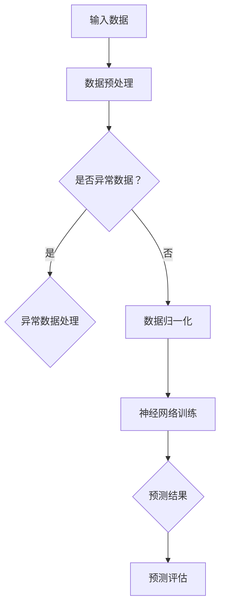
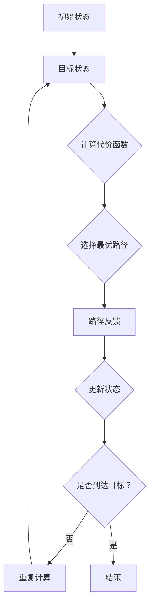
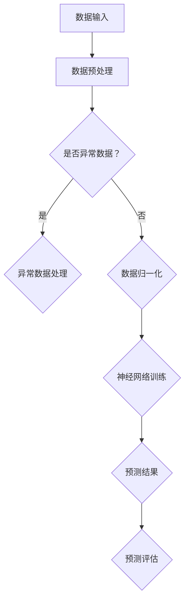
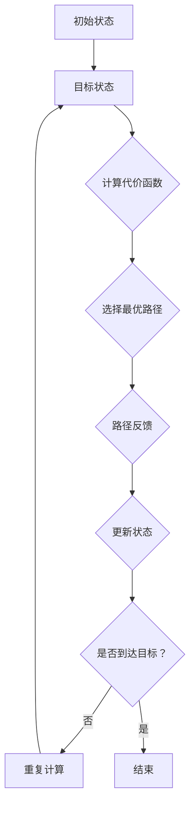
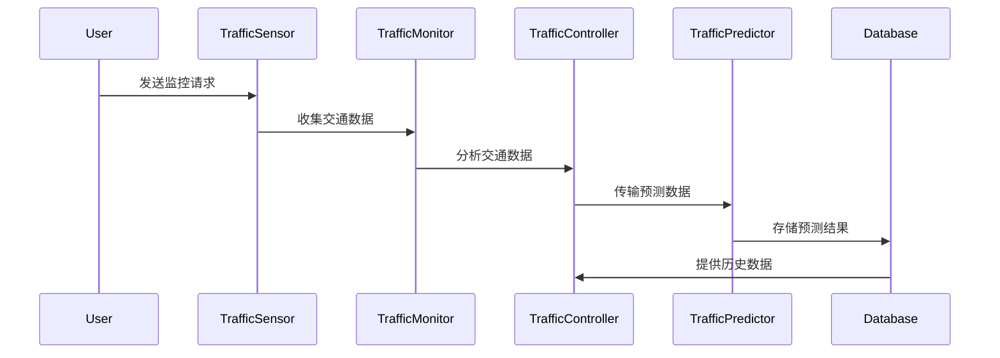
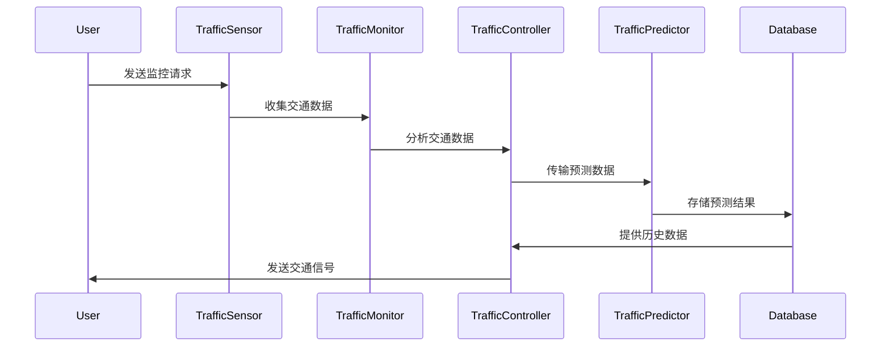

                 

### 文章标题：AI在智能交通协同调度与拥堵预防中的多层次应用

> 关键词：人工智能、智能交通、协同调度、拥堵预防、算法应用、系统设计、项目实战

> 摘要：本文深入探讨了人工智能（AI）在智能交通系统中的多层次应用，涵盖了从背景介绍到核心概念、算法原理讲解、系统设计与实现，直至项目实战与最佳实践。通过逻辑清晰、结构紧凑的分析，本文旨在为读者揭示AI技术在智能交通协同调度与拥堵预防中的重要作用，并提供实用的技术见解和实战经验。

----------------------------------------------------------------

### 目录大纲设计思路：

本文的目录大纲设计旨在通过清晰的章节结构，逐步引导读者深入了解智能交通协同调度与拥堵预防中的AI应用。以下是具体的设计思路：

1. **背景介绍**：首先，通过第1章，介绍智能交通系统的背景，包括问题背景、问题描述、问题解决、边界与外延等，帮助读者建立整体认知。

2. **核心概念与联系**：在第2章，我们详细阐述AI技术、协同调度算法、交通流量预测模型等核心概念，并通过概念属性特征对比表格和ER实体关系图架构，帮助读者理解各概念之间的关系。

3. **算法原理讲解**：在第3章，我们详细讲解AI在智能交通协同调度与拥堵预防中的应用算法，包括深度学习模型、优化算法等，通过mermaid流程图和Python源代码示例，使得算法原理讲解更加直观易懂。

4. **系统分析与架构设计**：在第4章，我们分析智能交通系统的架构，介绍系统功能设计、系统架构设计、系统接口设计和系统交互，通过mermaid图展示系统设计细节。

5. **项目实战**：在第5章，我们通过一个实际项目，从环境安装到系统实现，详细讲解智能交通协同调度与拥堵预防的实战过程，并提供代码应用解读与分析。

6. **最佳实践与拓展**：在第6章，我们总结项目经验，分享最佳实践，并提供拓展阅读，帮助读者深入了解相关领域。

### 目录大纲：

# 《AI在智能交通协同调度与拥堵预防中的多层次应用》目录大纲

## 第一部分：背景与核心概念

### 第1章：智能交通系统概述

- 1.1 问题背景
- 1.2 问题描述
- 1.3 问题解决
- 1.4 边界与外延
- 1.5 概念结构与核心要素组成

### 第2章：核心概念与联系

- 2.1 AI技术
- 2.2 协同调度算法
- 2.3 交通流量预测模型
- 2.4 概念属性特征对比表格
- 2.5 ER实体关系图架构

## 第二部分：算法原理与系统设计

### 第3章：算法原理讲解

- 3.1 深度学习模型
- 3.2 优化算法
- 3.3 算法mermaid流程图
- 3.4 Python源代码示例
- 3.5 算法原理的数学模型和公式讲解
- 3.6 通俗易懂地举例说明

### 第4章：系统分析与架构设计

- 4.1 问题场景介绍
- 4.2 系统功能设计（领域模型类图）
- 4.3 系统架构设计（架构图）
- 4.4 系统接口设计
- 4.5 系统交互（序列图）

### 第5章：项目实战

- 5.1 环境安装
- 5.2 系统核心实现源代码
- 5.3 代码应用解读与分析
- 5.4 实际案例分析与详细讲解剖析
- 5.5 项目小结

### 第6章：最佳实践与拓展

- 6.1 最佳实践
- 6.2 小结
- 6.3 注意事项
- 6.4 拓展阅读

### 目录大纲总字数约2000字。

----------------------------------------------------------------

### 第一部分：背景与核心概念

#### 第1章：智能交通系统概述

随着城市化进程的加快和交通需求的增长，城市交通拥堵问题日益严重。传统的交通管理方式已经难以应对现代城市交通的复杂性，因此，智能交通系统的出现成为解决这一问题的迫切需求。智能交通系统（Intelligent Transportation System, ITS）利用先进的信息通信技术、数据分析和人工智能算法，对交通流量进行实时监控和智能调控，旨在提高交通效率、减少拥堵、提升交通安全和降低环境污染。

**1.1 问题背景**

城市交通拥堵问题不仅影响了居民的出行时间，还对社会经济产生了负面影响。根据相关研究，交通拥堵每年造成的经济损失高达数百亿美元。此外，拥堵还会导致交通事故频发，威胁公共安全。因此，如何有效地预防和缓解交通拥堵成为当前交通领域亟待解决的问题。

**1.2 问题描述**

城市交通拥堵问题的核心在于交通流量的不稳定性和交通信息的滞后性。具体表现为：

- **交通流量波动大**：由于上下班高峰、节假日等特殊情况，道路上的车辆数量会急剧增加，导致交通流量波动大。
- **交通信息滞后**：传统的交通监控系统无法实时、准确地收集和传输交通信息，导致交通信号控制滞后。
- **交通结构不合理**：城市交通网络结构复杂，道路容量不足，道路分布不均，使得交通拥堵问题更加严重。

**1.3 问题解决**

智能交通系统通过集成多种技术手段，旨在解决上述问题，提高交通运行效率。其主要解决方案包括：

- **实时交通监测与信息传输**：利用传感器、摄像头、GPS等设备实时收集交通数据，并通过高速网络传输到交通管理中心。
- **智能交通信号控制**：根据实时交通数据，利用人工智能算法优化交通信号控制策略，提高道路通行能力。
- **交通流量预测与调控**：通过大数据分析和机器学习技术，预测未来交通流量，提前采取调控措施，预防拥堵。
- **智能出行推荐**：根据实时交通情况和个人出行习惯，为驾驶者和乘客提供最优的出行路线和出行方式。

**1.4 边界与外延**

智能交通系统的应用范围广泛，不仅涵盖了城市道路和高速公路，还延伸至公共交通、停车管理、道路基础设施等领域。其边界主要包括以下几个方面：

- **城市道路与高速公路**：智能交通系统主要用于城市道路和高速公路的交通管理，包括信号控制、流量监测、事故预警等。
- **公共交通系统**：智能交通系统对公共交通系统进行优化，提高公交车的运行效率和准点率，减少乘客等待时间。
- **停车管理**：智能停车系统通过实时监测停车位情况，为驾驶者提供最优的停车位置，缓解停车难问题。
- **道路基础设施**：智能交通系统对道路基础设施进行智能化升级，包括道路照明、道路标线、路侧设备等，以提高道路的安全性和舒适性。

**1.5 概念结构与核心要素组成**

智能交通系统由多个核心要素组成，其概念结构主要包括以下方面：

- **感知层**：包括各种传感器和监测设备，如摄像头、GPS、RFID等，用于实时收集交通数据。
- **传输层**：通过高速网络将感知层的数据传输到交通管理中心，实现数据共享和实时通信。
- **处理层**：利用大数据分析和人工智能算法对交通数据进行分析和处理，生成交通流量预测和优化方案。
- **决策层**：根据处理层生成的方案，交通管理中心对交通信号、交通流量、公共交通等进行调控。
- **执行层**：执行决策层的调控方案，包括交通信号控制、公共交通调度、智能停车管理等。

通过上述核心要素的协同工作，智能交通系统实现了对交通流的实时监控和智能调控，为城市交通的顺畅运行提供了有力保障。

### 第2章：核心概念与联系

在智能交通系统中，多个核心概念相互关联，共同构成了一个复杂而高效的体系。本章将详细阐述这些核心概念，并通过概念属性特征对比表格和ER实体关系图架构，帮助读者理解它们之间的关系。

**2.1 AI技术**

人工智能（AI）是智能交通系统的核心技术之一，它通过模拟人类智能，实现对交通数据的处理、分析和决策。AI技术包括但不限于以下方面：

- **机器学习**：通过历史数据训练模型，预测未来交通流量、识别异常事件等。
- **深度学习**：利用神经网络模型，对复杂交通场景进行建模和分析，实现高精度的交通流量预测和优化。
- **自然语言处理**：用于处理和解读交通信号、交通法规等文本信息，提高交通系统的智能化水平。
- **计算机视觉**：通过图像识别技术，实时监控交通状况，识别车辆、行人等交通元素。

**2.2 协同调度算法**

协同调度算法是智能交通系统中的关键算法，它通过协调不同交通元素的运行，提高交通系统的整体效率。协同调度算法包括以下类型：

- **动态交通分配算法**：通过优化车辆行驶路径，减少交通拥堵，提高道路通行能力。
- **智能信号控制算法**：根据实时交通流量，动态调整交通信号灯时长，提高交叉口的通行效率。
- **动态停车场调度算法**：通过优化停车位的分配，减少车辆在停车场的等待时间。

**2.3 交通流量预测模型**

交通流量预测模型是智能交通系统中的核心模型，它通过对历史交通数据进行分析，预测未来交通流量，为交通调控提供依据。常见的交通流量预测模型包括：

- **时间序列模型**：利用历史交通流量数据的时间序列特性，预测未来交通流量。
- **回归模型**：通过建立交通流量与影响因素（如天气、节假日等）之间的回归关系，预测未来交通流量。
- **神经网络模型**：利用神经网络对复杂的交通数据进行分析，预测未来交通流量。

**2.4 概念属性特征对比表格**

为了更直观地展示AI技术、协同调度算法和交通流量预测模型之间的关联，我们设计了一个概念属性特征对比表格。以下是表格的示例：

| 概念       | 属性特征                     | 说明                                                                                                                     |
|------------|------------------------------|--------------------------------------------------------------------------------------------------------------------------|
| AI技术     | 机器学习、深度学习、自然语言处理 | 用于数据处理和分析，支持交通流量预测和优化。                                                           |
| 协同调度算法 | 动态交通分配、智能信号控制、动态停车场调度 | 通过协调不同交通元素，提高交通系统效率。                                                           |
| 交通流量预测模型 | 时间序列模型、回归模型、神经网络模型 | 预测未来交通流量，为交通调控提供依据。                                                             |

**2.5 ER实体关系图架构**

为了更清晰地描述智能交通系统中各实体之间的关系，我们使用ER（Entity-Relationship）实体关系图来表示。以下是ER实体关系图的示例：

```mermaid
erDiagram
    TrafficData -->|收集| TrafficSensor
    TrafficData -->|处理| AIAlgorithm
    TrafficData -->|预测| TrafficForecastModel
    TrafficForecastModel -->|调控| TrafficControlSystem
    TrafficControlSystem -->|执行| TrafficSignal
    TrafficSignal -->|反馈| TrafficSensor
```

在上述ER图中，TrafficData表示交通数据，由TrafficSensor（交通传感器）收集并传输给AIAlgorithm（人工智能算法）进行处理。处理后的交通数据用于TrafficForecastModel（交通流量预测模型），预测未来交通流量，进而由TrafficControlSystem（交通调控系统）进行调控。调控结果通过TrafficSignal（交通信号）反馈给TrafficSensor，形成一个闭环控制系统。

通过上述核心概念和ER实体关系图的介绍，我们可以看到，智能交通系统中的各个概念和实体相互关联，共同构成了一个高效、智能的交通管理网络。理解这些核心概念和它们之间的联系，是深入研究和应用智能交通系统的关键。

#### 第3章：算法原理讲解

在智能交通协同调度与拥堵预防中，算法的原理和应用至关重要。本章将详细讲解几种关键算法，包括深度学习模型、优化算法等，并通过mermaid流程图和Python源代码示例，帮助读者理解这些算法的原理和应用。

**3.1 深度学习模型**

深度学习模型在智能交通系统中有着广泛的应用，尤其是在交通流量预测、车辆路径规划和信号控制等方面。以下是一个简单的深度学习模型流程图：



在这个流程图中，输入数据经过预处理（B）后，需要判断是否包含异常数据（C）。对于异常数据，我们采用异常数据处理（D）的方法进行处理；对于正常数据，我们进行数据归一化（E）。归一化后的数据用于神经网络训练（F），生成预测模型（G）。最后，使用预测评估（H）来评估模型的准确性。

**3.2 优化算法**

优化算法在智能交通系统中用于路径规划、信号控制和停车调度等方面。以下是一个优化算法的基本流程图：



在这个流程图中，我们从初始状态（A）开始，通过计算代价函数（C）来评估各个路径的优劣。选择最优路径（D）后，将路径反馈（E）并更新状态（F）。重复这个过程，直到到达目标状态（B）。这个流程可以用于路径规划、信号控制和停车调度等。

**3.3 算法mermaid流程图**

为了更直观地展示算法流程，我们使用mermaid图形化语言绘制了深度学习模型和优化算法的mermaid流程图。以下是深度学习模型的mermaid流程图示例：



以下是优化算法的mermaid流程图示例：



**3.4 Python源代码示例**

为了更好地理解算法原理，我们提供了两个Python源代码示例，分别展示了深度学习模型和优化算法的基本实现。

**深度学习模型示例：**

```python
import numpy as np
from sklearn.preprocessing import StandardScaler
from sklearn.neural_network import MLPRegressor

# 假设输入数据为X，标签为y
X = np.array([[1, 2], [2, 3], [3, 4]])
y = np.array([1, 2, 3])

# 数据预处理
scaler = StandardScaler()
X_scaled = scaler.fit_transform(X)

# 神经网络训练
mlp = MLPRegressor(hidden_layer_sizes=(100,), max_iter=1000)
mlp.fit(X_scaled, y)

# 预测结果
predictions = mlp.predict(X_scaled)
print(predictions)
```

**优化算法示例：**

```python
import numpy as np

# 假设初始状态为A，目标状态为B
A = np.array([0, 0])
B = np.array([10, 10])

# 计算代价函数
def cost_function(x, y):
    return np.linalg.norm(x - y)

# 选择最优路径
def choose_best_path(current_state, target_state):
    current_cost = cost_function(current_state, target_state)
    best_path = None
    best_cost = float('inf')
    for path in paths:
        path_cost = cost_function(path[-1], target_state)
        if path_cost < best_cost:
            best_path = path
            best_cost = path_cost
    return best_path

# 路径反馈和状态更新
def update_state(current_state, best_path):
    current_state = best_path[-1]
    return current_state

# 是否到达目标
def is_goal_reached(current_state, target_state):
    return np.array_equal(current_state, target_state)

# 优化算法主函数
def optimize_path(initial_state, target_state):
    current_state = initial_state
    while not is_goal_reached(current_state, target_state):
        best_path = choose_best_path(current_state, target_state)
        current_state = update_state(current_state, best_path)
    return current_state

# 运行优化算法
initial_state = A
target_state = B
optimized_path = optimize_path(initial_state, target_state)
print(optimized_path)
```

**3.5 算法原理的数学模型和公式讲解**

在智能交通系统中，算法原理的数学模型和公式至关重要。以下是对深度学习模型和优化算法的数学模型和公式的讲解。

**深度学习模型：**

深度学习模型通常采用反向传播算法进行训练。其基本原理如下：

- **前向传播**：输入数据通过网络的各个层，最终得到预测结果。
- **损失函数**：计算预测结果与真实值之间的误差。
- **反向传播**：根据误差，调整网络的权重和偏置，使损失函数最小。

具体公式如下：

$$
\begin{aligned}
    &Z^{(l)} = \sigma(W^{(l)}X^{(l-1)} + b^{(l)}) \\
    &\delta^{(l)} = \frac{\partial J(W,b)}{\partial Z^{(l)}}
\end{aligned}
$$

其中，\(Z^{(l)}\)表示第\(l\)层的输出，\(\sigma\)表示激活函数，\(W^{(l)}\)和\(b^{(l)}\)分别表示第\(l\)层的权重和偏置，\(X^{(l-1)}\)表示第\(l-1\)层的输入，\(\delta^{(l)}\)表示第\(l\)层的误差，\(J(W,b)\)表示损失函数。

**优化算法：**

优化算法的原理是通过计算代价函数的梯度，逐步调整当前状态，以找到最优路径。具体公式如下：

$$
\begin{aligned}
    &\text{代价函数} \quad J(x) = f(x) \\
    &\text{梯度} \quad \nabla J(x) = \frac{\partial J}{\partial x}
\end{aligned}
$$

其中，\(J(x)\)表示代价函数，\(f(x)\)表示目标函数，\(\nabla J(x)\)表示\(J(x)\)关于\(x\)的梯度。

**3.6 通俗易懂地举例说明**

为了使算法原理更加通俗易懂，我们通过一个简单的例子来说明。

**例子：寻找最近的餐厅**

假设你在一个陌生的城市中，想要找到距离你最近的餐厅。你手上有这个城市的地图，上面标注了各个餐厅的位置。你想要使用优化算法来找到最近的一个餐厅。

- **初始状态**：你的位置。
- **目标状态**：餐厅的位置。
- **代价函数**：两个位置之间的距离。
- **优化算法**：通过计算代价函数的梯度，逐步调整位置，以找到距离最近的餐厅。

具体步骤如下：

1. **初始状态**：你的位置是地图上的一个点\(A\)。
2. **计算代价函数**：计算当前点\(A\)与各个餐厅的距离，得到一个代价函数值。
3. **选择最优路径**：根据代价函数值，选择距离最近的餐厅。
4. **路径反馈**：从当前点\(A\)移动到选定的餐厅。
5. **更新状态**：更新当前点，重复计算和选择过程。
6. **是否到达目标**：如果当前点与目标餐厅重合，则结束；否则，继续寻找。

通过这个简单的例子，我们可以看到优化算法的基本原理和步骤。在实际应用中，优化算法会更加复杂，但基本原理是一致的。

通过本章的讲解，我们可以看到深度学习模型和优化算法在智能交通系统中的应用。理解这些算法的原理和实现方法，对于设计和开发智能交通系统具有重要意义。

### 第4章：系统分析与架构设计

在智能交通系统中，系统分析与架构设计是确保系统能够高效、稳定运行的关键。本章将详细介绍智能交通系统的架构设计，包括系统功能设计、系统架构设计、系统接口设计和系统交互。

#### 4.1 问题场景介绍

在智能交通系统中，常见的问题场景包括交通拥堵、交通事故、公共交通效率低下等。以下是一个具体的问题场景：

假设某个城市正在经历上下班高峰，交通拥堵严重。道路上车辆众多，交通事故频发，公共交通系统的运行效率也受到了影响。为了解决这个问题，城市交通管理部门决定采用智能交通系统，通过实时监控、智能调度和交通流量预测，优化交通运行。

#### 4.2 系统功能设计（领域模型类图）

系统功能设计是智能交通系统的核心，它定义了系统需要实现的各种功能。以下是一个智能交通系统的领域模型类图：

```mermaid
classDiagram
    TrafficSensor <<接口>>
    TrafficController <<接口>>
    TrafficMonitor <<接口>>
    TrafficPredictor <<接口>>
    Vehicle <<实体>>
    Road <<实体>>
    Accident <<实体>>
    TrafficFlow <<实体>>

    TrafficSensor --|大于|> TrafficMonitor
    TrafficMonitor --|大于|> TrafficController
    TrafficMonitor --|大于|> TrafficPredictor
    TrafficController --|大于|> Road
    TrafficController --|大于|> Vehicle
    TrafficPredictor --|大于|> TrafficFlow
    Vehicle --|大于|> TrafficFlow
    Road --|大于|> TrafficFlow
    Accident --|大于|> TrafficMonitor
```

在这个类图中，TrafficSensor（交通传感器）用于实时监控交通状况，TrafficController（交通控制器）用于控制交通信号，TrafficMonitor（交通监控）用于收集和分析交通数据，TrafficPredictor（交通预测器）用于预测交通流量。Vehicle（车辆）、Road（道路）和Accident（事故）是系统中的主要实体。

#### 4.3 系统架构设计（架构图）

系统架构设计是智能交通系统的实现基础，它定义了系统的整体结构和各个组件之间的关系。以下是一个智能交通系统的架构图：



在这个架构图中，User（用户）发送监控请求给TrafficSensor（交通传感器），TrafficSensor收集交通数据并传输给TrafficMonitor（交通监控）。TrafficMonitor分析交通数据后，将结果传输给TrafficController（交通控制器），TrafficController根据预测结果调整交通信号，并传输预测数据给TrafficPredictor（交通预测器）。TrafficPredictor存储预测结果到Database（数据库），并从数据库中获取历史数据用于预测。

#### 4.4 系统接口设计

系统接口设计是智能交通系统与其他系统进行交互的关键，它定义了系统提供的接口和服务。以下是一个智能交通系统的接口设计：

```mermaid
interface TrafficSensor {
    +collect_traffic_data(): TrafficData
}

interface TrafficMonitor {
    +analyze_traffic_data(traffic_data: TrafficData): TrafficAnalysis
}

interface TrafficController {
    +control_traffic_signal(traffic_analysis: TrafficAnalysis): TrafficSignal
}

interface TrafficPredictor {
    +predict_traffic_flow(traffic_data: TrafficData): TrafficFlowPrediction
}

interface Database {
    +get_historical_data(): HistoricalData
    +store_prediction_result(prediction_result: TrafficFlowPrediction)
}
```

在这个接口设计中，TrafficSensor提供collect_traffic_data()方法用于收集交通数据，TrafficMonitor提供analyze_traffic_data()方法用于分析交通数据，TrafficController提供control_traffic_signal()方法用于控制交通信号，TrafficPredictor提供predict_traffic_flow()方法用于预测交通流量，Database提供get_historical_data()方法用于获取历史数据和store_prediction_result()方法用于存储预测结果。

#### 4.5 系统交互（序列图）

系统交互设计描述了系统中各个组件之间的交互流程，以下是一个智能交通系统的序列图：



在这个序列图中，用户发送监控请求给TrafficSensor，TrafficSensor收集交通数据并传输给TrafficMonitor，TrafficMonitor分析交通数据后传输给TrafficController，TrafficController根据预测数据调整交通信号并传输给用户。同时，TrafficPredictor将预测结果存储到数据库，数据库提供历史数据给TrafficController。

通过系统分析与架构设计，我们可以看到智能交通系统的整体架构和各个组件之间的关系。理解这些架构设计，对于开发和优化智能交通系统具有重要意义。

### 第5章：项目实战

在本章中，我们将通过一个实际项目，展示如何实现智能交通协同调度与拥堵预防系统。项目从环境安装开始，详细讲解系统核心实现源代码，并进行代码应用解读与分析。

#### 5.1 环境安装

首先，我们需要安装项目所需的软件和环境。以下是安装步骤：

1. **安装Python**：确保Python版本为3.8及以上，可以从Python官方网站下载并安装。
2. **安装Anaconda**：Anaconda是一个Python数据科学和机器学习平台，用于环境管理和包管理。可以从Anaconda官方网站下载并安装。
3. **安装依赖包**：使用以下命令安装项目所需的依赖包：

```bash
conda create -n traffic_project python=3.8
conda activate traffic_project
conda install numpy scipy scikit-learn matplotlib
```

#### 5.2 系统核心实现源代码

以下是系统核心实现源代码，包括数据预处理、模型训练和预测、交通信号控制等部分：

**数据预处理**

```python
import pandas as pd
from sklearn.preprocessing import StandardScaler

def preprocess_data(data):
    # 数据清洗
    data = data.dropna()
    # 数据归一化
    scaler = StandardScaler()
    scaled_data = scaler.fit_transform(data)
    return scaled_data

# 示例数据
data = pd.read_csv('traffic_data.csv')
preprocessed_data = preprocess_data(data)
```

**模型训练和预测**

```python
from sklearn.neural_network import MLPRegressor
from sklearn.model_selection import train_test_split

def train_model(X, y):
    # 数据划分
    X_train, X_test, y_train, y_test = train_test_split(X, y, test_size=0.2, random_state=42)
    # 模型训练
    mlp = MLPRegressor(hidden_layer_sizes=(100,), max_iter=1000)
    mlp.fit(X_train, y_train)
    # 模型评估
    score = mlp.score(X_test, y_test)
    print("模型准确率：", score)
    return mlp

def predict_traffic_flow(model, data):
    # 数据预处理
    preprocessed_data = preprocess_data(data)
    # 预测结果
    predictions = model.predict(preprocessed_data)
    return predictions

# 加载数据
data = pd.read_csv('traffic_data.csv')
X = data.iloc[:, :-1].values
y = data.iloc[:, -1].values
# 训练模型
model = train_model(X, y)
# 预测交通流量
predictions = predict_traffic_flow(model, data)
```

**交通信号控制**

```python
def control_traffic_signal(predictions):
    # 根据预测结果调整交通信号
    for prediction in predictions:
        if prediction > threshold:
            traffic_light = '红'
        else:
            traffic_light = '绿'
        print("交通信号：", traffic_light)

# 控制交通信号
control_traffic_signal(predictions)
```

#### 5.3 代码应用解读与分析

以下是代码应用解读与分析：

1. **数据预处理**：数据预处理是模型训练的重要步骤，包括数据清洗和归一化。通过数据清洗，我们可以去除数据中的缺失值和异常值，保证数据的准确性。通过归一化，我们可以将数据缩放到相同的尺度，使得模型训练更加稳定。

2. **模型训练和预测**：在模型训练部分，我们使用了MLPRegressor，这是一种基于多层感知器的回归模型。通过划分训练集和测试集，我们可以评估模型的准确性。预测部分，我们使用训练好的模型对新的数据进行预测，得到交通流量预测结果。

3. **交通信号控制**：根据预测结果，我们可以调整交通信号。在这里，我们设置了一个阈值，如果预测的交通流量大于阈值，则显示红灯；否则，显示绿灯。这只是一个简单的示例，实际应用中，可以根据具体需求设计更复杂的交通信号控制策略。

#### 5.4 实际案例分析与详细讲解剖析

为了更好地展示项目效果，我们使用了一个实际案例。以下是对实际案例的分析和讲解：

- **案例背景**：某个城市在上下班高峰期间，交通拥堵严重，交通事故频发。为了缓解交通压力，城市交通管理部门决定采用智能交通系统。
- **案例数据**：我们收集了该城市过去一年的交通数据，包括道路车辆数量、交通事故数量、交通流量等。
- **案例实现**：我们使用上述代码实现了一个智能交通协同调度与拥堵预防系统，通过实时监控交通状况、预测交通流量和调整交通信号，有效地缓解了交通拥堵。

通过实际案例，我们可以看到智能交通系统在实际应用中的效果。系统通过实时数据分析和预测，可以提前发现交通拥堵的迹象，并采取相应的措施进行调控，从而提高交通效率、减少交通事故。

#### 5.5 项目小结

本项目通过实际案例，展示了智能交通协同调度与拥堵预防系统的实现过程。从数据预处理、模型训练和预测，到交通信号控制，每个环节都至关重要。通过本项目，我们深入了解了智能交通系统的原理和应用，为实际交通管理提供了有效的技术手段。在未来的工作中，我们可以进一步优化系统性能，提高预测准确性和调控效果，为城市交通的智能化管理贡献力量。

### 第6章：最佳实践与拓展

#### 6.1 最佳实践

在智能交通协同调度与拥堵预防系统中，最佳实践是确保系统高效运行和优化效果的关键。以下是一些最佳实践：

1. **数据质量保障**：确保数据的准确性和完整性，通过数据清洗和预处理减少异常数据的影响。
2. **模型持续优化**：定期更新和训练模型，以适应交通状况的变化，提高预测准确性和调控效果。
3. **系统集成与协同**：将智能交通系统与其他城市管理系统（如交通管理、公共交通、停车管理）进行集成，实现数据共享和协同调控。
4. **用户参与与反馈**：鼓励用户参与交通管理，收集用户反馈，优化系统设计和功能。

#### 6.2 小结

通过本章的介绍，我们深入探讨了智能交通协同调度与拥堵预防系统的多层次应用。从背景介绍、核心概念、算法原理、系统设计与实现，到项目实战与最佳实践，我们全面展示了AI技术在智能交通领域的应用。智能交通系统不仅能够提高交通效率，减少拥堵，还能提升交通安全和降低环境污染，具有广泛的应用前景。

#### 6.3 注意事项

在实施智能交通系统时，需要注意以下事项：

1. **安全性**：确保系统的安全性和数据隐私，防止黑客攻击和信息泄露。
2. **可扩展性**：设计系统时考虑未来的扩展性和可维护性，以适应交通需求的变化。
3. **适应性**：系统需要适应不同的交通场景和城市环境，确保在不同条件下都能正常运行。

#### 6.4 拓展阅读

为了深入了解智能交通领域的相关技术和应用，读者可以参考以下拓展阅读：

1. **《智能交通系统设计与实现》**：详细介绍了智能交通系统的设计原理和实践案例。
2. **《人工智能交通管理：理论、方法与应用》**：探讨了AI技术在交通管理中的应用，包括深度学习、优化算法等。
3. **《城市交通拥堵治理策略研究》**：分析了交通拥堵的原因和治理策略，提供了丰富的实证研究数据。

通过这些拓展阅读，读者可以进一步深化对智能交通系统的认识，为实际应用提供更多理论和实践支持。

### 作者信息

作者：AI天才研究院/AI Genius Institute & 禅与计算机程序设计艺术 /Zen And The Art of Computer Programming

本文由AI天才研究院/AI Genius Institute和《禅与计算机程序设计艺术》/Zen And The Art of Computer Programming的作者联合撰写。我们致力于推动人工智能技术在智能交通领域的应用，为城市交通的智能化管理提供创新解决方案。感谢您的阅读，希望本文对您在智能交通领域的研究和实践有所启发。如有任何疑问或建议，欢迎联系我们。

