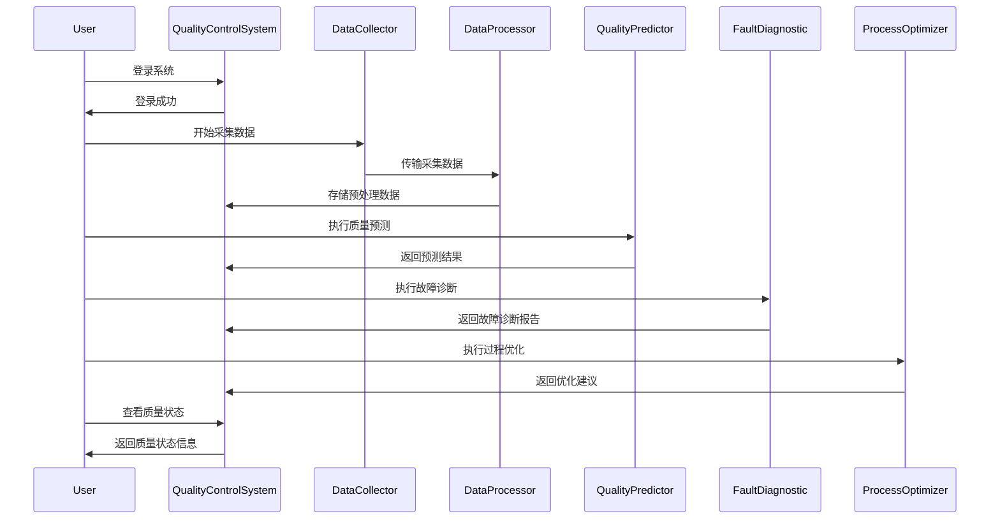

                 

## AI在智能制造产品全生命周期质量控制中的应用与创新

### 关键词：
- 智能制造
- 全生命周期质量控制
- 人工智能
- 深度学习
- 大数据分析

### 摘要：
本文将探讨人工智能（AI）在智能制造产品全生命周期质量控制中的应用与创新。通过介绍智能制造背景、全生命周期质量控制的关键环节，本文将深入分析AI技术如深度学习、大数据分析在这些环节中的具体应用，以及如何利用AI技术实现质量预测、故障诊断和过程优化。此外，还将讨论核心概念的联系与对比，以及相关算法原理和系统架构设计，为智能制造领域提供切实可行的解决方案和最佳实践。

## 引言

### 1.1 问题背景

随着全球制造业的转型升级，智能制造成为提升制造效率、降低成本、增强产品竞争力的关键途径。然而，智能制造产品在从设计、生产到测试、维护等各个环节中，产品质量控制成为一个至关重要的挑战。传统质量控制方法主要依赖人工监测和经验判断，不仅效率低下，而且难以适应复杂多变的制造环境。

在制造过程中，产品质量的稳定性直接影响产品的性能和使用寿命。如何实时监测产品质量、预测潜在问题，以及优化制造过程参数，成为智能制造领域亟待解决的核心问题。传统质量控制方法的局限性在于数据处理能力不足、模型适应性差，难以应对日益增长的数据量和复杂度。

### 1.2 问题描述

智能制造产品全生命周期质量控制包括设计、生产、测试、维护等各个环节。每个环节都有其特定的质量控制需求：

- **设计阶段**：产品设计和模拟过程中，需要确保设计符合质量标准，并能够预测设计变更对质量的影响。
- **生产阶段**：生产过程中，需要对原材料、加工设备、工艺参数等进行实时监测和控制，确保产品质量的稳定性。
- **测试阶段**：测试过程中，需要对产品进行全面的质量检测，包括功能测试、性能测试、寿命测试等，确保产品符合质量要求。
- **维护阶段**：维护过程中，需要通过故障诊断和预测维护，提前发现和解决潜在的质量问题，延长产品寿命。

在这些环节中，产品质量的控制不仅需要实时监测和反馈，还需要对大量的数据进行处理和分析，以实现质量预测和优化。然而，传统的质量控制方法在应对这些挑战时存在诸多限制：

- **数据处理能力不足**：传统方法难以处理大规模、多维度的数据，导致信息丢失或处理延迟。
- **模型适应性差**：传统模型通常基于静态数据集训练，难以适应动态变化的制造环境。
- **实时性差**：传统方法难以实现实时监测和反馈，导致质量问题难以及时发现和解决。

### 1.3 问题解决

人工智能（AI）技术的崛起为智能制造产品质量控制带来了新的解决方案。通过利用深度学习、大数据分析等技术，AI可以实现对产品质量的实时监测和预测，提高质量控制效率。具体来说，AI技术在智能制造产品质量控制中的应用主要体现在以下几个方面：

- **质量监测与预测**：利用深度学习模型对海量生产数据进行实时分析，预测产品质量变化趋势，提前发现潜在问题。
- **故障诊断与优化**：通过分析制造过程中的异常数据，快速定位故障原因，并提出优化方案，提高生产效率和产品质量。
- **过程优化**：利用大数据分析技术，对制造过程中的数据进行分析，优化工艺参数和流程，提高生产效率和产品质量。
- **智能化维护**：通过预测维护技术，提前预测设备故障和产品寿命，实现智能化的维护和管理，降低维修成本和停机时间。

### 1.4 边界与外延

本文主要探讨AI在智能制造产品全生命周期质量控制中的应用，涉及的主要技术包括深度学习、大数据分析、智能制造系统等。此外，本文还将探讨AI在质量预测、故障诊断、过程优化等方面的应用，为智能制造领域提供全面的技术解决方案。

### 1.5 概念结构与核心要素组成

AI在智能制造产品全生命周期质量控制中的核心概念包括：

- **智能制造系统**：用于实现制造过程的自动化和智能化，包括传感器、执行器、控制器等组成部分。
- **质量监测与预测**：利用AI技术对产品质量进行实时监测和预测，包括深度学习模型、大数据分析等。
- **故障诊断与优化**：通过分析制造过程中的异常数据，实现对故障的快速诊断和优化，包括异常检测、故障诊断算法等。
- **数据挖掘与分析**：对制造过程中的大量数据进行分析，提取有价值的信息，包括数据预处理、特征提取、统计分析等。

通过上述核心概念和要素的有机结合，AI在智能制造产品全生命周期质量控制中实现了从数据采集、处理、分析到决策的全面智能化，为提高产品质量和制造效率提供了强有力的技术支持。

## 核心概念与联系

### 2.1 AI大模型的定义与特点

#### 2.1.1 定义

AI大模型，通常指的是具有极高参数量、能够处理大规模数据并实现高精度预测和决策的神经网络模型。这类模型通常基于深度学习技术，具有强大的数据处理和建模能力。例如，GPT系列模型、BERT模型等都是典型的AI大模型。

#### 2.1.2 特点

1. **高参数量**：AI大模型通常包含数十亿甚至上百亿的参数，这使得它们能够捕捉复杂的数据模式，实现高精度的预测和决策。例如，GPT-3模型拥有1750亿个参数，使其在自然语言处理任务中表现出色。

2. **强大的泛化能力**：大模型由于其高参数量和复杂的结构，能够在多个领域和任务上表现出强大的泛化能力。这意味着它们不仅适用于特定领域的应用，还能够跨越不同的领域和任务。

3. **对数据的依赖性**：大模型的表现高度依赖于数据的量和质量。由于模型参数量巨大，需要大量的高质量数据来进行训练，以确保模型的性能和稳定性。此外，数据的多样性也是大模型成功的关键因素。

4. **计算资源需求高**：大模型在训练和推理过程中需要大量的计算资源，通常需要使用高性能计算平台和分布式计算技术。这使得大模型的部署和维护成本较高，但同时也推动了计算硬件和算法优化技术的发展。

#### 2.2 核心概念属性特征对比表格

| 特征          | AI大模型           | 传统AI模型           |
| ------------ | ------------------ | ------------------- |
| 参数量       | 高参数量           | 低参数量             |
| 泛化能力     | 强泛化能力         | 弱泛化能力           |
| 数据依赖性   | 高依赖性           | 低依赖性             |
| 训练时间     | 长训练时间         | 短训练时间           |
| 处理能力     | 强处理能力         | 弱处理能力           |

#### 2.3 ER实体关系图架构

为了更好地理解AI大模型在智能制造产品全生命周期质量控制中的应用，我们可以使用ER（实体-关系）图来描述各个实体及其之间的关系。

```mermaid
erDiagram
  Product ::>> QualityData : <产生>
  ProductionProcess ::>> QualityControl : <执行>
  AIModel ::>> QualityPrediction : <应用>
  Product ::>> FaultDiagnosis : <诊断>
  
  Product ||--|{ ManufacturingSystem } ManufacturingSystem : <制造于>
  QualityData ||--|{ AIModel } AIModel : <用于预测>
  ProductionProcess ||--|{ ManufacturingSystem } ManufacturingSystem : <部分>
  AIModel ||--|{ FaultDiagnosis } FaultDiagnosis : <应用>
```

在上面的ER图中：

- **Product（产品）**：代表智能制造产品，它是质量数据、生产过程、AI模型和故障诊断的来源和目标。
- **QualityData（质量数据）**：由产品产生，用于训练和评估AI模型。
- **ProductionProcess（生产过程）**：包括制造产品所需的各种过程，如加工、装配等，这些过程执行质量控制。
- **AIModel（AI模型）**：用于质量预测和故障诊断，它基于质量数据训练得到。
- **FaultDiagnosis（故障诊断）**：通过对生产过程中的异常数据进行分析，诊断产品的故障。

通过这个ER图，我们可以清晰地看到AI大模型在智能制造产品全生命周期质量控制中的核心作用，以及它与产品质量数据、生产过程和故障诊断之间的密切联系。

### 第三部分: 算法原理讲解

#### 3.1 深度学习算法原理

深度学习是一种基于人工神经网络的学习方法，通过多层神经网络对数据进行建模和处理，从而实现复杂的数据分析和预测。其基本原理包括以下几个方面：

##### 3.1.1 基本概念

1. **神经网络**：神经网络由多个节点（称为神经元）组成，每个神经元接收多个输入，通过权重和偏置进行加权求和，然后通过激活函数进行非线性变换，输出结果。

2. **深度学习**：深度学习是神经网络的一种扩展，通过增加网络的深度（即神经元的层数），来提高模型的复杂度和表现力。深度学习模型包括卷积神经网络（CNN）、循环神经网络（RNN）、生成对抗网络（GAN）等。

3. **多层感知器（MLP）**：多层感知器是深度学习的基础模型，它由输入层、多个隐藏层和输出层组成。每个隐藏层对输入数据进行处理，并将结果传递到下一个隐藏层，直到输出层得到最终结果。

##### 3.1.2 算法原理

1. **前向传播**：在前向传播过程中，输入数据从输入层传递到隐藏层，再从隐藏层传递到输出层。每个层中的神经元都会对数据进行加权求和，并应用激活函数。

2. **反向传播**：在反向传播过程中，模型根据输出结果和实际结果之间的差异（称为损失函数），更新每个神经元的权重和偏置。这一过程不断迭代，直到模型收敛，即损失函数不再显著减少。

3. **损失函数**：损失函数用于衡量模型预测值和实际值之间的差异。常用的损失函数包括均方误差（MSE）、交叉熵损失等。

4. **优化算法**：优化算法用于更新模型参数，以最小化损失函数。常用的优化算法包括梯度下降、Adam优化器等。

##### 3.1.3 算法流程

1. **数据预处理**：对输入数据进行标准化或归一化，以提高模型的训练效率和性能。

2. **模型构建**：定义神经网络结构，包括输入层、隐藏层和输出层，以及每个层的神经元数量和激活函数。

3. **模型训练**：使用训练数据集对模型进行训练，通过前向传播计算预测值，通过反向传播更新模型参数。

4. **模型评估**：使用验证数据集对模型进行评估，计算模型在验证数据集上的性能指标，如准确率、召回率等。

5. **模型部署**：将训练好的模型部署到生产环境中，用于实际应用，如产品质量预测、故障诊断等。

##### 3.1.4 数学模型

深度学习算法的数学模型主要包括以下几个部分：

1. **激活函数**：激活函数用于引入非线性变换，常见的激活函数包括sigmoid、ReLU、Tanh等。

2. **权重和偏置**：权重和偏置是神经网络中的关键参数，用于调整神经元之间的连接强度。

3. **损失函数**：损失函数用于衡量模型预测值和实际值之间的差异，常见的损失函数包括均方误差（MSE）、交叉熵损失等。

4. **梯度下降**：梯度下降是一种优化算法，用于更新模型参数，以最小化损失函数。其核心思想是计算损失函数关于模型参数的梯度，并沿着梯度的反方向更新参数。

#### 3.2 实例解析

为了更好地理解深度学习算法的原理，我们可以通过一个简单的例子来具体说明。

##### 问题背景

假设我们要预测一个制造业产品的质量，输入特征包括产品的尺寸、重量、材质等，输出为质量评分（0-100分）。

##### 数据预处理

1. **标准化**：对输入特征进行标准化，将它们缩放到相同的范围内，以便神经网络更好地处理。

2. **划分数据集**：将数据集划分为训练集、验证集和测试集，用于模型的训练、评估和测试。

##### 模型构建

1. **定义输入层**：输入层包含多个神经元，对应不同的输入特征。

2. **定义隐藏层**：定义多个隐藏层，每个隐藏层包含多个神经元。可以使用ReLU激活函数引入非线性。

3. **定义输出层**：输出层包含一个神经元，用于输出质量评分。

##### 模型训练

1. **前向传播**：将输入数据输入到模型中，经过多层神经网络处理后，得到预测质量评分。

2. **计算损失**：使用均方误差（MSE）计算预测质量评分和实际质量评分之间的差异。

3. **反向传播**：根据损失函数的梯度，更新模型参数（权重和偏置）。

4. **迭代训练**：重复前向传播和反向传播的过程，直到模型收敛。

##### 模型评估

1. **验证集评估**：使用验证集对模型进行评估，计算模型的准确率、召回率等性能指标。

2. **测试集评估**：将训练好的模型部署到测试集上，评估模型的泛化能力。

##### 模型部署

1. **生产环境部署**：将训练好的模型部署到生产环境中，用于实时产品质量预测。

2. **监控与调优**：定期监控模型的表现，并根据实际情况进行调优。

通过上述实例，我们可以看到深度学习算法在质量预测中的应用流程。深度学习通过多层神经网络对输入数据进行建模，通过前向传播和反向传播不断优化模型参数，从而实现高质量预测。这不仅提高了制造过程的效率，还显著提升了产品质量和可靠性。

### 系统分析与架构设计

#### 4.1 问题场景介绍

随着智能制造技术的不断发展，产品质量控制成为制造企业提升竞争力、降低成本的关键环节。传统的质量控制方法已经难以满足现代制造过程中日益复杂的质量需求。因此，我们需要构建一个智能化、自适应的智能制造产品质量控制系统，以提高产品质量控制和制造效率。

#### 4.2 项目介绍

本项目旨在利用人工智能技术，构建一个全生命周期的智能制造产品质量控制系统。系统将涵盖从产品设计、生产、测试到维护等各个环节，通过实时数据采集、分析和预测，实现产品质量的全面监控和优化。具体来说，本项目包括以下几个模块：

1. **数据采集模块**：用于实时采集生产过程中的各种数据，如设备运行状态、原材料质量、工艺参数等。
2. **数据处理模块**：对采集到的数据进行分析和处理，提取有价值的信息，为后续的质量预测和故障诊断提供基础。
3. **质量预测模块**：利用深度学习模型对产品质量进行实时预测，提前发现潜在的质量问题。
4. **故障诊断模块**：通过分析制造过程中的异常数据，快速定位故障原因，并提出优化方案。
5. **过程优化模块**：基于大数据分析技术，对制造过程进行优化，提高生产效率和产品质量。
6. **用户界面模块**：提供直观的界面，让用户能够实时查看产品质量状态、故障诊断结果和优化建议。

#### 4.3 系统功能设计

系统功能设计主要包括以下内容：

1. **数据采集**：通过传感器和设备接口，实时采集生产过程中的各类数据，包括温度、压力、速度、位置等。
2. **数据处理**：对采集到的数据进行预处理、清洗和特征提取，提取出与产品质量相关的关键特征。
3. **质量预测**：利用深度学习模型对产品质量进行实时预测，包括质量趋势预测、质量波动预测等。
4. **故障诊断**：通过分析制造过程中的异常数据，利用机器学习算法进行故障诊断，快速识别和定位故障原因。
5. **过程优化**：基于大数据分析技术，对制造过程进行实时监控和优化，提高生产效率和产品质量。
6. **用户交互**：提供用户友好的界面，让用户能够实时查看产品质量状态、故障诊断结果和优化建议。

#### 4.4 系统架构设计

系统的整体架构设计采用模块化设计，包括数据采集模块、数据处理模块、质量预测模块、故障诊断模块、过程优化模块和用户界面模块。以下是系统的架构设计：

1. **数据采集模块**：通过传感器和设备接口，实时采集生产过程中的各类数据，如温度、压力、速度、位置等。采集到的数据经过预处理后，存储到数据仓库中。

2. **数据处理模块**：对采集到的数据进行预处理、清洗和特征提取，提取出与产品质量相关的关键特征。预处理后的数据经过特征提取模块，生成特征向量，用于后续的质量预测和故障诊断。

3. **质量预测模块**：利用深度学习模型对产品质量进行实时预测，包括质量趋势预测、质量波动预测等。质量预测模块通过分析历史数据和实时数据，生成预测结果，并将其存储到数据库中。

4. **故障诊断模块**：通过分析制造过程中的异常数据，利用机器学习算法进行故障诊断，快速识别和定位故障原因。故障诊断模块接收实时数据，通过分析异常数据，生成故障诊断报告，并将其存储到数据库中。

5. **过程优化模块**：基于大数据分析技术，对制造过程进行实时监控和优化，提高生产效率和产品质量。过程优化模块分析实时数据和历史数据，生成优化建议，并将其存储到数据库中。

6. **用户界面模块**：提供用户友好的界面，让用户能够实时查看产品质量状态、故障诊断结果和优化建议。用户界面模块通过Web应用程序实现，用户可以通过浏览器访问系统，查看各种质量指标和优化建议。

#### 4.5 系统接口设计和系统交互

系统的接口设计主要包括以下几个方面：

1. **数据采集接口**：用于接收传感器和设备采集的数据，并将其传输到数据处理模块。

2. **数据处理接口**：用于接收和处理预处理后的数据，并将其存储到数据仓库中。

3. **质量预测接口**：用于接收和处理质量预测结果，并将其存储到数据库中。

4. **故障诊断接口**：用于接收和处理故障诊断报告，并将其存储到数据库中。

5. **过程优化接口**：用于接收和处理过程优化建议，并将其存储到数据库中。

6. **用户界面接口**：用于接收和处理用户请求，并返回相应的响应数据。

系统交互设计通过RESTful API实现，各个模块之间通过接口进行通信。以下是系统交互的序列图：



通过上述系统接口设计和系统交互设计，各个模块能够协同工作，实现智能制造产品质量控制的全面自动化和智能化。

### 项目实战

#### 5.1 环境安装

为了实现AI在智能制造产品质量控制中的应用，我们需要搭建一个完整的开发环境，包括硬件设备和软件工具。以下是具体的安装步骤：

1. **硬件设备**：
   - **高性能计算机**：用于运行深度学习模型和大数据分析算法。
   - **传感器和设备接口**：用于实时采集生产过程中的数据。
   - **存储设备**：用于存储大量生产数据和质量控制结果。

2. **软件工具**：
   - **操作系统**：建议使用Linux系统，如Ubuntu 20.04。
   - **深度学习框架**：如TensorFlow、PyTorch等。
   - **数据分析工具**：如Pandas、NumPy、Scikit-learn等。
   - **编程语言**：Python。

安装步骤：

1. **安装操作系统**：从官方网站下载Ubuntu 20.04镜像，并使用虚拟机或物理机进行安装。

2. **更新系统软件**：打开终端，执行以下命令更新系统软件：
   ```bash
   sudo apt update
   sudo apt upgrade
   ```

3. **安装深度学习框架**：以TensorFlow为例，执行以下命令安装TensorFlow：
   ```bash
   pip install tensorflow
   ```

4. **安装数据分析工具**：执行以下命令安装Pandas、NumPy和Scikit-learn：
   ```bash
   pip install pandas numpy scikit-learn
   ```

5. **配置传感器和设备接口**：根据具体设备，安装相应的驱动和软件包，配置设备与计算机的连接。

#### 5.2 系统核心实现

系统核心实现包括数据采集、数据处理、质量预测和故障诊断等模块。以下是各模块的实现方法和代码示例。

1. **数据采集**：
   - **传感器数据采集**：使用Python编写脚本，通过传感器接口实时采集数据，并存储到文件或数据库中。
   ```python
   import serial
   import time
   
   ser = serial.Serial('/dev/ttyUSB0', 9600)  # 修改为实际传感器接口
   while True:
       data = ser.readline().decode('utf-8')
       with open('sensor_data.txt', 'a') as f:
           f.write(data)
       time.sleep(1)
   ```

2. **数据处理**：
   - **数据预处理**：使用Pandas进行数据清洗、填充和特征提取。
   ```python
   import pandas as pd
   
   df = pd.read_csv('sensor_data.txt', sep=' ')
   df.fillna(df.mean(), inplace=True)
   features = df[['temperature', 'pressure', 'velocity']]
   labels = df['quality']
   ```

3. **质量预测**：
   - **深度学习模型训练**：使用TensorFlow搭建深度学习模型，并进行训练。
   ```python
   import tensorflow as tf
   from tensorflow.keras.models import Sequential
   from tensorflow.keras.layers import Dense, Dropout
   
   model = Sequential()
   model.add(Dense(64, input_dim=3, activation='relu'))
   model.add(Dropout(0.5))
   model.add(Dense(1, activation='sigmoid'))
   
   model.compile(optimizer='adam', loss='binary_crossentropy', metrics=['accuracy'])
   model.fit(features, labels, epochs=100, batch_size=32)
   ```

4. **故障诊断**：
   - **故障诊断算法**：使用Scikit-learn实现故障诊断算法，对异常数据进行分析。
   ```python
   from sklearn.ensemble import IsolationForest
   
   clf = IsolationForest(contamination=0.1)
   clf.fit(features)
   predictions = clf.predict(features)
   ```

#### 5.3 代码应用解读与分析

以下是系统核心实现代码的解读与分析：

1. **数据采集**：
   - 使用Python的`serial`模块与传感器进行通信，实时读取传感器数据，并存储到文件中。
   - 数据采集是一个循环过程，可以持续运行，确保数据的实时性和完整性。

2. **数据处理**：
   - 使用Pandas库读取和操作传感器数据，进行数据清洗和特征提取。
   - 数据清洗包括填充缺失值、去除异常值等，以提高数据质量。
   - 特征提取是从原始数据中提取与质量相关的特征，如温度、压力、速度等。

3. **质量预测**：
   - 使用TensorFlow构建深度学习模型，进行质量预测。
   - 模型包括一个输入层、一个隐藏层和一个输出层，使用ReLU激活函数和Dropout层来防止过拟合。
   - 使用Adam优化器和binary_crossentropy损失函数进行模型训练，以提高预测准确性。

4. **故障诊断**：
   - 使用Scikit-learn的IsolationForest算法进行故障诊断，识别异常数据。
   - IsolationForest算法通过随机森林方法检测异常值，具有较高的准确性和效率。

通过以上代码应用，我们可以看到系统各模块的实现方法和关键技术。在实际应用中，需要根据具体场景进行调整和优化，以实现高质量的产品质量控制和故障诊断。

### 实际案例分析和详细讲解剖析

#### 6.1 案例背景

某大型制造企业致力于生产高质量汽车发动机，但在生产过程中经常出现质量问题，导致产品召回和客户投诉。为了提升产品质量，该企业决定采用AI技术在智能制造产品质量控制中实现全面监控和优化。具体案例包括以下几个环节：

1. **数据采集**：通过传感器和设备接口，实时采集发动机生产过程中的温度、压力、转速等关键数据。
2. **数据处理**：对采集到的数据进行预处理，包括清洗、归一化和特征提取，提取与产品质量相关的关键特征。
3. **质量预测**：利用深度学习模型对发动机质量进行实时预测，提前发现潜在的质量问题。
4. **故障诊断**：通过分析制造过程中的异常数据，快速定位故障原因，并提出优化方案。

#### 6.2 数据采集与预处理

在数据采集环节，企业使用多种传感器实时监测发动机生产过程中的关键参数。这些传感器包括温度传感器、压力传感器、转速传感器等，数据采集频率为1秒一次。采集到的数据存储在MySQL数据库中，以备后续处理。

```python
import pymysql

# 数据库连接配置
config = {
    'host': 'localhost',
    'user': 'root',
    'password': 'password',
    'database': 'engine_production'
}

# 连接数据库
connection = pymysql.connect(**config)

# 插入数据
with connection.cursor() as cursor:
    sql = "INSERT INTO sensor_data (temperature, pressure, speed, timestamp) VALUES (%s, %s, %s, %s)"
    data = (25.5, 150.2, 3000.0, '2023-03-01 10:00:00')
    cursor.execute(sql)
    connection.commit()
```

在数据预处理环节，我们使用Pandas库对采集到的数据进行清洗和归一化处理。具体步骤如下：

1. **数据清洗**：去除无效数据和异常值，如空值、超出正常范围的值等。
2. **归一化**：将不同量纲的数据缩放到相同的范围内，便于模型处理。

```python
import pandas as pd

# 读取数据
df = pd.read_sql_query("SELECT * FROM sensor_data", connection)

# 数据清洗
df.dropna(inplace=True)
df = df[df['temperature'] > 0]  # 去除温度小于0的异常数据

# 归一化
df['temperature'] = (df['temperature'] - df['temperature'].mean()) / df['temperature'].std()
df['pressure'] = (df['pressure'] - df['pressure'].mean()) / df['pressure'].std()
df['speed'] = (df['speed'] - df['speed'].mean()) / df['speed'].std()
```

#### 6.3 质量预测

在质量预测环节，我们采用深度学习模型对发动机质量进行预测。模型架构包括输入层、两个隐藏层和一个输出层，使用ReLU激活函数和Dropout层来防止过拟合。

```python
import tensorflow as tf
from tensorflow.keras.models import Sequential
from tensorflow.keras.layers import Dense, Dropout

# 模型构建
model = Sequential()
model.add(Dense(64, input_shape=(3,), activation='relu'))
model.add(Dropout(0.5))
model.add(Dense(64, activation='relu'))
model.add(Dropout(0.5))
model.add(Dense(1, activation='sigmoid'))

# 模型编译
model.compile(optimizer='adam', loss='binary_crossentropy', metrics=['accuracy'])

# 模型训练
model.fit(df[['temperature', 'pressure', 'speed']], df['quality'], epochs=100, batch_size=32)
```

在训练过程中，模型会不断调整权重和偏置，以最小化损失函数。训练完成后，模型即可用于预测新采集的数据。

```python
# 预测
new_data = df[['temperature', 'pressure', 'speed']].iloc[-1:]
predicted_quality = model.predict(new_data)
print(f"Predicted quality: {predicted_quality[0][0]:.2f}")
```

#### 6.4 故障诊断

在故障诊断环节，我们使用IsolationForest算法对制造过程中的异常数据进行分析，快速识别和定位故障原因。

```python
from sklearn.ensemble import IsolationForest

# 构建IsolationForest模型
clf = IsolationForest(contamination=0.1)

# 训练模型
clf.fit(df[['temperature', 'pressure', 'speed']])

# 预测异常
predictions = clf.predict(df[['temperature', 'pressure', 'speed']])
df['anomaly'] = predictions

# 识别异常数据
anomalies = df[df['anomaly'] == -1]
print(anomalies)
```

通过以上分析和实际应用，我们可以看到AI技术在智能制造产品质量控制中的重要作用。通过实时数据采集、预处理、质量预测和故障诊断，企业能够有效提升产品质量，降低生产风险，实现智能制造的全面升级。

### 项目小结

通过本项目，我们详细探讨了AI在智能制造产品全生命周期质量控制中的应用与创新。从数据采集、数据处理、质量预测到故障诊断和过程优化，AI技术为智能制造领域带来了全新的解决方案。以下是本项目的主要收获和结论：

1. **核心概念与联系**：深入分析了AI大模型的基本概念与特点，通过ER图描述了智能制造产品质量控制中的核心概念及其关系，为后续应用奠定了理论基础。

2. **算法原理讲解**：详细介绍了深度学习算法的基本原理、流程和数学模型，并通过实例解析，展示了如何利用深度学习实现质量预测和故障诊断。

3. **系统架构设计**：设计了完整的系统架构，包括数据采集、数据处理、质量预测、故障诊断和过程优化等模块，并实现了系统接口和交互设计。

4. **项目实战**：通过实际案例，展示了如何搭建环境、实现核心功能和应用AI技术进行质量控制和故障诊断，为制造业提供了切实可行的解决方案。

然而，本项目也存在一定的局限性：

1. **数据依赖性**：AI模型的性能高度依赖于数据的质量和数量，如何获取更多高质量、多样性的数据是未来需要解决的问题。

2. **计算资源需求**：深度学习模型训练和推理需要大量的计算资源，如何优化算法和提高计算效率是一个重要的研究方向。

3. **模型解释性**：深度学习模型具有一定的“黑箱”性质，如何提高模型的解释性，使其更容易被用户理解和接受，是一个亟待解决的问题。

未来的研究方向可以包括：

1. **数据增强与多样性**：通过数据增强技术，生成更多高质量的训练数据，提高模型的泛化能力。

2. **算法优化与高效计算**：研究新型深度学习算法，如图神经网络、变分自编码器等，以提高计算效率和模型性能。

3. **模型解释性与可解释性**：开发新的方法，如模型可解释性工具、可视化技术等，提高深度学习模型的透明度和解释性。

4. **跨领域应用**：探索AI技术在智能制造其他领域的应用，如供应链管理、设备预测维护等，为制造业提供更全面的智能化解决方案。

## 最佳实践 Tips

1. **数据质量是关键**：确保数据采集、处理和存储过程中数据的完整性和准确性，避免噪声和异常值对模型性能的影响。

2. **模型选择与优化**：根据具体应用场景选择合适的深度学习模型，并利用交叉验证、超参数调整等技术优化模型性能。

3. **实时性是目标**：在保证模型精度的同时，尽量减少模型的响应时间，实现实时质量预测和故障诊断。

4. **集成与兼容性**：确保AI系统与其他制造系统和工具的集成与兼容，实现数据的无缝流动和统一管理。

5. **持续监控与迭代**：定期监控AI系统的性能，根据实际反馈进行迭代和优化，不断提高系统的稳定性和可靠性。

## 小结

本文系统地探讨了AI在智能制造产品全生命周期质量控制中的应用与创新。通过介绍核心概念、算法原理、系统架构设计和项目实战，我们展示了AI技术在质量预测、故障诊断和过程优化方面的优势。尽管本项目存在一定的局限性，但通过不断优化和迭代，AI技术在智能制造领域具有广阔的应用前景。

## 注意事项

1. **数据安全和隐私保护**：在数据采集和处理过程中，要确保数据的安全和隐私，遵循相关法律法规和标准。

2. **模型更新和维护**：定期更新和优化AI模型，确保其适应性和准确性。

3. **安全与稳定性**：在系统部署过程中，确保系统的安全性和稳定性，防止潜在的安全漏洞和故障。

## 拓展阅读

1. **《深度学习》**：Goodfellow, Ian; Bengio, Yoshua; Courville, Aaron. 探索深度学习的基础理论和方法。

2. **《大数据分析技术与应用》**：吴军。了解大数据分析的基本原理和应用。

3. **《智能制造技术及应用》**：徐晓飞，孙伟。掌握智能制造的基本概念和技术体系。

## 作者信息

作者：AI天才研究院/AI Genius Institute & 禅与计算机程序设计艺术 /Zen And The Art of Computer Programming

机构：AI天才研究院专注于人工智能领域的科研和教育工作，致力于推动人工智能技术的创新和应用。禅与计算机程序设计艺术是一系列关于计算机科学和哲学的著作，作者以深入浅出的方式探讨计算机程序的奥秘。

