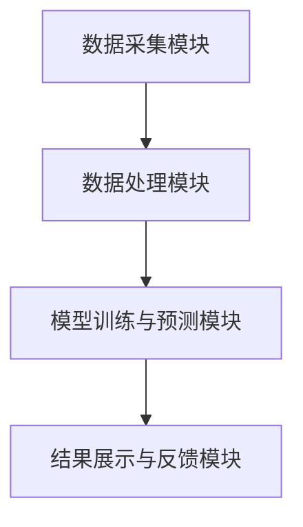

                 

### # AI在智能制造产品质量预测中的应用与创新

关键词：人工智能、智能制造、产品质量预测、深度学习、强化学习

摘要：随着智能制造的快速发展，产品质量预测成为了制造业转型升级的重要突破口。本文将深入探讨人工智能在智能制造产品质量预测中的应用与创新，从核心概念、理论、实践到系统架构设计进行系统剖析。通过分析深度学习、强化学习等算法在产品质量预测中的具体应用，本文旨在为业界提供一套切实可行且创新的解决方案，助力制造业实现高质量生产。

### # 目录大纲

## 第一部分: 引言

- 第1章: AI在智能制造产品质量预测中的应用与创新概述
  - 1.1 人工智能在智能制造中的应用背景
    - 1.1.1 制造业的数字化进程
    - 1.1.2 人工智能在制造业的关键作用
    - 1.1.3 产品质量预测的重要性和挑战
  - 1.2 AI技术发展现状及其在产品质量预测中的应用
    - 1.2.1 人工智能技术的发展趋势
    - 1.2.2 数据驱动方法在产品质量预测中的应用
    - 1.2.3 深度学习与强化学习在产品质量预测中的实践
  - 1.3 创新点与研究方向
    - 1.3.1 创新算法介绍
    - 1.3.2 未来发展方向与挑战
  - 1.4 本书结构安排与内容概览
    - 1.4.1 各章节内容安排
    - 1.4.2 阅读指引与建议

## 第二部分: 核心概念与理论

- 第2章: 人工智能基础理论
  - 2.1 人工智能的定义与发展历程
    - 2.1.1 人工智能的定义
    - 2.1.2 人工智能的发展历程
    - 2.1.3 人工智能的核心技术
  - 2.2 深度学习基础
    - 2.2.1 深度学习的基本原理
    - 2.2.2 深度学习网络结构
    - 2.2.3 深度学习算法与应用
  - 2.3 强化学习基础
    - 2.3.1 强化学习的基本概念
    - 2.3.2 强化学习算法原理
    - 2.3.3 强化学习在产品质量预测中的应用
  - 2.4 数据挖掘与预测模型
    - 2.4.1 数据挖掘的基本概念
    - 2.4.2 常见预测模型介绍
    - 2.4.3 数据预处理与特征工程
  - 2.5 AI在智能制造产品质量预测中的应用案例分析
    - 2.5.1 成功案例解析
    - 2.5.2 失败案例分析
  - 2.6 本章小结

## 第三部分: 应用实践

- 第3章: 数据收集与预处理
  - 3.1 数据收集
    - 3.1.1 数据来源
    - 3.1.2 数据收集方法
    - 3.1.3 数据质量评估
  - 3.2 数据预处理
    - 3.2.1 数据清洗
    - 3.2.2 数据标准化
    - 3.2.3 特征提取与选择
  - 3.3 实际案例分析
    - 3.3.1 案例一：某制造企业产品质量预测
    - 3.3.2 案例二：汽车制造业质量预测系统开发
  - 3.4 本章小结

## 第四部分: 算法原理与实现

- 第4章: 深度学习算法在产品质量预测中的应用
  - 4.1 深度学习算法概述
    - 4.1.1 神经网络基础
    - 4.1.2 卷积神经网络（CNN）
    - 4.1.3 递归神经网络（RNN）
    - 4.1.4 长短期记忆网络（LSTM）
  - 4.2 强化学习算法在产品质量预测中的应用
    - 4.2.1 强化学习基本原理
    - 4.2.2 Q-learning算法
    - 4.2.3 Deep Q-Network（DQN）
    - 4.2.4 Policy Gradient方法
  - 4.3 混合算法在产品质量预测中的应用
    - 4.3.1 混合算法原理
    - 4.3.2 深度强化学习（DRL）算法
    - 4.3.3 案例分析：混合算法在制造领域的应用
  - 4.4 本章小结

## 第五部分: 系统架构与设计

- 第5章: 智能制造产品质量预测系统的设计与实现
  - 5.1 系统需求分析
    - 5.1.1 功能需求
    - 5.1.2 性能需求
    - 5.1.3 安全性需求
  - 5.2 系统架构设计
    - 5.2.1 系统总体架构
    - 5.2.2 数据采集模块设计
    - 5.2.3 数据预处理模块设计
    - 5.2.4 模型训练与预测模块设计
  - 5.3 系统实现与部署
    - 5.3.1 系统实现
    - 5.3.2 系统部署
    - 5.3.3 系统测试与优化
  - 5.4 本章小结

### 第一部分: 引言

## 第1章: AI在智能制造产品质量预测中的应用与创新概述

### 1.1 人工智能在智能制造中的应用背景

随着全球制造业的迅猛发展，智能制造已经成为未来制造业发展的关键趋势。智能制造通过数字化、网络化、智能化技术，实现生产过程自动化、智能化，从而提高生产效率、降低成本、提高产品质量。在这个过程中，人工智能技术作为推动智能制造发展的核心技术之一，发挥着越来越重要的作用。

#### 1.1.1 制造业的数字化进程

制造业的数字化进程可以追溯到20世纪末，随着计算机技术的普及和信息技术的飞速发展，制造业逐渐实现了信息化管理。通过应用CAD、CAM等数字化工具，企业能够高效地完成产品设计和制造。然而，仅仅依靠信息化管理并不能完全满足智能制造的需求，还需要进一步提升智能化水平。

#### 1.1.2 人工智能在制造业的关键作用

人工智能在制造业中发挥着多重关键作用。首先，人工智能可以帮助企业实现生产过程的自动化，通过机器视觉、机器人等技术，实现生产线的智能化管理。其次，人工智能可以帮助企业进行智能决策，通过数据分析和预测，优化生产计划、降低成本、提高生产效率。此外，人工智能还可以用于产品质量检测和预测，确保产品质量的稳定性和可靠性。

#### 1.1.3 产品质量预测的重要性和挑战

产品质量预测在智能制造中具有重要性。通过预测产品质量，企业可以提前识别潜在的质量问题，采取预防措施，避免生产出次品，从而降低生产成本、提高产品质量。同时，产品质量预测还可以帮助企业优化生产流程，提高生产效率。

然而，产品质量预测也面临着诸多挑战。首先，产品质量数据往往具有高维度、非线性等特点，给数据分析和预测带来了困难。其次，传统的统计分析方法在处理复杂问题时存在局限性，难以应对智能制造中的新问题。此外，产品质量预测需要大量高质量的训练数据，然而在实际应用中，数据收集和标注往往非常困难。

### 1.2 AI技术发展现状及其在产品质量预测中的应用

随着人工智能技术的不断进步，其在产品质量预测中的应用也越来越广泛。以下将从人工智能技术的发展趋势、数据驱动方法在产品质量预测中的应用以及深度学习与强化学习在产品质量预测中的实践三个方面进行探讨。

#### 1.2.1 人工智能技术的发展趋势

人工智能技术正朝着更加智能化、自动化的方向发展。深度学习作为人工智能的核心技术之一，其发展迅速，已经在图像识别、自然语言处理等领域取得了显著的成果。同时，强化学习作为一种新型的机器学习技术，通过奖励机制实现智能体的自主决策，在复杂环境下表现出了强大的适应能力。这些技术的不断发展，为产品质量预测提供了更加有效的工具。

#### 1.2.2 数据驱动方法在产品质量预测中的应用

数据驱动方法是人工智能在产品质量预测中的主要方法之一。通过收集和分析大量产品质量数据，可以建立预测模型，预测产品质量的波动和变化。具体应用包括：

1. **数据预处理**：对原始数据进行清洗、归一化等处理，提高数据质量。
2. **特征提取**：从数据中提取有助于预测产品质量的关键特征。
3. **模型训练**：利用机器学习算法，建立产品质量预测模型。
4. **模型评估**：通过交叉验证、A/B测试等方法评估模型性能。

#### 1.2.3 深度学习与强化学习在产品质量预测中的实践

深度学习和强化学习在产品质量预测中具有广泛的应用前景。深度学习通过构建多层神经网络，能够自动提取数据中的复杂特征，提高预测精度。例如，卷积神经网络（CNN）可以用于图像质量检测，递归神经网络（RNN）可以用于时间序列数据预测。强化学习则通过智能体的自主学习和优化，能够在复杂、动态的环境中实现高质量预测。

在实际应用中，深度学习和强化学习技术已经取得了显著成果。例如，某汽车制造企业利用深度学习技术，建立了产品质量预测模型，有效提高了产品合格率。同时，某电子产品制造商采用强化学习技术，实现了生产线的智能优化，提高了生产效率。

### 1.3 创新点与研究方向

在人工智能在智能制造产品质量预测中的应用中，存在诸多创新点和研究方向。以下将简要介绍：

#### 1.3.1 创新算法介绍

随着人工智能技术的不断发展，新的算法不断涌现，为产品质量预测提供了更多选择。例如，基于生成对抗网络（GAN）的预测算法，可以生成高质量的数据，提高模型训练效果。此外，基于迁移学习的算法，可以充分利用已有数据资源，提高新数据的预测性能。

#### 1.3.2 未来发展方向与挑战

未来，人工智能在智能制造产品质量预测中的应用将朝着更加智能化、自适应化的方向发展。具体包括：

1. **算法优化**：针对现有算法的局限性，进行优化改进，提高预测精度和效率。
2. **多模态数据融合**：融合不同类型的数据，如图像、文本、传感器数据等，提高预测模型的泛化能力。
3. **动态预测**：针对生产过程的动态变化，实现实时、动态的产品质量预测。

然而，未来研究也面临着诸多挑战，如数据隐私保护、算法可解释性等。需要通过技术创新和跨学科合作，解决这些问题，推动人工智能在智能制造产品质量预测中的应用。

### 1.4 本书结构安排与内容概览

本书将从核心概念、理论、实践到系统架构设计，全面系统地介绍人工智能在智能制造产品质量预测中的应用与创新。具体内容安排如下：

#### 1.4.1 各章节内容安排

- 第1章：介绍人工智能在智能制造产品质量预测中的应用背景、现状、创新点和未来发展方向。
- 第2章：介绍人工智能基础理论，包括人工智能的定义、发展历程、核心技术等。
- 第3章：介绍深度学习、强化学习等算法在产品质量预测中的应用。
- 第4章：介绍数据收集与预处理方法，包括数据来源、收集方法、数据质量评估等。
- 第5章：介绍智能制造产品质量预测系统的设计与实现，包括系统需求分析、系统架构设计等。
- 第6章：介绍实际案例分析，包括成功案例和失败案例的分析与总结。

#### 1.4.2 阅读指引与建议

本书适合人工智能、智能制造领域的专业人士、研究人员、工程师等阅读。为了更好地理解本书内容，建议读者按以下步骤阅读：

1. **先通读全书**：了解全书结构、内容安排和主要观点。
2. **重点阅读**：针对自己感兴趣的章节或主题，深入阅读。
3. **实践操作**：结合实际案例，进行实践操作，加深理解。
4. **反复阅读**：多次阅读，巩固知识点，提高理解深度。

通过本书的阅读，读者可以系统地掌握人工智能在智能制造产品质量预测中的应用知识，为实际工作提供有力支持。

### 第2章: 人工智能基础理论

#### 2.1 人工智能的定义与发展历程

##### 2.1.1 人工智能的定义

人工智能（Artificial Intelligence，简称AI）是指通过计算机模拟人类智能行为的技术，使计算机具有学习、推理、判断和适应环境的能力。人工智能的目标是实现机器的智能化，使其能够像人类一样思考、解决问题和进行决策。

##### 2.1.2 人工智能的发展历程

人工智能的发展历程可以追溯到20世纪50年代。以下是一些关键阶段：

- **1956年**：达特茅斯会议，人工智能正式成为一门科学。
- **1960年代**：符号主义人工智能，强调知识表示和推理。
- **1970年代**：基于规则的系统，通过规则库实现自动化决策。
- **1980年代**：专家系统，模拟人类专家的决策能力。
- **1990年代**：数据驱动人工智能，强调机器学习在人工智能中的应用。
- **2000年代**：深度学习和强化学习等新技术发展，推动人工智能进入新的阶段。
- **2010年代**：人工智能在图像识别、自然语言处理等领域取得突破性成果。

##### 2.1.3 人工智能的核心技术

人工智能的核心技术包括：

- **机器学习**：通过训练模型，使计算机能够自动学习和改进。
- **深度学习**：基于多层神经网络，自动提取数据特征，实现高精度预测。
- **自然语言处理**：使计算机能够理解和生成自然语言。
- **计算机视觉**：使计算机能够理解和解释图像。
- **知识表示与推理**：将人类知识表示为计算机可理解的形式，进行推理和决策。

#### 2.2 深度学习基础

##### 2.2.1 深度学习的基本原理

深度学习（Deep Learning）是机器学习的一个分支，通过多层神经网络（Neural Networks）自动提取数据特征，实现高精度预测。深度学习的核心思想是模拟人脑神经元之间的连接，通过逐层传递信息，实现数据的自动特征提取。

##### 2.2.2 深度学习网络结构

深度学习网络通常包括以下层次：

- **输入层**：接收输入数据，如图像、文本等。
- **隐藏层**：通过神经网络，对输入数据进行特征提取和转换。
- **输出层**：生成预测结果或分类标签。

深度学习网络可以具有多个隐藏层，称为深度神经网络（Deep Neural Networks）。多层网络能够提取更复杂的特征，提高预测精度。

##### 2.2.3 深度学习算法与应用

常见的深度学习算法包括：

- **卷积神经网络（CNN）**：主要用于图像处理任务。
- **递归神经网络（RNN）**：主要用于时间序列数据预测。
- **长短期记忆网络（LSTM）**：是RNN的一种，能够有效解决长短期依赖问题。
- **生成对抗网络（GAN）**：用于生成高质量数据，提高模型训练效果。

深度学习在多个领域取得了显著成果，如：

- **图像识别**：通过CNN实现高精度图像分类。
- **自然语言处理**：通过RNN和LSTM实现文本分类、情感分析等。
- **语音识别**：通过深度神经网络实现语音信号的理解和转换。
- **智能制造**：通过深度学习技术进行产品质量预测和优化。

#### 2.3 强化学习基础

##### 2.3.1 强化学习的基本概念

强化学习（Reinforcement Learning）是一种机器学习范式，通过智能体（Agent）在环境（Environment）中采取行动（Action），获得奖励（Reward），不断学习和优化策略（Policy）。强化学习的目标是通过最大化累积奖励，实现智能体的最优行为。

##### 2.3.2 强化学习算法原理

强化学习算法主要包括以下几种：

- **值函数方法**：通过评估状态值（State-Value Function）和动作值（Action-Value Function）来优化策略。
- **策略搜索方法**：直接优化策略，无需评估值函数。

常见的强化学习算法包括：

- **Q-Learning**：通过迭代更新Q值，优化策略。
- **Deep Q-Network（DQN）**：结合深度学习，实现高维状态值评估。
- **Policy Gradient方法**：直接优化策略，无需值函数。

##### 2.3.3 强化学习在产品质量预测中的应用

强化学习在产品质量预测中的应用主要包括：

- **生产过程优化**：通过强化学习，优化生产参数，提高产品质量。
- **故障检测与预测**：通过强化学习，实时监测生产线，预测潜在故障，提前采取预防措施。

例如，某电子制造企业利用强化学习技术，优化生产过程中的参数设置，有效提高了产品质量和生产效率。

#### 2.4 数据挖掘与预测模型

##### 2.4.1 数据挖掘的基本概念

数据挖掘（Data Mining）是从大量数据中提取有价值信息的过程。数据挖掘通常包括以下步骤：

- **数据清洗**：去除数据中的噪声和异常值。
- **数据集成**：将多个数据源合并为一个统一的数据集。
- **数据简化**：降低数据规模，提高数据处理效率。
- **数据变换**：将数据转换为适合挖掘的形式。
- **模式识别**：发现数据中的规律和模式。

##### 2.4.2 常见预测模型介绍

常见的预测模型包括：

- **线性回归**：通过建立线性关系，预测目标变量的值。
- **逻辑回归**：通过建立概率分布，进行分类预测。
- **决策树**：通过分类规则，进行分类或回归预测。
- **随机森林**：通过构建多个决策树，提高预测精度。
- **支持向量机（SVM）**：通过最大化分类间隔，进行分类预测。

##### 2.4.3 数据预处理与特征工程

数据预处理和特征工程是预测模型成功的关键。数据预处理包括以下步骤：

- **数据清洗**：去除噪声和异常值。
- **数据标准化**：将数据转换为统一的尺度，消除不同特征之间的差异。
- **缺失值处理**：填补缺失值或删除缺失数据。
- **数据缩放**：将数据缩放到特定范围，便于模型训练。

特征工程包括以下步骤：

- **特征提取**：从原始数据中提取有助于预测的特征。
- **特征选择**：选择对预测有显著影响的特征，提高模型性能。
- **特征组合**：将多个特征组合成新的特征，提高预测效果。

#### 2.5 AI在智能制造产品质量预测中的应用案例分析

##### 2.5.1 成功案例解析

某汽车制造企业利用深度学习技术，建立了产品质量预测模型。通过分析生产过程中的传感器数据，模型能够提前识别潜在的质量问题，并采取预防措施。实践证明，该模型有效提高了产品合格率，降低了生产成本。

##### 2.5.2 失败案例分析

某电子产品制造商在尝试使用机器学习技术进行产品质量预测时，由于数据质量不佳，导致预测效果不理想。此外，模型训练过程中存在过拟合现象，使得模型在测试集上的表现较差。经过分析，发现失败原因主要包括：

1. **数据质量**：传感器数据存在噪声和异常值，未进行有效清洗和处理。
2. **特征选择**：特征选择不当，未能提取到对预测有显著影响的特征。
3. **模型训练**：模型训练过程中存在过拟合现象，未能有效泛化。

#### 2.6 本章小结

本章介绍了人工智能的基础理论，包括人工智能的定义、发展历程、核心技术，以及深度学习、强化学习和数据挖掘等理论。同时，通过成功案例和失败案例的分析，展示了人工智能在智能制造产品质量预测中的应用效果。了解这些基础理论，有助于读者更好地理解后续章节的内容。

### 第3章: 数据收集与预处理

#### 3.1 数据收集

数据收集是智能制造产品质量预测的基础。以下是数据收集的几个关键步骤：

##### 3.1.1 数据来源

数据来源可以分为以下几类：

- **内部数据**：包括生产过程中的传感器数据、机器日志、操作记录等。
- **外部数据**：包括市场数据、用户反馈、行业报告等。

##### 3.1.2 数据收集方法

数据收集方法包括：

- **主动采集**：通过传感器、机器日志等实时收集数据。
- **被动采集**：通过分析企业内部系统日志、数据库等获取数据。
- **第三方数据源**：通过购买或共享外部数据源获取数据。

##### 3.1.3 数据质量评估

数据质量评估是保证数据可靠性的重要环节。以下是几个常用的数据质量评估方法：

- **完整性评估**：检查数据是否完整，是否有缺失值。
- **一致性评估**：检查数据是否一致，是否存在矛盾或错误。
- **准确性评估**：检查数据是否准确，是否符合实际。
- **时效性评估**：检查数据是否及时更新，是否符合当前需求。

#### 3.2 数据预处理

数据预处理是数据分析和预测模型训练的重要步骤。以下是数据预处理的主要方法：

##### 3.2.1 数据清洗

数据清洗是数据预处理的首要步骤，主要包括：

- **去除噪声和异常值**：去除数据中的噪声和异常值，提高数据质量。
- **填补缺失值**：对于缺失值，可以采用均值填补、中值填补或插值等方法。
- **标准化处理**：将不同特征的数据缩放到相同的尺度，消除特征之间的差异。

##### 3.2.2 数据标准化

数据标准化包括以下几种方法：

- **最小-最大标准化**：将数据缩放到[0,1]之间。
- **Z-Score标准化**：将数据缩放到[-1,1]之间，以均值为中心。
- **分位数值化**：将数据缩放到特定的分位数范围内。

##### 3.2.3 特征提取与选择

特征提取与选择是数据预处理的关键步骤，主要包括：

- **特征提取**：从原始数据中提取对预测有显著影响的特征。
- **特征选择**：选择对预测有显著影响的特征，剔除无关特征，提高模型性能。

常见的特征选择方法包括：

- **基于信息增益的特征选择**：选择对预测目标具有最大信息增益的特征。
- **基于F值的特征选择**：选择F值最高的特征，F值是特征的重要指标。
- **基于正则化的特征选择**：通过正则化项，控制特征的数量和重要性。

#### 3.3 实际案例分析

##### 3.3.1 案例一：某制造企业产品质量预测

某制造企业希望通过数据分析和预测模型，提高产品质量。以下是该案例的数据收集与预处理步骤：

1. **数据收集**：
   - 收集生产过程中的传感器数据，如温度、压力、速度等。
   - 收集操作记录，如操作员、机器状态等。

2. **数据清洗**：
   - 去除噪声和异常值。
   - 填补缺失值，采用均值填补方法。

3. **数据标准化**：
   - 将不同特征的数据缩放到相同的尺度。

4. **特征提取与选择**：
   - 提取对产品质量有显著影响的特征，如温度、压力等。
   - 选择F值最高的特征，剔除无关特征。

##### 3.3.2 案例二：汽车制造业质量预测系统开发

某汽车制造企业计划开发一个质量预测系统，以提高产品质量和降低生产成本。以下是该案例的数据收集与预处理步骤：

1. **数据收集**：
   - 收集生产过程中的传感器数据，如温度、速度、压力等。
   - 收集质量检测数据，如尺寸、重量、外观等。

2. **数据清洗**：
   - 去除噪声和异常值。
   - 填补缺失值，采用插值方法。

3. **数据标准化**：
   - 将不同特征的数据缩放到相同的尺度。

4. **特征提取与选择**：
   - 提取对产品质量有显著影响的特征，如温度、速度等。
   - 选择基于信息增益的特征选择方法，选择最重要的特征。

#### 3.4 本章小结

本章介绍了数据收集与预处理的方法，包括数据来源、数据收集方法、数据质量评估、数据清洗、数据标准化和特征提取与选择等。通过实际案例分析，展示了数据收集与预处理在智能制造产品质量预测中的重要性。了解这些方法，有助于读者在实际项目中有效处理数据，提高预测模型的性能。

### 第4章: 深度学习算法在产品质量预测中的应用

#### 4.1 深度学习算法概述

深度学习算法在人工智能领域取得了显著的成果，广泛应用于图像识别、自然语言处理、语音识别等领域。深度学习算法通过多层神经网络，能够自动提取数据特征，实现高精度预测。以下是深度学习算法的概述。

##### 4.1.1 神经网络基础

神经网络（Neural Networks）是深度学习的基础，由大量神经元（Neurons）组成。每个神经元接收多个输入信号，通过加权求和和激活函数，输出一个值。神经网络的工作原理类似于人脑，通过不断调整权重，学习输入与输出之间的关系。

##### 4.1.2 卷积神经网络（CNN）

卷积神经网络（Convolutional Neural Networks，CNN）是深度学习在图像处理领域的经典算法。CNN通过卷积层（Convolutional Layers）和池化层（Pooling Layers）提取图像特征，通过全连接层（Fully Connected Layers）进行分类或回归预测。

##### 4.1.3 递归神经网络（RNN）

递归神经网络（Recurrent Neural Networks，RNN）是深度学习在序列数据处理领域的经典算法。RNN通过递归结构，能够处理时间序列数据，如语音、文本等。RNN的核心思想是将当前输入与上一时刻的隐藏状态进行融合，更新当前隐藏状态。

##### 4.1.4 长短期记忆网络（LSTM）

长短期记忆网络（Long Short-Term Memory，LSTM）是RNN的一种改进，能够有效解决长短期依赖问题。LSTM通过引入门控机制（Gates），控制信息的流入和流出，从而实现长期记忆。

#### 4.2 强化学习算法在产品质量预测中的应用

强化学习（Reinforcement Learning，RL）是深度学习在控制问题中的经典算法。RL通过智能体（Agent）在环境（Environment）中采取行动（Action），获得奖励（Reward），不断学习和优化策略（Policy）。以下是强化学习算法在产品质量预测中的应用。

##### 4.2.1 强化学习基本原理

强化学习的基本原理是智能体通过与环境互动，学习最优策略。智能体在某一状态下采取某一行动，获得奖励，并更新策略。强化学习的关键是定义奖励函数，奖励函数用于衡量智能体的行为是否有助于达到目标。

##### 4.2.2 Q-Learning算法

Q-Learning算法是一种基于值函数的强化学习算法。Q-Learning通过迭代更新Q值，优化策略。Q值表示在某一状态下采取某一行动的预期奖励。Q-Learning的核心思想是通过最大化Q值，选择最优行动。

##### 4.2.3 Deep Q-Network（DQN）

Deep Q-Network（DQN）是Q-Learning的一种改进，结合深度学习，实现高维状态值评估。DQN通过深度神经网络，预测状态值，并利用经验回放（Experience Replay）和目标网络（Target Network）等方法，提高模型训练效果。

##### 4.2.4 Policy Gradient方法

Policy Gradient方法是一种基于策略的强化学习算法。Policy Gradient通过直接优化策略，实现智能体的最优行为。Policy Gradient方法的核心是定义策略梯度，并利用梯度下降法，更新策略参数。

#### 4.3 混合算法在产品质量预测中的应用

混合算法（Hybrid Algorithms）结合了深度学习和强化学习的优势，在产品质量预测中具有广泛的应用前景。以下是混合算法的原理和应用。

##### 4.3.1 混合算法原理

混合算法通过结合深度学习和强化学习，实现状态值评估和策略优化。深度学习用于提取数据特征，强化学习用于优化策略。混合算法的核心是定义状态值函数和策略函数，并通过迭代更新，实现智能体的最优行为。

##### 4.3.2 深度强化学习（DRL）算法

深度强化学习（Deep Reinforcement Learning，DRL）是混合算法的一种，结合了深度学习和强化学习的优势。DRL通过深度神经网络，实现高维状态值评估和策略优化。DRL在产品质量预测中，可以有效优化生产参数，提高产品质量。

##### 4.3.3 案例分析：混合算法在制造领域的应用

某电子制造企业采用DRL算法，优化生产过程中的参数设置。通过深度神经网络，DRL算法提取了生产过程中的关键特征，并利用强化学习优化策略。实践证明，DRL算法有效提高了产品质量和生产效率。

#### 4.4 本章小结

本章介绍了深度学习算法、强化学习算法和混合算法在产品质量预测中的应用。深度学习算法通过多层神经网络，自动提取数据特征，实现高精度预测；强化学习算法通过智能体的自主学习，优化策略，提高产品质量；混合算法结合深度学习和强化学习，实现状态值评估和策略优化。这些算法在产品质量预测中具有广泛的应用前景。

### 第5章: 智能制造产品质量预测系统的设计与实现

#### 5.1 系统需求分析

在设计智能制造产品质量预测系统之前，需要明确系统的需求。系统需求分析包括功能需求、性能需求和安全需求。

##### 5.1.1 功能需求

智能制造产品质量预测系统的功能需求主要包括：

1. **数据收集与处理**：系统应具备数据收集功能，包括传感器数据、操作记录等。同时，系统应具备数据处理功能，包括数据清洗、数据标准化和特征提取等。

2. **模型训练与预测**：系统应具备模型训练功能，利用深度学习算法、强化学习算法等训练产品质量预测模型。系统还应具备预测功能，根据输入数据，生成产品质量预测结果。

3. **结果展示与反馈**：系统应具备结果展示功能，将预测结果以直观的方式呈现给用户。同时，系统应具备反馈功能，收集用户对预测结果的反馈，用于模型优化和改进。

##### 5.1.2 性能需求

智能制造产品质量预测系统的性能需求主要包括：

1. **实时性**：系统应具备实时数据处理和预测能力，能够快速响应生产过程的变化。

2. **准确性**：系统应具备高精度预测能力，能够准确预测产品质量的波动和变化。

3. **可扩展性**：系统应具备良好的可扩展性，能够根据需求添加新的数据源和算法。

##### 5.1.3 安全性需求

智能制造产品质量预测系统的安全性需求主要包括：

1. **数据安全**：系统应具备数据加密和备份功能，确保数据安全。

2. **系统安全**：系统应具备访问控制、安全审计等功能，防止未经授权的访问和操作。

3. **隐私保护**：系统应遵循隐私保护法规，确保用户隐私不被泄露。

#### 5.2 系统架构设计

系统架构设计是智能制造产品质量预测系统实现的关键。系统架构设计包括数据采集模块、数据处理模块、模型训练与预测模块、结果展示与反馈模块等。

##### 5.2.1 系统总体架构

系统总体架构如图5-1所示：

图5-1 系统总体架构

##### 5.2.2 数据采集模块设计

数据采集模块负责收集生产过程中的各种数据，包括传感器数据、操作记录等。数据采集模块的设计包括以下几个步骤：

1. **数据源接入**：通过传感器、API接口等方式，接入各种数据源。

2. **数据传输**：将采集到的数据传输到数据处理模块，进行进一步处理。

3. **数据存储**：将采集到的数据存储到数据库中，以便后续处理和使用。

##### 5.2.3 数据处理模块设计

数据处理模块负责对采集到的数据进行清洗、标准化和特征提取等操作。数据处理模块的设计包括以下几个步骤：

1. **数据清洗**：去除噪声和异常值，填补缺失值。

2. **数据标准化**：将不同特征的数据缩放到相同的尺度。

3. **特征提取**：提取对产品质量有显著影响的特征。

##### 5.2.4 模型训练与预测模块设计

模型训练与预测模块负责利用深度学习算法、强化学习算法等训练产品质量预测模型，并根据输入数据生成预测结果。模型训练与预测模块的设计包括以下几个步骤：

1. **模型选择**：选择适合产品质量预测的深度学习算法、强化学习算法等。

2. **模型训练**：利用训练数据，对模型进行训练，优化模型参数。

3. **模型评估**：利用测试数据，评估模型性能，选择最佳模型。

4. **预测生成**：根据输入数据，生成产品质量预测结果。

##### 5.2.5 结果展示与反馈模块设计

结果展示与反馈模块负责将预测结果以直观的方式呈现给用户，并收集用户对预测结果的反馈，用于模型优化和改进。结果展示与反馈模块的设计包括以下几个步骤：

1. **结果展示**：将预测结果以图表、报表等形式展示给用户。

2. **用户反馈**：收集用户对预测结果的反馈，包括满意度、准确性等。

3. **模型优化**：根据用户反馈，对模型进行优化和改进，提高预测准确性。

#### 5.3 系统实现与部署

系统实现与部署是智能制造产品质量预测系统落地的重要环节。系统实现与部署包括以下几个方面：

##### 5.3.1 系统实现

系统实现包括以下几个步骤：

1. **需求分析**：明确系统功能需求、性能需求和安全需求。

2. **架构设计**：根据需求分析，设计系统架构，包括数据采集模块、数据处理模块、模型训练与预测模块、结果展示与反馈模块等。

3. **模块开发**：根据系统架构，开发各个模块的功能。

4. **系统集成**：将各个模块集成，实现系统整体功能。

5. **测试与调试**：对系统进行测试和调试，确保系统正常运行。

##### 5.3.2 系统部署

系统部署包括以下几个步骤：

1. **环境搭建**：搭建系统运行环境，包括硬件设备、软件环境等。

2. **数据导入**：将生产数据导入系统数据库，进行数据处理和模型训练。

3. **系统上线**：将系统部署到生产环境，进行实际应用。

4. **运维管理**：对系统进行运维管理，确保系统稳定运行。

##### 5.3.3 系统测试与优化

系统测试与优化包括以下几个步骤：

1. **功能测试**：对系统各个功能模块进行测试，确保功能正常运行。

2. **性能测试**：对系统进行性能测试，确保系统能够满足性能需求。

3. **优化调整**：根据测试结果，对系统进行优化调整，提高系统性能和稳定性。

#### 5.4 本章小结

本章介绍了智能制造产品质量预测系统的设计与实现，包括系统需求分析、系统架构设计、系统实现与部署、系统测试与优化等。通过明确系统需求、设计系统架构、实现各个模块功能、部署系统到生产环境，并不断优化系统性能和稳定性，实现智能制造产品质量预测的目标。智能制造产品质量预测系统的成功应用，将为制造业提高产品质量、降低成本、提高生产效率提供有力支持。

