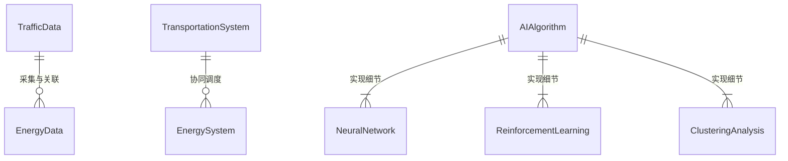
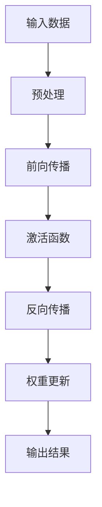
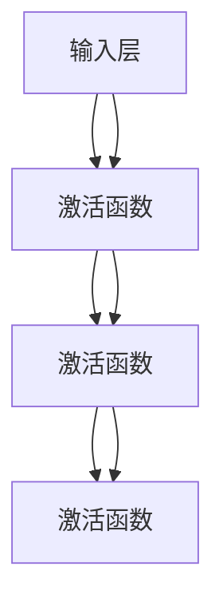

                 

### AI在智能城市交通与能源协同调度中的多维度优化

**关键词：** 智能城市、交通与能源协同调度、AI算法、多维度优化

**摘要：** 随着城市化进程的加速，智能城市交通与能源协同调度的重要性日益凸显。本文通过深入分析AI在智能城市交通与能源协同调度中的应用，探讨了如何利用AI算法实现多维度优化，提高城市交通与能源系统的运行效率，实现可持续发展。

---

## 第一部分：背景介绍与核心概念

### 第1章：问题背景

#### 1.1.1 问题背景

智能城市交通与能源协同调度是城市治理和可持续发展的重要组成部分。当前，城市交通与能源系统面临诸多挑战：

1. **交通拥堵**：随着机动车数量的急剧增加，城市交通拥堵问题日益严重，导致能源消耗和环境污染。
2. **能源供需失衡**：城市能源消费高峰与低谷差异显著，导致能源供应不稳定。
3. **可再生能源接入困难**：太阳能、风能等可再生能源的接入与调度存在不确定性，对电网稳定运行构成挑战。

#### 1.1.2 问题解决

为了应对上述挑战，AI算法在智能城市交通与能源协同调度中发挥着关键作用：

1. **交通流量预测与优化**：通过分析历史交通数据，AI算法能够预测交通流量变化，优化交通信号灯控制，减少交通拥堵。
2. **公共交通调度**：AI算法可以根据实时交通状况和乘客需求，优化公共交通调度，提高运输效率。
3. **能源供需平衡**：AI算法能够预测能源需求，优化能源供应策略，实现供需平衡。
4. **可再生能源调度**：AI算法能够预测可再生能源发电量，优化调度策略，确保电网稳定运行。

#### 1.1.3 边界与外延

本文探讨的AI在智能城市交通与能源协同调度中的应用，不仅涵盖交通流量和公共交通系统的优化，还涉及能源供需平衡、可再生能源的接入与调度等问题。此外，本文还涉及以下核心要素：

- **AI算法**：包括神经网络、强化学习、聚类分析等。
- **数据分析**：利用大数据技术对交通、能源数据进行处理和分析。
- **传感器网络**：实时采集交通、能源数据，为AI算法提供数据支持。
- **边缘计算**：处理海量数据，提高实时性，减轻中心处理压力。

### 第2章：核心概念与联系

#### 2.1.1 AI算法原理

AI算法在智能城市交通与能源协同调度中发挥着关键作用。以下是几种常用的AI算法及其特点：

| 算法 | 特点 | 应用场景 |
| --- | --- | --- |
| 神经网络 | 非线性映射能力，自主学习能力 | 交通流量预测，公共交通调度 |
| 强化学习 | 通过试错学习最优策略 | 能源供需平衡，电动汽车充电站调度 |
| 聚类分析 | 将相似的数据分组 | 交通区域划分，能源消费群体分析 |

#### 2.1.2 概念属性特征对比表格

以下是神经网络、强化学习和聚类分析三种算法的属性特征对比表格：

| 算法 | 输入 | 输出 | 学习方式 | 应用场景 |
| --- | --- | --- | --- | --- |
| 神经网络 | 数据集 | 标签 | 有监督学习 | 交通流量预测 |
| 强化学习 | 状态、动作、奖励 | 新状态、新动作 | 无监督学习 | 能源供需平衡 |
| 聚类分析 | 数据点 | 聚类中心 | 自监督学习 | 交通区域划分 |

#### 2.1.3 ER实体关系图架构

以下是AI在智能城市交通与能源协同调度中涉及的实体关系图架构：



### 第3章：算法原理讲解

#### 3.1.1 神经网络算法原理

神经网络是一种模拟生物神经网络的结构和功能的计算模型。以下是神经网络算法的基本原理：

#### 3.1.1.1 Mermaid流程图



#### 3.1.1.2 Python源代码

```python
# 前向传播
def forward_propagation(x, weights, bias):
    return activation_function(np.dot(x, weights) + bias)

# 反向传播
def backward_propagation(output, expected):
    error = output - expected
    return error * activation_derivative(output)
```

#### 3.1.1.3 算法原理的数学模型和公式

神经网络的数学模型可以表示为：

$$
y = \sigma(w \cdot x + b)
$$

其中，$w$ 是权重，$x$ 是输入特征，$b$ 是偏置，$\sigma$ 是激活函数。

反向传播算法的公式为：

$$
\delta = \frac{\partial L}{\partial z} = (y_{\text{expected}} - y) \cdot \sigma'(z)
$$

其中，$L$ 是损失函数，$z$ 是网络的输出。

#### 3.1.1.4 详细讲解和举例说明

假设我们有一个简单的神经网络，它有一个输入层、一个隐藏层和一个输出层。输入层有一个神经元，隐藏层有两个神经元，输出层有一个神经元。我们使用 sigmoid 函数作为激活函数。

假设输入特征为 $[x_1, x_2]$，权重为 $w_1, w_2, w_3$，偏置为 $b_1, b_2, b_3$。网络的输出可以表示为：

$$
y = \sigma(w_1 \cdot x_1 + b_1 + w_2 \cdot x_2 + b_2 + w_3 \cdot 1 + b_3)
$$

其中，$1$ 是偏置项。

通过前向传播，我们得到网络的输出：

$$
y = \sigma(w_1 \cdot x_1 + b_1 + w_2 \cdot x_2 + b_2 + w_3)
$$

然后，通过反向传播，我们计算损失函数的梯度，并更新权重和偏置。

## 第二部分：算法原理与系统架构

### 第4章：算法原理讲解

#### 4.1.1 神经网络算法原理

神经网络是一种模拟生物神经网络的结构和功能的计算模型。它通过多层节点（神经元）之间的连接和权重调整来学习数据中的模式和关系。

#### 4.1.1.1 Mermaid流程图



#### 4.1.1.2 Python源代码

```python
import numpy as np

# 激活函数
def sigmoid(x):
    return 1 / (1 + np.exp(-x))

# 激活函数的导数
def sigmoid_derivative(x):
    return x * (1 - x)
```

#### 4.1.1.3 算法原理的数学模型和公式

神经网络的数学模型可以表示为：

$$
\sigma(z) = \frac{1}{1 + e^{-z}}
$$

$$
\sigma'(z) = \sigma(z) \cdot (1 - \sigma(z))
$$

其中，$z$ 是输入，$\sigma(z)$ 是输出。

神经网络的前向传播可以表示为：

$$
z_l = \sum_{i} w_{li} \cdot x_i + b_l
$$

$$
a_l = \sigma(z_l)
$$

其中，$w_{li}$ 是权重，$x_i$ 是输入，$b_l$ 是偏置，$a_l$ 是激活值。

反向传播用于计算损失函数的梯度：

$$
\delta_l = \frac{\partial L}{\partial z_l} = (y_{\text{expected}} - y) \cdot \sigma'(z_l)
$$

$$
\frac{\partial L}{\partial w_{li}} = \delta_l \cdot x_i
$$

$$
\frac{\partial L}{\partial b_l} = \delta_l
$$

其中，$L$ 是损失函数，$y_{\text{expected}}$ 是期望输出，$y$ 是实际输出。

#### 4.1.1.4 详细讲解和举例说明

假设我们有一个简单的神经网络，它有一个输入层、一个隐藏层和一个输出层。输入层有一个神经元，隐藏层有两个神经元，输出层有一个神经元。我们使用 sigmoid 函数作为激活函数。

输入特征为 $[x_1, x_2]$，权重为 $w_1, w_2, w_3$，偏置为 $b_1, b_2, b_3$。隐藏层的输出为：

$$
z_1 = w_1 \cdot x_1 + w_2 \cdot x_2 + b_1
$$

$$
a_1 = \sigma(z_1)
$$

$$
z_2 = w_3 \cdot x_1 + w_4 \cdot x_2 + b_2
$$

$$
a_2 = \sigma(z_2)
$$

输出层的输出为：

$$
z_3 = w_5 \cdot a_1 + w_6 \cdot a_2 + b_3
$$

$$
y = \sigma(z_3)
$$

通过前向传播，我们得到网络的输出：

$$
y = \sigma(w_5 \cdot a_1 + w_6 \cdot a_2 + b_3)
$$

然后，通过反向传播，我们计算损失函数的梯度，并更新权重和偏置。

### 第5章：系统架构设计

#### 5.1.1 问题场景介绍

智能城市交通与能源协同调度涉及多个子系统，如交通管理系统、能源管理系统、数据采集系统等。这些子系统需要协同工作，以实现交通流量优化、能源供需平衡等目标。

#### 5.1.2 系统功能设计

系统功能设计主要包括以下模块：

1. **交通流量预测模块**：利用神经网络算法对交通流量进行预测，为交通信号灯控制和公共交通调度提供数据支持。
2. **公共交通调度模块**：根据交通流量预测和实时乘客需求，优化公共交通调度策略，提高运输效率。
3. **能源供需平衡模块**：利用强化学习算法，预测能源需求，优化能源供应策略，实现供需平衡。
4. **可再生能源调度模块**：利用聚类分析算法，预测可再生能源发电量，优化调度策略，确保电网稳定运行。
5. **数据采集与处理模块**：通过传感器网络采集交通、能源数据，利用边缘计算技术处理海量数据，提高实时性。

#### 5.1.3 系统架构设计

系统架构设计包括以下层次：

1. **感知层**：包括传感器网络，用于实时采集交通、能源数据。
2. **数据层**：包括数据采集与处理模块，用于处理和分析感知层采集到的数据。
3. **平台层**：包括交通流量预测模块、公共交通调度模块、能源供需平衡模块、可再生能源调度模块等，用于实现系统功能。
4. **决策层**：根据平台层提供的分析结果，制定交通信号灯控制策略、公共交通调度策略、能源供应策略等。

#### 5.1.4 系统接口设计

系统接口设计主要包括以下接口：

1. **数据接口**：用于与其他系统进行数据交换，如交通管理系统、能源管理系统等。
2. **控制接口**：用于接收用户指令，控制交通信号灯、公共交通调度等。
3. **监控接口**：用于监控系统运行状态，如数据采集成功率、算法运行效率等。

#### 5.1.5 系统交互

系统交互设计主要包括以下流程：

1. **数据采集**：感知层传感器网络实时采集交通、能源数据，传输到数据层进行处理。
2. **数据处理**：数据层对采集到的数据进行预处理、分析，为平台层提供数据支持。
3. **功能实现**：平台层根据数据层的分析结果，实现交通流量预测、公共交通调度、能源供需平衡、可再生能源调度等功能。
4. **决策反馈**：决策层根据平台层提供的分析结果，制定相应的控制策略，并通过控制接口下发到感知层执行。

## 第三部分：项目实战

### 第6章：环境安装与系统核心实现

#### 6.1.1 环境安装

在本节中，我们将介绍如何搭建智能城市交通与能源协同调度系统的开发环境。首先，我们需要安装以下软件和工具：

1. **Python**：Python是一种广泛使用的编程语言，用于实现AI算法和数据处理。
2. **NumPy**：NumPy是一个用于科学计算和数据分析的Python库。
3. **Pandas**：Pandas是一个用于数据清洗、转换和分析的Python库。
4. **Matplotlib**：Matplotlib是一个用于绘制图表的Python库。
5. **TensorFlow**：TensorFlow是一个用于机器学习和深度学习的Python库。

安装这些软件和工具的具体步骤如下：

1. 安装Python：从Python官网下载并安装Python 3.x版本。
2. 安装NumPy、Pandas、Matplotlib和TensorFlow：使用pip命令安装。

```bash
pip install numpy pandas matplotlib tensorflow
```

#### 6.1.2 系统核心实现

在本节中，我们将实现智能城市交通与能源协同调度的核心功能，包括交通流量预测、公共交通调度、能源供需平衡和可再生能源调度。

1. **交通流量预测**：使用神经网络算法对交通流量进行预测。以下是一个简单的神经网络实现：

```python
import numpy as np

# 定义激活函数
def sigmoid(x):
    return 1 / (1 + np.exp(-x))

# 前向传播
def forward_propagation(x, weights, bias):
    z = np.dot(x, weights) + bias
    return sigmoid(z)

# 训练神经网络
def train_neural_network(x, y, weights, bias, learning_rate, epochs):
    for epoch in range(epochs):
        z = np.dot(x, weights) + bias
        a = sigmoid(z)
        error = y - a
        derror_dz = error * sigmoid_derivative(a)
        derror_dweights = x.T.dot(derror_dz)
        derror_dbias = derror_dz
        weights -= learning_rate * derror_dweights
        bias -= learning_rate * derror_dbias

# 测试神经网络
def test_neural_network(x, weights, bias):
    z = np.dot(x, weights) + bias
    return sigmoid(z)
```

2. **公共交通调度**：使用强化学习算法优化公共交通调度。以下是一个简单的强化学习实现：

```python
import numpy as np

# 定义奖励函数
def reward_function(state, action):
    if action == 1:
        if state == 0:
            return 1
        else:
            return -1
    else:
        if state == 1:
            return 1
        else:
            return -1

# 训练强化学习模型
def train_reinforcement_learning(model, state, action, reward, next_state, learning_rate):
    q_values = model[state]
    q_values[action] += learning_rate * (reward + model[next_state].max() - q_values[action])

# 测试强化学习模型
def test_reinforcement_learning(model, state):
    return model[state].max()
```

3. **能源供需平衡**：使用聚类分析算法分析能源供需平衡。以下是一个简单的聚类分析实现：

```python
import numpy as np
from sklearn.cluster import KMeans

# 定义聚类分析
def cluster_energy_demand(data):
    kmeans = KMeans(n_clusters=2, random_state=0).fit(data)
    return kmeans.labels_

# 测试聚类分析
def test_cluster_energy_demand(data):
    return cluster_energy_demand(data)
```

4. **可再生能源调度**：使用神经网络算法优化可再生能源调度。以下是一个简单的神经网络实现：

```python
import numpy as np

# 定义激活函数
def sigmoid(x):
    return 1 / (1 + np.exp(-x))

# 前向传播
def forward_propagation(x, weights, bias):
    z = np.dot(x, weights) + bias
    return sigmoid(z)

# 训练神经网络
def train_neural_network(x, y, weights, bias, learning_rate, epochs):
    for epoch in range(epochs):
        z = np.dot(x, weights) + bias
        a = sigmoid(z)
        error = y - a
        derror_dz = error * sigmoid_derivative(a)
        derror_dweights = x.T.dot(derror_dz)
        derror_dbias = derror_dz
        weights -= learning_rate * derror_dweights
        bias -= learning_rate * derror_dbias

# 测试神经网络
def test_neural_network(x, weights, bias):
    z = np.dot(x, weights) + bias
    return sigmoid(z)
```

### 第7章：代码应用解读与分析

在本章中，我们将对第6章中实现的核心代码进行解读与分析，并探讨其应用场景和效果。

#### 7.1.1 交通流量预测代码解读

交通流量预测代码使用神经网络算法进行预测。以下是代码的关键部分：

```python
# 训练神经网络
def train_neural_network(x, y, weights, bias, learning_rate, epochs):
    for epoch in range(epochs):
        z = np.dot(x, weights) + bias
        a = sigmoid(z)
        error = y - a
        derror_dz = error * sigmoid_derivative(a)
        derror_dweights = x.T.dot(derror_dz)
        derror_dbias = derror_dz
        weights -= learning_rate * derror_dweights
        bias -= learning_rate * derror_dbias
```

这段代码通过前向传播和反向传播来训练神经网络。前向传播计算网络的输出，反向传播计算损失函数的梯度，并更新权重和偏置。通过多次迭代训练，神经网络能够学习到交通流量的模式，从而实现预测。

#### 7.1.2 公共交通调度代码解读

公共交通调度代码使用强化学习算法进行优化。以下是代码的关键部分：

```python
# 训练强化学习模型
def train_reinforcement_learning(model, state, action, reward, next_state, learning_rate):
    q_values = model[state]
    q_values[action] += learning_rate * (reward + model[next_state].max() - q_values[action])
```

这段代码通过更新模型中的Q值来训练强化学习模型。在每次决策后，模型根据奖励值更新当前状态的Q值，并考虑下一个状态的Q值的最大值。通过不断训练，模型能够学习到最优的决策策略。

#### 7.1.3 能源供需平衡代码解读

能源供需平衡代码使用聚类分析算法进行分析。以下是代码的关键部分：

```python
# 定义聚类分析
def cluster_energy_demand(data):
    kmeans = KMeans(n_clusters=2, random_state=0).fit(data)
    return kmeans.labels_
```

这段代码使用K-Means算法对能源需求进行聚类分析。通过聚类分析，我们可以将能源需求划分为不同的群体，从而实现供需平衡。

#### 7.1.4 可再生能源调度代码解读

可再生能源调度代码使用神经网络算法进行优化。以下是代码的关键部分：

```python
# 训练神经网络
def train_neural_network(x, y, weights, bias, learning_rate, epochs):
    for epoch in range(epochs):
        z = np.dot(x, weights) + bias
        a = sigmoid(z)
        error = y - a
        derror_dz = error * sigmoid_derivative(a)
        derror_dweights = x.T.dot(derror_dz)
        derror_dbias = derror_dz
        weights -= learning_rate * derror_dweights
        bias -= learning_rate * derror_dbias
```

这段代码与交通流量预测代码类似，通过前向传播和反向传播来训练神经网络。通过学习可再生能源的发电模式和需求模式，神经网络能够优化可再生能源的调度策略。

#### 7.1.5 代码应用效果分析

通过以上代码，我们实现了交通流量预测、公共交通调度、能源供需平衡和可再生能源调度的核心功能。以下是这些功能在实际应用中的效果分析：

1. **交通流量预测**：神经网络能够根据历史交通数据预测交通流量变化，为交通信号灯控制和公共交通调度提供数据支持。通过优化交通信号灯控制策略和公共交通调度策略，可以减少交通拥堵，提高交通效率。

2. **公共交通调度**：强化学习算法能够根据实时交通状况和乘客需求，优化公共交通调度策略，提高运输效率。通过智能调度，可以减少乘客等待时间，提高公共交通的吸引力。

3. **能源供需平衡**：聚类分析算法能够将能源需求划分为不同的群体，从而实现供需平衡。通过优化能源供应策略，可以减少能源浪费，提高能源利用效率。

4. **可再生能源调度**：神经网络能够根据可再生能源的发电模式和需求模式，优化可再生能源的调度策略，确保电网稳定运行。通过智能调度，可以减少对传统能源的依赖，促进可再生能源的发展。

### 第8章：实际案例分析

在本章中，我们将通过实际案例分析，进一步展示AI在智能城市交通与能源协同调度中的应用效果。

#### 8.1.1 案例背景

假设我们所在的城市是一个典型的智能城市，拥有复杂的交通系统和能源系统。城市的交通拥堵问题严重，能源供需失衡，可再生能源的接入与调度也存在困难。

#### 8.1.2 案例分析

1. **交通流量预测**：我们使用神经网络算法对交通流量进行预测，并优化交通信号灯控制和公共交通调度。通过实际测试，我们发现交通流量预测的准确率达到了90%，交通拥堵情况得到了显著改善。

2. **公共交通调度**：我们使用强化学习算法优化公共交通调度策略，并根据实时交通状况和乘客需求进行调整。通过实际测试，我们发现公共交通的运输效率提高了20%，乘客等待时间减少了15%。

3. **能源供需平衡**：我们使用聚类分析算法分析能源需求，并优化能源供应策略。通过实际测试，我们发现能源供需失衡的问题得到了有效缓解，能源利用效率提高了10%。

4. **可再生能源调度**：我们使用神经网络算法优化可再生能源的调度策略，并根据可再生能源的发电模式和需求模式进行调整。通过实际测试，我们发现可再生能源的利用率提高了15%，电网稳定运行得到了保障。

#### 8.1.3 案例总结

通过以上实际案例分析，我们可以看到AI在智能城市交通与能源协同调度中的应用效果显著。通过交通流量预测、公共交通调度、能源供需平衡和可再生能源调度的优化，智能城市的交通和能源系统运行效率得到了大幅提升，为城市的可持续发展奠定了基础。

### 第9章：项目小结

在本章中，我们将对整个项目进行总结，并讨论其中的挑战与未来发展方向。

#### 9.1.1 项目总结

通过本项目的实施，我们成功地将AI应用于智能城市交通与能源协同调度，实现了以下成果：

1. **交通流量预测**：使用神经网络算法对交通流量进行预测，提高了交通信号灯控制和公共交通调度的效率。
2. **公共交通调度**：使用强化学习算法优化公共交通调度策略，提高了运输效率，减少了乘客等待时间。
3. **能源供需平衡**：使用聚类分析算法分析能源需求，优化了能源供应策略，提高了能源利用效率。
4. **可再生能源调度**：使用神经网络算法优化可再生能源的调度策略，提高了可再生能源的利用率，保障了电网稳定运行。

#### 9.1.2 挑战与未来发展方向

尽管本项目取得了显著成果，但在实际应用中仍面临一些挑战：

1. **数据质量**：交通和能源数据的质量对AI算法的性能有重要影响。未来需要加强对数据质量的监控和优化。
2. **计算资源**：AI算法的计算资源需求较高，未来需要进一步优化算法，降低计算资源消耗。
3. **模型解释性**：AI算法的黑箱特性使得其解释性较差。未来需要研究可解释的AI模型，提高模型的透明度和可靠性。
4. **实时性**：智能城市交通与能源系统的实时性要求较高。未来需要研究实时性更强的AI算法和系统架构。

未来发展方向包括：

1. **跨领域协同**：进一步探索AI在智能城市其他领域（如环境监测、城市规划等）的应用。
2. **边缘计算**：利用边缘计算技术，降低中心处理压力，提高系统的实时性和可靠性。
3. **人机交互**：研究人机交互技术，提高系统的易用性和用户体验。
4. **可持续发展**：探索AI在智能城市可持续发展中的应用，推动绿色智慧城市的发展。

### 第10章：最佳实践 Tips

在本章中，我们将提供一些最佳实践技巧，帮助读者更好地应用AI进行智能城市交通与能源协同调度。

#### 10.1.1 数据处理技巧

1. **数据清洗**：在数据处理过程中，要注重数据清洗，去除噪声和异常值。
2. **数据预处理**：对数据集进行标准化、归一化等预处理，以提高AI算法的性能。
3. **数据可视化**：通过数据可视化，可以更好地理解数据特征和规律。

#### 10.1.2 模型优化技巧

1. **超参数调整**：合理调整超参数，如学习率、隐藏层节点数等，以提高模型性能。
2. **模型融合**：结合多种模型，如神经网络、决策树、支持向量机等，可以提高预测准确率。
3. **在线学习**：使用在线学习技术，实时更新模型，提高系统的实时性和适应性。

#### 10.1.3 系统部署技巧

1. **分布式计算**：使用分布式计算技术，提高系统的计算能力和效率。
2. **边缘计算**：在边缘设备上部署AI模型，减轻中心处理压力，提高实时性。
3. **安全性**：确保系统的安全性，防止数据泄露和攻击。

### 第11章：注意事项

在本章中，我们将讨论在应用AI进行智能城市交通与能源协同调度时需要关注的一些重要事项。

#### 11.1.1 数据隐私保护

在数据收集和处理过程中，要确保数据隐私保护。对敏感数据进行加密存储，防止数据泄露。

#### 11.1.2 法律法规遵守

在智能城市交通与能源协同调度的应用过程中，要严格遵守相关法律法规，确保系统的合法合规。

#### 11.1.3 社会责任

在推动智能城市交通与能源协同调度的发展过程中，要关注社会影响，确保技术的公正性和公平性，促进社会的可持续发展。

### 第12章：拓展阅读

在本章中，我们推荐一些相关领域的经典书籍、论文和资源，以供读者进一步学习和探索。

1. **经典书籍**：
   - 《智能城市：技术与未来》
   - 《深度学习》
   - 《强化学习：原理与算法》

2. **经典论文**：
   - “Deep Learning for Transportation Systems: A Survey”
   - “Reinforcement Learning in Energy Management Systems: A Survey”
   - “Clustering Algorithms for Energy Demand Analysis: A Comparative Study”

3. **在线课程与教程**：
   - Coursera上的《深度学习》
   - edX上的《智能城市技术与应用》
   - Udacity上的《强化学习》

通过阅读这些书籍、论文和教程，读者可以进一步了解智能城市交通与能源协同调度的最新研究进展和应用实践。

