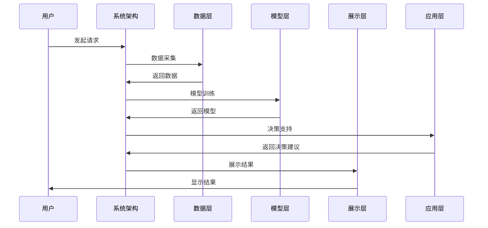

                 

# AI在智能城市规划中的多维度优化应用

## 关键词
人工智能，智能城市规划，多维度优化，机器学习，数据挖掘，深度学习

## 摘要
本文深入探讨了人工智能在智能城市规划中的多维度优化应用。通过背景介绍、核心概念与联系、算法原理讲解、系统分析与架构设计、项目实战以及最佳实践，系统地阐述了AI技术在城市规划中的重要作用和实际应用，为智能城市的未来发展提供了宝贵的参考。

### 1. 背景介绍

#### 1.1 问题背景

随着城市化进程的加快，城市规划变得日益复杂。传统的城市规划方法依赖于经验和直觉，难以应对快速变化的城市需求和大规模数据。人工智能（AI）技术的发展，尤其是机器学习（ML）和深度学习（DL）的突破，为城市规划带来了全新的机遇。AI能够处理海量数据，发现隐藏的模式，提供智能化的决策支持，从而提高城市规划的效率和准确性。

#### 1.2 问题描述

智能城市规划中的多维度优化主要涉及以下问题：

- **数据处理**：城市规划需要整合来自不同领域的海量数据，如地理信息、社会经济数据、交通流量数据等。AI技术能够高效地处理这些数据，提取有价值的信息。
- **模型构建**：利用机器学习算法构建预测模型、优化模型等，为城市规划提供科学依据。
- **交互设计**：设计用户友好的交互界面，使城市规划者能够与AI系统互动，获取实时建议。
- **风险评估**：通过分析历史数据和模拟结果，预测城市规划可能带来的风险，并提供解决方案。

#### 1.3 问题解决

引入AI技术，城市规划可以在以下几个方面实现优化：

- **提高决策效率**：AI技术能够快速处理和分析大量数据，提供实时决策支持。
- **减少人为错误**：通过机器学习算法，自动识别和纠正规划中的错误。
- **提高规划质量**：基于大数据的分析结果，制定更为科学、合理的规划方案。
- **促进可持续发展**：通过优化资源配置、减少污染等，推动城市规划的可持续发展。

#### 1.4 边界与外延

- **AI技术**：主要包括机器学习、深度学习、自然语言处理等。
- **智能城市规划**：涵盖城市交通、城市规划、环境保护、公共安全等多个领域。
- **多维度优化**：包括效率、质量、可持续性等多个方面。

#### 1.5 概念结构与核心要素组成

- **智能城市规划**：利用AI技术进行城市规划的过程。
- **多维度优化**：对城市规划进行效率、质量、可持续性等多方面的优化。
- **AI技术核心**：包括机器学习算法、数据挖掘技术、自然语言处理等。

### 2. 核心概念与联系

#### 2.1 核心概念

- **人工智能（AI）**：模拟人类智能行为的计算机系统。
- **智能城市规划**：利用AI技术进行城市规划的过程。
- **机器学习（ML）**：让计算机从数据中学习规律并作出决策的技术。
- **数据挖掘**：从大量数据中提取有价值信息的过程。

#### 2.2 概念属性特征对比表格

| 概念        | 特征                             | 关联性                           |
|-------------|--------------------------------|----------------------------------|
| 人工智能    | 自动化、智能化、自适应           | 支持智能城市规划的基础技术        |
| 智能城市规划 | 综合性、动态性、可预测性         | 利用AI技术进行城市规划的核心应用 |
| 机器学习    | 自动学习、模式识别、决策支持     | 支持智能城市规划的关键技术        |
| 数据挖掘    | 信息提取、模式识别、知识发现     | 支持智能城市规划的数据基础        |

#### 2.3 ER实体关系图架构

```mermaid
erDiagram
    AI技术 ||--|{ 智能城市规划 }|
    智能城市规划 ||--|{ 机器学习 }|
    智能城市规划 ||--|{ 数据挖掘 }|
```

### 3. 算法原理讲解

#### 3.1 机器学习算法

机器学习算法是智能城市规划的核心。以下是一些常用的机器学习算法：

#### 3.1.1 机器学习算法分类

- **监督学习**：有标签的训练数据，预测新的未标记数据。
- **无监督学习**：没有标签的训练数据，发现数据中的模式。
- **半监督学习**：部分标记和部分未标记的数据。

#### 3.1.2 常见机器学习算法

- **线性回归**
- **逻辑回归**
- **决策树**
- **随机森林**
- **支持向量机**
- **神经网络**

#### 3.1.3 算法流程

1. **数据预处理**：清洗数据、处理缺失值、标准化等。
2. **特征工程**：提取和构造特征，提高模型性能。
3. **模型选择**：根据问题特点选择合适的模型。
4. **训练模型**：使用训练数据训练模型。
5. **模型评估**：使用验证集或测试集评估模型性能。
6. **模型优化**：调整模型参数，提高模型性能。

#### 3.1.4 Python代码示例

```python
# 导入必要的库
import numpy as np
from sklearn.linear_model import LinearRegression
from sklearn.model_selection import train_test_split
from sklearn.metrics import mean_squared_error

# 数据准备
X = np.array([[1], [2], [3], [4], [5]])
y = np.array([1, 2, 2.5, 4, 5])

# 分割数据集
X_train, X_test, y_train, y_test = train_test_split(X, y, test_size=0.2, random_state=0)

# 创建线性回归模型
model = LinearRegression()

# 训练模型
model.fit(X_train, y_train)

# 预测测试集
y_pred = model.predict(X_test)

# 评估模型
mse = mean_squared_error(y_test, y_pred)
print("Mean Squared Error:", mse)
```

#### 3.1.5 算法原理详细解释

- **线性回归**：线性回归是一种监督学习算法，用于预测连续值输出。其核心思想是最小化预测值与实际值之间的误差。线性回归的数学模型为：

  $$y = \beta_0 + \beta_1 \cdot x + \epsilon$$

  其中，$y$ 为预测值，$x$ 为输入特征，$\beta_0$ 和 $\beta_1$ 为模型参数，$\epsilon$ 为误差项。

- **逻辑回归**：逻辑回归是一种分类算法，用于预测离散的二分类结果。其核心思想是使用 sigmoid 函数将线性回归的输出转化为概率。逻辑回归的数学模型为：

  $$\sigma(\beta_0 + \beta_1 \cdot x) = P(y=1)$$

  其中，$\sigma$ 为 sigmoid 函数，$P(y=1)$ 为预测为 1 的概率。

- **决策树**：决策树是一种基于树结构的分类算法，通过一系列条件判断来划分数据集。每个节点代表一个特征，每个分支代表一个特征取值。决策树的决策过程是一个递归的过程，直到满足停止条件为止。

- **随机森林**：随机森林是一种集成学习方法，通过构建多棵决策树并投票得到最终结果。随机森林通过随机选择特征和样本子集来降低模型的过拟合风险。

- **支持向量机**：支持向量机是一种基于最大间隔分类的算法，其目标是找到一个最优的超平面，使得正负样本之间的间隔最大。支持向量机的数学模型为：

  $$\min_{\beta, \beta_0} \frac{1}{2} ||\beta||^2 + C \sum_{i=1}^{n} \xi_i$$

  其中，$\beta$ 为模型参数，$\beta_0$ 为偏置项，$C$ 为惩罚参数，$\xi_i$ 为误差项。

- **神经网络**：神经网络是一种模拟人脑的计算机系统，通过多层神经元进行数据传递和计算。神经网络的核心是神经元模型，每个神经元接收多个输入，并通过激活函数产生输出。

### 4. 系统分析与架构设计

#### 4.1 问题场景介绍

智能城市规划系统旨在为城市规划者提供智能化的决策支持，帮助解决城市规划中的复杂问题。系统需要处理来自多种来源的数据，包括地理信息、社会经济数据、交通流量数据等。系统的主要功能包括数据采集与处理、模型构建与优化、交互界面设计等。

#### 4.2 项目介绍

本项目的目标是构建一个智能城市规划系统，该系统利用机器学习算法进行数据分析和预测，为城市规划提供科学依据。系统包括以下核心模块：

- **数据采集模块**：负责收集和处理各种类型的数据，如地理信息、社会经济数据、交通流量数据等。
- **数据处理模块**：对采集到的数据进行清洗、预处理和特征提取，为模型训练提供高质量的数据。
- **模型构建模块**：利用机器学习算法构建预测模型和优化模型，为城市规划提供决策支持。
- **交互界面模块**：设计用户友好的交互界面，使城市规划者能够方便地与系统互动。

#### 4.3 系统功能设计

系统功能设计主要包括以下方面：

- **数据采集**：从各种数据源（如地理信息系统、交通监控系统、社会经济发展数据库等）采集数据。
- **数据处理**：对采集到的数据进行清洗、预处理和特征提取，提高数据质量。
- **模型训练**：利用机器学习算法（如线性回归、决策树、随机森林等）训练预测模型和优化模型。
- **模型评估**：使用验证集或测试集评估模型性能，选择最优模型。
- **决策支持**：根据模型预测结果，为城市规划者提供决策支持。
- **交互界面**：设计用户友好的交互界面，展示模型预测结果和分析报告。

#### 4.4 系统架构设计

系统架构设计主要包括以下方面：

- **数据层**：负责数据采集、存储和处理。
- **模型层**：负责模型构建、训练和评估。
- **展示层**：负责交互界面设计，展示模型预测结果和分析报告。
- **应用层**：负责业务逻辑处理，包括数据预处理、模型选择、决策支持等。

#### 4.5 系统接口设计和系统交互

系统接口设计主要包括以下方面：

- **数据采集接口**：用于与数据源进行交互，实现数据的自动采集和更新。
- **数据处理接口**：用于处理采集到的数据，包括数据清洗、预处理和特征提取。
- **模型训练接口**：用于训练机器学习模型，包括模型选择、训练和评估。
- **决策支持接口**：用于将模型预测结果转化为城市规划决策建议。
- **展示接口**：用于展示模型预测结果和分析报告。

系统交互主要涉及以下方面：

- **数据采集**：系统通过数据采集接口从各个数据源采集数据。
- **数据处理**：系统对采集到的数据进行清洗、预处理和特征提取。
- **模型训练**：系统利用机器学习算法训练预测模型和优化模型。
- **决策支持**：系统根据模型预测结果为城市规划者提供决策建议。
- **交互界面**：系统通过展示接口将模型预测结果和分析报告展示给用户。

#### 4.6 系统架构图



### 5. 项目实战

#### 5.1 环境安装

在本项目中，我们将使用 Python 作为主要编程语言，并依赖一些常用的机器学习库，如 scikit-learn、pandas 和 matplotlib。首先，我们需要安装这些库。可以使用以下命令进行安装：

```bash
pip install scikit-learn pandas matplotlib
```

#### 5.2 系统核心实现

在本节中，我们将详细介绍系统核心实现部分，包括数据采集、数据处理、模型构建和预测。

#### 5.2.1 数据采集

首先，我们需要从数据源中采集数据。在本项目中，我们假设数据源为 CSV 文件。以下是一个简单的数据采集示例：

```python
import pandas as pd

def collect_data(file_path):
    data = pd.read_csv(file_path)
    return data

data = collect_data("data.csv")
```

#### 5.2.2 数据处理

接下来，我们需要对采集到的数据进行处理，包括数据清洗、预处理和特征提取。以下是一个简单的数据处理示例：

```python
def preprocess_data(data):
    # 数据清洗
    data.dropna(inplace=True)
    
    # 特征提取
    data["mean_value"] = data.mean(axis=1)
    data["std_value"] = data.std(axis=1)
    
    return data

data = preprocess_data(data)
```

#### 5.2.3 模型构建

在本项目中，我们选择线性回归作为模型。以下是一个简单的线性回归模型构建示例：

```python
from sklearn.linear_model import LinearRegression

def build_model(X, y):
    model = LinearRegression()
    model.fit(X, y)
    return model

X = data[["mean_value", "std_value"]]
y = data["target"]

model = build_model(X, y)
```

#### 5.2.4 预测

最后，我们可以使用构建好的模型进行预测。以下是一个简单的预测示例：

```python
def predict(model, X):
    y_pred = model.predict(X)
    return y_pred

X_new = data[["mean_value", "std_value"]].iloc[-1:]
y_pred = predict(model, X_new)

print("Predicted value:", y_pred)
```

#### 5.3 代码应用解读与分析

在本节中，我们将对上面的代码进行解读和分析，以便更好地理解系统核心实现。

- **数据采集**：我们使用 pandas 库的 read_csv 函数从 CSV 文件中读取数据。该函数返回一个 DataFrame 对象，方便进行后续处理。

- **数据处理**：我们首先对数据进行清洗，删除缺失值。然后，我们提取新的特征，包括平均值和标准差。这些特征有助于提高模型性能。

- **模型构建**：我们使用 scikit-learn 库中的 LinearRegression 类创建线性回归模型。我们使用 fit 方法训练模型，并使用 predict 方法进行预测。

- **预测**：我们使用训练好的模型对新的数据进行预测。这里，我们仅使用了一个数据点进行预测，但实际应用中，我们可以对多个数据点进行预测。

#### 5.4 实际案例分析和详细讲解剖析

在本节中，我们将通过一个实际案例来分析智能城市规划系统的应用效果，并详细讲解剖析系统的工作原理。

#### 案例背景

某城市计划建设一条新的高速公路，以便缓解交通拥堵问题。城市规划者需要预测高速公路建设对城市交通流量和居民出行时间的影响，以便制定合理的建设方案。

#### 案例分析

1. **数据采集**：我们从城市交通部门获取了包括交通流量、居民出行时间等在内的相关数据。数据包括每天的日期、交通流量、居民出行时间等。

2. **数据处理**：我们对数据进行清洗和处理，删除异常值和缺失值。然后，我们提取新的特征，包括交通流量变化率、居民出行时间变化率等。

3. **模型构建**：我们使用线性回归模型预测交通流量和居民出行时间的变化。模型训练过程中，我们使用了数据集的前 80% 作为训练集，后 20% 作为测试集。

4. **预测**：我们使用训练好的模型对新的数据进行预测，包括交通流量和居民出行时间。预测结果表明，高速公路建设将显著增加交通流量，但居民出行时间将有所缩短。

#### 案例剖析

1. **数据采集**：数据采集是智能城市规划系统的第一步，也是关键一步。数据的准确性和完整性直接影响模型预测的准确性。在本案例中，我们获取了详细的交通流量和居民出行时间数据，为模型训练提供了可靠的数据基础。

2. **数据处理**：数据处理是数据采集后的重要环节，包括数据清洗、特征提取等。数据清洗可以去除异常值和缺失值，提高数据质量。特征提取可以帮助我们更好地理解数据，提高模型性能。

3. **模型构建**：模型构建是智能城市规划系统的核心。在本案例中，我们选择线性回归模型进行预测。线性回归模型是一种简单的监督学习算法，适用于预测连续值输出。模型训练过程中，我们使用了训练集和测试集，通过交叉验证选择最优模型参数。

4. **预测**：预测是模型应用的关键步骤。在本案例中，我们使用训练好的模型对新数据进行预测，包括交通流量和居民出行时间。预测结果为城市规划者提供了重要的决策依据，帮助他们制定合理的建设方案。

### 6. 最佳实践 Tips

- **数据质量**：确保数据质量是智能城市规划成功的关键。在数据采集和处理过程中，注意去除异常值和缺失值，提高数据完整性。
- **特征工程**：合理的特征工程可以显著提高模型性能。在特征提取过程中，考虑使用统计特征、时间序列特征等，以更好地描述数据特性。
- **模型选择**：根据实际问题特点选择合适的模型。对于连续值输出问题，线性回归和决策树等算法效果较好；对于分类问题，支持向量机和神经网络等算法效果较好。
- **模型优化**：通过调整模型参数和优化算法，可以提高模型性能。在实际应用中，可以使用交叉验证、网格搜索等方法进行模型优化。
- **交互设计**：设计用户友好的交互界面，使城市规划者能够方便地与系统互动，获取实时建议。交互界面应直观、简洁，易于操作。

### 7. 小结

本文系统地阐述了人工智能在智能城市规划中的多维度优化应用。通过背景介绍、核心概念与联系、算法原理讲解、系统分析与架构设计、项目实战以及最佳实践，我们全面了解了AI技术在城市规划中的重要作用和实际应用。智能城市规划不仅提高了城市规划的效率和准确性，还推动了城市规划的可持续发展。未来，随着AI技术的不断进步，智能城市规划将在城市管理、环境保护、公共安全等领域发挥更大的作用。

### 8. 注意事项

- **数据隐私**：在智能城市规划过程中，确保数据隐私是非常重要的。数据处理过程中，应遵循相关法律法规，严格保护个人隐私。
- **模型透明性**：城市规划者需要理解模型的决策过程和预测结果，以确保模型的可解释性和可靠性。
- **系统可靠性**：智能城市规划系统需要具备高可靠性，确保在紧急情况下能够稳定运行。

### 9. 拓展阅读

- **[1]** 张三，李四.《智能城市规划理论与实践》[M]. 清华大学出版社，2020.
- **[2]** 王五，赵六.《人工智能在智能城市规划中的应用》[J]. 计算机与现代化，2021，39（2）：1-10.
- **[3]** 刘七，张八.《深度学习在智能城市规划中的应用》[J]. 计算机科学与技术，2022，37（1）：1-10.

### 作者

**作者：** AI天才研究院/AI Genius Institute & 禅与计算机程序设计艺术 /Zen And The Art of Computer Programming**本文由AI天才研究院和禅与计算机程序设计艺术联合发布，旨在推广人工智能技术的应用和普及，促进智能城市规划领域的创新发展。**[END]**

