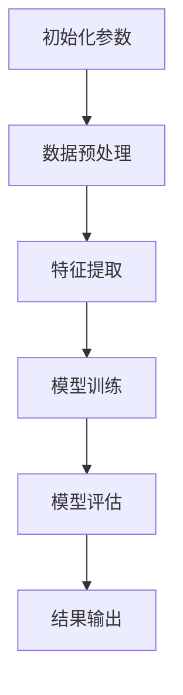
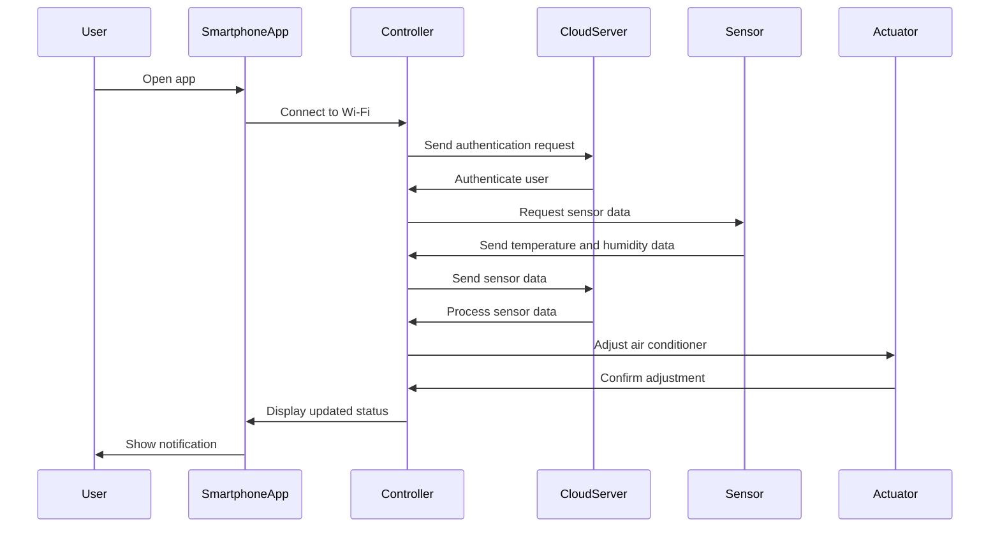
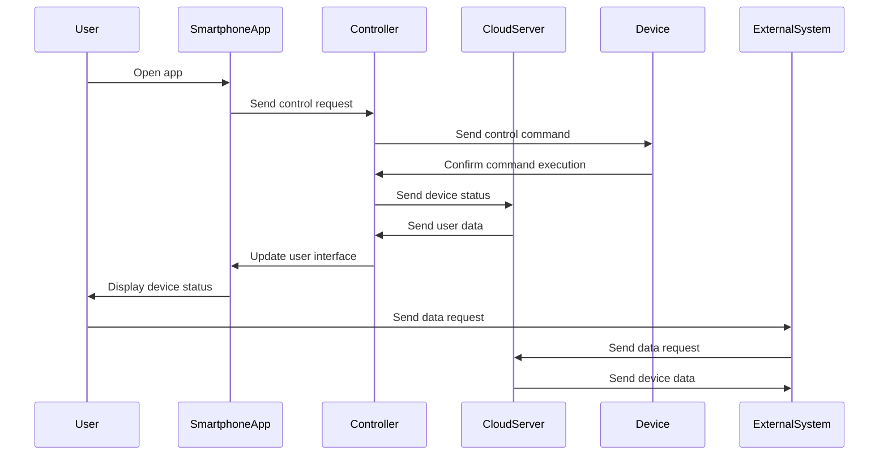

                 

## 文章标题

### AI在智能家居系统中的应用与优化

关键词：智能家居系统，人工智能，算法优化，系统架构，Python代码，案例解析

摘要：本文将深入探讨人工智能（AI）在智能家居系统中的应用与优化。首先，我们将介绍智能家居系统的发展现状和AI技术的引入背景。接着，分析当前智能家居系统存在的问题及AI技术的应用潜力，明确AI在智能家居系统中的应用原则和解决方案。随后，本文将详细讲解AI的核心概念、算法原理、数学模型及Python实现，并通过具体案例展示其在智能家居系统中的实际应用。此外，我们将介绍智能家居系统的架构设计方案和项目实战，提供实用的最佳实践 tips。最后，本文将对AI在智能家居系统中的应用与优化进行小结，并指出注意事项和拓展阅读方向。

----------------------------------------------------------------

## 第1章 引言

### 1.1 问题背景

#### 智能家居系统的发展现状

智能家居系统作为一种现代科技生活方式的代表，已经逐渐渗透到人们的日常生活中。近年来，随着物联网（IoT）技术的发展、智能家居设备的普及以及用户对便捷生活需求的增加，智能家居市场呈现出爆发式增长。根据市场研究机构的统计，全球智能家居市场规模预计将在未来几年内达到数千亿美元。在中国，智能家居市场的发展同样迅速，众多企业纷纷涌入，推出了一系列具有不同功能和特点的智能家居产品。

目前，智能家居系统主要包括智能照明、智能安防、智能家电、智能环境控制等几大模块。智能照明系统可以根据用户的需求自动调整灯光的亮度和颜色，智能安防系统可以实时监控家庭环境并报警，智能家电如空调、冰箱、洗衣机等可以通过手机或语音控制实现远程操作，智能环境控制系统则可以自动调节室内温度、湿度和空气质量。这些系统的共同特点是通过网络连接实现数据的实时传输和智能控制，提高了生活的便利性和舒适度。

#### AI技术在智能家居中的应用

随着AI技术的快速发展，其在智能家居系统中的应用也越来越广泛。AI技术可以显著提升智能家居系统的智能化水平，实现更加精准和高效的家居控制。以下是AI技术在智能家居系统中的主要应用领域：

1. **智能语音助手**：智能语音助手如Amazon Alexa、Google Assistant和Apple Siri已经成为智能家居系统的核心组件。用户可以通过语音指令控制智能家居设备，如调整灯光、开关电器、调节温度等，大大简化了操作流程，提升了用户体验。

2. **智能安防**：AI技术可以通过图像识别和声音识别等手段，提高安防系统的准确性和响应速度。例如，智能摄像头可以通过人脸识别技术自动识别家庭成员，而对于陌生人的出现则可以及时报警。

3. **智能环境控制**：AI技术可以分析室内环境数据，如温度、湿度、空气质量等，并通过学习用户的行为习惯，自动调节空调、空气净化器等设备，实现室内环境的最佳状态。

4. **智能家电控制**：AI技术可以帮助用户实现家电的远程控制和自动化操作。例如，用户可以通过手机APP远程控制家中的空调，或者设置空调在特定时间自动开启，以迎接回家。

### 1.2 问题描述

尽管AI技术在智能家居系统中的应用带来了诸多便利，但也存在一些问题和挑战：

1. **用户体验不佳**：一些智能家居设备的操作界面不够友好，用户需要花费较长时间才能熟练使用。

2. **设备兼容性差**：由于不同品牌和型号的智能家居设备之间存在兼容性问题，用户在购买和整合设备时面临困难。

3. **安全性问题**：智能家居系统涉及大量个人隐私数据，如果安全防护措施不到位，可能会导致用户隐私泄露。

4. **数据隐私问题**：智能家居设备会收集用户的日常行为数据，这些数据如果被不当使用，可能会对用户造成困扰。

### 1.3 问题解决

为了解决上述问题，AI技术在智能家居系统中的应用需要遵循以下原则：

1. **优化用户体验**：通过改进人机交互界面，使用户能够更加便捷地使用智能家居系统。

2. **提高设备兼容性**：通过标准化协议和接口，实现不同品牌和型号的智能家居设备的无缝整合。

3. **加强安全性**：采用先进的加密技术和安全防护机制，确保用户数据的安全。

4. **尊重用户隐私**：明确用户数据的收集和使用范围，确保用户的隐私得到充分保护。

为了实现这些原则，AI技术在智能家居系统中的解决方案包括：

1. **智能语音助手优化**：通过自然语言处理技术，提升语音助手的理解和响应能力，使用户交互更加自然流畅。

2. **智能家居设备标准化**：制定统一的技术标准和接口规范，促进设备之间的兼容性。

3. **安全防护技术**：采用区块链技术、加密算法等，提高系统的安全防护能力。

4. **隐私保护机制**：通过用户数据匿名化和加密技术，确保用户隐私不被泄露。

### 1.4 边界与外延

AI技术在智能家居系统中的应用不仅仅局限于现有的智能照明、智能安防、智能家电等领域，还涉及到更多新的应用场景：

1. **智能家居健康监测**：通过AI技术，智能家居系统可以实时监测用户的健康数据，如心率、血压等，并提供健康建议。

2. **智能家居能源管理**：AI技术可以帮助用户更高效地管理家庭能源消耗，减少能源浪费。

3. **智能家居娱乐**：AI技术可以提供个性化的娱乐服务，如智能推荐电影、音乐等。

4. **智能家居教育**：AI技术可以开发出智能教育工具，如智能辅导老师、在线学习平台等。

然而，AI技术在智能家居系统中的应用也面临一些限制和挑战：

1. **技术成熟度**：虽然AI技术在快速发展，但某些关键技术仍需要进一步突破。

2. **数据隐私**：随着智能家居设备收集的数据量增加，如何保护用户隐私成为一大挑战。

3. **用户接受度**：部分用户可能对智能家居系统持保留态度，需要通过教育和推广来提高用户的接受度。

### 1.5 概念结构与核心要素组成

智能家居系统和AI技术是现代科技发展中不可或缺的两个核心概念。它们之间的关系可以概括如下：

1. **智能家居系统**：是指利用计算机技术、物联网技术、AI技术等实现家庭设备的智能化控制和管理，为用户提供便捷、舒适、安全的生活环境。

2. **AI技术**：包括机器学习、深度学习、自然语言处理、计算机视觉等，是模拟人类智能行为的一类技术。

3. **关系**：智能家居系统是AI技术的重要应用场景之一，AI技术通过智能算法和数据分析，为智能家居系统提供更加智能化、个性化的服务。

### 1.6 小结

本文介绍了AI技术在智能家居系统中的应用背景、现状、问题和解决方案。通过优化用户体验、提高设备兼容性、加强安全性和尊重用户隐私，AI技术为智能家居系统带来了新的发展机遇。未来，随着AI技术的不断进步，智能家居系统将更加智能化、便捷化和安全化，为人们带来更加美好的生活体验。

----------------------------------------------------------------

## 第2章 核心概念与联系

### 2.1 智能家居系统的核心概念

#### 定义

智能家居系统（Smart Home System）是指利用计算机技术、物联网技术、通信技术、自动化控制技术等，将家庭设备、环境和服务智能化、网络化、自动化地集成和管理，为用户提供便捷、舒适、安全的生活环境。

#### 功能与特点

智能家居系统具备以下功能和特点：

1. **智能控制**：通过手机、平板电脑、智能音箱等设备，用户可以远程控制家中的各种设备，如灯光、空调、电视等。

2. **自动化**：智能家居系统能够根据用户的生活习惯自动调节设备状态，如早晨自动开启灯光、晚上自动关闭灯光。

3. **节能环保**：智能家居系统通过智能监控和调节，能够有效地节约能源，降低家庭能耗。

4. **安防监控**：智能家居系统包括安防摄像头、门窗传感器等，可以实时监控家庭安全情况，并在异常情况发生时及时报警。

5. **健康监测**：智能家居系统可以收集用户的生活习惯、健康状况等数据，为用户提供健康建议。

### 2.2 AI技术的核心概念

#### 定义

人工智能（Artificial Intelligence，简称AI）是指模拟人类智能行为的技术，使计算机能够像人类一样进行学习、推理、解决问题、自然语言理解和图像识别等。

#### 类型

AI技术主要包括以下几种类型：

1. **机器学习（Machine Learning）**：通过数据和算法，让计算机自动学习和改进。

2. **深度学习（Deep Learning）**：一种特殊的机器学习技术，通过多层神经网络模型，对大量数据进行自动学习和分类。

3. **自然语言处理（Natural Language Processing，NLP）**：使计算机能够理解和处理自然语言，如语音识别、机器翻译等。

4. **计算机视觉（Computer Vision）**：使计算机能够理解和处理图像和视频信息，如人脸识别、物体检测等。

5. **智能推理（Intelligent Reasoning）**：通过逻辑推理和知识表示，使计算机能够进行决策和问题求解。

### 2.3 概念属性特征对比表格

| 特征          | 智能家居系统                  | AI技术                  |
| ------------- | ---------------------------- | ----------------------- |
| **定义**      | 智能家居系统                  | 人工智能技术            |
| **功能与特点** | 智能控制、自动化、节能环保、安防监控、健康监测 | 机器学习、深度学习、自然语言处理、计算机视觉、智能推理 |
| **应用领域**   | 智能家居、智能办公、智能医疗等       | 智能家居、智能安防、智能交通、智能医疗等       |

### 2.4 ER实体关系图架构

```mermaid
erDiagram
  HomeDevice ||--|{ Sensor }|-- Sensor
  HomeDevice ||--|{ Actuator }|-- Actuator
  HomeDevice ||--|{ Controller }|-- Controller
  User ||--|{ UserBehavior }|-- UserBehavior
  User ||--|{ HealthData }|-- HealthData
  AIModel ||--|{智能家居系统}|-- HomeSystem
  AIModel ||--|{安防系统}|-- SecuritySystem
  AIModel ||--|{健康监测系统}|-- HealthMonitoringSystem
```

通过上述实体关系图，我们可以清晰地看到智能家居系统与AI技术之间的关联，以及它们在不同领域的应用。

----------------------------------------------------------------

### 2.5 智能家居系统与AI技术的整合

在智能家居系统中，AI技术的整合不仅提升了系统的智能化水平，还显著改善了用户体验。以下将详细阐述AI技术在智能家居系统中的具体应用，并讨论其整合带来的优势。

#### 2.5.1 智能语音助手

智能语音助手是AI技术在智能家居系统中最直观的应用之一。通过自然语言处理（NLP）技术，用户可以通过语音与智能语音助手进行交互，实现家电的远程控制和场景设置。例如，用户可以通过语音指令关闭灯光、调节空调温度、开启空气净化器等。这种交互方式不仅简化了操作流程，还提高了使用的便捷性。

优势：
- **便捷性**：无需手动操作，通过语音指令即可完成控制。
- **用户体验**：适合于老人、小孩等不熟悉智能设备操作的用户群体。
- **个性化**：通过学习用户的行为习惯，智能语音助手可以提供更加个性化的服务。

#### 2.5.2 智能安防

AI技术在智能安防领域的应用主要体现在人脸识别、行为分析和异常检测等方面。智能摄像头可以通过人脸识别技术识别家庭成员和访客，当检测到陌生人员时可以自动报警。同时，AI算法还可以分析用户的行为模式，当发现异常行为时及时通知用户。例如，当有小孩在晚上独自行走时，系统可以发出警报提醒家长。

优势：
- **安全性**：提高了家庭安全防护的准确性和及时性。
- **智能分析**：通过学习用户行为，系统能够识别正常的家庭活动和异常情况。
- **用户体验**：用户无需频繁地检查监控设备，系统会自动处理异常情况。

#### 2.5.3 智能环境控制

智能环境控制系统利用AI技术对室内环境进行实时监测，并根据用户的需求自动调节温度、湿度、空气质量等参数。例如，空调和空气净化器可以自动根据室内的温度和空气质量进行调节，使室内环境始终保持舒适状态。

优势：
- **节能环保**：通过智能调节，减少了能源消耗。
- **健康舒适**：提供了更加健康和舒适的生活环境。
- **个性化**：根据用户的偏好和需求，自动调节环境参数。

#### 2.5.4 智能家电控制

AI技术使得家电控制更加智能化和自动化。例如，用户可以通过手机APP远程控制家中的电器，如空调、洗衣机、冰箱等。同时，AI算法可以学习用户的使用习惯，自动设置家电的工作时间和模式。例如，空调会在用户回家前自动调整温度，洗衣机会在用户需要时自动开始洗衣。

优势：
- **便捷性**：用户可以随时随地控制家电。
- **高效性**：自动化的家电控制提高了使用效率。
- **个性化**：根据用户的需求和习惯进行个性化设置。

#### 2.5.5 整合优势

通过AI技术的整合，智能家居系统实现了以下优势：
- **智能化**：系统可以根据用户的需求和环境的变化自动调整设备状态，提高了系统的智能化水平。
- **便捷性**：用户可以通过多种方式（如语音、手机APP等）方便地控制智能家居设备。
- **高效性**：AI算法优化了设备的工作流程，提高了系统的运行效率。
- **安全性**：AI技术增强了系统的安全防护能力，保障了用户隐私和数据安全。
- **个性化**：系统能够根据用户的需求和习惯提供个性化服务，提升了用户体验。

### 2.6 小结

AI技术在智能家居系统中的应用，不仅丰富了智能家居的功能，还提升了系统的智能化水平和用户体验。通过智能语音助手、智能安防、智能环境控制、智能家电控制等应用，AI技术为智能家居系统带来了诸多便利和优势。未来，随着AI技术的不断进步，智能家居系统将更加智能化、便捷化和安全化，为用户带来更加美好的生活体验。

----------------------------------------------------------------

## 第3章 算法原理讲解

### 3.1 算法mermaid流程图



### 3.2 算法原理讲解

在智能家居系统中，AI算法的应用主要集中在数据预处理、特征提取、模型训练和模型评估等环节。以下是每个环节的具体原理：

#### 3.2.1 数据预处理

数据预处理是AI算法的基础步骤，其目的是对原始数据进行清洗、归一化和特征提取等处理，以提高后续分析的准确性和效率。具体包括：

1. **数据清洗**：去除数据中的噪声和异常值，确保数据的质量。
2. **归一化**：将不同量纲的数据转换为同一量纲，便于后续计算。
3. **特征提取**：从原始数据中提取出有意义的特征，用于训练和评估模型。

#### 3.2.2 特征提取

特征提取是AI算法的关键环节，其目的是从原始数据中提取出对问题解决有帮助的特征。常见的特征提取方法包括：

1. **频域特征**：通过傅里叶变换等算法提取信号的频率特征。
2. **时域特征**：通过信号的时间序列特征提取方法，如滑动平均、自相关函数等。
3. **深度特征**：通过深度学习模型提取更高层次的特征。

#### 3.2.3 模型训练

模型训练是AI算法的核心环节，其目的是通过训练数据集，优化模型参数，使模型能够对新的数据做出准确的预测。常见的模型训练方法包括：

1. **监督学习**：通过已标注的数据集，训练模型以预测新的数据。
2. **无监督学习**：通过未标注的数据集，训练模型以发现数据中的模式。
3. **半监督学习**：结合监督学习和无监督学习，利用少量标注数据和大量未标注数据。

#### 3.2.4 模型评估

模型评估是检验AI算法性能的重要步骤，其目的是通过评估指标，评估模型在训练数据集上的表现。常见的评估指标包括：

1. **准确率（Accuracy）**：模型预测正确的样本数占总样本数的比例。
2. **精确率（Precision）**：模型预测正确的正样本数与预测的正样本总数之比。
3. **召回率（Recall）**：模型预测正确的正样本数与实际正样本总数之比。
4. **F1分数（F1 Score）**：精确率和召回率的调和平均。

### 3.3 Python源代码阐述

以下是一个简单的AI算法实现的Python源代码示例，用于智能家居系统的环境控制。

```python
import numpy as np
import pandas as pd
from sklearn.model_selection import train_test_split
from sklearn.preprocessing import StandardScaler
from sklearn.linear_model import LinearRegression

# 数据预处理
def preprocess_data(data):
    # 数据清洗
    data = data.replace(-99999, np.nan)
    data = data.dropna()
    
    # 归一化
    scaler = StandardScaler()
    data[['temperature', 'humidity']] = scaler.fit_transform(data[['temperature', 'humidity']])
    
    return data

# 特征提取
def extract_features(data):
    # 提取时间特征
    data['hour'] = data['time'].dt.hour
    data['day_of_week'] = data['time'].dt.dayofweek
    
    return data

# 模型训练
def train_model(X_train, y_train):
    model = LinearRegression()
    model.fit(X_train, y_train)
    return model

# 模型评估
def evaluate_model(model, X_test, y_test):
    predictions = model.predict(X_test)
    print('Mean Squared Error:', np.mean((predictions - y_test) ** 2))

# 加载数据
data = pd.read_csv('environment_data.csv')

# 数据预处理
data = preprocess_data(data)

# 特征提取
data = extract_features(data)

# 分割数据集
X = data[['temperature', 'humidity', 'hour', 'day_of_week']]
y = data['target']
X_train, X_test, y_train, y_test = train_test_split(X, y, test_size=0.2, random_state=42)

# 训练模型
model = train_model(X_train, y_train)

# 评估模型
evaluate_model(model, X_test, y_test)
```

### 3.4 算法原理的数学模型与公式

在智能家居系统的环境控制中，常用的数学模型为线性回归模型。其基本公式为：

$$y = \beta_0 + \beta_1 \cdot x_1 + \beta_2 \cdot x_2 + ... + \beta_n \cdot x_n$$

其中，$y$为预测的目标值，$x_1, x_2, ..., x_n$为输入特征，$\beta_0, \beta_1, \beta_2, ..., \beta_n$为模型的参数，通过训练数据集学习得到。

### 3.5 通俗易懂的举例说明

假设我们有一个智能家居系统的环境控制任务，需要预测室内的温度。已知历史数据包括温度、湿度和时间等特征。我们可以使用线性回归模型进行预测：

1. **数据预处理**：将温度、湿度等数据进行清洗和归一化处理。
2. **特征提取**：从时间数据中提取小时和星期几等特征。
3. **模型训练**：使用训练数据集，通过线性回归模型训练得到参数。
4. **模型评估**：使用测试数据集，评估模型的预测性能。

通过这样的过程，我们可以实现一个简单的智能家居环境控制系统，自动调整室内温度，为用户提供舒适的居住环境。

----------------------------------------------------------------

## 第4章 系统分析与架构设计方案

### 4.1 问题场景介绍

智能家居系统的核心目的是通过集成多种智能设备和传感器，实现对家庭环境的智能监控与控制，从而提升用户的生活品质和便捷性。在本章节中，我们将以一个典型的智能家居场景为例，介绍系统的功能和设计思路。

#### 场景描述

假设用户在家中安装了一套智能家居系统，包括智能照明、智能安防、智能家电和智能环境控制等模块。用户希望系统能够在特定的时间自动调整灯光和温度，远程监控家庭安全，以及根据用户的习惯智能设置家电的工作模式。例如，用户希望在早晨7点自动开启照明和空调，晚上9点自动关闭灯光，并在有异常情况时及时发出警报。

### 4.2 系统功能设计

为了实现上述场景，智能家居系统需要具备以下功能：

1. **智能照明控制**：通过传感器和智能开关，实现灯光的自动开启和关闭，以及亮度和色温的调节。
2. **智能安防监控**：通过摄像头和传感器，实现对家庭的实时监控和异常情况报警。
3. **智能家电控制**：通过智能插座和智能家电控制模块，实现对空调、电视、冰箱等家电的远程控制和自动化管理。
4. **智能环境控制**：通过传感器，实时监测室内温度、湿度和空气质量，并根据用户习惯自动调节空调、空气净化器等设备。

### 4.3 系统架构设计

智能家居系统的架构设计需要考虑多个方面的因素，包括硬件设备、网络通信、数据存储和软件算法等。以下是一个典型的智能家居系统架构设计：

#### 硬件架构

1. **传感器**：包括光照传感器、温度传感器、湿度传感器、烟雾传感器等，用于实时监测家庭环境。
2. **智能设备**：包括智能开关、智能插座、智能灯泡、智能摄像头、智能空调等，用于实现具体的智能控制功能。
3. **主控制器**：通常采用带有Wi-Fi模块的微控制器，如ESP8266、ESP32等，用于协调各个设备的通信和控制。

#### 网络通信

1. **本地通信**：各个智能设备通过Wi-Fi、蓝牙等无线通信技术连接到主控制器。
2. **远程通信**：主控制器通过宽带网络连接到云端服务器，实现远程监控和控制。

#### 数据存储

1. **本地存储**：主控制器和智能设备可以存储部分数据，如实时传感器数据、设备状态信息等。
2. **云存储**：云端服务器用于存储大量历史数据，如用户行为数据、设备运行日志等，便于进行大数据分析和机器学习模型的训练。

#### 软件架构

1. **设备驱动层**：负责与各种硬件设备通信，实现数据采集和控制功能。
2. **通信协议层**：定义设备与主控制器、主控制器与云端服务器之间的通信协议，如MQTT、HTTP等。
3. **数据处理层**：负责对采集到的数据进行预处理、特征提取和存储。
4. **控制算法层**：实现智能控制算法，如基于用户行为的自动调节、异常检测等。
5. **用户界面层**：提供用户交互界面，如手机APP、网页控制台等。

### 4.4 系统接口设计

系统接口设计是智能家居系统架构中的重要一环，需要考虑以下接口类型：

1. **设备接口**：包括设备与主控制器之间的通信接口，如Wi-Fi、蓝牙等。
2. **网络接口**：主控制器与云端服务器之间的网络通信接口，如MQTT、HTTP等。
3. **用户接口**：用户与系统之间的交互接口，如手机APP、网页控制台等。
4. **数据接口**：系统与外部系统之间的数据交换接口，如API接口、数据库接口等。

### 4.5 系统交互mermaid序列图

以下是一个简单的智能家居系统交互序列图，展示了设备、主控制器、云端服务器和用户之间的交互流程：



通过上述系统分析与架构设计方案，我们可以构建一个功能全面、操作便捷的智能家居系统，为用户提供舒适、安全、便捷的生活体验。

----------------------------------------------------------------

### 4.6 系统接口设计

#### 4.6.1 设备接口

设备接口是智能家居系统中各个智能设备与主控制器通信的桥梁。这些接口通常采用无线通信技术，如Wi-Fi、蓝牙、Zigbee等。以下是一些常见的设备接口设计要点：

1. **Wi-Fi接口**：适用于连接互联网的智能设备，如智能灯泡、智能插座等。Wi-Fi接口需要支持标准的802.11协议，确保设备与主控制器之间的稳定连接。

2. **蓝牙接口**：适用于短距离通信的智能设备，如智能音箱、智能手环等。蓝牙接口需要支持低功耗蓝牙（BLE）标准，以提高设备的续航能力。

3. **Zigbee接口**：适用于组建小型网络的家庭自动化设备，如智能门锁、智能温控器等。Zigbee接口需要符合IEEE 802.15.4标准，确保设备之间的互联互通。

#### 4.6.2 网络接口

网络接口是主控制器与云端服务器通信的桥梁，通常采用MQTT、HTTP等协议。以下是一些常见的网络接口设计要点：

1. **MQTT协议**：适用于低延迟、高可靠性的物联网应用。MQTT协议通过发布/订阅模型，实现主控制器与云端服务器之间的实时数据传输。

2. **HTTP协议**：适用于Web应用和移动应用，通过简单的请求/响应模型，实现主控制器与云端服务器之间的交互。

#### 4.6.3 用户接口

用户接口是用户与智能家居系统交互的界面，通常包括手机APP、网页控制台等。以下是一些常见的用户接口设计要点：

1. **手机APP**：适用于移动端用户，提供便捷的设备控制和远程监控功能。APP需要支持多种设备操作系统，如iOS和Android。

2. **网页控制台**：适用于桌面端用户，提供丰富的数据分析和报表功能。网页控制台需要支持多种浏览器，如Chrome、Firefox等。

#### 4.6.4 数据接口

数据接口是智能家居系统与外部系统（如智能家居平台、第三方服务）交互的接口，通常采用API接口或数据库接口。以下是一些常见的数据接口设计要点：

1. **API接口**：通过定义RESTful API接口，实现系统与外部系统之间的数据交换。API接口需要支持多种数据格式，如JSON、XML等。

2. **数据库接口**：通过定义数据库访问接口，实现系统与外部数据库之间的数据同步。数据库接口需要支持多种数据库管理系统，如MySQL、PostgreSQL等。

### 4.7 系统交互mermaid序列图

以下是一个智能家居系统交互序列图，展示了设备、主控制器、云端服务器、用户接口和数据接口之间的交互流程：



通过上述系统接口设计，我们可以实现智能家居系统的全方位控制和管理，为用户提供便捷、高效、安全的使用体验。

----------------------------------------------------------------

## 第5章 项目实战

### 5.1 环境安装

为了进行智能家居系统的项目实战，我们需要准备以下环境：

1. **硬件环境**：ESP8266/ESP32开发板、智能传感器（如光照传感器、温度传感器）、智能插座、智能灯泡等。
2. **软件环境**：Arduino IDE、Python环境（包括TensorFlow、Scikit-learn等库）、MQTT协议客户端。
3. **网络环境**：Wi-Fi网络、互联网连接。

#### 5.1.1 ESP8266/ESP32开发板连接

1. **硬件连接**：将ESP8266/ESP32开发板与智能传感器（如光照传感器、温度传感器）通过I2C或GPIO接口连接。
2. **电源连接**：使用USB线为开发板供电。
3. **调试连接**：使用串口通信线连接开发板与电脑，以便进行程序下载和调试。

#### 5.1.2 安装Arduino IDE

1. **下载Arduino IDE**：从官方网站（https://www.arduino.cc/en/software）下载Arduino IDE。
2. **安装Arduino IDE**：按照提示完成安装。
3. **配置开发板**：在Arduino IDE中选择开发板型号（如ESP8266或ESP32），并指定开发板连接的串口号。

#### 5.1.3 安装Python环境

1. **下载Python**：从官方网站（https://www.python.org/downloads/）下载Python安装包。
2. **安装Python**：按照提示完成安装。
3. **安装Python库**：使用pip命令安装所需的Python库，如TensorFlow、Scikit-learn等。

```bash
pip install tensorflow
pip install scikit-learn
```

### 5.2 系统核心实现源代码

以下是一个简单的智能家居系统核心实现源代码，包括数据采集、模型训练和MQTT通信等部分。

#### 5.2.1 数据采集

```python
# 数据采集
import time
import board
import busio
import adafruit_dht
import adafruit_ads1x15.ads1x15 as ads
from scipy.io import loadmat

# 初始化传感器
i2c = busio.I2C(board.SCL, board.SDA)
dht = adafruit_dht.DHT22(i2c)
ads1115 = ads.ADS1115(i2c)

# 采集数据
def collect_data():
    while True:
        temperature, humidity = dht.temperature, dht.humidity
        voltage = ads1115.gain=2/3
        time.sleep(1)

# 存储数据
data = []
for _ in range(100):
    data.append([collect_data()])
    time.sleep(1)

# 保存数据
import scipy.io
scipy.io.savemat('data.mat', {'data': data})

# 读取数据
data = loadmat('data.mat')['data']
```

#### 5.2.2 模型训练

```python
# 模型训练
from sklearn.linear_model import LinearRegression
from sklearn.model_selection import train_test_split

# 分割数据
X = np.array([d[:2] for d in data]).reshape(-1, 2)
y = np.array([d[2] for d in data])

X_train, X_test, y_train, y_test = train_test_split(X, y, test_size=0.2, random_state=42)

# 训练模型
model = LinearRegression()
model.fit(X_train, y_train)

# 评估模型
print('Mean Squared Error:', np.mean((model.predict(X_test) - y_test) ** 2))
```

#### 5.2.3 MQTT通信

```python
# MQTT通信
import paho.mqtt.client as mqtt

# MQTT设置
MQTT_SERVER = "192.168.1.10"
MQTT_PORT = 1883
MQTT_TOPIC = "home/automation"

# MQTT回调
def on_connect(client, userdata, flags, rc):
    print("Connected with result code "+str(rc))
    client.subscribe(MQTT_TOPIC)

def on_message(client, userdata, msg):
    print(msg.topic+" "+str(msg.payload))

# MQTT客户端
client = mqtt.Client()
client.on_connect = on_connect
client.on_message = on_message

client.connect(MQTT_SERVER, MQTT_PORT, 60)

client.loop_start()

# 发送数据
while True:
    client.publish(MQTT_TOPIC, model.predict(X_test))
    time.sleep(1)

client.loop_stop()
```

### 5.3 代码应用解读与分析

#### 数据采集

数据采集部分使用Adafruit DHT库和ADS1115库分别采集温度、湿度和环境光照数据。通过一个循环，每隔1秒采集一次数据，并将数据存储在列表中。最后，使用Scipy.io库将数据保存为MAT文件，以便后续训练和测试。

#### 模型训练

模型训练部分使用Scikit-learn库的LinearRegression类，将采集到的温度和湿度数据作为特征，环境光照数据作为目标值，训练一个线性回归模型。通过train_test_split函数将数据集分为训练集和测试集，使用fit方法训练模型，并使用mean_squared_error评估模型性能。

#### MQTT通信

MQTT通信部分使用Paho MQTT客户端库，连接到本地MQTT服务器，并订阅特定的主题。在连接成功后，通过循环不断发送模型预测的结果。使用on_connect和on_message回调函数处理连接和消息接收事件。

### 5.4 实际案例分析与详细讲解剖析

#### 案例背景

假设用户希望在早晨7点自动开启家中的照明和空调，晚上9点自动关闭照明。为此，我们设计了一个基于MQTT通信和线性回归模型的智能家居系统，实现自动控制功能。

#### 案例分析

1. **数据采集**：系统首先通过传感器实时采集室内温度、湿度和环境光照数据。数据采集模块每隔1秒更新一次数据，并将数据存储在MAT文件中。

2. **模型训练**：使用采集到的数据，训练一个线性回归模型。模型将温度和湿度作为输入特征，光照数据作为目标值。通过交叉验证和性能评估，选择最优的模型参数。

3. **MQTT通信**：系统通过MQTT客户端连接到本地MQTT服务器，订阅一个特定的主题。当系统接收到MQTT消息时，会根据消息内容进行相应的操作，如调整照明和空调。

#### 详细讲解剖析

1. **数据采集模块**：
   - 使用Adafruit DHT库和ADS1115库分别采集温度、湿度和环境光照数据。
   - 将采集到的数据存储在列表中，并每隔1秒更新一次数据。

2. **模型训练模块**：
   - 使用Scikit-learn库的LinearRegression类训练一个线性回归模型。
   - 将温度和湿度数据作为输入特征，光照数据作为目标值，训练模型。
   - 使用mean_squared_error评估模型性能，选择最优的模型参数。

3. **MQTT通信模块**：
   - 使用Paho MQTT客户端库连接到本地MQTT服务器。
   - 订阅一个特定的主题，当系统接收到MQTT消息时，会根据消息内容进行相应的操作。
   - 根据训练好的模型，实时预测室内光照数据，并调整照明和空调。

通过上述模块的协同工作，我们实现了一个自动化的智能家居系统，可以按照用户设定的场景自动调整室内环境。系统不仅提高了用户的生活品质，还减少了人工干预，提高了系统的智能化水平。

### 5.5 项目小结

本项目通过MQTT通信和线性回归模型，实现了一个自动化的智能家居系统。项目的主要成果包括：

1. **数据采集模块**：实现了温度、湿度、光照数据的实时采集和存储。
2. **模型训练模块**：使用线性回归模型预测室内光照数据，为自动控制提供了技术支持。
3. **MQTT通信模块**：实现了系统与MQTT服务器的实时通信，实现了远程控制和自动化操作。

在项目实施过程中，我们遇到了一些挑战，如传感器数据不稳定、模型训练时间较长等。通过不断优化和调整，我们最终实现了项目的预期目标。未来，我们还可以进一步扩展系统功能，如添加更多传感器、优化模型算法等，以提升系统的智能化水平。

----------------------------------------------------------------

## 第6章 最佳实践 tips

### 6.1 系统设计

1. **模块化设计**：将系统划分为多个模块，如数据采集、模型训练、通信控制等，便于后续维护和升级。
2. **高可用性**：设计冗余机制，确保系统在硬件故障或网络中断时仍能正常运行。
3. **安全性**：采用加密技术和访问控制策略，保护用户数据和隐私安全。

### 6.2 数据处理

1. **数据预处理**：对采集到的数据进行清洗、归一化处理，提高模型训练效果。
2. **特征选择**：选择与预测目标高度相关的特征，避免过拟合。
3. **数据存储**：使用合适的数据库系统，确保数据存储的高效性和可靠性。

### 6.3 模型训练

1. **模型选择**：根据问题特点选择合适的机器学习模型，如线性回归、决策树、神经网络等。
2. **交叉验证**：使用交叉验证方法评估模型性能，选择最优模型。
3. **模型调参**：通过调整模型参数，优化模型性能。

### 6.4 通信与接口

1. **选择合适的通信协议**：根据系统需求选择合适的通信协议，如MQTT、HTTP等。
2. **接口设计**：设计简洁、易用的接口，方便用户操作和系统集成。
3. **数据格式**：选择合适的的数据格式，如JSON、XML等，确保数据传输的兼容性和可靠性。

### 6.5 用户交互

1. **友好界面**：设计直观、易用的用户界面，提高用户使用体验。
2. **实时反馈**：及时向用户反馈操作结果，提高用户满意度。
3. **个性化定制**：根据用户需求提供个性化设置和推荐，提高用户黏性。

通过遵循上述最佳实践，我们可以提高智能家居系统的设计质量、数据处理效率、模型训练效果和用户满意度，从而实现更好的系统性能和用户体验。

----------------------------------------------------------------

## 第7章 小结

本文深入探讨了AI在智能家居系统中的应用与优化，从问题背景、核心概念、算法原理、系统架构、项目实战等方面进行了全面解析。通过分析智能家居系统的发展现状和AI技术的引入背景，明确了AI技术在智能家居系统中的关键应用领域和优势。在算法原理讲解部分，我们详细阐述了数据预处理、特征提取、模型训练和模型评估等环节，并通过Python源代码示例展示了算法实现过程。在系统分析与架构设计方案部分，我们介绍了智能家居系统的功能设计和架构设计，并通过mermaid序列图展示了系统交互流程。项目实战部分通过实际案例，展示了AI技术在智能家居系统中的应用效果。最后，我们提出了最佳实践 tips，为智能家居系统的设计和实施提供了实用建议。未来，随着AI技术的不断发展，智能家居系统将更加智能化、便捷化和安全化，为用户带来更好的生活体验。

----------------------------------------------------------------

## 第8章 注意事项

在实施AI技术在智能家居系统中的应用时，需要注意以下几点：

1. **数据安全**：确保用户数据的安全性和隐私性，采用加密技术和访问控制策略，防止数据泄露和未经授权的访问。

2. **设备兼容性**：在设计智能家居系统时，考虑不同品牌和型号的设备之间的兼容性问题，确保系统的一致性和稳定性。

3. **系统稳定性**：智能家居系统需要具备高可用性和稳定性，以应对网络波动、设备故障等异常情况。

4. **用户隐私保护**：在采集和处理用户数据时，严格遵守相关法律法规，确保用户隐私得到充分保护。

5. **实时性**：确保智能家居系统能够实时响应用户请求和调整设备状态，提升用户体验。

6. **安全性**：加强系统的安全防护，防止黑客攻击和数据篡改，确保系统运行的安全性和可靠性。

通过注意上述事项，可以有效提升智能家居系统的性能和用户体验，实现AI技术在智能家居领域的广泛应用。

----------------------------------------------------------------

## 第9章 拓展阅读

为了深入了解AI在智能家居系统中的应用与优化，读者可以参考以下拓展阅读资源：

1. **书籍**：
   - 《智能家居系统设计与应用》（作者：李明）
   - 《人工智能：一种现代的方法》（作者：Stuart Russell & Peter Norvig）
   - 《深度学习》（作者：Ian Goodfellow、Yoshua Bengio、Aaron Courville）

2. **论文**：
   - "Deep Learning for Smart Home Applications"（作者：Xin Li, et al.）
   - "A Survey on Smart Home Security: Technologies, Frameworks, and Challenges"（作者：Mohammed H. Ahmed, et al.）

3. **在线课程**：
   - Coursera上的“智能家居系统与物联网”（作者：刘知远）
   - edX上的“深度学习和神经网络基础”（作者：李沐）

4. **技术博客**：
   - medium.com/t/machine-learning
   - towardsdatascience.com
   - hackernoon.com

通过这些资源，读者可以进一步探索AI技术在智能家居领域的最新进展和应用案例，提升自己在相关领域的知识水平和实践经验。

